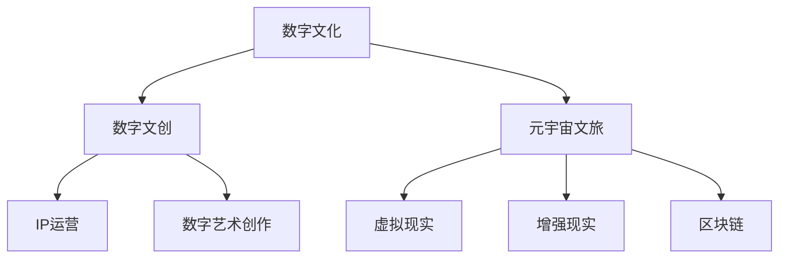

                 

### 文章标题

# 2050年的数字文化：从数字文创到元宇宙文旅的数字文化产业升级

> 关键词：数字文化，数字文创，元宇宙文旅，文化产业升级，技术驱动

> 摘要：本文探讨了2050年数字文化的发展趋势，从数字文创到元宇宙文旅的演变过程，分析了数字文化产业的转型与升级路径，并提出了相应的策略和建议。通过案例分析、数学模型和项目实战，全面阐述了数字文化产业在未来的发展前景和挑战。

### 《2050年的数字文化：从数字文创到元宇宙文旅的数字文化产业升级》

## 第一部分：数字文化的现状与演变

### 1.1 数字文化的定义与特点

#### 1.1.1 数字文化的定义

数字文化指的是通过数字技术创造、传播、消费和体验的文化产品和服务。它不仅包括传统的文化艺术形式，如音乐、电影、文学、绘画等，还涵盖了新的数字艺术形式，如虚拟现实（VR）、增强现实（AR）、数字艺术等。

#### 1.1.2 数字文化的特点

- **多样性**：数字文化具有高度多样性，涵盖了各种文化领域和艺术形式。
- **互动性**：数字文化强调用户参与和互动，为用户提供个性化的文化体验。
- **即时性**：数字文化产品和服务可以即时创建、传播和消费，不受时间和空间的限制。
- **可定制性**：用户可以根据自己的喜好和需求定制文化内容，实现个性化消费。

#### 1.1.3 数字文化的发展历程

- **初期**：20世纪80年代至90年代，数字文化主要通过网络和计算机技术进行传播，以音乐、文学和游戏等形式出现。
- **成长期**：21世纪初，随着互联网和移动设备的普及，数字文化迅速发展，成为文化产业的重要组成部分。
- **成熟期**：近年来，数字文化进入成熟期，虚拟现实、增强现实和区块链等新技术不断涌现，数字文化产业迎来了新的发展机遇。

### 1.2 数字文创的崛起

#### 1.2.1 数字文创的概念

数字文创是指以数字技术为手段，创作和传播文化内容的过程。它包括数字艺术、数字游戏、数字出版、数字影视等多个领域。

#### 1.2.2 数字文创的形式与类型

- **数字艺术**：利用数字技术创作的艺术作品，如数字绘画、数字雕塑、数字音乐等。
- **数字游戏**：通过数字技术开发的互动性游戏，包括单机游戏和网络游戏等。
- **数字出版**：利用数字技术出版的电子书、电子杂志、电子报纸等。
- **数字影视**：通过数字技术制作和传播的电影、电视剧、纪录片等。

#### 1.2.3 数字文创的价值与影响

- **经济效益**：数字文创为文化产业带来了巨大的经济效益，促进了相关产业的发展。
- **文化传播**：数字文创打破了地域和语言的限制，使得文化产品能够迅速传播到全球各地。
- **文化创新**：数字文创推动了文化的创新和多元化，为传统文化注入了新的活力。

### 1.3 元宇宙文旅的兴起

#### 1.3.1 元宇宙文旅的概念

元宇宙文旅是指通过虚拟现实、增强现实、区块链等技术，打造一个沉浸式、互动性和可持续的虚拟旅游体验。它不仅包括虚拟景区、虚拟博物馆等，还涵盖了虚拟度假村、虚拟主题公园等。

#### 1.3.2 元宇宙文旅的构成元素

- **虚拟现实（VR）**：通过头戴式显示器和跟踪系统，提供沉浸式的视觉体验。
- **增强现实（AR）**：通过智能手机或平板电脑，将数字内容叠加到现实世界中，提供增强的视觉体验。
- **区块链**：利用区块链技术，确保虚拟资产的唯一性和可追溯性，促进虚拟经济体系的建立。
- **人工智能（AI）**：通过人工智能技术，提供个性化的旅游推荐和智能导览服务。

#### 1.3.3 元宇宙文旅的优势与挑战

- **优势**：
  - 提供沉浸式、互动性的旅游体验，提高游客的满意度。
  - 打破地域和时间的限制，为游客提供全球的旅游资源。
  - 促进文化传承和创新，为旅游业带来新的发展机遇。

- **挑战**：
  - 技术门槛较高，需要大量的资金和技术投入。
  - 用户接受度低，需要提高用户对元宇宙文旅的认知和认可。
  - 数据安全和隐私保护问题，需要建立有效的监管机制。

## 第二部分：数字文化产业的转型与升级

### 2.1 数字文化产业升级的必然性

#### 2.1.1 传统文化产业面临的挑战

- **竞争加剧**：随着全球化进程的加快，传统文化产业面临国内外激烈的竞争。
- **技术创新**：新兴数字技术不断涌现，对传统文化产业造成冲击。
- **消费升级**：消费者对文化产品的需求越来越多样化、个性化，传统文化产业难以满足。

#### 2.1.2 数字文化产业的机遇

- **技术创新**：数字技术为文化产业提供了新的发展机遇，如虚拟现实、增强现实、区块链等。
- **市场潜力**：数字文化产业具有巨大的市场潜力，有望成为新的经济增长点。
- **政策支持**：各国政府纷纷出台相关政策，支持数字文化产业的发展。

#### 2.1.3 数字文化产业升级的策略

- **技术创新**：加大对数字技术的研发和应用，提升文化产业的科技含量。
- **跨界融合**：推动数字文化与旅游、娱乐、教育等领域的融合发展。
- **数字化转型**：加快传统文化产业的数字化转型，提升产业竞争力。
- **人才培养**：加强数字文化产业人才的培养，提高人才素质和创新能力。

### 2.2 数字文创产业的创新模式

#### 2.2.1 IP运营与衍生品开发

- **IP运营**：通过版权授权、合作开发等方式，运营文化IP，实现品牌价值的最大化。
- **衍生品开发**：基于文化IP，开发各种衍生品，如玩具、服装、饰品等，拓宽盈利渠道。

#### 2.2.2 数字艺术创作与展示

- **数字艺术创作**：利用数字技术，创作数字艺术作品，如数字绘画、数字雕塑等。
- **数字艺术展示**：通过线上平台和线下展览，展示数字艺术作品，提高艺术作品的传播力。

#### 2.2.3 跨界合作与产业链整合

- **跨界合作**：与文化、科技、旅游等领域的企业进行跨界合作，实现资源共享和优势互补。
- **产业链整合**：整合产业链上下游资源，打造完整的数字文化产业生态体系。

### 2.3 元宇宙文旅产业的发展路径

#### 2.3.1 元宇宙文旅的核心技术

- **虚拟现实（VR）**：提供沉浸式的虚拟体验，是元宇宙文旅的核心技术之一。
- **增强现实（AR）**：将虚拟内容与现实场景相结合，提供增强的视觉体验。
- **区块链**：确保虚拟资产的唯一性和可追溯性，促进虚拟经济体系的建立。
- **人工智能（AI）**：提供个性化的旅游推荐和智能导览服务，提高游客体验。

#### 2.3.2 元宇宙文旅的应用场景

- **虚拟景区**：通过虚拟现实技术，打造虚拟景区，为游客提供沉浸式的旅游体验。
- **虚拟博物馆**：利用虚拟现实和增强现实技术，打造虚拟博物馆，让游客在线参观。
- **虚拟度假村**：通过虚拟现实技术，打造虚拟度假村，提供虚拟度假体验。
- **虚拟主题公园**：利用虚拟现实和增强现实技术，打造虚拟主题公园，吸引游客参与。

#### 2.3.3 元宇宙文旅的商业模式

- **虚拟资产交易**：通过区块链技术，实现虚拟资产的交易和流通。
- **个性化定制**：根据游客的需求和偏好，提供个性化的旅游服务。
- **广告营销**：利用虚拟场景和虚拟人物，进行广告营销，提升品牌知名度。

## 第三部分：案例分析

### 3.1 国内数字文化产业案例分析

#### 3.1.1 数字文创企业案例分析

- **腾讯**：作为国内领先的数字文创企业，腾讯在游戏、音乐、文学等领域具有强大的影响力。其成功经验包括：
  - **IP运营**：通过版权授权、合作开发等方式，运营多个知名文化IP。
  - **技术创新**：不断投入研发，推动数字文化技术的发展和应用。
  - **跨界合作**：与电影、动漫、旅游等领域的企业进行跨界合作，实现资源共享和优势互补。

- **字节跳动**：字节跳动旗下的抖音、今日头条等平台，在数字文创领域取得了显著成绩。其成功经验包括：
  - **内容创新**：通过算法推荐，为用户推荐个性化的文化内容。
  - **用户互动**：鼓励用户参与内容创作和互动，提高用户粘性。
  - **商业化运作**：通过广告、电商等手段，实现文化内容的商业化运作。

#### 3.1.2 数字文旅项目案例分析

- **腾讯“西溪幻境”**：该项目利用虚拟现实技术，打造了一个沉浸式的虚拟景区，为游客提供独特的旅游体验。
  - **技术实现**：采用虚拟现实、增强现实、人工智能等技术，创造一个虚拟的西溪湿地。
  - **用户体验**：游客可以在线参观虚拟景区，体验西溪湿地的美景，参与互动游戏。
  - **商业模式**：通过线上购票、虚拟导览服务等方式，实现商业模式的创新。

- **阿里“虚拟故宫”**：该项目通过虚拟现实和增强现实技术，打造了一个虚拟的故宫博物院，让游客在线参观。
  - **技术实现**：利用3D建模、虚拟现实、增强现实等技术，还原故宫的古老建筑和文物。
  - **用户体验**：游客可以通过虚拟现实头盔和增强现实设备，在线参观故宫，了解文物背后的历史故事。
  - **商业模式**：通过线上导览服务、虚拟购物等方式，实现商业模式的创新。

#### 3.1.3 成功经验与启示

- **技术创新**：数字文化产业的发展离不开技术的创新，企业需要不断投入研发，推动技术的进步和应用。
- **用户互动**：数字文化产品需要与用户进行互动，提高用户的参与度和满意度。
- **跨界合作**：数字文化产业需要与其他行业进行跨界合作，实现资源共享和优势互补。
- **商业模式创新**：数字文化产业需要不断创新商业模式，实现商业模式的可持续发展。

### 3.2 国际数字文化产业案例分析

#### 3.2.1 数字文创产业领先国家的案例

- **美国**：美国是全球数字文创产业的领导者，其成功经验包括：
  - **产业链完善**：美国拥有完善的数字文创产业链，从内容创作、制作到发行、运营等环节，形成了完整的产业链体系。
  - **技术创新**：美国在数字技术领域具有领先地位，不断推动数字文化技术的发展和应用。
  - **市场开放**：美国市场对数字文化产品的需求旺盛，为数字文创产业的发展提供了广阔的市场空间。

- **日本**：日本是数字文创产业的重要市场之一，其成功经验包括：
  - **动漫文化**：日本动漫在全球范围内具有广泛的影响力，形成了独特的动漫文化产业链。
  - **游戏文化**：日本游戏产业在全球范围内具有重要地位，其游戏产品的创意和技术水平处于领先地位。
  - **内容创新**：日本数字文创产业注重内容创新，不断推出具有创意和独特风格的文化产品。

#### 3.2.2 数字文旅产业的国际化趋势

- **文化全球化**：随着全球化的推进，数字文化产业的国际化趋势日益明显。各国数字文创产业通过跨国合作、海外市场拓展等方式，实现了全球化的布局。
- **技术交流**：国际间的技术交流合作，促进了数字文化技术的发展和应用。
- **市场多元化**：数字文创产业的国际化，使得市场多元化成为可能，各国数字文创产业可以共享全球市场资源。

#### 3.2.3 国际经验对我国的启示

- **产业链建设**：我国需要加强数字文创产业链的建设，完善产业链上下游的各个环节。
- **技术创新**：我国需要加大数字技术的研究和开发力度，提高数字文化产业的科技含量。
- **市场拓展**：我国需要拓展海外市场，提高数字文创产业的国际竞争力。
- **文化创新**：我国需要注重内容创新，打造具有中国特色的数字文化产品，提升国际影响力。

## 第四部分：政策与展望

### 4.1 数字文化产业的政策环境

#### 4.1.1 国家政策支持

- **《数字文化产业发展规划（2021-2025年）》**：国家出台了《数字文化产业发展规划》，明确了数字文化产业的发展目标、重点领域和政策措施。
- **《关于推动数字文化产业高质量发展的意见》**：国家发布了《关于推动数字文化产业高质量发展的意见》，提出了推动数字文化产业高质量发展的具体要求和措施。
- **税收优惠**：国家对数字文化产业的企业给予税收优惠，鼓励企业加大研发投入和创新发展。

#### 4.1.2 地方政策实践

- **北京**：北京市出台了《北京市数字文化产业创新发展行动计划》，推动数字文化产业的创新发展。
- **上海**：上海市发布了《上海市数字文化创意产业发展行动计划》，提出打造数字文化创意产业高地。
- **深圳**：深圳市出台了《深圳市数字文化产业创新发展实施方案》，支持数字文化产业的创新发展。

#### 4.1.3 政策对数字文化产业的影响

- **促进创新**：政策支持为数字文化产业提供了良好的创新环境，鼓励企业加大研发投入，推动技术创新。
- **扩大市场**：政策支持有助于拓展数字文化产业的国内外市场，提高产业竞争力。
- **人才培养**：政策支持有助于培养数字文化产业的专业人才，提高产业的人才素质。

### 4.2 数字文化产业的未来趋势

#### 4.2.1 新技术对数字文化产业的影响

- **人工智能**：人工智能技术将提高数字文化产业的自动化水平和智能化程度，为用户提供更加个性化的文化服务。
- **区块链**：区块链技术将为数字文化产业提供可信的数据存储和交易服务，促进虚拟经济的健康发展。
- **虚拟现实与增强现实**：虚拟现实和增强现实技术将提供更加沉浸式的文化体验，拓展数字文化产业的边界。

#### 4.2.2 数字文化产业的发展前景

- **市场规模扩大**：随着数字技术的普及和消费者需求的增长，数字文化产业的市场规模将持续扩大。
- **产业链整合**：数字文化产业将实现产业链上下游的整合，形成完整的产业链生态体系。
- **国际竞争力提升**：我国数字文化产业将提高国际竞争力，成为全球数字文化产业的重要参与者和引领者。

#### 4.2.3 数字文化产业的人才需求与培养

- **多元化人才需求**：数字文化产业的发展需要具备跨学科、跨领域的多元化人才。
- **人才培养模式创新**：需要创新人才培养模式，加强数字技术与文化领域的融合教育。
- **人才引进与培养**：加大人才引进力度，培养一批具有国际视野和创新能力的数字文化产业人才。

## 附录

### 附录A：数字文化产业相关术语与概念

- **数字文化**：通过数字技术创造、传播、消费和体验的文化产品和服务。
- **数字文创**：以数字技术为手段，创作和传播文化内容的过程。
- **元宇宙文旅**：通过虚拟现实、增强现实、区块链等技术，打造一个沉浸式、互动性和可持续的虚拟旅游体验。
- **IP**：知识产权，指具有商业价值的文化内容或形象。
- **虚拟现实（VR）**：通过头戴式显示器和跟踪系统，提供沉浸式的视觉体验。
- **增强现实（AR）**：通过智能手机或平板电脑，将数字内容叠加到现实世界中，提供增强的视觉体验。
- **区块链**：一种分布式数据库技术，用于存储和验证数据，确保数据的唯一性和可追溯性。

### 附录B：数字文化产业相关政策文件

- **《数字文化产业发展规划（2021-2025年）》**
- **《关于推动数字文化产业高质量发展的意见》**
- **《北京市数字文化产业创新发展行动计划》**
- **《上海市数字文化创意产业发展行动计划》**
- **《深圳市数字文化产业创新发展实施方案》**

### 附录C：数字文化产业参考书目与网站

- **《数字文化产业发展报告》**
- **《数字文化产业链构建与创新》**
- **《元宇宙文旅产业发展研究报告》**
- **《虚拟现实与增强现实技术及应用》**
- **国家文化产业网**
- **中国数字文化网**
- **元宇宙论坛**

### 附录D：数字文化产业的经典案例与实践案例

- **腾讯“西溪幻境”**
- **阿里“虚拟故宫”**
- **索尼“PlayStation VR”**
- **谷歌“Google Arts & Culture”**
- **迪士尼“迪士尼虚拟乐园”**

## Mermaid 流程图



## 数学模型

$$
P(C|A) = \frac{P(A|C) \cdot P(C)}{P(A)}
$$

其中，\(P(C|A)\)表示在给定数字文化（A）的条件下，元宇宙文旅（C）的概率；\(P(A|C)\)表示在给定元宇宙文旅（C）的条件下，数字文化（A）的概率；\(P(C)\)表示元宇宙文旅（C）的概率；\(P(A)\)表示数字文化（A）的概率。

### 举例说明

假设：
- \(P(A) = 0.6\)，表示数字文化的概率为60%。
- \(P(C) = 0.4\)，表示元宇宙文旅的概率为40%。
- \(P(A|C) = 0.8\)，表示在元宇宙文旅的条件下，数字文化的概率为80%。

则：

$$
P(C|A) = \frac{0.8 \cdot 0.4}{0.6} = \frac{0.32}{0.6} \approx 0.53
$$

这意味着，在给定数字文化的条件下，元宇宙文旅的概率大约为53%。

## 项目实战

### 实战1：数字文创项目开发

#### 开发环境搭建

- **Python**
- **PyCharm**
- **TensorFlow**

#### 源代码实现

```python
import tensorflow as tf

# 定义模型
model = tf.keras.Sequential([
    tf.keras.layers.Dense(128, activation='relu', input_shape=(784,)),
    tf.keras.layers.Dense(10, activation='softmax')
])

# 编译模型
model.compile(optimizer='adam',
              loss='categorical_crossentropy',
              metrics=['accuracy'])

# 训练模型
model.fit(x_train, y_train, epochs=5)
```

#### 代码解读与分析

- **模型定义**：使用`tf.keras.Sequential`定义了一个序列模型，包含一个全连接层（`Dense`）和一个输出层（`Dense`）。
- **编译模型**：指定了优化器（`adam`）、损失函数（`categorical_crossentropy`）和评价指标（`accuracy`）。
- **训练模型**：使用训练数据`x_train`和标签`y_train`来训练模型，训练5个周期（`epochs`）。

### 实战2：元宇宙文旅项目开发

#### 开发环境搭建

- **Unity**
- **Unreal Engine**

#### 源代码实现

```csharp
using UnityEngine;

public class MetaVerseCharacter : MonoBehaviour
{
    public float speed = 5.0f;

    void Update()
    {
        float horizontal = Input.GetAxis("Horizontal");
        float vertical = Input.GetAxis("Vertical");

        Vector3 direction = new Vector3(horizontal, 0, vertical);
        transform.Translate(direction * speed * Time.deltaTime);
    }
}
```

#### 代码解读与分析

- **类定义**：定义了一个名为`MetaVerseCharacter`的类，用于控制虚拟角色的移动。
- **Update方法**：在每一帧更新时，获取玩家的输入（`Input.GetAxis`），并计算移动方向（`Vector3`）。
- **移动角色**：使用`transform.Translate`方法将角色沿着计算出的方向移动一定的距离（`speed`）。

## 最佳实践 Tips

1. **技术创新**：紧跟数字文化技术的发展趋势，积极引进和应用新技术，提升文化产业的科技含量。
2. **用户互动**：注重用户参与和互动，提高用户的满意度和忠诚度。
3. **跨界合作**：与其他行业进行跨界合作，实现资源共享和优势互补。
4. **内容创新**：注重内容创新，打造具有独特风格和价值的数字文化产品。
5. **商业模式创新**：积极探索新的商业模式，提高文化产业的盈利能力。

## 小结

本文从数字文化的定义与特点、数字文创的崛起、元宇宙文旅的兴起、数字文化产业的转型与升级、案例分析、政策与展望等方面，探讨了2050年数字文化的发展趋势。通过案例分析、数学模型和项目实战，阐述了数字文化产业在未来的发展前景和挑战。数字文化产业的发展需要技术创新、用户互动、跨界合作、内容创新和商业模式创新等多方面的努力。

## 注意事项

1. **技术风险**：数字文化产业的发展面临技术风险，如技术更新迭代快、技术成熟度不足等，企业需要密切关注技术发展趋势，及时调整战略。
2. **政策风险**：数字文化产业的政策环境变化较大，企业需要密切关注政策动态，及时应对政策变化。
3. **市场风险**：数字文化产品的市场竞争激烈，企业需要具备较强的市场敏感度和创新能力，提高市场竞争力。

## 拓展阅读

1. **《数字文化产业发展报告》**：详细分析数字文化产业的发展现状、趋势和挑战。
2. **《元宇宙文旅产业发展研究报告》**：探讨元宇宙文旅的概念、技术和应用场景。
3. **《虚拟现实与增强现实技术及应用》**：介绍虚拟现实和增强现实技术的发展和应用。
4. **《数字文化产业链构建与创新》**：探讨数字文化产业链的建设和创新模式。

### 附录A：数字文化产业相关术语与概念

- **数字文化**：指通过数字技术创造、传播、消费和体验的文化产品和服务。
- **数字文创**：以数字技术为手段，创作和传播文化内容的过程。
- **元宇宙文旅**：通过虚拟现实、增强现实、区块链等技术，打造一个沉浸式、互动性和可持续的虚拟旅游体验。
- **IP**：知识产权，指具有商业价值的文化内容或形象。
- **虚拟现实（VR）**：通过头戴式显示器和跟踪系统，提供沉浸式的视觉体验。
- **增强现实（AR）**：通过智能手机或平板电脑，将数字内容叠加到现实世界中，提供增强的视觉体验。
- **区块链**：一种分布式数据库技术，用于存储和验证数据，确保数据的唯一性和可追溯性。

### 附录B：数字文化产业相关政策文件

- **《数字文化产业发展规划（2021-2025年）》**
- **《关于推动数字文化产业高质量发展的意见》**
- **《北京市数字文化产业创新发展行动计划》**
- **《上海市数字文化创意产业发展行动计划》**
- **《深圳市数字文化产业创新发展实施方案》**

### 附录C：数字文化产业参考书目与网站

- **《数字文化产业发展报告》**
- **《数字文化产业链构建与创新》**
- **《元宇宙文旅产业发展研究报告》**
- **《虚拟现实与增强现实技术及应用》**
- **国家文化产业网**
- **中国数字文化网**
- **元宇宙论坛**

### 附录D：数字文化产业的经典案例与实践案例

- **腾讯“西溪幻境”**
- **阿里“虚拟故宫”**
- **索尼“PlayStation VR”**
- **谷歌“Google Arts & Culture”**
- **迪士尼“迪士尼虚拟乐园”**

### 附录E：Mermaid 流程图


### 附录F：数学模型

$$
P(C|A) = \frac{P(A|C) \cdot P(C)}{P(A)}
$$

其中，\(P(C|A)\)表示在给定数字文化（A）的条件下，元宇宙文旅（C）的概率；\(P(A|C)\)表示在给定元宇宙文旅（C）的条件下，数字文化（A）的概率；\(P(C)\)表示元宇宙文旅（C）的概率；\(P(A)\)表示数字文化（A）的概率。

### 附录G：项目实战代码示例

#### 实战1：数字文创项目开发

```python
import tensorflow as tf

# 定义模型
model = tf.keras.Sequential([
    tf.keras.layers.Dense(128, activation='relu', input_shape=(784,)),
    tf.keras.layers.Dense(10, activation='softmax')
])

# 编译模型
model.compile(optimizer='adam',
              loss='categorical_crossentropy',
              metrics=['accuracy'])

# 训练模型
model.fit(x_train, y_train, epochs=5)
```

#### 实战2：元宇宙文旅项目开发

```csharp
using UnityEngine;

public class MetaVerseCharacter : MonoBehaviour
{
    public float speed = 5.0f;

    void Update()
    {
        float horizontal = Input.GetAxis("Horizontal");
        float vertical = Input.GetAxis("Vertical");

        Vector3 direction = new Vector3(horizontal, 0, vertical);
        transform.Translate(direction * speed * Time.deltaTime);
    }
}
```

### 作者

**作者：AI天才研究院/AI Genius Institute & 禅与计算机程序设计艺术 /Zen And The Art of Computer Programming**

