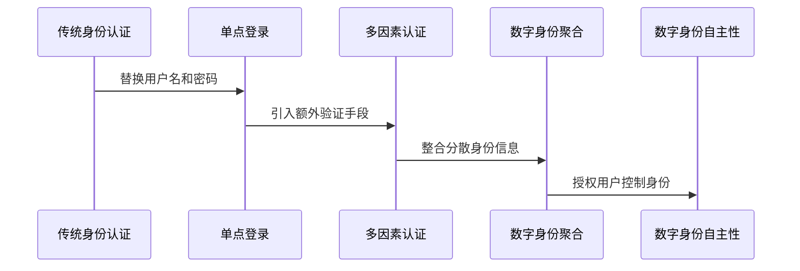

                 

### 第1章：数字身份概述

#### 1.1 数字身份的定义与分类

数字身份是指在网络空间中，个体或实体被赋予的、用于识别和区分的唯一标识。它可以理解为在虚拟世界中的“个人名片”，通过这一标识，用户可以在互联网上进行身份验证、信息交互和交易活动。

数字身份可以分为以下几类：

1. **个人数字身份**：指为个人用户创建的数字身份，通常包括姓名、出生日期、身份证号等个人信息。这类身份广泛应用于电子商务、社交媒体、在线金融服务等领域。
   
2. **企业数字身份**：指为企业用户创建的数字身份，通常包含企业名称、税务登记号、联系人信息等。企业数字身份在商务活动中扮演着重要角色，如在线签约、供应链管理、企业内部信息系统等。

3. **设备数字身份**：指为智能设备创建的数字身份，如智能手机、电脑、物联网设备等。设备数字身份用于确保网络设备的唯一性和安全性，例如在智能家居、车联网等领域中。

4. **虚拟数字身份**：指在虚拟世界或游戏中，用户为自己创建的个性化身份。虚拟数字身份可以展现出用户的兴趣、个性特征，是虚拟经济和社交互动的重要组成部分。

#### 1.2 数字身份的演进历程

数字身份的发展经历了以下几个阶段：

1. **传统身份认证阶段**：这一阶段主要依赖用户名和密码进行身份验证，虽然简单易用，但安全性较低，易受到黑客攻击。

2. **单点登录（SSO）阶段**：为了提高用户体验和安全性，单点登录技术应运而生。通过SSO，用户只需登录一次，就可以访问多个应用程序。

3. **多因素认证阶段**：多因素认证（MFA）引入了密码以外的其他验证方式，如短信验证码、生物特征识别等，显著提高了身份认证的安全性。

4. **数字身份聚合阶段**：数字身份聚合技术将分散在多个平台和系统的身份信息整合到一个统一的身份体系中，使用户在不同系统和平台之间能够无缝切换。

5. **数字身份自主性阶段**：随着技术的进步，用户开始寻求对自身数字身份的控制权，数字身份自主性逐渐成为趋势。

#### 1.3 数字身份的挑战与机遇

数字身份的发展带来了诸多挑战和机遇：

**挑战**：

1. **隐私保护**：数字身份的普及使得个人信息更容易被泄露，隐私保护成为亟待解决的问题。

2. **安全性**：随着网络攻击手段的多样化，确保数字身份的安全性变得越来越困难。

3. **标准化**：不同系统和平台之间的数字身份标准不统一，影响了数字身份的互操作性和兼容性。

4. **法律法规**：各国和地区对于数字身份的法律法规尚未完全成熟，需要进一步完善和规范。

**机遇**：

1. **数字化经济发展**：数字身份为电子商务、在线支付等数字化经济活动提供了便利和安全保障。

2. **社会治理优化**：数字身份在公共安全、医疗健康、教育等领域具有广泛的应用前景。

3. **科技创新**：数字身份技术推动了一系列新技术的研发和应用，如区块链、人工智能等。

### Mermaid 流程图

下面是数字身份演进历程的Mermaid流程图：

在下一节，我们将详细探讨数字身份聚合技术的概念和原理。请持续关注。

---

> **关键词**：数字身份、个人数字身份、企业数字身份、设备数字身份、虚拟数字身份、数字身份认证、单点登录、多因素认证、数字身份聚合、数字身份自主性。

> **摘要**：本文首先对数字身份进行了定义和分类，回顾了其演进历程，并分析了面临的挑战与机遇。下一章将深入探讨数字身份聚合技术的概念与原理。

