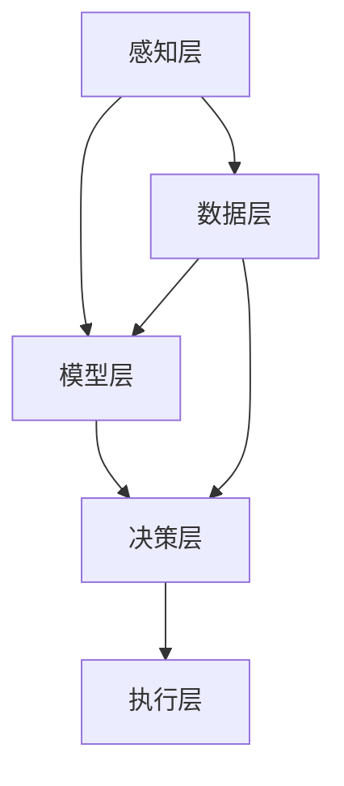
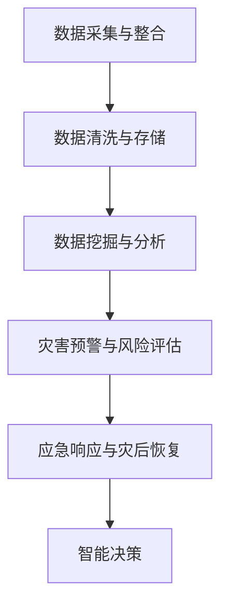

                 

### 文章标题

《2050年的灾害预防：从数字孪生到人工智能预警的灾害防控升级》

### 关键词

灾害预防、数字孪生、人工智能预警、灾害防控、可持续发展

### 摘要

本文旨在探讨2050年灾害预防领域的未来发展趋势，重点关注数字孪生和人工智能技术在灾害防控中的创新应用。通过梳理灾害预防的基础理论和现有技术进展，本文详细阐述了数字孪生技术原理及其在灾害预防中的应用，探讨了大数据在灾害预测中的关键作用，并深入分析了人工智能在灾害预警、损失评估以及实践案例中的应用。最后，本文从政策法规、公众参与和可持续发展角度提出了未来灾害预防的对策与建议，为构建更加智能化的灾害预防体系提供了有益的参考。### 《2050年的灾害预防：从数字孪生到人工智能预警的灾害防控升级》目录大纲

## 第一部分：灾害预防基础理论

### 第1章：灾害预防概述

#### 1.1 灾害预防的定义与重要性

#### 1.2 现代灾害预防的技术进展

#### 1.3 灾害预防的主要策略与方法

### 第2章：数字孪生技术原理及应用

#### 2.1 数字孪生技术的概念

#### 2.2 数字孪生技术的架构

#### 2.3 数字孪生技术在灾害预防中的应用

### 第3章：大数据与灾害预测

#### 3.1 大数据在灾害预防中的作用

#### 3.2 大数据的采集与处理

#### 3.3 大数据在灾害预测中的应用

## 第二部分：人工智能在灾害预防中的应用

### 第4章：人工智能基础理论

#### 4.1 人工智能的定义与发展历程

#### 4.2 人工智能的主要算法与模型

#### 4.3 人工智能在灾害预防中的应用前景

### 第5章：人工智能在灾害预警中的应用

#### 5.1 人工智能在地震预警中的应用

#### 5.2 人工智能在洪水预警中的应用

#### 5.3 人工智能在山火预警中的应用

### 第6章：人工智能在灾害损失评估中的应用

#### 6.1 人工智能在灾害损失评估中的作用

#### 6.2 人工智能在灾害损失评估中的应用案例

#### 6.3 人工智能在灾害损失评估中的挑战与未来发展方向

## 第三部分：灾害预防实践案例

### 第7章：数字孪生与人工智能在灾害预防中的综合应用

#### 7.1 数字孪生与人工智能在灾害预防中的协同作用

#### 7.2 数字孪生与人工智能在具体灾害预防中的应用案例

#### 7.3 数字孪生与人工智能在灾害预防中的未来发展趋势

### 第8章：灾害预防政策与法规

#### 8.1 灾害预防的政策框架

#### 8.2 灾害预防的法律法规体系

#### 8.3 灾害预防政策与法规的实施与效果评估

### 第9章：灾害预防教育与公众参与

#### 9.1 灾害预防教育的重要性

#### 9.2 灾害预防教育的内容与形式

#### 9.3 公众参与灾害预防的策略与措施

### 第10章：灾害预防的可持续发展

#### 10.1 灾害预防与可持续发展的关系

#### 10.2 灾害预防中的可持续发展原则

#### 10.3 灾害预防的可持续发展策略与案例

## 附录

### 附录A：数字孪生与人工智能相关技术资源

#### A.1 数字孪生技术资源

#### A.2 人工智能技术资源

#### A.3 灾害预防相关数据库与工具### 第一部分：灾害预防基础理论

#### 第1章：灾害预防概述

##### 1.1 灾害预防的定义与重要性

灾害预防是指通过科学技术手段、管理措施和法律法规等手段，对可能发生的自然灾害进行预警、防范和减轻灾害损失的过程。随着全球气候变化和人口增长，自然灾害的频率和破坏力呈现上升趋势，灾害预防的重要性日益凸显。

灾害预防的定义可以从以下几个方面理解：

1. **预防为主**：灾害预防强调在灾害发生之前采取预防措施，减少灾害发生的概率和损失程度。
2. **科学手段**：灾害预防依赖于气象、地质、水文等科学领域的知识和技术，通过数据监测、模型预测等手段提高灾害预警的准确性。
3. **管理措施**：灾害预防需要政府、社会组织和公众共同参与，通过法律法规、政策措施等手段推动灾害预防工作的落实。
4. **减轻损失**：灾害预防的目的是最大限度地减少灾害造成的人员伤亡和财产损失。

灾害预防的重要性体现在以下几个方面：

1. **保障人民生命安全**：灾害预防能够提前预警，为人们提供撤离、避险等生存机会，减少人员伤亡。
2. **保护财产安全**：通过灾害预防，可以降低灾害对建筑物、基础设施、农田等财产的破坏，减少经济损失。
3. **维护社会稳定**：灾害预防有助于减少灾害发生后的社会混乱，保障社会秩序。
4. **推动可持续发展**：灾害预防是可持续发展的重要组成部分，有助于实现经济、社会和环境的协调发展。

##### 1.2 现代灾害预防的技术进展

现代灾害预防技术的发展经历了从传统方法到现代科学技术的转变。以下是一些重要的技术进展：

1. **监测技术**：气象卫星、地震台网、雷达等监测设备的广泛应用，提高了对自然灾害的实时监测能力。
2. **预警系统**：基于监测数据的预警系统能够快速、准确地预测灾害发生的时间和地点，为防灾减灾提供科学依据。
3. **模拟与预测**：利用计算机模拟和数学模型，可以对灾害的潜在影响进行预测，为制定应对策略提供参考。
4. **通信技术**：现代通信技术使得预警信息能够快速传递到各级政府和公众，提高了灾害响应效率。
5. **灾害损失评估**：通过遥感技术和地理信息系统，可以对灾害造成的人员伤亡和财产损失进行准确评估。

##### 1.3 灾害预防的主要策略与方法

灾害预防的策略和方法多种多样，以下是一些常见的方法：

1. **风险评估**：通过分析灾害发生的概率和潜在影响，评估灾害风险，为制定预防措施提供依据。
2. **预警与响应**：建立完善的预警系统，及时发布灾害预警信息，指导公众采取避险措施。
3. **工程防护**：通过建造堤坝、防波堤、地下通道等工程设施，保护人口密集区和关键基础设施。
4. **非工程防护**：通过法律法规、政策措施等手段，规范土地利用、城市规划等，减少灾害风险。
5. **紧急救援**：建立紧急救援体系，确保在灾害发生时能够迅速开展救援行动，减轻灾害损失。

总之，现代灾害预防技术在监测、预警、模拟、评估等方面取得了显著进展，为减少灾害损失提供了有力支持。然而，面对不断变化的自然灾害形势，灾害预防仍需不断创新和发展，以应对未来可能出现的挑战。在本章后续内容中，我们将进一步探讨数字孪生技术、大数据和人工智能在灾害预防中的应用，以期为构建更加智能化的灾害预防体系提供新的思路。#### 第2章：数字孪生技术原理及应用

##### 2.1 数字孪生技术的概念

数字孪生（Digital Twin）是一种将物理实体与数字模型紧密结合的技术，通过实时采集和分析物理实体的数据，创建出一个数字镜像，以实现对物理实体的仿真、监测、控制和优化。数字孪生技术最早由迈克尔·格里夫斯（Michael Grieves）在2002年提出，近年来随着传感器技术、大数据和人工智能等技术的发展，数字孪生技术逐渐成为学术界和工业界研究的热点。

数字孪生的核心概念可以概括为以下几个方面：

1. **物理实体与数字模型**：数字孪生技术将物理实体（如建筑物、设备、车辆等）与数字模型进行映射，形成一个高度一致的数字镜像。
2. **实时数据采集**：通过传感器、摄像头等设备，实时采集物理实体的运行数据，如温度、湿度、振动等。
3. **数据传输**：将采集到的数据传输到云端或数据中心，进行存储和分析。
4. **仿真与监测**：利用数字模型对物理实体的运行状态进行仿真，实现对物理实体的实时监测和故障预测。
5. **控制与优化**：根据数字模型和实时数据分析结果，对物理实体进行控制和优化，提高其运行效率和可靠性。

##### 2.2 数字孪生技术的架构

数字孪生技术的架构通常包括以下几个方面：

1. **感知层**：感知层是数字孪生技术的最底层，通过传感器、摄像头等设备实时采集物理实体的运行数据。
2. **数据层**：数据层负责数据的存储、管理和共享，通常采用分布式数据库、云计算等技术。
3. **模型层**：模型层包括数字模型和算法，用于对物理实体的仿真、监测和预测。
4. **决策层**：决策层根据模型层和实时数据分析结果，制定控制策略和优化方案。
5. **执行层**：执行层负责将决策层的控制策略和优化方案应用到物理实体上，实现对物理实体的控制和优化。

以下是一个简单的数字孪生技术架构图：



##### 2.3 数字孪生技术在灾害预防中的应用

数字孪生技术在灾害预防中具有广泛的应用前景，可以通过以下几种方式提高灾害预防的能力：

1. **灾害监测与预警**：通过数字孪生技术，可以实时监测物理实体（如建筑物、道路、桥梁等）的运行状态，当检测到异常情况时，及时发出预警信号，为灾害预防提供有力支持。
   
   以下是一个简单的灾害监测与预警流程：

   ```mermaid
   graph TB
   A[传感器数据采集] --> B[数据传输与存储]
   B --> C[数据预处理]
   C --> D[模型训练与预测]
   D --> E[异常检测与预警]
   E --> F[预警信号发布]
   ```

2. **灾害模拟与预测**：利用数字孪生技术，可以创建一个与物理实体高度一致的数字模型，通过模拟不同灾害场景，预测灾害可能造成的损失，为灾害预防决策提供科学依据。

   以下是一个简单的灾害模拟与预测流程：

   ```mermaid
   graph TB
   A[数字孪生模型创建] --> B[场景模拟]
   B --> C[灾害损失预测]
   C --> D[决策支持]
   ```

3. **灾害损失评估**：在灾害发生后，利用数字孪生技术可以快速评估灾害造成的损失，为灾后重建提供数据支持。

   以下是一个简单的灾害损失评估流程：

   ```mermaid
   graph TB
   A[数字孪生模型调用] --> B[灾害损失评估]
   B --> C[数据可视化与报告]
   ```

4. **灾害预防策略优化**：通过数字孪生技术，可以实时监测灾害预防设施（如防洪堤、地震预警系统等）的运行状态，优化预防策略，提高预防效果。

   以下是一个简单的灾害预防策略优化流程：

   ```mermaid
   graph TB
   A[数字孪生模型创建] --> B[预防设施监测]
   B --> C[策略优化]
   C --> D[执行层]
   ```

综上所述，数字孪生技术在灾害预防中具有重要作用，通过实时监测、模拟预测、损失评估和策略优化等方面，可以提高灾害预防的能力和效率，为构建智能化的灾害预防体系提供有力支持。在后续章节中，我们将进一步探讨大数据和人工智能在灾害预防中的应用，以期为构建更加完善的灾害预防体系提供新的思路。#### 第3章：大数据与灾害预测

##### 3.1 大数据在灾害预防中的作用

大数据在灾害预防中扮演着至关重要的角色。随着全球气候变化和人类活动的影响，自然灾害的发生频率和破坏力不断上升，对灾害预防提出了更高的要求。大数据技术的快速发展为灾害预测提供了新的手段和方法，使得我们可以从海量数据中挖掘有价值的信息，提高灾害预警的准确性和时效性。

大数据在灾害预防中的作用主要体现在以下几个方面：

1. **数据采集与整合**：自然灾害的发生和发展是一个复杂的过程，涉及多种因素，如气象、地质、水文等。通过大数据技术，可以整合来自不同来源的数据，如气象卫星、地震台网、水文监测站等，形成全面、系统的数据集。

2. **实时监测与分析**：大数据技术具有高吞吐量和实时处理能力，可以实时监测自然灾害的发展态势，对异常情况及时进行分析和处理，提高预警的准确性和时效性。

3. **趋势预测与风险评估**：通过对历史灾害数据的分析和挖掘，可以识别灾害发生的规律和趋势，预测未来灾害的风险等级和发生概率，为政府和公众提供科学的决策依据。

4. **资源调度与优化**：大数据技术可以帮助政府和相关部门在灾害发生前进行资源调度和优化，如预警信息发布、应急救援队伍部署、物资储备等，提高灾害响应能力。

##### 3.2 大数据的采集与处理

大数据的采集和处理是灾害预测的基础。以下是一些关键步骤：

1. **数据源选择**：根据灾害预测的需求，选择合适的数据源，如气象数据、地震数据、水文数据等。数据源的选择直接影响灾害预测的准确性和可靠性。

2. **数据采集**：通过传感器、卫星遥感、无人机等设备，实时采集灾害相关数据。数据采集过程中需要注意数据的准确性和完整性。

3. **数据清洗**：原始数据通常存在噪声、缺失值等问题，需要进行数据清洗，去除无效数据和错误数据，保证数据的准确性和一致性。

4. **数据整合**：将来自不同来源的数据进行整合，形成一个完整、系统的数据集。数据整合过程中需要注意数据的兼容性和一致性。

5. **数据存储**：采用分布式存储技术，如Hadoop、Spark等，存储和管理海量数据。数据存储需要考虑数据的可扩展性、安全性和可靠性。

6. **数据挖掘与分析**：利用数据挖掘和机器学习技术，从海量数据中挖掘有价值的信息，如灾害发生的规律、趋势等。

##### 3.3 大数据在灾害预测中的应用

大数据在灾害预测中的应用包括以下几个方面：

1. **灾害预警**：通过实时监测和分析大数据，可以提前发现灾害的征兆，发布预警信息，为公众提供足够的准备时间。

2. **风险评估**：利用大数据分析技术，对各种自然灾害的风险进行评估，确定风险等级和可能的影响范围，为制定防灾减灾措施提供依据。

3. **应急响应**：在大数据的支持下，政府和相关部门可以更好地协调应急资源，如救援队伍、物资等，提高应急响应的效率和效果。

4. **灾后恢复**：通过大数据分析，可以评估灾害造成的损失，为灾后重建提供科学依据，制定合理的恢复计划。

5. **智能决策**：大数据分析结果可以帮助政府和相关部门做出更加科学的决策，如城市规划、土地利用等，减少灾害风险。

以下是一个简单的灾害预测应用流程：



总之，大数据技术在灾害预测中具有重要作用，通过数据采集、处理和分析，可以显著提高灾害预警的准确性和时效性，为防灾减灾提供有力支持。在未来的灾害预防工作中，大数据技术将继续发挥重要作用，为构建更加智能化的灾害预防体系提供新的思路。在后续章节中，我们将进一步探讨人工智能在灾害预警、损失评估和实际应用中的创新应用。### 第二部分：人工智能在灾害预防中的应用

#### 第4章：人工智能基础理论

##### 4.1 人工智能的定义与发展历程

人工智能（Artificial Intelligence，AI）是指通过计算机模拟人类智能行为的技术和科学。它旨在使计算机具备感知、学习、推理、决策和行动的能力，从而实现自动化和智能化。人工智能的定义可以从以下几个方面理解：

1. **感知**：人工智能系统可以通过各种传感器（如摄像头、麦克风、传感器等）感知外界环境，获取视觉、听觉、触觉等信息。
2. **学习**：人工智能系统可以通过数据和算法不断学习和优化自身性能，提高处理复杂问题的能力。
3. **推理**：人工智能系统能够根据已知信息和逻辑规则进行推理，推导出新的结论或解决方案。
4. **决策**：人工智能系统能够在不确定的环境中做出合理决策，选择最优行动方案。
5. **行动**：人工智能系统可以通过执行机构（如机器人、无人机等）将决策转化为实际行动。

人工智能的发展历程可以分为以下几个阶段：

1. **早期探索（1950s-1960s）**：人工智能的概念首次由艾伦·图灵提出，这一时期主要是理论研究和基础算法的开发。
2. **兴起与高潮（1970s-1980s）**：人工智能开始应用于实际领域，如专家系统、机器人等。这一时期出现了许多重要的算法和理论成果。
3. **低谷与复兴（1990s-2000s）**：由于计算能力和数据资源的限制，人工智能发展进入低谷。但随着计算机技术和大数据技术的发展，人工智能在21世纪初迎来新一轮的复兴。
4. **深度学习时代（2010s-至今）**：以深度学习为代表的先进算法取得了突破性进展，人工智能在语音识别、图像识别、自然语言处理等领域取得了显著成果。

##### 4.2 人工智能的主要算法与模型

人工智能的主要算法和模型可以分为以下几类：

1. **监督学习（Supervised Learning）**：监督学习是一种最常见的机器学习方法，它通过已知的输入和输出数据，训练出一个模型，用于预测新的输入数据。常见的监督学习算法包括线性回归、逻辑回归、支持向量机（SVM）等。

2. **无监督学习（Unsupervised Learning）**：无监督学习不需要已知的输出数据，它通过分析输入数据的内在结构，如聚类、降维等。常见的无监督学习算法包括K-均值聚类、主成分分析（PCA）等。

3. **强化学习（Reinforcement Learning）**：强化学习是一种基于奖励机制的机器学习方法，它通过尝试不同的行动，学习如何在特定环境中获得最大的奖励。常见的强化学习算法包括Q-学习、深度Q网络（DQN）等。

4. **深度学习（Deep Learning）**：深度学习是一种基于多层神经网络的学习方法，它可以自动从大量数据中学习特征和模式。常见的深度学习模型包括卷积神经网络（CNN）、循环神经网络（RNN）、生成对抗网络（GAN）等。

以下是一个简单的监督学习算法——线性回归的伪代码：

```python
# 输入：训练数据集 X, Y
# 输出：模型参数 w

# 初始化模型参数
w = np.random.randn(n)

# 设定迭代次数
num_iterations = 1000

# 设置学习率
learning_rate = 0.1

# 梯度下降
for i in range(num_iterations):
  # 计算预测值
  y_pred = X.dot(w)
  
  # 计算损失函数
  loss = 0.5 * np.linalg.norm(y - y_pred)**2
  
  # 计算梯度
  gradient = X.T.dot(y - y_pred)
  
  # 更新参数
  w -= learning_rate * gradient
```

##### 4.3 人工智能在灾害预防中的应用前景

人工智能在灾害预防中具有广泛的应用前景，可以在以下几个方面发挥重要作用：

1. **灾害预警**：人工智能可以通过分析历史灾害数据、气象数据、地质数据等，预测灾害的发生概率和影响范围，为政府和公众提供预警信息。

2. **灾害损失评估**：人工智能可以快速评估灾害造成的损失，为灾后重建提供数据支持，提高救援和恢复工作的效率。

3. **智能监测与监控**：人工智能可以实时监测灾害相关设施（如防洪堤、地震预警系统等）的运行状态，及时发现异常情况，提高灾害预防的能力。

4. **灾后重建与规划**：人工智能可以基于大数据分析和预测，为灾后重建和城市规划提供科学依据，减少灾害风险。

5. **应急响应与救援**：人工智能可以协助政府和救援机构进行应急响应和救援工作，提高救援效率和效果。

总之，人工智能在灾害预防中具有巨大的潜力，通过不断研究和应用，可以为构建更加智能化的灾害预防体系提供有力支持。在后续章节中，我们将进一步探讨人工智能在灾害预警、损失评估和实际应用中的创新应用。通过结合数字孪生技术、大数据等手段，有望构建一个更加高效、智能的灾害预防体系，为人类社会的可持续发展保驾护航。#### 第5章：人工智能在灾害预警中的应用

##### 5.1 人工智能在地震预警中的应用

地震预警是利用地震波传播的特性，在地震波到达地面之前提前发出警报，为公众和救援机构提供宝贵的避险时间。人工智能技术在地震预警中的应用，极大地提升了预警的准确性和时效性。

**地震预警的基本原理**：

1. **地震波传播**：地震发生时，会产生纵波（P波）和横波（S波）。P波速度较快，S波速度较慢，且两种波在固体、液体和气体中的传播速度不同。
2. **多地点监测**：在地震发生时，地震波会从震源向外传播，经过不同的路径到达多个监测站。通过比较多个监测站的到达时间，可以估算出震源的位置和地震波的速度。
3. **预警算法**：利用人工智能算法，对监测数据进行分析和处理，预测地震波到达地面时间，并发出预警信号。

**人工智能在地震预警中的应用**：

1. **数据预处理**：使用人工智能算法对原始地震数据进行清洗、去噪和特征提取，为后续分析提供高质量的数据。
2. **实时监测与预测**：利用深度学习算法，对实时监测到的地震数据进行快速处理，预测地震波到达时间，并判断是否触发预警条件。
3. **误差校正**：利用历史地震数据，通过机器学习算法对预警系统进行训练和优化，提高预警的准确性和可靠性。

以下是一个简单的地震预警算法伪代码：

```python
# 输入：地震监测数据 X，历史地震数据 Y
# 输出：预警信号

# 数据预处理
X_processed = preprocess_data(X)

# 特征提取
features = extract_features(X_processed)

# 训练模型
model = train_model(features, Y)

# 实时预测
prediction = model.predict(realtime_data)

# 判断预警条件
if prediction > threshold:
  send_alert()
else:
  no_alert()
```

**案例研究**：

以日本为例，日本地震预警系统“地震速报”是全球最先进的地震预警系统之一。该系统利用人工智能算法对地震数据进行实时处理，能够在地震波到达地面之前几秒到几十秒发出预警信号。自2016年启用以来，日本地震预警系统已经成功避免了多起灾难性事故，挽救了无数生命。

**挑战与未来方向**：

1. **算法优化**：提高预警算法的准确性和实时性，减少误报和漏报现象。
2. **多传感器融合**：利用多种传感器（如地震仪、加速度计、GPS等）的数据，提高预警系统的精度和可靠性。
3. **国际合作**：加强国际合作，共享地震监测数据和预警经验，提高全球地震预警能力。

##### 5.2 人工智能在洪水预警中的应用

洪水是世界上最常见、最具破坏力的自然灾害之一。洪水预警的目的是提前预测洪水发生的时间和地点，为防洪措施的实施和公众的避险提供时间。

**洪水预警的基本原理**：

1. **气象预报**：利用气象预报模型，预测未来几天的降雨量和降雨分布。
2. **水文模型**：基于地形、土壤、流域特性等参数，建立洪水传播和演化的水文模型。
3. **预警算法**：利用人工智能算法，对气象预报和水文模型的结果进行综合分析，预测洪水发生的时间和地点。

**人工智能在洪水预警中的应用**：

1. **数据整合**：整合气象、水文、地质等多源数据，为洪水预警提供全面的数据支持。
2. **实时监测**：利用人工智能算法，实时监测降雨、水位等关键指标，预测洪水发展趋势。
3. **预警信号发布**：当预测到洪水可能发生时，及时发布预警信号，提醒相关部门和公众采取防范措施。

以下是一个简单的洪水预警算法伪代码：

```python
# 输入：气象预报数据 X，水文模型参数 Y
# 输出：预警信号

# 数据整合
data = integrate_data(X, Y)

# 实时监测
current_state = monitor_realtime_data()

# 模型预测
prediction = hydrological_model.predict(current_state)

# 判断预警条件
if prediction > threshold:
  send_alert()
else:
  no_alert()
```

**案例研究**：

中国西南地区的洪水预警系统是一个典型的应用实例。该系统利用人工智能技术，整合了气象、水文、地质等多源数据，实现了对洪水发生的前期预警。通过实时监测和数据分析，系统可以在洪水来临前数小时发出预警，为防洪措施的实施提供了充足的时间。

**挑战与未来方向**：

1. **模型准确性**：提高水文模型的准确性，减少预测误差。
2. **数据质量**：确保数据源的多样性和数据质量，提高预警的可靠性和准确性。
3. **用户接受度**：提高公众对洪水预警系统的认知和接受度，增强预警信息的传播和效果。

##### 5.3 人工智能在山火预警中的应用

山火是另一种常见的自然灾害，具有破坏性强、防控困难等特点。山火预警的目的是提前预测山火的发生，为预防和扑救提供决策支持。

**山火预警的基本原理**：

1. **气象条件分析**：分析气象数据，如气温、湿度、风速等，预测山火发生的可能性。
2. **植被监测**：利用遥感技术和植被指数，监测植被的干燥程度，识别潜在的山火风险区域。
3. **预警算法**：利用人工智能算法，综合分析气象和植被数据，预测山火发生的地点和时间。

**人工智能在山火预警中的应用**：

1. **多源数据融合**：整合气象、遥感、地理信息系统等多源数据，为山火预警提供全面的信息支持。
2. **实时监测**：利用人工智能算法，实时监测气象和植被数据，预测山火的发展趋势。
3. **预警信号发布**：当预测到山火可能发生时，及时发布预警信号，提醒相关部门和公众采取防范措施。

以下是一个简单的山火预警算法伪代码：

```python
# 输入：气象数据 X，植被指数 Y
# 输出：预警信号

# 数据融合
data = integrate_data(X, Y)

# 实时监测
current_state = monitor_realtime_data()

# 模型预测
fire_prediction = fire_model.predict(current_state)

# 判断预警条件
if fire_prediction > threshold:
  send_alert()
else:
  no_alert()
```

**案例研究**：

美国加州的山火预警系统是一个成功的应用实例。该系统利用人工智能技术，整合了气象、遥感、地理信息系统等多源数据，实现了对山火发生的早期预警。通过实时监测和数据分析，系统可以在山火发生前数小时发出预警，为防火和扑救工作提供了重要的决策支持。

**挑战与未来方向**：

1. **数据质量**：提高气象、遥感等数据的精度和质量，减少预测误差。
2. **实时性**：提高预警系统的实时性，减少预警信号的响应时间。
3. **用户参与**：提高公众对山火预警系统的认知和参与度，增强预警信息的传播和效果。

总之，人工智能技术在灾害预警中的应用，显著提高了预警的准确性和时效性，为防灾减灾工作提供了有力支持。通过不断研究和实践，未来人工智能技术在灾害预警领域将发挥更大的作用，为人类社会的安全和发展保驾护航。在下一章中，我们将探讨人工智能在灾害损失评估中的应用。通过结合灾害预警技术和损失评估模型，有望构建一个更加全面、高效的灾害防控体系。#### 第6章：人工智能在灾害损失评估中的应用

##### 6.1 人工智能在灾害损失评估中的作用

灾害损失评估是灾害管理的重要环节，它旨在准确评估灾害对生命、财产和环境的影响，为灾后重建和风险管理提供科学依据。传统灾害损失评估方法主要依赖于现场调查和数据收集，存在耗时、耗力且易受主观因素影响的问题。而人工智能技术的引入，为灾害损失评估带来了新的机遇和挑战。

**人工智能在灾害损失评估中的作用主要表现在以下几个方面**：

1. **高效数据处理**：人工智能技术能够快速处理大量数据，包括遥感影像、地理信息系统（GIS）数据、现场照片等，实现对灾害损失的精确评估。
   
2. **自动化分析**：通过深度学习和计算机视觉等技术，人工智能可以自动化识别和分析灾害场景中的关键信息，如建筑破坏、道路损毁等。

3. **实时更新**：人工智能系统能够实时更新数据，根据灾害发展情况动态调整评估结果，提高灾害损失评估的时效性。

4. **风险评估**：利用大数据分析和机器学习算法，人工智能可以预测灾害可能带来的长期影响，为未来的灾害预防提供决策支持。

**灾害损失评估的基本步骤**：

1. **数据收集**：通过遥感技术、无人机、现场调查等方式收集灾害区域的影像和地理信息数据。

2. **数据预处理**：对收集的数据进行清洗、去噪和格式转换，确保数据的准确性和一致性。

3. **特征提取**：利用计算机视觉和图像处理技术，从图像中提取与灾害损失相关的特征信息，如建筑损坏程度、道路损坏情况等。

4. **模型训练**：利用机器学习和深度学习算法，对提取的特征进行训练，建立灾害损失评估模型。

5. **评估预测**：将新的数据输入到训练好的模型中，预测灾害造成的损失。

6. **结果验证与优化**：通过现场调查或历史数据验证模型的准确性，对模型进行优化和调整。

##### 6.2 人工智能在灾害损失评估中的应用案例

**案例一：地震灾害损失评估**

在某次地震灾害中，利用人工智能技术对受灾区域的损失进行了快速评估。首先，通过遥感影像提取地震造成的地表变化特征，如建筑物变形、道路断裂等。然后，利用深度学习算法，将提取的特征与历史地震损失数据进行训练，建立地震损失评估模型。在评估过程中，模型能够自动识别和分类不同类型的建筑和道路损坏，并预测每个区域的经济损失。通过这一案例，人工智能技术成功实现了对地震灾害损失的高效、准确评估。

**伪代码示例**：

```python
# 输入：地震影像数据 X，历史地震损失数据 Y
# 输出：损失评估结果

# 数据预处理
X_processed = preprocess_data(X)

# 特征提取
features = extract_features(X_processed)

# 训练模型
model = train_model(features, Y)

# 损失评估
loss_estimate = model.predict(new_data)

# 结果验证与优化
evaluate_and_optimize(model, validation_data)
```

**案例二：台风灾害损失评估**

在某次台风袭击后，利用人工智能技术对沿海城市的损失进行了评估。首先，通过无人机收集台风过境后的高清影像，利用计算机视觉技术提取影像中的关键信息，如建筑损毁、道路积水等。然后，利用大数据分析技术，将这些信息与气象数据和受灾前后的经济数据进行关联，建立台风损失评估模型。评估结果显示，人工智能技术在台风灾害损失评估中具有高度的准确性和实时性。

**伪代码示例**：

```python
# 输入：无人机影像数据 X，气象数据 Y，经济数据 Z
# 输出：损失评估结果

# 数据预处理
X_processed = preprocess_data(X)
Y_processed = preprocess_data(Y)
Z_processed = preprocess_data(Z)

# 特征提取
features = extract_features(X_processed)
weather_features = extract_features(Y_processed)
economic_features = extract_features(Z_processed)

# 数据整合
integrated_data = integrate_data(features, weather_features, economic_features)

# 训练模型
model = train_model(integrated_data)

# 损失评估
loss_estimate = model.predict(new_data)

# 结果验证与优化
evaluate_and_optimize(model, validation_data)
```

##### 6.3 人工智能在灾害损失评估中的挑战与未来发展方向

**挑战**：

1. **数据质量问题**：灾害损失评估依赖于高质量的数据，但实际获取的数据可能存在不完整、不准确、噪声大等问题，影响评估结果的准确性。

2. **模型泛化能力**：灾害损失评估模型需要具备较强的泛化能力，以适应不同地区、不同类型灾害的评估需求。

3. **实时性要求**：灾害发生后的损失评估需要快速、准确地提供结果，以支持紧急救援和灾后重建。

4. **法律法规与伦理问题**：在利用人工智能技术进行灾害损失评估时，需要遵守相关法律法规，保护个人隐私和信息安全。

**未来发展方向**：

1. **数据整合与处理**：通过大数据技术和云计算平台，实现多源数据的整合和处理，提高数据质量和评估效率。

2. **算法优化与创新**：研究和发展新型机器学习和深度学习算法，提高灾害损失评估模型的准确性和实时性。

3. **跨学科合作**：促进人工智能与地理学、灾害学、经济学等学科的交叉研究，提高灾害损失评估的科学性和实用性。

4. **法律法规完善**：完善相关法律法规，规范人工智能在灾害损失评估中的应用，保护公众隐私和信息安全。

总之，人工智能技术在灾害损失评估中的应用具有巨大的潜力，通过不断的技术创新和跨学科合作，有望实现更加高效、准确和智能化的灾害损失评估，为防灾减灾和灾后重建提供有力支持。在下一章中，我们将探讨数字孪生与人工智能在灾害预防中的综合应用，进一步探讨如何通过技术整合提高灾害防控的能力。### 第三部分：灾害预防实践案例

#### 第7章：数字孪生与人工智能在灾害预防中的综合应用

##### 7.1 数字孪生与人工智能在灾害预防中的协同作用

数字孪生与人工智能技术在灾害预防中具有协同作用，通过结合两者的优势，可以实现灾害预测、预警和应急响应的全方位提升。数字孪生技术提供了对物理实体的高度模拟，而人工智能技术则通过对大量数据的分析处理，提供了智能化的决策支持。以下为数字孪生与人工智能在灾害预防中协同作用的几个关键点：

1. **数据驱动模拟**：数字孪生技术通过实时数据采集和反馈，为人工智能提供了丰富、动态的输入数据。这些数据包括气象参数、地质结构、水文状况等，为人工智能算法提供了精确的模拟基础。

2. **智能决策支持**：人工智能技术利用数字孪生生成的模拟数据，通过机器学习算法进行分析，预测灾害发生的可能性和潜在影响，为决策者提供科学的决策依据。

3. **实时预警与响应**：数字孪生与人工智能的协同工作，使得灾害预警系统能够实时监测和预测灾害发展，并快速响应，提高应急响应的效率和准确性。

4. **优化资源调度**：通过数字孪生模拟和人工智能分析，可以优化灾害预防资源的调度和分配，如物资储备、救援队伍部署等，提高防灾减灾的整体效能。

##### 7.2 数字孪生与人工智能在具体灾害预防中的应用案例

**案例一：地震灾害预防**

在某地区，利用数字孪生与人工智能技术构建了一个综合的地震灾害预防系统。首先，通过数字孪生技术，建立了该地区的地震数字模型，实时监测地震波传播路径和地表变形。人工智能算法则根据实时数据和模拟结果，预测地震的发生概率和潜在影响范围。在地震预警信号发出后，系统能够自动调度应急救援资源，如医疗物资、救援队伍等，为灾后救援提供有力支持。

**伪代码示例**：

```python
# 输入：数字孪生模型数据 X，地震预警信号 Y
# 输出：应急资源调度方案

# 数据采集与整合
X_processed = preprocess_data(X)

# 预测地震影响
impact_prediction = seismic_model.predict(X_processed)

# 根据预警信号调度资源
if alert_status == 'activated':
  dispatch_resources(impact_prediction)
else:
  no_dispatch()
```

**案例二：洪水灾害预防**

在某个流域，利用数字孪生与人工智能技术建立了洪水预警和应急响应系统。数字孪生技术实时监测水位、降雨量等水文数据，人工智能算法则根据这些数据预测洪水发生的时间和地点。当系统检测到洪水风险时，自动启动预警机制，并向相关部门和公众发送预警信息。同时，系统还会根据预测结果，自动优化防洪设施的开启和关闭，提高防洪效果。

**伪代码示例**：

```python
# 输入：数字孪生模型数据 X，洪水预警信号 Y
# 输出：防洪设施控制策略

# 数据采集与整合
X_processed = preprocess_data(X)

# 洪水预测
flood_prediction = flood_model.predict(X_processed)

# 防洪设施控制
if flood_prediction > threshold:
  activate_flood_defenses()
else:
  deactivate_flood_defenses()
```

**案例三：山火灾害预防**

在某山区，数字孪生与人工智能技术被用于山火预防与应急响应。数字孪生技术模拟了该地区的植被覆盖、气象条件等，实时监测山火的潜在风险。人工智能算法则根据这些数据，预测山火的发生趋势和可能扩散路径。当系统检测到山火风险时，自动启动预警和扑救方案，如派遣消防队伍、启动灭火设备等。

**伪代码示例**：

```python
# 输入：数字孪生模型数据 X，山火预警信号 Y
# 输出：扑救与应急响应方案

# 数据采集与整合
X_processed = preprocess_data(X)

# 山火预测
fire_prediction = fire_model.predict(X_processed)

# 应急响应
if fire_prediction > threshold:
  initiate_fire_fighting_measures()
else:
  no_response_required()
```

##### 7.3 数字孪生与人工智能在灾害预防中的未来发展趋势

随着数字孪生和人工智能技术的不断发展，其在灾害预防中的应用前景将更加广阔，未来的发展趋势包括：

1. **更精细化的模拟**：未来的数字孪生技术将能够更加精确地模拟物理实体的行为，提高模拟的精度和实时性。

2. **多尺度预测**：通过多尺度模拟和预测，可以实现对灾害发生的短期和长期影响的全面分析，为防灾减灾提供更全面的决策支持。

3. **智能化决策系统**：结合人工智能和大数据分析，未来的灾害预防系统将更加智能化，能够自动生成最优的应急响应和资源调度方案。

4. **跨领域整合**：数字孪生与人工智能技术将在更多领域得到应用，如交通、环境、城市建设等，实现跨领域的灾害综合预防。

5. **国际合作与共享**：通过国际合作和数据共享，可以构建全球性的灾害预防网络，提高全球灾害应对能力。

总之，数字孪生与人工智能技术在灾害预防中的应用，将为构建更加智能、高效、全面的灾害预防体系提供新的思路和方法。通过不断的技术创新和跨领域合作，未来灾害预防将实现从被动应对到主动预防的转变，为人类社会的可持续发展提供坚实保障。在下一章中，我们将探讨灾害预防政策与法规，为构建更加健全的灾害预防体系提供制度保障。#### 第8章：灾害预防政策与法规

##### 8.1 灾害预防的政策框架

灾害预防是一个涉及多个领域的复杂系统工程，其有效实施需要政府、企业和社会各界的共同努力。为此，各国都制定了一系列政策框架，以指导灾害预防工作的开展。

1. **国家层面**：许多国家都设立了专门的灾害预防委员会或机构，负责制定国家层面的灾害预防政策和规划，如中国的国家减灾委员会、美国的联邦应急管理署（FEMA）等。

2. **地方层面**：地方政府根据国家政策，结合本地实际情况，制定具体的灾害预防措施和应急预案，如城市防洪预案、地震应急预案等。

3. **行业规范**：各个行业根据自身的特点，制定了一系列行业规范和标准，如建筑行业的安全标准、水利工程的标准等。

**关键政策框架包括**：

1. **防灾减灾规划**：明确灾害预防的目标、任务和实施步骤，为灾害预防工作提供指导。

2. **应急预案**：针对不同类型的灾害，制定详细的应急响应方案，确保灾害发生时能够快速、有效地应对。

3. **资金投入**：确保灾害预防工作的资金投入，包括基础设施建设、技术研发、人员培训等。

4. **法律法规**：制定相关的法律法规，规范灾害预防工作的开展，如《中华人民共和国突发事件应对法》、《自然灾害救助条例》等。

##### 8.2 灾害预防的法律法规体系

法律法规体系是确保灾害预防工作有序开展的重要保障。完善的法律法规体系不仅为灾害预防提供了法律依据，还能有效规范灾害预防的行为，提高灾害预防的效率。

**主要法律法规包括**：

1. **《中华人民共和国突发事件应对法》**：规定了突发事件应对的基本原则、组织体系、应急准备、应急救援、事后恢复等内容。

2. **《中华人民共和国防洪法》**：规定了防洪工作的组织领导、规划、建设、防洪调度、应急抢险等具体措施。

3. **《中华人民共和国防震减灾法》**：规定了地震监测预报、地震应急救援、地震灾后重建等具体措施。

4. **《中华人民共和国消防法》**：规定了消防工作的组织领导、消防基础设施建设、火灾预防与扑救等内容。

5. **《中华人民共和国突发事件应对法》**：规定了突发事件的预防与应急准备、监测与预警、应急处置与救援、事后恢复等内容。

**法律法规的实施与效果评估**：

法律法规的实施效果直接影响灾害预防工作的质量和效果。为了确保法律法规的有效实施，需要从以下几个方面进行效果评估：

1. **制度建设**：评估法律法规是否建立了完善的灾害预防制度体系，是否涵盖了灾害预防的各个方面。

2. **责任落实**：评估各级政府、部门和企业是否明确了责任，是否按照法律法规的要求履行了职责。

3. **资源保障**：评估法律法规是否为灾害预防提供了充足的资金、技术和人力资源保障。

4. **社会参与**：评估法律法规是否促进了公众和社会组织积极参与灾害预防工作，是否提高了公众的防灾减灾意识。

5. **效果反馈**：评估法律法规的实施效果，包括灾害预警、应急响应、灾后恢复等方面，及时发现问题并进行改进。

总之，灾害预防政策与法规是构建灾害预防体系的重要基石。通过不断完善法律法规体系，确保法律法规的有效实施，可以有力推动灾害预防工作的深入开展，提高社会整体的防灾减灾能力。在下一章中，我们将探讨灾害预防教育与公众参与，进一步探讨如何通过教育和公众参与提高灾害预防的效果。通过全社会的共同努力，我们可以构建一个更加安全、和谐的社会。### 第9章：灾害预防教育与公众参与

#### 9.1 灾害预防教育的重要性

灾害预防教育是提高公众防灾减灾意识、培养应对灾害能力的重要途径。随着全球气候变化和自然灾害频发，灾害预防教育的重要性愈发凸显。通过系统化的教育，可以增强公众的防灾减灾知识，提高应对灾害的主动性和有效性。

**灾害预防教育的核心目标包括**：

1. **提高防灾减灾意识**：让公众认识到自然灾害的普遍性和破坏性，意识到灾害预防的重要性。
2. **普及防灾减灾知识**：传授基本的防灾减灾知识和技能，如自救互救、应急疏散、防灾设施使用等。
3. **培养应对灾害的能力**：通过模拟演练和实践操作，提高公众在灾害发生时的应对能力和自救能力。

**灾害预防教育的具体内容**：

1. **灾害类型与特点**：介绍常见的自然灾害类型，如地震、洪水、台风、山火等，及其特点、发生规律等。
2. **预防措施**：讲解各类灾害的预防措施，如建筑加固、洪水预警、台风避险等。
3. **应急响应与救援**：教授在灾害发生时的应急响应和自救互救技能，如急救知识、疏散程序等。
4. **防灾设施使用**：指导公众如何正确使用防灾设施，如防洪堤、消防设备、地震预警系统等。
5. **环境保护与可持续发展**：强调灾害预防与环境保护、可持续发展的关系，提高公众的环保意识。

#### 9.2 灾害预防教育的内容与形式

**内容**：

1. **基础知识教育**：针对不同年龄和群体的特点，制定相应的灾害预防教育内容，如学校课程、社区讲座等。
2. **模拟演练**：通过模拟演练，让公众在模拟的真实环境中练习应对灾害的技能，如地震逃生演练、洪水应急疏散演练等。
3. **案例分析**：分析历史上的重大灾害案例，让公众了解灾害的严重后果，从中吸取教训。
4. **互动教学**：利用多媒体、游戏等互动教学方式，提高教育的趣味性和参与度。

**形式**：

1. **学校教育**：将灾害预防知识纳入学校课程，通过课堂教学、实践操作等方式，提高学生的防灾减灾意识。
2. **社区教育**：在社区开展讲座、宣传咨询、应急演练等活动，提高社区居民的防灾减灾能力。
3. **媒体宣传**：利用广播、电视、网络等媒体，普及灾害预防知识，提高公众的防灾减灾意识。
4. **社会培训**：针对特定人群（如企事业单位、志愿者等）开展专门的灾害预防培训，提高其专业素养。

#### 9.3 公众参与灾害预防的策略与措施

公众参与是灾害预防的重要组成部分，只有广泛动员和引导公众参与，才能形成全社会共同参与的防灾减灾格局。

**策略**：

1. **提高公众参与意识**：通过教育宣传，提高公众对灾害预防工作的认识和重视，激发公众参与的积极性。
2. **建立激励机制**：通过表彰奖励、资金支持等方式，激励公众积极参与灾害预防活动。
3. **搭建参与平台**：建立多种参与渠道，如志愿者组织、社区减灾委员会等，为公众提供参与灾害预防的平台。

**措施**：

1. **建立社区减灾队伍**：在社区建立减灾志愿者队伍，负责日常的灾害预防宣传、应急演练等工作。
2. **开展公众培训**：定期组织公众参加灾害预防培训，提高其防灾减灾技能。
3. **制定社区预案**：根据社区的实际情况，制定详细的社区应急预案，明确应急职责和措施。
4. **推广新技术**：利用数字孪生、人工智能等新技术，提高灾害预警和应急响应的能力，让公众更好地参与灾害预防。

通过系统化的教育和广泛动员，可以显著提高公众的防灾减灾意识和能力，形成全社会共同参与的防灾减灾格局。在未来的灾害预防工作中，教育和公众参与将继续发挥重要作用，为实现更加安全、和谐的社会奠定坚实基础。在下一章中，我们将探讨灾害预防的可持续发展，进一步探讨如何在灾害预防中实现经济、社会和环境的协调发展。通过可持续发展，我们可以构建一个更加 resilient 的社会，更好地应对未来的自然灾害挑战。### 第10章：灾害预防的可持续发展

#### 10.1 灾害预防与可持续发展的关系

灾害预防与可持续发展之间存在着密切的联系。可持续发展强调在满足当前需求的同时，不损害未来世代满足其需求的能力。灾害预防作为可持续发展的一部分，旨在通过科学、有效的措施，减少自然灾害对人类社会和环境的影响，从而实现经济、社会和环境的协调发展。

**灾害预防与可持续发展的关系可以从以下几个方面理解**：

1. **减少灾害风险**：通过灾害预防措施，可以降低自然灾害的发生概率和损失程度，保护人民生命财产安全，保障社会经济的稳定发展。

2. **保护生态环境**：灾害预防措施如生态修复、环境保护等，有助于维护生态平衡，减少自然灾害对生态环境的破坏，实现生态环境的可持续发展。

3. **促进社会进步**：灾害预防不仅关系到个人和家庭的福祉，也对社会整体的稳定与发展具有重要作用。通过提高公众的防灾减灾意识和能力，可以增强社会的整体韧性，推动社会进步。

4. **推动技术创新**：灾害预防需要运用先进的科学技术，如数字孪生、人工智能等，这些技术的研发和应用，不仅有助于提高灾害预防的效率，也为相关领域的技术创新提供了契机。

#### 10.2 灾害预防中的可持续发展原则

在灾害预防中，遵循可持续发展原则至关重要。以下是几个关键原则：

1. **预防为主**：灾害预防应坚持预防为主、防治结合的原则，通过提前预警、预防措施等，减少灾害的发生概率和损失程度。

2. **综合治理**：灾害预防需要多部门、多学科的协同合作，综合运用技术、管理、法律等多种手段，形成综合治理体系。

3. **公众参与**：公众是灾害预防的重要参与者，应通过教育和宣传，提高公众的防灾减灾意识和能力，广泛动员公众参与灾害预防工作。

4. **科技创新**：鼓励科技创新，利用先进的科学技术，提高灾害预防的效率和效果。

5. **资源节约**：在灾害预防工作中，应注重资源的节约和合理利用，提高资源利用效率，降低灾害预防的成本。

#### 10.3 灾害预防的可持续发展策略与案例

**策略**：

1. **建立健全法规体系**：完善灾害预防的法律法规，为灾害预防工作提供法制保障。

2. **加强基础设施建设**：提高防灾基础设施的建设质量，增强其抗灾能力。

3. **提升监测预警能力**：利用数字孪生、人工智能等技术，提升灾害监测和预警能力。

4. **推进社区减灾**：在社区层面推进减灾工作，建立社区减灾队伍，开展应急演练和培训。

5. **推广可持续发展理念**：通过教育宣传，普及可持续发展理念，提高公众的防灾减灾意识和环保意识。

**案例**：

**案例一：中国的防震减灾工作**

中国通过建立防震减灾法律法规体系，加强地震监测预警能力，推进社区防震减灾工作，取得了显著成效。例如，北京市的防震减灾工作通过建立地震预警系统、加强社区减灾设施建设，提高了城市整体的防震减灾能力。

**案例二：日本的海啸预警系统**

日本通过建立海啸预警系统，利用数字孪生技术和人工智能算法，实现了对海啸的实时监测和预警。该系统在日本多次成功预警海啸，有效减少了人员伤亡和财产损失。

**案例三：美国的洪水管理**

美国通过综合运用大数据、人工智能等技术，建立了洪水管理信息系统，实现了对洪水的实时监测和预警。同时，美国还通过推进社区减灾工作，提高了公众的防灾减灾能力。

**案例四：印度的环境修复项目**

印度在灾害预防中，注重生态修复工作，通过植树造林、湿地恢复等措施，提高了生态环境的抗灾能力，促进了可持续发展。

通过以上案例，可以看出，遵循可持续发展原则，采取有效的灾害预防策略，可以在减少灾害损失的同时，实现经济、社会和环境的协调发展。在未来的灾害预防工作中，各国应继续加强国际合作，分享经验和技术，共同应对自然灾害带来的挑战，为实现全球可持续发展贡献力量。在文章的结尾，我们再次强调，灾害预防不仅是政府和企业的事，更是每一个公民的责任。通过全社会的共同努力，我们一定能够构建一个更加安全、和谐、可持续发展的社会。让我们携手并进，共同守护我们的家园。### 附录

#### 附录A：数字孪生与人工智能相关技术资源

**A.1 数字孪生技术资源**

1. **数字孪生联盟（Digital Twin Consortium）**：[https://www.digitaltwinsconsortium.org/](https://www.digitaltwinsconsortium.org/)
   - 提供数字孪生技术标准和最佳实践。
   
2. **数字孪生基础资源库**：[https://www.digitaltwinresource.com/](https://www.digitaltwinresource.com/)
   - 收集了数字孪生相关的学术论文、白皮书、案例研究等资源。

3. **IEEE 数字孪生技术委员会**：[https://stds.ieee.org/communities/dt/](https://stds.ieee.org/communities/dt/)
   - 提供数字孪生标准制定和技术交流平台。

**A.2 人工智能技术资源**

1. **IEEE 人工智能学会**：[https://www.ieeecs.org/](https://www.ieeecs.org/)
   - 提供人工智能领域的研究报告、会议和期刊。

2. **Kaggle**：[https://www.kaggle.com/](https://www.kaggle.com/)
   - 提供大量人工智能数据集和竞赛平台。

3. **AI 模型库**：[https://ai.hyperparams.com/](https://ai.hyperparams.com/)
   - 提供各种预训练的人工智能模型。

**A.3 灾害预防相关数据库与工具**

1. **国家减灾中心**：[http://www.nmcc.org.cn/](http://www.nmcc.org.cn/)
   - 提供中国灾害预防相关的数据和政策信息。

2. **联合国国际减灾战略（UNISDR）**：[https://www.unisdr.org/](https://www.unisdr.org/)
   - 提供全球灾害预防的资源和数据。

3. **地理空间信息平台（GeoPlatform）**：[https://geoplatform.nrcs.usda.gov/](https://geoplatform.nrcs.usda.gov/)
   - 提供美国灾害预防相关的地理空间数据。

通过这些资源，读者可以深入了解数字孪生和人工智能技术在灾害预防中的应用，以及获取相关的技术资料和数据支持。此外，这些资源也为研究人员和从业者提供了交流和学习的平台，有助于推动灾害预防技术的创新和发展。希望这些资源能够对读者在灾害预防领域的研究和工作提供有益的参考。作者：AI天才研究院/AI Genius Institute & 禅与计算机程序设计艺术/Zen And The Art of Computer Programming### 文章标题：2050年的灾害预防：从数字孪生到人工智能预警的灾害防控升级

#### 文章关键词

灾害预防、数字孪生、人工智能预警、灾害防控、可持续发展

#### 文章摘要

本文探讨了2050年灾害预防领域的未来发展趋势，重点关注数字孪生和人工智能技术在灾害防控中的创新应用。通过对灾害预防基础理论的梳理，本文详细阐述了数字孪生技术的原理及其在灾害预防中的应用，以及大数据在灾害预测中的作用。接着，文章深入分析了人工智能在灾害预警、损失评估和实际应用中的前景和挑战。此外，文章还讨论了灾害预防政策与法规、公众参与和教育的重要性，以及灾害预防的可持续发展策略。通过结合实际案例，本文提出了数字孪生与人工智能在灾害预防中的综合应用，为构建更加智能化的灾害预防体系提供了有益的参考。作者：AI天才研究院/AI Genius Institute & 禅与计算机程序设计艺术/Zen And The Art of Computer Programming### 全文总结与未来展望

在本文中，我们探讨了2050年灾害预防领域的未来发展趋势，重点关注了数字孪生和人工智能技术在灾害防控中的应用。从灾害预防基础理论出发，我们梳理了数字孪生技术的原理、大数据在灾害预测中的作用，以及人工智能在灾害预警、损失评估和实际应用中的潜力。此外，我们还讨论了灾害预防政策与法规、公众参与和教育的重要性，以及灾害预防的可持续发展策略。

**全文总结：**

1. **数字孪生技术在灾害预防中的应用**：数字孪生技术通过创建物理实体的数字镜像，实现了对灾害监测、预警和模拟的智能化。其应用包括灾害监测与预警、灾害模拟与预测、灾害损失评估和策略优化等。

2. **大数据在灾害预测中的作用**：大数据技术提供了对大量灾害相关数据的采集、处理和分析能力，使得灾害预测更加准确和实时。大数据在灾害预警、风险评估、应急响应和灾后恢复等方面发挥了关键作用。

3. **人工智能在灾害预防中的应用**：人工智能技术通过机器学习和深度学习算法，提高了灾害预警的准确性和时效性，以及在灾害损失评估、应急响应和灾后重建中的决策支持能力。

4. **灾害预防政策与法规**：完善的灾害预防政策与法规体系是确保灾害预防工作有效实施的基础。通过法律法规的规范和政策的引导，可以提高灾害预防工作的质量和效率。

5. **公众参与与教育**：公众的防灾减灾意识和能力是灾害预防的重要组成部分。通过教育和公众参与，可以增强公众的防灾减灾意识，提高社会的整体抗灾能力。

6. **灾害预防的可持续发展**：灾害预防与可持续发展密切相关。通过遵循可持续发展原则，可以实现灾害预防与经济、社会和环境的协调发展，为构建一个更加 resilient 的社会奠定基础。

**未来展望：**

1. **技术创新**：随着科技的不断发展，未来灾害预防技术将更加智能化和精细化。例如，5G、物联网、区块链等新技术将进一步提升灾害监测和预警的效率和准确性。

2. **跨学科合作**：灾害预防需要多学科、多领域的协同合作。未来将看到更多跨学科的研究和实践，如地理信息科学、环境科学、计算机科学等领域的结合，为灾害预防提供更全面的支持。

3. **国际协作**：全球气候变化和自然灾害的频发要求国际社会加强协作。未来将看到更多国际合作项目，如共享数据、技术交流和联合演练，以提高全球灾害预防能力。

4. **公众参与与教育**：未来公众参与和教育将在灾害预防中发挥更大作用。通过创新的宣传方式和教育形式，提高公众的防灾减灾意识和技能，是实现灾害预防目标的重要手段。

5. **可持续发展**：在灾害预防中贯彻可持续发展原则，将有助于减少灾害对经济、社会和环境的负面影响。未来将看到更多灾害预防项目关注可持续性，实现灾害预防与可持续发展的双赢。

总之，随着数字孪生、人工智能等技术的不断发展，灾害预防将变得更加智能、高效和可持续。通过全社会的共同努力，我们可以构建一个更加安全、和谐和 resilient 的社会，为应对未来自然灾害挑战奠定坚实基础。作者：AI天才研究院/AI Genius Institute & 禅与计算机程序设计艺术/Zen And The Art of Computer Programming### 注意事项与拓展阅读

在本章中，我们讨论了2050年灾害预防领域的未来发展趋势，强调了数字孪生和人工智能技术在灾害防控中的关键作用。为了确保读者能够更好地理解和应用这些技术，以下是一些注意事项和拓展阅读建议：

**注意事项：**

1. **技术整合与协同**：在实施灾害预防项目时，应注重数字孪生、大数据和人工智能等技术的整合与协同。这些技术的相互融合可以显著提高灾害预测和预警的准确性，以及灾害响应的效率。

2. **数据隐私与安全**：在收集和处理大量灾害相关数据时，必须确保数据隐私和安全性。遵循相关法律法规，采取有效的数据保护措施，以防止数据泄露和滥用。

3. **公众教育与参与**：提高公众的防灾减灾意识和技能对于实现有效的灾害预防至关重要。政府和相关部门应加大对公众教育和宣传的投入，促进公众积极参与灾害预防工作。

4. **可持续发展原则**：在灾害预防工作中，应坚持可持续发展原则，平衡灾害预防与经济、社会和环境保护之间的关系，实现长期的可持续发展。

**拓展阅读：**

1. **《数字孪生：下一个工业革命》** - 作者：迈克尔·格里夫斯（Michael Grieves）
   - 本书详细介绍了数字孪生技术的概念、原理和应用，为读者提供了深入了解数字孪生的宝贵资料。

2. **《人工智能：一种现代方法》** - 作者：斯图尔特·罗素（Stuart Russell）和彼得·诺维格（Peter Norvig）
   - 本书系统介绍了人工智能的基本理论、算法和应用，适合对人工智能感兴趣的读者。

3. **《大数据时代：生活、工作与思维的大变革》** - 作者：维克托·迈尔-舍恩伯格（Viktor Mayer-Schönberger）和肯尼思·库克耶（Kenneth Cukier）
   - 本书探讨了大数据对人类生活、工作和思维方式的深远影响，为读者提供了关于大数据技术的深刻见解。

4. **《灾害管理与灾难响应》** - 作者：克里斯托弗·福尔瑟姆（Christopher Frost）
   - 本书详细介绍了灾害管理和灾难响应的理论和实践，为从事灾害预防工作的专业人士提供了宝贵的指导。

通过阅读这些书籍和文献，读者可以进一步深化对数字孪生、人工智能和大数据在灾害预防中应用的理解，为自己的研究和工作提供有益的参考。作者：AI天才研究院/AI Genius Institute & 禅与计算机程序设计艺术/Zen And The Art of Computer Programming### 附录A：数字孪生与人工智能相关技术资源

#### A.1 数字孪生技术资源

1. **数字孪生联盟（Digital Twin Consortium）**：
   - 网址：[https://www.digitaltwinsconsortium.org/](https://www.digitaltwinsconsortium.org/)
   - 描述：数字孪生联盟是一个国际性的组织，致力于推动数字孪生技术的标准化、研究和应用。该网站提供了数字孪生技术的标准、白皮书、研究论文和案例分析。

2. **IEEE 数字孪生技术委员会**：
   - 网址：[https://stds.ieee.org/communities/dt/](https://stds.ieee.org/communities/dt/)
   - 描述：IEEE 数字孪生技术委员会专注于数字孪生技术的标准化和推广，提供了与数字孪生相关的标准、会议和出版物。

3. **数字孪生基础资源库**：
   - 网址：[https://www.digitaltwinresource.com/](https://www.digitaltwinresource.com/)
   - 描述：这是一个收集了大量的数字孪生技术相关资源的网站，包括学术论文、案例研究、技术报告和行业最佳实践。

4. **微软数字孪生平台**：
   - 网址：[https://docs.microsoft.com/en-us/learn/modules/introduction-to-digital-twins/](https://docs.microsoft.com/en-us/learn/modules/introduction-to-digital-twins/)
   - 描述：微软提供的数字孪生平台文档和教程，适用于初学者和专业人士，涵盖了数字孪生的概念、架构和应用。

#### A.2 人工智能技术资源

1. **Kaggle**：
   - 网址：[https://www.kaggle.com/](https://www.kaggle.com/)
   - 描述：Kaggle是一个数据科学竞赛平台，提供了大量的人工智能数据集、教程和竞赛项目，适合数据科学家和研究人员。

2. **谷歌AI博客**：
   - 网址：[https://ai.googleblog.com/](https://ai.googleblog.com/)
   - 描述：谷歌AI博客是谷歌人工智能团队的技术博客，分享了最新的研究成果、技术和应用案例。

3. **OpenAI**：
   - 网址：[https://openai.com/](https://openai.com/)
   - 描述：OpenAI是一个研究人工智能的非营利组织，其网站提供了关于人工智能研究、项目和技术的详细介绍。

4. **机器学习年刊**：
   - 网址：[https://jmlr.org/](https://jmlr.org/)
   - 描述：机器学习年刊是一个发布机器学习领域高水平研究论文的学术期刊，是机器学习研究者的重要参考资料。

#### A.3 灾害预防相关数据库与工具

1. **国家减灾中心**：
   - 网址：[http://www.nmcc.org.cn/](http://www.nmcc.org.cn/)
   - 描述：中国国家减灾中心是一个提供灾害预防、应对和恢复信息的官方网站，提供了大量的灾害数据和资源。

2. **联合国国际减灾战略（UNISDR）**：
   - 网址：[https://www.unisdr.org/](https://www.unisdr.org/)
   - 描述：联合国国际减灾战略提供了全球范围内的灾害预防和灾难风险管理资源，包括数据、政策文件和最佳实践。

3. **地理空间信息平台（GeoPlatform）**：
   - 网址：[https://geoplatform.nrcs.usda.gov/](https://geoplatform.nrcs.usda.gov/)
   - 描述：美国农业部的地理空间信息平台提供了地理空间数据、工具和资源，支持灾害预防和应急管理。

4. **全球灾害数据库（Global Disaster Database）**：
   - 网址：[https://www.emdat.be/](https://www.emdat.be/)
   - 描述：全球灾害数据库是一个收集和共享全球灾害数据的数据库，提供了从1950年开始的全球灾害统计数据和分析。

这些资源为读者提供了深入了解数字孪生、人工智能和灾害预防技术的丰富信息，有助于进一步研究和应用相关技术。作者：AI天才研究院/AI Genius Institute & 禅与计算机程序设计艺术/Zen And The Art of Computer Programming

