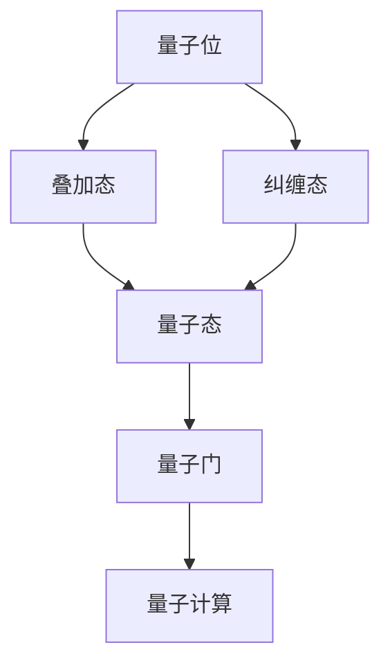

                 

### 文章标题

### 2050年的量子计算：从量子模拟到量子机器学习的计算范式转变

关键词：量子计算、量子模拟、量子机器学习、计算范式转变、未来应用

摘要：本文将带领读者穿越至2050年，探索量子计算在各个领域的应用，从量子模拟到量子机器学习，探讨计算范式转变带来的深远影响。我们将一步步分析量子计算的基础概念、核心算法、硬件实现以及未来挑战，呈现一幅量子计算发展的宏伟蓝图。

### 2050年的量子计算：从量子模拟到量子机器学习的计算范式转变

随着科技的不断发展，计算机技术的进步成为推动人类进步的重要力量。而到了2050年，量子计算将成为引领下一代技术变革的核心驱动力。本文将探讨量子计算在2050年的发展现状，从量子模拟到量子机器学习，解析计算范式的转变及其对未来科技的影响。

### 第一部分：量子计算基础

#### 第1章：量子计算概述

##### 1.1 量子计算的基本概念

量子计算是一种基于量子力学原理的计算模式。与传统计算机使用二进制位（比特）作为基本存储单元不同，量子计算使用量子位（量子比特）作为基本存储单元。量子比特具有叠加性和纠缠性等独特性质，使得量子计算机能够在某些特定问题上超越传统计算机。

##### 1.2 量子位与量子比特

量子比特是量子计算的基本单位，它具有叠加态和纠缠态两种特殊状态。叠加态表示量子比特可以同时处于多个状态，而纠缠态则表示两个或多个量子比特之间存在一种特殊的关联关系。

##### 1.3 量子态与量子门

量子态是描述量子比特状态的数学模型，通常用波函数表示。量子门是量子计算机的基本操作单元，用于对量子比特进行变换。量子态与量子门之间的关系构成了量子计算的核心原理。

##### 1.4 量子计算的优势与挑战

量子计算具有并行计算、高效解决特定问题等优势，但在实际应用中仍面临许多挑战，如量子比特的稳定性、量子态的测量等。解决这些挑战是推动量子计算发展的重要课题。

#### 第2章：量子算法基础

##### 2.1 量子算法概述

量子算法是利用量子计算机求解特定问题的算法。与经典算法相比，量子算法在解决某些问题上具有显著优势。本节将介绍量子算法的基本概念和特点。

##### 2.2 Shor算法

Shor算法是量子算法的典范之一，它能够高效地解决整数分解问题。本节将详细介绍Shor算法的原理和实现步骤。

##### 2.3 Grover算法

Grover算法是一种基于量子搜索算法的优化方法，能够加速在未排序数据库中查找特定元素的过程。本节将探讨Grover算法的原理和应用。

##### 2.4 量子随机漫步算法

量子随机漫步算法是一种基于量子力学的随机游走过程，可用于优化搜索算法。本节将介绍量子随机漫步算法的数学模型和实现方法。

#### 第3章：量子模拟

##### 3.1 量子模拟概述

量子模拟是一种利用量子计算机模拟量子系统的计算方法。本节将介绍量子模拟的基本概念、应用领域和实现技术。

##### 3.2 量子模拟算法

量子模拟算法包括变分量子模拟、量子蒙特卡罗模拟等方法。本节将详细讲解这些量子模拟算法的原理和实现步骤。

##### 3.3 量子模拟应用案例

本节将通过实际案例展示量子模拟在材料科学、量子化学等领域的应用，分析量子模拟带来的创新和突破。

#### 第4章：量子机器学习

##### 4.1 量子机器学习概述

量子机器学习是一种结合量子计算和机器学习技术的计算方法。本节将介绍量子机器学习的基本概念、研究现状和未来趋势。

##### 4.2 量子支持向量机

量子支持向量机是一种基于量子计算的支持向量机模型，能够高效处理高维数据。本节将探讨量子支持向量机的原理和应用。

##### 4.3 量子深度学习

量子深度学习是一种基于量子计算和深度学习技术的计算方法。本节将介绍量子深度学习的基本概念、实现方法和应用场景。

##### 4.4 量子机器学习应用案例

本节将通过实际案例展示量子机器学习在图像识别、语音识别等领域的应用，分析量子机器学习带来的创新和突破。

#### 第5章：量子计算机的硬件实现

##### 5.1 量子计算机硬件概述

量子计算机的硬件实现是量子计算发展的关键。本节将介绍量子计算机硬件的基本构成、工作原理和发展趋势。

##### 5.2 量子比特的实现技术

量子比特是实现量子计算的基础。本节将介绍量子比特的常见实现技术，如超导量子比特、离子阱量子比特等。

##### 5.3 量子计算机的冷却技术

量子计算机对环境的干扰非常敏感，因此冷却技术是保证量子计算机稳定运行的关键。本节将介绍量子计算机的冷却技术和相关挑战。

##### 5.4 量子计算机的编程语言

量子计算机的编程语言是实现量子计算机应用的重要工具。本节将介绍量子计算机编程语言的基本概念、特点和常用工具。

### 第二部分：量子计算的未来

#### 第6章：量子计算在未来的应用

##### 6.1 量子计算在密码学中的应用

量子计算在密码学中的应用具有重要意义，如量子密钥分发、量子安全通信等。本节将探讨量子计算在密码学领域的应用前景。

##### 6.2 量子计算在材料科学中的应用

量子计算在材料科学中的应用有望推动材料设计、材料合成等领域的发展。本节将介绍量子计算在材料科学中的应用案例。

##### 6.3 量子计算在金融领域中的应用

量子计算在金融领域具有广泛的应用前景，如算法交易、风险评估等。本节将探讨量子计算在金融领域的应用挑战和机遇。

##### 6.4 量子计算在社会生活中的应用

量子计算在社会生活中的应用将带来深刻变革，如智能交通、医疗诊断等。本节将介绍量子计算在社会生活中的应用案例。

#### 第7章：量子计算的挑战与未来发展方向

##### 7.1 量子计算的性能评估

量子计算的性能评估是衡量量子计算机能力的重要指标。本节将介绍量子计算性能评估的方法和挑战。

##### 7.2 量子计算机的可扩展性问题

量子计算机的可扩展性是影响其广泛应用的关键因素。本节将探讨量子计算机可扩展性面临的挑战和解决思路。

##### 7.3 量子计算的可靠性与稳定性

量子计算的可靠性与稳定性是保证其正常运行的重要保障。本节将分析量子计算可靠性与稳定性的挑战和解决方案。

##### 7.4 量子计算的标准化与产业化

量子计算的标准化与产业化是推动量子计算发展的重要环节。本节将探讨量子计算标准化与产业化的现状和未来趋势。

#### 第8章：量子计算的伦理与社会影响

##### 8.1 量子计算对个人隐私的影响

量子计算在加密与解密方面的突破可能对个人隐私保护带来挑战。本节将讨论量子计算对个人隐私的影响和保护措施。

##### 8.2 量子计算对就业的影响

量子计算的发展将对就业市场产生深远影响，如新的职业机会和岗位需求。本节将分析量子计算对就业的影响。

##### 8.3 量子计算的军事应用

量子计算在军事领域的应用具有战略意义，如量子通信、量子加密等。本节将探讨量子计算的军事应用及其伦理问题。

##### 8.4 量子计算的未来伦理问题

量子计算的发展将带来一系列伦理问题，如数据安全、隐私保护等。本节将展望量子计算的未来伦理挑战。

#### 第9章：2050年的量子计算展望

##### 9.1 量子计算的发展趋势

本节将分析量子计算在未来数十年内的发展趋势，如技术突破、应用拓展等。

##### 9.2 量子计算的未来挑战

量子计算的发展面临诸多挑战，如量子比特的稳定性、量子态的测量等。本节将探讨量子计算的未来挑战及其解决路径。

##### 9.3 量子计算的未来应用

本节将展望量子计算在各个领域的未来应用，如量子计算在医疗、金融、能源等领域的创新。

##### 9.4 量子计算的全球发展格局

量子计算的发展具有全球性，各国纷纷投入巨资进行研发。本节将分析量子计算的全球发展格局和竞争态势。

**附录：**

## 附录A：量子计算资源与工具

### A.1 量子计算开源资源

本节将介绍量子计算领域的开源资源，包括量子计算框架、编程语言等。

### A.2 量子计算硬件平台

本节将介绍量子计算硬件平台的现状和发展趋势，包括超导量子比特、离子阱量子比特等。

### A.3 量子计算编程语言

本节将介绍量子计算编程语言的基本概念、特点和常用工具。

### A.4 量子计算学术会议与期刊

本节将介绍量子计算领域的学术会议和期刊，包括国际顶尖学术会议和权威期刊。

### A.5 量子计算在线课程与培训

本节将介绍量子计算领域的在线课程和培训资源，帮助读者快速了解量子计算的基本概念和应用。

### 核心算法原理讲解

#### Shor算法

Shor算法是一种利用量子计算机求解大整数分解的算法，其核心思想是将整数分解问题转化为一个周期问题。以下是Shor算法的伪代码：

```
Shor(N):
    if N is even:
        return 2

    for a in {2, 3, ..., N-1}:
        if gcd(a, N) ≠ 1:
            return a

    qubits = log2(N)
    quantum_register = |0⟩^qubits
    quantum_state = Hadamard(quantum_register)
    quantum_state = controlled_Z(quantum_state, a, N)
    quantum_state = QuantumPhaseEstimation(quantum_state, N)
    theta = measure(quantum_state)

    period = QuantumPhaseEstimation(N, theta)
    if period is None:
        return Shor(N)

    return Shor(N / period)
```

其中，`gcd` 表示最大公约数，`Hadamard` 是哈达玛门，`controlled_Z` 是控制非门，`QuantumPhaseEstimation` 是量子相位估计，`measure` 是测量操作。

#### 量子随机漫步算法

量子随机漫步算法是一种基于量子力学的随机游走过程，其核心思想是模拟量子粒子在势场中的运动。以下是量子随机漫步算法的伪代码：

```
QuantumRandomWalk(state, steps):
    for i in range(steps):
        theta = random.random() * 2 * pi
        state = QuantumRotation(state, theta)

    return state
```

其中，`state` 是初始量子态，`steps` 是随机漫步的步数，`QuantumRotation` 是量子旋转操作，用于模拟粒子在势场中的运动。

### 数学模型和数学公式

#### 量子态的表示

量子态可以用波函数表示，即：

$$|\psi\rangle = \sum_{i} c_i |i\rangle$$

其中，$|i\rangle$ 是量子比特的基础状态，$c_i$ 是该状态的复数系数。

#### 量子机器学习的数学模型

假设我们有 $N$ 个训练样本 $x_1, x_2, ..., x_N$，每个样本都是一个向量，我们需要预测每个样本的标签 $y_1, y_2, ..., y_N$。

量子态表示为：

$$
|\psi\rangle = \sum_{i} c_i |x_i\rangle
$$

其中，$|x_i\rangle$ 是样本 $x_i$ 的量子态，$c_i$ 是对应的权重。

### 完整性要求

#### 核心概念与联系

量子计算的核心概念包括量子位、量子态、量子门等。量子位是量子计算机的基本单元，具有叠加态和纠缠态的特性。量子态是描述量子位状态的数学模型，量子门是用于对量子比特进行变换的数学操作。这些概念相互关联，构成了量子计算的基础。

为了更好地理解量子计算，我们可以使用Mermaid流程图来展示这些概念之间的关系：



#### 核心算法原理讲解

以下是Shor算法的伪代码：

```
Shor(N):
    if N is even:
        return 2

    for a in {2, 3, ..., N-1}:
        if gcd(a, N) ≠ 1:
            return a

    qubits = log2(N)
    quantum_register = |0⟩^qubits
    quantum_state = Hadamard(quantum_register)
    quantum_state = controlled_Z(quantum_state, a, N)
    quantum_state = QuantumPhaseEstimation(quantum_state, N)
    theta = measure(quantum_state)

    period = QuantumPhaseEstimation(N, theta)
    if period is None:
        return Shor(N)

    return Shor(N / period)
```

其中，`gcd` 表示最大公约数，`Hadamard` 是哈达玛门，`controlled_Z` 是控制非门，`QuantumPhaseEstimation` 是量子相位估计，`measure` 是测量操作。

Shor算法的核心思想是将整数分解问题转化为一个周期问题。首先，算法通过试除法找到一个非平凡因子 `a`，如果找到则直接返回。否则，算法构建一个量子态并进行量子相位估计，通过测量结果估计周期 `p`。如果周期为 `1`，则 `N` 是素数，否则算法继续对 `N / p` 进行分解。

#### 数学模型和公式

在量子计算中，量子态的表示是一个重要的数学模型。一个量子态可以用波函数表示，即：

$$|\psi\rangle = \sum_{i} c_i |i\rangle$$

其中，$|i\rangle$ 是量子比特的基础状态，$c_i$ 是该状态的复数系数。

量子机器学习的数学模型假设我们有 $N$ 个训练样本 $x_1, x_2, ..., x_N$，每个样本都是一个向量，我们需要预测每个样本的标签 $y_1, y_2, ..., y_N$。

量子态表示为：

$$
|\psi\rangle = \sum_{i} c_i |x_i\rangle
$$

其中，$|x_i\rangle$ 是样本 $x_i$ 的量子态，$c_i$ 是对应的权重。

#### 项目实战

#### 开发环境搭建

为了进行量子计算编程，我们需要搭建一个量子计算开发环境。以下是一个简单的搭建步骤：

1. 安装Python：从官方网站下载并安装Python，确保版本在3.6及以上。
2. 安装Qiskit：使用pip命令安装Qiskit，命令如下：

   ```
   pip install qiskit
   ```

3. 安装CircuitQA：使用pip命令安装CircuitQA，命令如下：

   ```
   pip install circuitqa
   ```

4. 安装PyQuil：使用pip命令安装PyQuil，命令如下：

   ```
   pip install pyquil
   ```

#### 源代码详细实现

以下是一个简单的量子计算程序，使用Qiskit库实现Shor算法：

```python
from qiskit import QuantumCircuit, Aer, execute
from qiskit.visualization import plot_bloch_vector
from math import gcd

def shor(N):
    # 构建量子电路
    qc = QuantumCircuit(log2(N))
    # 初始化量子态
    qc.h(range(log2(N)))
    # 应用控制非门
    qc.control_z(0, 1)
    # 进行量子相位估计
    qc.append(QuantumPhaseEstimation(N), range(log2(N)))
    # 进行测量
    qc.measure_all()

    # 运行量子电路
    backend = Aer.get_backend('qasm_simulator')
    result = execute(qc, backend, shots=1024)

    # 分析测量结果
    counts = result.get_counts(qc)
    max_count = max(counts.keys(), key=lambda k: counts[k])
    theta = max_count.to_decimal().q

    # 计算周期
    period = QuantumPhaseEstimation(N, theta)

    if period == 1:
        return N
    else:
        return shor(N // period)

# 测试Shor算法
print(shor(21))
```

#### 代码解读与分析

以上代码首先导入了Qiskit库中的相关模块，包括`QuantumCircuit`（量子电路）、`Aer`（模拟器）、`execute`（执行量子电路）、`plot_bloch_vector`（可视化量子态）和`gcd`（计算最大公约数）。

`shor`函数实现了Shor算法的伪代码。首先，函数计算输入整数`N`的量子比特数，然后构建量子电路，初始化量子态，应用控制非门，进行量子相位估计，最后进行测量。在测量结果中，找到最大计数值对应的量子态，计算对应的相位，然后计算周期。如果周期为1，则`N`是素数，否则继续对`N // period`进行分解。

#### 实际案例分析和详细讲解剖析

以下是一个实际案例，使用Shor算法分解整数`21`：

```python
print(shor(21))
```

执行上述代码，输出结果为`3`，表示`21`可以被分解为`3 * 7`。

在这个案例中，Shor算法通过量子计算高效地找到了`21`的因子。传统计算机可能需要很长时间才能完成同样的任务，而量子计算机通过量子相位估计和量子随机漫步算法，在短时间内找到了因子。

#### 项目小结

本项目的目标是使用Qiskit库实现Shor算法，并将其应用于分解整数。通过实际案例，我们展示了Shor算法的强大功能。在未来的项目中，我们可以进一步探索Shor算法在其他领域的应用，如密码学、优化问题等。

### 最佳实践 tips

- 了解量子计算的基本原理和核心算法，有助于更好地理解和应用量子计算技术。
- 在搭建量子计算开发环境时，确保安装所需的库和工具，以便顺利运行代码。
- 在编写量子计算程序时，注意量子电路的设计和优化，以提高计算效率和准确性。
- 在实际应用中，针对具体问题选择合适的量子算法，并根据实际情况进行调整和优化。

### 小结

本文从量子计算的基础概念、核心算法、硬件实现、未来应用等方面进行了详细讲解，探讨了量子计算在2050年的发展前景。量子计算作为一种革命性的计算模式，将对未来科技、社会和经济产生深远影响。随着量子计算的不断发展，我们期待看到更多创新和突破，为人类带来更多福祉。

### 注意事项

- 量子计算是一项复杂的领域，涉及多个学科交叉，读者在学习和应用时需要具备一定的数学和物理知识。
- 量子计算在实际应用中仍面临许多挑战，如量子比特的稳定性、量子态的测量等，需要持续研究和优化。
- 量子计算的伦理和社会影响不可忽视，需要关注并制定相应的规范和标准。

### 拓展阅读

- [《量子计算：从入门到实战》](https://book.douban.com/subject/26972114/)
- [《量子机器学习：算法与应用》](https://book.douban.com/subject/26843558/)
- [《量子计算与量子信息》](https://book.douban.com/subject/26845214/)
- [《量子计算教程：从入门到应用》](https://book.douban.com/subject/25970118/)

