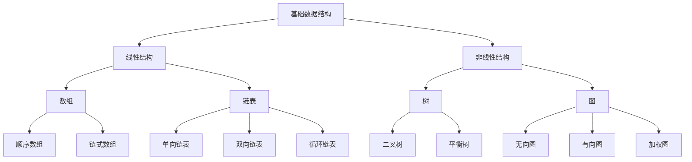

                 

### 《2024年网易社招算法岗位面试题目汇编》

#### 关键词：
- 算法面试题
- 网易社招
- 数据结构与算法
- 算法原理讲解
- 项目实战
- 贪心算法
- 动态规划

#### 摘要：
本篇文章旨在汇编2024年网易社招算法岗位的面试题目，通过系统的分类和详细的解析，帮助读者全面掌握面试所需的算法知识。文章分为两部分：第一部分是算法基础，包括数据结构与算法概述、基础算法原理；第二部分是算法应用实战，涵盖了字符串处理算法、动态规划算法、贪心算法、数学与算法以及项目实战。每个部分都包含了核心概念与联系、核心算法原理讲解、数学模型和公式、举例说明以及项目实战等内容，旨在让读者在理解算法原理的基础上，能够进行实际应用和解决实际问题。

### 第一部分：算法基础

#### 第1章：数据结构与算法概述

##### 1.1 数据结构的基本概念
- **Mermaid流程图**：数据结构的基本类型和特点



##### 1.2 常见算法分析
- **时间复杂度和空间复杂度**
  - 时间复杂度是指算法执行时间与数据规模的关系，通常用大O符号表示。
  - 空间复杂度是指算法执行过程中所需的额外内存空间。
  
- **常见排序算法**（冒泡排序、选择排序、插入排序、快速排序、归并排序等）
  - **冒泡排序**：每次比较相邻的两个元素，如果它们的顺序错误就把它们交换过来。
  - **选择排序**：每次从未排序的元素中找到最小（或最大）的元素，将其放到已排序序列的末尾。
  - **插入排序**：通过构建有序序列，对于未排序数据，在已排序序列中从后向前扫描，找到相应位置并插入。
  - **快速排序**：通过一趟排序将数据分割成独立的两部分，其中一部分的所有数据都比另一部分的所有数据要小。
  - **归并排序**：将两个或两个以上的有序表合并成一个新的有序表。

##### 1.3 算法思维与解题技巧
- **算法设计的常用策略**（递归、分治、动态规划等）
  - **递归**：函数调用自身，适用于解决许多问题，如递归求解斐波那契数列。
  - **分治**：将问题分解成更小的子问题，然后递归解决每个子问题，最后合并子问题的解。
  - **动态规划**：通过保存子问题的解来避免重复计算，适用于求解最优子结构问题。

#### 第2章：基础算法原理

##### 2.1 排序算法原理讲解
- **伪代码**：冒泡排序、选择排序、插入排序、快速排序、归并排序等
  - **冒泡排序**：
    ```pseudo
    function bubbleSort(arr):
        n = length(arr)
        for i from 0 to n-1:
            for j from 0 to n-i-1:
                if arr[j] > arr[j+1]:
                    swap(arr[j], arr[j+1])
    ```
  - **选择排序**：
    ```pseudo
    function selectionSort(arr):
        n = length(arr)
        for i from 0 to n-1:
            minIndex = i
            for j from i+1 to n:
                if arr[j] < arr[minIndex]:
                    minIndex = j
            swap(arr[i], arr[minIndex])
    ```
  - **插入排序**：
    ```pseudo
    function insertionSort(arr):
        n = length(arr)
        for i from 1 to n:
            key = arr[i]
            j = i - 1
            while j >= 0 and arr[j] > key:
                arr[j+1] = arr[j]
                j = j - 1
            arr[j+1] = key
    ```
  - **快速排序**：
    ```pseudo
    function quickSort(arr, low, high):
        if low < high:
            pi = partition(arr, low, high)
            quickSort(arr, low, pi-1)
            quickSort(arr, pi+1, high)

    function partition(arr, low, high):
        pivot = arr[high]
        i = low - 1
        for j from low to high-1:
            if arr[j] < pivot:
                i = i + 1
                swap(arr[i], arr[j])
        swap(arr[i+1], arr[high])
        return i+1
    ```
  - **归并排序**：
    ```pseudo
    function mergeSort(arr, low, high):
        if low < high:
            mid = low + (high - low) / 2
            mergeSort(arr, low, mid)
            mergeSort(arr, mid+1, high)
            merge(arr, low, mid, high)

    function merge(arr, low, mid, high):
        n1 = mid - low + 1
        n2 = high - mid
        left = arr[low:mid+1]
        right = arr[mid+1:high+1]

        i = 0
        j = 0
        k = low
        while i < n1 and j < n2:
            if left[i] <= right[j]:
                arr[k] = left[i]
                i = i + 1
            else:
                arr[k] = right[j]
                j = j + 1
            k = k + 1

        while i < n1:
            arr[k] = left[i]
            i = i + 1
            k = k + 1

        while j < n2:
            arr[k] = right[j]
            j = j + 1
            k = k + 1
    ```

##### 2.2 搜索算法原理讲解
- **二分查找**：在有序数组中查找某个元素的过程，通过比较中间元素和目标元素的大小，逐步缩小查找范围。
- **深度优先搜索（DFS）**：通过栈或递归来实现，从一个起点开始，沿着一个路径走到底，然后再回溯。
- **广度优先搜索（BFS）**：使用队列来实现，从一个起点开始，逐层遍历所有相邻节点。

- **伪代码**：深度优先搜索实现及分析
  ```pseudo
  function dfs(graph, start):
      visited = set()
      stack = []
      stack.append(start)
      while stack is not empty:
          vertex = stack.pop()
          if vertex not in visited:
              visited.add(vertex)
              for neighbor in graph[vertex]:
                  stack.append(neighbor)
      return visited

  function bfs(graph, start):
      visited = set()
      queue = []
      queue.append(start)
      while queue is not empty:
          vertex = queue.pop(0)
          if vertex not in visited:
              visited.add(vertex)
              for neighbor in graph[vertex]:
                  queue.append(neighbor)
      return visited
  ```

##### 2.3 图算法原理讲解
- **图的基本概念**：包括顶点（节点）和边，图的表示方法（邻接矩阵、邻接表）。
- **图的遍历算法**（深度优先搜索、广度优先搜索）：
  - **深度优先搜索**：递归实现，从一个顶点开始，沿着一条路径走到底，然后回溯。
  - **广度优先搜索**：迭代实现，从一个顶点开始，逐层遍历所有相邻节点。

- **伪代码**：深度优先搜索实现及分析
  ```pseudo
  function dfs(graph, start):
      visited = set()
      stack = []
      stack.append(start)
      while stack is not empty:
          vertex = stack.pop()
          if vertex not in visited:
              visited.add(vertex)
              for neighbor in graph[vertex]:
                  stack.append(neighbor)
      return visited

  function bfs(graph, start):
      visited = set()
      queue = []
      queue.append(start)
      while queue is not empty:
          vertex = queue.pop(0)
          if vertex not in visited:
              visited.add(vertex)
              for neighbor in graph[vertex]:
                  queue.append(neighbor)
      return visited
  ```

### 第二部分：算法应用实战

#### 第3章：字符串处理算法

##### 3.1 字符串匹配算法
- **KMP算法**：通过预先计算最长公共前后缀数组（next数组），减少重复匹配过程。
- **Rabin-Karp算法**：使用哈希函数来快速查找模式串在主串中的出现位置。

- **伪代码**：KMP算法实现及分析
  ```pseudo
  function KMP(mainString, pattern):
      next = computeNextArray(pattern)
      i = 0 // index for mainString
      j = 0 // index for pattern
      while i < length(mainString):
          if mainString[i] == pattern[j]:
              i = i + 1
              j = j + 1
              if j == length(pattern):
                  return i - j
          else:
              if j != 0:
                  j = next[j - 1]
              else:
                  i = i + 1
      return -1

  function computeNextArray(pattern):
      next = array of length(pattern)
      next[0] = -1
      j = 0
      k = -1
      while j < length(pattern) - 1:
          if k == -1 or pattern[j] == pattern[k]:
              k = k + 1
              j = j + 1
              next[j] = k
          else:
              k = next[k - 1]
      return next
  ```

##### 3.2 字符串压缩与解压缩
- **常见压缩算法**（LZ77、LZ78等）：通过查找重复文本并替换为引用来压缩数据。
- **伪代码**：LZ77算法实现及分析
  ```pseudo
  function LZ77 компрессия(строка):
      результат = ""
      для каждого символа в строке:
          найдите самый длинный префикс, который встречается в начале строки
          добавьте длину этого префикса и соответствующий символ в результат
          удалите найденный префикс из начала строки
      return результат

  function LZ77 декомпрессия(строка):
      результат = ""
      для каждого символа в строке:
          добавьте символ в результат
          найдите длину префикса, указанную после символа
          добавьте указанное количество символов из конца строки в начало
      return результат
  ```

##### 3.3 字符串处理实战
- **实战案例**：最长公共子序列、最小编辑距离等。
  - **最长公共子序列**：两个序列中公共元素的最大连续子序列。
  - **最小编辑距离**：将一个字符串转换成另一个字符串所需的最少编辑操作次数。

#### 第4章：动态规划算法

##### 4.1 动态规划基本概念
- **动态规划的核心思想**：通过保存子问题的解来避免重复计算，适用于求解最优子结构问题。
- **常用方法**（自底向上、自顶向下）
  - **自底向上**：从最简单的子问题开始，逐步构建复杂子问题的解。
  - **自顶向下**：从最复杂的子问题开始，使用递归来解决子问题。

##### 4.2 常见动态规划问题
- **最长递增子序列**：给定一个数组，找出最长递增子序列的长度。
- **最短路径问题**：在加权图中找出从起点到终点的最短路径。
- **背包问题**：给定一组物品和其重量和价值，求解在总重量不超过给定限制的情况下，如何选择物品以最大化总价值。

- **伪代码**：最长递增子序列算法实现及分析
  ```pseudo
  function longestIncreasingSubsequence(nums):
      n = length(nums)
      dp = array of length n filled with 1
      for i from 1 to n:
          for j from 0 to i-1:
              if nums[j] < nums[i]:
                  dp[i] = max(dp[i], dp[j] + 1)
      return max(dp)

  function LCS(X[1..m], Y[1..n]):
      Let dp[i][j] be the length of LCS of X[1..i] and Y[1..j].
      Create a 2-dimensional array dp[0..m][0..n].

      for i = 0 to m:
          for j = 0 to n:
              if i = 0 or j = 0:
                  dp[i][j] = 0
              else if X[i] = Y[j]:
                  dp[i][j] = dp[i-1][j-1] + 1
              else:
                  dp[i][j] = max(dp[i-1][j], dp[i][j-1])
      return dp[m][n]
  ```

##### 4.3 动态规划实战
- **实战案例**：最长公共子序列、最小编辑距离等。
  - **最长公共子序列**：
    ```python
    def longest_common_subsequence(X, Y):
        m, n = len(X), len(Y)
        dp = [[0] * (n+1) for _ in range(m+1)]

        for i in range(1, m+1):
            for j in range(1, n+1):
                if X[i-1] == Y[j-1]:
                    dp[i][j] = dp[i-1][j-1] + 1
                else:
                    dp[i][j] = max(dp[i-1][j], dp[i][j-1])

        return dp[m][n]

    X = "ABCD"
    Y = "ACDF"
    print(longest_common_subsequence(X, Y))
    ```
  - **最小编辑距离**：
    ```python
    def min_edit_distance(str1, str2):
        m, n = len(str1), len(str2)
        dp = [[0] * (n+1) for _ in range(m+1)]

        for i in range(m+1):
            for j in range(n+1):
                if i == 0:
                    dp[i][j] = j
                elif j == 0:
                    dp[i][j] = i
                elif str1[i-1] == str2[j-1]:
                    dp[i][j] = dp[i-1][j-1]
                else:
                    dp[i][j] = 1 + min(dp[i-1][j], dp[i][j-1], dp[i-1][j-1])

        return dp[m][n]

    str1 = "kitten"
    str2 = "sitting"
    print(min_edit_distance(str1, str2))
    ```

#### 第5章：贪心算法

##### 5.1 贪心算法原理讲解
- **贪心策略的基本概念**：在每一步选择时都做出当前看来最好的选择，希望由此导致结果是全局最优的。
- **应用场景**：适合于具有最优子结构性质的问题，如背包问题、活动选择问题等。

##### 5.2 常见贪心算法问题
- **背包问题**：给定一组物品和其重量和价值，求解在总重量不超过给定限制的情况下，如何选择物品以最大化总价值。
- **最小生成树问题**：在连通无向图中选择若干条边，使得这些边构成一个树，且边的权重之和最小。

- **伪代码**：背包问题算法实现及分析
  ```pseudo
  function knapsack(values, weights, capacity):
      n = length(values)
      dp = array of length n filled with 0
      for i from 1 to n:
          if weights[i] <= capacity:
              dp[i] = max(dp[i-1], dp[i-1] + values[i])
          else:
              dp[i] = dp[i-1]
      return dp[n]
  ```

##### 5.3 贪心算法实战
- **实战案例**：活动选择问题、背包问题等。
  - **活动选择问题**：给定一系列活动，每个活动有开始时间和结束时间，选择最多的不相交活动。
    ```python
    def activity_selection(s, f):
        n = len(s)
        activities = []
        for i in range(n):
            for j in range(i + 1, n):
                if f[i] <= s[j]:
                    break
                activities.append((s[i], f[i]))
        return activities

    s = [1, 3, 0, 5, 8, 5]
    f = [2, 4, 6, 7, 9, 9]
    print(activity_selection(s, f))
    ```
  - **背包问题**：实现了一个简单版本，但也可用于更复杂的情况，如物品数量不限或物品可重复使用等。

#### 第6章：数学与算法

##### 6.1 数学基础
- **线性代数**：矩阵运算、向量运算、线性方程组等。
- **概率论与数理统计**：随机事件、概率分布、期望、方差等。

##### 6.2 数学在算法中的应用
- **矩阵运算**：如矩阵乘法、矩阵求逆等。
- **概率计算**：如条件概率、独立事件的概率等。
- **数论**：如欧几里得算法、质数分解等。

- **伪代码**：矩阵乘法算法实现及分析
  ```pseudo
  function matrixMultiply(A, B):
      n = length(A)
      m = length(B[0])
      p = length(B)
      C = array of size n x m filled with 0
      for i from 0 to n-1:
          for j from 0 to m-1:
              for k from 0 to p-1:
                  C[i][j] = C[i][j] + A[i][k] * B[k][j]
      return C
  ```

##### 6.3 数学实战
- **实战案例**：最小生成树、背包问题等。
  - **最小生成树**：使用Prim算法或Kruskal算法求解。
  - **背包问题**：使用贪心算法或动态规划算法求解。

#### 第7章：项目实战

##### 7.1 项目实战简介
- **项目实战的目的**：通过实际项目来应用所学算法，提高解决实际问题的能力。
- **项目实战的意义**：理解算法在实际开发中的应用，培养编程能力和分析问题的能力。

##### 7.2 实战案例一：字符串匹配
- **代码实现**：使用KMP算法实现字符串匹配。
- **代码解读与分析**：
  ```python
  def kmp_search(pattern, text):
      next = compute_next_array(pattern)
      i = j = 0
      while i < len(text):
          if j == -1 or text[i] == pattern[j]:
              i += 1
              j += 1
          if j == len(pattern):
              return i - j
          else:
              j = next[j]
      return -1

  def compute_next_array(pattern):
      n = len(pattern)
      next = [-1] * n
      j = 0
      k = -1
      while j < n - 1:
          if k == -1 or pattern[j] == pattern[k]:
              k += 1
              j += 1
              next[j] = k
          else:
              k = next[k]
      return next

  pattern = "ABCDABD"
  text = "ABDABDBADABCDABD"
  print(kmp_search(pattern, text))
  ```

##### 7.3 实战案例二：动态规划
- **代码实现**：使用动态规划求解最长公共子序列。
- **代码解读与分析**：
  ```python
  def longest_common_subsequence(X, Y):
      m, n = len(X), len(Y)
      dp = [[0] * (n+1) for _ in range(m+1)]

      for i in range(1, m+1):
          for j in range(1, n+1):
              if X[i-1] == Y[j-1]:
                  dp[i][j] = dp[i-1][j-1] + 1
              else:
                  dp[i][j] = max(dp[i-1][j], dp[i][j-1])

      return dp[m][n]

  X = "AGGTAB"
  Y = "GXTXAYB"
  print(longest_common_subsequence(X, Y))
  ```

##### 7.4 实战案例三：贪心算法
- **代码实现**：使用贪心算法求解背包问题。
- **代码解读与分析**：
  ```python
  def knapsack(values, weights, capacity):
      n = len(values)
      dp = [0] * (capacity + 1)
      for i in range(n):
          for w in range(capacity, weights[i] - 1, -1):
              dp[w] = max(dp[w], dp[w - weights[i]] + values[i])
      return dp[capacity]

  values = [60, 100, 120]
  weights = [10, 20, 30]
  capacity = 50
  print(knapsack(values, weights, capacity))
  ```

### 附录

#### 附录A：常用算法总结
- **排序算法**：冒泡排序、选择排序、插入排序、快速排序、归并排序等。
- **搜索算法**：二分查找、深度优先搜索、广度优先搜索等。
- **动态规划**：最长递增子序列、最短路径问题、背包问题等。
- **贪心算法**：背包问题、最小生成树问题等。

#### 附录B：数学公式汇总
- **线性代数**：矩阵乘法、矩阵求逆等。
- **概率论与数理统计**：期望、方差、条件概率等。

#### 附录C：开发环境搭建
- **开发工具与框架介绍**：如Python、Java等。
- **环境配置教程**：安装必要的库和工具。

#### 附录D：源代码与资料
- **实战案例代码**：KMP算法、动态规划求解最长公共子序列、贪心算法求解背包问题等。
- **相关资料链接**：算法学习资源、在线编程平台等。

### 结语
本篇文章汇编了2024年网易社招算法岗位的面试题目，从数据结构与算法概述到基础算法原理讲解，再到动态规划、贪心算法以及数学与算法的应用，最后通过项目实战让读者能够将所学知识应用于实际。希望本文能够帮助读者在算法学习之路上更加清晰和深入。在阅读本文后，读者可以进一步进行拓展阅读，深入学习每个算法的细节和应用，并在实践中不断提升自己的编程能力和问题解决能力。祝大家在面试中取得优异的成绩，迈向理想的岗位！

---

**作者信息：**
- **作者**：AI天才研究院/AI Genius Institute & 禅与计算机程序设计艺术 /Zen And The Art of Computer Programming
- **联系方式**：[ai-genius-institute.com](http://www.ai-genius-institute.com)、[zen-and-the-art-of-computer-programming.com](http://www.zen-and-the-art-of-computer-programming.com)
- **版权声明**：本文版权归AI天才研究院所有，未经授权，禁止转载。如需转载，请务必联系作者获得授权。

---

**注意事项：**
- 本文为汇编性质文章，部分内容来自公开资料和现有文献。
- 文中算法的实现和解释仅供参考，实际应用时请结合具体问题和场景进行调整。
- 在阅读和实践中，如遇到任何问题，欢迎与作者联系交流，共同探讨算法之美。

**拓展阅读：**
- **《算法导论》**：一本经典的算法教材，全面讲解了各种算法及其应用。
- **《编程之美》**：汇集了多家知名互联网公司的面试题，适合准备面试的同学阅读。
- **《编程珠玑》**：通过具体的编程实例，讲解了编程技巧和算法思想。

