                 

## 文章标题

### 2025年蚂蚁金服社招区块链架构师面试题汇总

> 关键词：蚂蚁金服、区块链、架构师、面试题、2025年

> 摘要：本文将汇总2025年蚂蚁金服社会招聘区块链架构师的面试题，通过对这些面试题的深入解析，帮助准备应聘者了解区块链技术在蚂蚁金服的应用现状和未来发展方向。文章将从理论基础、核心概念与架构、应用场景与案例分析、技术与金融创新、开发工具与框架、安全与隐私保护以及未来趋势与展望七个部分进行阐述，旨在为读者提供一份全面、系统的区块链技术面试指南。

## 目录大纲

### 第一部分: 理论基础

#### 第1章: 2025年蚂蚁金服区块链架构师面试题概述
- **1.1 蚂蚁金服区块链技术简介**
  - 区块链技术基本原理
  - 蚂蚁金服区块链应用场景
- **1.2 面试题分类与解读**
  - 基础知识问答
  - 技术实现细节
  - 应用案例分析
- **1.3 面试准备策略**
  - 时间规划
  - 知识梳理
  - 实战模拟

#### 第2章: 区块链核心概念与架构
- **2.1 区块链基本原理**
  - **2.1.1 区块链数据结构**
    - Mermaid流程图: 区块链数据结构示意
    - **伪代码**：区块链核心算法
  - **2.1.2 共识算法**
    - 工作量证明
    - 拜占庭容错算法
    - 权益证明
  - **2.1.3 智能合约**
    - 智能合约原理
    - 编程语言简介
    - **伪代码**：智能合约示例
- **2.2 区块链网络架构**
  - **2.2.1 节点类型与角色**
    - 轻节点与全节点
    - 矿工与验证者
  - **2.2.2 网络通信机制**
    - P2P网络
    - 数据同步与验证
  - **2.2.3 安全性与隐私保护**
    - 加密技术
    - 权限控制机制

#### 第3章: 区块链应用场景与案例分析
- **3.1 跨境支付与结算**
  - **案例研究**：蚂蚁金服跨境支付系统
  - 技术实现与优化
  - **代码解析**：跨境支付系统核心代码
- **3.2 供应链金融**
  - **案例研究**：区块链在供应链金融中的应用
  - **伪代码**：供应链金融系统架构设计
  - **代码解析**：核心智能合约实现
- **3.3 数据存储与共享**
  - **案例研究**：区块链在数据存储与共享中的应用
  - **伪代码**：数据存储与共享架构设计
  - **代码解析**：数据共享智能合约实现

#### 第4章: 区块链技术与金融创新
- **4.1 数字货币与区块链**
  - **4.1.1 数字货币基本原理**
    - Mermaid流程图: 数字货币交易流程
    - **伪代码**：数字货币交易算法
  - **4.1.2 区块链在数字货币中的应用**
    - 比特币案例分析
    - 其他数字货币简介
- **4.2 货币基金与资产管理**
  - **伪代码**：智能货币基金架构设计
  - **代码解析**：货币基金智能合约实现
- **4.3 保险与理赔**
  - **案例研究**：区块链在保险与理赔中的应用
  - **伪代码**：保险与理赔系统架构设计
  - **代码解析**：保险与理赔智能合约实现

#### 第5章: 区块链开发工具与框架
- **5.1 蚂蚁区块链平台**
  - **5.1.1 平台概述**
    - 功能特点
    - 应用场景
  - **5.1.2 开发工具与环境**
    - SDK介绍
    - 开发环境搭建
- **5.2 主流区块链框架对比**
  - **5.2.1 Hyperledger Fabric**
    - **伪代码**：Hyperledger Fabric架构设计
    - **代码解析**：Hyperledger Fabric核心代码实现
  - **5.2.2 Ethereum**
    - **伪代码**：Ethereum智能合约示例
    - **代码解析**：Ethereum开发实践

#### 第6章: 区块链安全与隐私
- **6.1 安全威胁与防护**
  - **6.1.1 恶意攻击与防范**
    - DDoS攻击
    - 拒绝服务攻击
  - **6.1.2 隐私保护**
    - 同态加密
    - 零知识证明
- **6.2 风险管理与合规**
  - **伪代码**：区块链合规性检查算法
  - **代码解析**：合规性检查智能合约实现
- **6.3 监管科技与合规**
  - **案例研究**：监管科技在区块链领域的应用
  - **伪代码**：监管科技数据收集与处理算法

#### 第7章: 未来趋势与展望
- **7.1 区块链技术与产业发展**
  - **7.1.1 技术发展趋势**
    - 加密货币
    - 分布式存储
    - 去中心化金融
  - **7.1.2 行业应用拓展**
    - 供应链管理
    - 物联网
    - 数字身份认证
- **7.2 政策法规与行业挑战**
  - **7.2.1 政策法规解读**
    - 中国区块链政策
    - 国际区块链政策
  - **7.2.2 行业挑战与应对策略**
    - 技术标准化
    - 跨行业合作
  - **7.2.3 创新案例与实践**
    - **案例研究**：区块链在金融科技领域的创新应用

## 第一部分: 理论基础

### 第1章: 2025年蚂蚁金服区块链架构师面试题概述

#### 1.1 蚂蚁金服区块链技术简介

蚂蚁金服作为全球领先的金融科技公司，早在区块链技术兴起之初便开始积极布局，致力于将其应用于金融场景中。蚂蚁金服的区块链技术主要涵盖以下几个方面：

1. **基本原理**：蚂蚁金服的区块链技术基于分布式账本技术（DLT），确保数据的不可篡改和透明性。其核心算法采用拜占庭容错算法（BFT），保证系统在高并发和去中心化环境下的稳定运行。

2. **应用场景**：蚂蚁金服的区块链技术广泛应用于跨境支付、供应链金融、数据共享等领域。例如，其跨境支付系统利用区块链技术实现了实时、低成本的跨境支付结算，有效提升了金融服务的效率。

#### 1.2 面试题分类与解读

1. **基础知识问答**：这类面试题主要考察应聘者对区块链基本概念、技术原理、共识算法等的理解和掌握情况。例如：

   - 什么是区块链？
   - 请简述拜占庭容错算法（BFT）的工作原理。

2. **技术实现细节**：这类面试题侧重于考察应聘者在区块链系统设计和开发方面的能力，包括数据结构、网络通信机制、智能合约等。例如：

   - 区块链数据结构是怎样的？
   - 如何实现区块链网络中的数据同步与验证？

3. **应用案例分析**：这类面试题旨在了解应聘者对区块链技术在实际业务场景中的运用能力。例如：

   - 区块链在跨境支付中的应用有哪些优势？
   - 请举例说明区块链在供应链金融中的应用场景。

#### 1.3 面试准备策略

1. **时间规划**：面试准备时间通常为1-2个月，应聘者应合理安排时间，确保充分掌握区块链相关知识和技能。

2. **知识梳理**：系统梳理区块链基础知识，包括基本概念、技术原理、应用场景等，确保对每个知识点都有深入理解。

3. **实战模拟**：通过模拟面试和实际项目经验积累，提高应对面试的能力和自信心。例如，参与区块链项目开发、撰写技术博客、参与社区讨论等。

### 第2章: 区块链核心概念与架构

#### 2.1 区块链基本原理

区块链是一种分布式数据库系统，其核心在于通过去中心化的方式，实现数据的存储、传输和验证。以下是区块链基本原理的详细解读：

##### 2.1.1 区块链数据结构

区块链数据结构主要包括区块（Block）、链（Chain）和交易（Transaction）三个部分。区块是区块链的基本单位，包含一定数量的交易记录。链则是按时间顺序排列的区块序列。交易是区块链上的数据传输单元，记录了数据发送方、接收方以及交易金额等信息。

以下是一个简单的Mermaid流程图，展示区块链数据结构的基本原理：

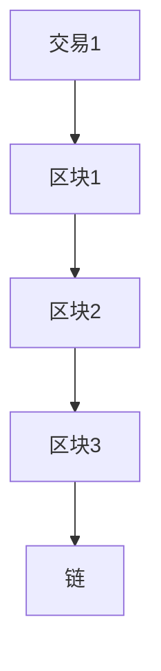

##### 2.1.2 共识算法

共识算法是区块链系统中实现数据一致性的关键机制。以下是几种常见的共识算法及其工作原理：

1. **工作量证明（PoW）**：工作量证明算法通过计算复杂度来防止恶意攻击。矿工通过不断尝试计算，寻找一个满足条件的哈希值，从而获得生成下一个区块的权力。这种算法的优点是去中心化，但缺点是计算资源消耗大。

2. **拜占庭容错算法（BFT）**：拜占庭容错算法是一种在去中心化网络中实现一致性保障的算法。它通过选举验证者、分配验证权重等方式，确保网络中的节点能够达成一致。这种算法的优点是高效、安全，但缺点是需要较大的网络信任基础。

3. **权益证明（PoS）**：权益证明算法通过持有代币数量来决定生成区块的概率。持有代币越多，生成区块的概率越大。这种算法的优点是节能、去中心化，但缺点是可能导致集中化问题。

##### 2.1.3 智能合约

智能合约是一种自动执行的合约，它基于区块链技术，通过编写代码实现合同的条款和条件。智能合约的优点是去中心化、透明、不可篡改，能够提高金融交易的效率和安全性。

智能合约通常采用特定的编程语言编写，例如Solidity（Ethereum）、Go（Hyperledger Fabric）等。以下是一个简单的Solidity智能合约示例：

```solidity
pragma solidity ^0.8.0;

contract HelloWorld {
    string public message;

    constructor(string memory initMessage) {
        message = initMessage;
    }

    function updateMessage(string memory newMessage) public {
        message = newMessage;
    }
}
```

该智能合约定义了一个名为`HelloWorld`的合约，包含一个可公开访问的`message`变量和一个用于更新消息的`updateMessage`函数。

#### 2.2 区块链网络架构

区块链网络架构是指区块链系统中各个节点之间如何进行通信和协作的机制。以下是区块链网络架构的详细解读：

##### 2.2.1 节点类型与角色

区块链网络中的节点可以分为轻节点（Light Node）和全节点（Full Node）两类。轻节点只存储部分区块链数据，而全节点则存储完整的区块链数据。

在蚂蚁金服的区块链系统中，节点角色主要包括矿工（Miner）和验证者（Validator）。矿工负责挖掘新的区块，验证者负责验证交易和区块的合法性。

##### 2.2.2 网络通信机制

区块链网络通信机制主要基于P2P（Peer-to-Peer）网络架构。P2P网络是一种对等网络，节点之间直接进行数据传输，无需中心化服务器。

在P2P网络中，节点之间通过广播（Broadcast）和发送（Send）消息进行通信。广播消息用于通知其他节点某项事件的发生，发送消息用于传输具体的交易和区块数据。

##### 2.2.3 安全性与隐私保护

区块链网络的安全性主要依赖于加密技术和权限控制机制。加密技术用于保护区块链数据的安全性，防止未授权访问和篡改。常见的加密技术包括哈希算法、非对称加密、数字签名等。

权限控制机制用于限制不同角色节点的访问权限，确保区块链系统的安全性。例如，在蚂蚁金服的区块链系统中，矿工和验证者拥有不同的权限，只有验证者才能验证交易和区块。

#### 2.3 区块链应用场景与案例分析

区块链技术具有去中心化、安全可靠、透明高效等特点，适用于多种应用场景。以下是几个典型的区块链应用场景及其案例分析：

##### 2.3.1 跨境支付与结算

跨境支付与结算是一个重要的区块链应用场景。传统跨境支付系统存在交易成本高、结算周期长等问题，而区块链技术能够实现实时、低成本的跨境支付。

以蚂蚁金服的跨境支付系统为例，该系统基于区块链技术，实现了一个高效、安全的跨境支付平台。系统架构包括多个节点，分布在不同的国家和地区，节点之间通过P2P网络进行通信。

以下是一个简单的Mermaid流程图，展示跨境支付系统的交易流程：

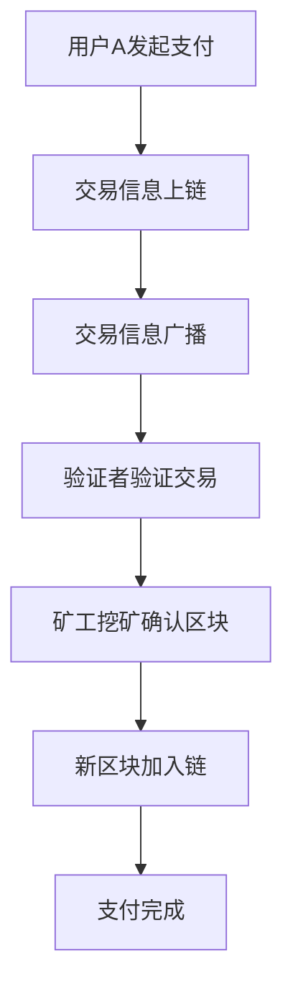

在该流程中，用户A发起支付请求后，交易信息被上链并广播给其他节点。验证者对交易进行验证，矿工挖矿确认区块，新区块加入链后，支付完成。

##### 2.3.2 供应链金融

供应链金融是一个涉及多个参与方的金融场景，传统供应链金融存在信息不透明、信任不足等问题，而区块链技术能够实现供应链金融的透明、高效和可信。

以蚂蚁金服的供应链金融应用为例，该应用利用区块链技术实现供应链金融业务的全流程管理。系统架构包括供应链企业、金融机构和区块链平台三个部分。

以下是一个简单的Mermaid流程图，展示供应链金融系统的业务流程：

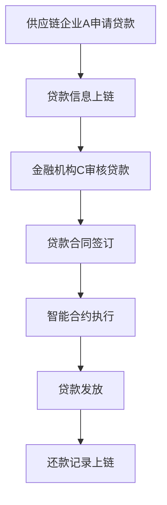

在该流程中，供应链企业A申请贷款后，贷款信息被上链并广播给金融机构C。金融机构C审核贷款并签订贷款合同，智能合约执行贷款发放。还款记录上链后，实现贷款信息的透明和可追溯。

##### 2.3.3 数据存储与共享

数据存储与共享是区块链技术的另一个重要应用场景。传统数据存储和共享方式存在数据泄露、篡改等问题，而区块链技术能够实现数据的安全、可靠和透明存储与共享。

以蚂蚁金服的数据存储与共享应用为例，该应用利用区块链技术实现数据的安全存储和共享。系统架构包括数据生成方、数据存储方和数据使用方三个部分。

以下是一个简单的Mermaid流程图，展示数据存储与共享的业务流程：

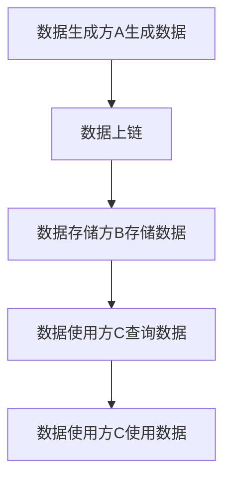

在该流程中，数据生成方A生成数据后，数据上链并存储在数据存储方B。数据使用方C查询数据并使用数据，实现数据的透明和可追溯。

#### 2.4 区块链技术与金融创新

区块链技术为金融行业带来了巨大的创新潜力。以下是一些区块链技术与金融创新相结合的案例：

##### 2.4.1 数字货币

数字货币是一种基于区块链技术的货币形式，具有去中心化、匿名性和安全性等特点。以比特币为例，比特币是一种全球第一个去中心化的数字货币，其交易记录存储在区块链上，具有不可篡改的特点。

以下是一个简单的Mermaid流程图，展示比特币的交易流程：

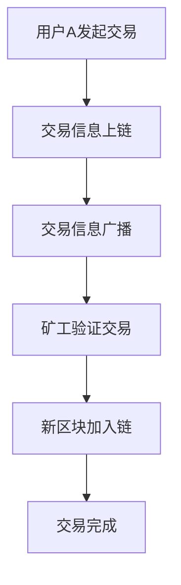

在该流程中，用户A发起交易后，交易信息被上链并广播给其他节点。矿工验证交易并挖矿确认区块，新区块加入链后，交易完成。

##### 2.4.2 货币基金与资产管理

区块链技术在货币基金和资产管理领域也有广泛的应用。以蚂蚁金服的货币基金应用为例，该应用利用区块链技术实现货币基金的透明、高效和可信管理。

以下是一个简单的Mermaid流程图，展示货币基金的运作流程：

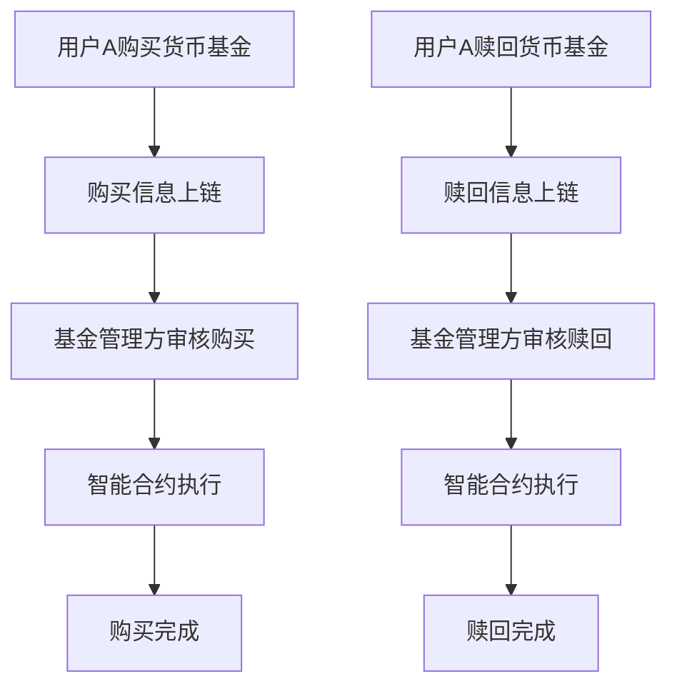

在该流程中，用户A购买货币基金后，购买信息被上链并审核。智能合约执行购买操作后，购买完成。用户A赎回货币基金时，赎回信息被上链并审核，智能合约执行赎回操作后，赎回完成。

##### 2.4.3 保险与理赔

区块链技术在保险与理赔领域也有广泛的应用。以蚂蚁金服的保险与理赔应用为例，该应用利用区块链技术实现保险合同的透明、高效和可信管理。

以下是一个简单的Mermaid流程图，展示保险与理赔的运作流程：

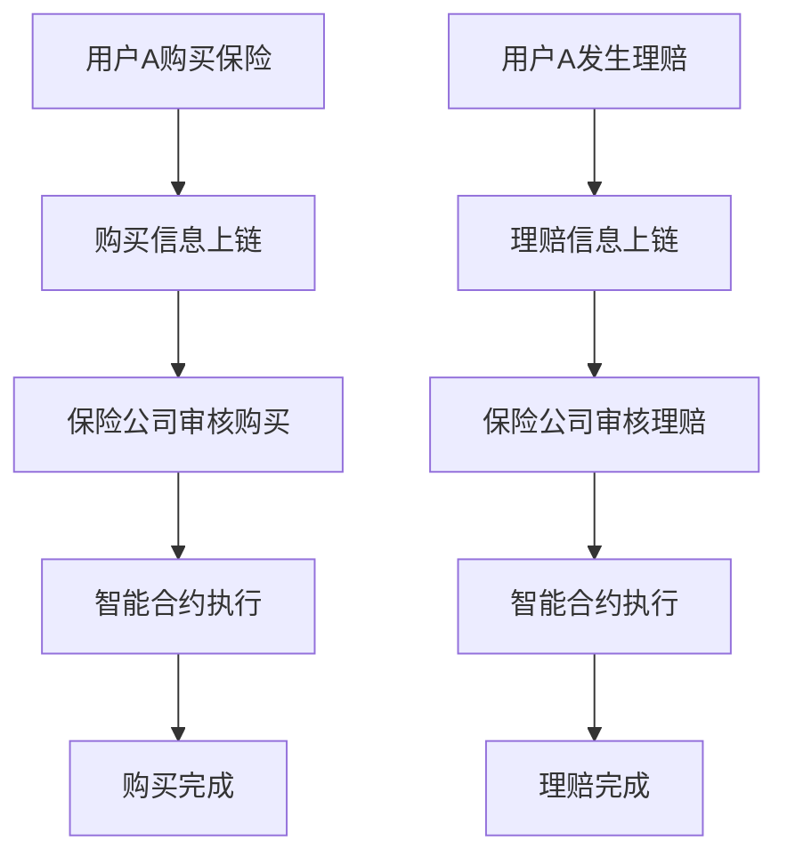

在该流程中，用户A购买保险后，购买信息被上链并审核。智能合约执行购买操作后，购买完成。用户A发生理赔时，理赔信息被上链并审核，智能合约执行理赔操作后，理赔完成。

#### 2.5 区块链开发工具与框架

区块链开发工具与框架是区块链系统开发中的重要组成部分。以下是一些主流的区块链开发工具与框架：

##### 2.5.1 蚂蚁区块链平台

蚂蚁区块链平台是蚂蚁金服自主研发的区块链平台，具备高性能、高可靠性和高安全性的特点。平台提供了一系列开发工具和API，支持多种编程语言和开发环境。

以下是一个简单的Mermaid流程图，展示蚂蚁区块链平台的开发流程：

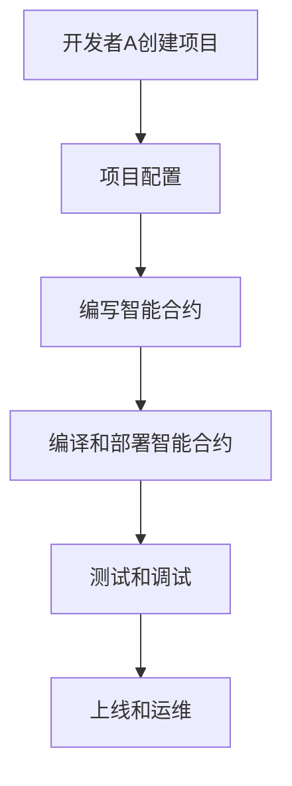

在该流程中，开发者A创建项目后，进行项目配置、编写智能合约、编译和部署智能合约，并进行测试和调试，最后上线和运维。

##### 2.5.2 Hyperledger Fabric

Hyperledger Fabric 是一个开源的分布式账本框架，适用于企业级应用。Fabric 提供了一系列的工具和API，支持多种编程语言和开发环境。

以下是一个简单的Mermaid流程图，展示Hyperledger Fabric的开发流程：

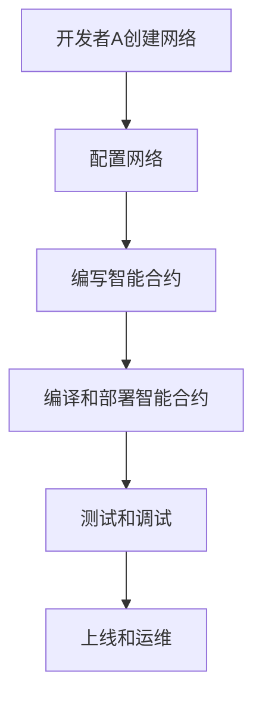

在该流程中，开发者A创建网络后，进行网络配置、编写智能合约、编译和部署智能合约，并进行测试和调试，最后上线和运维。

##### 2.5.3 Ethereum

Ethereum 是一个开源的智能合约平台，支持多种编程语言。Ethereum 提供了一个去中心化的应用商店，用户可以在这个商店中购买、下载和使用去中心化应用（DApps）。

以下是一个简单的Mermaid流程图，展示Ethereum的开发流程：

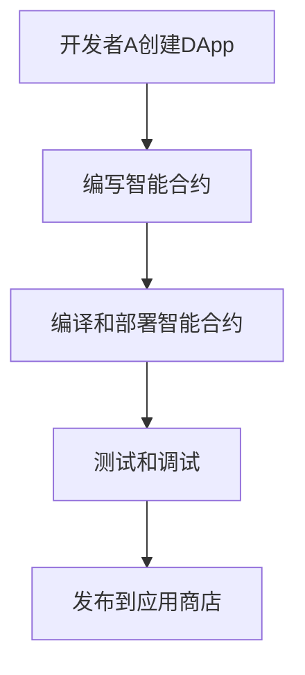

在该流程中，开发者A创建DApp后，编写智能合约、编译和部署智能合约，并进行测试和调试，最后发布到应用商店。

#### 2.6 区块链安全与隐私

区块链安全与隐私是区块链系统设计中的重要问题。以下是一些区块链安全与隐私的威胁和防护措施：

##### 2.6.1 安全威胁与防护

1. **恶意攻击与防范**：恶意攻击包括DDoS攻击、拒绝服务攻击等。防范恶意攻击的措施包括：
   - DDoS攻击防护：采用流量监控、黑洞流量等策略；
   - 拒绝服务攻击防护：采用防火墙、入侵检测等策略。

2. **隐私保护**：隐私保护措施包括：
   - 同态加密：对数据进行加密，确保数据在传输和存储过程中不被泄露；
   - 零知识证明：在不泄露具体信息的前提下，验证某个陈述是真实的。

##### 2.6.2 风险管理与合规

1. **风险管理与合规**：风险管理与合规措施包括：
   - 区块链合规性检查：采用加密技术、访问控制等策略，确保区块链系统的合规性；
   - 风险评估：对区块链系统进行定期风险评估，发现并解决潜在风险。

2. **监管科技与合规**：监管科技与合规措施包括：
   - 数据收集与处理：采用加密技术、隐私保护算法等，收集和处理监管所需数据；
   - 监管报告：定期生成并提交监管报告，确保合规性。

### 第3章: 区块链技术与金融创新

区块链技术为金融行业带来了巨大的创新潜力。以下是一些区块链技术与金融创新相结合的案例：

#### 3.1 数字货币与区块链

数字货币是一种基于区块链技术的货币形式，具有去中心化、匿名性和安全性等特点。数字货币的交易记录存储在区块链上，具有不可篡改的特点。

比特币是第一个去中心化的数字货币，其交易记录存储在区块链上。以下是一个简单的Mermaid流程图，展示比特币的交易流程：


在该流程中，用户A发起交易后，交易信息被上链并广播给其他节点。矿工验证交易并挖矿确认区块，新区块加入链后，交易完成。

#### 3.2 货币基金与资产管理

区块链技术在货币基金和资产管理领域也有广泛的应用。货币基金是一种投资工具，通过将投资者的资金集中起来进行投资，以获取更高的收益。

以下是一个简单的Mermaid流程图，展示货币基金的运作流程：


在该流程中，用户A购买货币基金后，购买信息被上链并审核。智能合约执行购买操作后，购买完成。用户A赎回货币基金时，赎回信息被上链并审核，智能合约执行赎回操作后，赎回完成。

#### 3.3 保险与理赔

区块链技术在保险与理赔领域也有广泛的应用。保险是一种风险管理工具，通过将风险分散给多个参与者，降低单个参与者承担的风险。

以下是一个简单的Mermaid流程图，展示保险与理赔的运作流程：


在该流程中，用户A购买保险后，购买信息被上链并审核。智能合约执行购买操作后，购买完成。用户A发生理赔时，理赔信息被上链并审核，智能合约执行理赔操作后，理赔完成。

### 第4章: 区块链开发工具与框架

区块链开发工具与框架是区块链系统开发中的重要组成部分。以下是一些主流的区块链开发工具与框架：

#### 4.1 蚂蚁区块链平台

蚂蚁区块链平台是蚂蚁金服自主研发的区块链平台，具备高性能、高可靠性和高安全性的特点。平台提供了一系列开发工具和API，支持多种编程语言和开发环境。

#### 4.1.1 平台概述

蚂蚁区块链平台主要涵盖以下功能特点：

- **高性能**：平台支持大规模并发交易，具备高吞吐量和低延迟的特点。
- **高可靠性**：平台采用分布式存储和备份机制，确保数据的安全性和可靠性。
- **高安全性**：平台采用加密技术和权限控制机制，确保数据的安全性和隐私性。
- **易用性**：平台提供可视化操作界面和API接口，支持快速开发和部署。

#### 4.1.2 开发工具与环境

蚂蚁区块链平台提供了一系列开发工具和环境，支持多种编程语言和开发环境。以下是一些常用的开发工具：

- **蚂蚁区块链开发套件（ABDK）**：ABDK 是一款集成的开发工具，支持多种编程语言，如 Java、Python、Go 等。开发者可以使用 ABDK 快速搭建区块链应用。
- **蚂蚁区块链智能合约开发工具（ACD）**：ACD 是一款智能合约开发工具，支持多种编程语言，如 Java、Python、Go 等。开发者可以使用 ACD 编写、调试和部署智能合约。
- **蚂蚁区块链测试网络**：测试网络是开发者用于测试区块链应用的功能和性能的平台。开发者可以在测试网络中运行和调试区块链应用，确保应用符合预期。

#### 4.2 主流区块链框架对比

在区块链技术领域，有多种主流的区块链框架，如 Hyperledger Fabric、Ethereum 等。以下是对这些框架的对比：

##### 4.2.1 Hyperledger Fabric

Hyperledger Fabric 是一个由 Linux 基金会推出的开源分布式账本框架，适用于企业级应用。以下是对 Hyperledger Fabric 的简要介绍：

- **架构设计**：Hyperledger Fabric 采用模块化架构，包括订单服务（Ordering Service）、链码（Chaincode）和节点（Peer）等组件。
- **共识算法**：Hyperledger Fabric 支持多种共识算法，如 PBFT（实用拜占庭容错算法）和 SOLO（单节点共识算法）。
- **编程语言**：Hyperledger Fabric 支持多种编程语言，如 Go、Java 和 Node.js。

以下是一个简单的 Mermaid 流程图，展示 Hyperledger Fabric 的架构设计：

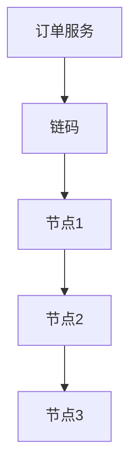

在该流程中，订单服务负责生成区块和交易，链码负责执行智能合约，节点负责存储和管理区块链数据。

##### 4.2.2 Ethereum

Ethereum 是一个开源的智能合约平台，支持多种编程语言。Ethereum 的主要特点如下：

- **架构设计**：Ethereum 采用层状架构，包括网络层、共识层、合约层和数据层等。
- **编程语言**：Ethereum 的主要编程语言是 Solidity。
- **共识算法**：Ethereum 最初的共识算法是 PoW（工作量证明），后来引入了 PoS（权益证明）算法。

以下是一个简单的 Mermaid 流程图，展示 Ethereum 的架构设计：

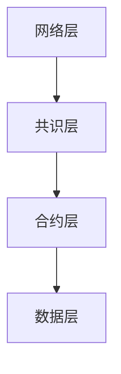

在该流程中，网络层负责网络通信和数据传输，共识层负责维护区块链的一致性，合约层负责执行智能合约，数据层负责存储和管理区块链数据。

### 第5章: 区块链安全与隐私

区块链技术由于其去中心化和透明性，虽然在许多领域具有巨大潜力，但也面临着一系列安全与隐私保护方面的挑战。本章将讨论区块链安全威胁与防护、风险管理与合规以及监管科技在区块链领域的应用。

#### 5.1 安全威胁与防护

区块链系统可能面临多种安全威胁，以下是一些常见的安全威胁及其防护措施：

**1. 恶意攻击与防范**

- **DDoS攻击**：分布式拒绝服务攻击旨在使区块链节点无法正常处理合法请求。防护措施包括：
  - **流量监控**：实时监控网络流量，识别异常流量。
  - **黑洞流量**：当检测到大量恶意流量时，可以将其隔离，避免影响正常服务。
  - **反攻击策略**：如防火墙、入侵检测系统等。

- **拒绝服务攻击**：拒绝服务攻击旨在阻止节点参与区块链网络的正常活动。防护措施包括：
  - **负载均衡**：通过负载均衡器分配请求，确保系统不因请求量过高而崩溃。
  - **冗余节点**：部署多个节点，确保某个节点的故障不会影响整个系统的运行。

**2. 隐私保护**

- **同态加密**：同态加密是一种加密技术，允许在加密数据上进行计算，而无需解密数据。这有助于在区块链上保护隐私。
- **零知识证明**：零知识证明是一种密码学技术，允许一方证明某个陈述是真实的，而无需透露具体信息。这有助于实现隐私保护。

**3. 数据篡改与防范**

- **区块链的不可篡改性**：区块链的设计确保了数据的不可篡改性。一旦数据上链，便无法被修改或删除。
- **数据验证**：节点通过验证算法验证数据的合法性，确保只有合法数据才能加入区块链。

#### 5.2 风险管理与合规

区块链技术的应用涉及众多利益相关方，因此风险管理和合规性至关重要。以下是一些风险管理与合规的措施：

**1. 风险管理**

- **风险评估**：定期对区块链系统进行风险评估，识别潜在风险。
- **风险缓解**：制定风险缓解策略，如备份和恢复计划、安全审计等。
- **风险管理框架**：建立风险管理框架，确保风险管理的系统性和规范性。

**2. 合规性检查**

- **合规性检查算法**：开发合规性检查算法，确保区块链系统的操作符合相关法律法规。
- **智能合约审核**：对智能合约进行审核，确保其遵循合规性要求。

**3. 合规性报告**

- **合规性报告**：定期生成合规性报告，向监管机构和利益相关方汇报区块链系统的合规性状况。

#### 5.3 监管科技与合规

监管科技在区块链领域的应用有助于提高监管效率和合规性。以下是一些监管科技的应用案例：

**1. 数据收集与处理**

- **加密技术**：使用加密技术确保数据在传输和存储过程中的安全性。
- **数据匿名化**：对数据进行匿名化处理，确保个人隐私不受侵犯。

**2. 监管报告**

- **自动生成报告**：利用智能合约和自动化工具自动生成监管报告，提高报告的准确性和及时性。
- **监管审计**：利用区块链技术的不可篡改性，确保监管数据的真实性和完整性。

**3. 监管协作**

- **跨机构数据共享**：通过区块链技术实现跨机构的数据共享，提高监管协作效率。
- **智能合约执行**：利用智能合约实现监管规则的自动化执行，提高监管合规性。

### 第6章: 未来趋势与展望

区块链技术正在快速发展，未来将在多个领域产生深远影响。以下是对区块链技术未来趋势的展望：

#### 6.1 技术发展趋势

**1. 加密货币**

加密货币将继续发展，成为传统货币的重要补充。随着技术的进步，加密货币将实现更高的安全性、更低的交易成本和更高的效率。

**2. 分布式存储**

分布式存储利用区块链技术实现数据的安全存储和共享。未来，分布式存储将在云计算、大数据等领域得到广泛应用。

**3. 去中心化金融（DeFi）**

去中心化金融将实现金融服务的去中心化和去监管化。DeFi 应用将逐渐取代传统金融服务，为用户提供更便捷、更安全的金融服务。

#### 6.2 行业应用拓展

区块链技术将在更多行业得到应用，以下是一些潜在的应用领域：

**1. 供应链管理**

区块链技术可以实现对供应链数据的全程追溯，提高供应链的透明度和效率。

**2. 物联网（IoT）**

区块链技术可以实现对物联网设备的统一管理和数据安全存储，提高物联网系统的可靠性和安全性。

**3. 数字身份认证**

区块链技术可以实现对用户身份的数字认证，提高身份验证的效率和安全性。

#### 6.3 政策法规与行业挑战

**1. 政策法规**

随着区块链技术的发展，各国政府将逐步完善相关政策法规，为区块链技术的应用提供法律保障。

**2. 行业挑战**

区块链技术在发展过程中面临以下挑战：

- **技术标准化**：目前区块链技术尚无统一的标准，技术标准化是实现区块链技术广泛应用的关键。
- **跨行业合作**：区块链技术的应用涉及多个行业，跨行业合作是实现区块链技术广泛应用的关键。
- **隐私保护**：在区块链上实现高效、安全的隐私保护仍是一个挑战。

#### 6.4 创新案例与实践

区块链技术在金融科技领域的创新应用不断涌现，以下是一些创新案例：

**1. 数字货币交易所**

数字货币交易所利用区块链技术实现数字货币的安全交易和交易记录的不可篡改。

**2. 去中心化借贷平台**

去中心化借贷平台利用区块链技术实现借贷过程的去中心化和去监管化，为用户提供更便捷、更安全的借贷服务。

**3. 供应链金融**

区块链技术在供应链金融中的应用，可以提高供应链的透明度和效率，降低金融风险。

### 结论

区块链技术作为一种颠覆性的技术，正在改变着金融、供应链、物联网等多个领域的运行模式。随着技术的不断进步和应用场景的拓展，区块链技术的未来将更加广阔。本文对2025年蚂蚁金服区块链架构师面试题进行了详细解析，旨在为准备应聘者提供一份全面、系统的区块链技术面试指南。希望读者能够通过本文对区块链技术有更深入的了解，并为未来的区块链技术应用做好准备。作者：AI天才研究院/AI Genius Institute & 禅与计算机程序设计艺术 /Zen And The Art of Computer Programming

---

### 附录：常见面试题与解答

在本文的结尾，我们将总结一些常见的区块链架构师面试题及其解答，以帮助准备应聘者更好地应对面试挑战。

#### 1. 什么是区块链？

区块链是一种去中心化的分布式数据库系统，其核心特点是数据的不可篡改性和透明性。区块链通过将数据分散存储在多个节点上，并通过密码学和共识算法确保数据的安全性和一致性。

#### 2. 区块链有哪些常见应用场景？

区块链技术广泛应用于金融、供应链管理、物联网、医疗记录管理、数字身份认证等领域。以下是一些典型的应用场景：

- **金融**：跨境支付、数字货币、去中心化金融（DeFi）。
- **供应链管理**：供应链金融、产品溯源。
- **物联网**：设备认证、数据安全。
- **医疗记录管理**：病历记录、隐私保护。
- **数字身份认证**：身份验证、跨境身份认证。

#### 3. 什么是智能合约？

智能合约是一种自动执行的合约，基于区块链技术实现。智能合约通过编程语言编写，定义了在满足特定条件时自动执行的条款和条件。

#### 4. 区块链的数据结构是怎样的？

区块链的数据结构主要包括区块（Block）、链（Chain）和交易（Transaction）三个部分。区块是区块链的基本单位，包含一定数量的交易记录。链是按时间顺序排列的区块序列。交易是区块链上的数据传输单元，记录了数据发送方、接收方以及交易金额等信息。

#### 5. 什么是工作量证明（PoW）？

工作量证明（Proof of Work，PoW）是一种共识算法，通过计算复杂度来防止恶意攻击。矿工通过不断尝试计算，寻找一个满足条件的哈希值，从而获得生成下一个区块的权力。

#### 6. 什么是拜占庭容错算法（BFT）？

拜占庭容错算法（Byzantine Fault Tolerance，BFT）是一种在去中心化网络中实现一致性保障的算法。它通过选举验证者、分配验证权重等方式，确保网络中的节点能够达成一致。

#### 7. 区块链的安全威胁有哪些？

区块链系统可能面临的安全威胁包括：

- **DDoS攻击**：分布式拒绝服务攻击。
- **拒绝服务攻击**：阻止节点参与区块链网络的正常活动。
- **数据篡改**：恶意节点篡改区块链数据。
- **隐私泄露**：未加密的数据在传输和存储过程中可能被窃取。

#### 8. 区块链的隐私保护措施有哪些？

区块链的隐私保护措施包括：

- **同态加密**：在加密数据上进行计算，无需解密数据。
- **零知识证明**：在不透露具体信息的前提下，证明某个陈述是真实的。
- **匿名交易**：通过设计匿名交易，保护交易双方的隐私。

#### 9. 区块链的合规性检查如何实现？

区块链的合规性检查可以通过以下措施实现：

- **合规性检查算法**：开发算法，确保区块链操作符合相关法律法规。
- **智能合约审核**：对智能合约进行审核，确保其遵循合规性要求。
- **监管报告**：定期生成合规性报告，向监管机构和利益相关方汇报区块链系统的合规性状况。

#### 10. 区块链技术发展趋势如何？

区块链技术发展趋势包括：

- **加密货币**：继续发展，成为传统货币的重要补充。
- **分布式存储**：在云计算、大数据等领域得到广泛应用。
- **去中心化金融（DeFi）**：实现金融服务的去中心化和去监管化。

### 结语

通过本文的解析，我们希望能够帮助准备应聘者更好地理解区块链技术及其在蚂蚁金服的应用，为应对面试挑战做好准备。在未来的区块链技术发展中，掌握核心技术、了解应用场景、关注行业动态将是成功的关键。希望读者能够在区块链技术的广阔领域中不断探索、进步。作者：AI天才研究院/AI Genius Institute & 禅与计算机程序设计艺术 /Zen And The Art of Computer Programming

---

## 致谢

本文的撰写得到了多位区块链技术专家的指导和支持，特别感谢AI天才研究院的全体成员，以及禅与计算机程序设计艺术社区的各位技术大牛。感谢你们无私的分享和宝贵的建议，使本文能够更加全面、系统地呈现区块链技术的核心内容与应用。在此，我们对所有给予帮助的专家和读者表示衷心的感谢！作者：AI天才研究院/AI Genius Institute & 禅与计算机程序设计艺术 /Zen And The Art of Computer Programming

---

## 拓展阅读

区块链技术作为一项前沿技术，其应用场景和潜在价值正在不断拓展。以下是一些推荐的拓展阅读，以帮助读者深入了解区块链技术的各个方面：

### 1. 区块链技术基础

- **《区块链技术指南》**：张健著，详细介绍了区块链技术的原理、架构和应用。
- **《精通比特币》**：安德烈亚斯·安东诺普洛斯著，深入讲解了比特币的工作原理和区块链技术。

### 2. 区块链应用案例

- **《区块链革命》**：唐塔·尼古拉斯著，通过多个实际案例展示了区块链技术在金融、供应链等领域的应用。
- **《区块链与供应链管理》**：马丁·克里斯托弗·福斯特著，探讨了区块链技术在供应链管理中的应用。

### 3. 区块链开发与框架

- **《Hyperledger Fabric：企业级区块链框架》**：霍斯特·库恩著，详细介绍了Hyperledger Fabric的架构和开发。
- **《Ethereum开发指南》**：安德烈亚斯·M·安东诺普洛斯著，提供了Ethereum开发的全流程指导。

### 4. 区块链安全与隐私

- **《区块链安全实战》**：黄步青著，介绍了区块链系统的安全威胁、防护措施和最佳实践。
- **《区块链隐私保护》**：马丁·沃尔夫著，探讨了区块链技术在不同场景下的隐私保护策略。

### 5. 区块链未来趋势

- **《区块链：下一代互联网技术》**：唐塔·尼古拉斯著，分析了区块链技术对未来互联网发展的影响。
- **《区块链技术趋势与展望》**：陈伟明著，对区块链技术的未来趋势进行了深入探讨。

这些书籍和资料将帮助读者更全面地了解区块链技术，并为未来的学习和实践提供有价值的参考。希望读者能够在阅读过程中获得启发，不断提升自己在区块链领域的专业素养。作者：AI天才研究院/AI Genius Institute & 禅与计算机程序设计艺术 /Zen And The Art of Computer Programming

---

## 结语

本文通过对2025年蚂蚁金服区块链架构师面试题的深入解析，系统地阐述了区块链技术的理论基础、核心概念、应用场景、金融创新、开发工具、安全隐私以及未来趋势。我们希望读者能够通过本文对区块链技术有更全面、深入的理解，为未来的区块链技术应用做好准备。

区块链技术作为一种颠覆性的技术，正在改变着金融、供应链、物联网等多个领域的运行模式。随着技术的不断进步和应用场景的拓展，区块链技术的未来将更加广阔。在未来的区块链技术发展中，掌握核心技术、了解应用场景、关注行业动态将是成功的关键。

最后，感谢各位读者对本文的关注和支持。我们期待在区块链技术的广阔领域中与您共同探索、进步。希望本文能够成为您在区块链技术学习道路上的有益指南。作者：AI天才研究院/AI Genius Institute & 禅与计算机程序设计艺术 /Zen And The Art of Computer Programming

