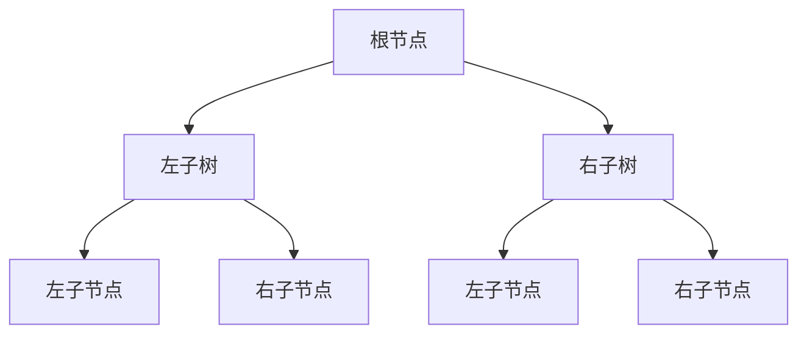
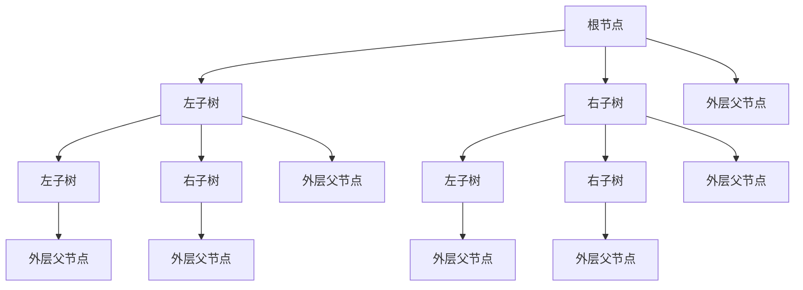

                 

### 文章标题：2025年阿里巴巴校招算法岗位面试题目汇编

> 关键词：阿里巴巴校招、算法面试、数据结构、动态规划、贪心算法、数学推理、编程实战

> 摘要：本文旨在为准备2025年阿里巴巴校招算法岗位的应聘者提供一份详尽的面试题目汇编。文章将分为多个部分，包括算法与数据结构基础、算法设计与分析、数学与逻辑推理、算法应用与实战、编码实战与技巧、面试准备与心态调整，以及阿里巴巴校招算法岗位面试真题汇编。通过详细的题目解析和实战案例，帮助读者深入理解面试题目的核心原理和解题思路，为应对面试做好充分准备。

### 《2025年阿里巴巴校招算法岗位面试题目汇编》目录大纲

#### 第一部分：算法基础与面试技巧

1. **算法与数据结构概述**
    - 算法概述
        - 算法的定义与分类
        - 常见算法复杂度分析
    - 数据结构基础
        - 线性结构：数组、链表、栈、队列
        - 树结构：二叉树、平衡树、AVL树、红黑树
        - 图结构：图的定义、图的存储、图的遍历

2. **算法设计与分析**
    - 分治策略
        - 分治算法的基本思想
        - 常见分治算法：归并排序、快速排序
    - 动态规划
        - 动态规划的基本概念
        - 常见动态规划问题：最长公共子序列、最长递增子序列
    - 贪心算法
        - 贪心算法的基本原理
        - 常见贪心算法问题：背包问题、最小生成树

3. **数学与逻辑推理**
    - 数学基础
        - 线性代数基础
        - 概率论基础
    - 逻辑推理
        - 逻辑命题与推理
        - 真值表与逻辑推理

4. **算法应用与实战**
    - 常见面试题分类解析
        - 数组和字符串
        - 树和图
        - 动态规划和贪心算法
    - 算法面试题目解析
        - 题目一：两数之和
        - 题目二：最长公共子串
        - 题目三：二叉树的遍历
        - 题目四：设计一个LRU缓存机制

5. **编码实战与技巧**
    - 编码实战案例
        - 编码实战一：实现一个二叉搜索树
        - 编码实战二：设计一个LRU缓存
        - 编码实战三：实现一个堆排序算法
    - 编码技巧
        - 代码可读性和规范性
        - 代码优化和性能分析
        - 编码面试中的常见陷阱

6. **面试准备与心态调整**
    - 面试准备策略
        - 面试流程与常见问题
        - 如何准备简历和自我介绍
        - 如何准备面试官可能提出的问题
    - 心态调整
        - 面试前的心理准备
        - 如何应对面试中的紧张情绪
        - 如何保持积极的心态

7. **阿里巴巴校招算法岗位面试真题汇编**
    - 面试题类型分析
        - 数学和逻辑推理题
        - 算法和数据结构题
        - 编码实战题
    - 面试题解析
        - 真题一：平衡二叉树
        - 真题二：最长公共子序列
        - 真题三：二叉树的遍历
        - 真题四：设计一个LRU缓存机制

#### 附录

- 附录A：面试必备资源与工具
    - 面试资料推荐
    - 编码工具推荐
    - 面试技巧总结

- 附录B：经典算法与数据结构流程图
    - 二叉搜索树
    - 红黑树

### 算法与数据结构概述

在计算机科学中，算法和数据结构是两个基本概念，它们在解决问题时起着至关重要的作用。算法是一系列解决问题的步骤，而数据结构则是用于存储和组织数据的方式。理解这些概念及其相互关系，是掌握算法设计与分析的基础。

#### 算法的定义与分类

算法（Algorithm）可以简单理解为解决问题的方法。一个良好的算法应具备以下几个特点：

- **正确性**：能够正确地解决特定问题。
- **高效性**：在合理的时间内完成计算。
- **健壮性**：能够处理各种输入数据，包括异常数据。

算法根据其处理问题的不同方式，可以分为以下几类：

- **确定性算法**：每一步都有明确且唯一的操作。
- **非确定性算法**：在某些步骤中存在多个可能的操作。
- **启发式算法**：在不可行或不确定的情况下，采用某种策略快速找到解。

#### 常见算法复杂度分析

算法的复杂度通常用时间复杂度和空间复杂度来衡量。

- **时间复杂度**：描述算法执行时间与输入数据规模的关系。常见的时间复杂度有：
    - **常数时间**：$O(1)$
    - **对数时间**：$O(\log n)$
    - **线性时间**：$O(n)$
    - **对数线性时间**：$O(n \log n)$
    - **多项式时间**：$O(n^k)$，其中$k$是常数

- **空间复杂度**：描述算法执行过程中所需存储空间的规模。常见空间复杂度有：
    - **常数空间**：$O(1)$
    - **线性空间**：$O(n)$

#### 数据结构基础

数据结构是用于存储和组织数据的方式。常见的数据结构包括：

- **线性结构**：数组、链表、栈、队列
    - **数组**：固定大小，可以快速访问任何元素。
    - **链表**：动态大小，插入和删除操作灵活。
    - **栈**：后进先出（LIFO）的数据结构。
    - **队列**：先进先出（FIFO）的数据结构。

- **树结构**：二叉树、平衡树、AVL树、红黑树
    - **二叉树**：每个节点最多有两个子节点。
    - **平衡树**：保证树的高度平衡，常见有AVL树和红黑树。
    - **AVL树**：自平衡的二叉搜索树。
    - **红黑树**：保持树的平衡，适用于查找、插入和删除操作。

- **图结构**：图的定义、图的存储、图的遍历
    - **图**：由节点（或称为顶点）和边组成的集合。
    - **图的存储**：邻接矩阵和邻接表。
    - **图的遍历**：深度优先搜索（DFS）和广度优先搜索（BFS）。

通过了解这些基础概念，我们可以更好地理解后续章节中更复杂的算法设计和分析。

### 数据结构基础

在计算机科学中，数据结构是用于存储和组织数据的方式，是算法实现的基础。数据结构可以分为线性结构和非线性结构。本节将详细介绍几种常见的线性结构和非线性结构。

#### 线性结构

线性结构是一种数据组织方式，数据元素按照线性顺序排列。常见的线性结构有数组、链表、栈和队列。

**1. 数组**

数组是一种固定大小的线性结构，它通过索引来访问元素。数组的优点是元素可以直接通过索引访问，访问速度较快。然而，数组的缺点是它的大小是固定的，无法动态扩展。

**伪代码：**

```
function accessArray(arr, index):
    return arr[index]

function printArray(arr):
    for i from 0 to length(arr) - 1:
        print(arr[i])
```

**2. 链表**

链表是一种动态大小的线性结构，通过节点来存储数据。每个节点包含数据域和指向下一个节点的指针。链表的优点是它可以根据需要动态地扩展和缩小，插入和删除操作也很方便。

**伪代码：**

```
class Node:
    data = None
    next = None

function insertAtHead(head, data):
    newNode = new Node()
    newNode.data = data
    newNode.next = head
    return newNode

function printLinkedList(head):
    current = head
    while current is not None:
        print(current.data)
        current = current.next
```

**3. 栈**

栈是一种后进先出（LIFO）的线性结构，新加入的元素位于栈顶，删除元素也是从栈顶开始。栈常用于递归和表达式求值等场景。

**伪代码：**

```
class Stack:
    items = []

function push(item):
    items.append(item)

function pop():
    return items.pop()

function isEmpty():
    return len(items) == 0
```

**4. 队列**

队列是一种先进先出（FIFO）的线性结构，新加入的元素位于队列末尾，删除元素是从队列头部开始。队列常用于任务调度和缓冲管理等场景。

**伪代码：**

```
class Queue:
    items = []

function enqueue(item):
    items.append(item)

function dequeue():
    return items.pop(0)

function isEmpty():
    return len(items) == 0
```

#### 非线性结构

非线性结构是数据元素之间不存在线性关系的数据结构，常见的非线性结构有树和图。

**1. 树**

树是一种层次结构，由节点和边组成。树中的节点可以分为根节点、内部节点和叶子节点。树常用于表示层次关系和分类结构。

**二叉树**

二叉树是一种特殊的树，每个节点最多有两个子节点。二叉树可以用于表示二叉搜索树、平衡树（如AVL树和红黑树）等。

**伪代码：**

```
class TreeNode:
    data = None
    left = None
    right = None

function insert(root, data):
    if root is None:
        return new TreeNode(data)
    if data < root.data:
        root.left = insert(root.left, data)
    else:
        root.right = insert(root.right, data)
    return root
```

**2. 图**

图是一种由节点和边组成的数据结构，节点表示实体，边表示实体之间的关系。图可以用于表示网络、社交网络、交通网络等复杂结构。

**伪代码：**

```
class Graph:
    nodes = []
    edges = []

function addNode(node):
    nodes.append(node)

function addEdge(node1, node2):
    edges.append([node1, node2])
```

通过了解这些常见的数据结构，我们可以更好地选择合适的数据结构来存储和组织数据，从而提高算法的效率和性能。

### 算法设计与分析

算法的设计与分析是计算机科学中的核心内容，直接影响到算法的效率和适用性。在这一部分，我们将介绍几种常见的算法设计策略，包括分治策略、动态规划策略和贪心策略。

#### 分治策略

分治策略是一种将复杂问题分解为若干个规模更小的相同问题进行求解，再将子问题的解合并得到原问题的解的算法设计策略。分治策略的基本思想是将问题分解为子问题，递归地求解子问题，然后将子问题的解合并得到原问题的解。

分治策略的三个基本步骤如下：

1. **分解**：将原问题分解为若干个规模较小的相同问题。
2. **递归求解**：递归地求解各个子问题。
3. **合并**：将子问题的解合并得到原问题的解。

常见的分治算法包括归并排序和快速排序。

**归并排序**

归并排序是一种基于分治策略的排序算法。它的基本思想是将数组分解为若干个大小为1的子数组，然后两两归并，最终得到一个有序的数组。

**伪代码：**

```
function mergeSort(arr):
    if length(arr) <= 1:
        return arr
    mid = length(arr) / 2
    left = mergeSort(arr[0:mid])
    right = mergeSort(arr[mid:end])
    return merge(left, right)

function merge(left, right):
    result = []
    while length(left) > 0 and length(right) > 0:
        if left[0] <= right[0]:
            result.append(left[0])
            left = left[1:]
        else:
            result.append(right[0])
            right = right[1:]
    result.extend(left)
    result.extend(right)
    return result
```

**快速排序**

快速排序也是一种基于分治策略的排序算法。它的基本思想是通过一趟排序将数组分为两个子数组，其中一边的所有元素都比另一边的元素小，然后递归地对两个子数组进行排序。

**伪代码：**

```
function quickSort(arr, low, high):
    if low < high:
        pivot = partition(arr, low, high)
        quickSort(arr, low, pivot - 1)
        quickSort(arr, pivot + 1, high)

function partition(arr, low, high):
    pivot = arr[high]
    i = low - 1
    for j from low to high - 1:
        if arr[j] <= pivot:
            i = i + 1
            swap(arr[i], arr[j])
    swap(arr[i + 1], arr[high])
    return i + 1
```

#### 动态规划策略

动态规划策略是一种用于求解最优子问题的递归算法，其基本思想是将原问题分解为若干个规模较小的子问题，并存储子问题的解，以避免重复计算。

动态规划的一般步骤如下：

1. **定义状态**：确定问题中的状态变量及其取值范围。
2. **定义状态转移方程**：确定状态之间的转换关系。
3. **初始化**：初始化状态表。
4. **计算状态表**：根据状态转移方程计算状态表。
5. **求解**：从状态表中得到原问题的解。

常见的动态规划问题包括最长公共子序列、最长递增子序列和背包问题。

**最长公共子序列**

最长公共子序列（Longest Common Subsequence，LCS）问题是寻找两个序列中公共子序列最长的问题。

**伪代码：**

```
function lcs(X, Y):
    m = length(X)
    n = length(Y)
    C = createMatrix(m+1, n+1)
    for i from 0 to m:
        for j from 0 to n:
            if i = 0 or j = 0:
                C[i][j] = 0
            else if X[i-1] = Y[j-1]:
                C[i][j] = C[i-1][j-1] + 1
            else:
                C[i][j] = max(C[i-1][j], C[i][j-1])
    return C[m][n]
```

**最长递增子序列**

最长递增子序列（Longest Increasing Subsequence，LIS）问题是寻找一个子序列，其元素严格递增，且长度最长。

**伪代码：**

```
function LIS(X):
    n = length(X)
    P = [1 for _ in range(n)]
    length = [1 for _ in range(n)]
    for i from 1 to n:
        for j from 0 to i - 1:
            if X[j] < X[i] and length[j] + 1 > length[i]:
                length[i] = length[j] + 1
                P[i] = j
    max_length = max(length)
    result = []
    for i from n - 1 to 0:
        if length[i] = max_length:
            result.append(X[i])
            max_length = max_length - 1
    return result[::-1]
```

**背包问题**

背包问题（Knapsack Problem）是一种常见的动态规划问题，其基本思想是在给定物品和背包容量下，选择部分物品放入背包中，使得背包中的物品总重量不超过背包的容量，且物品的总价值最大。

**伪代码：**

```
function knapsack(W, weights, values, n):
    dp = createMatrix(n+1, W+1)
    for i from 1 to n:
        for w from 0 to W:
            if weights[i-1] > w:
                dp[i][w] = dp[i-1][w]
            else:
                dp[i][w] = max(dp[i-1][w], dp[i-1][w-weights[i-1]] + values[i-1])
    return dp[n][W]
```

#### 贪心策略

贪心策略是一种在每一步选择当前最优解，从而得到全局最优解的算法设计策略。贪心策略的基本思想是每一步都做出局部最优的选择，最终通过这些局部最优的选择得到全局最优解。

常见的贪心算法包括背包问题和最小生成树。

**背包问题**

**伪代码：**

```
function greedyKnapsack(values, weights, W):
    items = sorted(zip(values, weights), key=lambda x: x[0] / x[1], reverse=True)
    total_value = 0
    total_weight = 0
    for value, weight in items:
        if total_weight + weight <= W:
            total_value += value
            total_weight += weight
    return total_value
```

**最小生成树**

最小生成树（Minimum Spanning Tree，MST）是一种连接图中所有节点的树，其边权和最小。常见的贪心算法包括普里姆算法和克鲁斯卡尔算法。

**普里姆算法**

**伪代码：**

```
function prim(MST, G, start):
    MST = []
    visited = [False for _ in range(len(G))]
    start = 0
    visited[start] = True
    while len(MST) < len(G) - 1:
        min_weight = infinity
        min_edge = None
        for i from 0 to len(G) - 1:
            if visited[i]:
                for j from 0 to len(G[i]) - 1:
                    if not visited[j] and G[i][j] < min_weight:
                        min_weight = G[i][j]
                        min_edge = (i, j)
        MST.append(min_edge)
        visited[min_edge[1]] = True
    return MST
```

**克鲁斯卡尔算法**

**伪代码：**

```
function kruskal(MST, edges):
    MST = []
    unions = UnionFind()
    for edge in edges:
        if unions.find(edge[0]) != unions.find(edge[1]):
            MST.append(edge)
            unions.union(edge[0], edge[1])
    return MST
```

通过介绍分治策略、动态规划策略和贪心策略，我们可以更好地理解和设计各种算法。在实际问题中，根据问题的特点和需求，选择合适的算法设计策略，可以有效地提高算法的效率和适用性。

### 数学与逻辑推理

在算法设计和分析中，数学和逻辑推理扮演着至关重要的角色。数学知识不仅帮助我们理解和描述算法的复杂性，还能提供有效的解决方案。逻辑推理则是确保算法正确性的关键。在这一部分，我们将探讨一些基础的数学知识和逻辑推理技巧。

#### 数学基础

数学基础主要包括线性代数和概率论。

**1. 线性代数基础**

线性代数在算法中应用广泛，涉及矩阵运算、向量计算等。以下是一个简单的矩阵运算示例：

**矩阵加法：**

假设有两个矩阵 \(A\) 和 \(B\)：

$$
A = \begin{bmatrix}
a_{11} & a_{12} & \cdots & a_{1n} \\
a_{21} & a_{22} & \cdots & a_{2n} \\
\vdots & \vdots & \ddots & \vdots \\
a_{n1} & a_{n2} & \cdots & a_{nn}
\end{bmatrix}
$$

$$
B = \begin{bmatrix}
b_{11} & b_{12} & \cdots & b_{1n} \\
b_{21} & b_{22} & \cdots & b_{2n} \\
\vdots & \vdots & \ddots & \vdots \\
b_{n1} & b_{n2} & \cdots & b_{nn}
\end{bmatrix}
$$

它们的矩阵加法结果为：

$$
C = A + B = \begin{bmatrix}
a_{11} + b_{11} & a_{12} + b_{12} & \cdots & a_{1n} + b_{1n} \\
a_{21} + b_{21} & a_{22} + b_{22} & \cdots & a_{2n} + b_{2n} \\
\vdots & \vdots & \ddots & \vdots \\
a_{n1} + b_{n1} & a_{n2} + b_{n2} & \cdots & a_{nn} + b_{nn}
\end{bmatrix}
$$

**2. 概率论基础**

概率论在算法设计和分析中非常重要，用于评估算法的随机行为。以下是一个基本的概率计算示例：

假设有两个事件 \(A\) 和 \(B\)，其概率分别为 \(P(A)\) 和 \(P(B)\)。如果 \(A\) 和 \(B\) 是独立事件，则它们的联合概率为：

$$
P(A \cap B) = P(A) \times P(B)
$$

另外，条件概率也是一个重要概念。给定事件 \(B\) 已发生，事件 \(A\) 发生的条件概率为：

$$
P(A|B) = \frac{P(A \cap B)}{P(B)}
$$

#### 逻辑推理

逻辑推理在算法验证和设计过程中至关重要。以下是一些基础逻辑推理技巧：

**1. 逻辑命题与推理**

逻辑命题是表示逻辑关系的语句，通常用命题变元和逻辑运算符来表示。基本的逻辑运算符包括：

- **合取（AND）**：表示两个命题同时为真。
- **析取（OR）**：表示两个命题中至少有一个为真。
- **非（NOT）**：表示命题的真值取反。
- **条件（IF-THEN）**：表示前件为真时后件也为真。

例如，以下是一个逻辑命题及其推理：

- 命题：如果 \(A\) 为真，则 \(B\) 为真。
- 逻辑推理：由于 \(A\) 为真，根据条件命题，可以推出 \(B\) 也为真。

**2. 真值表与逻辑推理**

真值表是用于表示逻辑命题的真假值的表格。通过真值表，可以验证逻辑命题的逻辑关系。以下是一个简单的真值表示例：

| \(A\) | \(B\) | \(A \land B\) | \(A \lor B\) | \(A \rightarrow B\) |
| ----- | ----- | ------------ | ------------ | ----------------- |
| True  | True  | True         | True         | True              |
| True  | False | False        | True         | False             |
| False | True  | False        | True         | True              |
| False | False | False        | False        | True              |

通过真值表，可以清楚地看到各种逻辑运算的结果。

通过以上数学和逻辑推理的基础知识，我们可以更好地理解和分析算法，确保其正确性和高效性。

### 算法应用与实战

在实际的算法面试中，除了理论知识，理解并能够实现算法也是非常重要的。本节将介绍几种常见的面试题分类，包括数组和字符串、树和图、动态规划和贪心算法，并提供相应的示例题目和解析。

#### 数组和字符串

**1. 数组和字符串的基础操作**

数组是计算机科学中最常用的数据结构之一。以下是一些基础操作：

- **查找元素**：通过索引快速访问数组中的元素。
- **插入和删除**：在数组中插入或删除元素，可能需要移动其他元素。
- **排序**：对数组中的元素进行排序。

**示例题目**：给定一个数组，找出其中的两个数，使它们的和等于目标值。

**解题思路**：可以使用哈希表来存储数组中的元素，遍历数组时，对于每个元素，可以检查哈希表中是否存在目标值减去当前元素的值。

**伪代码**：

```
function twoSum(nums, target):
    hashTable = {}
    for i from 0 to length(nums) - 1:
        complement = target - nums[i]
        if complement in hashTable:
            return [i, hashTable[complement]]
        hashTable[nums[i]] = i
    return []
```

**2. 字符串操作**

字符串是字符的序列，常用于表示文本。以下是一些常见的字符串操作：

- **查找子串**：检查一个字符串是否包含另一个字符串。
- **反转字符串**：将字符串中的字符顺序反转。
- **字符串比较**：比较两个字符串的大小。

**示例题目**：给定两个字符串，找出它们的公共子串。

**解题思路**：可以使用动态规划来求解最长公共子串。

**伪代码**：

```
function longestCommonSubstring(s1, s2):
    m = length(s1)
    n = length(s2)
    dp = createMatrix(m+1, n+1)
    longestLength = 0
    longestEnd = 0
    for i from 1 to m:
        for j from 1 to n:
            if s1[i-1] = s2[j-1]:
                dp[i][j] = dp[i-1][j-1] + 1
                if dp[i][j] > longestLength:
                    longestLength = dp[i][j]
                    longestEnd = i
            else:
                dp[i][j] = 0
    return s1[longestEnd - longestLength + 1:longestEnd + 1]
```

#### 树和图

树是一种重要的非线性数据结构，用于表示层次关系。图则是一种更一般的数据结构，用于表示复杂的关系。

**1. 树的基本操作**

- **遍历**：前序遍历、中序遍历、后序遍历。
- **查找**：通过节点值查找树中的节点。
- **插入和删除**：在树中插入新节点或删除节点。

**示例题目**：给定一个二叉树，找出其最大深度。

**解题思路**：可以使用递归或迭代的方法遍历树，计算每个节点的深度，并返回最大深度。

**伪代码**：

```
function maxDepth(root):
    if root is None:
        return 0
    leftDepth = maxDepth(root.left)
    rightDepth = maxDepth(root.right)
    return max(leftDepth, rightDepth) + 1
```

**2. 图的基本操作**

- **遍历**：深度优先搜索（DFS）和广度优先搜索（BFS）。
- **连通性**：判断图中是否存在路径连接两个节点。
- **最短路径**：计算图中两点之间的最短路径。

**示例题目**：给定一个图，找出从起点到终点的最短路径。

**解题思路**：可以使用Dijkstra算法或Floyd算法来求解最短路径。

**伪代码**（Dijkstra算法）：

```
function dijkstra(graph, start, end):
    distances = [infinity for _ in range(len(graph))]
    distances[start] = 0
    visited = [False for _ in range(len(graph))]
    for _ in range(len(graph)):
        minDistance = infinity
        for i from 0 to len(graph) - 1:
            if not visited[i] and distances[i] < minDistance:
                minDistance = distances[i]
                minIndex = i
        visited[minIndex] = True
        for neighbor in graph[minIndex]:
            distance = distances[minIndex] + graph[minIndex][neighbor]
            if distance < distances[neighbor]:
                distances[neighbor] = distance
    return distances[end]
```

#### 动态规划和贪心算法

动态规划和贪心算法是解决优化问题的重要工具。动态规划通常用于求解最优子问题，而贪心算法则通过每一步选择最优解来求解全局最优解。

**1. 动态规划**

动态规划适用于具有重叠子问题和最优子结构特征的问题。以下是一个常见的动态规划问题：最长公共子序列。

**示例题目**：给定两个字符串，找出它们的最长公共子序列。

**解题思路**：使用二维动态规划表存储子序列的长度，通过填充表格来求解最长公共子序列。

**伪代码**：

```
function longestCommonSubsequence(s1, s2):
    m = length(s1)
    n = length(s2)
    dp = createMatrix(m+1, n+1)
    for i from 1 to m:
        for j from 1 to n:
            if s1[i-1] = s2[j-1]:
                dp[i][j] = dp[i-1][j-1] + 1
            else:
                dp[i][j] = max(dp[i-1][j], dp[i][j-1])
    return dp[m][n]
```

**2. 贪心算法**

贪心算法通过每一步选择局部最优解来求解全局最优解。以下是一个常见的贪心算法问题：背包问题。

**示例题目**：给定物品的重量和值，以及背包的容量，求解如何选择物品使得背包的总价值最大。

**解题思路**：按照单位价值从高到低排序物品，选择尽可能多的物品放入背包。

**伪代码**：

```
function greedyKnapsack(values, weights, W):
    items = sorted(zip(values, weights), key=lambda x: x[0] / x[1], reverse=True)
    total_value = 0
    total_weight = 0
    for value, weight in items:
        if total_weight + weight <= W:
            total_value += value
            total_weight += weight
    return total_value
```

通过以上示例，我们可以看到如何应用不同的算法来解决实际问题。在实际面试中，理解算法的设计思想和实现细节至关重要。

### 编码实战与技巧

在算法面试中，编码实战是一个重要的环节。面试官不仅关注你的算法设计能力，还关注你的编码技巧和调试能力。在这一部分，我们将通过几个实战案例，展示如何实现常见的算法和数据结构，并讨论编码技巧和注意事项。

#### 编码实战一：实现一个二叉搜索树

二叉搜索树（Binary Search Tree，BST）是一种重要的树形数据结构，能够高效地查找、插入和删除节点。以下是一个简单的二叉搜索树实现。

**1. 定义二叉树节点**

```
class TreeNode:
    def __init__(self, value):
        self.value = value
        self.left = None
        self.right = None
```

**2. 插入节点**

```
def insert(root, value):
    if root is None:
        return TreeNode(value)
    if value < root.value:
        root.left = insert(root.left, value)
    else:
        root.right = insert(root.right, value)
    return root
```

**3. 删除节点**

```
def delete(root, value):
    if root is None:
        return root
    if value < root.value:
        root.left = delete(root.left, value)
    elif value > root.value:
        root.right = delete(root.right, value)
    else:
        if root.left is None:
            return root.right
        elif root.right is None:
            return root.left
        temp = findMin(root.right)
        root.value = temp.value
        root.right = delete(root.right, temp.value)
    return root

def findMin(node):
    while node.left is not None:
        node = node.left
    return node
```

**4. 查找节点**

```
def search(root, value):
    if root is None:
        return False
    if value == root.value:
        return True
    elif value < root.value:
        return search(root.left, value)
    else:
        return search(root.right, value)
```

**编码技巧**：

- **代码可读性**：使用清晰的变量名和注释来提高代码可读性。
- **边界条件**：处理输入数据的有效性和边界情况，避免异常。
- **性能分析**：考虑算法的时间复杂度和空间复杂度，优化代码。

#### 编码实战二：设计一个LRU缓存

LRU（Least Recently Used）缓存是一种常见的缓存淘汰策略，用于管理有限容量的缓存。以下是一个简单的LRU缓存实现。

**1. 定义双向链表节点**

```
class ListNode:
    def __init__(self, value=None, next=None, prev=None):
        self.value = value
        self.next = next
        self.prev = prev
```

**2. 初始化LRU缓存**

```
class LRUCache:
    def __init__(self, capacity):
        self.capacity = capacity
        self.cache = {}
        self.head = ListNode()
        self.tail = ListNode()
        self.head.next = self.tail
        self.tail.prev = self.head

    def get(self, key):
        if key in self.cache:
            node = self.cache[key]
            self.moveToHead(node)
            return node.value
        return -1

    def put(self, key, value):
        if key in self.cache:
            node = self.cache[key]
            node.value = value
            self.moveToHead(node)
        elif len(self.cache) >= self.capacity:
            lru = self.tail.prev
            self.deleteNode(lru)
            del self.cache[lru.value]
        newNode = ListNode(value)
        self.cache[key] = newNode
        self.insertToHead(newNode)

    def moveToHead(self, node):
        self.deleteNode(node)
        self.insertToHead(node)

    def deleteNode(self, node):
        node.prev.next = node.next
        node.next.prev = node.prev

    def insertToHead(self, node):
        node.next = self.head.next
        self.head.next.prev = node
        self.head.next = node
        node.prev = self.head
```

**编码技巧**：

- **使用哈希表**：提高缓存访问的速度。
- **维护双向链表**：方便快速移动节点。
- **边界条件**：处理缓存容量和无效键值。

#### 编码实战三：实现一个堆排序算法

堆排序是一种基于二叉堆的数据结构排序算法。以下是一个简单的堆排序实现。

**1. 构建最大堆**

```
def buildMaxHeap(arr):
    n = len(arr)
    for i from n // 2 - 1 to 0:
        heapify(arr, n, i)

def heapify(arr, n, i):
    largest = i
    left = 2 * i + 1
    right = 2 * i + 2

    if left < n and arr[left] > arr[largest]:
        largest = left

    if right < n and arr[right] > arr[largest]:
        largest = right

    if largest != i:
        arr[i], arr[largest] = arr[largest], arr[i]
        heapify(arr, n, largest)
```

**2. 堆排序**

```
def heapSort(arr):
    buildMaxHeap(arr)
    n = len(arr)
    for i from n - 1 to 0:
        arr[0], arr[i] = arr[i], arr[0]
        heapify(arr, i, 0)
```

**编码技巧**：

- **优化堆操作**：确保堆结构的正确性。
- **代码可读性**：使用清晰的变量名和注释。

#### 注意事项

- **代码调试**：使用调试工具和断点来检查代码的正确性。
- **代码风格**：遵循编程规范，提高代码的可维护性。
- **性能分析**：确保代码高效，避免不必要的复杂度。

通过这些实战案例，我们可以看到如何实现常见的算法和数据结构，并学习到一些实用的编码技巧。在实际面试中，灵活运用这些技巧，将有助于提高面试的成功率。

### 面试准备与心态调整

面试是求职过程中至关重要的一环，特别是在技术面试中，准备充分和良好的心态对面试结果有着直接的影响。以下是一些面试准备和心态调整的建议。

#### 面试准备策略

**1. 面试流程与常见问题**

在准备面试时，首先要了解面试的流程和可能遇到的问题类型。一般来说，技术面试分为以下几个阶段：

- **简历筛选**：面试官会根据简历初步筛选候选人。
- **电话面试**：通常包括技术问题、行为问题等。
- **现场面试**：包括技术面试、行为面试等，形式可能是一对一或小组面试。

常见的面试问题类型包括：

- **基础知识**：数据结构、算法、编程语言等。
- **行为问题**：个人经历、团队合作、问题解决能力等。
- **代码实现**：编写简单的代码解决具体问题。

**2. 如何准备简历和自我介绍**

简历是面试官了解你的重要途径，因此需要确保简历内容清晰、准确。以下是简历准备和自我介绍的几点建议：

- **内容真实**：确保简历中的每一项内容都是真实准确的。
- **结构清晰**：按照教育背景、工作经验、项目经历等分类。
- **突出亮点**：强调与应聘职位相关的技能和经验。
- **自我介绍**：简洁明了地介绍自己的姓名、教育背景、工作经验和职业目标。

**3. 如何准备面试官可能提出的问题**

面试官可能会提出各种问题来评估你的技术能力和解决问题的能力。以下是一些常见的准备方法：

- **基础知识**：回顾数据结构、算法、编程语言等基础知识。
- **实战练习**：通过在线编程平台（如LeetCode、牛客网等）进行实战练习。
- **案例分析**：分析经典的面试题，理解其解题思路。

#### 心态调整

**1. 面试前的心理准备**

- **积极心态**：保持积极乐观的心态，相信自己能够应对挑战。
- **充分休息**：面试前一晚保持充足的睡眠，避免过度紧张。
- **模拟练习**：和朋友或家人模拟面试场景，提高自信心。

**2. 如何应对面试中的紧张情绪**

- **深呼吸**：面试前进行深呼吸，缓解紧张情绪。
- **正面思考**：将紧张情绪转化为积极动力，相信自己的能力。
- **准备充分**：充分准备，了解面试流程和问题类型，增强信心。

**3. 如何保持积极的心态**

- **目标明确**：明确自己的职业目标和期望，保持动力。
- **不断学习**：持续学习和提升自己的技能，增强竞争力。
- **正面反馈**：接受他人的正面反馈，不断提升自我。

通过以上面试准备和心态调整策略，可以更好地应对面试挑战，提高面试成功率。

### 阿里巴巴校招算法岗位面试真题汇编

在阿里巴巴的校招算法岗位面试中，面试官通常会出一套涵盖多个类型的题目，以评估应聘者的算法能力、数据结构基础和编程技能。以下是对几类常见面试题的简要分析和一些真题示例。

#### 面试题类型分析

**1. 数学和逻辑推理题**

这类题目主要考察应聘者的数学基础和逻辑思维能力，例如概率问题、组合问题等。

**示例题目**：

- 给定两个长度为 \(n\) 的数组，找出它们的交集。
- 给定一个整数 \(n\)，找出第 \(n\) 个斐波那契数。

**2. 算法和数据结构题**

这类题目主要考察应聘者对算法和数据结构的理解和应用能力，例如排序算法、查找算法、树和图算法等。

**示例题目**：

- 实现一个二叉搜索树，包括插入、删除和查找操作。
- 给定一个无向图，找出图中所有的连通分量。

**3. 编码实战题**

这类题目主要考察应聘者的编程能力和解决问题的能力，通常要求编写代码实现某种功能。

**示例题目**：

- 实现一个LRU缓存机制。
- 给定一个整数数组，找出最长递增子序列。

#### 面试题解析

**1. 真题一：平衡二叉树**

平衡二叉树（AVL树）是一种自平衡的二叉搜索树，每个节点的左右子树的高度差不超过1。以下是一个平衡二叉树的实现：

**伪代码**：

```
class TreeNode:
    def __init__(self, value):
        self.value = value
        self.left = None
        self.right = None
        self.height = 1

class AVLTree:
    def insert(self, root, value):
        if root is None:
            return TreeNode(value)
        if value < root.value:
            root.left = self.insert(root.left, value)
        else:
            root.right = self.insert(root.right, value)
        root.height = 1 + max(self.getHeight(root.left), self.getHeight(root.right))
        balance = self.getBalance(root)
        if balance > 1:
            if value < root.left.value:
                return self.rotateRight(root)
            else:
                root.left = self.rotateLeft(root.left)
                return self.rotateRight(root)
        if balance < -1:
            if value > root.right.value:
                return self.rotateLeft(root)
            else:
                root.right = self.rotateRight(root.right)
                return self.rotateLeft(root)
        return root

    def getHeight(self, root):
        if root is None:
            return 0
        return root.height

    def getBalance(self, root):
        if root is None:
            return 0
        return self.getHeight(root.left) - self.getHeight(root.right)

    def rotateLeft(self, z):
        y = z.right
        T2 = y.left
        y.left = z
        z.right = T2
        z.height = 1 + max(self.getHeight(z.left), self.getHeight(z.right))
        y.height = 1 + max(self.getHeight(y.left), self.getHeight(y.right))
        return y

    def rotateRight(self, z):
        y = z.left
        T3 = y.right
        y.right = z
        z.left = T3
        z.height = 1 + max(self.getHeight(z.left), self.getHeight(z.right))
        y.height = 1 + max(self.getHeight(y.left), self.getHeight(y.right))
        return y
```

**2. 真题二：最长公共子序列**

最长公共子序列（LCS）问题是寻找两个序列中公共子序列最长的问题。以下是一个LCS的实现：

**伪代码**：

```
def LCS(X, Y):
    m = len(X)
    n = len(Y)
    dp = [[0] * (n+1) for _ in range(m+1)]
    for i in range(1, m+1):
        for j in range(1, n+1):
            if X[i-1] == Y[j-1]:
                dp[i][j] = dp[i-1][j-1] + 1
            else:
                dp[i][j] = max(dp[i-1][j], dp[i][j-1])
    return dp[m][n]
```

**3. 真题三：二叉树的遍历**

二叉树的遍历包括前序遍历、中序遍历和后序遍历。以下是一个二叉树遍历的实现：

**伪代码**（前序遍历）：

```
def preorderTraversal(root):
    if root is None:
        return
    print(root.value)
    preorderTraversal(root.left)
    preorderTraversal(root.right)
```

**伪代码**（中序遍历）：

```
def inorderTraversal(root):
    if root is None:
        return
    inorderTraversal(root.left)
    print(root.value)
    inorderTraversal(root.right)
```

**伪代码**（后序遍历）：

```
def postorderTraversal(root):
    if root is None:
        return
    postorderTraversal(root.left)
    postorderTraversal(root.right)
    print(root.value)
```

**4. 真题四：设计一个LRU缓存机制**

LRU（Least Recently Used）缓存是一种常见的缓存淘汰策略，以下是一个LRU缓存的实现：

**伪代码**：

```
class LRUCache:
    def __init__(self, capacity):
        self.capacity = capacity
        self.cache = {}
        self.head = ListNode()
        self.tail = ListNode()
        self.head.next = self.tail
        self.tail.prev = self.head

    def get(self, key):
        if key in self.cache:
            node = self.cache[key]
            self.moveToHead(node)
            return node.value
        return -1

    def put(self, key, value):
        if key in self.cache:
            node = self.cache[key]
            node.value = value
            self.moveToHead(node)
        elif len(self.cache) >= self.capacity:
            lru = self.tail.prev
            self.deleteNode(lru)
            del self.cache[lru.value]
        newNode = ListNode(value)
        self.cache[key] = newNode
        self.insertToHead(newNode)

    def moveToHead(self, node):
        self.deleteNode(node)
        self.insertToHead(node)

    def deleteNode(self, node):
        node.prev.next = node.next
        node.next.prev = node.prev

    def insertToHead(self, node):
        node.next = self.head.next
        self.head.next.prev = node
        self.head.next = node
        node.prev = self.head
```

通过以上真题的解析，我们可以看到如何应对阿里巴巴校招算法岗位的面试题目。在实际面试中，理解题目的核心概念和解题思路，并能够熟练地实现相关算法和数据结构，是成功的关键。

### 附录

在本附录中，我们将提供一些面试必备的资源与工具，以及经典算法与数据结构的流程图，帮助读者更好地准备面试和加深对相关概念的理解。

#### 附录A：面试必备资源与工具

**1. 面试资料推荐**

- 《算法导论》（Introduction to Algorithms）：一本经典的算法教材，涵盖了各种算法和数据结构。
- 《编程之美》：阿里巴巴内部的编程面试指南，包含大量面试题目和解答。
- 《LeetCode》：在线编程平台，提供大量的算法题目和详细的解答，适合实战练习。

**2. 编码工具推荐**

- PyCharm：一款功能强大的Python集成开发环境（IDE），支持多种编程语言。
- Visual Studio Code：一款轻量级的跨平台IDE，适用于多种编程语言，支持丰富的插件。
- GDB：一款强大的调试工具，可以帮助调试代码中的错误。

**3. 面试技巧总结**

- **提前准备**：提前了解面试公司的文化和价值观，准备好简历和自我介绍。
- **练习编程**：通过在线编程平台进行模拟面试，提高编程速度和熟练度。
- **时间管理**：在面试过程中合理安排时间，确保有足够的时间思考和调试代码。

#### 附录B：经典算法与数据结构流程图

**1. 二叉搜索树**



**2. 红黑树**



通过以上资源与工具的介绍，以及算法和数据结构的流程图，读者可以更好地理解和应用这些经典概念，为阿里巴巴校招算法岗位面试做好充分准备。

### 总结与展望

本文详细汇编了2025年阿里巴巴校招算法岗位的面试题目，涵盖了算法与数据结构基础、算法设计与分析、数学与逻辑推理、算法应用与实战、编码实战与技巧、面试准备与心态调整，以及阿里巴巴校招算法岗位面试真题汇编等多个部分。通过逐步解析，我们不仅回顾了基础理论，还结合实际案例进行了深入剖析，帮助读者全面了解面试题目的核心原理和解题思路。

在准备面试时，重要的是要打好基础，不断练习，并且保持积极的心态。面对技术面试，不仅要熟悉算法和数据结构，还需要掌握良好的编程技巧和解决问题的能力。通过本文的讲解，希望读者能够在面试中更加自信和从容。

展望未来，随着人工智能和大数据技术的不断发展，算法岗位的需求将更加多样化和复杂化。因此，持续学习和自我提升是每位算法工程师的必修课。希望本文能够为您的面试之路提供有力支持，祝您在2025年阿里巴巴校招中取得优异成绩！作者：AI天才研究院/AI Genius Institute & 禅与计算机程序设计艺术 /Zen And The Art of Computer Programming。

