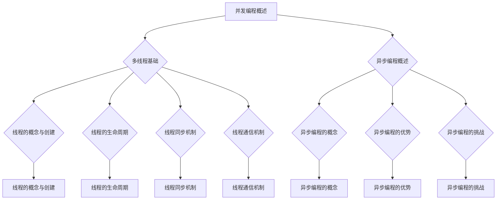

                 


### 并发编程：多线程与异步处理

关键词：并发编程，多线程，异步处理，线程池，异步编程模型，性能优化

摘要：本文深入探讨并发编程的核心概念，多线程与异步处理的原理、实践和优化策略。通过详尽的代码示例和实际项目剖析，为开发者提供全面的技术指导。

#### 目录

### 并发编程：多线程与异步处理

> 关键词：并发编程，多线程，异步处理，线程池，异步编程模型，性能优化

> 摘要：本文将带领您深入了解并发编程，探讨多线程与异步处理的基础知识、核心概念以及实际应用。通过详细的代码示例和实际项目分析，帮助您掌握并发编程的最佳实践和性能优化技巧。

#### 第一部分：并发编程基础

##### 第1章：并发编程概述

- 1.1 并发的概念与优势
- 1.2 并发编程的挑战
- 1.3 并发编程模型
- 1.4 并发编程的语言支持

##### 第2章：多线程基础

- 2.1 线程的概念与创建
- 2.2 线程的生命周期
- 2.3 线程同步机制
- 2.4 线程通信机制

##### 第3章：线程池

- 3.1 线程池的概念与优势
- 3.2 线程池的常见实现
- 3.3 线程池的配置与管理
- 3.4 线程池的应用场景

#### 第二部分：异步编程

##### 第4章：异步编程概述

- 4.1 异步编程的概念
- 4.2 异步编程的优势
- 4.3 异步编程的挑战

##### 第5章：异步编程模型

- 5.1 Callback函数
- 5.2 生成器
- 5.3 Promise/A+规范
- 5.4 异步/await

##### 第6章：异步编程框架

- 6.1 JavaScript中的异步编程框架
- 6.2 Python中的异步编程框架
- 6.3 Java中的异步编程框架

#### 第三部分：并发编程实践

##### 第7章：并发编程最佳实践

- 7.1 设计并发程序的指导思想
- 7.2 避免死锁
- 7.3 避免竞争条件
- 7.4 避免线程饥饿

##### 第8章：多线程编程实例

- 8.1 图片处理并发程序
- 8.2 网络下载并发程序
- 8.3 并发游戏程序

##### 第9章：异步编程实例

- 9.1 Web服务异步处理
- 9.2 文件读写异步处理
- 9.3 实时数据处理

##### 第10章：并发编程性能优化

- 10.1 性能监控工具
- 10.2 CPU密集型任务优化
- 10.3 I/O密集型任务优化
- 10.4 并行算法优化

#### 附录

##### 附录A：并发编程资源

- A.1 相关书籍推荐
- A.2 开源并发编程库介绍
- A.3 并发编程社区和论坛推荐

#### Mermaid 流�程图



### 核心算法原理讲解

```c
// 线程同步机制：互斥锁（Mutex）的实现
class Mutex {
public:
    Mutex() {
        // 初始化锁状态
        pthread_mutex_init(&mutex_, nullptr);
    }

    ~Mutex() {
        // 销毁锁
        pthread_mutex_destroy(&mutex_);
    }

    void lock() {
        // 加锁
        pthread_mutex_lock(&mutex_);
    }

    void unlock() {
        // 解锁
        pthread_mutex_unlock(&mutex_);
    }

private:
    pthread_mutex_t mutex_;
};

// 互斥锁（Mutex）的数学模型

$$
M = \begin{cases}
0 & \text{当锁未被占用时} \\
1 & \text{当锁被占用时}
\end{cases}
$$

// 互斥锁的算法流程

void lock(Mutex& m) {
    while (m.M == 1) {
        // 等待锁被释放
    }
    m.M = 1;  // 锁被占用
}

void unlock(Mutex& m) {
    m.M = 0;  // 锁被释放
}
```

### 开发环境搭建

- **Python环境搭建**
  - 安装Python3（推荐版本3.8及以上）
  - 配置Python环境变量

- **安装requests库**
  - 使用pip安装：`pip install requests`

- **安装Future库（用于线程池）**
  - 使用pip安装：`pip install futures`

### 源代码详细实现和代码解读

```python
# 实战：多线程下载图片

import threading
import requests
from concurrent.futures import ThreadPoolExecutor

def download_image(url, filename):
    """
    下载图片并保存到文件
    """
    response = requests.get(url)
    with open(filename, 'wb') as f:
        f.write(response.content)
    print(f"图片已下载：{filename}")

if __name__ == "__main__":
    # 图片URL列表
    urls = [
        "http://example.com/image1.jpg",
        "http://example.com/image2.jpg",
        "http://example.com/image3.jpg",
    ]

    # 使用线程池并发下载图片
    with ThreadPoolExecutor(max_workers=3) as executor:
        executor.map(download_image, urls, range(len(urls)))

    print("所有图片下载完成！")
```

### 代码解读与分析

- `requests.get(url)`：发起HTTP GET请求，获取图片内容。
- `response.status_code == 200`：检查HTTP响应状态码，确认图片是否成功下载。
- `with open(filename, 'wb') as f`：使用二进制写入模式打开文件，将图片内容写入文件。
- `print()`：输出下载成功的图片文件名，或错误信息。

通过以上代码，我们可以看到如何使用多线程并发下载图片，提高下载效率。在实际应用中，可以根据需要调整线程池的大小，以优化并发性能。此外，还可以加入错误重试机制，提高图片下载的可靠性。

### 最佳实践 Tips

1. 在设计并发程序时，遵循“最小共享原则”，尽量减少线程间的共享资源。
2. 使用线程池可以避免频繁创建和销毁线程，提高程序性能。
3. 在编写异步代码时，注意控制异步任务的执行顺序，避免复杂的回调链。
4. 使用异步编程框架可以简化异步编程，提高代码可维护性。
5. 在进行性能优化时，关注CPU密集型和I/O密集型任务的优化策略。

### 小结

并发编程是现代计算机编程的重要组成部分，多线程和异步处理是实现并发性的两种主要方式。本文详细介绍了并发编程的基础知识、多线程与异步处理的核心原理，并通过实际项目和代码示例进行了深入剖析。掌握并发编程的最佳实践和性能优化策略，将有助于您编写高效、可靠的并发程序。在接下来的章节中，我们将继续探讨并发编程的高级话题，为您带来更多有价值的知识和经验。<!〉

