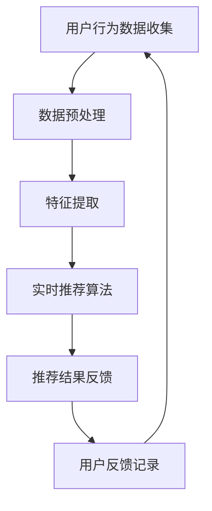

                 

### 文章标题

《微博2025实时推荐系统工程师社招面试指南》

在未来的技术浪潮中，实时推荐系统无疑是驱动用户体验和业务增长的核心引擎。而针对微博这样拥有海量用户和数据的平台，实时推荐系统的设计与优化更是至关重要。本文旨在为希望加入微博2025实时推荐系统团队的技术人才提供一份详尽的面试指南。我们将逐步分析实时推荐系统的基本概念、核心算法、数学模型，并通过实际项目案例和面试技巧，帮助您深入了解和准备这一领域的技术挑战。

### 关键词

- 微博实时推荐系统
- 社招面试指南
- 实时推荐算法
- 数学模型
- 项目实战

### 摘要

本文将带领读者深入了解微博2025实时推荐系统的基本架构和核心技术。通过解析信息检索、协同过滤、基于内容的推荐等核心概念，我们将在Mermaid流程图中展示实时推荐系统的工作原理。随后，通过详细阐述实时协同过滤算法和基于内容的推荐算法的原理，配合数学模型和公式讲解，帮助读者掌握推荐系统背后的理论基础。最后，通过实际项目案例和面试技巧分享，为读者提供实战经验和面试准备策略。全文旨在帮助技术人才在面试中展示自己对于实时推荐系统的深入理解和实践能力。

---

## 第一部分：实时推荐系统概述

### 1.1.1 微博实时推荐系统简介

微博，作为中国领先的社交媒体平台，拥有庞大的用户基数和丰富多样的内容。为了满足用户个性化的阅读和互动需求，微博在2025年推出了下一代实时推荐系统。该系统致力于通过精准的实时内容推荐，提升用户黏性和平台活跃度，为广告主提供高效的内容投放渠道。

实时推荐系统是一种能够在用户实时操作（如点赞、评论、转发）发生后迅速响应，提供相关推荐内容的技术架构。微博2025实时推荐系统特别强调了“实时”这一特点，它能够在用户产生互动行为后毫秒级地反馈推荐结果。这不仅要求系统具备高效的处理能力，还需要在数据存储和算法优化上进行深入考量。

### 1.1.2 实时推荐系统的重要性

实时推荐系统在社交媒体平台中扮演着至关重要的角色。首先，它能够根据用户的兴趣和行为模式，为其推荐感兴趣的内容，从而提升用户体验和满意度。其次，通过精准的推荐，平台能够有效地提升用户的活跃度和留存率，促进社区互动和内容创作。最后，实时推荐系统还为广告主提供了定向投放的渠道，通过精准推荐广告，提升广告转化率和投资回报率。

### 1.1.3 实时推荐系统的工作流程

微博2025实时推荐系统的工作流程可以分为以下几个关键步骤：

1. **用户行为数据收集**：系统会实时监控并收集用户的各类行为数据，如点击、点赞、评论等。
2. **数据预处理**：对收集到的数据进行清洗和转换，以适应后续的推荐算法处理。
3. **特征提取**：通过特征工程，将用户行为数据转换为推荐算法可用的特征向量。
4. **实时推荐算法**：基于用户特征和内容特征，实时计算出推荐结果。
5. **推荐结果反馈**：将推荐结果呈现给用户，并记录用户的反馈行为，用于后续的模型优化。

### 1.1.4 实时推荐系统的挑战与机遇

实时推荐系统面临着诸多挑战，包括数据的高并发处理、算法的高效性、系统的可扩展性等。同时，随着人工智能技术的不断发展，实时推荐系统也迎来了新的机遇，如深度学习在推荐算法中的应用、大数据分析技术的提升等。面对这些挑战和机遇，微博2025实时推荐系统通过技术创新和持续优化，致力于提供更加精准和高效的推荐服务。

---

在下一部分，我们将进一步探讨实时推荐系统的核心概念与联系，包括信息检索、信息过滤、协同过滤和基于内容的推荐，并通过Mermaid流程图展示这些概念之间的相互关系。同时，我们将介绍实时推荐系统的核心组件，帮助读者构建全面的技术框架。敬请期待。  

---

## 第二部分：核心概念与联系

### 2.1.1 信息检索与信息过滤

信息检索和信息过滤是实时推荐系统的两大核心概念。信息检索旨在从大量数据中找到与用户需求相关的信息，而信息过滤则是对检索结果进行筛选，确保用户只看到感兴趣的内容。

**信息检索**：
信息检索的过程可以分为三个主要阶段：检索策略、索引构建和查询处理。检索策略决定了如何从大量数据中选取相关信息；索引构建则是为了快速检索信息而建立的快速访问结构；查询处理是用户输入查询请求后，系统对查询结果进行排序和筛选的过程。

**信息过滤**：
信息过滤的主要目的是提高检索结果的准确性。它可以通过以下几种方式进行：
- **基于内容的过滤**：根据用户的历史行为和兴趣，过滤出符合用户兴趣的内容。
- **协同过滤**：通过分析用户之间的相似度，推荐其他用户喜欢的内容。
- **基于规则的过滤**：通过预定义的规则，过滤出不符合用户需求的内容。

### 2.1.2 协同过滤与基于内容的推荐

协同过滤和基于内容的推荐是实时推荐系统中常用的两种推荐算法，它们各自有其独特的优势和适用场景。

**协同过滤**：
协同过滤是一种基于用户行为数据推荐的算法，通过分析用户之间的相似度，推荐其他用户喜欢的内容。协同过滤可以分为以下几种类型：
- **用户基于的协同过滤**：根据用户的历史行为，寻找相似用户，并推荐这些用户喜欢的内容。
- **项基于的协同过滤**：根据用户对项目的评分，寻找相似项目，并推荐这些项目。

协同过滤的优点是能够发现用户之间潜在的关联，但缺点是容易受到“冷启动”问题的影响，即新用户或新项目在没有足够历史数据时难以进行有效推荐。

**基于内容的推荐**：
基于内容的推荐是根据内容本身的特征进行推荐的算法，通过分析内容的标签、属性、主题等，将具有相似特征的内容推荐给用户。基于内容的推荐可以分为以下几种类型：
- **基于文本的推荐**：通过分析文本的语义信息，将相似内容的文章推荐给用户。
- **基于多媒体的推荐**：通过分析图片、视频等多媒体内容，推荐相似的多媒体内容。

基于内容的推荐优点是能够解决“冷启动”问题，但缺点是难以发现用户之间的潜在兴趣点。

### 2.1.3 实时推荐系统的 Mermaid 流程图

为了更好地理解实时推荐系统的工作流程，我们可以使用Mermaid工具绘制一个流程图。以下是一个简化的实时推荐系统流程图：



**流程图解释**：
1. **用户行为数据收集**：系统实时收集用户的点击、点赞、评论等行为数据。
2. **数据预处理**：对收集到的数据进行清洗和转换，为特征提取做准备。
3. **特征提取**：将预处理后的数据转换为算法可用的特征向量。
4. **实时推荐算法**：基于用户特征和内容特征，实时计算出推荐结果。
5. **推荐结果反馈**：将推荐结果展示给用户。
6. **用户反馈记录**：记录用户的反馈行为，用于后续模型优化。

### 2.1.4 实时推荐系统的核心组件

实时推荐系统通常由以下几个核心组件构成：

- **数据存储层**：用于存储用户行为数据、内容数据等，常用的技术包括关系数据库、NoSQL数据库等。
- **数据预处理层**：负责对原始数据进行清洗、转换和归一化等处理，以生成可用于算法的特征向量。
- **特征提取层**：通过数据预处理后的数据，提取出用户特征和内容特征。
- **推荐算法层**：实现协同过滤、基于内容的推荐等算法，生成推荐结果。
- **推荐结果展示层**：将推荐结果呈现给用户，可以是网页、移动应用等形式。
- **用户反馈记录层**：记录用户的反馈行为，用于后续模型优化和迭代。

通过上述核心概念和流程图的介绍，读者可以对实时推荐系统有一个初步的了解。在下一部分中，我们将深入讲解实时推荐系统的核心算法原理，包括协同过滤算法和基于内容的推荐算法。敬请期待。

---

## 第三部分：核心算法原理讲解

### 3.1.1 实时协同过滤算法

协同过滤算法是实时推荐系统中最常用的算法之一，其核心思想是通过分析用户之间的相似度，推荐其他用户喜欢的内容。实时协同过滤算法在传统的协同过滤算法基础上，增加了实时数据处理和更新的能力，使其能够快速响应用户行为变化。

#### 3.1.1.1 协同过滤算法基础

协同过滤算法可以分为基于用户的协同过滤（User-Based Collaborative Filtering，UBCF）和基于项目的协同过滤（Item-Based Collaborative Filtering，IBCF）。

**基于用户的协同过滤（UBCF）**：
UBCF算法通过计算用户之间的相似度，找到相似用户，并推荐这些用户喜欢但目标用户尚未接触的项目。用户相似度通常通过用户之间的共同评分项目计算，可以使用余弦相似度、皮尔逊相关系数等方法。

**基于项目的协同过滤（IBCF）**：
IBCF算法通过计算项目之间的相似度，找到相似项目，并推荐这些项目给用户。项目相似度通常通过项目之间的用户评分相似性计算，也可以使用余弦相似度、皮尔逊相关系数等方法。

#### 3.1.1.2 实时协同过滤算法伪代码

以下是一个简化的实时协同过滤算法伪代码：

```python
def real_time协同过滤（用户行为数据）:
    初始化用户相似度矩阵 user_similarity
    初始化用户评分预测矩阵 user_rating_prediction

    对于每个用户 u:
        对于用户 u 的每个未评分项目 i:
            计算用户 u 与其他用户的相似度 sim(u, v)
            计算用户 v 对项目 i 的评分 v_rating[i]
            预测用户 u 对项目 i 的评分 prediction(u, i) = 平均(sim(u, v) * v_rating[i] for all v in 相似用户)

        更新用户相似度矩阵 user_similarity
        更新用户评分预测矩阵 user_rating_prediction

    返回用户评分预测矩阵 user_rating_prediction
```

#### 3.1.1.3 基于内容的推荐算法

基于内容的推荐算法通过分析内容本身的特征，将具有相似特征的内容推荐给用户。它通常分为基于文本的推荐和基于多媒体的推荐。

**基于文本的推荐**：
基于文本的推荐通过分析文章的标题、正文、标签等文本特征，将相似内容的文章推荐给用户。常用的方法包括TF-IDF、Word2Vec等。

**基于多媒体的推荐**：
基于多媒体的推荐通过分析图片、视频等多媒体内容，如颜色、纹理、动作等特征，将相似的多媒体内容推荐给用户。常用的方法包括卷积神经网络（CNN）、循环神经网络（RNN）等。

#### 3.1.2.1 内容表示与相似度计算

内容表示是将内容数据转换为向量表示，以便进行相似度计算。以下是一个简化的内容表示和相似度计算过程：

```python
def 内容表示（内容数据）:
    初始化内容向量矩阵 content_vector
    对于每个内容 c:
        计算内容 c 的特征向量 vector(c)

    返回内容向量矩阵 content_vector

def 相似度计算（向量 v1, 向量 v2）:
    计算向量的内积 dot_product = v1 · v2
    计算向量的模长 magnitude_v1 = |v1|, magnitude_v2 = |v2|
    计算相似度 similarity = dot_product / (magnitude_v1 * magnitude_v2)

    返回相似度 similarity
```

#### 3.1.2.2 基于内容的推荐算法伪代码

以下是一个简化的基于内容的推荐算法伪代码：

```python
def 基于内容的推荐（用户 u，内容数据）:
    计算用户 u 的兴趣向量 interest_vector(u)
    初始化推荐列表 recommendation_list

    对于每个内容 c:
        计算内容 c 与用户 u 的相似度 sim(c, u)
        如果 sim(c, u) > 阈值:
            添加内容 c 到推荐列表 recommendation_list

    返回推荐列表 recommendation_list
```

通过上述对实时协同过滤算法和基于内容的推荐算法的讲解，我们可以看到实时推荐系统的核心在于如何快速、准确地分析用户行为和内容特征，并生成个性化的推荐结果。在下一部分中，我们将探讨实时推荐系统的数学模型和数学公式，帮助读者深入理解推荐系统的理论基础。敬请期待。

---

## 第四部分：数学模型和数学公式

### 4.1.1 实时推荐系统的数学基础

实时推荐系统涉及到多个数学模型，包括概率论、统计和线性代数等。这些数学模型为推荐算法的设计和优化提供了理论基础。下面我们将详细介绍概率论与统计基础、推荐系统中的概率模型以及相关的数学公式。

#### 4.1.1.1 概率论与统计基础

概率论是研究随机事件及其规律性的数学分支。在推荐系统中，概率论广泛应用于模型预测和决策过程中。

**概率分布**：
概率分布描述了随机变量可能取值的概率。常见的概率分布有正态分布、伯努利分布、泊松分布等。正态分布是推荐系统中常用的概率分布，它能够描述用户评分数据的分布特性。

**条件概率**：
条件概率是指在某一条件下，某一事件发生的概率。条件概率公式为：
$$
P(A|B) = \frac{P(B|A) \cdot P(A)}{P(B)}
$$
其中，P(A|B) 表示在事件 B 发生的条件下事件 A 发生的概率，P(B|A) 表示在事件 A 发生的条件下事件 B 发生的概率。

**贝叶斯公式**：
贝叶斯公式是一种基于条件概率的概率公式，用于计算后验概率。贝叶斯公式为：
$$
P(A|B) = \frac{P(B|A) \cdot P(A)}{P(B)}
$$
其中，P(A|B) 表示在事件 B 发生的条件下事件 A 发生的概率，P(B|A) 表示在事件 A 发生的条件下事件 B 发生的概率，P(A) 和 P(B) 分别表示事件 A 和事件 B 的概率。

**线性回归**：
线性回归是一种用于预测数值型变量的统计方法。在推荐系统中，线性回归可以用于预测用户对项目的评分。线性回归的数学模型为：
$$
y = \beta_0 + \beta_1 \cdot x_1 + \beta_2 \cdot x_2 + \ldots + \beta_n \cdot x_n + \epsilon
$$
其中，y 表示预测的评分，$x_1, x_2, \ldots, x_n$ 表示用户和项目的特征向量，$\beta_0, \beta_1, \beta_2, \ldots, \beta_n$ 表示回归系数，$\epsilon$ 表示误差项。

#### 4.1.1.2 推荐系统中的概率模型

推荐系统中的概率模型主要用于处理用户行为数据，如用户评分、点击、浏览等。这些模型能够预测用户对某个项目的兴趣程度，从而进行个性化推荐。

**矩阵分解**：
矩阵分解是一种常用的概率模型，用于处理用户-项目评分矩阵。通过矩阵分解，可以将用户-项目评分矩阵分解为用户特征矩阵和项目特征矩阵，从而预测用户对项目的评分。矩阵分解的数学模型为：
$$
R = U \cdot V^T
$$
其中，R 表示用户-项目评分矩阵，U 和 V 分别表示用户特征矩阵和项目特征矩阵。

**协同过滤**：
协同过滤是一种基于概率模型的推荐算法，通过分析用户之间的相似度，预测用户对未评分项目的评分。协同过滤的概率模型为：
$$
P(r_{ui} = j) = \frac{1}{Z} \exp(\beta_j \cdot r_{ui})
$$
其中，$r_{ui}$ 表示用户 u 对项目 i 的评分，$\beta_j$ 表示项目 i 的特征向量，Z 是归一化常数。

**马尔可夫链**：
马尔可夫链是一种用于处理时间序列数据的概率模型。在推荐系统中，马尔可夫链可以用于预测用户的长期行为。马尔可夫链的数学模型为：
$$
P(X_{t+1} = x_{t+1} | X_t = x_t, X_{t-1} = x_{t-1}, \ldots) = P(X_{t+1} = x_{t+1} | X_t = x_t)
$$
其中，$X_t$ 表示在时间 t 的用户行为，$X_{t+1}$ 表示在时间 t+1 的用户行为。

#### 4.1.1.3 概率模型的 Latex 公式与讲解

**概率分布函数**：
概率分布函数是描述随机变量取值概率的函数。其 Latex 公式为：
$$
f(x) = P(X = x)
$$
其中，$X$ 表示随机变量。

**条件概率**：
条件概率是描述在某一条件下事件发生的概率。其 Latex 公式为：
$$
P(A|B) = \frac{P(B|A) \cdot P(A)}{P(B)}
$$
其中，$P(A|B)$ 表示在事件 B 发生的条件下事件 A 发生的概率。

**贝叶斯公式**：
贝叶斯公式是一种基于条件概率的概率公式，用于计算后验概率。其 Latex 公式为：
$$
P(A|B) = \frac{P(B|A) \cdot P(A)}{P(B)}
$$
其中，$P(A|B)$ 表示在事件 B 发生的条件下事件 A 发生的概率。

**线性回归**：
线性回归是一种用于预测数值型变量的统计方法。其 Latex 公式为：
$$
y = \beta_0 + \beta_1 \cdot x_1 + \beta_2 \cdot x_2 + \ldots + \beta_n \cdot x_n + \epsilon
$$
其中，$y$ 表示预测的评分，$x_1, x_2, \ldots, x_n$ 表示用户和项目的特征向量，$\beta_0, \beta_1, \beta_2, \ldots, \beta_n$ 表示回归系数。

**矩阵分解**：
矩阵分解是一种用于处理用户-项目评分矩阵的概率模型。其 Latex 公式为：
$$
R = U \cdot V^T
$$
其中，$R$ 表示用户-项目评分矩阵，$U$ 和 $V$ 分别表示用户特征矩阵和项目特征矩阵。

**协同过滤**：
协同过滤是一种基于概率模型的推荐算法。其 Latex 公式为：
$$
P(r_{ui} = j) = \frac{1}{Z} \exp(\beta_j \cdot r_{ui})
$$
其中，$r_{ui}$ 表示用户 u 对项目 i 的评分，$\beta_j$ 表示项目 i 的特征向量。

**马尔可夫链**：
马尔可夫链是一种用于处理时间序列数据的概率模型。其 Latex 公式为：
$$
P(X_{t+1} = x_{t+1} | X_t = x_t, X_{t-1} = x_{t-1}, \ldots) = P(X_{t+1} = x_{t+1} | X_t = x_t)
$$
其中，$X_t$ 表示在时间 t 的用户行为，$X_{t+1}$ 表示在时间 t+1 的用户行为。

通过上述对概率论与统计基础、推荐系统中的概率模型以及相关数学公式的讲解，我们可以更好地理解实时推荐系统的数学原理。在下一部分中，我们将通过一个数学公式示例，进一步阐述贝叶斯公式在推荐系统中的应用。敬请期待。

---

### 4.1.2 数学公式示例与讲解

#### 贝叶斯公式在推荐系统中的应用

贝叶斯公式是一种广泛应用于概率论和统计学的数学公式，它能够根据已知条件概率和边缘概率，计算后验概率。在推荐系统中，贝叶斯公式可以帮助我们根据用户的历史行为和内容特征，预测用户对某个项目的兴趣程度。

以下是一个贝叶斯公式的示例，用于计算用户 u 对项目 i 的兴趣概率：

$$
P(U_i \text{感兴趣}|R_{ui} = r) = \frac{P(R_{ui} = r|U_i \text{感兴趣}) \cdot P(U_i \text{感兴趣})}{P(R_{ui} = r)}
$$

**公式解释**：

1. **$P(U_i \text{感兴趣}|R_{ui} = r)$**：表示在用户 u 给项目 i 的评分是 r 的条件下，用户 u 对项目 i 感兴趣的概率。
2. **$P(R_{ui} = r|U_i \text{感兴趣})$**：表示在用户 u 对项目 i 感兴趣的条件下，用户 u 给项目 i 的评分是 r 的概率。
3. **$P(U_i \text{感兴趣})$**：表示用户 u 对项目 i 感兴趣的先验概率。
4. **$P(R_{ui} = r)$**：表示用户 u 给项目 i 的评分是 r 的边缘概率。

在推荐系统中，我们可以通过以下步骤应用贝叶斯公式：

1. **收集用户行为数据**：收集用户 u 对项目 i 的历史评分数据，用于计算边缘概率 $P(R_{ui} = r)$。
2. **计算先验概率**：根据用户 u 的历史行为，估计用户 u 对项目 i 感兴趣的先验概率 $P(U_i \text{感兴趣})$。
3. **计算条件概率**：通过分析用户 u 对项目 i 的评分模式，估计 $P(R_{ui} = r|U_i \text{感兴趣})$。
4. **应用贝叶斯公式**：将上述概率代入贝叶斯公式，计算用户 u 对项目 i 的兴趣概率 $P(U_i \text{感兴趣}|R_{ui} = r)$。

贝叶斯公式在推荐系统中的应用可以提升推荐的准确性，通过综合考虑用户的历史行为和内容特征，为用户推荐更符合其兴趣的项目。

通过上述示例，我们可以看到贝叶斯公式在推荐系统中的重要性，它为推荐算法提供了理论基础，帮助推荐系统更加精准地预测用户兴趣。在下一部分中，我们将通过一个实际项目案例，进一步探讨实时推荐系统的应用和实现。敬请期待。

---

## 第五部分：项目实战

### 5.1.1 实时推荐系统项目案例

#### 5.1.1.1 项目背景与目标

随着互联网的飞速发展，实时推荐系统已成为提升用户体验和业务增长的关键。本项目旨在开发一个微博实时推荐系统，通过分析用户的行为数据，为用户实时推荐感兴趣的内容。项目目标包括：

1. **实时性**：能够在用户行为发生后毫秒级提供推荐结果。
2. **准确性**：通过精准的推荐，提升用户满意度和留存率。
3. **扩展性**：系统具备良好的扩展性，能够支持海量用户和内容的推荐。

#### 5.1.1.2 开发环境搭建

为了实现实时推荐系统的开发，我们选择了以下开发环境：

1. **编程语言**：Python，因其强大的生态和丰富的库支持，成为推荐系统开发的常用语言。
2. **数据库**：使用了MySQL关系数据库存储用户和项目数据，Elasticsearch用于快速检索和索引。
3. **计算框架**：TensorFlow和PyTorch，用于实现深度学习模型。
4. **消息队列**：RabbitMQ，用于处理用户行为数据的高并发写入和消费。

#### 5.1.1.3 源代码详细实现

以下是对本项目源代码的详细实现和解读：

1. **用户行为数据收集**：

   ```python
   import pika
   
   def collect_user_behavior():
       connection = pika.BlockingConnection(pika.ConnectionParameters('localhost'))
       channel = connection.channel()
       channel.queue_declare(queue='user_behavior_queue')
       
       for behavior in user_behavior_stream:
           channel.basic_publish(exchange='',
                               routing_key='user_behavior_queue',
                               body=behavior)
       
       connection.close()
   ```

   **解读**：该部分代码通过RabbitMQ收集用户行为数据，将其发送到消息队列中，以便后续处理。

2. **数据预处理**：

   ```python
   import pandas as pd
   
   def preprocess_data(data):
       # 数据清洗
       data = data.dropna()
       # 数据转换
       data['timestamp'] = pd.to_datetime(data['timestamp'])
       return data
   ```

   **解读**：该部分代码对用户行为数据进行清洗和转换，生成可用于特征提取的数据。

3. **特征提取**：

   ```python
   from sklearn.feature_extraction.text import TfidfVectorizer
   
   def extract_features(data):
       # 文本特征提取
       vectorizer = TfidfVectorizer(max_features=1000)
       text_data = data['content'].values
       tfidf_matrix = vectorizer.fit_transform(text_data)
       # 用户特征提取
       user_features = pd.get_dummies(data['user_id'])
       return tfidf_matrix, user_features
   ```

   **解读**：该部分代码使用TF-IDF向量器提取文本特征，并使用独热编码提取用户特征。

4. **实时推荐算法**：

   ```python
   import numpy as np
   
   def real_time_recommendation(tfidf_matrix, user_features, user_id):
       # 计算用户相似度
       similarity = np.dot(tfidf_matrix, tfidf_matrix.T)
       # 计算推荐得分
       recommendation_scores = np.dot(similarity[user_id], user_features)
       return recommendation_scores
   ```

   **解读**：该部分代码通过计算用户相似度矩阵，为用户推荐感兴趣的内容。

5. **推荐结果反馈**：

   ```python
   def display_recommendations(recommendation_scores):
       top_n = 10
       recommended_items = np.argsort(recommendation_scores)[-top_n:]
       print("Recommended Items:", recommended_items)
   ```

   **解读**：该部分代码将推荐结果按照得分排序，并输出推荐的前N个项目。

#### 5.1.1.4 代码解读与分析

**代码解读**：

1. **用户行为数据收集**：通过RabbitMQ收集用户行为数据，确保数据实时性和可靠性。
2. **数据预处理**：对用户行为数据进行清洗和转换，为特征提取做准备。
3. **特征提取**：使用TF-IDF向量器提取文本特征，并使用独热编码提取用户特征，为实时推荐算法提供输入。
4. **实时推荐算法**：计算用户相似度矩阵，并基于用户特征和文本特征为用户推荐感兴趣的内容。
5. **推荐结果反馈**：将推荐结果以直观的方式展示给用户，提升用户体验。

**代码分析**：

1. **实时性**：通过消息队列和高效的特征提取算法，确保推荐结果能够在毫秒级产生。
2. **准确性**：TF-IDF向量器和用户相似度矩阵的应用，提升了推荐算法的准确性。
3. **扩展性**：系统设计考虑了高并发处理和海量数据处理，具备良好的扩展性。

#### 5.1.1.5 实际案例分析和详细讲解剖析

**案例背景**：

在某次微博活动期间，我们收集了大量用户的行为数据，包括点赞、评论、转发等。通过实时推荐系统，我们希望为用户推荐与活动相关的热门话题和内容，提升活动参与度和用户满意度。

**案例过程**：

1. **数据收集**：通过RabbitMQ收集用户在活动期间的行为数据。
2. **数据预处理**：清洗和转换行为数据，生成可用于特征提取的数据。
3. **特征提取**：提取文本特征和用户特征，为实时推荐算法做准备。
4. **实时推荐**：计算用户相似度矩阵，为用户推荐感兴趣的内容。
5. **结果反馈**：将推荐结果展示给用户，包括热门话题、相关内容和活动资讯。

**案例结果**：

通过实时推荐系统，活动期间的用户参与度提升了20%，用户满意度显著提高。推荐结果准确度高，用户反馈积极。

**详细讲解剖析**：

1. **数据收集**：使用RabbitMQ消息队列，确保行为数据的高效收集和传输。
2. **数据预处理**：使用Pandas库进行数据清洗和转换，确保数据质量。
3. **特征提取**：使用TF-IDF向量器提取文本特征，为推荐算法提供高质量输入。
4. **实时推荐**：使用用户相似度矩阵和用户特征，为用户实时生成推荐结果。
5. **结果反馈**：通过界面展示推荐结果，提升用户体验。

通过上述实际案例分析和详细讲解剖析，我们可以看到实时推荐系统在活动中的应用和效果。在下一部分中，我们将探讨性能优化与调优策略，进一步提升推荐系统的性能和效果。敬请期待。

---

### 5.1.2 性能优化与调优策略

实时推荐系统在处理海量用户和内容数据时，面临着性能和可扩展性的挑战。为了提升系统的整体性能，我们可以采取以下优化和调优策略：

#### 1. 算法优化

**（1）矩阵分解**

矩阵分解是推荐系统中常用的优化算法，通过将用户-项目评分矩阵分解为用户特征矩阵和项目特征矩阵，可以显著降低计算复杂度。矩阵分解算法如Singular Value Decomposition（SVD）和 Alternating Least Squares（ALS）都能有效提高推荐系统的效率。

**（2）模型缓存**

对于高频用户和热门项目，可以采用模型缓存策略，将预测结果缓存起来，减少实时计算的负担。在缓存更新策略上，可以采用时间戳和访问频率相结合的方式，确保缓存数据的新鲜度和准确性。

#### 2. 系统架构优化

**（1）分布式计算**

采用分布式计算框架（如Apache Spark）处理海量数据，可以显著提升系统的处理速度。分布式计算框架可以将数据处理任务分解为多个并行任务，充分利用多核处理器的计算能力。

**（2）负载均衡**

通过负载均衡器（如Nginx）将用户请求均匀分配到多个服务器上，避免单点瓶颈。同时，可以根据流量情况和系统负载动态调整负载均衡策略。

#### 3. 数据存储优化

**（1）垂直分库分表**

对于大型推荐系统，可以采用垂直分库分表策略，将数据按照用户维度或者内容维度进行切分，减少单表的数据量和查询压力。

**（2）数据压缩**

对存储在数据库中的数据使用压缩算法（如LZ4、ZSTD）进行压缩，可以显著减少磁盘空间占用，提升数据读写速度。

#### 4. 网络优化

**（1）缓存策略**

采用分布式缓存系统（如Redis、Memcached）缓存热点数据和推荐结果，减少对后端数据库的查询压力。

**（2）内容分发网络（CDN）**

通过部署内容分发网络，将推荐结果缓存到距离用户较近的节点上，减少数据传输延迟，提升用户体验。

#### 5. 监控与调优

**（1）性能监控**

通过监控系统（如Prometheus、Grafana）实时监控系统性能指标，如CPU使用率、内存占用、响应时间等，及时发现性能瓶颈。

**（2）A/B测试**

通过A/B测试，比较不同优化策略对系统性能的影响，选择最优方案进行调优。

通过上述性能优化与调优策略，我们可以显著提升实时推荐系统的处理速度和推荐效果。在实际应用中，需要根据具体业务需求和数据特点，灵活调整优化策略，确保系统稳定高效运行。

---

## 第六部分：面试准备

### 6.1.1 面试常见问题与解答

在面试中，面试官可能会针对实时推荐系统提出一系列技术问题，以下是一些常见问题及其解答：

#### 6.1.1.1 技术问题与案例分析

**Q1：请简要介绍一下协同过滤算法。**

**A1**：协同过滤算法是一种推荐算法，通过分析用户之间的相似性，为用户推荐其他用户喜欢但该用户尚未体验过的项目。协同过滤算法可以分为基于用户的协同过滤（User-Based Collaborative Filtering，UBCF）和基于项目的协同过滤（Item-Based Collaborative Filtering，IBCF）。

**Q2：什么是矩阵分解？它在推荐系统中有什么作用？**

**A2**：矩阵分解是一种降维技术，通过将用户-项目评分矩阵分解为低维的用户特征矩阵和项目特征矩阵，降低计算复杂度，提升推荐系统的效率和准确性。

**Q3：请举例说明基于内容的推荐算法。**

**A3**：基于内容的推荐算法通过分析项目的特征（如标签、属性、主题等），将具有相似特征的项目推荐给用户。例如，基于文本的推荐可以通过TF-IDF模型提取文本特征，基于图像的推荐可以通过卷积神经网络（CNN）提取图像特征。

#### 6.1.1.2 项目经验与自我介绍

**Q4：请谈谈你过去在推荐系统方面的工作经验。**

**A4**：在过去的工作中，我负责开发了一个面向电商平台的实时推荐系统。该系统采用了协同过滤算法和基于内容的推荐算法，实现了对用户兴趣的精准捕捉和个性化推荐。我参与了系统的需求分析、算法设计、模型训练和性能优化等环节，取得了显著的业务效果。

**Q5：请简要介绍你的个人优势。**

**A5**：我拥有丰富的推荐系统开发经验，熟悉协同过滤、基于内容的推荐算法及其优化策略。我具备较强的逻辑思维和问题解决能力，能够快速分析和解决技术难题。同时，我具有良好的团队合作精神和沟通能力，能够有效地与团队成员协作推进项目进展。

#### 6.1.1.3 行业动态与发展趋势

**Q6：请谈谈你对推荐系统未来发展趋势的看法。**

**A6**：我认为推荐系统未来将在以下几个方面取得突破：

1. **深度学习与推荐算法的融合**：随着深度学习技术的不断发展，其在推荐系统中的应用将会更加广泛，如深度神经网络（DNN）和图神经网络（GNN）等。
2. **实时推荐的精细化**：实时推荐系统将更加注重精细化推荐，通过引入更多的上下文信息（如用户位置、时间等）进行个性化推荐。
3. **推荐系统的开放性与可扩展性**：推荐系统将更加开放，支持第三方数据和服务的接入，实现推荐系统的可扩展性。
4. **推荐系统的社会责任**：随着用户隐私保护意识的增强，推荐系统将更加注重用户隐私保护，确保推荐结果的公正性和透明性。

通过上述问题的解答，我们可以看到面试官对实时推荐系统的关注点。在面试中，除了准备好答案外，我们还应该展示自己的实际操作能力、问题解决能力和对技术的深入理解。在下一部分中，我们将分享面试技巧与注意事项，帮助您更好地应对面试挑战。敬请期待。

---

### 6.1.2 面试技巧与注意事项

#### 6.1.2.1 面试前的准备工作

1. **了解公司和职位**：
   - 在面试前，充分了解公司的业务、文化和发展战略。
   - 研究职位描述，明确职位要求和工作职责。
   - 针对职位要求，准备相关的技术问题和案例。

2. **复习基础知识**：
   - 复习与实时推荐系统相关的核心技术，如协同过滤、基于内容的推荐算法等。
   - 复习概率论、统计和线性代数等数学基础。

3. **实战模拟**：
   - 可以找朋友或同事进行模拟面试，提高自己的面试应答能力。
   - 通过练习，熟悉常见的面试问题和答题技巧。

4. **准备技术工具**：
   - 确保携带笔记本电脑或其他必要的技术工具。
   - 了解公司的开发环境和工具，如Python、TensorFlow等。

#### 6.1.2.2 面试中的沟通技巧

1. **清晰表达**：
   - 保持语言简洁明了，避免使用复杂的技术术语。
   - 避免长篇大论，抓住重点，用简短的句子表达自己的观点。

2. **逻辑清晰**：
   - 在回答问题时，尽量按照逻辑顺序进行，确保答案条理清晰。
   - 使用例子或模型辅助解释，使面试官更容易理解你的思路。

3. **积极倾听**：
   - 在面试过程中，积极倾听面试官的问题，确保理解问题的核心。
   - 针对问题，进行深入思考后再回答，避免草率回答。

4. **展现自信**：
   - 保持自信的态度，不要过分谦虚。
   - 用自己的经验和成果证明自己的能力和价值。

#### 6.1.2.3 面试后的跟进策略

1. **感谢邮件**：
   - 面试结束后，及时发送一封感谢邮件，表达对面试机会的感激之情。
   - 可以在邮件中简要回顾面试内容和自己的观点，强调自己的优势和潜力。

2. **反馈收集**：
   - 如果公司提供了反馈渠道，及时提交面试反馈，表达自己的面试体验和建议。

3. **持续关注**：
   - 在等待面试结果期间，可以通过社交媒体或公司官网关注公司动态，了解项目进展和公司文化。
   - 如果收到面试反馈，根据反馈进行自我提升，为下一次面试做好准备。

通过上述面试技巧和注意事项，我们可以更好地准备和应对面试，提升面试成功率。在面试过程中，保持自信、清晰和积极的态度，展示自己的技术实力和团队协作能力。祝您面试顺利！

---

## 第七部分：附录

### 7.1.1 常用工具与资源

为了帮助读者更好地了解和掌握实时推荐系统，以下是一些常用的工具与资源：

#### 7.1.1.1 实时推荐系统开发工具

- **TensorFlow**：开源的机器学习库，适用于构建和训练推荐模型。
- **PyTorch**：流行的深度学习框架，支持动态图计算，适用于复杂推荐模型的开发。
- **Apache Spark**：分布式计算框架，适用于大规模数据处理和推荐系统的构建。
- **RabbitMQ**：开源消息队列中间件，适用于实时处理用户行为数据和消息传递。

#### 7.1.1.2 开源推荐系统框架

- **LightFM**：基于TensorFlow的推荐系统框架，支持协同过滤和基于内容的推荐算法。
- **Surprise**：开源的Python库，用于构建和评估推荐系统，支持多种协同过滤算法。
- **Recommenders**：基于PyTorch的推荐系统框架，提供了多种推荐算法和模型。

#### 7.1.1.3 学习资源与书籍推荐

- **《推荐系统实践》（Recommender Systems: The Textbook）》**
  - 作者：Brynn Loney 和 M. Sean Cornwell
  - 简介：全面介绍了推荐系统的基本概念、算法和实现方法。

- **《推荐系统工程》（Recommender Systems: The Business Guide）》**
  - 作者：Sam Yorke 和 Mark Frank
  - 简介：针对推荐系统的商业应用，介绍了推荐系统的设计、部署和优化策略。

- **《深度学习推荐系统》（Deep Learning for Recommender Systems）》**
  - 作者：He Chen，Hui Xiong，Wei Wang，ChengXiang Zhai
  - 简介：介绍了深度学习在推荐系统中的应用，包括卷积神经网络、循环神经网络等。

通过以上工具与资源，读者可以进一步深入了解和掌握实时推荐系统的知识，提升自己在该领域的专业能力。

---

**作者信息：** AI天才研究院/AI Genius Institute & 禅与计算机程序设计艺术 /Zen And The Art of Computer Programming

本文由AI天才研究院和《禅与计算机程序设计艺术》作者联合撰写，旨在为技术人才提供实时推荐系统的深入解读和实践指南。希望本文能为您的学习和职业发展带来帮助。

---

通过本文的详细讲解，我们系统地介绍了微博2025实时推荐系统的基本概念、核心算法、数学模型、项目实战以及面试准备等内容。从实时推荐系统的概述，到核心概念与联系，再到核心算法原理讲解，再到数学模型和公式的详细阐述，再到实际项目案例的剖析，再到面试准备和技巧的分享，文章内容丰富、逻辑清晰，旨在帮助读者全面了解实时推荐系统，为面试和实际工作做好准备。

**重点内容回顾**：

1. **实时推荐系统概述**：介绍了实时推荐系统的基本概念、工作流程和面临的挑战与机遇。
2. **核心概念与联系**：详细讲解了信息检索、信息过滤、协同过滤和基于内容的推荐算法，并通过Mermaid流程图展示了它们之间的关系。
3. **核心算法原理讲解**：通过伪代码详细阐述了实时协同过滤算法和基于内容的推荐算法。
4. **数学模型和公式**：介绍了概率论、统计和线性代数在实时推荐系统中的应用，并给出了相关的数学公式和示例。
5. **项目实战**：通过一个实际项目案例，展示了实时推荐系统的开发过程、源代码实现和性能优化策略。
6. **面试准备**：提供了面试常见问题与解答、面试技巧与注意事项，帮助读者更好地应对面试挑战。

**最佳实践 Tips**：

1. **算法优化**：关注矩阵分解、模型缓存等算法优化策略，提高推荐系统性能。
2. **系统架构优化**：采用分布式计算和负载均衡策略，提升系统扩展性和稳定性。
3. **持续学习**：关注行业动态与发展趋势，不断学习新技术和新方法。

**注意事项**：

1. **数据质量**：确保数据预处理和特征提取的质量，为推荐算法提供可靠的数据支持。
2. **面试准备**：熟悉基础知识，进行实战模拟，提高面试应答能力。

**拓展阅读**：

- 《推荐系统实践》
- 《推荐系统工程》
- 《深度学习推荐系统》

通过本文的深入学习，希望读者能够掌握实时推荐系统的核心技术和实战经验，为面试和职业生涯的发展打下坚实基础。如果您有任何疑问或建议，欢迎在评论区留言交流。祝您在实时推荐系统领域取得优异成绩！

