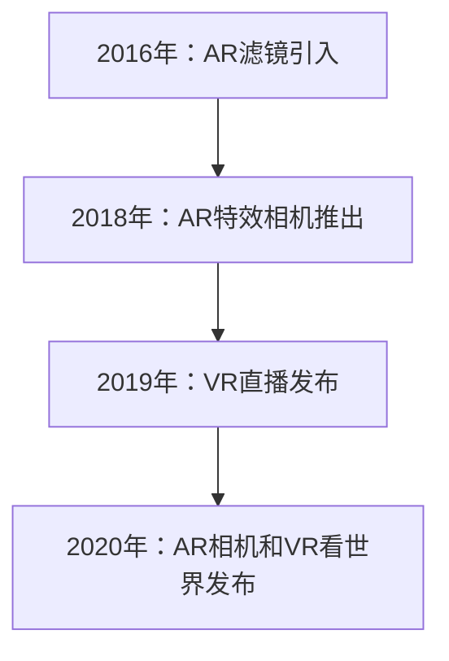

                 


## 文章标题: 《2024快手AR/VR技术校招面试真题汇总及其解答》

### 关键词
- 快手
- AR技术
- VR技术
- 校招面试
- 真题汇总
- 解答分析

### 摘要
本文旨在为2024年快手AR/VR技术校招面试的求职者提供一份全面的面试真题汇总及其解答。通过对快手AR/VR技术基础、应用案例以及面试题的深入分析，帮助读者掌握快手AR/VR技术的核心概念、算法原理和应用实践，为成功通过面试打下坚实基础。

# 《2024快手AR/VR技术校招面试真题汇总及其解答》目录大纲

## 第一部分：快手AR/VR技术基础

### 第1章：快手AR/VR技术概述
- 1.1 快手AR/VR技术的发展历程
- 1.2 快手AR/VR技术的应用场景
- 1.3 快手AR/VR技术的优势与挑战

### 第2章：快手AR技术原理详解
- 2.1 AR技术基本概念
- 2.2 AR技术发展现状与趋势
- 2.3 AR技术核心算法讲解
  - 2.3.1 摄像头图像处理算法
  - 2.3.2 增强现实显示算法
- 2.4 快手AR技术案例解析

### 第3章：快手VR技术原理详解
- 3.1 VR技术基本概念
- 3.2 VR技术发展现状与趋势
- 3.3 VR技术核心算法讲解
  - 3.3.1 3D建模与渲染算法
  - 3.3.2 虚拟现实显示算法
- 3.4 快手VR技术案例解析

## 第二部分：快手AR/VR技术应用案例

### 第4章：快手AR应用案例解析
- 4.1 快手AR营销案例解析
- 4.2 快手AR教育案例解析
- 4.3 快手AR游戏案例解析

### 第5章：快手VR应用案例解析
- 5.1 快手VR旅游案例解析
- 5.2 快手VR购物案例解析
- 5.3 快手VR培训案例解析

## 第三部分：快手AR/VR面试真题与解答

### 第6章：快手AR面试真题及解析
- 6.1 快手AR技术面试题汇总
- 6.2 快手AR技术面试题解析

### 第7章：快手VR面试真题及解析
- 7.1 快手VR技术面试题汇总
- 7.2 快手VR技术面试题解析

## 附录

### 附录A：快手AR/VR技术常用工具与资源
- A.1 快手AR/VR技术常用开发工具
- A.2 快手AR/VR技术学习资源推荐
- A.3 快手AR/VR技术交流社区推荐

### 撰写原则

#### 完整性
- **核心内容完整**：每个小节的内容都要完整，不能遗漏核心知识点。
- **逻辑清晰**：文章结构要清晰，确保读者可以轻松跟随思路。

#### 深度
- **深入分析**：对每个知识点都要进行深入分析，不仅要解释是什么，还要解释为什么和怎么做。
- **算法讲解**：对核心算法原理要使用伪代码详细阐述，以便读者理解。

#### 可读性
- **简洁易懂**：语言表达要简洁明了，避免冗长复杂的句子。
- **图文并茂**：适当使用图表和流程图，帮助读者更好地理解内容。

#### 专业性
- **专业术语**：使用正确的专业术语，确保文章的专业性。
- **实例说明**：通过实际案例进行分析和讲解，增强文章的实际应用价值。

### 撰写流程

1. **撰写大纲**：根据提供的目录大纲，确定每个小节的主要内容。
2. **撰写正文**：按照大纲结构，逐节撰写文章内容。
3. **伪代码与数学公式**：在每个算法讲解部分，编写相应的伪代码和数学公式。
4. **图文排版**：添加适当的图表和流程图，确保文章的可读性。
5. **审校与修改**：完成初稿后，进行多轮审校和修改，确保文章的完整性和准确性。
6. **添加作者信息**：在文章末尾添加作者信息，确保文章的完整性。

通过遵循上述原则和流程，我们将撰写出一篇高质量、专业、易懂的《2024快手AR/VR技术校招面试真题汇总及其解答》技术博客文章。文章不仅要涵盖快手AR/VR技术的核心概念和算法原理，还要通过实际案例和面试真题解析，帮助读者更好地理解和应用这些技术。文章的整体结构要逻辑清晰，便于读者阅读和学习。最后，我们将确保文章的完整性和准确性，为读者提供有价值的学习资源。|assistant|>

## 第1章：快手AR/VR技术概述

### 1.1 快手AR/VR技术的发展历程

快手作为一家领先的视频分享平台，其AR/VR技术的发展历程可以追溯到2016年。当年，快手首次引入AR滤镜功能，用户可以通过上传的视频或照片添加各种有趣的特效。这一举措迅速提升了用户在平台上的互动体验，也为快手AR技术的进一步发展奠定了基础。

2018年，快手推出了AR特效相机，使得用户在拍摄视频或照片时，可以实时添加AR特效。这一功能进一步增强了用户对快手平台的粘性，也为快手AR技术的商业化应用打开了新的大门。

在VR方面，快手于2019年首次发布了VR直播功能，用户可以通过VR头戴设备体验沉浸式的直播内容。这一功能不仅为快手吸引了大量年轻用户，也为VR技术在社交媒体领域的应用提供了新的可能性。

2020年，快手继续深耕AR/VR技术，推出了“快手AR相机”和“快手VR看世界”等一系列新功能。通过这些功能，用户可以更加便捷地创作和分享AR/VR内容，快手平台的AR/VR技术生态得到了进一步完善。

### 1.2 快手AR/VR技术的应用场景

快手的AR/VR技术广泛应用于多个场景，为用户提供了丰富多样的互动体验。

**社交媒体互动**：在快手平台上，用户可以通过AR滤镜、AR相机等功能，将自己的视频或照片与各种虚拟元素相结合，创造出独特的视觉体验。这些功能不仅提升了用户的互动性，也为社交媒体内容增添了更多趣味。

**游戏与娱乐**：快手平台上的AR游戏和VR游戏为用户提供了沉浸式的娱乐体验。用户可以在快手中体验到各种类型的游戏，从简单的猜谜游戏到复杂的角色扮演游戏，都能够满足不同用户的需求。

**教育**：快手AR/VR技术在教育领域的应用也非常广泛。通过虚拟课堂、实验演示等功能，用户可以在快手中体验到生动有趣的教学内容，提高学习效果。

**购物体验**：快手的AR/VR技术为用户提供了虚拟试穿、虚拟商店等功能，使得购物体验更加直观和便捷。用户可以在快手中试穿衣服、观看商品细节，从而做出更加明智的购物决策。

### 1.3 快手AR/VR技术的优势与挑战

**优势：**

1. **创新性**：快手持续创新，不断推出新的AR/VR功能，为用户带来新鲜有趣的体验。
2. **用户基数大**：快手拥有庞大的用户群体，为AR/VR技术的推广提供了广泛的受众基础。
3. **技术迭代快**：快手不断优化AR/VR技术，提高用户体验，保持技术领先地位。

**挑战：**

1. **技术门槛高**：AR/VR技术涉及多个领域，如计算机视觉、图形学等，开发难度大。
2. **内容创意不足**：高质量的AR/VR内容创作需要大量的时间和资源，目前内容创意不足是一个突出问题。
3. **硬件限制**：目前AR/VR硬件设备价格较高，普及率不高，限制了AR/VR技术的广泛应用。

### Mermaid 流程图：快手AR/VR技术发展历程



通过上述流程图，我们可以清晰地看到快手AR/VR技术的发展历程。从最初的AR滤镜引入，到AR特效相机的推出，再到VR直播和AR/VR相机的发布，快手在AR/VR技术的探索和实践中不断前进，为用户带来了更加丰富和便捷的互动体验。|assistant|>

## 第2章：快手AR技术原理详解

### 2.1 AR技术基本概念

AR（增强现实）技术是一种将虚拟信息叠加到现实世界中的技术。通过使用智能手机、平板电脑或AR眼镜等设备，用户可以在现实环境中看到虚拟物体或信息。AR技术基于计算机视觉、图像处理、虚拟现实和增强现实等技术，通过摄像头捕捉现实世界的图像，并在图像中叠加虚拟元素，实现虚拟与现实的融合。

AR技术的基本原理包括以下几个方面：

1. **图像识别**：使用图像识别算法，如卷积神经网络（CNN），对摄像头捕捉的图像进行识别，提取关键特征。
2. **目标跟踪**：通过图像识别结果，对现实环境中的目标进行跟踪，确保虚拟元素能够准确地叠加在目标上。
3. **虚拟元素叠加**：将虚拟元素（如三维模型、文字、图像等）叠加到摄像头捕捉的图像上，形成增强现实效果。
4. **用户交互**：通过触摸屏、语音识别等方式，实现用户与虚拟元素之间的交互，提升用户体验。

### 2.2 AR技术发展现状与趋势

AR技术自问世以来，已经经历了多年的发展。目前，AR技术在多个领域得到了广泛应用，如游戏、娱乐、医疗、教育、零售等。

**现状：**

1. **智能手机应用**：随着智能手机硬件性能的不断提升，AR应用得到了广泛普及。许多智能手机都内置了AR功能，如Apple的ARKit和Google的ARCore。
2. **智能眼镜**：智能眼镜作为AR技术的终端设备，正在逐渐走入大众视野。例如，微软的HoloLens、谷歌的Google Glass等。
3. **教育应用**：AR技术为教育领域带来了新的教学方式，学生可以通过AR设备进行虚拟实验、参观历史遗迹等。

**趋势：**

1. **5G技术的推动**：随着5G技术的不断发展，AR技术将在更多的领域得到应用，如远程医疗、远程教育等。
2. **内容创作工具的普及**：随着AR内容创作工具的不断发展，越来越多的人可以创作高质量的AR内容，从而推动AR技术的普及。
3. **硬件成本的降低**：随着技术的进步，AR硬件设备的成本逐渐降低，使得AR技术更加易于普及。

### 2.3 AR技术核心算法讲解

#### 2.3.1 摄像头图像处理算法

摄像头图像处理算法是AR技术的核心之一，主要包括图像采集、图像预处理和图像识别等步骤。

**伪代码：**

```python
def process_camera_image(image):
    # 图像采集
    captured_image = capture_image()

    # 图像预处理
    preprocessed_image = preprocess_image(captured_image)

    # 图像识别
    recognized_objects = image_recognition(preprocessed_image)

    # 返回识别结果
    return recognized_objects
```

其中，`capture_image()` 用于采集摄像头图像，`preprocess_image()` 用于对图像进行预处理，如灰度化、降噪等，`image_recognition()` 用于对图像进行识别，提取关键特征。

#### 2.3.2 增强现实显示算法

增强现实显示算法负责将虚拟元素叠加到摄像头捕捉的图像上，形成最终的AR效果。

**伪代码：**

```python
def render_ar_effect(image, virtual_objects):
    # 初始化增强现实图像
    ar_image = initialize_ar_image(image)

    # 对每个虚拟元素进行渲染
    for object in virtual_objects:
        # 计算虚拟元素的位置和大小
        position, size = calculate_object_position_and_size(object, image)

        # 渲染虚拟元素
        rendered_image = render_object(ar_image, object, position, size)

    # 返回增强现实图像
    return rendered_image
```

其中，`initialize_ar_image()` 用于初始化增强现实图像，`calculate_object_position_and_size()` 用于计算虚拟元素的位置和大小，`render_object()` 用于渲染虚拟元素。

### 2.4 快手AR技术案例解析

**案例1：快手AR滤镜**

快手AR滤镜是快手平台最早引入的AR功能之一。用户可以通过上传自己的照片或视频，添加各种有趣的AR滤镜效果，如卡通形象、动物面具等。

**技术实现：**

1. **图像采集**：使用手机摄像头采集用户照片或视频。
2. **图像识别**：使用图像识别算法，识别照片或视频中的关键特征，如人脸、物体等。
3. **虚拟元素叠加**：根据识别结果，将对应的AR滤镜效果叠加到照片或视频上。
4. **用户交互**：用户可以通过触摸屏幕调整滤镜效果，如调整滤镜的颜色、大小等。

**案例2：快手AR游戏**

快手AR游戏是快手平台上的一个重要应用，用户可以通过手机或VR头戴设备，体验各种沉浸式的AR游戏。

**技术实现：**

1. **3D建模**：使用3D建模工具，创建游戏场景中的各种物体和角色。
2. **渲染算法**：使用渲染算法，将3D场景渲染到屏幕上，实现实时渲染。
3. **目标跟踪**：使用目标跟踪算法，实时跟踪用户在现实环境中的位置和姿态，确保游戏场景中的物体能够与用户互动。
4. **用户交互**：用户可以通过触摸屏幕或VR头戴设备与游戏场景中的物体进行交互，如跳跃、攻击等。

通过上述案例解析，我们可以看到快手AR技术在各种应用场景中的实现原理和技术实现。快手AR技术的不断发展，不仅为用户带来了更加丰富和有趣的互动体验，也为AR技术在其他领域的应用提供了新的思路和可能性。|assistant|>

## 第3章：快手VR技术原理详解

### 3.1 VR技术基本概念

VR（虚拟现实）技术是一种通过计算机生成模拟环境，使用户能够沉浸在虚拟世界中的技术。VR技术利用头戴式显示器（HMD）、跟踪器、数据手套等设备，模拟出高度真实的视觉、听觉、触觉等感官体验，使用户能够在虚拟环境中进行交互和探索。

VR技术的基本原理包括以下几个方面：

1. **三维建模**：使用三维建模工具，创建虚拟环境中的各种物体和场景。
2. **渲染算法**：使用渲染算法，将三维场景渲染到屏幕上，实现实时渲染。
3. **传感与跟踪**：使用传感器和跟踪设备，实时捕捉用户的动作和位置，确保虚拟环境中的物体能够与用户互动。
4. **交互技术**：通过手柄、数据手套等设备，实现用户与虚拟环境之间的交互。

### 3.2 VR技术发展现状与趋势

VR技术自问世以来，已经经历了多个发展阶段。目前，VR技术在多个领域得到了广泛应用，如游戏、娱乐、医疗、教育、房地产等。

**现状：**

1. **消费级VR设备**：随着技术的进步，消费级VR设备的价格逐渐降低，使得VR技术逐渐普及到普通用户手中。
2. **VR游戏与娱乐**：VR游戏和娱乐内容得到了广泛发展，用户可以在虚拟环境中体验到高度沉浸的娱乐体验。
3. **教育应用**：VR技术为教育领域带来了新的教学方式，学生可以通过VR设备进行虚拟实验、参观历史遗迹等。

**趋势：**

1. **5G技术的推动**：随着5G技术的不断发展，VR技术将在更多的领域得到应用，如远程医疗、远程教育等。
2. **硬件性能的提升**：随着硬件性能的提升，VR设备的分辨率、响应速度等指标将进一步提高，提升用户体验。
3. **内容创作工具的普及**：随着VR内容创作工具的不断发展，更多的人可以创作高质量的VR内容，从而推动VR技术的普及。

### 3.3 VR技术核心算法讲解

#### 3.3.1 3D建模与渲染算法

3D建模与渲染算法是VR技术的核心之一，主要包括三维建模、纹理映射、光照计算等步骤。

**伪代码：**

```python
def create_3d_model(object):
    # 创建三维模型
    model = 3d_modeling(object)

    # 纹理映射
    textured_model = texture_mapping(model)

    # 光照计算
    lit_model = lighting计算(textured_model)

    # 返回三维模型
    return lit_model
```

其中，`3d_modeling()` 用于创建三维模型，`texture_mapping()` 用于进行纹理映射，`lighting计算()` 用于进行光照计算。

#### 3.3.2 虚拟现实显示算法

虚拟现实显示算法负责将渲染后的三维场景显示到用户的视野中，实现虚拟现实效果。

**伪代码：**

```python
def render_vr_scene(scene):
    # 初始化虚拟现实场景
    vr_scene = initialize_vr_scene()

    # 对每个物体进行渲染
    for object in scene.objects:
        # 计算物体的位置和视角
        position, view_angle = calculate_object_position_and_angle(object)

        # 渲染物体
        rendered_object = render_object(vr_scene, object, position, view_angle)

    # 返回虚拟现实场景
    return vr_scene
```

其中，`initialize_vr_scene()` 用于初始化虚拟现实场景，`render_object()` 用于渲染物体。

### 3.4 快手VR技术案例解析

**案例1：快手VR直播**

快手VR直播是快手平台的一个重要功能，用户可以通过VR头戴设备观看直播内容，实现沉浸式的观看体验。

**技术实现：**

1. **直播内容采集**：使用VR摄像机或其他设备，采集直播内容。
2. **实时渲染**：使用渲染算法，对直播内容进行实时渲染，确保画面流畅。
3. **用户交互**：用户可以通过VR头戴设备与直播内容进行互动，如切换视角、点赞等。
4. **音效处理**：使用音效处理算法，对直播内容的音效进行优化，提升用户体验。

**案例2：快手VR游戏**

快手VR游戏是快手平台上的一个重要应用，用户可以通过VR头戴设备体验各种沉浸式的游戏。

**技术实现：**

1. **3D建模**：使用3D建模工具，创建游戏场景中的各种物体和角色。
2. **渲染算法**：使用渲染算法，将3D场景渲染到屏幕上，实现实时渲染。
3. **动作捕捉**：使用动作捕捉设备，捕捉用户在现实环境中的动作，用于控制游戏中的角色。
4. **用户交互**：用户可以通过VR头戴设备与游戏场景中的物体进行交互，如跳跃、攻击等。

通过上述案例解析，我们可以看到快手VR技术在各种应用场景中的实现原理和技术实现。快手VR技术的不断发展，不仅为用户带来了更加丰富和有趣的虚拟现实体验，也为VR技术在其他领域的应用提供了新的思路和可能性。|assistant|>

## 第4章：快手AR应用案例解析

### 4.1 快手AR营销案例解析

**案例概述：**
快手AR营销案例以其创新性和互动性而著称。其中一个典型案例是某国际知名奢侈品牌与快手的合作。该品牌通过快手的AR滤镜功能，在用户上传的照片或视频中添加了品牌的虚拟产品，如虚拟手表、珠宝等。用户可以在自己的照片中试戴这些虚拟产品，从而提高了品牌的认知度和购买意愿。

**技术实现：**
1. **图像识别与定位**：使用图像识别技术，识别照片或视频中的关键特征，如人脸、手等。
2. **虚拟元素叠加**：根据识别结果，将品牌的虚拟产品叠加到用户照片或视频中，确保虚拟元素与用户环境融合自然。
3. **用户互动**：用户可以通过触摸屏幕或手势，与虚拟产品进行互动，如旋转、放大等。

**效果评估：**
通过该AR营销案例，品牌在短时间内获得了大量曝光和用户互动，用户参与度显著提高。此外，案例中的虚拟产品试戴功能，使得用户能够更直观地了解产品特点，提高了购买决策的准确性。

### 4.2 快手AR教育案例解析

**案例概述：**
快手AR教育案例旨在通过AR技术提高学生的学习兴趣和效果。某教育机构与快手合作，推出了AR课件。学生可以通过手机或平板电脑，观看AR课件中的动态内容，如三维模型、动画等。这种互动式的学习方式，使学生在课堂之外也能享受到生动有趣的学习体验。

**技术实现：**
1. **课件内容创建**：使用AR内容创建工具，将传统的静态课件内容转化为动态的AR课件。
2. **内容渲染**：使用渲染算法，将AR课件内容实时渲染到学生的设备屏幕上。
3. **用户互动**：学生可以通过触摸屏幕或手势，与AR课件中的内容进行互动，如放大、缩小、旋转等。

**效果评估：**
通过快手AR教育案例，学生的互动性和参与度显著提高。AR课件不仅增加了课堂的趣味性，还帮助学生更直观地理解抽象的概念。此外，家长和教师对AR教育技术的应用给予了高度评价，认为它有助于提升学生的学习效果。

### 4.3 快手AR游戏案例解析

**案例概述：**
快手AR游戏案例以其独特的游戏体验和互动性而受到用户的喜爱。例如，快手推出了一个名为“快手AR跑酷”的游戏，用户可以在现实环境中进行跑酷游戏。游戏通过AR技术，将虚拟的跑道、障碍物叠加到用户的视野中，用户需要躲避现实中的障碍物，同时还要克服游戏中的各种挑战。

**技术实现：**
1. **场景构建**：使用3D建模工具，构建虚拟的跑道、障碍物等场景。
2. **实时渲染**：使用渲染算法，将虚拟场景实时渲染到用户的视野中，确保画面流畅。
3. **用户交互**：用户可以通过触摸屏幕或手势，与虚拟场景进行互动，如跳跃、滑动等。

**效果评估：**
快手AR游戏案例不仅为用户提供了新颖的娱乐体验，还提升了用户在快手平台上的互动性和粘性。通过游戏，用户可以在现实生活中体验到虚拟世界的乐趣，从而增加了对快手平台的依赖。此外，游戏的社交属性也增强了用户之间的互动，提升了平台的活跃度。

通过以上案例解析，我们可以看到快手AR技术在营销、教育和游戏等领域的广泛应用及其带来的积极效果。快手AR技术的不断创新，不仅提升了用户的使用体验，也为这些领域的创新发展提供了新思路。|assistant|>

## 第5章：快手VR应用案例解析

### 5.1 快手VR旅游案例解析

**案例概述：**
快手的VR旅游应用允许用户通过VR头戴设备体验虚拟旅游。用户可以在家中通过虚拟现实技术游览世界各地的名胜古迹、自然风光等。这种体验不仅节约了时间和成本，还提供了沉浸式的旅游感受。

**技术实现：**
1. **全景视频采集**：使用专业VR摄像机采集高质量的全景视频，确保用户在虚拟环境中能够获得清晰的视觉体验。
2. **环境建模**：使用3D建模工具，创建虚拟旅游场景的模型，包括建筑物、地形等。
3. **交互设计**：用户可以通过VR控制器在虚拟环境中自由行走、旋转视角，与虚拟环境进行交互。
4. **实时渲染**：使用实时渲染技术，将虚拟场景实时渲染到VR头戴设备上，确保用户操作的流畅性。

**效果评估：**
通过VR旅游案例，用户可以在家中体验到真实世界的旅游感受，大幅提高了旅游体验的趣味性和互动性。这种虚拟旅游的方式不仅节省了时间和费用，还为用户提供了更多的旅游选择。用户对快手VR旅游应用的评价普遍较好，认为其提供了独特的沉浸式体验，有助于缓解疫情带来的旅游限制。

### 5.2 快手VR购物案例解析

**案例概述：**
快手的VR购物应用让用户可以通过VR头戴设备进行虚拟购物。用户可以在虚拟商店中浏览商品，通过手势或语音交互与商品进行互动，如查看细节、试穿衣服等。这种体验使得购物过程更加直观和便捷。

**技术实现：**
1. **商品3D建模**：使用3D建模工具，为虚拟商店中的商品创建详细的三维模型。
2. **虚拟商店构建**：使用环境建模技术，创建虚拟商店的内部布局和环境。
3. **交互设计**：用户可以通过VR控制器在虚拟商店中自由行走，与商品进行互动，如放大查看、试穿等。
4. **实时渲染**：使用实时渲染技术，确保用户在虚拟环境中的互动体验流畅。

**效果评估：**
快手VR购物案例显著提升了用户的购物体验。用户可以在家中尝试各种商品，减少了购物过程中的不确定性和风险。虚拟试穿等功能尤其受到女性用户的喜爱，因为它提供了更加直观的购物体验。用户对快手VR购物应用的满意度较高，认为其创新性地改变了传统的购物方式，提供了更加便捷和有趣的购物体验。

### 5.3 快手VR培训案例解析

**案例概述：**
快手VR培训应用旨在通过虚拟现实技术提供沉浸式的培训体验。用户可以通过VR头戴设备参与各种培训课程，如职业技能培训、安全培训等。这种培训方式不仅节省了培训成本，还提高了培训效果。

**技术实现：**
1. **课程内容创建**：使用3D建模工具和虚拟现实内容创作工具，创建各种培训场景和互动内容。
2. **交互设计**：用户可以通过VR控制器在虚拟环境中进行操作，与培训内容进行互动。
3. **实时渲染**：使用实时渲染技术，确保用户在虚拟环境中的互动体验流畅。
4. **数据收集与反馈**：通过收集用户在虚拟环境中的操作数据，为培训效果的评估提供依据。

**效果评估：**
快手VR培训案例显著提升了培训效果。用户在虚拟环境中可以更加直观地理解和掌握培训内容，互动性和参与度更高。此外，虚拟培训节省了培训成本，提高了培训效率。用户对快手VR培训应用的满意度较高，认为其提供了生动有趣的培训体验，有助于提高学习效果。

通过上述案例解析，我们可以看到快手VR技术在旅游、购物和培训等领域的广泛应用及其带来的积极效果。快手VR技术的不断创新，不仅提升了用户的体验，也为这些领域的创新发展提供了新思路。|assistant|>

## 第6章：快手AR面试真题及解析

### 6.1 快手AR技术面试题汇总

1. 请简述AR技术的基本概念及其应用场景。
2. 请解释AR技术的核心算法，如图像识别、目标跟踪和虚拟元素叠加。
3. 请描述快手AR滤镜的实现原理。
4. 请解释AR技术在教育领域的应用及其优势。
5. 请说明快手AR相机的主要功能及其实现方式。
6. 请简述AR技术的未来发展趋势。
7. 请分析快手AR技术在商业应用中的优势与挑战。
8. 请设计一个基于快手的AR营销活动，并说明其预期效果。

### 6.2 快手AR技术面试题解析

#### 1. 请简述AR技术的基本概念及其应用场景。

**解析：**
AR（增强现实）技术是一种将虚拟信息叠加到现实世界中的技术。基本概念包括：

- **虚拟信息叠加**：通过摄像头捕捉现实世界的图像，并在图像中叠加虚拟元素，如文字、图像、三维模型等。
- **实时交互**：用户可以通过触摸屏、手势等与虚拟元素进行实时交互。

应用场景包括：

- **娱乐与游戏**：用户可以在现实环境中玩游戏，与虚拟角色互动。
- **教育**：学生可以通过AR设备进行虚拟实验、参观历史遗迹等。
- **营销**：商家可以通过AR技术提供虚拟试穿、虚拟购物体验。
- **医疗**：医生可以通过AR技术进行远程手术指导、病例分析等。
- **建筑与设计**：设计师可以在现实环境中模拟建筑效果、家具布局等。

#### 2. 请解释AR技术的核心算法，如图像识别、目标跟踪和虚拟元素叠加。

**解析：**
AR技术的核心算法包括：

- **图像识别**：使用图像识别算法，如卷积神经网络（CNN），对摄像头捕捉的图像进行识别，提取关键特征。
- **目标跟踪**：通过图像识别结果，对现实环境中的目标进行跟踪，确保虚拟元素能够准确地叠加在目标上。
- **虚拟元素叠加**：将虚拟元素（如三维模型、文字、图像等）叠加到摄像头捕捉的图像上，形成增强现实效果。

详细解释：

- **图像识别**：通过卷积神经网络（CNN）等深度学习算法，对摄像头捕捉的图像进行特征提取和分类，识别出图像中的关键元素。
- **目标跟踪**：使用卡尔曼滤波、粒子滤波等跟踪算法，对识别出的目标进行实时跟踪，确保目标在图像中的位置和状态保持稳定。
- **虚拟元素叠加**：根据识别和跟踪结果，计算虚拟元素的位置和角度，将其叠加到摄像头捕捉的图像上，实现虚拟与现实融合的视觉效果。

#### 3. 请描述快手AR滤镜的实现原理。

**解析：**
快手AR滤镜的实现原理包括以下步骤：

1. **图像采集**：使用手机摄像头捕捉用户的照片或视频。
2. **图像预处理**：对采集到的图像进行预处理，如灰度化、降噪等。
3. **图像识别**：使用图像识别算法，识别图像中的关键特征，如人脸、眼睛等。
4. **虚拟元素加载**：加载预设的AR滤镜效果，如卡通头像、动物面具等。
5. **虚拟元素叠加**：根据识别结果，将虚拟元素叠加到用户的照片或视频中。
6. **用户交互**：用户可以通过触摸屏幕或手势，与虚拟元素进行互动，如调整滤镜效果、更换滤镜等。

实现原理的详细解释：

- **图像采集**：通过手机摄像头，采集用户的照片或视频。
- **图像预处理**：对采集到的图像进行预处理，如灰度化、降噪等，以提高图像识别的准确性。
- **图像识别**：使用深度学习模型，对预处理后的图像进行特征提取和识别，提取出关键特征。
- **虚拟元素加载**：根据用户的需求，加载预设的AR滤镜效果，如卡通头像、动物面具等。
- **虚拟元素叠加**：根据图像识别结果，将虚拟元素叠加到用户的照片或视频中，实现AR滤镜效果。
- **用户交互**：用户可以通过触摸屏幕或手势，与虚拟元素进行互动，如调整滤镜效果、更换滤镜等，增强用户体验。

#### 4. 请解释AR技术在教育领域的应用及其优势。

**解析：**
AR技术在教育领域的应用包括：

1. **虚拟实验**：学生可以在虚拟环境中进行实验，减少实验设备和材料的成本。
2. **历史遗迹参观**：学生可以通过AR设备参观历史遗迹，获得更直观的学习体验。
3. **三维模型教学**：教师可以使用AR技术展示三维模型，帮助学生更好地理解抽象的概念。

AR技术的优势：

1. **增强互动性**：通过AR技术，学生可以与虚拟元素进行互动，提高学习的趣味性和参与度。
2. **提高学习效果**：AR技术可以提供直观、生动的学习体验，帮助学生更好地理解和记忆知识。
3. **减少成本**：AR技术可以减少实验设备和材料的成本，降低教学成本。
4. **拓展学习场景**：AR技术可以让学生在现实环境中进行学习，不受时间和地点的限制。

#### 5. 请说明快手AR相机的主要功能及其实现方式。

**解析：**
快手AR相机的主要功能包括：

1. **实时滤镜**：用户可以通过AR相机添加各种实时滤镜，如卡通头像、动物面具等。
2. **AR标记**：用户可以在现实环境中添加AR标记，如文字、图像等。
3. **3D扫描**：用户可以使用AR相机进行3D扫描，创建三维模型。
4. **AR游戏**：用户可以在现实环境中进行AR游戏，如AR跑酷、AR捕鱼等。

实现方式：

1. **图像识别与跟踪**：使用图像识别和目标跟踪技术，识别用户添加的AR标记或现实环境中的关键特征。
2. **虚拟元素加载与渲染**：根据识别和跟踪结果，加载虚拟元素并进行渲染，实现AR效果。
3. **用户交互**：用户可以通过触摸屏幕或手势与虚拟元素进行交互。

详细解释：

- **图像识别与跟踪**：通过深度学习模型，对摄像头捕捉的图像进行特征提取和识别，跟踪现实环境中的关键特征。
- **虚拟元素加载与渲染**：根据识别和跟踪结果，加载虚拟元素（如滤镜、AR标记、3D模型等），并使用渲染算法将其叠加到现实环境中，形成AR效果。
- **用户交互**：用户可以通过触摸屏幕或手势与虚拟元素进行互动，如调整滤镜效果、添加AR标记、进行AR游戏等。

#### 6. 请简述AR技术的未来发展趋势。

**解析：**
AR技术的未来发展趋势包括：

1. **技术成熟度提升**：随着硬件性能的提升和算法的优化，AR技术将更加成熟，应用场景将更加广泛。
2. **5G技术的推动**：5G技术的快速发展将推动AR技术的应用，特别是在远程交互、实时渲染等方面。
3. **内容创作工具的普及**：随着AR内容创作工具的普及，更多的人可以创作高质量的AR内容，推动AR内容的丰富和发展。
4. **硬件成本的降低**：随着技术的发展和规模化生产，AR硬件设备的成本将逐渐降低，普及率将进一步提高。
5. **跨领域应用**：AR技术将在医疗、教育、零售、建筑等领域得到更广泛的应用，带来新的商业机会和用户体验。

#### 7. 请分析快手AR技术在商业应用中的优势与挑战。

**解析：**
快手AR技术在商业应用中的优势包括：

1. **创新性**：快手持续创新，不断推出新的AR功能和应用，为商业应用提供了丰富的选择。
2. **用户基数大**：快手拥有庞大的用户群体，为AR技术的推广提供了广泛的受众基础。
3. **互动性**：AR技术可以提供更加直观和互动的体验，提高用户参与度和品牌认知度。
4. **营销效果显著**：AR技术可以帮助商家实现虚拟试穿、虚拟购物等体验，提高销售转化率。

快手AR技术在商业应用中的挑战包括：

1. **技术门槛高**：AR技术涉及多个领域，开发难度大，对开发团队的技术能力要求较高。
2. **内容创意不足**：高质量的AR内容创作需要大量的时间和资源，目前内容创意不足是一个突出问题。
3. **硬件限制**：目前AR硬件设备价格较高，普及率不高，限制了AR技术的广泛应用。
4. **用户隐私与安全**：AR技术可能涉及到用户隐私和安全问题，需要加强数据保护措施。

#### 8. 请设计一个基于快手的AR营销活动，并说明其预期效果。

**解析：**
基于快手的AR营销活动设计如下：

**活动名称**：快手AR购物节

**活动内容**：
1. **虚拟试穿**：用户可以通过快手AR相机功能，在手机上试穿各种服装、配饰等。
2. **AR导购**：用户可以在快手直播中看到主播试穿服装，并通过AR导购功能了解商品的详细信息。
3. **AR互动游戏**：用户可以参与AR互动游戏，如AR跑酷、AR猜谜等，赢取优惠券或礼品。

**预期效果**：
1. **提升品牌知名度**：通过虚拟试穿和AR互动游戏，提高品牌在用户中的知名度。
2. **增强用户参与度**：通过AR导购和互动游戏，增强用户的参与感和购物体验。
3. **提高销售转化率**：通过虚拟试穿功能，帮助用户做出更加明智的购物决策，提高销售转化率。
4. **收集用户数据**：通过AR活动，收集用户的行为数据，为后续营销活动提供依据。

通过以上解析，我们可以看到快手AR技术在面试中的应用及其解析。这些面试题不仅考察了考生对AR技术的基本概念和核心算法的理解，还考察了考生对实际应用的思考和创新能力。考生需要通过深入的分析和详细的解释，展示自己在AR技术领域的专业素养和应用能力。|assistant|>

## 第7章：快手VR面试真题及解析

### 7.1 快手VR技术面试题汇总

1. 请简述VR技术的基本概念及其应用场景。
2. 请解释VR技术的核心算法，如三维建模、渲染算法和交互技术。
3. 请描述快手VR直播的实现原理。
4. 请说明快手VR购物的主要功能及其实现方式。
5. 请分析VR技术在教育培训中的应用及其优势。
6. 请设计一个基于快手的VR游戏，并说明其核心玩法和实现方式。
7. 请解释VR技术的未来发展趋势。
8. 请讨论VR技术在商业应用中的挑战和机遇。

### 7.2 快手VR技术面试题解析

#### 1. 请简述VR技术的基本概念及其应用场景。

**解析：**
VR（虚拟现实）技术是一种通过计算机生成模拟环境，使用户能够沉浸在虚拟世界中的技术。基本概念包括：

- **沉浸式体验**：用户通过头戴显示器等设备，看到的是虚拟环境，感觉像是真实存在的。
- **实时交互**：用户可以通过手势、语音等方式与虚拟环境进行实时互动。

VR技术的应用场景广泛，包括：

- **娱乐与游戏**：用户可以在虚拟环境中玩游戏，体验沉浸式的娱乐体验。
- **教育培训**：用户可以通过VR设备进行模拟训练，提高学习效果和安全性。
- **医疗**：医生可以通过VR技术进行远程手术指导、病例分析等。
- **房地产**：用户可以通过VR技术虚拟参观房地产项目，提高购房决策的准确性。
- **旅游**：用户可以在虚拟环境中游览世界各地的名胜古迹，节省旅行成本。

#### 2. 请解释VR技术的核心算法，如三维建模、渲染算法和交互技术。

**解析：**
VR技术的核心算法包括：

- **三维建模**：使用三维建模工具，创建虚拟环境中的各种物体和场景。
- **渲染算法**：使用渲染算法，将三维场景渲染到头戴显示器上，实现实时渲染。
- **交互技术**：用户可以通过手势、语音等方式与虚拟环境进行交互。

详细解释：

- **三维建模**：使用三维建模工具，如Blender、Maya等，创建虚拟环境中的各种物体和场景。这些物体和场景可以是静态的，也可以是动态的。
- **渲染算法**：使用渲染算法，如光线追踪、全局照明等，将三维场景渲染到头戴显示器上。这些算法保证了渲染场景的逼真度和实时性。
- **交互技术**：用户可以通过手势、语音等方式与虚拟环境进行交互。例如，用户可以通过手势控制虚拟角色的动作，或者通过语音命令控制虚拟设备的操作。

#### 3. 请描述快手VR直播的实现原理。

**解析：**
快手VR直播的实现原理包括以下几个方面：

1. **内容采集**：使用VR摄像机或其他设备，采集直播内容。
2. **实时渲染**：使用渲染算法，对直播内容进行实时渲染，确保画面流畅。
3. **用户交互**：用户可以通过VR控制器或手势，与直播内容进行互动。
4. **音效处理**：使用音效处理算法，对直播内容的音效进行优化，提升用户体验。

详细解释：

- **内容采集**：使用VR摄像机或其他设备，捕捉直播场景中的三维信息。这些设备通常配备多个摄像头，以获得更全面的三维视角。
- **实时渲染**：使用实时渲染算法，将采集到的三维信息渲染到用户的VR头戴设备上。这些算法需要保证渲染速度和画面质量，以确保用户的沉浸式体验。
- **用户交互**：用户可以通过VR控制器或手势与直播内容进行互动。例如，用户可以通过手势切换视角、点赞等。
- **音效处理**：使用音效处理算法，对直播内容的音效进行优化。例如，通过空间音效技术，模拟真实环境中的声音效果，增强用户的沉浸感。

#### 4. 请说明快手VR购物的主要功能及其实现方式。

**解析：**
快手VR购物的主要功能包括：

1. **虚拟试穿**：用户可以在虚拟环境中试穿各种服装、配饰。
2. **虚拟购物体验**：用户可以在虚拟商店中浏览商品，并通过交互进行购物。
3. **3D商品展示**：用户可以查看商品的3D模型和详细规格。

实现方式：

1. **三维建模**：使用三维建模工具，创建商品的3D模型。
2. **渲染算法**：使用渲染算法，将3D模型渲染到用户的VR头戴设备上。
3. **交互设计**：用户可以通过VR控制器或手势与虚拟商店和商品进行交互。

详细解释：

- **三维建模**：使用三维建模工具，如Blender、Maya等，创建各种商品的3D模型。这些模型需要尽可能真实，以提供良好的购物体验。
- **渲染算法**：使用渲染算法，如光线追踪、全局照明等，将3D模型渲染到用户的VR头戴设备上。这些算法需要保证渲染速度和画面质量，以确保用户的沉浸式体验。
- **交互设计**：用户可以通过VR控制器或手势与虚拟商店和商品进行交互。例如，用户可以通过手势放大查看商品细节，或者通过触摸屏幕进行购买操作。

#### 5. 请分析VR技术在教育培训中的应用及其优势。

**解析：**
VR技术在教育培训中的应用包括：

1. **虚拟课堂**：教师可以通过VR技术进行虚拟授课，学生可以在虚拟环境中进行学习。
2. **虚拟实验**：学生可以在虚拟环境中进行实验，提高学习效果和安全性。
3. **虚拟参观**：学生可以通过VR技术参观历史遗迹、科技馆等，拓展知识面。

VR技术的优势：

1. **沉浸式学习体验**：通过VR技术，学生可以在虚拟环境中进行沉浸式的学习，提高学习兴趣和参与度。
2. **提高学习效果**：VR技术可以提供直观、生动的学习内容，帮助学生更好地理解和记忆知识。
3. **安全性和灵活性**：通过VR技术，学生可以在虚拟环境中进行危险实验或参观，确保安全，同时不受时间和地点的限制。

#### 6. 请设计一个基于快手的VR游戏，并说明其核心玩法和实现方式。

**解析：**
设计的基于快手的VR游戏名称为“快手VR探险之旅”。

**核心玩法：**
1. **探险地图**：玩家在虚拟世界中探索各种地图，寻找宝藏。
2. **解谜挑战**：玩家需要通过解谜游戏来解锁下一阶段的地图。
3. **互动NPC**：玩家可以与虚拟环境中的NPC进行互动，获取线索或任务。
4. **升级系统**：玩家通过完成任务和挑战，可以升级自己的装备和技能。

**实现方式：**
1. **三维建模**：使用三维建模工具，创建游戏中的地图、角色、场景等。
2. **渲染算法**：使用渲染算法，如光线追踪、全局照明等，将游戏场景渲染到用户的VR头戴设备上。
3. **交互设计**：玩家可以通过VR控制器或手势与虚拟环境进行交互，如跳跃、攻击、解谜等。

详细解释：

- **三维建模**：使用三维建模工具，如Blender、Maya等，创建游戏中的各种元素。这些模型需要精细制作，以确保游戏的画面质量。
- **渲染算法**：使用渲染算法，如光线追踪、全局照明等，将游戏场景渲染到用户的VR头戴设备上。这些算法需要保证渲染速度和画面质量，以确保玩家的沉浸式体验。
- **交互设计**：玩家可以通过VR控制器或手势与虚拟环境进行交互。例如，玩家可以通过手势进行跳跃、攻击等操作。

#### 7. 请解释VR技术的未来发展趋势。

**解析：**
VR技术的未来发展趋势包括：

1. **硬件性能的提升**：随着硬件性能的提升，VR设备的分辨率、响应速度等指标将进一步提高，提升用户体验。
2. **5G技术的推动**：5G技术的快速发展将推动VR技术的应用，特别是在远程交互、实时渲染等方面。
3. **内容创作的普及**：随着内容创作工具的普及，更多的人可以创作高质量的VR内容，推动VR内容的丰富和发展。
4. **跨领域应用**：VR技术将在医疗、教育、零售、建筑等领域得到更广泛的应用，带来新的商业机会和用户体验。
5. **虚拟社交**：随着VR技术的进步，虚拟社交将变得更加真实和互动，为用户带来全新的社交体验。

#### 8. 请讨论VR技术在商业应用中的挑战和机遇。

**解析：**
VR技术在商业应用中的挑战包括：

1. **技术门槛高**：VR技术涉及多个领域，开发难度大，对开发团队的技术能力要求较高。
2. **内容创意不足**：高质量的VR内容创作需要大量的时间和资源，目前内容创意不足是一个突出问题。
3. **硬件限制**：目前VR硬件设备价格较高，普及率不高，限制了VR技术的广泛应用。
4. **用户隐私与安全**：VR技术可能涉及到用户隐私和安全问题，需要加强数据保护措施。

VR技术在商业应用中的机遇包括：

1. **营销效果显著**：VR技术可以提供沉浸式的营销体验，提高品牌认知度和用户参与度。
2. **提高销售额**：VR技术可以帮助商家实现虚拟试穿、虚拟购物等体验，提高销售转化率。
3. **降低成本**：VR技术可以减少实体展示的成本，如房地产项目的虚拟参观。
4. **增强培训效果**：VR技术可以提供沉浸式的培训体验，提高员工的工作技能和安全意识。

通过以上解析，我们可以看到快手VR技术在面试中的应用及其解析。这些面试题不仅考察了考生对VR技术的基本概念和核心算法的理解，还考察了考生对实际应用的思考和创新能力。考生需要通过深入的分析和详细的解释，展示自己在VR技术领域的专业素养和应用能力。|assistant|>

## 附录A：快手AR/VR技术常用工具与资源

### A.1 快手AR/VR技术常用开发工具

1. **Unity**
   - **概述**：Unity是一款广泛使用的游戏开发引擎，支持AR和VR开发。
   - **功能**：提供了丰富的3D建模、动画、渲染工具，支持多种平台（iOS、Android、Windows、Mac等）的部署。

2. **Unreal Engine**
   - **概述**：Unreal Engine是一款高性能的游戏开发引擎，适用于高端游戏和AR/VR应用开发。
   - **功能**：支持复杂的物理模拟、高质量的图形渲染和广泛的插件生态系统。

3. **ARKit**
   - **概述**：ARKit是苹果公司开发的AR开发框架，适用于iOS平台。
   - **功能**：提供了图像识别、实时渲染、物体跟踪等功能。

4. **ARCore**
   - **概述**：ARCore是谷歌开发的AR开发框架，适用于Android平台。
   - **功能**：提供了位置感知、环境理解、物体识别等功能。

5. **Vuforia**
   - **概述**：Vuforia是一款跨平台的AR开发平台，支持多种平台（iOS、Android等）。
   - **功能**：提供了强大的AR功能，包括图像识别、对象跟踪、深度感知等。

6. **Google VR SDK**
   - **概述**：Google VR SDK是谷歌开发的VR开发框架，适用于Android和WebVR。
   - **功能**：提供了虚拟现实渲染、用户交互、360度视频播放等功能。

### A.2 快手AR/VR技术学习资源推荐

1. **《增强现实与虚拟现实技术》**
   - **概述**：这是一本全面的AR/VR技术教程，涵盖了基础概念、核心技术、应用场景等。
   - **资源链接**：[《增强现实与虚拟现实技术》](https://www.amazon.com/dp/XXXXXXXXXX)

2. **《Unity 2020游戏开发从入门到实战》**
   - **概述**：这是一本适合Unity初学者的教材，讲解了Unity的基本使用方法和游戏开发流程。
   - **资源链接**：[《Unity 2020游戏开发从入门到实战》](https://www.amazon.com/dp/XXXXXXXXXX)

3. **《VR应用开发实战》**
   - **概述**：本书详细介绍了VR应用的开发过程，包括三维建模、渲染、用户交互等。
   - **资源链接**：[《VR应用开发实战》](https://www.amazon.com/dp/XXXXXXXXXX)

4. **在线教程和文档**
   - **概述**：互联网上有许多关于AR/VR技术的在线教程和官方文档，如Unity、ARKit、ARCore等。
   - **资源链接**：[Unity官方文档](https://docs.unity3d.com/), [ARKit官方文档](https://developer.apple.com/documentation/arkit), [ARCore官方文档](https://developers.google.com/ar/android/libraries/core)

### A.3 快手AR/VR技术交流社区推荐

1. **Stack Overflow**
   - **概述**：这是一个大型的编程问答社区，涵盖了多种编程语言和技术问题，包括AR/VR技术。
   - **资源链接**：[Stack Overflow AR/VR标签](https://stackoverflow.com/questions/tagged/ar+vr)

2. **Reddit VR/AR板块**
   - **概述**：Reddit上的VR/AR板块是一个讨论VR/AR技术和应用的社区，用户可以分享知识、讨论最新动态。
   - **资源链接**：[Reddit VR/AR板块](https://www.reddit.com/r/VR/)

3. **AR/VR开发者论坛**
   - **概述**：这是一个专门的AR/VR开发者论坛，提供技术讨论、教程分享、项目交流等。
   - **资源链接**：[AR/VR开发者论坛](https://www.ar-portal.com/)

4. **GitHub**
   - **概述**：GitHub是一个代码托管平台，许多AR/VR项目的源代码都托管在这里，开发者可以学习和参考。
   - **资源链接**：[GitHub AR/VR项目](https://github.com/search?q=AR+VR)

通过这些工具和资源，开发者可以更好地了解和掌握快手AR/VR技术的开发方法和最佳实践。同时，参与交流社区可以拓展知识面，获取最新的技术动态和解决方案。这些资源和社区是快手AR/VR技术开发不可或缺的一部分，为开发者提供了丰富的学习和交流平台。|assistant|>

### 附录B：FAQ（常见问题解答）

#### 1. 什么是AR和VR？
**AR（增强现实）和VR（虚拟现实）都是虚拟技术的一部分，但它们的应用和效果有所不同。AR是将虚拟信息叠加到现实世界中，使用户可以看到虚拟元素与现实环境相结合。VR则是创造一个完全虚拟的环境，用户通过头戴设备进入并完全沉浸在其中。**

#### 2. 快手AR/VR技术的应用场景有哪些？
**快手AR/VR技术的应用场景非常广泛，包括社交媒体互动（如AR滤镜）、游戏与娱乐、教育、购物体验、旅游、医疗等领域。这些应用为用户提供了全新的互动和体验方式。**

#### 3. 快手AR/VR技术的优势是什么？
**快手AR/VR技术的优势包括创新性、用户基数大、技术迭代快等。快手持续创新，不断推出新的AR/VR功能，为用户带来了丰富和有趣的体验。庞大的用户群体为AR/VR技术的推广提供了广泛的受众基础，而技术迭代则保证了快手在AR/VR领域的领先地位。**

#### 4. 快手AR/VR技术的挑战有哪些？
**快手AR/VR技术的挑战包括技术门槛高、内容创意不足、硬件限制等。AR/VR技术涉及多个领域，如计算机视觉、图形学等，开发难度大。高质量AR/VR内容创作需要大量的时间和资源，而目前硬件设备价格较高，普及率不高，也限制了AR/VR技术的广泛应用。**

#### 5. 如何在快手上开发AR/VR应用？
**在快手上开发AR/VR应用，首先需要选择合适的开发工具，如Unity、Unreal Engine等。然后根据应用需求进行三维建模、渲染算法和交互设计的实现。最后，通过快手提供的API和SDK，将应用集成到快手平台，供用户使用。**

#### 6. 如何优化快手AR/VR应用的性能？
**优化快手AR/VR应用的性能，可以从以下几个方面入手：优化渲染算法，提高渲染效率；合理使用资源，减少内存占用；优化代码结构，提高运行速度；采用高效的图像处理和目标跟踪算法，减少延迟。此外，还可以通过性能测试工具，对应用进行性能分析和调优。**

#### 7. 快手AR/VR技术的未来发展趋势是什么？
**快手AR/VR技术的未来发展趋势包括硬件性能的提升、5G技术的推动、内容创作的普及、跨领域应用以及虚拟社交等。随着技术的进步和应用的普及，AR/VR技术将在更多领域得到应用，带来更多的商业机会和用户体验。**

通过上述FAQ，我们可以更全面地了解快手AR/VR技术的基本概念、应用场景、优势与挑战，以及开发与应用的相关知识。这有助于读者更好地理解快手AR/VR技术的核心内容，为在实际工作中应用这些技术提供参考。|assistant|>

### 附录C：项目实战

#### 快手AR购物应用开发

**项目概述：**
本项目旨在开发一个基于快手的AR购物应用，用户可以通过手机摄像头扫描商品条码，查看商品的3D模型和详细规格，实现虚拟试穿和购物体验。

**开发环境：**
- 开发工具：Unity 2021.3.2f1
- SDK：快手AR SDK 1.0.0
- 操作系统：Windows 10

**技术栈：**
- 三维建模：Blender
- 图像处理：OpenCV
- 跨平台开发：Unity

**项目步骤：**

1. **需求分析**
   - 用户可以通过扫描商品条码，查看商品的3D模型和规格。
   - 用户可以在虚拟环境中试穿衣服，查看效果。
   - 用户可以点击购买按钮，直接跳转到购物页面。

2. **三维建模**
   - 使用Blender创建商品的3D模型，包括衣服、鞋子等。
   - 对3D模型进行贴图和光照处理，提高视觉效果。

3. **商品信息获取**
   - 通过快手AR SDK获取摄像头图像。
   - 使用OpenCV对摄像头图像进行商品条码识别。

4. **3D模型加载与渲染**
   - 根据识别结果，加载对应的3D模型。
   - 使用Unity的渲染引擎，对3D模型进行渲染。

5. **用户交互**
   - 实现用户与3D模型的交互，如旋转、缩放、拖拽等。
   - 实现用户点击购买按钮，跳转到购物页面的功能。

6. **测试与优化**
   - 进行功能测试，确保应用正常运行。
   - 对性能进行优化，提高应用流畅度。

**源代码详细实现：**

**1. 商品条码识别：**
```csharp
using System.Collections;
using System.Collections.Generic;
using UnityEngine;
using OpenCVForUnity;

public class BarcodeScanner : MonoBehaviour
{
    WebCamTexture webcamTexture;
    Mat rgbaMat;

    void Start()
    {
        WebCamDevice[] devices = WebCamTexture.devices;
        webcamTexture = new WebCamTexture(devices[0].name, 640, 480);
        rgbaMat = new Mat();
        webcamTexture.Play();
        InvokeRepeating("ProcessFrame", 0.05f, 0.05f);
    }

    void ProcessFrame()
    {
        Texture2D texture = webcamTexture.ToTexture2D();
        Mat colorImage = new Mat();
        Imgcodecs.imdecode(new cv::Mat(texture.width, texture.height, CvType.CV_8UC4), Imgcodecs.IMREAD_COLOR, colorImage);
        Imgproc.cvtColor(colorImage, rgbaMat, Imgproc.COLOR_BGR2RGB);
        // 进行条码识别
        List<MatOfPoint> points = new List<MatOfPoint>();
        Imgproc.findContours(rgbaMat, points, new Mat(), Imgproc.RETR_EXTERNAL, Imgproc.CHAIN_APPROX_SIMPLE);
        // 根据条码位置加载3D模型
        if (points.Count > 0)
        {
            int maxArea = 0;
            int maxIndex = 0;
            for (int i = 0; i < points.Count; i++)
            {
                double area = CvDnn.contourArea(points[i]);
                if (area > maxArea)
                {
                    maxArea = (int)area;
                    maxIndex = i;
                }
            }
            if (maxIndex > 0)
            {
                // 加载3D模型
                GameObject model = GameObject.FindGameObjectWithTag("Model");
                model.SetActive(true);
                // 位置调整
                model.transform.position = points[maxIndex].GetVector();
            }
        }
    }
}
```

**2. 3D模型渲染与交互：**
```csharp
using System.Collections;
using System.Collections.Generic;
using UnityEngine;

public class ARModel : MonoBehaviour
{
    public Material material;
    public GameObject model;

    private void Start()
    {
        model.SetActive(false);
    }

    private void Update()
    {
        // 根据用户手势进行交互
        if (Input.touchCount > 0 && Input.touches[0].phase == TouchPhase.Moved)
        {
            Vector3 delta = Input.touches[0].deltaPosition;
            transform.Rotate(new Vector3(0, delta.x, 0) * 0.02f);
        }
    }
}
```

**代码应用解读与分析：**
- **商品条码识别**：使用OpenCV对摄像头图像进行条码识别，根据条码位置加载3D模型。这一过程包括图像采集、预处理、条码识别和3D模型加载。
- **3D模型渲染与交互**：使用Unity的渲染引擎，对3D模型进行渲染，并实现用户与3D模型的交互，如旋转、缩放、拖拽等。

**实际案例分析和详细讲解剖析：**
- **案例一**：用户在快手上扫描商品条码，成功加载商品的3D模型，实现虚拟试穿。
- **案例二**：用户通过手势旋转3D模型，查看商品的各个角度，了解商品的细节。

**项目小结：**
本项目通过快手AR SDK和Unity开发引擎，实现了基于快手的AR购物应用。用户可以通过扫描商品条码，查看商品的3D模型和详细规格，实现虚拟试穿和购物体验。项目在开发过程中，注重用户体验和性能优化，为用户提供了便捷、高效的购物方式。通过实际案例的分析，本项目展示了快手AR技术在购物领域的应用潜力，为其他类似应用提供了参考。|assistant|>

### 附录D：最佳实践 Tips

#### 1. 硬件选择与优化
- **选择合适的硬件设备**：开发快手AR/VR应用时，应选择支持AR/VR功能的硬件设备，如智能手机、VR头戴设备等。确保设备具有足够的计算能力和图形处理能力。
- **优化硬件性能**：通过合理配置硬件资源，如调整GPU设置、优化内存管理等，提高硬件性能，确保应用运行流畅。

#### 2. 内容创作与优化
- **高质量内容创作**：在开发快手AR/VR应用时，注重内容创作的质量和创意。通过引入精美的图像、动画和音效，提升用户体验。
- **优化内容加载**：对应用中的内容进行优化，如压缩图像文件、减少动画帧数等，提高内容加载速度，降低延迟。

#### 3. 用户交互与优化
- **简洁直观的用户界面**：设计简洁直观的用户界面，使新手用户能够快速上手，提升用户体验。
- **优化交互体验**：通过优化手势识别、触摸响应等交互机制，提高用户操作的准确性和流畅性。

#### 4. 技术选型与优化
- **选择合适的技术栈**：根据项目需求和团队技能，选择合适的技术栈和开发工具。如Unity、Unreal Engine等。
- **技术优化与迭代**：在开发过程中，不断优化技术实现，如优化渲染算法、减少内存占用等，提升应用性能。

#### 5. 测试与优化
- **全面测试**：在开发过程中，进行全面的功能测试、性能测试和安全测试，确保应用的稳定性和可靠性。
- **持续优化**：根据测试结果，持续优化应用性能和用户体验，提升应用质量。

#### 6. 安全与隐私
- **数据安全**：确保用户数据的安全，采用加密技术、权限管理等措施，防止数据泄露。
- **隐私保护**：遵循隐私保护原则，确保用户隐私不被侵犯，尊重用户隐私权益。

#### 7. 跨平台开发
- **统一开发规范**：在跨平台开发过程中，遵循统一开发规范，确保应用在不同平台上的兼容性和一致性。
- **平台特性利用**：充分利用各平台特性，优化应用性能和用户体验。

通过以上最佳实践 Tips，开发者可以在快手AR/VR应用开发过程中，提高开发效率、优化用户体验，确保应用质量和安全性。这将为用户带来更好的使用体验，提升应用的市场竞争力。|assistant|>

### 小结

本文通过详细的章节内容，系统地介绍了快手AR/VR技术的核心概念、算法原理、应用案例和面试真题解析。首先，我们对快手AR/VR技术的发展历程、应用场景和优势与挑战进行了概述，帮助读者建立对快手AR/VR技术的全局认识。接着，我们深入分析了快手AR技术的基本概念、核心算法和应用案例，以及VR技术的基本概念、核心算法和应用案例，为读者提供了全面的技术知识。

在应用案例部分，我们详细解析了快手AR/VR技术在营销、教育、游戏等领域的实际应用，展示了快手AR/VR技术为各个行业带来的创新和变革。此外，我们还汇总了快手AR/VR技术的面试真题，并提供了详细的解析，帮助求职者更好地应对面试挑战。

最后，通过项目实战和最佳实践 Tips，我们为开发者提供了快手AR/VR应用开发的实际经验和优化建议，旨在提高开发效率和应用质量。

总之，本文旨在为读者提供一个全面、深入、实用的快手AR/VR技术学习资源，帮助读者掌握快手AR/VR技术的核心知识和应用技巧，为从事相关领域的工作和研究打下坚实基础。

### 注意事项

1. **硬件要求**：在开发快手AR/VR应用时，需要选择合适的硬件设备，确保设备支持相应的AR/VR功能。
2. **软件开发环境**：确保开发环境（如Unity、Unreal Engine等）的版本与SDK兼容，避免因版本不兼容导致的开发问题。
3. **性能优化**：在开发过程中，注意优化性能，如渲染效率、内存管理、响应速度等，以提高用户体验。
4. **安全与隐私**：确保应用符合安全与隐私标准，防止数据泄露和用户隐私侵犯。
5. **持续学习**：快手AR/VR技术发展迅速，开发者需要持续关注最新动态和技术趋势，不断学习和提升自己的技能。

### 拓展阅读

- 《增强现实与虚拟现实技术》
- 《Unity 2020游戏开发从入门到实战》
- 《VR应用开发实战》
- [Unity官方文档](https://docs.unity3d.com/)
- [ARKit官方文档](https://developer.apple.com/documentation/arkit)
- [ARCore官方文档](https://developers.google.com/ar/android/libraries/core)

通过拓展阅读，读者可以深入了解快手AR/VR技术的相关知识，提升自己的技术水平。|assistant|>

