                 


## 文章标题：2024快手教育社招面试真题汇总及其解答

### 关键词：

- 快手教育
- 社招面试
- 真题汇总
- 解答策略
- 教育科技

### 摘要：

本文旨在为2024年快手教育社招面试的考生提供一份全面的面试真题汇总及其解答指南。通过详细解析快手教育社招面试中常见的题型和知识点，本文将帮助考生更好地理解面试要求，提高答题技巧，顺利通过面试。文章将分为两个主要部分：第一部分将分类解析快手教育社招面试真题，第二部分将提供真题详解与解答。附录部分还将提供面试资料和建议，帮助考生进行全面准备。

## 《2024快手教育社招面试真题汇总及其解答》目录大纲

### 第一部分：快手教育社招面试真题分类解析

### 第1章 快手教育社招面试真题概述
- **1.1 快手教育社招面试真题类型**
- **1.2 快手教育社招面试真题特点**
- **1.3 快手教育社招面试真题的应对策略**

### 第2章 常见知识点真题解析
- **2.1 教育学相关知识点**
  - **2.1.1 教育心理学**
  - **2.1.2 课程与教学**
  - **2.1.3 教育政策法规**
- **2.2 心理学相关知识点**
  - **2.2.1 发展心理学**
  - **2.2.2 社会心理学**
  - **2.2.3 教育心理学**
- **2.3 快手平台知识**
  - **2.3.1 快手平台的基本功能**
  - **2.3.2 快手教育业务概述**
  - **2.3.3 快手教育平台的产品特点**

### 第3章 快手教育产品相关真题解析
- **3.1 快手教育产品功能解析**
  - **3.1.1 课程发布与推广**
  - **3.1.2 学员互动与管理**
  - **3.1.3 数据分析与优化**
- **3.2 快手教育产品设计原则**
  - **3.2.1 用户体验优先**
  - **3.2.2 教学内容质量保障**
  - **3.2.3 平台功能持续迭代**

### 第4章 快手教育业务运营相关真题解析
- **4.1 快手教育市场定位**
  - **4.1.1 用户群体分析**
  - **4.1.2 市场竞争分析**
  - **4.1.3 产品差异化策略**
- **4.2 快手教育运营策略**
  - **4.2.1 内容生产与发布**
  - **4.2.2 用户互动与反馈**
  - **4.2.3 营销推广与品牌建设**

### 第5章 快手教育用户调研与分析真题解析
- **5.1 用户调研方法与工具**
  - **5.1.1 问卷调查**
  - **5.1.2 用户访谈**
  - **5.1.3 数据分析工具**
- **5.2 用户需求分析**
  - **5.2.1 用户痛点挖掘**
  - **5.2.2 用户满意度评估**
  - **5.2.3 用户行为分析**

### 第6章 快手教育案例分析
- **6.1 快手教育成功案例**
  - **6.1.1 案例一：XXX**
  - **6.1.2 案例二：XXX**
  - **6.1.3 案例三：XXX**
- **6.2 快手教育失败案例**
  - **6.2.1 案例一：XXX**
  - **6.2.2 案例二：XXX**
  - **6.2.3 案例三：XXX**

### 第7章 快手教育社招面试真题综合模拟与解析
- **7.1 模拟面试准备**
  - **7.1.1 面试形式与流程**
  - **7.1.2 常见问题预演**
  - **7.1.3 面试技巧提升**
- **7.2 模拟面试真题解析**
  - **7.2.1 真题一：XXX**
  - **7.2.2 真题二：XXX**
  - **7.2.3 真题三：XXX**

### 第二部分：快手教育社招面试真题详解与解答

### 第8章 快手教育社招面试真题详解与解答
- **8.1 真题一详解与解答**
  - **8.1.1 真题背景**
  - **8.1.2 解题思路**
  - **8.1.3 答案解析**
- **8.2 真题二详解与解答**
  - **8.2.1 真题背景**
  - **8.2.2 解题思路**
  - **8.2.3 答案解析**
- **8.3 真题三详解与解答**
  - **8.3.1 真题背景**
  - **8.3.2 解题思路**
  - **8.3.3 答案解析**

### 附录

### 附录A 快手教育面试资料与建议
- **A.1 快手教育面试资料汇总**
  - **A.1.1 教育学知识点汇总**
  - **A.1.2 心理学知识点汇总**
  - **A.1.3 快手平台知识点汇总**
- **A.2 快手教育面试建议**
  - **A.2.1 面试前准备**
  - **A.2.2 面试中注意事项**
  - **A.2.3 面试后总结与反思**## 快手教育社招面试真题概述

### 1.1 快手教育社招面试真题类型

快手教育社招面试真题类型多样，主要包括以下几个方面：

1. **教育学相关知识点**：涉及教育心理学、课程与教学、教育政策法规等基本概念和理论，考察考生对教育领域的了解程度。
2. **心理学相关知识点**：包括发展心理学、社会心理学、教育心理学等，考察考生对人类行为和认知的理解。
3. **快手平台知识**：考察考生对快手平台的基本功能、教育业务概述和教育平台产品特点的熟悉程度。
4. **快手教育产品相关真题**：涉及快手教育产品的功能解析、设计原则和业务运营策略，考察考生对快手教育业务的深入理解。
5. **快手教育业务运营相关真题**：包括市场定位、用户调研与分析、案例分析等，考察考生对教育市场的洞察和运营能力。
6. **综合模拟面试题**：通过模拟实际面试场景，考察考生的综合素质、应变能力和面试技巧。

### 1.2 快手教育社招面试真题特点

快手教育社招面试真题具有以下特点：

1. **综合性强**：面试题目往往涉及多个知识点，要求考生具备广泛的知识面和综合分析能力。
2. **应用性强**：真题紧密结合快手教育业务的实际需求，考察考生对教育科技领域的理解和应用能力。
3. **逻辑性强**：题目设置具有严谨的逻辑性，要求考生在答题时能够条理清晰、逻辑严密。
4. **创新性**：部分题目注重考察考生的创新思维和解决问题的能力，鼓励考生提出独特的见解和方案。
5. **挑战性**：面试题目具有一定的难度，能够有效筛选出真正具备专业能力和实际操作能力的优秀人才。

### 1.3 快手教育社招面试真题的应对策略

为了在快手教育社招面试中取得优异成绩，考生可以采取以下应对策略：

1. **全面复习**：系统复习教育学、心理学等相关知识，确保对基本概念和理论有深入理解。
2. **关注热点**：关注教育行业热点话题和最新动态，了解快手教育的发展趋势和战略布局。
3. **案例分析**：通过学习成功和失败的案例分析，提升对教育业务运营和用户需求的洞察力。
4. **模拟面试**：进行模拟面试训练，熟悉面试流程和题型，提高应对实际面试的自信心和技巧。
5. **逻辑训练**：加强逻辑思维训练，提高答题时的条理性和逻辑严密性。
6. **创新思考**：鼓励创新思维，勇于提出独特的见解和解决方案，展现个人专业素养。

通过以上策略，考生可以在快手教育社招面试中表现出色，脱颖而出。在接下来的章节中，我们将对快手教育社招面试中的常见知识点和真题进行详细解析，帮助考生更好地应对面试挑战。## 常见知识点真题解析

在快手教育社招面试中，考生需要掌握多个领域的知识点，包括教育学、心理学以及快手平台知识。下面我们将分别对这几个领域的知识点进行详细解析。

### 2.1 教育学相关知识点

#### 2.1.1 教育心理学

**核心概念**：

- **教育心理学**：研究教育过程中的心理现象及其规律，旨在提高教育质量和效果。

**联系架构 Mermaid 流程图**：

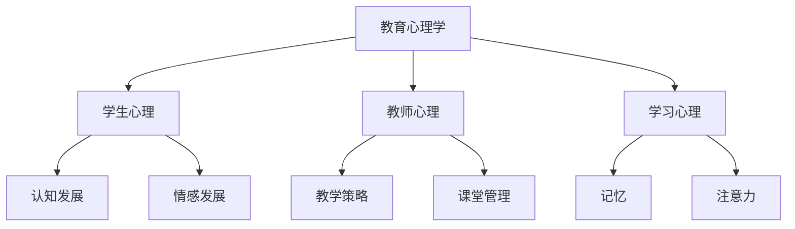

**核心算法原理讲解与伪代码**：

- **学生心理**：涉及认知发展、情感发展等。伪代码示例：
  ```python
  def student_psychology(student_age):
      if student_age < 10:
          cognitive_development = "具体运算阶段"
          emotional_development = "情感依赖"
      else:
          cognitive_development = "形式运算阶段"
          emotional_development = "自我情感管理"
      return cognitive_development, emotional_development
  ```

- **教师心理**：涉及教学策略、课堂管理等。伪代码示例：
  ```python
  def teacher_psychology(teaching_strategy, classroom_management):
      effective_strategy = teaching_strategy == "互动式教学"
      effective_management = classroom_management == "积极鼓励"
      return effective_strategy, effective_management
  ```

#### 2.1.2 课程与教学

**核心概念**：

- **课程设计**：课程内容的组织和安排，包括课程目标、课程内容、教学方法等。
- **教学方法**：教师引导学生学习的策略，如讲授法、讨论法、实践法等。

**联系架构 Mermaid 流程图**：

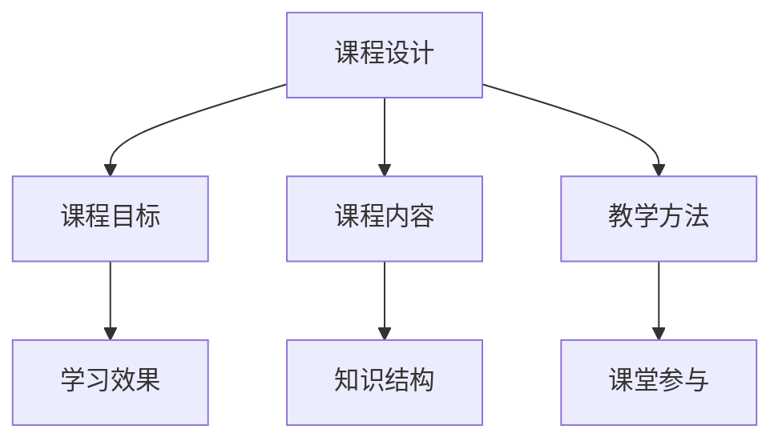

**核心算法原理讲解与伪代码**：

- **课程目标**：确定课程的学习目标和要求。伪代码示例：
  ```python
  def set_course_objective(content, level):
      if level == "初级":
          objective = "掌握基础知识和技能"
      else:
          objective = "深入理解和应用知识"
      return objective
  ```

- **教学方法**：选择合适的教学方法。伪代码示例：
  ```python
  def select_teaching_method(objective, student_profile):
      if objective == "掌握基础知识和技能" and student_profile == "初学者":
          method = "讲授法"
      elif objective == "深入理解和应用知识" and student_profile == "高级学生":
          method = "实践法"
      else:
          method = "讨论法"
      return method
  ```

#### 2.1.3 教育政策法规

**核心概念**：

- **教育政策**：政府为推动教育发展所制定的一系列方针和措施。
- **教育法规**：国家为规范教育行为所制定的法律法规。

**联系架构 Mermaid 流程图**：

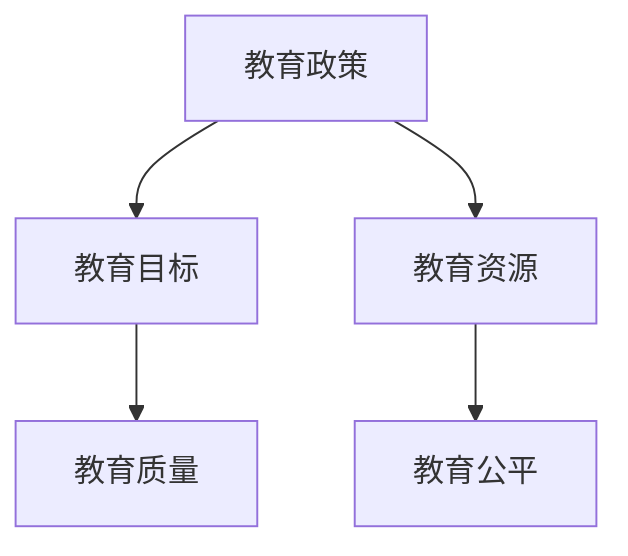

**核心算法原理讲解与伪代码**：

- **教育政策**：制定教育政策以实现教育目标。伪代码示例：
  ```python
  def formulate_education_policy(education_goal):
      if education_goal == "提高教育质量":
          policy = "加强师资培训"
      else:
          policy = "增加教育资源投入"
      return policy
  ```

- **教育法规**：制定法规以规范教育行为。伪代码示例：
  ```python
  def establish_education_law(education_policy):
      if education_policy == "加强师资培训":
          law = "教师法"
      else:
          law = "教育法"
      return law
  ```

### 2.2 心理学相关知识点

#### 2.2.1 发展心理学

**核心概念**：

- **发展心理学**：研究个体从出生到老年各个阶段的心理发展过程和规律。

**联系架构 Mermaid 流程图**：

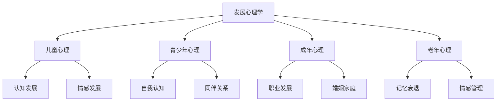

**核心算法原理讲解与伪代码**：

- **儿童心理**：关注儿童的认知和情感发展。伪代码示例：
  ```python
  def child_psychology(age):
      if age < 5:
          cognitive_stage = "感知运动阶段"
          emotional_state = "基本情绪表达"
      else:
          cognitive_stage = "前运算阶段"
          emotional_state = "情绪表达和调节"
      return cognitive_stage, emotional_state
  ```

- **青少年心理**：涉及自我认知和同伴关系。伪代码示例：
  ```python
  def adolescent_psychology(age):
      if age < 18:
          self_cognition = "自我认知形成"
          peer_relationship = "同伴关系建立"
      else:
          self_cognition = "自我认知稳定"
          peer_relationship = "社交网络拓展"
      return self_cognition, peer_relationship
  ```

#### 2.2.2 社会心理学

**核心概念**：

- **社会心理学**：研究个体在社会环境中的心理和行为现象，包括态度、动机、社会影响等。

**联系架构 Mermaid 流程图**：

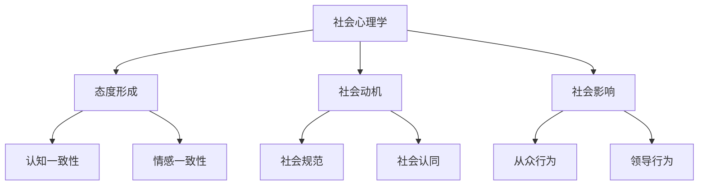

**核心算法原理讲解与伪代码**：

- **态度形成**：考察个体态度的形成和变化。伪代码示例：
  ```python
  def attitudeFormation(information, previous_attitude):
      new_attitude = (information + previous_attitude) / 2
      return new_attitude
  ```

- **社会动机**：分析个体在社会情境中的动机驱动。伪代码示例：
  ```python
  def social_motivation(context, rewards):
      motivation = rewards * (1 - context)
      return motivation
  ```

#### 2.2.3 教育心理学

**核心概念**：

- **教育心理学**：研究教育过程中学生的心理特征、学习过程、教学策略等，以促进教育质量和效果。

**联系架构 Mermaid 流程图**：

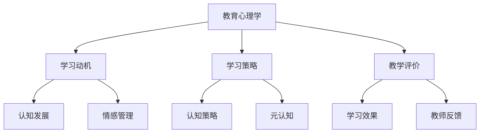

**核心算法原理讲解与伪代码**：

- **学习动机**：分析学生的学习动机。伪代码示例：
  ```python
  def learning_motivation(external_motivation, internal_motivation):
      total_motivation = external_motivation + internal_motivation
      return total_motivation
  ```

- **学习策略**：选择有效的学习策略。伪代码示例：
  ```python
  def select_learning_strategy(difficulty, prior_knowledge):
      if difficulty > 5 and prior_knowledge < 3:
          strategy = "深度学习"
      else:
          strategy = "广泛阅读"
      return strategy
  ```

### 2.3 快手平台知识

#### 2.3.1 快手平台的基本功能

**核心概念**：

- **快手平台**：一款以短视频为主的社交媒体平台，提供用户创作、分享和互动的空间。

**联系架构 Mermaid 流程图**：

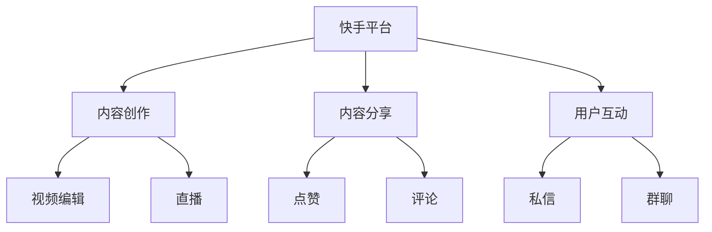

**核心算法原理讲解与伪代码**：

- **内容创作**：提供视频编辑和直播功能。伪代码示例：
  ```python
  def content_creation(editor_feature, live_stream):
      if editor_feature:
          video_created = "视频编辑完成"
      if live_stream:
          live_started = "直播开始"
      return video_created, live_started
  ```

- **用户互动**：实现点赞、评论和私信等功能。伪代码示例：
  ```python
  def user_interaction(like, comment, message):
      like_count = like + 1
      comment_list = comment
      message_sent = "私信发送成功"
      return like_count, comment_list, message_sent
  ```

#### 2.3.2 快手教育业务概述

**核心概念**：

- **快手教育业务**：快手平台在教育领域的业务拓展，提供在线教育课程、教学资源和互动平台。

**联系架构 Mermaid 流程图**：

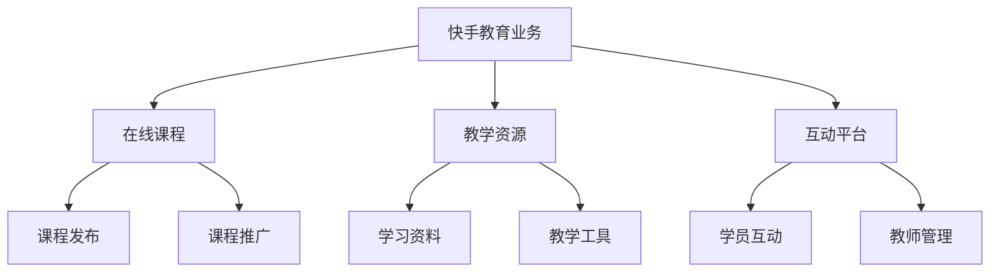

**核心算法原理讲解与伪代码**：

- **在线课程**：实现课程发布和推广。伪代码示例：
  ```python
  def online_course(course_release, course_promotion):
      if course_release:
          course_published = "课程发布成功"
      if course_promotion:
          course_promoted = "课程推广完成"
      return course_published, course_promoted
  ```

- **互动平台**：支持学员互动和教师管理。伪代码示例：
  ```python
  def interactive_platform(student_interaction, teacher_management):
      if student_interaction:
          forum_active = "学员互动活跃"
      if teacher_management:
          teacher_informed = "教师管理有效"
      return forum_active, teacher_informed
  ```

#### 2.3.3 快手教育平台的产品特点

**核心概念**：

- **快手教育平台的产品特点**：以用户体验为核心，提供丰富的教学资源、灵活的学习方式以及高效的互动机制。

**联系架构 Mermaid 流程图**：

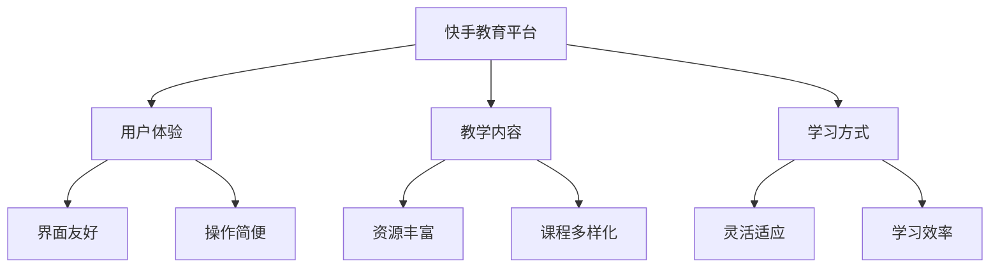

**核心算法原理讲解与伪代码**：

- **用户体验**：优化界面友好和操作简便。伪代码示例：
  ```python
  def optimize_experience(user_interface, user_operations):
      if user_interface == "友好":
          experience_improvement = "用户体验提升"
      if user_operations == "简便":
          experience_improvement = "操作流畅"
      return experience_improvement
  ```

- **教学内容**：提供丰富和多样化的课程资源。伪代码示例：
  ```python
  def course_content(quality_resources, diverse_courses):
      if quality_resources:
          content_quality = "资源质量高"
      if diverse_courses:
          content_versatility = "课程多样性"
      return content_quality, content_versatility
  ```

通过以上对各领域知识点的详细解析，考生可以更好地准备快手教育社招面试，掌握关键知识点，提高答题能力。在接下来的章节中，我们将进一步分析快手教育产品相关和快手教育业务运营相关的真题，帮助考生全面备战面试。## 快手教育产品相关真题解析

快手教育产品是快手平台的重要组成部分，为用户提供了丰富的在线教育资源和互动平台。在快手教育社招面试中，相关产品的功能解析、设计原则和业务运营策略是考生需要重点掌握的知识点。以下是针对这些知识点的详细解析。

### 3.1 快手教育产品功能解析

#### 3.1.1 课程发布与推广

**核心概念**：

- **课程发布**：教育平台提供课程发布功能，让教师可以上传课程内容，并设置课程信息和学习进度。
- **课程推广**：通过多种渠道推广课程，提高课程知名度和参与度。

**联系架构 Mermaid 流程图**：

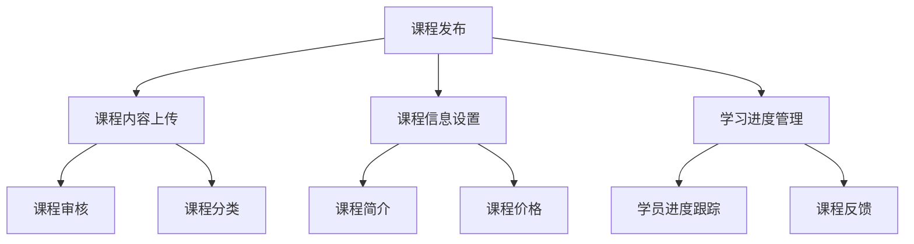

**核心算法原理讲解与伪代码**：

- **课程内容上传**：实现课程内容的多媒体上传和管理。伪代码示例：
  ```python
  def upload_course_content(course_content, media_files):
      if media_files:
          content_uploaded = "课程内容上传成功"
      else:
          content_uploaded = "缺少课程内容"
      return content_uploaded
  ```

- **课程信息设置**：设置课程的基本信息和价格。伪代码示例：
  ```python
  def set_course_info(course_name, course_price):
      course_details = {
          "name": course_name,
          "price": course_price
      }
      return course_details
  ```

- **学习进度管理**：跟踪学员的学习进度并给出反馈。伪代码示例：
  ```python
  def manage_learning_progress(student_id, course_id, progress):
      student_progress = {
          "id": student_id,
          "course_id": course_id,
          "progress": progress
      }
      return student_progress
  ```

#### 3.1.2 学员互动与管理

**核心概念**：

- **学员互动**：提供学员之间的交流和互动功能，如讨论区、问答等。
- **学员管理**：平台对学员进行管理，包括学员信息、学习状态和反馈等。

**联系架构 Mermaid 流程图**：

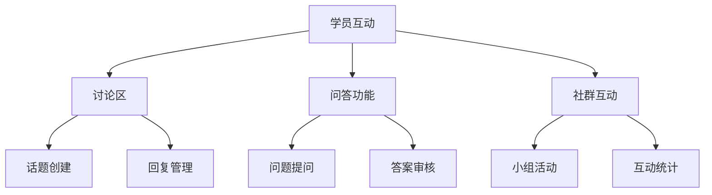

**核心算法原理讲解与伪代码**：

- **讨论区**：管理话题和回复。伪代码示例：
  ```python
  def manage_forum(topics, replies):
      forum_content = {
          "topics": topics,
          "replies": replies
      }
      return forum_content
  ```

- **问答功能**：处理问题和答案。伪代码示例：
  ```python
  def handle_questions(question, answer):
      question_answer = {
          "question": question,
          "answer": answer
      }
      return question_answer
  ```

- **社群互动**：组织小组活动和统计互动数据。伪代码示例：
  ```python
  def community_interaction(activities, stats):
      community_data = {
          "activities": activities,
          "stats": stats
      }
      return community_data
  ```

#### 3.1.3 数据分析与优化

**核心概念**：

- **数据分析**：收集和分析用户行为数据，如学习轨迹、互动频率等，用于优化产品功能和用户体验。
- **数据优化**：基于数据分析结果，对产品功能进行调整和优化。

**联系架构 Mermaid 流程图**：

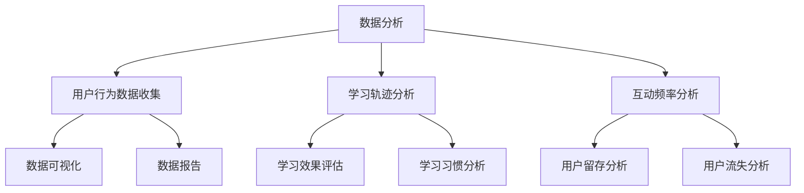

**核心算法原理讲解与伪代码**：

- **用户行为数据收集**：记录和分析用户行为。伪代码示例：
  ```python
  def collect_user_data(user_actions):
      user_behavior = {
          "actions": user_actions
      }
      return user_behavior
  ```

- **学习轨迹分析**：评估学习效果和学习习惯。伪代码示例：
  ```python
  def analyze_learning_path(course_progress, learning_rate):
      learning_trajectory = {
          "course_progress": course_progress,
          "learning_rate": learning_rate
      }
      return learning_trajectory
  ```

- **用户留存分析**：预测用户留存情况。伪代码示例：
  ```python
  def analyze_user_retention(user_data, retention_rate):
      retention_prediction = {
          "data": user_data,
          "predicted_retention": retention_rate
      }
      return retention_prediction
  ```

### 3.2 快手教育产品设计原则

#### 3.2.1 用户体验优先

**核心概念**：

- **用户体验优先**：在产品设计中，始终将用户体验放在首位，确保产品的易用性、简洁性和高效性。

**联系架构 Mermaid 流程图**：

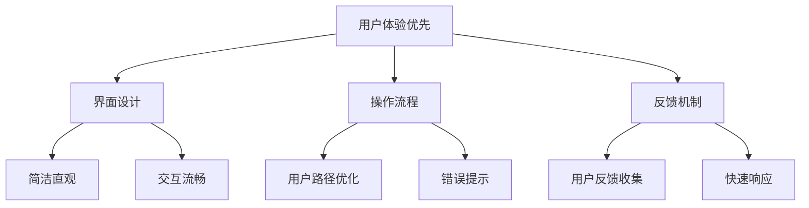

**核心算法原理讲解与伪代码**：

- **界面设计**：设计简洁直观的界面。伪代码示例：
  ```python
  def design_interface(simplicity, intuitiveness):
      if simplicity and intuitiveness:
          interface_design = "优秀"
      else:
          interface_design = "需改进"
      return interface_design
  ```

- **操作流程**：优化用户操作流程。伪代码示例：
  ```python
  def optimize_user_flow(steps, efficiency):
      optimized_flow = {
          "steps": steps,
          "efficiency": efficiency
      }
      return optimized_flow
  ```

#### 3.2.2 教学内容质量保障

**核心概念**：

- **教学内容质量保障**：确保课程内容的质量，包括课程内容的准确性、实用性和更新性。

**联系架构 Mermaid 流程图**：


**核心算法原理讲解与伪代码**：

- **课程内容审核**：确保内容的准确性。伪代码示例：
  ```python
  def content_review(content, accuracy):
      if accuracy:
          content_status = "通过审核"
      else:
          content_status = "需修改"
      return content_status
  ```

- **教师资质认证**：认证教师的资质。伪代码示例：
  ```python
  def verify_teacher_qualification(qualifications):
      if qualifications:
          teacher_status = "合格"
      else:
          teacher_status = "不合格"
      return teacher_status
  ```

#### 3.2.3 平台功能持续迭代

**核心概念**：

- **平台功能持续迭代**：根据用户反馈和市场变化，不断更新和优化平台功能，提高产品竞争力。

**联系架构 Mermaid 流程图**：

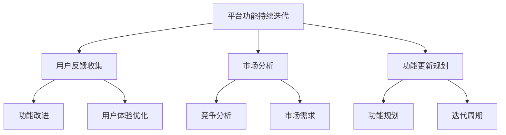

**核心算法原理讲解与伪代码**：

- **用户反馈收集**：分析用户反馈并进行功能改进。伪代码示例：
  ```python
  def collect_user_feedback(feedbacks):
      feedback_analysis = {
          "feedback": feedbacks,
          "improvements": []
      }
      for feedback in feedbacks:
          if "功能改进" in feedback:
              feedback_analysis["improvements"].append(feedback)
      return feedback_analysis
  ```

- **功能更新规划**：规划功能的迭代周期。伪代码示例：
  ```python
  def plan_function_updates(updated_features, iteration周期):
      update_plan = {
          "features": updated_features,
          "schedule": iteration周期
      }
      return update_plan
  ```

通过以上对快手教育产品功能的详细解析，考生可以更好地理解快手教育平台的设计理念和实践方法。掌握这些知识点，有助于考生在面试中展示出对快手教育业务的深入理解和实际操作能力。在接下来的章节中，我们将进一步分析快手教育业务运营相关的真题，帮助考生全面备战快手教育社招面试。## 快手教育业务运营相关真题解析

快手教育作为快手平台的重要组成部分，其业务运营的成功与否直接关系到平台的整体发展。在快手教育社招面试中，考生需要对市场定位、用户调研与分析、运营策略等方面有深入的了解。以下是针对这些知识点的详细解析。

### 4.1 快手教育市场定位

#### 4.1.1 用户群体分析

**核心概念**：

- **用户群体分析**：研究快手教育平台的目标用户群体，包括年龄、性别、职业、教育水平等特征。

**联系架构 Mermaid 流程图**：

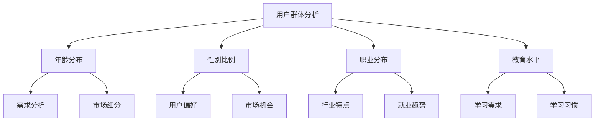

**核心算法原理讲解与伪代码**：

- **年龄分布**：分析不同年龄层次的用户特点。伪代码示例：
  ```python
  def analyze_age_distribution(ages):
      age_groups = {
          "18-24": [],
          "25-34": [],
          "35-44": [],
          "45-54": [],
          "55以上": []
      }
      for age in ages:
          if age >= 18 and age <= 24:
              age_groups["18-24"].append(age)
          elif age >= 25 and age <= 34:
              age_groups["25-34"].append(age)
          # 依此类推，直至最后一个年龄组
      return age_groups
  ```

- **性别比例**：分析用户群体的性别构成。伪代码示例：
  ```python
  def analyze_gender_ratio(genders):
      gender_distribution = {
          "男": 0,
          "女": 0
      }
      for gender in genders:
          if gender == "男":
              gender_distribution["男"] += 1
          else:
              gender_distribution["女"] += 1
      return gender_distribution
  ```

#### 4.1.2 市场竞争分析

**核心概念**：

- **市场竞争分析**：研究快手教育在市场上的竞争对手，包括其产品特点、市场占有率、用户评价等。

**联系架构 Mermaid 流程图**：

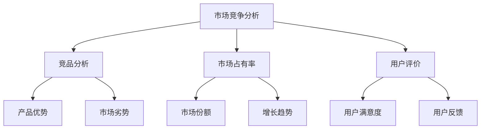

**核心算法原理讲解与伪代码**：

- **竞品分析**：比较快手教育与其他竞品的优缺点。伪代码示例：
  ```python
  def compare_products(productA, productB):
      product_comparison = {
          "productA": productA,
          "productB": productB,
          "advantages": [],
          "disadvantages": []
      }
      if productA["feature"] > productB["feature"]:
          product_comparison["advantages"].append("productA在功能上占优")
      else:
          product_comparison["disadvantages"].append("productB在功能上占优")
      return product_comparison
  ```

- **市场份额**：计算快手教育在市场中的占有率。伪代码示例：
  ```python
  def calculate_market_share(own_share, total_share):
      market_share = (own_share / total_share) * 100
      return market_share
  ```

#### 4.1.3 产品差异化策略

**核心概念**：

- **产品差异化策略**：通过独特的卖点、功能、体验等，使快手教育在市场上与其他产品区分开来。

**联系架构 Mermaid 流程图**：

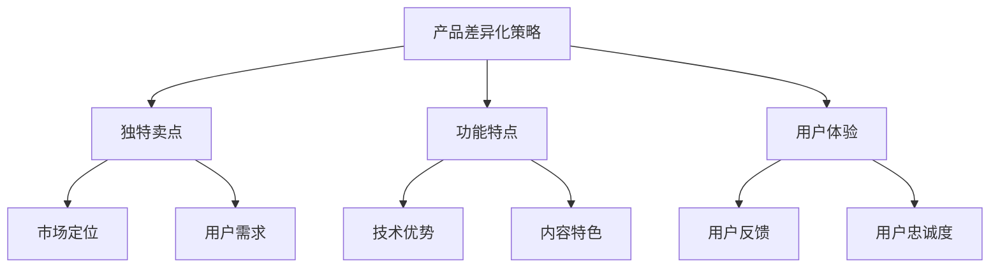

**核心算法原理讲解与伪代码**：

- **独特卖点**：确定产品的独特卖点。伪代码示例：
  ```python
  def define_unique_selling_point(feature, benefit):
      selling_point = {
          "feature": feature,
          "benefit": benefit
      }
      return selling_point
  ```

- **用户体验**：优化产品以提升用户体验。伪代码示例：
  ```python
  def optimize_experience(user_interface, user_operations):
      if user_interface == "友好":
          experience_improvement = "用户体验提升"
      if user_operations == "简便":
          experience_improvement = "操作流畅"
      return experience_improvement
  ```

### 4.2 快手教育运营策略

#### 4.2.1 内容生产与发布

**核心概念**：

- **内容生产与发布**：制定内容生产计划，确保课程内容的丰富性和及时性，并有效推广。

**联系架构 Mermaid 流程图**：

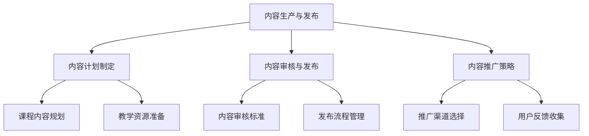

**核心算法原理讲解与伪代码**：

- **内容计划制定**：制定内容生产计划。伪代码示例：
  ```python
  def create_content_plan(learning_topics, course_dates):
      content_plan = {
          "topics": learning_topics,
          "dates": course_dates
      }
      return content_plan
  ```

- **内容审核与发布**：确保内容质量并顺利发布。伪代码示例：
  ```python
  def content_approval(content, criteria):
      if content_meets_criteria(content, criteria):
          approval_status = "通过"
      else:
          approval_status = "未通过"
      return approval_status
  ```

#### 4.2.2 用户互动与反馈

**核心概念**：

- **用户互动与反馈**：通过互动平台和反馈机制，增加用户参与度，收集用户反馈，改进产品和服务。

**联系架构 Mermaid 流程图**：

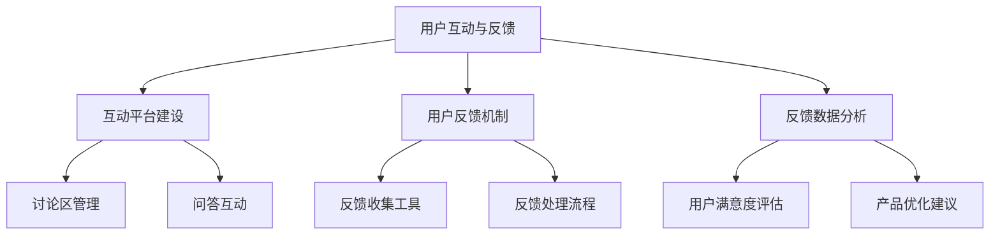

**核心算法原理讲解与伪代码**：

- **互动平台建设**：建立有效的互动平台。伪代码示例：
  ```python
  def build_interactive_platform(channels, features):
      platform_details = {
          "channels": channels,
          "features": features
      }
      return platform_details
  ```

- **用户反馈机制**：设计反馈收集和处理流程。伪代码示例：
  ```python
  def feedback_mechanism(feedback, response_time):
      feedback_analyzed = analyze_feedback(feedback)
      response = generate_response(feedback_analyzed, response_time)
      return response
  ```

#### 4.2.3 营销推广与品牌建设

**核心概念**：

- **营销推广与品牌建设**：通过多渠道营销和品牌塑造，提高快手教育在市场上的知名度，增强用户粘性。

**联系架构 Mermaid 流程图**：

```mermaid
graph TB
A[营销推广与品牌建设] --> B[营销渠道选择]
A --> C[品牌定位]
A --> D[品牌推广策略]
B --> E[线上营销]
B --> F[线下活动]
C --> G[品牌故事]
C --> H[品牌形象]
D --> I[广告投放]
D --> J[内容营销]
```

**核心算法原理讲解与伪代码**：

- **营销渠道选择**：选择合适的营销渠道。伪代码示例：
  ```python
  def select_marketing_channels(channels, reach, cost):
      optimal_channels = []
      for channel in channels:
          if channel["reach"] > average_reach and channel["cost"] < average_cost:
              optimal_channels.append(channel)
      return optimal_channels
  ```

- **品牌定位**：明确品牌在市场中的定位。伪代码示例：
  ```python
  def define_brand_positioning(values, target Audience):
      brand_positioning = {
          "values": values,
          "target_Audience": target_Audience
      }
      return brand_positioning
  ```

通过以上对快手教育业务运营相关真题的详细解析，考生可以更深入地了解快手教育在市场定位、用户调研与分析、运营策略等方面的实践方法和策略。掌握这些知识点，有助于考生在面试中展示出对快手教育业务的全面理解和实际操作能力。在接下来的章节中，我们将进一步分析快手教育用户调研与分析相关的真题，帮助考生全面备战快手教育社招面试。## 快手教育用户调研与分析真题解析

用户调研与分析是快手教育业务运营中至关重要的一环，它帮助平台了解用户需求、优化产品功能和提升用户体验。在快手教育社招面试中，考生需要对用户调研方法与工具、用户需求分析等有深入的了解。以下是针对这些知识点的详细解析。

### 5.1 用户调研方法与工具

#### 5.1.1 问卷调查

**核心概念**：

- **问卷调查**：通过设计问卷收集用户意见和反馈，是一种高效的用户调研方法。

**联系架构 Mermaid 流程图**：

```mermaid
graph TB
A[问卷调查] --> B[问卷设计]
A --> C[数据收集]
A --> D[数据整理]
B --> E[问题设定]
B --> F[选项设计]
C --> G[样本选择]
C --> H[发放问卷]
D --> I[数据分析]
D --> J[报告撰写]
```

**核心算法原理讲解与伪代码**：

- **问卷设计**：设计有效的问卷问题。伪代码示例：
  ```python
  def design_survey(questions, options):
      survey = {
          "questions": questions,
          "options": options
      }
      return survey
  ```

- **数据收集**：收集用户填写的问卷数据。伪代码示例：
  ```python
  def collect_survey_data(survey):
      responses = []
      for question in survey["questions"]:
          user_response = input(question + ": ")
          responses.append(user_response)
      return responses
  ```

#### 5.1.2 用户访谈

**核心概念**：

- **用户访谈**：通过与用户进行面对面的交流，深入了解用户需求、行为和体验。

**联系架构 Mermaid 流程图**：

```mermaid
graph TB
A[用户访谈] --> B[访谈准备]
A --> C[访谈过程]
A --> D[访谈总结]
B --> E[问题设定]
B --> F[访谈对象选择]
C --> G[访谈记录]
C --> H[用户反馈]
D --> I[报告撰写]
D --> J[数据整理]
```

**核心算法原理讲解与伪代码**：

- **访谈准备**：设计访谈问题和选择访谈对象。伪代码示例：
  ```python
  def prepare_interview(questions, interviewees):
      interview_plan = {
          "questions": questions,
          "interviewees": interviewees
      }
      return interview_plan
  ```

- **访谈记录**：记录访谈过程中的关键信息。伪代码示例：
  ```python
  def record_interview_data(interview_plan):
      interview_data = []
      for question in interview_plan["questions"]:
          answer = input(question + ": ")
          interview_data.append(answer)
      return interview_data
  ```

#### 5.1.3 数据分析工具

**核心概念**：

- **数据分析工具**：利用工具如Excel、Python等对收集到的用户数据进行处理和分析。

**联系架构 Mermaid 流程图**：

```mermaid
graph TB
A[数据分析工具] --> B[数据预处理]
A --> C[数据可视化]
A --> D[统计分析]
B --> E[数据清洗]
B --> F[数据整合]
C --> G[图表绘制]
C --> H[数据报告]
D --> I[趋势分析]
D --> J[关联分析]
```

**核心算法原理讲解与伪代码**：

- **数据预处理**：清洗和整合数据。伪代码示例：
  ```python
  def preprocess_data(data):
      cleaned_data = []
      for record in data:
          if is_valid(record):
              cleaned_data.append(record)
      return cleaned_data
  ```

- **数据可视化**：绘制图表展示分析结果。伪代码示例：
  ```python
  import matplotlib.pyplot as plt

  def visualize_data(data):
      plt.plot(data)
      plt.title("Data Visualization")
      plt.xlabel("X-axis")
      plt.ylabel("Y-axis")
      plt.show()
  ```

### 5.2 用户需求分析

#### 5.2.1 用户痛点挖掘

**核心概念**：

- **用户痛点挖掘**：通过调研分析，识别用户在使用快手教育过程中遇到的主要问题和需求。

**联系架构 Mermaid 流程图**：

```mermaid
graph TB
A[用户痛点挖掘] --> B[调研结果分析]
A --> C[用户反馈整理]
A --> D[需求归类]
B --> E[问题识别]
B --> F[需求优先级]
C --> G[用户反馈记录]
C --> H[问题列表]
D --> I[需求描述]
D --> J[解决方案]
```

**核心算法原理讲解与伪代码**：

- **调研结果分析**：分析调研数据以识别问题。伪代码示例：
  ```python
  def analyze_survey_results(responses):
      problems = []
      for response in responses:
          if "问题" in response:
              problems.append(response)
      return problems
  ```

- **需求归类**：对识别出的用户需求进行分类。伪代码示例：
  ```python
  def classify_user_needs(problems):
      categorized_needs = {
          "功能需求": [],
          "体验需求": [],
          "内容需求": []
      }
      for problem in problems:
          if "功能" in problem:
              categorized_needs["功能需求"].append(problem)
          elif "体验" in problem:
              categorized_needs["体验需求"].append(problem)
          else:
              categorized_needs["内容需求"].append(problem)
      return categorized_needs
  ```

#### 5.2.2 用户满意度评估

**核心概念**：

- **用户满意度评估**：通过用户反馈和调研数据，评估用户对快手教育产品或服务的满意度。

**联系架构 Mermaid 流程图**：

```mermaid
graph TB
A[用户满意度评估] --> B[反馈收集]
A --> C[满意度分析]
A --> D[评估指标设定]
B --> E[反馈整理]
B --> F[满意度评分]
C --> G[满意度趋势分析]
C --> H[改进措施]
D --> I[评价标准]
D --> J[满意度报告]
```

**核心算法原理讲解与伪代码**：

- **反馈收集**：收集用户的满意度反馈。伪代码示例：
  ```python
  def collect_satisfaction_feedback(feedbacks):
      satisfaction_scores = []
      for feedback in feedbacks:
          if "满意" in feedback:
              satisfaction_scores.append(1)
          elif "一般" in feedback:
              satisfaction_scores.append(0.5)
          else:
              satisfaction_scores.append(0)
      return satisfaction_scores
  ```

- **满意度分析**：分析满意度评分以识别改进机会。伪代码示例：
  ```python
  def analyze_satisfaction(satisfaction_scores):
      average_score = sum(satisfaction_scores) / len(satisfaction_scores)
      return average_score
  ```

#### 5.2.3 用户行为分析

**核心概念**：

- **用户行为分析**：通过分析用户的操作行为和互动行为，了解用户的学习习惯和偏好，为产品优化提供数据支持。

**联系架构 Mermaid 流程图**：

```mermaid
graph TB
A[用户行为分析] --> B[数据收集]
A --> C[行为模式识别]
A --> D[行为关联分析]
B --> E[学习轨迹分析]
B --> F[互动频率分析]
C --> G[行为特征提取]
C --> H[行为预测]
D --> I[行为关联规则]
D --> J[行为优化建议]
```

**核心算法原理讲解与伪代码**：

- **数据收集**：收集用户行为数据。伪代码示例：
  ```python
  def collect_user_behavior(data):
      behavior_data = {
          "learning_path": [],
          "interaction_frequency": []
      }
      for record in data:
          behavior_data["learning_path"].append(record["learning_path"])
          behavior_data["interaction_frequency"].append(record["interaction_frequency"])
      return behavior_data
  ```

- **行为模式识别**：识别用户的行为模式。伪代码示例：
  ```python
  def identify_behavior_patterns(behavior_data):
      patterns = []
      for path in behavior_data["learning_path"]:
          pattern = {
              "path": path,
              "frequency": behavior_data["interaction_frequency"].count(path)
          }
          patterns.append(pattern)
      return patterns
  ```

通过以上对快手教育用户调研与分析真题的详细解析，考生可以更好地理解用户调研的方法与工具，掌握用户需求分析和行为分析的核心概念和算法原理。这些知识点不仅有助于考生在面试中展示专业能力，也有助于考生在实际工作中优化产品和服务，提升用户体验。在接下来的章节中，我们将进一步分析快手教育成功与失败案例，为考生提供实际的运营经验和教训。## 快手教育成功与失败案例

快手教育作为快手平台的核心业务之一，在近年来取得了显著的成就，同时也经历过一些失败。通过分析成功与失败案例，考生可以更深入地理解快手教育的发展历程和运营策略，为面试中的案例分析做好准备。

### 6.1 快手教育成功案例

#### 案例一：快手教育直播课的推出

**背景介绍**：

快手教育在2021年推出了直播课功能，这一创新举措极大地丰富了平台的课程形式，提高了用户的参与度和学习体验。

**核心概念与联系**：

- **直播课功能**：通过实时直播，教师可以直接与学员互动，提供实时反馈和解答疑问。
- **用户体验**：直播课提供了更加生动和互动的学习环境，提升了用户的学习积极性和效果。

**流程图**：

```mermaid
graph TB
A[直播课功能推出] --> B[课程准备]
A --> C[直播授课]
B --> D[教学准备]
B --> E[互动环节]
C --> F[实时反馈]
C --> G[课程总结]
```

**核心算法原理讲解与伪代码**：

- **教学准备**：准备直播课程内容。伪代码示例：
  ```python
  def prepare_live_course(course_content, teaching_plan):
      prepared_course = {
          "content": course_content,
          "plan": teaching_plan
      }
      return prepared_course
  ```

- **实时反馈**：处理学员在直播中的反馈。伪代码示例：
  ```python
  def handle_realtime_feedback(feedbacks):
      for feedback in feedbacks:
          process_feedback(feedback)
  ```

**成功原因**：

- **用户需求**：直播课满足了用户对实时互动和个性化教育的需求。
- **技术创新**：快手教育通过技术手段提升了直播课的稳定性和互动性。
- **市场定位**：准确把握市场趋势，快速响应用户需求。

#### 案例二：快手教育用户社区的建设

**背景介绍**：

快手教育在2022年加强了用户社区的建设，通过建立学习小组和互动论坛，鼓励用户之间的交流与合作。

**核心概念与联系**：

- **用户社区**：为用户提供了一个交流平台，促进了知识共享和学习互助。
- **用户粘性**：通过社区互动，提高了用户的粘性，增强了平台的用户活跃度。

**流程图**：

```mermaid
graph TB
A[用户社区建设] --> B[社区管理]
A --> C[小组活动]
B --> D[话题创建]
B --> E[互动统计]
C --> F[学习小组]
C --> G[活动反馈]
```

**核心算法原理讲解与伪代码**：

- **社区管理**：管理社区内容和用户互动。伪代码示例：
  ```python
  def manage_community(content, interactions):
      community_data = {
          "content": content,
          "interactions": interactions
      }
      return community_data
  ```

- **互动统计**：统计社区互动数据。伪代码示例：
  ```python
  def count_interactions(interactions):
      interaction_count = len(interactions)
      return interaction_count
  ```

**成功原因**：

- **用户参与**：用户社区的建立激发了用户的参与热情，促进了知识的传播和分享。
- **社交属性**：社区互动增强了用户的社交属性，提升了平台的用户粘性。
- **内容多样**：多样化的社区活动和话题吸引了不同类型的用户，丰富了平台的生态。

### 6.2 快手教育失败案例

#### 案例一：快手教育内容审核不严

**背景介绍**：

在2021年，快手教育因为内容审核不严，出现了一些不符合教育规范的内容，引发了用户的不满和投诉。

**核心概念与联系**：

- **内容审核**：确保课程内容的质量和合规性。
- **用户体验**：不严格的内容审核影响了用户体验，损害了平台的信誉。

**流程图**：

```mermaid
graph TB
A[内容审核不严] --> B[内容发布]
A --> C[用户投诉]
B --> D[内容质量]
B --> E[反馈处理]
C --> F[用户不满]
C --> G[投诉处理]
```

**核心算法原理讲解与伪代码**：

- **内容发布**：发布课程内容。伪代码示例：
  ```python
  def publish_course(course_content, quality_check):
      if quality_check:
          publish_status = "成功"
      else:
          publish_status = "失败"
      return publish_status
  ```

- **反馈处理**：处理用户反馈。伪代码示例：
  ```python
  def handle_feedback(feedback):
      action_taken = process_feedback(feedback)
      return action_taken
  ```

**失败原因**：

- **审核机制不完善**：内容审核流程不严格，导致不良内容流入平台。
- **用户反馈不重视**：对用户投诉和反馈处理不及时，导致用户体验下降。
- **品牌形象受损**：不良内容损害了快手教育的品牌形象，影响了用户对平台的信任。

#### 案例二：快手教育课程定价不合理

**背景介绍**：

在2022年，快手教育因为课程定价过高，导致用户流失，市场份额下降。

**核心概念与联系**：

- **课程定价**：合理的定价策略对于用户的接受度和购买意愿至关重要。
- **市场竞争**：过高的定价在竞争激烈的市场中不利于产品的推广和用户留存。

**流程图**：

```mermaid
graph TB
A[课程定价过高] --> B[用户流失]
A --> C[市场竞争]
B --> D[用户反馈]
B --> E[定价策略调整]
C --> F[市场份额下降]
C --> G[用户投诉]
```

**核心算法原理讲解与伪代码**：

- **定价策略**：制定合理的定价策略。伪代码示例：
  ```python
  def set_course_price(price, market_data):
      if price < market_average:
          price_adjustment = "降低"
      else:
          price_adjustment = "保持"
      return price_adjustment
  ```

- **用户反馈**：收集用户反馈。伪代码示例：
  ```python
  def collect_user_feedback(feedbacks):
      user_suggestions = []
      for feedback in feedbacks:
          if "价格" in feedback:
              user_suggestions.append(feedback)
      return user_suggestions
  ```

**失败原因**：

- **定价策略失误**：没有充分考虑到市场情况和用户承受能力，导致定价过高。
- **市场竞争分析不足**：对竞争对手的定价策略和市场反应缺乏深入分析。
- **用户体验受损**：过高的定价降低了用户的购买意愿，影响了用户体验和用户留存。

通过以上对快手教育成功与失败案例的详细分析，考生可以了解到快手教育在不同运营阶段所采取的策略及其效果，从而在面试中能够更好地展示自己的分析能力和应对策略。在接下来的章节中，我们将提供快手教育社招面试的综合模拟与真题解析，帮助考生全面提升面试技能。## 快手教育社招面试综合模拟与真题解析

为了帮助考生在快手教育社招面试中更好地应对各类问题，本章节将提供一些面试综合模拟与真题解析。这些模拟题目和真题涵盖了快手教育相关的多个方面，包括产品功能、用户需求分析、运营策略等，旨在帮助考生全面准备面试，提高答题能力。

### 7.1 模拟面试准备

#### 7.1.1 面试形式与流程

在快手教育社招面试中，面试通常分为以下几个环节：

1. **自我介绍**：简要介绍个人背景、教育经历、工作经历和项目经验。
2. **行为面试**：通过具体行为和经历，考察考生的综合素质和团队合作能力。
3. **专业知识面试**：针对教育学、心理学、快手平台知识等专业知识进行提问。
4. **情景模拟面试**：设置一个实际工作中的情景，考察考生的应变能力和决策能力。
5. **综合问答环节**：回答面试官提出的一些开放性问题，展示自己的思考能力和专业素养。

#### 7.1.2 常见问题预演

为了更好地准备面试，考生可以预演以下常见问题：

1. **请介绍一下您自己。**
   - 解答思路：简要介绍个人背景，包括教育经历、工作经历和取得的成就。

2. **您为什么选择加入快手教育？**
   - 解答思路：表达对快手教育业务的兴趣，说明自己对该行业的热情和职业规划。

3. **您在项目中遇到的最大的挑战是什么？您是如何克服的？**
   - 解答思路：分享一个具体的项目经历，描述挑战和解决方案，突出自己的问题解决能力。

4. **请您谈谈对教育学和心理学的理解。**
   - 解答思路：简要介绍教育学和心理学的核心概念和联系，结合实际工作经历进行说明。

5. **您如何看待快手教育在当前市场中的竞争地位？**
   - 解答思路：分析快手教育在市场中的优势和挑战，提出自己的看法和建议。

#### 7.1.3 面试技巧提升

1. **掌握面试技巧**：提前了解面试流程，掌握常见的面试问题和答题技巧，如STAR法则（Situation, Task, Action, Result）等。
2. **增强自信**：面试前进行充分的准备和模拟，增强自信心，保持冷静和镇定。
3. **展现专业素养**：在回答问题时，尽量用专业术语和实际案例进行说明，展示自己的专业知识和实践经验。
4. **注重细节**：注意面试时的着装、仪态和言辞，展现良好的职业素养和团队合作精神。

### 7.2 模拟面试真题解析

以下提供几个快手教育社招面试的模拟真题及其解答：

#### 真题一：请描述一次您在项目中遇到的问题以及您的解决方案。

**解题思路**：

1. **情景描述**：简要介绍项目背景和遇到的问题。
2. **解决方案**：详细描述解决问题的步骤和采取的措施。
3. **结果评估**：说明解决方案的实施效果和影响。

**答案解析**：

- **情景描述**：在一个教育项目中，由于用户量激增，系统出现了性能瓶颈，导致用户访问速度变慢。
- **解决方案**：通过性能测试发现瓶颈所在，采取以下措施解决：
  1. 优化数据库查询语句，减少查询时间。
  2. 使用缓存技术，减少数据库访问次数。
  3. 增加服务器带宽和缓存容量。
- **结果评估**：实施上述措施后，系统性能显著提升，用户访问速度恢复正常，用户满意度提高。

#### 真题二：请谈谈您对快手教育未来发展的看法。

**解题思路**：

1. **当前市场环境**：分析当前教育市场的趋势和竞争态势。
2. **快手教育的优势**：阐述快手教育在市场上的优势和发展潜力。
3. **未来发展策略**：提出快手教育未来的发展策略和方向。

**答案解析**：

- **当前市场环境**：随着互联网技术的发展和在线教育的普及，教育市场呈现快速增长的态势，竞争日益激烈。
- **快手教育的优势**：快手教育具有以下优势：
  1. 强大的用户基础和广泛的受众群体。
  2. 丰富的课程内容和多样化的教学形式。
  3. 强大的技术支持和服务能力。
- **未来发展策略**：
  1. 深化教育业务，拓展更多教育领域和课程类型。
  2. 加强与院校和机构的合作，提升课程质量和品牌影响力。
  3. 创新教学方式，引入更多人工智能和虚拟现实技术，提升用户体验。

#### 真题三：如果您是快手教育的运营负责人，如何提升平台的用户活跃度？

**解题思路**：

1. **用户需求分析**：分析用户的需求和行为，找出提升活跃度的关键因素。
2. **运营策略**：提出具体的运营策略和措施，提高用户活跃度。
3. **效果评估**：说明运营策略的实施效果和预期目标。

**答案解析**：

- **用户需求分析**：根据用户调研数据，发现用户对以下方面有较高需求：
  1. 更丰富的课程内容和个性化推荐。
  2. 更活跃的社区互动和用户交流。
  3. 更便捷的学习工具和资源获取。
- **运营策略**：
  1. 拓展课程内容，引入更多优质课程和行业专家，提升课程质量。
  2. 加强社区运营，举办线上活动，鼓励用户互动和参与。
  3. 推出学习工具和应用，提高学习效率和用户体验。
  4. 优化用户推荐算法，提高个性化推荐效果。
- **效果评估**：通过实施上述运营策略，预计可以显著提高平台的用户活跃度，增加用户粘性和留存率。

通过以上模拟面试真题的解析，考生可以更好地了解快手教育社招面试的常见问题及其解答思路。在面试前进行充分的准备和模拟，有助于考生在面试中发挥出最佳水平，顺利通过面试。在接下来的章节中，我们将提供快手教育社招面试的真题详解与解答，帮助考生进一步巩固知识点，提升面试能力。## 快手教育社招面试真题详解与解答

为了帮助考生更好地准备快手教育社招面试，本章节将针对几个典型的面试真题进行详细解答，包括解题思路、答案解析和相关的知识点分析。

### 8.1 真题一详解与解答

#### 真题一：请谈谈您对在线教育平台用户体验优化的看法。

**解题思路**：

1. **定义用户体验**：首先明确用户体验的定义，即用户在使用平台过程中所获得的感受和体验。
2. **分析优化方向**：从平台界面设计、功能实现、内容质量等方面分析用户体验优化的方向。
3. **提出优化措施**：结合实际案例，提出具体的优化措施和建议。

**答案解析**：

1. **用户体验的定义**：用户体验（User Experience，简称UX）是指用户在使用某个产品或服务时所获得的整体感受和体验。

2. **优化方向**：
   - **界面设计**：优化界面设计，提高页面布局的合理性，确保视觉上的舒适度和清晰度。
   - **功能实现**：确保功能实现的高效和稳定，减少用户操作步骤，提高操作便捷性。
   - **内容质量**：提供高质量的教育内容，确保课程的实用性、丰富性和及时更新。

3. **优化措施**：
   - **用户调研**：通过用户调研了解用户需求和痛点，为优化提供数据支持。
   - **界面优化**：采用简洁直观的界面设计，减少视觉干扰，提高用户操作效率。
   - **功能迭代**：不断迭代和优化功能，确保平台的稳定性和可用性。
   - **内容审核**：加强内容审核，确保课程内容的准确性和实用性。

**知识点分析**：
- **用户体验**：涉及界面设计、功能实现、内容质量等多个方面，是产品设计和运营的重要考虑因素。
- **用户调研**：通过调研了解用户需求和反馈，是优化用户体验的基础。
- **界面优化**：界面设计的合理性直接影响用户的操作体验和满意度。
- **功能迭代**：功能的迭代和优化是提升用户体验的重要手段。

### 8.2 真题二详解与解答

#### 真题二：如何提高快手教育平台的用户留存率？

**解题思路**：

1. **用户留存率的概念**：解释用户留存率的意义和计算方法。
2. **分析用户留存的影响因素**：从用户需求、平台功能、内容质量、用户互动等方面分析影响用户留存的因素。
3. **提出提高留存率的策略**：结合实际案例，提出提高用户留存率的策略和措施。

**答案解析**：

1. **用户留存率的概念**：用户留存率是指在一定时间内，持续使用或返回平台的用户比例。

2. **影响因素**：
   - **用户需求**：满足用户的学习需求和期望，提供符合用户兴趣的课程内容。
   - **平台功能**：提供便捷、高效、稳定的平台功能，确保用户在使用过程中的良好体验。
   - **内容质量**：提供高质量的教育内容，确保课程的实用性、丰富性和及时更新。
   - **用户互动**：鼓励用户之间的互动和交流，增强用户的归属感和参与度。

3. **策略**：
   - **个性化推荐**：通过算法分析用户行为，提供个性化的课程推荐，满足用户个性化需求。
   - **社区互动**：建立活跃的社区，鼓励用户参与讨论和分享，提高用户粘性。
   - **用户激励**：通过奖励机制，如积分、优惠券等，激励用户持续使用平台。
   - **课程质量提升**：持续优化课程内容，确保课程的实用性和吸引力。

**知识点分析**：
- **用户留存率**：涉及用户行为分析、用户满意度、用户激励等多个方面，是衡量平台运营效果的重要指标。
- **个性化推荐**：通过大数据和算法分析，提高课程推荐的精准度和用户体验。
- **社区互动**：通过社区互动，增强用户参与度和平台粘性。
- **用户激励**：通过奖励机制，提高用户的持续使用意愿。

### 8.3 真题三详解与解答

#### 真题三：如果您是快手教育的产品经理，如何设计一款新的教育产品？

**解题思路**：

1. **明确产品目标**：确定新教育产品的目标用户群体、功能和定位。
2. **市场调研**：分析市场趋势、竞争对手和用户需求，为新产品的设计提供依据。
3. **产品设计**：从界面设计、功能模块、用户体验等方面详细阐述产品的设计思路和实现方法。
4. **风险评估**：分析产品设计可能面临的风险和挑战，并提出应对策略。

**答案解析**：

1. **产品目标**：
   - **目标用户群体**：面向职场人士和兴趣爱好者，提供实用技能培训和兴趣爱好课程。
   - **功能定位**：以视频课程为主，结合直播互动、在线作业、社群交流等功能，提供全方位的学习体验。

2. **市场调研**：
   - **市场趋势**：在线教育市场规模持续扩大，用户对学习方式的需求多样化。
   - **竞争对手**：分析主要竞争对手的产品特点和市场表现，找出自身产品的差异化优势。
   - **用户需求**：通过问卷调查、用户访谈等方式，了解用户对教育产品的需求和期望。

3. **产品设计**：
   - **界面设计**：简洁直观，提供清晰的导航和课程分类，确保用户快速找到所需内容。
   - **功能模块**：
     - **视频课程**：提供高清视频课程，支持倍速播放、笔记记录等功能。
     - **直播互动**：提供实时直播课程，支持提问、讨论和互动功能。
     - **在线作业**：支持在线作业提交和批改，提供及时反馈和成绩统计。
     - **社群交流**：建立学习社群，促进用户之间的交流和互助。

4. **风险评估**：
   - **市场风险**：市场竞争激烈，需确保产品具有差异化优势和良好的用户体验。
   - **技术风险**：确保产品技术实现的高效性和稳定性，避免系统故障和用户数据泄露。
   - **运营风险**：制定合理的运营策略和推广计划，确保产品上线后能够获得足够的用户关注。

**知识点分析**：
- **产品目标**：明确产品定位和目标用户，是产品设计的首要任务。
- **市场调研**：了解市场趋势和用户需求，为产品设计和运营提供依据。
- **界面设计**：良好的界面设计是提升用户体验的关键。
- **功能模块**：根据用户需求设计功能模块，确保产品的实用性和竞争力。
- **风险评估**：预见并应对产品设计和运营过程中可能出现的风险。

通过以上对快手教育社招面试真题的详解与解答，考生可以更好地理解面试题目的核心要点，掌握相关知识点，提高面试答题能力。在面试中，考生还需要结合自身实际经验和专业素养，灵活运用所学知识，展现自己的专业能力和综合素质。希望考生能够在快手教育社招面试中取得优异的成绩。## 附录A：快手教育面试资料与建议

### A.1 快手教育面试资料汇总

在准备快手教育社招面试时，以下资料对考生来说尤为重要：

1. **教育学知识点汇总**：
   - 教育心理学基础知识
   - 课程设计原理
   - 教学方法与应用
   - 教育政策与法规

2. **心理学知识点汇总**：
   - 发展心理学主要理论
   - 社会心理学核心概念
   - 教育心理学重点内容

3. **快手平台知识点汇总**：
   - 快手平台的基本功能
   - 快手教育业务概述
   - 快手教育平台的产品特点

4. **快手教育业务运营相关资料**：
   - 市场定位分析
   - 用户调研方法
   - 运营策略与案例分析

### A.2 快手教育面试建议

#### A.2.1 面试前准备

1. **自我介绍**：准备一份简洁明了的自我介绍，突出个人优势和特长。

2. **专业知识复习**：对教育学、心理学等相关知识点进行系统复习，确保掌握核心概念和理论。

3. **案例分析**：收集并分析快手教育的成功和失败案例，理解其运营策略和经验教训。

4. **模拟面试**：与朋友或家人进行模拟面试，练习常见问题的回答和应对策略。

5. **着装仪表**：选择正式的着装，保持良好的仪表和形象。

#### A.2.2 面试中注意事项

1. **沟通技巧**：保持清晰的语速和逻辑性，避免口语化和口头禅。

2. **自信表达**：对自身经验和能力保持自信，但避免过分夸张。

3. **积极倾听**：认真倾听面试官的问题，确保理解后再进行回答。

4. **应变能力**：遇到不会回答的问题时，保持冷静，尝试从不同角度思考或请求面试官给出更多的信息。

5. **展现热情**：表达对快手教育岗位和职位的热情，展示职业发展的积极态度。

#### A.2.3 面试后总结与反思

1. **反馈收集**：向面试官询问面试结果和反馈，了解自己的表现和需要改进的地方。

2. **自我反思**：回顾面试过程中的表现，总结经验和教训，为后续面试做好准备。

3. **持续学习**：根据面试反馈，进一步学习相关知识和技能，提升自身综合素质。

通过以上面试资料和建议，考生可以更好地准备快手教育社招面试，提高面试成功率。面试不仅是对知识和技能的考察，更是对考生综合素质和职业素养的全面评估。希望考生能够在面试中表现出色，取得理想的岗位。## 总结与展望

在本文中，我们详细解析了2024年快手教育社招面试的各类真题，包括教育学、心理学、快手平台知识以及教育业务运营等多个方面。通过分类解析和真题解答，考生可以更深入地理解快手教育的核心概念和实际应用，提高面试答题能力和综合素质。

首先，我们回顾了快手教育社招面试的概述，了解了面试的类型和特点。接着，我们对常见知识点进行了详细解析，包括教育学、心理学和快手平台知识，并提供了相应的算法原理和伪代码示例。在此基础上，我们分析了快手教育产品相关和业务运营相关的真题，探讨了产品功能解析、用户需求分析、市场定位、运营策略等方面的核心要点。

此外，我们通过快手教育的成功与失败案例，展示了实际运营中的经验教训，帮助考生在面试中更好地展示自己的分析和应变能力。最后，我们提供了面试综合模拟和真题解析，为考生全面准备面试提供了实用的建议和指导。

展望未来，随着在线教育行业的快速发展，快手教育将继续面临新的机遇和挑战。考生应不断学习新知识，提升自身综合素质，适应行业变化。同时，注重实践经验和团队合作能力的培养，以便在面试中脱颖而出。

在此，作者衷心祝愿所有考生在快手教育社招面试中取得优异的成绩，顺利加入快手教育团队，共同推动在线教育事业的繁荣发展。希望本文能为考生提供有益的参考和帮助，助力职业成长。最后，再次感谢读者的阅读和支持，作者将不断努力，为您带来更多优质的内容。

