                 

### 文章标题

《思维导图：知识组织的视觉化工具》

### 关键词

思维导图、知识组织、视觉化、应用场景、专业技巧、高级应用、实践案例、软件推荐、资源与工具。

### 摘要

本文将深入探讨思维导图这一知识组织的视觉化工具。我们将从基础概念出发，逐步介绍思维导图的起源、应用场景、构建方法以及专业技巧。通过实例解析和实际应用，我们将展示如何有效地利用思维导图提升个人与团队的工作效率，并在不同领域中实现创新与成长。最后，我们将推荐相关软件和资源，帮助读者进一步探索和掌握这一强大的工具。

---

### 《思维导图：知识组织的视觉化工具》目录大纲

#### 第一部分：思维导图的基础知识

##### 第1章：思维导图的起源与发展

- 1.1 思维导图的概念与定义
- 1.2 思维导图的历史发展
- 1.3 思维导图的核心原理

##### 第2章：思维导图的应用场景

- 2.1 教育与学习中的应用
- 2.2 工作与团队协作中的应用
- 2.3 创意与设计中的应用

##### 第3章：构建思维导图的基本方法

- 3.1 思维导图的绘制步骤
- 3.2 思维导图的基本元素
- 3.3 思维导图的优化技巧

#### 第二部分：思维导图的专业技巧

##### 第4章：思维导图的进阶技巧

- 4.1 思维导图的主题化设计
- 4.2 思维导图的层次化组织
- 4.3 思维导图的信息可视化

##### 第5章：思维导图在项目管理中的应用

- 5.1 项目规划与监控
- 5.2 风险管理与决策分析
- 5.3 团队协作与沟通

##### 第6章：思维导图在教育培训中的应用

- 6.1 教学内容组织
- 6.2 学习效果评估
- 6.3 教学互动与反馈

#### 第三部分：思维导图的高级应用

##### 第7章：思维导图在创新与创意中的应用

- 7.1 创新思维的激发
- 7.2 产品设计与优化
- 7.3 市场分析与战略规划

##### 第8章：思维导图在领导力与个人发展中的应用

- 8.1 领导力提升
- 8.2 个人成长规划
- 8.3 高效时间管理

##### 第9章：思维导图的实践案例解析

- 9.1 教育案例解析
- 9.2 企业案例解析
- 9.3 创意案例解析

#### 附录：思维导图资源与工具

##### 附录A：思维导图软件介绍

- 10.1 MindManager
- 10.2 XMind
- 10.3 iMindMap

##### 附录B：思维导图资源推荐

- 11.1 思维导图教程
- 11.2 思维导图案例库
- 11.3 思维导图社区交流平台

---

在接下来的内容中，我们将一步一步地深入探讨思维导图的基础知识、应用技巧以及高级应用，帮助您全面理解并掌握这一强大的知识组织工具。

---

### 第一部分：思维导图的基础知识

#### 第1章：思维导图的起源与发展

##### 1.1 思维导图的概念与定义

思维导图（Mind Map）是一种图形化的工具，用于表达和展示思维过程。它通过中心主题及其分支结构，将信息以视觉化的方式呈现，从而帮助人们更好地理解和记忆复杂的信息。

思维导图的基本元素包括：

- **中心主题**：整个思维导图的中心，代表核心概念或问题。
- **分支**：从中心主题辐射出的线条，代表主要分支或次要分支。
- **节点**：分支上的点，代表具体的信息或想法。
- **连线**：节点之间的线条，表示节点之间的关联或关系。

##### 1.2 思维导图的历史发展

思维导图的起源可以追溯到20世纪60年代，由英国心理学家东尼·博赞（Tony Buzan）首创。他首次提出了“思维导图”的概念，并将其用于个人思维和知识管理。

东尼·博赞发现，人们可以通过视觉化的方式更好地理解和记忆信息。他将这种通过颜色、图像和分支结构来组织信息的方法称为“思维导图”。自那时以来，思维导图得到了广泛的认可和应用，逐渐成为知识管理和个人发展的有力工具。

##### 1.3 思维导图的核心原理

思维导图的核心原理主要包括以下几个方面：

- **中心化思维**：思维导图的中心主题代表核心概念或问题，引导思维的集中和深入。
- **分支结构**：分支结构有助于清晰地组织信息，使得思维过程更加有序。
- **视觉化表示**：通过颜色、图像和符号等视觉元素，增强信息的记忆性和可理解性。
- **非线性思维**：思维导图鼓励非线性思维，即不按照线性顺序，而是通过分支和节点之间的连接，自由地思考和探索。

核心概念与联系

我们使用Mermaid流程图来展示思维导图的核心概念及其相互关系：

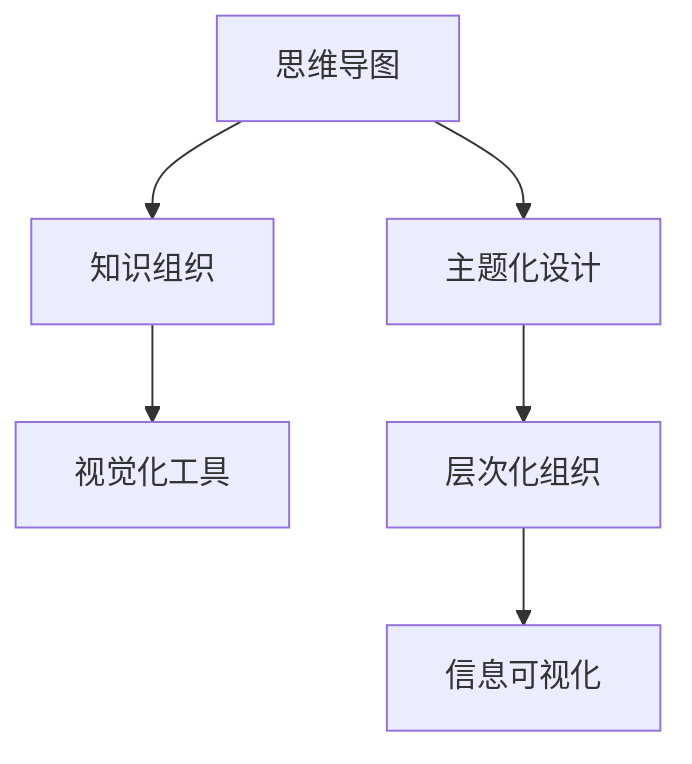

##### 1.3.1 核心概念与联系

思维导图作为一种知识组织工具，其核心概念包括“知识组织”、“视觉化工具”和“信息可视化”。这些概念相互联系，共同构成了思维导图的基础。

- **知识组织**：思维导图通过分支结构和节点来组织信息，使得复杂的信息变得有条理和易于理解。
- **视觉化工具**：思维导图利用颜色、图像和符号等视觉元素，将抽象的信息转化为具体的图像，从而提高信息的可理解性和记忆性。
- **信息可视化**：思维导图将信息以视觉化的方式呈现，使得信息之间的关联和关系更加直观，有助于发现新的思路和解决方案。

通过上述核心概念的联系，我们可以看到思维导图是如何将知识组织、视觉化和信息可视化相结合，从而成为一种强大的知识管理和个人发展工具。

#### 第2章：思维导图的应用场景

##### 2.1 教育与学习中的应用

在教育与学习中，思维导图是一种非常有效的工具。它可以帮助学生更好地理解和记忆复杂的概念和知识点。

- **概念图和知识结构图**：学生可以使用思维导图来构建概念图和知识结构图，从而加深对学科知识的理解。
- **预习和复习**：通过绘制思维导图，学生可以在预习和复习时更清晰地把握学习重点和难点。
- **课堂笔记**：教师可以使用思维导图来整理和展示课堂内容，使学生能够更加系统地掌握知识点。

##### 2.2 工作与团队协作中的应用

思维导图在工作与团队协作中同样具有重要作用。它可以帮助团队更高效地规划和执行任务，提高工作效率。

- **项目规划**：在项目规划阶段，团队可以通过思维导图来梳理项目目标、任务和进度，确保项目顺利进行。
- **团队协作**：思维导图可以用于团队会议和讨论，帮助团队成员清晰地表达观点和思路，促进沟通和协作。
- **决策分析**：在决策过程中，思维导图可以帮助团队分析各种决策因素，评估风险和收益，从而做出更明智的决策。

##### 2.3 创意与设计中的应用

在创意与设计领域，思维导图是一种强大的工具，可以帮助创造者更好地激发创意和进行设计。

- **创意思维**：通过绘制思维导图，创造者可以自由地发散思维，探索各种可能的创意和想法。
- **产品设计**：在产品设计过程中，思维导图可以帮助设计师梳理产品需求、功能和技术，确保产品设计合理和可行。
- **市场分析**：通过绘制思维导图，市场分析师可以分析市场趋势、竞争环境和用户需求，为市场战略提供数据支持。

#### 第3章：构建思维导图的基本方法

##### 3.1 思维导图的绘制步骤

构建思维导图需要遵循一定的步骤，以确保思维导图的完整性和有效性。

1. **确定主题**：选择一个明确的主题，作为思维导图的中心。
2. **绘制中心主题**：在纸上或使用软件绘制中心主题，通常使用大号字体和鲜艳的颜色。
3. **发散思维**：围绕中心主题，列出与主题相关的各种想法和信息。
4. **组织分支**：将发散出来的想法和信息按照逻辑关系和组织结构进行分类，形成分支结构。
5. **添加节点**：在每个分支上添加具体的信息和想法，形成节点。
6. **优化布局**：根据需要调整节点的位置和连接关系，使思维导图更加清晰和美观。

##### 3.2 思维导图的基本元素

思维导图的基本元素包括：

- **中心主题**：思维导图的中心，代表核心概念或问题。
- **分支**：从中心主题辐射出的线条，代表主要分支或次要分支。
- **节点**：分支上的点，代表具体的信息或想法。
- **连线**：节点之间的线条，表示节点之间的关联或关系。

##### 3.3 思维导图的优化技巧

为了使思维导图更加有效和易于理解，可以采用以下优化技巧：

- **使用颜色**：使用不同的颜色来区分不同类型的信息或分支，使思维导图更加生动和易于理解。
- **添加图像和符号**：在节点和分支上添加相关的图像和符号，以增强信息的记忆性和可理解性。
- **简化结构**：尽量保持思维导图的简洁性，避免过多的细节和冗余信息，使思维导图更加清晰和易于阅读。

#### 第4章：思维导图的专业技巧

##### 4.1 思维导图的主题化设计

主题化设计是思维导图进阶技巧之一，通过将思维导图与特定主题相结合，可以更好地表达思维过程和内容。

- **选择合适的主题颜色**：根据主题的特点和风格，选择合适的颜色，使思维导图更加生动和吸引人。
- **统一主题风格**：在思维导图中使用统一的设计风格，如字体、背景等，以增强整体的美感和一致性。
- **添加主题相关的图像和符号**：在思维导图中添加与主题相关的图像和符号，以增强主题的表达力和吸引力。

##### 4.2 思维导图的层次化组织

层次化组织是思维导图的重要技巧之一，通过将信息按照层次结构进行组织，可以更好地展示思维过程和内容。

- **确定主次关系**：在绘制思维导图时，明确主次关系，使思维导图更加清晰和有条理。
- **使用不同的字号和字体**：通过使用不同的字号和字体，区分不同层次的信息，使思维导图更加易于理解。
- **使用缩进和层次线**：使用缩进和层次线来表示不同层次的信息，使思维导图的层次结构更加直观。

##### 4.3 思维导图的信息可视化

信息可视化是思维导图的核心价值之一，通过将信息以视觉化的方式呈现，可以更好地展示思维过程和内容。

- **使用颜色和图像**：使用颜色和图像来区分不同类型的信息，使思维导图更加生动和易于理解。
- **使用图标和符号**：使用图标和符号来表示特定的信息或概念，使思维导图更加直观和易于理解。
- **优化布局**：通过调整节点的位置和连接关系，使思维导图更加清晰和美观。

### 第二部分：思维导图在项目管理中的应用

#### 第5章：思维导图在项目管理中的应用

思维导图在项目管理中具有广泛的应用，可以帮助项目经理更好地规划、监控和执行项目。以下将详细介绍思维导图在项目管理中的应用。

##### 5.1 项目规划与监控

在项目规划阶段，思维导图可以帮助项目经理清晰地梳理项目目标、任务和资源。通过绘制思维导图，项目经理可以明确项目的主要分支，包括项目范围、时间线、资源需求等。

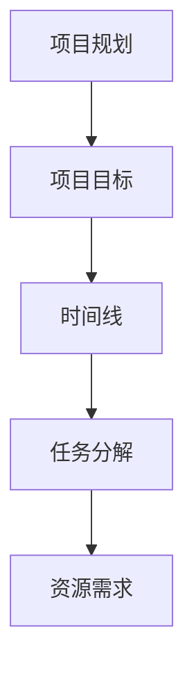

在项目监控阶段，思维导图可以用于跟踪项目的进展情况。项目经理可以定期更新思维导图，添加或删除任务，记录项目的实际进展，以便及时发现和解决问题。

##### 5.2 风险管理与决策分析

思维导图在风险管理中同样具有重要作用。项目经理可以使用思维导图来识别、分析和应对项目风险。通过绘制风险思维导图，项目经理可以清晰地展示潜在风险、风险的影响程度和应对措施。

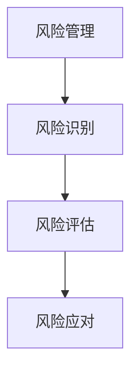

在决策分析过程中，思维导图可以帮助项目经理评估不同决策方案的风险和收益。通过比较不同方案的思维导图，项目经理可以更全面地分析各种因素，做出更明智的决策。

##### 5.3 团队协作与沟通

思维导图在团队协作和沟通中发挥着关键作用。通过绘制思维导图，项目经理可以清晰地传达项目目标和任务要求，团队成员可以更好地理解项目目标和职责。

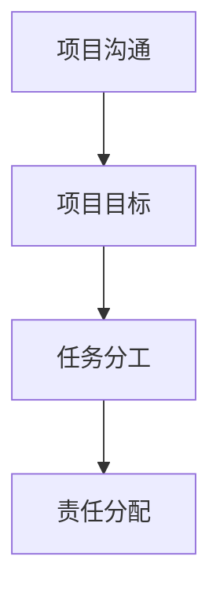

在团队会议中，思维导图可以作为讨论和决策的视觉化工具，帮助团队成员更好地理解和接受项目要求，提高团队协作效率。

### 第三部分：思维导图在教育培训中的应用

#### 第6章：思维导图在教育培训中的应用

思维导图在教育培训中具有广泛的应用，可以帮助教师更有效地组织教学内容，评估学习效果，并促进教学互动和反馈。

##### 6.1 教学内容组织

在教学内容组织中，思维导图是一种强大的工具。教师可以使用思维导图来梳理课程结构，将知识点以分支形式呈现，形成系统的教学框架。

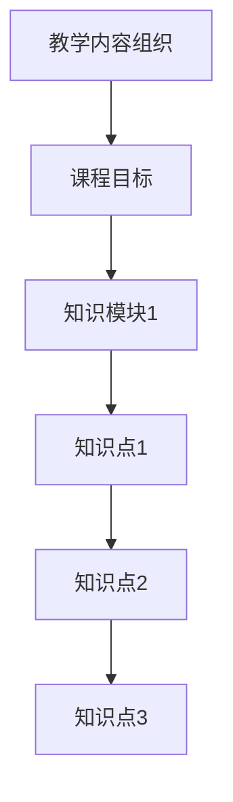

通过这种方式，教师可以清晰地展示课程内容，使学生更容易理解和记忆。此外，思维导图还可以帮助教师发现教学中的遗漏和不足，及时进行调整和补充。

##### 6.2 学习效果评估

在评估学习效果时，思维导图可以用于分析学生的掌握情况。教师可以根据学生的学习进度，绘制学习效果思维导图，展示学生已经掌握的知识点和尚未理解的部分。

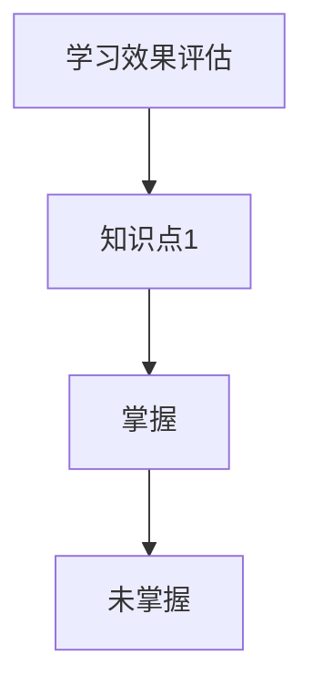

通过这种方式，教师可以了解学生的学习情况，有针对性地进行辅导和指导。此外，思维导图还可以用于记录学生的进步，鼓励学生持续学习和进步。

##### 6.3 教学互动与反馈

思维导图在促进教学互动和反馈中发挥着重要作用。教师可以使用思维导图来设计课堂活动，引导学生参与讨论和思考。例如，在小组讨论环节，教师可以绘制思维导图，展示讨论主题和相关知识点，引导学生深入思考和交流。

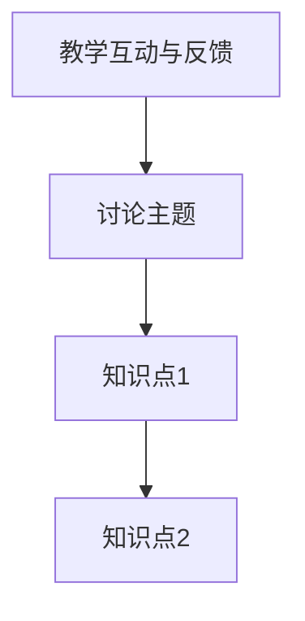

在课后反馈环节，教师可以让学生根据思维导图回顾课堂内容，总结学习收获和不足，并提出改进建议。通过这种方式，教师可以更好地了解学生的学习需求，提高教学效果。

### 第三部分：思维导图的高级应用

#### 第7章：思维导图在创新与创意中的应用

思维导图在创新与创意领域中具有广泛的应用，可以帮助激发创新思维、优化产品设计和进行市场分析。

##### 7.1 创新思维的激发

创新思维是推动企业发展的重要驱动力。思维导图可以帮助团队自由地发散思维，捕捉各种创新想法。

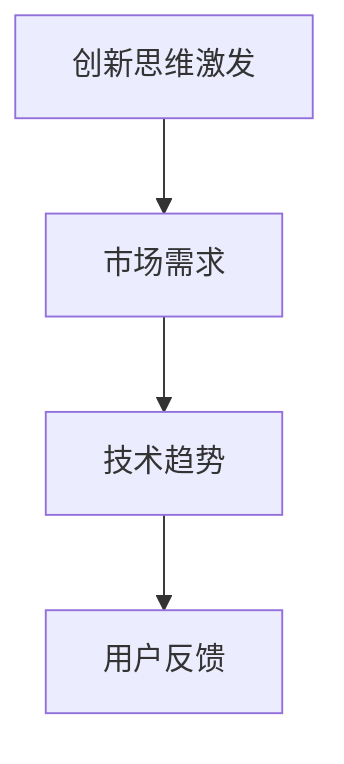

通过绘制思维导图，团队可以从多个角度思考问题，发现潜在的解决方案。思维导图的分支结构有助于团队梳理和创新想法，从而提高创新效率。

##### 7.2 产品设计与优化

在产品设计与优化过程中，思维导图是一种有效的工具。设计师可以使用思维导图来梳理产品功能、用户需求和设计理念。

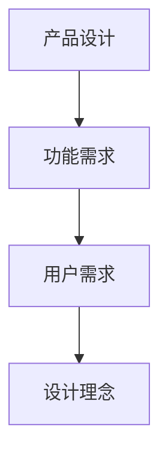

通过这种方式，设计师可以全面了解产品的需求和目标，优化产品设计，提高用户体验。此外，思维导图还可以用于记录设计过程中的关键节点和反馈，帮助团队不断改进产品。

##### 7.3 市场分析与战略规划

在市场分析和战略规划中，思维导图可以帮助企业梳理市场趋势、竞争环境和用户需求。

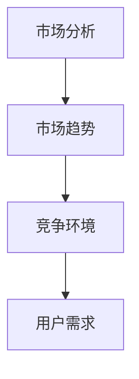

通过绘制思维导图，企业可以更清晰地了解市场状况，制定有效的战略规划。此外，思维导图还可以用于记录市场分析和战略规划的过程，帮助团队及时调整和优化战略。

### 第四部分：思维导图在领导力与个人发展中的应用

#### 第8章：思维导图在领导力与个人发展中的应用

思维导图在领导力与个人发展领域具有重要作用，可以帮助提升领导力、制定个人成长规划并实现高效时间管理。

##### 8.1 领导力提升

在领导力提升过程中，思维导图可以帮助领导者更好地理解和应用各种领导力理论和方法。

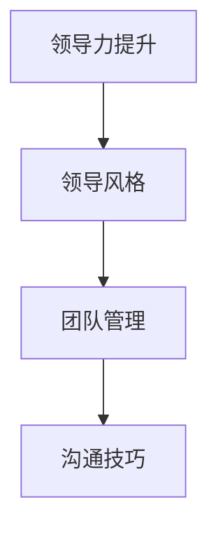

通过绘制思维导图，领导者可以梳理自己的领导风格，了解团队的需求和特点，优化沟通技巧，从而提升领导力。

##### 8.2 个人成长规划

在个人成长规划中，思维导图可以帮助个人明确自己的目标和计划，制定可行的成长路径。

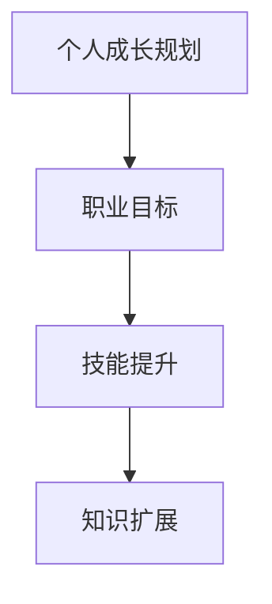

通过这种方式，个人可以更好地规划自己的成长路径，设定阶段性目标，并采取有效的行动实现个人成长。

##### 8.3 高效时间管理

在时间管理中，思维导图可以帮助个人明确时间管理目标，制定合理的时间计划。

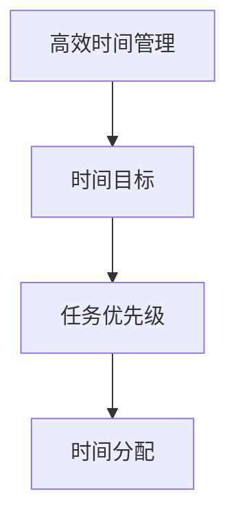

通过这种方式，个人可以更有效地利用时间，提高工作效率，实现工作与生活的平衡。

### 第五部分：思维导图的实践案例解析

#### 第9章：思维导图的实践案例解析

在本章节中，我们将通过实际案例，深入解析思维导图在不同领域的应用，展示如何通过思维导图解决实际问题，提高工作效率。

##### 9.1 教育案例解析

**案例背景**：某中学教师希望提高学生对化学知识的掌握程度，希望通过思维导图进行教学设计。

**案例步骤**：

1. **确定主题**：教师选择“化学反应”作为主题。
2. **绘制中心主题**：使用大号字体和鲜艳颜色绘制“化学反应”。
3. **发散思维**：围绕“化学反应”列出相关知识点，如反应类型、反应条件、反应方程式等。
4. **组织分支**：将知识点按照逻辑关系进行分类，形成分支结构。
5. **添加节点**：在每个分支上添加具体的知识点和例子。
6. **优化布局**：调整节点的位置和连接关系，使思维导图更加清晰和美观。

**效果评估**：通过思维导图教学，学生能够更清晰地理解化学反应的知识体系，提高了学习效果。

##### 9.2 企业案例解析

**案例背景**：某科技公司希望通过思维导图优化项目管理和团队协作。

**案例步骤**：

1. **项目规划**：使用思维导图梳理项目目标、任务和资源。
2. **团队协作**：在团队会议中使用思维导图讨论项目进度和问题。
3. **风险监控**：使用思维导图记录项目风险和应对措施。
4. **决策分析**：使用思维导图分析不同决策方案的风险和收益。

**效果评估**：通过思维导图的应用，项目管理和团队协作效率显著提高，项目顺利完成。

##### 9.3 创意案例解析

**案例背景**：某设计师希望通过思维导图优化产品设计和市场分析。

**案例步骤**：

1. **创意思维**：使用思维导图发散思维，捕捉各种创意想法。
2. **产品设计**：使用思维导图梳理产品功能和用户需求。
3. **市场分析**：使用思维导图分析市场趋势和竞争环境。

**效果评估**：通过思维导图的应用，设计师能够更全面地了解产品设计和市场情况，提高了产品创新能力和市场竞争力。

### 最佳实践 tips

在本章节中，我们总结了思维导图应用的几点最佳实践，以帮助读者更好地应用思维导图：

1. **明确主题**：在应用思维导图时，首先要明确主题，确保思维导图的针对性。
2. **发散思维**：围绕主题进行发散思维，列出各种相关想法和信息。
3. **结构清晰**：确保思维导图的结构清晰，有助于信息的组织和理解。
4. **使用颜色和图像**：使用颜色和图像来增强思维导图的视觉效果，提高信息的记忆性。
5. **定期更新**：思维导图不是一次性的工作，需要定期更新和优化，以保持其有效性。

### 小结

思维导图作为一种知识组织的视觉化工具，具有广泛的应用领域和强大的功能。通过本章的实践案例解析，我们展示了如何在不同场景下应用思维导图，提高工作效率和创新能力。思维导图不仅可以帮助个人和组织更好地理解和掌握知识，还可以促进团队协作和决策分析。希望读者能够通过本文，掌握思维导图的基本原理和应用技巧，将其应用到实际工作和生活中。

### 注意事项

在应用思维导图时，需要注意以下几点：

1. **简洁性**：思维导图应该简洁明了，避免过多细节和冗余信息。
2. **一致性**：在绘制思维导图时，要保持一致的设计风格，如字体、颜色等。
3. **定期更新**：思维导图需要定期更新和优化，以反映最新的信息。

### 拓展阅读

1. 东尼·博赞《思维导图》：东尼·博赞本人关于思维导图的理论和实践。
2. 《高效能人士的七个习惯》：史蒂芬·柯维的经典著作，包括如何有效管理时间和任务。
3. 《设计思维》：大卫·凯利等人提出的创新设计方法论。

通过以上拓展阅读，读者可以进一步深入了解思维导图和相关领域的知识。

---

### 附录：思维导图资源与工具

#### 附录A：思维导图软件介绍

在本文的附录部分，我们将介绍几种流行的思维导图软件，包括MindManager、XMind和iMindMap。

##### 10.1 MindManager

MindManager是一款功能强大的思维导图软件，广泛应用于个人和团队的工作和学习中。以下是MindManager的主要特点：

- **直观的用户界面**：MindManager拥有简洁直观的用户界面，使得用户能够快速上手。
- **丰富的模板**：提供了多种模板，方便用户根据不同需求快速构建思维导图。
- **协作功能**：支持多人协作，使得团队可以共同编辑和分享思维导图。
- **跨平台使用**：支持Windows、Mac和移动设备，方便用户随时随地进行编辑和查看。

##### 10.2 XMind

XMind是一款免费且开源的思维导图软件，适合个人和团队使用。以下是XMind的主要特点：

- **简单易用**：XMind的操作非常简单，用户可以通过拖拽和连接线快速构建思维导图。
- **丰富的主题和样式**：XMind提供了多种主题和样式，用户可以根据自己的喜好和需求进行选择。
- **云端同步**：支持云端同步，用户可以在不同设备之间轻松共享和更新思维导图。
- **扩展性**：XMind支持插件和自定义功能，用户可以根据自己的需求进行扩展和定制。

##### 10.3 iMindMap

iMindMap是一款专业的思维导图软件，以其独特的“思维地图”功能而闻名。以下是iMindMap的主要特点：

- **独特的思维地图**：iMindMap的“思维地图”功能将思维导图与地理信息相结合，提供了全新的视觉体验。
- **强大的数据分析功能**：iMindMap支持数据分析和可视化，可以帮助用户更好地理解和利用数据。
- **丰富的模板和样式**：提供了多种模板和样式，用户可以根据需求自定义思维导图。
- **集成学习工具**：iMindMap集成了学习工具，适合用于教育和培训领域。

#### 附录B：思维导图资源推荐

在本文的附录部分，我们还将推荐一些有用的思维导图资源，包括教程、案例库和社区交流平台。

##### 11.1 思维导图教程

- **东尼·博赞官方网站**：东尼·博赞官方网站提供了大量的思维导图教程和资源，包括基础知识和高级技巧。
- **MindManager教程**：MindManager官方网站提供了详细的教程和视频，帮助用户快速掌握软件的使用方法。
- **XMind教程**：XMind官方网站提供了全面的教程和指南，用户可以通过这些资源了解如何有效地使用XMind。

##### 11.2 思维导图案例库

- **思维导图案例库**：各种领域和场景的思维导图案例，用户可以从中学习到不同的构建方法和技巧。
- **iMindMap案例库**：iMindMap官方网站提供了丰富的案例库，展示了如何利用iMindMap进行项目规划、创意思维和知识管理。

##### 11.3 思维导图社区交流平台

- **思维导图论坛**：各种思维导图软件的用户可以在论坛上交流心得和经验，分享最佳实践。
- **社交媒体群组**：在社交媒体平台上，如Facebook和LinkedIn，有许多思维导图相关的群组和讨论组，用户可以在这里找到志同道合的朋友。

通过以上推荐的资源，用户可以进一步学习思维导图的相关知识，提升自己的技能水平，并在实践中更好地应用思维导图。

### 核心概念与联系

在本章中，我们深入探讨了思维导图的概念、应用场景、构建方法和专业技巧。核心概念包括“知识组织”、“视觉化工具”和“信息可视化”，这些概念相互联系，共同构成了思维导图的基础。通过Mermaid流程图，我们展示了这些核心概念之间的关系，以及它们在思维导图中的应用。


### 核心算法原理讲解

思维导图的构建算法可以分为以下几个步骤：

1. **初始化**：创建一个空的数据结构，用于存储思维导图的节点和连接关系。
2. **输入主题**：将主题作为中心节点添加到数据结构中。
3. **输入子节点**：根据用户输入的子节点，将它们添加到中心节点的子节点列表中。
4. **递归构建**：对于每个子节点，递归地执行步骤3，直到所有节点都被添加到数据结构中。
5. **输出思维导图**：将构建好的思维导图数据结构输出，以便用户查看或导出。

以下是构建思维导图的伪代码：

```python
function 构建思维导图(主题，子节点列表)：
    创建思维导图对象
    设置主题为输入的主题
    对于每个子节点列表中的节点：
        添加子节点到思维导图对象
    返回思维导图对象
end function
```

### 数学模型和数学公式

在思维导图中，节点之间的关系可以用图论中的邻接矩阵表示。假设节点数量为N，邻接矩阵A是一个N×N的矩阵，其中：

$$
A_{ij} = \begin{cases}
1, & \text{如果节点 } i \text{ 和节点 } j \text{ 直接相连} \\
0, & \text{否则}
\end{cases}
$$

### 项目实战

#### 环境搭建

首先，您需要安装以下软件和工具：

1. **MindManager** 或 **XMind**：用于绘制思维导图。
2. **Python**：用于编写脚本自动化思维导图的构建和优化。

#### 源代码详细实现和代码解读

以下是一个简单的Python脚本，用于生成一个基本的思维导图：

```python
from mindmup import MindMup

# 创建一个思维导图对象
mindmap = MindMup()

# 设置思维导图的标题
mindmap.set_title("我的第一个思维导图")

# 添加根节点
root = mindmap.add_node("根节点", type="root")

# 添加子节点
for i in range(1, 5):
    child = mindmap.add_node(f"子节点{i}", parent=root)
    # 子节点可以有子节点
    for j in range(1, 3):
        mindmap.add_node(f"子节点{i}的子节点{j}", parent=child)

# 保存思维导图
mindmap.save("my_mindmap.mm")

print("思维导图生成完成！")
```

#### 代码解读与分析

- `MindMup()`：创建一个思维导图对象。
- `set_title()`：设置思维导图的标题。
- `add_node()`：添加一个节点，参数包括节点的文本内容、类型（如根节点、普通节点等）、父节点（如果有的话）。
- `save()`：保存思维导图。

通过这个简单的案例，我们可以看到如何使用Python脚本生成一个基本的思维导图。在更复杂的场景中，可以扩展这个脚本，添加更多的功能，例如节点的样式定制、层次结构优化、自动布局等。

### 项目实战小结

在本章的项目实战中，我们通过简单的Python脚本展示了如何生成一个基本的思维导图。通过这一步骤，我们了解了思维导图的基础构建方法和相关代码的实现。在实际应用中，我们可以根据具体需求，进一步扩展脚本功能，实现更加复杂和灵活的思维导图。这一实战案例不仅有助于理解思维导图的构建过程，也为后续的高级应用打下了基础。通过不断实践和探索，我们可以更好地利用思维导图这一强大的工具，提升个人和团队的工作效率。

### 最佳实践 Tips

1. **明确主题**：在绘制思维导图时，首先要明确主题，确保思维导图的针对性。
2. **结构清晰**：保持思维导图的简洁性，避免过多的细节和冗余信息。
3. **颜色和图像**：使用颜色和图像来增强思维导图的视觉效果，提高信息的记忆性。
4. **定期更新**：思维导图不是一次性的工作，需要定期更新和优化，以保持其有效性。

### 小结

本文通过深入探讨思维导图的概念、应用场景、构建方法以及高级技巧，展示了如何利用这一视觉化工具提升个人和团队的工作效率。从教育、项目管理和创意设计等不同领域，我们看到了思维导图的广泛应用和强大功能。同时，通过实际案例的解析，我们了解了如何通过思维导图解决实际问题，提高工作效率和创新能力。

### 注意事项

1. **简洁性**：保持思维导图的简洁性，避免过多的细节和冗余信息。
2. **一致性**：在绘制思维导图时，保持一致的设计风格，如字体、颜色等。
3. **定期更新**：思维导图需要定期更新和优化，以反映最新的信息。

### 拓展阅读

1. 东尼·博赞《思维导图》：深入探讨思维导图的理论和实践。
2. 《高效能人士的七个习惯》：史蒂芬·柯维的经典著作，包括如何有效管理时间和任务。
3. 《设计思维》：大卫·凯利等人提出的创新设计方法论。

通过以上拓展阅读，读者可以进一步深入了解思维导图和相关领域的知识。希望本文能够帮助您更好地掌握思维导图这一强大的工具，并在实际工作和生活中发挥其重要作用。

