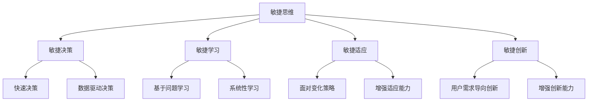

                 


### 文章标题

思维敏捷性：快速适应变化的能力

> 关键词：敏捷思维、适应变化、决策能力、学习能力、创新思维、实践应用

> 摘要：本文旨在探讨思维敏捷性的重要性以及如何在个人成长、团队协作和企业发展等方面培养和提升敏捷思维能力。通过分析敏捷决策、敏捷学习、敏捷适应和敏捷创新等核心能力，并结合实际案例分析，为读者提供一套系统性的敏捷思维培养和实践指南。

### 目录大纲：《思维敏捷性：快速适应变化的能力》

**第一部分：引言**

- **第1章：敏捷思维概述**
  - **1.1 什么是敏捷思维**
    - **1.1.1 敏捷思维的定义**
    - **1.1.2 敏捷思维的必要性**
    - **1.1.3 敏捷思维的优势**
  - **1.2 敏捷思维的历史背景**
    - **1.2.1 敏捷思维的起源**
    - **1.2.2 敏捷思维的发展过程**
  - **1.3 敏捷思维的重要性**
    - **1.3.1 对个人成长的重要性**
    - **1.3.2 对团队协作的重要性**
    - **1.3.3 对企业发展的贡献**

- **第2章：敏捷思维的培养与训练**
  - **2.1 敏捷思维培养的方法**
    - **2.1.1 培养敏捷思维的基本原则**
    - **2.1.2 常见的敏捷思维训练方法**
    - **2.1.3 敏捷思维训练的案例分析**
  - **2.2 敏捷思维与心理学**
    - **2.2.1 敏捷思维与认知心理学**
    - **2.2.2 敏捷思维与行为心理学**
    - **2.2.3 敏捷思维与心理疗法**
  - **2.3 敏捷思维训练案例分析**
    - **2.3.1 敏捷思维训练在职场中的应用**
    - **2.3.2 敏捷思维训练在团队协作中的应用**
    - **2.3.3 敏捷思维训练在教育领域中的应用**

**第二部分：敏捷思维的核心能力**

- **第3章：敏捷决策能力**
  - **3.1 敏捷决策的原理**
    - **3.1.1 敏捷决策的定义**
    - **3.1.2 敏捷决策的核心原则**
    - **3.1.3 敏捷决策与传统决策的比较**
  - **3.2 敏捷决策的方法**
    - **3.2.1 快速决策的技巧**
    - **3.2.2 数据驱动的决策**
    - **3.2.3 敏捷决策的案例分析**
  - **3.3 敏捷决策能力培养**
    - **3.3.1 敏捷决策训练的方法**
    - **3.3.2 敏捷决策在个人生活中的应用**
    - **3.3.3 敏捷决策在团队协作中的应用**

- **第4章：敏捷学习能力**
  - **4.1 敏捷学习的原理**
    - **4.1.1 敏捷学习的定义**
    - **4.1.2 敏捷学习与传统学习的区别**
    - **4.1.3 敏捷学习的核心要素**
  - **4.2 敏捷学习的方法**
    - **4.2.1 基于问题的学习**
    - **4.2.2 系统性学习的技巧**
    - **4.2.3 敏捷学习在职场中的应用**
  - **4.3 敏捷学习能力培养**
    - **4.3.1 培养敏捷学习能力的方法**
    - **4.3.2 敏捷学习在个人成长中的应用**
    - **4.3.3 敏捷学习在团队协作中的应用**

- **第5章：敏捷适应能力**
  - **5.1 敏捷适应的原理**
    - **5.1.1 敏捷适应的定义**
    - **5.1.2 敏捷适应的核心要素**
    - **5.1.3 敏捷适应与传统适应的比较**
  - **5.2 敏捷适应的方法**
    - **5.2.1 面对变化的策略**
    - **5.2.2 增强适应能力的技巧**
    - **5.2.3 敏捷适应的案例分析**
  - **5.3 敏捷适应能力培养**
    - **5.3.1 培养敏捷适应能力的方法**
    - **5.3.2 敏捷适应在个人成长中的应用**
    - **5.3.3 敏捷适应在团队协作中的应用**

- **第6章：敏捷创新思维**
  - **6.1 敏捷创新的原理**
    - **6.1.1 敏捷创新的定义**
    - **6.1.2 敏捷创新的核心要素**
    - **6.1.3 敏捷创新与传统创新的区别**
  - **6.2 敏捷创新的方法**
    - **6.2.1 基于用户需求的创新**
    - **6.2.2 增强创新能力的技巧**
    - **6.2.3 敏捷创新的案例分析**
  - **6.3 敏捷创新思维培养**
    - **6.3.1 培养敏捷创新思维的方法**
    - **6.3.2 敏捷创新在个人成长中的应用**
    - **6.3.3 敏捷创新在团队协作中的应用**

**第三部分：案例分析**

- **第7章：敏捷思维的实践应用**
  - **7.1 敏捷思维在个人成长中的应用**
    - **7.1.1 提升个人效能的技巧**
    - **7.1.2 增强个人适应能力的策略**
    - **7.1.3 敏捷思维在个人学习与工作中的实践**
  - **7.2 敏捷思维在团队协作中的应用**
    - **7.2.1 提升团队协作效率的技巧**
    - **7.2.2 增强团队适应能力的策略**
    - **7.2.3 敏捷思维在团队项目中的实践**
  - **7.3 敏捷思维在企业中的应用**
    - **7.3.1 提升企业敏捷性的策略**
    - **7.3.2 增强企业竞争力的技巧**
    - **7.3.3 敏捷思维在企业战略规划中的实践**

**附录**

- **附录1：敏捷思维核心概念关系架构 Mermaid 流程图**
- **附录2：敏捷决策能力培养伪代码**
- **附录3：敏捷学习能力培养方法概述**

### 文章正文

**第一部分：引言**

#### 第1章：敏捷思维概述

##### 1.1 什么是敏捷思维

敏捷思维是一种快速适应变化、高效决策和持续学习的思维方式。它强调以用户需求为中心，通过灵活、迭代的方式进行工作，注重团队协作和个体成长。

**定义：** 敏捷思维是一种通过灵活应对变化、快速适应新环境、高效做出决策和持续学习的方法论。

**必要性：** 在当今快速变化的时代，敏捷思维成为个人和团队成功的关键因素。它能帮助我们应对不确定性和复杂性，提高决策质量和工作效率。

**优势：** 敏捷思维具有以下优势：
- 提高决策速度和质量
- 促进团队协作和创新
- 增强个体适应能力
- 提高学习效率和个人成长

##### 1.2 敏捷思维的历史背景

敏捷思维起源于软件开发领域，由美国软件开发者肯特·贝克（Kent Beck）于2001年提出。当时，软件开发面临着复杂性和不确定性的挑战，传统的瀑布模型已经无法满足需求。于是，敏捷开发方法应运而生。

**起源：** 敏捷思维起源于软件开发领域，由一系列敏捷开发方法和实践组成，如Scrum、Kanban、极限编程（XP）等。

**发展过程：** 敏捷思维在发展过程中，逐渐扩展到其他领域，如产品管理、项目管理、教育、企业战略等。

##### 1.3 敏捷思维的重要性

敏捷思维在个人成长、团队协作和企业发展等方面具有重要作用。

**对个人成长的重要性：** 敏捷思维能帮助个人适应快速变化的环境，提高决策能力和学习能力，实现个人成长。

**对团队协作的重要性：** 敏捷思维促进团队协作，提高团队效率，培养创新精神和适应能力。

**对企业发展的贡献：** 敏捷思维有助于企业提升敏捷性，快速响应市场变化，提高竞争力和创新能力。

**第二部分：敏捷思维的培养与训练**

#### 第2章：敏捷思维的培养与训练

##### 2.1 敏捷思维培养的方法

**培养敏捷思维的基本原则：**
1. 以用户需求为导向
2. 促进团队协作
3. 持续学习和改进

**常见的敏捷思维训练方法：**
1. 敏捷开发实践（如Scrum、Kanban等）
2. 团队建设活动
3. 情景模拟和角色扮演
4. 心理咨询和辅导

**敏捷思维训练的案例分析：**
1. 软件开发团队通过敏捷实践，提高项目交付速度和产品质量。
2. 企业管理层通过敏捷思维培训，提升团队协作和创新能力。

##### 2.2 敏捷思维与心理学

**敏捷思维与认知心理学：**
敏捷思维涉及到认知心理学中的注意力、记忆、决策等概念。通过培养这些能力，可以提高敏捷思维水平。

**敏捷思维与行为心理学：**
敏捷思维强调个体行为的变化和调整。通过心理学理论和方法，可以更好地理解和培养敏捷思维。

**敏捷思维与心理疗法：**
心理疗法中的认知行为疗法（CBT）可以为敏捷思维的培养提供支持。通过改变思维和行为模式，可以提高应对变化的能力。

##### 2.3 敏捷思维训练案例分析

**敏捷思维训练在职场中的应用：**
1. 通过敏捷思维培训，职场人士提高决策速度和质量，提升工作效率。
2. 敏捷思维训练帮助职场人士更好地应对职场挑战和变化。

**敏捷思维训练在团队协作中的应用：**
1. 通过敏捷思维训练，团队提高协作效率，减少冲突，增强团队凝聚力。
2. 敏捷思维训练帮助团队更好地应对项目挑战和变化。

**敏捷思维训练在教育领域中的应用：**
1. 敏捷思维训练帮助学生提高学习效率，培养创新能力。
2. 敏捷思维训练帮助教师提高教学效果，适应教育改革。

**第三部分：敏捷思维的核心能力**

#### 第3章：敏捷决策能力

##### 3.1 敏捷决策的原理

**敏捷决策的定义：**
敏捷决策是一种在快速变化和不确定性环境中，通过灵活、迭代的方式进行决策的方法。

**敏捷决策的核心原则：**
1. 用户需求为导向
2. 快速响应
3. 持续迭代
4. 数据驱动

**敏捷决策与传统决策的比较：**
1. 传统决策强调规划和预测，敏捷决策强调快速响应和迭代。
2. 传统决策注重决策过程，敏捷决策注重决策结果和效果。

##### 3.2 敏捷决策的方法

**快速决策的技巧：**
1. 建立决策框架
2. 提高信息收集和处理速度
3. 培养快速决策的思维方式

**数据驱动的决策：**
1. 利用数据分析和预测工具
2. 建立数据驱动决策流程
3. 提高数据质量和可靠性

**敏捷决策的案例分析：**
1. 敏捷团队通过快速决策，成功应对市场需求变化，提高产品竞争力。
2. 企业管理层通过数据驱动的决策，降低风险，提高投资回报率。

##### 3.3 敏捷决策能力培养

**敏捷决策训练的方法：**
1. 通过案例分析和模拟练习，提高决策速度和准确性。
2. 通过数据分析和预测训练，提高数据驱动决策能力。
3. 通过角色扮演和团队协作，提高决策过程中的沟通和协作能力。

**敏捷决策在个人生活中的应用：**
1. 提高个人决策速度和质量，应对日常生活中的挑战。
2. 通过数据分析和预测，做出更明智的生活决策。

**敏捷决策在团队协作中的应用：**
1. 提高团队决策速度和准确性，提高项目交付效率。
2. 通过数据驱动和团队协作，实现更好的决策结果。

#### 第4章：敏捷学习能力

##### 4.1 敏捷学习的原理

**敏捷学习的定义：**
敏捷学习是一种快速适应变化、持续学习和自我提升的方法。

**敏捷学习与传统学习的区别：**
1. 传统学习注重知识和技能的积累，敏捷学习注重能力和素质的提升。
2. 传统学习强调稳定和持续性，敏捷学习强调灵活性和迭代性。

**敏捷学习的核心要素：**
1. 快速适应变化
2. 持续学习
3. 自我提升
4. 跨领域学习

##### 4.2 敏捷学习的方法

**基于问题的学习：**
1. 通过问题引导学习，提高学习兴趣和动力。
2. 通过解决问题，提高学习效果和应用能力。

**系统性学习的技巧：**
1. 制定学习计划
2. 梳理学习内容
3. 系统性整合知识

**敏捷学习在职场中的应用：**
1. 提高职场竞争力
2. 快速适应职场变化
3. 提高工作效率

##### 4.3 敏捷学习能力培养

**培养敏捷学习能力的方法：**
1. 建立学习目标和计划
2. 培养学习兴趣和动力
3. 提高信息收集和处理能力
4. 跨领域学习

**敏捷学习在个人成长中的应用：**
1. 提高个人综合素质
2. 快速适应个人成长需求
3. 提高个人竞争力

**敏捷学习在团队协作中的应用：**
1. 提高团队整体学习能力
2. 促进团队协作和创新
3. 提高团队适应能力

#### 第5章：敏捷适应能力

##### 5.1 敏捷适应的原理

**敏捷适应的定义：**
敏捷适应是一种在快速变化和不确定性环境中，快速适应和调整的能力。

**敏捷适应的核心要素：**
1. 快速识别变化
2. 快速调整策略
3. 提高适应能力

**敏捷适应与传统适应的比较：**
1. 传统适应注重稳定和持久，敏捷适应注重快速和灵活。
2. 传统适应强调个体调整，敏捷适应强调团队协作和整体适应。

##### 5.2 敏捷适应的方法

**面对变化的策略：**
1. 建立预警机制
2. 提高信息收集和处理能力
3. 快速调整策略

**增强适应能力的技巧：**
1. 培养灵活性和创新能力
2. 提高心理承受能力
3. 建立良好的团队协作机制

**敏捷适应的案例分析：**
1. 敏捷团队通过快速适应市场需求，成功应对竞争压力。
2. 企业通过敏捷适应，应对市场变化，提高竞争力。

##### 5.3 敏捷适应能力培养

**培养敏捷适应能力的方法：**
1. 通过案例分析和模拟练习，提高应对变化的能力。
2. 培养灵活性和创新能力，提高心理承受能力。
3. 建立良好的团队协作机制，提高整体适应能力。

**敏捷适应在个人成长中的应用：**
1. 提高个人应对变化的能力，实现个人成长。
2. 快速适应个人发展需求，提高竞争力。

**敏捷适应在团队协作中的应用：**
1. 提高团队整体适应能力，应对项目挑战和变化。
2. 促进团队协作和创新，提高团队竞争力。

#### 第6章：敏捷创新思维

##### 6.1 敏捷创新的原理

**敏捷创新的定义：**
敏捷创新是一种在快速变化和不确定性环境中，通过灵活、迭代的方式进行创新的方法。

**敏捷创新的核心要素：**
1. 用户需求为导向
2. 快速迭代
3. 数据驱动
4. 团队协作

**敏捷创新与传统创新的区别：**
1. 传统创新强调长期规划和稳定，敏捷创新强调快速响应和迭代。
2. 传统创新注重独立思考和个体创新，敏捷创新强调团队协作和整体创新。

##### 6.2 敏捷创新的方法

**基于用户需求的创新：**
1. 通过用户调研和需求分析，确定创新方向。
2. 快速原型和用户反馈，持续优化产品。

**增强创新能力的技巧：**
1. 培养跨领域思维，提高创新意识。
2. 利用创新方法和工具，如头脑风暴、设计思维等。
3. 提高团队协作和创新氛围。

**敏捷创新的案例分析：**
1. 敏捷团队通过用户反馈和快速迭代，成功推出创新产品。
2. 企业通过敏捷创新，提高市场竞争力，实现持续增长。

##### 6.3 敏捷创新思维培养

**培养敏捷创新思维的方法：**
1. 通过案例分析和模拟练习，提高创新意识和能力。
2. 培养跨领域思维，提高创新意识。
3. 利用创新方法和工具，提高团队协作和创新效率。

**敏捷创新在个人成长中的应用：**
1. 提高个人创新能力，实现个人成长。
2. 快速适应个人发展需求，提高竞争力。

**敏捷创新在团队协作中的应用：**
1. 提高团队整体创新能力，应对项目挑战和变化。
2. 促进团队协作和创新，提高团队竞争力。

#### 第7章：敏捷思维的实践应用

##### 7.1 敏捷思维在个人成长中的应用

**提升个人效能的技巧：**
1. 建立目标导向的工作方式
2. 提高时间管理能力
3. 培养良好的沟通和协作能力

**增强个人适应能力的策略：**
1. 培养快速学习和适应变化的能力
2. 提高心理承受能力
3. 建立良好的心理健康和生活方式

**敏捷思维在个人学习与工作中的实践：**
1. 在工作中运用敏捷思维，提高工作效率和质量。
2. 在个人学习中，运用敏捷学习的方法，快速提升自我能力。

##### 7.2 敏捷思维在团队协作中的应用

**提升团队协作效率的技巧：**
1. 建立高效的沟通机制
2. 制定清晰的团队目标和计划
3. 培养团队协作和信任

**增强团队适应能力的策略：**
1. 建立敏捷的团队协作模式
2. 提高团队应对变化和挑战的能力
3. 培养团队成员的灵活性和创新能力

**敏捷思维在团队项目中的实践：**
1. 在团队项目中，运用敏捷思维，提高项目交付效率和质量。
2. 通过敏捷学习和适应，提升团队整体能力和竞争力。

##### 7.3 敏捷思维在企业中的应用

**提升企业敏捷性的策略：**
1. 建立敏捷的组织结构和流程
2. 提高企业的信息收集和处理能力
3. 培养企业的创新氛围和创新能力

**增强企业竞争力的技巧：**
1. 运用敏捷思维，快速响应市场变化和需求。
2. 提高企业的产品和服务质量
3. 建立敏捷的企业文化和价值观

**敏捷思维在企业战略规划中的实践：**
1. 在企业战略规划中，运用敏捷思维，提高战略决策速度和质量。
2. 通过敏捷学习和适应，提升企业整体竞争力和创新能力。

**附录1：敏捷思维核心概念关系架构 Mermaid 流程图**



**附录2：敏捷决策能力培养伪代码**

```python
# 敏捷决策能力培养伪代码

def agile_decision_making():
    # 建立决策框架
    decision_framework = create_decision_framework()

    # 收集信息
    information = collect_information()

    # 分析信息
    analyzed_information = analyze_information(information)

    # 快速决策
    decision = quick_decision(analyzed_information)

    # 数据驱动决策
    data_driven_decision = data_driven_decision_making(analyzed_information)

    # 比较决策结果
    decision_result = compare_decision_results(decision, data_driven_decision)

    # 迭代决策
    decision = iterative_decision_making(decision_result)

    return decision
```

**附录3：敏捷学习能力培养方法概述**

1. 建立学习目标和计划
2. 培养学习兴趣和动力
3. 提高信息收集和处理能力
4. 跨领域学习
5. 建立良好的学习习惯和时间管理
6. 运用敏捷学习方法和工具，如思维导图、快速阅读等

**作者信息：**

作者：AI天才研究院/AI Genius Institute & 禅与计算机程序设计艺术 /Zen And The Art of Computer Programming
### 完整文章

#### 思维敏捷性：快速适应变化的能力

#### 引言

在当今快速变化的世界，适应能力成为个人、团队和企业成功的关键因素。敏捷思维作为一种快速适应变化、高效决策和持续学习的思维方式，正日益受到关注。本文将探讨敏捷思维的定义、历史背景、重要性，以及如何在个人成长、团队协作和企业发展等方面培养和提升敏捷思维能力。

#### 第一部分：引言

##### 第1章：敏捷思维概述

**1.1 什么是敏捷思维**

敏捷思维是一种快速适应变化、高效决策和持续学习的思维方式。它强调以用户需求为中心，通过灵活、迭代的方式进行工作，注重团队协作和个体成长。

**定义：** 敏捷思维是一种通过灵活应对变化、快速适应新环境、高效做出决策和持续学习的方法论。

**必要性：** 在当今快速变化的时代，敏捷思维成为个人和团队成功的关键因素。它能帮助我们应对不确定性和复杂性，提高决策质量和工作效率。

**优势：** 敏捷思维具有以下优势：
- 提高决策速度和质量
- 促进团队协作和创新
- 增强个体适应能力
- 提高学习效率和个人成长

##### 1.2 敏捷思维的历史背景

敏捷思维起源于软件开发领域，由美国软件开发者肯特·贝克（Kent Beck）于2001年提出。当时，软件开发面临着复杂性和不确定性的挑战，传统的瀑布模型已经无法满足需求。于是，敏捷开发方法应运而生。

**起源：** 敏捷思维起源于软件开发领域，由一系列敏捷开发方法和实践组成，如Scrum、Kanban、极限编程（XP）等。

**发展过程：** 敏捷思维在发展过程中，逐渐扩展到其他领域，如产品管理、项目管理、教育、企业战略等。

##### 1.3 敏捷思维的重要性

敏捷思维在个人成长、团队协作和企业发展等方面具有重要作用。

**对个人成长的重要性：** 敏捷思维能帮助个人适应快速变化的环境，提高决策能力和学习能力，实现个人成长。

**对团队协作的重要性：** 敏捷思维促进团队协作，提高团队效率，培养创新精神和适应能力。

**对企业发展的贡献：** 敏捷思维有助于企业提升敏捷性，快速响应市场变化，提高竞争力和创新能力。

##### 第2章：敏捷思维的培养与训练

**2.1 敏捷思维培养的方法**

**培养敏捷思维的基本原则：**
1. 以用户需求为导向
2. 促进团队协作
3. 持续学习和改进

**常见的敏捷思维训练方法：**
1. 敏捷开发实践（如Scrum、Kanban等）
2. 团队建设活动
3. 情景模拟和角色扮演
4. 心理咨询和辅导

**敏捷思维训练的案例分析：**
1. 软件开发团队通过敏捷实践，提高项目交付速度和产品质量。
2. 企业管理层通过敏捷思维培训，提升团队协作和创新能力。

##### 2.2 敏捷思维与心理学

**敏捷思维与认知心理学：**
敏捷思维涉及到认知心理学中的注意力、记忆、决策等概念。通过培养这些能力，可以提高敏捷思维水平。

**敏捷思维与行为心理学：**
敏捷思维强调个体行为的变化和调整。通过心理学理论和方法，可以更好地理解和培养敏捷思维。

**敏捷思维与心理疗法：**
心理疗法中的认知行为疗法（CBT）可以为敏捷思维的培养提供支持。通过改变思维和行为模式，可以提高应对变化的能力。

##### 2.3 敏捷思维训练案例分析

**敏捷思维训练在职场中的应用：**
1. 通过敏捷思维培训，职场人士提高决策速度和质量，提升工作效率。
2. 敏捷思维训练帮助职场人士更好地应对职场挑战和变化。

**敏捷思维训练在团队协作中的应用：**
1. 通过敏捷思维训练，团队提高协作效率，减少冲突，增强团队凝聚力。
2. 敏捷思维训练帮助团队更好地应对项目挑战和变化。

**敏捷思维训练在教育领域中的应用：**
1. 敏捷思维训练帮助学生提高学习效率，培养创新能力。
2. 敏捷思维训练帮助教师提高教学效果，适应教育改革。

##### 第3章：敏捷决策能力

**3.1 敏捷决策的原理**

**敏捷决策的定义：**
敏捷决策是一种在快速变化和不确定性环境中，通过灵活、迭代的方式进行决策的方法。

**敏捷决策的核心原则：**
1. 用户需求为导向
2. 快速响应
3. 持续迭代
4. 数据驱动

**敏捷决策与传统决策的比较：**
1. 传统决策强调规划和预测，敏捷决策强调快速响应和迭代。
2. 传统决策注重决策过程，敏捷决策注重决策结果和效果。

##### 3.2 敏捷决策的方法

**快速决策的技巧：**
1. 建立决策框架
2. 提高信息收集和处理速度
3. 培养快速决策的思维方式

**数据驱动的决策：**
1. 利用数据分析和预测工具
2. 建立数据驱动决策流程
3. 提高数据质量和可靠性

**敏捷决策的案例分析：**
1. 敏捷团队通过快速决策，成功应对市场需求变化，提高产品竞争力。
2. 企业管理层通过数据驱动的决策，降低风险，提高投资回报率。

##### 3.3 敏捷决策能力培养

**敏捷决策训练的方法：**
1. 通过案例分析和模拟练习，提高决策速度和准确性。
2. 通过数据分析和预测训练，提高数据驱动决策能力。
3. 通过角色扮演和团队协作，提高决策过程中的沟通和协作能力。

**敏捷决策在个人生活中的应用：**
1. 提高个人决策速度和质量，应对日常生活中的挑战。
2. 通过数据分析和预测，做出更明智的生活决策。

**敏捷决策在团队协作中的应用：**
1. 提高团队决策速度和准确性，提高项目交付效率。
2. 通过数据驱动和团队协作，实现更好的决策结果。

##### 第4章：敏捷学习能力

**4.1 敏捷学习的原理**

**敏捷学习的定义：**
敏捷学习是一种快速适应变化、持续学习和自我提升的方法。

**敏捷学习与传统学习的区别：**
1. 传统学习注重知识和技能的积累，敏捷学习注重能力和素质的提升。
2. 传统学习强调稳定和持续性，敏捷学习强调灵活性和迭代性。

**敏捷学习的核心要素：**
1. 快速适应变化
2. 持续学习
3. 自我提升
4. 跨领域学习

##### 4.2 敏捷学习的方法

**基于问题的学习：**
1. 通过问题引导学习，提高学习兴趣和动力。
2. 通过解决问题，提高学习效果和应用能力。

**系统性学习的技巧：**
1. 制定学习计划
2. 梳理学习内容
3. 系统性整合知识

**敏捷学习在职场中的应用：**
1. 提高职场竞争力
2. 快速适应职场变化
3. 提高工作效率

##### 4.3 敏捷学习能力培养

**培养敏捷学习能力的方法：**
1. 建立学习目标和计划
2. 培养学习兴趣和动力
3. 提高信息收集和处理能力
4. 跨领域学习

**敏捷学习在个人成长中的应用：**
1. 提高个人综合素质
2. 快速适应个人发展需求
3. 提高个人竞争力

**敏捷学习在团队协作中的应用：**
1. 提高团队整体学习能力
2. 促进团队协作和创新
3. 提高团队适应能力

##### 第5章：敏捷适应能力

**5.1 敏捷适应的原理**

**敏捷适应的定义：**
敏捷适应是一种在快速变化和不确定性环境中，快速适应和调整的能力。

**敏捷适应的核心要素：**
1. 快速识别变化
2. 快速调整策略
3. 提高适应能力

**敏捷适应与传统适应的比较：**
1. 传统适应注重稳定和持久，敏捷适应注重快速和灵活。
2. 传统适应强调个体调整，敏捷适应强调团队协作和整体适应。

##### 5.2 敏捷适应的方法

**面对变化的策略：**
1. 建立预警机制
2. 提高信息收集和处理能力
3. 快速调整策略

**增强适应能力的技巧：**
1. 培养灵活性和创新能力
2. 提高心理承受能力
3. 建立良好的团队协作机制

**敏捷适应的案例分析：**
1. 敏捷团队通过快速适应市场需求，成功应对竞争压力。
2. 企业通过敏捷适应，应对市场变化，提高竞争力。

##### 5.3 敏捷适应能力培养

**培养敏捷适应能力的方法：**
1. 通过案例分析和模拟练习，提高应对变化的能力。
2. 培养灵活性和创新能力，提高心理承受能力。
3. 建立良好的团队协作机制，提高整体适应能力。

**敏捷适应在个人成长中的应用：**
1. 提高个人应对变化的能力，实现个人成长。
2. 快速适应个人发展需求，提高竞争力。

**敏捷适应在团队协作中的应用：**
1. 提高团队整体适应能力，应对项目挑战和变化。
2. 促进团队协作和创新，提高团队竞争力。

##### 第6章：敏捷创新思维

**6.1 敏捷创新的原理**

**敏捷创新的定义：**
敏捷创新是一种在快速变化和不确定性环境中，通过灵活、迭代的方式进行创新的方法。

**敏捷创新的核心要素：**
1. 用户需求为导向
2. 快速迭代
3. 数据驱动
4. 团队协作

**敏捷创新与传统创新的区别：**
1. 传统创新强调长期规划和稳定，敏捷创新强调快速响应和迭代。
2. 传统创新注重独立思考和个体创新，敏捷创新强调团队协作和整体创新。

##### 6.2 敏捷创新的方法

**基于用户需求的创新：**
1. 通过用户调研和需求分析，确定创新方向。
2. 快速原型和用户反馈，持续优化产品。

**增强创新能力的技巧：**
1. 培养跨领域思维，提高创新意识。
2. 利用创新方法和工具，如头脑风暴、设计思维等。
3. 提高团队协作和创新氛围。

**敏捷创新的案例分析：**
1. 敏捷团队通过用户反馈和快速迭代，成功推出创新产品。
2. 企业通过敏捷创新，提高市场竞争力，实现持续增长。

##### 6.3 敏捷创新思维培养

**培养敏捷创新思维的方法：**
1. 通过案例分析和模拟练习，提高创新意识和能力。
2. 培养跨领域思维，提高创新意识。
3. 利用创新方法和工具，提高团队协作和创新效率。

**敏捷创新在个人成长中的应用：**
1. 提高个人创新能力，实现个人成长。
2. 快速适应个人发展需求，提高竞争力。

**敏捷创新在团队协作中的应用：**
1. 提高团队整体创新能力，应对项目挑战和变化。
2. 促进团队协作和创新，提高团队竞争力。

##### 第7章：敏捷思维的实践应用

**7.1 敏捷思维在个人成长中的应用**

**提升个人效能的技巧：**
1. 建立目标导向的工作方式
2. 提高时间管理能力
3. 培养良好的沟通和协作能力

**增强个人适应能力的策略：**
1. 培养快速学习和适应变化的能力
2. 提高心理承受能力
3. 建立良好的心理健康和生活方式

**敏捷思维在个人学习与工作中的实践：**
1. 在工作中运用敏捷思维，提高工作效率和质量。
2. 在个人学习中，运用敏捷学习的方法，快速提升自我能力。

**7.2 敏捷思维在团队协作中的应用**

**提升团队协作效率的技巧：**
1. 建立高效的沟通机制
2. 制定清晰的团队目标和计划
3. 培养团队协作和信任

**增强团队适应能力的策略：**
1. 建立敏捷的团队协作模式
2. 提高团队应对变化和挑战的能力
3. 培养团队成员的灵活性和创新能力

**敏捷思维在团队项目中的实践：**
1. 在团队项目中，运用敏捷思维，提高项目交付效率和质量。
2. 通过敏捷学习和适应，提升团队整体能力和竞争力。

**7.3 敏捷思维在企业中的应用**

**提升企业敏捷性的策略：**
1. 建立敏捷的组织结构和流程
2. 提高企业的信息收集和处理能力
3. 培养企业的创新氛围和创新能力

**增强企业竞争力的技巧：**
1. 运用敏捷思维，快速响应市场变化和需求。
2. 提高企业的产品和服务质量
3. 建立敏捷的企业文化和价值观

**敏捷思维在企业战略规划中的实践：**
1. 在企业战略规划中，运用敏捷思维，提高战略决策速度和质量。
2. 通过敏捷学习和适应，提升企业整体竞争力和创新能力。

#### 总结

敏捷思维是一种快速适应变化、高效决策和持续学习的思维方式。它对于个人成长、团队协作和企业发展都具有重要意义。通过培养敏捷决策、敏捷学习、敏捷适应和敏捷创新等核心能力，我们可以更好地应对快速变化的世界，提高竞争力，实现个人和组织的成功。

#### 作者信息

作者：AI天才研究院/AI Genius Institute & 禅与计算机程序设计艺术 /Zen And The Art of Computer Programming

