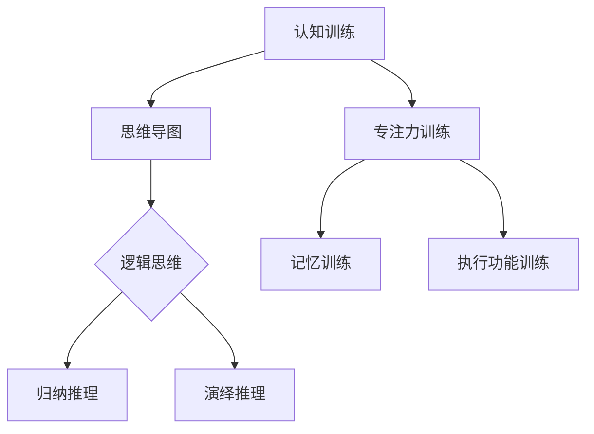
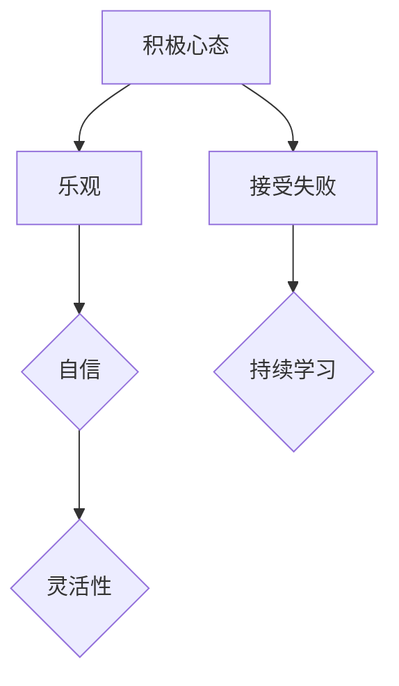
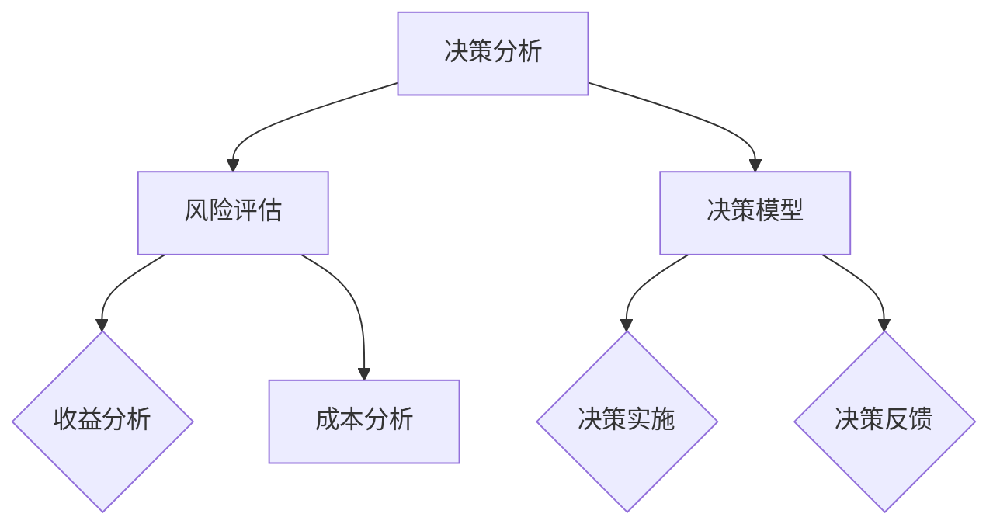
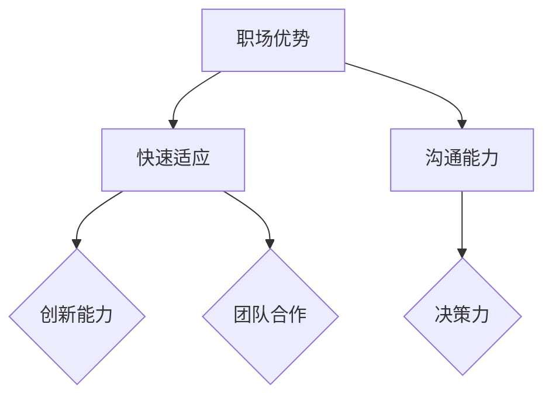
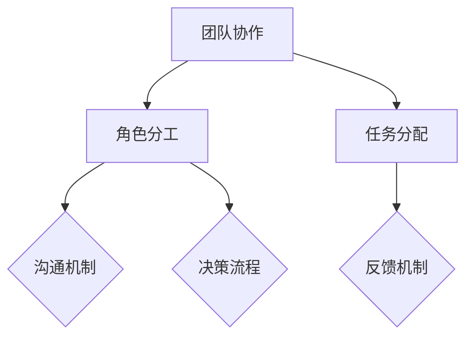
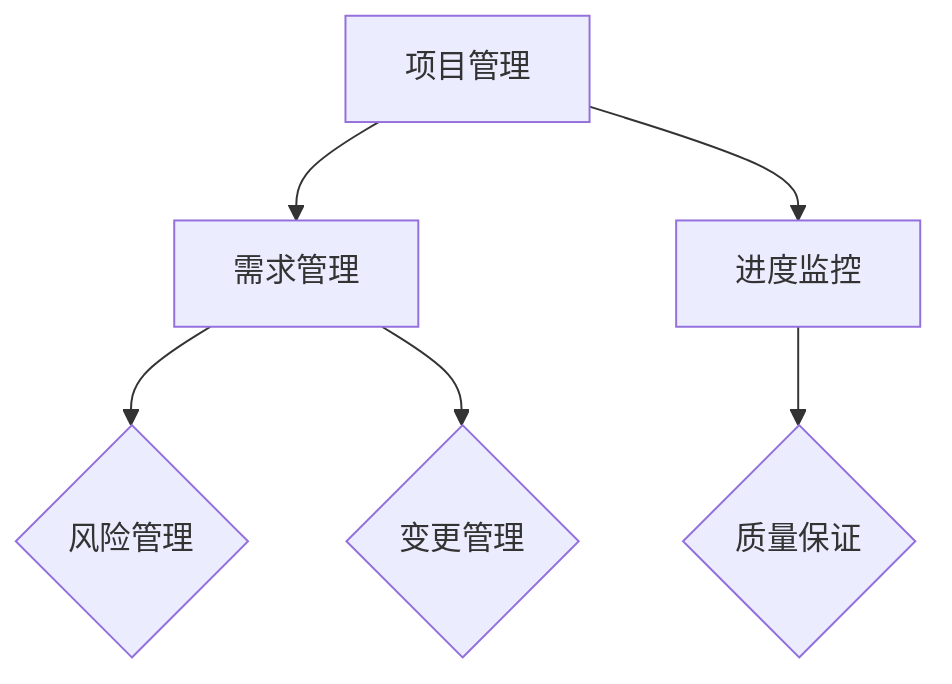
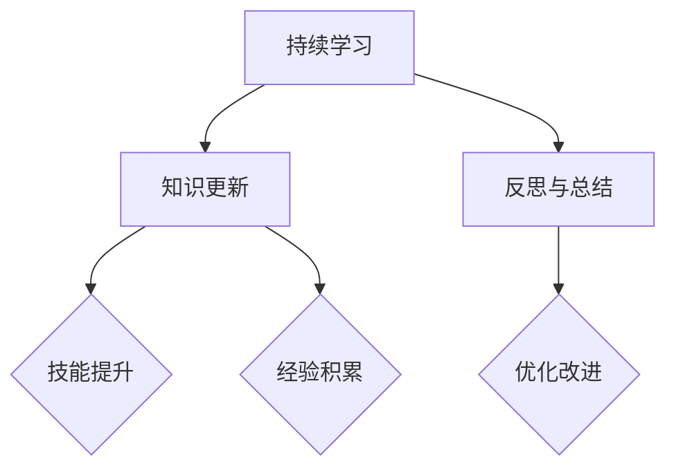

                 

### 文章标题：思维的敏捷性：快速适应变化的能力

关键词：敏捷思维、快速适应、变化管理、创新能力、认知心理学

摘要：在快速变化的信息时代，敏捷性已成为个人和组织成功的关键因素。本文将探讨思维的敏捷性，解析其在适应变化中的重要性，介绍提升敏捷思维的策略和方法，并通过实际案例和实践经验，阐述敏捷思维的应用场景和优化路径。本文旨在帮助读者理解敏捷思维的内涵，掌握提升敏捷性的有效策略，从而在个人生活和职业生涯中更加游刃有余。

#### 第一部分：引言与基础概念

##### 第1章：思维的敏捷性概述

## 1.1 思维敏捷性的重要性

### 1.1.1 适应变化的时代需求

在当今社会，科技发展日新月异，市场竞争日益激烈，变化已成为常态。思维敏捷性是应对这些挑战的关键能力。它不仅有助于个人在复杂多变的环境中快速适应，还能够提升组织的创新能力，从而在竞争中占据优势。

### 1.1.2 提升个人竞争力

具备敏捷思维的个体，能够更好地应对职业生涯中的不确定性。他们能够快速学习新知识、掌握新技能，具备出色的解决问题的能力和创新思维，这些都能显著提升个人的竞争力。

## 1.2 思维敏捷性的定义与特点

### 1.2.1 思维敏捷性的定义

思维敏捷性是指个体在面对变化和不确定性时，能够迅速调整思维模式，灵活应对问题的能力。它包括快速学习、适应新环境、创新思考等方面。

### 1.2.2 思维敏捷性的主要特点

- **快速适应**：能够迅速适应新的环境和情境。
- **灵活思考**：具备创新性和开放性，能够从不同角度思考问题。
- **学习能力强**：善于从经验和实践中学习，不断提升自我。
- **决策迅速**：在面对变化时能够快速做出合理的决策。

## 1.3 思维敏捷性的理论基础

### 1.3.1 认知心理学基础

认知心理学研究了大脑如何处理信息，形成思维。思维敏捷性的提升，依赖于对认知心理学理论的深入理解和应用。

#### 第二部分：敏捷思维策略

##### 第2章：提升敏捷思维的方法

## 2.1 敏捷思维训练

### 2.1.1 系统化思维训练方法

**Mermaid 流程图：**



### 2.1.2 创造性思维训练方法

**伪代码：**


function creativeThinking(problem):
    solutions = []
    for each perspective in perspectives:
        potentialSolution = generateSolution(problem, perspective)
        solutions.append(potentialSolution)
    return solutions
```

## 2.2 应对变化的心态调整

### 2.2.1 建立积极心态

**Mermaid 流程图：**



### 2.2.2 增强心理韧性

**伪代码：**


function resilienceTraining():
    for each challenge in challenges:
        simulateChallenge()
        recoverFromChallenge()
    return increasedResilience
```

## 2.3 应对变化的策略与实践

### 2.3.1 问题解决策略

**伪代码：**


function problemSolving(problem):
    potentialSolutions = brainstormSolutions(problem)
    evaluateSolutions(potentialSolutions)
    selectBestSolution()
    implementSolution()
    monitorAndAdjust()
```

### 2.3.2 决策与规划技巧

**Mermaid 流程图：**



#### 第三部分：敏捷思维的应用场景

##### 第3章：敏捷思维在个人生活中的应用

## 3.1 时间管理

### 3.1.1 敏捷思维在时间管理中的应用

**Mermaid 流程图：**

```mermaid
graph TD
    A[时间管理] --> B[任务优先级]
    B --> C{时间分配}
    B --> D[弹性计划}
    A --> E[时间记录]
    E --> F[效率分析]
```

### 3.1.2 时间管理案例分析

**案例：**张先生是一位高级软件工程师，他通过运用敏捷思维的时间管理方法，将原本杂乱无章的工作时间变得有序高效。他使用任务优先级矩阵来安排每天的工作任务，通过弹性计划来应对突发情况，并通过时间记录和效率分析来不断优化工作流程。

## 3.2 职场中的敏捷思维

### 3.2.1 敏捷思维在职场中的优势

**Mermaid 流程图：**



### 3.2.2 职场案例分析

**案例：**李女士是一名项目经理，她通过敏捷思维的方法，成功带领团队完成了多个高难度的项目。她采用敏捷开发的模式，快速响应客户需求变化，并通过灵活的沟通和高效的决策，确保项目进度和质量。

##### 第4章：敏捷思维在团队管理中的应用

## 4.1 团队协作与沟通

### 4.1.1 敏捷思维在团队协作中的应用

**Mermaid 流程图：**



### 4.1.2 沟通案例分析

**案例：**王先生是一位团队领导者，他通过建立有效的沟通机制和角色分工，提高了团队的协作效率。他采用敏捷思维的方法，确保团队成员在任务分配和决策过程中能够快速响应，并通过反馈机制不断优化团队的工作流程。

## 4.2 项目管理

### 4.2.1 敏捷思维在项目管理中的应用

**Mermaid 流程图：**



### 4.2.2 项目管理案例分析

**案例：**赵女士是一名项目经理，她通过敏捷思维的方法，成功管理了多个复杂项目。她采用敏捷开发模式，快速响应项目需求变化，并通过风险管理、变更管理和进度监控，确保项目按计划高质量完成。

#### 第四部分：敏捷思维的实践与优化

##### 第5章：敏捷思维的自我评估与优化

## 5.1 自我评估工具与方法

### 5.1.1 敏捷思维自我评估工具

**伪代码：**


function selfAssessment(traits):
    score = 0
    for each trait in traits:
        if trait.value > threshold:
            score += 1
    return score
```

### 5.1.2 敏捷思维评估案例分析

**案例：**李先生使用一款敏捷思维自我评估工具，评估自己的敏捷思维水平。通过分析评估结果，他发现自己在快速适应和创新能力方面有一定优势，但在决策力和沟通能力方面有待提高。基于此，他制定了针对性的训练计划，不断提升自己的敏捷思维水平。

## 5.2 提升敏捷思维的有效策略

### 5.2.1 个性化训练策略

**伪代码：**


function personalizedTrainingStrategy(assessments):
    strategies = []
    for each assessment in assessments:
        if assessment.score < threshold:
            strategies.append("针对提升策略")
    return strategies
```

### 5.2.2 持续学习与进步

**Mermaid 流程图：**



##### 第6章：敏捷思维的实践案例与经验分享

## 6.1 成功案例分享

### 6.1.1 个人成长案例

**案例：**王女士是一名年轻的软件工程师，通过不断学习和实践敏捷思维，她在短时间内提升了个人能力和职业竞争力。她通过参与项目实战、阅读相关书籍和参加专业培训，不断丰富自己的知识和技能，最终成功晋升为高级工程师。

### 6.1.2 团队成功案例

**案例：**李先生带领的团队在实施敏捷开发过程中，通过灵活应对需求变化、高效沟通和快速决策，成功完成了多个重要项目。团队的整体协作效率和项目质量得到了显著提升，得到了客户和公司的高度认可。

## 6.2 经验与教训

### 6.2.1 实践中的挑战与应对

**案例：**张先生在实施敏捷思维的过程中，遇到了团队成员沟通不畅和决策效率低的问题。通过引入敏捷思维的培训和实践，他逐步解决了这些问题，提升了团队的敏捷性和协作效率。

### 6.2.2 成功实践的关键要素

- **持续学习**：保持对新知识和新技能的渴望，不断提升自我。
- **灵活应对**：在面对变化时，能够迅速调整思维和行动策略。
- **团队协作**：建立有效的沟通机制和协作模式，提升团队的执行力。

#### 第五部分：未来展望与挑战

##### 第7章：敏捷思维的未来发展

## 7.1 技术发展趋势与影响

### 7.1.1 新技术对敏捷思维的影响

随着人工智能、大数据和物联网等新技术的快速发展，敏捷思维的重要性将日益凸显。新技术带来的变化，要求个体和组织具备更高的敏捷性，以适应快速变化的环境。

### 7.1.2 未来技术的展望

未来技术将继续推动社会的变革，对敏捷思维提出更高的要求。人工智能等技术的应用，将进一步提升人类解决问题的能力和效率，为敏捷思维的实现提供有力支持。

## 7.2 面临的挑战与对策

### 7.2.1 社会挑战与对策

在社会层面，敏捷思维面临的挑战包括信息过载、竞争加剧和社会变革等。对策包括提高信息筛选和处理能力、建立应对竞争的机制和培养创新文化等。

### 7.2.2 个人挑战与对策

在个人层面，敏捷思维面临的挑战包括自我认知、情绪管理和持续学习等。对策包括增强自我认知、提升情绪调节能力和保持持续学习的动力。

### 附录

## 附录A：敏捷思维相关资源推荐

### 8.1 敏捷思维相关书籍推荐

- 《敏捷开发实践指南》
- 《思考，快与慢》
- 《五项修炼：学习型组织的艺术与实务》

### 8.2 敏捷思维在线资源介绍

- 敏捷思维社区
- 敏捷思维博客
- 敏捷思维在线课程

### 8.3 敏捷思维实践指南

- 制定个性化训练计划
- 建立灵活的应对机制
- 持续学习和实践

### 8.4 敏捷思维专业网站与社群推荐

- 敏捷联盟
- 敏捷开发社群
- 技术博客社区

### 结束语

思维的敏捷性是适应变化的关键能力。通过本文的探讨，我们了解了敏捷思维的定义、重要性、理论基础以及提升策略。在实际应用中，敏捷思维能够显著提升个人和团队的竞争力。未来，随着新技术的不断发展，敏捷思维的重要性将更加凸显。让我们积极培养和提升敏捷思维，应对未来的挑战，实现个人和组织的卓越发展。

**作者：AI天才研究院/AI Genius Institute & 禅与计算机程序设计艺术 /Zen And The Art of Computer Programming**

