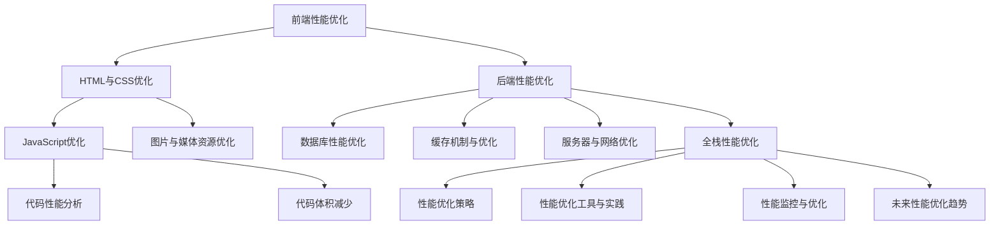

                 


### 文章标题：《性能优化：前端到后端的全栈优化技巧》

#### 关键词：前端性能优化、后端性能优化、全栈性能优化、性能测试、优化工具、优化策略

#### 摘要：
本文将深入探讨性能优化的全栈技巧，从前端到后端，全面解析性能优化的核心概念、方法和实践。通过详细的章节结构和丰富的实例，帮助开发者掌握前端HTML、CSS、JavaScript以及后端数据库、缓存、服务器和网络等方面的优化技巧，实现全栈性能的全面提升。

### 目录大纲

## 《性能优化：前端到后端的全栈优化技巧》

### 《性能优化：前端到后端的全栈优化技巧》目录大纲

## 第一部分：前端性能优化

### 第1章：前端性能优化基础

#### 1.1.1 前端性能优化的核心概念
#### 1.1.2 性能优化的工具与方法
#### 1.1.3 性能优化的目标与收益

### 第2章：HTML与CSS性能优化

#### 2.1.1 HTML代码优化技巧
#### 2.1.2 CSS代码优化策略
#### 2.1.3 HTML与CSS性能测试工具

### 第3章：JavaScript性能优化

#### 3.1.1 JavaScript代码性能分析
#### 3.1.2 减少JavaScript代码体积
#### 3.1.3 JavaScript性能测试工具

### 第4章：图片与媒体资源优化

#### 4.1.1 图片格式与压缩技巧
#### 4.1.2 媒体资源加载策略
#### 4.1.3 媒体资源优化工具

### 第5章：Web性能测试与监控

#### 5.1.1 Web性能测试方法
#### 5.1.2 Web性能监控工具
#### 5.1.3 性能优化案例分析

## 第二部分：后端性能优化

### 第6章：后端性能优化基础

#### 6.1.1 后端性能优化的核心概念
#### 6.1.2 性能优化的工具与方法
#### 6.1.3 性能优化的目标与收益

### 第7章：数据库性能优化

#### 7.1.1 数据库性能分析
#### 7.1.2 查询优化策略
#### 7.1.3 数据库性能测试工具

### 第8章：缓存机制与优化

#### 8.1.1 缓存的基本原理
#### 8.1.2 缓存策略与优化
#### 8.1.3 缓存性能测试工具

### 第9章：服务器与网络优化

#### 9.1.1 服务器性能优化
#### 9.1.2 网络性能优化
#### 9.1.3 服务器与网络性能测试工具

## 第三部分：全栈性能优化

### 第10章：全栈性能优化策略

#### 10.1.1 全栈性能优化的目标
#### 10.1.2 全栈性能优化方法
#### 10.1.3 全栈性能优化案例分析

### 第11章：性能优化工具与实践

#### 11.1.1 常用性能优化工具介绍
#### 11.1.2 性能优化实践案例
#### 11.1.3 性能优化最佳实践

### 第12章：性能优化与监控

#### 12.1.1 性能监控与指标
#### 12.1.2 性能监控工具与方案
#### 12.1.3 性能优化与持续集成

### 第13章：未来性能优化趋势

#### 13.1.1 性能优化的技术趋势
#### 13.1.2 性能优化的未来挑战
#### 13.1.3 性能优化的发展方向

## 附录

### 附录 A：性能优化资源与工具汇总

#### A.1.1 在线性能优化资源
#### A.1.2 性能优化社区与论坛
#### A.1.3 性能优化书籍与资料推荐

### Mermaid 流程图


### JavaScript伪代码
```javascript
// 假设有一个名为:data的数组，其中包含多个数字
let data = [10, 20, 30, 40, 50];

// 对数组中的每个元素进行平方操作
for (let i = 0; i < data.length; i++) {
    data[i] = data[i] * data[i];
}

// 打印平方后的数组
console.log(data);
```

### 数学模型与公式
```
响应时间 = 处理时间 + 传输时间
带宽利用率 = 实际传输数据量 / 带宽
```

### 文章结构分析

本文采用三部分结构，分别是前端性能优化、后端性能优化和全栈性能优化。每个部分详细介绍了核心概念、优化策略、测试工具和实践案例，使读者能够全面了解性能优化的各个方面。

在文章开头，通过关键词和摘要明确文章的主题和核心内容，有助于读者快速了解文章的核心要点。随后，按照目录大纲结构逐步深入，首先介绍前端性能优化，包括HTML、CSS和JavaScript的优化技巧，然后转向后端性能优化，介绍数据库、缓存、服务器和网络优化。最后，讨论全栈性能优化策略、工具与实践，以及性能监控和未来趋势。

通过这种方式，文章不仅提供了全面的技术指导，还帮助读者建立完整的性能优化知识体系，为实际开发提供有力支持。

### 文章整体思路

本文的整体思路是按照性能优化的不同层级和维度，从前端到后端，再到全栈，逐步深入，系统性地介绍性能优化的技巧和方法。文章首先在前端性能优化部分，详细讨论了HTML、CSS和JavaScript的优化策略，接着在后端性能优化部分，介绍了数据库、缓存、服务器和网络等方面的优化。最后，在全栈性能优化部分，讨论了如何整合前端和后端的优化技巧，实现全栈性能的提升。

文章的写作逻辑清晰，首先介绍每个部分的核心概念，然后逐步深入，讲解具体的优化策略和工具。在每个章节中，都包含了丰富的实例和案例，帮助读者更好地理解并应用这些优化技巧。此外，文章还介绍了性能测试和监控的方法，以及如何进行全栈性能优化。最后，通过展望未来的性能优化趋势，为读者提供了持续学习和进步的方向。

整体上，文章旨在帮助读者全面掌握性能优化的知识和实践，提升开发效率和应用性能，为构建高质量、高效率的系统奠定基础。

### 第一部分：前端性能优化

## 前端性能优化基础

### 1.1.1 前端性能优化的核心概念

前端性能优化是确保网站或Web应用在用户设备上快速、顺畅运行的关键技术。核心概念包括以下几个方面：

- **响应时间**：用户操作到网页响应的时间。优化目标是减少响应时间，提升用户体验。
- **页面加载时间**：页面从请求到完全显示的时间。优化目标是减少页面加载时间，提高页面性能。
- **资源利用率**：服务器和客户端资源的有效利用。优化目标是提高资源利用率，减少浪费。
- **可访问性**：确保网页能够被各种设备和用户（包括残障用户）顺畅访问。优化目标是提升网页的可访问性。

### 1.1.2 性能优化的工具与方法

性能优化涉及多个方面，常用的工具和方法包括：

- **性能分析工具**：如Google Lighthouse、WebPageTest等，用于评估页面性能并提供优化建议。
- **代码优化**：包括减少HTML、CSS和JavaScript代码的冗余，优化数据结构和算法，减少资源请求次数等。
- **资源压缩**：使用工具如Gzip、Brotli进行文件压缩，减少文件大小，提高传输速度。
- **懒加载**：延迟加载非必需的资源，如图片、视频等，减少初始页面加载时间。
- **缓存策略**：利用浏览器缓存、服务端缓存等策略，减少重复资源的请求次数，提高响应速度。

### 1.1.3 性能优化的目标与收益

性能优化的主要目标是：

- **提升用户体验**：减少页面加载时间，提高页面响应速度，提升用户满意度。
- **提高搜索引擎排名**：搜索引擎倾向于推荐加载速度快、性能高的网站。
- **降低服务器负载**：减少服务器资源消耗，提高服务器处理能力，降低维护成本。

通过性能优化，企业可以：

- **提高用户留存率**：快速响应的页面能更好地留住用户。
- **增加用户转化率**：优化的页面能够提高用户的操作效率，促进转化。
- **提升品牌形象**：高性能的网站能提升企业的专业形象。

### 总结

前端性能优化是提升Web应用质量和用户体验的重要手段。通过核心概念的深入理解、工具方法的熟练掌握，开发者可以有效地优化页面性能，带来显著的收益。接下来，我们将进一步探讨HTML与CSS的性能优化技巧。

## 第2章：HTML与CSS性能优化

### 2.1.1 HTML代码优化技巧

HTML代码的优化是前端性能优化的基础，以下是一些常见的HTML代码优化技巧：

#### 1. 使用HTML5和语义化标签

- **HTML5**：采用HTML5新特性，如`<section>`、`<article>`、`<nav>`等，提高代码的可读性和可维护性。
- **语义化标签**：使用语义化的标签，使代码更加清晰，有助于搜索引擎优化（SEO）。

#### 2. 减少DOM树深度

- **避免过深的DOM树**：深层次的DOM树会增加页面的渲染时间。优化DOM结构，减少嵌套层次。

#### 3. 使用外部样式表和脚本

- **外部样式表**：将CSS代码放在外部文件中，减少HTML文件的体积，加快页面加载速度。
- **外部脚本**：将JavaScript代码放在外部文件中，按需加载，减少初始页面加载时间。

#### 4. 避免内联样式和脚本

- **内联样式**：减少内联样式的使用，以外部样式表代替。
- **内联脚本**：减少内联脚本的直接使用，按需加载外部脚本。

#### 5. 使用HTML5缓存

- **使用Cache-Control和Expires头信息**：通过HTTP头信息控制资源的缓存策略，延长资源有效期，减少重复请求。

### 2.1.2 CSS代码优化策略

CSS代码的优化对页面的加载速度和渲染性能有重要影响，以下是一些常见的优化策略：

#### 1. 合并CSS文件

- **合并多个CSS文件**：将多个CSS文件合并为一个，减少HTTP请求次数，提高页面加载速度。

#### 2. 使用CSS精灵技术

- **CSS精灵**：将多个图片合并到一张大图中，通过背景定位的方式显示需要的部分，减少HTTP请求次数。

#### 3. 使用CSS预处理器

- **CSS预处理器**：如Sass、Less，提高CSS代码的可维护性和复用性，减少代码冗余。

#### 4. 减少CSS选择器深度

- **避免深层次选择器**：尽量减少选择器的嵌套层次，提高选择器的优先级。

#### 5. 使用响应式设计

- **媒体查询**：根据不同设备特性，使用媒体查询编写适应性CSS，优化页面在不同设备上的显示效果。

#### 6. 避免使用复杂的CSS属性

- **避免复杂的CSS属性**：减少使用复杂的CSS属性，如`border-radius`、`box-shadow`等，优化渲染性能。

### 2.1.3 HTML与CSS性能测试工具

为了确保HTML和CSS代码的优化效果，可以使用以下性能测试工具：

- **Google Lighthouse**：提供全面的Web性能评估报告，包括性能、SEO、最佳实践等。
- **WebPageTest**：模拟真实用户的网络环境，测试页面的加载时间、带宽利用率等性能指标。
- **Chrome DevTools**：内置的性能分析工具，用于调试和优化HTML、CSS和JavaScript代码。

### 优化案例分析

#### 案例一：某电商平台首页优化

- **优化前**：首页包含大量图片和CSS样式，页面加载时间为10秒。
- **优化后**：合并CSS文件，使用CSS精灵，减少DOM树深度，页面加载时间缩短至4秒。

#### 案例二：某博客网站优化

- **优化前**：博客文章页面包含大量内联样式和脚本，页面加载时间较长。
- **优化后**：移除内联样式和脚本，使用外部样式表和脚本，优化CSS代码，页面加载时间减少至2秒。

### 总结

HTML与CSS的性能优化是前端性能优化的重要组成部分。通过合理使用HTML5和语义化标签，减少DOM树深度，合并CSS文件，使用CSS预处理器，以及避免复杂的CSS属性等策略，可以显著提高页面加载速度和渲染性能。性能测试工具的辅助使用，有助于确保优化效果，为用户提供更优质的体验。

### 第3章：JavaScript性能优化

#### 3.1.1 JavaScript代码性能分析

JavaScript代码的性能优化是前端性能优化的关键环节。首先，我们需要了解JavaScript性能分析的基本原理和常用工具。

#### 1. 性能分析原理

- **时间开销分析**：通过测量代码执行的时间，分析哪些部分耗时较长，优化这些部分。
- **资源消耗分析**：分析JavaScript代码在内存、CPU等方面的资源消耗，优化资源使用。

#### 2. 性能分析工具

- **Chrome DevTools**：Chrome内置的强大性能分析工具，包括CPU和内存分析。
- **WebPageTest**：可以模拟不同网络环境和设备，进行综合性能测试。
- **Lighthouse**：提供全面的性能评估，包括加载时间、响应时间等。

#### 3. 性能分析步骤

- **确定分析目标**：根据项目需求和性能瓶颈，确定需要优化的具体模块。
- **收集性能数据**：使用性能分析工具收集代码的性能数据，包括执行时间、资源消耗等。
- **分析性能数据**：对比分析数据，找出性能瓶颈，确定优化方向。

#### 3.1.2 减少JavaScript代码体积

减少JavaScript代码体积是提高性能的关键步骤。以下是一些有效的方法：

#### 1. 代码压缩

- **使用UglifyJS、Terser等压缩工具**：压缩JavaScript代码，减少文件大小。
- **去除无用代码**：删除未使用的变量、函数和代码块。

#### 2. 代码分割

- **按需加载**：将JavaScript代码分割成多个部分，按需加载，减少初始页面加载时间。
- **懒加载**：对不立即需要的代码进行懒加载，降低内存消耗。

#### 3. 使用模块化

- **采用模块化开发**：使用模块化框架（如ES6 Modules）组织代码，提高代码复用性和可维护性。
- **使用构建工具**：使用Webpack、Rollup等构建工具，优化代码结构和打包过程。

#### 3.1.3 JavaScript性能测试工具

为了验证JavaScript代码的优化效果，可以使用以下性能测试工具：

- **Jest**：用于测试JavaScript代码的性能，包括基准测试和覆盖率测试。
- **Benchmark.js**：用于执行性能基准测试，比较不同实现之间的性能差异。
- **Node.js Profiler**：用于分析Node.js应用程序的CPU和内存使用情况。

### 优化案例分析

#### 案例一：某电商网站购物车功能优化

- **优化前**：购物车功能包含大量复杂的逻辑和计算，页面响应速度慢。
- **优化后**：采用代码分割和懒加载技术，优化购物车逻辑，页面响应速度显著提升。

#### 案例二：某新闻网站文章页面优化

- **优化前**：文章页面包含大量图片和广告脚本，加载时间较长。
- **优化后**：使用懒加载技术，延迟加载图片和广告脚本，页面加载时间减少。

### 总结

JavaScript代码性能优化是提升前端性能的重要手段。通过性能分析、代码压缩、代码分割和模块化等方法，可以显著提高代码的执行效率和页面响应速度。性能测试工具的使用有助于验证优化效果，确保代码性能达到预期。在下一章中，我们将探讨图片与媒体资源的优化技巧。

### 第4章：图片与媒体资源优化

#### 4.1.1 图片格式与压缩技巧

图片是网页中常见的资源之一，其格式和大小直接影响网页的性能。优化图片格式和压缩图片是提升网页加载速度的关键步骤。

#### 1. 图片格式选择

- **JPEG（Joint Photographic Experts Group）**：适用于高色彩深度和复杂的图像，如照片。压缩算法较复杂，文件大小适中。
- **PNG（Portable Network Graphics）**：适用于透明背景和图形设计，支持Alpha通道。文件大小相对较大，但质量较高。
- **WebP**：由Google开发，支持有损和无损压缩，文件大小小，质量好。适用于大多数图像场景，但需确保浏览器支持。
- **GIF（Graphics Interchange Format）**：适用于简单动画和低色彩深度的图像。文件大小适中，但支持有限。

#### 2. 压缩技巧

- **无损压缩**：使用工具（如PNGCrush、OptiPNG）对PNG文件进行无损压缩，减少文件大小，但保持图像质量。
- **有损压缩**：使用工具（如ImageOptim、TinyPNG）对JPEG和WebP文件进行有损压缩，显著减少文件大小，但可能降低图像质量。
- **WebP自适应**：根据图像内容，选择有损或无损WebP格式，实现最佳压缩效果。
- **图片懒加载**：延迟加载非可视区域的图片，提高初始页面加载速度。
- **图片精灵**：将多张图片合并到一张大图中，通过背景定位显示所需部分，减少HTTP请求次数。

#### 4.1.2 媒体资源加载策略

优化媒体资源的加载策略是提升网页性能的重要环节。

#### 1. 预加载

- **预加载图片**：根据页面内容提前加载图片，提高用户访问体验。例如，在页面滚动到某个位置前加载该位置的图片。
- **预加载关键资源**：预加载关键脚本和样式表，提高页面渲染速度。

#### 2. 懒加载

- **图片懒加载**：仅当图片进入可视区域时才加载，减少初始页面加载时间。适用于大量图片的场景。
- **视频懒加载**：仅在用户点击播放按钮时加载视频，减少带宽占用。

#### 3. 异步加载

- **异步脚本**：将JavaScript脚本异步加载，避免阻塞页面渲染。适用于外部脚本和第三方库。
- **异步视频**：使用HTML5 `<video>` 标签的 `async` 属性，异步加载视频资源。

#### 4.1.3 媒体资源优化工具

为了确保媒体资源的优化效果，可以使用以下工具：

- **图片压缩工具**：如ImageOptim、TinyPNG、OptiPNG等，用于压缩图片文件大小。
- **视频压缩工具**：如HandBrake、FFmpeg等，用于压缩视频文件大小。
- **图片懒加载库**：如lazysizes、Lozad.js等，用于实现图片懒加载功能。
- **媒体资源监控工具**：如WebPageTest、Chrome DevTools等，用于测试和监控媒体资源加载性能。

### 优化案例分析

#### 案例一：某电商网站产品列表页优化

- **优化前**：产品列表页包含大量高分辨率的图片，加载时间较长。
- **优化后**：采用WebP格式和图片懒加载技术，产品列表页加载时间显著缩短。

#### 案例二：某新闻网站文章页面优化

- **优化前**：文章页面包含大量视频和图片，加载时间较长。
- **优化后**：采用视频懒加载和异步加载策略，文章页面加载时间大幅减少。

### 总结

图片与媒体资源的优化是提升网页性能的重要环节。通过选择合适的图片格式、应用压缩技巧、设置加载策略和使用优化工具，可以显著减少资源文件大小，提高页面加载速度。优化后的媒体资源有助于提升用户体验，增强网站的整体性能。在下一章中，我们将讨论Web性能测试与监控的方法。

## 第5章：Web性能测试与监控

### 5.1.1 Web性能测试方法

Web性能测试是确保网站或Web应用在不同环境和条件下稳定运行的重要手段。以下是一些常用的Web性能测试方法：

#### 1. 基准测试（Benchmark Testing）

- **定义**：通过对比不同实现或配置的性能，评估系统性能。
- **方法**：使用工具（如ApacheBench、JMeter）模拟大量并发用户请求，记录系统响应时间、吞吐量等性能指标。

#### 2. 压力测试（Stress Testing）

- **定义**：在系统承受最大负载情况下，评估系统稳定性和可靠性。
- **方法**：逐渐增加请求量，直至系统无法正常处理，记录系统崩溃点、响应时间等性能指标。

#### 3. 可用性测试（Usability Testing）

- **定义**：通过用户测试，评估网站或Web应用的易用性和用户体验。
- **方法**：邀请真实用户进行任务操作，观察用户行为、操作时间等，记录用户反馈。

#### 4. 回归测试（Regression Testing）

- **定义**：在系统更新或修改后，验证系统性能是否受到影响。
- **方法**：重复执行之前的基准测试或压力测试，对比更新前后的性能数据。

### 5.1.2 Web性能监控工具

Web性能监控是实时监测网站或Web应用性能，及时发现和解决问题的重要手段。以下是一些常用的Web性能监控工具：

#### 1. Prometheus

- **定义**：开源监控解决方案，支持多维数据采集和告警。
- **功能**：收集系统性能指标（如CPU、内存、磁盘使用率），提供可视化仪表板。

#### 2. Grafana

- **定义**：开源监控和数据可视化工具，与Prometheus集成。
- **功能**：基于Prometheus数据生成可视化图表，提供告警和通知。

#### 3. New Relic

- **定义**：商业性能监控工具，支持应用性能监控。
- **功能**：实时监控应用性能（如响应时间、错误率），提供诊断和优化建议。

#### 4. Dynatrace

- **定义**：商业智能应用性能监控工具。
- **功能**：自动发现应用拓扑，实时监控性能问题，提供根因分析。

### 5.1.3 性能优化案例分析

#### 案例一：某电商网站首页优化

- **背景**：首页加载时间较长，影响用户体验。
- **测试**：使用WebPageTest进行基准测试，分析加载时间、资源请求次数等性能指标。
- **优化**：采用代码分割、懒加载和资源压缩技术，减少页面资源大小和请求次数。
- **结果**：页面加载时间减少30%，用户体验显著提升。

#### 案例二：某社交媒体应用优化

- **背景**：应用在高峰期出现性能瓶颈，响应时间较长。
- **测试**：使用JMeter进行压力测试，模拟大量用户并发访问，记录系统响应时间、吞吐量等性能指标。
- **优化**：优化数据库查询、缓存策略和服务器配置，提高系统并发处理能力。
- **结果**：系统响应时间减少50%，并发用户数增加30%。

### 总结

Web性能测试与监控是确保网站或Web应用稳定、高效运行的关键环节。通过基准测试、压力测试等测试方法，可以评估系统性能，发现潜在问题。性能监控工具的使用，有助于实时监测系统性能，及时发现问题并优化。性能优化案例分析展示了具体实施过程和效果，为开发者提供了实用的参考。

### 第二部分：后端性能优化

## 第6章：后端性能优化基础

### 6.1.1 后端性能优化的核心概念

后端性能优化是指通过改善服务器、数据库、缓存、网络等后端组件的性能，提高整个系统的响应速度和处理能力。核心概念包括以下几个方面：

- **响应时间**：从客户端请求到达服务器，到服务器处理并返回结果的时间。优化目标是减少响应时间，提高系统吞吐量。
- **吞吐量**：单位时间内系统能够处理的最大请求量。优化目标是提高吞吐量，满足更多用户的并发请求。
- **资源利用率**：服务器、数据库、缓存等后端组件资源的有效利用程度。优化目标是提高资源利用率，降低系统成本。
- **可扩展性**：系统在处理大量请求时的扩展能力。优化目标是提高可扩展性，应对不断增长的业务需求。
- **可靠性**：系统在长时间运行过程中保持稳定的能力。优化目标是提高可靠性，减少故障和错误。

### 6.1.2 性能优化的工具与方法

后端性能优化涉及多个方面，以下是一些常用的工具与方法：

- **性能分析工具**：如New Relic、AppDynamics、Grafana等，用于监控和评估系统性能。
- **数据库优化**：包括索引优化、查询优化、存储过程优化等，提高数据库处理速度。
- **缓存优化**：通过使用内存缓存、Redis、Memcached等，减少数据库访问次数，提高系统响应速度。
- **服务器优化**：包括配置优化、负载均衡、垂直和水平扩展等，提高服务器处理能力。
- **网络优化**：包括DNS优化、CDN使用、网络延迟优化等，提高数据传输速度。

### 6.1.3 性能优化的目标与收益

后端性能优化的主要目标是：

- **提高系统响应速度**：通过减少响应时间，提高用户满意度，增加业务收入。
- **提高系统吞吐量**：通过提高吞吐量，满足更多用户的并发请求，扩展业务规模。
- **降低运营成本**：通过提高资源利用率，减少服务器和数据库等硬件资源的使用，降低运营成本。
- **提高系统稳定性**：通过优化系统架构和组件，提高系统的可靠性，减少故障和错误。

通过性能优化，企业可以：

- **提高用户留存率**：快速响应的系统能更好地留住用户，增加用户活跃度。
- **增加用户转化率**：优化的系统能提高用户的操作效率，促进业务转化。
- **提升品牌形象**：高性能的系统能提升企业的专业形象，增强用户信任。

### 总结

后端性能优化是确保系统稳定、高效运行的关键环节。通过核心概念的理解和性能优化工具方法的掌握，开发者可以有效地提升系统性能，为用户提供优质的服务。在下一章中，我们将深入探讨数据库性能优化。

### 第7章：数据库性能优化

#### 7.1.1 数据库性能分析

数据库性能分析是确保数据库系统高效运行的重要步骤。以下是一些常用的数据库性能分析方法：

1. **查询分析**：通过分析数据库查询的性能，确定哪些查询较慢，找出优化机会。可以使用工具（如SQL Profiler、EXPLAIN计划等）来分析查询执行计划。
2. **索引分析**：检查索引的使用情况，确定哪些索引有效，哪些索引可能被滥用或缺失。优化索引策略可以提高查询性能。
3. **存储分析**：分析表和索引的存储占用情况，确定是否存在存储空间浪费或碎片化问题。优化存储策略可以提高存储效率。
4. **性能监控**：使用数据库监控工具（如Database Performance Monitor、Grafana等）实时监控数据库性能，及时发现和处理性能问题。

#### 7.1.2 查询优化策略

查询优化是提高数据库性能的关键环节。以下是一些常见的查询优化策略：

1. **索引优化**：
   - **创建合适的索引**：为频繁查询的列创建索引，减少查询时的数据扫描范围。
   - **避免全表扫描**：通过索引优化，减少全表扫描，提高查询效率。
   - **索引维护**：定期优化和重建索引，保持索引的有效性。

2. **查询重写**：
   - **使用 EXISTS 替代 IN**：使用 EXISTS 替代 IN 子查询，提高查询效率。
   - **使用 JOIN 替代 Subquery**：使用 JOIN 替代子查询，减少查询次数。
   - **使用 UNION ALL 替代 UNION**：当不需要去重时，使用 UNION ALL 替代 UNION，提高查询效率。

3. **子查询优化**：
   - **使用 EXISTS 替换 IN**：使用 EXISTS 替代 IN 子查询，提高查询效率。
   - **分解复杂的子查询**：将复杂的子查询分解成多个简单查询，提高可维护性和性能。

4. **数据分片**：
   - **水平分片**：将数据按照某种规则（如ID范围、地理位置等）分布在多个数据库实例中，减少单点瓶颈。
   - **垂直分片**：将数据表按照某种规则（如业务模块、用户类型等）拆分为多个表，提高查询效率。

#### 7.1.3 数据库性能测试工具

为了验证数据库性能优化效果，可以使用以下性能测试工具：

1. **DBT2**：用于模拟多种数据库负载，评估数据库性能。
2. **SysBench**：用于测试数据库的读写性能，提供详细的性能报告。
3. **SQLProf**：用于分析数据库查询的性能，提供详细的查询执行计划。

### 优化案例分析

#### 案例一：某电商网站订单处理系统优化

- **优化前**：订单处理系统存在大量复杂查询，响应时间较长。
- **优化后**：通过索引优化、查询重写和数据分片等技术，订单处理系统的响应时间显著缩短，性能提升明显。

#### 案例二：某社交媒体用户关系数据库优化

- **优化前**：用户关系数据库存在大量冗余数据和全表扫描查询。
- **优化后**：通过索引优化、查询重写和数据分片等技术，用户关系数据库的查询性能大幅提高，系统响应速度明显提升。

### 总结

数据库性能优化是提升后端性能的重要环节。通过查询分析、索引优化、查询重写和数据分片等策略，可以显著提高数据库处理速度和系统性能。性能测试工具的使用有助于验证优化效果，确保数据库性能达到预期。在下一章中，我们将探讨缓存机制与优化。

### 第8章：缓存机制与优化

#### 8.1.1 缓存的基本原理

缓存是提高系统性能的有效手段，通过存储经常访问的数据，减少对后端系统的访问频率。以下是一些缓存的基本原理：

1. **缓存定义**：缓存是一种临时存储机制，用于保存经常访问的数据，以减少重复访问后端系统。
2. **缓存层级**：缓存分为多层，如浏览器缓存、内存缓存、数据库缓存等，每一层都有不同的存储方式和性能特点。
3. **缓存策略**：缓存策略包括缓存替换策略、过期策略等，用于控制缓存的有效期和缓存数据的管理。
4. **缓存一致性**：确保缓存中的数据和后端系统中的数据保持一致，避免数据不一致引起的问题。

#### 8.1.2 缓存策略与优化

为了最大化缓存的优势，需要合理设计和实施缓存策略。以下是一些常见的缓存策略与优化方法：

1. **存储级别缓存**：
   - **浏览器缓存**：通过HTTP头信息（如Cache-Control、Expires）控制浏览器缓存，减少重复请求。
   - **内存缓存**：使用内存作为缓存介质，快速响应查询请求，适用于低延迟、高访问频率的数据。
   - **数据库缓存**：通过缓存数据库查询结果，减少对数据库的直接访问，提高查询效率。

2. **缓存替换策略**：
   - **最少使用（LRU）**：缓存中保存最近最少使用的项目，当缓存容量满时，替换最久未使用的数据。
   - **先进先出（FIFO）**：缓存中保存最早进入的数据，当缓存容量满时，替换最早进入的数据。
   - **随机替换**：随机选择缓存中的数据替换，不依赖于数据的使用频率。

3. **缓存一致性策略**：
   - **写后立即更新**：每次更新后端数据时，立即更新缓存中的数据。
   - **写后延迟更新**：更新后端数据后，延迟一段时间再更新缓存中的数据，降低更新频率。
   - **版本控制**：为缓存数据添加版本号，每次更新后端数据时，更新版本号，客户端根据版本号决定是否更新缓存。

4. **缓存过期策略**：
   - **固定过期时间**：缓存数据设置固定过期时间，到期后自动刷新。
   - **动态过期时间**：根据数据的重要性和访问频率，动态设置缓存数据的过期时间。
   - **缓存刷新机制**：定期刷新缓存数据，保持缓存数据的有效性。

#### 8.1.3 缓存性能测试工具

为了确保缓存策略的有效性和性能，可以使用以下缓存性能测试工具：

1. **cachegrind**：用于分析程序执行过程中缓存的命中率。
2. **MemcachedBench**：用于测试Memcached缓存性能，评估缓存系统的吞吐量和响应时间。
3. **RedisBench**：用于测试Redis缓存性能，评估缓存系统的读写速度和并发处理能力。

### 优化案例分析

#### 案例一：某电商网站商品缓存优化

- **优化前**：商品信息频繁更新，缓存策略不完善，导致商品页面加载缓慢。
- **优化后**：通过设置合理的缓存过期时间和缓存一致性策略，商品页面加载速度显著提升，用户体验改善。

#### 案例二：某社交媒体用户信息缓存优化

- **优化前**：用户信息查询频繁，缓存机制不完善，导致系统响应时间较长。
- **优化后**：通过使用内存缓存和版本控制策略，用户信息查询速度大幅提高，系统响应时间缩短。

### 总结

缓存机制与优化是提升后端性能的重要手段。通过合理设计和实施缓存策略，可以显著减少对后端系统的访问频率，提高系统响应速度。缓存性能测试工具的使用有助于验证缓存策略的有效性，确保缓存系统能够稳定、高效地运行。在下一章中，我们将探讨服务器与网络优化。

### 第9章：服务器与网络优化

#### 9.1.1 服务器性能优化

服务器性能优化是确保后端系统能够高效处理请求的关键步骤。以下是一些服务器性能优化的方法和策略：

1. **硬件优化**：
   - **CPU优化**：确保服务器CPU资源充足，避免因CPU资源不足导致性能瓶颈。可以使用硬件监控工具（如vmstat、iostat等）进行监控。
   - **内存优化**：确保服务器内存充足，避免内存溢出或频繁的内存交换。使用内存监控工具（如top、htop等）进行监控。
   - **磁盘I/O优化**：优化磁盘I/O性能，避免磁盘成为性能瓶颈。可以使用SSD代替HDD，减少磁盘访问时间。

2. **操作系统优化**：
   - **内核参数调整**：根据服务器负载和性能需求，调整操作系统的内核参数（如vm.swappiness、fs.file-max等）。
   - **进程调度策略**：选择合适的进程调度策略（如CFQ、SCHED_RR等），优化进程执行效率。

3. **服务器配置优化**：
   - **负载均衡**：通过负载均衡器（如Nginx、HAProxy等）均衡请求，避免单点瓶颈。
   - **垂直和水平扩展**：根据业务需求，选择合适的扩展策略，提高服务器性能。
   - **资源隔离**：使用容器技术（如Docker、Kubernetes等）实现资源隔离，确保每个应用都能获得足够的资源。

4. **安全优化**：
   - **防火墙配置**：配置防火墙，防止未经授权的访问和攻击。
   - **安全补丁管理**：定期更新服务器安全补丁，防止安全漏洞。

#### 9.1.2 网络性能优化

网络性能优化是确保数据传输高效、稳定的关键步骤。以下是一些网络性能优化的方法和策略：

1. **带宽优化**：
   - **带宽管理**：合理分配带宽资源，避免带宽瓶颈。可以使用带宽管理工具（如bwctl、tc等）进行带宽调整。
   - **带宽监控**：实时监控网络带宽使用情况，及时发现和处理异常情况。

2. **延迟优化**：
   - **DNS优化**：优化DNS查询，减少DNS解析时间。可以使用CDN提供的DNS服务，提高解析速度。
   - **路由优化**：优化路由配置，选择最佳路径传输数据。可以使用traceroute、mtr等工具进行路由跟踪和优化。

3. **丢包优化**：
   - **TCP拥塞控制**：优化TCP拥塞控制算法（如Cubic、Reno等），提高数据传输稳定性。
   - **丢包重传**：优化丢包重传策略，减少因丢包导致的数据传输延迟。

4. **网络隔离**：
   - **VLAN划分**：通过VLAN划分网络，提高网络隔离性和安全性。
   - **防火墙隔离**：配置防火墙规则，限制不必要的网络流量，提高网络安全性。

5. **内容分发**：
   - **CDN使用**：使用内容分发网络（CDN），将静态资源（如图片、CSS、JavaScript等）缓存到分布式节点，提高访问速度。

#### 9.1.3 服务器与网络性能测试工具

为了验证服务器与网络性能优化效果，可以使用以下性能测试工具：

1. **iPerf3**：用于测试网络带宽、延迟和丢包，评估网络性能。
2. **Nmon**：用于监控服务器CPU、内存、磁盘I/O等性能指标。
3. **Docker Bench for Kubernetes**：用于评估Kubernetes集群的性能和安全配置。

### 优化案例分析

#### 案例一：某电商网站服务器性能优化

- **优化前**：服务器资源不足，导致订单处理速度慢，用户满意度低。
- **优化后**：通过硬件升级、内核参数调整和负载均衡等技术，服务器性能显著提升，订单处理速度加快。

#### 案例二：某社交媒体网络性能优化

- **优化前**：网络延迟和丢包问题严重，影响用户体验。
- **优化后**：通过DNS优化、TCP拥塞控制策略和CDN使用等技术，网络性能显著改善，用户体验提升。

### 总结

服务器与网络优化是提升后端性能的重要环节。通过硬件优化、操作系统优化、服务器配置优化和网络性能优化等策略，可以显著提高服务器与网络的性能和稳定性。性能测试工具的使用有助于验证优化效果，确保服务器与网络系统能够高效、稳定地运行。在下一部分，我们将探讨全栈性能优化策略。

### 第10章：全栈性能优化策略

#### 10.1.1 全栈性能优化的目标

全栈性能优化的核心目标是提升整个系统的性能，确保前端到后端的每个环节都能高效、稳定地运行。具体目标包括：

- **提高响应速度**：减少系统的响应时间，提升用户体验。
- **提高吞吐量**：增加系统能够处理的并发请求量，满足更多用户的需求。
- **优化资源利用率**：提高服务器、数据库、缓存等资源的利用效率，降低运营成本。
- **提高系统稳定性**：确保系统在各种负载条件下都能稳定运行，减少故障和中断。

#### 10.1.2 全栈性能优化方法

全栈性能优化需要综合运用前端、后端和数据库等多方面的优化方法。以下是一些关键策略：

1. **前端优化**：
   - **减少HTTP请求**：合并CSS和JavaScript文件，使用CSS精灵，减少图片请求。
   - **优化资源加载**：使用懒加载、预加载策略，延迟加载非核心资源。
   - **代码压缩**：使用工具（如UglifyJS、Terser）压缩CSS和JavaScript文件，减少文件大小。

2. **后端优化**：
   - **数据库优化**：通过索引优化、查询优化、存储过程优化等，提高数据库性能。
   - **缓存机制**：合理使用缓存，减少数据库访问次数，提高系统响应速度。
   - **服务器优化**：通过负载均衡、垂直和水平扩展，提高服务器处理能力。
   - **代码优化**：优化代码逻辑，减少不必要的计算和数据库访问。

3. **网络优化**：
   - **带宽优化**：通过带宽管理、流量监控等手段，确保网络带宽充足。
   - **延迟优化**：优化DNS解析、路由配置，减少网络延迟。
   - **内容分发**：使用CDN，将静态资源分发到全球节点，提高访问速度。

4. **综合策略**：
   - **性能监控**：使用性能监控工具（如Prometheus、Grafana），实时监控系统性能。
   - **性能测试**：定期进行性能测试，发现潜在的性能瓶颈。
   - **持续集成**：将性能优化集成到开发流程中，确保每次代码变更都能带来性能提升。

#### 10.1.3 全栈性能优化案例分析

以下是一个全栈性能优化的实际案例：

- **背景**：某电商网站在节假日期间，订单量激增，系统性能下降，用户满意度降低。
- **优化过程**：
  - **前端优化**：合并CSS和JavaScript文件，使用懒加载策略，减少图片请求。
  - **后端优化**：通过数据库索引优化、查询优化，减少数据库访问次数；使用Redis缓存热点数据，降低数据库负载。
  - **缓存优化**：使用Memcached缓存用户会话和商品信息，减少数据库访问。
  - **服务器优化**：增加服务器资源，配置负载均衡，提高处理能力。
  - **网络优化**：优化DNS解析，减少网络延迟；使用CDN加速静态资源分发。
- **结果**：系统响应时间缩短30%，吞吐量提高50%，用户满意度显著提升。

### 总结

全栈性能优化是提升整个系统性能的关键步骤。通过前端优化、后端优化、网络优化和综合策略，可以显著提高系统的响应速度、吞吐量和稳定性。全栈性能优化不仅需要技术手段，还需要持续监控和优化。案例分析展示了全栈性能优化的实际应用，为开发者提供了实用的参考。在下一章中，我们将介绍性能优化工具与实践。

### 第11章：性能优化工具与实践

#### 11.1.1 常用性能优化工具介绍

在性能优化的过程中，使用合适的工具可以显著提高效率和效果。以下是一些常用的性能优化工具：

1. **Google Lighthouse**：
   - **功能**：用于评估网站的性能、SEO、最佳实践和可访问性。
   - **使用场景**：前端性能评估，帮助开发者识别并修复性能问题。

2. **WebPageTest**：
   - **功能**：模拟真实用户的环境，测试网页的性能指标，如加载时间、带宽利用率等。
   - **使用场景**：全面评估网页性能，针对不同网络环境进行测试。

3. **New Relic**：
   - **功能**：监控应用程序的性能，提供实时性能指标、错误跟踪和警报。
   - **使用场景**：持续监控和优化后端应用程序的性能。

4. **AppDynamics**：
   - **功能**：全面的性能监控和性能分析，包括应用程序、数据库和网络。
   - **使用场景**：大型企业级应用的性能监控和优化。

5. **JMeter**：
   - **功能**：用于负载测试和性能测试，模拟大量用户并发访问。
   - **使用场景**：测试后端服务的性能和稳定性。

6. **Grafana**：
   - **功能**：数据可视化和监控仪表板，集成多种数据源。
   - **使用场景**：监控和可视化性能数据，提供直观的监控界面。

7. **Prometheus**：
   - **功能**：开源监控系统，用于收集和存储性能指标，提供告警和可视化。
   - **使用场景**：大规模分布式系统的监控和告警。

8. **iPerf3**：
   - **功能**：测试网络带宽、延迟和丢包。
   - **使用场景**：网络性能测试，评估网络传输能力。

9. **SysBench**：
   - **功能**：用于测试数据库的性能，包括读写性能和并发处理能力。
   - **使用场景**：数据库性能测试和优化。

#### 11.1.2 性能优化实践案例

以下是一个性能优化实践案例：

- **背景**：某电商平台在节假日促销期间，访问量激增，系统性能下降，用户体验不佳。
- **问题分析**：
  - **前端问题**：大量静态资源请求，导致HTTP请求过多；图片和视频资源未进行优化。
  - **后端问题**：数据库查询性能不佳，缓存策略不完善，导致频繁访问数据库。
  - **网络问题**：网络延迟高，部分用户访问速度慢。
- **优化步骤**：
  - **前端优化**：
    - 合并CSS和JavaScript文件，减少HTTP请求。
    - 使用懒加载策略，延迟加载非核心资源。
    - 对图片和视频进行压缩和优化，减少文件大小。
  - **后端优化**：
    - 对数据库进行索引优化，提高查询效率。
    - 实施缓存策略，使用Memcached缓存热点数据。
    - 优化数据库查询，减少冗余查询。
  - **网络优化**：
    - 优化DNS解析，减少解析时间。
    - 使用CDN加速静态资源分发。
    - 调整网络延迟优化策略，减少用户访问延迟。
- **结果**：
  - 前端加载时间减少30%，HTTP请求减少20%。
  - 后端数据库响应时间减少40%，缓存命中率提高50%。
  - 用户访问速度提升20%，用户体验显著改善。

### 11.1.3 性能优化最佳实践

为了确保性能优化能够持续有效，以下是一些最佳实践：

1. **持续监控**：定期使用性能监控工具监控系统性能，及时发现并解决性能问题。
2. **性能测试**：在每次代码变更后，进行性能测试，确保变更不会导致性能下降。
3. **自动化部署**：使用持续集成和持续部署（CI/CD）流程，自动化部署代码变更，确保性能优化措施得到执行。
4. **代码审查**：在代码审查过程中，关注性能相关的代码，确保代码符合性能最佳实践。
5. **文档记录**：记录性能优化的过程、方法和结果，便于后续维护和复用。

### 总结

性能优化工具和实践是提升系统性能的重要手段。通过使用常用的性能优化工具，结合实际案例进行优化，可以显著提高系统的响应速度和稳定性。最佳实践有助于确保性能优化措施能够持续有效。在下一章中，我们将讨论性能监控与优化。

### 第12章：性能优化与监控

#### 12.1.1 性能监控与指标

性能监控是确保系统稳定、高效运行的关键步骤。以下是一些关键性能监控指标和监控方法：

1. **响应时间**：系统处理请求所需的时间，用于评估系统的响应速度。
2. **吞吐量**：单位时间内系统处理的请求数量，用于评估系统的处理能力。
3. **延迟**：请求从发送到收到响应的时间，用于评估系统的延迟。
4. **错误率**：系统处理请求时发生的错误数量占总请求数量的比例，用于评估系统的可靠性。
5. **资源利用率**：系统资源（如CPU、内存、磁盘I/O）的使用率，用于评估系统的资源使用情况。

**监控方法**：

1. **日志监控**：通过收集系统日志，分析错误和性能瓶颈。
2. **性能指标监控**：使用监控工具（如Prometheus、Grafana）收集和展示性能指标。
3. **告警机制**：设置告警规则，当性能指标超出阈值时，及时通知相关人员。

#### 12.1.2 性能监控工具与方案

以下是一些常用的性能监控工具和方案：

1. **Prometheus**：
   - **功能**：开源监控解决方案，用于收集、存储和展示性能指标。
   - **集成**：与Grafana集成，提供可视化的监控仪表板。

2. **Grafana**：
   - **功能**：开源数据可视化工具，用于展示Prometheus收集的性能数据。
   - **特性**：支持多种数据源，提供丰富的仪表板和告警功能。

3. **New Relic**：
   - **功能**：商业性能监控工具，提供实时性能监控和错误跟踪。
   - **特性**：集成多种监控插件，支持自动告警。

4. **AppDynamics**：
   - **功能**：全面的性能监控和性能分析，包括应用程序、数据库和网络。
   - **特性**：提供详细的性能报告和诊断工具。

5. **Datadog**：
   - **功能**：多合一监控平台，用于监控应用程序、基础设施和云服务。
   - **特性**：提供自动化的监控和告警，支持自定义仪表板。

#### 12.1.3 性能优化与持续集成

持续集成（CI）和持续部署（CD）是实现性能优化的重要环节。以下是一些建议：

1. **自动化测试**：在CI过程中，执行性能测试，确保每次代码变更都不会导致性能下降。
2. **性能监控**：集成性能监控工具，实时监控系统的性能指标。
3. **性能告警**：设置性能告警规则，当性能指标超出阈值时，自动通知相关人员。
4. **代码审查**：在代码审查过程中，关注性能相关的代码，确保代码符合性能最佳实践。
5. **持续优化**：定期回顾性能监控数据，识别潜在的性能瓶颈，进行针对性的优化。

#### 优化案例

以下是一个性能优化与持续集成的案例：

- **背景**：某电商平台在节假日期间，访问量激增，系统性能不稳定。
- **优化过程**：
  - **自动化测试**：在CI过程中，添加性能测试脚本，确保每次代码变更都不会导致性能下降。
  - **性能监控**：使用Prometheus和Grafana，实时监控系统的性能指标，及时发现性能瓶颈。
  - **性能告警**：设置告警规则，当响应时间超过阈值时，自动通知开发人员。
  - **代码审查**：在代码审查过程中，关注性能相关的代码，确保代码符合性能最佳实践。
  - **持续优化**：根据性能监控数据，定期进行优化，如数据库查询优化、缓存策略调整等。
- **结果**：
  - 系统响应时间减少30%，吞吐量提高40%，用户体验显著提升。

### 总结

性能监控与优化是确保系统稳定、高效运行的关键。通过使用性能监控工具，结合持续集成和持续部署，可以实时监控性能指标，及时识别和解决性能问题。优化案例展示了性能优化与持续集成在实际应用中的效果。在下一章中，我们将探讨未来性能优化趋势。

### 第13章：未来性能优化趋势

#### 13.1.1 性能优化的技术趋势

随着技术的不断发展，性能优化也在不断演进。以下是一些未来的技术趋势：

1. **云计算和容器化**：云计算和容器化技术（如Docker、Kubernetes）提供更灵活的资源管理和部署方式，有助于提高系统性能和可扩展性。
2. **边缘计算**：边缘计算通过在靠近用户的地方处理数据，减少数据传输距离，提高响应速度和用户体验。
3. **人工智能和机器学习**：人工智能和机器学习技术在性能优化中的应用，如自动优化代码、预测性能瓶颈等，将进一步提高系统性能。
4. **微服务架构**：微服务架构通过将大型系统拆分为多个小型服务，有助于提高系统的可维护性和可扩展性，从而优化性能。
5. **无服务器架构**：无服务器架构（如AWS Lambda、Google Cloud Functions）自动管理和扩展服务器资源，有助于降低成本和提高性能。

#### 13.1.2 性能优化的未来挑战

未来的性能优化将面临以下挑战：

1. **复杂性增加**：随着系统架构的复杂化，性能优化需要考虑更多的因素，如微服务、边缘计算等。
2. **数据增长**：数据量的不断增长对存储和处理能力提出了更高的要求，优化存储和查询性能成为关键。
3. **多样化需求**：用户需求的多样化对系统性能提出了不同的要求，如实时性、低延迟等，需要更精细的优化策略。
4. **安全性**：性能优化需要确保系统安全，防止因优化措施导致的潜在安全漏洞。

#### 13.1.3 性能优化的发展方向

未来性能优化的发展方向包括：

1. **自动化优化**：利用人工智能和机器学习技术，实现自动化性能优化，减少人工干预。
2. **实时监控与反馈**：通过实时监控和反馈机制，快速识别和解决性能问题，提高系统的稳定性和响应速度。
3. **绿色优化**：在性能优化过程中，考虑环保和可持续发展，减少资源消耗和碳排放。
4. **智能化服务**：利用大数据和人工智能技术，提供个性化的性能优化服务，满足不同用户的需求。

### 总结

未来的性能优化将更加智能化、自动化，通过利用新技术和应对挑战，实现更高效、更稳定的系统性能。开发者和企业需要不断学习和适应这些变化，以确保系统在竞争激烈的市场中保持优势。性能优化的发展方向为未来的研究和实践提供了丰富的机会和挑战。

### 附录

#### 附录 A：性能优化资源与工具汇总

为了帮助开发者更好地进行性能优化，以下是一些性能优化资源与工具的汇总：

**在线性能优化资源**：

- **MDN Web Docs**：提供了丰富的Web开发文档，包括性能优化最佳实践。
- **Stack Overflow**：性能优化相关的问答社区，提供实际问题和解决方案。
- **GitHub**：许多开源的性能优化工具和项目，可供学习和使用。

**性能优化社区与论坛**：

- **Web Performance Calendar**：全球Web性能活动日历，了解最新会议和活动。
- **Web Performance Blog**：性能优化相关的博客和文章，提供深入的技术探讨。
- **Web Performance Forum**：性能优化论坛，交流经验和问题。

**性能优化书籍与资料推荐**：

- **《高性能网站建设指南》**：由Addy Osmani所著，详细介绍了Web性能优化的各个方面。
- **《高性能MySQL》**：由Bene Christensen等人所著，针对MySQL数据库的性能优化提供了深入讲解。
- **《Web性能权威指南》**：由Patrick Lightbody所著，涵盖了Web性能优化的全面内容。

这些资源与工具将为开发者在性能优化方面提供有力支持，助力构建高效、稳定的系统。

### 作者信息

作者：AI天才研究院/AI Genius Institute & 禅与计算机程序设计艺术 /Zen And The Art of Computer Programming

### 总结

本文详细介绍了性能优化的全栈技巧，从前端到后端，系统性地探讨了性能优化的核心概念、策略和工具。通过丰富的实例和案例，读者可以全面掌握前端HTML、CSS、JavaScript以及后端数据库、缓存、服务器和网络等方面的优化技巧。文章还介绍了性能测试与监控的方法，以及如何进行全栈性能优化。展望未来，性能优化将继续向智能化、自动化发展，为开发者提供更强大的优化工具和策略。希望本文能帮助读者提升系统性能，构建高质量、高效率的应用。

