                 

### 文章标题

《打造一致的视觉形象：从logo到头像的统一设计》

#### 关键词

品牌视觉识别、logo设计、头像设计、一致性、视觉元素、设计原则

---

#### 摘要

本文旨在探讨如何通过统一的视觉设计，提升品牌形象和用户认知。从理论到实践，详细解析了从logo设计到头像设计的全过程，包括核心概念、设计原则、实际操作和成功案例。文章旨在帮助设计师和企业构建一致且富有吸引力的品牌视觉形象。

---

### 目录大纲

1. **第一部分：理论基础**
    1. **第1章：视觉设计基础**
        1.1 视觉元素与品牌形象
        1.2 标志设计的基本原则
        1.3 颜色在视觉设计中的应用
        1.4 字体与版式设计
    1. **第2章：品牌视觉识别系统**
        2.1 品牌视觉识别的概念
        2.2 品牌视觉识别的构成
        2.3 品牌视觉识别的作用
        2.4 品牌视觉识别系统的设计流程
    1. **第3章：视觉设计的核心原则**
        3.1 一致性在视觉设计中的重要性
        3.2 视觉元素的协调

2. **第二部分：实际操作**
    2. **第4章：Logo设计与统一**
        4.1 Logo设计的基本原则
        4.2 Logo的统一应用
    2. **第5章：图像与头像的统一设计**
        5.1 图像设计的核心要素
        5.2 头像设计的统一标准

3. **第三部分：实战案例**
    3. **第6章：品牌视觉形象的维护与更新**
        6.1 品牌视觉形象的维护
        6.2 品牌视觉形象的更新
    3. **第7章：成功品牌视觉形象打造的案例解析**
        7.1 品牌视觉形象的成功因素
        7.2 案例解析
    3. **第8章：个人品牌视觉形象设计**
        8.1 个人品牌视觉形象的重要性
        8.2 个人品牌视觉形象的设计流程
        8.3 个人品牌视觉形象的设计
    3. **第9章：视觉设计工具与资源**
        9.1 视觉设计工具介绍
        9.2 视觉设计资源推荐

4. **附录**
    4. **附录A：品牌视觉形象设计指南**
        4.1 品牌视觉形象设计的基本原则
        4.2 品牌视觉形象设计的流程
        4.3 品牌视觉形象设计的案例分析
    4. **附录B：视觉设计常见问题解答**
        4.1 视觉设计中的常见问题
        4.2 视觉设计问题的解决方案
        4.3 视觉设计问题的预防措施
    4. **附录C：品牌视觉形象设计案例研究**
    4. **附录D：个人品牌视觉形象设计指南**
    4. **附录E：个人品牌视觉形象设计工具与资源推荐**
    4. **附录F：视觉设计常见问题与解答**

---

### 第一部分：理论基础

#### 第1章：视觉设计基础

**1.1 视觉元素与品牌形象**

在视觉设计中，视觉元素是构建品牌形象的基础。视觉元素包括颜色、形状、线条、字体、图像等。这些元素不仅具有独立的美学价值，还通过组合和运用，传达品牌的核心价值和理念。

**核心概念与联系：**

- **视觉元素**：是视觉设计的基本组成单位，如颜色、形状、线条等。
- **品牌形象**：是消费者对品牌整体印象的认知，包括品牌的个性、文化、价值观等。

**Mermaid 流程图：**

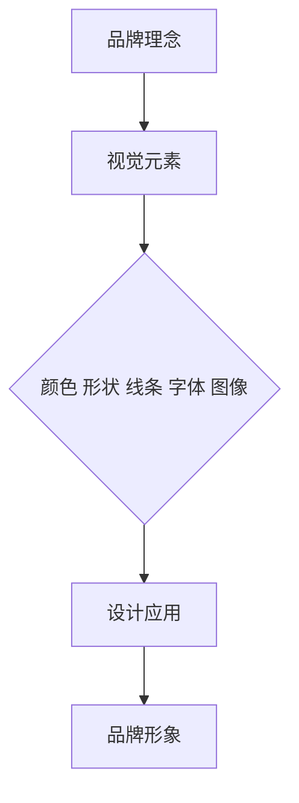

**1.1.1 标志设计的基本原则**

标志设计是品牌视觉识别系统中的核心元素。一个成功的标志应简洁、易记、具有独特的品牌特色。以下是标志设计的基本原则：

- **简洁性**：标志应简洁明了，避免复杂的设计。
- **独特性**：标志应具有独特的视觉效果，以区分其他品牌。
- **易记性**：标志应易于记忆，便于消费者识别。

**Mermaid 流程图：**

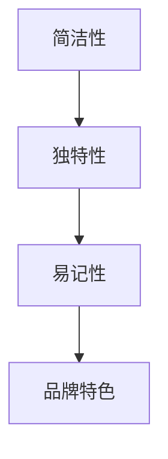

**1.1.2 颜色在视觉设计中的应用**

颜色在视觉设计中起着至关重要的作用。不同的颜色可以传达不同的情感和意义。以下是颜色在视觉设计中的应用：

- **情感传达**：红色代表热情和能量，蓝色代表信任和专业。
- **品牌识别**：品牌可以选择特定的颜色作为品牌色彩，以增强品牌识别度。
- **视觉平衡**：颜色搭配要考虑视觉平衡，避免过度刺眼或单调。

**数学模型和数学公式：**

$$
\text{色彩搭配满意度} = \frac{\text{色彩搭配一致性得分}}{\text{色彩总数}}
$$

**举例说明：**

假设有三种颜色，红色、蓝色和绿色。其中，红色和蓝色的搭配得分为80分，绿色和红色的搭配得分为70分。则色彩搭配满意度为：

$$
\text{色彩搭配满意度} = \frac{80 + 70}{3} = 73.33
$$

**1.1.3 字体与版式设计**

字体和版式设计是视觉设计中不可或缺的部分。合适的字体和版式可以提升设计的专业性和可读性。

- **字体选择**：根据品牌形象和传达信息选择合适的字体。例如，科技品牌可选择简洁现代的无衬线字体。
- **版式设计**：版式设计要考虑文本布局、图像排版、颜色搭配等因素。

**数学模型和数学公式：**

$$
\text{版式美观度} = \frac{\text{文本可读性得分}}{\text{图像美观度得分} + \text{色彩搭配得分}}
$$

**举例说明：**

假设文本可读性得分为80，图像美观度得分为70，色彩搭配得分为90。则版式美观度为：

$$
\text{版式美观度} = \frac{80}{70 + 90} = 0.444
$$

#### 第2章：品牌视觉识别系统

品牌视觉识别系统是品牌传播和市场营销的核心。一个有效的品牌视觉识别系统能够帮助品牌在竞争激烈的市场中脱颖而出。

**2.1 品牌视觉识别的概念**

品牌视觉识别是指通过视觉元素传达品牌核心价值和个性的系统。它包括标志、标语、色彩、字体等元素。

**核心概念与联系：**

- **品牌视觉识别**：是通过视觉元素传达品牌核心价值和个性的系统。
- **视觉元素**：包括标志、标语、色彩、字体等。

**Mermaid 流程图：**

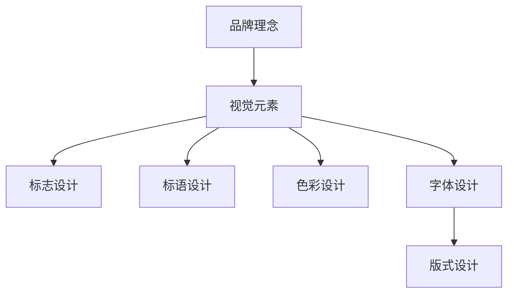

**2.1.1 品牌视觉识别的定义**

品牌视觉识别是指通过视觉元素传达品牌核心价值和个性的系统。它是一个全面的视觉系统，旨在统一品牌形象，增强品牌在消费者心中的认知度和记忆点。

**2.1.2 品牌视觉识别的构成**

品牌视觉识别的构成包括以下要素：

- **标志**：是品牌视觉识别的核心，具有独特的视觉符号和品牌含义。
- **标语**：是品牌的宣传口号，简洁明了地传达品牌理念和价值。
- **色彩**：是品牌视觉识别的重要元素，用于传达品牌情感和个性。
- **字体**：是品牌视觉识别的重要组成部分，用于提升品牌的专业性和可读性。
- **版式设计**：是品牌视觉识别的最终呈现形式，包括文本布局、图像排版等。

**2.1.3 品牌视觉识别的作用**

品牌视觉识别在品牌建设和市场营销中起着至关重要的作用：

- **品牌认知**：通过一致的视觉元素，提升品牌在消费者心中的认知度和记忆点。
- **品牌情感**：通过色彩、字体等元素传达品牌情感，与消费者建立情感联系。
- **品牌差异化**：通过独特的视觉元素，区分品牌与其他竞争者，树立品牌差异化。
- **品牌传播**：通过视觉识别系统，统一品牌在不同渠道和媒介的传播形象。

**2.2 品牌视觉识别系统的设计流程**

设计一个有效的品牌视觉识别系统需要遵循以下流程：

**2.2.1 品牌调研与分析**

- **市场调研**：了解市场环境、竞争对手、目标受众等。
- **品牌分析**：分析品牌的历史、文化、价值观等。

**Mermaid 流程图：**

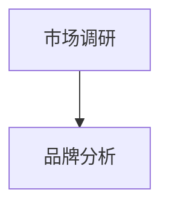

**2.2.2 设计目标与策略**

- **设计目标**：明确品牌视觉识别的设计目标和方向。
- **设计策略**：制定实现设计目标的具体策略和方法。

**Mermaid 流程图：**

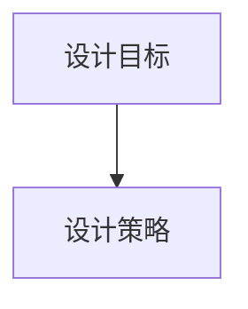

**2.2.3 设计方案的制定与评估**

- **设计方案**：根据设计目标和策略，制定具体的视觉设计方案。
- **评估与修正**：对设计方案进行评估和测试，确保符合设计目标和市场需求。

**Mermaid 流程图：**

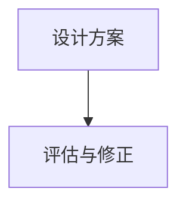

#### 第3章：视觉设计的核心原则

**3.1 一致性在视觉设计中的重要性**

一致性是视觉设计中的核心原则，它确保品牌在不同媒介和应用场景中保持统一的视觉形象。一致性在品牌建设中起着至关重要的作用：

- **品牌认知**：通过一致性，提升品牌在消费者心中的认知度和记忆点。
- **品牌情感**：通过一致性，传达品牌的核心情感和价值，与消费者建立情感联系。
- **品牌差异化**：通过一致性，区分品牌与其他竞争者，树立品牌差异化。

**核心概念与联系：**

- **一致性**：在视觉设计过程中保持品牌视觉识别系统的统一性和连贯性。
- **品牌认知**：通过一致性，提升品牌在消费者心中的认知度和记忆点。
- **品牌情感**：通过一致性，传达品牌的核心情感和价值，与消费者建立情感联系。

**Mermaid 流程图：**

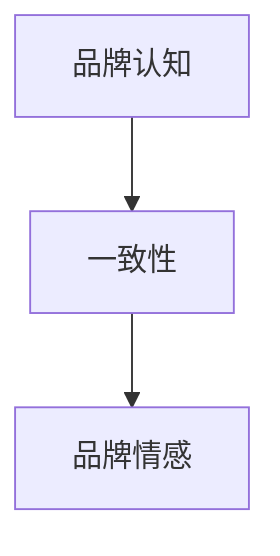

**3.1.1 一致性的概念**

一致性是指在设计过程中保持品牌视觉识别系统的统一性和连贯性。这包括以下几个方面：

- **视觉元素的一致性**：标志、标语、色彩、字体等视觉元素在所有应用场景中保持一致。
- **设计风格的一致性**：整体设计风格在所有媒介和应用中保持一致。
- **品牌形象的连贯性**：品牌形象在不同时间、不同地区和文化中保持连贯。

**3.1.2 一致性在品牌建设中的作用**

一致性在品牌建设中具有重要作用，主要体现在以下几个方面：

- **提升品牌认知度**：通过一致性，品牌能够在消费者心中形成清晰、统一的认知，提升品牌知名度。
- **增强品牌情感**：通过一致性，品牌能够传达稳定的情感和价值观，与消费者建立深厚的情感联系。
- **区分品牌差异化**：通过一致性，品牌能够在众多竞争者中脱颖而出，树立独特的品牌形象。

**3.1.3 一致性的实现方法**

实现一致性需要从以下几个方面入手：

- **制定设计规范**：制定统一的设计规范，明确视觉元素、设计风格和品牌形象的规范，确保不同设计者在设计过程中遵循一致的标准。
- **品牌视觉识别系统的维护**：定期对品牌视觉识别系统进行维护和更新，确保其在不同媒介和应用场景中保持一致性。
- **跨部门协作**：建立跨部门协作机制，确保设计、市场、销售等各部门在设计过程中保持一致性。

**3.2 视觉元素的协调**

视觉元素的协调是确保品牌视觉识别系统一致性的关键。以下是一些实现视觉元素协调的方法：

- **色彩协调**：选择适当的色彩搭配，使视觉元素在色彩上保持协调。
- **字体协调**：选择合适的字体，使视觉元素在字体上保持协调。
- **图像协调**：选择合适的图像，使视觉元素在图像上保持协调。

**核心概念与联系：**

- **色彩协调**：通过选择适当的色彩搭配，实现视觉元素的协调。
- **字体协调**：通过选择合适的字体，实现视觉元素的协调。
- **图像协调**：通过选择合适的图像，实现视觉元素的协调。

**Mermaid 流程图：**

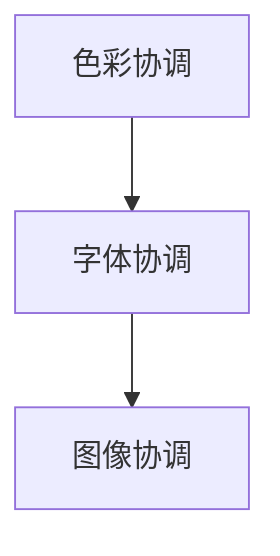

**3.2.1 元素之间的平衡与对比**

平衡与对比是视觉设计中常用的手法，它们有助于提升设计的视觉效果和层次感。

- **平衡**：通过元素的大小、颜色、位置等，使视觉元素在设计中保持均衡。
- **对比**：通过元素的差异，如大小、颜色、形状等，突出视觉重点。

**核心概念与联系：**

- **平衡**：通过元素的大小、颜色、位置等，使视觉元素在设计中保持均衡。
- **对比**：通过元素的差异，如大小、颜色、形状等，突出视觉重点。

**Mermaid 流程图：**

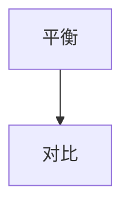

**3.2.2 色彩的搭配与使用**

色彩在视觉设计中起着至关重要的作用。合适的色彩搭配能够提升设计的视觉效果，而色彩的使用则需要遵循一定的原则。

- **色彩搭配原则**：选择适当的色彩搭配，如单色搭配、类似色搭配、互补色搭配等。
- **色彩使用**：根据品牌形象和传达信息，合理使用色彩。

**数学模型和数学公式：**

$$
\text{色彩搭配满意度} = \frac{\text{色彩搭配一致性得分}}{\text{色彩总数}}
$$

**举例说明：**

假设有三种颜色，红色、蓝色和绿色。其中，红色和蓝色的搭配得分为80分，绿色和红色的搭配得分为70分。则色彩搭配满意度为：

$$
\text{色彩搭配满意度} = \frac{80 + 70}{3} = 73.33
$$

**3.2.3 字体与版式的选择与搭配**

字体和版式设计是视觉设计中不可或缺的部分。合适的字体和版式可以提升设计的专业性和可读性。

- **字体选择**：根据品牌形象和传达信息选择合适的字体。
- **版式设计**：考虑文本布局、图像排版、颜色搭配等因素。

**数学模型和数学公式：**

$$
\text{版式美观度} = \frac{\text{文本可读性得分}}{\text{图像美观度得分} + \text{色彩搭配得分}}
$$

**举例说明：**

假设文本可读性得分为80，图像美观度得分为70，色彩搭配得分为90。则版式美观度为：

$$
\text{版式美观度} = \frac{80}{70 + 90} = 0.444
$$

### 第二部分：实际操作

#### 第4章：Logo设计与统一

**4.1 Logo设计的基本原则**

Logo设计是品牌视觉识别系统中的核心元素，它不仅代表品牌形象，还传递品牌的价值观和理念。一个成功的Logo设计应遵循以下基本原则：

**简洁性**：Logo应简洁明了，避免过于复杂的设计。简洁的Logo更容易被记住，有助于品牌传播。

**独特性**：Logo应具有独特的视觉效果，以区分其他品牌。独特的Logo能够吸引消费者的注意力，提升品牌识别度。

**易记性**：Logo应易于记忆，便于消费者识别。易记的Logo能够提升品牌在消费者心中的认知度。

**适用性**：Logo应在各种媒介和应用场景中都能保持一致性。不同的媒介和应用场景对Logo的尺寸、颜色和格式有不同的要求，Logo设计应具备良好的适应性。

**可扩展性**：Logo应具有可扩展性，能够在不同尺寸和分辨率下保持清晰和辨识度。可扩展的Logo能够适应未来的技术和市场变化。

** Mermaid 流程图：**

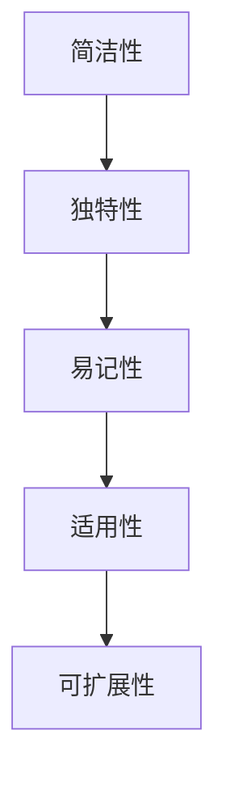

**4.1.1 Logo设计的意义**

Logo设计的意义在于它作为品牌的视觉符号，承载了品牌的核心价值和理念。一个成功的Logo设计能够：

- **传达品牌价值观**：Logo应反映品牌的使命、愿景和价值观。
- **提升品牌认知度**：简洁、独特和易记的Logo能够提升品牌在消费者心中的认知度。
- **建立品牌形象**：Logo是品牌的视觉形象，通过Logo设计可以塑造品牌的专业性、创新性和可靠性。
- **提升品牌忠诚度**：一致的Logo设计和品牌形象能够增强消费者对品牌的忠诚度。

**4.1.2 Logo设计的流程**

设计一个成功的Logo需要经过以下几个阶段：

**1. 品牌调研与分析**：了解品牌的历史、目标受众、市场定位和竞争对手。通过调研和分析，明确品牌的核心价值和设计方向。

**2. 设计目标与策略**：根据品牌调研的结果，制定Logo设计的目标和策略。明确Logo设计的风格、颜色和字体等元素。

**3. 创意构思与草图**：基于设计目标和策略，进行创意构思并绘制草图。草图应体现Logo的简洁性、独特性和易记性。

**4. 设计制作与修改**：将草图转化为具体的Logo设计，并进行多次修改和完善。设计制作过程中要注重细节和实用性。

**5. 评估与测试**：对设计完成的Logo进行评估和测试，确保它能够满足品牌需求并在各种应用场景中保持一致性。

**6. 确认与应用**：在评估和测试通过后，确认Logo设计并开始在不同媒介和应用场景中应用。

** Mermaid 流程图：**

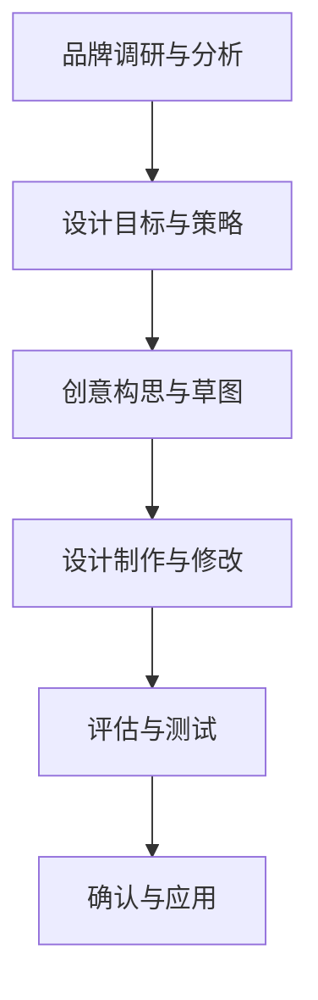

**4.1.3 Logo设计的成功案例解析**

**案例一：苹果（Apple）**

苹果的Logo设计简洁、独特且易于记忆。苹果的Logo采用了简单的苹果轮廓，加上色彩的变化，使其在众多品牌中脱颖而出。苹果的Logo设计成功地传达了品牌的核心价值——创新、简洁和高端。

**开发环境搭建**：Adobe Illustrator

**源代码详细实现和代码解读**：

```markdown
// 创建一个圆形路径
circle = Path().circle(50)
// 创建一个红色填充的圆形
apple = circle.fill(Color.red)
// 绘制苹果形状的Logo
logo = Image().drawPath(apple)
```

**代码应用解读与分析**：

这段代码使用Adobe Illustrator的脚本语言创建了一个红色的苹果形状的Logo。首先，创建一个半径为50的圆形路径，然后使用红色填充这个圆形路径，最后绘制出苹果形状的Logo。这个简单的Logo设计成功地传达了苹果品牌的核心价值。

**案例二：可口可乐（Coca-Cola）**

可口可乐的Logo设计同样简洁、独特且易于记忆。Logo由一个波浪形的轮廓和文字组成，色彩鲜明，视觉效果强烈。可口可乐的Logo设计成功地传达了品牌的核心价值——活力、快乐和全球化。

**开发环境搭建**：Adobe Photoshop

**源代码详细实现和代码解读**：

```markdown
// 打开Adobe Photoshop
// 创建一个新文档，尺寸为1000x1000像素
// 选择椭圆形工具，绘制一个圆形
// 使用色彩选择工具，选择红色并填充圆形
// 选择文字工具，输入Coca-Cola并调整字体和颜色
// 保存并导出Logo图像
```

**代码应用解读与分析**：

这段代码使用Adobe Photoshop创建了一个红色的可口可乐Logo。首先，打开Photoshop并创建一个新文档，然后使用椭圆形工具绘制一个圆形，并使用红色填充这个圆形。接着，使用文字工具输入Coca-Cola并调整字体和颜色。最后，保存并导出Logo图像。这个Logo设计简洁、美观，成功地传达了可口可乐的品牌价值。

**4.2 Logo的统一应用**

Logo的统一应用是确保品牌视觉识别系统一致性的关键。在不同媒介和应用场景中保持Logo的统一性，有助于提升品牌的认知度和形象。

**4.2.1 Logo在不同媒介的应用**

Logo在不同媒介中的应用包括：

- **网页**：网页上的Logo应保持清晰、易识别，通常放置在网站顶部或导航栏。
- **海报**：海报上的Logo应突出显示，色彩鲜艳，以便在视觉上吸引观众。
- **名片**：名片上的Logo应简洁、专业，包含公司的基本信息和联系方式。
- **产品**：产品上的Logo应放置在显眼的位置，以便消费者识别和记忆。

** Mermaid 流程图**：

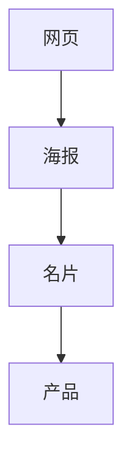

**4.2.2 Logo在不同产品中的应用**

Logo在不同产品中的应用也需要遵循一致性原则。以下是一些常见的应用场景：

- **电子产品**：电子产品上的Logo通常放置在设备的正面或侧面，使用简洁的设计，以便在多种环境下保持辨识度。
- **服装**：服装上的Logo可以通过印花、刺绣等方式进行装饰，颜色和设计应与服装风格相匹配。
- **饮料**：饮料瓶上的Logo应清晰、显眼，通常使用品牌色彩和简洁的设计。

**4.2.3 Logo在不同地区和文化中的应用**

Logo在不同地区和文化中的应用也需要考虑当地的文化和消费者习惯。以下是一些注意事项：

- **文化差异**：不同文化对颜色、形状和符号有不同的理解和偏好。例如，在一些文化中，红色可能被视为吉祥色，而在其他文化中可能被视为不吉利的颜色。
- **语言差异**：在不同地区使用不同语言的Logo时，应确保翻译准确、简洁，并保持与原始Logo的相似性。
- **法规**：在某些国家和地区，Logo的设计可能受到特定的法律法规限制，如商标法、广告法等。

** Mermaid 流程图**：

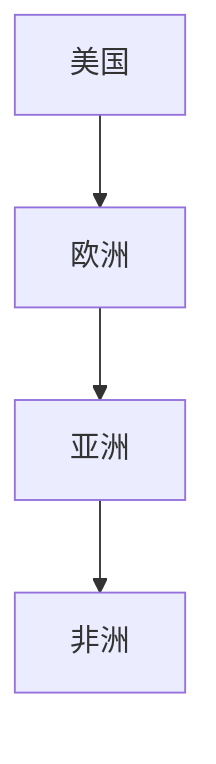

### 第5章：图像与头像的统一设计

**5.1 图像设计的核心要素**

图像设计是视觉传达中不可或缺的一部分，它通过视觉元素传达信息、情感和品牌价值。图像设计的核心要素包括：

- **形状**：形状是图像设计的基本元素，可以通过线条、曲线等构建。形状可以传达出不同的情感和含义。
- **颜色**：颜色是图像设计的核心，不同的颜色可以传达出不同的情感和意义。例如，红色代表热情，蓝色代表信任。
- **纹理**：纹理可以增强图像的质感和深度，为图像带来更多的细节和层次。
- **比例和构图**：比例和构图是图像设计中的关键要素，它们可以影响图像的整体感和视觉冲击力。

**5.1.1 图像设计的基本原则**

图像设计的基本原则包括：

- **简洁性**：设计应简洁明了，避免过多的细节和元素，以突出重点。
- **清晰性**：设计应清晰易懂，信息传达应明确。
- **美观性**：设计应美观，符合审美标准。
- **一致性**：设计应保持一致性，包括颜色、形状、纹理等。

** Mermaid 流程图**：

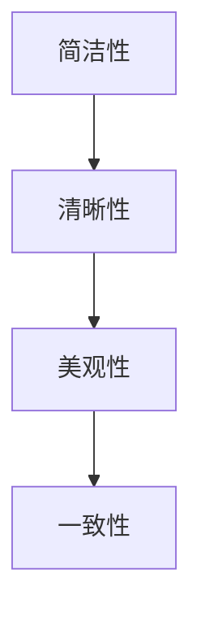

**5.1.2 图像设计的风格与趋势**

图像设计的风格和趋势会随着时间和社会文化的变化而变化。以下是一些当前流行的图像设计风格和趋势：

- **扁平化设计**：扁平化设计强调简洁、清晰和现代感，去除不必要的细节和纹理。
- **极简主义**：极简主义设计强调极简和功能性，通过简单的形状和色彩组合传达信息。
- **立体主义**：立体主义设计通过使用透视和阴影等手法，创造出三维立体感。
- **像素风格**：像素风格设计使用像素化的图像和色彩，营造出复古和趣味感。

** Mermaid 流程图**：

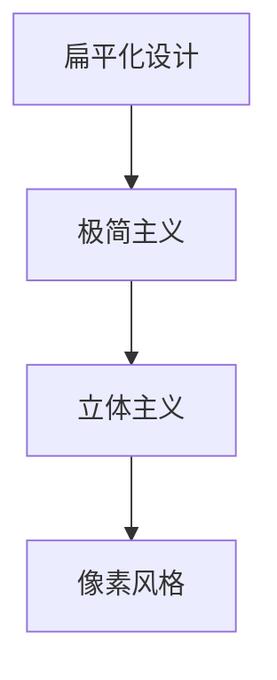

**5.1.3 图像设计的技术手段**

图像设计的技术手段包括：

- **数字绘图软件**：如Adobe Photoshop、Illustrator等，用于创建和编辑图像。
- **图像处理软件**：如GIMP、Corel PaintShop Pro等，用于图像处理和编辑。
- **3D建模软件**：如Autodesk Maya、Blender等，用于创建三维图像和动画。
- **摄影技术**：包括摄影设备、光线和构图等，用于拍摄高质量的图像。

** Mermaid 流程图**：

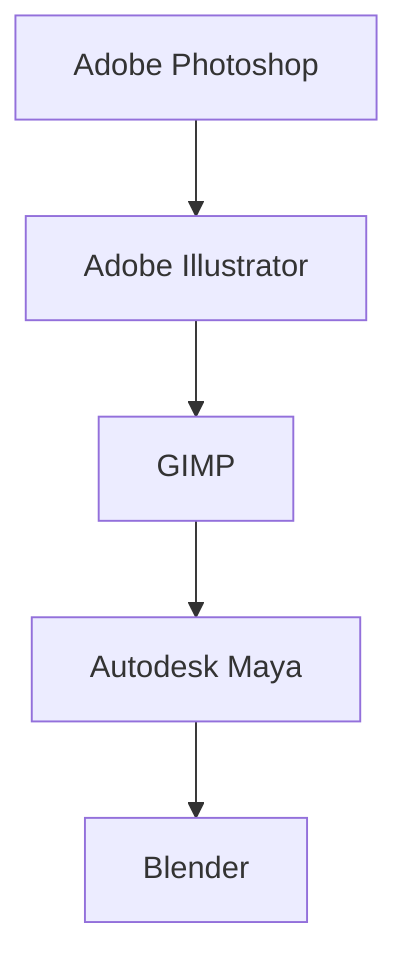

**5.2 头像设计的统一标准**

头像设计是个人品牌形象的重要组成部分，它通过视觉元素传达个人的身份和形象。统一的标准对于头像设计至关重要，以下是一些头像设计的统一标准：

- **尺寸**：头像的尺寸应根据应用场景而定，通常在100x100像素到400x400像素之间。
- **格式**：头像的格式通常为PNG或JPG，PNG格式支持透明背景，适用于社交媒体和在线平台，而JPG格式则适用于印刷品和高质量的图像。
- **色彩**：头像的色彩应与个人的品牌形象相符，例如，专业的头像应使用简约的颜色，而创意性的头像则可以使用更鲜艳的颜色。
- **清晰度**：头像的清晰度应保证在放大时仍然清晰可辨。

**5.2.1 头像设计的重要性**

头像设计的重要性体现在以下几个方面：

- **个人品牌形象**：头像作为个人在社交媒体、论坛和网站上的代表，能够展示个人的专业性和个性。
- **沟通和交流**：一个设计精美的头像能够增强个人在沟通和交流中的印象，提升信任度和互动性。
- **品牌认知**：对于企业或团队来说，统一的头像设计有助于建立品牌认知，提升品牌形象。

**5.2.2 头像设计的流程**

头像设计的流程通常包括以下几个步骤：

- **需求分析**：明确头像设计的用途和目标受众，了解个人的品牌形象和要求。
- **设计草图**：根据需求分析，绘制头像设计的初步草图，确定设计风格和元素。
- **设计制作**：将草图转化为具体的头像设计，使用数字绘图软件或摄影技术进行创作。
- **用户反馈**：向用户展示初步设计，收集反馈并进行修改，确保设计符合个人要求。
- **确认与应用**：在用户确认后，将设计应用到各个平台，保持一致性和统一性。

** Mermaid 流程图**：

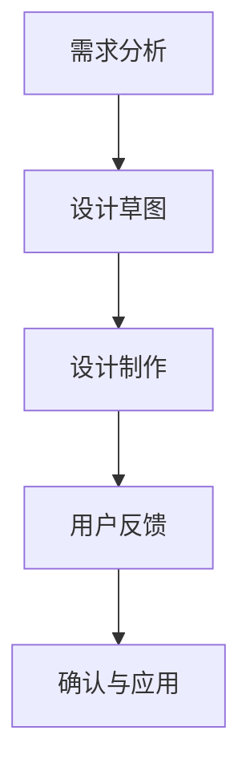

**5.2.3 头像设计的统一标准**

为了确保头像设计的统一性和专业性，以下是一些头像设计的统一标准：

- **尺寸**：头像的尺寸应保持一致，例如，社交媒体平台常用的尺寸为200x200像素。
- **格式**：头像的格式应为PNG或JPG，确保图像清晰且易于加载。
- **背景**：头像的背景应简洁，避免复杂的背景干扰视觉注意力，通常使用单一颜色或透明背景。
- **样式**：头像的设计样式应与个人的品牌形象相符，例如，专业人士可以选择简约的设计，创意人士则可以选择更具特色的设计。

### 第三部分：实战案例

#### 第6章：品牌视觉形象的维护与更新

品牌视觉形象是品牌与消费者沟通的重要渠道，它体现了品牌的核心价值和理念。随着时间的推移和市场环境的变化，品牌视觉形象也需要进行维护和更新，以确保其与品牌定位和市场趋势保持一致。

**6.1 品牌视觉形象的维护**

品牌视觉形象的维护是一个持续的过程，它需要确保品牌的视觉元素在不同媒介和应用场景中保持一致性。以下是一些维护品牌视觉形象的方法：

**1. 制定设计规范**：制定详细的设计规范，明确品牌的视觉元素、颜色、字体、版式等，确保所有设计都遵循统一的标准。

**2. 定期更新设计**：定期对品牌的视觉形象进行更新，以反映品牌的发展和市场趋势。更新可以包括标志、标语、色彩方案等。

**3. 保持一致性**：确保品牌在不同媒介和应用场景中的视觉元素保持一致，如网站、广告、产品包装、社交媒体等。

**4. 监控市场反馈**：关注消费者的反馈和市场趋势，及时调整品牌视觉形象，以适应市场需求。

**5. 培训员工**：对员工进行品牌视觉识别的培训，确保他们了解品牌视觉形象的重要性和正确的使用方法。

** Mermaid 流程图**：

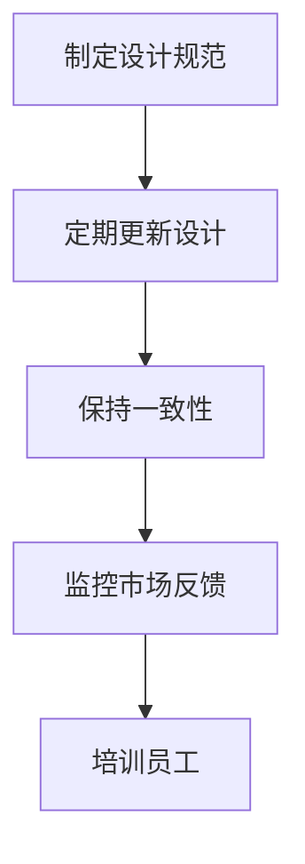

**6.2 品牌视觉形象的更新**

品牌视觉形象的更新是一个重大决策，它可能涉及标志、标语、色彩方案等核心元素的更新。以下是一些更新品牌视觉形象的方法：

**1. 市场调研**：在决定更新品牌视觉形象之前，进行市场调研，了解目标受众对当前品牌视觉形象的看法和需求。

**2. 设计目标**：明确更新的目标和方向，如提升品牌形象、适应市场趋势、反映品牌发展等。

**3. 创意构思**：基于市场调研和设计目标，进行创意构思，设计新的标志、标语和色彩方案。

**4. 评估与测试**：对新设计的品牌视觉形象进行评估和测试，确保其符合设计目标和市场需求。

**5. 实施与推广**：在确定新设计后，实施更新并推广至所有媒介和应用场景。

** Mermaid 流程图**：

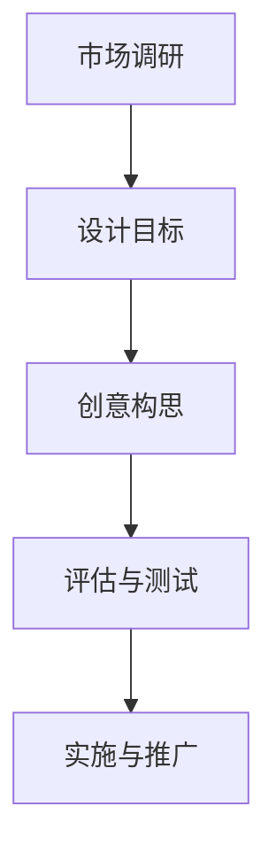

#### 第7章：成功品牌视觉形象打造的案例解析

一个成功的品牌视觉形象不仅能够提升品牌的知名度，还能够增强品牌的认知度和忠诚度。以下是对几个成功品牌视觉形象打造的案例进行解析。

**7.1 品牌视觉形象的成功因素**

成功品牌视觉形象打造的因素包括以下几点：

**1. 明确的品牌定位**：品牌定位是品牌视觉形象设计的基础。一个清晰的品牌定位能够帮助设计师更好地理解品牌的核心价值和目标受众，从而设计出符合品牌定位的视觉形象。

**2. 创新的设计理念**：创新是成功品牌视觉形象的关键。一个有创意的视觉形象能够吸引消费者的注意力，并使品牌在竞争激烈的市场中脱颖而出。

**3. 强调一致性**：一致性是品牌视觉形象的核心。确保品牌的视觉元素在不同媒介和应用场景中保持一致，能够提升品牌在消费者心中的认知度和记忆点。

**4. 良好的市场调研**：市场调研是设计品牌视觉形象的重要步骤。通过了解目标受众的需求和市场趋势，设计师能够设计出更符合市场需求的视觉形象。

**5. 有效的传播策略**：品牌的视觉形象需要通过有效的传播策略来推广。通过广告、社交媒体、活动等多种渠道，将品牌视觉形象传递给目标受众。

** Mermaid 流程图**：

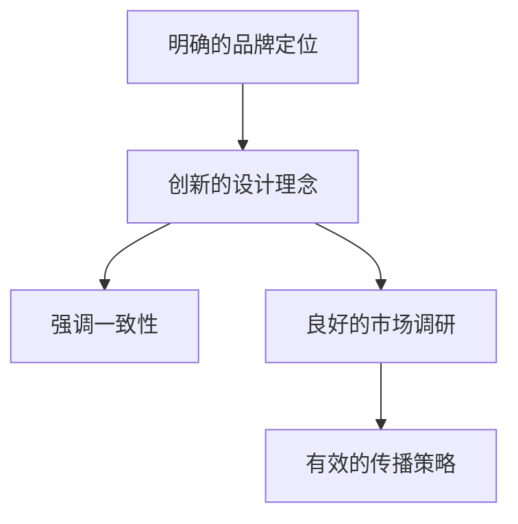

**7.2 案例解析**

**7.2.1 Nike**

Nike是全球知名的运动品牌，其品牌视觉形象设计简洁、现代且富有运动感。Nike的Logo设计采用了独特的“勾形”设计，易于识别且具有强烈的品牌特色。Logo的颜色以红色和黑色为主，红色代表激情和活力，黑色代表专业和神秘。

Nike的品牌视觉形象设计遵循以下成功因素：

- **明确的品牌定位**：Nike的品牌定位是提供高品质的运动产品和服务，其视觉形象设计充分体现了这一品牌定位。
- **创新的设计理念**：Nike的Logo设计独具匠心，结合了运动和品牌特色的元素，创造出独特的视觉形象。
- **强调一致性**：Nike在所有媒介和应用场景中都保持了视觉形象的一致性，从网站到产品包装，从广告到社交媒体，都采用了相同的视觉元素。
- **良好的市场调研**：Nike在品牌视觉形象设计前进行了详细的市场调研，确保设计能够满足目标受众的需求和市场趋势。
- **有效的传播策略**：Nike通过广告、社交媒体和赞助活动等多种渠道，广泛传播其品牌视觉形象，使其在消费者心中建立了强烈的品牌认知。

**7.2.2 Apple**

Apple是全球领先的科技公司，其品牌视觉形象设计简约、优雅且具有科技感。Apple的Logo设计采用了苹果的轮廓，颜色从最初的彩色变为单一的白色，更加简洁、优雅。

Apple的品牌视觉形象设计遵循以下成功因素：

- **明确的品牌定位**：Apple的品牌定位是提供创新和高品质的科技产品和服务，其视觉形象设计充分体现了这一品牌定位。
- **创新的设计理念**：Apple的Logo设计采用了独特的色彩变化，通过简单的形状和颜色，传达出科技感和未来感。
- **强调一致性**：Apple在所有媒介和应用场景中都保持了视觉形象的一致性，无论是Logo、色彩还是图像设计，都体现了品牌的高端定位。
- **良好的市场调研**：Apple在品牌视觉形象设计前进行了详细的市场调研，确保设计能够满足目标受众的需求和市场趋势。
- **有效的传播策略**：Apple通过广告、产品发布会和媒体采访等多种渠道，广泛传播其品牌视觉形象，使其在消费者心中建立了强烈的品牌认知。

**7.2.3 Airbnb**

Airbnb是全球领先的住宿分享平台，其品牌视觉形象设计多样、活力且具有创意。Airbnb的Logo设计采用了彩虹色，代表了品牌的多样性和包容性。

Airbnb的品牌视觉形象设计遵循以下成功因素：

- **明确的品牌定位**：Airbnb的品牌定位是提供个性化的住宿体验，其视觉形象设计充分体现了这一品牌定位。
- **创新的设计理念**：Airbnb的Logo设计采用了独特的彩虹色，通过色彩的变化，传达出多样性和包容性的品牌价值观。
- **强调一致性**：Airbnb在所有媒介和应用场景中都保持了视觉形象的一致性，无论是Logo、色彩还是图像设计，都体现了品牌的活力和创意。
- **良好的市场调研**：Airbnb在品牌视觉形象设计前进行了详细的市场调研，确保设计能够满足目标受众的需求和市场趋势。
- **有效的传播策略**：Airbnb通过广告、社交媒体和用户故事等多种渠道，广泛传播其品牌视觉形象，使其在消费者心中建立了强烈的品牌认知。

#### 第8章：个人品牌视觉形象设计

个人品牌视觉形象设计是个人在职场和社交场合中建立个人品牌的重要手段。一个设计精美的个人品牌视觉形象能够提升个人的专业形象和影响力。

**8.1 个人品牌视觉形象的重要性**

个人品牌视觉形象的重要性体现在以下几个方面：

- **专业形象**：一个设计精美的个人品牌视觉形象能够展示个人的专业素养和职业精神，提升在职场中的竞争力。
- **影响力**：个人品牌视觉形象能够增强个人在社交场合中的影响力，提升个人在行业和社交圈中的地位。
- **认知度**：一个独特的个人品牌视觉形象能够提升个人在目标受众中的认知度，有助于建立个人品牌。
- **品牌认知**：个人品牌视觉形象能够帮助个人在竞争激烈的市场中脱颖而出，建立独特的品牌认知。

**8.1.1 个人品牌视觉形象的定义**

个人品牌视觉形象是指通过视觉元素传达个人品牌形象和个性的系统。它包括个人头像、名片、社交媒体头像、个人网站等。

**8.1.2 个人品牌视觉形象的优势**

个人品牌视觉形象的优势包括：

- **提升专业形象**：一个设计精美的个人品牌视觉形象能够展示个人的专业素养和职业精神，提升在职场中的竞争力。
- **增强影响力**：个人品牌视觉形象能够增强个人在社交场合中的影响力，提升个人在行业和社交圈中的地位。
- **提升认知度**：一个独特的个人品牌视觉形象能够提升个人在目标受众中的认知度，有助于建立个人品牌。
- **品牌认知**：个人品牌视觉形象能够帮助个人在竞争激烈的市场中脱颖而出，建立独特的品牌认知。

**8.1.3 个人品牌视觉形象的设计流程**

个人品牌视觉形象的设计流程包括以下几个步骤：

- **需求分析**：明确个人品牌视觉形象的设计需求，包括设计用途、目标受众、个人品牌定位等。
- **设计构思**：基于需求分析，进行创意构思，确定个人品牌视觉形象的设计风格和元素。
- **设计制作**：使用设计软件（如Photoshop、Illustrator等）制作个人品牌视觉形象的图像和文件。
- **用户反馈**：向用户展示初步设计，收集反馈并进行修改，确保设计符合个人要求。
- **确认与应用**：在用户确认后，将设计应用到个人名片、社交媒体头像、个人网站等各个平台。

** Mermaid 流程图**：

```mermaid
graph TD
    A[需求分析] --> B[设计构思]
    B --> C[设计制作]
    C --> D[用户反馈]
    D --> E[确认与应用]
```

**8.2 个人品牌视觉形象的设计**

个人品牌视觉形象的设计应遵循以下原则：

- **简洁性**：设计应简洁明了，避免过多的细节和元素，突出个人品牌的核心价值。
- **独特性**：设计应具有独特的视觉效果，能够展示个人的个性特点。
- **专业性**：设计应具备专业的视觉效果，展示个人的专业素养和职业精神。
- **一致性**：设计应在不同平台和应用场景中保持一致性，提升品牌认知度。

**8.2.1 个人品牌视觉形象的元素**

个人品牌视觉形象的元素包括：

- **头像**：个人头像应简洁、清晰，展示个人的形象和气质。
- **名片**：个人名片应包含个人姓名、职务、联系方式、个人品牌标语等。
- **社交媒体头像**：社交媒体头像应简洁、独特，展示个人的专业形象。
- **个人网站**：个人网站应展示个人品牌形象、专业技能、项目经历等。

**8.2.2 个人品牌视觉形象的视觉风格**

个人品牌视觉形象的视觉风格应根据个人品牌定位和目标受众来确定。以下是一些常见的视觉风格：

- **现代简约**：适用于科技、设计等行业，以简洁的线条和色彩为主，强调专业性和创新性。
- **古典优雅**：适用于文化、艺术等行业，以古典元素和柔和的色彩为主，强调个性和品味。
- **活力动感**：适用于体育、娱乐等行业，以鲜艳的色彩和动态的元素为主，强调活力和激情。

**8.2.3 个人品牌视觉形象的传播与推广**

个人品牌视觉形象的传播与推广是建立个人品牌的重要环节。以下是一些常见的传播与推广方式：

- **社交媒体**：通过社交媒体平台（如微博、微信、LinkedIn等）发布个人品牌视觉形象，与目标受众互动。
- **个人网站**：建立个人网站，展示个人品牌视觉形象、专业技能和项目经历。
- **线下活动**：参加行业会议、讲座、展览等活动，展示个人品牌视觉形象，扩大个人影响力。
- **合作伙伴**：与行业内的合作伙伴合作，通过合作项目展示个人品牌视觉形象。

**8.3 个人品牌视觉形象设计的工具与资源**

个人品牌视觉形象设计需要使用一些设计工具和资源，以下是一些建议：

- **设计工具**：Adobe Photoshop、Adobe Illustrator、Sketch等。
- **素材资源**：Behance、Dribbble、Unsplash等网站提供大量的免费和付费的设计素材。
- **设计教程**：网上有许多免费的设计教程和课程，可以帮助个人提升设计技能。
- **设计社区**：加入设计社区，与其他设计师交流和学习，获取设计灵感和资源。

### 第9章：视觉设计工具与资源

在视觉设计过程中，选择合适的设计工具和资源是确保设计效果的关键。以下将介绍一些常用的视觉设计工具和资源，以帮助设计师高效地完成设计任务。

#### 9.1 视觉设计工具介绍

视觉设计工具是设计师进行创作的重要工具，以下是一些常用的视觉设计工具：

**9.1.1 Adobe Photoshop**

Adobe Photoshop 是一款功能强大的图像处理软件，广泛用于照片编辑、图像合成和视觉设计。其提供了丰富的工具和插件，适用于各种视觉设计需求。

**9.1.2 Adobe Illustrator**

Adobe Illustrator 是一款专业的矢量图形设计软件，适用于创建标志、插图、排版和图标等设计。其强大的矢量编辑功能和灵活的色彩管理使其成为专业设计师的首选工具。

**9.1.3 Sketch**

Sketch 是一款专为UI/UX设计而生的矢量图形设计软件，以其简洁的界面和强大的设计功能受到设计师的喜爱。其支持多种操作系统，适用于移动设备和网页设计。

**9.1.4 Figma**

Figma 是一款基于网页的界面设计工具，支持多人协作。其提供了丰富的设计模板和组件库，适用于移动应用、网页和网站设计。

**9.1.5 Canva**

Canva 是一款易于使用的图形设计工具，提供了丰富的设计模板和素材库。适用于非专业设计师和小型企业进行海报、名片、社交媒体图片等设计。

#### 9.2 设计素材的获取

设计素材是视觉设计的重要资源，以下是一些获取设计素材的途径：

**9.2.1 免费素材库**

- **Unsplash**：提供高质量的免费高清照片，适合用于设计背景和图像。
- **Pixabay**：提供大量的免费图片、矢量图和视频素材，适用于商业用途。
- **Pexels**：提供免费的图片和视频素材，可用于个人和商业用途。

**9.2.2 付费素材库**

- **Shutterstock**：提供高质量的付费图片、视频和音乐素材，适用于商业用途。
- **iStock**：提供各种付费图片、视频和插图素材，适用于商业用途。
- **Getty Images**：提供高质量的付费图片和视频素材，适用于商业用途。

**9.2.3 自定义素材**

设计师也可以通过以下方式获取自定义素材：

- **摄影**：使用相机拍摄自己的图片，适用于个性化设计。
- **插画**：委托插画师创作独特的插画作品，适用于品牌形象设计。
- **编程**：使用代码生成独特的图形和图案，适用于数字艺术和UI设计。

#### 9.3 设计资源的分享平台

设计资源的分享平台是设计师获取灵感、资源和交流的重要渠道，以下是一些知名的设计资源分享平台：

**9.3.1 Behance**

Behance 是 Adobe 推出的设计师展示平台，汇集了全球各地的设计作品。设计师可以在这里展示自己的作品，获取反馈和灵感。

**9.3.2 Dribbble**

Dribbble 是一个设计师社区，设计师可以上传自己的设计作品，与其他设计师交流。它提供了丰富的设计灵感和创意。

**9.3.3 Awwwards**

Awwwards 是一个专注于网站设计的奖项平台，展示了全球优秀的网站设计作品。设计师可以在这里发现最新的设计趋势和灵感。

**9.3.4 Medium**

Medium 是一个内容创作平台，许多设计师和创意人士在这里发布设计文章和教程。设计师可以在这里学习和分享设计经验。

### 附录A：品牌视觉形象设计指南

品牌视觉形象设计是品牌传播和市场营销的重要组成部分。一个成功的品牌视觉形象设计能够提升品牌的认知度、信任度和忠诚度。以下是一份品牌视觉形象设计指南，以帮助设计师和企业实现这一目标。

#### A.1 品牌视觉形象设计的基本原则

品牌视觉形象设计的基本原则包括简洁性、独特性、易记性、一致性和专业性。以下是对这些原则的详细解释：

**简洁性**：品牌视觉形象应简洁明了，避免过多的细节和元素。简洁的设计能够吸引消费者的注意力，并使其更容易记住。

**独特性**：品牌视觉形象应具有独特的视觉效果，以区分其他品牌。独特的设计能够吸引消费者的注意力，并使其在众多竞争者中脱颖而出。

**易记性**：品牌视觉形象应易于记忆，便于消费者识别。易记的设计能够提升品牌在消费者心中的认知度。

**一致性**：品牌视觉形象应在所有媒介和应用场景中保持一致性。一致性能够提升品牌在消费者心中的认知度和记忆点。

**专业性**：品牌视觉形象应具备专业的视觉效果，展示品牌的专业性和可信度。

#### A.2 品牌视觉形象设计的流程

品牌视觉形象设计的流程包括以下步骤：

**1. 品牌调研与分析**：了解品牌的历史、目标受众、市场定位和竞争对手。通过调研和分析，明确品牌的核心价值和设计方向。

**2. 设计目标与策略**：根据品牌调研的结果，制定品牌视觉形象设计的目标和策略。明确设计风格、色彩方案和视觉元素等。

**3. 创意构思与草图**：基于设计目标和策略，进行创意构思并绘制草图。草图应体现品牌的核心价值和设计风格。

**4. 设计制作与修改**：将草图转化为具体的视觉设计，并进行多次修改和完善。设计制作过程中要注重细节和实用性。

**5. 评估与测试**：对设计完成的品牌视觉形象进行评估和测试，确保它能够满足品牌需求并在各种应用场景中保持一致性。

**6. 确认与应用**：在评估和测试通过后，确认品牌视觉形象并开始在不同媒介和应用场景中应用。

#### A.3 品牌视觉形象设计的案例分析

以下是对几个成功品牌视觉形象设计的案例分析：

**案例一：Nike**

Nike 的品牌视觉形象设计简洁、现代且富有运动感。Nike 的Logo设计采用了独特的“勾形”设计，易于识别且具有强烈的品牌特色。Logo的颜色以红色和黑色为主，红色代表激情和活力，黑色代表专业和神秘。

Nike 的品牌视觉形象设计遵循以下成功因素：

- **简洁性**：Nike 的Logo设计简洁明了，避免复杂的细节。
- **独特性**：Nike 的Logo设计独特，具有强烈的品牌特色。
- **易记性**：Nike 的Logo设计易于记忆，消费者能够快速识别。

**案例二：Apple**

Apple 的品牌视觉形象设计简约、优雅且具有科技感。Apple 的Logo设计采用了苹果的轮廓，颜色从最初的彩色变为单一的白色，更加简洁、优雅。

Apple 的品牌视觉形象设计遵循以下成功因素：

- **简洁性**：Apple 的Logo设计简洁明了，避免复杂的细节。
- **独特性**：Apple 的Logo设计独特，体现了品牌的高端定位。
- **一致性**：Apple 在所有媒介和应用场景中都保持了视觉形象的一致性。

**案例三：Airbnb**

Airbnb 的品牌视觉形象设计多样、活力且具有创意。Airbnb 的Logo设计采用了彩虹色，代表了品牌的多样性和包容性。

Airbnb 的品牌视觉形象设计遵循以下成功因素：

- **独特性**：Airbnb 的Logo设计独特，通过彩虹色传达了品牌的多样性和包容性。
- **一致性**：Airbnb 在所有媒介和应用场景中都保持了视觉形象的一致性。
- **易记性**：Airbnb 的Logo设计易于记忆，消费者能够快速识别。

### 附录B：视觉设计常见问题解答

在视觉设计过程中，设计师可能会遇到各种问题。以下是一些常见问题及其解答，以帮助设计师解决实际设计中的困难。

#### B.1 设计风格不统一

**问题**：设计作品在整体风格上不够统一。

**解答**：
- **检查视觉元素**：确保所有的视觉元素（如颜色、字体、图像等）都符合设计规范。
- **统一设计流程**：在设计过程中，确保所有设计阶段都遵循相同的设计风格。
- **设计模板**：使用设计模板可以帮助保持整体风格的一致性。

#### B.2 色彩搭配不当

**问题**：设计作品中的色彩搭配不协调。

**解答**：
- **了解色彩理论**：学习色彩理论，了解不同颜色的搭配规则。
- **使用色彩搭配工具**：使用在线色彩搭配工具（如Coolors、Adobe Color等）帮助选择合适的颜色搭配。
- **测试反馈**：在实际应用中测试色彩搭配，收集用户反馈进行调整。

#### B.3 元素不协调

**问题**：设计作品中的元素（如字体、图像、形状等）不够协调。

**解答**：
- **平衡对比**：通过对比和平衡来提升元素间的协调性。使用大小、颜色、形状等元素来创造视觉上的平衡。
- **统一格式**：确保所有元素都遵循相同的设计格式，如字体大小、行距、边距等。
- **减少元素数量**：避免过多元素导致设计混乱，精简设计元素，突出重点。

#### B.4 设计可读性差

**问题**：设计作品的文本可读性差。

**解答**：
- **字体选择**：选择清晰易读的字体，避免使用过于复杂或装饰性的字体。
- **文本对比**：确保文本与背景颜色有足够的对比度，提高可读性。
- **字体大小**：确保文本大小适中，避免过小或过大影响可读性。

#### B.5 设计过于复杂

**问题**：设计作品过于复杂，难以理解。

**解答**：
- **简化设计**：简化设计元素，去除不必要的细节，突出重点。
- **分步骤设计**：将复杂的设计分解为简单的步骤，逐步完成。
- **用户测试**：进行用户测试，收集反馈，根据用户需求进行调整。

### 附录C：品牌视觉形象设计案例研究

以下是对几个成功的品牌视觉形象设计案例进行详细研究和分析，以探讨其成功因素和设计要点。

#### C.1 Nike

**Nike** 是一家全球知名的运动品牌，其品牌视觉形象设计以其简洁、现代和富有运动感而著称。

**设计要点**：
- **简洁性**：Nike 的Logo设计简洁明了，仅由一个“勾形”符号组成，易于识别。
- **独特性**：Nike 的Logo设计独特，与其他品牌区分开来，增强了品牌的认知度。
- **运动感**：Nike 的视觉形象设计中融入了运动元素，如动态的线条和形状，传达出品牌的核心价值。

**成功因素**：
- **一致性**：Nike 在所有媒介和应用场景中都保持了视觉形象的一致性。
- **创新性**：Nike 的设计不断推陈出新，适应市场的变化和消费者的需求。
- **品牌理念**：Nike 的视觉形象设计紧密围绕品牌理念，传达出品牌的专业性和创新精神。

**案例结论**：Nike 的品牌视觉形象设计成功在于其简洁、独特和富有运动感的设计风格，以及始终如一的品牌视觉形象。

#### C.2 Apple

**Apple** 是一家全球领先的科技公司，其品牌视觉形象设计以其简约、优雅和科技感而闻名。

**设计要点**：
- **简约性**：Apple 的Logo设计简约，仅由一个苹果的轮廓和咬痕组成，传达出品牌的高端和现代感。
- **优雅性**：Apple 的视觉形象设计中融入了优雅的元素，如柔和的线条和精致的细节，传达出品牌的高端和精致。
- **科技感**：Apple 的视觉形象设计中融入了科技元素，如简洁的界面和未来感的设计，传达出品牌的创新和前瞻性。

**成功因素**：
- **品牌理念**：Apple 的视觉形象设计紧密围绕品牌理念，传达出品牌的专业性、创新性和高品质。
- **市场调研**：Apple 在设计视觉形象前进行了详细的市场调研，确保设计能够满足消费者的需求和市场趋势。
- **一致性**：Apple 在所有媒介和应用场景中都保持了视觉形象的一致性。

**案例结论**：Apple 的品牌视觉形象设计成功在于其简约、优雅和科技感的设计风格，以及始终如一的品牌视觉形象。

#### C.3 Airbnb

**Airbnb** 是一家全球领先的住宿分享平台，其品牌视觉形象设计以其多样、活力和创意而著称。

**设计要点**：
- **多样性**：Airbnb 的Logo设计采用了彩虹色，代表品牌的多样性和包容性，传达出品牌的核心价值观。
- **活力感**：Airbnb 的视觉形象设计中融入了活力和创意的元素，如动态的线条和有趣的图案，传达出品牌的活力和创意。
- **创意性**：Airbnb 的视觉形象设计中注重创意，通过独特的视觉语言传达出品牌的个性。

**成功因素**：
- **品牌理念**：Airbnb 的视觉形象设计紧密围绕品牌理念，传达出品牌的多样性和包容性。
- **创新性**：Airbnb 的设计不断创新，适应市场的变化和消费者的需求。
- **用户体验**：Airbnb 的视觉形象设计注重用户体验，通过多样化的设计元素提升用户的互动和参与感。

**案例结论**：Airbnb 的品牌视觉形象设计成功在于其多样、活力和创意的设计风格，以及始终如一的品牌视觉形象。

### 附录D：个人品牌视觉形象设计指南

个人品牌视觉形象设计是展示个人专业形象和品牌价值的重要手段。以下是一份个人品牌视觉形象设计指南，以帮助个人设计师或专业人士打造具有吸引力和一致性的个人品牌视觉形象。

#### D.1 个人品牌视觉形象设计的基本原则

个人品牌视觉形象设计应遵循以下基本原则：

- **简洁性**：设计应简洁明了，避免过多的细节和元素，突出个人品牌的核心价值和特点。
- **独特性**：设计应具有独特的视觉效果，以区分其他个人品牌，并展示个人的独特性和个性。
- **易记性**：设计应易于记忆，便于个人在职场和社交场合中被他人快速识别。
- **一致性**：设计应在所有媒介和应用场景中保持一致，以增强个人品牌在受众中的认知度。
- **专业性**：设计应具备专业的视觉效果，展示个人的专业素养和职业精神。

#### D.2 个人品牌视觉形象设计的流程

个人品牌视觉形象设计的流程包括以下几个步骤：

1. **需求分析**：明确个人品牌视觉形象的设计需求，包括设计用途、目标受众、个人品牌定位等。
2. **设计构思**：基于需求分析，进行创意构思，确定个人品牌视觉形象的设计风格和元素。
3. **设计制作**：使用设计软件（如Photoshop、Illustrator等）制作个人品牌视觉形象的图像和文件。
4. **用户反馈**：向用户展示初步设计，收集反馈并进行修改，确保设计符合个人要求。
5. **确认与应用**：在用户确认后，将设计应用到个人名片、社交媒体头像、个人网站等各个平台。

#### D.3 个人品牌视觉形象的设计要点

个人品牌视觉形象的设计要点包括以下几个方面：

- **头像设计**

