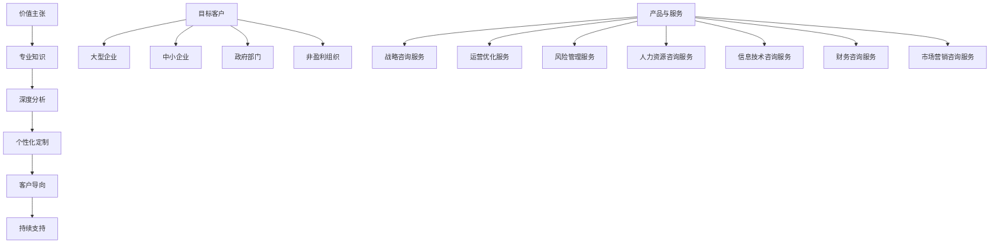
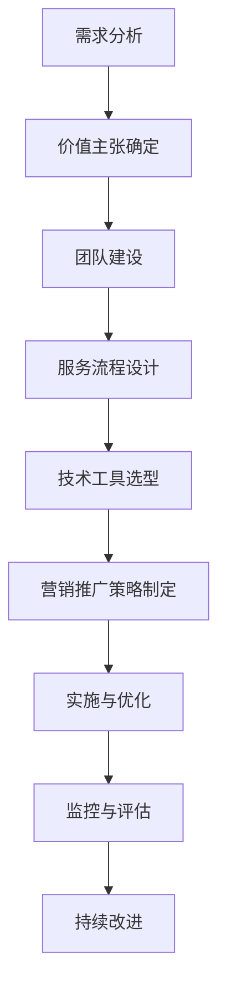

                 

## 文章标题

# 打造知识付费的专业咨询服务模式

> 关键词：知识付费、专业咨询服务、模式构建、创新策略、案例解析

> 摘要：本文将深入探讨知识付费背景下如何打造专业咨询服务模式，分析其核心概念、架构设计、运营管理、创新策略以及实际案例，为企业和个人提供实用的指导。

---

### 目录大纲：

## 第一部分：引言与背景

### 第1章：知识付费的崛起

#### 1.1.1 什么是知识付费

#### 1.1.2 知识付费的发展历程

#### 1.1.3 知识付费的市场现状

### 第2章：专业咨询服务模式概述

#### 2.1.1 专业咨询服务的定义

#### 2.1.2 专业咨询服务模式的种类

#### 2.1.3 知识付费与专业咨询服务的关系

### 第3章：打造专业咨询服务模式的重要性

#### 3.1.1 专业咨询服务模式对企业的影响

#### 3.1.2 知识付费对专业咨询服务模式的挑战

#### 3.1.3 成功打造专业咨询服务模式的关键因素

## 第二部分：核心概念与架构

### 第4章：专业咨询服务模式的核心概念

#### 4.1.1 专业咨询服务的价值主张

#### 4.1.2 专业咨询服务的目标客户

#### 4.1.3 专业咨询服务的产品与服务

### 第5章：专业咨询服务模式的架构

#### 5.1.1 模式架构的组成部分

#### 5.1.2 模式架构的设计原则

#### 5.1.3 模式架构的实施步骤

### 第6章：专业咨询服务的运营与管理

#### 6.1.1 运营管理的关键要素

#### 6.1.2 人才管理与团队建设

#### 6.1.3 客户关系管理

### 第7章：打造专业咨询服务模式的创新策略

#### 7.1.1 创新思维与工具

#### 7.1.2 创新产品与服务设计

#### 7.1.3 创新营销与推广策略

## 第三部分：项目实战

### 第8章：打造知识付费专业咨询服务模式案例解析

#### 8.1.1 案例背景介绍

#### 8.1.2 案例实施步骤

#### 8.1.3 案例成功要素分析

### 第9章：实战工具与方法

#### 9.1.1 常用工具介绍

#### 9.1.2 实战方法与技巧

#### 9.1.3 实战案例解析

### 第10章：总结与展望

#### 10.1.1 专业咨询服务模式发展的趋势

#### 10.1.2 知识付费未来的发展空间

#### 10.1.3 个人与企业如何抓住机遇

## 附录

### 附录A：专业咨询服务模式构建工具与资源

#### A.1.1 常用工具与平台介绍

#### A.1.2 知识付费领域经典案例研究

### 附录B：专业咨询服务模式构建指南

#### B.1.1 构建流程图解

#### B.1.2 实施步骤与注意事项

#### B.1.3 风险管理策略

## 图表与公式

### 图1：专业咨询服务模式架构图

### 公式1：知识付费ROI计算模型

### 公式2：客户满意度计算模型

### 伪代码示例

---

接下来，我们将按照目录结构，逐步深入探讨知识付费背景下的专业咨询服务模式。首先，我们从知识付费的崛起开始，了解这一新兴领域的起源和发展现状。随后，我们将探讨专业咨询服务模式的核心概念与架构设计，为后续内容打下基础。在接下来的章节中，我们将分析专业咨询服务模式的重要性，运营与管理的关键要素，以及创新策略。随后，通过实际案例的解析，我们将展示如何具体实施和优化专业咨询服务模式。最后，我们将总结专业咨询服务模式的发展趋势，并提出个人和企业如何抓住知识付费机遇的建议。在附录部分，我们将提供构建专业咨询服务模式的工具与资源，以及构建指南。通过这篇文章，希望读者能够对知识付费背景下的专业咨询服务模式有一个全面而深入的了解。

---

### 第1章：知识付费的崛起

#### 1.1.1 什么是知识付费

知识付费，顾名思义，是指用户为了获取特定的知识和信息而支付一定费用的一种商业模式。这种模式源于用户对高质量内容和专业知识的强烈需求，以及互联网技术特别是移动互联网的发展。在知识付费的背景下，用户不再是免费获取信息的被动接受者，而是主动支付者，他们的消费行为直接推动了知识经济的繁荣。

知识付费的兴起可以追溯到21世纪初，随着互联网的普及和人们生活水平的提高，人们开始意识到获取高质量知识的重要性。传统教育模式和内容供给方式已经无法满足日益增长的学习需求，知识付费因此应运而生。从最初的线上课程、电子书籍，到现在的知识直播、短视频教程，知识付费的形态不断丰富和演化。

知识付费的核心在于为用户提供有价值的知识和信息，帮助他们在职业发展、技能提升、兴趣爱好等方面取得进步。它不仅仅是一种商业模式，更是一种知识传播和学习的革命。通过付费，用户能够获得更专业、更系统的知识内容，同时，内容提供者也能通过知识付费获得合理的报酬，实现知识价值的最大化。

#### 1.1.2 知识付费的发展历程

知识付费的发展历程可以分为三个主要阶段：

1. **起步阶段（2005-2010年）**：
   知识付费的萌芽期。这一阶段以传统线上教育平台和电子书籍销售为主要形式。代表性的平台如新东方、沪江网等，通过线上课程和电子书籍为用户提供专业知识和服务。尽管市场规模相对较小，但为后来的知识付费浪潮奠定了基础。

2. **快速发展阶段（2011-2016年）**：
   知识付费逐渐进入高速发展期。这一阶段，随着移动互联网的普及，知识付费的形式更加多样化。知识共享平台如知乎、分答等，通过问答社区和语音问答等形式，为用户提供了更加灵活和即时的知识获取途径。同时，专业在线教育平台如网易云课堂、慕课网等，也吸引了大量用户，推动了知识付费市场的扩展。

3. **成熟阶段（2017年至今）**：
   知识付费进入成熟期，市场规模持续扩大，形式不断创新。短视频知识分享、知识直播、专业课程订阅等新兴形式不断涌现。同时，内容生产者的多样化，也为知识付费市场带来了丰富的内容供给。这一阶段，知识付费已经渗透到人们生活的方方面面，成为了一种常态化的消费行为。

#### 1.1.3 知识付费的市场现状

当前，知识付费市场呈现出以下几个显著特点：

1. **市场规模不断扩大**：
   根据相关报告，知识付费市场的规模已经从2016年的500亿元增长到2021年的2000亿元，年复合增长率达到31.6%。预计未来几年，这一市场规模将继续保持高速增长，到2025年有望突破5000亿元。

2. **用户群体扩大**：
   知识付费用户群体从早期的专业人士逐渐扩展到普通大众，尤其是年轻一代。根据调研数据显示，18-35岁的用户占据了知识付费市场的主要份额，这一群体的消费能力和求知欲望较强。

3. **内容形式多样化**：
   知识付费的内容形式越来越多样化，从传统的课程、书籍，到短视频、直播、线上社群等，用户可以根据自己的需求和偏好选择适合的内容形式。同时，内容生产者的多样化也丰富了知识付费市场的供给。

4. **行业细分**：
   随着市场的成熟，知识付费行业逐渐呈现出细分化的趋势。教育培训、技能提升、兴趣爱好、职场发展等不同领域都有专门的知识付费平台和内容生产者。这种细分化的趋势有助于满足用户多样化的需求，提高知识付费的效率和质量。

#### 1.1.4 知识付费的主要形式

知识付费的主要形式包括以下几种：

1. **在线课程**：
   在线课程是知识付费最常见的形式之一。用户可以通过平台购买和观看课程，内容包括专业技能培训、学术课程、兴趣课程等。在线课程具有灵活性高、互动性强的特点，满足了用户在不同场景下的学习需求。

2. **电子书籍**：
   电子书籍是一种便捷的知识获取方式。用户可以通过购买或租赁的方式，在线阅读或下载书籍。与纸质书籍相比，电子书籍具有携带方便、更新及时等优点，受到了广大用户的喜爱。

3. **知识直播**：
   知识直播是一种新兴的知识传播形式，通过直播平台进行实时授课、答疑和互动。知识直播不仅能够提供即时的知识服务，还能通过互动增强用户的学习体验。

4. **线上社群**：
   线上社群是一种基于兴趣或行业的小组讨论形式。用户可以在社群中分享知识、交流经验，通过互动获得更多的信息和支持。线上社群具有高黏性和强互动性的特点，有助于用户建立深度联系。

5. **专业咨询**：
   专业咨询是知识付费的高级形式，通常由行业专家提供一对一或小范围的知识服务。用户可以通过付费获取专业咨询，解决具体问题和提供决策建议。

#### 1.1.5 知识付费的优势与挑战

知识付费的优势主要体现在以下几个方面：

1. **提高知识获取效率**：
   知识付费提供了系统化、专业化的知识内容，用户可以快速获取所需知识，提高学习效率。

2. **满足个性化需求**：
   知识付费平台提供了丰富的内容形式和多样化的选择，用户可以根据自己的需求和偏好进行个性化选择。

3. **促进知识共享与创新**：
   知识付费促进了知识的传播和共享，激发了更多的创新和创意。

然而，知识付费也面临一些挑战：

1. **内容质量参差不齐**：
   知识付费市场的内容质量参差不齐，部分内容可能缺乏深度和实用性，影响用户体验。

2. **用户信任问题**：
   用户对知识付费平台的信任度有待提高，特别是对内容提供者的背景和资质的信任。

3. **市场竞争激烈**：
   随着知识付费市场的不断扩大，市场竞争日益激烈，平台需要不断创新和优化服务，以保持竞争力。

### 第2章：专业咨询服务模式概述

#### 2.1.1 专业咨询服务的定义

专业咨询服务是一种以专业知识和经验为基础，为客户提供决策支持、问题解决和策略规划的服务形式。它不同于普通的顾问服务，更强调专业性和深度。专业咨询服务通常涉及复杂的业务领域，如战略咨询、财务管理、人力资源管理、信息技术咨询等。

专业咨询服务的特点包括：

1. **专业性**：专业咨询服务由具有丰富行业经验和专业资质的专家提供，能够为客户提供高质量的专业意见和解决方案。

2. **定制性**：专业咨询服务通常根据客户的具体需求和问题，提供定制化的解决方案，确保服务的针对性和有效性。

3. **系统性**：专业咨询服务不仅关注问题的表面现象，更深入分析问题背后的原因和潜在风险，提供全面的解决方案。

4. **持续性**：专业咨询服务往往是一个持续的过程，包括问题诊断、方案制定、实施指导和效果评估等阶段，确保问题的彻底解决。

#### 2.1.2 专业咨询服务模式的种类

专业咨询服务模式可以根据不同的分类标准，分为多种类型：

1. **按照服务领域分类**：
   - **战略咨询**：帮助企业制定长远发展战略，包括市场定位、竞争策略、组织架构优化等。
   - **财务管理咨询**：提供财务规划、成本控制、风险管理和投资决策等服务。
   - **人力资源管理咨询**：包括人才招聘、绩效管理、员工培训和发展等。
   - **信息技术咨询**：提供信息技术战略规划、系统架构设计、网络安全等服务。

2. **按照服务形式分类**：
   - **现场服务**：咨询专家直接到客户现场进行调研、分析和解决问题。
   - **远程服务**：通过电话、视频会议、邮件等方式进行咨询服务。

3. **按照服务周期分类**：
   - **短期咨询**：通常针对特定问题的短期解决方案。
   - **长期咨询**：提供持续的咨询服务，涵盖多个项目或阶段。

4. **按照客户对象分类**：
   - **企业咨询服务**：主要为大型企业、跨国公司提供专业咨询服务。
   - **中小企业服务**：针对中小企业的特点和需求，提供定制化的咨询服务。
   - **个人咨询服务**：为个人提供职业规划、技能提升等咨询服务。

#### 2.1.3 知识付费与专业咨询服务的关系

知识付费与专业咨询服务之间存在着密切的关系。知识付费是专业咨询服务的一种重要实现形式，它为专业咨询服务提供了资金支持和市场需求。以下是知识付费与专业咨询服务之间的几个关键联系：

1. **知识付费是专业咨询服务的主要收入来源**：
   专业咨询服务机构通过知识付费模式，将专业知识转化为有形的商品或服务，从而实现商业化运作。知识付费为专业咨询服务提供了稳定的收入来源，支持咨询机构的发展和扩张。

2. **知识付费促进了专业服务的普及和推广**：
   知识付费降低了用户获取专业服务的门槛，使得更多用户能够接触到高质量的专业知识。通过在线课程、电子书籍、知识直播等形式，专业咨询服务得以更广泛地传播，提高了行业整体的认知度和影响力。

3. **知识付费推动了专业服务的创新**：
   面对激烈的市场竞争和用户多样化的需求，专业咨询服务机构需要不断创新服务形式和内容，以吸引和留住用户。知识付费模式为专业咨询服务提供了创新的动力，促进了服务模式、内容生产和营销策略的不断创新。

4. **知识付费与专业咨询服务的协同发展**：
   知识付费和专业化服务是相互促进、协同发展的关系。专业咨询服务机构通过提供高质量的专业服务，积累了丰富的案例经验和行业知识，这些知识又可以转化为付费的知识产品，形成知识付费的闭环。同时，知识付费模式为专业咨询服务提供了资金支持，使得机构能够持续进行技术研发和人才培养，进一步提升服务质量。

#### 2.1.4 知识付费对专业咨询服务模式的影响

知识付费的兴起对专业咨询服务模式产生了深远的影响，具体表现在以下几个方面：

1. **市场需求变化**：
   知识付费使得更多用户愿意为专业服务付费，扩大了专业咨询服务市场的需求。特别是随着互联网技术的发展，用户获取知识的途径更加便捷，对专业服务的需求也更加多样化和个性化。

2. **服务形式创新**：
   知识付费推动了专业咨询服务形式的创新。传统的现场咨询服务逐渐向远程服务转变，通过电话、视频会议、在线培训等形式提供专业服务，提高了服务的覆盖面和效率。同时，知识直播、在线社群等新兴形式也为用户提供了更多互动和体验的机会。

3. **内容生产升级**：
   知识付费促使专业咨询服务机构加强内容生产，提升知识内容的深度和实用性。为了满足用户多样化的需求，咨询机构需要不断更新和优化知识产品，提供更具价值的服务。

4. **竞争格局变化**：
   知识付费带来了专业咨询服务市场的竞争加剧。传统咨询机构和新兴平台纷纷进入这一领域，市场竞争日益激烈。专业咨询服务机构需要通过差异化竞争策略，提高自身的服务质量和品牌影响力。

5. **服务价格调整**：
   知识付费模式对专业咨询服务的价格产生了影响。随着市场供需关系的变化，咨询服务的价格也在不断调整。一些高质量的专业服务可能价格较高，而一些标准化、低门槛的知识产品则价格相对较低。

#### 2.1.5 知识付费在专业咨询服务中的应用案例

以下是几个知识付费在专业咨询服务中应用的案例：

1. **培训课程**：
   一家知名咨询公司通过线上平台推出了一系列针对企业中高管的培训课程，包括领导力培训、财务管理培训等。这些课程通过视频讲解、互动讨论等形式，帮助学员提升专业技能和管理水平。

2. **在线咨询**：
   一位资深人力资源管理专家通过线上平台提供一对一的咨询服务，用户可以通过预约获得专家的个性化建议和解决方案。这种形式不仅方便用户，也提高了专家的利用率。

3. **知识直播**：
   一位知名财务顾问通过直播平台定期举办财务管理专题讲座，用户可以通过直播观看并提问，与专家实时互动。这种形式不仅增加了用户的参与感，也提高了知识的传播效率。

4. **知识社群**：
   一家专业咨询服务公司通过线上社群为会员提供长期的知识分享和交流平台。会员可以在这里分享经验、讨论问题，并获取专业的指导和反馈。

通过这些案例，我们可以看到知识付费在专业咨询服务中的多样化和创新性应用，不仅丰富了服务形式，也为用户提供了更多获取专业知识的途径。

### 第3章：打造专业咨询服务模式的重要性

#### 3.1.1 专业咨询服务模式对企业的影响

专业咨询服务模式对企业的发展具有深远的影响，主要体现在以下几个方面：

1. **提升企业竞争力**：
   专业咨询服务能够为企业提供专业的战略规划、市场分析、技术解决方案等，帮助企业把握市场机遇，规避经营风险，从而提升企业的竞争力。例如，通过专业的市场调研和分析，企业可以更加精准地定位市场，优化产品和服务，提高市场份额。

2. **优化管理流程**：
   专业咨询服务可以帮助企业优化内部管理流程，提高运营效率。例如，通过流程再造和优化，企业可以减少不必要的环节，提高工作效率，降低运营成本。

3. **提供创新动力**：
   专业咨询服务往往能够带来新的思维和方法，激发企业的创新活力。专业咨询机构具有丰富的行业经验和创新思维，可以为企业提供新的业务模式、技术方案和市场策略，推动企业的持续创新。

4. **增强风险管理能力**：
   专业咨询服务可以帮助企业建立和完善风险管理体系，提高风险预测和应对能力。例如，通过财务风险管理咨询，企业可以更好地应对市场波动和财务风险，确保企业稳健发展。

#### 3.1.2 知识付费对专业咨询服务模式的挑战

知识付费对专业咨询服务模式提出了新的挑战，主要体现在以下几个方面：

1. **市场竞争加剧**：
   随着知识付费市场的扩大，越来越多的企业和个人进入专业咨询服务领域，市场竞争日益激烈。专业咨询服务机构需要通过差异化竞争策略，提高自身的服务质量和品牌影响力，以吸引和留住客户。

2. **内容质量参差不齐**：
   知识付费市场的内容质量参差不齐，部分内容可能缺乏深度和实用性，影响用户体验。专业咨询服务机构需要确保提供高质量的专业内容，建立用户信任，提高市场竞争力。

3. **用户需求多样化**：
   知识付费用户的需求越来越多样化，对专业咨询服务的要求也更高。专业咨询服务机构需要深入了解用户需求，提供个性化、定制化的服务，以满足用户的多样化需求。

4. **技术革新带来的影响**：
   互联网和人工智能等技术的发展，改变了知识付费的形式和内容生产方式。专业咨询服务机构需要不断适应新技术，创新服务模式，提高服务效率和质量。

#### 3.1.3 成功打造专业咨询服务模式的关键因素

要成功打造专业咨询服务模式，企业需要关注以下几个关键因素：

1. **明确价值主张**：
   企业需要明确自身的价值主张，即提供什么样的专业服务，能够解决客户哪些问题，为客户创造什么价值。价值主张是企业服务的核心，是吸引和留住客户的关键。

2. **专业化团队**：
   专业咨询服务模式的成功离不开专业化团队的支持。企业需要组建一支具有丰富行业经验和专业资质的专家团队，确保提供高质量的专业服务。

3. **创新能力**：
   专业咨询服务机构需要具备持续的创新能力，不断推出新的服务内容和形式，以满足用户多样化的需求。创新可以来源于新技术、新思维、新方法，也可以来源于对现有服务的改进和优化。

4. **客户关系管理**：
   企业需要建立完善的客户关系管理体系，包括客户需求分析、服务跟踪、反馈收集和满意度评估等环节，确保客户的需求得到及时响应和满足。

5. **营销策略**：
   有效的营销策略可以帮助企业扩大知名度和影响力，吸引更多客户。企业可以通过线上线下多种渠道，结合社交媒体、内容营销、品牌推广等方式，提高市场占有率。

6. **持续优化**：
   企业需要持续优化专业咨询服务模式，根据市场反馈和客户需求，不断改进服务流程、内容和形式，提高服务质量和用户满意度。

通过以上关键因素的综合应用，企业可以成功打造专业咨询服务模式，实现持续发展和市场竞争力的提升。

### 第4章：专业咨询服务模式的核心概念

#### 4.1.1 专业咨询服务的价值主张

专业咨询服务的价值主张是指专业咨询服务机构通过其专业能力和经验，为客户提供的独特价值。这一价值主张不仅是咨询服务的核心驱动力，也是吸引客户的关键因素。以下是专业咨询服务价值主张的几个关键要素：

1. **专业知识**：
   专业咨询服务机构的核心竞争力在于其拥有的专业知识。这些专业知识来源于专家的长期实践积累、行业经验以及最新的学术研究成果。专业知识是提供高质量咨询服务的基础，能够帮助客户解决复杂的问题，实现业务目标。

2. **深度分析**：
   专业咨询服务不仅仅是提供表面的信息和建议，更重要的是进行深度分析。通过对客户业务环境的全面了解和深入分析，专业咨询服务机构能够发现问题的本质，提供具有前瞻性和可操作性的解决方案。

3. **个性化定制**：
   每个客户的需求都是独特的，专业咨询服务机构需要提供个性化定制的服务。这意味着服务内容、方案和实施步骤都要根据客户的实际情况进行调整，确保解决方案具有针对性和有效性。

4. **客户导向**：
   专业咨询服务机构的服务宗旨是围绕客户的需求和利益展开。从客户的角度出发，提供真正符合客户期望的服务，是专业咨询服务机构价值主张的重要组成部分。

5. **持续支持**：
   专业咨询服务不仅仅是一次性的事件，而是一个持续的过程。专业咨询服务机构需要提供长期的支持，包括方案的跟踪和调整、客户反馈的收集和处理等，确保客户能够在实施过程中获得持续的帮助。

#### 4.1.2 专业咨询服务的目标客户

专业咨询服务的目标客户群体是多样化的，不同的客户群体对专业咨询服务有不同的需求和期望。以下是几个主要的客户群体及其需求特点：

1. **大型企业**：
   大型企业通常具有复杂的业务结构和较高的管理难度，对专业咨询服务有较高的需求。这些企业通常需要解决的战略问题、运营优化、风险管理等方面的问题。它们更倾向于选择具有广泛行业经验和深厚专业知识的咨询服务机构。

2. **中小企业**：
   中小企业由于资源和能力的限制，往往更加依赖专业咨询服务来解决业务发展中的关键问题。这些企业通常关注成本效益、市场拓展、技术创新等方面的需求，希望借助专业咨询服务实现快速成长和业务突破。

3. **政府部门**：
   政府部门对专业咨询服务也有较高的需求，特别是在公共管理、政策制定和公共事务管理等方面。政府部门需要专业咨询服务机构提供数据分析和决策支持，以确保政策的有效性和可行性。

4. **非盈利组织**：
   非盈利组织，如慈善机构、非政府组织和学术机构等，也需要专业咨询服务来优化运营和管理、提升服务质量。这些组织通常关注成本控制、资源管理和项目评估等方面的需求。

#### 4.1.3 专业咨询服务的产品与服务

专业咨询服务的产品和服务是咨询机构的核心业务，涵盖了多种形式和内容。以下是专业咨询服务的一些主要产品和服务类型：

1. **战略咨询服务**：
   战略咨询服务帮助企业制定长期发展战略，包括市场定位、竞争策略、组织架构优化等。通过战略咨询服务，企业能够明确发展方向，优化资源配置，提升整体竞争力。

2. **运营优化服务**：
   运营优化服务旨在帮助企业提高运营效率，降低成本。这包括生产流程优化、供应链管理、质量管理等方面的咨询和改进。

3. **风险管理服务**：
   风险管理服务帮助企业识别和管理潜在风险，包括财务风险、市场风险、运营风险等。通过风险管理服务，企业能够建立健全的风险防范机制，确保业务稳健发展。

4. **人力资源咨询服务**：
   人力资源咨询服务涵盖招聘、培训、绩效管理、员工关系等方面。通过人力资源咨询服务，企业能够优化人力资源管理，提升员工满意度，促进企业文化的建设。

5. **信息技术咨询服务**：
   信息技术咨询服务帮助企业制定信息技术战略，设计系统架构，提升网络安全等。通过信息技术咨询服务，企业能够实现信息化管理的提升，提高运营效率和数据安全性。

6. **财务咨询服务**：
   财务咨询服务包括财务规划、成本控制、财务分析和投资决策等。通过财务咨询服务，企业能够实现财务管理的优化，提高财务健康度和投资回报率。

7. **市场营销咨询服务**：
   市场营销咨询服务帮助企业制定市场策略，提升品牌知名度，拓展市场份额。通过市场营销咨询服务，企业能够更好地理解市场动态，制定有针对性的营销策略。

#### 4.1.4 专业咨询服务模式的核心概念关系架构

为了更好地理解专业咨询服务模式的核心概念，我们可以使用Mermaid流程图来展示这些概念之间的关系：



通过这个关系架构图，我们可以清晰地看到专业咨询服务模式中的核心概念及其相互之间的联系。价值主张是整个模式的核心，它决定了专业咨询服务的方向和目标；专业知识、深度分析、个性化定制、客户导向和持续支持则是实现价值主张的关键要素；目标客户和服务产品则是价值主张的具体体现和输出。

### 第5章：专业咨询服务模式的架构

#### 5.1.1 模式架构的组成部分

专业咨询服务模式的架构是一个复杂而多维的系统，其核心组成部分包括以下几个方面：

1. **咨询服务流程**：
   咨询服务流程是专业咨询服务模式的基础，它涵盖了从客户需求识别、项目规划、方案设计到实施和评估的全过程。咨询服务流程的设计和优化直接影响到服务的质量和客户满意度。

2. **专业团队**：
   专业团队是专业咨询服务模式的核心力量。一个高效的专业团队通常由不同领域的专家组成，包括战略规划师、财务分析师、市场研究员、IT专家等。专业团队的能力和协作水平决定了咨询服务的质量和效果。

3. **技术工具**：
   技术工具在专业咨询服务中扮演着重要的角色。现代咨询服务机构通常使用各种先进的技术工具，如数据分析软件、项目管理工具、协同工作平台等，以提高工作效率和服务质量。

4. **客户关系管理系统**：
   客户关系管理系统（CRM）是专业咨询服务模式中不可或缺的一部分。通过CRM系统，咨询服务机构可以记录和分析客户数据，优化客户关系管理，提高客户满意度和忠诚度。

5. **知识管理平台**：
   知识管理平台是专业咨询服务模式中用于存储、共享和利用专业知识的系统。通过知识管理平台，咨询服务机构可以积累和传播专业经验，提高知识共享和复用效率。

6. **营销和推广策略**：
   营销和推广策略是专业咨询服务模式的重要组成部分。通过有效的营销和推广策略，咨询服务机构可以扩大品牌影响力，吸引更多潜在客户，提高市场份额。

#### 5.1.2 模式架构的设计原则

为了确保专业咨询服务模式的架构设计合理、高效和可持续，需要遵循以下几个设计原则：

1. **客户导向**：
   咨询服务模式的设计应以客户需求为中心，充分考虑客户的需求和期望，确保服务内容和形式能够满足客户的多样化需求。

2. **灵活性**：
   模式架构应具备良好的灵活性，能够适应市场变化和客户需求的变化。灵活的架构设计有助于咨询服务机构快速响应市场变化，保持竞争优势。

3. **系统性**：
   模式架构应具有系统性，各组成部分之间应相互协调和支撑。系统的整体性可以提高咨询服务模式的有效性和执行力。

4. **可扩展性**：
   模式架构应具备良好的可扩展性，能够支持咨询服务机构的业务扩展和规模增长。可扩展的架构设计有助于咨询服务机构在发展过程中保持稳定性和可持续性。

5. **创新性**：
   模式架构应鼓励创新，通过引入新技术、新方法和新模式，提升咨询服务质量和效率。创新性的架构设计有助于咨询服务机构在激烈的市场竞争中保持领先地位。

#### 5.1.3 模式架构的实施步骤

实施专业咨询服务模式的架构需要遵循一系列明确的步骤，以确保架构设计能够顺利落地并产生预期的效果。以下是实施模式架构的主要步骤：

1. **需求分析与规划**：
   首先，需要对客户的需求和市场环境进行深入分析，明确咨询服务模式的目标和愿景。根据需求分析结果，制定详细的实施规划，包括架构设计、资源分配、时间表等。

2. **团队组建与培训**：
   根据实施规划，组建专业团队，并对其进行相关技能和知识的培训。确保团队成员具备实施模式架构所需的能力和知识，为后续实施工作提供保障。

3. **架构设计**：
   结合需求分析和实施规划，进行模式架构的设计。设计过程中应充分考虑客户需求、业务流程、技术工具、客户关系管理等因素，确保架构设计科学合理。

4. **实施与部署**：
   根据架构设计，逐步实施和部署专业咨询服务模式的各个组成部分。实施过程中应严格按照规划进行，确保各部分之间的协调和配合。

5. **测试与优化**：
   在模式架构部署后，进行全面的测试和优化，确保各组件正常运行，满足客户需求。测试过程中应关注性能、稳定性、安全性等方面，确保咨询服务模式的高效和可靠。

6. **培训与推广**：
   对客户和团队成员进行培训，确保他们能够熟练使用新的咨询服务模式。同时，通过有效的推广策略，提高品牌知名度和市场认可度。

7. **监控与评估**：
   在模式架构实施后，进行持续的监控和评估，收集客户反馈和运营数据，及时发现和解决问题。通过持续的监控和评估，不断优化咨询服务模式，提高客户满意度和服务质量。

通过以上实施步骤，专业咨询服务机构可以成功构建和实施专业咨询服务模式，实现业务目标和服务质量的提升。

### 第6章：专业咨询服务的运营与管理

#### 6.1.1 运营管理的关键要素

专业咨询服务的运营管理是确保咨询服务模式高效运行的重要环节，其关键要素包括以下几个方面：

1. **团队管理**：
   团队管理是专业咨询服务运营管理的核心。一个高效的专业团队需要具备丰富的行业经验、专业知识和协作能力。团队管理包括人员招聘、培训和绩效评估等环节。通过科学的团队管理，可以提高团队的整体素质和工作效率。

2. **项目流程管理**：
   项目流程管理是确保咨询服务项目顺利进行的关键。这包括项目规划、任务分配、进度控制、质量保证等环节。通过严格的流程管理，可以确保项目按时、按质完成，提高客户满意度。

3. **资源管理**：
   资源管理涉及人力资源、技术资源和财务资源的管理。科学合理的资源管理可以提高资源利用效率，降低运营成本。例如，通过优化人力资源配置，确保每个项目都有合适的专家参与；通过技术工具的合理应用，提高工作效率。

4. **客户关系管理**：
   客户关系管理是专业咨询服务运营管理的重要组成部分。通过建立和维护良好的客户关系，可以提高客户满意度和忠诚度，促进长期合作。客户关系管理包括客户需求分析、客户沟通、客户反馈和投诉处理等环节。

5. **数据管理**：
   数据管理是现代专业咨询服务的重要组成部分。通过有效的数据管理，可以收集、存储和分析大量的客户数据和服务数据，为决策提供依据。数据管理包括数据收集、数据存储、数据分析等环节。

6. **风险管理**：
   风险管理是确保咨询服务项目成功实施的重要手段。通过识别、评估和控制风险，可以降低项目失败的可能性，确保项目的顺利进行。风险管理包括风险识别、风险评估、风险控制和风险监控等环节。

#### 6.1.2 人才管理与团队建设

人才管理和团队建设是专业咨询服务运营管理的重要组成部分，直接影响到咨询服务的质量和效率。以下是人才管理和团队建设的关键方面：

1. **人才招聘**：
   人才招聘是团队建设的第一步。专业咨询服务机构需要根据项目需求和专业领域，招聘具有相关经验和专业技能的人才。招聘过程中应注重候选人的综合素质、团队合作能力和学习能力。

2. **培训与发展**：
   培训与发展是提升团队成员专业能力和工作效率的重要手段。专业咨询服务机构应定期组织内部培训，提高团队成员的专业知识和技能。同时，应鼓励员工参加外部培训和认证，提升其职业素养。

3. **绩效评估**：
   绩效评估是激励团队成员、提升团队工作效率的重要环节。专业咨询服务机构应建立科学合理的绩效评估体系，对团队成员的工作绩效进行定期评估。通过绩效评估，可以及时发现问题、制定改进措施。

4. **激励与奖励**：
   激励与奖励是激发团队成员积极性和创造力的关键。专业咨询服务机构应制定合理的激励机制，对表现优异的团队成员进行奖励，包括奖金、晋升机会、荣誉称号等。通过激励与奖励，可以提升团队的整体工作积极性和凝聚力。

5. **团队文化建设**：
   团队文化建设是团队建设的重要环节。通过共同的理念、价值观和行为规范，可以增强团队的凝聚力和向心力。专业咨询服务机构应积极营造积极向上、团结协作的团队文化，为团队成员提供良好的工作氛围。

#### 6.1.3 客户关系管理

客户关系管理是专业咨询服务运营管理的重要组成部分，对于提升客户满意度和忠诚度具有重要意义。以下是客户关系管理的关键方面：

1. **客户需求分析**：
   客户需求分析是客户关系管理的第一步。通过深入了解客户的需求和期望，专业咨询服务机构可以提供更有针对性的服务，满足客户的多样化需求。

2. **客户沟通**：
   客户沟通是建立和维护良好客户关系的基础。专业咨询服务机构应建立有效的沟通机制，确保与客户的沟通畅通无阻。通过定期的会议、报告和邮件交流，可以及时了解客户的反馈和需求变化。

3. **客户反馈**：
   客户反馈是评估咨询服务质量和改进服务的重要依据。专业咨询服务机构应建立客户反馈机制，鼓励客户提出意见和建议。通过收集和分析客户反馈，可以及时发现问题、改进服务。

4. **投诉处理**：
   投诉处理是客户关系管理中的重要环节。专业咨询服务机构应建立高效的投诉处理流程，确保投诉能够及时得到解决。通过积极处理投诉，可以减少客户的不满和损失，提升客户满意度。

5. **客户忠诚度管理**：
   客户忠诚度管理是保持长期客户关系的重要手段。专业咨询服务机构应通过提供优质的咨询服务、定期跟进客户需求、提供优惠和奖励等方式，提升客户的忠诚度。通过建立客户忠诚度管理体系，可以保持客户的长期合作。

6. **客户关系评估**：
   客户关系评估是客户关系管理的重要组成部分。通过定期评估客户关系的质量和稳定性，专业咨询服务机构可以及时调整客户关系管理策略，提升客户关系管理水平。

通过以上客户关系管理的措施，专业咨询服务机构可以建立和维护良好的客户关系，提高客户满意度和忠诚度，实现长期可持续发展。

### 第7章：打造专业咨询服务模式的创新策略

#### 7.1.1 创新思维与工具

在知识付费的背景下，专业咨询服务模式的创新至关重要。创新思维和工具的运用，能够帮助专业咨询服务机构在激烈的市场竞争中脱颖而出，提升服务质量和用户体验。以下是几种常见的创新思维和工具：

1. **设计思维**：
   设计思维是一种以人为本的创新方法，强调从用户的角度出发，通过原型设计、迭代测试和用户反馈，不断优化产品和服务。在专业咨询服务中，设计思维可以帮助咨询机构更好地理解客户需求，提供更具针对性和实用性的解决方案。

2. **精益创业**：
   精益创业是一种通过快速迭代、最小可行性产品和用户反馈来验证市场需求的创新方法。在专业咨询服务模式中，通过精益创业，咨询机构可以快速验证服务方案的市场可行性，及时调整和优化服务内容。

3. **头脑风暴**：
   头脑风暴是一种集体创新方法，通过集思广益，激发团队成员的创造力。在专业咨询服务中，通过头脑风暴，可以产生许多创新的点子和解决方案，为咨询服务模式的优化提供新的思路。

4. **SWOT分析**：
   SWOT分析是一种战略规划工具，用于评估企业的优势、劣势、机会和威胁。在专业咨询服务模式中，通过SWOT分析，咨询机构可以明确自身的优劣势，把握市场机会，制定相应的创新策略。

5. **思维导图**：
   思维导图是一种可视化工具，通过节点和连线，展示不同概念之间的关系和联系。在专业咨询服务模式中，思维导图可以帮助咨询机构梳理服务流程、分析客户需求，以及设计创新方案。

#### 7.1.2 创新产品与服务设计

创新产品与服务设计是专业咨询服务模式的核心。通过创新设计，可以提供更符合客户需求的高质量服务，提升市场竞争力。以下是几种创新产品与服务设计的方法：

1. **定制化服务**：
   定制化服务是根据客户的具体需求和问题，提供量身定制的解决方案。通过深入了解客户需求，咨询机构可以提供个性化的服务，提高客户的满意度和忠诚度。

2. **一站式服务**：
   一站式服务是将多个服务环节整合在一起，为客户提供全方位的服务。例如，在提供财务咨询服务时，不仅可以进行财务规划，还可以提供税务咨询、投资顾问等服务。一站式服务可以提高客户的便利性，增加服务的附加值。

3. **数字化转型**：
   数字化转型是将咨询服务与互联网、大数据、人工智能等新技术相结合，提供更加智能化、个性化的服务。例如，通过在线平台提供实时咨询服务、数据分析报告等，可以提升服务效率和质量。

4. **跨界合作**：
   跨界合作是突破传统服务模式，通过与其他领域的专业机构合作，提供跨界服务。例如，将咨询服务与教育培训、文化传媒等领域结合，可以拓展服务范围，创造新的市场机会。

5. **体验式服务**：
   体验式服务是通过提供沉浸式、互动性的服务体验，增强客户的参与感和满意度。例如，通过线上直播、研讨会、工作坊等形式，让客户更深入地了解专业知识和服务内容。

#### 7.1.3 创新营销与推广策略

创新营销与推广策略是吸引客户、提升品牌知名度的重要手段。以下是几种创新的营销与推广策略：

1. **内容营销**：
   内容营销是通过创造有价值、相关性和引人入胜的内容，吸引和留住客户。通过博客、白皮书、电子书籍、在线课程等形式，专业咨询服务机构可以建立自己的专业知识库，提升品牌形象。

2. **社交媒体营销**：
   社交媒体营销是通过社交媒体平台，如微博、微信、LinkedIn等，进行品牌推广和用户互动。通过发布行业动态、专业知识、客户案例等内容，可以扩大品牌影响力，吸引潜在客户。

3. **合作营销**：
   合作营销是与其他企业、机构或个人合作，共同推广服务和产品。例如，与行业知名企业合作，提供联合咨询服务；与教育培训机构合作，提供联合培训课程。合作营销可以借助合作伙伴的品牌和资源，提高市场占有率。

4. **用户体验营销**：
   用户体验营销是通过提供优质的客户体验，增强客户满意度和忠诚度。从客户接触、沟通、服务到售后支持，每个环节都要注重用户体验，通过客户反馈不断优化服务，提升客户满意度。

5. **事件营销**：
   事件营销是通过策划和参与行业活动、研讨会、论坛等形式，提升品牌知名度。通过参与行业活动，可以与同行交流、分享经验，扩大影响力；通过主办活动，可以吸引潜在客户，增加品牌曝光度。

通过以上创新营销与推广策略，专业咨询服务机构可以吸引更多潜在客户，提升品牌知名度，实现业务增长。

### 第8章：打造知识付费专业咨询服务模式案例解析

#### 8.1.1 案例背景介绍

随着知识付费的兴起，越来越多的企业和个人开始寻求专业咨询服务来提升业务水平和实现发展目标。为了更好地展示如何打造知识付费专业咨询服务模式，本文将解析一个实际案例，该案例来自一家知名的在线教育平台，名为“知行合一”。

知行合一成立于2015年，专注于提供高质量的专业知识和咨询服务。平台涵盖了多个领域，如企业管理、市场营销、人力资源、信息技术等。通过线上课程、知识直播和一对一咨询服务等形式，知行合一为用户提供丰富多样的学习资源和专业指导。

#### 8.1.2 案例实施步骤

知行合一在打造知识付费专业咨询服务模式的过程中，遵循了以下实施步骤：

1. **市场调研**：
   知行合一首先进行了详细的市场调研，分析了用户需求、竞争对手和市场趋势。通过调研，他们明确了目标客户群体，了解了用户对专业知识和服务的内容、形式和价格等方面的期望。

2. **价值主张确定**：
   根据市场调研结果，知行合一明确了自身的价值主张，即提供高质量、实用性强、针对性强的高效专业咨询服务。他们强调个性化定制、深度分析和持续支持，以满足客户的多样化需求。

3. **专业团队建设**：
   为了提供高质量的专业服务，知行合一组建了一支经验丰富、专业资质齐全的专家团队。团队成员包括战略规划师、财务分析师、市场营销专家、人力资源顾问等。同时，他们还定期进行培训和技能提升，确保团队的专业能力。

4. **服务流程设计**：
   知行合一设计了详细的服务流程，包括需求分析、方案设计、实施指导和效果评估等环节。通过规范化的服务流程，他们确保每个项目都能按时、按质完成，满足客户需求。

5. **技术工具应用**：
   知行合一利用了各种先进的技术工具，如在线会议系统、项目管理软件、客户关系管理系统等。这些工具提高了工作效率和服务质量，确保了服务的灵活性和可扩展性。

6. **营销推广**：
   知行合一通过多种营销推广手段，如内容营销、社交媒体营销、合作营销等，扩大了品牌影响力，吸引了大量潜在客户。他们还通过举办线上研讨会、工作坊等活动，与用户互动，提升品牌知名度。

7. **客户反馈与改进**：
   知行合一非常重视客户反馈，建立了完善的客户反馈机制。通过定期收集和分析客户反馈，他们能够及时发现问题、改进服务。同时，客户反馈也为他们提供了宝贵的市场洞察，帮助优化产品和服务。

#### 8.1.3 案例成功要素分析

知行合一在打造知识付费专业咨询服务模式的过程中，成功的关键要素包括：

1. **专业团队**：
   知行合一组建了一支经验丰富、专业资质齐全的专家团队，这是他们成功提供高质量专业咨询服务的基础。团队的专业能力和协作水平直接影响到服务的质量和客户的满意度。

2. **个性化定制**：
   知行合一强调个性化定制，根据客户的具体需求和问题，提供量身定制的解决方案。这种定制化的服务不仅提高了客户的满意度，也增加了客户的忠诚度。

3. **技术工具**：
   知行合一利用了先进的技术工具，提高了工作效率和服务质量。在线会议系统、项目管理软件和客户关系管理系统等工具，确保了服务的灵活性和可扩展性。

4. **客户反馈**：
   知行合一非常重视客户反馈，通过定期收集和分析客户反馈，他们能够及时发现问题、改进服务。客户反馈不仅帮助他们优化产品和服务，也为他们提供了宝贵的市场洞察。

5. **营销推广**：
   知行合一通过多种营销推广手段，扩大了品牌影响力，吸引了大量潜在客户。内容营销、社交媒体营销和合作营销等策略，提高了品牌知名度和市场占有率。

6. **持续创新**：
   知行合一在咨询服务模式中不断进行创新，通过引入新技术、新方法和新模式，提升了服务的质量和用户体验。持续创新是他们在激烈的市场竞争中保持领先地位的关键。

通过以上成功要素的分析，我们可以看到，知行合一对专业咨询服务模式的成功构建，不仅依赖于专业的团队和个性化的服务，还离不开技术工具的支持、客户反馈的重视和营销推广的创新。这些要素共同作用，帮助知行合一开始在知识付费市场中取得了显著的成果。

### 第9章：实战工具与方法

#### 9.1.1 常用工具介绍

在打造知识付费专业咨询服务模式的过程中，选用合适的工具是确保高效运营和优质服务的关键。以下是几种常用的工具及其特点：

1. **在线会议系统**：
   在线会议系统（如Zoom、Microsoft Teams等）是专业咨询服务中不可或缺的工具，用于远程会议、视频通话和在线协作。这些工具提供了屏幕共享、实时聊天、会议录制等功能，极大地提高了会议效率和参与度。

2. **项目管理软件**：
   项目管理软件（如Trello、Asana等）可以帮助咨询机构规划和管理咨询服务项目。通过任务分配、进度追踪、时间管理和协作功能，项目管理软件确保项目按时、按质完成，提高了团队协作效率。

3. **客户关系管理系统**：
   客户关系管理系统（如Salesforce、HubSpot等）用于管理和跟踪客户信息、销售机会和客户互动。这些系统能够提供全面的客户数据分析和预测，帮助咨询机构优化客户关系管理，提升客户满意度和忠诚度。

4. **知识管理平台**：
   知识管理平台（如Confluence、SharePoint等）用于存储、共享和利用专业知识。这些平台支持文档管理、协作编辑、知识库建设等功能，确保知识的高效传播和复用，提高了咨询服务质量。

5. **数据分析工具**：
   数据分析工具（如Tableau、Power BI等）用于收集、处理和分析客户数据和服务数据。通过数据可视化，咨询机构可以更直观地了解客户需求和市场趋势，为决策提供科学依据。

6. **在线教育平台**：
   在线教育平台（如Coursera、Udemy等）用于提供知识付费课程、在线培训和知识直播。这些平台提供了丰富的教学资源、灵活的学习方式和互动功能，帮助咨询机构扩大知识传播范围，提高用户参与度。

#### 9.1.2 实战方法与技巧

在实际操作中，以下方法与技巧可以帮助咨询机构更有效地打造专业咨询服务模式：

1. **需求分析**：
   在提供服务前，进行详细的需求分析是至关重要的。通过访谈、问卷调查、数据收集等方法，深入了解客户的需求、期望和痛点。这有助于提供更具针对性的服务，提高客户满意度。

2. **服务设计**：
   服务设计应遵循用户友好原则，确保服务流程清晰、易于理解。通过用户流程图、服务蓝图等工具，设计高效的服务流程，优化用户体验。同时，要考虑服务的灵活性和可扩展性，以适应不同客户的需求。

3. **团队协作**：
   高效的团队协作是提供高质量咨询服务的基础。通过项目管理软件、在线协作工具等，确保团队成员之间的沟通畅通，任务分配合理，进度及时跟踪。定期的团队会议和报告也是保持团队协作的重要手段。

4. **客户关系管理**：
   通过客户关系管理系统，建立和维护良好的客户关系。定期跟进客户需求，及时响应客户反馈，处理客户投诉。通过客户满意度调查和数据分析，持续改进服务，提升客户忠诚度。

5. **知识管理**：
   建立和完善知识管理体系，确保专业知识的高效传播和复用。通过知识管理平台，整理和分类专业知识，制定知识共享和传承机制。定期更新和优化知识库，确保知识的时效性和准确性。

6. **市场营销**：
   制定有效的市场营销策略，通过多种渠道推广服务，扩大品牌影响力。内容营销、社交媒体营销、合作伙伴关系等都是有效的营销手段。通过数据分析，优化营销策略，提高营销效果。

#### 9.1.3 实战案例解析

以下是一个基于在线教育平台的实际案例，展示了如何利用上述工具和方法打造知识付费专业咨询服务模式：

**案例背景**：

某在线教育平台“智学网”提供在线课程和一对一咨询服务，覆盖领域包括编程、数据分析、市场营销等。平台希望通过优化咨询服务模式，提高用户满意度和市场占有率。

**实施步骤**：

1. **需求分析**：
   平台通过问卷调查和用户访谈，收集了用户对课程内容和咨询服务的需求。用户主要关注课程的实用性、更新速度和答疑服务。

2. **服务设计**：
   基于需求分析结果，平台设计了个性化的课程套餐和咨询服务。课程套餐包括基础课程、进阶课程和个性化定制课程，咨询服务提供一对一辅导和项目指导。

3. **团队协作**：
   平台组建了专业的课程开发和咨询服务团队，采用项目管理软件进行任务分配和进度追踪。定期的团队会议确保团队成员的沟通和协作。

4. **客户关系管理**：
   平台利用客户关系管理系统，建立了用户档案，记录用户的学习进度、咨询记录和反馈。通过定期跟进和满意度调查，平台优化了服务内容和流程。

5. **知识管理**：
   平台建立了知识管理平台，整理和分类课程资料和咨询服务经验，确保知识的高效传播和复用。通过知识库建设和定期更新，平台保持了课程和服务的时效性和准确性。

6. **市场营销**：
   平台通过内容营销、社交媒体营销和合作伙伴关系，推广课程和咨询服务。通过数据分析，平台优化了营销策略，提高了用户参与度和转化率。

**结果与效果**：

通过优化咨询服务模式，智学网的用户满意度和市场占有率显著提高。用户反馈显示，个性化的课程内容和一对一咨询服务得到了广泛认可。同时，平台的数据分析表明，营销效果得到了显著提升，用户参与度和转化率均有所增加。

**案例小结**：

智学网的案例展示了如何利用实战工具和方法，优化知识付费专业咨询服务模式。通过需求分析、服务设计、团队协作、客户关系管理、知识管理和市场营销，平台成功地提高了用户满意度和市场竞争力。

### 第10章：总结与展望

#### 10.1.1 专业咨询服务模式发展的趋势

随着知识付费市场的不断扩大和深化，专业咨询服务模式的发展趋势也日益显著。以下是专业咨询服务模式未来可能的发展方向：

1. **个性化服务更加普及**：
   个性化服务将更加普及，专业咨询服务机构将根据客户的具体需求，提供量身定制的解决方案。大数据和人工智能技术的应用，将使个性化服务更加精准和高效。

2. **服务形式更加多样化**：
   随着技术的发展，专业咨询服务的形式将更加多样化。除了传统的现场服务和远程服务，视频直播、虚拟现实（VR）等新兴技术将带来更加丰富和互动的服务体验。

3. **跨界融合将成为常态**：
   跨界融合将成为专业咨询服务发展的重要趋势。专业咨询服务机构将与教育培训、文化传媒、科技创新等领域的企业合作，提供更加综合和多元化的服务。

4. **智能化和数字化程度提高**：
   智能化和数字化程度将进一步提高，专业咨询服务机构将广泛应用人工智能、大数据分析等先进技术，提升服务效率和准确性。

5. **全球市场潜力巨大**：
   随着全球化进程的加快，专业咨询服务在全球市场的潜力巨大。专业咨询服务机构将拓展国际市场，为跨国企业提供全球化咨询服务。

#### 10.1.2 知识付费未来的发展空间

知识付费在未来具有广阔的发展空间，主要体现在以下几个方面：

1. **教育培训领域**：
   教育培训领域是知识付费的主要市场之一。随着在线教育的普及，知识付费将在未来继续增长。在线课程、知识直播和一对一辅导等模式将更加成熟和多样化。

2. **职业技能提升**：
   职业技能提升是知识付费的重要应用领域。随着职场竞争的加剧，企业和个人对职业技能提升的需求不断增加。专业咨询服务机构将提供更多的职业技能培训和服务。

3. **个人兴趣与爱好**：
   个人兴趣与爱好领域的知识付费市场也在不断扩大。随着人们对生活品质的追求，对知识、文化和艺术的兴趣日益增加，相关领域的知识付费产品和服务将得到更多关注。

4. **健康与生活方式**：
   健康与生活方式领域的知识付费也将成为未来增长点。随着健康意识的提高，人们愿意为健康饮食、健身指导、心理健康等知识付费。

5. **企业内训与咨询**：
   企业内训与咨询服务是知识付费的重要市场。企业将越来越重视员工培训和发展，专业咨询服务机构将为企业提供定制化的内训和咨询服务。

#### 10.1.3 个人与企业如何抓住机遇

在知识付费和专业化服务快速发展的背景下，个人和企业都有机会通过以下策略抓住机遇：

1. **个人策略**：
   - **提升专业技能**：不断学习和提升专业技能，以适应市场变化和需求。
   - **建立个人品牌**：通过社交媒体、个人博客等渠道，建立个人品牌，提升知名度和影响力。
   - **参与社群**：积极参与行业社群和在线课程，扩大人脉，获取更多资源和机会。
   - **持续创新**：保持创新思维，不断探索新的学习方法和知识获取途径。

2. **企业策略**：
   - **优化服务模式**：根据市场需求，不断优化和调整服务模式，提供更具吸引力的专业知识和服务。
   - **提升服务质量**：注重服务质量，通过培训、技术支持等手段提升服务水平和用户体验。
   - **创新营销策略**：通过内容营销、社交媒体营销等创新手段，提高品牌知名度和市场占有率。
   - **建立合作伙伴关系**：与其他企业、教育培训机构等建立战略合作关系，共同开发新的市场机会。

通过以上策略，个人和企业都可以在知识付费和专业化服务领域抓住机遇，实现持续发展和市场竞争力提升。

### 附录A：专业咨询服务模式构建工具与资源

#### A.1.1 常用工具与平台介绍

在构建专业咨询服务模式的过程中，选用合适的工具和平台是至关重要的。以下是几种常用的工具和平台，以及它们的介绍和用途：

1. **在线会议系统**：
   - **Zoom**：Zoom是一款功能强大的在线会议和视频通话工具，提供屏幕共享、实时聊天、会议录制等功能，适合进行远程会议和一对一咨询服务。
   - **Microsoft Teams**：Microsoft Teams是微软提供的集成通信和协作平台，支持视频会议、即时消息、文档共享等功能，适合企业内部和跨团队协作。

2. **项目管理软件**：
   - **Trello**：Trello是一款简单易用的项目管理工具，通过看板和卡片的方式，帮助团队管理任务、跟踪进度和协作。
   - **Asana**：Asana是一款功能丰富的项目管理软件，提供任务分配、进度追踪、时间管理和协作功能，适合大型项目和团队管理。

3. **客户关系管理系统**：
   - **Salesforce**：Salesforce是一款全球领先的客户关系管理平台，提供客户信息管理、销售自动化、营销自动化和客户服务功能。
   - **HubSpot**：HubSpot是一款免费的客户关系管理系统，适合小型企业，提供网站流量分析、营销自动化、客户服务和客户管理功能。

4. **知识管理平台**：
   - **Confluence**：Confluence是Atlassian公司的一款团队协作工具，支持文档管理、协作编辑、知识库建设等功能，适合企业内部知识共享和知识管理。
   - **SharePoint**：SharePoint是微软提供的团队协作平台，支持文档管理、网站建设、社交网络和搜索功能，适合大型企业内部使用。

5. **数据分析工具**：
   - **Tableau**：Tableau是一款数据可视化工具，提供强大的数据分析和报表功能，适合企业进行数据驱动决策。
   - **Power BI**：Power BI是微软提供的数据分析平台，支持数据连接、数据建模、数据可视化和报告生成，适合企业内部数据分析。

6. **在线教育平台**：
   - **Coursera**：Coursera是一款全球领先的在线学习平台，提供大量高质量的课程和证书项目，适合个人和企业的在线学习需求。
   - **Udemy**：Udemy是一个在线学习平台，提供各种课程，从编程到职业发展，适合个人提升专业技能。

#### A.1.2 知识付费领域经典案例研究

以下是一些知识付费领域的经典案例，通过分析这些案例，我们可以深入了解知识付费的运作模式和成功经验：

1. **案例1：网易云课堂**
   - **背景**：网易云课堂是网易公司旗下的在线教育平台，提供包括编程、数据分析、产品设计等领域的课程。
   - **成功经验**：
     - **内容质量高**：网易云课堂与众多高校和专业机构合作，提供高质量的课程内容。
     - **互动性强**：平台提供了丰富的互动功能，如讨论区、问答等，增加了用户的参与感和学习体验。
     - **品牌效应**：依托网易的品牌影响力，网易云课堂吸引了大量用户。

2. **案例2：分答**
   - **背景**：分答是知乎推出的知识分享平台，通过付费问答，用户可以向专业人士提问并获得专业的回答。
   - **成功经验**：
     - **专业性强**：分答通过吸引专业人士入驻，确保了问答内容的深度和专业性。
     - **灵活性强**：分答提供了多种问答形式，如语音问答、文字问答等，满足了用户多样化的需求。
     - **营销策略**：分答通过营销活动和用户推广，迅速积累了大量用户和内容。

3. **案例3：得到**
   - **背景**：得到是罗永浩创办的知识付费平台，提供包括音频、视频、文字等多种形式的知识产品。
   - **成功经验**：
     - **内容丰富**：得到汇聚了众多知名专家和行业领袖，提供了丰富的专业知识。
     - **个性化推荐**：得到通过算法推荐，为用户提供了个性化的知识内容，提高了用户粘性。
     - **品牌塑造**：通过罗永浩等知名人士的代言，得到了广泛的品牌认可。

通过以上经典案例的分析，我们可以看到，知识付费领域的成功离不开高质量的内容、多样化的服务形式、有效的营销策略和强大的品牌影响力。这些成功经验为其他知识付费平台提供了宝贵的借鉴和启示。

### 附录B：专业咨询服务模式构建指南

#### B.1.1 构建流程图解

构建专业咨询服务模式需要遵循一定的流程，以下是专业咨询服务模式构建的流程图解：



#### B.1.2 实施步骤与注意事项

以下是专业咨询服务模式构建的具体实施步骤和注意事项：

1. **需求分析**：
   - **步骤**：通过市场调研、用户访谈、问卷调查等方式，收集用户需求和市场信息。
   - **注意事项**：确保调研的全面性和准确性，深入了解用户痛点和需求，为后续步骤提供依据。

2. **价值主张确定**：
   - **步骤**：根据需求分析结果，明确专业咨询服务模式的核心价值主张，包括专业知识、深度分析、个性化定制等。
   - **注意事项**：价值主张应具有独特性和差异化，能够吸引和满足客户需求。

3. **团队建设**：
   - **步骤**：组建专业团队，包括战略规划师、财务分析师、市场营销专家等，确保团队具备相关专业技能和经验。
   - **注意事项**：注重团队协作和知识共享，确保团队成员之间的沟通畅通和协作高效。

4. **服务流程设计**：
   - **步骤**：设计详细的服务流程，包括需求分析、方案设计、实施指导和效果评估等环节。
   - **注意事项**：服务流程应简洁明了，易于理解和操作，确保服务质量和客户满意度。

5. **技术工具选型**：
   - **步骤**：选择合适的技术工具，如在线会议系统、项目管理软件、客户关系管理系统等，提高服务效率和质量。
   - **注意事项**：技术工具应具备良好的兼容性和扩展性，能够满足不同客户的需求。

6. **营销推广策略制定**：
   - **步骤**：制定有效的营销推广策略，包括内容营销、社交媒体营销、合作伙伴关系等，提高品牌知名度和市场占有率。
   - **注意事项**：营销策略应具有针对性，根据不同客户群体和市场需求进行调整。

7. **实施与优化**：
   - **步骤**：按照设计的服务流程，逐步实施专业咨询服务模式，并不断优化服务内容和形式。
   - **注意事项**：实施过程中应注重客户反馈，及时调整和改进服务，提高客户满意度。

8. **监控与评估**：
   - **步骤**：建立监控和评估机制，对咨询服务模式进行定期监控和评估，确保服务质量和客户满意度。
   - **注意事项**：监控和评估应覆盖服务全过程，及时发现和解决问题。

9. **持续改进**：
   - **步骤**：根据监控和评估结果，持续优化专业咨询服务模式，提高服务质量和客户满意度。
   - **注意事项**：持续改进是一个动态过程，需要根据市场变化和客户需求进行调整。

通过以上实施步骤和注意事项，专业咨询服务机构可以成功构建和实施专业咨询服务模式，实现业务目标和市场竞争力的提升。

#### B.1.3 风险管理策略

在构建专业咨询服务模式的过程中，风险管理是确保服务顺利实施和长期成功的关键。以下是一些常见的风险管理策略：

1. **风险评估**：
   - **步骤**：识别潜在风险，包括市场风险、技术风险、操作风险等，评估其可能性和影响程度。
   - **工具**：可以使用风险矩阵、决策树等方法进行风险评估。

2. **风险控制**：
   - **步骤**：针对识别出的风险，制定相应的控制措施，降低风险发生的可能性和影响。
   - **措施**：包括风险规避、风险转移、风险缓解等。

3. **应急准备**：
   - **步骤**：制定应急预案，确保在风险发生时能够迅速响应和处置。
   - **措施**：包括应急预案培训、应急资源储备等。

4. **监控与反馈**：
   - **步骤**：建立风险监控和反馈机制，及时收集和分析风险信息，调整风险管理策略。
   - **措施**：定期进行风险评估，根据实际情况调整控制措施。

5. **合规管理**：
   - **步骤**：确保专业咨询服务模式符合相关法律法规和行业规范，降低法律风险。
   - **措施**：建立合规管理体系，定期进行合规审查。

6. **员工培训**：
   - **步骤**：对员工进行风险管理培训，提高其风险意识和应对能力。
   - **措施**：包括风险管理知识培训、案例研讨等。

通过以上风险管理策略，专业咨询服务机构可以有效地识别、控制和管理风险，确保咨询服务模式的顺利实施和长期成功。

### 图表与公式

#### 图1：专业咨询服务模式架构图


#### 公式1：知识付费ROI计算模型

$$
ROI = \frac{收入 - 成本}{成本}
$$

#### 公式2：客户满意度计算模型

$$
满意度 = \frac{正面评价 - 负面评价}{总评价次数}
$$

#### 伪代码示例

```plaintext
// 伪代码：专业咨询服务模式构建步骤
1. 定义价值主张
2. 确定目标客户
3. 设计产品与服务
4. 构建运营管理体系
5. 制定创新策略
6. 实施与监控
7. 持续优化与调整
```

通过上述图表、公式和伪代码示例，我们可以更直观地理解专业咨询服务模式的架构和关键要素，为构建和优化专业咨询服务模式提供参考。这些工具和方法不仅有助于提高服务质量，还能提升客户满意度和市场竞争力。

### 文章末尾作者信息

作者：AI天才研究院/AI Genius Institute & 禅与计算机程序设计艺术 /Zen And The Art of Computer Programming

