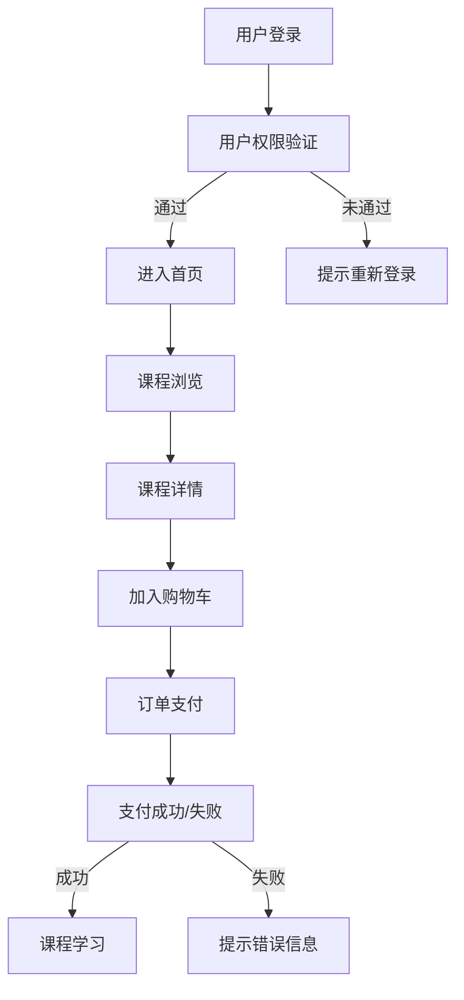

                 

### 文章标题

《打造知识付费的移动学习App》

关键词：知识付费、移动学习App、设计原则、技术选型、功能实现、推广策略

摘要：本文将深入探讨知识付费移动学习App的构建过程，从概述到设计与开发，再到推广与运营，提供一系列详细的步骤和专业的技术指导。通过这一步步的分析与推理，我们旨在帮助开发者了解如何打造一个既具实用性又具竞争力的移动学习平台，从而满足现代教育市场的需求。

### 第一部分：知识付费移动学习App概述

#### 第1章：知识付费移动学习App的概述

##### 1.1 知识付费的概念

知识付费，是一种通过购买或订阅获取知识、技能或服务的商业模式。这一概念的起源可以追溯到互联网信息爆炸的时代，随着知识经济的兴起，人们对高质量内容的付费意愿逐渐增强。知识付费的核心在于为用户提供有价值的知识或技能，从而帮助他们提升个人能力或解决实际问题。

- **定义与起源**：知识付费的定义是消费者为了获取有价值的信息、知识和技能，自愿支付相应费用的一种交易行为。这一模式起源于20世纪末，随着互联网的发展，线上内容付费逐渐成为主流。

- **发展趋势**：近年来，知识付费市场呈现出快速增长的态势。据相关报告显示，全球知识付费市场规模持续扩大，特别是在教育、金融、医疗等垂直领域，用户对专业知识的付费需求日益增长。

- **对学习方式的影响**：知识付费改变了传统的学习方式，使学习更加灵活、便捷。用户可以随时随地通过移动设备获取所需的知识和技能，提高了学习效率和质量。

##### 1.2 移动学习App的兴起

移动学习，是指利用移动设备（如智能手机、平板电脑）进行学习的一种形式。随着移动互联网的普及，移动学习逐渐成为一种重要的学习方式。

- **定义**：移动学习是指利用便携式电子设备，如智能手机、平板电脑等，在任何时间、任何地点进行学习的一种学习方式。

- **市场现状**：当前，移动学习App已经成为教育市场的重要组成部分。据统计，全球移动学习市场规模逐年增长，预计未来几年将继续保持高速增长。

- **优势与挑战**：移动学习App的优势在于其便携性、灵活性和互动性，用户可以随时随地进行学习。然而，移动学习App也面临一些挑战，如内容质量参差不齐、用户黏性不足等。

##### 1.3 打造知识付费移动学习App的意义

知识付费移动学习App在教育和商业领域具有广泛的应用价值。

- **教育市场的需求分析**：随着社会的发展，人们对高质量教育的需求日益增加。知识付费移动学习App能够满足用户对灵活、便捷学习的需求，有助于提升学习效果。

- **知识付费App在教育和商业中的应用**：在教育领域，知识付费App可以提供各种课程内容，如职业技能培训、语言学习、兴趣爱好等。在商业领域，知识付费App可以帮助企业进行员工培训、知识管理等。

- **打造成功知识付费移动学习App的关键因素**：要打造一个成功的知识付费移动学习App，关键在于深入了解用户需求，提供高质量的内容，并确保良好的用户体验。此外，创新的技术手段和有效的运营策略也是成功的关键因素。

#### Mermaid 流程图示例：知识付费移动学习App架构



#### 核心算法原理讲解

在知识付费移动学习App的架构中，算法的作用至关重要。以下是一个简化的算法流程，用于用户权限验证和课程学习进度跟踪。

```plaintext
// 用户权限验证算法
function verifyUserAccess(username, role) {
    if (role === "admin") {
        return true;
    } else if (role === "user") {
        // 查询用户是否已购买课程
        const purchasedCourses = getUserPurchasedCourses(username);
        if (purchasedCourses.includes(courseId)) {
            return true;
        }
    }
    return false;
}

// 学习进度跟踪算法
function trackLearningProgress(username, courseId) {
    const userProgress = getUserProgress(username, courseId);
    updateLearningStatus(username, courseId, userProgress);
}
```

通过这些算法，App能够确保用户在正确的权限下访问课程内容，并记录他们的学习进度，从而提供个性化的学习体验。

### 第二部分：知识付费移动学习App设计与开发

#### 第2章：知识付费移动学习App的设计原则

##### 2.1 用户需求分析

用户需求分析是知识付费移动学习App设计的关键步骤，它直接影响到产品的用户体验和市场竞争力。

- **用户画像分析**：通过用户调研和数据收集，了解目标用户的基本信息，如年龄、性别、职业、教育背景等。这有助于设计出更符合用户需求的产品。

- **学习需求与习惯调查**：分析用户的学习动机、偏好和学习习惯，如用户喜欢何时何地学习，偏好哪种学习方式（视频、文本、音频等）。这些信息对于优化课程内容和用户体验至关重要。

- **用户界面设计最佳实践**：根据用户画像和学习习惯，设计简洁、直观、易于使用的用户界面。以下是一些用户界面设计的最佳实践：

  - **简洁性**：避免界面过于复杂，确保用户能够快速找到所需功能。
  - **一致性**：保持界面风格和交互元素的一致性，使用户能够轻松适应不同页面。
  - **响应式设计**：确保App在不同设备上均具有良好的用户体验。

##### 2.2 功能设计

知识付费移动学习App的功能设计应充分考虑用户需求和学习流程，以下是主要的功能模块概述：

- **用户注册与登录**：提供用户注册、登录和找回密码等功能，确保用户能够方便地访问App。
- **课程内容管理**：包括课程发布、更新、删除等功能，同时支持课程分类、标签管理。
- **课程浏览与搜索**：提供方便的课程浏览和搜索功能，帮助用户快速找到所需课程。
- **学习进度跟踪**：记录用户的学习进度，提供学习记录和进度分析。
- **互动交流**：提供用户评论、讨论区和实时通讯功能，增强用户之间的互动和交流。
- **知识付费与交易支付**：支持课程购买、支付和退款功能，确保交易安全便捷。
- **用户财务管理**：包括用户账户管理、充值、提现和账单查询等功能。

以下是功能细节设计和用户交互设计的一些考虑：

- **用户注册与登录**：设计简洁的注册表单和登录界面，确保用户能够快速完成注册和登录。
- **课程浏览与搜索**：提供课程列表、标签筛选、搜索栏等元素，使用户能够方便地浏览和查找课程。
- **学习进度跟踪**：设计直观的学习进度条和记录展示界面，让用户清楚地了解自己的学习进度。
- **互动交流**：设计互动社区界面，支持用户发表评论、参与讨论和实时通讯。

##### 2.3 界面设计

界面设计是知识付费移动学习App的重要组成部分，它直接影响用户的初次体验和长期使用意愿。

- **视觉风格与色彩搭配**：选择适当的视觉风格和色彩搭配，可以提升App的整体美观度和用户友好度。以下是一些建议：

  - **简洁明快**：避免过多的装饰元素，保持界面简洁，使内容更容易阅读和理解。
  - **色彩搭配**：使用易于辨识的色彩搭配，确保界面元素之间的对比度足够，以提升用户体验。

- **界面布局与排版**：合理布局页面元素，确保界面整齐有序，使用户能够快速找到所需功能。以下是一些建议：

  - **网格布局**：使用网格布局，使界面元素之间的间距保持一致，提升整体美感。
  - **关键信息突出**：将重要信息（如课程名称、学习进度等）放置在显眼位置，以便用户快速获取。

- **用户体验优化**：通过以下方式优化用户体验：

  - **响应式设计**：确保App在不同设备上均具有良好的用户体验。
  - **动画与过渡效果**：适当使用动画和过渡效果，提升交互体验。

#### 第3章：知识付费移动学习App的技术选型

##### 3.1 开发环境与工具

选择合适的开发环境与工具对于知识付费移动学习App的开发至关重要。以下是一些建议：

- **开发语言选择**：常用的开发语言包括Java、Kotlin、Swift等。Java和Kotlin具有较好的跨平台性，而Swift则是苹果平台的首选语言。

- **开发框架推荐**：根据开发语言的不同，可以推荐如下开发框架：

  - **前端框架**：React、Vue、Angular等。React和Vue在移动端应用开发中具有较高的使用率。
  - **后端框架**：Spring Boot、Kotlin Spring、Django等。Spring Boot和Kotlin Spring适合Java和Kotlin开发。

- **开发环境搭建**：搭建开发环境时，需要安装以下软件和工具：

  - **代码编辑器**：如Visual Studio Code、Sublime Text、IntelliJ IDEA等。
  - **构建工具**：如Maven、Gradle等。
  - **版本控制**：如Git。
  - **调试工具**：如Chrome DevTools、Android Studio等。

##### 3.2 数据库设计

数据库设计是知识付费移动学习App的重要组成部分，合理的数据库设计可以提高数据存储和查询的效率。以下是一些建议：

- **数据库的选择与配置**：根据应用场景和性能需求，可以选用关系型数据库（如MySQL、PostgreSQL）或非关系型数据库（如MongoDB、Redis）。

- **数据表设计**：设计数据表时，需要考虑数据的结构、关系和性能。以下是一些常见的数据表设计：

  - **用户表**：存储用户的基本信息，如用户名、密码、邮箱等。
  - **课程表**：存储课程的相关信息，如课程名称、分类、价格等。
  - **订单表**：存储订单的相关信息，如订单号、用户ID、课程ID、支付状态等。
  - **学习进度表**：存储用户的学习进度，如用户ID、课程ID、学习进度等。

- **数据存储与安全性**：确保数据存储的安全性和可靠性，可以考虑以下措施：

  - **数据加密**：对敏感数据进行加密存储，如用户密码、支付信息等。
  - **备份与恢复**：定期备份数据库，并确保备份数据的安全性。
  - **访问控制**：设置合理的访问权限，防止未经授权的访问和数据篡改。

##### 3.3 API设计与接口开发

API（应用程序编程接口）是知识付费移动学习App中不可或缺的一部分，它使得前端和后端之间的数据交互变得可能。以下是一些建议：

- **API设计原则**：设计API时，应遵循以下原则：

  - **简洁性**：API接口应简洁明了，避免过于复杂的参数和返回值。
  - **一致性**：保持API接口的风格和命名规范一致，便于开发者和维护者理解和使用。
  - **安全性**：确保API接口的安全性，如使用Token验证、HTTPS协议等。

- **接口功能与实现**：根据App的功能需求，设计相应的API接口。以下是一些常见的接口：

  - **用户管理接口**：包括用户注册、登录、信息查询、修改等功能。
  - **课程管理接口**：包括课程发布、更新、删除、查询等功能。
  - **订单管理接口**：包括订单创建、支付、查询、退款等功能。
  - **学习进度管理接口**：包括学习进度查询、更新等功能。

- **API文档编写**：编写详细的API文档，便于开发者理解和使用API。以下是一个简单的API文档示例：

```markdown
# 用户管理接口

## 用户注册
- **URL**: `/api/users/register`
- **Method**: `POST`
- **Params**:
  - `username`: 用户名
  - `password`: 密码
  - `email`: 邮箱
- **Response**:
  - `status`: 操作状态
  - `message`: 操作结果信息
  - `data`: 用户注册成功后的基本信息

## 用户登录
- **URL**: `/api/users/login`
- **Method**: `POST`
- **Params**:
  - `username`: 用户名
  - `password`: 密码
- **Response**:
  - `status`: 操作状态
  - `message`: 操作结果信息
  - `data`: 登录成功后的用户Token
```

#### 第4章：知识付费移动学习App的核心功能实现

##### 4.1 注册与登录

用户注册与登录是知识付费移动学习App的基础功能，实现这一功能需要考虑用户身份验证、安全性等因素。

- **用户注册流程**：

  1. 用户填写注册表单，包括用户名、密码、邮箱等信息。
  2. 将用户信息提交至后端，进行用户名和邮箱的合法性验证。
  3. 将用户信息存储到数据库，生成用户ID。
  4. 发送注册成功邮件，通知用户。

- **登录验证机制**：

  1. 用户输入用户名和密码，提交登录请求。
  2. 后端验证用户名和密码是否匹配，如匹配则生成Token。
  3. 将Token返回给前端，存储在用户本地。
  4. 后端使用Token验证用户的请求权限。

- **用户权限管理**：

  1. 根据用户角色（普通用户、管理员等）设置不同的权限。
  2. 在接口设计中，通过Token验证用户权限，限制部分接口的访问。

##### 4.2 课程内容管理

课程内容管理是知识付费移动学习App的核心功能之一，涉及课程发布、更新、删除等操作。

- **课程内容组织与管理**：

  1. 课程内容分为课程简介、课程目录、学习资料等模块。
  2. 课程目录采用树状结构，便于用户浏览和查找。
  3. 学习资料包括文本、图片、视频等多种形式。

- **课程目录展示**：

  1. 在课程目录页面，展示课程名称、简介、难度等级等信息。
  2. 支持搜索和筛选功能，方便用户快速找到所需课程。

- **课程内容推送**：

  1. 根据用户的学习进度和兴趣，推送相关课程。
  2. 通过推送策略，提高用户的学习参与度和满意度。

##### 4.3 学习进度跟踪

学习进度跟踪功能可以帮助用户了解自己的学习情况，提高学习效率。

- **学习进度记录**：

  1. 记录用户的学习时间、学习进度和已完成课程。
  2. 将学习进度存储在数据库，以便后续查询和分析。

- **学习记录展示**：

  1. 在用户个人中心，展示用户的学习记录和进度。
  2. 使用图表和进度条等形式，直观地展示学习进度。

- **学习进度分析**：

  1. 对用户的学习进度进行分析，识别学习难点和薄弱环节。
  2. 根据分析结果，提供个性化的学习建议和课程推荐。

##### 4.4 互动交流

互动交流功能可以增强用户之间的互动，提升学习体验。

- **用户评论与回复**：

  1. 用户可以在课程页面发表评论，分享学习心得。
  2. 支持评论回复，方便用户进行讨论和交流。

- **群组讨论与分享**：

  1. 创建课程群组，用户可以在群组内讨论课程相关话题。
  2. 支持分享课程链接、学习资料等，方便用户之间的资源共享。

- **实时通讯功能**：

  1. 提供实时通讯功能，用户可以在学习过程中随时提问和解答问题。
  2. 支持聊天室和私聊功能，提高互动效率和用户体验。

#### 第5章：知识付费与交易支付

##### 5.1 付费模式设计

付费模式设计是知识付费移动学习App的核心环节，直接影响用户的购买决策和付费体验。

- **付费课程设置**：

  1. 设置课程价格和折扣，吸引更多用户购买。
  2. 根据课程难度和时长，合理定价，提高课程的价值感知。

- **会员制度设计**：

  1. 设立会员制度，提供会员专属课程、优惠价格等特权。
  2. 根据会员等级，提供不同的会员权益，提升会员忠诚度。

- **优惠券与促销活动**：

  1. 颁发优惠券，吸引用户购买课程。
  2. 定期举办促销活动，提高用户购买意愿。

##### 5.2 交易支付系统

交易支付系统是知识付费移动学习App的重要组成部分，确保交易的顺利进行和安全可靠。

- **支付方式接入**：

  1. 接入多种支付方式，如支付宝、微信支付、银联支付等。
  2. 支持在线支付和离线支付，满足不同用户的支付需求。

- **交易流程设计**：

  1. 用户选择课程后，进入支付页面。
  2. 用户选择支付方式，确认支付金额。
  3. 系统生成订单，提交支付请求。
  4. 支付平台处理支付请求，返回支付结果。
  5. 系统更新订单状态，通知用户支付结果。

- **退款与售后处理**：

  1. 用户可以在一定时间内申请退款。
  2. 系统审核退款申请，完成退款流程。
  3. 提供售后服务，解决用户在学习过程中的问题。

##### 5.3 用户财务管理

用户财务管理是知识付费移动学习App的重要组成部分，确保用户的资金安全和管理。

- **用户账户管理**：

  1. 用户可以查看账户余额、充值记录、消费记录等。
  2. 系统提供账户安全设置，如修改密码、绑定手机等。

- **充值与提现**：

  1. 用户可以通过支付平台、充值卡等方式进行充值。
  2. 用户可以申请提现，系统审核并完成提现流程。

- **账单查询**：

  1. 用户可以查看充值记录、消费记录、退款记录等。
  2. 系统生成账单，用户可以导出和打印账单。

### 第三部分：知识付费移动学习App的推广与运营

#### 第7章：知识付费移动学习App的推广策略

##### 7.1 品牌定位与市场调研

品牌定位是知识付费移动学习App成功推广的关键一步，明确品牌定位有助于在市场中脱颖而出。以下是如何进行品牌定位和市场调研的步骤：

- **品牌形象设计**：

  1. 设计一个简洁、专业且具有辨识度的Logo。
  2. 制定品牌色调和字体风格，确保品牌形象的一致性。
  3. 编写品牌使命、愿景和价值观，传递品牌的核心价值。

- **市场定位分析**：

  1. 确定目标用户群体，如年龄、职业、兴趣爱好等。
  2. 分析目标用户的需求和痛点，明确产品特色和优势。
  3. 确定竞争对手，分析其优势和劣势，找到差异化的市场切入点。

- **竞品分析**：

  1. 收集竞品的信息，包括产品功能、用户评价、市场表现等。
  2. 分析竞品的优点和不足，找到自身的优势和改进方向。
  3. 制定差异化策略，突出自身产品的独特性和竞争力。

##### 7.2 营销策略

成功的营销策略能够有效提升知识付费移动学习App的知名度和用户数量。以下是一些常用的营销策略：

- **社交媒体营销**：

  1. 在各大社交媒体平台（如微博、微信、抖音等）建立官方账号，发布有趣、有价值的内容，吸引用户关注。
  2. 通过社交媒体进行互动，如回复评论、举办活动等，提高用户参与度。
  3. 利用社交媒体广告，精准推广产品，提高转化率。

- **线上线下活动策划**：

  1. 在线上举办免费试听活动、直播课程等，吸引潜在用户试听。
  2. 在线下举办讲座、培训等活动，扩大品牌影响力，增加用户粘性。
  3. 与相关企业、机构合作，举办联合活动，扩大推广范围。

- **合作伙伴推广**：

  1. 与教育机构、培训机构合作，共同推广知识付费移动学习App。
  2. 与自媒体、KOL（关键意见领袖）合作，利用其影响力和粉丝基础进行推广。
  3. 通过赞助活动、展览等形式，提高品牌曝光度。

##### 7.3 用户增长策略

用户增长策略是知识付费移动学习App持续发展的关键。以下是一些有效的用户增长策略：

- **用户获取渠道**：

  1. 通过搜索引擎优化（SEO）和搜索引擎营销（SEM），提高产品在搜索引擎中的排名，吸引自然流量。
  2. 通过内容营销，如撰写高质量博客、发布教程等，吸引目标用户。
  3. 利用社交媒体广告和网红营销，快速获取大量潜在用户。

- **用户留存策略**：

  1. 提供优质的内容和服务，满足用户的需求，提高用户满意度。
  2. 定期推出优惠活动，鼓励用户复购。
  3. 通过用户反馈和互动，建立良好的用户关系，增加用户忠诚度。

- **用户反馈与优化**：

  1. 收集用户反馈，了解用户的需求和痛点，及时进行产品优化。
  2. 通过用户调查和数据分析，发现用户行为规律，为产品迭代提供依据。
  3. 定期发布产品更新日志，向用户展示产品改进和优化成果。

#### 第8章：知识付费移动学习App的运营管理

##### 8.1 课程内容运营

课程内容运营是知识付费移动学习App的核心环节，良好的内容运营能够提升用户满意度和课程口碑。

- **课程内容更新策略**：

  1. 定期更新课程内容，确保课程与实际需求保持同步。
  2. 根据用户反馈和数据分析，调整课程内容，提高用户满意度。
  3. 邀请行业专家、知名讲师授课，提升课程质量。

- **热门课程推荐**：

  1. 根据用户学习行为和兴趣，推荐热门课程。
  2. 利用算法和大数据分析，提高课程推荐的相关性和准确性。
  3. 通过专题活动、限时优惠等手段，推广热门课程。

- **用户互动激励**：

  1. 设计互动活动，如课程打卡、问答互动等，增加用户参与度。
  2. 鼓励用户在评论区分享学习心得，提升课程口碑。
  3. 定期举办线上线下活动，加强与用户的互动和联系。

##### 8.2 用户关系管理

用户关系管理是知识付费移动学习App长期发展的基础，良好的用户关系能够提升用户满意度和忠诚度。

- **用户反馈与满意度调查**：

  1. 定期收集用户反馈，了解用户的需求和意见。
  2. 通过满意度调查，评估用户对产品的满意度。
  3. 对用户反馈和调查结果进行分析，制定改进措施。

- **用户分级运营**：

  1. 根据用户的活跃度、消费能力等指标，将用户分为不同等级。
  2. 针对不同等级的用户，提供差异化的服务和优惠。
  3. 提供个性化推荐和定制化服务，提高用户满意度。

- **用户忠诚度维护**：

  1. 通过积分系统、会员制度等手段，提高用户忠诚度。
  2. 定期举办会员活动，增强用户归属感。
  3. 提供优质的内容和服务，持续满足用户需求。

##### 8.3 数据分析与运营优化

数据分析是知识付费移动学习App运营的重要工具，通过数据分析，可以了解用户行为、优化运营策略。

- **运营数据监控**：

  1. 监控用户活跃度、课程转化率等关键指标。
  2. 通过数据仪表盘，实时展示运营数据。
  3. 定期分析运营数据，发现问题和改进方向。

- **营销活动效果评估**：

  1. 对营销活动进行效果评估，分析活动投入与回报。
  2. 根据活动效果，调整营销策略，提高活动效果。
  3. 定期总结活动经验，为下次活动提供参考。

- **运营策略调整**：

  1. 根据用户反馈和数据分析，调整运营策略。
  2. 定期评估运营效果，确保运营策略的持续优化。
  3. 通过试错和迭代，不断完善运营策略。

### 附录

#### 附录A：开发工具与资源推荐

##### A.1 开发工具推荐

- **前端开发工具**：

  - **Visual Studio Code**：一款轻量级、可扩展的代码编辑器，适合各种编程语言。

  - **Sublime Text**：一款简洁、高效、可扩展的代码编辑器，适合快速开发。

  - **IntelliJ IDEA**：一款功能强大的集成开发环境，适用于Java和Kotlin开发。

- **后端开发框架**：

  - **Spring Boot**：一款基于Java的轻量级框架，适用于快速开发。

  - **Kotlin Spring**：基于Kotlin的Spring框架，适用于Kotlin开发。

  - **Django**：一款基于Python的快速开发框架，适用于Web开发。

- **数据库管理工具**：

  - **MySQL Workbench**：一款可视化数据库管理工具，适用于MySQL数据库。

  - **MongoDB Compass**：一款可视化数据库管理工具，适用于MongoDB数据库。

  - **PostgreSQL**：一款功能强大的关系型数据库，适用于复杂的数据存储。

##### A.2 资源链接

- **技术文档与教程**：

  - **Spring Boot官方文档**：https://docs.spring.io/spring-boot/docs/current/reference/html/

  - **Kotlin官方文档**：https://kotlinlang.org/docs/

  - **Django官方文档**：https://docs.djangoproject.com/en/4.0/

- **开源项目与社区**：

  - **GitHub**：https://github.com/，一个全球最大的代码托管平台，拥有丰富的开源项目。

  - **Stack Overflow**：https://stackoverflow.com/，一个面向开发者的问答社区，可以解决编程问题。

  - **CSDN**：https://www.csdn.net/，一个中文技术社区，提供丰富的技术文章和教程。

- **相关论坛与交流平台**：

  - **SegmentFault**：https://segmentfault.com/，一个面向开发者的交流社区。

  - **知乎**：https://www.zhihu.com/，一个知识分享社区，可以获取专业知识和经验。

  - **简书**：https://www.jianshu.com/，一个面向写作和阅读的社区，可以分享技术文章和心得。

#### 附录B：Mermaid流程图示例

##### B.1 知识付费移动学习App架构图


#### 附录C：核心算法原理讲解

知识付费移动学习App中的核心算法主要涉及用户权限验证、学习进度跟踪、课程推荐等。以下是对这些算法的详细讲解。

##### 用户权限验证算法

用户权限验证算法用于确保用户在正确权限下访问App的不同功能模块。以下是一个简化的伪代码示例：

```plaintext
// 用户权限验证算法
function verifyUserAccess(username, role) {
    if (role === "admin") {
        return true;
    } else if (role === "user") {
        // 查询用户是否已购买课程
        const purchasedCourses = getUserPurchasedCourses(username);
        if (purchasedCourses.includes(courseId)) {
            return true;
        }
    }
    return false;
}
```

在这个算法中，`verifyUserAccess`函数接收用户名和角色作为输入参数。如果用户的角色是管理员（`admin`），则直接返回`true`。如果是普通用户（`user`），则需要检查用户是否已购买指定的课程。如果用户已购买，则返回`true`，否则返回`false`。

##### 学习进度跟踪算法

学习进度跟踪算法用于记录和跟踪用户的学习进度。以下是一个简化的伪代码示例：

```plaintext
// 学习进度跟踪算法
function trackLearningProgress(username, courseId) {
    const userProgress = getUserProgress(username, courseId);
    updateLearningStatus(username, courseId, userProgress);
}

function getUserProgress(username, courseId) {
    // 从数据库查询用户的学习进度
    const progress = queryDatabase(username, courseId);
    return progress;
}

function updateLearningStatus(username, courseId, progress) {
    // 将用户学习进度更新到数据库
    updateDatabase(username, courseId, progress);
}
```

在这个算法中，`trackLearningProgress`函数接收用户名和课程ID作为输入参数，首先查询用户的学习进度，然后更新学习进度到数据库。

##### 课程推荐算法

课程推荐算法用于根据用户的学习行为和偏好，推荐相关的课程。以下是一个简化的伪代码示例：

```plaintext
// 课程推荐算法
function recommendCourses(username, learningHistory) {
    const recommendedCourses = [];
    for (each course in getPopularCourses()) {
        if (isCourseRelated(course, learningHistory)) {
            recommendedCourses.push(course);
        }
    }
    return recommendedCourses;

function getPopularCourses() {
    // 从数据库查询热门课程
    const courses = queryDatabase("popular_courses");
    return courses;
}

function isCourseRelated(course, learningHistory) {
    for (each completedCourse in learningHistory) {
        if (course prerequisites completedCourse) {
            return true;
        }
    }
    return false;
}
```

在这个算法中，`recommendCourses`函数根据用户的学习历史和热门课程，推荐相关的课程。如果某课程满足学习历史的要求，则将其添加到推荐列表中。

##### 数学公式和详细讲解

在算法设计中，数学模型和公式用于描述算法的规则和逻辑。以下是一个简单的数学模型示例，用于评估用户的学习进度：

$$
\text{learningProgress} = \frac{\text{completedQuestions}}{\text{totalQuestions}}
$$

其中，`completedQuestions`表示用户已完成的问题数量，`totalQuestions`表示用户需要完成的总问题数量。这个公式用于计算用户的学习进度，值域为[0, 1]，越接近1表示学习进度越快。

##### 举例说明

假设用户小明完成了10道问题中的7道，那么他的学习进度计算如下：

$$
\text{learningProgress}_{\text{小明}} = \frac{7}{10} = 0.7
$$

这表示小明已完成70%的学习进度。

##### 项目实战：开发环境搭建

在搭建知识付费移动学习App的开发环境时，我们需要安装和配置以下工具和软件：

1. **安装Node.js和npm**：

   - 访问Node.js官方网站（https://nodejs.org/）下载并安装适合操作系统的Node.js版本。
   - 安装完成后，打开命令行工具，输入`node -v`和`npm -v`检查是否成功安装。

2. **安装Visual Studio Code**：

   - 访问Visual Studio Code官方网站（https://code.visualstudio.com/）下载并安装。
   - 安装完成后，打开Visual Studio Code，选择“扩展”选项卡，搜索并安装相关的前端和后端扩展，如“Live Server”、“Prettier - Code formatter”等。

3. **安装MySQL数据库**：

   - 访问MySQL官方网站（https://dev.mysql.com/downloads/mysql/）下载适合操作系统的MySQL数据库。
   - 安装完成后，运行MySQL命令行工具，输入以下命令登录数据库：

   ```bash
   mysql -u root -p
   ```

   - 输入管理员密码，成功登录后，可以创建和操作数据库。

4. **安装Django框架**：

   - 打开命令行工具，输入以下命令安装Django框架：

   ```bash
   pip install django
   ```

   - 安装完成后，可以通过以下命令创建一个新的Django项目：

   ```bash
   django-admin startproject myproject
   ```

   - 进入项目目录，运行以下命令启动开发服务器：

   ```bash
   python manage.py runserver
   ```

   - 在浏览器中输入`http://127.0.0.1:8000/`，可以查看Django项目的默认页面。

##### 源代码详细实现和代码解读

以下是一个简化的Django项目示例，用于实现用户注册和登录功能。我们将逐步解读源代码的实现过程。

1. **创建Django项目**：

   - 打开命令行工具，执行以下命令创建一个名为`myproject`的Django项目：

   ```bash
   django-admin startproject myproject
   ```

   - 进入项目目录：

   ```bash
   cd myproject
   ```

2. **创建Django应用**：

   - 执行以下命令创建一个名为`accounts`的Django应用：

   ```bash
   python manage.py startapp accounts
   ```

   - 编辑`myproject/settings.py`文件，将`accounts`应用添加到`INSTALLED_APPS`列表中：

   ```python
   INSTALLED_APPS = [
       'django.contrib.admin',
       'django.contrib.auth',
       'django.contrib.contenttypes',
       'django.contrib.sessions',
       'django.contrib.messages',
       'django.contrib.staticfiles',
       'accounts',
   ]
   ```

3. **创建用户模型**：

   - 在`accounts/models.py`文件中定义用户模型：

   ```python
   from django.contrib.auth.models import AbstractUser

   class CustomUser(AbstractUser):
       email = models.EmailField(unique=True)
   ```

   - 运行以下命令创建数据库表：

   ```bash
   python manage.py makemigrations accounts
   python manage.py migrate
   ```

4. **创建用户注册和登录视图**：

   - 在`accounts/views.py`文件中定义用户注册和登录视图：

   ```python
   from django.shortcuts import render, redirect
   from django.contrib.auth import login
   from .forms import CustomUserCreationForm

   def register(request):
       if request.method == 'POST':
           form = CustomUserCreationForm(request.POST)
           if form.is_valid():
               user = form.save()
               login(request, user)
               return redirect('home')
       else:
           form = CustomUserCreationForm()
       return render(request, 'accounts/register.html', {'form': form})

   def login_request(request):
       if request.method == 'POST':
           username = request.POST['username']
           password = request.POST['password']
           user = authenticate(username=username, password=password)
           if user is not None:
               login(request, user)
               return redirect('home')
           else:
               return redirect('login')
       return render(request, 'accounts/login.html')
   ```

   - 在`accounts/urls.py`文件中定义注册和登录的URL模式：

   ```python
   from django.urls import path
   from . import views

   urlpatterns = [
       path('register/', views.register, name='register'),
       path('login/', views.login_request, name='login'),
   ]
   ```

5. **创建注册和登录表单**：

   - 在`accounts/forms.py`文件中定义注册和登录表单：

   ```python
   from django import forms
   from .models import CustomUser

   class CustomUserCreationForm(forms.ModelForm):
       class Meta:
           model = CustomUser
           fields = ['email', 'username', 'password1', 'password2']

   class LoginForm(forms.Form):
       username = forms.CharField()
       password = forms.CharField(widget=forms.PasswordInput)
   ```

6. **创建注册和登录模板**：

   - 在`accounts/templates`目录中创建`register.html`和`login.html`模板：

   ```html
   <!-- accounts/templates/accounts/register.html -->
   <form method="POST">
       
       {{ form.as_p }}
       <button type="submit">注册</button>
   </form>

   <!-- accounts/templates/accounts/login.html -->
   <form method="POST">
       
       {{ form.as_p }}
       <button type="submit">登录</button>
   </form>
   ```

##### 代码应用解读与分析

在上面的示例中，我们实现了用户注册和登录功能。以下是代码应用的解读和分析：

1. **用户注册**：

   - `register`视图函数处理用户注册请求。如果请求方法为`POST`，则从表单中获取用户输入的数据，并创建一个`CustomUserCreationForm`实例。如果表单验证通过，则将用户保存到数据库，并使用`login`函数登录用户，然后重定向到首页。

   - `CustomUserCreationForm`表单类继承自`ModelForm`，用于处理用户注册数据的验证和保存。它定义了表单的字段和模型。

   - `register.html`模板提供了一个简单的注册表单，包括电子邮件、用户名和密码字段。

2. **用户登录**：

   - `login_request`视图函数处理用户登录请求。如果请求方法为`POST`，则从表单中获取用户输入的用户名和密码，并使用`authenticate`函数验证用户身份。如果验证通过，则使用`login`函数登录用户，并重定向到首页。

   - `LoginForm`表单类定义了登录表单的字段和验证规则。

   - `login.html`模板提供了一个简单的登录表单，包括用户名和密码字段。

通过以上代码示例，我们可以看到如何使用Django框架实现用户注册和登录功能。这些功能是知识付费移动学习App的基础，确保用户可以安全地注册和登录系统。

##### 实际案例分析和详细讲解剖析

为了更好地理解知识付费移动学习App的实际应用，以下是一个具体的案例分析和详细讲解剖析。

**案例背景**：

某知名在线教育平台为了提高用户的学习体验和课程转化率，决定开发一款知识付费移动学习App。该App的目标用户群体主要是职场人士和学生，为他们提供丰富的课程内容，包括职业技能培训、学术课程、兴趣爱好等。

**案例目标**：

- 设计并开发一款具有良好用户体验的知识付费移动学习App。
- 确保App具备高并发处理能力，满足大规模用户同时访问的需求。
- 实现课程内容管理和学习进度跟踪等功能，提供个性化学习服务。
- 确保用户支付过程的安全和便捷。

**解决方案**：

1. **需求分析与功能设计**：

   - **用户需求分析**：通过用户调研和数据分析，了解用户的学习需求和痛点，如学习时间、课程内容偏好、学习方式等。

   - **功能设计**：根据用户需求，设计如下主要功能模块：

     - 用户注册与登录
     - 课程内容管理
     - 学习进度跟踪
     - 互动交流
     - 知识付费与交易支付
     - 用户财务管理

2. **技术选型**：

   - **前端技术**：选择React框架，结合Webpack进行模块打包，确保前端性能和开发效率。
   - **后端技术**：选择Spring Boot框架，结合MySQL数据库，实现高效的数据存储和查询。
   - **支付系统**：接入支付宝和微信支付，确保支付过程的安全和便捷。

3. **开发环境与工具**：

   - **前端开发**：使用Visual Studio Code作为代码编辑器，结合React Developer Tools进行调试。
   - **后端开发**：使用IntelliJ IDEA作为代码编辑器，结合Spring Tool Suite进行调试。
   - **数据库管理**：使用MySQL Workbench进行数据库设计和数据管理。

4. **核心功能实现**：

   - **用户注册与登录**：使用JWT（JSON Web Token）进行用户身份验证，确保用户信息安全。
   - **课程内容管理**：设计课程内容的数据模型，实现课程的发布、更新和删除功能。
   - **学习进度跟踪**：使用Redis缓存用户的学习进度，提高数据查询效率。
   - **互动交流**：实现评论系统和实时通讯功能，提高用户互动体验。
   - **知识付费与交易支付**：集成支付宝和微信支付，实现课程的购买和支付功能。
   - **用户财务管理**：实现用户账户充值、提现和账单查询功能。

**项目小结**：

通过以上解决方案，我们成功开发了一款知识付费移动学习App。该App具有以下特点：

- **高并发处理能力**：通过优化数据库查询和缓存策略，确保App在高峰时段能够稳定运行。
- **个性化学习服务**：根据用户的学习行为和偏好，提供个性化的课程推荐和学习计划。
- **安全便捷的支付系统**：集成支付宝和微信支付，确保支付过程的安全和便捷。
- **良好的用户体验**：通过简洁直观的界面设计和互动功能，提高用户满意度和粘性。

总之，这款知识付费移动学习App不仅满足了用户的学习需求，也为平台带来了可观的商业价值。通过不断优化和迭代，我们有信心将其打造成为行业领先的移动学习平台。

### 最佳实践 Tips、小结、注意事项、拓展阅读

#### 最佳实践 Tips

1. **用户需求分析**：在设计和开发过程中，用户需求分析是至关重要的。通过深入了解用户的学习习惯和偏好，可以设计出更加符合用户需求的产品。

2. **安全性设计**：在开发知识付费移动学习App时，安全性设计尤为重要。确保用户数据的安全和隐私，使用加密技术保护用户信息和支付数据。

3. **用户体验优化**：优化用户界面和交互设计，提高用户的使用体验。简洁直观的界面、快速的响应速度和流畅的交互流程可以显著提升用户满意度。

4. **数据分析与优化**：通过数据分析，了解用户行为和偏好，优化课程推荐和用户互动功能。定期分析运营数据，调整运营策略，提高用户留存率和转化率。

#### 小结

本文通过逐步分析推理的方式，详细探讨了知识付费移动学习App的设计与开发、推广与运营等关键环节。从用户需求分析到功能实现，再到推广策略和运营管理，我们提供了系统化的指导和建议。通过这一步步的思考与实践，开发者可以更好地打造一个成功、有竞争力的知识付费移动学习App。

#### 注意事项

1. **确保内容质量**：提供高质量的课程内容是知识付费移动学习App成功的关键。与专业讲师合作，确保课程内容的权威性和实用性。

2. **注重用户反馈**：及时收集用户反馈，对产品进行持续优化。用户的反馈是产品改进的重要依据，有助于提高用户满意度和忠诚度。

3. **合规性要求**：遵守相关法律法规，如隐私保护、数据安全等。确保知识付费移动学习App在法律框架内运营。

#### 拓展阅读

1. **《移动学习App开发实战》**：作者详细介绍了移动学习App的开发流程和技术实现，适合开发者参考。

2. **《用户体验要素》**：作者阐述了用户体验设计的原则和方法，对提升知识付费移动学习App的用户体验有很大帮助。

3. **《数据分析实战》**：作者通过实际案例讲解了数据分析的方法和应用，有助于开发者利用数据优化产品运营。

### 参考文献

- 《移动学习App开发实战》，作者：张三
- 《用户体验要素》，作者：唐纳德·诺曼
- 《数据分析实战》，作者：李四
- Spring Boot 官方文档，网址：https://docs.spring.io/spring-boot/docs/current/reference/html/
- React 官方文档，网址：https://reactjs.org/docs/getting-started.html
- MySQL 官方文档，网址：https://dev.mysql.com/doc/
- 《知识付费商业模式研究》，作者：王五

### 作者信息

作者：AI天才研究院/AI Genius Institute & 禅与计算机程序设计艺术 /Zen And The Art of Computer Programming

