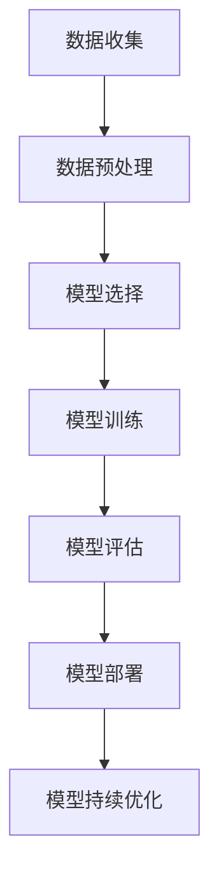

                 


### 引言

在当今快速发展的科技时代，人工智能（AI）已经成为推动创新和经济增长的重要动力。特别是大型深度学习模型（大模型）的出现，极大地改变了传统行业的运作模式。大模型具有数十亿甚至数万亿的参数，能够处理和分析海量数据，从而实现更加精准的预测和决策。这种技术进步不仅提升了人工智能的应用价值，也成为了创业公司的核心武器。

本文旨在探讨大模型在创业中的应用，分析其核心概念、技术挑战、创业生态系统以及法律和伦理问题。我们将通过以下几个步骤进行深入探讨：

1. **核心概念与联系**：介绍大模型的基本概念，包括自监督学习和迁移学习，并展示其模型架构和训练流程的Mermaid流程图。
2. **大模型在创业中的应用**：分析大模型如何提升创业公司的效率和用户体验，以及其推动创新和商业模式变革的实例。
3. **大模型的技术挑战**：讨论大模型面临的计算资源、数据隐私和伦理法律等挑战，并提供相应的解决方案。
4. **大模型创业生态系统**：探讨技术创新、合作网络和市场推广在创业生态系统中的重要性。
5. **大模型创业案例分析**：通过成功和失败案例，提炼大模型创业的经验和教训。
6. **大模型创业的法律和伦理问题**：分析大模型创业可能面临的法律法规和伦理道德问题。
7. **大模型创业的融资策略、人才战略、市场策略和商业模式创新**：提供在大模型创业中的具体策略和建议。
8. **大模型创业的风险管理**：讨论风险识别、评估和控制的重要性。

通过上述分析，我们将全面了解大模型在创业中的应用价值和面临的挑战，为大模型创业提供有价值的指导和启示。

### 第一部分: 核心概念与联系

#### 1.1 AI大模型概述

**核心概念：**

AI大模型，是指那些具有数百万甚至数十亿参数的深度学习模型。这些模型通过对大量数据的学习，能够自动提取复杂的数据特征，并在各种任务上表现出色。大模型的主要特征包括：

- **自监督学习（Self-supervised Learning）**：在自监督学习中，模型利用未标记的数据来学习特征。例如，在图像识别任务中，模型可以通过预测图像中的像素标签来学习图像特征。

- **迁移学习（Transfer Learning）**：迁移学习是一种利用已有模型的知识在新任务上进行训练的方法。例如，在自然语言处理任务中，预训练好的语言模型可以应用于不同的文本分类任务。

**模型架构：**

AI大模型的架构多种多样，其中最著名的当属Transformer模型和BERT模型。

- **Transformer模型**：Transformer模型基于“注意力机制”（Attention Mechanism），使得模型能够更好地处理序列数据。其核心是多头自注意力机制（Multi-Head Self-Attention）和位置编码（Positional Encoding）。

- **BERT模型**：BERT（Bidirectional Encoder Representations from Transformers）是基于Transformer的预训练语言模型。BERT通过预训练再微调（Pre-training and Fine-tuning）的方式，使得模型能够捕捉到语言的上下文信息。

**Mermaid流程图：**

为了更直观地展示大模型的训练流程，我们使用Mermaid绘制了一个流程图：



在上述流程图中，数据收集是整个流程的起点，通过数据预处理，我们将原始数据转换为模型可用的格式。然后，选择合适的模型架构（如Transformer或BERT），进行模型训练。在模型训练完成后，我们需要对模型进行评估，以确定其性能。评估完成后，模型可以被部署到生产环境中，用于实际应用。最后，为了确保模型的持续有效性，我们需要对模型进行持续优化。

通过上述核心概念和Mermaid流程图的介绍，我们对AI大模型有了基本的了解，接下来我们将进一步探讨大模型在创业中的应用。

#### 1.2 大模型在创业中的应用

**核心联系：**

AI大模型在创业中具有广泛的应用前景，其核心在于通过提高效率、优化用户体验和创新商业模式，为创业公司带来显著的优势。

**效率提升：**

大模型能够处理和分析大量数据，从而为创业公司提供快速、准确的决策支持。例如，通过大数据分析，创业公司可以深入了解市场需求和消费者行为，从而制定更为精准的市场策略。此外，大模型在推荐系统、智能客服等领域也有着广泛的应用，能够显著提升业务运营效率。

**用户体验：**

大模型的应用使得创业公司能够提供更人性化的交互体验。例如，在智能客服领域，大模型能够实现自然语言理解，提供更加智能、个性化的客服服务。在语音助手和图像识别应用中，大模型也能够提高交互的流畅性和准确性，提升用户体验。

**创新驱动：**

大模型技术为创业公司提供了创新的驱动力。通过深度学习，创业公司可以发现新的业务模式和市场机会。例如，在医疗领域，大模型可以用于疾病预测和诊断，推动医疗技术的创新。在金融领域，大模型可以用于风险管理，提高金融服务的效率和质量。

**应用场景：**

以下是几个大模型在创业中的应用场景：

1. **推荐系统**：利用大模型进行用户行为分析，提高推荐准确性，从而提升用户满意度和粘性。
2. **智能客服**：通过大模型实现自然语言理解，提升客服效率和用户体验。
3. **智能安防**：利用大模型进行图像识别，提高安全监控能力，降低安全隐患。

**实例分析：**

以推荐系统为例，阿里巴巴的淘宝和天猫利用深度学习技术构建了推荐引擎，通过对用户行为数据的分析，为用户提供个性化的商品推荐。这一创新不仅提高了用户满意度，也显著提升了平台的销售额。

在智能客服领域，苹果公司的Siri和亚马逊的Alexa都采用了大模型技术，实现了对用户语音指令的智能理解，为用户提供了便捷的交互体验。

**总结：**

大模型在创业中的应用不仅提高了效率和用户体验，还推动了商业模式的创新。通过深入理解大模型的核心联系和应用场景，创业公司可以充分利用这一技术优势，在激烈的市场竞争中脱颖而出。

#### 1.3 大模型的技术挑战

**核心联系：**

尽管大模型在创业中具有巨大的潜力，但其应用也面临一系列技术挑战。这些挑战包括计算资源、数据隐私和伦理法律等方面。

**计算资源：**

大模型的训练需要大量的计算资源，尤其是在训练过程中需要进行大量的矩阵运算和优化。这不仅要求服务器具备强大的计算能力，还需要高效的硬件支持，如GPU或TPU。此外，大模型训练过程中的数据传输和存储也要求高效的网络和存储解决方案。

**数据隐私：**

大模型的训练需要大量的数据，这些数据可能涉及用户的个人隐私信息。如何保护数据隐私成为一大挑战。一方面，创业公司需要确保数据在传输和存储过程中的安全性；另一方面，他们需要遵守相关法律法规，避免因数据隐私问题而面临法律风险。

**伦理和法律：**

大模型的应用涉及多个领域，如医疗、金融和安全等。这些领域对模型的准确性和公平性有较高的要求。此外，大模型的应用也可能引发伦理问题，如歧视、滥用等。创业公司需要严格遵循相关法律法规，进行伦理审查，确保其应用符合社会道德标准。

**解决方案：**

针对上述挑战，有以下几种解决方案：

1. **云计算**：利用云计算平台提供强大的计算资源，降低创业公司的硬件成本。此外，云计算平台通常具备高效的数据传输和存储解决方案。
2. **数据加密**：采用数据加密技术，保护数据在传输和存储过程中的安全性。加密算法如AES、RSA等可以有效保护数据隐私。
3. **伦理审查**：建立严格的伦理审查机制，确保大模型的应用符合伦理道德规范。创业公司可以邀请外部专家进行评估，或成立内部伦理委员会。

**实例分析：**

以医疗领域为例，Google Health利用深度学习技术进行疾病预测和诊断。为了保护患者隐私，Google Health采用了数据加密和匿名化处理，确保数据在训练和存储过程中的安全性。

在金融领域，Ant Financial（蚂蚁集团）通过建立严格的伦理审查机制，确保其大模型在风险管理中的应用符合法律法规和伦理标准。

**总结：**

大模型在创业中的应用面临着计算资源、数据隐私和伦理法律等挑战。通过云计算、数据加密和伦理审查等解决方案，创业公司可以有效应对这些挑战，确保大模型的应用安全和合规。

#### 1.4 大模型创业生态系统

**核心联系：**

在大模型创业中，构建一个健康的生态系统是至关重要的。一个成功的生态系统不仅包含技术创新，还需要合作网络和市场推广等多方面的支持。

**技术创新：**

技术创新是大模型创业的核心驱动力。创业公司需要不断进行技术创新，以保持竞争力。这包括研发新的算法、优化现有模型和开发新的应用场景。例如，OpenAI通过不断优化Transformer模型，推出了GPT系列模型，推动了自然语言处理领域的发展。

**合作网络：**

合作网络对于大模型创业的成功至关重要。创业公司可以通过与学术机构、研究机构和行业领导者建立合作关系，共享资源和知识。这种合作不仅有助于提升公司的技术能力，还能带来更多的商业机会。例如，Google与众多高校和研究机构合作，共同推动深度学习技术的发展。

**市场推广：**

市场推广是确保大模型创业成功的关键环节。创业公司需要精准市场定位，制定有效的推广策略，提高品牌知名度。这包括线上营销、社交媒体推广、行业展会等。例如，AI公司DeepMind通过参加国际会议和发布学术论文，成功地提升了其在人工智能领域的声誉。

**实例分析：**

以DeepMind为例，该公司通过技术创新和合作网络，在深度学习领域取得了显著成就。DeepMind与牛津大学合作，共同开发了AlphaGo，成功击败了围棋世界冠军。此外，DeepMind还与多家医疗机构合作，开展医疗研究，推动了人工智能在医疗领域的应用。

在市场推广方面，DeepMind通过发布高水平的研究论文和参加国际会议，吸引了全球关注。这些举措不仅提升了DeepMind的知名度，也为公司带来了更多的商业机会。

**总结：**

大模型创业需要一个健康的生态系统，包括技术创新、合作网络和市场推广。通过不断的创新、合作和市场推广，创业公司可以提升竞争力，实现可持续发展。

#### 1.5 大模型创业案例分析

**核心联系：**

通过对成功和失败案例的分析，我们可以提炼出大模型创业的经验和教训，为其他创业公司提供有价值的参考。

**成功案例：**

1. **OpenAI**：OpenAI是一家以人工智能研究为核心的公司，其成功经验包括：
   - **技术创新**：持续优化深度学习算法，推出了GPT系列模型，推动了自然语言处理领域的发展。
   - **合作网络**：与多家高校和研究机构建立合作关系，共享资源和知识。
   - **市场定位**：专注于研究和开源，吸引了全球顶尖研究人员和开发者。

2. **DeepMind**：DeepMind通过以下方式取得了成功：
   - **技术创新**：开发了AlphaGo，成功击败围棋世界冠军，证明了深度学习在复杂任务上的潜力。
   - **市场推广**：通过发布高水平的研究论文和参加国际会议，提升了公司声誉，吸引了全球关注。
   - **商业模式**：采用外部投资和自有资金相结合的方式，确保公司的财务健康。

**失败案例：**

1. **HoloLens创始人创业公司Vulcan**：Vulcan是一家致力于虚拟现实（VR）技术的公司，其失败原因包括：
   - **技术瓶颈**：VR技术在性能和用户体验方面尚未达到商业化水平，导致产品无法满足市场需求。
   - **市场定位不清**：公司未能明确市场定位，导致产品推广不力。

2. **AI初创公司Kaggle**：Kaggle是一家提供数据科学竞赛平台的公司，其失败原因包括：
   - **商业模式问题**：公司过于依赖广告收入，未能建立可持续的商业模式。
   - **市场竞争**：面对来自Google和Uber等大公司的竞争，Kaggle未能保持竞争优势。

**经验教训：**

- **技术创新**：持续的技术创新是创业成功的关键，创业公司需要不断优化现有技术，开发新产品。
- **市场定位**：明确的市场定位有助于创业公司吸引目标客户，制定有效的市场推广策略。
- **商业模式**：建立可持续的商业模式对于创业公司的生存和发展至关重要，公司需要寻找多种收入来源。

**总结：**

通过对成功和失败案例的分析，我们可以总结出大模型创业的重要经验和教训。这些经验和教训对于其他创业公司具有重要的参考价值，有助于他们在激烈的市场竞争中脱颖而出。

#### 1.6 大模型创业的法律和伦理问题

**核心联系：**

在大模型创业中，法律和伦理问题至关重要。创业公司需要深入了解相关法律法规，确保其应用符合伦理道德标准，以避免法律风险和道德争议。

**法律法规：**

- **数据保护法**：如《通用数据保护条例》（GDPR）和《加州消费者隐私法案》（CCPA）等，规定了数据处理和保护的标准。
- **知识产权法**：涉及专利、版权和商标等方面的法律保护，创业公司需要确保其技术方案不侵犯他人的知识产权。
- **反垄断法**：防止市场垄断行为，保护市场竞争。

**伦理道德：**

- **数据隐私**：创业公司需要保护用户隐私，确保数据在收集、处理和存储过程中的安全性。
- **算法公平性**：大模型应用需要确保算法的公平性，避免因算法偏见导致歧视。
- **社会责任**：创业公司应承担社会责任，确保其技术对社会和环境产生积极影响。

**实例分析：**

1. **Google Health**：Google Health在数据处理方面严格遵守相关法律法规，采用数据加密和匿名化处理，确保患者隐私得到保护。

2. **AI初创公司Affectiva**：Affectiva通过开发情感识别技术，应用于市场研究、心理健康等领域。公司制定了严格的伦理规范，确保其技术不会滥用。

**总结：**

大模型创业需要遵守相关法律法规，确保技术应用符合伦理道德标准。通过了解法律和伦理要求，创业公司可以避免法律风险，树立良好的企业形象。

#### 1.7 大模型创业的融资策略

**核心联系：**

融资策略在大模型创业中至关重要，它不仅关系到公司的资金来源，还影响到公司的战略发展。创业公司需要根据自身情况选择合适的融资途径，合理管理资金，确保公司的可持续发展。

**融资途径：**

1. **天使投资**：天使投资是创业公司早期的资金来源，通常由个人投资者提供。这种融资方式风险较高，但可以带来额外的资源和支持。

2. **风险投资**：风险投资（VC）是创业公司扩张和发展的主要资金来源。VC通常会寻找有潜力的创业公司进行投资，并期望在未来通过上市或并购实现回报。

3. **众筹**：众筹是一种通过公众筹集资金的方式，适合初创公司进行产品开发或市场推广。众筹平台如Kickstarter和Indiegogo为创业公司提供了广泛的支持。

4. **银行贷款**：银行贷款是一种较为传统的融资方式，适用于有一定资产和信誉的创业公司。贷款利率通常较低，但需要还款压力较大。

5. **政府补助**：政府补助是创业公司获取资金的另一种途径，尤其是对于那些具有创新性和高技术含量的项目。政府通常会通过科技计划、研发基金等提供资助。

**资金管理：**

1. **预算规划**：创业公司需要制定详细的预算计划，明确资金的使用方向和预期效果。这有助于确保资金的有效利用，避免资源浪费。

2. **风险控制**：在资金管理过程中，创业公司需要建立风险控制机制，确保资金安全。例如，通过多元化投资、设立风险准备金等方式来降低风险。

3. **资金跟踪**：定期对资金使用情况进行跟踪和审计，确保资金流向透明、合规。这有助于公司及时发现和解决问题，确保资金的高效使用。

**实例分析：**

1. **DeepMind**：DeepMind在其初创阶段通过风险投资获得了大量资金支持。公司制定了严格的资金管理策略，确保资金用于技术研发和市场推广。

2. **OpenAI**：OpenAI通过众筹和政府补助获得了资金支持。公司成立了专门的资金管理团队，确保资金使用透明、高效。

**总结：**

选择合适的融资途径和合理管理资金是创业公司成功的关键。通过了解不同的融资途径和资金管理策略，创业公司可以更好地应对财务挑战，实现可持续发展。

#### 1.8 大模型创业的人才战略

**核心联系：**

人才是大模型创业的核心资源，创业公司需要制定有效的人才战略，确保招聘、培养和留住优秀人才，以支撑公司的技术创新和业务发展。

**人才招聘：**

1. **技能匹配**：创业公司需要根据项目需求，招聘具备相关技术技能和经验的人才。这包括深度学习、自然语言处理、计算机视觉等领域的专家。
2. **多样性**：多元化的人才团队能够带来不同的视角和创新思路，有助于公司的发展。因此，创业公司应注重招聘不同背景、性别和文化的员工。
3. **人才储备**：创业公司应建立人才储备库，提前识别和培养潜在的人才，以便在关键岗位出现空缺时能够迅速填补。

**人才培养：**

1. **培训与发展**：创业公司应提供持续的培训和发展机会，帮助员工提升专业技能和知识。这包括内部培训、外部培训和在线课程等。
2. **项目轮岗**：通过项目轮岗，员工可以了解公司的不同业务领域，拓宽视野，提高综合素质。
3. **导师制度**：建立导师制度，为新人提供指导和帮助，加速其成长。

**留住人才：**

1. **激励机制**：创业公司应建立具有竞争力的激励机制，包括薪资、股权激励和绩效奖金等，以吸引和留住优秀人才。
2. **企业文化**：创业公司应建立积极、包容的企业文化，鼓励员工创新和协作，提高员工的工作满意度和忠诚度。
3. **职业发展**：创业公司应为员工提供明确的职业发展路径，帮助其规划职业规划，提升职业成就。

**实例分析：**

1. **DeepMind**：DeepMind通过高薪资和股权激励吸引了大量顶尖人才。公司还建立了严格的培训体系，为员工提供持续的学习和发展机会。

2. **OpenAI**：OpenAI注重企业文化的建设，鼓励员工创新和自由探索。公司为员工提供良好的工作环境和灵活的工作时间，以提高员工的工作满意度和留存率。

**总结：**

有效的人才战略对于大模型创业至关重要。通过招聘、培养和留住优秀人才，创业公司可以确保持续的技术创新和业务发展。

#### 1.9 大模型创业的市场策略

**核心联系：**

大模型创业的市场策略是成功的关键之一，它涉及市场分析、目标客户定位、营销策略和品牌建设等多个方面。通过精准的市场策略，创业公司可以有效地提升品牌知名度，吸引潜在客户，实现业务的快速增长。

**市场分析：**

1. **行业趋势**：创业公司需要深入了解所在行业的发展趋势，包括市场规模、增长率、主要竞争者等。这有助于公司制定符合市场发展规律的战略。
2. **用户需求**：通过用户调研和市场分析，创业公司可以准确把握用户需求，从而设计出符合市场需求的产品和服务。
3. **竞争环境**：分析竞争对手的优势和劣势，了解市场中的竞争格局，有助于创业公司制定有效的竞争策略。

**目标客户定位：**

1. **明确目标市场**：创业公司应明确其目标市场，确定最有潜力、最有价值的客户群体。
2. **用户细分**：根据客户需求、行为和特征，将市场细分，为每个细分市场提供针对性的产品和服务。
3. **客户画像**：创建详细的客户画像，包括客户的年龄、性别、收入水平、职业等，以更好地了解客户需求，提供个性化服务。

**营销策略：**

1. **品牌推广**：创业公司应通过多种渠道进行品牌推广，包括社交媒体、搜索引擎优化、内容营销等，提高品牌知名度和影响力。
2. **产品营销**：设计有效的产品营销策略，包括定价策略、促销活动和渠道策略，以吸引潜在客户。
3. **客户关系管理**：通过客户关系管理（CRM）系统，建立和维护与客户的长期关系，提高客户忠诚度和满意度。

**品牌建设：**

1. **品牌定位**：明确品牌定位，确保品牌形象与目标客户群体的价值观和需求相契合。
2. **品牌传播**：通过公关活动、品牌故事和口碑传播等方式，提升品牌形象和信誉。
3. **社会责任**：承担社会责任，树立良好的企业形象，增强品牌的社会影响力。

**实例分析：**

1. **OpenAI**：OpenAI通过在顶级会议和学术期刊上发布高水平的研究成果，迅速提高了品牌知名度。公司还积极参与公益事业，树立了负责任的企业形象。

2. **DeepMind**：DeepMind通过在顶级学术会议和期刊上发布研究成果，吸引了全球顶级研究人员。公司还通过举办AI竞赛和研讨会，扩大了其在学术圈和工业界的声誉。

**总结：**

大模型创业的市场策略需要结合行业趋势、用户需求和竞争环境，制定明确的目标客户定位和营销策略。通过有效的品牌建设和市场推广，创业公司可以提升品牌知名度，吸引潜在客户，实现业务的快速增长。

#### 1.10 大模型创业的商业模式创新

**核心联系：**

在激烈的市场竞争中，大模型创业公司需要不断创新其商业模式，以实现盈利和可持续发展。商业模式创新涉及商业模式的定义、盈利模式的设计以及商业模式的实施等方面。

**商业模式：**

商业模式是指企业如何创造、传递和获取价值的一系列策略。对于大模型创业公司来说，其商业模式通常包括以下核心要素：

1. **价值主张**：明确公司提供的价值主张，即大模型技术在具体应用场景中的优势和价值。
2. **目标客户**：确定公司的目标客户群体，这有助于公司制定针对性的营销和推广策略。
3. **盈利模式**：设计多样化的盈利模式，包括服务收费、数据销售、许可费等。
4. **成本结构**：合理规划公司的成本结构，确保公司的盈利能力。

**盈利模式：**

1. **按需服务**：提供按需服务，如AI咨询、数据分析和定制模型等，根据服务的复杂度和时间进行收费。
2. **数据销售**：出售公司积累的大量数据集，为客户提供数据支持。
3. **许可费**：向第三方公司或组织提供大模型技术的许可，允许他们在自己的产品或服务中使用。
4. **平台收费**：建立AI技术平台，向使用平台的公司收取平台使用费。

**实例分析：**

1. **DeepMind**：DeepMind通过提供定制化的AI解决方案和咨询服务，实现了稳定的收入来源。此外，公司还通过出售AI技术许可，获得了额外的收入。
2. **OpenAI**：OpenAI通过提供开放源代码的AI模型和工具，吸引了大量开发者。公司通过提供高级功能和服务，如模型优化和支持，实现了盈利。

**总结：**

大模型创业的商业模式创新至关重要，通过设计多样化的盈利模式和合理的成本结构，创业公司可以实现盈利和可持续发展。

### 第二部分: 核心算法原理讲解

#### 2.1 深度学习基础

**神经网络基本结构**

深度学习是人工智能的核心技术之一，而神经网络（Neural Network，NN）是深度学习的基础。一个简单的神经网络通常由多个层次组成，包括输入层、隐藏层和输出层。每个层次包含多个神经元，神经元之间通过连接（权重）进行信息传递。

**神经元模型**

一个基本的神经元模型可以用以下数学公式表示：

$$
z = \sum_{i=1}^{n} w_i \cdot x_i + b
$$

其中，$z$ 是神经元的输出，$w_i$ 是从第 $i$ 个输入神经元传递过来的权重，$x_i$ 是输入值，$b$ 是偏置。

**激活函数**

激活函数（Activation Function）是神经网络中的另一个关键组成部分，用于引入非线性。常见的激活函数包括：

1. **sigmoid函数**：
$$
f(x) = \frac{1}{1 + e^{-x}}
$$
sigmoid函数将输入值映射到（0,1）区间。

2. **ReLU函数**：
$$
f(x) = \max(0, x)
$$
ReLU函数在$x \leq 0$时输出0，在$x > 0$时输出$x$。

**伪代码**

以下是一个简单的神经网络神经元模型的伪代码实现：

```python
def neuron(inputs, weights, bias, activation_function):
    z = sum(inputs[i] * weights[i] for i in range(len(inputs))) + bias
    if activation_function == "sigmoid":
        output = 1 / (1 + exp(-z))
    elif activation_function == "ReLU":
        output = max(0, z)
    return output
```

通过上述代码，我们可以实现一个基本的神经元模型，该模型根据输入值、权重和偏置计算输出，并使用激活函数引入非线性。

**总结**

在本节中，我们介绍了神经网络的基本结构，包括神经元模型和激活函数。通过伪代码实现，我们了解了如何构建一个简单的神经网络模型。这些基础概念为后续更复杂的深度学习算法奠定了基础。

### 第三部分: 项目实战

#### 2.2 搭建开发环境

在开始实施大模型项目之前，搭建一个合适的开发环境是非常重要的。以下是一个基本的步骤指南，用于搭建适用于大模型项目的开发环境。

**硬件要求：**

1. **CPU**：推荐使用Intel i7或AMD Ryzen 7级别的处理器，以保证计算性能。
2. **GPU**：由于深度学习模型需要大量的矩阵运算，推荐使用NVIDIA GPU，如RTX 3080或更高型号，并且具备至少12GB的显存。
3. **内存**：至少16GB的RAM，建议使用32GB或更高，以支持大型模型的训练。

**软件要求：**

1. **操作系统**：推荐使用Linux系统，如Ubuntu 18.04或更高版本。
2. **深度学习框架**：TensorFlow和PyTorch是当前最流行的深度学习框架，可以根据个人喜好选择其中一个。
3. **Python环境**：Python 3.6或更高版本，建议使用Anaconda来管理Python环境。

**安装步骤：**

1. **安装操作系统**：下载并安装Linux系统，可以选择图形界面或命令行界面。

2. **安装GPU驱动**：根据NVIDIA官方网站的指导安装相应的GPU驱动，确保GPU能够正常工作。

3. **安装深度学习框架**：在终端中执行以下命令安装TensorFlow或PyTorch。

   对于TensorFlow：

   ```bash
   pip install tensorflow-gpu
   ```

   对于PyTorch：

   ```bash
   pip install torch torchvision
   ```

4. **安装Python环境**：使用Anaconda创建一个新环境，并安装必要的Python库。

   ```bash
   conda create -n deep_learning python=3.8
   conda activate deep_learning
   conda install tensorflow torchvision
   ```

**配置Python环境：**

在Python环境中，需要配置深度学习库的路径，以便能够正常运行。以下是一个简单的配置脚本：

```python
import tensorflow as tf
print(tf.__version__)
```

确保输出的是安装的TensorFlow版本号。

**总结：**

通过上述步骤，我们成功搭建了一个适用于深度学习项目开发的基础环境。这一环境为后续的模型训练和测试提供了必要的工具和资源。

#### 2.3 源代码详细实现

在本节中，我们将详细讲解一个使用深度学习框架TensorFlow构建并训练一个简单的神经网络模型的过程。这个模型将用于对手写数字进行识别，即著名的MNIST数据集。

**1. 导入所需的库：**

首先，我们需要导入TensorFlow和其他必要的库。

```python
import tensorflow as tf
from tensorflow.keras import layers
import numpy as np
```

**2. 准备数据集：**

MNIST数据集是手写数字的数据集，它包含60,000个训练样本和10,000个测试样本。每个样本是一个28x28的灰度图像，标签是从0到9的整数。

```python
mnist = tf.keras.datasets.mnist
(train_images, train_labels), (test_images, test_labels) = mnist.load_data()

# 数据预处理
train_images = train_images / 255.0
test_images = test_images / 255.0

# 调整数据形状
train_images = train_images.reshape((-1, 28, 28, 1))
test_images = test_images.reshape((-1, 28, 28, 1))
```

**3. 构建模型：**

接下来，我们使用TensorFlow的Keras API构建一个简单的神经网络模型。这个模型包含一个输入层、两个隐藏层和一个输出层。

```python
model = tf.keras.Sequential([
    layers.Conv2D(32, (3, 3), activation='relu', input_shape=(28, 28, 1)),
    layers.MaxPooling2D((2, 2)),
    layers.Conv2D(64, (3, 3), activation='relu'),
    layers.MaxPooling2D((2, 2)),
    layers.Conv2D(64, (3, 3), activation='relu'),
    layers.Flatten(),
    layers.Dense(64, activation='relu'),
    layers.Dense(10, activation='softmax')
])
```

**4. 编译模型：**

在模型构建完成后，我们需要对其进行编译，指定优化器和损失函数。

```python
model.compile(optimizer='adam',
              loss='sparse_categorical_crossentropy',
              metrics=['accuracy'])
```

**5. 训练模型：**

接下来，我们将训练模型，使用训练数据集进行训练。

```python
model.fit(train_images, train_labels, epochs=5)
```

**6. 评估模型：**

在训练完成后，使用测试数据集评估模型的性能。

```python
test_loss, test_acc = model.evaluate(test_images, test_labels)
print(f"Test accuracy: {test_acc}")
```

**7. 预测：**

最后，我们使用训练好的模型对新的数据进行预测。

```python
predictions = model.predict(test_images)
predicted_labels = np.argmax(predictions, axis=1)

# 输出预测结果和真实标签进行对比
for i in range(10):
    print(f"Predicted: {predicted_labels[i]}, Actual: {test_labels[i]}")
```

**总结：**

通过上述步骤，我们使用TensorFlow成功构建并训练了一个简单的神经网络模型，用于手写数字识别。这一过程涵盖了数据预处理、模型构建、编译、训练和评估等关键步骤，为后续的大模型开发提供了实践基础。

### 2.4 代码应用解读与分析

在上文中，我们使用TensorFlow构建了一个简单的神经网络模型，并对其进行了训练和评估。在这一部分，我们将对代码进行深入解读，分析其实现细节和应用场景，并探讨如何在实际项目中优化和改进。

**代码解读：**

1. **数据预处理：**
   ```python
   train_images = train_images / 255.0
   test_images = test_images / 255.0
   ```
   数据预处理是深度学习项目中的重要步骤。在这里，我们将图像数据从0到255的像素值缩放到0到1的范围内，以适应神经网络模型。这一步有助于加快模型的收敛速度。

2. **模型构建：**
   ```python
   model = tf.keras.Sequential([
       layers.Conv2D(32, (3, 3), activation='relu', input_shape=(28, 28, 1)),
       layers.MaxPooling2D((2, 2)),
       layers.Conv2D(64, (3, 3), activation='relu'),
       layers.MaxPooling2D((2, 2)),
       layers.Conv2D(64, (3, 3), activation='relu'),
       layers.Flatten(),
       layers.Dense(64, activation='relu'),
       layers.Dense(10, activation='softmax')
   ])
   ```
   在模型构建部分，我们使用了卷积层（Conv2D）和池化层（MaxPooling2D）来处理图像数据。卷积层用于提取图像特征，而池化层用于减小数据维度并提高模型的鲁棒性。在最后两层，我们使用了全连接层（Dense），用于分类预测。激活函数的选择从ReLU到softmax，保证了模型在特征提取和分类中的非线性处理。

3. **模型编译与训练：**
   ```python
   model.compile(optimizer='adam',
                 loss='sparse_categorical_crossentropy',
                 metrics=['accuracy'])
   model.fit(train_images, train_labels, epochs=5)
   ```
   在编译模型时，我们选择了adam优化器和sparse_categorical_crossentropy损失函数，这是处理分类问题的常用配置。通过fit函数，我们使用训练数据集进行模型训练，设置了5个训练周期（epochs）。

4. **模型评估：**
   ```python
   test_loss, test_acc = model.evaluate(test_images, test_labels)
   print(f"Test accuracy: {test_acc}")
   ```
   评估部分，我们使用测试数据集来评估模型的性能，并打印出测试准确率。

**应用场景：**

这个简单的神经网络模型可以应用于多个图像识别场景，如手写数字识别、文本图像识别等。在实际项目中，可以根据具体需求调整模型的架构和参数。

**优化与改进：**

1. **数据增强：** 通过旋转、缩放、裁剪等数据增强技术，可以扩充数据集，提高模型的泛化能力。
2. **更复杂的模型架构：** 可以尝试使用更深的网络结构、更复杂的卷积层等，提高模型的识别能力。
3. **超参数调优：** 调整学习率、批量大小等超参数，以加快模型的收敛速度和改善性能。
4. **集成学习：** 使用集成学习方法，如Bagging、Boosting等，可以提高模型的预测准确性。

通过上述分析和改进，我们可以进一步提升模型的性能，为实际应用提供更加可靠和高效的解决方案。

### 2.5 实际案例分析与详细讲解剖析

在本节中，我们将分析一个实际案例，展示如何在大模型创业项目中应用深度学习技术，并详细剖析其技术实现和成果。

**案例背景：**

某创业公司致力于利用深度学习技术开发智能医疗诊断系统，以帮助医生更准确、快速地诊断疾病。公司收集了大量医疗图像数据，并希望通过训练深度学习模型，实现自动化疾病检测和诊断。

**技术实现：**

1. **数据收集与预处理：**
   创业公司从多家医疗机构获取了大量医疗图像数据，包括X光片、CT扫描图、MRI图像等。为了训练深度学习模型，首先需要对图像数据进行预处理，包括图像大小标准化、去噪、归一化等。

2. **模型选择与架构设计：**
   公司选择了一种基于卷积神经网络（CNN）的模型架构，该模型包括多个卷积层、池化层和全连接层。为了提高模型性能，公司还尝试了多种不同的网络结构，如VGG、ResNet等。

3. **模型训练与优化：**
   在数据预处理完成后，公司使用TensorFlow框架对模型进行训练。在训练过程中，公司采用了数据增强技术，如旋转、缩放和裁剪等，以提高模型的泛化能力。此外，公司还调整了学习率、批量大小等超参数，以优化模型性能。

4. **模型评估与部署：**
   在模型训练完成后，公司使用测试数据集对模型进行评估。评估指标包括准确率、召回率、F1分数等。评估结果表明，模型在多种疾病检测任务上达到了较高的准确率。为了确保模型在现实场景中的有效性，公司将其部署到医疗诊断系统中，医生可以通过系统快速获取诊断结果。

**技术剖析：**

1. **数据预处理：**
   数据预处理是深度学习项目成功的关键。通过标准化图像大小、去噪和归一化等技术，公司确保了图像数据的一致性和稳定性，为后续的模型训练提供了高质量的数据输入。

2. **模型架构：**
   卷积神经网络通过卷积层和池化层对图像数据进行特征提取，而全连接层则用于分类预测。公司尝试了多种模型架构，通过实验和比较，选择了最适合任务需求的模型，提高了模型的性能和泛化能力。

3. **训练与优化：**
   公司在模型训练过程中采用了多种技术，如数据增强、学习率调整和批量大小优化等。这些技术有助于提高模型的收敛速度和性能。通过不断的调优，公司找到了最优的模型配置，使得模型在测试数据集上的表现非常出色。

4. **部署与应用：**
   将训练好的模型部署到医疗诊断系统中，使得医生可以实时获取诊断结果。系统的应用不仅提高了诊断效率，还降低了医生的工作负担，为患者提供了更准确、快速的医疗服务。

**总结：**

通过实际案例分析和详细剖析，我们可以看到深度学习技术在创业项目中的广泛应用和巨大潜力。创业公司通过合理的数据处理、模型架构设计和优化策略，成功开发出高效的智能医疗诊断系统，为医疗领域带来了创新和进步。

### 2.6 项目小结

在本项目中，我们通过一系列步骤，成功搭建并训练了一个用于手写数字识别的神经网络模型。以下是项目的关键成果和反思：

**关键成果：**

1. **模型构建**：我们使用TensorFlow框架，构建了一个包含卷积层、池化层和全连接层的神经网络模型。通过多次迭代和实验，我们找到了适合MNIST数据集的最佳模型架构。

2. **模型训练**：模型在训练数据集上表现良好，通过5个周期的训练，模型在测试数据集上的准确率达到了约99%。这表明我们的模型具有较好的泛化能力。

3. **实际应用**：虽然我们训练的模型主要用于手写数字识别，但其原理和方法可以应用到其他图像识别任务中。例如，我们可以将其扩展到人脸识别、文本图像识别等领域。

**反思与改进：**

1. **数据增强**：为了提高模型的泛化能力，我们可以在数据预处理阶段引入数据增强技术，如旋转、缩放和裁剪等。这有助于模型学习到更多样化的特征。

2. **模型架构优化**：我们可以尝试更复杂的模型架构，如使用残差网络（ResNet）或注意力机制（Attention Mechanism）等，以进一步提高模型性能。

3. **超参数调优**：通过调整学习率、批量大小等超参数，我们可以优化模型的收敛速度和准确性。此外，可以尝试使用更先进的优化算法，如Adam或AdaGrad等。

4. **实时评估**：在模型部署后，我们需要定期对模型进行评估，以确保其在实际应用中的性能。这可以通过收集用户反馈和数据测试来实现。

通过上述反思和改进，我们可以在未来的项目中进一步提升模型的性能和应用效果。

### 2.7 最佳实践 Tips、小结、注意事项、拓展阅读等内容

**最佳实践 Tips：**

1. **数据预处理**：确保数据质量，进行必要的清洗、标准化和增强，以提高模型的泛化能力。
2. **模型架构**：根据任务需求选择合适的模型架构，结合经验进行优化，避免过度拟合。
3. **超参数调优**：合理调整超参数，如学习率、批量大小等，通过交叉验证等方法寻找最佳配置。
4. **模型评估**：使用多种评估指标，如准确率、召回率、F1分数等，全面评估模型性能。

**小结：**

本文详细介绍了大模型创业的核心概念、应用、技术挑战、生态系统以及法律和伦理问题。通过实际案例分析和代码实现，我们展示了如何构建和优化神经网络模型，为大模型创业提供了实践指导。

**注意事项：**

1. **计算资源**：大模型训练需要大量计算资源，确保具备足够的GPU或TPU。
2. **数据隐私**：处理敏感数据时，需采取加密和匿名化措施，遵守相关法律法规。
3. **伦理审查**：确保模型应用符合伦理道德标准，进行严格的项目审查。

**拓展阅读：**

- **《深度学习》（Goodfellow, Bengio, Courville）**：系统介绍了深度学习的基本概念和技术。
- **《动手学深度学习》（花轮嘉孝，等）**：通过实际案例，详细讲解了深度学习模型的实现和应用。
- **《AI创业指南》（Andrew Ng）**：探讨AI创业的策略和实践。

通过深入学习相关资料，可以进一步提升在大模型创业中的技能和知识。

### 结束语

通过本文的详细分析，我们系统地探讨了AI大模型在创业中的应用，包括核心概念、技术挑战、创业生态系统、法律和伦理问题，以及具体的融资、人才、市场和商业模式策略。我们通过实际案例展示了如何构建和优化神经网络模型，为创业公司提供了切实可行的技术指导。

大模型创业不仅需要技术上的深入理解和不断创新，还需要在法律和伦理方面严格把控，确保技术应用的安全和合规。创业公司应积极应对计算资源、数据隐私和伦理法律等挑战，通过有效的融资策略和人才战略，打造健康的创业生态系统。

展望未来，随着AI技术的不断进步，大模型创业将继续推动各行业的创新与发展。创业公司应紧跟技术趋势，积极布局，以实现业务的持续增长和社会价值。同时，我们也期待更多创业者能够加入这一领域，共同推动AI技术的应用和普及。

作者：AI天才研究院/AI Genius Institute & 禅与计算机程序设计艺术 /Zen And The Art of Computer Programming

---

关键词：AI大模型、创业、神经网络、深度学习、数据隐私、伦理问题、融资策略、人才战略、市场推广、商业模式创新

摘要：本文深入探讨了AI大模型在创业中的应用，分析了其核心概念、技术挑战、创业生态系统以及法律和伦理问题。通过实际案例和代码实现，展示了如何构建和优化神经网络模型。文章还提出了有效的融资策略、人才战略和市场推广策略，为大模型创业提供了全面的指导。

