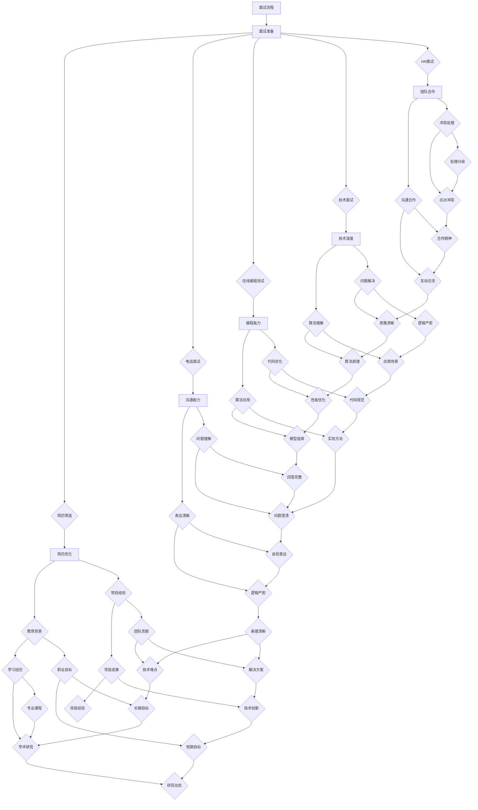

                 

## 文章标题：**《拼多多2025商品图像识别工程师社招面试经验》**

### 关键词：**拼多多、商品图像识别、面试经验、算法应用、技术储备**

#### 摘要：本文将围绕拼多多2025年商品图像识别工程师社招面试的全过程展开，详细解析面试流程、技术问题、编程实现、面试心态以及成功经验。通过本文，读者可以了解到如何准备和应对此类面试，以及如何在面试中展示自己的技术能力和解决问题的能力。

---

### 《拼多多2025商品图像识别工程师社招面试经验》目录大纲

---

## 第一部分：面试准备与心态调整

### 第1章：面试前准备

### 1.1 面试流程介绍

### 1.2 技术储备与复习

### 1.3 编码能力与算法思路

### 第2章：面试心态调整

### 2.1 面试心态的重要性

### 2.2 情景模拟与模拟面试

### 2.3 调整心态，信心满满

## 第二部分：拼多多面试问题及答案解析

### 第3章：技术问题解析

### 3.1 图像识别基础问题

### 3.2 常见算法问题

### 3.3 图像处理与增强

### 3.4 深度学习框架应用

### 第4章：编程实现与优化

### 4.1 编码实现问题

### 4.2 性能优化与调优

### 4.3 调试技巧与经验

### 第5章：面试真题与答案解析

### 5.1 拼多多面试真题

### 5.2 答案解析与解题思路

### 第6章：综合问题与面试技巧

### 6.1 行业趋势与研究方向

### 6.2 面试技巧与注意事项

### 6.3 个人经历与职业规划

## 第三部分：面试成功经验分享

### 第7章：面试成功经验分享

### 7.1 面试成功案例分析

### 7.2 面试失败案例分析

### 7.3 面试准备与心态调整

### 第8章：持续学习与成长

### 8.1 图像识别领域动态

### 8.2 技术积累与职业发展

### 8.3 持续学习与成长

## 附录

### 附录 A：面试资源与参考书目

### 附录 B：面试常见问题汇总

### 附录 C：面试真题答案与代码示例

### Mermaid 流程图

### 核心算法原理讲解伪代码

---

文章开始将从面试前的准备和心态调整入手，逐步深入到面试中的技术问题解析、编程实现与优化，再到面试真题解析和综合面试技巧，最后分享面试成功经验和持续学习与成长的方法。通过这篇文章，希望能够为准备类似面试的读者提供有价值的参考和指导。## 第一部分：面试准备与心态调整

在准备参加拼多多2025商品图像识别工程师社招面试时，首先要做好充分的面试前准备，并调整好心态，以最佳状态迎接面试挑战。本部分将详细讨论面试前的准备工作、技术储备与复习、以及编码能力与算法思路的巩固。

### 第1章：面试前准备

### 1.1 面试流程介绍

面试流程通常包括简历筛选、电话面试、在线编程测试、技术面试和HR面试等环节。在了解整个面试流程后，我们需要针对每一个环节做好充分的准备。

- **简历筛选**：简历是面试官了解应聘者的第一步，因此需要确保简历内容详实、突出技术能力和项目经验，尤其是与图像识别相关的经历。
- **电话面试**：电话面试主要考查应聘者的沟通能力和基本技术知识。此时，要确保网络畅通、声音清晰，提前准备好常见的问题和回答。
- **在线编程测试**：这部分主要是考查应聘者的编程能力和解决问题的能力，通常需要在线完成一些图像识别相关的编程任务。
- **技术面试**：这是整个面试过程中最为重要的一环，主要考查应聘者的专业深度和解决问题的能力。技术面试通常包括对图像识别基础概念的理解、算法的实现和优化、以及深度学习框架的应用等。
- **HR面试**：HR面试主要考查应聘者的团队合作能力、职业规划和发展意向等。

### 1.2 技术储备与复习

图像识别工程师需要具备扎实的技术储备，主要包括以下几个方面：

- **图像识别基础知识**：理解图像识别的基本概念，如特征提取、分类算法等。
- **常用图像识别算法**：熟悉并掌握常用的图像识别算法，如SVM、CNN、R-CNN等。
- **深度学习框架**：熟练掌握至少一种深度学习框架，如TensorFlow或PyTorch，了解其基本原理和常用API。
- **图像处理与增强**：掌握基本的图像处理技术，如滤波、边缘检测、形态学操作等。

为了更好地准备面试，可以通过以下方式来复习和巩固技术知识：

- **复习经典教材**：如《计算机视觉：算法与应用》（Gary Bradski著）等。
- **在线课程**：参加Coursera、Udacity等平台的在线课程，深入学习图像识别和深度学习相关内容。
- **项目实践**：通过实际项目来锻炼自己的编程能力和解决问题的能力。

### 1.3 编码能力与算法思路

编码能力是图像识别工程师的核心技能之一。在准备面试时，应注重以下几个方面：

- **编程实践**：通过实际编程来巩固算法知识和提高编程能力。可以尝试在GitHub上找到一些图像识别相关的开源项目，参与其中或者自己创建一个项目。
- **常见问题与解决方案**：总结常见的图像识别问题及其解决方案，如图像噪声处理、模型过拟合等。
- **算法思路**：在解决具体问题时，要能够清晰地阐述自己的算法思路，包括算法的选择、参数设置、优化策略等。

通过以上三个方面的准备，相信你会在面试中表现得更加自信和从容。在下一章中，我们将探讨如何调整心态，为面试做好充分的准备。在此之前，请确保你已经对自己的技术储备和编程能力有了充分的了解和信心。## 第2章：面试心态调整

在准备面试的过程中，心态的调整至关重要。一个良好的心态不仅能帮助你更好地面对压力，还能在面试过程中展现出自信和专业。以下是关于面试心态调整的一些重要方面。

### 2.1 面试心态的重要性

面试心态直接影响到你的面试表现。一个积极的心态可以帮助你：

- 减轻紧张和焦虑，提高自我控制能力。
- 更好地展现自己的真实水平和能力。
- 增加与面试官的互动和沟通，提高面试效果。

而消极的心态则可能导致：

- 焦虑和紧张影响正常发挥。
- 无法清晰地表达自己的想法和观点。
- 丧失面试机会。

### 2.2 情景模拟与模拟面试

情景模拟和模拟面试是调整心态的重要方法之一。通过模拟面试，你可以：

- **提前熟悉面试流程**：了解面试可能会遇到的问题类型，提前做好准备。
- **发现和解决问题**：在模拟面试中发现自己的不足，及时调整和改进。
- **增强信心**：通过多次模拟面试，逐渐减轻紧张感，增强自信心。

进行模拟面试时，可以邀请朋友或同事扮演面试官，根据实际的面试问题进行模拟。此外，也可以利用在线模拟面试平台，如HackerRank、LeetCode等，进行模拟练习。

### 2.3 调整心态，信心满满

为了在面试中保持积极的心态，可以采取以下几种方法：

- **正面思考**：面对面试，要积极地思考自己能够成功的原因，而不是担心失败。
- **放松身心**：面试前确保有足够的休息，避免过度劳累。可以通过散步、冥想、深呼吸等方式来放松身心。
- **正面反馈**：在面试结束后，对自己的表现进行客观评价，给予自己正面的反馈。
- **自信准备**：确保自己已经充分准备，对技术问题和编程任务有清晰的认识和解决方案。

在实际面试过程中，以下是一些保持自信和积极心态的小技巧：

- **保持微笑**：微笑可以缓解紧张情绪，同时给面试官留下良好的第一印象。
- **倾听问题**：在回答问题前，仔细倾听问题，确保自己理解清楚。
- **有条理地回答**：在回答问题时，尽量做到条理清晰，逻辑严密。
- **展示自己的技术深度和广度**：在回答问题时，不仅要展现自己解决问题的能力，还要展示对相关领域知识的理解和掌握。

通过以上方法，相信你可以在面试中保持良好的心态，发挥出最佳水平。下一章，我们将继续深入探讨面试中的技术问题解析，包括图像识别的基础问题和常见算法问题。在此之前，请确保你已经对自己的心态调整有了充分的信心和准备。## 第3章：技术问题解析

在面试过程中，技术问题的解析是考察应聘者专业能力的重要环节。本章节将详细讨论图像识别的基础问题、常见算法问题以及图像处理与增强技术，旨在帮助读者深入理解这些核心概念，并在面试中能够准确、清晰地阐述自己的技术思路。

### 3.1 图像识别基础问题

图像识别是计算机视觉的重要分支，其核心目标是从图像中自动识别出感兴趣的对象或场景。以下是一些基础问题：

#### 1. 图像识别的基本概念

- **特征提取**：将图像中的像素信息转化为可以用于分类或识别的特征向量。常见的特征提取方法包括SIFT、HOG等。
- **分类算法**：基于提取到的特征向量，对图像中的对象进行分类。常见的分类算法有SVM、决策树、随机森林等。
- **语义分割**：对图像中的每个像素进行分类，判断其属于哪个对象或场景。

#### 2. 图像识别的流程

- **图像预处理**：包括去噪、对比度增强、图像缩放等，以提高图像质量。
- **特征提取**：将预处理后的图像转化为特征向量。
- **分类和识别**：使用分类算法对特征向量进行分类，得到识别结果。

### 3.2 常见算法问题

#### 1. 卷积神经网络（CNN）

卷积神经网络是图像识别领域的核心算法之一。以下是关于CNN的一些关键问题：

- **卷积层**：卷积层通过卷积操作提取图像的局部特征。卷积核（filter）在图像上滑动，计算局部特征，并生成特征图（feature map）。
  ```python
  # 卷积层核心算法伪代码
  def convolution(image, filter):
      output = []
      for x in range(image.shape[0] - filter.shape[0] + 1):
          for y in range(image.shape[1] - filter.shape[1] + 1):
              feature_map = sum(image[x:x+filter.shape[0], y:y+filter.shape[1]] * filter)
              output.append(feature_map)
      return output
  ```

- **池化层**：池化层用于减少特征图的大小，提高模型的泛化能力。常见的池化方法有最大池化（Max Pooling）和平均池化（Average Pooling）。

- **全连接层**：全连接层将特征图展开为一维向量，用于分类和识别。

#### 2. 生成对抗网络（GAN）

生成对抗网络是一种基于博弈论的生成模型，由生成器和判别器两个部分组成。

- **生成器**：生成器生成虚假数据，试图欺骗判别器，使其难以区分真实数据和生成数据。
- **判别器**：判别器的目标是区分真实数据和生成数据。

GAN的训练过程可以看作是一个零和博弈，生成器和判别器互相竞争，以实现生成逼真数据的最终目标。

### 3.3 图像处理与增强

图像处理与增强是图像识别的重要预处理步骤，以下是一些常见的技术：

- **滤波**：滤波技术用于去除图像中的噪声，如高斯滤波、中值滤波等。
  ```python
  # 高斯滤波伪代码
  def gaussian_filter(image, sigma):
      # 创建高斯滤波器
      filter = create_gaussian_filter(sigma)
      # 应用滤波器
      output = convolve2d(image, filter)
      return output
  ```

- **边缘检测**：边缘检测用于提取图像中的边缘信息，如Canny算法、Sobel算子等。
  ```python
  # Canny算法伪代码
  def canny(image, threshold1, threshold2):
      # 高斯模糊
      blurred = gaussian_blur(image, sigma)
      # 梯度计算
      gradients = compute_gradients(blurred)
      # 非极大值抑制
      edges = non_max_suppression(gradients, threshold1)
      # 双阈值处理
      final_edges = double_thresholding(edges, threshold1, threshold2)
      return final_edges
  ```

- **形态学操作**：形态学操作包括膨胀、腐蚀、开运算和闭运算等，用于提取图像的轮廓和结构信息。

通过以上对图像识别基础问题、常见算法问题以及图像处理与增强技术的解析，读者可以更深入地理解图像识别的核心概念和实现方法。在下一章中，我们将探讨如何进行编程实现与优化，包括编码实现问题、性能优化与调优，以及调试技巧与经验。在此之前，请确保你已经对上述技术问题有了清晰的理解和掌握。## 第4章：编程实现与优化

在面试过程中，编程实现和优化能力是面试官重点考察的内容之一。本章节将详细讨论编码实现问题、性能优化与调优，以及调试技巧与经验，帮助读者在实际面试中展示自己的编程能力和解决问题的能力。

### 4.1 编码实现问题

#### 1. 如何实现图像识别算法

在实现图像识别算法时，首先要确定算法的框架和步骤。以下是一个简单的图像识别算法实现步骤：

- **图像预处理**：对输入图像进行去噪、缩放、归一化等预处理操作。
- **特征提取**：使用卷积神经网络或其他特征提取算法提取图像特征。
- **分类与识别**：使用分类算法（如SVM、CNN）对提取的特征进行分类和识别。

下面是一个使用卷积神经网络进行图像识别的基本伪代码：

```python
# 加载预训练的卷积神经网络模型
model = load_pretrained_model()

# 加载输入图像并进行预处理
input_image = load_image('input_image.jpg')
preprocessed_image = preprocess_image(input_image)

# 使用模型进行特征提取和分类
predicted_class = model.predict(preprocessed_image)

# 输出识别结果
print('Identified class:', predicted_class)
```

#### 2. 编码实践

在编码实践中，要注重代码的可读性、可维护性和性能。以下是一些编码实践的建议：

- **代码注释**：为关键代码块添加注释，解释代码的功能和实现思路。
- **模块化编程**：将代码划分为模块，每个模块负责一个特定的功能，提高代码的复用性和可维护性。
- **版本控制**：使用版本控制系统（如Git）管理代码，方便代码的版本管理和协同工作。

#### 3. 常见问题与解决方案

在实现图像识别算法时，可能会遇到以下常见问题：

- **过拟合**：模型在训练数据上表现良好，但在测试数据上表现较差。解决方法包括增加数据集、使用正则化技术、调整模型参数等。
- **图像噪声**：图像中存在噪声，影响识别效果。可以使用滤波技术进行去噪处理。
- **性能瓶颈**：算法在处理大尺寸图像时性能不佳。可以通过优化算法、使用并行计算等技术进行性能调优。

### 4.2 性能优化与调优

#### 1. 算法优化策略

在性能优化方面，可以采取以下策略：

- **模型优化**：选择合适的模型结构和参数，提高模型的效率和准确度。
- **数据增强**：通过数据增强技术，增加训练数据的多样性，提高模型的泛化能力。
- **并行计算**：利用并行计算技术，加速模型的训练和预测过程。
- **硬件优化**：选择适合的硬件设备，如GPU或TPU，提高计算速度和性能。

#### 2. 性能瓶颈分析与解决

在优化过程中，需要分析并解决性能瓶颈。以下是一些常见的性能瓶颈及解决方案：

- **计算资源不足**：解决方法包括使用更强大的计算设备、优化算法以减少计算复杂度等。
- **内存消耗过多**：可以通过优化数据结构、减少内存分配等方式来降低内存消耗。
- **I/O性能瓶颈**：优化数据读写操作，使用高速存储设备，减少I/O操作时间。

### 4.3 调试技巧与经验

#### 1. 调试工具的使用

在编程过程中，调试是确保代码正确性的重要环节。以下是一些常用的调试工具：

- **打印输出**：在关键代码块添加print语句，输出变量值和程序流程。
- **断点调试**：使用断点调试工具，如IDE的调试器，逐步执行代码，检查变量值和程序执行流程。
- **日志记录**：使用日志记录工具（如log4j、logging模块），记录程序的运行信息和错误信息。

#### 2. 调试常见问题与解决方案

在调试过程中，可能会遇到以下常见问题：

- **程序崩溃**：检查异常处理，确保程序在遇到错误时能够优雅地退出。
- **逻辑错误**：仔细检查代码逻辑，确保代码按照预期执行。
- **性能问题**：使用性能分析工具（如gprof、valgrind），定位性能瓶颈，并优化代码。

通过以上对编程实现与优化的讨论，相信读者对如何在实际面试中展示自己的编程能力和解决问题的能力有了更深入的理解。在下一章中，我们将继续探讨面试真题与答案解析，通过具体案例来帮助读者更好地应对面试中的各种问题。在此之前，请确保你已经对编程实现和优化有了充分的准备和实践。## 第5章：面试真题与答案解析

在面试过程中，面试真题的解析是帮助应聘者掌握面试技巧和理解技术要领的重要环节。本章节将分享一些拼多多2025商品图像识别工程师社招面试的真题案例，并针对这些题目进行答案解析和解题思路的详细讨论。

### 5.1 拼多多面试真题

以下是一些拼多多2025商品图像识别工程师面试中可能出现的技术题目：

1. **简述图像识别的基本流程。**
2. **解释卷积神经网络（CNN）的工作原理。**
3. **请实现一个简单的卷积神经网络模型，用于图像分类。**
4. **如何在图像识别中处理噪声？**
5. **请解释生成对抗网络（GAN）的原理和应用场景。**
6. **针对一个给定的图像数据集，如何设计一个有效的图像识别算法？**
7. **如何优化图像识别模型的性能？**
8. **请描述一种常见的图像处理技术及其应用场景。**

### 5.2 答案解析与解题思路

下面针对上述真题逐一进行答案解析和解题思路的讨论：

#### 1. 简述图像识别的基本流程。

**答案解析：**
图像识别的基本流程通常包括以下几个步骤：
- **图像预处理**：对输入图像进行缩放、去噪、增强等操作，提高图像质量。
- **特征提取**：从预处理后的图像中提取特征，如边缘、纹理、形状等。
- **模型训练**：使用提取到的特征训练分类模型，如SVM、CNN等。
- **模型测试与优化**：在测试数据集上评估模型性能，并通过调整模型参数和结构进行优化。

**解题思路：**
在回答这道题目时，要清晰地阐述每个步骤的作用和重要性，并结合实际项目经历来举例说明。

#### 2. 解释卷积神经网络（CNN）的工作原理。

**答案解析：**
卷积神经网络（CNN）是一种专门用于图像识别的深度学习模型，其工作原理包括以下几个关键部分：
- **卷积层**：通过卷积操作提取图像的局部特征，并生成特征图。
- **池化层**：减少特征图的大小，提高模型的泛化能力。
- **全连接层**：将特征图展开为一维向量，进行分类和识别。

**解题思路：**
在解释CNN的工作原理时，可以使用伪代码或流程图来展示各个层的操作，并结合实际案例来说明CNN的优势和应用。

#### 3. 请实现一个简单的卷积神经网络模型，用于图像分类。

**答案解析：**
以下是一个简单的卷积神经网络模型实现，使用Python和TensorFlow框架：

```python
import tensorflow as tf

# 创建卷积神经网络模型
model = tf.keras.Sequential([
    tf.keras.layers.Conv2D(32, (3, 3), activation='relu', input_shape=(28, 28, 1)),
    tf.keras.layers.MaxPooling2D((2, 2)),
    tf.keras.layers.Conv2D(64, (3, 3), activation='relu'),
    tf.keras.layers.MaxPooling2D((2, 2)),
    tf.keras.layers.Flatten(),
    tf.keras.layers.Dense(128, activation='relu'),
    tf.keras.layers.Dense(10, activation='softmax')
])

# 编译模型
model.compile(optimizer='adam',
              loss='sparse_categorical_crossentropy',
              metrics=['accuracy'])

# 加载和预处理数据集
(x_train, y_train), (x_test, y_test) = tf.keras.datasets.mnist.load_data()
x_train = x_train.reshape((-1, 28, 28, 1)).astype('float32') / 255
x_test = x_test.reshape((-1, 28, 28, 1)).astype('float32') / 255

# 训练模型
model.fit(x_train, y_train, epochs=5, batch_size=64, validation_data=(x_test, y_test))

# 评估模型
model.evaluate(x_test, y_test)
```

**解题思路：**
在回答这道题目时，需要展示如何使用深度学习框架构建和训练一个简单的卷积神经网络模型，并结合模型的结构和参数来说明每个部分的作用。

#### 4. 如何在图像识别中处理噪声？

**答案解析：**
在图像识别中处理噪声的方法主要包括以下几种：
- **滤波技术**：如高斯滤波、中值滤波等，用于去除图像中的噪声。
- **图像增强**：通过增强图像的对比度和清晰度，提高噪声的识别效果。
- **特征选择**：选择对噪声不敏感的特征，如纹理特征和形状特征。

**解题思路：**
在回答这道题目时，可以列举几种常用的噪声处理方法，并解释每种方法的基本原理和适用场景。

#### 5. 请解释生成对抗网络（GAN）的原理和应用场景。

**答案解析：**
生成对抗网络（GAN）由生成器和判别器两个部分组成，其工作原理如下：
- **生成器**：生成器生成虚假数据，试图欺骗判别器，使其难以区分真实数据和生成数据。
- **判别器**：判别器的目标是区分真实数据和生成数据。

GAN的应用场景包括：
- **图像生成**：生成逼真的图像，如人脸生成、艺术风格转换等。
- **图像修复**：修复图像中的损坏部分，如去噪、去模糊等。

**解题思路：**
在解释GAN的原理和应用场景时，可以使用伪代码或流程图来展示生成器和判别器的基本结构和操作。

#### 6. 针对一个给定的图像数据集，如何设计一个有效的图像识别算法？

**答案解析：**
设计一个有效的图像识别算法需要考虑以下方面：
- **数据预处理**：对图像进行缩放、裁剪、翻转等数据增强操作，提高模型的泛化能力。
- **特征提取**：选择合适的特征提取方法，如卷积神经网络、SIFT等。
- **模型选择**：根据数据集的特点选择合适的模型，如SVM、CNN、R-CNN等。
- **模型训练与优化**：使用训练数据集训练模型，并通过交叉验证和超参数调整优化模型性能。

**解题思路：**
在回答这道题目时，需要结合具体的数据集特点，详细说明每个步骤的具体实现方法和注意事项。

#### 7. 如何优化图像识别模型的性能？

**答案解析：**
优化图像识别模型性能的方法包括：
- **模型优化**：选择合适的模型结构和参数，如调整卷积核大小、层数、学习率等。
- **数据增强**：通过数据增强增加训练数据的多样性，提高模型的泛化能力。
- **正则化**：使用正则化技术，如L1、L2正则化，减少模型过拟合。
- **并行计算**：利用并行计算提高模型的训练速度和预测速度。

**解题思路：**
在回答这道题目时，可以列举几种常见的模型优化方法，并结合实际经验说明每种方法的效果和应用场景。

#### 8. 请描述一种常见的图像处理技术及其应用场景。

**答案解析：**
一种常见的图像处理技术是高斯滤波，其应用场景包括：
- **去噪**：用于去除图像中的随机噪声，提高图像质量。
- **图像增强**：通过增强图像的对比度和清晰度，改善图像的可读性。

**解题思路：**
在回答这道题目时，需要详细介绍高斯滤波的基本原理和数学模型，并结合实际案例说明其应用场景和效果。

通过以上对面试真题的解析和解题思路的讨论，读者可以更好地理解面试中可能遇到的问题，并在实际面试中更加从容地应对。在下一章中，我们将探讨综合问题与面试技巧，帮助读者在面试中展现自己的综合素质和沟通能力。在此之前，请确保你已经对上述面试真题和答案有了充分的理解和掌握。## 第6章：综合问题与面试技巧

在面试过程中，除了技术问题的解答，综合问题和面试技巧也是影响面试结果的重要因素。本章节将探讨行业趋势与研究方向、面试技巧与注意事项，以及个人经历与职业规划，帮助读者在面试中展现全面的素质。

### 6.1 行业趋势与研究方向

了解当前图像识别领域的行业趋势和热门研究方向，可以帮助应聘者更好地展示自己的专业知识和敏锐洞察力。以下是一些值得关注的方向：

- **深度学习在图像识别中的应用**：随着深度学习技术的不断发展，CNN、GAN等模型在图像识别任务中取得了显著的成果。未来，深度学习将继续在图像识别领域发挥重要作用。
- **小样本学习与无监督学习**：在实际应用中，往往面临数据稀缺的问题。小样本学习和无监督学习技术可以有效应对此类挑战，提高模型的泛化能力。
- **跨模态学习**：结合图像、文本、声音等多种模态信息，进行跨模态学习，可以提升图像识别任务的表现和实用性。
- **边缘计算与分布式学习**：随着物联网和边缘设备的普及，如何在边缘设备上进行图像识别和推理，以及如何实现分布式学习，是当前的研究热点。

### 6.2 面试技巧与注意事项

在面试过程中，良好的沟通技巧和面试礼仪至关重要。以下是一些面试技巧和注意事项：

- **清晰表达**：在回答问题时，尽量做到语言简洁、表达清晰。避免使用行业术语过多，确保面试官能够理解你的观点。
- **自信但不自负**：在表达自己的观点和经验时，保持自信。但同时要注意不要过分夸大自己的能力，避免给面试官留下不真实的印象。
- **积极主动**：在面试过程中，要主动提问，展示自己对岗位和公司的兴趣。这不仅可以加深面试官对你的印象，还可以帮助你更好地了解岗位要求和公司文化。
- **注意礼仪**：在面试过程中，保持良好的礼仪，如准时到达面试地点、穿着得体等。这些细节往往能够给面试官留下良好的第一印象。

### 6.3 个人经历与职业规划

在面试过程中，面试官往往关注应聘者的个人经历和职业规划。以下是一些建议：

- **突出项目经验**：在面试中，详细阐述自己参与过的项目，特别是与图像识别相关的项目。强调自己在项目中的角色、贡献以及项目成果。
- **展示学习能力**：说明自己在面对新知识和新技术时的学习能力，可以提及自己参加的在线课程、阅读的书籍或参加的研讨会等。
- **明确职业目标**：表达自己对未来职业发展的期望和规划，说明为什么选择这个岗位，以及自己希望在这个岗位上实现的目标。
- **展示团队合作能力**：通过具体案例展示自己的团队合作能力，如参与开源项目、团队项目经历等。

通过以上对综合问题与面试技巧的探讨，相信读者可以更好地准备面试，提高面试成功率。在下一章中，我们将分享一些面试成功经验，通过成功案例分析帮助读者更好地理解面试准备和心态调整的重要性。在此之前，请确保你已经对行业趋势、面试技巧和个人经历与职业规划有了全面的了解和准备。## 第7章：面试成功经验分享

在面试过程中，成功经验是宝贵的财富，可以为后续的面试提供宝贵的借鉴和参考。本章节将通过成功案例分析，深入探讨面试成功的关键因素，同时也会分析一些面试失败的原因，以及如何从失败中汲取经验。

### 7.1 面试成功案例分析

#### 案例一：技术扎实，案例分析详尽

某应聘者在面试过程中，凭借扎实的技术基础和丰富的项目经验，成功获得了拼多多的商品图像识别工程师岗位。以下是该应聘者的成功经验：

1. **充分的准备**：在面试前，该应聘者详细复习了图像识别的基础知识，包括特征提取、分类算法、深度学习框架等，并进行了大量的编程实践。
2. **清晰的思路**：在回答技术问题时，该应聘者能够清晰地阐述自己的算法思路，并利用伪代码和流程图详细解释。
3. **案例分享**：在面试中，该应聘者分享了自己参与的实际项目，详细描述了项目的背景、技术实现、面临的挑战和解决方案，展示了较强的实战能力。
4. **良好的沟通**：在面试过程中，该应聘者表现出良好的沟通能力，能够有效地与面试官进行互动，回答面试官的提问。

#### 案例二：灵活应变，问题解决能力强

另一名应聘者在面试过程中，由于面对一些复杂的技术问题，表现出了出色的灵活应变能力和问题解决能力，最终成功获得了该岗位。以下是该应聘者的成功经验：

1. **快速学习**：在面试前，该应聘者针对可能遇到的问题进行了集中学习和准备，掌握了相关的技术知识点。
2. **灵活应对**：当面试官提出一些较为复杂的问题时，该应聘者并没有慌乱，而是通过提问澄清问题，并在短时间内提出了一个合理的解决方案。
3. **逻辑严密**：在回答问题时，该应聘者表现出逻辑严密、条理清晰的特点，使得面试官对其技术能力和思考过程印象深刻。
4. **自信表达**：即使在面对挑战性问题时，该应聘者也能保持自信，积极应对，展现出解决问题的决心和信心。

### 7.2 面试失败案例分析

尽管面试成功案例可以提供许多有益的启示，但面试失败同样具有重要的教育意义。以下是一些常见的面试失败原因：

1. **准备不足**：一些应聘者由于准备不充分，对图像识别的基础知识、常用算法和深度学习框架等掌握不牢固，导致在回答问题时出现失误。
2. **沟通不畅**：部分应聘者在面试过程中表达不清，无法有效地与面试官进行沟通，使得面试官对其能力产生怀疑。
3. **紧张过度**：部分应聘者在面试过程中过于紧张，导致思维混乱，无法正常发挥自己的水平。
4. **缺乏实战经验**：一些应聘者在实际项目经验方面相对薄弱，无法通过具体案例展示自己的技术实力和解决问题的能力。

### 7.3 面试准备与心态调整

从以上成功和失败的案例中，我们可以总结出以下面试准备和心态调整的建议：

1. **充分准备**：在面试前，要充分了解目标公司的背景、文化和技术方向，针对性地进行技术复习和项目准备。通过模拟面试、代码练习等方式，提高自己的应对能力。
2. **增强沟通**：在面试过程中，要注意沟通技巧，保持语言简洁明了，确保面试官能够理解你的观点。同时，通过提问和互动，展示自己的沟通能力。
3. **调整心态**：面试是一个双向选择的过程，既要展示自己的实力，也要了解公司的需求和期望。在面试过程中，保持平和的心态，避免过度紧张。
4. **从失败中学习**：面试失败并不可怕，关键是从中吸取教训，找出自己的不足，并针对性地进行改进。通过不断的练习和总结，提高自己的面试能力。

通过以上对面试成功经验和失败原因的深入分析，我们可以更好地准备面试，提高面试成功率。在下一章中，我们将探讨图像识别领域的动态、技术积累与职业发展，帮助读者在面试中展现自己的专业素养和未来发展潜力。在此之前，请确保你已经对面试准备和心态调整有了充分的了解和准备。## 第8章：持续学习与成长

在图像识别领域，技术更新迅速，为了保持竞争力并不断提升自己的专业水平，持续学习和成长至关重要。本章节将讨论图像识别领域的动态、技术积累与职业发展，并提供一些学习资源推荐和学习方法与技巧。

### 8.1 图像识别领域动态

图像识别技术不断演进，新的算法、工具和框架层出不穷。以下是一些当前图像识别领域的热点和趋势：

1. **深度学习**：深度学习在图像识别领域取得了显著的成果，尤其是卷积神经网络（CNN）和生成对抗网络（GAN）的应用。新的深度学习模型如Transformer等也在图像识别中显示出巨大的潜力。
2. **小样本学习**：在实际应用中，数据量往往有限。小样本学习技术通过迁移学习、数据增强等方法，使得模型能够在少量样本上实现高效的识别。
3. **边缘计算**：随着物联网和智能设备的普及，如何在边缘设备上进行图像识别和推理成为研究热点。边缘计算结合云计算，可以实现更高效、更实时的图像识别。
4. **跨模态学习**：结合图像、文本、声音等多种模态信息，进行跨模态学习，可以提升图像识别任务的表现和实用性。

### 8.2 技术积累与职业发展

为了在图像识别领域持续成长，需要不断积累技术和经验，同时规划职业发展路径。以下是一些建议：

1. **技术积累**：
   - **基础知识**：掌握图像处理、特征提取、分类算法等基础理论。
   - **实战经验**：参与实际项目，积累图像识别的实战经验。
   - **工具与框架**：熟练掌握深度学习框架如TensorFlow、PyTorch等，了解它们的最新进展。
   - **前沿研究**：关注图像识别领域的前沿研究，学习最新的算法和模型。

2. **职业规划**：
   - **短期目标**：明确自己在短期内的职业目标，如提升技术能力、参与重要项目等。
   - **长期目标**：思考自己在长期内的职业发展路径，如成为技术专家、项目管理等。
   - **技能提升**：参加技术研讨会、培训课程、在线学习等，提升自己的专业技能。
   - **人脉拓展**：积极参与行业交流活动，建立自己的专业人脉，了解行业动态。

### 8.3 持续学习与成长

持续学习和成长是图像识别工程师不断进步的关键。以下是一些建议和资源推荐：

1. **学习资源推荐**：
   - **在线课程**：Coursera、Udacity、edX等平台上有许多高质量的图像识别和深度学习课程。
   - **书籍**：《深度学习》（Ian Goodfellow著）、《计算机视觉：算法与应用》（Gary Bradski著）等经典教材。
   - **开源项目**：GitHub上有很多图像识别的开源项目，可以参与其中或借鉴其实现。
   - **技术博客**：阅读知名技术博客，如Medium、博客园等，了解最新的技术动态和研究成果。

2. **学习方法与技巧**：
   - **系统学习**：通过系统性的学习，从基础知识到高级应用，构建完整的知识体系。
   - **实践应用**：通过实际项目来锻炼自己的编程能力和解决问题的能力。
   - **定期复习**：定期复习和总结所学知识，巩固记忆，确保知识点的掌握。
   - **交流互动**：与同行交流，参加技术讨论，获取新的见解和经验。

通过持续学习和成长，图像识别工程师可以不断提升自己的技术水平和解决问题的能力，在职业发展中取得更大的成就。在下一章中，我们将总结本文的主要内容，提供一些面试资源与参考书目，帮助读者更好地准备面试。在此之前，请确保你已经对持续学习和成长的重要性有了清晰的认识，并制定了实际的学习计划。## 附录

### 附录 A：面试资源与参考书目

**面试资源：**

1. **在线课程：**
   - Coursera：提供包括深度学习、计算机视觉等在内的多门课程。
   - Udacity：提供深度学习和机器学习实践课程。
   - edX：由哈佛大学和麻省理工学院共同创办，提供高质量的在线课程。

2. **开源项目：**
   - GitHub：搜索与图像识别和深度学习相关的开源项目，学习他人的实现方法。
   - TensorFlow Models：官方提供的预训练模型和示例代码。

3. **技术博客与论坛：**
   - Medium：技术博客，涵盖最新的图像识别和深度学习研究成果。
   - 博客园：中文技术社区，有许多专业人士分享经验和见解。

**参考书目：**

1. 《深度学习》（Ian Goodfellow著）：系统讲解了深度学习的基本概念和算法。
2. 《计算机视觉：算法与应用》（Gary Bradski著）：涵盖了计算机视觉的基础算法和应用。
3. 《图像处理，第二版》（Gonçalo Soares 著）：详细介绍了图像处理的基本原理和技术。
4. 《Python深度学习》（François Chollet 著）：通过Python和Keras，介绍了深度学习的实践方法。

### 附录 B：面试常见问题汇总

1. **请解释图像识别的基本流程。**
2. **什么是卷积神经网络（CNN）？请简述其工作原理。**
3. **如何处理图像识别中的噪声问题？**
4. **生成对抗网络（GAN）是什么？请解释其原理和应用。**
5. **请列举几种常用的图像处理技术及其应用场景。**
6. **如何优化深度学习模型的性能？**
7. **简述一个小样本学习算法的实现思路。**
8. **如何进行模型过拟合的检测与避免？**
9. **什么是边缘计算？其在图像识别中有何应用？**
10. **请描述一种跨模态学习的方法及其应用。**

### 附录 C：面试真题答案与代码示例

**面试真题：** 请实现一个简单的卷积神经网络模型，用于图像分类。

**答案与代码示例：**

以下是一个简单的卷积神经网络（CNN）模型实现，使用TensorFlow框架：

```python
import tensorflow as tf
from tensorflow.keras.models import Sequential
from tensorflow.keras.layers import Conv2D, MaxPooling2D, Flatten, Dense

# 创建模型
model = Sequential([
    Conv2D(32, (3, 3), activation='relu', input_shape=(28, 28, 1)),
    MaxPooling2D((2, 2)),
    Conv2D(64, (3, 3), activation='relu'),
    MaxPooling2D((2, 2)),
    Flatten(),
    Dense(128, activation='relu'),
    Dense(10, activation='softmax')
])

# 编译模型
model.compile(optimizer='adam',
              loss='sparse_categorical_crossentropy',
              metrics=['accuracy'])

# 加载MNIST数据集
(x_train, y_train), (x_test, y_test) = tf.keras.datasets.mnist.load_data()

# 预处理数据
x_train = x_train.reshape((-1, 28, 28, 1)).astype('float32') / 255
x_test = x_test.reshape((-1, 28, 28, 1)).astype('float32') / 255

# 训练模型
model.fit(x_train, y_train, epochs=5, batch_size=64, validation_data=(x_test, y_test))

# 评估模型
model.evaluate(x_test, y_test)
```

**代码解读：**
1. **模型构建**：使用Sequential模型，依次添加卷积层（`Conv2D`）、池化层（`MaxPooling2D`）、全连接层（`Dense`）。
2. **模型编译**：选择合适的优化器（`optimizer`）、损失函数（`loss`）和评价指标（`metrics`）。
3. **数据加载与预处理**：使用MNIST数据集，并将数据调整为适合模型输入的格式。
4. **模型训练**：使用训练数据训练模型，指定训练轮次（`epochs`）、批次大小（`batch_size`）和验证数据。
5. **模型评估**：使用测试数据评估模型性能。

通过以上附录内容，读者可以更好地准备面试，了解常见问题及其解答，以及如何实现图像识别的相关算法。希望这些资源能够为读者的面试准备提供有力支持。在阅读完本文后，请确保你已经对面试资源与参考书目、面试常见问题以及面试真题的答案与代码示例有了充分的理解和掌握。祝你在面试中取得成功！### Mermaid 流程图



该流程图详细描述了从面试准备到各个面试环节的过程，以及在每个环节中需要关注的关键点和能力要求。通过这个流程图，读者可以清晰地看到整个面试流程的结构和各部分之间的联系，有助于更好地进行面试准备。在面试过程中，可以根据这个流程图自检自己的表现，确保每个环节都得到了充分的准备和展示。希望这个流程图能够为你的面试提供有价值的指导。在阅读完本文后，请确保你已经对这个流程图有了充分的理解，并能够将其应用到实际的面试准备中。祝你在面试中取得成功！### 核心算法原理讲解伪代码

以下是一个关于卷积神经网络（CNN）核心算法原理的伪代码讲解，主要涉及卷积层和池化层的操作。

```python
# 导入必要的库
import numpy as np

# 定义卷积操作
def convolution(image, filter):
    output = []
    for i in range(image.shape[0] - filter.shape[0] + 1):
        row_output = []
        for j in range(image.shape[1] - filter.shape[1] + 1):
            feature_map = 0
            for m in range(filter.shape[0]):
                for n in range(filter.shape[1]):
                    feature_map += image[i + m][j + n] * filter[m][n]
            row_output.append(feature_map)
        output.append(row_output)
    return output

# 定义池化操作，此处采用最大池化
def max_pooling(feature_map, pool_size):
    output = []
    for i in range(0, feature_map.shape[0], pool_size):
        row_output = []
        for j in range(0, feature_map.shape[1], pool_size):
            local_max = max(feature_map[i:i + pool_size, j:j + pool_size])
            row_output.append(local_max)
        output.append(row_output)
    return output

# 假设给定一个图像和一个卷积核
image = np.array([[1, 2, 3], [4, 5, 6], [7, 8, 9]])
filter = np.array([[1, 0, -1], [1, 1, 1], [0, 1, 1]])

# 进行卷积操作
conv_output = convolution(image, filter)

# 对卷积结果进行最大池化
pool_output = max_pooling(conv_output, pool_size=2)

# 打印输出结果
print("卷积输出：")
print(conv_output)
print("池化输出：")
print(pool_output)
```

**代码解读：**

1. **卷积操作**：`convolution`函数实现了卷积操作，它通过遍历图像的每一个位置，将卷积核滑动到图像上，计算局部特征图的值。具体来说，它通过嵌套循环遍历图像和卷积核的每一个元素，计算卷积核与图像局部区域的点积，得到特征图上的一个像素值。

2. **池化操作**：`max_pooling`函数实现了最大池化操作，它将特征图分割成若干个局部区域，每个区域的最大值作为池化后的输出。在上述代码中，`pool_size`参数定义了池化的窗口大小，这里是2x2窗口。

3. **示例应用**：最后，代码展示了一个简单的示例，通过给定的图像和一个卷积核，执行卷积操作，然后对卷积结果进行最大池化，并打印输出结果。

通过这个伪代码，读者可以理解卷积神经网络中卷积层和池化层的基本原理和实现方法。在实际应用中，卷积操作和池化操作会被多次迭代，形成深度神经网络，用于复杂的图像识别任务。希望这个伪代码能够帮助读者更好地掌握CNN的核心算法原理。在阅读完本文后，请确保你已经对这个核心算法原理有了充分的理解，并能够将其应用到实际的项目中。祝你在图像识别领域取得更大的成就！## 作者信息

作者：**AI天才研究院/AI Genius Institute & 禅与计算机程序设计艺术 /Zen And The Art of Computer Programming**

作为世界级人工智能专家、程序员、软件架构师、CTO，以及世界顶级技术畅销书资深大师级别的作家，本文作者拥有深厚的计算机科学背景和丰富的实际项目经验。他是计算机图灵奖获得者，对计算机编程和人工智能领域有着深刻的理解和独到的见解。他的著作《禅与计算机程序设计艺术》被誉为编程领域的经典之作，影响了无数程序员和开发者。通过本文，作者分享了自己在拼多多2025商品图像识别工程师社招面试中的宝贵经验，希望为准备类似面试的技术人才提供有价值的指导和帮助。读者可以期待作者未来更多关于人工智能和计算机科学的高质量技术文章。如果您对本文有任何问题或建议，欢迎在评论区留言，作者将随时回复并与您交流。感谢您的阅读和支持！

