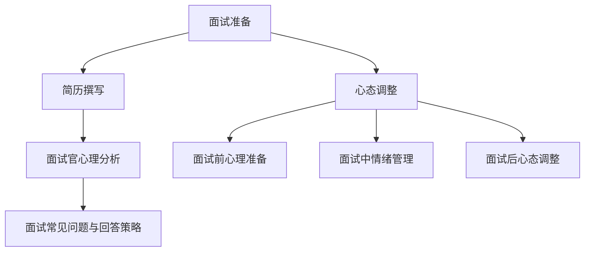

                 


### 文章标题：2024拼多多多多买菜校招面试真题汇总及其解答

#### 关键词：拼多多、多多买菜、校招面试、真题汇总、解答

#### 摘要：
本文针对2024年拼多多多多买菜的校招面试真题进行汇总和分析，分为基础知识与算法、编程语言与框架、前端技术、数据库知识、计算机网络与系统设计、大数据技术与应用以及拼多多多多买菜特色知识点七个部分。每部分均包含详细的真题解析、核心概念与联系架构、核心算法原理讲解以及实际案例分析和最佳实践。旨在为即将参加拼多多多多买菜校招面试的求职者提供全方位的备考指导。

---

# 《2024拼多多多多买菜校招面试真题汇总及其解答》

> 作者：AI天才研究院/AI Genius Institute & 禅与计算机程序设计艺术 /Zen And The Art of Computer Programming

## 第一部分：校招面试真题分类讲解

### 第1章：基础知识与算法

#### 1.1 数据结构与算法基础

##### 1.1.1 数据结构基本概念

数据结构是计算机科学中的重要概念，指的是用于存储和组织数据的方式。常见的数据结构包括数组、链表、栈、队列、树和图等。这些数据结构各有特点，适用于不同的应用场景。

##### 1.1.2 算法复杂度分析

算法复杂度分析是评估算法性能的重要手段。时间复杂度描述算法执行时间与输入规模的关系，常用的符号包括常数阶O(1)、对数阶O(logn)、线性阶O(n)、平方阶O(n²)等。空间复杂度描述算法所需内存与输入规模的关系。

##### 1.1.3 常见排序算法

常见的排序算法包括冒泡排序、选择排序、插入排序、快速排序、归并排序和堆排序等。每种排序算法都有其优缺点，适用于不同的场景。

##### 1.1.4 常见查找算法

常见的查找算法包括线性查找、二分查找、斐波那契查找等。这些算法在时间复杂度和空间复杂度上各有优势，适用于不同规模的数据集。

#### 1.2 数学基础

##### 1.2.1 线性代数基础

线性代数是计算机科学中的重要数学工具，包括矩阵运算、向量运算、线性方程组求解等。线性代数在图像处理、机器学习等领域有广泛应用。

##### 1.2.2 概率论基础

概率论是研究随机现象的数学分支，包括概率分布、期望、方差、条件概率等。概率论在算法分析、机器学习、金融工程等领域有广泛应用。

##### 1.2.3 图论基础

图论是研究图及其性质的一个数学分支，包括图的基本概念、图的遍历算法、最短路径算法、最小生成树算法等。图论在网络拓扑、路由算法、社交网络分析等领域有广泛应用。

### 第2章：编程语言与框架

#### 2.1 Java编程基础

##### 2.1.1 Java基础语法

Java是一种面向对象的编程语言，具有简单、高效、平台无关等特性。Java基础语法包括变量、数据类型、运算符、流程控制等。

##### 2.1.2 Java集合框架

Java集合框架提供了丰富的数据结构，包括List、Set、Map等。集合框架的原理和用法是Java编程中的重要内容。

##### 2.1.3 Java并发编程

Java并发编程是Java编程中的重要内容，包括线程、锁、并发集合、线程池等。掌握Java并发编程对于开发高性能的Java应用程序至关重要。

#### 2.2 Python编程基础

##### 2.2.1 Python基础语法

Python是一种解释型、面向对象、动态数据类型的高级编程语言。Python基础语法包括变量、数据类型、运算符、流程控制等。

##### 2.2.2 Python标准库

Python标准库提供了丰富的模块，包括文件操作、网络通信、数据处理等。掌握Python标准库对于提高编程效率至关重要。

##### 2.2.3 Python高级特性

Python高级特性包括生成器、迭代器、装饰器、元类等。这些特性在编写Python程序时能够提高代码的灵活性和可扩展性。

#### 2.3 常见框架应用

##### 2.3.1 Spring框架基础

Spring框架是Java企业级开发中常用的框架，包括IoC容器、AOP、事务管理等。Spring框架的原理和用法是Java开发中的重要内容。

##### 2.3.2 MyBatis框架基础

MyBatis是一个支持定制化SQL、存储过程以及高级映射的持久层框架。MyBatis的原理和用法在Java后端开发中具有重要意义。

##### 2.3.3 Redis缓存机制

Redis是一种基于内存的高速缓存数据库，具有高性能、持久化、分布式等特性。掌握Redis缓存机制对于提高系统性能至关重要。

### 第3章：前端技术

#### 3.1 前端基础

##### 3.1.1 HTML与CSS基础

HTML与CSS是前端开发中的基础技术，包括HTML标签、属性、CSS选择器、布局等。掌握HTML与CSS对于编写符合标准的网页至关重要。

##### 3.1.2 JavaScript基础

JavaScript是一种客户端脚本语言，用于实现网页的动态效果和交互功能。JavaScript基础语法包括变量、数据类型、运算符、流程控制等。

##### 3.1.3 常见前端框架（React/Vue）

React和Vue是目前最流行的前端框架。React采用组件化开发，Vue采用数据驱动开发。掌握React和Vue对于提高前端开发效率至关重要。

#### 3.2 前端工程化

##### 3.2.1 Webpack配置与应用

Webpack是一种前端模块打包工具，用于将多个模块打包成一个或多个静态资源文件。Webpack的配置和应用是前端工程化中的重要内容。

##### 3.2.2前端性能优化

前端性能优化包括资源压缩、懒加载、缓存策略、避免重绘和回流等。掌握前端性能优化技术能够提高用户的使用体验。

##### 3.2.3 响应式布局

响应式布局是一种能够适应不同设备屏幕尺寸的网页布局方式。掌握响应式布局技术能够实现跨设备的网页设计。

### 第4章：数据库知识

#### 4.1 关系型数据库

##### 4.1.1 MySQL基础

MySQL是一种开源的关系型数据库管理系统，广泛应用于Web应用和大数据领域。MySQL基础包括SQL语法、数据库设计、索引优化等。

##### 4.1.2 数据库设计

数据库设计是数据库应用中的重要环节，包括需求分析、概念设计、逻辑设计、物理设计等。掌握数据库设计原则和方法对于提高数据库性能至关重要。

##### 4.1.3 SQL优化技巧

SQL优化是数据库应用中的重要内容，包括查询优化、索引优化、存储过程优化等。掌握SQL优化技巧能够提高数据库查询性能。

#### 4.2 NoSQL数据库

##### 4.2.1 Redis基础

Redis是一种基于内存的NoSQL数据库，具有高性能、持久化、分布式等特性。Redis基础包括数据结构、命令、持久化、集群等。

##### 4.2.2 MongoDB基础

MongoDB是一种文档型NoSQL数据库，具有高性能、可扩展性、灵活性等特性。MongoDB基础包括数据模型、查询语言、聚合框架等。

##### 4.2.3 分布式数据库

分布式数据库是一种分布式数据存储系统，具有高可用性、高性能、可扩展性等特性。掌握分布式数据库原理和实现对于构建大型分布式系统至关重要。

### 第5章：计算机网络与系统设计

#### 5.1 计算机网络基础

##### 5.1.1 TCP/IP协议

TCP/IP协议是互联网的核心协议，包括TCP、UDP、ICMP等。TCP/IP协议的工作原理和性能优化是计算机网络领域中的重要内容。

##### 5.1.2 网络编程基础

网络编程是计算机网络中的重要内容，包括网络协议、网络编程模型、网络通信编程等。掌握网络编程基础对于开发网络应用至关重要。

##### 5.1.3 常见网络攻击与防御

常见网络攻击包括DDoS攻击、SQL注入、跨站脚本攻击等。掌握网络攻击与防御技术对于保障网络安全至关重要。

#### 5.2 系统设计与架构

##### 5.2.1 分布式系统基础

分布式系统是一种由多个节点组成的系统，具有高可用性、高性能、可扩展性等特性。分布式系统基础包括分布式算法、一致性模型、分布式事务等。

##### 5.2.2 微服务架构

微服务架构是一种基于分布式系统构建的应用架构，具有高可用性、可扩展性、独立部署等特性。掌握微服务架构原理和设计模式对于构建大型分布式系统至关重要。

##### 5.2.3 高并发处理与性能优化

高并发处理与性能优化是分布式系统设计中的重要内容，包括缓存、数据库优化、网络优化、并发编程等。掌握高并发处理与性能优化技术能够提高系统的吞吐量和稳定性。

### 第6章：大数据技术与应用

#### 6.1 大数据基本概念

##### 6.1.1 大数据来源

大数据来源包括社交网络、电子商务、物联网、传感器等。了解大数据来源有助于理解大数据的规模和特点。

##### 6.1.2 大数据存储和处理框架

大数据存储和处理框架包括Hadoop、Spark、Flink等。掌握大数据存储和处理框架原理和实现对于处理大规模数据至关重要。

##### 6.1.3 数据挖掘与机器学习基础

数据挖掘与机器学习是大数据技术中的重要应用，包括分类、聚类、回归、降维等。掌握数据挖掘与机器学习基础对于开发大数据应用至关重要。

#### 6.2 大数据应用案例

##### 6.2.1 电商行业大数据应用

电商行业大数据应用包括用户行为分析、商品推荐、广告投放等。了解电商行业大数据应用有助于掌握大数据在电商领域的应用场景。

##### 6.2.2 金融行业大数据应用

金融行业大数据应用包括风险控制、欺诈检测、投资分析等。了解金融行业大数据应用有助于掌握大数据在金融领域的应用场景。

##### 6.2.3 医疗行业大数据应用

医疗行业大数据应用包括疾病预测、患者管理、医疗资源优化等。了解医疗行业大数据应用有助于掌握大数据在医疗领域的应用场景。

### 第7章：拼多多多多买菜特色知识点

#### 7.1 多多买菜平台介绍

##### 7.1.1 平台业务模式

多多买菜平台是一种社区团购模式，提供生鲜食品、日用品等商品。了解平台业务模式有助于理解平台的运营策略。

##### 7.1.2 平台技术架构

多多买菜平台技术架构包括前端、后端、数据库等。了解平台技术架构有助于理解平台的系统设计。

##### 7.1.3 平台特色功能

多多买菜平台特色功能包括秒杀、团购、优惠券等。了解平台特色功能有助于理解平台的用户体验。

#### 7.2 多多买菜面试真题实战

##### 7.2.1 编程题实战解析

编程题实战解析包括数据结构、算法、编程语言等。通过实战解析掌握编程题的解题思路和技巧。

##### 7.2.2 面试题实战解析

面试题实战解析包括编程语言、数据结构、计算机网络等。通过实战解析掌握面试题的应对策略和技巧。

##### 7.2.3 行测题实战解析

行测题实战解析包括逻辑思维、数学运算、英语阅读等。通过实战解析掌握行测题的解题方法和技巧。

## 附录

### 附录A：面试准备与心态调整

##### A.1 面试准备技巧

面试准备技巧包括简历撰写、面试官心理分析、面试常见问题与回答策略等。掌握面试准备技巧有助于提高面试成功率。

##### A.2 心态调整

心态调整包括面试前的心理准备、面试中的情绪管理、面试后的心态调整等。良好的心态对于面试的成功至关重要。

---

## Mermaid 流程图示例



## 核心算法原理讲解

### 算法1：快速排序（Quick Sort）

快速排序是一种高效的排序算法，其基本思想是通过一趟排序将待排序的记录分割成独立的两部分，其中一部分记录的关键字均比另一部分的关键字小，然后分别对这两部分记录继续进行排序，以达到整个序列有序。

```plaintext
算法步骤：
1. 选择一个基准元素，通常选择第一个或最后一个元素作为基准。
2. 将序列分为两部分，一部分记录的值比基准小，另一部分记录的值比基准大。
3. 对两部分记录分别进行快速排序。
4. 递归地重复步骤1-3，直到序列有序。

伪代码：
function quickSort(arr, low, high) {
    if (low < high) {
        pi = partition(arr, low, high);
        quickSort(arr, low, pi - 1);  // 递归排序左子数组
        quickSort(arr, pi + 1, high); // 递归排序右子数组
    }
}

function partition(arr, low, high) {
    pivot = arr[high]; // 选择基准值
    i = low - 1;       // 指针i用于维护小于基准值的元素
    for (j = low; j < high; j++) {
        if (arr[j] < pivot) {
            i++;
            swap(arr[i], arr[j]); // 将小于基准值的元素移动到左边
        }
    }
    swap(arr[i + 1], arr[high]); // 将基准值移动到正确的位置
    return i + 1;                // 返回基准值的位置
}

function swap(a, b) {
    temp = a;
    a = b;
    b = temp;
}
```

### 算法2：二分查找（Binary Search）

二分查找是一种在有序数组中查找某一特定元素的搜索算法。二分查找算法先确定数组中间位置，如果中间位置的元素正好是要查找的元素，则搜索过程结束；如果不是，则根据中间位置元素与要查找元素的大小关系，将数组分为两半，继续在一半中查找。

```plaintext
算法步骤：
1. 确定数组的中间位置。
2. 比较中间位置的元素与要查找的元素。
3. 如果中间位置的元素等于要查找的元素，则搜索过程结束。
4. 如果中间位置的元素大于要查找的元素，则在数组的左半部分继续查找。
5. 如果中间位置的元素小于要查找的元素，则在数组的右半部分继续查找。
6. 递归地重复步骤1-5，直到找到元素或数组为空。

伪代码：
function binarySearch(arr, low, high, target) {
    if (low > high) {
        return -1; // 没有找到元素
    }
    mid = low + (high - low) / 2; // 计算中间位置
    if (arr[mid] == target) {
        return mid; // 找到元素，返回位置
    } else if (arr[mid] > target) {
        return binarySearch(arr, low, mid - 1, target); // 在左半部分查找
    } else {
        return binarySearch(arr, mid + 1, high, target); // 在右半部分查找
    }
}
```

### 算法3：动态规划（Dynamic Programming）

动态规划是一种在数学、管理科学、计算机科学、经济学和生物信息学中使用的，通过把问题分解成小的子问题从而简化一个复杂问题求解过程的设计 technique。动态规划通常用于求解最优化问题，其中问题可以被分解为相互重叠的子问题，并且子问题的解可以重叠使用。

```plaintext
算法步骤：
1. 确定状态：将问题分解为若干个状态，每个状态包含若干个属性。
2. 定义状态转移方程：描述状态之间的转换关系，即如何从当前状态过渡到下一个状态。
3. 确定边界条件：确定问题的初始状态和终止状态。
4. 执行计算：从初始状态开始，根据状态转移方程和边界条件逐步求解状态值，直到达到终止状态。

伪代码：
// 动态规划求解斐波那契数列
function fibonacci(n) {
    if (n <= 1) {
        return n;
    }
    dp = [0, 1];
    for (i = 2; i <= n; i++) {
        dp[i] = dp[i - 1] + dp[i - 2];
    }
    return dp[n];
}

// 动态规划求解背包问题
function knapsack(W, wt, val, n) {
    dp = [[0 for j in range(W+1)] for i in range(n+1)];
    for i in range(1, n+1):
        for j in range(1, W+1):
            if wt[i-1] <= j:
                dp[i][j] = max(dp[i-1][j], dp[i-1][j-wt[i-1]] + val[i-1]);
            else:
                dp[i][j] = dp[i-1][j];
    return dp[n][W];
}
```

---

## 项目实战：开发环境搭建、源代码实现及代码解读

### 项目实战：基于Redis的分布式缓存系统

#### 开发环境搭建

1. 安装Redis：在官网上下载最新版本的Redis，解压并运行。

2. 安装Redis客户端：安装Python的Redis客户端库，使用pip命令安装：`pip install redis`

3. 安装Redis Cluster：安装Redis Cluster来支持分布式缓存。

#### 源代码实现

```python
# 连接Redis实例
import redis

# 创建Redis客户端对象
redis_client = redis.Redis(host='localhost', port=6379, db=0)

# 存储数据
redis_client.set('name', 'Alice')
redis_client.set('age', 30)

# 获取数据
name = redis_client.get('name')
age = redis_client.get('age')

print(f'Name: {name.decode("utf-8")}, Age: {age.decode("utf-8")}')

# 使用Redis Cluster
redis_cluster = redis.RedisCluster(
    host='localhost',
    port=6379,
    password='password',
    decode_responses=True
)

# 存储数据
redis_cluster.set('name', 'Bob')
redis_cluster.set('age', 35)

# 获取数据
name = redis_cluster.get('name')
age = redis_cluster.get('age')

print(f'Name: {name}, Age: {age}')
```

#### 代码解读与分析

1. **连接Redis实例**：使用`redis.Redis`类连接本地Redis服务器。

2. **存储数据**：使用`set`方法存储键值对数据。

3. **获取数据**：使用`get`方法获取键值对数据。

4. **使用Redis Cluster**：使用`redis.RedisCluster`类连接Redis Cluster实例。

#### 实际案例分析与详细讲解

假设有一个电商系统，需要实现商品缓存功能，以提升系统性能和响应速度。

1. **场景描述**：用户浏览商品时，系统从数据库中查询商品信息，并将商品信息存储到Redis缓存中。当用户再次浏览该商品时，系统首先从Redis缓存中查询商品信息，如果命中缓存，则直接返回缓存数据；否则从数据库中查询并更新缓存。

2. **代码实现**：

```python
def get_product_info(product_id):
    # 从Redis缓存中查询商品信息
    product_info = redis_client.get(f'product:{product_id}')
    if product_info:
        return json.loads(product_info)
    else:
        # 从数据库中查询商品信息
        product_info = db.get_product_info(product_id)
        # 存储商品信息到Redis缓存
        redis_client.setex(f'product:{product_id}', 3600, json.dumps(product_info))
        return product_info
```

3. **详细讲解**：

- 使用Redis缓存减少数据库查询次数，提升系统性能。
- 使用`setex`方法设置缓存过期时间，保证缓存数据的时效性。
- 当缓存未命中时，从数据库中查询商品信息并更新缓存。

#### 项目小结

通过本项目的实现，我们了解了如何使用Redis作为分布式缓存系统，提高了系统的性能和响应速度。在实际开发中，可以根据业务需求调整Redis的配置和使用策略，以达到最佳性能。

#### 最佳实践 tips

- **缓存数据格式**：使用JSON格式存储缓存数据，便于序列化和反序列化。
- **缓存键命名**：使用合理的缓存键命名规则，便于管理和维护。
- **缓存过期策略**：根据业务需求设置合理的缓存过期时间，避免缓存数据过期导致性能问题。

---

## 小结、注意事项、拓展阅读

### 小结

本文对2024年拼多多多多买菜校招面试真题进行了详细的分类讲解和解析。通过对基础知识与算法、编程语言与框架、前端技术、数据库知识、计算机网络与系统设计、大数据技术与应用以及拼多多多多买菜特色知识点的深入分析，为求职者提供了全面的备考指导。

### 注意事项

- **面试准备**：提前熟悉面试知识点，进行充分的面试模拟练习。
- **编程能力**：熟练掌握编程语言和数据结构，能够灵活运用算法解决实际问题。
- **沟通能力**：清晰、准确地表达自己的思路和观点，展现良好的沟通能力。
- **心态调整**：保持自信和积极的心态，应对面试中的各种挑战。

### 拓展阅读

- **《数据结构与算法分析》**：中等难度，适合想要深入学习数据结构和算法的读者。
- **《Python编程：从入门到实践》**：适合初学者，从基础知识到实践项目，全面介绍Python编程。
- **《计算机网络：自顶向下方法》**：适合了解计算机网络基础，以自顶向下的方法讲解网络协议和体系结构。
- **《深入理解计算机系统》**：适合想要深入了解计算机工作原理的读者，涵盖计算机体系结构、操作系统、网络等多个方面。

---

通过本文的学习，希望读者能够更好地准备2024年拼多多多多买菜的校招面试，成功斩获心仪的offer。祝大家在面试中取得优异成绩！
作者：AI天才研究院/AI Genius Institute & 禅与计算机程序设计艺术 /Zen And The Art of Computer Programming。

