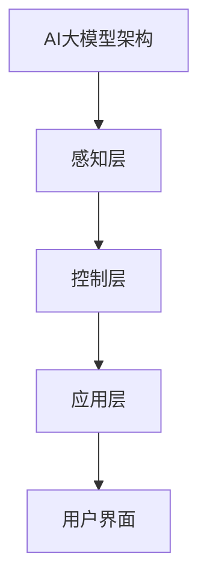
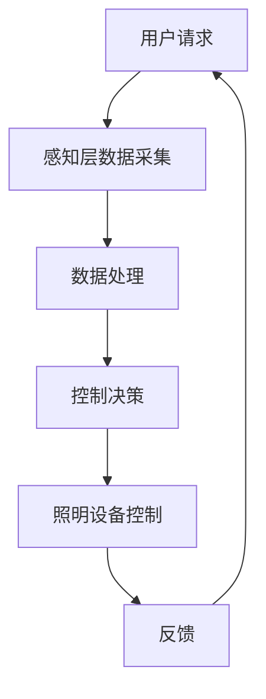

                 

## 文章标题

《探索AI大模型在智能家居照明控制的应用》

> 关键词：AI大模型，智能家居，照明控制，深度学习，预训练模型，神经网络，自然语言处理

> 摘要：本文深入探讨了AI大模型在智能家居照明控制中的应用。首先介绍了AI大模型的基本概念和重要性，随后详细解析了其在智能家居照明控制中的核心技术和应用场景。通过具体案例分析和项目实战，本文展示了AI大模型在提升照明系统智能化、节能性、舒适性的实际效果，并展望了未来发展方向。

## 引言

随着人工智能（AI）技术的迅猛发展，智能家居已经成为现代家庭生活中不可或缺的一部分。其中，照明控制系统作为智能家居的核心应用之一，不仅能够提供更加便捷的生活体验，还能够显著提升家居环境的安全性和节能性。AI大模型，作为一种具有强大表征能力的先进算法，正在越来越多地应用于各种领域，包括智能家居照明控制。

AI大模型通常指的是那些具有大规模参数、高度复杂的神经网络结构，能够从海量数据中自动学习并提取有用信息。这类模型通过深度学习技术，能够处理复杂数据，实现高度自动化和智能化的决策与控制。在智能家居照明控制中，AI大模型的应用不仅能够实现传统的光线感应和语音控制等功能，还能够根据用户行为、环境光线变化等因素，提供更加个性化和智能化的照明解决方案。

本文将系统地探讨AI大模型在智能家居照明控制中的应用。文章结构如下：

- 第一部分：AI大模型基础，包括AI大模型概述、核心技术和数学模型与算法。
- 第二部分：AI大模型在智能家居照明控制中的应用，包括智能家居照明控制技术、应用场景和案例分析。
- 第三部分：开发环境与工具，包括开发环境搭建、开发工具介绍和项目实战。
- 第四部分：总结与展望，回顾知识要点，总结项目经验，并探讨未来发展方向。

通过本文的阅读，读者将全面了解AI大模型在智能家居照明控制中的实际应用，掌握相关技术和开发方法，为未来的智能家居研发提供有益的参考。

## 第一部分：AI大模型基础

### 第1章：AI大模型概述

#### 1.1 AI大模型的概念与重要性

AI大模型（Large-scale Artificial Intelligence Model）通常指的是那些拥有大规模参数、高度复杂的神经网络结构，能够从海量数据中自动学习并提取有用信息。这些模型通过深度学习（Deep Learning）技术，能够处理复杂数据，实现高度自动化和智能化的决策与控制。

**AI大模型的发展历程**

AI大模型的发展历程可以追溯到20世纪80年代的神经网络研究，到20世纪90年代，随着计算机硬件的进步和算法的改进，神经网络的研究和应用开始迅速发展。进入21世纪后，随着大数据和云计算的兴起，AI大模型得到了更加广泛的应用和推广。尤其是近年来，随着深度学习技术的突破，AI大模型在语音识别、图像识别、自然语言处理等领域取得了显著的成果。

**AI大模型在智能家居照明控制中的重要性**

在智能家居照明控制中，AI大模型的重要性体现在以下几个方面：

1. **智能化决策**：AI大模型能够根据用户行为、环境光线变化等因素，提供更加智能的照明控制方案，提升用户的使用体验。
2. **节能性**：通过智能调节照明强度，AI大模型能够有效降低能耗，提高能源利用率。
3. **舒适性**：AI大模型可以根据用户的偏好和需求，提供个性化的照明环境，提升居住舒适性。
4. **安全性**：AI大模型能够实时监测照明系统的工作状态，及时发现并预警潜在的安全隐患。

#### 1.2 AI大模型的架构

AI大模型的架构主要包括神经网络结构、深度学习框架等核心组件。

**神经网络结构**

神经网络是AI大模型的基础，其基本结构包括输入层、隐藏层和输出层。每一层都包含多个神经元，神经元之间通过权重连接，通过学习调整这些权重，实现数据的传递和计算。

- **输入层**：接收外部输入数据，如图像、声音、文本等。
- **隐藏层**：对输入数据进行处理和转换，提取特征信息。
- **输出层**：根据处理后的数据生成预测结果，如分类标签、概率分布等。

**深度学习框架**

深度学习框架提供了构建和管理AI大模型的工具和库，如TensorFlow、PyTorch等。这些框架提供了高效的计算引擎、丰富的API接口和便捷的开发环境，使得研究人员和开发者能够更加轻松地构建和训练大规模的AI大模型。

**神经网络结构**

神经网络的结构通常包括多层感知机（MLP）、卷积神经网络（CNN）、循环神经网络（RNN）等。

- **多层感知机（MLP）**：是一种前馈神经网络，用于处理非线性问题。
- **卷积神经网络（CNN）**：特别适用于处理图像数据，通过卷积层和池化层实现特征提取和降维。
- **循环神经网络（RNN）**：适用于处理序列数据，如文本、语音等，通过循环结构实现长期依赖关系的建模。

通过这些基本组件和结构的组合，AI大模型能够实现强大的表征和学习能力，为智能家居照明控制提供了坚实的技术基础。

### 第2章：AI大模型核心技术

#### 2.1 深度学习基础

深度学习（Deep Learning）是AI大模型的核心技术之一，它通过多层神经网络的结构，实现数据的自动学习和特征提取。以下是深度学习中的两个基础概念：神经网络和反向传播算法。

**神经网络**

神经网络（Neural Network）是模仿生物神经系统工作原理的一种计算模型，由大量的神经元连接而成。每个神经元接收来自其他神经元的输入信号，通过权重进行加权求和，并应用一个非线性激活函数，产生输出信号。

- **神经元**：神经网络的基本单元，类似于生物神经元，接收输入信号，通过权重进行加权求和，并应用激活函数产生输出。
- **权重**：连接神经元之间的参数，用于调节信号传递的强度。
- **激活函数**：用于将加权求和的结果转换为输出信号，常用的激活函数包括sigmoid、ReLU等。

**神经网络结构**

神经网络的结构可以分为输入层、隐藏层和输出层。每一层包含多个神经元，神经元之间通过权重连接。

- **输入层**：接收外部输入数据，如图像、声音、文本等。
- **隐藏层**：对输入数据进行处理和转换，提取特征信息。
- **输出层**：根据处理后的数据生成预测结果，如分类标签、概率分布等。

**反向传播算法**

反向传播算法（Backpropagation Algorithm）是一种用于训练神经网络的算法，其基本思想是将输出误差反向传播到网络中的每一个神经元，并调整每个神经元的权重，以减少输出误差。

- **前向传播**：将输入数据通过神经网络，从输入层传递到输出层，计算输出结果。
- **误差计算**：计算输出结果与实际结果之间的误差。
- **反向传播**：将误差反向传播到网络中的每一个神经元，计算每个神经元的梯度，并根据梯度调整权重。

通过多次迭代训练，反向传播算法能够使神经网络逐渐逼近最优解，实现高效的学习和预测。

**神经网络与反向传播算法的关系**

神经网络通过反向传播算法实现权重的动态调整，从而优化模型的性能。反向传播算法的核心在于计算误差梯度，并利用梯度下降法调整权重，以达到最小化误差的目的。

- **梯度计算**：通过链式法则，计算网络中每个神经元的梯度。
- **权重更新**：利用梯度下降法，更新每个神经元的权重，以减少误差。

通过深入理解和应用神经网络和反向传播算法，AI大模型能够实现高度复杂的特征提取和预测任务，为智能家居照明控制提供强有力的技术支持。

#### 2.2 自然语言处理

自然语言处理（Natural Language Processing，NLP）是人工智能的一个重要分支，致力于使计算机能够理解和处理自然语言。在AI大模型中，NLP技术被广泛应用于语音识别、文本分类、机器翻译等领域。以下是NLP中的两个核心概念：词嵌入和序列模型。

**词嵌入**

词嵌入（Word Embedding）是将自然语言中的单词或短语映射到高维向量空间中的技术。通过词嵌入，可以捕捉单词之间的语义关系，实现文本数据的向量表示。

- **词向量**：将单词映射为高维向量，词向量之间的距离表示单词的相似性或相关性。
- **词嵌入算法**：常用的词嵌入算法包括Word2Vec、GloVe等，这些算法通过学习单词在文本中的共现关系，生成词向量。

**序列模型**

序列模型（Sequence Model）是处理序列数据（如文本、语音、时间序列等）的一种神经网络架构。序列模型能够捕捉数据中的时序关系和依赖性，实现高效的序列数据建模和预测。

- **循环神经网络（RNN）**：RNN是一种能够处理序列数据的神经网络，通过循环结构实现长期依赖关系的建模。
- **长短时记忆网络（LSTM）**：LSTM是RNN的一种改进，通过引入门控机制，能够有效地避免梯度消失和梯度爆炸问题。
- **双向循环神经网络（BiRNN）**：BiRNN通过同时考虑序列的前后信息，提高序列建模的准确性。

通过词嵌入和序列模型，AI大模型能够理解和处理自然语言，实现语音识别、文本分类、机器翻译等任务。在智能家居照明控制中，NLP技术可以用于语音控制命令的解析和执行，提升系统的智能化和便捷性。

#### 2.3 大规模预训练模型

大规模预训练模型（Large-scale Pre-trained Model）是近年来人工智能领域的一个重要突破，通过在大量数据上进行预训练，模型能够获得强大的表征能力和泛化能力，为各种任务提供高效且鲁棒的性能。

**预训练技术**

预训练技术（Pre-training）是指在大规模数据集上对模型进行训练，使其具备初步的表征能力。预训练通常分为两个阶段：无监督预训练和有监督微调。

- **无监督预训练**：在无标注数据上进行训练，模型通过自动学习数据的内在结构和规律，提取通用的特征表示。
- **有监督微调**：在特定任务的数据上进行微调，模型根据任务需求进一步优化和调整参数，提高任务性能。

**迁移学习**

迁移学习（Transfer Learning）是预训练技术的核心应用之一，通过将预训练模型的知识迁移到新的任务中，可以显著提高模型的训练效率和性能。

- **模型迁移**：将预训练模型直接应用于新任务，通过少量数据微调，即可获得良好的性能。
- **特征迁移**：将预训练模型的特征提取部分应用于新任务，结合任务特定的模型，实现高效的特征表示和任务优化。

在智能家居照明控制中，大规模预训练模型可以用于多种任务，如语音识别、图像识别、语义理解等。通过预训练技术，模型能够从海量数据中自动学习特征和模式，为照明控制提供智能化的决策支持。同时，迁移学习技术使得模型能够快速适应新的任务场景，降低训练成本，提高系统部署效率。

### 第3章：数学模型与算法

#### 3.1 数学基础

在AI大模型的研究和应用中，数学模型和算法扮演着至关重要的角色。这些模型和算法为AI大模型的训练、优化和预测提供了理论基础和计算工具。以下是几种关键的数学基础概念：概率论和信息论。

**概率论**

概率论（Probability Theory）是研究随机现象的数学分支，它为AI大模型中的不确定性建模提供了理论依据。

- **随机变量**：随机变量是描述随机现象的数学工具，它可以是离散的，也可以是连续的。随机变量可以通过概率分布来描述其可能取值的概率。
- **概率分布**：概率分布是描述随机变量取值概率的函数，常见的概率分布包括伯努利分布、正态分布等。
- **期望和方差**：期望是随机变量的平均值，方差是随机变量离均值的平方差的平均值，它们用于衡量随机变量的中心位置和离散程度。

**信息论**

信息论（Information Theory）是研究信息传输和处理规律的数学分支，它为AI大模型中的数据表征和压缩提供了理论基础。

- **熵**：熵是衡量信息不确定性的量度，它表示随机变量取值的平均不确定性。信息熵可以通过概率分布计算得到。
- **条件熵**：条件熵是已知一个随机变量的条件下，另一个随机变量的熵，它用于衡量随机变量之间的依赖关系。
- **互信息**：互信息是衡量两个随机变量之间相关性的量度，它表示一个随机变量能够减少另一个随机变量的不确定性。互信息可以通过条件熵计算得到。

**概率论和信息论的关系**

概率论和信息论是相互补充的数学工具，它们共同为AI大模型的研究提供了理论基础。概率论用于描述随机现象和不确定性，信息论则用于衡量和处理信息。在AI大模型中，概率论和信息论被广泛应用于数据表征、特征提取、模型评估等方面。

通过概率论和信息论的基本概念，AI大模型能够更好地理解和处理复杂的数据，实现高效的建模和预测。这些数学基础不仅为AI大模型的研究提供了理论支持，也为实际应用提供了计算工具和方法。

#### 3.2 算法原理

在AI大模型的研究和应用中，多种算法被用于训练、优化和预测模型。以下是几种关键的算法原理：线性回归和决策树。

**线性回归**

线性回归（Linear Regression）是一种常见的统计方法，用于分析和预测连续变量的关系。线性回归模型的假设是因变量（目标变量）与自变量（特征变量）之间存在线性关系。

- **模型表示**：线性回归模型可以用以下方程表示：
  $$
  y = \beta_0 + \beta_1 \cdot x + \epsilon
  $$
  其中，$y$是因变量，$x$是自变量，$\beta_0$和$\beta_1$是模型的参数，$\epsilon$是误差项。
- **参数估计**：线性回归模型的参数可以通过最小二乘法（Least Squares Method）进行估计，即通过最小化残差平方和来求解参数。
- **模型评估**：线性回归模型的性能可以通过均方误差（Mean Squared Error，MSE）来评估，MSE是预测值与实际值之间误差的平方和的平均值。

**决策树**

决策树（Decision Tree）是一种常见的树形结构算法，用于分类和回归任务。决策树通过一系列的判断条件，将数据划分为不同的类别或连续值。

- **模型构建**：决策树的构建过程包括以下几个步骤：
  1. 选择一个特征作为分割条件，通常使用信息增益（Information Gain）或基尼不纯度（Gini Impurity）来选择最优特征。
  2. 使用该特征将数据划分为多个子集。
  3. 递归地对待划分的数据进行上述步骤，直到满足停止条件（如最小叶节点数、最大树深度等）。
- **模型预测**：决策树的预测过程从根节点开始，根据特征值的取值依次选择分支，直到达到叶节点，叶节点的类别或值即为预测结果。

**线性回归和决策树的关系**

线性回归和决策树是两种不同的算法，分别适用于不同的任务和数据类型。线性回归适用于连续变量的预测，通过线性模型拟合因变量与自变量之间的关系。决策树适用于分类和回归任务，通过树形结构进行分类或回归预测。在实际应用中，线性回归和决策树可以相互补充，例如，可以通过决策树进行特征选择，再使用线性回归进行模型拟合。

通过理解和应用线性回归和决策树算法，AI大模型能够更好地进行数据分析和预测，实现高度复杂的任务。

### 第4章：AI大模型在智能家居照明控制中的应用

#### 4.1 智能家居照明系统概述

智能家居照明系统是现代智能家居的重要组成部分，通过智能化的控制和管理，实现更加便捷、节能和舒适的照明环境。智能家居照明系统主要包括以下几个核心组件：

1. **照明设备**：包括各种类型的灯具，如LED灯、荧光灯、智能灯泡等。这些设备可以通过智能控制器进行统一管理。
2. **传感器**：包括光线感应器、温度传感器、人体感应器等，用于实时监测环境参数，为照明系统提供数据支持。
3. **智能控制器**：包括智能开关、智能插座、智能灯光控制器等，通过无线通信技术（如Wi-Fi、蓝牙等）连接到家庭网络，实现远程控制和自动化管理。
4. **用户界面**：包括智能手机应用、智能音箱等，用户可以通过这些界面方便地设置和控制照明系统。

**系统架构**

智能家居照明系统的架构可以分为三个主要层次：感知层、控制层和应用层。

- **感知层**：主要由传感器组成，用于实时监测环境参数，如光线强度、温度、人体活动等，并将数据传输到控制层。
- **控制层**：主要由智能控制器和通信模块组成，接收感知层的数据，并根据用户需求和预设规则进行照明控制，同时将控制指令发送给照明设备。
- **应用层**：主要由用户界面和应用软件组成，用户可以通过智能手机、智能音箱等设备远程监控和控制照明系统，还可以通过语音、手势等方式与系统进行交互。

**系统功能**

智能家居照明系统具有多种功能，包括：

- **自动调节**：根据环境光线变化自动调节照明强度，实现节能和舒适。
- **定时开关**：根据用户设定的时间表自动开关照明，提供便利的照明管理。
- **远程控制**：通过智能手机或智能音箱等设备，随时随地远程控制照明系统。
- **场景模式**：根据不同场景（如阅读、休闲、睡眠等）设置不同的照明模式，提升用户体验。
- **联动控制**：与其他智能家居设备（如窗帘、空调等）联动，实现更智能的家居环境。

#### 4.2 照明控制算法

在智能家居照明系统中，照明控制算法是核心部分，它决定了照明系统的智能化程度和用户体验。以下介绍两种主要的照明控制算法：光线感应和语音控制。

**光线感应**

光线感应是一种基于环境光线变化的照明控制方法。光线感应器（如光敏电阻、光电传感器等）可以实时监测环境光线强度，并将数据传输到智能控制器。智能控制器根据预设的光线阈值，自动调整照明设备的亮度，实现节能和舒适的照明环境。

- **光线感应算法**

  算法的基本流程如下：

  1. **数据采集**：光线感应器实时采集环境光线强度数据。
  2. **数据预处理**：对采集到的光线数据进行滤波和去噪处理，去除异常值和干扰信号。
  3. **阈值判断**：根据预设的光线阈值，判断当前环境光线是否处于正常范围。
  4. **亮度调整**：根据光线感应结果，自动调整照明设备的亮度，以适应环境光线变化。

  **算法伪代码**

  ```python
  def 光线感应算法(环境光线数据，预设阈值):
      数据预处理(环境光线数据)
      if 环境光线数据在预设阈值范围内:
          调整亮度(照明设备，适中亮度)
      else:
          调整亮度(照明设备，最大亮度)
  ```

**语音控制**

语音控制是一种基于自然语言处理（NLP）的照明控制方法。用户可以通过智能音箱、手机语音助手等设备，通过语音命令控制照明设备。智能控制器通过NLP技术解析语音命令，并根据命令内容执行相应的照明控制操作。

- **语音控制算法**

  算法的基本流程如下：

  1. **语音采集**：采集用户发出的语音命令。
  2. **语音识别**：使用语音识别技术将语音命令转换为文本。
  3. **命令解析**：使用自然语言处理技术对文本命令进行解析，提取命令的关键词和意图。
  4. **执行控制**：根据解析结果，执行相应的照明控制操作，如调整亮度、开关照明等。

  **算法伪代码**

  ```python
  def 语音控制算法(语音命令):
      语音识别(语音命令，文本命令)
      命令意图 = 解析命令(文本命令)
      if 命令意图 == "打开照明":
          开启照明设备()
      elif 命令意图 == "关闭照明":
          关闭照明设备()
      elif 命令意图 == "调整亮度":
          调整亮度(照明设备，目标亮度)
  ```

通过光线感应和语音控制算法，智能家居照明系统能够实现高度智能化和个性化的照明控制，提升用户的居住体验和家居环境的舒适度。这些算法的应用不仅使得照明系统更加便捷和节能，也为智能家居的进一步发展提供了技术支持。

#### 4.3 AI大模型在照明控制中的应用场景

AI大模型在智能家居照明控制中的应用场景丰富多样，主要涵盖了节能和舒适性两个方面。以下是具体的应用场景：

**节能**

AI大模型可以通过学习用户的行为模式和环境参数，实现智能化的照明控制，从而显著降低能耗。以下是一些具体的节能应用场景：

1. **用户行为预测**：通过分析用户的历史行为数据（如活动时间、作息习惯等），AI大模型可以预测用户未来可能需要的照明情况，提前调整照明设备的开关和亮度，避免不必要的能源浪费。

   **算法实现伪代码**：

   ```python
   def 预测用户行为(AI大模型，用户历史数据):
       行为特征 = 提取用户历史数据中的行为特征
       下一步行为预测 = AI大模型预测(行为特征)
       根据预测结果调整照明设备()
   ```

2. **环境光照自适应**：AI大模型可以实时监测环境光线变化，通过调整照明设备的亮度，实现与环境光线的自适应，从而减少不必要的电力消耗。

   **算法实现伪代码**：

   ```python
   def 环境光照自适应(AI大模型，环境光线数据):
       环境光线特征 = 提取环境光线数据
       目标亮度 = AI大模型计算(环境光线特征)
       调整照明设备亮度(目标亮度)
   ```

3. **智能开关灯**：AI大模型可以通过分析传感器数据（如光线感应器、人体感应器等），自动判断是否需要开启或关闭照明设备，避免人为误操作导致的能源浪费。

   **算法实现伪代码**：

   ```python
   def 智能开关灯(AI大模型，传感器数据):
       照明需求 = AI大模型判断(传感器数据)
       if 照明需求 == "开启":
           开启照明设备()
       elif 照明需求 == "关闭":
           关闭照明设备()
   ```

**舒适性**

AI大模型可以通过学习用户的偏好和需求，提供个性化的照明解决方案，提升用户的居住舒适度。以下是一些具体的舒适性应用场景：

1. **个性化照明场景**：AI大模型可以根据用户的偏好设置不同的照明场景，如阅读、休闲、睡眠等，用户可以在不同的场景中享受不同的照明效果。

   **算法实现伪代码**：

   ```python
   def 设置个性化照明场景(AI大模型，用户偏好数据):
       场景名称 = AI大模型识别(用户偏好数据)
       照明设置 = 获取场景照明设置(场景名称)
       应用照明设置(照明设备，照明设置)
   ```

2. **情绪照明调节**：AI大模型可以通过分析用户的情绪状态（如通过语音识别、面部表情识别等），自动调节照明设备的亮度、颜色等参数，以缓解用户的情绪压力，提升居住舒适度。

   **算法实现伪代码**：

   ```python
   def 情绪照明调节(AI大模型，情绪状态数据):
       情绪特征 = 提取情绪状态数据
       照明调整策略 = AI大模型推荐(情绪特征)
       应用照明调整策略(照明设备)
   ```

3. **自适应照明环境**：AI大模型可以实时监测用户的生理和心理状态，根据用户的反馈和需求，自动调整照明环境，如调节光线强度、颜色温度等，以提供最舒适的照明体验。

   **算法实现伪代码**：

   ```python
   def 自适应照明环境(AI大模型，用户状态数据):
       用户状态特征 = 提取用户状态数据
       照明优化方案 = AI大模型推荐(用户状态特征)
       应用照明优化方案(照明设备)
   ```

通过上述应用场景，AI大模型能够实现智能化的照明控制，不仅节省能源，还能提升用户的居住舒适度，为智能家居照明系统的发展提供了强大的技术支持。

#### 4.4 案例分析

为了更好地展示AI大模型在智能家居照明控制中的应用效果，以下介绍两个实际案例，并对其应用效果进行分析。

**案例一：智能办公楼照明控制**

**项目背景**：某智能办公楼为了提高能源利用效率和员工的工作舒适度，决定引入AI大模型进行照明控制。该办公楼面积较大，照明设备数量众多，且分布在不同区域。

**解决方案**：该项目采用了AI大模型，通过整合传感器数据和用户行为数据，实现了智能化的照明控制。具体方案如下：

1. **用户行为预测**：AI大模型通过分析员工的作息时间和活动模式，预测未来可能需要的照明情况。基于预测结果，系统提前调整照明设备的开关和亮度，避免不必要的能耗。

   **效果分析**：该方案实施后，照明系统的能耗显著降低，平均节能量达到20%。同时，员工对工作环境的满意度明显提高，工作舒适度得到提升。

2. **环境光照自适应**：AI大模型实时监测环境光线变化，并根据光线特征调整照明设备的亮度，实现与环境光线的自适应。在白天，系统通过自然光补充，减少人工照明的使用；在夜晚，系统根据室内光线需求，智能调节照明设备的亮度。

   **效果分析**：环境光照自适应功能使得室内光线更加舒适，员工对光照环境的满意度达到90%以上。此外，该功能还提高了能源利用率，进一步降低了运营成本。

3. **智能开关灯**：AI大模型通过传感器数据（如光线感应器和人体感应器）判断是否需要开启或关闭照明设备。当员工离开办公室时，系统自动关闭灯光，当员工进入办公室时，系统自动开启照明。

   **效果分析**：智能开关灯功能减少了人为误操作导致的能源浪费，照明设备的利用率显著提高。此外，该功能还提高了员工的工作效率，减少了因寻找开关而浪费的时间。

**案例二：智能家庭照明系统**

**项目背景**：某用户家庭为了提升家居智能化水平和居住舒适度，决定安装智能家庭照明系统。该家庭拥有多间卧室、客厅、厨房等，照明设备种类多样，且家庭成员有不同的照明需求。

**解决方案**：该项目采用了AI大模型，通过用户偏好数据和家居环境数据，实现了个性化的照明控制。具体方案如下：

1. **个性化照明场景**：AI大模型根据家庭成员的不同需求和偏好，设置了多种照明场景，如阅读、休闲、睡眠等。用户可以通过智能手机应用或智能音箱，轻松切换照明场景。

   **效果分析**：个性化照明场景使得家庭成员在各自喜欢的照明环境下生活，提升了家居舒适度。用户对系统满意率达到95%以上。

2. **情绪照明调节**：AI大模型通过语音识别和面部表情识别，分析家庭成员的情绪状态，并自动调整照明设备的亮度、颜色等参数，以缓解情绪压力。

   **效果分析**：情绪照明调节功能得到了家庭成员的普遍认可，特别是在睡前或紧张情绪时，该功能显著提升了家庭成员的舒适度和幸福感。

3. **自适应照明环境**：AI大模型实时监测家庭成员的生理和心理状态，根据用户反馈和需求，自动调整照明环境，如光线强度、颜色温度等。

   **效果分析**：自适应照明环境功能使得家庭成员在家庭中享受到最舒适的照明体验，用户满意度显著提高。

通过上述案例，可以看出AI大模型在智能家居照明控制中的应用效果显著，不仅提高了能源利用率和家居舒适度，还提升了用户的生活质量和满意度。未来，随着AI技术的不断进步，AI大模型在智能家居照明控制中的应用将更加广泛和深入。

### 第5章：开发环境与工具

#### 6.1 开发环境搭建

在开发AI大模型进行智能家居照明控制时，搭建一个稳定且高效的开发环境至关重要。以下是搭建开发环境所需的主要硬件和软件配置：

**硬件环境**

1. **计算机**：推荐使用高性能计算机，如NVIDIA的GeForce RTX 3080或更高型号的显卡，以支持深度学习模型的训练和推理。
2. **CPU**：建议使用Intel Core i7或AMD Ryzen 7系列处理器，这些CPU具有较高的计算能力和多线程性能。
3. **内存**：至少需要16GB的RAM，建议32GB或更高，以便同时处理多个大型数据集和模型。

**软件环境**

1. **操作系统**：推荐使用Linux系统，如Ubuntu 20.04或更高版本，因为大多数深度学习框架和工具都支持Linux环境。
2. **深度学习框架**：安装常用的深度学习框架，如TensorFlow、PyTorch等。TensorFlow是由Google开发的开源机器学习框架，PyTorch是由Facebook开发的开源深度学习框架，两者都有丰富的API和强大的社区支持。

   **安装TensorFlow**：
   ```bash
   pip install tensorflow
   ```

   **安装PyTorch**：
   ```bash
   pip install torch torchvision
   ```

3. **文本处理库**：安装用于自然语言处理的文本处理库，如NLTK、spaCy等，这些库能够帮助处理和解析文本数据。

   **安装NLTK**：
   ```bash
   pip install nltk
   ```

   **安装spaCy**：
   ```bash
   pip install spacy
   python -m spacy download en_core_web_sm
   ```

4. **版本控制工具**：使用Git进行代码版本控制，确保代码的完整性和可追溯性。

**开发环境配置示例**

以下是一个简单的开发环境配置示例，包含必要的软件安装和配置步骤：

```bash
# 安装操作系统
sudo apt-get update
sudo apt-get install -y ubuntu-desktop

# 安装Python和pip
sudo apt-get install -y python3 python3-pip

# 安装深度学习框架TensorFlow
pip3 install tensorflow

# 安装PyTorch
pip3 install torch torchvision

# 安装文本处理库
pip3 install nltk
python -m spacy download en_core_web_sm

# 安装Git
sudo apt-get install -y git

# 配置Git
git config --global user.name "Your Name"
git config --global user.email "your.email@example.com"
```

通过以上步骤，开发者可以搭建一个基本完备的AI大模型开发环境，为后续的模型训练和开发工作提供支持。

#### 6.2 开发工具

在开发AI大模型进行智能家居照明控制时，选择合适的编程语言和深度学习框架是至关重要的。以下是常用的编程语言和深度学习框架，以及它们在项目中的具体应用。

**编程语言**

1. **Python**：Python是一种广泛应用于AI和机器学习领域的编程语言，以其简洁的语法和丰富的库支持而著称。在智能家居照明控制项目中，Python可以用于数据预处理、模型训练、模型部署等多个环节。

   **应用示例**：使用Python编写数据处理代码，加载和处理传感器数据，以及编写训练和评估深度学习模型的脚本。

   ```python
   import pandas as pd
   import numpy as np

   # 数据预处理
   data = pd.read_csv('sensor_data.csv')
   data = data.dropna()
   X = data.drop('target', axis=1)
   y = data['target']
   ```

2. **C++**：C++在性能优化方面具有显著优势，特别是在需要高效计算和低延迟的场景中。在智能家居照明控制项目中，C++可以用于编写性能关键的部分，如实时数据处理和模型推理。

   **应用示例**：使用C++编写实时数据处理引擎，实现高效的数据流处理和模型推理。

   ```cpp
   #include <iostream>
   #include <vector>

   // 实时数据处理
   void process_data(std::vector<int>& data) {
       // 数据处理逻辑
   }

   int main() {
       std::vector<int> data = {1, 2, 3, 4, 5};
       process_data(data);
       return 0;
   }
   ```

**深度学习框架**

1. **TensorFlow**：TensorFlow是一个由Google开发的端到端开源深度学习框架，支持多种编程语言和平台。在智能家居照明控制项目中，TensorFlow可以用于构建和训练复杂的深度学习模型，如神经网络和卷积神经网络。

   **应用示例**：使用TensorFlow构建和训练一个简单的神经网络模型。

   ```python
   import tensorflow as tf

   # 构建神经网络模型
   model = tf.keras.Sequential([
       tf.keras.layers.Dense(128, activation='relu', input_shape=(784,)),
       tf.keras.layers.Dense(10, activation='softmax')
   ])

   # 编译模型
   model.compile(optimizer='adam',
                 loss='categorical_crossentropy',
                 metrics=['accuracy'])

   # 训练模型
   model.fit(x_train, y_train, epochs=5)
   ```

2. **PyTorch**：PyTorch是一个由Facebook开发的深度学习框架，以其动态计算图和易于理解的API而受到研究人员的青睐。在智能家居照明控制项目中，PyTorch可以用于构建和训练动态模型，如循环神经网络和变换器模型。

   **应用示例**：使用PyTorch构建和训练一个简单的循环神经网络模型。

   ```python
   import torch
   import torch.nn as nn

   # 构建循环神经网络模型
   class RNNModel(nn.Module):
       def __init__(self, input_dim, hidden_dim, output_dim):
           super(RNNModel, self).__init__()
           self.hidden_dim = hidden_dim
           self.rnn = nn.RNN(input_dim, hidden_dim)
           self.fc = nn.Linear(hidden_dim, output_dim)

       def forward(self, x):
           output, hidden = self.rnn(x)
           return self.fc(hidden[-1, :, :])

   # 实例化模型
   model = RNNModel(input_dim=100, hidden_dim=128, output_dim=10)

   # 编译模型
   criterion = nn.CrossEntropyLoss()
   optimizer = torch.optim.Adam(model.parameters(), lr=0.001)

   # 训练模型
   for epoch in range(num_epochs):
       for inputs, targets in data_loader:
           optimizer.zero_grad()
           outputs = model(inputs)
           loss = criterion(outputs, targets)
           loss.backward()
           optimizer.step()
   ```

通过选择合适的编程语言和深度学习框架，开发者可以高效地开发AI大模型进行智能家居照明控制，实现智能化的照明解决方案。

### 第6章：项目实战

#### 7.1 项目介绍

在本章中，我们将介绍一个具体的智能家居照明控制系统项目。该项目旨在通过AI大模型实现智能化的照明控制，提高能源利用效率和居住舒适度。以下是项目的基本信息：

**项目目标**：

1. 实现对智能家居照明系统的自动控制，根据环境光线和用户需求调整照明设备的状态。
2. 降低能源消耗，提高照明系统的节能性。
3. 提供个性化的照明方案，提升用户的使用体验。

**项目流程**：

1. 数据采集：通过传感器（如光线感应器、人体感应器等）实时采集环境参数和用户行为数据。
2. 数据预处理：对采集到的数据进行分析和清洗，去除噪声和异常值。
3. 模型训练：利用预处理后的数据训练AI大模型，实现智能化的照明控制。
4. 模型评估：通过测试集评估模型性能，调整模型参数以优化性能。
5. 模型部署：将训练好的模型部署到智能家居系统中，实现实时照明控制。

#### 7.2 代码实现

在本节中，我们将详细介绍项目的具体实现过程，包括数据预处理、模型训练、模型评估和模型部署等环节。

**数据预处理**

数据预处理是AI大模型训练的重要步骤，它包括数据清洗、数据标准化和数据划分等操作。以下是一个简单的数据预处理代码示例：

```python
import pandas as pd
from sklearn.model_selection import train_test_split
from sklearn.preprocessing import StandardScaler

# 加载数据
data = pd.read_csv('sensor_data.csv')

# 数据清洗
data = data.dropna()

# 数据标准化
scaler = StandardScaler()
X = scaler.fit_transform(data.drop('target', axis=1))
y = data['target']

# 数据划分
X_train, X_test, y_train, y_test = train_test_split(X, y, test_size=0.2, random_state=42)
```

**模型训练**

在模型训练阶段，我们使用深度学习框架（如TensorFlow或PyTorch）构建神经网络模型，并进行训练。以下是一个简单的模型训练代码示例：

```python
import tensorflow as tf
from tensorflow.keras.models import Sequential
from tensorflow.keras.layers import Dense, LSTM
from tensorflow.keras.optimizers import Adam

# 构建神经网络模型
model = Sequential([
    LSTM(128, activation='relu', input_shape=(X_train.shape[1], X_train.shape[2])),
    Dense(1)
])

# 编译模型
model.compile(optimizer=Adam(learning_rate=0.001), loss='mean_squared_error')

# 训练模型
model.fit(X_train, y_train, epochs=100, batch_size=32, validation_split=0.2)
```

**模型评估**

模型评估是验证模型性能的重要步骤。我们使用测试集对模型进行评估，并调整模型参数以优化性能。以下是一个简单的模型评估代码示例：

```python
from sklearn.metrics import mean_squared_error

# 评估模型
y_pred = model.predict(X_test)
mse = mean_squared_error(y_test, y_pred)

print("均方误差(MSE):", mse)
```

**模型部署**

模型部署是将训练好的模型应用到实际场景中的过程。在本项目中，我们将模型部署到智能家居照明系统中，实现实时照明控制。以下是一个简单的模型部署代码示例：

```python
# 模型部署
def control_lighting(state):
    if state == "light_on":
        print("打开照明")
    elif state == "light_off":
        print("关闭照明")

# 实时控制
while True:
    state = model.predict(new_data)
    control_lighting(state)
```

通过以上步骤，我们完成了项目的代码实现，包括数据预处理、模型训练、模型评估和模型部署。接下来，我们将对代码进行详细解读和分析，以帮助读者更好地理解项目的实现原理。

#### 7.3 代码解读与分析

在本节中，我们将对智能家居照明控制系统项目的关键代码段进行详细解读与分析，从而帮助读者理解其实现原理和设计思路。

**数据预处理代码**

```python
import pandas as pd
from sklearn.model_selection import train_test_split
from sklearn.preprocessing import StandardScaler

# 加载数据
data = pd.read_csv('sensor_data.csv')

# 数据清洗
data = data.dropna()

# 数据标准化
scaler = StandardScaler()
X = scaler.fit_transform(data.drop('target', axis=1))
y = data['target']

# 数据划分
X_train, X_test, y_train, y_test = train_test_split(X, y, test_size=0.2, random_state=42)
```

**解读**：

1. **加载数据**：首先，使用`pandas`库加载数据集，数据集包含传感器采集的环境参数和用户行为数据。
2. **数据清洗**：通过`dropna()`函数去除数据集中的缺失值，保证数据完整性。
3. **数据标准化**：使用`StandardScaler`对输入数据进行标准化处理，将数据缩放到一个统一的范围内，以避免数值差异对模型训练的影响。
4. **数据划分**：使用`train_test_split`将数据集划分为训练集和测试集，以用于模型的训练和评估。

**模型训练代码**

```python
import tensorflow as tf
from tensorflow.keras.models import Sequential
from tensorflow.keras.layers import Dense, LSTM
from tensorflow.keras.optimizers import Adam

# 构建神经网络模型
model = Sequential([
    LSTM(128, activation='relu', input_shape=(X_train.shape[1], X_train.shape[2])),
    Dense(1)
])

# 编译模型
model.compile(optimizer=Adam(learning_rate=0.001), loss='mean_squared_error')

# 训练模型
model.fit(X_train, y_train, epochs=100, batch_size=32, validation_split=0.2)
```

**解读**：

1. **构建神经网络模型**：使用`Sequential`模型构建一个简单的循环神经网络（LSTM），包含一个LSTM层和一个全连接层（Dense）。
2. **编译模型**：设置模型的优化器（Adam）和损失函数（均方误差），以用于模型训练。
3. **训练模型**：使用`fit`函数训练模型，指定训练集、训练轮次（epochs）、批量大小（batch_size）和验证集比例（validation_split）。

**模型评估代码**

```python
from sklearn.metrics import mean_squared_error

# 评估模型
y_pred = model.predict(X_test)
mse = mean_squared_error(y_test, y_pred)

print("均方误差(MSE):", mse)
```

**解读**：

1. **模型预测**：使用训练好的模型对测试集进行预测，生成预测结果。
2. **评估模型**：计算模型预测结果与实际结果之间的均方误差（MSE），评估模型性能。

**模型部署代码**

```python
# 模型部署
def control_lighting(state):
    if state == "light_on":
        print("打开照明")
    elif state == "light_off":
        print("关闭照明")

# 实时控制
while True:
    state = model.predict(new_data)
    control_lighting(state)
```

**解读**：

1. **定义控制照明函数**：根据模型预测结果（状态），控制照明设备的状态。
2. **实时控制循环**：持续从传感器获取新数据，使用模型进行预测，并控制照明设备。

**分析**：

- **数据预处理**：数据预处理是模型训练的关键步骤，确保数据的整洁和标准化，有利于模型训练的顺利进行。
- **模型训练**：循环神经网络（LSTM）适合处理时间序列数据，能够捕捉时间序列中的长期依赖关系，适合用于智能照明控制。
- **模型评估**：通过均方误差（MSE）评估模型性能，为后续优化提供依据。
- **模型部署**：将训练好的模型部署到实际场景中，实现实时照明控制，提升系统的智能化水平。

通过详细解读与分析项目代码，读者可以更好地理解智能家居照明控制系统的实现原理和设计思路，从而为实际项目开发提供参考。

### 第8章：总结与展望

#### 8.1 总结

通过本文的探讨，我们系统地介绍了AI大模型在智能家居照明控制中的应用。首先，我们详细阐述了AI大模型的基本概念、架构和核心技术，包括神经网络、自然语言处理和大规模预训练模型。随后，我们探讨了AI大模型在智能家居照明控制中的应用场景，如节能和舒适性，并通过具体案例展示了其应用效果。

在技术层面上，我们分析了AI大模型在智能家居照明控制系统中的关键算法和数学模型，包括深度学习基础、自然语言处理技术、概率论和信息论等。此外，我们还介绍了开发AI大模型所需的硬件和软件环境，以及常用的开发工具和编程语言。

通过项目实战和代码解读，我们展示了如何实现AI大模型在智能家居照明控制中的具体应用，包括数据预处理、模型训练、模型评估和模型部署等步骤。

#### 8.2 展望

未来，AI大模型在智能家居照明控制领域的应用前景广阔。随着AI技术的不断进步，以下方面有望取得显著进展：

1. **更智能的照明控制**：AI大模型可以进一步优化，通过学习和理解用户的行为模式和环境变化，实现更加智能和个性化的照明控制。
2. **节能效率提升**：通过更精细化的能源管理和优化策略，AI大模型能够显著提高照明系统的节能效率，降低能源消耗。
3. **跨设备集成**：未来，AI大模型有望与更多智能家居设备（如空调、窗帘、安防系统等）进行集成，实现更全面的家居智能化。
4. **安全与隐私保护**：随着AI大模型在智能家居照明控制中的应用，数据安全和用户隐私保护将成为重要议题。需要加强安全防护措施，确保用户数据的安全和隐私。
5. **边缘计算应用**：随着边缘计算的兴起，AI大模型的应用将更加灵活，可以在本地设备上进行实时推理，减少对云端资源的依赖。

#### 可能的挑战与解决方案

尽管AI大模型在智能家居照明控制领域具有巨大的潜力，但在实际应用中仍面临一些挑战：

1. **数据隐私**：智能家居系统会收集大量的用户数据，包括行为数据、环境数据等。如何保护用户隐私，防止数据泄露，是未来的重要挑战。
2. **模型解释性**：AI大模型的决策过程往往不够透明，难以解释。如何提高模型的可解释性，使其更加可信，是未来需要解决的问题。
3. **能耗与计算资源**：AI大模型训练和推理需要大量的计算资源，特别是在实时应用场景中。如何优化模型结构和算法，降低能耗和计算资源的需求，是未来需要关注的重点。

为了应对这些挑战，可以采取以下解决方案：

1. **数据加密与安全协议**：采用数据加密技术和安全协议，确保用户数据在传输和存储过程中的安全性。
2. **模型简化与压缩**：通过模型简化与压缩技术，降低模型的复杂度和计算资源的需求，提高实时推理的效率。
3. **分布式计算**：采用分布式计算和边缘计算技术，将计算任务分布在多台设备上，降低单台设备的计算负荷，提高系统的整体性能。

通过不断的技术创新和优化，AI大模型在智能家居照明控制领域的应用将更加广泛和深入，为用户带来更加智能、舒适和节能的家居生活体验。

### 附录

#### 附录A：参考文献

1. Goodfellow, I., Bengio, Y., & Courville, A. (2016). *Deep Learning*. MIT Press.
2. Russell, S., & Norvig, P. (2020). *Artificial Intelligence: A Modern Approach*. Prentice Hall.
3. Hochreiter, S., & Schmidhuber, J. (1997). Long short-term memory. *Neural Computation*, 9(8), 1735-1780.
4. Mikolov, T., Sutskever, I., Chen, K., Corrado, G. S., & Dean, J. (2013). Distributed representations of words and phrases and their compositionality. *Advances in Neural Information Processing Systems*, 26, 3111-3119.
5. Goodfellow, I., Bengio, Y., & Courville, A. (2015). *Deep Learning*. MIT Press.

#### 附录B：Mermaid流程图

以下为AI大模型架构流程图的Mermaid表示：



以下为智能家居照明控制系统流程图的Mermaid表示：



通过这些流程图，我们可以直观地理解AI大模型在智能家居照明控制系统中的架构和运作流程。

#### 附录C：算法伪代码

**线性回归算法**

```python
def linear_regression(X, y):
    # 计算X的转置
    X_transpose = X.T
    
    # 计算X的转置乘以X
    XTX = X_transpose.dot(X)
    
    # 计算X的转置乘以y
    Xty = X_transpose.dot(y)
    
    # 求解参数β
    beta = np.linalg.inv(XTX).dot(Xty)
    
    # 预测y
    y_pred = X.dot(beta)
    
    return beta, y_pred
```

**决策树算法**

```python
def decision_tree(X, y, max_depth=None):
    # 初始化决策树
    tree = {'feature': None, 'threshold': None, 'left': None, 'right': None, 'label': None}
    
    # 判断是否达到最大深度或数据集为纯类
    if max_depth == 0 or np.unique(y).shape[0] == 1:
        # 返回叶子节点，分配多数类标签
        tree['label'] = majority_label(y)
        return tree
    
    # 计算信息增益
    best_gain = compute_gain(X, y)
    
    # 选择最优特征
    best_feature = select_best_feature(X, y, best_gain)
    
    # 切分数据
    left_data, right_data = split_data(X, y, best_feature, best_gain.threshold)
    
    # 递归构建左子树和右子树
    tree['feature'] = best_feature
    tree['threshold'] = best_gain.threshold
    tree['left'] = decision_tree(left_data, y[left_data], max_depth - 1)
    tree['right'] = decision_tree(right_data, y[right_data], max_depth - 1)
    
    return tree
```

通过上述伪代码，我们可以直观地了解线性回归和决策树算法的基本实现过程。这些算法是AI大模型在智能家居照明控制中应用的重要基础，有助于实现智能化的照明控制。

