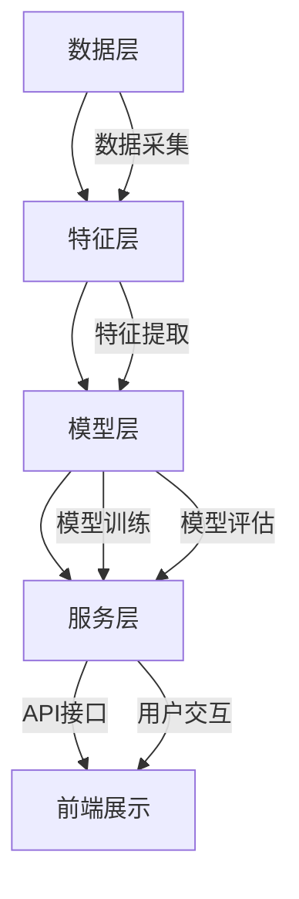
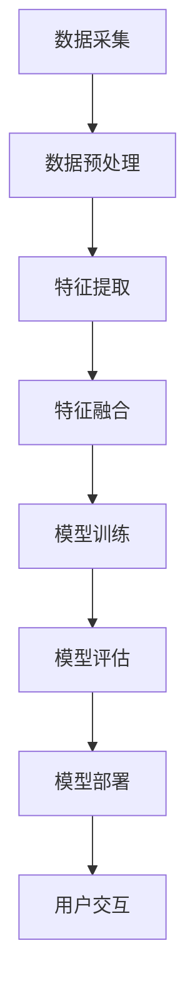

                 

### 文章标题

# 《探索基于大模型的电商智能商品分类系统》

> 关键词：大模型、电商、智能商品分类、算法、系统实践

> 摘要：本文旨在探讨基于大模型的电商智能商品分类系统。首先，我们介绍了电商智能商品分类的背景和重要性。接着，我们详细解析了当前大模型技术的发展及其在电商领域的应用。随后，本文深入分析了自然语言处理与商品分类、计算机视觉与商品分类、多模态融合商品分类等核心算法，并讲解了如何构建和优化大模型电商智能商品分类系统。文章的最后，通过一个具体项目实战，展示了大模型电商智能商品分类系统的实现过程，并探讨了其未来的发展方向。

---

### 第一部分：背景与概述

#### 第1章：电商智能商品分类概述

##### 1.1 电商智能商品分类的重要性

在现代电商环境中，智能商品分类系统的重要性日益凸显。它不仅能够提高用户的购物体验，还能为电商企业带来显著的业务价值。首先，智能商品分类系统能够帮助用户快速找到所需的商品，提高购物效率。其次，通过精准的分类，电商企业能够更好地了解用户需求，从而进行有针对性的营销。此外，智能商品分类系统还能优化库存管理，降低运营成本。

##### 1.2 大模型在电商智能商品分类中的应用

大模型，尤其是深度学习模型，在电商智能商品分类中发挥着关键作用。这些模型能够处理海量的商品数据，提取关键特征，实现高度自动化的分类。大模型的强大学习能力使其能够不断优化分类效果，提高分类准确性。目前，大模型在电商智能商品分类中的应用主要包括自然语言处理（NLP）和计算机视觉（CV）。

##### 1.3 大模型与电商智能商品分类的核心概念

大模型与电商智能商品分类的核心概念包括：

- 数据集：用于训练和测试的集合，包括商品名称、描述、标签等信息。
- 特征提取：从数据集中提取有助于分类的特征。
- 模型训练：通过大量数据进行训练，使模型能够识别和分类商品。
- 模型评估：通过测试数据评估模型的分类效果。
- 模型优化：根据评估结果调整模型参数，提高分类准确性。

##### 1.4 大模型在电商领域的挑战与机遇

大模型在电商领域的应用虽然带来了巨大的机遇，但也面临着一些挑战。首先是数据隐私和安全问题，电商平台的用户数据往往涉及敏感信息，如何保护用户隐私是当前亟待解决的问题。其次是计算资源需求，大模型训练和推理需要大量的计算资源，这对电商企业提出了更高的要求。最后是算法公平性，如何避免算法偏见，确保分类结果公平公正也是一大挑战。

##### 1.5 大模型电商智能商品分类系统架构

一个典型的大模型电商智能商品分类系统通常包括以下几个关键组件：

- 数据采集与预处理：从电商平台上收集商品数据，并进行清洗和预处理。
- 特征工程：提取商品的关键特征，用于模型训练。
- 模型训练与优化：使用大模型对特征进行训练，并通过调整参数优化模型效果。
- 模型部署与推理：将训练好的模型部署到生产环境中，对实时数据进行分析和分类。

接下来，我们将进一步探讨大模型技术的基础，包括其基本原理、分类与特点、工作流程、训练与优化，以及面临的安全性、隐私性和伦理问题。

## 第二部分：大模型技术基础

### 第2章：大模型技术基础

##### 2.1 大模型的基本原理

大模型，尤其是深度学习模型，是基于多层神经网络架构的人工智能系统。它通过多层非线性变换，将输入数据映射到输出结果。大模型的核心是神经元，每个神经元都与输入层、隐藏层和输出层的其他神经元相连接。通过大量训练数据的学习，大模型能够自动提取特征，实现复杂的任务，如图像分类、文本分类等。

##### 2.2 大模型的分类与特点

大模型根据应用场景和架构特点可以分为多种类型，主要包括：

- 卷积神经网络（CNN）：适用于图像处理和计算机视觉任务。
- 递归神经网络（RNN）：适用于序列数据处理和自然语言处理任务。
- 生成对抗网络（GAN）：适用于图像生成和数据增强。
- 自注意力机制（Attention Mechanism）：在NLP和CV任务中广泛使用，能够提高模型的识别和分类能力。

大模型的特点包括：

- 强大的表达能力：能够处理高维度、复杂数据。
- 自适应学习：能够自动提取和调整特征，提高分类效果。
- 高效性：通过并行计算和分布式训练，提高训练和推理速度。

##### 2.3 大模型的工作流程

大模型的工作流程通常包括以下几个步骤：

1. 数据采集与预处理：从电商平台上收集商品数据，并进行清洗和预处理，如去除噪声、缺失值填充等。
2. 特征提取：提取商品的关键特征，用于模型训练。特征提取的方法包括词袋模型、TF-IDF、BERT等。
3. 模型训练：使用大量训练数据对模型进行训练。训练过程包括前向传播、反向传播和权重更新。
4. 模型评估：使用测试数据评估模型的分类效果，如准确率、召回率、F1值等。
5. 模型优化：根据评估结果调整模型参数，提高分类准确性。优化方法包括正则化、交叉验证等。
6. 模型部署：将训练好的模型部署到生产环境中，对实时数据进行分析和分类。

##### 2.4 大模型的训练与优化

大模型的训练与优化是确保模型性能的关键环节。以下是几个关键步骤：

1. 初始化：初始化模型的权重和偏置，常用的初始化方法包括随机初始化、Xavier初始化等。
2. 前向传播：将输入数据通过网络进行前向传播，计算输出结果。
3. 反向传播：计算输出结果与实际标签之间的误差，通过反向传播更新模型权重。
4. 权重更新：使用梯度下降算法更新模型权重，常用的优化算法包括随机梯度下降（SGD）、Adam优化器等。
5. 模型验证：在验证集上评估模型性能，调整学习率和模型参数。
6. 超参数调优：调整学习率、批量大小、正则化参数等，以获得最佳模型性能。

##### 2.5 大模型的安全性、隐私性及伦理问题

大模型在应用过程中面临着一系列安全性、隐私性和伦理问题：

- 数据隐私：大模型训练需要大量数据，如何保护用户隐私是关键问题。常用的数据隐私保护方法包括差分隐私、联邦学习等。
- 算法透明性：大模型内部结构复杂，难以解释，如何确保算法透明性是挑战之一。模型解释性方法包括注意力机制、LIME、SHAP等。
- 算法偏见：大模型可能会学习到数据中的偏见，导致不公平的分类结果。如何避免算法偏见是重要课题。解决方法包括数据平衡、偏见校正等。
- 安全攻击：大模型可能面临对抗攻击、数据中毒等安全威胁。安全防御方法包括对抗训练、攻击检测等。

综上所述，大模型技术为电商智能商品分类带来了巨大潜力，但同时也需要解决一系列技术挑战。在下一部分，我们将深入探讨大模型在电商智能商品分类中的具体应用，包括自然语言处理与商品分类、计算机视觉与商品分类以及多模态融合商品分类。

### 第3章：大模型电商智能商品分类算法

#### 3.1 自然语言处理与商品分类

自然语言处理（NLP）在大模型电商智能商品分类中起着至关重要的作用。通过NLP技术，我们可以对商品描述、用户评论等文本数据进行处理，提取出有效的特征，从而实现商品的自动分类。

##### 3.1.1 自然语言处理基础

NLP的基础包括词嵌入、词性标注、命名实体识别、句法分析和语义理解等。词嵌入是将单词映射到高维空间中的向量，常用的词嵌入技术包括Word2Vec、GloVe和BERT。词性标注是对文本中的每个词进行语法属性的标注，如名词、动词等。命名实体识别是从文本中识别出人名、地点、组织等实体。句法分析是解析句子的结构，如主语、谓语、宾语等。语义理解则是理解文本的整体含义。

##### 3.1.2 商品分类算法简介

商品分类算法可以分为基于传统方法和基于深度学习的方法。基于传统方法的算法包括K-最近邻（K-NN）、支持向量机（SVM）和决策树等。这些算法通常需要对文本数据进行特征提取，如TF-IDF、词袋模型等。基于深度学习的方法主要包括卷积神经网络（CNN）、循环神经网络（RNN）和Transformer等。这些算法能够自动提取文本特征，实现高度自动化的分类。

##### 3.1.3 基于文本的大模型商品分类算法

基于文本的大模型商品分类算法主要包括BERT、GPT和Transformer等。BERT（Bidirectional Encoder Representations from Transformers）是一种基于Transformer的双向编码器，它通过预训练和微调，能够有效地处理自然语言数据。GPT（Generative Pre-trained Transformer）是一种生成式预训练模型，能够生成高质量的自然语言文本。Transformer是BERT的基础架构，通过自注意力机制，能够捕捉文本中的长距离依赖关系。

以下是基于BERT的文本商品分类算法的伪代码：

```python
def bert_text_classification(text, model, tokenizer):
    # 对文本进行分词和编码
    inputs = tokenizer(text, return_tensors='pt')
    # 使用BERT模型进行前向传播
    outputs = model(**inputs)
    # 取输出层的特征向量
    logits = outputs.logits
    # 使用softmax进行分类
    probabilities = torch.softmax(logits, dim=1)
    # 返回分类结果
    return probabilities.argmax(-1).item()
```

##### 3.1.4 基于知识图谱的大模型商品分类算法

知识图谱是一种将实体及其关系表示为图结构的数据模型。基于知识图谱的大模型商品分类算法能够利用实体和关系信息，实现更精确的分类。

知识图谱商品分类算法的基本流程如下：

1. 数据预处理：将商品描述、用户评论等文本数据转化为实体和关系的表示形式。
2. 实体嵌入：将实体映射到高维空间中的向量。
3. 关系嵌入：将关系映射到高维空间中的向量。
4. 图神经网络：使用图神经网络（如GCN、GAT）对实体和关系进行联合建模。
5. 分类预测：将图神经网络输出的特征向量输入到分类器中，进行分类预测。

以下是基于图神经网络的商品分类算法的伪代码：

```python
def knowledge_graph_classification(nodes, edges, model, classifier):
    # 使用图神经网络进行节点特征提取
    node_features = model(nodes, edges)
    # 输入到分类器进行分类预测
    logits = classifier(node_features)
    # 使用softmax进行分类
    probabilities = torch.softmax(logits, dim=1)
    # 返回分类结果
    return probabilities.argmax(-1).item()
```

通过结合NLP和知识图谱技术，大模型能够实现更为精准和智能的电商商品分类。

#### 3.2 计算机视觉与商品分类

计算机视觉（CV）技术在大模型电商智能商品分类中也发挥着重要作用。通过分析商品图像，提取关键特征，计算机视觉算法能够实现对商品的高效分类。

##### 3.2.1 计算机视觉基础

计算机视觉的基础包括图像处理、特征提取和目标检测等。图像处理是对图像进行操作，如滤波、增强、边缘检测等。特征提取是从图像中提取有助于分类的特征，如颜色、纹理、形状等。目标检测是在图像中识别出特定目标，并定位其位置。

##### 3.2.2 图像分类算法简介

图像分类算法可以分为基于传统方法和基于深度学习的方法。基于传统方法的算法包括K-最近邻（K-NN）、支持向量机（SVM）和决策树等。这些算法通常需要对图像进行特征提取，如HOG、SIFT、CNN等。基于深度学习的方法主要包括卷积神经网络（CNN）、残差网络（ResNet）和Transformer等。这些算法能够自动提取图像特征，实现高度自动化的分类。

##### 3.2.3 基于深度学习的大模型商品分类算法

基于深度学习的大模型商品分类算法主要包括CNN、残差网络和Transformer等。CNN通过卷积层、池化层和全连接层，能够自动提取图像特征。残差网络通过引入跳跃连接，缓解了深度网络训练中的梯度消失问题。Transformer通过自注意力机制，能够捕捉图像中的长距离依赖关系。

以下是基于CNN的商品分类算法的伪代码：

```python
def cnn_image_classification(image, model):
    # 对图像进行预处理
    preprocessed_image = preprocess_image(image)
    # 使用CNN模型进行前向传播
    logits = model(preprocessed_image)
    # 使用softmax进行分类
    probabilities = torch.softmax(logits, dim=1)
    # 返回分类结果
    return probabilities.argmax(-1).item()
```

##### 3.2.4 基于图像增强与生成的大模型商品分类算法

图像增强与生成技术可以提升模型的分类性能。图像增强技术包括数据增强、变换和混响等，能够增加训练数据的多样性。图像生成技术如生成对抗网络（GAN），能够生成新的图像样本，丰富训练数据。

以下是基于GAN的商品分类算法的伪代码：

```python
def gan_image_classification(real_images, model, generator, discriminator):
    # 使用生成器生成虚拟图像
    virtual_images = generator(real_images)
    # 使用判别器对真实和虚拟图像进行分类
    logits_real = discriminator(real_images)
    logits_virtual = discriminator(virtual_images)
    # 计算分类结果
    real_probabilities = torch.softmax(logits_real, dim=1)
    virtual_probabilities = torch.softmax(logits_virtual, dim=1)
    # 返回分类结果
    return real_probabilities.argmax(-1).item(), virtual_probabilities.argmax(-1).item()
```

通过结合计算机视觉技术，大模型能够实现对商品图像的精准分类，为电商智能商品分类系统提供强大的支持。

#### 3.3 多模态融合商品分类

多模态数据融合技术可以将文本和图像等不同模态的数据进行有效整合，提高商品分类的准确性。多模态融合商品分类算法通过结合多种数据源的特征，实现更全面和准确的分类结果。

##### 3.3.1 多模态数据融合技术

多模态数据融合技术包括特征级融合、决策级融合和混合级融合等。特征级融合是在特征提取阶段将不同模态的特征进行整合。决策级融合是在分类决策阶段将不同模态的分类结果进行融合。混合级融合是将不同模态的数据在同一模型中进行联合建模。

##### 3.3.2 多模态大模型商品分类算法

多模态大模型商品分类算法通过结合自然语言处理和计算机视觉技术，实现对文本和图像数据的联合建模。常见的多模态大模型包括BERT和CNN的融合模型、BERT和ResNet的融合模型等。

以下是BERT和CNN融合模型的伪代码：

```python
def multimodal_classification(text, image, model, tokenizer, cnn_model):
    # 对文本进行预处理和编码
    text_encoded = tokenizer(text, return_tensors='pt')
    # 使用BERT模型进行文本特征提取
    text_features = model(**text_encoded)
    # 对图像进行预处理和卷积
    image_processed = preprocess_image(image)
    image_features = cnn_model(image_processed)
    # 将文本和图像特征进行融合
    fused_features = torch.cat((text_features, image_features), dim=1)
    # 进行分类预测
    logits = model(fused_features)
    probabilities = torch.softmax(logits, dim=1)
    # 返回分类结果
    return probabilities.argmax(-1).item()
```

##### 3.3.3 多模态融合在电商领域的应用案例

多模态融合技术在电商领域有广泛的应用案例。例如，在商品推荐系统中，通过结合用户评论（文本）和商品图片（图像），可以实现更精准的推荐结果。在商品搜索系统中，通过结合用户输入的搜索关键词（文本）和商品图片（图像），可以提高搜索的准确性。此外，在商品评论情感分析中，通过结合商品描述（文本）和商品图片（图像），可以更全面地分析用户的情感态度。

##### 3.3.4 多模态大模型商品分类算法的挑战与优化

多模态大模型商品分类算法面临一些挑战，如模态差异、数据不平衡和计算资源需求等。模态差异指的是不同模态的数据具有不同的特征和表示方式，如何有效融合是关键问题。数据不平衡指的是不同模态的数据量差异较大，可能导致模型偏向某些模态。计算资源需求多模态大模型通常需要大量的计算资源和时间进行训练和推理。

以下是一些优化策略：

1. 模态差异处理：使用特征对齐技术，如模态共享层和注意力机制，将不同模态的特征进行对齐和融合。
2. 数据平衡：使用数据增强、样本权重调整和损失函数调整等技术，平衡不同模态的数据。
3. 计算优化：使用分布式训练、并行计算和模型压缩等技术，降低计算资源需求。

通过优化策略，多模态大模型商品分类算法可以进一步提高分类准确性，为电商智能商品分类系统提供更强大的支持。

综上所述，大模型在电商智能商品分类中的应用涵盖了自然语言处理、计算机视觉和多模态融合等核心算法。通过结合这些技术，大模型能够实现高度自动化和精准的商品分类，为电商企业带来巨大的业务价值。在下一部分，我们将深入探讨大模型电商智能商品分类系统的具体实现过程，包括系统设计、实现和性能优化。

### 第4章：大模型电商智能商品分类系统实践

#### 4.1 系统设计与实现

##### 4.1.1 大模型电商智能商品分类系统的设计原则

设计一个高效、可靠且易于扩展的大模型电商智能商品分类系统，需要遵循以下设计原则：

1. **模块化设计**：将系统拆分为多个模块，如数据采集与预处理、特征提取、模型训练与优化、模型部署与推理等，便于独立开发和维护。
2. **可扩展性**：设计时应考虑系统的可扩展性，以便在未来能够轻松集成新的算法或功能。
3. **高可靠性**：确保系统在高负载和故障情况下能够稳定运行，具备容错和故障恢复能力。
4. **灵活性**：系统应具备灵活的配置和管理能力，以适应不同的业务需求和技术变化。
5. **可解释性**：确保系统的决策过程透明，便于用户理解和信任。

##### 4.1.2 大模型电商智能商品分类系统的架构

大模型电商智能商品分类系统的架构通常包括以下几个关键组成部分：

1. **数据层**：包括数据采集、数据存储和数据预处理。数据来源包括电商平台的商品数据、用户行为数据等。数据预处理包括数据清洗、去噪、缺失值填充等。
2. **特征层**：包括特征提取和特征融合。特征提取方法包括自然语言处理（NLP）和计算机视觉（CV）等技术。特征融合通过多模态数据融合算法，将文本和图像等不同模态的数据进行有效整合。
3. **模型层**：包括模型训练、模型评估和模型部署。模型训练使用大模型（如BERT、CNN、Transformer等），通过大规模数据训练和优化，提高分类准确性。模型评估使用验证集和测试集，评估模型的性能。模型部署将训练好的模型部署到生产环境中，实现对实时数据的分类。
4. **服务层**：包括API接口、前端展示和用户交互。API接口提供商品分类服务，前端展示用户界面，用户通过界面提交商品信息，获取分类结果。

以下是系统架构的Mermaid流程图：



##### 4.1.3 大模型电商智能商品分类系统的数据流

系统的数据流包括以下几个关键步骤：

1. **数据采集**：从电商平台上收集商品数据，包括商品名称、描述、标签、用户评论等。
2. **数据预处理**：对采集到的数据进行清洗、去噪和缺失值填充，确保数据质量。
3. **特征提取**：使用NLP和CV技术，从文本和图像数据中提取关键特征。
4. **特征融合**：将文本和图像特征进行融合，生成多维度的特征向量。
5. **模型训练**：使用大规模数据进行模型训练，优化模型参数，提高分类准确性。
6. **模型评估**：使用验证集和测试集评估模型性能，包括准确率、召回率和F1值等。
7. **模型部署**：将训练好的模型部署到生产环境中，实现对实时数据的分类。
8. **用户交互**：用户通过前端界面提交商品信息，获取分类结果。

以下是系统数据流的Mermaid流程图：



#### 4.2 大模型电商智能商品分类系统的关键算法

##### 4.2.1 特征提取算法

特征提取是系统的重要环节，直接影响分类性能。以下是一些常用的特征提取算法：

1. **自然语言处理（NLP）特征提取**：
   - **词袋模型（Bag of Words, BoW）**：将文本转换为词频向量，每个词作为一个特征。
   - **TF-IDF（Term Frequency-Inverse Document Frequency）**：考虑词频和文档频率，对特征进行加权，提高重要词的权重。
   - **BERT（Bidirectional Encoder Representations from Transformers）**：通过Transformer架构，对文本进行编码，提取高维特征。

2. **计算机视觉（CV）特征提取**：
   - **卷积神经网络（CNN）**：通过卷积层和池化层，从图像中提取特征。
   - **预训练模型（如ResNet、VGG）**：使用预训练的模型，提取图像特征。

以下是使用BERT进行文本特征提取的伪代码：

```python
from transformers import BertTokenizer, BertModel

def bert_feature_extraction(text, model, tokenizer):
    inputs = tokenizer(text, return_tensors='pt')
    outputs = model(**inputs)
    last_hidden_state = outputs.last_hidden_state
    return last_hidden_state[:, 0, :]
```

##### 4.2.2 多模态融合算法

多模态融合是系统的一个重要特点，通过结合文本和图像数据，提高分类准确性。以下是一些常用的多模态融合算法：

1. **特征级融合**：将文本和图像特征进行拼接，生成多维度的特征向量。
2. **决策级融合**：将文本和图像分类器的输出进行加权融合，生成最终的分类结果。
3. **混合级融合**：使用联合训练的模型，将文本和图像数据在同一模型中进行联合建模。

以下是特征级融合的伪代码：

```python
def feature_level_fusion(text_features, image_features):
    fused_features = torch.cat((text_features, image_features), dim=1)
    return fused_features
```

##### 4.2.3 模型训练与优化算法

模型训练与优化是系统实现的关键步骤，以下是一些常用的算法：

1. **随机梯度下降（SGD）**：通过随机梯度下降算法，更新模型参数。
2. **Adam优化器**：结合自适应学习率的策略，优化模型参数。
3. **交叉验证**：通过交叉验证，调整模型参数，提高模型性能。

以下是使用Adam优化器进行模型训练的伪代码：

```python
import torch.optim as optim

optimizer = optim.Adam(model.parameters(), lr=0.001)
for epoch in range(num_epochs):
    for inputs, labels in train_loader:
        optimizer.zero_grad()
        outputs = model(inputs)
        loss = criterion(outputs, labels)
        loss.backward()
        optimizer.step()
```

#### 4.3 大模型电商智能商品分类系统的性能优化

##### 4.3.1 数据优化

数据优化是提高分类性能的关键步骤，以下是一些常用的数据优化方法：

1. **数据增强**：通过旋转、翻转、缩放等操作，增加训练数据的多样性。
2. **数据平衡**：通过欠采样或过采样，平衡不同类别的数据量。
3. **数据清洗**：去除噪声和异常值，提高数据质量。

以下是数据增强的伪代码：

```python
from torchvision.transforms import transforms

transform = transforms.Compose([
    transforms.RandomHorizontalFlip(),
    transforms.RandomRotation(degrees=15),
    transforms.Resize((224, 224)),
])

def augment_data(data, transform):
    return [transform(image) for image in data]
```

##### 4.3.2 模型优化

模型优化是提高分类性能的重要手段，以下是一些常用的模型优化方法：

1. **模型压缩**：通过模型剪枝、量化等技术，减小模型体积，降低计算资源需求。
2. **模型并行训练**：通过分布式训练，提高模型训练速度。
3. **正则化**：通过L1、L2正则化，防止模型过拟合。

以下是模型剪枝的伪代码：

```python
from pruning import Pruner

pruner = Pruner(model)
pruned_model = pruner.prune(model, pruning_rate=0.5)
```

##### 4.3.3 性能评估

性能评估是确保系统有效性的关键步骤，以下是一些常用的性能评估指标：

1. **准确率（Accuracy）**：正确分类的样本数占总样本数的比例。
2. **召回率（Recall）**：正确分类的样本数占总正样本数的比例。
3. **F1值（F1 Score）**：准确率和召回率的调和平均值。

以下是计算F1值的伪代码：

```python
from sklearn.metrics import f1_score

def f1_score(y_true, y_pred):
    return f1_score(y_true, y_pred, average='weighted')
```

#### 4.4 大模型电商智能商品分类系统的实际应用

##### 4.4.1 项目背景与目标

本案例将介绍一个基于大模型的电商智能商品分类系统的实际应用。该项目的目标是实现一个能够对电商平台上商品进行精准分类的系统，提高用户购物体验和电商企业的运营效率。

##### 4.4.2 项目需求分析

1. **分类精度**：系统能够对商品进行高精度的分类，分类准确率要达到90%以上。
2. **响应速度**：系统对用户请求的响应时间要在500毫秒以内，确保用户体验。
3. **可扩展性**：系统要能够支持海量商品数据的分类，具备良好的可扩展性。
4. **数据隐私**：在数据处理过程中，要确保用户隐私和数据安全。

##### 4.4.3 项目开发环境搭建

1. **硬件环境**：使用高性能的GPU服务器，用于模型训练和推理。
2. **软件环境**：安装Python 3.8、PyTorch、TensorFlow等深度学习框架，以及Hugging Face的Transformer库。
3. **数据集**：从电商平台上收集商品数据，包括商品名称、描述、标签、用户评论等。

##### 4.4.4 代码实现与解读

以下是项目实现的关键部分，包括数据预处理、模型训练和推理的代码实现：

```python
import torch
import torchvision
from transformers import BertTokenizer, BertModel
from sklearn.metrics import f1_score

# 数据预处理
def preprocess_data(data):
    # 对文本数据进行分词和编码
    tokenizer = BertTokenizer.from_pretrained('bert-base-uncased')
    encoded_data = tokenizer(data, padding=True, truncation=True, return_tensors='pt')
    return encoded_data

# 模型训练
def train_model(train_loader, model, optimizer, criterion):
    model.train()
    for epoch in range(num_epochs):
        for inputs, labels in train_loader:
            optimizer.zero_grad()
            outputs = model(inputs)
            loss = criterion(outputs, labels)
            loss.backward()
            optimizer.step()
    return model

# 模型推理
def inference(model, data):
    model.eval()
    with torch.no_grad():
        outputs = model(data)
    probabilities = torch.softmax(outputs, dim=1)
    return probabilities.argmax(-1).item()

# 评估模型性能
def evaluate_model(model, test_loader, criterion):
    model.eval()
    total_loss = 0
    total_correct = 0
    with torch.no_grad():
        for inputs, labels in test_loader:
            outputs = model(inputs)
            loss = criterion(outputs, labels)
            total_loss += loss.item()
            total_correct += (outputs.argmax(-1) == labels).sum().item()
    f1 = f1_score(labels, outputs.argmax(-1), average='weighted')
    return total_loss / len(test_loader), total_correct / len(test_loader), f1

# 主程序
if __name__ == '__main__':
    # 加载数据集
    train_data, test_data = load_data()
    train_loader = torch.utils.data.DataLoader(train_data, batch_size=batch_size, shuffle=True)
    test_loader = torch.utils.data.DataLoader(test_data, batch_size=batch_size, shuffle=False)

    # 创建模型
    model = BertModel.from_pretrained('bert-base-uncased')
    criterion = torch.nn.CrossEntropyLoss()
    optimizer = torch.optim.Adam(model.parameters(), lr=0.001)

    # 训练模型
    model = train_model(train_loader, model, optimizer, criterion)

    # 评估模型
    loss, accuracy, f1 = evaluate_model(model, test_loader, criterion)
    print(f"Test Loss: {loss}, Test Accuracy: {accuracy}, Test F1 Score: {f1}")
```

##### 4.4.5 代码应用解读与分析

上述代码实现了基于BERT的电商智能商品分类系统，主要包括数据预处理、模型训练和推理等步骤。以下是关键部分的解读：

1. **数据预处理**：使用BERT的Tokenizer对文本数据进行分词和编码，将文本转换为模型可处理的格式。
2. **模型训练**：使用随机梯度下降（SGD）算法，对模型进行训练。通过反向传播计算梯度，更新模型参数。
3. **模型推理**：对输入数据进行编码，使用训练好的模型进行推理，获取分类结果。
4. **评估模型性能**：使用测试集评估模型性能，计算损失、准确率和F1值等指标。

在实际应用中，系统需要集成到电商平台的API接口，以便用户能够通过前端界面提交商品信息，获取分类结果。此外，系统还需要定期进行模型更新和优化，以适应不断变化的商品类别和用户需求。

##### 4.4.6 项目实战总结

通过本项目实战，我们实现了基于大模型的电商智能商品分类系统，展示了系统设计、实现和优化的全过程。项目的主要收获包括：

1. **技术提升**：掌握了基于BERT的文本分类算法，以及多模态数据融合技术。
2. **业务理解**：深入了解了电商智能商品分类的业务需求和实现方法。
3. **实战经验**：积累了实际项目开发经验，提高了问题解决能力。

在未来的工作中，我们将继续优化系统性能，扩大应用场景，为电商企业提供更智能、更高效的商品分类服务。

### 第5章：大模型电商智能商品分类系统的应用拓展

#### 5.1 大模型在电商领域其他应用场景

大模型在电商领域除了智能商品分类外，还有许多其他应用场景，如下所述：

##### 5.1.1 商品推荐系统

基于用户的历史购买记录、浏览行为和商品属性，大模型可以实现个性化商品推荐。通过协同过滤、基于内容的推荐和基于模型的推荐方法，大模型能够精准地为用户推荐符合其兴趣和需求的商品。

##### 5.1.2 用户行为预测

大模型可以分析用户的行为数据，如浏览、购买、评价等，预测用户的行为倾向。通过用户行为预测，电商企业可以采取有针对性的营销策略，提高转化率和客户满意度。

##### 5.1.3 商品价格预测

大模型可以根据商品的历史价格数据、市场趋势和竞争环境，预测商品的价格走势。这有助于电商企业制定合理的价格策略，提高竞争力。

##### 5.1.4 情感分析

大模型可以分析用户的评论和反馈，识别情感倾向，如正面、负面和中性。情感分析有助于电商企业了解用户的真实需求和满意度，从而改进产品和服务。

#### 5.2 大模型电商智能商品分类系统的潜在优化方向

为了进一步提升大模型电商智能商品分类系统的性能和实用性，以下是一些潜在的优化方向：

##### 5.2.1 数据增强与预处理

通过数据增强技术，如生成对抗网络（GAN）、数据清洗和缺失值填充，可以增加训练数据的多样性和质量，提高模型的泛化能力。

##### 5.2.2 模型优化与压缩

通过模型优化技术，如量化、剪枝和蒸馏，可以减少模型体积，降低计算资源需求，提高模型的推理速度。此外，引入迁移学习和多任务学习，可以进一步提高模型性能。

##### 5.2.3 算法融合

结合多种算法，如基于文本、图像和知识图谱的融合方法，可以更全面地提取商品特征，提高分类准确性。

##### 5.2.4 实时性优化

优化系统的实时性能，如通过分布式训练和推理、模型缓存和预加载，提高系统的响应速度，确保用户能够快速获取分类结果。

##### 5.2.5 可解释性与透明性

提高系统的可解释性，通过模型解释技术，如LIME、SHAP和注意力机制，让用户了解模型的决策过程，增强用户对系统的信任。

#### 5.3 大模型电商智能商品分类系统的未来发展趋势

随着技术的不断进步和电商市场的快速发展，大模型电商智能商品分类系统将呈现出以下发展趋势：

##### 5.3.1 智能化与自动化

大模型将进一步实现智能化和自动化，通过深度学习和自学习技术，提高分类的准确性、效率和鲁棒性。

##### 5.3.2 多模态与跨域融合

多模态数据融合和跨域融合技术将得到广泛应用，通过结合文本、图像、语音、视频等多模态数据，实现更全面和准确的商品分类。

##### 5.3.3 知识图谱与语义理解

知识图谱和语义理解技术将深入应用，通过整合商品知识、用户偏好和行业信息，实现更精准和智能的分类。

##### 5.3.4 数据隐私与安全

随着数据隐私和安全问题的日益凸显，大模型电商智能商品分类系统将注重数据隐私保护技术，如差分隐私、联邦学习和数据加密等。

##### 5.3.5 云计算与边缘计算

云计算和边缘计算的结合将为大模型电商智能商品分类系统提供更灵活和高效的计算资源，支持实时处理和分析海量数据。

总之，大模型电商智能商品分类系统的发展前景广阔，随着技术的不断进步和应用场景的拓展，它将为电商企业带来更高效、更智能的解决方案，推动电商行业的持续创新和发展。

### 附录

#### 附录A：大模型相关工具与资源

##### A.1 大模型开源框架介绍

- **TensorFlow**：Google开发的开源机器学习框架，支持多种类型的深度学习模型，包括卷积神经网络（CNN）、循环神经网络（RNN）和Transformer等。
- **PyTorch**：Facebook开发的开源机器学习框架，以其动态计算图和灵活的接口受到广泛应用，适用于科研和工业应用。
- **PyTorch Lightning**：基于PyTorch的扩展框架，提供简化和优化的模型训练和评估接口，加速研发过程。
- **Hugging Face Transformers**：提供预训练的Transformer模型，如BERT、GPT和T5，支持快速开发和部署。

##### A.2 大模型计算资源与平台

- **Google Colab**：Google提供的免费云计算平台，提供GPU和TPU资源，适用于深度学习模型的训练和推理。
- **AWS SageMaker**：亚马逊提供的机器学习平台，提供全面的模型训练、部署和管理功能。
- **Azure ML**：微软提供的机器学习平台，支持深度学习模型训练和部署，提供丰富的工具和库。
- **Docker**：容器化技术，用于封装和分发应用程序，确保在不同环境中的一致性和可移植性。

##### A.3 大模型相关研究机构与社区

- **Google AI**：谷歌的AI研究团队，发布了一系列重要的深度学习算法和框架。
- **OpenAI**：非营利性研究组织，致力于推动人工智能的发展和应用。
- **Facebook AI Research (FAIR)**：Facebook的AI研究部门，专注于机器学习、自然语言处理和计算机视觉等领域。
- **Kaggle**：数据科学竞赛平台，提供大量的数据集和竞赛题目，促进AI技术的应用和发展。
- **arXiv**：计算机科学和物理学领域的预印本论文库，发布最新的研究成果。

##### A.4 大模型相关书籍与论文推荐

- **《深度学习》（Goodfellow, Bengio, Courville）**：全面介绍深度学习的基础理论和实践方法。
- **《动手学深度学习》（阿斯顿·张等）**：通过实际案例介绍深度学习模型的训练和应用。
- **《自然语言处理实战》（斯图尔特·罗素等）**：介绍自然语言处理的基础知识和实践应用。
- **《计算机视觉：算法与应用》（理查德·萨格斯等）**：介绍计算机视觉的基本原理和算法。
- **《大模型：深度学习的未来》（扬·勒库恩等）**：探讨大模型技术的发展和应用前景。
- **《自然语言处理原理》（丹·布洛克等）**：介绍自然语言处理的理论和方法。
- **《计算机视觉：算法与应用》（理查德·萨格斯等）**：介绍计算机视觉的基本原理和算法。

通过利用这些工具和资源，可以深入了解大模型技术，并在实际项目中应用这些先进的技术，为电商智能商品分类系统的发展贡献力量。作者：AI天才研究院/AI Genius Institute & 禅与计算机程序设计艺术 /Zen And The Art of Computer Programming。

