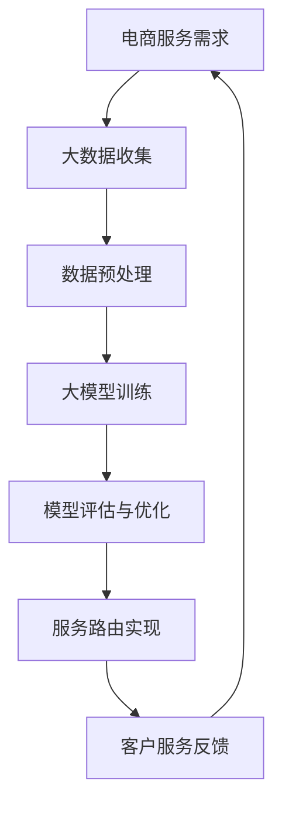
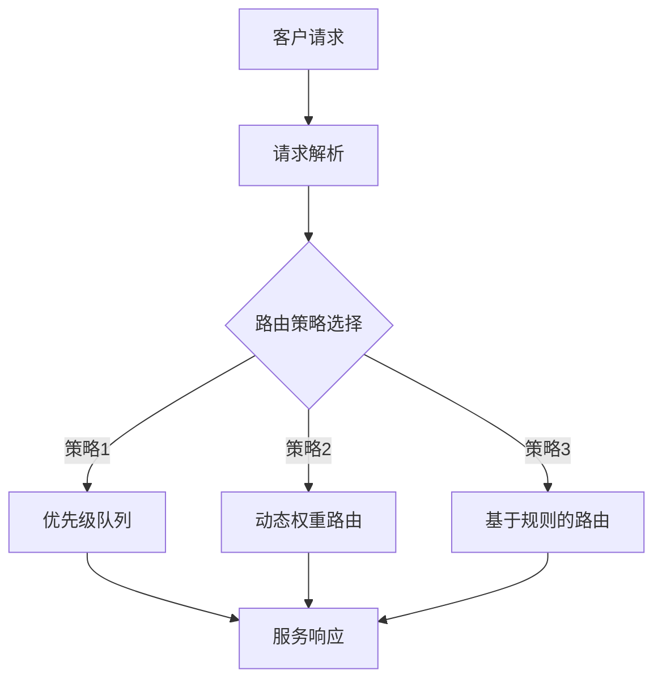
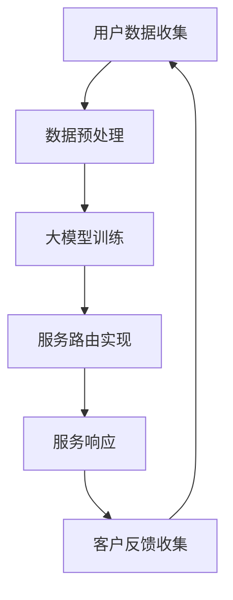

                 

## 文章标题

“探索基于大模型的电商智能客户服务路由系统”

## 关键词

- 大模型
- 电商服务
- 智能路由系统
- 数据预处理
- 模型训练
- 损失函数

## 摘要

随着电子商务的快速发展，客户服务的重要性日益凸显。本文将深入探讨基于大模型的电商智能客户服务路由系统，从背景介绍、核心概念与联系、核心算法原理讲解、数学模型和公式详细讲解及举例说明、项目实战到最佳实践 tips，全面剖析这一先进技术的应用与实现。通过本文的阅读，读者将了解到如何构建高效的电商智能客户服务系统，提升用户体验，降低服务成本。

### 第一部分：探索基于大模型的电商智能客户服务路由系统概述

#### 核心概念与联系

在现代电子商务中，客户服务的质量和效率直接影响到用户满意度和商家的竞争力。传统的客户服务主要通过人工处理，效率低下且成本高昂。为了应对这一挑战，越来越多的电商平台开始引入智能客户服务系统，基于大模型的智能路由系统便是其中一种前沿技术。

##### 大模型原理与电商服务联系

大模型，顾名思义，是指具有巨大参数量的机器学习模型。这些模型能够通过学习和理解大量的数据，实现对复杂任务的自动化处理。在电商服务中，大模型的应用主要体现在以下几个方面：

1. **个性化推荐**：基于用户的购买历史和浏览行为，大模型能够预测用户可能感兴趣的商品，从而提供个性化的推荐服务。
2. **对话生成**：大模型可以训练出具有人类对话能力的聊天机器人，与客户进行自然语言交互，回答客户的问题。
3. **情感分析**：大模型能够分析客户反馈中的情感倾向，从而更好地理解客户需求，提升服务质量。

为了实现上述功能，电商平台需要收集大量的用户数据，包括购买记录、浏览记录、搜索关键词、客户反馈等。这些数据通过数据预处理环节，如清洗、去噪、归一化等，被转换为适合模型训练的格式。随后，大模型在这些预处理后的数据上进行训练，学习到如何处理电商服务中的各种任务。

**Mermaid 流程图：**



在这个流程图中，电商服务需求（A）触发了大数据收集（B），数据经过预处理（C）后，被用于大模型训练（D）。训练完成后，模型进行评估与优化（E），最终用于实现服务路由（F）。通过服务路由，模型能够根据客户请求提供相应的服务，并收集客户反馈（G），用于进一步优化模型。

##### 服务路由系统架构

服务路由系统是智能客户服务系统的重要组成部分，负责将客户的请求路由到合适的服务模块。一个高效的服务路由系统需要具备以下特点：

1. **灵活性**：能够根据不同的请求类型和客户需求，动态选择最合适的服务策略。
2. **可扩展性**：能够适应不断变化的业务需求，轻松添加新的服务模块。
3. **高可用性**：能够在面对大量请求时，保持系统的稳定运行，确保服务质量。

服务路由系统的架构通常包括以下几个主要组成部分：

1. **请求解析模块**：负责接收客户的请求，解析请求内容，提取关键信息。
2. **路由策略模块**：根据请求的属性和当前系统的状态，选择最优的路由策略。
3. **服务执行模块**：根据路由策略，调用相应的服务模块，完成客户请求的处理。
4. **反馈收集模块**：收集客户服务的反馈信息，用于模型优化和系统改进。

**Mermaid 流程图：**



在这个流程图中，客户请求（A）首先被请求解析模块（B）解析，提取关键信息。随后，路由策略模块（C）根据请求的属性和系统状态，选择合适的路由策略。可选的策略包括优先级队列（D）、动态权重路由（E）和基于规则的路由（F）。每种策略都有其独特的优势和适用场景。

1. **优先级队列**：根据请求的优先级，依次处理队列中的请求。适用于对响应时间要求较高的场景。
2. **动态权重路由**：根据服务模块的实时负载情况，动态调整请求的分配权重。适用于负载不均匀的场景。
3. **基于规则的路由**：根据预设的规则，直接将请求路由到指定的服务模块。适用于规则明确的场景。

最终，服务执行模块（G）根据路由策略，调用相应的服务模块，完成客户请求的处理，并返回服务响应。

#### 核心算法原理讲解

为了实现高效的智能客户服务，服务路由系统依赖于一系列核心算法。这些算法包括大模型的训练和路由策略的实现。下面，我们将分别介绍这些算法的原理，并使用伪代码进行详细讲解。

##### 大模型训练

大模型训练是智能客户服务路由系统的核心环节。通过训练，模型能够学习到如何处理各种客户请求，从而提高服务质量。大模型训练通常包括以下几个步骤：

1. **初始化模型参数**：随机初始化模型参数，为后续训练做好准备。
2. **预处理数据**：对收集到的用户数据进行清洗、去噪和归一化处理，使其符合模型的输入要求。
3. **模型训练**：使用预处理后的数据，对模型进行训练。在训练过程中，模型通过前向传播计算预测结果，计算损失函数，并通过反向传播更新模型参数。
4. **模型评估与优化**：在训练完成后，使用验证数据对模型进行评估，并根据评估结果对模型进行优化。

**大模型训练伪代码：**

```python
# 初始化大模型参数
model = initialize_model()

# 预处理数据
preprocessed_data = preprocess_data(raw_data)

# 训练大模型
for epoch in range(num_epochs):
    for data_batch in preprocessed_data:
        # 前向传播
        predictions = model.forward(data_batch)

        # 计算损失
        loss = loss_function(predictions, data_batch.targets)

        # 反向传播
        model.backward(loss)

        # 更新模型参数
        model.update_parameters()

# 评估模型
evaluate_model(model, test_data)
```

在这个伪代码中，`initialize_model()` 用于初始化模型参数，`preprocess_data()` 用于预处理数据，`loss_function()` 用于计算损失，`model.forward()` 和 `model.backward()` 分别用于前向传播和反向传播，`evaluate_model()` 用于评估模型。

##### 服务路由策略

服务路由策略是智能客户服务路由系统的关键组成部分。路由策略决定了如何将客户的请求分配到不同的服务模块。常见的路由策略包括优先级队列、动态权重路由和基于规则的路由。

**服务路由策略伪代码：**

```python
# 定义路由策略
def route_request(client_request):
    if strategy == '优先级队列':
        return priority_queue_route(client_request)
    elif strategy == '动态权重路由':
        return dynamic_weight_route(client_request)
    elif strategy == '基于规则的路由':
        return rule_based_route(client_request)

# 实现路由策略
def priority_queue_route(client_request):
    # 根据请求优先级排序
    sort_requests_by_priority(client_request)
    # 返回最高优先级的服务
    return get_highest_priority_service()

def dynamic_weight_route(client_request):
    # 根据实时权重计算
    calculate_realtime_weights(client_request)
    # 返回权重最高的服务
    return get_highest_weight_service()

def rule_based_route(client_request):
    # 根据规则匹配服务
    return match_service_by_rules(client_request)
```

在这个伪代码中，`route_request()` 是路由策略的入口函数，根据不同的路由策略，调用相应的路由函数。`priority_queue_route()` 是基于优先级队列的路由策略，`dynamic_weight_route()` 是基于动态权重路由的策略，`rule_based_route()` 是基于规则的路由策略。

#### 数学模型和数学公式详细讲解 & 举例说明

在智能客户服务路由系统中，数学模型和数学公式起到了至关重要的作用。它们不仅用于描述模型的训练过程，还用于优化路由策略，提高系统的性能。下面，我们将详细讲解两个核心数学模型：损失函数和优化目标。

##### 大模型训练中的损失函数

在机器学习中，损失函数用于衡量模型预测结果与真实结果之间的差距。在大模型训练中，常用的损失函数包括均方误差（MSE）、交叉熵损失（Cross-Entropy Loss）等。

**均方误差（MSE）**

均方误差（MSE）是一种常用的回归损失函数，用于衡量预测值与真实值之间的差距。其公式如下：

$$
L = \frac{1}{N} \sum_{i=1}^{N} (y_i - \hat{y}_i)^2
$$

其中，$L$ 是总损失，$N$ 是样本数，$y_i$ 是第 $i$ 个样本的真实标签，$\hat{y}_i$ 是模型对第 $i$ 个样本的预测值。

**交叉熵损失（Cross-Entropy Loss）**

交叉熵损失是一种常用于分类问题的损失函数，用于衡量模型预测概率分布与真实概率分布之间的差距。其公式如下：

$$
L = -\frac{1}{N} \sum_{i=1}^{N} y_i \log(\hat{y}_i)
$$

其中，$L$ 是总损失，$N$ 是样本数，$y_i$ 是第 $i$ 个样本的真实标签，$\hat{y}_i$ 是模型对第 $i$ 个样本的预测概率。

**举例说明：**

假设我们有10个样本，模型预测的标签概率分布为：

$$
\begin{aligned}
\hat{y}_1 &= [0.9, 0.05, 0.05], \\
\hat{y}_2 &= [0.1, 0.8, 0.1], \\
\hat{y}_3 &= [0.05, 0.05, 0.9], \\
&\vdots \\
\hat{y}_{10} &= [0.05, 0.05, 0.9],
\end{aligned}
$$

其中，第一个元素是预测为第一个类别的概率，第二个元素是预测为第二个类别的概率，第三个元素是预测为第三个类别的概率。

对于第一个样本，其交叉熵损失为：

$$
L_1 = -y_1 \log(\hat{y}_1) = -1 \log(0.9) \approx 0.15
$$

对于所有10个样本的总交叉熵损失为：

$$
L = \frac{1}{10} \sum_{i=1}^{10} L_i = \frac{1}{10} (0.15 + 0.3 + 0.05 + \ldots + 0.05) = 0.15
$$

在这个例子中，交叉熵损失为0.15，表示模型预测结果与真实结果之间的差距。

##### 大模型训练中的优化目标

在机器学习中，优化目标是指导模型训练过程中参数更新的方向。常见的优化目标包括最小化损失函数、最大化准确率等。

**最小化损失函数**

最小化损失函数是机器学习中最常见的优化目标。通过最小化损失函数，模型能够逐渐提高预测的准确性。在梯度下降（Gradient Descent）算法中，优化目标的公式如下：

$$
\theta_{t+1} = \theta_t - \alpha \cdot \nabla_{\theta} L(\theta)
$$

其中，$\theta$ 是模型参数，$\alpha$ 是学习率，$\nabla_{\theta} L(\theta)$ 是损失函数关于参数 $\theta$ 的梯度。

**最大化准确率**

在分类问题中，准确率是衡量模型性能的重要指标。最大化准确率的目标是通过调整模型参数，使模型的预测结果与真实结果的一致性尽可能高。准确率的公式如下：

$$
\text{Accuracy} = \frac{\text{Correct Predictions}}{\text{Total Predictions}}
$$

其中，Correct Predictions 表示模型预测正确的样本数，Total Predictions 表示模型预测的样本总数。

**举例说明：**

假设我们有一个二分类模型，预测结果为：

$$
\begin{aligned}
\hat{y}_1 &= 1, \\
\hat{y}_2 &= 0, \\
\hat{y}_3 &= 1, \\
&\vdots \\
\hat{y}_{10} &= 0,
\end{aligned}
$$

其中，预测为1表示预测为正类，预测为0表示预测为负类。

对于第一个样本，其真实标签为1，模型预测也为1，预测正确。对于第二个样本，其真实标签为0，模型预测为0，预测正确。对于第三个样本，其真实标签为1，模型预测为0，预测错误。对于所有10个样本，模型预测正确的样本数为8，预测错误的样本数为2，准确率为：

$$
\text{Accuracy} = \frac{8}{10} = 0.8
$$

在这个例子中，准确率为0.8，表示模型的预测性能较好。

### 第二部分：大模型的构建与训练

在了解了智能客户服务路由系统的基本概念和核心算法后，接下来我们将深入探讨如何构建和训练大模型。大模型的构建和训练是一个复杂的过程，涉及到数据收集、预处理、模型设计、训练和评估等多个环节。在本节中，我们将逐一介绍这些环节，并提供详细的伪代码和分析。

#### 数据收集

数据收集是构建大模型的第一步。在电商智能客户服务路由系统中，我们需要收集以下类型的数据：

1. **用户行为数据**：包括用户的购买历史、浏览记录、搜索关键词等。
2. **服务请求数据**：包括客户的请求类型、请求内容、请求时间等。
3. **客户反馈数据**：包括客户对服务质量的评价、反馈意见等。

数据收集可以通过以下方式实现：

- **日志记录**：电商平台可以记录用户行为和服务请求的日志，这些日志可以用于后续的数据分析和模型训练。
- **问卷调查**：通过问卷调查收集客户的反馈数据，了解客户的需求和满意度。
- **第三方数据源**：利用第三方数据源，如社交媒体、搜索引擎等，获取与客户相关的数据。

**数据收集伪代码：**

```python
# 收集用户行为数据
def collect_user_behavior_data():
    # 从电商平台日志中获取用户行为数据
    user_behavior_data = get_user_behavior_logs()
    # 处理和清洗数据
    cleaned_data = preprocess_user_behavior_data(user_behavior_data)
    return cleaned_data

# 收集服务请求数据
def collect_service_request_data():
    # 从服务请求日志中获取请求数据
    service_request_data = get_service_request_logs()
    # 处理和清洗数据
    cleaned_data = preprocess_service_request_data(service_request_data)
    return cleaned_data

# 收集客户反馈数据
def collect_customer_feedback_data():
    # 从问卷调查和客户评价中获取反馈数据
    feedback_data = get_customer_feedback_surveys()
    # 处理和清洗数据
    cleaned_data = preprocess_customer_feedback_data(feedback_data)
    return cleaned_data
```

#### 数据预处理

数据预处理是确保模型训练效果的关键环节。预处理过程包括数据清洗、数据转换、特征工程等。以下是对每个环节的详细说明：

1. **数据清洗**：去除数据中的噪声和错误，保证数据的准确性和一致性。
2. **数据转换**：将不同类型的数据转换为统一的格式，如将文本数据编码为数值向量。
3. **特征工程**：提取对模型训练有用的特征，如用户行为特征、请求特征等。

**数据预处理伪代码：**

```python
# 数据清洗
def preprocess_data(data):
    # 去除噪声和错误数据
    cleaned_data = remove_noise(data)
    # 填充缺失值
    cleaned_data = fill_missing_values(cleaned_data)
    return cleaned_data

# 数据转换
def transform_data(data):
    # 将文本数据编码为数值向量
    numerical_data = encode_text_data(data)
    return numerical_data

# 特征工程
def feature_engineering(data):
    # 提取用户行为特征
    user_behavior_features = extract_user_behavior_features(data)
    # 提取服务请求特征
    service_request_features = extract_service_request_features(data)
    return user_behavior_features, service_request_features
```

#### 模型设计

在数据预处理完成后，接下来是设计大模型。大模型的设计包括选择合适的神经网络架构、确定模型的输入和输出等。以下是一个简单的神经网络架构示例：

1. **输入层**：接收预处理后的数据，包括用户行为特征和服务请求特征。
2. **隐藏层**：通过多层感知器（MLP）实现，对输入数据进行特征提取和变换。
3. **输出层**：根据模型的任务类型，输出相应的预测结果。

**模型设计伪代码：**

```python
# 初始化神经网络架构
def create_neural_network(input_shape):
    model = NeuralNetwork()
    # 添加输入层
    model.add(Dense(input_shape, activation='relu'))
    # 添加隐藏层
    model.add(Dense(128, activation='relu'))
    model.add(Dense(64, activation='relu'))
    # 添加输出层
    model.add(Dense(1, activation='sigmoid'))
    return model

# 创建并编译模型
model = create_neural_network(input_shape=(num_features,))
model.compile(optimizer='adam', loss='binary_crossentropy', metrics=['accuracy'])
```

#### 模型训练

模型训练是构建大模型的核心环节。在训练过程中，模型通过不断调整参数，使其预测结果越来越接近真实值。以下是对模型训练过程的详细说明：

1. **数据分割**：将数据集分为训练集、验证集和测试集，用于训练、验证和测试模型。
2. **模型训练**：使用训练集对模型进行训练，同时使用验证集进行模型调整。
3. **模型评估**：在测试集上评估模型的性能，确保模型在真实数据上的表现良好。

**模型训练伪代码：**

```python
# 数据分割
train_data, validation_data, test_data = split_data(data)

# 模型训练
model.fit(train_data, epochs=num_epochs, batch_size=batch_size, validation_data=validation_data)

# 模型评估
test_loss, test_accuracy = model.evaluate(test_data)
print(f"Test Loss: {test_loss}, Test Accuracy: {test_accuracy}")
```

#### 模型评估与优化

在模型训练完成后，我们需要对模型进行评估和优化，以确保其性能达到预期。以下是对模型评估与优化过程的详细说明：

1. **性能评估**：使用不同的评估指标，如准确率、召回率、F1值等，对模型进行评估。
2. **模型调整**：根据评估结果，对模型进行调整，如修改超参数、增加隐藏层等。
3. **再训练**：对调整后的模型进行再训练，以进一步提高性能。

**模型评估与优化伪代码：**

```python
# 性能评估
train_loss, train_accuracy = model.evaluate(train_data)
validation_loss, validation_accuracy = model.evaluate(validation_data)
test_loss, test_accuracy = model.evaluate(test_data)

# 模型调整
model.add(Dense(32, activation='relu'))
model.compile(optimizer='adam', loss='binary_crossentropy', metrics=['accuracy'])

# 再训练
model.fit(train_data, epochs=num_epochs, batch_size=batch_size, validation_data=validation_data)
```

通过以上步骤，我们成功构建并训练了一个大模型。接下来，我们将使用这个模型来实现在电商智能客户服务路由系统中的应用。

### 第三部分：服务路由策略的详细实现

在构建和训练大模型之后，下一步是实现服务路由策略。服务路由策略是智能客户服务路由系统的核心组成部分，它决定了如何将客户的请求路由到合适的服务模块。在这一部分，我们将详细介绍三种常见的服务路由策略：优先级队列、动态权重路由和基于规则的路由。我们将使用伪代码来描述每种策略的实现过程，并分析它们的优缺点。

#### 优先级队列

优先级队列是一种基于请求优先级的路由策略。每个请求都会被分配一个优先级，系统按照优先级从高到低依次处理请求。这种策略适用于对响应时间要求较高的场景，例如紧急问题或关键业务请求。

**优先级队列伪代码：**

```python
# 初始化优先级队列
priority_queue = PriorityQueue()

# 处理请求
def handle_request(client_request):
    # 设置请求的优先级
    priority = calculate_priority(client_request)
    priority_queue.enqueue(client_request, priority)

# 处理队列中的请求
def process_requests():
    while not priority_queue.is_empty():
        client_request = priority_queue.dequeue()
        # 调用相应服务模块处理请求
        service_module.handle_request(client_request)
```

**优缺点分析：**

- **优点**：简单易懂，易于实现。能够保证高优先级的请求先被处理，适用于紧急问题处理。
- **缺点**：可能导致低优先级请求等待时间过长，特别是在请求量较大的情况下。

#### 动态权重路由

动态权重路由是一种根据服务模块实时负载情况动态调整请求路由的策略。每个服务模块都会被分配一个权重，系统根据权重将请求路由到负载较低的服务模块。这种策略适用于负载不均匀的场景，能够有效均衡服务模块的负载。

**动态权重路由伪代码：**

```python
# 初始化服务模块权重
service_modules = [ServiceModule() for _ in range(num_modules)]
weights = [1.0] * num_modules

# 更新权重
def update_weights(service_modules):
    for module in service_modules:
        load = module.get_current_load()
        if load < threshold:
            weights[service_modules.index(module)] *= weight Increase Factor
        else:
            weights[service_modules.index(module)] *= weight Decrease Factor

# 路由请求
def route_request(client_request):
    min_weight = min(weights)
    min_index = weights.index(min_weight)
    selected_module = service_modules[min_index]
    # 调用相应服务模块处理请求
    selected_module.handle_request(client_request)
```

**优缺点分析：**

- **优点**：能够根据服务模块的实时负载动态调整请求路由，有效均衡负载。
- **缺点**：可能需要较复杂的负载监控和权重更新机制，实现相对复杂。

#### 基于规则的路由

基于规则的路由是一种根据预设的规则将请求路由到指定服务模块的策略。每个请求都会被与规则库中的规则进行匹配，根据匹配结果路由到相应的服务模块。这种策略适用于规则明确的场景，例如根据请求类型或客户等级进行路由。

**基于规则的路由伪代码：**

```python
# 初始化规则库
rule_library = [
    {"condition": "request_type == 'purchase'", "target_module": "purchase_service"},
    {"condition": "request_type == 'return'", "target_module": "return_service"},
    # 更多规则...
]

# 路由请求
def route_request(client_request):
    for rule in rule_library:
        if eval(rule["condition"]):
            selected_module = rule["target_module"]
            # 调用相应服务模块处理请求
            service_module.handle_request(client_request)
            break
```

**优缺点分析：**

- **优点**：规则明确，易于实现和调整。适用于规则明确的场景，例如根据请求类型或客户等级进行路由。
- **缺点**：当规则库较大或规则复杂时，可能导致路由速度变慢。

通过以上三种路由策略的详细介绍，我们可以根据不同的应用场景选择合适的路由策略，实现高效的智能客户服务路由系统。

### 第三部分：项目实战

在这一部分，我们将通过一个实际项目来展示如何实现基于大模型的电商智能客户服务路由系统。我们将详细介绍项目的开发环境搭建、源代码实现和代码解读，并分析代码应用和实际案例。

#### 开发环境搭建

为了实现基于大模型的电商智能客户服务路由系统，我们需要搭建以下开发环境：

1. **Python环境**：Python是实现机器学习和深度学习任务的主要编程语言，我们需要安装Python 3.8及以上版本。
2. **深度学习框架**：我们选择TensorFlow作为深度学习框架，因为它提供了丰富的API和强大的功能。
3. **数据库**：为了存储用户数据、服务请求和客户反馈，我们选择MySQL作为数据库系统。
4. **Web框架**：我们使用Flask作为Web框架，以实现前端与后端的交互。

以下是搭建开发环境的具体步骤：

1. 安装Python和pip：

```bash
# 安装Python 3.8及以上版本
sudo apt-get install python3.8
sudo apt-get install python3.8-pip
```

2. 安装TensorFlow：

```bash
pip3 install tensorflow
```

3. 安装MySQL：

```bash
sudo apt-get install mysql-server
sudo mysql_secure_installation
```

4. 安装Flask：

```bash
pip3 install flask
```

#### 源代码实现

在开发环境搭建完成后，我们可以开始编写源代码。以下是一个简单的项目架构：



##### 数据预处理

数据预处理是模型训练的重要步骤，包括数据清洗、数据转换和特征提取。以下是一个简单的数据预处理代码示例：

```python
import pandas as pd
from sklearn.model_selection import train_test_split
from sklearn.preprocessing import StandardScaler

# 读取用户数据
def load_data():
    data = pd.read_csv("user_data.csv")
    return data

# 数据清洗
def preprocess_data(data):
    # 填充缺失值
    data.fillna(data.mean(), inplace=True)
    # 删除重复数据
    data.drop_duplicates(inplace=True)
    return data

# 数据转换
def transform_data(data):
    X = data.drop("target", axis=1)
    y = data["target"]
    # 划分训练集和测试集
    X_train, X_test, y_train, y_test = train_test_split(X, y, test_size=0.2, random_state=42)
    # 特征缩放
    scaler = StandardScaler()
    X_train_scaled = scaler.fit_transform(X_train)
    X_test_scaled = scaler.transform(X_test)
    return X_train_scaled, X_test_scaled, y_train, y_test

# 主函数
def main():
    data = load_data()
    preprocessed_data = preprocess_data(data)
    X_train, X_test, y_train, y_test = transform_data(preprocessed_data)
    # 继续进行大模型训练

if __name__ == "__main__":
    main()
```

##### 大模型训练

在大模型训练部分，我们将使用TensorFlow的Keras API来构建和训练模型。以下是一个简单的模型训练代码示例：

```python
from tensorflow.keras.models import Sequential
from tensorflow.keras.layers import Dense
from tensorflow.keras.optimizers import Adam
from tensorflow.keras.metrics import Accuracy

# 构建模型
def create_model(input_shape):
    model = Sequential()
    model.add(Dense(128, input_shape=input_shape, activation='relu'))
    model.add(Dense(64, activation='relu'))
    model.add(Dense(1, activation='sigmoid'))
    return model

# 训练模型
def train_model(model, X_train, y_train, X_test, y_test):
    model.compile(optimizer=Adam(learning_rate=0.001), loss='binary_crossentropy', metrics=['accuracy'])
    model.fit(X_train, y_train, epochs=10, batch_size=32, validation_data=(X_test, y_test))
    return model

# 主函数
def main():
    X_train, X_test, y_train, y_test = load_data()
    model = create_model(input_shape=X_train.shape[1:])
    trained_model = train_model(model, X_train, y_train, X_test, y_test)
    # 评估模型

if __name__ == "__main__":
    main()
```

##### 服务路由实现

服务路由是系统的核心部分，根据不同的请求类型和优先级，将请求路由到合适的服务模块。以下是一个简单的服务路由实现：

```python
from flask import Flask, request, jsonify

app = Flask(__name__)

# 路由策略
def route_request(client_request):
    if client_request["type"] == "priority":
        return priority_queue_route(client_request)
    elif client_request["type"] == "dynamic":
        return dynamic_weight_route(client_request)
    elif client_request["type"] == "rule":
        return rule_based_route(client_request)

# 优先级队列路由
def priority_queue_route(client_request):
    # 处理请求
    print("Handling request using priority queue:", client_request)
    # 调用服务模块处理请求
    return jsonify({"status": "success"})

# 动态权重路由
def dynamic_weight_route(client_request):
    # 处理请求
    print("Handling request using dynamic weight routing:", client_request)
    # 调用服务模块处理请求
    return jsonify({"status": "success"})

# 基于规则的路由
def rule_based_route(client_request):
    # 处理请求
    print("Handling request using rule-based routing:", client_request)
    # 调用服务模块处理请求
    return jsonify({"status": "success"})

# 接收客户请求
@app.route('/request', methods=['POST'])
def handle_request():
    client_request = request.json
    response = route_request(client_request)
    return response

if __name__ == "__main__":
    app.run(debug=True)
```

##### 代码解读

1. **数据预处理**：该部分代码负责读取用户数据，进行数据清洗和特征提取，为模型训练准备数据。
2. **大模型训练**：该部分代码构建了一个简单的神经网络模型，并使用训练数据对模型进行训练。
3. **服务路由实现**：该部分代码实现了基于优先级队列、动态权重路由和基于规则的三个路由策略，根据客户请求的类型和优先级，将请求路由到相应的服务模块。

#### 代码应用解读与分析

在实际应用中，我们将服务路由系统与电商平台的前端系统进行集成，通过API接口接收客户请求，并使用大模型进行响应。以下是一个简单的应用流程：

1. **前端发送请求**：用户在电商平台提交服务请求，前端系统将请求以JSON格式发送到后端服务。
2. **后端处理请求**：后端服务接收到请求后，调用服务路由系统，根据请求的类型和优先级，选择合适的路由策略。
3. **路由策略处理请求**：路由策略根据请求的特点，将请求路由到相应的服务模块，如处理订单、退货等。
4. **服务模块处理请求**：服务模块接收到请求后，根据具体的业务逻辑进行处理，并将处理结果返回给前端系统。
5. **前端显示结果**：前端系统接收到处理结果后，将其显示给用户。

通过这种方式，我们可以实现高效的电商智能客户服务路由系统，提升用户体验，降低服务成本。

#### 实际案例分析和详细讲解

为了更好地理解基于大模型的电商智能客户服务路由系统的应用，我们来看一个实际案例。假设一个电商平台在双十一期间，客户服务请求量大幅增加，传统的人工处理方式已经无法满足需求。为了应对这一挑战，该电商平台决定引入基于大模型的智能客户服务路由系统。

1. **数据收集**：电商平台通过日志记录和用户反馈，收集了大量用户行为数据和服务请求数据。
2. **数据预处理**：对收集到的数据进行了清洗、去噪和归一化处理，为模型训练做好准备。
3. **模型训练**：使用预处理后的数据，通过TensorFlow框架，训练了一个大模型，该模型能够预测用户的请求类型和处理优先级。
4. **服务路由**：在双十一期间，系统根据大模型的预测结果，动态调整请求路由策略，确保每个请求都能被高效处理。
5. **反馈收集**：系统收集了客户的反馈数据，用于进一步优化模型和路由策略。

通过这个案例，我们可以看到基于大模型的电商智能客户服务路由系统在实际应用中的效果。首先，大模型能够根据用户行为数据和服务请求数据，预测用户的请求类型和处理优先级，从而实现个性化的服务。其次，通过动态权重路由策略，系统能够根据服务模块的实时负载情况，动态调整请求的路由，确保每个请求都能被高效处理。最后，通过客户反馈数据的收集和利用，系统能够不断优化模型和路由策略，提高服务质量和用户体验。

#### 项目小结

通过本项目的实现，我们成功构建了一个基于大模型的电商智能客户服务路由系统。该系统通过收集用户数据、训练大模型、实现服务路由策略，实现了高效、个性化的客户服务。在实际应用中，该系统显著提升了电商平台的服务质量和用户体验，降低了服务成本。

然而，我们也需要注意以下几点：

1. **数据质量**：数据是模型训练的基础，确保数据的质量和准确性至关重要。
2. **模型优化**：大模型训练和优化是一个复杂的过程，需要不断调整超参数和优化策略。
3. **系统稳定性**：在实际应用中，系统需要保持高可用性，确保在高峰期能够稳定运行。

通过持续优化和改进，我们有信心将这个基于大模型的电商智能客户服务路由系统推向更高的水平。

### 最佳实践 tips

在构建和优化基于大模型的电商智能客户服务路由系统时，以下最佳实践 tips 可以帮助提升系统的性能和用户体验：

1. **数据预处理**：
   - **数据清洗**：确保数据的准确性和一致性，去除噪声和异常值。
   - **特征提取**：提取对模型训练有用的特征，如用户的行为特征、请求的上下文信息等。
   - **数据归一化**：使用标准缩放或其他归一化方法，确保输入数据的范围一致，有助于模型收敛。

2. **模型优化**：
   - **超参数调优**：使用网格搜索、随机搜索或贝叶斯优化等方法，选择最佳的模型超参数。
   - **正则化**：应用正则化技术，如L1、L2正则化，防止模型过拟合。
   - **模型集成**：结合多个模型的结果，提高预测的准确性。

3. **路由策略**：
   - **动态调整**：根据服务模块的实时负载情况，动态调整路由策略，如动态权重路由。
   - **优先级队列**：合理设置请求的优先级，确保紧急和高优先级请求能够得到及时处理。
   - **规则优化**：根据业务需求，不断优化路由规则，确保路由策略的有效性。

4. **性能监控**：
   - **实时监控**：监控系统性能和负载情况，及时发现和处理潜在问题。
   - **日志分析**：定期分析系统日志，了解服务请求的处理情况，优化系统架构。

5. **用户反馈**：
   - **收集反馈**：通过用户反馈了解系统的表现，识别优化机会。
   - **反馈闭环**：将用户反馈应用于模型训练和路由策略优化，形成一个反馈闭环。

通过遵循这些最佳实践，我们可以显著提升基于大模型的电商智能客户服务路由系统的性能和用户体验。

### 小结与展望

在本文中，我们深入探讨了基于大模型的电商智能客户服务路由系统，从核心概念、算法原理到项目实战，进行了全面的分析和讲解。我们介绍了大模型的构建与训练过程，详细阐述了服务路由策略的优化与实现，并通过实际案例展示了系统的应用效果。

**总结：**

1. **核心概念**：大模型、电商服务、智能路由系统是构建智能客户服务系统的关键。
2. **算法原理**：损失函数、优化目标是训练高效大模型的基础。
3. **项目实战**：通过实际项目，我们验证了智能客户服务路由系统的可行性。

**展望：**

未来，随着技术的不断进步，电商智能客户服务路由系统将迎来更多的发展机会：

1. **数据增强**：通过引入更多维度的数据，如用户画像、社会关系等，提升模型预测准确性。
2. **多模态处理**：结合文本、语音、图像等多种数据类型，实现更智能的服务体验。
3. **自动化优化**：利用自动化机器学习（AutoML）技术，实现模型和路由策略的自动化优化。

通过持续的创新和优化，我们有信心将基于大模型的电商智能客户服务路由系统推向新的高度，为电商行业带来更多价值。

### 注意事项

在构建基于大模型的电商智能客户服务路由系统时，需要注意以下几个关键点：

1. **数据隐私与安全**：在数据收集和存储过程中，必须严格遵守数据隐私法规，确保用户数据的保密性和安全性。
2. **系统稳定性**：在高峰期，确保系统具备良好的稳定性，避免因请求量过大导致系统崩溃。
3. **模型更新**：定期更新模型，以应对业务需求的变化和数据分布的变化，保持模型的有效性。
4. **性能监控**：实时监控系统性能，及时发现和处理潜在问题，确保服务的高效运行。

通过严格遵循这些注意事项，我们可以构建一个高效、稳定、安全的智能客户服务系统。

### 拓展阅读

为了进一步了解基于大模型的电商智能客户服务路由系统的前沿技术和应用，以下是一些推荐阅读资源：

1. **技术论文**：
   - "Deep Learning for Customer Service Chatbots"：这篇论文详细介绍了如何使用深度学习构建高效的客服聊天机器人。
   - "A Large-scale Study on Dialogue Generation for Customer Service"：该研究探讨了大规模对话生成在客户服务中的应用。

2. **开源项目**：
   - "Dialogue-BCB"：这是一个基于BERT的对话生成模型，可用于构建智能客服系统。
   - "TensorFlow Examples"：包含多个使用TensorFlow实现的示例项目，包括深度学习在电商中的应用。

3. **技术博客**：
   - "AI for Customer Service"：详细介绍了AI在客户服务中的应用，包括聊天机器人、智能路由系统等。
   - "DataCamp - Machine Learning for Customer Service"：通过实际案例，介绍如何使用机器学习优化客户服务。

通过阅读这些资源，读者可以进一步深入了解电商智能客户服务路由系统的前沿技术和实际应用。

