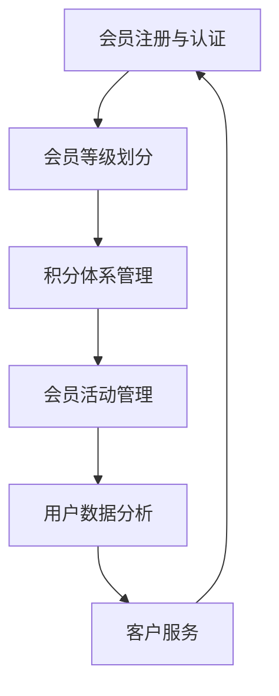

                 


### 文章标题：探索大模型在电商平台会员管理中的潜力

> 关键词：大模型、电商平台、会员管理、算法、数学模型、案例分析

> 摘要：本文将深入探讨大模型在电商平台会员管理中的应用潜力。从背景介绍、核心概念与联系、核心算法原理讲解、数学模型和公式、项目实战以及展望与挑战等多个角度，全面分析大模型技术在电商会员管理中的实际应用和未来发展趋势。

### 目录大纲：

#### 第一部分：引言

1.1 书籍概述
1.2 大模型在电商会员管理中的潜力分析

#### 第二部分：核心概念与联系

2.1 大模型原理与架构
2.2 电商平台会员管理体系

#### 第三部分：核心算法原理讲解

3.1 大模型算法原理
3.2 会员管理中的大模型算法应用
3.3 大模型算法优化与评估

#### 第四部分：数学模型和数学公式

4.1 大模型中的数学模型
4.2 大模型在会员管理中的应用

#### 第五部分：项目实战

5.1 大模型在电商会员管理中的项目实践
5.2 成功案例分析

#### 第六部分：展望与挑战

6.1 大模型在电商会员管理中的未来发展趋势
6.2 电商会员管理的创新方向

#### 第七部分：附录

7.1 开发工具与资源推荐
7.2 进一步阅读与参考资料

### 第一部分：引言

#### 1.1 书籍概述

在当前信息化时代，电商平台已经成为消费者购物的主要渠道之一。会员管理作为电商平台的一项核心功能，直接关系到用户满意度和平台竞争力。传统的会员管理体系多依赖于手动操作和数据挖掘技术，存在效率低、个性化差等问题。随着深度学习和人工智能技术的不断发展，大模型技术在电商会员管理中的应用潜力逐渐显现。

本文将从大模型技术的发展与应用、电商平台会员管理的现状与挑战、大模型在电商会员管理中的潜力分析等方面入手，探讨大模型技术在电商会员管理中的应用前景。希望通过本文的探讨，为电商平台的会员管理提供新的思路和方法。

#### 1.2 大模型在电商会员管理中的潜力分析

大模型技术是指基于深度学习原理，通过大规模数据训练得到的复杂神经网络模型。它具有强大的数据处理和模式识别能力，能够在多种应用场景中发挥重要作用。在电商会员管理中，大模型技术具有以下潜力：

1. **个性化推荐**：大模型可以通过分析用户的历史行为和偏好，为用户推荐个性化的商品和服务，提高用户体验和满意度。

2. **用户行为预测**：大模型可以对用户的购买行为进行预测，提前识别潜在客户，提高转化率和销售额。

3. **会员忠诚度管理**：大模型可以分析用户的消费行为和互动数据，预测会员的流失风险，制定针对性的留存策略。

4. **精准营销**：大模型可以帮助电商平台制定精准的营销策略，提高广告投放效果，降低营销成本。

5. **智能客服**：大模型可以用于智能客服系统，通过自然语言处理技术，为用户提供24小时在线服务，提高客服效率。

总的来说，大模型技术在电商会员管理中具有广泛的应用前景，有望为电商平台带来更高的用户满意度和经济效益。

### 第一部分：引言

#### 1.1 书籍概述

在当前信息化时代，电商平台已经成为消费者购物的主要渠道之一。会员管理作为电商平台的一项核心功能，直接关系到用户满意度和平台竞争力。传统的会员管理体系多依赖于手动操作和数据挖掘技术，存在效率低、个性化差等问题。随着深度学习和人工智能技术的不断发展，大模型技术在电商会员管理中的应用潜力逐渐显现。

本文将从大模型技术的发展与应用、电商平台会员管理的现状与挑战、大模型在电商会员管理中的潜力分析等方面入手，探讨大模型技术在电商会员管理中的应用前景。希望通过本文的探讨，为电商平台的会员管理提供新的思路和方法。

#### 1.2 大模型在电商会员管理中的潜力分析

大模型技术是指基于深度学习原理，通过大规模数据训练得到的复杂神经网络模型。它具有强大的数据处理和模式识别能力，能够在多种应用场景中发挥重要作用。在电商会员管理中，大模型技术具有以下潜力：

1. **个性化推荐**：大模型可以通过分析用户的历史行为和偏好，为用户推荐个性化的商品和服务，提高用户体验和满意度。

2. **用户行为预测**：大模型可以对用户的购买行为进行预测，提前识别潜在客户，提高转化率和销售额。

3. **会员忠诚度管理**：大模型可以分析用户的消费行为和互动数据，预测会员的流失风险，制定针对性的留存策略。

4. **精准营销**：大模型可以帮助电商平台制定精准的营销策略，提高广告投放效果，降低营销成本。

5. **智能客服**：大模型可以用于智能客服系统，通过自然语言处理技术，为用户提供24小时在线服务，提高客服效率。

总的来说，大模型技术在电商会员管理中具有广泛的应用前景，有望为电商平台带来更高的用户满意度和经济效益。

### 第二部分：核心概念与联系

#### 2.1 大模型原理与架构

大模型技术是深度学习的重要组成部分，其核心在于通过大规模数据训练得到具有高度抽象能力的复杂神经网络模型。以下是关于大模型原理与架构的详细解释：

##### 2.1.1 大模型的基本概念

大模型通常指的是参数规模达到百万甚至亿级别的神经网络。这些模型之所以能够处理大量数据，是因为其内部包含的神经元（或节点）数量极其庞大，每个神经元都可以通过其连接的权重参数来学习数据中的特征。

##### 2.1.2 大模型的架构设计

大模型的架构设计通常包括以下几个关键部分：

1. **输入层**：接收外部输入数据，如文本、图像或数值数据。
2. **隐藏层**：一层或多层隐藏神经元，用于特征提取和转换。
3. **输出层**：产生最终输出结果，如分类标签或预测值。

常见的神经网络架构包括：

- **全连接神经网络（FCNN）**：所有层之间的神经元都是全连接的。
- **卷积神经网络（CNN）**：特别适用于处理图像数据，利用卷积操作进行特征提取。
- **循环神经网络（RNN）**：适合处理序列数据，如文本和语音。
- **长短时记忆网络（LSTM）**：RNN的一种改进，解决长序列依赖问题。

##### 2.1.3 大模型的训练与优化

大模型的训练是一个复杂的过程，涉及以下几个关键步骤：

1. **数据预处理**：包括数据清洗、归一化和特征提取等，以提高模型的训练效率。
2. **模型初始化**：为模型的权重参数随机初始化值，以开始训练过程。
3. **前向传播**：输入数据通过模型中的神经元进行传递，产生输出预测值。
4. **反向传播**：计算预测值与实际值之间的误差，并通过梯度下降等优化算法更新模型参数。
5. **模型评估与调优**：使用验证集或测试集评估模型性能，并通过调整学习率、批量大小等超参数来优化模型。

#### 2.2 电商平台会员管理体系

电商平台会员管理体系是一个复杂且综合的系统，旨在通过有效的管理策略提高用户满意度和平台竞争力。以下是会员管理体系的核心要素及其相互关系：

##### 2.2.1 电商平台会员管理的定义与目标

会员管理是指电商平台通过一系列策略和手段，对注册会员进行有效的管理和服务，以提高用户忠诚度和活跃度。其主要目标包括：

- **提高用户粘性**：通过个性化服务和优惠活动，增加用户在平台的停留时间和消费频率。
- **提升用户满意度**：通过快速响应和高质量服务，提升用户对平台的满意度。
- **增加用户转化率**：通过精准的推荐和营销策略，提高用户购买转化率。
- **降低用户流失率**：通过有效的用户留存策略，减少会员流失。

##### 2.2.2 电商平台会员管理体系的核心要素

会员管理体系通常包括以下几个核心要素：

1. **会员注册与身份认证**：会员通过注册和身份认证成为平台的正式用户，这是会员管理的起点。
2. **会员等级体系**：根据用户的消费行为和活跃度，将会员划分为不同等级，如普通会员、银卡会员、金卡会员等，以提供差异化服务。
3. **积分体系**：通过积分奖励制度，激励会员更频繁地使用平台服务，提高用户活跃度。
4. **会员活动管理**：定期举办各类活动，如会员日、周年庆等，以提升会员的参与度和忠诚度。
5. **用户数据分析**：通过数据挖掘技术，分析会员的消费行为、偏好和反馈，为个性化服务和精准营销提供依据。
6. **客户服务**：提供24小时在线客服，快速响应用户的问题和需求，提升用户满意度。

##### 2.2.2.1 Mermaid流程图：电商平台会员管理体系流程



通过上述流程，电商平台可以构建一个完整的会员管理体系，实现用户的有效管理和价值提升。

### 第三部分：核心算法原理讲解

#### 3.1 大模型算法原理

大模型算法的核心在于其深度学习的特性，通过多层神经网络结构，实现对复杂数据模式的自动学习和建模。以下是关于大模型算法原理的详细解释：

##### 3.1.1 神经网络与深度学习基础

神经网络（Neural Networks）是模仿人脑神经元连接方式的计算模型，每个神经元接收多个输入，通过加权求和后加上偏置项，再通过激活函数输出一个值。神经网络的基本组成部分包括：

1. **输入层（Input Layer）**：接收外部输入数据，如图片像素值、文本词向量等。
2. **隐藏层（Hidden Layer）**：一层或多层，用于数据特征提取和转换。
3. **输出层（Output Layer）**：产生最终输出结果，如分类标签或预测值。

深度学习（Deep Learning）是神经网络的一个分支，通过增加网络层数（深度）来提高模型的复杂度和学习能力。深度学习的核心在于：

- **多层抽象**：通过多层次的神经网络，实现从原始数据到高阶抽象特征的转换。
- **非线性变换**：利用激活函数引入非线性特性，增强模型的表达能力。

##### 3.1.2 循环神经网络与长短时记忆网络

循环神经网络（Recurrent Neural Networks，RNN）是处理序列数据的一种神经网络模型，其特别之处在于：

- **时间步依赖**：每个时间步的输出依赖于之前的所有时间步的输入和隐藏状态。
- **动态时间建模**：能够处理任意长度的输入序列，如文本、语音等。

然而，传统的RNN存在梯度消失和梯度爆炸问题，导致难以学习长序列依赖。为了解决这些问题，出现了长短时记忆网络（Long Short-Term Memory，LSTM）：

- **细胞状态（Cell State）**：LSTM通过引入细胞状态来记忆长期依赖信息。
- **门控机制（Gates）**：包括遗忘门（Forget Gate）、输入门（Input Gate）和输出门（Output Gate），用于控制信息的流入和流出。
- **梯度流保持**：通过门控机制和细胞状态，LSTM能够有效避免梯度消失问题，提高长序列学习的能力。

##### 3.1.3 生成对抗网络与变分自编码器

生成对抗网络（Generative Adversarial Networks，GAN）是一种由生成器（Generator）和判别器（Discriminator）组成的对抗性模型。其核心思想是通过两个网络的博弈，生成器尝试生成逼真的数据，而判别器则判断生成数据的真假。GAN在图像生成、数据增强和风格迁移等领域表现出强大的能力。

变分自编码器（Variational Autoencoder，VAE）是一种基于概率模型的编码器（Encoder）和解码器（Decoder）结构。VAE通过引入潜在变量（Latent Variable）来实现数据的生成和压缩。VAE在图像生成、异常检测和生成模型应用中具有广泛的应用。

##### 3.1.3.1 伪代码：生成对抗网络实现

```python
# 生成器伪代码
def generator(z):
    # 输入潜在变量 z，输出生成图像
    x = ...
    return x

# 判别器伪代码
def discriminator(x):
    # 输入图像 x，输出真假概率
    prob = ...
    return prob

# 训练过程伪代码
for epoch in range(num_epochs):
    for batch in data_loader:
        # 生成器训练
        z = ...  # 生成随机噪声
        x_hat = generator(z)
        gen_loss = ...  # 计算生成损失
        
        # 判别器训练
        x_real = ...  # 真实图像
        x_fake = generator(z)
        disc_loss = ...  # 计算判别损失
        
        # 更新模型参数
        optimizer_gen.zero_grad()
        optimizer_disc.zero_grad()
        gen_loss.backward()
        disc_loss.backward()
        optimizer_gen.step()
        optimizer_disc.step()
```

通过上述算法原理的讲解，我们可以看到大模型在处理复杂数据和应用场景中的强大能力。在接下来的部分，我们将进一步探讨大模型算法在会员管理中的具体应用。

#### 3.2 会员管理中的大模型算法应用

大模型算法在会员管理中的具体应用，主要集中在用户行为分析、个性化推荐和会员忠诚度预测等方面。以下是这些应用场景的详细解释：

##### 3.2.1 用户行为分析算法

用户行为分析是电商平台会员管理的重要组成部分，通过分析用户的浏览、搜索和购买行为，可以深入了解用户需求和行为模式，为个性化服务和精准营销提供数据支持。以下是用户行为分析算法的几种常见方法：

1. **协同过滤（Collaborative Filtering）**：通过分析用户之间的相似性，预测用户未评

