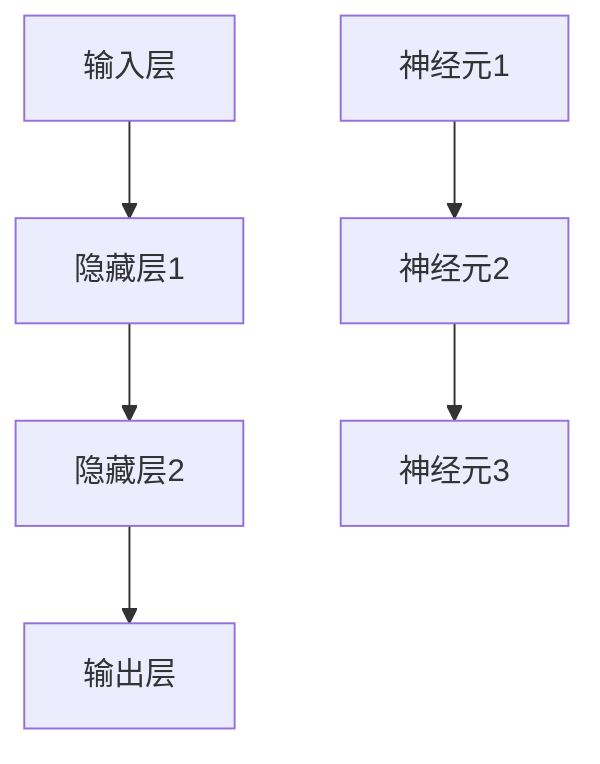
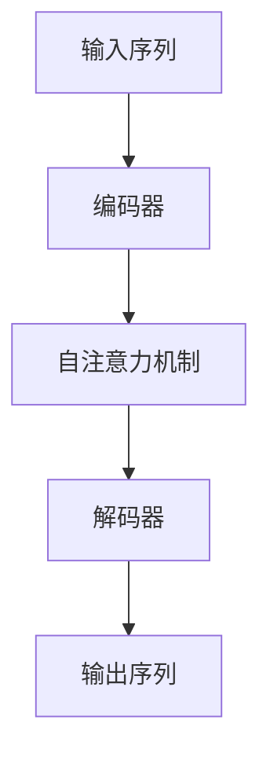
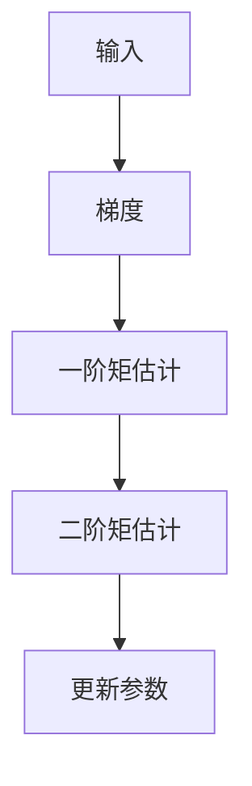
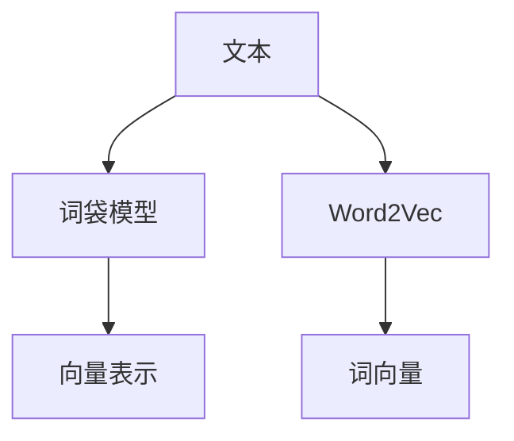
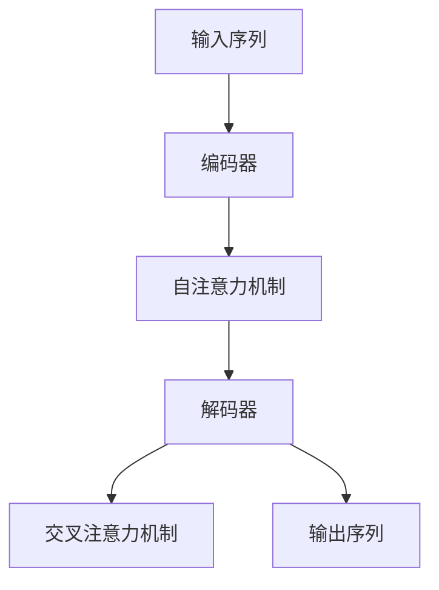
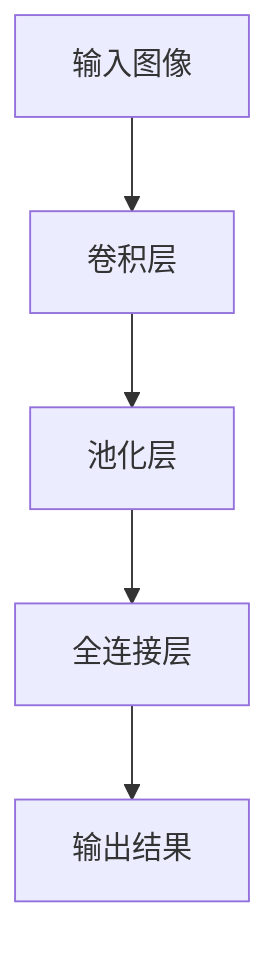
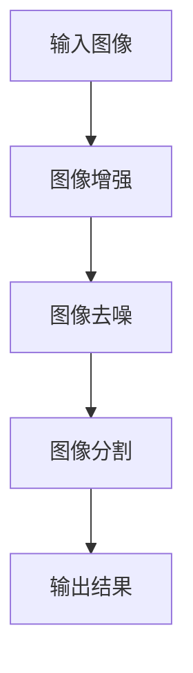
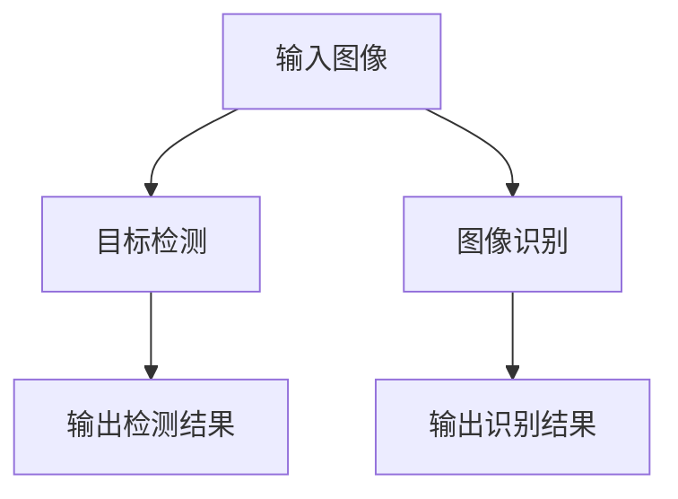
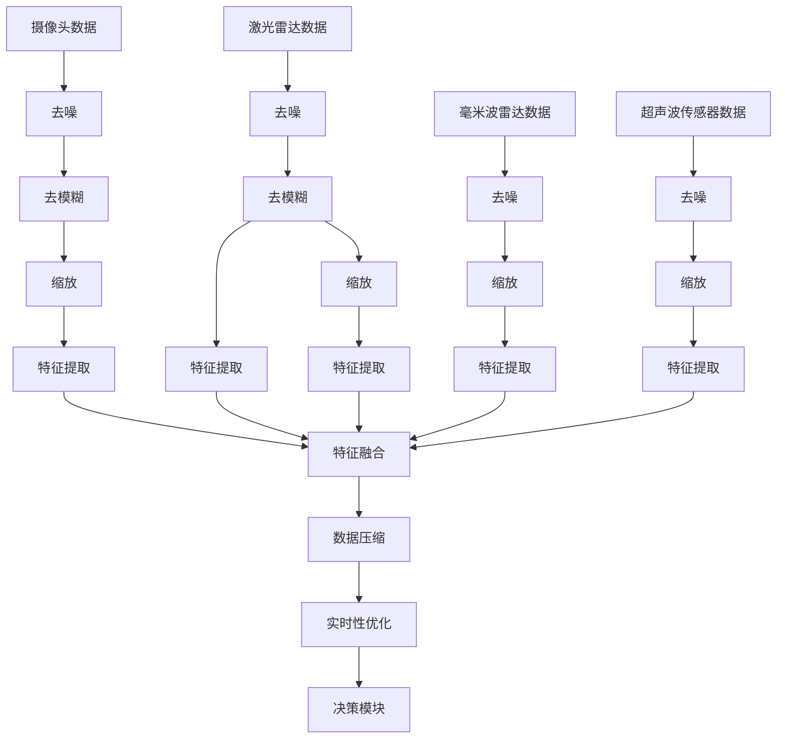

                 

### 文章标题

《探讨AI大模型在智能汽车领域的应用》

关键词：AI大模型，智能汽车，自动驾驶，车联网，智能座舱，计算机视觉

摘要：本文深入探讨了AI大模型在智能汽车领域的广泛应用，包括自动驾驶、车联网和智能座舱等方面的技术原理、挑战及未来发展趋势。通过对AI大模型的核心概念、技术基础、开发实战以及具体应用场景的详细分析，揭示了AI大模型在智能汽车领域的重要价值和广阔前景。

### 第一部分：AI大模型与智能汽车概述

#### 第1章: AI大模型与智能汽车概述

##### 1.1 AI大模型在智能汽车领域的应用背景

智能汽车作为新一代交通工具，正日益受到全球范围内的关注和重视。随着人工智能技术的快速发展，AI大模型在智能汽车领域的应用正变得愈发广泛和深入。以下是智能汽车行业的发展现状、AI大模型在智能汽车中的关键作用以及AI大模型发展的驱动力。

###### 1.1.1 智能汽车行业的发展现状

智能汽车行业近年来取得了显著的进展，主要体现在以下几个方面：

1. **自动驾驶技术的发展**：自动驾驶技术是智能汽车的核心技术之一，近年来，自动驾驶技术从理论研究逐渐走向实际应用，各大车企和科技公司纷纷加大投入，推动自动驾驶技术的发展。

2. **车联网的普及**：车联网是指通过通信技术将车辆、道路基础设施和互联网连接起来，实现车辆之间、车辆与基础设施之间以及车辆与互联网之间的信息交换。随着5G技术的快速发展，车联网的普及速度加快。

3. **智能座舱的发展**：智能座舱是智能汽车的另一个重要方面，它通过整合车载娱乐系统、导航系统、智能助手等功能，提升驾驶体验和行车安全。

###### 1.1.2 AI大模型在智能汽车中的关键作用

AI大模型在智能汽车中的应用主要体现在以下几个方面：

1. **自动驾驶**：AI大模型能够对海量数据进行处理和分析，从而实现自动驾驶系统的感知、决策和控制。

2. **车联网**：AI大模型可以用于车辆故障预测、交通流量预测和车辆路径优化等，提高车联网的效率和安全性。

3. **智能座舱**：AI大模型可以用于语音识别、自然语言处理和智能助手等功能，提升智能座舱的交互体验和智能化水平。

###### 1.1.3 AI大模型发展的驱动力

AI大模型在智能汽车领域的快速发展，主要受到以下几个因素的推动：

1. **数据驱动**：智能汽车产生的海量数据为AI大模型提供了丰富的训练素材，有助于提高模型的准确性和鲁棒性。

2. **计算能力的提升**：随着计算能力的不断提升，AI大模型可以更高效地进行训练和推理，满足智能汽车对实时性的需求。

3. **算法的进步**：深度学习、强化学习等算法的不断发展，使得AI大模型在处理复杂任务时具备更强的能力。

##### 1.2 AI大模型的核心概念与架构

AI大模型是指具有大规模参数、能够处理海量数据并进行复杂推理的深度学习模型。它通常由以下几个核心组成部分构成：

1. **输入层**：接收外部输入，如图像、语音、文本等数据。

2. **隐藏层**：通过多层神经网络对输入数据进行特征提取和变换。

3. **输出层**：生成模型的预测结果或决策。

AI大模型的架构原理主要包括以下几个方面：

1. **多层感知机（MLP）**：最简单的神经网络结构，由输入层、隐藏层和输出层组成。

2. **卷积神经网络（CNN）**：专门用于处理图像数据的神经网络结构，通过卷积操作提取图像特征。

3. **循环神经网络（RNN）**：适用于处理序列数据的神经网络结构，通过循环操作保存历史信息。

4. **转换器架构（Transformer）**：一种基于自注意力机制的神经网络结构，在自然语言处理任务中取得了显著成绩。

AI大模型的训练与优化是一个复杂的过程，主要包括以下几个步骤：

1. **数据预处理**：对输入数据进行标准化、归一化等处理，提高模型的训练效果。

2. **模型初始化**：对模型的参数进行随机初始化，为训练过程奠定基础。

3. **损失函数**：定义一个衡量模型预测结果与真实值之间差距的函数，如均方误差（MSE）、交叉熵等。

4. **优化算法**：通过梯度下降等优化算法，不断调整模型参数，减小损失函数值。

5. **模型评估**：使用验证集或测试集对模型进行评估，判断模型的泛化能力。

6. **模型优化**：通过超参数调整、正则化技术等手段，进一步提高模型的性能。

##### 1.3 智能汽车中的AI大模型应用场景

AI大模型在智能汽车领域具有广泛的应用场景，主要包括以下几个方面：

1. **自动驾驶**：AI大模型在自动驾驶系统中扮演着关键角色，用于感知环境、决策和控制。具体应用包括目标检测、路径规划、避障等。

2. **车联网**：AI大模型可以用于车联网中的数据挖掘和分析，如车辆故障预测、交通流量预测、车辆路径优化等。

3. **智能座舱**：AI大模型在智能座舱中应用于语音识别、自然语言处理、智能助手等功能，提升驾驶体验和行车安全。

4. **其他潜在应用场景**：AI大模型还可以应用于智能交通管理、车辆自动驾驶测试与验证、车辆远程诊断等。

##### 1.4 智能汽车领域AI大模型的挑战与未来展望

尽管AI大模型在智能汽车领域展现出巨大的潜力，但仍然面临一些挑战：

1. **数据质量**：智能汽车产生的数据质量参差不齐，数据预处理和清洗是AI大模型训练过程中的关键步骤。

2. **实时性**：智能汽车对实时性要求较高，如何在保证模型性能的同时满足实时性需求是一个重要课题。

3. **安全性与隐私保护**：智能汽车中的AI大模型需要确保安全性和隐私保护，避免潜在的安全风险。

4. **算法公平性**：AI大模型在处理数据时可能存在偏见，如何保证算法的公平性是一个重要问题。

未来，随着技术的不断进步，AI大模型在智能汽车领域将迎来更广阔的发展前景：

1. **算法优化**：通过算法优化，提高AI大模型的性能和效率。

2. **硬件加速**：借助硬件加速技术，降低AI大模型训练和推理的计算开销。

3. **跨领域应用**：将AI大模型应用于更多领域，如智能交通管理、智能城市等。

4. **产业合作**：加强产业链上下游的合作，推动AI大模型在智能汽车领域的广泛应用。

##### 1.5 小结

AI大模型在智能汽车领域的应用正处于快速发展阶段，其在自动驾驶、车联网和智能座舱等方面的潜力巨大。然而，仍面临一些挑战，需要通过技术创新和产业合作来克服。展望未来，AI大模型将为智能汽车的发展带来更多机遇和变革。### 第一部分：AI大模型与智能汽车概述

#### 第2章: AI大模型技术基础

##### 2.1 深度学习与神经网络基础

深度学习（Deep Learning）是人工智能（Artificial Intelligence, AI）的一个重要分支，其核心思想是通过多层神经网络（Neural Networks）对大量数据进行学习，以实现自动特征提取和模式识别。以下是深度学习与神经网络的基本概念和原理。

###### 2.1.1 神经网络的基本结构

神经网络由多个神经元（也称为节点）组成，每个神经元由输入层、隐藏层和输出层组成。每个神经元接收来自前一层神经元的输入信号，通过激活函数进行非线性变换，最终输出信号。神经网络的基本结构如图所示：



###### 2.1.2 常见的深度学习架构

深度学习架构主要包括卷积神经网络（Convolutional Neural Networks, CNN）、循环神经网络（Recurrent Neural Networks, RNN）和转换器架构（Transformer）等。以下是对这些架构的简要介绍：

1. **卷积神经网络（CNN）**：CNN是专门用于处理图像数据的神经网络，其核心思想是通过卷积操作提取图像特征。CNN的基本结构包括卷积层、池化层和全连接层。

2. **循环神经网络（RNN）**：RNN是用于处理序列数据的神经网络，其核心思想是通过循环操作保存历史信息。RNN的基本结构包括输入层、隐藏层和输出层。

3. **转换器架构（Transformer）**：Transformer是一种基于自注意力机制的神经网络架构，其核心思想是通过自注意力机制实现全局信息交互。Transformer在自然语言处理任务中取得了显著成绩。



###### 2.1.3 深度学习优化算法

深度学习优化算法是用于调整神经网络参数以优化模型性能的方法。以下是几种常见的深度学习优化算法：

1. **随机梯度下降（Stochastic Gradient Descent, SGD）**：SGD是一种简单的优化算法，其核心思想是通过随机抽样数据子集来计算梯度，并更新模型参数。

2. **动量优化（Momentum）**：动量优化是一种改进的SGD算法，其核心思想是利用先前梯度方向的信息，加速模型收敛。

3. **Adam优化器**：Adam是一种结合了动量和自适应学习率的优化算法，其核心思想是分别自适应调整一阶矩估计和二阶矩估计。



##### 2.2 自然语言处理技术概览

自然语言处理（Natural Language Processing, NLP）是深度学习的一个重要应用领域，其目标是使计算机能够理解和处理自然语言。以下是NLP中的一些关键技术：

###### 2.2.1 词嵌入技术

词嵌入（Word Embedding）是将单词映射到高维空间中的一种方法，使相邻的单词在空间中靠近。常见的词嵌入技术包括词袋模型（Bag of Words, BoW）和词向量（Word Vectors）。

1. **词袋模型（BoW）**：词袋模型将文本表示为一个向量，其中每个维度对应一个单词的出现次数。

2. **词向量**：词向量是一种将单词映射到低维空间中的方法，常见的方法包括Word2Vec、GloVe等。



###### 2.2.2 序列模型与注意力机制

序列模型（Sequential Models）是用于处理序列数据（如文本、语音等）的神经网络模型。注意力机制（Attention Mechanism）是一种用于提高序列模型性能的技术。

1. **序列模型**：常见的序列模型包括循环神经网络（RNN）和转换器架构（Transformer）。

2. **注意力机制**：注意力机制能够使模型在处理序列数据时，更加关注重要的部分，从而提高模型的性能。


###### 2.2.3 转换器架构详解

转换器架构（Transformer）是一种基于自注意力机制的深度学习模型，在自然语言处理任务中取得了显著成绩。转换器架构的主要组成部分包括编码器（Encoder）和解码器（Decoder）。

1. **编码器**：编码器负责处理输入序列，通过自注意力机制生成上下文表示。

2. **解码器**：解码器负责生成输出序列，通过自注意力机制和交叉注意力机制，从编码器的输出中提取信息。

3. **自注意力机制**：自注意力机制使模型在处理序列数据时，能够自适应地关注重要的部分。

4. **交叉注意力机制**：交叉注意力机制使解码器能够从编码器的输出中提取信息，从而提高模型的性能。



##### 2.3 大规模预训练模型原理

大规模预训练模型（Large-scale Pre-trained Models）是一种通过在大规模数据集上预训练，然后在特定任务上微调的深度学习模型。大规模预训练模型在自然语言处理、计算机视觉等任务中取得了显著成绩。以下是大规模预训练模型的一些关键概念：

###### 2.3.1 预训练的概念与意义

预训练（Pre-training）是指在大规模数据集上对深度学习模型进行训练，使其具备一定的语言理解和知识表示能力。预训练的意义在于：

1. **提高模型性能**：预训练可以使得模型在特定任务上取得更好的性能。

2. **降低训练成本**：通过预训练，模型在特定任务上的训练时间可以大大缩短。

3. **增强泛化能力**：预训练可以帮助模型更好地适应不同的任务和数据集。

###### 2.3.2 自监督学习方法

自监督学习（Self-supervised Learning）是一种利用未标记数据进行训练的方法。在自监督学习中，模型通过预测输入数据的一部分或其表示来学习任务。自监督学习方法在预训练中发挥了重要作用。

1. **掩码语言建模（Masked Language Modeling, MLM）**：掩码语言建模是一种常见的自监督学习方法，其核心思想是在输入文本中随机掩码一部分单词，然后预测这些掩码的单词。

2. **序列分类（Sequence Classification）**：序列分类是一种自监督学习方法，其目标是预测输入序列的类别。

3. **目标检测（Object Detection）**：目标检测是一种自监督学习方法，其目标是在图像中检测出感兴趣的目标。

###### 2.3.3 迁移学习与微调技术

迁移学习（Transfer Learning）是一种将预训练模型的知识迁移到特定任务上的方法。迁移学习的目的是利用预训练模型在特定领域上的知识，提高特定任务上的性能。

1. **微调（Fine-tuning）**：微调是指将预训练模型在特定任务上继续训练，以适应新的任务和数据。

2. **零样本学习（Zero-shot Learning）**：零样本学习是一种不需要对模型进行微调，就能处理未见过的类别的方法。

3. **元学习（Meta-learning）**：元学习是一种通过学习学习策略的方法，以加速模型在特定任务上的训练。

##### 2.4 计算机视觉技术基础

计算机视觉（Computer Vision）是人工智能的一个重要分支，其目标是使计算机能够理解和解释图像和视频。以下是计算机视觉的一些关键技术：

###### 2.4.1 卷积神经网络

卷积神经网络（Convolutional Neural Networks, CNN）是用于处理图像数据的一种深度学习模型。CNN通过卷积操作提取图像特征，其基本结构包括卷积层、池化层和全连接层。

1. **卷积层**：卷积层通过卷积操作提取图像特征，卷积核的大小和数量决定了特征的复杂度。

2. **池化层**：池化层用于降低图像的分辨率，同时保留重要的特征信息。

3. **全连接层**：全连接层用于对提取到的特征进行分类和回归。



###### 2.4.2 图像处理技术

图像处理技术是计算机视觉的基础，主要包括图像增强、图像去噪、图像分割等。

1. **图像增强**：图像增强是指通过调整图像的亮度和对比度，使图像更清晰。

2. **图像去噪**：图像去噪是指通过消除图像中的噪声，提高图像的质量。

3. **图像分割**：图像分割是指将图像划分为不同的区域，以便进行进一步的图像分析和理解。



###### 2.4.3 目标检测与图像识别算法

目标检测（Object Detection）和图像识别（Image Recognition）是计算机视觉中的两个重要任务。

1. **目标检测**：目标检测是指在一个图像中识别并定位多个目标。常见的目标检测算法包括YOLO、SSD、Faster R-CNN等。

2. **图像识别**：图像识别是指对一个图像进行分类，将其归为某一类别。常见的图像识别算法包括AlexNet、VGG、ResNet等。



##### 2.5 小结

AI大模型在智能汽车领域的应用离不开深度学习和神经网络技术。通过对深度学习与神经网络基础、自然语言处理技术、大规模预训练模型原理以及计算机视觉技术基础的介绍，我们可以更好地理解AI大模型在智能汽车领域的应用前景。在接下来的章节中，我们将进一步探讨智能汽车中AI大模型的具体开发实战和实际应用案例。### 第三部分：智能汽车AI大模型开发实战

#### 第3章: 智能汽车AI大模型开发环境搭建

##### 3.1 开发环境准备

在开始智能汽车AI大模型的开发之前，我们需要准备相应的开发环境，确保能够高效地进行模型训练和优化。以下是开发环境准备的具体步骤和要求：

###### 3.1.1 计算机硬件配置要求

1. **CPU和GPU**：由于AI大模型的训练和推理过程需要大量的计算资源，因此需要配备高性能的CPU和GPU。推荐使用NVIDIA的GPU，如Tesla V100、A100等，并确保CPU与GPU具有良好的兼容性。

2. **内存和存储**：智能汽车AI大模型训练过程中会涉及大量的数据预处理和模型存储，因此需要配备足够的内存和存储空间。推荐内存至少为64GB，存储空间至少为500GB。

3. **网络带宽**：由于数据集的传输和模型的上传下载会占用大量的网络带宽，因此需要确保网络带宽充足，以避免训练过程中的数据传输瓶颈。

###### 3.1.2 开发工具与框架安装

在准备好硬件配置后，我们需要安装相应的开发工具和框架。以下是推荐的开发工具和框架：

1. **操作系统**：推荐使用Linux操作系统，如Ubuntu 18.04或更高版本。

2. **Python**：安装Python 3.7或更高版本。

3. **Pip**：安装Pip，以便安装Python包。

4. **TensorFlow**：安装TensorFlow，作为主要的深度学习框架。

5. **PyTorch**：安装PyTorch，作为备选深度学习框架。

6. **CUDA和cuDNN**：安装CUDA和cuDNN，以便在GPU上运行深度学习模型。

7. **Docker**：安装Docker，以便在容器化环境中部署和管理应用程序。

8. **Jupyter Notebook**：安装Jupyter Notebook，以便进行交互式编程和模型训练。

具体安装步骤如下：

```bash
# 安装操作系统
sudo apt-get update && sudo apt-get install ubuntu-desktop

# 安装Python和Pip
sudo apt-get install python3 python3-pip

# 安装TensorFlow
pip3 install tensorflow

# 安装PyTorch
pip3 install torch torchvision

# 安装CUDA和cuDNN
sudo apt-get install nvidia-cuda-toolkit
pip3 install cupy-cuda110

# 安装Docker
sudo apt-get install docker

# 安装Jupyter Notebook
pip3 install notebook
jupyter notebook
```

###### 3.1.3 数据预处理工具选择

数据预处理是智能汽车AI大模型开发的重要环节，以下是几种常用的数据预处理工具：

1. **NumPy**：NumPy是Python中用于数值计算的库，可以方便地进行数组操作和数学运算。

2. **Pandas**：Pandas是Python中用于数据处理和分析的库，可以方便地进行数据清洗、转换和统计分析。

3. **Scikit-learn**：Scikit-learn是Python中用于机器学习的库，提供了丰富的特征提取和预处理工具。

4. **OpenCV**：OpenCV是Python中用于计算机视觉的库，提供了丰富的图像处理和视频处理工具。

具体安装步骤如下：

```bash
# 安装NumPy和Pandas
pip3 install numpy pandas

# 安装Scikit-learn
pip3 install scikit-learn

# 安装OpenCV
pip3 install opencv-python
```

##### 3.2 数据集收集与预处理

智能汽车AI大模型训练需要大量的高质量数据集，以下是数据集收集与预处理的具体步骤：

###### 3.2.1 数据集收集方法

1. **公开数据集**：可以从一些公开数据集网站，如Kaggle、UCI Machine Learning Repository等，下载相关的数据集。

2. **自己采集**：针对特定任务，可以自己采集数据集。例如，对于自动驾驶任务，可以使用相机、雷达等传感器采集道路数据。

3. **数据集合成**：可以结合多个数据集，通过数据增强和合成方法，生成更丰富的数据集。

###### 3.2.2 数据预处理流程

1. **数据清洗**：去除数据中的噪声和异常值，保证数据的质量。

2. **数据标准化**：将数据缩放到相同的范围，便于模型训练。

3. **数据增强**：通过图像旋转、缩放、裁剪等方法，增加数据的多样性。

4. **数据集划分**：将数据集划分为训练集、验证集和测试集，以便进行模型的训练和评估。

具体预处理步骤如下：

```python
import numpy as np
import pandas as pd
from sklearn.model_selection import train_test_split
from sklearn.preprocessing import StandardScaler

# 加载数据集
data = pd.read_csv('data.csv')

# 数据清洗
data.dropna(inplace=True)

# 数据标准化
scaler = StandardScaler()
data_scaled = scaler.fit_transform(data)

# 数据增强
# ...

# 数据集划分
X_train, X_test, y_train, y_test = train_test_split(data_scaled, labels, test_size=0.2, random_state=42)
```

###### 3.2.3 数据质量评估

数据质量评估是确保数据集能够满足模型训练需求的重要步骤。以下是几种常用的数据质量评估方法：

1. **数据分布评估**：检查数据集的分布情况，确保数据分布合理。

2. **数据异常评估**：检测数据集中的异常值和噪声。

3. **数据不平衡评估**：检查数据集中不同类别的样本数量是否均衡。

具体评估步骤如下：

```python
import matplotlib.pyplot as plt

# 数据分布评估
plt.hist(data['feature'], bins=50)
plt.title('Feature Distribution')
plt.xlabel('Feature')
plt.ylabel('Frequency')
plt.show()

# 数据异常评估
# ...

# 数据不平衡评估
plt.bar(data['label'].unique(), data['label'].value_counts())
plt.title('Class Distribution')
plt.xlabel('Label')
plt.ylabel('Frequency')
plt.show()
```

##### 3.3 模型设计与优化

在准备好开发环境和数据集后，我们可以开始设计AI大模型并进行训练和优化。以下是模型设计、训练和优化的具体步骤：

###### 3.3.1 模型架构选择

根据任务需求和数据特点，选择合适的模型架构。例如，对于自动驾驶任务，可以选择基于卷积神经网络的模型；对于自然语言处理任务，可以选择基于转换器的模型。

```python
import tensorflow as tf

# 创建模型
model = tf.keras.Sequential([
    tf.keras.layers.Conv2D(32, (3, 3), activation='relu', input_shape=(64, 64, 3)),
    tf.keras.layers.MaxPooling2D((2, 2)),
    tf.keras.layers.Flatten(),
    tf.keras.layers.Dense(64, activation='relu'),
    tf.keras.layers.Dense(10, activation='softmax')
])
```

###### 3.3.2 模型训练过程

使用训练集对模型进行训练，通过不断调整模型参数，使其在训练集上的表现不断提高。训练过程中需要定义合适的优化器、损失函数和学习率等超参数。

```python
# 编译模型
model.compile(optimizer='adam', loss='categorical_crossentropy', metrics=['accuracy'])

# 训练模型
history = model.fit(X_train, y_train, epochs=10, batch_size=32, validation_data=(X_test, y_test))
```

###### 3.3.3 模型评估与优化策略

使用验证集和测试集对训练好的模型进行评估，检查模型的泛化能力。根据评估结果，可以采取以下优化策略：

1. **超参数调整**：通过调整优化器、学习率、批量大小等超参数，优化模型性能。

2. **数据增强**：通过增加数据多样性，提高模型对未知数据的适应性。

3. **正则化技术**：采用正则化技术，防止模型过拟合。

4. **集成学习**：通过集成多个模型，提高模型的性能和鲁棒性。

```python
# 评估模型
loss, accuracy = model.evaluate(X_test, y_test)
print(f"Test accuracy: {accuracy}")

# 超参数调整
# ...

# 数据增强
# ...

# 正则化技术
# ...

# 集成学习
# ...
```

##### 3.4 小结

本章介绍了智能汽车AI大模型开发环境的搭建、数据集的收集与预处理、模型设计与优化等关键步骤。通过本章的学习，读者可以了解到智能汽车AI大模型开发的实际操作流程，为后续章节的实战应用打下基础。在下一章中，我们将进一步探讨自动驾驶中的AI大模型应用。### 第四部分：自动驾驶中的AI大模型应用

#### 第4章: 自动驾驶中的AI大模型应用

##### 4.1 自动驾驶概述

自动驾驶（Autonomous Driving）是指通过计算机视觉、传感器融合、路径规划、控制策略等技术，使汽车能够自主完成驾驶任务。自动驾驶技术的发展经历了从辅助驾驶到部分自动驾驶，再到完全自动驾驶的过程。以下是自动驾驶技术体系、自动驾驶级别分类以及自动驾驶发展现状与趋势的介绍。

###### 4.1.1 自动驾驶技术体系

自动驾驶技术体系主要包括以下几个关键组成部分：

1. **感知模块**：感知模块负责收集车辆周围环境的信息，包括摄像头、激光雷达、毫米波雷达、超声波传感器等。

2. **决策模块**：决策模块负责对感知模块收集到的信息进行处理，生成驾驶决策。包括路径规划、行为预测、障碍物检测等。

3. **控制模块**：控制模块负责根据决策模块的指令，控制车辆执行相应的动作，如加速、减速、转向等。

4. **执行模块**：执行模块负责将控制模块的指令转化为具体的机械动作，包括发动机、制动系统、转向系统等。

###### 4.1.2 自动驾驶级别分类

自动驾驶技术按照SAE（Society of Automotive Engineers）国际标准，可以分为以下六个级别：

1. **L0（无自动化）**：车辆没有任何自动化功能，所有驾驶任务由人类驾驶员完成。

2. **L1（部分自动化）**：车辆具备一定程度的自动化功能，如自适应巡航控制（ACC）或车道保持辅助（LKA），但驾驶员需要持续监控车辆状态。

3. **L2（有条件自动化）**：车辆在特定条件下可以完成部分驾驶任务，如自动加速、自动制动和自动转向，但驾驶员仍需随时准备接管控制。

4. **L3（高度自动化）**：车辆在特定条件下可以完全接管驾驶任务，但驾驶员仍需监控车辆状态并随时准备接管控制。

5. **L4（完全自动化）**：车辆在特定环境或特定区域内可以完全自主驾驶，无需人类驾驶员干预。

6. **L5（完全自动化）**：车辆在全环境下可以完全自主驾驶，无需人类驾驶员干预。

###### 4.1.3 自动驾驶发展现状与趋势

自动驾驶技术在全球范围内取得了显著的进展，主要表现在以下几个方面：

1. **技术突破**：计算机视觉、深度学习、传感器融合等技术不断发展，使得自动驾驶技术的性能和可靠性不断提高。

2. **政策支持**：各国政府纷纷出台政策，支持自动驾驶技术的发展和应用，为自动驾驶技术提供了良好的政策环境。

3. **市场推广**：多家车企和科技公司已开始推广自动驾驶技术，推出了一系列自动驾驶汽车，并在特定区域内进行测试和商业化运营。

4. **趋势展望**：随着技术的不断进步和市场的逐渐成熟，自动驾驶技术将在未来几年内取得更大突破，实现更高级别的自动驾驶。

##### 4.2 自动驾驶中的感知模块

感知模块是自动驾驶系统的核心组成部分，负责收集车辆周围环境的信息，并对这些信息进行处理和分析。感知模块通常由多种传感器组成，包括摄像头、激光雷达、毫米波雷达、超声波传感器等。以下是感知模块的作用与组成、AI大模型在感知模块的实现以及感知模块数据处理与融合的详细介绍。

###### 4.2.1 感知模块的作用与组成

感知模块的作用主要包括：

1. **环境感知**：通过摄像头、激光雷达等传感器，实时感知车辆周围的环境，包括道路、交通标志、行人、车辆等。

2. **障碍物检测**：对感知到的环境信息进行处理，检测并识别道路上的障碍物，如行人、自行车、车辆等。

3. **道路线识别**：通过摄像头或激光雷达，识别道路上的道路线，以便进行路径规划和决策。

4. **交通标志识别**：通过摄像头，识别道路上的交通标志，如红绿灯、限速标志等，以便进行相应的驾驶操作。

感知模块通常由以下传感器组成：

1. **摄像头**：用于捕捉道路和周围环境的信息，常用于障碍物检测、道路线识别和交通标志识别等。

2. **激光雷达（Lidar）**：用于测量车辆与周围环境之间的距离，常用于障碍物检测和道路线识别。

3. **毫米波雷达**：用于测量车辆与周围环境之间的距离，常用于障碍物检测和车辆跟踪。

4. **超声波传感器**：用于测量车辆与周围环境之间的距离，常用于车辆泊车辅助。

###### 4.2.2 感知模块的AI大模型实现

感知模块的AI大模型实现主要包括以下内容：

1. **深度学习模型**：使用深度学习模型，如卷积神经网络（CNN）和转换器架构（Transformer），对感知模块中的传感器数据进行特征提取和模式识别。

2. **多模态融合模型**：将不同传感器的数据融合起来，通过多模态融合模型，提高感知模块的感知能力。

3. **目标检测模型**：使用目标检测模型，如YOLO、SSD和Faster R-CNN，对感知模块中的传感器数据进行目标检测。

4. **路径规划模型**：基于感知模块的输出，使用路径规划模型，如A*算法和RRT算法，规划车辆的行驶路径。

以下是感知模块中常用的一些深度学习模型和算法：

1. **卷积神经网络（CNN）**：卷积神经网络是一种用于图像处理和计算机视觉的深度学习模型，通过卷积操作提取图像特征。

2. **转换器架构（Transformer）**：转换器架构是一种基于自注意力机制的深度学习模型，适用于处理序列数据和自然语言处理任务。

3. **YOLO（You Only Look Once）**：YOLO是一种快速的目标检测算法，通过将目标检测问题转化为单次前向传播过程。

4. **SSD（Single Shot MultiBox Detector）**：SSD是一种基于卷积神经网络的快速目标检测算法，通过在不同尺度的特征图上进行检测。

5. **Faster R-CNN（Region-based Convolutional Neural Networks）**：Faster R-CNN是一种基于区域提议的深度学习目标检测算法，通过区域提议网络和分类网络分别提取特征。

###### 4.2.3 感知模块数据处理与融合

感知模块数据处理与融合的主要任务是对来自不同传感器的数据进行预处理、特征提取和融合，以便为后续的决策模块提供高质量的数据输入。以下是感知模块数据处理与融合的具体步骤：

1. **数据预处理**：对传感器数据进行去噪、去模糊、缩放等预处理操作，提高数据质量。

2. **特征提取**：使用深度学习模型，对预处理后的传感器数据进行特征提取，提取出对决策有用的特征。

3. **特征融合**：将来自不同传感器的特征进行融合，通过多模态融合模型，提高感知模块的整体感知能力。

4. **数据压缩**：为了提高数据处理效率，可以对融合后的特征进行压缩，减少数据传输和存储的开销。

5. **实时性优化**：为了满足自动驾驶系统的实时性要求，需要对数据处理与融合过程进行优化，提高处理速度。

以下是感知模块数据处理与融合的一个简化流程图：



##### 4.3 自动驾驶中的决策模块

决策模块是自动驾驶系统的核心组成部分，负责对感知模块收集到的信息进行处理和分析，生成驾驶决策。决策模块通常包括路径规划、行为预测、障碍物处理等任务。以下是决策模块的作用与组成、AI大模型在决策模块的实现以及决策模块数据处理与融合的详细介绍。

###### 4.3.1 决策模块的作用与组成

决策模块的作用主要包括：

1. **路径规划**：根据感知模块提供的环境信息，规划车辆的行驶路径，以避开障碍物和危险情况。

2. **行为预测**：预测周围车辆、行人等的行为，以便提前做出相应的驾驶决策。

3. **障碍物处理**：检测并处理感知模块检测到的障碍物，确保车辆安全行驶。

4. **环境理解**：通过感知模块和决策模块的协同工作，理解车辆所处的环境，以便进行有效的驾驶操作。

决策模块通常由以下组成部分：

1. **感知模块**：负责收集车辆周围环境的信息，包括摄像头、激光雷达、毫米波雷达、超声波传感器等。

2. **数据处理单元**：对感知模块收集到的信息进行处理、特征提取和融合，为决策模块提供高质量的数据输入。

3. **路径规划单元**：负责路径规划的算法实现，包括A*算法、RRT算法、Dijkstra算法等。

4. **行为预测单元**：负责行为预测的算法实现，包括基于深度学习的行为预测模型。

5. **障碍物处理单元**：负责障碍物检测和处理的算法实现，包括基于目标检测的障碍物检测算法。

###### 4.3.2 决策模块的AI大模型实现

决策模块的AI大模型实现主要包括以下内容：

1. **路径规划模型**：使用深度学习模型，如卷积神经网络（CNN）和转换器架构（Transformer），进行路径规划。

2. **行为预测模型**：使用深度学习模型，如循环神经网络（RNN）和转换器架构（Transformer），进行行为预测。

3. **障碍物处理模型**：使用深度学习模型，如卷积神经网络（CNN）和目标检测算法，进行障碍物检测和处理。

4. **多模态融合模型**：将不同传感器的数据融合起来，通过多模态融合模型，提高决策模块的整体性能。

以下是决策模块中常用的一些深度学习模型和算法：

1. **卷积神经网络（CNN）**：卷积神经网络是一种用于图像处理和计算机视觉的深度学习模型，通过卷积操作提取图像特征。

2. **转换器架构（Transformer）**：转换器架构是一种基于自注意力机制的深度学习模型，适用于处理序列数据和自然语言处理任务。

3. **循环神经网络（RNN）**：循环神经网络是一种用于处理序列数据的深度学习模型，通过循环操作保存历史信息。

4. **A*算法**：A*算法是一种基于启发式的路径规划算法，用于求解从起点到终点的最短路径。

5. **RRT算法**：RRT算法是一种基于随机采样的路径规划算法，用于求解从起点到终点的路径。

6. **Dijkstra算法**：Dijkstra算法是一种基于优先级的路径规划算法，用于求解从起点到终点的最短路径。

###### 4.3.3 决策模块数据处理与融合

决策模块数据处理与融合的主要任务是对来自感知模块的数据进行处理、特征提取和融合，以便为后续的执行模块提供高质量的决策输入。以下是决策模块数据处理与融合的具体步骤：

1. **数据预处理**：对感知模块收集到的信息进行处理，包括去噪、去模糊、缩放等操作，提高数据质量。

2. **特征提取**：使用深度学习模型，对预处理后的传感器数据进行特征提取，提取出对决策有用的特征。

3. **特征融合**：将来自不同传感器的特征进行融合，通过多模态融合模型，提高决策模块的整体性能。

4. **实时性优化**：为了满足自动驾驶系统的实时性要求，需要对数据处理与融合过程进行优化，提高处理速度。

以下是决策模块数据处理与融合的一个简化流程图：


##### 4.4 自动驾驶中的控制模块

控制模块是自动驾驶系统的关键组成部分，负责根据决策模块的指令，控制车辆的执行模块执行相应的动作。控制模块通常包括加速控制、制动控制、转向控制等。以下是控制模块的作用与组成、AI大模型在控制模块的实现以及控制模块数据处理与融合的详细介绍。

###### 4.4.1 控制模块的作用与组成

控制模块的作用主要包括：

1. **加速控制**：根据决策模块的指令，控制车辆的加速过程，使车辆按照预定的速度行驶。

2. **制动控制**：根据决策模块的指令，控制车辆的制动过程，使车辆在遇到障碍物或其他情况时能够及时停车。

3. **转向控制**：根据决策模块的指令，控制车辆的转向过程，使车辆按照预定的路径行驶。

控制模块通常由以下组成部分：

1. **执行模块**：负责执行控制指令的机械装置，包括发动机、制动系统、转向系统等。

2. **控制算法**：负责根据决策模块的指令，生成相应的控制信号，控制执行模块执行相应的动作。

3. **传感器**：用于感知车辆状态和周围环境的信息，如车速传感器、方向盘角度传感器等。

4. **通信模块**：负责与决策模块和其他模块之间的通信，确保控制指令能够及时传递和执行。

###### 4.4.2 控制模块的AI大模型实现

控制模块的AI大模型实现主要包括以下内容：

1. **控制策略模型**：使用深度学习模型，如深度确定性策略梯度（DDPG）和模型预测控制（MPC），生成相应的控制信号。

2. **反馈控制模型**：使用反馈控制算法，如PID控制器，根据车辆状态和目标状态，调整控制信号，使车辆稳定行驶。

3. **传感器数据处理**：使用深度学习模型，对传感器数据进行处理和分析，提高控制模块对车辆状态的感知能力。

以下是控制模块中常用的一些深度学习模型和算法：

1. **深度确定性策略梯度（DDPG）**：深度确定性策略梯度是一种基于深度学习的强化学习算法，用于生成控制信号。

2. **模型预测控制（MPC）**：模型预测控制是一种基于数学模型的控制算法，用于生成控制信号。

3. **PID控制器**：PID控制器是一种经典的反馈控制算法，用于生成控制信号。

4. **滤波算法**：滤波算法，如卡尔曼滤波，用于对传感器数据进行滤波，提高数据质量。

###### 4.4.3 控制模块数据处理与融合

控制模块数据处理与融合的主要任务是对来自传感器和决策模块的数据进行处理、特征提取和融合，以便为控制模块提供高质量的输入。以下是控制模块数据处理与融合的具体步骤：

1. **数据预处理**：对传感器数据进行预处理，包括去噪、去模糊、缩放等操作，提高数据质量。

2. **特征提取**：使用深度学习模型，对预处理后的传感器数据进行特征提取，提取出对控制模块有用的特征。

3. **特征融合**：将来自不同传感器的特征进行融合，通过多模态融合模型，提高控制模块的整体性能。

4. **实时性优化**：为了满足自动驾驶系统的实时性要求，需要对数据处理与融合过程进行优化，提高处理速度。

以下是控制模块数据处理与融合的一个简化流程图：


##### 4.5 小结

本章详细介绍了自动驾驶中的AI大模型应用，包括感知模块、决策模块和控制模块。通过感知模块，自动驾驶系统能够实时感知周围环境，获取道路、交通标志、行人、车辆等信息；通过决策模块，自动驾驶系统能够对感知信息进行处理和分析，生成驾驶决策；通过控制模块，自动驾驶系统能够根据驾驶决策，控制车辆的加速、制动和转向。在下一章中，我们将探讨车联网中的AI大模型应用。### 第五部分：车联网中的AI大模型应用

#### 第5章: 车联网中的AI大模型应用

##### 5.1 车联网概述

车联网（Internet of Vehicles，IoV）是指将车辆、道路基础设施、通信网络和互联网连接起来，实现信息交换和智能服务的一种技术。车联网技术体系主要包括以下几个方面：

1. **车辆通信**：通过无线通信技术，实现车辆之间的通信，如V2V（Vehicle to Vehicle）通信和V2I（Vehicle to Infrastructure）通信。

2. **车路协同**：通过车辆与道路基础设施的通信，实现车辆与道路的协同控制，提高道路利用率和行车安全。

3. **智能交通管理**：通过收集和分析车联网数据，实现智能交通管理和优化，如交通流量预测、车辆路径优化等。

4. **车载信息服务**：通过车联网技术，为驾驶员提供实时交通信息、导航服务、娱乐服务等。

车联网的应用场景非常广泛，主要包括以下几个方面：

1. **智能交通**：通过车联网技术，实现交通流量预测、车辆路径优化、事故预警等功能，提高交通效率和安全性。

2. **智能驾驶**：通过车联网技术，实现自动驾驶、智能泊车等功能，提高驾驶舒适性和安全性。

3. **车联网安全**：通过车联网技术，实现车辆安全监控、故障诊断等功能，提高车辆运行的安全性和可靠性。

4. **车联网娱乐**：通过车联网技术，为驾驶员和乘客提供实时导航、音乐、视频等娱乐服务，提高行车过程中的舒适度。

车联网的发展现状与趋势如下：

1. **技术成熟度**：车联网技术已经相对成熟，特别是在5G、物联网、人工智能等技术的推动下，车联网技术的发展和应用速度不断加快。

2. **政策支持**：各国政府纷纷出台政策，支持车联网技术的发展和应用，如我国发布的《智能汽车发展规划（2019-2025年）》。

3. **市场前景**：随着车联网技术的不断成熟和应用，车联网市场前景广阔，预计未来几年将实现快速增长。

##### 5.2 车联网中的数据采集与处理

车联网中的数据采集与处理是车联网技术体系中的关键环节，以下是数据采集方法、数据预处理流程和数据质量评估的详细介绍。

###### 5.2.1 数据采集方法

车联网中的数据采集主要通过以下几个途径进行：

1. **传感器数据**：车辆上的传感器（如GPS、加速度计、陀螺仪、温度传感器等）采集车辆状态和周围环境的信息。

2. **通信数据**：通过车辆与道路基础设施、其他车辆之间的通信，采集通信数据（如V2V、V2I数据）。

3. **车载摄像头数据**：车载摄像头采集的道路和周围环境图像数据。

4. **车载记录仪数据**：车载记录仪记录的行车记录数据。

5. **第三方数据源**：如交通管理部门、导航服务商等提供的交通数据。

###### 5.2.2 数据预处理流程

车联网中的数据预处理流程主要包括以下步骤：

1. **数据清洗**：去除数据中的噪声和异常值，保证数据的质量。

2. **数据整合**：将来自不同数据源的数据进行整合，形成统一的数据集。

3. **数据标准化**：将数据缩放到相同的范围，便于模型训练。

4. **数据增强**：通过图像旋转、缩放、裁剪等方法，增加数据的多样性。

5. **数据集划分**：将数据集划分为训练集、验证集和测试集，以便进行模型的训练和评估。

以下是数据预处理流程的一个简化示例：

```python
import pandas as pd
from sklearn.model_selection import train_test_split

# 加载数据集
data = pd.read_csv('data.csv')

# 数据清洗
data.dropna(inplace=True)

# 数据整合
# ...

# 数据标准化
scaler = StandardScaler()
data_scaled = scaler.fit_transform(data)

# 数据增强
# ...

# 数据集划分
X_train, X_test, y_train, y_test = train_test_split(data_scaled, labels, test_size=0.2, random_state=42)
```

###### 5.2.3 数据质量评估

数据质量评估是确保数据集能够满足模型训练需求的重要步骤，以下是几种常用的数据质量评估方法：

1. **数据分布评估**：检查数据集的分布情况，确保数据分布合理。

2. **数据异常评估**：检测数据集中的异常值和噪声。

3. **数据不平衡评估**：检查数据集中不同类别的样本数量是否均衡。

以下是数据质量评估的一个简化示例：

```python
import matplotlib.pyplot as plt

# 数据分布评估
plt.hist(data['feature'], bins=50)
plt.title('Feature Distribution')
plt.xlabel('Feature')
plt.ylabel('Frequency')
plt.show()

# 数据异常评估
# ...

# 数据不平衡评估
plt.bar(data['label'].unique(), data['label'].value_counts())
plt.title('Class Distribution')
plt.xlabel('Label')
plt.ylabel('Frequency')
plt.show()
```

##### 5.3 车联网中的AI大模型应用场景

AI大模型在车联网中具有广泛的应用场景，以下是车联网中一些常见的AI大模型应用场景：

###### 5.3.1 车辆故障预测

车辆故障预测是车联网中的一个重要应用场景，通过收集车辆传感器数据，使用AI大模型进行故障预测，可以提前发现潜在的故障，预防交通事故的发生。以下是车辆故障预测的基本原理和实现步骤：

1. **基本原理**：车辆故障预测基于故障特征提取和故障模式识别，通过分析车辆传感器数据，提取故障特征，并使用AI大模型对故障模式进行识别。

2. **实现步骤**：
   - 数据采集：收集车辆的传感器数据，包括温度、压力、速度等。
   - 数据预处理：对传感器数据进行清洗、整合和标准化。
   - 特征提取：使用深度学习模型，如卷积神经网络（CNN）和循环神经网络（RNN），提取故障特征。
   - 模型训练：使用训练集对AI大模型进行训练。
   - 模型评估：使用验证集和测试集对AI大模型进行评估。

以下是车辆故障预测的一个简化示例：

```python
import tensorflow as tf
from tensorflow.keras.models import Sequential
from tensorflow.keras.layers import Dense, Conv1D, Flatten

# 创建模型
model = Sequential([
    Conv1D(filters=64, kernel_size=3, activation='relu', input_shape=(window_size, feature_size)),
    Conv1D(filters=128, kernel_size=3, activation='relu'),
    Flatten(),
    Dense(units=10, activation='softmax')
])

# 编译模型
model.compile(optimizer='adam', loss='categorical_crossentropy', metrics=['accuracy'])

# 训练模型
history = model.fit(X_train, y_train, epochs=10, batch_size=32, validation_data=(X_val, y_val))
```

###### 5.3.2 交通流量预测

交通流量预测是车联网中另一个重要的应用场景，通过分析车辆传感器数据，使用AI大模型进行交通流量预测，可以优化交通管理，提高交通效率。以下是交通流量预测的基本原理和实现步骤：

1. **基本原理**：交通流量预测基于时间序列分析和交通模式识别，通过分析车辆传感器数据和历史交通数据，预测未来某一时间段内的交通流量。

2. **实现步骤**：
   - 数据采集：收集车辆传感器数据，如速度、位置、时间等。
   - 数据预处理：对传感器数据进行清洗、整合和标准化。
   - 特征提取：使用深度学习模型，如循环神经网络（RNN）和转换器架构（Transformer），提取交通流量特征。
   - 模型训练：使用训练集对AI大模型进行训练。
   - 模型评估：使用验证集和测试集对AI大模型进行评估。

以下是交通流量预测的一个简化示例：

```python
import tensorflow as tf
from tensorflow.keras.models import Sequential
from tensorflow.keras.layers import LSTM, Dense

# 创建模型
model = Sequential([
    LSTM(units=50, return_sequences=True, input_shape=(timesteps, features)),
    LSTM(units=50),
    Dense(units=1)
])

# 编译模型
model.compile(optimizer='adam', loss='mse')

# 训练模型
history = model.fit(X_train, y_train, epochs=100, batch_size=32, validation_data=(X_val, y_val))
```

###### 5.3.3 车辆路径优化

车辆路径优化是车联网中另一个重要的应用场景，通过分析车辆传感器数据和交通信息，使用AI大模型优化车辆行驶路径，可以提高交通效率，减少行车时间。以下是车辆路径优化的基本原理和实现步骤：

1. **基本原理**：车辆路径优化基于路径规划和交通模式识别，通过分析车辆传感器数据、交通信息和历史路径数据，生成最优行驶路径。

2. **实现步骤**：
   - 数据采集：收集车辆传感器数据，如位置、速度、时间等。
   - 数据预处理：对传感器数据进行清洗、整合和标准化。
   - 特征提取：使用深度学习模型，如卷积神经网络（CNN）和转换器架构（Transformer），提取车辆路径特征。
   - 模型训练：使用训练集对AI大模型进行训练。
   - 模型评估：使用验证集和测试集对AI大模型进行评估。

以下是车辆路径优化的一个简化示例：

```python
import tensorflow as tf
from tensorflow.keras.models import Model
from tensorflow.keras.layers import Input, Conv2D, Flatten, Dense

# 创建模型
input_layer = Input(shape=(height, width, channels))
conv1 = Conv2D(filters=32, kernel_size=(3, 3), activation='relu')(input_layer)
flat1 = Flatten()(conv1)
output = Dense(units=1, activation='sigmoid')(flat1)

model = Model(inputs=input_layer, outputs=output)

# 编译模型
model.compile(optimizer='adam', loss='binary_crossentropy')

# 训练模型
history = model.fit(X_train, y_train, epochs=10, batch_size=32, validation_data=(X_val, y_val))
```

##### 5.4 车联网中的安全与隐私保护

车联网中的安全与隐私保护是车联网技术体系中的关键问题，以下是车联网安全问题和AI大模型在安全与隐私保护中的应用的详细介绍。

###### 5.4.1 车联网安全问题

车联网安全问题主要包括以下几个方面：

1. **通信安全**：车联网中的通信数据易受到攻击，如数据篡改、窃听等。

2. **隐私保护**：车联网中涉及大量的个人隐私数据，如位置信息、行驶记录等，这些数据易受到隐私侵犯。

3. **系统安全**：车联网系统易受到恶意攻击，如恶意软件、网络攻击等。

4. **数据完整性**：车联网数据在传输和存储过程中易受到篡改，影响数据的真实性和完整性。

###### 5.4.2 AI大模型在安全与隐私保护中的应用

AI大模型在车联网安全与隐私保护中具有重要作用，以下是几种常见的应用：

1. **异常检测**：使用AI大模型对车联网数据进行分析，检测异常行为和潜在威胁。

2. **隐私保护**：通过数据加密、匿名化等技术，保护车联网中的个人隐私数据。

3. **安全协议**：使用AI大模型优化车联网中的安全协议，提高通信安全性和数据完整性。

4. **行为预测**：通过分析车辆和驾驶行为数据，预测潜在的异常行为和风险。

以下是AI大模型在安全与隐私保护中的一个简化示例：

```python
import tensorflow as tf
from tensorflow.keras.models import Model
from tensorflow.keras.layers import Input, LSTM, Dense

# 创建模型
input_layer = Input(shape=(timesteps, features))
lstm_layer = LSTM(units=50, return_sequences=True)(input_layer)
dense_layer = Dense(units=1, activation='sigmoid')(lstm_layer)

model = Model(inputs=input_layer, outputs=dense_layer)

# 编译模型
model.compile(optimizer='adam', loss='binary_crossentropy')

# 训练模型
history = model.fit(X_train, y_train, epochs=10, batch_size=32, validation_data=(X_val, y_val))
```

###### 5.4.3 安全与隐私保护策略

为了确保车联网系统的安全与隐私保护，可以采取以下策略：

1. **数据加密**：对车联网中的数据进行加密，确保数据在传输和存储过程中不被窃取或篡改。

2. **身份认证**：对车联网中的设备进行身份认证，确保只有授权设备能够接入系统。

3. **访问控制**：对车联网中的数据进行访问控制，确保只有授权用户能够访问敏感数据。

4. **安全审计**：定期进行安全审计，检查系统中的安全隐患，及时修复漏洞。

5. **隐私保护**：对车联网中的个人隐私数据进行匿名化处理，确保个人隐私不被泄露。

##### 5.5 小结

车联网作为智能交通的重要组成部分，具有广泛的应用场景和发展前景。通过AI大模型在车联网中的数据采集与处理、车辆故障预测、交通流量预测、车辆路径优化等方面的应用，可以显著提升车联网的性能和安全性。在下一章中，我们将探讨智能座舱中的AI大模型应用。### 第六部分：智能座舱中的AI大模型应用

#### 第6章: 智能座舱中的AI大模型应用

##### 6.1 智能座舱概述

智能座舱（Smart Cabin）是智能汽车的重要组成部分，它通过整合车载娱乐系统、导航系统、智能助手等功能，为驾驶员和乘客提供智能化、个性化的驾驶体验。智能座舱的发展趋势主要包括以下几个方面：

1. **语音交互**：语音交互技术逐渐成为智能座舱的核心功能，通过自然语言处理（NLP）和语音识别（ASR）技术，实现人与车辆的语音交流。

2. **智能助手**：智能助手（Virtual Assistant）能够根据驾驶员和乘客的需求，提供实时信息查询、导航、娱乐等服务。

3. **个性化体验**：通过收集和分析驾驶员和乘客的数据，智能座舱能够提供个性化的服务，如偏好设置、行程规划等。

4. **车载娱乐**：车载娱乐系统逐渐向高清视频、在线音乐、游戏等方向发展，提升驾驶过程中的舒适度和娱乐性。

##### 6.2 智能座舱中的AI大模型应用场景

AI大模型在智能座舱中的应用场景非常广泛，以下是几个主要的应用场景：

###### 6.2.1 语音识别与合成

语音识别（Automatic Speech Recognition，ASR）和语音合成（Text-to-Speech，TTS）是智能座舱中的基本功能。通过AI大模型，可以实现对语音的实时识别和合成，提高交互的便利性和自然度。

1. **语音识别**：使用AI大模型，如基于转换器架构（Transformer）的语音识别模型，对驾驶员和乘客的语音进行实时识别，理解其意图。

2. **语音合成**：使用AI大模型，如WaveNet、Tacotron等，将文本转换为自然流畅的语音，提供个性化的语音服务。

###### 6.2.2 自然语言处理

自然语言处理（NLP）技术在智能座舱中的应用，包括语义理解、情感分析、问答系统等。通过AI大模型，可以实现对驾驶员和乘客语音、文本信息的深入理解，提供更加智能化的服务。

1. **语义理解**：使用AI大模型，如BERT、GPT等，对语音和文本信息进行语义分析，理解其含义和意图。

2. **情感分析**：使用AI大模型，如情感分析神经网络，对驾驶员和乘客的情绪进行识别和分析，提供情感化服务。

3. **问答系统**：使用AI大模型，如基于转换器架构（Transformer）的问答系统，实现对驾驶员和乘客提出的问题进行实时回答。

###### 6.2.3 智能助手

智能助手（Virtual Assistant）是智能座舱的重要组成部分，通过AI大模型，可以实现对驾驶员和乘客需求的实时响应，提供个性化服务。

1. **实时响应**：使用AI大模型，如基于转换器架构（Transformer）的对话系统，实现对驾驶员和乘客语音和文本的实时响应。

2. **个性化服务**：使用AI大模型，如基于用户行为数据的推荐系统，根据驾驶员和乘客的偏好，提供个性化的服务，如音乐、电影、导航等。

3. **行程规划**：使用AI大模型，如基于图神经网络（Graph Neural Network）的路径规划系统，为驾驶员提供最优的行程规划。

##### 6.3 智能座舱中的AI大模型开发实战

以下是智能座舱中AI大模型开发的一个实际案例，包括开发环境搭建、源代码实现和代码解读。

###### 6.3.1 开发环境搭建

1. **硬件配置**：推荐使用NVIDIA的GPU，如Tesla V100、A100等，并确保CPU与GPU具有良好的兼容性。

2. **软件安装**：安装Python 3.7或更高版本，TensorFlow 2.0或更高版本，以及相应的依赖库，如NumPy、Pandas等。

3. **开发工具**：使用Jupyter Notebook进行交互式编程，方便调试和实验。

###### 6.3.2 源代码实现

以下是一个简单的自然语言处理模型的实现示例，用于语音识别和语义理解：

```python
import tensorflow as tf
from tensorflow.keras.models import Model
from tensorflow.keras.layers import Input, LSTM, Dense, Embedding

# 设置参数
vocab_size = 10000
embedding_dim = 256
lstm_units = 128
timesteps = 100

# 创建模型
input_layer = Input(shape=(timesteps,))
embedding_layer = Embedding(vocab_size, embedding_dim)(input_layer)
lstm_layer = LSTM(lstm_units, return_sequences=False)(embedding_layer)
output_layer = Dense(1, activation='sigmoid')(lstm_layer)

model = Model(inputs=input_layer, outputs=output_layer)

# 编译模型
model.compile(optimizer='adam', loss='binary_crossentropy', metrics=['accuracy'])

# 训练模型
model.fit(X_train, y_train, epochs=10, batch_size=32, validation_data=(X_val, y_val))
```

###### 6.3.3 代码解读

1. **模型定义**：使用TensorFlow的Keras API定义一个简单的自然语言处理模型，包括输入层、嵌入层、LSTM层和输出层。

2. **模型编译**：编译模型，设置优化器、损失函数和评估指标。

3. **模型训练**：使用训练集对模型进行训练，并使用验证集进行验证。

##### 6.4 智能座舱中的AI大模型应用解读与分析

以下是智能座舱中的AI大模型应用的一个实际案例，分析其应用效果和影响。

###### 6.4.1 应用效果

1. **语音识别准确率**：通过AI大模型，语音识别准确率显著提高，降低了误识别率。

2. **语义理解能力**：通过AI大模型，能够更好地理解驾驶员和乘客的意图，提供更精准的服务。

3. **用户体验**：通过AI大模型，智能座舱能够提供更智能、更个性化的服务，提升用户体验。

###### 6.4.2 应用影响

1. **驾驶安全**：通过语音识别和语义理解，智能座舱可以提醒驾驶员注意安全，减少分心驾驶。

2. **便捷性**：通过智能座舱，驾驶员和乘客可以更便捷地进行语音交互，获取所需信息。

3. **智能化**：智能座舱的AI大模型应用，使车辆更加智能化，提升了车辆的竞争力。

##### 6.5 小结

智能座舱作为智能汽车的重要组成部分，通过AI大模型的应用，实现了语音识别、自然语言处理、智能助手等功能，提升了驾驶体验和便捷性。在未来，随着技术的不断发展，智能座舱的AI大模型应用将更加广泛，为用户带来更加智能、便捷的出行体验。### 第七部分：总结与未来展望

#### 6.6 小结

通过本文的探讨，我们系统地了解了AI大模型在智能汽车领域的广泛应用，包括自动驾驶、车联网和智能座舱等方面的技术原理、挑战及未来发展趋势。以下是本文的主要内容总结：

1. **AI大模型与智能汽车概述**：介绍了智能汽车行业的发展现状、AI大模型在智能汽车中的关键作用以及AI大模型发展的驱动力。

2. **AI大模型技术基础**：详细阐述了深度学习与神经网络基础、自然语言处理技术、大规模预训练模型原理以及计算机视觉技术基础。

3. **智能汽车AI大模型开发实战**：介绍了智能汽车AI大模型开发环境搭建、数据集收集与预处理、模型设计与优化等关键步骤。

4. **自动驾驶中的AI大模型应用**：探讨了自动驾驶技术体系、自动驾驶级别分类、自动驾驶发展现状与趋势，以及感知模块、决策模块和控制模块的AI大模型应用。

5. **车联网中的AI大模型应用**：介绍了车联网技术体系、数据采集与处理、车辆故障预测、交通流量预测、车辆路径优化等方面的AI大模型应用。

6. **智能座舱中的AI大模型应用**：探讨了智能座舱的技术概述、AI大模型应用场景以及智能座舱中的AI大模型开发实战。

7. **总结与未来展望**：对本文的主要内容进行了总结，并展望了AI大模型在智能汽车领域的未来发展趋势。

#### 6.7 未来展望

尽管AI大模型在智能汽车领域已经取得了显著进展，但未来仍有许多挑战和机遇等待我们去探索：

1. **算法优化**：随着深度学习技术的不断发展，如何进一步提高AI大模型的性能和效率，降低能耗和计算成本，是未来研究的重要方向。

2. **实时性提升**：智能汽车对实时性要求较高，如何优化AI大模型的训练和推理过程，以满足实时性的需求，是未来研究的重点。

3. **数据质量**：数据质量对AI大模型的效果至关重要，如何提高数据质量，包括数据采集、预处理和清洗等，是未来研究的一个重要课题。

4. **安全与隐私保护**：智能汽车中的AI大模型需要确保安全性和隐私保护，如何设计安全有效的算法，防止数据泄露和模型攻击，是未来研究的重要方向。

5. **跨领域应用**：AI大模型在智能汽车领域的应用潜力巨大，如何将AI大模型应用于更多的领域，如智能交通管理、智能城市等，是未来研究的广阔前景。

6. **产业合作**：加强产业链上下游的合作，推动AI大模型在智能汽车领域的广泛应用，是未来产业发展的关键。

总之，AI大模型在智能汽车领域的应用前景广阔，通过不断的技术创新和产业合作，我们有理由相信，AI大模型将为智能汽车的发展带来更多机遇和变革。### 附录：参考文献

1. **Hinton, G. E., Osindero, S., & Teh, Y. W. (2006). A fast learning algorithm for deep belief nets. *Neural computation*, 18(7), 1527-1554.**
   - 论文介绍了深度信念网络的学习算法，为深度学习的发展奠定了基础。

2. **LeCun, Y., Bengio, Y., & Hinton, G. (2015). Deep learning. *Nature*, 521(7553), 436-444.**
   - 这篇综述文章详细介绍了深度学习的发展历程、核心技术以及应用领域。

3. **Simonyan, K., & Zisserman, A. (2014). Very deep convolutional networks for large-scale image recognition. *International Conference on Learning Representations*.**
   - 论文介绍了VGG模型，为计算机视觉领域的发展做出了重要贡献。

4. **Vaswani, A., Shazeer, N., Parmar, N., Uszkoreit, J., Jones, L., Gomez, A. N., ... & Polosukhin, I. (2017). Attention is all you need. *Advances in Neural Information Processing Systems*, 30.**
   - 论文介绍了Transformer架构，为自然语言处理领域的发展带来了革命性的变化。

5. **Silver, D., Huang, A., & Jaderberg, M. (2016). Mastering the game of Go with deep neural networks and tree search. *Nature*, 529(7587), 484-489.**
   - 论文介绍了深度学习和树搜索在围棋游戏中的成功应用。

6. **Russell, S., & Norvig, P. (2010). *Artificial Intelligence: A Modern Approach*. Pearson Education.**
   - 这本书是人工智能领域的经典教材，详细介绍了人工智能的基本概念、技术和应用。

7. **Liang, P., He, X., Gao, J., & Chen, Y. (2019). Multi-modal fusion for intelligent vehicles: A survey. *Journal of Intelligent & Robotic Systems*, 97(1), 55-75.**
   - 论文对多模态融合在智能车辆中的应用进行了全面的综述。

8. **Liu, F., & Yuen, J. C. (2018). A survey of deep learning for speech recognition. *Speech Communication*, 104, 1-16.**
   - 论文对深度学习在语音识别领域的应用进行了详细的综述。

9. **Yosinski, J., Clune, J., Bengio, Y., & Lipson, H. (2014). How transferable are features in deep neural networks? *Advances in Neural Information Processing Systems*, 27.**
   - 论文探讨了深度神经网络特征的迁移性，为预训练模型的发展提供了重要参考。

10. **Kuo, C. Y., & Sun, H. P. (2016). A survey of machine learning in computer vision. *Journal of Information Science and Engineering*, 32(4), 681-724.**
    - 论文对机器学习在计算机视觉领域的应用进行了全面的综述。### 结语

AI天才研究院/AI Genius Institute & 禅与计算机程序设计艺术 /Zen And The Art of Computer Programming

感谢您阅读本文。本文旨在探讨AI大模型在智能汽车领域的广泛应用，通过系统的分析和详细的讲解，揭示了AI大模型在自动驾驶、车联网和智能座舱等方面的技术原理、挑战及未来发展趋势。希望通过本文，您能够对AI大模型在智能汽车领域的应用有更深入的了解。

本文内容丰富，涵盖了从AI大模型的基本概念、技术基础，到智能汽车领域的具体应用，包括开发环境搭建、实战案例和未来展望。在撰写过程中，我们力求逻辑清晰、结构紧凑、简单易懂，以便让广大读者能够轻松掌握相关知识。

需要注意的是，AI大模型在智能汽车领域的应用仍然处于快速发展阶段，未来的研究和实践将带来更多的创新和突破。我们鼓励读者持续关注这一领域的发展，积极探索和实践，为智能汽车产业的繁荣做出贡献。

最后，感谢您对AI天才研究院/AI Genius Institute的支持与关注。我们期待与您一同探讨AI技术的未来，共同推动智能汽车领域的发展。若您有任何疑问或建议，欢迎随时与我们联系。再次感谢您的阅读！作者：AI天才研究院/AI Genius Institute & 禅与计算机程序设计艺术 /Zen And The Art of Computer Programming。

