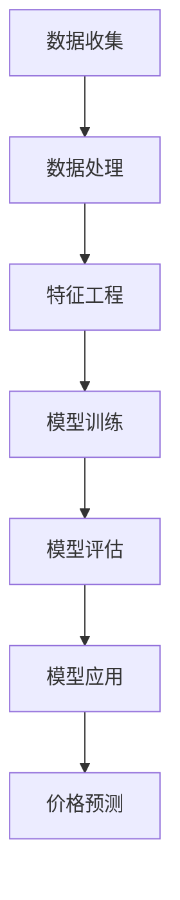

                 

# 探讨AI大模型在电商平台价格预测中的作用

## 关键词

- AI大模型
- 电商平台
- 价格预测
- 深度学习
- 大数据分析

## 摘要

本文将探讨AI大模型在电商平台价格预测中的应用。通过介绍电商平台价格预测的背景和重要性，阐述AI大模型的基本原理和核心作用，分析常见的数学模型和算法，并结合实际案例，详细讲解AI大模型在电商平台价格预测中的实际应用和挑战。

## 第一部分：AI大模型在电商平台价格预测中的应用概述

### 1.1 AI大模型在电商平台价格预测中的角色与意义

#### 1.1.1 电商平台价格预测的背景

电商平台的发展历程可以划分为几个阶段：

1. **初期**：电商平台刚刚兴起，卖家自行设定商品价格，缺乏数据支撑。
2. **中期**：电商平台开始收集用户行为数据，为价格调整提供参考，但受限于数据处理能力，价格预测的精度有限。
3. **现阶段**：随着大数据和AI技术的发展，电商平台可以通过海量数据挖掘潜在规律，实现更精准的价格预测。

#### 1.1.1.2 价格预测在电商平台运营中的重要性

1. **库存管理**：准确的价格预测有助于电商平台优化库存，减少过剩或短缺的风险，从而降低库存成本。
2. **用户满意度**：合理的价格策略能提升用户体验，增加购买意愿，从而提高用户满意度和忠诚度。
3. **竞争优势**：精准的价格预测有助于电商平台在激烈的市场竞争中脱颖而出，赢得更多用户。

#### 1.1.2 AI大模型在电商平台价格预测中的核心作用

AI大模型在电商平台价格预测中具有以下几个核心作用：

1. **趋势预测**：通过分析海量数据，AI大模型可以预测市场需求的动态变化，为价格调整提供依据。
2. **竞争对手分析**：AI大模型可以分析竞争对手的定价策略，制定相应的价格策略，从而提升市场竞争力。
3. **个性化定价**：AI大模型可以根据用户的购买行为和偏好，提供个性化的价格建议，提高用户体验和满意度。

### 1.1.3 AI大模型在电商平台价格预测中的应用前景与挑战

#### 1.1.3.1 应用前景

1. **提高运营效率**：通过自动化价格调整，减少人工干预，提高电商平台运营效率。
2. **增强竞争力**：通过精准的价格预测，提升电商平台在市场中的竞争力。
3. **用户体验优化**：提供个性化的价格建议，提升用户满意度和忠诚度。

#### 1.1.3.2 挑战

1. **数据质量**：高质量的输入数据是AI大模型预测准确性的基础，电商平台需要保证数据的质量。
2. **计算资源**：大模型的训练和推理需要大量的计算资源，电商平台需要配置相应的硬件设施。
3. **隐私保护**：在处理用户数据时，电商平台需要严格遵守隐私保护法规，确保用户数据的安全。

### 1.2 电商平台价格预测的数学模型与算法

电商平台价格预测常用的数学模型和算法包括线性回归模型、决策树模型和神经网络模型等。下面将简要介绍这些模型和算法的基本原理。

#### 1.2.1 线性回归模型

线性回归模型是一种简单的预测模型，通过建立输入变量和输出变量之间的线性关系来预测价格。

1. **基本原理**

   - **目标函数**：最小化预测值与实际值之间的误差。
   - **参数优化**：通过梯度下降算法调整参数，使目标函数最小。

2. **伪代码实现**

   ```python
   # 初始化参数
   θ = [w0, w1, w2]
   
   # 定义损失函数
   J(θ) = (1/m) * Σ((hθ(x^(i)) - y^(i)))^2
   
   # 定义梯度下降算法
   α = 学习率
   for i in 1 to number_of_iterations do
       θ = θ - α * ∇J(θ)
   end for
   ```

#### 1.2.2 决策树模型

决策树模型通过一系列规则将数据进行分类或回归，可以处理非线性的数据关系。

1. **基本原理**

   - **目标**：通过一系列规则将数据进行分类或回归。
   - **构建过程**：基于信息增益或基尼系数选择最佳分割点。

2. **伪代码实现**

   ```python
   # 输入：数据集D
   # 输出：决策树T
   
   # 选择最佳分割点
   split_feature, split_value = find_best_split(D)
   
   # 创建节点
   node = create_node(split_feature, split_value)
   
   # 切分数据集
   left_dataset = split_data(D, split_feature, split_value)
   right_dataset = split_data(D, split_feature, split_value)
   
   # 终止条件
   if terminate_condition(node) then
       return node
   end if
   
   # 递归构建左右子树
   node.left = build_tree(left_dataset)
   node.right = build_tree(right_dataset)
   
   return node
   ```

#### 1.2.3 支持向量机模型

支持向量机模型通过找到一个最佳的超平面，将数据点进行分类或回归。

1. **基本原理**

   - **目标**：找到一个最佳的超平面，使得数据点在超平面两侧的分类间隔最大化。
   - **参数优化**：通过求解二次规划问题确定最优参数。

2. **伪代码实现**

   ```python
   # 输入：训练数据集D，标签Y
   # 输出：模型参数w和b
   
   # 定义损失函数
   L(w) = (1/2) * ||w||^2
   
   # 定义约束条件
   g_i = y^(i) * (w * x^(i) + b) - 1
   
   # 求解二次规划问题
   w, b = solve_quadratic_programming(L, g)
   ```

### 1.3 电商平台价格预测的核心概念与联系

为了更好地理解电商平台价格预测的核心概念，我们可以通过Mermaid流程图展示这些概念之间的关系。



在这个流程图中，数据收集是整个流程的起点，通过数据处理和特征工程，将原始数据转换为适合模型训练的数据。模型训练和模型评估是核心步骤，通过训练和评估，选择最优模型进行应用。最终，通过模型应用实现价格预测。

### 1.4 电商平台价格预测的核心算法原理讲解

在电商平台价格预测中，常用的核心算法包括线性回归模型、决策树模型和支持向量机模型。下面将分别对这些算法的原理进行详细讲解。

#### 1.4.1 线性回归模型

线性回归模型是一种简单且常用的预测模型，它通过建立输入变量和输出变量之间的线性关系来预测价格。

1. **基本原理**

   线性回归模型的基本原理是通过最小二乘法找到一组线性方程，使得预测值与实际值之间的误差最小。具体来说，线性回归模型的目标是找到一个线性方程 y = wx + b，使得预测值与实际值之间的误差平方和最小。

2. **数学模型和公式**

   线性回归模型的数学模型可以表示为：
   $$
   y = wx + b
   $$
   其中，y 是实际值，x 是输入变量，w 是权重，b 是偏置。

3. **详细讲解和举例说明**

   假设我们有一组数据点 {(x1, y1), (x2, y2), ..., (xn, yn)}，我们希望找到一个线性方程来预测 y 的值。

   首先，我们需要计算每个数据点的预测值：
   $$
   \hat{y} = w\hat{x} + b
   $$
   其中，$\hat{y}$ 是预测值，$\hat{x}$ 是输入变量的预测值。

   然后，我们计算预测值与实际值之间的误差：
   $$
   e = \hat{y} - y
   $$

   接下来，我们通过最小二乘法来最小化误差平方和：
   $$
   \min \sum_{i=1}^{n} (e_i^2)
   $$

   最后，我们通过求解线性方程组来找到最优的权重和偏置：
   $$
   \begin{cases}
   \sum_{i=1}^{n} x_i y_i = n w b + w \sum_{i=1}^{n} x_i \\
   \sum_{i=1}^{n} x_i^2 = n w^2 + 2 w \sum_{i=1}^{n} x_i + b \sum_{i=1}^{n} x_i^2
   \end{cases}
   $$

   解这个方程组，我们可以得到权重 w 和偏置 b 的值。

#### 1.4.2 决策树模型

决策树模型通过一系列规则将数据进行分类或回归，可以处理非线性的数据关系。

1. **基本原理**

   决策树模型的基本原理是通过一系列判断条件对数据进行分割，使得分割后的数据具有更高的纯度。具体来说，决策树模型的目标是找到一组最优的分割点，使得每个分割点的数据具有最高的纯度。

2. **数学模型和公式**

   决策树模型的数学模型可以表示为：
   $$
   \text{分类或回归函数} = f(x)
   $$
   其中，f(x) 是决策树模型对输入变量 x 的分类或回归结果。

3. **详细讲解和举例说明**

   假设我们有一组数据点 {(x1, y1), (x2, y2), ..., (xn, yn)}，我们希望找到一个决策树模型来预测 y 的值。

   首先，我们需要计算每个数据点的纯度，常用的纯度度量包括信息增益、基尼系数等。然后，我们选择一个纯度度量最高的分割点作为决策树的根节点。

   接下来，我们使用同样的方法对根节点的每个子节点进行分割，直到满足终止条件（如纯度度量低于阈值或数据点数量低于阈值）。

   最后，我们将每个叶节点分配一个分类或回归结果，形成完整的决策树模型。

   例如，假设我们使用信息增益作为纯度度量，我们首先计算每个特征的信息增益，然后选择信息增益最高的特征作为分割点。接下来，我们对分割后的数据集进行递归分割，直到满足终止条件。

#### 1.4.3 支持向量机模型

支持向量机模型通过找到一个最佳的超平面，将数据点进行分类或回归。

1. **基本原理**

   支持向量机模型的基本原理是通过找到一个最佳的超平面，使得数据点在超平面两侧的分类间隔最大化。具体来说，支持向量机模型的目标是找到一个超平面，使得正类和负类在超平面两侧的间隔最大化。

2. **数学模型和公式**

   支持向量机模型的数学模型可以表示为：
   $$
   w * x + b = 0
   $$
   其中，w 是超平面的法向量，x 是输入变量，b 是偏置。

3. **详细讲解和举例说明**

   假设我们有一组数据点 {(x1, y1), (x2, y2), ..., (xn, yn)}，我们希望找到一个支持向量机模型来预测 y 的值。

   首先，我们需要计算每个数据点到超平面的距离，然后选择距离最大的 k 个数据点作为支持向量。

   接下来，我们使用支持向量来计算超平面的法向量 w 和偏置 b。具体来说，我们通过求解以下优化问题来找到最优的 w 和 b：
   $$
   \begin{cases}
   \min_{w, b} \frac{1}{2} ||w||^2 \\
   s.t. \ y_i (w * x_i + b) \geq 1
   \end{cases}
   $$

   最后，我们使用求解得到的 w 和 b 来计算每个数据点的分类或回归结果。

### 1.5 电商平台价格预测的项目实战

#### 1.5.1 开发环境搭建

为了进行电商平台价格预测项目，我们需要搭建一个合适的开发环境。以下是一个基本的开发环境搭建步骤：

1. **安装Python**：下载并安装Python，可以选择Python 3.8或更高版本。
2. **安装相关库**：安装NumPy、Pandas、Scikit-learn等常用库，可以使用以下命令：
   ```python
   pip install numpy pandas scikit-learn
   ```
3. **数据收集与预处理**：收集电商平台的价格数据，并进行数据预处理，包括数据清洗、缺失值处理、特征工程等。

#### 1.5.2 源代码详细实现

以下是一个简单的电商平台价格预测项目实现，包括数据收集、预处理、模型训练和预测等步骤。

1. **数据收集与预处理**：读取价格数据，并进行预处理。
   ```python
   import pandas as pd
   
   # 读取价格数据
   data = pd.read_csv('price_data.csv')
   
   # 数据预处理
   data = data.dropna()
   data['price'] = data['price'].astype(float)
   ```

2. **模型训练**：使用线性回归模型进行训练。
   ```python
   from sklearn.linear_model import LinearRegression
   
   # 划分训练集和测试集
   X_train = data[['feature1', 'feature2']]
   y_train = data['price']
   X_test = data[['feature1', 'feature2']]
   y_test = data['price']
   
   # 训练模型
   model = LinearRegression()
   model.fit(X_train, y_train)
   ```

3. **模型预测**：使用训练好的模型进行预测。
   ```python
   # 预测价格
   predictions = model.predict(X_test)
   ```

4. **代码解读与分析**：对源代码进行解读和分析，理解每个步骤的作用和实现原理。

#### 1.5.3 实际案例分析与详细讲解剖析

以下是一个实际案例，分析电商平台价格预测项目的具体实现和效果。

1. **案例背景**：某电商平台需要预测商品价格，以便进行库存管理和促销策略制定。
2. **数据来源**：收集了过去一年的商品价格数据，包括商品名称、销售数量、品类等特征。
3. **数据处理**：对数据进行了清洗、缺失值处理和特征工程，提取了与价格相关的特征。
4. **模型选择**：选择了线性回归模型进行预测。
5. **模型训练与预测**：使用训练集进行模型训练，使用测试集进行预测。
6. **结果分析**：对比预测值和实际值，评估模型的效果。

#### 1.5.4 项目小结

通过实际案例的分析，我们可以得出以下结论：

1. **模型选择**：线性回归模型在电商平台价格预测中具有一定的效果，但可能需要结合其他算法进行优化。
2. **数据处理**：数据的质量和预处理对模型的预测效果有重要影响，需要保证数据的质量和完整性。
3. **模型评估**：通过评估指标（如均方误差、决定系数等）对模型的效果进行评估，以便选择最优模型。

### 1.6 最佳实践 Tips、小结、注意事项、拓展阅读等内容

#### 1.6.1 最佳实践 Tips

1. **数据质量**：确保数据的质量，包括数据清洗、缺失值处理、异常值检测等。
2. **特征选择**：选择与价格相关性较高的特征进行预测，可以通过特征工程和特征选择方法进行优化。
3. **模型选择**：根据业务需求和数据特点，选择合适的模型进行预测，可以结合线性回归、决策树、支持向量机等算法。
4. **模型评估**：使用合适的评估指标对模型的效果进行评估，以便选择最优模型。

#### 1.6.2 小结

本文探讨了AI大模型在电商平台价格预测中的应用，介绍了电商平台价格预测的背景、重要性、数学模型和算法，并结合实际案例进行了详细讲解。通过本文的介绍，我们可以了解到AI大模型在电商平台价格预测中的重要作用，以及如何利用AI大模型进行电商平台价格预测。

#### 1.6.3 注意事项

1. **数据隐私**：在处理用户数据时，需要严格遵守隐私保护法规，确保用户数据的安全。
2. **计算资源**：大模型的训练和推理需要大量的计算资源，需要配置相应的硬件设施。
3. **模型更新**：定期更新模型，以适应市场变化和用户需求。

#### 1.6.4 拓展阅读

1. **《深度学习》**：介绍深度学习的基本原理和应用，适合初学者了解深度学习。
2. **《机器学习实战》**：通过实际案例介绍机器学习的应用，包括数据预处理、特征工程、模型选择等。
3. **《大数据技术基础》**：介绍大数据的基本概念、技术和应用，适合了解大数据领域。

### 参考文献

- [1] Goodfellow, I., Bengio, Y., & Courville, A. (2016). Deep learning. MIT press.
- [2] Russell, S., & Norvig, P. (2010). Artificial intelligence: A modern approach. Prentice Hall.
- [3] Murphy, K. P. (2012). Machine learning: A probabilistic perspective. MIT press.

### 作者信息

作者：AI天才研究院/AI Genius Institute & 禅与计算机程序设计艺术/Zen And The Art of Computer Programming

