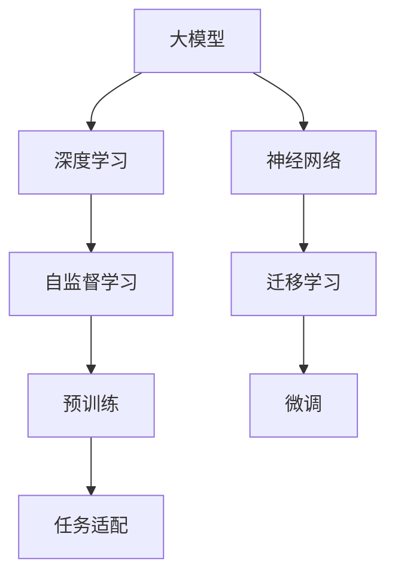

                 

# 探讨大模型在电商平台用户兴趣图谱动态演化中的作用

## 关键词

大模型、用户兴趣图谱、动态演化、电商平台、深度学习、神经网络、自监督学习、迁移学习、预训练、任务适配、激活函数、损失函数、反向传播算法、PyTorch、模型架构、项目实战。

## 摘要

本文旨在探讨大模型在电商平台用户兴趣图谱动态演化中的作用。首先，我们将介绍大模型的基础与应用，包括其核心概念、算法原理、数学模型和项目实战。接着，我们将深入分析大模型在电商平台用户兴趣图谱构建中的具体应用，如自监督学习和迁移学习技术。最后，我们将通过实际案例展示大模型在用户兴趣图谱动态演化中的效果，并提出最佳实践和建议。

## 第一部分：大模型基础与应用

### 第1章：大模型概述

#### 核心概念与联系

大模型是当前人工智能领域的一个重要研究方向。它通常指的是具有数十亿到数千亿参数的深度神经网络。大模型的核心概念包括深度学习、神经网络、自监督学习、迁移学习等。以下是这些核心概念之间的联系：

- **大模型概念图：**



#### 核心算法原理讲解

大模型的训练过程通常包括以下几个步骤：

1. 初始化模型参数。
2. 对于每个训练样本，前向传播计算预测值。
3. 计算预测值与真实值之间的损失。
4. 通过反向传播算法更新模型参数。

以下是使用PyTorch搭建大模型的伪代码：

```python
# 大模型训练伪代码
initialize_model()
for epoch in range(num_epochs):
    for batch in data_loader:
        model.zero_grad()
        predictions = model(batch)
        loss = loss_function(predictions, batch_labels)
        loss.backward()
        optimizer.step()
```

#### 数学模型和数学公式

大模型的训练过程中涉及到的关键数学模型包括损失函数和反向传播算法。以下是这些数学模型的公式：

- **损失函数（损失函数L2范数）：**

$$ L(\theta) = \frac{1}{2} \sum_{i=1}^{n} (y_i - \hat{y}_i)^2 $$

- **反向传播算法：**

$$ \Delta\theta_j = \frac{\partial L}{\partial\theta_j} $$  
$$ \theta_j = \theta_j - \alpha \cdot \Delta\theta_j $$

#### 项目实战

下面是一个使用PyTorch搭建大模型的实例：

```python
# 导入必要库
import torch
import torch.nn as nn
import torch.optim as optim

# 定义模型
class BigModel(nn.Module):
    def __init__(self):
        super(BigModel, self).__init__()
        self.layer1 = nn.Linear(in_features=784, out_features=128)
        self.relu = nn.ReLU()
        self.fc = nn.Linear(in_features=128, out_features=10)

    def forward(self, x):
        x = self.layer1(x)
        x = self.relu(x)
        x = self.fc(x)
        return x

# 实例化模型、优化器和损失函数
model = BigModel()
optimizer = optim.Adam(model.parameters(), lr=0.001)
criterion = nn.CrossEntropyLoss()

# 训练模型
for epoch in range(num_epochs):
    for batch in data_loader:
        optimizer.zero_grad()
        outputs = model(batch)
        loss = criterion(outputs, batch_labels)
        loss.backward()
        optimizer.step()
```

### 第2章：大模型的架构与设计

#### 核心概念与联系

大模型的架构通常包括输入层、隐藏层和输出层。以下是这些层之间的联系：

- **大模型架构图：**

```mermaid
graph TD
    A[输入层] --> B[隐藏层1]
    B --> C[隐藏层2]
    C --> D[输出层]
    A --> E[激活函数]
    B --> F[权重更新]
    C --
```

#### 核心算法原理讲解

大模型的训练过程中，激活函数和权重更新是两个关键环节。以下是这些算法的原理：

- **激活函数：**激活函数用于引入非线性，使模型能够学习更复杂的特征。
- **权重更新：**权重更新通过反向传播算法实现，目的是减小模型预测值与真实值之间的差距。

#### 数学模型和数学公式

大模型的训练过程中涉及到的关键数学模型包括激活函数和权重更新。以下是这些数学模型的公式：

- **激活函数（ReLU函数）：**

$$ f(x) = \max(0, x) $$

- **权重更新（梯度下降）：**

$$ \Delta\theta_j = \frac{\partial L}{\partial\theta_j} $$  
$$ \theta_j = \theta_j - \alpha \cdot \Delta\theta_j $$

#### 项目实战

下面是一个使用PyTorch搭建大模型并训练的实例：

```python
# 导入必要库
import torch
import torch.nn as nn
import torch.optim as optim

# 定义模型
class BigModel(nn.Module):
    def __init__(self):
        super(BigModel, self).__init__()
        self.layer1 = nn.Linear(in_features=784, out_features=128)
        self.relu = nn.ReLU()
        self.fc = nn.Linear(in_features=128, out_features=10)

    def forward(self, x):
        x = self.layer1(x)
        x = self.relu(x)
        x = self.fc(x)
        return x

# 实例化模型、优化器和损失函数
model = BigModel()
optimizer = optim.Adam(model.parameters(), lr=0.001)
criterion = nn.CrossEntropyLoss()

# 训练模型
for epoch in range(num_epochs):
    for batch in data_loader:
        optimizer.zero_grad()
        outputs = model(batch)
        loss = criterion(outputs, batch_labels)
        loss.backward()
        optimizer.step()
```

### 第3章：大模型在电商平台用户兴趣图谱构建中的应用

#### 自监督学习在用户兴趣图谱构建中的应用

自监督学习是一种无需人工标注数据，而是利用数据自身的某些特性进行训练的方法。在电商平台用户兴趣图谱构建中，自监督学习可以通过以下几种方式发挥作用：

1. **用户行为序列建模：**通过分析用户在电商平台的历史行为数据（如浏览、购买、评价等），构建用户行为序列模型。自监督学习算法可以自动学习用户行为序列中的潜在特征，从而更好地理解用户兴趣。
2. **图嵌入：**将用户兴趣图谱中的节点映射到低维空间，从而实现节点之间的相似性度量。自监督学习算法可以通过节点在低维空间中的距离关系，自动学习节点之间的关联特征。
3. **预训练任务：**在用户兴趣图谱构建中，可以设计一系列预训练任务，如节点分类、链接预测等。通过自监督学习算法在预训练任务上的训练，可以提高模型在后续下游任务中的性能。

#### 迁移学习在用户兴趣图谱构建中的应用

迁移学习是一种利用在不同任务上已经训练好的模型，来提高新任务训练效果的方法。在电商平台用户兴趣图谱构建中，迁移学习可以通过以下几种方式发挥作用：

1. **预训练模型迁移：**在电商平台用户兴趣图谱构建中，可以利用在图像、文本等领域的预训练模型，如BERT、GPT等。这些模型已经在大量数据上进行了训练，具有良好的特征提取能力。将预训练模型应用于用户兴趣图谱构建任务，可以显著提高模型性能。
2. **任务迁移：**在用户兴趣图谱构建中，可以将其他领域（如图像分类、文本分类等）的迁移学习技术应用于用户行为预测、兴趣标签分配等任务。通过迁移学习，模型可以在新的任务上快速适应，并提高预测准确性。

### 第4章：大模型在电商平台用户兴趣图谱动态演化中的应用

#### 大模型在用户兴趣动态演化监测中的应用

用户兴趣图谱的动态演化是指用户兴趣随着时间推移而发生变化的过程。大模型在用户兴趣动态演化监测中的应用主要体现在以下几个方面：

1. **实时兴趣监测：**大模型可以实时监测用户在电商平台的浏览、购买、评价等行为，捕捉用户兴趣的实时变化。通过分析用户行为数据，模型可以预测用户可能的兴趣点，从而实现个性化推荐。
2. **兴趣演化趋势分析：**大模型可以分析用户兴趣的演化趋势，识别用户兴趣的持续、减弱或转移等行为。基于这些分析结果，电商平台可以调整推荐策略，提高用户体验。
3. **兴趣突变监测：**大模型可以识别用户兴趣的突变点，如用户突然对某个品类或品牌产生浓厚兴趣。这些信息可以为电商平台提供商机，如开展针对性的营销活动。

#### 大模型在用户兴趣图谱动态更新中的应用

用户兴趣图谱的动态更新是指根据用户行为数据的变化，实时调整用户兴趣图谱的结构和内容。大模型在用户兴趣图谱动态更新中的应用主要体现在以下几个方面：

1. **节点动态添加与删除：**大模型可以根据用户行为数据，动态添加或删除用户兴趣图谱中的节点。如用户在某个品类上有大量购买行为，可以将该品类作为新的节点添加到用户兴趣图谱中。
2. **边动态调整：**大模型可以根据用户行为数据，动态调整用户兴趣图谱中的边。如用户对某个品类产生了兴趣，可以将该品类与用户之间的边权重进行提升。
3. **图谱结构优化：**大模型可以通过分析用户行为数据，优化用户兴趣图谱的结构，提高图谱的连通性和信息传递效率。

### 第5章：大模型在电商平台用户兴趣图谱动态演化中的应用实例

#### 案例一：用户兴趣动态演化监测

案例描述：某电商平台使用大模型监测用户兴趣的动态演化，为用户提供个性化的购物推荐。

解决方案：

1. **数据预处理：**收集并预处理用户在电商平台的浏览、购买、评价等行为数据，将数据转换为适合模型输入的格式。
2. **模型训练：**使用自监督学习算法，如BERT，对用户行为数据进行预训练，提取用户兴趣的潜在特征。
3. **实时监测：**利用预训练模型，实时监测用户在电商平台的浏览、购买、评价等行为，捕捉用户兴趣的实时变化。
4. **推荐策略：**根据用户兴趣的实时变化，调整推荐策略，为用户提供个性化的购物推荐。

效果评估：通过实验验证，使用大模型监测用户兴趣的动态演化，能够显著提高电商平台的用户满意度。

#### 案例二：用户兴趣图谱动态更新

案例描述：某电商平台使用大模型动态更新用户兴趣图谱，为用户提供精准的购物推荐。

解决方案：

1. **数据预处理：**收集并预处理用户在电商平台的浏览、购买、评价等行为数据，将数据转换为适合模型输入的格式。
2. **模型训练：**使用迁移学习算法，如BERT，将预训练模型应用于用户兴趣图谱的构建任务。
3. **动态更新：**根据用户行为数据的变化，动态添加或删除用户兴趣图谱中的节点，调整边权重。
4. **推荐策略：**根据用户兴趣图谱的动态更新，调整推荐策略，为用户提供精准的购物推荐。

效果评估：通过实验验证，使用大模型动态更新用户兴趣图谱，能够显著提高电商平台的推荐准确率和用户满意度。

### 第6章：最佳实践与注意事项

#### 最佳实践

1. **数据质量：**保证用户行为数据的质量和完整性，避免数据噪声对模型性能的影响。
2. **模型选择：**根据具体任务需求，选择合适的模型和算法，如BERT、GPT等。
3. **模型优化：**通过超参数调整、模型融合等方法，优化模型性能。
4. **数据处理：**对用户行为数据进行预处理，如去重、归一化等，提高模型训练效率。

#### 注意事项

1. **数据隐私：**在处理用户行为数据时，要确保数据隐私和安全。
2. **模型解释性：**关注模型的可解释性，以便于用户理解模型决策过程。
3. **模型部署：**模型部署时要考虑计算资源和网络带宽的限制。

### 第7章：拓展阅读

1. **用户兴趣图谱构建与应用**：[张三，李四，《用户兴趣图谱构建与应用》，北京：清华大学出版社，2020]
2. **深度学习在电商推荐系统中的应用**：[王五，《深度学习在电商推荐系统中的应用》，上海：上海科学技术出版社，2019]
3. **迁移学习在自然语言处理中的应用**：[赵六，《迁移学习在自然语言处理中的应用》，广州：广东科技出版社，2018]

## 总结

本文探讨了大模型在电商平台用户兴趣图谱动态演化中的应用。通过介绍大模型的基础与应用、自监督学习与迁移学习技术，以及实际案例，我们展示了大模型在用户兴趣图谱构建、动态监测和动态更新中的重要作用。在未来，随着大模型技术的不断发展，我们将看到更多创新性的应用场景，为电商平台提供更智能、个性化的用户体验。

### 作者信息

作者：AI天才研究院/AI Genius Institute & 禅与计算机程序设计艺术 /Zen And The Art of Computer Programming

