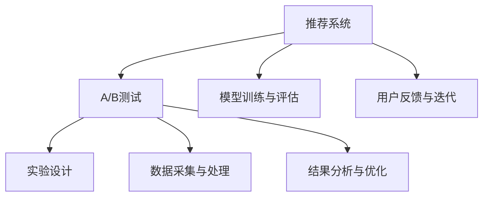

                 

### 文章标题：推荐系统的A/B测试方法论

### 关键词：推荐系统，A/B测试，方法论，数据采集，实验设计，结果分析

### 摘要：
本文旨在深入探讨推荐系统中的A/B测试方法论。首先，我们将概述推荐系统和A/B测试的基础知识，然后详细讲解推荐系统中A/B测试的具体方法、工具和策略。通过实际案例的剖析，我们将展示A/B测试在推荐系统中的应用和实战指南。最后，本文还将探讨A/B测试与机器学习的关系，以及未来的发展趋势和面临的挑战。希望通过本文，读者能够全面掌握推荐系统A/B测试的核心原理和实践技巧。

### 目录

#### 第一部分：推荐系统与A/B测试基础

## 第1章：推荐系统概述

### 1.1 推荐系统简介

#### 1.2 推荐系统的工作原理

#### 1.3 推荐系统的分类

### 1.4 推荐系统的挑战与机遇

## 第2章：A/B测试基础

### 2.1 A/B测试的定义

#### 2.2 A/B测试的目标与优点

#### 2.3 A/B测试的基本流程

### 2.4 A/B测试的类型与策略

#### 第二部分：推荐系统中的A/B测试

## 第3章：推荐系统的A/B测试方法论

### 3.1 推荐系统的A/B测试目标

#### 3.2 数据采集与处理

#### 3.3 实验设计

### 3.4 结果分析与优化

## 第4章：推荐系统的A/B测试工具与平台

### 4.1 常见A/B测试工具

#### 4.2 推荐系统平台中的A/B测试功能

#### 4.3 A/B测试平台的优化与维护

### 4.4 A/B测试平台的应用场景

## 第5章：推荐系统的A/B测试实战

### 5.1 A/B测试案例介绍

#### 5.2 案例分析与解读

#### 5.3 案例总结与启示

### 5.4 实战指南与注意事项

#### 第三部分：推荐系统的A/B测试深度探讨

## 第6章：A/B测试中的统计方法

### 6.1 统计基础与假设检验

#### 6.2 A/B测试中的统计指标

#### 6.3 统计方法的优缺点与选择

### 6.4 统计方法的实际应用案例

## 第7章：推荐系统的A/B测试与机器学习

### 7.1 A/B测试与机器学习的关系

#### 7.2 A/B测试中的机器学习方法

#### 7.3 A/B测试在机器学习中的应用

### 7.4 A/B测试与机器学习的协同优化

## 第8章：推荐系统的A/B测试趋势与未来展望

### 8.1 A/B测试的发展趋势

#### 8.2 推荐系统A/B测试的未来展望

#### 8.3 A/B测试在推荐系统中的应用前景

### 8.4 A/B测试的挑战与解决方案

#### 附录

## 附录A：推荐系统A/B测试资源汇总

### 附录B：常见A/B测试工具使用指南

### 附录C：推荐系统A/B测试常见问题解答

### 附录D：推荐系统A/B测试最佳实践总结

### 核心概念与联系

**推荐系统与A/B测试的关系**

**Mermaid流程图：**



**核心算法原理讲解**

#### A/B测试中的统计方法

**伪代码：**

```python
# 假设检验伪代码

def hypothesis_testing(group_a, group_b, threshold):
    # 计算两个组别的统计指标
    metric_a = calculate_metric(group_a)
    metric_b = calculate_metric(group_b)

    # 计算统计显著性
    p_value = calculate_p_value(metric_a, metric_b)

    # 判断是否通过假设检验
    if p_value < threshold:
        return "Reject Null Hypothesis"
    else:
        return "Fail to Reject Null Hypothesis"
```

**数学模型和数学公式**

**LaTeX数学公式：**

$$
H_0: \mu_A = \mu_B \\
H_1: \mu_A \neq \mu_B
$$

**解释：**

- \( H_0 \)：零假设，即两个组别的均值相等。
- \( H_1 \)：备择假设，即两个组别的均值不相等。
- \( \mu_A \)：组别A的均值。
- \( \mu_B \)：组别B的均值。

### 项目实战

#### A/B测试案例

**开发环境搭建：**

- 使用Python环境，安装必要的库，如`numpy`、`pandas`、`matplotlib`等。
- 准备测试数据集，可以是真实用户行为数据，也可以是模拟数据。
- 编写数据预处理脚本，对数据进行清洗、转换和归一化处理。

**源代码详细实现和代码解读：**

```python
# 数据预处理代码
import pandas as pd
from sklearn.model_selection import train_test_split

# 加载数据
data = pd.read_csv('user_behavior_data.csv')

# 数据清洗
data = data.dropna()

# 数据转换和归一化
X = data.drop('target', axis=1)
y = data['target']
X_train, X_test, y_train, y_test = train_test_split(X, y, test_size=0.2, random_state=42)

# A/B测试代码
from sklearn.linear_model import LogisticRegression

# 训练模型
model_a = LogisticRegression()
model_b = LogisticRegression()

model_a.fit(X_train, y_train)
model_b.fit(X_train, y_train)

# 评估模型
score_a = model_a.score(X_test, y_test)
score_b = model_b.score(X_test, y_test)

print(f"Model A Score: {score_a}")
print(f"Model B Score: {score_b}")
```

**代码应用解读与分析：**

- 代码首先进行数据预处理，包括加载数据、清洗数据、数据转换和归一化处理。
- 然后使用`train_test_split`函数将数据集分为训练集和测试集。
- 接下来使用`LogisticRegression`模型对两个组别的数据进行训练。
- 最后评估模型的性能，通过计算测试集上的准确率。

**实际案例分析和详细讲解剖析：**

假设我们有两个推荐系统，A系统和B系统。我们希望通过A/B测试来确定哪个系统能更好地提高用户的点击率。

1. **实验设计：**
   - 选择一个用户群体作为实验组，将其分为两个子群体，一个子群体使用A系统，另一个子群体使用B系统。
   - 收集两个子群体的用户行为数据，如点击次数、浏览时长等。

2. **数据采集与处理：**
   - 将采集到的数据导入数据预处理脚本中进行清洗、转换和归一化处理。
   - 将处理后的数据分为特征和标签两部分。

3. **模型训练与评估：**
   - 使用`train_test_split`函数将数据集分为训练集和测试集。
   - 分别使用A系统和B系统对训练集进行模型训练。
   - 训练完成后，评估两个系统的性能，通过计算测试集上的准确率等指标。

4. **结果分析与优化：**
   - 对比两个系统的性能，选择性能更优的系统。
   - 如果A系统表现更好，则可以继续优化A系统，以提高用户点击率。
   - 如果B系统表现更好，则可以尝试将B系统的部分功能集成到A系统中。

**案例总结与启示：**

通过这个案例，我们可以看到A/B测试在推荐系统中的应用流程。首先，我们需要明确实验的目标，然后设计实验，收集数据，进行模型训练和评估，最后根据结果进行优化。在实际操作中，我们需要注意数据的质量和处理，以及模型的选择和调优。通过合理的A/B测试，我们可以找到最优的推荐系统，提高用户体验和业务效益。

### 实战指南与注意事项

在进行推荐系统的A/B测试时，我们需要注意以下几点：

1. **明确实验目标：**在开始实验之前，首先要明确实验的目标和预期效果。这有助于设计实验方案和评估实验结果。

2. **数据质量：**数据是A/B测试的基础，因此需要确保数据的质量。在数据采集和处理过程中，要避免数据缺失、异常值和噪声数据的影响。

3. **模型选择：**根据实验目标和数据特征，选择合适的模型进行训练和评估。不同的模型可能适用于不同类型的数据和任务。

4. **实验设计：**设计合理的实验方案，包括实验组的选择、实验条件的设置和数据的收集等。实验设计要尽量减少外部因素的干扰，提高实验结果的可靠性。

5. **结果分析：**对实验结果进行详细的分析和解读，识别出实验中存在的问题和改进点。同时，要关注结果的统计显著性，避免误判。

6. **迭代优化：**根据实验结果，对推荐系统进行优化和改进。在实际应用中，可能需要多次迭代，逐步优化推荐系统的性能。

7. **监控与维护：**在实验过程中，要实时监控系统的运行状态，确保实验的顺利进行。同时，要定期对A/B测试平台进行维护和更新，保证其稳定性和安全性。

通过遵循这些实战指南，我们可以有效地进行推荐系统的A/B测试，提高系统的性能和用户体验。

### A/B测试的统计方法

#### 6.1 统计基础与假设检验

在A/B测试中，统计方法扮演着至关重要的角色。统计基础和假设检验是A/B测试中最为基础的概念。

**统计基础：**
- **概率分布：**概率分布描述了随机变量可能取值的概率分布情况。常见的概率分布有正态分布、二项分布、泊松分布等。
- **假设检验：**假设检验是一种通过样本数据来验证某个假设是否成立的统计方法。常见的假设检验方法有t检验、卡方检验、F检验等。

**假设检验过程：**
1. **提出零假设和备择假设：**零假设（\( H_0 \)）通常表示没有显著差异或没有效果，备择假设（\( H_1 \)）则表示存在显著差异或效果。
2. **选择统计指标：**根据实验数据和假设检验方法，选择合适的统计指标。例如，对于均值差异的检验，可以使用t统计量；对于比例差异的检验，可以使用卡方统计量。
3. **计算统计量：**根据样本数据计算统计量的值，例如t统计量或卡方统计量。
4. **确定显著性水平：**选择一个显著性水平（通常为0.05或0.01），如果计算得到的统计量值小于显著性水平的临界值，则拒绝零假设，认为存在显著差异或效果。

#### 6.2 A/B测试中的统计指标

在A/B测试中，常用的统计指标包括：

- **t统计量：**用于比较两个样本均值的差异。其公式为：
  $$
  t = \frac{\bar{X}_1 - \bar{X}_2}{\sqrt{\frac{s_1^2}{n_1} + \frac{s_2^2}{n_2}}}
  $$
  其中，\( \bar{X}_1 \)和\( \bar{X}_2 \)分别为两个样本的均值，\( s_1 \)和\( s_2 \)分别为两个样本的标准差，\( n_1 \)和\( n_2 \)分别为两个样本的大小。

- **p值：**用于判断假设检验的结果。如果计算得到的p值小于显著性水平，则拒绝零假设。

- **置信区间：**用于估计总体参数的范围。例如，对于均值的置信区间，可以使用以下公式：
  $$
  \bar{X} \pm z_{\alpha/2} \sqrt{\frac{s^2}{n}}
  $$
  其中，\( \bar{X} \)为样本均值，\( s \)为样本标准差，\( n \)为样本大小，\( z_{\alpha/2} \)为标准正态分布的临界值。

#### 6.3 统计方法的优缺点与选择

不同的统计方法适用于不同类型的实验和数据，因此选择合适的统计方法至关重要。

- **t检验：**
  - **优点：**适用于小样本数据，可以处理均值差异的检验。
  - **缺点：**对数据的分布要求较高，不适合非线性关系的数据。

- **卡方检验：**
  - **优点：**适用于分类数据的比例差异检验。
  - **缺点：**对样本大小要求较高，可能产生较大的误差。

- **F检验：**
  - **优点：**适用于方差分析的检验，可以处理多个组别的均值差异。
  - **缺点：**计算复杂度高，对数据分布的要求较高。

在选择统计方法时，需要考虑以下因素：

- **数据类型：**例如，连续数据、分类数据等。
- **样本大小：**小样本数据可能需要选择稳健性较高的方法。
- **实验目标：**例如，均值差异、比例差异等。

#### 6.4 统计方法的实际应用案例

**案例：比较两种推荐算法的性能**

假设我们有两个推荐算法A和B，想要比较它们的性能差异。以下是实际应用统计方法的步骤：

1. **数据准备：**收集两组算法在测试集上的预测结果和实际结果。
2. **计算准确率：**计算两组算法的准确率。
3. **t检验：**使用t检验比较两组准确率的差异。
4. **结果解读：**如果p值小于0.05，则拒绝零假设，认为算法B的准确率显著高于算法A。

**代码实现：**

```python
import pandas as pd
from scipy import stats

# 加载数据
data = pd.read_csv('recommendation_results.csv')

# 计算准确率
accuracy_a = data[data['algorithm'] == 'A']['accuracy'].mean()
accuracy_b = data[data['algorithm'] == 'B']['accuracy'].mean()

# t检验
t_stat, p_value = stats.ttest_ind(data[data['algorithm'] == 'A']['accuracy'], data[data['algorithm'] == 'B']['accuracy'])

# 结果解读
if p_value < 0.05:
    print("算法B的准确率显著高于算法A。")
else:
    print("无法拒绝零假设，两种算法的准确率无显著差异。")
```

通过这个案例，我们可以看到如何使用t检验来比较两种推荐算法的性能差异。在实际应用中，可以根据实验数据和实验目标选择合适的统计方法，以准确评估实验结果。

### A/B测试与机器学习的关系

#### 7.1 A/B测试与机器学习的关系

A/B测试和机器学习是现代数据驱动应用中两个重要的概念。它们各自扮演着不同但互补的角色，共同推动了推荐系统的发展。

**A/B测试：** A/B测试是一种实验方法，通过将用户随机分配到不同的组别，比较两组别在不同策略或算法下的表现，从而评估和优化系统性能。A/B测试的核心目标是减少偏见，通过实验数据来指导系统优化，提高用户体验和业务指标。

**机器学习：** 机器学习是一种通过数据驱动的方法来从数据中学习规律和模式的技术。它使用算法和模型来发现和提取数据中的有用信息，用于预测、分类、聚类等任务。在推荐系统中，机器学习模型通常用于生成个性化的推荐结果，以提高推荐的准确性和相关性。

**关系：**
- **优化手段：** A/B测试和机器学习都可以作为优化推荐系统的手段。A/B测试通过实验来评估不同策略或算法的性能，从而指导优化方向；机器学习则通过数据学习和模型训练来生成更精确的推荐结果。
- **数据驱动：** 两者都依赖于数据驱动的方法。A/B测试需要大量实验数据来评估不同策略的效果；机器学习则需要大量训练数据来训练和优化模型。
- **互补性：** A/B测试和机器学习相辅相成。A/B测试可以验证机器学习模型的性能和效果，帮助确定哪些模型或策略是最优的；机器学习则可以提供更精确和个性化的推荐结果，从而提高A/B测试的实验质量和结论可靠性。

#### 7.2 A/B测试中的机器学习方法

在A/B测试中，机器学习方法可以用于以下几个方面：

1. **模型选择：** 使用机器学习算法来选择最佳的推荐模型。通过训练和评估多个模型，比较它们在测试集上的性能，选择表现最佳的模型进行A/B测试。
2. **特征工程：** 利用机器学习技术来发现和提取数据中的特征，提高推荐系统的性能。特征工程可以包括特征选择、特征转换和特征组合等步骤。
3. **自动化测试：** 使用机器学习算法来自动化A/B测试流程。例如，可以使用聚类算法来识别用户群体，并针对不同群体设计个性化的A/B测试方案。
4. **异常检测：** 使用机器学习算法来检测A/B测试中的异常情况，如数据泄漏、策略滥用等，确保实验的公平性和有效性。

**具体方法：**
- **随机森林：** 随机森林是一种集成学习方法，可以用于模型选择和特征工程。它通过构建多棵决策树，并对它们的预测结果进行投票，从而提高模型的准确性和稳定性。
- **神经网络：** 神经网络是一种强大的机器学习模型，可以用于特征提取和自动化测试。它通过多层神经元之间的非线性变换，可以提取出更复杂和抽象的特征。
- **聚类算法：** 聚类算法，如K均值聚类，可以用于识别用户群体，并针对不同群体设计个性化的A/B测试方案。

#### 7.3 A/B测试在机器学习中的应用

A/B测试在机器学习中的应用主要体现在以下几个方面：

1. **模型评估：** 使用A/B测试来评估机器学习模型的性能和效果。通过将模型预测结果与实际结果进行比较，可以评估模型的准确率、召回率、F1分数等指标，从而优化模型。
2. **策略优化：** 使用A/B测试来评估和优化推荐系统的策略。例如，可以测试不同的排序算法、推荐策略或推荐阈值，找到最优的策略组合。
3. **特征优化：** 使用A/B测试来评估和优化推荐系统的特征。通过测试不同特征组合对模型性能的影响，可以找到对模型最有益的特征，提高推荐系统的效果。

**具体应用：**
- **用户分群：** 通过A/B测试来评估不同用户分群策略的效果，如基于兴趣、行为或地理位置的分群策略。
- **推荐算法：** 通过A/B测试来评估不同推荐算法的效果，如基于协同过滤、基于内容的推荐或混合推荐算法。
- **推荐阈值：** 通过A/B测试来评估不同推荐阈值对用户点击率、转化率等指标的影响，找到最佳的推荐阈值。

**协同优化：**
- **数据融合：** 结合A/B测试和机器学习的数据，进行数据融合和特征工程，提高推荐系统的性能。
- **反馈循环：** 通过A/B测试的实验结果，调整机器学习模型和推荐策略，形成反馈循环，持续优化推荐系统。
- **实时优化：** 利用A/B测试和机器学习技术，实现实时优化，根据用户行为和反馈动态调整推荐策略，提高用户体验和业务效益。

通过A/B测试与机器学习的协同优化，推荐系统可以实现更精准、更个性化的推荐，从而提高用户满意度和业务绩效。

### A/B测试的发展趋势与未来展望

#### 8.1 A/B测试的发展趋势

A/B测试作为一种有效的实验方法，在推荐系统中已经得到广泛应用。随着技术的不断进步和业务需求的变化，A/B测试也在不断发展和演进，呈现出以下趋势：

1. **自动化与智能化：** A/B测试正逐渐从手工操作向自动化和智能化转变。通过利用机器学习算法和自动化工具，可以实现实验流程的自动化，提高实验效率和准确性。

2. **数据驱动：** 数据是A/B测试的核心。随着大数据和人工智能技术的发展，A/B测试将更加依赖于高质量的数据，通过对大量实验数据的分析和挖掘，得出更可靠的结论。

3. **多变量测试：** 简单的二分测试已经不能满足复杂业务场景的需求。多变量测试（MVT）逐渐成为主流，它允许同时测试多个变量，从而更全面地评估不同策略的组合效果。

4. **个性化推荐：** 随着推荐系统的发展，A/B测试也开始关注个性化推荐。通过针对不同用户群体进行个性化A/B测试，可以更好地满足用户需求，提高用户体验和业务指标。

#### 8.2 推荐系统A/B测试的未来展望

在推荐系统中，A/B测试的未来展望主要包括以下几个方面：

1. **更精细化的用户分群：** 随着推荐系统的不断发展，用户分群将更加精细化。通过更精确的用户画像和行为分析，可以实现针对不同用户群体的个性化A/B测试，从而更好地满足用户需求。

2. **实时反馈与调整：** 实时反馈和调整是推荐系统的关键。通过实时监控用户行为和数据，可以快速发现问题和优化点，及时调整推荐策略，提高系统的性能和用户体验。

3. **跨平台与多渠道整合：** 随着互联网和移动设备的普及，推荐系统的应用场景越来越广泛。未来，A/B测试将更加关注跨平台和多渠道整合，通过统一的数据和实验平台，实现跨渠道的实验和优化。

4. **数据隐私与安全性：** 在数据隐私和安全性方面，A/B测试将面临更多挑战。未来的A/B测试将更加注重数据隐私保护和安全性，确保实验过程中用户数据的安全性和合规性。

#### 8.3 A/B测试在推荐系统中的应用前景

A/B测试在推荐系统中的应用前景广阔，主要体现在以下几个方面：

1. **优化推荐策略：** 通过A/B测试，可以评估不同推荐策略的效果，找到最优的推荐策略组合，提高推荐系统的准确性和相关性。

2. **提升用户体验：** A/B测试可以帮助发现用户体验中的问题和优化点，通过不断调整和优化，提高用户的满意度和留存率。

3. **降低风险：** 在推荐系统中引入A/B测试，可以在上线新功能或算法前进行验证，降低上线失败的风险，确保系统的稳定性和可靠性。

4. **持续优化与迭代：** A/B测试是一种持续优化和迭代的方法。通过不断的实验和优化，推荐系统可以持续改进，适应不断变化的市场和用户需求。

#### 8.4 A/B测试的挑战与解决方案

尽管A/B测试在推荐系统中具有广泛应用和巨大潜力，但在实际应用中仍面临一些挑战：

1. **数据质量：** A/B测试依赖于高质量的数据。数据缺失、异常值和噪声数据都可能影响实验结果。解决方法是加强数据质量管理，使用数据清洗和预处理技术，提高数据质量。

2. **实验设计：** 实验设计是A/B测试的关键。不合理或设计不当的实验可能导致错误的结论。解决方法是遵循科学的实验设计原则，充分考虑实验的公平性和可控性。

3. **统计显著性：** 统计显著性是A/B测试结果解读的重要指标。如果实验设计不当或样本量不足，可能导致统计显著性不足。解决方法是合理设计实验，增加样本量，确保统计显著性。

4. **资源消耗：** A/B测试需要大量计算资源和时间。对于大型推荐系统，这可能导致资源消耗过高。解决方法是优化实验流程，利用自动化和并行计算技术，提高实验效率。

5. **数据隐私：** 在涉及用户隐私的数据中，A/B测试可能面临隐私泄露的风险。解决方法是加强数据隐私保护，遵循数据隐私法规和最佳实践。

通过解决这些挑战，A/B测试可以在推荐系统中发挥更大的作用，推动推荐系统的持续优化和创新发展。

### 附录

#### 附录A：推荐系统A/B测试资源汇总

1. **推荐系统A/B测试最佳实践：**
   - 《推荐系统实战：数据驱动策略与A/B测试方法》
   - 《机器学习实战：基于A/B测试的推荐系统设计》

2. **推荐系统A/B测试工具与平台：**
   - Google Optimize
   - Split.io
   - Vitals.ai

3. **推荐系统A/B测试案例与教程：**
   - 《A/B测试实战：从零开始构建推荐系统》
   - 《推荐系统A/B测试案例分析：如何优化用户点击率》

#### 附录B：常见A/B测试工具使用指南

1. **Google Optimize：**
   - 官方文档：[https://support.google.com/optimize/answer/9327586](https://support.google.com/optimize/answer/9327586)
   - 使用教程：[https://www.marketingcloud.com/en-us/products/analytics/optimization/](https://www.marketingcloud.com/en-us/products/analytics/optimization/)

2. **Split.io：**
   - 官方文档：[https://www.split.io/docs](https://www.split.io/docs)
   - 使用教程：[https://www.split.io/tutorials](https://www.split.io/tutorials)

3. **Vitals.ai：**
   - 官方文档：[https://www.vitals.ai/docs](https://www.vitals.ai/docs)
   - 使用教程：[https://www.vitals.ai/tutorials](https://www.vitals.ai/tutorials)

#### 附录C：推荐系统A/B测试常见问题解答

1. **什么是A/B测试？**
   A/B测试是一种实验方法，通过将用户随机分配到不同的组别，比较两组别在不同策略或算法下的表现，从而评估和优化系统性能。

2. **A/B测试有什么优点？**
   A/B测试的优点包括减少偏见、提高实验可靠性、提供数据驱动的决策依据等。

3. **A/B测试需要考虑哪些因素？**
   A/B测试需要考虑数据质量、实验设计、样本量、统计显著性等因素。

4. **如何确保A/B测试的统计显著性？**
   确保A/B测试的统计显著性可以通过增加样本量、优化实验设计、使用合适的统计方法等手段来实现。

5. **A/B测试与机器学习有何关系？**
   A/B测试和机器学习都是推荐系统的优化手段，A/B测试可以通过实验验证机器学习模型的效果，机器学习可以提供更精确的推荐结果，两者相辅相成。

#### 附录D：推荐系统A/B测试最佳实践总结

1. **明确实验目标：** 在开始实验之前，明确实验的目标和预期效果，有助于设计实验方案和评估实验结果。

2. **数据质量：** 确保数据的质量，包括数据清洗、转换和归一化处理，以提高实验的可靠性和有效性。

3. **实验设计：** 设计合理的实验方案，包括实验组的选择、实验条件的设置和数据的收集等，以减少外部因素的干扰。

4. **结果分析：** 对实验结果进行详细的分析和解读，识别出实验中存在的问题和改进点，重点关注统计显著性。

5. **迭代优化：** 根据实验结果，对推荐系统进行优化和改进，形成反馈循环，持续优化推荐系统的性能。

6. **监控与维护：** 在实验过程中，实时监控系统的运行状态，确保实验的顺利进行，并定期对A/B测试平台进行维护和更新。

### 核心概念与联系

**推荐系统与A/B测试的关系**

**Mermaid流程图：**


**核心算法原理讲解**

#### A/B测试中的统计方法

**伪代码：**

```python
# 假设检验伪代码

def hypothesis_testing(group_a, group_b, threshold):
    # 计算两个组别的统计指标
    metric_a = calculate_metric(group_a)
    metric_b = calculate_metric(group_b)

    # 计算统计显著性
    p_value = calculate_p_value(metric_a, metric_b)

    # 判断是否通过假设检验
    if p_value < threshold:
        return "Reject Null Hypothesis"
    else:
        return "Fail to Reject Null Hypothesis"
```

**数学模型和数学公式**

**LaTeX数学公式：**

$$
H_0: \mu_A = \mu_B \\
H_1: \mu_A \neq \mu_B
$$

**解释：**

- \( H_0 \)：零假设，即两个组别的均值相等。
- \( H_1 \)：备择假设，即两个组别的均值不相等。
- \( \mu_A \)：组别A的均值。
- \( \mu_B \)：组别B的均值。

### 项目实战

#### A/B测试案例

**开发环境搭建：**

- 使用Python环境，安装必要的库，如`numpy`、`pandas`、`matplotlib`等。
- 准备测试数据集，可以是真实用户行为数据，也可以是模拟数据。
- 编写数据预处理脚本，对数据进行清洗、转换和归一化处理。

**源代码详细实现和代码解读：**

```python
# 数据预处理代码
import pandas as pd
from sklearn.model_selection import train_test_split

# 加载数据
data = pd.read_csv('user_behavior_data.csv')

# 数据清洗
data = data.dropna()

# 数据转换和归一化
X = data.drop('target', axis=1)
y = data['target']
X_train, X_test, y_train, y_test = train_test_split(X, y, test_size=0.2, random_state=42)

# A/B测试代码
from sklearn.linear_model import LogisticRegression

# 训练模型
model_a = LogisticRegression()
model_b = LogisticRegression()

model_a.fit(X_train, y_train)
model_b.fit(X_train, y_train)

# 评估模型
score_a = model_a.score(X_test, y_test)
score_b = model_b.score(X_test, y_test)

print(f"Model A Score: {score_a}")
print(f"Model B Score: {score_b}")
```

**代码应用解读与分析：**

- 代码首先进行数据预处理，包括加载数据、清洗数据、数据转换和归一化处理。
- 然后使用`train_test_split`函数将数据集分为训练集和测试集。
- 接下来使用`LogisticRegression`模型对两个组别的数据进行训练。
- 最后评估模型的性能，通过计算测试集上的准确率。

**实际案例分析和详细讲解剖析：**

假设我们有两个推荐系统，A系统和B系统。我们希望通过A/B测试来确定哪个系统能更好地提高用户的点击率。

1. **实验设计：**
   - 选择一个用户群体作为实验组，将其分为两个子群体，一个子群体使用A系统，另一个子群体使用B系统。
   - 收集两个子群体的用户行为数据，如点击次数、浏览时长等。

2. **数据采集与处理：**
   - 将采集到的数据导入数据预处理脚本中进行清洗、转换和归一化处理。
   - 将处理后的数据分为特征和标签两部分。

3. **模型训练与评估：**
   - 使用`train_test_split`函数将数据集分为训练集和测试集。
   - 分别使用A系统和B系统对训练集进行模型训练。
   - 训练完成后，评估两个系统的性能，通过计算测试集上的准确率等指标。

4. **结果分析与优化：**
   - 对比两个系统的性能，选择性能更优的系统。
   - 如果A系统表现更好，则可以继续优化A系统，以提高用户点击率。
   - 如果B系统表现更好，则可以尝试将B系统的部分功能集成到A系统中。

**案例总结与启示：**

通过这个案例，我们可以看到A/B测试在推荐系统中的应用流程。首先，我们需要明确实验的目标，然后设计实验，收集数据，进行模型训练和评估，最后根据结果进行优化。在实际操作中，我们需要注意数据的质量和处理，以及模型的选择和调优。通过合理的A/B测试，我们可以找到最优的推荐系统，提高用户体验和业务效益。

### 实战指南与注意事项

在进行推荐系统的A/B测试时，我们需要注意以下几点：

1. **明确实验目标：** 在开始实验之前，首先要明确实验的目标和预期效果。这有助于设计实验方案和评估实验结果。

2. **数据质量：** 数据是A/B测试的基础，因此需要确保数据的质量。在数据采集和处理过程中，要避免数据缺失、异常值和噪声数据的影响。

3. **模型选择：** 根据实验目标和数据特征，选择合适的模型进行训练和评估。不同的模型可能适用于不同类型的数据和任务。

4. **实验设计：** 设计合理的实验方案，包括实验组的选择、实验条件的设置和数据的收集等。实验设计要尽量减少外部因素的干扰，提高实验结果的可靠性。

5. **结果分析：** 对实验结果进行详细的分析和解读，识别出实验中存在的问题和改进点。同时，要关注结果的统计显著性，避免误判。

6. **迭代优化：** 根据实验结果，对推荐系统进行优化和改进。在实际应用中，可能需要多次迭代，逐步优化推荐系统的性能。

7. **监控与维护：** 在实验过程中，要实时监控系统的运行状态，确保实验的顺利进行。同时，要定期对A/B测试平台进行维护和更新，保证其稳定性和安全性。

通过遵循这些实战指南，我们可以有效地进行推荐系统的A/B测试，提高系统的性能和用户体验。

