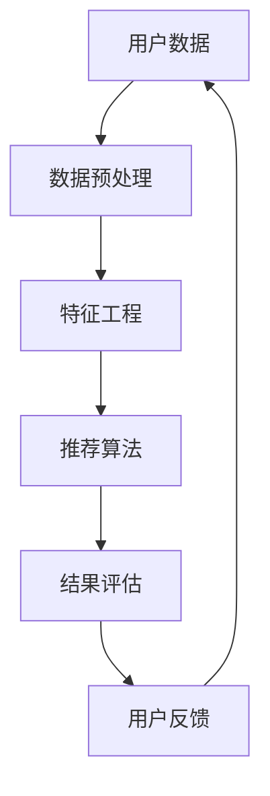

                 

### 文章标题
《推荐系统的公平性与多样性：AI大模型的伦理考量》

### 关键词
推荐系统、AI大模型、公平性、多样性、伦理考量

### 摘要
本文从推荐系统的发展历程和AI大模型的应用入手，深入探讨了推荐系统的公平性与多样性问题。通过解析公平性与多样性的概念、算法原理及其实际案例，文章揭示了AI大模型在推荐系统中存在的伦理问题，并提出了相关的伦理考量与实践。文章最后对公平性与多样性研究的进展及未来发展方向进行了展望，为推荐系统的发展提供了有益的参考。

## 目录大纲

### 第一部分：概述与背景

#### 1.1 推荐系统概述

##### 1.1.1 推荐系统的发展历程
##### 1.1.2 推荐系统的作用与重要性

#### 1.2 AI在推荐系统中的应用

##### 1.2.1 AI在推荐系统中的角色
##### 1.2.2 大模型在推荐系统中的优势

#### 1.3 公平性与多样性

##### 1.3.1 推荐系统的公平性
##### 1.3.2 推荐系统的多样性

##### 1.4 书籍结构

##### 1.4.1 全书结构概述
##### 1.4.2 各章节内容安排

### 第二部分：推荐系统的基础理论

#### 2.1 用户行为数据分析

##### 2.1.1 用户行为数据的收集与处理
##### 2.1.2 用户行为数据的分析方法

#### 2.2 数据预处理

##### 2.2.1 数据清洗
##### 2.2.2 特征工程

#### 2.3 推荐系统评估指标

##### 2.3.1 评估指标概述
##### 2.3.2 指标计算方法与比较

#### 2.4 推荐系统架构

##### 2.4.1 推荐系统基本架构
##### 2.4.2 大模型在推荐系统架构中的应用

### 第三部分：公平性与多样性的算法设计与实践

#### 3.1 公平性算法设计

##### 3.1.1 公平性概念与评价指标
##### 3.1.2 基于约束优化的公平性算法
##### 3.1.3 伪代码实现

#### 3.2 多样性算法设计

##### 3.2.1 多样性概念与评价指标
##### 3.2.2 基于多样性优化的推荐算法
##### 3.2.3 伪代码实现

#### 3.3 实际案例应用

##### 3.3.1 案例选择与背景
##### 3.3.2 案例分析
##### 3.3.3 案例总结与启示

### 第四部分：AI大模型在推荐系统中的伦理考量

#### 4.1 AI大模型在推荐系统中的伦理问题

##### 4.1.1 数据隐私与安全
##### 4.1.2 偏见与歧视
##### 4.1.3 责任归属

#### 4.2 伦理考量与实践

##### 4.2.1 伦理准则制定
##### 4.2.2 伦理决策模型设计
##### 4.2.3 实践案例分享

#### 4.3 未来发展趋势

##### 4.3.1 公平性与多样性研究的进展
##### 4.3.2 AI大模型伦理考量的挑战与机遇
##### 4.3.3 未来发展方向与展望

### 第五部分：项目实战与总结

#### 5.1 项目实战

##### 5.1.1 项目背景
##### 5.1.2 系统设计与实现
##### 5.1.3 结果分析与评估

##### 5.2 总结与展望

##### 5.2.1 书籍内容回顾
##### 5.2.2 实践经验分享
##### 5.2.3 研究方向与趋势

### 附录

#### 附录 A：推荐系统相关资源

##### A.1 数据集与工具
##### A.2 开发环境搭建
##### A.3 参考文献

### 概念与联系图

#### 推荐系统架构图

接下来，我们将按照文章的目录结构逐步深入讨论每一个部分，确保内容的丰富性和逻辑性。每一步都将详细解释核心概念，使用伪代码或数学模型展示算法原理，并结合实际案例进行分析。通过这样的方法，我们能够使读者全面理解推荐系统的公平性与多样性问题，以及AI大模型在此过程中的伦理考量。

