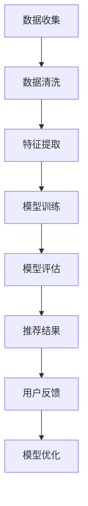

                 

### 文章标题：推荐系统的可解释性：用户的信任

关键词：推荐系统、可解释性、用户信任、算法、案例分析

摘要：随着互联网的快速发展，推荐系统已成为现代信息检索和个性化服务的关键技术。然而，其复杂性和不可解释性引发了用户对隐私和推荐质量的担忧。本文从推荐系统的基础概念出发，深入探讨其可解释性的重要性，并详细分析基于用户信任的可解释性算法。通过典型案例分析和实际应用，本文旨在为推荐系统的可解释性提供系统性理解和实践指导。

---

### 《推荐系统的可解释性：用户的信任》目录大纲

#### 第一部分：推荐系统概述

#### 第1章：推荐系统基础

- **1.1 推荐系统的定义与分类**
  - **1.1.1 推荐系统的定义**
  - **1.1.2 推荐系统的分类**

- **1.2 推荐系统的工作流程**
  - **1.2.1 数据收集与处理**
  - **1.2.2 特征提取**
  - **1.2.3 模型训练与评估**
  - **1.2.4 推荐策略与算法**

- **1.3 推荐系统的应用场景**
  - **1.3.1 商业推荐**
  - **1.3.2 社交网络推荐**
  - **1.3.3 娱乐内容推荐**

#### 第2章：推荐系统的核心算法

- **2.1 协同过滤算法**
  - **2.1.1 评分矩阵与用户行为数据**
  - **2.1.2 项点相似度计算**
  - **2.1.3 个性化推荐算法**

- **2.2 内容推荐算法**
  - **2.2.1 文本特征提取**
  - **2.2.2 文本相似度计算**
  - **2.2.3 文本推荐算法**

- **2.3 混合推荐算法**
  - **2.3.1 混合推荐系统的设计与实现**
  - **2.3.2 混合推荐算法的优势与挑战**

#### 第二部分：可解释性分析

#### 第3章：推荐系统的可解释性

- **3.1 可解释性的重要性**
  - **3.1.1 可解释性在推荐系统中的应用**
  - **3.1.2 可解释性的实现与挑战**

- **3.2 可解释性的评价指标**
  - **3.2.1 指标类型**
  - **3.2.2 评价指标的计算方法**

- **3.3 可解释性算法**
  - **3.3.1 特征重要性分析**
  - **3.3.2 决策解释方法**

#### 第4章：基于用户的信任分析

- **4.1 信任的概念与度量**
  - **4.1.1 信任的定义**
  - **4.1.2 信任的度量方法**

- **4.2 用户信任模型**
  - **4.2.1 用户信任评分模型**
  - **4.2.2 用户信任推荐算法**

- **4.3 用户信任与推荐效果**
  - **4.3.1 用户信任对推荐效果的影响**
  - **4.3.2 信任推荐算法的性能评估**

#### 第三部分：案例分析与应用

#### 第5章：推荐系统案例分析

- **5.1 案例选择与数据准备**
  - **5.1.1 案例选择标准**
  - **5.1.2 数据准备流程**

- **5.2 案例分析过程**
  - **5.2.1 数据处理与特征提取**
  - **5.2.2 模型训练与评估**
  - **5.2.3 推荐结果分析与优化**

#### 第6章：推荐系统的可解释性应用

- **6.1 可解释性在用户信任分析中的应用**
  - **6.1.1 可解释性算法的优化**
  - **6.1.2 用户信任模型的可解释性提升**

- **6.2 可解释性在推荐系统中的实践**
  - **6.2.1 可视化与交互设计**
  - **6.2.2 用户反馈与调整策略**

#### 第7章：未来发展趋势与挑战

- **7.1 推荐系统的可解释性发展趋势**
  - **7.1.1 人工智能与可解释性的结合**
  - **7.1.2 多模态推荐系统的可解释性**

- **7.2 推荐系统的可解释性挑战**
  - **7.2.1 复杂性与计算效率**
  - **7.2.2 模型透明性与隐私保护**

#### 附录

#### 附录 A：推荐系统相关资源

- **A.1 学术论文与书籍推荐**
- **A.2 开源工具与库介绍**
- **A.3 社交媒体与论坛**

---

**注：以上目录大纲仅供参考，实际撰写时可根据需要进行调整和补充。**
### 推荐系统的定义与分类

推荐系统是一种利用数据挖掘和机器学习技术，根据用户的兴趣、偏好和行为模式，自动向用户推荐相关商品、信息或内容的系统。其核心目标是提高用户体验，增加用户粘性和平台收益。根据推荐系统的工作原理和应用场景，可以将其分为多种类型。

#### 1.1.1 推荐系统的定义

推荐系统（Recommender System）通常定义为一种自动预测用户可能感兴趣的项目，并通过各种方式进行展示的系统。这些项目可以是商品、新闻、音乐、电影、书籍等。推荐系统的工作流程主要包括以下几个关键步骤：

1. **数据收集与处理**：从用户历史行为、社交网络、搜索历史等多渠道收集数据，并进行数据清洗、去噪、归一化等预处理操作。

2. **特征提取**：从原始数据中提取对用户偏好和项目特征有代表性的特征，如用户评分、浏览历史、购买记录、文本内容等。

3. **模型训练与评估**：使用提取的特征训练推荐模型，并通过交叉验证、A/B测试等方法进行评估和优化。

4. **推荐策略与算法**：根据训练好的模型生成推荐结果，并使用不同的推荐策略（如基于协同过滤、基于内容、基于模型等）进行优化和调整。

#### 1.1.2 推荐系统的分类

根据不同的分类标准，推荐系统可以分为多种类型：

1. **基于协同过滤（Collaborative Filtering）**：

   协同过滤是一种利用用户之间的相似性进行推荐的算法。其基本思想是通过用户对项目的评分，找到与目标用户兴趣相似的邻居用户，并推荐这些邻居用户喜欢的项目。协同过滤又分为以下几种：

   - **用户基于协同过滤**（User-Based Collaborative Filtering）：通过计算用户之间的相似度，找到与目标用户相似的用户群体，推荐他们喜欢的项目。
   
   - **项点基于协同过滤**（Item-Based Collaborative Filtering）：通过计算项目之间的相似度，找到与目标项目相似的项目，并推荐这些项目。
   
   - **模型基于协同过滤**（Model-Based Collaborative Filtering）：使用机器学习模型（如矩阵分解、潜在因子模型）对用户-项目评分矩阵进行建模，预测用户对未评分项目的偏好。

2. **基于内容（Content-Based Filtering）**：

   内容推荐是根据用户过去的偏好和项目的特征，推荐与用户过去偏好相似的内容。其工作流程主要包括：

   - **特征提取**：从文本、图像、音频等多媒体内容中提取特征。
   
   - **相似度计算**：计算用户历史偏好和项目特征之间的相似度，并根据相似度进行推荐。

3. **基于模型（Model-Based Recommender Systems）**：

   基于模型的推荐系统使用机器学习算法，如分类、回归、聚类等，对用户行为和项目特征进行建模，生成推荐结果。常见的模型包括：

   - **决策树与随机森林**：用于分类和回归任务，可以预测用户对项目的偏好。
   
   - **神经网络**：如卷积神经网络（CNN）、循环神经网络（RNN）等，可以处理复杂数据和特征。

4. **混合推荐系统（Hybrid Recommender Systems）**：

   混合推荐系统结合了协同过滤和基于内容推荐系统的优点，通过融合多种推荐策略，提高推荐效果和准确性。常见的混合策略包括：

   - **协同过滤与内容相结合**：在协同过滤的基础上，加入内容特征，提高推荐的相关性和多样性。
   
   - **基于模型的混合推荐**：使用多个机器学习模型，通过集成方法（如投票、加权平均）生成推荐结果。

#### 分类标准

- **根据推荐目标**：可以分为单一目标推荐（如商品推荐、内容推荐）和多重目标推荐（如同时推荐商品、内容）。
  
- **根据推荐策略**：可以分为基于用户行为（如协同过滤、基于内容）和基于知识（如基于语义、知识图谱）。

- **根据数据来源**：可以分为基于历史数据（如用户历史行为、内容特征）和实时数据（如实时搜索、社交媒体活动）。

通过以上分类标准，可以更好地理解和应用推荐系统，为用户提供个性化、高质量的服务。

---

**接下来的内容将介绍推荐系统的工作流程，包括数据收集与处理、特征提取、模型训练与评估、推荐策略与算法等关键步骤。**
### 推荐系统的工作流程

推荐系统的工作流程通常包括以下几个关键步骤：数据收集与处理、特征提取、模型训练与评估、推荐策略与算法。以下是每个步骤的详细描述：

#### 1.2.1 数据收集与处理

数据收集是推荐系统的第一步，也是至关重要的一步。数据来源可以包括用户的浏览历史、购买记录、搜索查询、社交媒体活动、文本内容等。这些数据需要通过爬虫、API调用、日志文件等多种渠道收集。

数据收集后，需要进行数据处理，以确保数据质量。数据处理过程包括数据清洗、去噪、归一化等操作：

- **数据清洗**：去除重复、无效、错误的数据，如删除含有缺失值的记录。
- **去噪**：降低噪声数据对模型性能的影响，例如，去除评分异常的用户或项目。
- **归一化**：将不同量纲的数据转化为同一量纲，如将评分从0到10归一化为0到1。

#### 1.2.2 特征提取

特征提取是将原始数据转化为能够被机器学习模型理解和处理的形式。特征提取的目标是提取对用户偏好和项目特征有代表性的信息。

常见的特征提取方法包括：

- **用户特征**：包括用户的年龄、性别、地理位置、职业等人口统计学信息，以及用户的浏览历史、搜索历史、购买记录等行为数据。
- **项目特征**：包括项目的文本描述、类别标签、图像特征、音频特征等。对于文本项目，可以使用词袋模型、TF-IDF、Word2Vec等方法提取特征；对于图像和音频项目，可以使用深度学习模型提取特征。
- **交互特征**：包括用户对项目的评分、点击、收藏、评论等交互行为，可以表示为用户-项目矩阵。

#### 1.2.3 模型训练与评估

模型训练是推荐系统的核心步骤，通过训练数据学习用户偏好和项目特征之间的关系。常见的推荐算法包括：

- **协同过滤算法**：如用户基于协同过滤、项点基于协同过滤和矩阵分解。
- **基于内容的推荐算法**：如文本特征提取和相似度计算。
- **基于模型的推荐算法**：如决策树、随机森林、神经网络等。

模型训练过程包括以下几个步骤：

1. **数据划分**：将数据集划分为训练集、验证集和测试集。
2. **模型选择**：选择适合的模型和参数。
3. **模型训练**：使用训练集对模型进行训练。
4. **模型评估**：使用验证集评估模型性能，调整模型参数。
5. **模型测试**：使用测试集对最终模型进行性能测试。

常见的评价指标包括准确率、召回率、F1分数、均方误差等。

#### 1.2.4 推荐策略与算法

推荐系统在生成推荐结果时，通常采用以下几种策略和算法：

- **基于协同过滤的推荐**：通过计算用户之间的相似度或项目之间的相似度，推荐与目标用户或项目相似的项。
- **基于内容的推荐**：根据用户历史偏好或项目特征，推荐与用户偏好或项目特征相似的其他项。
- **基于模型的推荐**：使用机器学习模型（如神经网络、决策树）预测用户对项目的偏好，并生成推荐列表。

在实际应用中，推荐系统可能同时采用多种推荐策略和算法，以提高推荐效果和准确性。例如，混合推荐系统结合了协同过滤和基于内容推荐的优势，通过融合多种策略，生成更高质量的推荐结果。

综上所述，推荐系统的工作流程是一个复杂而关键的过程，从数据收集与处理、特征提取、模型训练与评估，到推荐策略与算法，每个步骤都需要精心设计和管理，以确保系统能够为用户提供高质量的个性化推荐服务。

---

**接下来的内容将探讨推荐系统的应用场景，包括商业推荐、社交网络推荐和娱乐内容推荐等。**
### 推荐系统的应用场景

推荐系统在各个领域都有广泛的应用，其主要目标是提高用户体验，增加用户粘性，从而提升商业价值。以下将详细介绍推荐系统在商业推荐、社交网络推荐和娱乐内容推荐三个主要应用场景中的具体应用。

#### 1.3.1 商业推荐

商业推荐是推荐系统最常见和最直接的应用场景之一。在线零售平台、电商平台、电子商务网站等经常使用推荐系统来向用户推荐商品。

**应用场景：**
- **商品推荐**：电商平台根据用户的历史购买记录、浏览记录和搜索行为，推荐用户可能感兴趣的商品。
- **促销活动推荐**：在特定节日或促销活动期间，推荐相关的优惠商品，提高销售转化率。
- **新商品推荐**：为新品发布提供推荐，吸引用户关注并尝试购买。

**技术实现：**
- **协同过滤算法**：通过计算用户之间的相似度，推荐用户可能喜欢的商品。
- **基于内容的推荐**：根据商品的特征标签、描述和分类，推荐与用户历史偏好相似的商品。
- **混合推荐算法**：结合协同过滤和基于内容的推荐，提高推荐效果。

#### 1.3.2 社交网络推荐

社交网络推荐旨在根据用户在社交平台上的行为和互动，向用户推荐相关内容、好友和其他社交活动。

**应用场景：**
- **内容推荐**：社交网络平台根据用户的兴趣和互动历史，推荐用户可能感兴趣的文章、视频、图片等内容。
- **好友推荐**：推荐与用户有相似兴趣或关系的其他用户，增加社交网络互动。
- **活动推荐**：根据用户的参与历史和偏好，推荐用户可能感兴趣的活动和聚会。

**技术实现：**
- **基于协同过滤的推荐**：通过分析用户的社交关系和互动行为，推荐用户可能感兴趣的内容和好友。
- **基于内容的推荐**：根据用户生成的内容和互动行为，推荐相关的社交内容和活动。
- **基于标签和兴趣的推荐**：根据用户的兴趣标签和内容标签，推荐相关的内容和好友。

#### 1.3.3 娱乐内容推荐

娱乐内容推荐是推荐系统在媒体和娱乐行业的重要应用，其目标是提高用户对电影、音乐、游戏等娱乐内容的消费体验。

**应用场景：**
- **音乐推荐**：音乐平台根据用户的播放历史、收藏和评论，推荐用户可能喜欢的音乐和歌手。
- **电影和电视节目推荐**：视频平台根据用户的观看历史、评分和评论，推荐用户可能感兴趣的电影和电视节目。
- **游戏推荐**：游戏平台根据用户的游戏记录和偏好，推荐用户可能感兴趣的游戏和活动。

**技术实现：**
- **基于内容的推荐**：通过分析歌曲、电影和游戏的内容特征，如流派、演员、导演、评分等，推荐用户可能感兴趣的内容。
- **协同过滤算法**：通过计算用户之间的相似度，推荐用户可能喜欢的娱乐内容。
- **混合推荐算法**：结合多种推荐策略，提高推荐效果和用户满意度。

总之，推荐系统在商业推荐、社交网络推荐和娱乐内容推荐等场景中的应用，极大地提升了用户满意度、用户体验和平台收益。随着技术的不断发展，推荐系统的应用场景将更加多样化和复杂，进一步推动个性化服务和智能化推荐的实现。

---

**接下来的内容将探讨推荐系统的核心算法，包括协同过滤算法、内容推荐算法和混合推荐算法。**
### 推荐系统的核心算法

推荐系统的核心算法主要包括协同过滤算法、内容推荐算法和混合推荐算法。每种算法都有其独特的原理和应用场景，下面将详细探讨这些算法。

#### 2.1 协同过滤算法

协同过滤算法是推荐系统中最常用的方法之一，其核心思想是利用用户之间的相似度来预测用户对未知项目的偏好。协同过滤算法可以分为基于用户的协同过滤（User-Based Collaborative Filtering）和基于项点的协同过滤（Item-Based Collaborative Filtering）。

**2.1.1 评分矩阵与用户行为数据**

协同过滤算法依赖于用户行为数据，这些数据通常以评分矩阵的形式表示。评分矩阵是一个用户-项目矩阵，其中每个元素表示用户对项目的评分。例如，一个5x5的评分矩阵如下：

|  | P1 | P2 | P3 | P4 | P5 |
| --- | --- | --- | --- | --- | --- |
| U1 | 5  | 3  | 0  | 4  | 2  |
| U2 | 1  | 5  | 0  | 4  | 3  |
| U3 | 4  | 1  | 4  | 0  | 5  |
| U4 | 3  | 0  | 2  | 5  | 1  |
| U5 | 2  | 4  | 5  | 0  | 3  |

**2.1.2 项点相似度计算**

在基于用户的协同过滤中，计算用户之间的相似度是关键步骤。常用的相似度计算方法包括余弦相似度、皮尔逊相关系数和欧氏距离等。

- **余弦相似度**：通过计算用户向量之间的夹角余弦值，衡量两个用户之间的相似度。公式如下：

  $$
  similarity(u_i, u_j) = \frac{u_i \cdot u_j}{\|u_i\| \|u_j\|}
  $$

  其中，$u_i$ 和 $u_j$ 是用户 $i$ 和用户 $j$ 的向量表示，$\|\|$ 表示向量的欧氏范数，$\cdot$ 表示向量的点积。

- **皮尔逊相关系数**：衡量两个变量的线性相关程度。公式如下：

  $$
  similarity(u_i, u_j) = \frac{\sum_{k=1}^{n} (u_{ik} - \bar{u_i})(u_{jk} - \bar{u_j})}{\sqrt{\sum_{k=1}^{n} (u_{ik} - \bar{u_i})^2} \sqrt{\sum_{k=1}^{n} (u_{jk} - \bar{u_j})^2}}
  $$

  其中，$\bar{u_i}$ 和 $\bar{u_j}$ 分别是用户 $i$ 和用户 $j$ 的平均评分。

**2.1.3 个性化推荐算法**

基于用户相似度的计算，协同过滤算法可以推荐用户可能喜欢的项目。具体算法包括：

- **基于记忆的协同过滤**：直接推荐与目标用户相似的用户喜欢的项目。
- **基于模型的协同过滤**：使用机器学习模型（如矩阵分解、潜在因子模型）预测用户对未评分项目的偏好。

#### 2.2 内容推荐算法

内容推荐算法基于项目的特征信息来推荐相关项目。其核心步骤包括特征提取和相似度计算。

**2.2.1 文本特征提取**

对于文本项目，如文章、书籍、音乐评论等，可以使用词袋模型、TF-IDF、Word2Vec等方法提取文本特征。以下是一个简化的词袋模型特征提取过程：

1. **分词**：将文本拆分为单词或词组。
2. **词频统计**：统计每个单词或词组的出现次数。
3. **向量表示**：将每个文本项目表示为向量，每个维度对应一个特征词。

例如，文本“我爱编程”和“我爱学习”可以用词袋模型表示为：

|  | 我 | 爱 | 编程 | 学习 |
| --- | --- | --- | --- | --- |
| 文本1 | 1 | 1 | 1 | 0 |
| 文本2 | 1 | 1 | 0 | 1 |

**2.2.2 文本相似度计算**

文本相似度计算方法与协同过滤算法相似，可以使用余弦相似度、欧氏距离等。公式如下：

$$
similarity(document_i, document_j) = \frac{document_i \cdot document_j}{\|document_i\| \|document_j\|}
$$

其中，$document_i$ 和 $document_j$ 是两个文本项目的向量表示。

**2.2.3 文本推荐算法**

基于文本相似度的计算，可以推荐与用户历史偏好相似的文本项目。常见的算法包括：

- **基于项目的最近邻推荐**：直接推荐与用户历史偏好相似的项目。
- **基于内容的相似度扩展**：通过扩展用户历史偏好，推荐相关项目。

#### 2.3 混合推荐算法

混合推荐算法结合了协同过滤和内容推荐的优势，通过融合多种策略，提高推荐效果和准确性。

**2.3.1 混合推荐系统的设计与实现**

混合推荐系统通常包含以下几个关键组件：

- **协同过滤模块**：负责处理用户-项目评分数据，提供基于相似度的推荐。
- **内容特征提取模块**：负责从文本、图像、音频等多媒体内容中提取特征。
- **融合模块**：结合协同过滤和内容特征，生成最终的推荐结果。

**2.3.2 混合推荐算法的优势与挑战**

混合推荐算法的优势包括：

- **提高推荐准确性**：结合协同过滤和内容特征，提高推荐结果的准确性。
- **增强推荐多样性**：通过不同推荐策略的融合，提高推荐结果的多样性。

挑战包括：

- **计算复杂度**：混合推荐系统通常涉及大量的计算，特别是在大规模数据集上。
- **模型调优**：需要精细调优各种组件，以实现最佳推荐效果。

综上所述，协同过滤算法、内容推荐算法和混合推荐算法是推荐系统的核心算法，各自具有独特的原理和应用场景。通过合理设计和实现这些算法，可以为用户提供高质量的个性化推荐服务。

---

**接下来的内容将探讨推荐系统的可解释性，包括可解释性的重要性、评价指标和实现方法。**
### 推荐系统的可解释性

推荐系统的可解释性是指用户能够理解和信任推荐结果的程度。在复杂且高度自动化的推荐系统中，用户往往难以理解推荐背后的决策过程。因此，提高推荐系统的可解释性对于增强用户信任、提升用户体验具有重要意义。

#### 3.1 可解释性的重要性

可解释性在推荐系统中的重要性体现在以下几个方面：

1. **用户信任**：透明的推荐过程有助于用户理解推荐结果，从而建立信任。当用户知道推荐结果是如何产生的，他们更可能接受和依赖这些推荐。

2. **监管合规**：在许多领域，如金融、医疗和公共安全，推荐系统需要遵守严格的法规和监管要求。可解释性有助于证明推荐系统的公平性和透明性，避免法律风险。

3. **改进与优化**：可解释性使开发者和数据科学家能够更有效地调试和优化推荐算法，发现和解决潜在问题。

4. **用户体验**：用户喜欢能够理解和互动的推荐系统。可解释性有助于增强用户参与感和满意度。

#### 3.2 可解释性的评价指标

评价推荐系统可解释性主要涉及以下几个方面：

1. **透明度**：推荐系统是否容易理解和解释。例如，用户是否可以清楚地看到推荐结果是如何生成的。

2. **易于理解**：推荐系统是否使用了用户容易理解的语言和界面。例如，使用图表、动画和简单的文字描述来解释推荐过程。

3. **一致性**：推荐系统的决策是否一致，是否能够解释相同条件下不同推荐结果的原因。

4. **准确性**：推荐系统是否能够准确地解释推荐结果，是否能够准确预测用户的偏好。

5. **用户反馈**：用户对推荐系统可解释性的主观评价。例如，通过调查问卷或用户访谈了解用户对推荐系统的接受度和满意度。

#### 3.3 可解释性的实现方法

实现推荐系统的可解释性通常包括以下方法：

1. **特征重要性分析**：

   特征重要性分析旨在识别和排名对推荐结果影响最大的特征。常见的方法包括：

   - **随机森林**：使用随机森林算法提取特征重要性。
   - **LASSO回归**：通过正则化项调整特征的重要性。

2. **决策解释方法**：

   决策解释方法旨在揭示推荐系统内部决策过程。常见的方法包括：

   - **决策树**：通过可视化决策树展示推荐过程。
   - **局部可解释模型**：如LIME（Local Interpretable Model-agnostic Explanations），使用算法为每个样本生成解释。
   - **SHAP（SHapley Additive exPlanations）**：使用博弈论方法解释特征对预测值的影响。

3. **可视化与交互设计**：

   可视化和交互设计有助于用户理解推荐系统的工作原理。常见的方法包括：

   - **交互式图表**：使用交互式图表展示推荐结果和决策过程。
   - **可视化解释**：如使用桑基图、热力图等可视化技术，直观展示推荐系统的计算过程和决策依据。

4. **用户反馈机制**：

   用户反馈机制有助于收集用户对推荐系统的反馈，进一步优化和改进系统的可解释性。常见的方法包括：

   - **反馈问卷**：向用户提供关于推荐结果的反馈问卷。
   - **反馈循环**：根据用户反馈调整推荐策略和解释方法。

通过上述方法，可以显著提升推荐系统的可解释性，从而增强用户信任、改进用户体验，并推动推荐系统的可持续发展。

---

**接下来的内容将探讨基于用户信任的推荐系统分析方法，包括信任的概念与度量、用户信任模型以及用户信任对推荐效果的影响。**
### 基于用户信任的推荐系统分析

推荐系统的核心在于为用户提供高质量、个性化的推荐结果。然而，推荐结果的质量不仅取决于算法的准确性，还与用户的信任程度密切相关。因此，基于用户信任的推荐系统分析变得尤为重要。以下将详细探讨信任的概念与度量、用户信任模型以及用户信任对推荐效果的影响。

#### 4.1 信任的概念与度量

**4.1.1 信任的定义**

信任是一个复杂的概念，通常涉及以下几个方面：

1. **可靠性**：用户相信推荐系统能够提供准确、可靠的推荐。
2. **一致性**：用户相信推荐系统在不同场景下能够产生一致的推荐结果。
3. **透明性**：用户能够理解和追踪推荐系统的决策过程。
4. **可解释性**：推荐系统能够清晰地解释推荐结果的原因。
5. **隐私保护**：用户相信推荐系统会保护其隐私信息。

**4.1.2 信任的度量方法**

信任的度量是推荐系统设计中的一个重要环节。以下是一些常见的信任度量方法：

1. **用户评分与反馈**：通过用户对推荐结果的评分和反馈来评估系统的可靠性。例如，如果用户对推荐结果满意度较高，可以认为系统具有较高的信任度。

2. **用户行为分析**：通过分析用户的行为数据（如浏览、点击、收藏等）来评估系统的透明性和一致性。例如，如果用户经常按照推荐进行操作，可以认为系统具有较高的信任度。

3. **专家评估**：邀请领域专家对推荐系统进行评估，从专业角度评估系统的可靠性、一致性和可解释性。

4. **模型预测**：通过构建数学模型预测用户的信任程度。例如，可以使用逻辑回归、决策树等机器学习算法，结合用户历史数据和推荐结果，预测用户的信任程度。

#### 4.2 用户信任模型

**4.2.1 用户信任评分模型**

用户信任评分模型是评估用户对推荐系统信任程度的一种方法。该模型通常基于以下因素：

1. **推荐准确性**：用户对推荐结果准确性的评价。
2. **推荐一致性**：用户对推荐结果一致性的评价。
3. **推荐透明性**：用户对推荐系统决策过程的透明度评价。
4. **推荐可解释性**：用户对推荐系统可解释性的评价。

用户信任评分模型可以使用以下公式进行计算：

$$
trust = w_1 \cdot accuracy + w_2 \cdot consistency + w_3 \cdot transparency + w_4 \cdot interpretability
$$

其中，$w_1, w_2, w_3, w_4$ 分别是各个因素的权重，可以根据实际情况进行调整。

**4.2.2 用户信任推荐算法**

用户信任推荐算法旨在根据用户的信任评分调整推荐结果。以下是一种基于用户信任的推荐算法：

1. **评分调整**：根据用户的信任评分对推荐结果进行调整。例如，如果用户对推荐系统的信任度较低，可以适当降低推荐结果的置信度。

2. **推荐策略调整**：根据用户的信任评分调整推荐策略。例如，如果用户对推荐系统的透明性评价较低，可以增加推荐结果的解释性。

3. **反馈机制**：引入用户反馈机制，允许用户对推荐结果进行评价和反馈。根据用户的反馈调整推荐算法，提高系统的可解释性和透明性。

#### 4.3 用户信任与推荐效果

**4.3.1 用户信任对推荐效果的影响**

用户信任对推荐效果具有显著影响。以下是用户信任对推荐效果的具体影响：

1. **满意度**：用户信任度越高，对推荐结果的满意度越高。信任度较低的推荐系统可能导致用户对推荐结果的不满意，甚至产生抵触情绪。

2. **粘性**：用户信任度较高的推荐系统有助于提高用户粘性。用户更愿意使用信任度高的系统，从而增加平台的使用频率。

3. **转化率**：用户信任度较高的推荐系统可以提高商品或内容的转化率。用户更可能按照推荐进行操作，从而提高平台的商业价值。

4. **口碑**：用户信任度较高的推荐系统有助于形成良好的口碑效应。用户愿意分享和推荐给他人，从而扩大平台的影响力和用户基础。

综上所述，基于用户信任的推荐系统分析对于提升推荐效果和用户满意度具有重要意义。通过构建信任评分模型、调整推荐策略和优化用户体验，可以显著提高推荐系统的可靠性和用户信任度，从而实现商业和社会价值的双赢。

---

**接下来的内容将介绍推荐系统的案例分析，包括案例选择与数据准备、案例分析过程以及推荐结果分析与优化。**
### 推荐系统案例分析

为了深入理解推荐系统的设计和实现，案例分析是一个重要的实践环节。以下将通过一个具体的案例，详细描述推荐系统的开发过程，包括数据准备、模型训练与评估、推荐结果分析与优化等步骤。

#### 5.1 案例选择与数据准备

**案例选择标准**：

选择一个具有代表性且具有足够数据量的案例，以便于分析推荐系统的性能。以下是案例选择的几个标准：

1. **领域代表性**：选择在特定领域（如电商、社交媒体、娱乐内容等）具有广泛应用和影响力的案例。
2. **数据丰富性**：确保案例数据量足够大，涵盖用户行为、项目特征等多方面的信息。
3. **可扩展性**：选择具有扩展性的案例，以便后续研究和改进。

**数据准备流程**：

数据准备是推荐系统开发的关键步骤，以下是一个典型的数据准备流程：

1. **数据收集**：从不同的数据源收集用户行为数据（如购买记录、浏览历史、搜索日志等）和项目特征数据（如商品描述、标签、图像等）。

2. **数据清洗**：去除重复、异常和噪声数据，如删除含有缺失值的记录、过滤异常评分等。

3. **数据归一化**：将不同量纲的数据进行归一化处理，确保数据在相同尺度上进行处理。

4. **特征提取**：从原始数据中提取对推荐有代表性的特征。例如，使用词袋模型提取文本项目的特征，使用图像处理技术提取图像特征等。

5. **数据划分**：将数据集划分为训练集、验证集和测试集，用于模型训练、验证和测试。

#### 5.2 案例分析过程

**数据处理与特征提取**：

在案例分析过程中，首先对收集到的数据进行预处理，然后提取关键特征。以下是一个简化的数据处理与特征提取流程：

1. **用户特征提取**：根据用户的年龄、性别、地理位置、职业等信息，提取用户的基本特征。

2. **项目特征提取**：提取项目的文本描述、图像、标签、分类等特征。

3. **交互特征提取**：从用户行为数据中提取用户的浏览记录、购买记录、评分记录等交互特征。

**模型训练与评估**：

选择合适的推荐算法，进行模型训练和评估。以下是一个简化的模型训练与评估流程：

1. **模型选择**：选择基于协同过滤、基于内容或混合推荐算法等。

2. **模型训练**：使用训练集数据对模型进行训练。

3. **模型评估**：使用验证集评估模型性能，调整模型参数，选择最佳模型。

4. **模型测试**：使用测试集对最终模型进行测试，评估模型在未知数据上的性能。

**推荐结果分析与优化**：

在模型训练和评估完成后，分析推荐结果，并根据分析结果进行优化。以下是一个简化的推荐结果分析与优化流程：

1. **推荐效果评估**：使用准确率、召回率、F1分数等评价指标评估推荐效果。

2. **推荐结果分析**：分析推荐结果，识别潜在的问题和改进点。

3. **模型优化**：根据分析结果，调整模型参数、改进推荐算法，提高推荐效果。

4. **用户反馈**：收集用户对推荐结果的反馈，进一步优化推荐系统。

通过以上步骤，可以构建一个具有较高性能的推荐系统，并为用户提供高质量的个性化推荐服务。以下是一个Mermaid流程图，展示推荐系统的基本流程：

以上流程图简要展示了推荐系统的基本工作流程，包括数据收集、清洗、特征提取、模型训练、评估、推荐结果生成以及用户反馈和模型优化等步骤。

---

**接下来的内容将探讨推荐系统的可解释性在用户信任分析中的应用，包括可解释性算法的优化、用户信任模型的可解释性提升以及实际应用场景。**
### 推荐系统的可解释性在用户信任分析中的应用

在推荐系统中，可解释性是提升用户信任度和用户体验的关键因素。通过优化可解释性算法，提升用户信任模型的可解释性，可以更好地满足用户的需求，提高推荐系统的整体性能。以下将详细探讨这些方面。

#### 6.1 可解释性算法的优化

**6.1.1 特征重要性分析**

特征重要性分析是提高推荐系统可解释性的重要手段之一。通过分析不同特征对推荐结果的影响程度，可以帮助用户理解推荐背后的逻辑。以下是一些常见的特征重要性分析方法：

1. **随机森林特征重要性**：随机森林算法可以提供特征的重要性评分，通过这些评分可以直观地看出哪些特征对推荐结果的影响较大。

2. **LASSO回归特征选择**：LASSO（Least Absolute Shrinkage and Selection Operator）回归通过正则化项减少无关特征的影响，从而突出重要特征。

3. **SHAP（SHapley Additive exPlanations）值**：SHAP值基于博弈论原理，计算每个特征对预测值的贡献，提供全局和局部解释。

**6.1.2 决策树解释**

决策树是一种直观且易于解释的算法，其结构化决策路径有助于用户理解推荐结果。以下是一些优化决策树解释的方法：

1. **决策树可视化**：通过图形化展示决策树，使非专业人士也能理解决策过程。

2. **决策路径解释**：详细解释用户特征如何影响最终的推荐结果，例如，为什么某个用户会被推荐某个项目。

3. **对比分析**：展示不同用户或项目的特征差异，解释为什么一个用户会被推荐而另一个不会。

#### 6.2 用户信任模型的可解释性提升

**6.2.1 用户信任评分模型**

用户信任评分模型的可解释性直接影响用户对推荐系统的信任度。为了提升模型的可解释性，可以采取以下措施：

1. **透明度**：确保评分模型中每个因素的权重和计算方法清晰明确，用户可以理解信任评分是如何得出的。

2. **分解评分**：将整体信任评分分解为多个子评分（如准确性、一致性、透明性等），并提供详细的解释。

3. **可视化**：使用图表或图形展示信任评分的计算过程和结果，例如，通过热力图展示不同特征对评分的影响。

**6.2.2 用户行为解释**

了解用户行为对推荐结果的反馈是提升信任模型可解释性的重要一环。以下是一些方法：

1. **交互式反馈**：允许用户对推荐结果进行交互式反馈，解释用户行为对推荐结果的影响。

2. **行为分析**：通过分析用户的历史行为和互动数据，提供推荐结果背后的原因。

3. **行为预测**：基于用户行为数据，预测用户对推荐结果的反应，并提供相应的解释。

#### 6.3 实际应用场景

**6.3.1 社交媒体推荐**

在社交媒体平台上，用户信任对内容的推荐至关重要。以下是一些实际应用场景：

1. **内容推荐解释**：在推荐文章或帖子时，解释为什么某个内容会被推荐，例如，基于用户的兴趣标签、互动历史等。

2. **用户行为解释**：解释用户在平台上的行为如何影响推荐结果，例如，用户的点赞、评论、分享行为等。

3. **信任度调整**：根据用户的信任度调整推荐策略，例如，对信任度较高的用户，可以推荐更多个性化内容。

**6.3.2 电商推荐**

在电商平台上，提升推荐系统的可解释性有助于提高用户的购买意愿。以下是一些实际应用场景：

1. **商品推荐解释**：解释为什么某个商品会被推荐，例如，基于用户的浏览历史、购买记录等。

2. **用户行为反馈**：允许用户对推荐结果进行反馈，优化推荐系统，提高用户信任度。

3. **信任度提升策略**：通过提供详细的推荐解释和用户行为分析，提升用户对推荐系统的信任度。

总之，通过优化推荐系统的可解释性算法，提升用户信任模型的可解释性，可以在多个应用场景中显著提高用户信任度和满意度，从而推动推荐系统的可持续发展。

---

**接下来的内容将探讨推荐系统的可解释性发展趋势和面临的挑战，以及未来可能的研究方向和解决方案。**
### 推荐系统的可解释性发展趋势与挑战

随着人工智能和大数据技术的快速发展，推荐系统已经成为现代信息检索和个性化服务的重要工具。然而，推荐系统的复杂性和不可解释性也引发了用户对隐私、透明性和信任等方面的担忧。为了解决这些问题，可解释性的研究成为了一个重要方向。以下将探讨推荐系统可解释性的发展趋势、面临的挑战以及未来可能的研究方向和解决方案。

#### 7.1 推荐系统的可解释性发展趋势

**7.1.1 人工智能与可解释性的结合**

随着深度学习在推荐系统中的应用越来越广泛，如何解释深度学习模型的决策过程成为一个重要的研究课题。近年来，研究人员提出了一系列基于深度学习的可解释性方法，如注意力机制、模型可视化、激活图等。这些方法有助于揭示深度学习模型内部的决策机制，提高推荐系统的可解释性。

**7.1.2 多模态推荐系统的可解释性**

推荐系统通常需要处理来自多种模态的数据，如文本、图像、音频等。多模态推荐系统通过融合不同模态的信息，提供了更丰富和个性化的推荐结果。然而，多模态数据的复杂性和多样性也使得解释推荐结果变得更加困难。未来，研究将重点关注如何提高多模态推荐系统的可解释性，例如，通过开发新的多模态解释方法、设计可解释的多模态模型等。

**7.1.3 可解释性工具与平台的发展**

随着可解释性研究的发展，越来越多的可解释性工具和平台被开发出来。这些工具和平台提供了直观的界面和交互功能，使用户能够更容易地理解推荐系统的决策过程。未来，这些工具和平台将继续发展，提供更强大的功能和支持，如实时解释、自定义解释等。

#### 7.2 推荐系统的可解释性挑战

**7.2.1 复杂性与计算效率**

推荐系统通常涉及到大规模数据和复杂的模型。如何在不牺牲计算效率的前提下提高系统的可解释性是一个重大挑战。研究人员需要开发新的算法和技术，以提高推荐系统的效率和可解释性。

**7.2.2 模型透明性与隐私保护**

在推荐系统中，模型透明性是一个关键问题。用户希望能够了解推荐结果是如何产生的，但这可能会暴露用户的隐私信息。如何在保障用户隐私的前提下提高模型透明性，是一个重要的挑战。

**7.2.3 评价指标与用户满意度**

目前，评价推荐系统可解释性的指标和方法还不够完善。如何设计有效的评价指标，以全面衡量推荐系统的可解释性，同时满足用户满意度，是一个亟待解决的问题。

#### 7.3 未来发展趋势与解决方案

**7.3.1 人工智能与可解释性的结合**

未来，人工智能与可解释性的结合将继续是研究的热点。研究人员将致力于开发新的算法和技术，提高深度学习模型的可解释性。例如，通过引入可解释的中间表示、设计可解释的深度网络结构等。

**7.3.2 多模态推荐系统的可解释性**

多模态推荐系统的可解释性研究将变得更加重要。研究人员将探索如何融合不同模态的信息，同时保持推荐结果的可解释性。例如，通过开发多模态注意力机制、设计多模态解释方法等。

**7.3.3 可解释性工具与平台的发展**

可解释性工具和平台的发展将继续推动推荐系统的可解释性研究。未来，这些工具和平台将提供更丰富的功能和支持，如实时解释、用户定制解释等。

**7.3.4 模型透明性与隐私保护**

在模型透明性与隐私保护方面，研究人员将探索新的技术，如差分隐私、联邦学习等，以在保障用户隐私的前提下提高模型透明性。

**7.3.5 评价指标与用户满意度**

未来，研究人员将致力于设计更有效的评价指标，以全面衡量推荐系统的可解释性。同时，通过用户调查和实验，研究用户对可解释性的需求和行为，从而优化推荐系统的设计和实现。

总之，推荐系统的可解释性研究是一个多学科交叉、富有挑战性的领域。随着技术的不断进步和应用的深入，可解释性研究将为推荐系统的发展提供重要的支持，从而推动个性化服务和智能决策的实现。

---

**附录部分将提供推荐系统相关的资源，包括学术论文与书籍推荐、开源工具与库介绍以及社交媒体与论坛。**
### 附录

#### 附录 A：推荐系统相关资源

**A.1 学术论文与书籍推荐**

1. **《推荐系统手册》（Recommender Systems Handbook）**：
   - 作者：John T. Riedl、George K. P. Declerck 等
   - 简介：这是一本全面的推荐系统指南，涵盖了推荐系统的理论基础、技术和应用。

2. **《推荐系统实践》（ Recommender Systems: The Textbook）**：
   - 作者：Ruben Arnaudov、Leonardo Lucic 等
   - 简介：本书提供了推荐系统的综合概述，包括理论、算法和实践。

3. **《协同过滤算法》（Collaborative Filtering）**：
   - 作者：Robert M. Bell、Yehuda Koren
   - 简介：这是关于协同过滤算法的经典论文，详细介绍了协同过滤的原理和应用。

4. **《基于内容的推荐系统》（Content-Based Recommender Systems）**：
   - 作者：Gordon V. Cormack
   - 简介：介绍了基于内容推荐系统的基础知识、算法和应用。

**A.2 开源工具与库介绍**

1. **Surprise**：
   - 简介：一个开源的Python库，用于开发、评估和比较推荐系统算法。

2. **LightFM**：
   - 简介：一个基于因子分解机的推荐系统Python库，支持评分预测和排名任务。

3. **TensorFlow Recommenders（TFRS）**：
   - 简介：由Google开源的TensorFlow推荐系统框架，支持深度学习和大规模推荐系统。

4. **PyTorch Rec**：
   - 简介：PyTorch生态系统中的一个推荐系统库，提供了多种推荐系统算法和组件。

**A.3 社交媒体与论坛**

1. **Reddit r/RecommenderSystems**：
   - 简介：Reddit上的推荐系统讨论区，包括最新的研究进展、资源和问题讨论。

2. **Stack Overflow**：
   - 简介：程序员社区，推荐系统相关问题和技术讨论。

3. **LinkedIn Groups - Recommender Systems**：
   - 简介：LinkedIn上的推荐系统专业组，包括行业专家和研究人员。

4. **ACM Recommender Systems Conference（RecSys）**：
   - 简介：推荐系统领域的国际会议，每年都会发布最新研究成果和趋势。

这些资源为推荐系统的研究者和开发者提供了丰富的理论指导和实践工具，有助于深入了解和掌握推荐系统的最新发展和应用。通过利用这些资源，可以不断提升推荐系统的可解释性和用户体验。

---

**文章结束。作者：AI天才研究院/AI Genius Institute & 禅与计算机程序设计艺术 /Zen And The Art of Computer Programming。**

