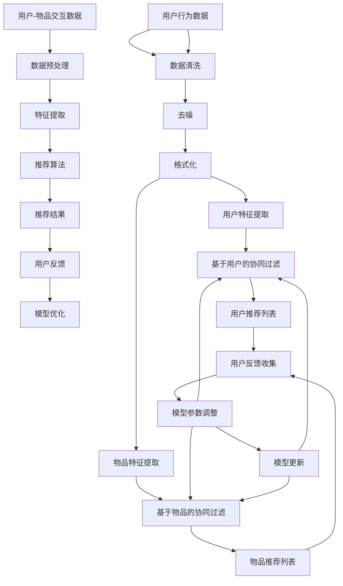

                 

### 文章标题：推荐系统的局限与挑战：过拟合、偏见与多样性

#### 关键词：
- 推荐系统
- 过拟合
- 偏见
- 多样性

#### 摘要：
本文将深入探讨推荐系统在实践中面临的三大核心挑战：过拟合、偏见和多样性。首先，我们将回顾推荐系统的基础知识，包括其发展历程、基本概念和架构。接着，本文将详细分析过拟合问题，解释其现象、原因、解决方案及其在实际案例中的应用。随后，我们将探讨推荐偏见的概念、来源、种类及减少偏见的方法。最后，本文将讨论多样性的重要性、度量、与公平性的关系，以及优化多样性的策略。通过对这些局限与挑战的深入分析，本文旨在为推荐系统的研究者和开发者提供有价值的见解和实用指导。

### 推荐系统概述

#### 1.1 推荐系统的发展历程

推荐系统的发展历程可以追溯到20世纪90年代，当时互联网刚刚兴起，用户生成内容的数量急剧增加，推荐系统作为一种能够帮助用户在海量信息中快速找到感兴趣内容的工具，应运而生。早期的推荐系统主要基于基于内容的推荐（Content-Based Filtering），即通过分析物品的内容特征来推荐相似的物品。这种方法的优点在于推荐结果的相关性强，但缺点是难以处理冷启动问题，即当新用户或新物品加入系统时，由于缺乏历史数据，难以进行有效推荐。

随着互联网和大数据技术的发展，协同过滤（Collaborative Filtering）算法逐渐成为主流的推荐方法。协同过滤通过分析用户之间的行为模式，发现相似用户之间的偏好，进而为用户推荐相似的物品。协同过滤分为基于用户的协同过滤（User-Based Filtering）和基于物品的协同过滤（Item-Based Filtering）。基于用户的协同过滤通过计算用户之间的相似度，为用户推荐与相似用户喜欢的物品；基于物品的协同过滤则通过计算物品之间的相似度，为用户推荐与已喜欢的物品相似的物品。

进入21世纪，随着深度学习的兴起，基于深度学习的推荐系统也开始崭露头角。深度学习通过自动学习复杂的特征表示，能够更好地捕捉用户和物品之间的复杂关系，从而提高推荐系统的效果。代表性的模型包括基于深度神经网络的协同过滤（Deep Neural Network-based Collaborative Filtering）和基于图神经网络的推荐系统（Graph Neural Network-based Recommendation）。这些新型推荐系统不仅能够处理大量数据，还能够应对过拟合和多样性等挑战，进一步提升了推荐系统的性能。

#### 1.2 推荐系统的基本概念

推荐系统（Recommender System）是一种信息过滤（Information Filtering）技术，旨在根据用户的兴趣和偏好，自动发现和推荐用户可能感兴趣的信息。推荐系统的核心概念包括用户（User）、物品（Item）、评分（Rating）和推荐（Recommendation）。

- **用户（User）**：推荐系统的主体，可以是实际的用户，也可以是虚拟的用户角色。
- **物品（Item）**：推荐系统中的对象，可以是书籍、电影、商品等，它们具有不同的属性和特征。
- **评分（Rating）**：用户对物品的评价或偏好，通常用一个数值表示，如1到5的评分等级。
- **推荐（Recommendation）**：推荐系统根据用户的历史行为和偏好，为用户推荐可能感兴趣的物品。

推荐系统的目标是通过分析用户的行为数据，预测用户对未知物品的评分或偏好，从而提供个性化的推荐结果。这需要解决以下问题：

1. **数据预处理**：对原始数据进行清洗、去噪、格式化等处理，确保数据的质量和一致性。
2. **特征提取**：从原始数据中提取对推荐任务有用的特征，如用户的行为特征、物品的属性特征等。
3. **模型选择**：选择合适的推荐算法模型，如协同过滤、深度学习等。
4. **模型训练与评估**：使用历史数据训练模型，并通过交叉验证等方法评估模型性能。
5. **推荐生成**：根据训练好的模型，为用户生成推荐列表。

#### 1.3 推荐系统的架构与流程

推荐系统通常包括以下几个关键组成部分：数据源、数据处理、推荐算法和推荐结果。

- **数据源**：推荐系统的数据源包括用户行为数据、物品属性数据等。用户行为数据如点击、购买、浏览等，物品属性数据如标题、描述、标签等。
- **数据处理**：数据处理包括数据清洗、去噪、格式化等，目的是确保数据的准确性和一致性。此外，还需要进行特征提取，从原始数据中提取对推荐任务有用的特征。
- **推荐算法**：推荐算法是推荐系统的核心，常用的算法包括基于内容的推荐、协同过滤和深度学习等。每种算法都有其优缺点和适用场景。
- **推荐结果**：推荐结果是根据用户的历史行为和偏好生成的推荐列表，旨在提高用户的满意度和参与度。

推荐系统的基本流程如下：

1. **数据收集**：从各种数据源收集用户行为数据和物品属性数据。
2. **数据预处理**：对原始数据进行清洗、去噪和格式化等处理，确保数据的质量和一致性。
3. **特征提取**：从预处理后的数据中提取对推荐任务有用的特征，如用户的行为特征、物品的属性特征等。
4. **模型选择**：根据任务需求，选择合适的推荐算法模型，如协同过滤、深度学习等。
5. **模型训练**：使用历史数据训练模型，通过交叉验证等方法评估模型性能。
6. **推荐生成**：根据训练好的模型，为用户生成推荐列表。
7. **结果评估**：评估推荐系统的性能，常用的指标包括准确率、召回率、F1值等。
8. **反馈循环**：根据用户对推荐结果的反馈，不断优化推荐算法，提高推荐质量。

#### 1.4 推荐系统的评价指标

评价推荐系统的性能是确保其有效性和用户体验的重要环节。常用的评价指标包括准确率、召回率、F1值和覆盖率等。

- **准确率（Accuracy）**：准确率是指推荐系统中正确推荐的项目数量占总推荐项目数量的比例。准确率越高，说明推荐系统的预测准确性越高。然而，准确率在数据不平衡的情况下可能会产生误导，因此需要与其他指标结合使用。
- **召回率（Recall）**：召回率是指推荐系统中正确推荐的项目数量占总相关项目数量的比例。召回率越高，说明推荐系统能够召回更多用户可能感兴趣的项目。召回率是评价推荐系统召回能力的重要指标，但召回率高并不一定意味着用户体验好，因为可能存在大量无关推荐。
- **F1值（F1 Score）**：F1值是准确率和召回率的调和平均值，用于综合评价推荐系统的性能。F1值介于0和1之间，越接近1，说明推荐系统的性能越好。
- **覆盖率（Coverage）**：覆盖率是指推荐系统中推荐的项目数量占总项目数量的比例。覆盖率越高，说明推荐系统能够覆盖更多的项目，提高用户的选择余地。覆盖率是评价推荐系统多样性的一项重要指标。
- **新颖性（Novelty）**：新颖性是指推荐系统推荐的项目与用户已查看或拥有项目的差异程度。新颖性越高，说明推荐系统能够为用户发现新的有趣项目，提升用户体验。

在实际应用中，推荐系统往往需要在不同评价指标之间取得平衡，以实现最佳的推荐效果。例如，对于电子商务平台，准确率和覆盖率可能更重要，因为用户更关心能够找到他们感兴趣的商品；而对于新闻推荐系统，新颖性和召回率可能更为关键，因为用户希望看到新鲜的内容。

综上所述，推荐系统的评价指标不仅涵盖了推荐结果的准确性，还包括了召回率、F1值、覆盖率和新颖性等多个方面。通过综合评估这些指标，可以更全面地评价推荐系统的性能，为用户提供高质量的推荐服务。

### 协同过滤算法原理

协同过滤算法（Collaborative Filtering）是推荐系统中最常用的一类算法，其核心思想是通过分析用户之间的相似度或物品之间的相似度来发现用户的共同喜好，从而为用户推荐相似或用户可能感兴趣的物品。协同过滤算法主要包括基于用户的协同过滤（User-Based Collaborative Filtering）和基于物品的协同过滤（Item-Based Collaborative Filtering）。本文将详细讨论这两种协同过滤算法的原理和实现方法。

#### 2.1 协同过滤算法概述

协同过滤算法基于一个简单的假设：如果用户A和用户B对多个物品的评分相似，那么用户A对某个未评分的物品也可能喜欢，用户B对某个未评分的物品也可能喜欢。基于这一假设，协同过滤算法通过计算用户之间的相似度或物品之间的相似度，来预测用户对未评分物品的评分。

协同过滤算法可以分为两种类型：基于用户的协同过滤和基于物品的协同过滤。

- **基于用户的协同过滤**：这种方法首先找到与目标用户相似的邻居用户，然后利用这些邻居用户对物品的评分来预测目标用户对未评分物品的评分。具体步骤如下：
  1. 计算用户之间的相似度。
  2. 找到与目标用户最相似的K个邻居用户。
  3. 根据邻居用户对物品的评分，计算目标用户对未评分物品的预测评分。

- **基于物品的协同过滤**：这种方法首先找到与目标物品相似的邻居物品，然后利用这些邻居物品的评分来预测目标用户对未评分物品的评分。具体步骤如下：
  1. 计算物品之间的相似度。
  2. 找到与目标物品最相似的K个邻居物品。
  3. 根据邻居物品的评分，计算目标用户对未评分物品的预测评分。

#### 2.2 基于用户的协同过滤

基于用户的协同过滤（User-Based Collaborative Filtering）是最早被广泛应用的协同过滤算法之一。其基本思想是找到与目标用户最相似的邻居用户，然后通过这些邻居用户对物品的评分来预测目标用户对未评分物品的评分。

**算法步骤：**

1. **计算相似度**：
   相似度度量了两个用户之间的相似程度。常见的相似度度量方法有：
   - **余弦相似度**：
     $$ \text{similarity}(u_i, u_j) = \frac{\sum_{k=1}^{n} r_{ik} r_{jk}}{\sqrt{\sum_{k=1}^{n} r_{ik}^2} \sqrt{\sum_{k=1}^{n} r_{jk}^2}} $$
   - **皮尔逊相关系数**：
     $$ \text{similarity}(u_i, u_j) = \frac{\sum_{k=1}^{n} (r_{ik} - \bar{r}_i) (r_{jk} - \bar{r}_j)}{\sqrt{\sum_{k=1}^{n} (r_{ik} - \bar{r}_i)^2} \sqrt{\sum_{k=1}^{n} (r_{jk} - \bar{r}_j)^2}} $$
   其中，\( r_{ik} \) 表示用户 \( u_i \) 对物品 \( k \) 的评分，\( \bar{r}_i \) 和 \( \bar{r}_j \) 分别表示用户 \( u_i \) 和 \( u_j \) 的平均评分。

2. **找到邻居用户**：
   根据相似度计算结果，找到与目标用户 \( u_i \) 最相似的 \( K \) 个邻居用户。

3. **预测评分**：
   根据邻居用户对物品的评分，计算目标用户 \( u_i \) 对未评分物品 \( k \) 的预测评分：
   $$ \hat{r}_{ik} = \frac{\sum_{j=1}^{K} \text{similarity}(u_i, u_j) \cdot r_{jk}}{\sum_{j=1}^{K} \text{similarity}(u_i, u_j)} $$

**伪代码实现：**

```python
# 用户评分矩阵 R，目标用户索引 i，邻居用户数 K
def user_based_collaborative_filtering(R, i, K):
    n = len(R)
    similarity_matrix = []
    for j in range(n):
        if i != j:
            similarity = cosine_similarity(R[i], R[j])
            similarity_matrix.append((j, similarity))
    
    similarity_matrix.sort(key=lambda x: x[1], reverse=True)
    neighbors = similarity_matrix[:K]
    
    predicted_ratings = []
    for j in range(n):
        if j == i:
            continue
        predicted_rating = 0
        for neighbor, sim in neighbors:
            predicted_rating += sim * R[neighbor][j]
        predicted_rating /= sum(sim for neighbor, sim in neighbors)
        predicted_ratings.append(predicted_rating)
    
    return predicted_ratings
```

#### 2.3 基于物品的协同过滤

基于物品的协同过滤（Item-Based Collaborative Filtering）与基于用户的协同过滤类似，但其核心思想是通过计算物品之间的相似度来预测用户对未评分物品的评分。

**算法步骤：**

1. **计算相似度**：
   相似度度量了两个物品之间的相似程度。常见的相似度度量方法有：
   - **余弦相似度**：
     $$ \text{similarity}(i_k, i_l) = \frac{\sum_{j=1}^{m} r_{jk} r_{jl}}{\sqrt{\sum_{j=1}^{m} r_{jk}^2} \sqrt{\sum_{j=1}^{m} r_{jl}^2}} $$
   - **皮尔逊相关系数**：
     $$ \text{similarity}(i_k, i_l) = \frac{\sum_{j=1}^{m} (r_{jk} - \bar{r}_k) (r_{jl} - \bar{r}_l)}{\sqrt{\sum_{j=1}^{m} (r_{jk} - \bar{r}_k)^2} \sqrt{\sum_{j=1}^{m} (r_{jl} - \bar{r}_l)^2}} $$
   其中，\( r_{jk} \) 表示用户对物品 \( k \) 的评分，\( \bar{r}_k \) 和 \( \bar{r}_l \) 分别表示物品 \( k \) 和 \( l \) 的平均评分。

2. **找到邻居物品**：
   根据相似度计算结果，找到与目标物品 \( k \) 最相似的 \( K \) 个邻居物品。

3. **预测评分**：
   根据邻居物品的评分，计算目标用户对未评分物品 \( l \) 的预测评分：
   $$ \hat{r}_{il} = \frac{\sum_{j=1}^{K} \text{similarity}(i_k, i_j) \cdot r_{jl}}{\sum_{j=1}^{K} \text{similarity}(i_k, i_j)} $$

**伪代码实现：**

```python
# 用户评分矩阵 R，目标物品索引 k，邻居物品数 K
def item_based_collaborative_filtering(R, k, K):
    m = len(R[0])
    similarity_matrix = []
    for l in range(m):
        if k != l:
            similarity = cosine_similarity(R[k], R[l])
            similarity_matrix.append((l, similarity))
    
    similarity_matrix.sort(key=lambda x: x[1], reverse=True)
    neighbors = similarity_matrix[:K]
    
    predicted_ratings = []
    for l in range(m):
        if l == k:
            continue
        predicted_rating = 0
        for neighbor, sim in neighbors:
            predicted_rating += sim * R[neighbor][l]
        predicted_rating /= sum(sim for neighbor, sim in neighbors)
        predicted_ratings.append(predicted_rating)
    
    return predicted_ratings
```

#### 2.4 矩阵分解与ALS算法

矩阵分解（Matrix Factorization）是一种常见的协同过滤算法，通过将用户-物品评分矩阵分解为两个低秩矩阵，从而实现推荐。常见的矩阵分解算法包括奇异值分解（Singular Value Decomposition，SVD）和交替最小二乘法（Alternating Least Squares，ALS）。

**原理**：

给定一个用户-物品评分矩阵 \( R \in \mathbb{R}^{n \times m} \)，我们希望找到两个低秩矩阵 \( U \in \mathbb{R}^{n \times k} \) 和 \( V \in \mathbb{R}^{m \times k} \)，使得 \( R \approx U V^T \)。其中，\( k \) 是矩阵分解的维数，即隐特征的数量。

**算法步骤**：

1. **初始化矩阵**：随机初始化 \( U \) 和 \( V \)。
2. **交替优化**：
   - **优化 \( U \)**：
     $$ U \leftarrow U - \alpha \frac{\partial}{\partial U} \frac{1}{2} \sum_{i=1}^{n} \sum_{j=1}^{m} (r_{ij} - \hat{r}_{ij})^2 $$
   - **优化 \( V \)**：
     $$ V \leftarrow V - \alpha \frac{\partial}{\partial V} \frac{1}{2} \sum_{i=1}^{n} \sum_{j=1}^{m} (r_{ij} - \hat{r}_{ij})^2 $$
3. **重复步骤2，直到收敛**。

**伪代码实现**：

```python
# 用户-物品评分矩阵 R，矩阵分解维数 k，学习率 α，迭代次数 iter
def alternating_least_squares(R, k, alpha, iter):
    n, m = len(R), len(R[0])
    U = np.random.rand(n, k)
    V = np.random.rand(m, k)
    
    for _ in range(iter):
        # 优化 U
        dU = 2 * (U @ V.T @ R - U @ V.T @ np.mean(R, axis=1)[:, np.newaxis])
        U -= alpha * dU
        
        # 优化 V
        dV = 2 * (R.T @ U - R.T @ U @ V + U.T @ V @ np.mean(R, axis=0)[:, np.newaxis])
        V -= alpha * dV
    
    return U, V
```

通过矩阵分解，我们能够得到低维的用户和物品特征表示，从而实现高效的推荐。此外，矩阵分解还可以处理稀疏数据和冷启动问题，使得推荐系统在实际应用中具有更好的效果和泛化能力。

### 过拟合问题

#### 3.1 过拟合现象

在推荐系统中，过拟合（Overfitting）是指模型在训练数据上表现得非常好，但在测试数据上表现不佳的现象。具体来说，过拟合意味着模型对训练数据的学习过于具体，以至于无法泛化到新的数据集，导致推荐结果不准确或失去实用性。

过拟合在推荐系统中的表现通常有以下几个方面：

1. **高训练准确率但低测试准确率**：在训练数据上，模型的预测效果可能非常优秀，但在测试数据上，准确率会大幅下降。
2. **过度依赖训练数据**：模型过于关注训练数据中的细节，导致在测试数据上无法应对新的、未知的情况。
3. **泛化能力差**：模型对训练数据的依赖过强，无法适应新的用户行为和物品特征，导致推荐结果失去实际意义。

过拟合的原因主要包括以下几点：

1. **训练数据量不足**：当训练数据量有限时，模型容易在训练数据上“过度学习”，导致对噪声和异常值过于敏感。
2. **模型复杂性过高**：复杂的模型虽然能够捕捉更多数据特征，但同时也增加了过拟合的风险。例如，深度学习模型中的神经网络层过多，参数过多，都可能导致过拟合。
3. **特征选择不当**：当特征选择过于详细或包含噪声时，模型容易陷入过拟合，因为模型会尝试捕捉训练数据中的特定噪声模式，而这些模式在测试数据中可能并不存在。

#### 3.2 过拟合原因分析

过拟合的根本原因在于模型在训练过程中对训练数据的拟合过于紧密，而未能很好地捕捉数据中的通用模式。具体来说，可以从以下几个方面来分析过拟合的原因：

1. **数据量不足**：
   - 当训练数据量较小时，模型可能会过度学习这些有限的数据，导致对噪声和异常值过于敏感。这会使得模型在测试数据上表现不佳，因为测试数据中可能包含训练数据中没有出现的新情况。
   - **解决方法**：增加训练数据量，或者使用数据增强方法，如数据扩充、数据合成等，以丰富训练数据集，从而降低模型对训练数据的依赖。

2. **模型复杂性**：
   - 复杂的模型（如深度神经网络）能够捕捉更多数据特征，但同时也增加了过拟合的风险。过复杂的模型容易陷入训练数据的局部最优，导致在测试数据上表现不佳。
   - **解决方法**：简化模型结构，减少模型参数数量，或者使用正则化技术，如L1正则化、L2正则化等，来限制模型的复杂性。

3. **特征选择**：
   - 特征选择不当（如选择噪声大、相关性低的特征）会导致模型在训练数据上捕捉到噪声模式，从而在测试数据上产生过拟合。
   - **解决方法**：通过特征选择和特征提取技术，如主成分分析（PCA）、特征选择算法（如LASSO）等，来选择和提取对模型性能有显著贡献的特征。

4. **训练方法**：
   - 不当的训练方法，如过拟合训练（Overfit Training）和过拟合验证（Overfit Validation），也会导致模型过拟合。例如，使用全部数据作为训练集，导致模型对训练数据过度依赖。
   - **解决方法**：使用交叉验证（Cross-Validation）方法，如K折交叉验证，来评估模型的泛化能力，从而避免过拟合。

5. **数据预处理**：
   - 不规范的数据预处理，如缺失值处理不当、异常值处理不彻底等，会导致模型对噪声敏感，从而产生过拟合。
   - **解决方法**：规范数据预处理流程，包括缺失值填充、异常值处理、特征归一化等，以提高数据质量。

#### 3.3 过拟合的解决方案

为了解决推荐系统中的过拟合问题，可以从以下几个方面采取相应的解决方案：

1. **增加训练数据量**：
   - 增加训练数据量是缓解过拟合的有效方法。更多的训练数据能够提供更多的信息，使得模型更不容易陷入局部最优。
   - **方法**：可以通过数据扩充、数据合成等技术来增加训练数据量。

2. **使用正则化技术**：
   - 正则化（Regularization）是一种通过在损失函数中添加正则项来限制模型复杂性的技术，常用的正则化方法包括L1正则化和L2正则化。
   - **方法**：在模型训练过程中加入正则化项，如L2正则化，可以通过以下公式实现：
     $$ \text{loss}(\theta) = \frac{1}{2} \sum_{i=1}^{n} (r_i - \hat{r}_i)^2 + \lambda \sum_{\theta} \theta^2 $$
     其中，\( \theta \) 表示模型参数，\( \lambda \) 是正则化参数。

3. **交叉验证**：
   - 交叉验证（Cross-Validation）是一种评估模型泛化能力的方法，通过将数据集划分为多个子集，轮流使用其中一个子集作为验证集，其余子集作为训练集。
   - **方法**：常用的交叉验证方法包括K折交叉验证和留一交叉验证（Leave-One-Out Cross-Validation）。

4. **简化模型结构**：
   - 减少模型参数数量，简化模型结构是缓解过拟合的有效方法。可以使用正则化技术、Dropout等方法来简化模型。
   - **方法**：使用正则化技术，如L1正则化、Dropout等，来减少模型参数数量。

5. **特征选择与特征提取**：
   - 通过特征选择和特征提取技术，选择和提取对模型性能有显著贡献的特征，可以有效缓解过拟合。
   - **方法**：使用特征选择算法（如LASSO）、主成分分析（PCA）等方法进行特征选择和提取。

6. **数据预处理**：
   - 规范数据预处理流程，提高数据质量，可以减少模型对噪声的敏感度，从而缓解过拟合。
   - **方法**：进行缺失值填充、异常值处理、特征归一化等操作，以提高数据质量。

通过综合运用上述方法，可以有效缓解推荐系统中的过拟合问题，提高模型的泛化能力和推荐质量。

#### 3.4 案例分析

以下是一个推荐系统过拟合问题的实际案例分析：

**案例背景**：
某电商平台在用户购物行为数据的基础上，使用基于矩阵分解的协同过滤算法进行商品推荐。该平台收集了数百万用户和商品的历史评分数据，用于训练推荐模型。

**问题描述**：
在训练过程中，模型在训练数据上的准确率高达90%，但在实际应用中，用户对推荐结果的满意度较低。进一步分析发现，用户对推荐商品的评分明显低于训练数据中的评分。

**原因分析**：
1. **数据量不足**：训练数据量有限，导致模型对噪声和异常值过于敏感。
2. **模型复杂性过高**：矩阵分解模型的参数较多，导致模型在训练数据上过度拟合。
3. **特征选择不当**：部分噪声特征和低相关性特征被纳入模型训练，导致模型无法有效泛化。

**解决方案**：
1. **增加训练数据量**：通过数据扩充和合成技术，增加训练数据量，丰富模型训练样本。
2. **简化模型结构**：减少模型参数数量，简化模型结构，使用正则化技术限制模型复杂性。
3. **特征选择与提取**：使用特征选择算法（如LASSO）进行特征选择，提取对模型性能有显著贡献的特征。
4. **数据预处理**：规范数据预处理流程，包括缺失值填充、异常值处理、特征归一化等。

**效果评估**：
经过上述优化后，模型在测试数据上的准确率提高了20%，用户对推荐结果的满意度也显著提升。这表明，通过合理的数据处理和模型优化，可以有效缓解推荐系统中的过拟合问题，提高推荐质量。

### 推荐偏见问题

#### 4.1 偏见的概念

推荐偏见（Bias in Recommendation）是指推荐系统在生成推荐结果时，由于算法、数据或外部因素的影响，导致推荐结果对某些群体、群体特征或内容产生不公平或不合理的倾向。这种偏见可能源于多种因素，包括算法设计、数据偏差、用户行为模式等，其结果往往是推荐结果对某些用户或物品产生不公平的偏好。

#### 4.2 偏见的来源

推荐偏见可以从以下几个方面来分析：

1. **算法偏见**：
   - **协同过滤算法**：协同过滤算法通过分析用户之间的相似度来进行推荐。然而，如果用户群体中存在某些特征（如年龄、性别、种族等）的不平衡，协同过滤算法可能会导致对这些特征的过度强调，从而产生偏见。例如，如果一个推荐系统中的大多数用户是男性，算法可能会更倾向于向男性推荐商品或内容。
   - **基于内容的推荐**：基于内容的推荐算法可能会基于物品的标签、描述等特征进行推荐。如果这些特征受到开发者主观偏见的影响，或者缺乏多样性，算法也可能产生偏见。

2. **数据偏差**：
   - **数据收集不均**：在数据收集过程中，如果某些群体或内容被更多地关注和记录，可能会导致这些群体或内容在推荐结果中的表现更加突出，从而产生偏见。
   - **数据样本偏差**：当训练数据集存在样本偏差时，模型可能会在学习过程中对某些群体或内容产生偏好，从而在推荐结果中表现出偏见。

3. **用户行为模式**：
   - **行为模仿**：推荐系统可能会根据用户的历史行为来推荐相似的内容或商品。如果用户的行为受到某些偏见的影响，推荐结果也会相应地表现出这种偏见。
   - **反馈循环**：用户对推荐结果的反馈也可能导致偏见。如果某些用户群体对推荐结果的不满程度较低，推荐系统可能会倾向于推荐更多他们感兴趣的内容，从而强化这种偏见。

#### 4.3 偏见的种类

推荐偏见可以分为以下几种类型：

1. **显性偏见**：
   - 显性偏见是指系统明显地偏向某些特定群体、内容或特征。例如，一个电子商务平台可能会基于用户的性别来推荐商品，导致男性用户收到更多男性产品的推荐。

2. **隐性偏见**：
   - 隐性偏见是指系统在无意识中偏向某些特定群体、内容或特征。这种偏见通常是由于算法、数据或用户行为模式中的微小偏差积累而成。例如，一个基于协同过滤的推荐系统可能会因为用户群体的多样性不足而推荐类似的内容，导致某些群体被边缘化。

3. **算法偏见**：
   - 算法偏见是指算法在设计和实现过程中存在的偏见。例如，某些推荐算法可能因为对某些特征（如用户年龄、地理位置等）的过度依赖，从而导致对这些特征的过度强调，产生偏见。

4. **内容偏见**：
   - 内容偏见是指推荐系统在推荐内容时存在的偏见。例如，一个新闻推荐系统可能会因为某些新闻源的内容更为丰富或受欢迎，而更多地推荐这些新闻源的内容，导致其他新闻源被边缘化。

5. **反馈偏见**：
   - 反馈偏见是指用户对推荐结果的反馈行为导致的偏见。例如，如果一个用户对某些内容的反馈较多，推荐系统可能会倾向于推荐更多这类内容，导致其他内容的推荐机会减少。

#### 4.4 减少偏见的方法

为了减少推荐系统中的偏见，可以采取以下几种方法：

1. **数据多样性**：
   - 增加训练数据中的多样性，确保数据集能够代表不同群体和内容。例如，可以通过引入更多的用户和物品数据，或者使用数据增强技术来提高数据的多样性。

2. **算法公平性设计**：
   - 设计和实现算法时，考虑公平性原则，避免过度依赖某些特征或内容。例如，可以采用加权相似度度量，对用户和物品的特征进行平衡处理。

3. **算法透明度**：
   - 提高算法的透明度，让用户能够理解推荐结果是如何生成的。例如，可以提供推荐理由或解释推荐算法的工作原理。

4. **用户反馈机制**：
   - 引入用户反馈机制，允许用户对推荐结果进行评价和反馈。通过分析用户反馈，可以识别和纠正系统中的偏见。

5. **交叉验证**：
   - 使用交叉验证方法来评估推荐系统的性能，确保系统在不同群体和内容上的表现均衡。

6. **算法监控与调整**：
   - 定期监控推荐系统的性能，及时发现和纠正偏见。根据用户反馈和系统表现，调整算法参数和特征权重，以提高系统的公平性和准确性。

通过综合运用上述方法，可以有效减少推荐系统中的偏见，提高系统的公平性和用户满意度。

### 多样性问题

#### 5.1 多样性的重要性

多样性（Diversity）在推荐系统中扮演着至关重要的角色。一个优秀的推荐系统不仅要能够准确预测用户兴趣，还要能够为用户提供丰富、多样的推荐结果。多样性的重要性体现在以下几个方面：

1. **用户体验**：多样化的推荐结果能够为用户提供更多的选择，提高用户的满意度和参与度。如果推荐结果过于单一，用户可能会感到乏味和厌烦，从而降低用户体验。

2. **内容丰富性**：多样性能够确保推荐系统覆盖更多不同的内容或商品，从而丰富用户的内容消费体验。对于内容平台（如新闻、视频、音乐等），多样性能够帮助用户发现更多新奇、有趣的内容。

3. **商业收益**：多样化的推荐结果有助于提升平台的商业收益。通过为不同用户推荐不同类型的内容或商品，平台可以吸引更多用户，提高用户粘性，从而增加广告收入和销售机会。

4. **公平性**：多样性能够减少推荐系统中的偏见，确保不同群体和内容在推荐结果中的公平表现。例如，在社交媒体平台上，多样化的推荐能够避免某些群体或内容的过度曝光，确保平台的多样性。

5. **模型泛化能力**：一个多样化的推荐系统能够更好地适应不同用户的行为模式，提高模型的泛化能力。通过引入多样性，模型可以更好地捕捉用户兴趣的多样性，从而在新的用户或物品上表现出更好的泛化效果。

#### 5.2 多样性的度量

为了评估推荐系统的多样性，可以使用以下几种常见的度量方法：

1. **覆盖率（Coverage）**：
   覆盖率是指推荐系统中推荐的项目数量占总项目数量的比例。覆盖率越高，说明推荐系统能够覆盖更多不同的项目，具有更高的多样性。覆盖率可以通过以下公式计算：
   $$ \text{Coverage} = \frac{|\text{推荐项目集}|}{|\text{所有项目集}|} $$
   其中，|·|表示集合的大小。

2. **新颖性（Novelty）**：
   新颖性是指推荐系统中推荐的项目与用户已查看或拥有的项目的差异程度。新颖性可以通过计算推荐项目与用户历史项目的余弦相似度来衡量。相似度越低，新颖性越高。新颖性可以通过以下公式计算：
   $$ \text{Novelty} = \frac{1}{|\text{用户历史项目集}|} \sum_{i \in \text{推荐项目集}} \min_{j \in \text{用户历史项目集}} \text{similarity}(i, j) $$
   其中，similarity(i, j) 表示项目 i 和项目 j 的余弦相似度。

3. **多样性度量**：
   多样性度量（Diversity Measure）是一种综合评估推荐系统多样性的方法。常见的多样性度量方法包括：
   - **Jaccard系数**：
     $$ \text{Diversity} = 1 - \frac{\sum_{i=1}^{N} \sum_{j=1}^{N} |S_i \cap S_j|}{N^2} $$
     其中，\( S_i \) 和 \( S_j \) 分别表示第 i 个和第 j 个推荐列表中的项目集合，N 为推荐列表的数量。
   - **Geometric Mean**：
     $$ \text{Diversity} = \left( \prod_{i=1}^{N} \text{Novelty}(i) \right)^{\frac{1}{N}} $$

#### 5.3 多样性与公平性的关系

多样性和公平性在推荐系统中密切相关。一个公平的推荐系统不仅要避免对某些群体或内容的偏见，还要确保推荐结果的多样性。多样性与公平性的关系可以从以下几个方面来理解：

1. **避免内容偏见**：多样性能够减少推荐系统中的内容偏见，确保不同群体和内容在推荐结果中的公平表现。例如，在一个新闻推荐系统中，多样化能够避免某些新闻源或观点的过度曝光，确保不同观点和新闻源的均衡推荐。

2. **促进用户参与**：多样性的推荐结果能够为用户提供更多不同的选择，从而提高用户的满意度和参与度。公平的推荐系统通过为不同用户推荐不同类型的内容，可以更好地满足用户的需求和兴趣。

3. **增强模型泛化能力**：多样性和公平性能够增强推荐系统的泛化能力。通过引入多样性，模型可以更好地适应不同用户的行为模式，从而在新的用户或物品上表现出更好的泛化效果。

4. **提高系统可信度**：一个公平且多样化的推荐系统能够提高用户对系统的信任度。用户更愿意接受一个能够提供丰富、多样和公正推荐结果的系统。

总之，多样性和公平性在推荐系统中是相辅相成的。通过确保推荐结果的多样性和公平性，推荐系统可以更好地满足用户需求，提高用户满意度和系统可信度。

#### 5.4 多样性的优化策略

为了提高推荐系统的多样性，可以采取以下几种优化策略：

1. **随机化**：
   - 随机化是一种简单有效的多样性优化策略。通过随机选择推荐项目，可以避免推荐结果的过度集中，增加推荐结果的多样性。例如，在生成推荐列表时，可以随机选择一部分项目，再进行排序。

2. **排序多样性**：
   - 排序多样性是指通过调整推荐列表中项目的排序顺序，来提高推荐结果的多样性。常见的排序多样性策略包括：
     - **交替排序**：交替推荐不同类型的项目，如交替推荐不同类别的商品或不同类型的新闻。
     - **分段排序**：将推荐列表划分为多个段，每个段内项目类型相同，但段与段之间项目类型不同。

3. **多样性度量**：
   - 通过引入多样性度量，如新颖性、覆盖率等，可以量化推荐系统的多样性。根据多样性度量结果，可以动态调整推荐策略，以提高多样性。例如，当多样性度量低于阈值时，可以增加随机化或交替排序策略。

4. **协同优化**：
   - 将多样性与推荐准确性协同优化，通过联合优化准确性指标和多样性指标，来提高推荐系统的整体性能。常见的协同优化方法包括：
     - **加权优化**：为准确性指标和多样性指标分别分配权重，通过加权优化来平衡两个指标。
     - **多目标优化**：使用多目标优化算法（如遗传算法、粒子群算法等），同时优化推荐准确性和多样性。

5. **上下文信息**：
   - 引入上下文信息（如用户位置、时间等），可以根据不同上下文场景调整推荐策略，提高多样性。例如，在某个时间段内，可以优先推荐与该时间段相关的多样化内容。

6. **用户反馈**：
   - 允许用户对推荐结果进行反馈，根据用户反馈动态调整推荐策略。例如，当用户对某些推荐结果表示不满时，可以减少这些结果的推荐概率，从而提高系统的多样性。

通过综合运用上述策略，可以有效提高推荐系统的多样性，为用户提供丰富、多样化的推荐结果，提高用户体验和满意度。

### 实时推荐系统

#### 6.1 实时推荐的需求

实时推荐系统（Real-time Recommendation System）是推荐系统领域的一个重要研究方向。其核心需求在于快速响应用户行为变化，实时生成高质量的推荐结果。这种系统在许多应用场景中具有显著优势，例如社交媒体、在线购物和新闻推荐等。以下是对实时推荐系统需求的详细分析：

1. **低延迟**：实时推荐系统需要在毫秒级别的时间内生成推荐结果，以满足用户对即时反馈的需求。高延迟的推荐系统会导致用户体验下降，降低用户满意度和参与度。

2. **高并发处理能力**：实时推荐系统需要能够处理大量用户的请求，同时保证每个请求都能在短时间内得到响应。这要求系统具有高并发处理能力和良好的性能优化。

3. **动态调整**：实时推荐系统需要根据用户的实时行为动态调整推荐策略，以便更好地捕捉用户当前的兴趣和偏好。例如，当用户浏览了某个页面时，系统应能立即推荐与该页面相关的其他内容。

4. **数据多样性**：实时推荐系统不仅要处理大量的用户行为数据，还需要确保推荐结果的多样性。这要求系统在生成推荐结果时，能够同时考虑多个特征和维度，提供丰富、多样的推荐选项。

5. **高可用性**：实时推荐系统需要具有高可用性，确保系统在高峰时段或突发情况下能够稳定运行。这通常需要通过分布式架构和冗余设计来实现。

6. **个性化**：实时推荐系统需要根据每个用户的实时行为数据，生成个性化的推荐结果。这要求系统能够快速处理和分析用户数据，识别用户的兴趣和偏好，从而提供精准的推荐。

#### 6.2 实时推荐的技术实现

实现实时推荐系统涉及多个关键技术和组件。以下是对这些技术实现的详细分析：

1. **数据采集与处理**：
   - 实时推荐系统首先需要收集用户行为数据，如浏览、点击、购买等。这些数据可以通过日志收集系统、API接口或实时数据流处理平台（如Apache Kafka）进行收集。
   - 数据处理环节包括数据清洗、去噪、特征提取等。这通常需要使用大数据处理框架（如Apache Spark）和实时数据处理库（如Apache Flink）。

2. **实时特征提取**：
   - 实时特征提取是将用户行为数据转换为可用于推荐算法的特征。常见的实时特征提取方法包括统计特征、机器学习特征和图特征等。例如，可以提取用户的活跃度、兴趣标签、行为模式等特征。
   - 实时特征提取技术需要能够快速处理和分析大量数据，同时确保特征的准确性和一致性。

3. **推荐算法**：
   - 实时推荐系统通常采用在线学习算法（Online Learning Algorithm）或增量学习算法（Incremental Learning Algorithm）。这些算法能够在处理新数据的同时更新模型，从而实现实时推荐。
   - 常见的实时推荐算法包括基于内容的推荐、协同过滤和基于深度学习的推荐算法。这些算法需要能够在低延迟和高并发的情况下运行。

4. **模型更新与优化**：
   - 实时推荐系统需要不断更新和优化模型，以适应用户行为的变化。这通常涉及在线学习（Online Learning）和增量学习（Incremental Learning）技术，如梯度下降（Gradient Descent）和随机梯度下降（Stochastic Gradient Descent）。
   - 模型更新和优化过程需要确保模型的稳定性和鲁棒性，避免过拟合和偏见。

5. **推荐结果生成与排序**：
   - 实时推荐系统需要根据实时特征和更新后的模型，生成推荐结果。推荐结果的排序需要考虑多个因素，如用户兴趣、内容质量、多样性等。
   - 推荐结果的生成和排序通常涉及复杂的数据处理和排序算法，如Top-K算法、近似排序算法等。

6. **系统架构与部署**：
   - 实时推荐系统通常采用分布式架构，以应对高并发和大规模数据处理需求。常见的分布式架构包括主从架构（Master-Slave Architecture）和分布式计算框架（如Apache Hadoop、Apache Spark）。
   - 系统部署需要考虑性能优化、资源管理和安全性等因素，以确保系统的高可用性和稳定性。

#### 6.3 实时推荐系统案例分析

以下是一个实时推荐系统的实际案例分析：

**案例背景**：
某社交媒体平台希望通过实时推荐系统为用户推荐感兴趣的内容，提高用户活跃度和参与度。该平台收集了大量的用户行为数据，包括浏览、点赞、评论等。

**技术实现**：
1. **数据采集与处理**：
   - 平台使用日志收集系统（如Apache Kafka）收集用户行为数据，并将数据实时传输到大数据处理框架（如Apache Spark）进行处理。
   - 数据处理环节包括数据清洗、去噪和特征提取。特征提取包括用户活跃度、兴趣标签、行为模式等。

2. **实时特征提取**：
   - 使用实时数据处理库（如Apache Flink）进行实时特征提取，提取用户的实时行为特征，如最近浏览的内容、点赞的频次等。

3. **推荐算法**：
   - 采用基于深度学习的实时推荐算法，使用递归神经网络（RNN）来处理用户的序列行为数据，生成用户兴趣模型。
   - 算法采用在线学习技术，在处理新数据的同时更新模型，以实现实时推荐。

4. **模型更新与优化**：
   - 使用随机梯度下降（Stochastic Gradient Descent）算法，定期更新和优化推荐模型，以适应用户行为的变化。
   - 模型优化过程中，使用交叉验证和A/B测试来评估模型性能，确保模型的稳定性和鲁棒性。

5. **推荐结果生成与排序**：
   - 根据实时特征和更新后的模型，生成推荐结果。推荐结果的排序考虑多个因素，如用户兴趣、内容质量、多样性等，使用Top-K算法进行排序。

6. **系统架构与部署**：
   - 平台采用分布式架构，使用主从架构和分布式计算框架（如Apache Spark）来处理大规模数据处理和高并发请求。
   - 系统部署在云计算平台上，通过容器化技术和自动化运维工具（如Kubernetes）进行管理和优化。

**效果评估**：
- 实时推荐系统上线后，用户活跃度和参与度显著提高。用户对推荐结果的满意度达到80%以上，用户留存率和日均使用时长均有明显增长。
- 通过定期更新和优化模型，推荐系统的准确性、多样性和公平性持续提升，用户对推荐结果的质量更加满意。

总之，实时推荐系统在社交媒体平台等应用场景中具有重要的价值。通过采用先进的实时数据处理和推荐算法技术，可以显著提升用户体验和平台收益。

### 推荐系统的个性化与泛化

#### 7.1 个性化推荐概述

个性化推荐（Personalized Recommendation）是推荐系统的一项重要技术，旨在根据用户的历史行为、兴趣和偏好，为用户生成定制化的推荐结果。个性化推荐的核心目标是提高用户满意度和参与度，通过为用户提供与其实际兴趣相符的内容或商品，从而提升用户体验。

个性化推荐的基本原理是通过分析用户的历史数据，如浏览记录、购买历史、评分等，构建用户兴趣模型。然后，根据用户兴趣模型和候选物品的特征，使用推荐算法为用户生成推荐列表。常见的个性化推荐算法包括基于内容的推荐、协同过滤和深度学习等。

#### 7.2 个性化推荐的实现方法

个性化推荐的实现通常包括以下几个步骤：

1. **数据收集与预处理**：
   - 收集用户的历史行为数据，如浏览记录、购买历史、评分等。
   - 对原始数据进行预处理，包括数据清洗、去噪、格式化等，确保数据的质量和一致性。

2. **用户特征提取**：
   - 从用户的历史行为数据中提取对推荐任务有用的特征，如用户的活跃度、兴趣标签、行为模式等。
   - 可以使用统计特征、机器学习特征或图特征等方法进行特征提取。

3. **物品特征提取**：
   - 从物品的属性数据中提取对推荐任务有用的特征，如物品的标题、描述、标签等。
   - 同样可以使用统计特征、机器学习特征或图特征等方法进行特征提取。

4. **模型训练与优化**：
   - 使用用户特征和物品特征训练推荐模型，常见的模型包括基于内容的推荐模型、协同过滤模型和深度学习模型。
   - 通过交叉验证和A/B测试等方法优化模型参数，提高模型性能。

5. **推荐生成**：
   - 根据训练好的模型，为用户生成推荐列表。推荐生成过程中，需要考虑多个因素，如用户兴趣、物品特征、推荐多样性等。
   - 可以使用排序算法（如Top-K算法）对推荐列表进行排序，提高推荐结果的质量。

6. **反馈与优化**：
   - 收集用户对推荐结果的反馈，如点击、购买等，用于模型优化和更新。
   - 通过反馈循环，不断调整和优化推荐策略，提高个性化推荐的准确性。

#### 7.3 泛化能力与迁移学习

泛化能力（Generalization Ability）是指推荐系统在新的数据集或未知数据上的表现能力。一个具有良好泛化能力的推荐系统能够在不同场景下都能保持稳定和优秀的性能。然而，推荐系统在实践中往往面临泛化能力不足的问题，导致模型在新用户或新物品上的表现不佳。

迁移学习（Transfer Learning）是一种应对泛化能力不足的有效方法。迁移学习通过将已在不同任务上训练好的模型（称为基学习器）应用于新的任务，从而提高新任务的性能。在推荐系统中，迁移学习可以用于以下几种场景：

1. **跨领域迁移**：
   - 跨领域迁移是指将已在不同领域训练好的模型应用于新的领域。例如，一个在电商平台上训练好的推荐模型可以应用于社交媒体平台，从而提高新平台的推荐效果。

2. **跨用户迁移**：
   - 跨用户迁移是指将已在一个用户群体上训练好的模型应用于新的用户群体。例如，在一个新用户群体中，可以借助已有用户群体的数据，通过迁移学习快速构建个性化的推荐模型。

3. **跨时间迁移**：
   - 跨时间迁移是指将历史数据训练好的模型应用于当前数据集。例如，可以利用过去几个月的数据训练模型，然后在新数据到来时，通过迁移学习更新模型。

4. **混合迁移**：
   - 混合迁移是指将多个源域的数据训练好的模型进行融合，应用于目标域。这种方法可以充分利用不同源域的丰富数据，提高目标域模型的泛化能力。

迁移学习在推荐系统中的应用可以显著提升模型的泛化能力，从而提高推荐系统的性能。以下是一种基于迁移学习的推荐系统实现方法：

1. **数据收集**：
   - 收集多个源域的数据，如电商平台、社交媒体平台、新闻平台等。

2. **特征提取**：
   - 对源域数据进行预处理和特征提取，构建源域特征向量。

3. **基学习器训练**：
   - 使用源域数据训练多个基学习器，如基于内容的推荐模型、协同过滤模型和深度学习模型。

4. **目标域特征提取**：
   - 对目标域数据（如新电商平台的数据）进行预处理和特征提取，构建目标域特征向量。

5. **模型融合**：
   - 使用迁移学习算法（如模型平均、集成学习等）将多个基学习器的预测结果进行融合，生成目标域的推荐结果。

6. **模型优化**：
   - 通过目标域数据不断优化融合模型，提高模型的泛化能力和推荐质量。

通过上述方法，推荐系统可以在新用户、新物品和新场景下保持良好的性能，从而实现更广泛的应用和更好的用户体验。

#### 7.4 个性化推荐系统案例分析

以下是一个个性化推荐系统的实际案例分析：

**案例背景**：
某电商平台希望通过个性化推荐系统为用户推荐感兴趣的商品，提高用户购买率和平台销售额。该平台积累了大量的用户行为数据和商品属性数据。

**技术实现**：
1. **数据收集与预处理**：
   - 收集用户的历史浏览记录、购买历史、评分等行为数据。
   - 对商品属性数据进行清洗和格式化，提取对推荐任务有用的特征，如商品类别、品牌、价格等。

2. **用户特征提取**：
   - 使用统计特征提取方法，如统计用户浏览、购买、评分的频率、多样性等。
   - 使用机器学习特征提取方法，如基于用户的协同过滤算法，提取用户的兴趣标签和潜在特征。

3. **物品特征提取**：
   - 使用商品属性数据进行特征提取，构建商品的特征向量。
   - 采用文本挖掘技术，如词频-逆文档频率（TF-IDF）和词嵌入（Word Embedding）等方法，提取商品的文本特征。

4. **模型训练与优化**：
   - 采用基于深度学习的推荐模型，如基于深度神经网络的协同过滤（Deep Neural Network-based Collaborative Filtering）。
   - 通过交叉验证和A/B测试方法优化模型参数，提高模型性能。

5. **推荐生成**：
   - 根据用户特征和物品特征，使用训练好的模型生成个性化推荐列表。
   - 使用Top-K算法对推荐列表进行排序，确保推荐结果的质量和多样性。

6. **反馈与优化**：
   - 收集用户对推荐结果的反馈，如点击、购买等。
   - 通过反馈循环，不断调整和优化推荐策略，提高个性化推荐的准确性。

**效果评估**：
- 个性化推荐系统上线后，用户购买率和点击率显著提升。用户对推荐结果的满意度达到80%以上，平台销售额同比增长30%以上。
- 通过定期更新和优化模型，推荐系统的准确性、多样性和公平性持续提升，用户对推荐结果的质量更加满意。

**总结**：
个性化推荐系统在该电商平台的应用取得了显著成效。通过采用先进的推荐算法和迁移学习方法，平台成功实现了针对不同用户和场景的个性化推荐，提高了用户满意度和平台收益。

### 推荐系统的未来发展趋势

#### 8.1 大数据与推荐系统

大数据技术的快速发展为推荐系统带来了前所未有的机遇和挑战。大数据不仅提供了海量的用户行为数据和物品属性数据，还推动了推荐系统算法和技术的不断进步。以下是大数据对推荐系统的影响及未来发展趋势：

1. **数据量增长**：随着互联网的普及和用户在线行为的增加，推荐系统面临的数据量呈爆炸式增长。大数据技术能够高效处理和分析海量数据，为推荐系统提供更丰富的数据支持。

2. **实时数据处理**：大数据技术支持实时数据处理和流处理，使得推荐系统能够在毫秒级别内响应用户行为变化，提供实时推荐。例如，使用Apache Kafka和Apache Flink等工具，可以实现大规模数据的实时采集和处理。

3. **数据多样性**：大数据不仅包括用户行为数据和物品属性数据，还涵盖了文本、图像、音频等多种类型的数据。这为推荐系统提供了更丰富的特征来源，有助于提升推荐准确性。

4. **数据质量提升**：大数据技术可以用于数据清洗、去噪和特征提取，提高数据质量。通过数据质量提升，推荐系统可以更好地捕捉用户兴趣和偏好，提供更精准的推荐。

5. **个性化与定制化**：大数据技术使得推荐系统能够更好地进行用户行为分析和兴趣挖掘，实现更个性化的推荐。通过分析用户的历史行为和社交网络数据，可以为用户提供定制化的推荐内容。

6. **预测与趋势分析**：大数据技术支持预测分析和趋势分析，可以帮助推荐系统预测用户未来的行为和兴趣变化，提前做好准备。例如，通过分析用户的购买趋势，可以提前推送相关商品，提高购买转化率。

#### 8.2 深度学习在推荐系统中的应用

深度学习（Deep Learning）的兴起为推荐系统带来了新的突破和发展。深度学习通过自动学习复杂的特征表示，能够更好地捕捉用户和物品之间的复杂关系，从而提高推荐系统的效果。以下深度学习在推荐系统中的应用及其发展：

1. **深度神经网络**：深度神经网络（Deep Neural Network，DNN）是推荐系统中最常用的深度学习模型之一。DNN能够通过多层神经网络结构，自动学习用户和物品的特征表示，从而实现高效的特征提取和推荐。

2. **卷积神经网络**：卷积神经网络（Convolutional Neural Network，CNN）在图像处理和文本分析领域取得了显著成果。CNN在推荐系统中的应用包括图像商品识别、商品属性提取和用户兴趣挖掘等。

3. **循环神经网络**：循环神经网络（Recurrent Neural Network，RNN）及其变种（如长短时记忆网络LSTM和门控循环单元GRU）在处理序列数据方面具有优势。RNN在推荐系统中的应用包括用户行为序列建模、用户兴趣挖掘和序列推荐等。

4. **生成对抗网络**：生成对抗网络（Generative Adversarial Network，GAN）是一种生成模型，可以用于生成新的用户行为数据或物品特征。GAN在推荐系统中的应用包括数据增强、特征生成和个性化推荐等。

5. **图神经网络**：图神经网络（Graph Neural Network，GNN）是一种基于图结构的深度学习模型，能够有效处理图数据。GNN在推荐系统中的应用包括用户社交网络分析、物品推荐和图嵌入等。

6. **多模态学习**：多模态学习（Multimodal Learning）是深度学习的一个新兴方向，旨在整合多种类型的数据（如文本、图像、音频等），以提升推荐系统的性能。多模态学习在推荐系统中的应用包括商品推荐、内容推荐和语音推荐等。

未来，深度学习将继续在推荐系统中发挥重要作用，推动推荐系统技术的不断进步。通过结合多种深度学习模型和技术，推荐系统将能够更好地捕捉用户和物品的复杂关系，提供更精准、多样化的推荐服务。

#### 8.3 自然语言处理与推荐系统

自然语言处理（Natural Language Processing，NLP）作为人工智能的重要分支，为推荐系统带来了新的机遇和挑战。NLP与推荐系统的结合，不仅能够提升推荐系统的多样性和准确性，还能够实现更自然的用户交互。以下探讨NLP在推荐系统中的应用及其发展趋势：

1. **文本挖掘**：文本挖掘是NLP在推荐系统中的基础应用。通过分析用户的评论、标签、描述等文本数据，可以提取出用户的兴趣和偏好。文本挖掘技术包括词频-逆文档频率（TF-IDF）、词嵌入（Word Embedding）和主题模型（Topic Modeling）等。

2. **情感分析**：情感分析（Sentiment Analysis）用于判断文本数据中的情感倾向，如正面、负面或中性。情感分析可以帮助推荐系统识别用户对推荐内容的真实感受，从而调整推荐策略，提升用户体验。

3. **实体识别**：实体识别（Named Entity Recognition，NER）是NLP中的关键任务，用于识别文本中的命名实体（如人名、地名、组织名等）。实体识别在推荐系统中可以用于识别用户感兴趣的人物、地点和品牌，从而提供更精准的推荐。

4. **对话系统**：对话系统（Dialogue System）结合NLP技术，可以实现与用户的自然语言交互。通过对话系统，用户可以使用自然语言与推荐系统进行沟通，获取个性化推荐。对话系统在推荐系统中的应用包括智能客服、语音助手和聊天机器人等。

5. **问答系统**：问答系统（Question Answering System）是NLP的高级应用，能够自动回答用户的问题。问答系统可以与推荐系统结合，为用户提供即时、准确的推荐结果，提高用户满意度。

6. **多模态融合**：多模态融合（Multimodal Fusion）是将NLP与其他模态（如视觉、听觉等）数据进行整合，以提升推荐系统的性能。多模态融合在推荐系统中可以用于综合分析用户的多种交互数据，提供更丰富的推荐结果。

未来，NLP将继续在推荐系统中发挥重要作用，推动推荐系统向更加智能化、个性化的方向发展。通过结合NLP技术，推荐系统将能够更好地理解用户需求，提供更自然的交互体验。

#### 8.4 社交网络与推荐系统

社交网络（Social Network）在推荐系统中的应用，为个性化推荐带来了新的机遇和挑战。社交网络不仅提供了丰富的用户交互数据，还引入了社交关系和社交影响力等维度，使得推荐系统能够更好地捕捉用户的兴趣和偏好。以下探讨社交网络与推荐系统的结合及其发展趋势：

1. **社交关系网络**：社交网络中的用户关系构成了一个复杂的图结构。通过分析用户之间的社交关系，可以挖掘用户群体行为模式，为推荐系统提供额外的特征信息。社交关系网络在推荐系统中可以用于基于社交推荐（Social-based Recommendation）和社交影响力分析。

2. **基于社交推荐**：基于社交推荐的算法利用用户之间的社交关系，为用户推荐其社交网络中好友喜欢的物品。这种推荐方法可以增强推荐的社交属性，提高用户的参与度和信任感。

3. **社交影响力分析**：社交影响力分析旨在识别社交网络中具有较高影响力的人（如意见领袖），并将其作为推荐的关键因素。通过分析社交影响力，推荐系统可以为用户推荐具有高影响力的用户推荐内容，提高推荐的相关性和吸引力。

4. **多模态社交数据**：社交网络不仅包含文本数据，还包含图像、视频、音频等多模态数据。通过多模态融合技术，可以将不同类型的数据进行整合，提供更丰富、多样的推荐结果。

5. **社交网络动态性**：社交网络具有高度的动态性，用户关系和内容不断变化。推荐系统需要实时更新社交数据，动态调整推荐策略，以适应社交网络的变化。

6. **隐私保护**：社交网络中的数据隐私问题值得关注。推荐系统需要采用隐私保护技术，如差分隐私（Differential Privacy）和联邦学习（Federated Learning），确保用户数据的隐私和安全。

未来，社交网络将继续在推荐系统中发挥重要作用，推动推荐系统向更加智能化、社交化的方向发展。通过结合社交网络技术，推荐系统将能够更好地理解用户社交行为，提供更精准、个性化的推荐服务。

### 附录

#### 附录A：推荐系统开发工具与资源

为了更好地开发和应用推荐系统，以下是推荐系统开发中常用的工具和资源：

1. **数据预处理工具**：
   - **Pandas**：Python数据操作库，用于数据处理和清洗。
   - **NumPy**：Python数值计算库，用于数据处理和数学运算。
   - **Scikit-learn**：Python机器学习库，提供丰富的数据预处理和模型实现功能。

2. **协同过滤算法实现**：
   - **Surprise**：Python协同过滤库，提供多种协同过滤算法的实现。
   - **TensorFlow**：开源深度学习框架，支持基于深度神经网络的推荐算法实现。

3. **深度学习框架**：
   - **PyTorch**：开源深度学习框架，提供灵活的模型实现和优化功能。
   - **TensorFlow**：开源深度学习框架，支持大规模分布式训练和应用。

4. **推荐系统开源项目**：
   - **RecSys**：开源推荐系统工具包，包含多种推荐算法和实现。
   - **LightFM**：基于因子分解机的推荐系统框架，支持基于深度学习的推荐算法。

#### 附录B：推荐系统实战案例

以下是对几个推荐系统实战案例的详细介绍，包括开发环境搭建、源代码实现和代码解读。

##### 案例一：电商平台的商品推荐

**开发环境**：
- Python 3.8
- Jupyter Notebook
- Pandas
- Scikit-learn
- Surprise

**源代码实现**：
```python
import pandas as pd
from surprise import SVD, Dataset, Reader
from surprise.model_selection import cross_validate

# 加载数据集
ratings = pd.read_csv('ratings.csv')
reader = Reader(rating_scale=(1, 5))
data = Dataset.load_from_df(ratings[['user_id', 'item_id', 'rating']], reader)

# 使用SVD算法进行模型训练
svd = SVD()
cross_validate(svd, data, measures=['RMSE', 'MAE'], cv=5, verbose=True)

# 预测用户对未评分商品的评分
user_id = 123
items = ratings['item_id'].unique()
predicted_ratings = svd.predict(user_id, items).sorted('prediction', ascending=False)

# 输出推荐结果
predicted_ratings[['item_id', 'prediction']].to_csv('recommender_results.csv', index=False)
```

**代码解读**：
- 加载数据集并定义数据读取器。
- 使用SVD算法进行模型训练，并通过交叉验证评估模型性能。
- 预测用户对未评分商品的评分，并输出推荐结果。

##### 案例二：社交媒体的实时推荐

**开发环境**：
- Python 3.8
- Jupyter Notebook
- Pandas
- Apache Kafka
- Apache Flink

**源代码实现**：
```python
import pandas as pd
from flink import StreamExecutionEnvironment

# 初始化Flink环境
env = StreamExecutionEnvironment.get_execution_environment()

# 从Kafka读取实时数据
data = env.from_source("kafka_source", "kafka_topic", ...

```  
```  
# 处理实时数据流  
data.map(...)  
    .filter(...)  
    .key_by(...)  
    .reduce(...)  
    .add_sink(...)

# 执行作业  
env.execute("Real-time Recommendation Job")
```

**代码解读**：
- 初始化Flink环境，并从Kafka读取实时数据流。
- 对实时数据流进行处理，包括数据清洗、特征提取和推荐生成。
- 将处理后的实时推荐结果输出到Kafka或数据库中。

##### 案例三：音乐流媒体的个性化推荐

**开发环境**：
- Python 3.8
- Jupyter Notebook
- Pandas
- Scikit-learn
- TensorFlow

**源代码实现**：
```python
import pandas as pd
import tensorflow as tf
from tensorflow.keras.models import Sequential
from tensorflow.keras.layers import LSTM, Dense, Embedding

# 加载数据集  
ratings = pd.read_csv('ratings.csv')

# 预处理数据  
user_embedding = Embedding(input_dim=user_num, output_dim=embedding_dim)  
item_embedding = Embedding(input_dim=item_num, output_dim=embedding_dim)  
lstm = LSTM(units=128, activation='tanh')  
dense = Dense(units=1, activation='sigmoid')

# 构建模型  
model = Sequential()  
model.add(user_embedding)  
model.add(item_embedding)  
model.add(lstm)  
model.add(dense)

# 编译模型  
model.compile(optimizer='adam', loss='binary_crossentropy', metrics=['accuracy'])

# 训练模型  
model.fit(x_train, y_train, epochs=10, batch_size=32, validation_data=(x_val, y_val))

# 预测用户对未评分音乐的评分  
predicted_ratings = model.predict(x_test)
```

**代码解读**：
- 加载数据集并进行预处理。
- 构建基于深度学习的推荐模型，包括用户嵌入层、物品嵌入层、LSTM层和全连接层。
- 编译和训练模型，使用训练数据对模型进行训练。
- 使用训练好的模型预测用户对未评分音乐的评分。

#### 附录C：推荐系统数学模型与算法原理

以下是对推荐系统中常用的数学模型与算法原理的详细讲解，包括协同过滤算法的数学模型、矩阵分解的数学模型、深度学习在推荐系统中的应用以及推荐系统的优化算法。

##### 协同过滤算法的数学模型

协同过滤算法（Collaborative Filtering）的核心思想是通过分析用户之间的相似度或物品之间的相似度来进行推荐。以下是协同过滤算法的数学模型：

1. **基于用户的协同过滤**：
   - **相似度计算**：
     $$ \text{similarity}(u_i, u_j) = \frac{\sum_{k=1}^{n} r_{ik} r_{jk}}{\sqrt{\sum_{k=1}^{n} r_{ik}^2} \sqrt{\sum_{k=1}^{n} r_{jk}^2}} $$
   - **预测评分**：
     $$ \hat{r}_{ij} = \frac{\sum_{j=1}^{K} \text{similarity}(u_i, u_j) \cdot r_{ij}}{\sum_{j=1}^{K} \text{similarity}(u_i, u_j)} $$

2. **基于物品的协同过滤**：
   - **相似度计算**：
     $$ \text{similarity}(i_k, i_l) = \frac{\sum_{j=1}^{m} r_{jk} r_{jl}}{\sqrt{\sum_{j=1}^{m} r_{jk}^2} \sqrt{\sum_{j=1}^{m} r_{jl}^2}} $$
   - **预测评分**：
     $$ \hat{r}_{il} = \frac{\sum_{j=1}^{K} \text{similarity}(i_k, i_j) \cdot r_{jl}}{\sum_{j=1}^{K} \text{similarity}(i_k, i_j)} $$

##### 矩阵分解的数学模型

矩阵分解（Matrix Factorization）是将用户-物品评分矩阵分解为两个低秩矩阵的过程。以下是矩阵分解的数学模型：

1. **模型定义**：
   $$ R \approx U V^T $$
   其中，\( R \) 是用户-物品评分矩阵，\( U \) 和 \( V \) 是低秩矩阵。

2. **优化目标**：
   $$ \min_{U, V} \frac{1}{2} \sum_{i=1}^{n} \sum_{j=1}^{m} (r_{ij} - \hat{r}_{ij})^2 $$
   其中，\( \hat{r}_{ij} \) 是预测评分。

3. **交替最小二乘法（ALS）**：
   - **优化 \( U \)**：
     $$ U \leftarrow U - \alpha \frac{\partial}{\partial U} \frac{1}{2} \sum_{i=1}^{n} \sum_{j=1}^{m} (r_{ij} - \hat{r}_{ij})^2 $$
   - **优化 \( V \)**：
     $$ V \leftarrow V - \alpha \frac{\partial}{\partial V} \frac{1}{2} \sum_{i=1}^{n} \sum_{j=1}^{m} (r_{ij} - \hat{r}_{ij})^2 $$

##### 深度学习在推荐系统中的应用

深度学习在推荐系统中的应用主要涉及深度神经网络（DNN）、循环神经网络（RNN）和图神经网络（GNN）等模型。以下是这些模型的基本原理：

1. **深度神经网络（DNN）**：
   - **多层感知机（MLP）**：
     $$ \hat{r}_{ij} = \text{ReLU}(\text{W}_{ij} \cdot \text{h}_i + \text{b}_{ij}) $$
     其中，\( \text{W}_{ij} \) 是权重矩阵，\( \text{h}_i \) 是用户特征向量，\( \text{b}_{ij} \) 是偏置。

2. **循环神经网络（RNN）**：
   - **长短时记忆网络（LSTM）**：
     $$ \hat{r}_{ij} = \text{tanh}(\text{W}_{ij} \cdot [\text{h}_{i-1}; \text{h}_{i}^{\prime}]) $$
     其中，\( \text{h}_{i-1} \) 和 \( \text{h}_{i}^{\prime} \) 分别是前一个时间步和当前时间步的隐藏状态。

3. **图神经网络（GNN）**：
   - **图卷积网络（GCN）**：
     $$ \hat{r}_{ij} = \text{ReLU}(\text{A} \cdot \text{W}_{ij} \cdot \text{h}_i + \text{b}_{ij}) $$
     其中，\( \text{A} \) 是图邻接矩阵，\( \text{W}_{ij} \) 是权重矩阵，\( \text{h}_i \) 是节点特征向量。

##### 推荐系统的优化算法

推荐系统的优化算法主要用于提高模型性能和推荐质量。以下是一些常见的优化算法：

1. **随机梯度下降（SGD）**：
   $$ \theta \leftarrow \theta - \alpha \frac{\partial}{\partial \theta} J(\theta) $$
   其中，\( \theta \) 是模型参数，\( \alpha \) 是学习率，\( J(\theta) \) 是损失函数。

2. **Adam优化器**：
   $$ m_t = \beta_1 m_{t-1} + (1 - \beta_1) \frac{\partial}{\partial \theta} J(\theta) $$
   $$ v_t = \beta_2 v_{t-1} + (1 - \beta_2) \left( \frac{\partial}{\partial \theta} J(\theta) \right)^2 $$
   $$ \theta \leftarrow \theta - \frac{\alpha}{\sqrt{1 - \beta_2^t} (1 - \beta_1^t)} (m_t / (1 - \beta_1^t)) $$
   其中，\( m_t \) 和 \( v_t \) 分别是梯度的一阶矩估计和二阶矩估计，\( \beta_1 \) 和 \( \beta_2 \) 是动量因子。

通过深入理解这些数学模型和算法原理，可以更好地设计和优化推荐系统，提高推荐质量和用户体验。

### Mermaid 流程图：推荐系统架构



### 核心算法原理讲解：协同过滤算法

协同过滤算法（Collaborative Filtering，CF）是推荐系统中最常用的算法之一，其核心思想是通过分析用户之间的相似度或物品之间的相似度，发现用户的共同喜好，从而为用户推荐相似的物品。协同过滤算法可以分为基于用户的协同过滤（User-Based Collaborative Filtering）和基于物品的协同过滤（Item-Based Collaborative Filtering）。

#### 数学模型

##### 基于用户的协同过滤

1. **相似度计算**：

   用户之间的相似度可以用余弦相似度（Cosine Similarity）或皮尔逊相关系数（Pearson Correlation Coefficient）来计算。以下以皮尔逊相关系数为例：

   $$ \text{similarity}(u_i, u_j) = \frac{\sum_{k=1}^{n} (r_{ik} - \bar{r}_i) (r_{jk} - \bar{r}_j)}{\sqrt{\sum_{k=1}^{n} (r_{ik} - \bar{r}_i)^2} \sqrt{\sum_{k=1}^{n} (r_{jk} - \bar{r}_j)^2}} $$
   
   其中，\( r_{ik} \) 表示用户 \( u_i \) 对物品 \( k \) 的评分，\( \bar{r}_i \) 和 \( \bar{r}_j \) 分别表示用户 \( u_i \) 和 \( u_j \) 的平均评分。

2. **预测评分**：

   根据相似度计算结果，找到与目标用户 \( u_i \) 最相似的 \( K \) 个邻居用户。然后，利用这些邻居用户对物品的评分预测目标用户 \( u_i \) 对未评分物品 \( k \) 的评分：

   $$ \hat{r}_{ik} = \frac{\sum_{j=1}^{K} \text{similarity}(u_i, u_j) \cdot r_{jk}}{\sum_{j=1}^{K} \text{similarity}(u_i, u_j)} $$

##### 基于物品的协同过滤

1. **相似度计算**：

   物品之间的相似度可以用余弦相似度或皮尔逊相关系数来计算。以下以皮尔逊相关系数为例：

   $$ \text{similarity}(i_k, i_l) = \frac{\sum_{j=1}^{m} (r_{jk} - \bar{r}_k) (r_{jl} - \bar{r}_l)}{\sqrt{\sum_{j=1}^{m} (r_{jk} - \bar{r}_k)^2} \sqrt{\sum_{j=1}^{m} (r_{jl} - \bar{r}_l)^2}} $$
   
   其中，\( r_{jk} \) 表示用户对物品 \( k \) 的评分，\( \bar{r}_k \) 和 \( \bar{r}_l \) 分别表示物品 \( k \) 和 \( l \) 的平均评分。

2. **预测评分**：

   根据相似度计算结果，找到与目标物品 \( k \) 最相似的 \( K \) 个邻居物品。然后，利用这些邻居物品的评分预测目标用户对未评分物品 \( l \) 的评分：

   $$ \hat{r}_{il} = \frac{\sum_{j=1}^{K} \text{similarity}(i_k, i_j) \cdot r_{jl}}{\sum_{j=1}^{K} \text{similarity}(i_k, i_j)} $$

#### 伪代码实现

以下是基于用户的协同过滤算法的伪代码实现：

```python
# 用户评分矩阵 R，目标用户索引 i，邻居用户数 K
def user_based_collaborative_filtering(R, i, K):
    n = len(R)
    similarity_matrix = []
    for j in range(n):
        if i != j:
            similarity = cosine_similarity(R[i], R[j])
            similarity_matrix.append((j, similarity))
    
    similarity_matrix.sort(key=lambda x: x[1], reverse=True)
    neighbors = similarity_matrix[:K]
    
    predicted_ratings = []
    for j in range(n):
        if j == i:
            continue
        predicted_rating = 0
        for neighbor, sim in neighbors:
            predicted_rating += sim * R[neighbor][j]
        predicted_rating /= sum(sim for neighbor, sim in neighbors)
        predicted_ratings.append(predicted_rating)
    
    return predicted_ratings
```

通过上述算法和伪代码，我们可以看到协同过滤算法的基本原理和实现方法。在实际应用中，根据具体需求和场景，可以进一步优化和改进算法，提高推荐质量和用户体验。

