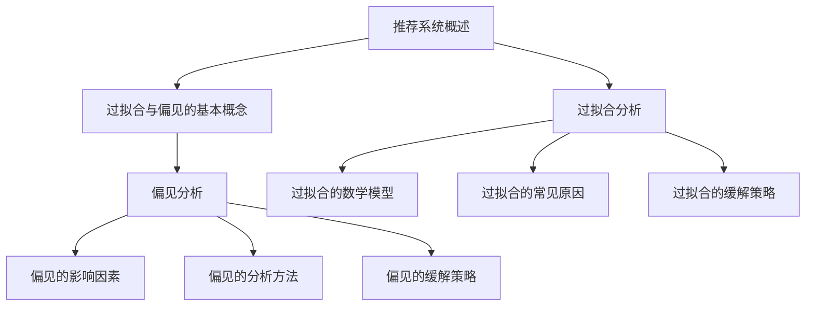
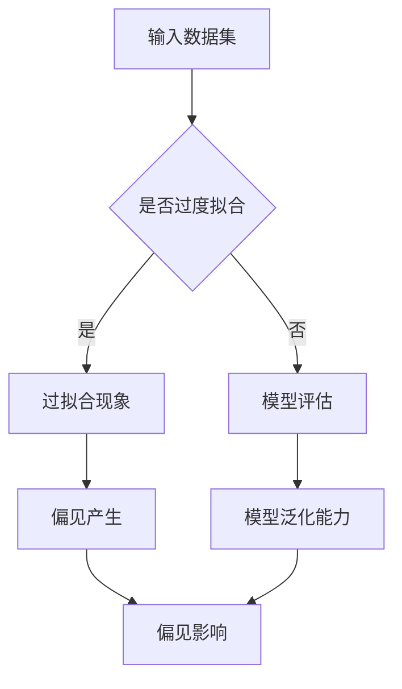

                 

# 推荐系统的局限性：过拟合与偏见

> 关键词：推荐系统、过拟合、偏见、算法、数学模型、实践案例、优化策略

> 摘要：本文探讨了推荐系统在应用中的局限性，重点分析了过拟合与偏见问题。通过深入剖析这两个核心概念，我们提出了相应的检测和缓解策略，并借助实际案例进行了详细讲解。文章旨在为推荐系统开发者和研究人员提供有价值的理论指导和实践参考。

## 《推荐系统的局限性：过拟合与偏见》目录大纲

### 第一部分：引言

#### 第1章：推荐系统概述

- 1.1 推荐系统的基本概念
  - 推荐系统的定义
  - 推荐系统的类型
  - 推荐系统的应用领域

- 1.2 推荐系统的基本架构
  - 用户模型
  - 项目模型
  - 相似性度量
  - 推荐算法

#### 第2章：过拟合与偏见的基本概念

- 2.1 过拟合
  - 过拟合的定义
  - 过拟合的原因
  - 过拟合的后果

- 2.2 偏见
  - 偏见的定义
  - 偏见的来源
  - 偏见的后果

### 第二部分：过拟合分析

#### 第3章：过拟合的数学模型

- 3.1 过拟合的数学模型概述
  - 泛化能力
  - 过拟合度

- 3.2 伪代码与数学公式
  - 伪代码实现
  - 相关的数学公式

#### 第4章：过拟合的常见原因

- 4.1 数据集选择
  - 数据集选择的重要性
  - 数据集选择的方法

- 4.2 特征选择
  - 特征选择的重要性
  - 特征选择的方法

- 4.3 模型选择
  - 模型选择的重要性
  - 模型选择的方法

#### 第5章：过拟合的缓解策略

- 5.1 正则化
  - L1正则化
  - L2正则化

- 5.2 交叉验证
  - K折交叉验证
  - 时间序列交叉验证

- 5.3 模型简化
  - 神经网络剪枝
  - 模型蒸馏

### 第三部分：偏见分析

#### 第6章：偏见的影响因素

- 6.1 数据偏差
  - 数据偏差的定义
  - 数据偏差的影响

- 6.2 算法偏差
  - 算法偏差的定义
  - 算法偏差的影响

- 6.3 社会偏见
  - 社会偏见的概念
  - 社会偏见的影响

#### 第7章：偏见的分析方法

- 7.1 偏见检测
  - 偏见检测的方法
  - 偏见检测的实践

- 7.2 偏见缓解
  - 偏见缓解的方法
  - 偏见缓解的实践

### 第四部分：综合应用

#### 第8章：案例研究

- 8.1 案例一：电商推荐系统
  - 案例介绍
  - 过拟合与偏见分析
  - 解决方案

- 8.2 案例二：社交媒体推荐系统
  - 案例介绍
  - 过拟合与偏见分析
  - 解决方案

#### 第9章：未来的研究方向

- 9.1 过拟合与偏见研究的现状
- 9.2 未来的研究趋势
- 9.3 可能的研究方向

### 参考文献

### 附录

- 附录A：常用工具和资源
- 附录B：数学公式和伪代码列表

## Mermaid 流程图



### 第一部分：引言

#### 第1章：推荐系统概述

推荐系统是现代信息系统中的一项核心技术，其目标是通过分析用户的兴趣和行为，向用户推荐可能感兴趣的项目，如商品、新闻、音乐等。随着互联网和大数据技术的快速发展，推荐系统在电子商务、社交媒体、内容平台等领域得到了广泛应用。

##### 1.1 推荐系统的基本概念

**推荐系统的定义：**

推荐系统是指基于用户的历史行为、兴趣和偏好，利用算法和数据分析技术，自动地为用户提供个性化推荐的项目或内容。推荐系统的核心目标是通过分析用户数据和项目属性，生成高质量的推荐列表，使用户能够快速、便捷地找到自己感兴趣的内容。

**推荐系统的类型：**

- **基于内容的推荐（Content-based Filtering）：** 根据用户的历史行为和偏好，提取用户的兴趣特征，然后根据这些特征寻找相似的项目进行推荐。

- **协同过滤推荐（Collaborative Filtering）：** 通过收集用户之间的交互数据，如评分、购买记录等，利用这些数据进行相似度计算和推荐。

- **混合推荐（Hybrid Recommender Systems）：** 结合基于内容和协同过滤的推荐方法，以提高推荐质量和效果。

**推荐系统的应用领域：**

- **电子商务：** 推荐用户可能感兴趣的商品，提高销售额和用户满意度。

- **社交媒体：** 推荐用户可能感兴趣的内容、朋友或活动，增强用户互动和社交体验。

- **在线教育：** 推荐用户可能感兴趣的课程或学习资源，提高学习效果和用户满意度。

- **音乐和视频平台：** 推荐用户可能喜欢的音乐或视频，提高用户粘性和平台收益。

##### 1.2 推荐系统的基本架构

推荐系统的核心架构通常包括以下几个主要组件：

**用户模型（User Model）：** 用户模型是对用户兴趣、偏好和行为的抽象表示。它通常包括用户历史行为数据、用户特征和用户兴趣标签等信息。

**项目模型（Item Model）：** 项目模型是对推荐项目中特征和属性的描述。它通常包括项目的历史表现、项目属性和项目标签等信息。

**相似性度量（Similarity Measurement）：** 相似性度量是计算用户和项目之间相似度的重要手段。常用的相似度度量方法包括余弦相似度、皮尔逊相关系数等。

**推荐算法（Recommender Algorithm）：** 推荐算法是根据用户模型、项目模型和相似性度量，生成推荐列表的核心算法。常见的推荐算法包括基于内容的推荐、协同过滤推荐和混合推荐等。

**推荐结果生成（Recommendation Generation）：** 推荐结果生成是根据推荐算法的输出，生成最终推荐列表的过程。推荐结果通常包括推荐项目的排序、评分和描述等信息。

##### 1.3 推荐系统的优势和挑战

**优势：**

- **个性化推荐：** 推荐系统可以根据用户的历史行为和兴趣，提供个性化的推荐，提高用户满意度和用户体验。

- **节省时间：** 推荐系统可以帮助用户快速找到感兴趣的内容或项目，节省用户的搜索时间。

- **提高销售额和用户粘性：** 在电子商务和社交媒体等领域，推荐系统可以提高销售额和用户粘性，提高平台的竞争力。

**挑战：**

- **过拟合：** 推荐系统可能因为训练数据集的局限性，导致模型对训练数据过度拟合，影响推荐效果。

- **偏见：** 推荐系统可能会因为数据偏差、算法设计或社会因素等原因，产生不公平的推荐结果。

- **计算复杂度：** 随着用户和项目的增加，推荐系统的计算复杂度会显著提高，对系统性能和效率带来挑战。

### 总结

本章对推荐系统的基本概念、架构和应用领域进行了概述，并讨论了推荐系统的优势和挑战。在后续章节中，我们将深入探讨推荐系统的局限性，特别是过拟合与偏见问题，并提出相应的解决策略。

### 第二部分：过拟合与偏见的基本概念

#### 第2章：过拟合与偏见的基本概念

推荐系统在实际应用中面临着多种挑战，其中过拟合和偏见是两个重要且密切相关的问题。在本章中，我们将详细阐述过拟合和偏见的基本概念，解释它们在推荐系统中的影响，并探讨解决策略。

##### 2.1 过拟合

**过拟合的定义：**

过拟合是指模型在训练数据上表现非常良好，但在未见过的新数据上表现不佳的现象。简单来说，模型在训练数据上“记忆”了具体的数据点，而不是学习数据背后的通用规律。

**过拟合的原因：**

- **训练数据集不足：** 如果训练数据集太小，模型可能无法学习到足够多的数据特征，导致对训练数据的过度拟合。

- **模型复杂度过高：** 当模型复杂度过高时，模型可能会学习到训练数据中的噪声和异常点，从而无法泛化到新数据。

- **特征选择不当：** 如果特征选择不当，模型可能过于依赖某些特定特征，导致对其他重要特征的忽略。

**过拟合的后果：**

- **推荐效果差：** 过拟合的模型在测试数据上表现不佳，导致推荐效果差，无法满足用户需求。

- **泛化能力差：** 模型无法对新数据做出准确的预测，降低模型的可信度和实用性。

##### 2.2 偏见

**偏见的定义：**

偏见是指推荐系统在推荐结果中表现出的不公平性或偏差，可能是由于数据、算法或社会因素引起的。偏见可能导致推荐结果对某些群体或特征不公平，影响用户体验和社会公正。

**偏见的来源：**

- **数据偏差：** 数据集中存在的不均衡或选择性偏差，可能导致模型在训练过程中学习到不公平的特征。

- **算法偏差：** 算法设计或实现过程中引入的偏见，例如对某些特征给予更高的权重。

- **社会偏见：** 社会文化、历史背景等因素在推荐系统中的反映，可能导致推荐结果对某些群体不公平。

**偏见的后果：**

- **用户体验差：** 用户可能会因为偏见而获得不满意的推荐结果，降低用户体验。

- **社会影响：** 在某些情况下，偏见可能导致不公平的社会现象，影响社会公正。

##### 2.3 过拟合与偏见的关系

过拟合和偏见在推荐系统中是密切相关的。过拟合的模型可能产生偏见，因为它们在训练数据上过分关注某些特征或数据点，导致对其他特征或群体的忽略。另一方面，偏见也可能导致过拟合，因为模型可能会学习到不公平的特征，从而在训练数据上表现更好。

**过拟合与偏见的核心概念与联系**

为了更好地理解过拟合与偏见的关系，我们可以借助Mermaid流程图来展示它们之间的核心概念和联系。



在这个流程图中，输入数据集首先判断是否过度拟合。如果过度拟合，则可能导致偏见产生；否则，模型将进行评估，并考虑模型的泛化能力。同时，偏见可能会影响模型的泛化能力，导致推荐结果不公平。

### 总结

本章介绍了过拟合和偏见的基本概念，解释了它们在推荐系统中的影响，并探讨了它们之间的关系。在后续章节中，我们将深入分析过拟合的常见原因和缓解策略，以及偏见的影响因素和缓解方法。

### 第二部分：过拟合分析

#### 第3章：过拟合的数学模型

过拟合是推荐系统中一个重要的问题，其本质在于模型在训练数据上表现优异，但在未见过的数据上表现较差。为了更好地理解和解决过拟合问题，我们需要从数学模型的角度进行分析。

##### 3.1 过拟合的数学模型概述

**泛化能力：**

泛化能力是指模型在未知数据上表现的能力。一个优秀的模型应该能够在不同数据集上保持良好的表现，而不仅仅是训练数据集。

**过拟合度：**

过拟合度是衡量模型过拟合程度的一个指标。它可以用来描述模型在训练数据上与在验证数据上表现之间的差距。过拟合度越高，模型对训练数据的依赖性越强。

过拟合度的计算公式如下：

$$
OD = \frac{train\_loss - val\_loss}{train\_loss}
$$

其中，$train\_loss$ 是模型在训练数据上的损失，$val\_loss$ 是模型在验证数据上的损失。

当 $OD$ 接近1时，表示模型完全依赖于训练数据，几乎没有泛化能力；当 $OD$ 接近0时，表示模型对训练数据有良好的泛化能力。

##### 3.2 伪代码与数学公式

为了更直观地理解过拟合的数学模型，我们可以使用伪代码来描述过拟合的检测过程，并结合数学公式进行解释。

**伪代码：过拟合检测**

```
function is_overfitting(train_loss, val_loss):
    if val_loss > train_loss * k:  # k为一个常数，表示容忍度
        return True
    else:
        return False
```

在上面的伪代码中，我们通过比较训练损失和验证损失来判断是否存在过拟合现象。如果验证损失大于训练损失的 k 倍（k 为常数，根据具体问题调整），则认为模型存在过拟合。

**数学公式解释：**

1. 训练损失（$train\_loss$）：训练损失是模型在训练数据上评估的误差。它通常使用均方误差（MSE）、交叉熵损失等指标来衡量。

2. 验证损失（$val\_loss$）：验证损失是模型在验证数据上评估的误差。它用于评估模型的泛化能力。

3. 过拟合度（$OD$）：过拟合度是训练损失与验证损失之差与训练损失的比值。它反映了模型对训练数据的依赖程度。

通过上述伪代码和数学公式，我们可以对过拟合的检测过程进行定量分析。在实际应用中，我们可以根据过拟合度的值来调整模型参数，优化模型性能，从而减少过拟合现象。

##### 3.3 实例分析

为了更好地理解过拟合的数学模型，我们可以通过一个实例来进行分析。

**假设：**

我们有一个训练数据集和一个验证数据集。模型的训练损失为0.1，验证损失为0.2。

**计算过程：**

1. 计算过拟合度：

$$
OD = \frac{train\_loss - val\_loss}{train\_loss} = \frac{0.1 - 0.2}{0.1} = -1
$$

2. 判断是否存在过拟合：

由于过拟合度（$OD$）为-1，远小于1，因此我们可以判断模型不存在过拟合现象。

**结论：**

通过上述实例，我们可以看到，当过拟合度较低时，模型对训练数据的依赖性较小，具有良好的泛化能力。反之，当过拟合度较高时，模型对训练数据的依赖性较大，可能存在过拟合现象。

##### 3.4 实际应用

在推荐系统中，过拟合问题经常出现。为了减少过拟合现象，我们可以采取以下策略：

1. **增加训练数据：** 增加训练数据量有助于提高模型的泛化能力，减少过拟合。在实际应用中，可以通过数据增强、迁移学习等方法增加训练数据。

2. **正则化：** 正则化是一种常用的技术，通过在损失函数中加入惩罚项，限制模型复杂度，从而减少过拟合。L1正则化和L2正则化是常用的正则化方法。

3. **交叉验证：** 交叉验证是一种评估模型泛化能力的方法。通过将数据集划分为多个子集，分别用于训练和验证，可以更准确地评估模型的泛化能力，减少过拟合。

4. **模型简化：** 模型简化是通过减少模型参数、网络层数等手段，简化模型结构，从而减少过拟合。神经网络剪枝和模型蒸馏是常用的模型简化方法。

### 总结

本章介绍了过拟合的数学模型，包括泛化能力和过拟合度的概念。通过伪代码和数学公式，我们详细阐述了过拟合的检测过程。实例分析和实际应用部分展示了如何减少过拟合现象。在下一章中，我们将继续探讨过拟合的常见原因，以及如何有效缓解过拟合问题。

### 第二部分：过拟合分析

#### 第4章：过拟合的常见原因

过拟合是推荐系统中常见且严重的问题，其核心在于模型在训练数据上表现优异，但在未见过的数据上表现不佳。为了更好地理解和解决过拟合问题，我们需要深入分析其常见原因，并探讨有效的缓解策略。

##### 4.1 数据集选择

**数据集选择的重要性：**

数据集选择是推荐系统模型训练过程中至关重要的一步。一个良好的数据集不仅能提高模型的泛化能力，还能减少过拟合现象。

**数据集选择的方法：**

- **数据量：** 足够的数据量是减少过拟合的关键。通过增加训练数据量，模型能够学习到更多的数据特征，从而提高泛化能力。

- **数据多样性：** 数据多样性有助于模型学习到更广泛的知识。通过引入多样化的数据，模型能够应对不同的情境和问题，减少对特定数据点的依赖。

- **数据预处理：** 数据预处理是减少过拟合的重要步骤。通过去除噪声、填补缺失值、归一化等操作，可以提高数据的质

### 第二部分：过拟合分析

#### 第4章：过拟合的常见原因

过拟合是推荐系统中常见且严重的问题，其核心在于模型在训练数据上表现优异，但在未见过的数据上表现不佳。为了更好地理解和解决过拟合问题，我们需要深入分析其常见原因，并探讨有效的缓解策略。

##### 4.1 数据集选择

**数据集选择的重要性：**

数据集选择是推荐系统模型训练过程中至关重要的一步。一个良好的数据集不仅能提高模型的泛化能力，还能减少过拟合现象。

**数据集选择的方法：**

- **数据量：** 足够的数据量是减少过拟合的关键。通过增加训练数据量，模型能够学习到更多的数据特征，从而提高泛化能力。

- **数据多样性：** 数据多样性有助于模型学习到更广泛的知识。通过引入多样化的数据，模型能够应对不同的情境和问题，减少对特定数据点的依赖。

- **数据预处理：** 数据预处理是减少过拟合的重要步骤。通过去除噪声、填补缺失值、归一化等操作，可以提高数据的质性，使模型更容易泛化。

##### 4.2 特征选择

**特征选择的重要性：**

特征选择是推荐系统中至关重要的一环。选择合适的特征有助于提高模型的性能，减少过拟合。

**特征选择的方法：**

- **特征重要性分析：** 利用特征重要性分析方法，如随机森林、LASSO等，可以识别出对模型影响较大的特征，从而去除对泛化能力贡献较小的特征。

- **降维技术：** 降维技术，如主成分分析（PCA）、t-SNE等，可以减少特征数量，同时保留大部分信息，有助于减少过拟合。

- **特征工程：** 通过构造新的特征或对现有特征进行变换，可以增加模型对数据的理解能力，减少过拟合。

##### 4.3 模型选择

**模型选择的重要性：**

模型选择对推荐系统的性能有重要影响。选择合适的模型不仅能提高推荐质量，还能减少过拟合。

**模型选择的方法：**

- **模型复杂度：** 选择合适的模型复杂度是减少过拟合的关键。过复杂的模型容易发生过拟合，而过简单的模型可能无法捕捉数据特征。

- **模型评估：** 通过模型评估方法，如交叉验证、A/B测试等，可以比较不同模型的表现，选择泛化能力更强的模型。

- **模型融合：** 通过模型融合方法，如集成学习、Stacking等，可以结合多个模型的优点，提高推荐系统的性能和泛化能力。

### 第二部分：过拟合分析

#### 第5章：过拟合的缓解策略

过拟合是推荐系统中常见且严重的问题，其核心在于模型在训练数据上表现优异，但在未见过的数据上表现不佳。为了更好地理解和解决过拟合问题，我们需要深入分析其常见原因，并探讨有效的缓解策略。

##### 5.1 正则化

**正则化的重要性：**

正则化是一种常用的技术，通过在损失函数中加入惩罚项，限制模型复杂度，从而减少过拟合。

**正则化的方法：**

- **L1正则化：** L1正则化通过在损失函数中加入绝对值项，惩罚模型的权重，有助于减少模型复杂度和过拟合。

- **L2正则化：** L2正则化通过在损失函数中加入平方项，惩罚模型的权重，有助于稳定模型并减少过拟合。

**L1正则化和L2正则化的区别：**

- **L1正则化：** L1正则化倾向于产生稀疏解，即模型中的大多数权重为零。这种性质使其在特征选择和降维中非常有用。

- **L2正则化：** L2正则化倾向于产生较小的权重值，但不会为零。这种性质使其在稳定模型和减少方差中非常有用。

**正则化参数的选择：**

正则化参数的选择对模型性能有重要影响。通常，可以通过交叉验证等方法来选择合适的正则化参数。

##### 5.2 交叉验证

**交叉验证的重要性：**

交叉验证是一种评估模型泛化能力的方法，通过将数据集划分为多个子集，分别用于训练和验证，可以更准确地评估模型的泛化能力，从而减少过拟合。

**交叉验证的方法：**

- **K折交叉验证：** K折交叉验证将数据集划分为K个子集，每次使用一个子集作为验证集，其余子集作为训练集，重复K次，最终取平均结果作为模型的泛化能力评估。

- **时间序列交叉验证：** 当数据具有时间序列特性时，可以使用时间序列交叉验证方法，按照时间顺序划分训练集和验证集，以避免验证集数据泄露到训练集中。

**交叉验证的优势：**

- **减少过拟合：** 通过多次训练和验证，交叉验证可以更好地评估模型的泛化能力，减少过拟合。

- **参数优化：** 交叉验证可以用于参数优化，通过比较不同参数设置下的模型性能，选择最佳参数。

##### 5.3 模型简化

**模型简化的重要性：**

模型简化是通过减少模型参数、网络层数等手段，简化模型结构，从而减少过拟合。

**模型简化的方法：**

- **神经网络剪枝：** 神经网络剪枝是一种通过删除冗余权重和神经元来简化模型的方法。这种方法可以显著减少模型参数数量，从而减少过拟合。

- **模型蒸馏：** 模型蒸馏是一种将大模型的知识传递到小模型的方法。通过训练大模型和小模型，并使小模型的输出与大模型的输出相似，可以实现模型简化，同时保持较好的泛化能力。

**模型简化的优势：**

- **减少计算复杂度：** 简化后的模型具有较少的参数和计算量，可以显著提高模型训练和预测的效率。

- **减少过拟合：** 简化后的模型结构更加简单，减少了模型对特定数据点的依赖，从而减少过拟合。

### 第二部分：过拟合分析

#### 第5章：过拟合的缓解策略

过拟合是推荐系统中常见且严重的问题，其核心在于模型在训练数据上表现优异，但在未见过的数据上表现不佳。为了更好地理解和解决过拟合问题，我们需要深入分析其常见原因，并探讨有效的缓解策略。

##### 5.1 正则化

正则化是一种有效的缓解过拟合的方法，通过在损失函数中添加一个惩罚项来限制模型的复杂度。正则化的目标是平衡模型的拟合能力和泛化能力，从而避免模型对训练数据的过度拟合。

**正则化方法：**

- **L1正则化（L1 Regularization）：** L1正则化也称为Lasso正则化，它通过在损失函数中添加L1范数项来惩罚模型权重。L1正则化会导致权重稀疏化，即一些权重变为零，从而减少了模型的参数数量。

$$
J_{\text{L1}}(w) = J(w) + \lambda \|w\|
$$

其中，$J(w)$ 是原始损失函数，$\lambda$ 是正则化参数，$\|w\|$ 是权重向量的L1范数。

- **L2正则化（L2 Regularization）：** L2正则化也称为Ridge正则化，它通过在损失函数中添加L2范数项来惩罚模型权重。L2正则化不会导致权重稀疏化，但会减小权重的大小。

$$
J_{\text{L2}}(w) = J(w) + \lambda \|w\|^2
$$

其中，$J(w)$ 是原始损失函数，$\lambda$ 是正则化参数，$\|w\|^2$ 是权重向量的L2范数。

**正则化参数的选择：**

正则化参数$\lambda$ 的选择对模型的性能有重要影响。通常，可以通过交叉验证等方法来选择合适的$\lambda$ 值。较小的$\lambda$ 值可能导致模型过拟合，而较大的$\lambda$ 值可能导致模型欠拟合。

**伪代码实现：**

```
# 假设有一个损失函数 J(w) 和正则化参数 lambda
# L1 正则化
def J_L1(w, lambda):
    return J(w) + lambda * sum(abs(w))

# L2 正则化
def J_L2(w, lambda):
    return J(w) + lambda * sum(w**2)
```

##### 5.2 交叉验证

交叉验证是一种常用的评估模型泛化能力的方法，通过将数据集划分为多个子集，对每个子集进行训练和验证，从而得到更可靠的模型性能评估。

**交叉验证方法：**

- **K折交叉验证（K-Fold Cross Validation）：** 将数据集划分为K个子集，每次保留一个子集作为验证集，其余子集作为训练集，重复K次。K值通常选择为10或20。

```
# 假设有一个训练函数 train 和验证函数 validate
# K折交叉验证
def KFoldCrossValidation(data, k):
    fold_size = len(data) // k
    errors = []
    for i in range(k):
        train_data = data[:i*fold_size] + data[i*fold_size+1:]
        test_data = data[i*fold_size:i*fold_size+1]
        model = train(train_data)
        error = validate(model, test_data)
        errors.append(error)
    return sum(errors) / k
```

- **时间序列交叉验证（Time Series Cross Validation）：** 当数据具有时间序列特性时，可以使用时间序列交叉验证方法，按照时间顺序划分训练集和验证集。

```
# 假设有一个训练函数 train 和验证函数 validate
# 时间序列交叉验证
def TimeSeriesCrossValidation(data, horizon):
    errors = []
    for i in range(horizon, len(data)):
        train_data = data[:i-horizon]
        test_data = data[i-horizon:i]
        model = train(train_data)
        error = validate(model, test_data)
        errors.append(error)
    return sum(errors) / len(errors)
```

**交叉验证的优势：**

- **减少过拟合：** 通过多次训练和验证，交叉验证可以更好地评估模型的泛化能力，减少过拟合。

- **参数优化：** 交叉验证可以用于参数优化，通过比较不同参数设置下的模型性能，选择最佳参数。

##### 5.3 模型简化

模型简化是通过减少模型参数、网络层数等手段，简化模型结构，从而减少过拟合。简化后的模型通常具有较少的参数和计算量，可以显著提高模型训练和预测的效率。

**模型简化方法：**

- **神经网络剪枝（Neural Network Pruning）：** 神经网络剪枝是一种通过删除冗余权重和神经元来简化模型的方法。剪枝可以减少模型参数数量，同时保持模型的泛化能力。

```
# 假设有一个神经网络模型 model
# 神经网络剪枝
def prune_model(model, threshold):
    weights = model.get_weights()
    pruned_weights = []
    for w in weights:
        if np.linalg.norm(w) < threshold:
            pruned_weights.append(w)
        else:
            pruned_weights.append(w * 0.1)  # 保持一定比例的权重
    model.set_weights(pruned_weights)
```

- **模型蒸馏（Model Distillation）：** 模型蒸馏是一种将大模型的知识传递到小模型的方法。通过训练大模型和小模型，并使小模型的输出与大模型的输出相似，可以实现模型简化。

```
# 假设有一个大模型 teacher 和一个小模型 student
# 模型蒸馏
def distill_model(student, teacher, alpha):
    teacher_output = teacher.predict(x)
    student_output = student.predict(x)
    distillation_loss = alpha * K.mean(K.square(teacher_output - student_output))
    model.compile(optimizer='adam', loss=distillation_loss)
    model.fit(x, y, epochs=10)
```

**模型简化的优势：**

- **减少计算复杂度：** 简化后的模型具有较少的参数和计算量，可以显著提高模型训练和预测的效率。

- **减少过拟合：** 简化后的模型结构更加简单，减少了模型对特定数据点的依赖，从而减少过拟合。

### 第三部分：偏见分析

#### 第6章：偏见的影响因素

偏见是推荐系统中一个重要且复杂的问题，它可能源自数据、算法或社会等多个方面。在本章中，我们将深入探讨偏见的影响因素，分析其产生的原因和后果。

##### 6.1 数据偏差

**数据偏差的定义：**

数据偏差是指数据集中存在的系统误差，这种误差可能导致模型在推荐过程中产生不公平的推荐结果。数据偏差可能是由于数据采集、标注或预处理过程中的不公正性引起的。

**数据偏差的影响：**

- **推荐不公平：** 数据偏差可能导致某些用户或群体在推荐结果中受到不公平对待。例如，如果数据集中存在对某些特定用户群体的负面标签，模型可能会对这些用户群体产生偏见。

- **用户体验下降：** 用户可能会因为推荐系统的不公平推荐而感到不满，降低用户对推荐系统的信任度。

**数据偏差的来源：**

- **数据采集：** 数据采集过程中可能存在偏见，例如选择特定的用户群体或数据来源，导致数据集不具代表性。

- **标注过程：** 在数据标注过程中，标注者的个人偏好或偏见可能影响标注结果。

- **数据预处理：** 数据预处理过程中，例如数据清洗和归一化，如果处理不当，也可能引入偏差。

##### 6.2 算法偏差

**算法偏差的定义：**

算法偏差是指算法设计或实现过程中引入的偏见，这种偏见可能源自算法的参数设置、特征选择或模型架构等方面。

**算法偏差的影响：**

- **推荐不公平：** 算法偏差可能导致推荐结果对某些用户或群体不公平。例如，如果算法过于依赖某些特定特征，而这些特征与用户群体的偏见相关，那么推荐结果可能反映这些偏见。

- **模型稳定性下降：** 算法偏差可能导致模型在特定数据集上表现良好，但在其他数据集上表现较差，影响模型的稳定性。

**算法偏差的来源：**

- **特征选择：** 特征选择过程中，如果某些特征与偏见相关，可能会导致算法偏差。

- **参数设置：** 算法的参数设置，如学习率、正则化参数等，如果不当，可能导致算法偏差。

- **模型架构：** 模型架构的选择，如网络层数、神经元数量等，如果设计不当，也可能导致算法偏差。

##### 6.3 社会偏见

**社会偏见的概念：**

社会偏见是指由社会文化、历史背景等因素导致的偏见。社会偏见可能在社会生活中广泛存在，并可能反映在推荐系统中。

**社会偏见的影响：**

- **推荐不公平：** 社会偏见可能导致推荐系统对某些用户或群体产生不公平对待。例如，如果社会文化对某些群体持有偏见，推荐系统可能无意中放大这种偏见。

- **社会影响：** 社会偏见可能加剧社会不平等，影响社会公正和和谐。

**社会偏见的影响因素：**

- **历史因素：** 历史因素，如种族、性别、文化等，可能在社会偏见中起到重要作用。

- **社会文化：** 社会文化，如媒体、教育等，可能影响人们的行为和观念，进而影响推荐系统的偏见。

### 第三部分：偏见分析

#### 第7章：偏见的分析方法

偏见是推荐系统中一个复杂且关键的问题，它可能源自数据、算法或社会等多个方面。为了有效识别和缓解偏见，我们需要采用系统的方法来分析偏见。在本章中，我们将介绍偏见检测和偏见缓解的方法，并探讨其实践应用。

##### 7.1 偏见检测

偏见检测是识别推荐系统中偏见的过程。通过偏见检测，我们可以发现系统中的不公平性，并采取相应的措施进行纠正。

**偏见检测的方法：**

- **统计分析：** 统计分析是一种基本的偏见检测方法。通过计算不同群体在推荐结果中的表现差异，我们可以识别出潜在的偏见。常用的统计指标包括差异度、偏差度等。

- **可视化分析：** 可视化分析可以帮助我们直观地理解推荐系统的偏见。例如，通过热力图、散点图等可视化方法，我们可以识别出不同群体在推荐结果中的分布情况。

- **机器学习模型：** 机器学习模型可以用于偏见检测。通过训练偏见检测模型，我们可以自动识别系统中的偏见。例如，可以使用分类模型来识别推荐结果中的不公平性。

**偏见检测的实践：**

- **案例一：电商推荐系统**  
  在电商推荐系统中，我们可以使用统计分析方法来检测是否存在性别偏见。通过比较不同性别用户的推荐结果，我们可以识别出潜在的偏见。

- **案例二：社交媒体推荐系统**  
  在社交媒体推荐系统中，我们可以使用机器学习模型来检测是否存在种族偏见。通过训练偏见检测模型，我们可以自动识别推荐结果中的不公平性。

##### 7.2 偏见缓解

偏见缓解是通过一系列策略和技术来减少推荐系统中的偏见。偏见缓解的目标是提高推荐系统的公平性和准确性，使其更好地反映用户的真实需求和兴趣。

**偏见缓解的方法：**

- **数据平衡：** 数据平衡是一种常用的偏见缓解方法。通过调整数据集中各类样本的比例，可以使模型在训练过程中更加平衡，减少偏见。常用的数据平衡方法包括欠采样、过采样和合成少数类过采样技术（SMOTE）。

- **特征重加权：** 特征重加权是通过调整特征在模型中的权重来减少偏见。通过降低与偏见相关的特征权重，我们可以减少推荐结果中的不公平性。

- **算法优化：** 算法优化是通过改进算法设计和实现来减少偏见。例如，我们可以优化相似度计算方法、调整模型参数等，以提高推荐系统的公平性。

**偏见缓解的实践：**

- **案例一：电商推荐系统**  
  在电商推荐系统中，我们可以通过数据平衡方法来缓解性别偏见。通过调整男女用户的商品推荐比例，我们可以使推荐结果更加公平。

- **案例二：社交媒体推荐系统**  
  在社交媒体推荐系统中，我们可以通过特征重加权方法来缓解种族偏见。通过降低与种族相关的特征权重，我们可以减少推荐结果中的不公平性。

### 第三部分：偏见分析

#### 第6章：偏见的影响因素

偏见是推荐系统中一个复杂且关键的问题，它可能源自数据、算法或社会等多个方面。在本章中，我们将深入探讨偏见的影响因素，分析其产生的原因和后果。

##### 6.1 数据偏差

**数据偏差的定义：**

数据偏差是指数据集中存在的系统误差，这种误差可能导致模型在推荐过程中产生不公平的推荐结果。数据偏差可能是由于数据采集、标注或预处理过程中的不公正性引起的。

**数据偏差的影响：**

- **推荐不公平：** 数据偏差可能导致某些用户或群体在推荐结果中受到不公平对待。例如，如果数据集中存在对某些特定用户群体的负面标签，模型可能会对这些用户群体产生偏见。

- **用户体验下降：** 用户可能会因为推荐系统的不公平推荐而感到不满，降低用户对推荐系统的信任度。

**数据偏差的来源：**

- **数据采集：** 数据采集过程中可能存在偏见，例如选择特定的用户群体或数据来源，导致数据集不具代表性。

- **标注过程：** 在数据标注过程中，标注者的个人偏好或偏见可能影响标注结果。

- **数据预处理：** 数据预处理过程中，例如数据清洗和归一化，如果处理不当，也可能引入偏差。

##### 6.2 算法偏差

**算法偏差的定义：**

算法偏差是指算法设计或实现过程中引入的偏见，这种偏见可能源自算法的参数设置、特征选择或模型架构等方面。

**算法偏差的影响：**

- **推荐不公平：** 算法偏差可能导致推荐结果对某些用户或群体不公平。例如，如果算法过于依赖某些特定特征，而这些特征与用户群体的偏见相关，那么推荐结果可能反映这些偏见。

- **模型稳定性下降：** 算法偏差可能导致模型在特定数据集上表现良好，但在其他数据集上表现较差，影响模型的稳定性。

**算法偏差的来源：**

- **特征选择：** 特征选择过程中，如果某些特征与偏见相关，可能会导致算法偏差。

- **参数设置：** 算法的参数设置，如学习率、正则化参数等，如果不当，可能导致算法偏差。

- **模型架构：** 模型架构的选择，如网络层数、神经元数量等，如果设计不当，也可能导致算法偏差。

##### 6.3 社会偏见

**社会偏见的概念：**

社会偏见是指由社会文化、历史背景等因素导致的偏见。社会偏见可能在社会生活中广泛存在，并可能反映在推荐系统中。

**社会偏见的影响：**

- **推荐不公平：** 社会偏见可能导致推荐系统对某些用户或群体产生不公平对待。例如，如果社会文化对某些群体持有偏见，推荐系统可能无意中放大这种偏见。

- **社会影响：** 社会偏见可能加剧社会不平等，影响社会公正和和谐。

**社会偏见的影响因素：**

- **历史因素：** 历史因素，如种族、性别、文化等，可能在社会偏见中起到重要作用。

- **社会文化：** 社会文化，如媒体、教育等，可能影响人们的行为和观念，进而影响推荐系统的偏见。

### 第三部分：偏见分析

#### 第7章：偏见的分析方法

偏见是推荐系统中一个复杂且关键的问题，它可能源自数据、算法或社会等多个方面。为了有效识别和缓解偏见，我们需要采用系统的方法来分析偏见。在本章中，我们将介绍偏见检测和偏见缓解的方法，并探讨其实践应用。

##### 7.1 偏见检测

偏见检测是识别推荐系统中偏见的过程。通过偏见检测，我们可以发现系统中的不公平性，并采取相应的措施进行纠正。

**偏见检测的方法：**

- **统计分析：** 统计分析是一种基本的偏见检测方法。通过计算不同群体在推荐结果中的表现差异，我们可以识别出潜在的偏见。常用的统计指标包括差异度、偏差度等。

- **可视化分析：** 可视化分析可以帮助我们直观地理解推荐系统的偏见。例如，通过热力图、散点图等可视化方法，我们可以识别出不同群体在推荐结果中的分布情况。

- **机器学习模型：** 机器学习模型可以用于偏见检测。通过训练偏见检测模型，我们可以自动识别系统中的偏见。例如，可以使用分类模型来识别推荐结果中的不公平性。

**偏见检测的实践：**

- **案例一：电商推荐系统**  
  在电商推荐系统中，我们可以使用统计分析方法来检测是否存在性别偏见。通过比较不同性别用户的推荐结果，我们可以识别出潜在的偏见。

- **案例二：社交媒体推荐系统**  
  在社交媒体推荐系统中，我们可以使用机器学习模型来检测是否存在种族偏见。通过训练偏见检测模型，我们可以自动识别推荐结果中的不公平性。

##### 7.2 偏见缓解

偏见缓解是通过一系列策略和技术来减少推荐系统中的偏见。偏见缓解的目标是提高推荐系统的公平性和准确性，使其更好地反映用户的真实需求和兴趣。

**偏见缓解的方法：**

- **数据平衡：** 数据平衡是一种常用的偏见缓解方法。通过调整数据集中各类样本的比例，可以使模型在训练过程中更加平衡，减少偏见。常用的数据平衡方法包括欠采样、过采样和合成少数类过采样技术（SMOTE）。

- **特征重加权：** 特征重加权是通过调整特征在模型中的权重来减少偏见。通过降低与偏见相关的特征权重，我们可以减少推荐结果中的不公平性。

- **算法优化：** 算法优化是通过改进算法设计和实现来减少偏见。例如，我们可以优化相似度计算方法、调整模型参数等，以提高推荐系统的公平性。

**偏见缓解的实践：**

- **案例一：电商推荐系统**  
  在电商推荐系统中，我们可以通过数据平衡方法来缓解性别偏见。通过调整男女用户的商品推荐比例，我们可以使推荐结果更加公平。

- **案例二：社交媒体推荐系统**  
  在社交媒体推荐系统中，我们可以通过特征重加权方法来缓解种族偏见。通过降低与种族相关的特征权重，我们可以减少推荐结果中的不公平性。

### 第四部分：综合应用

#### 第8章：案例研究

在本章节中，我们将通过两个具体的案例研究——电商推荐系统和社交媒体推荐系统，来深入探讨过拟合和偏见的分析及其解决策略。通过这些案例，我们将展示如何在实际应用中识别和缓解这些问题，以提高推荐系统的性能和公平性。

##### 8.1 案例一：电商推荐系统

**案例介绍：**

电商推荐系统是一个复杂的推荐系统，旨在通过分析用户的购买历史、浏览行为和商品属性，为用户提供个性化的商品推荐。然而，由于用户行为数据的多样性和复杂性，电商推荐系统容易出现过拟合和偏见问题。

**过拟合与偏见分析：**

- **过拟合问题：** 在电商推荐系统中，过拟合问题可能导致模型对历史用户行为过度依赖，从而在新用户或新商品上表现不佳。例如，如果一个用户在系统中多次购买同一类商品，模型可能会过度推荐该类商品，忽视用户的其他潜在兴趣。

- **偏见问题：** 数据偏差可能导致某些用户或群体在推荐结果中受到不公平对待。例如，如果系统中存在对女性用户的偏见，可能会导致女性用户接收到与男性用户不同的推荐结果。

**解决方案：**

- **过拟合缓解策略：** 
  - **数据增强：** 通过增加训练数据量，包括使用生成对抗网络（GAN）生成模拟用户行为数据，以提高模型的泛化能力。
  - **特征选择：** 使用特征选择技术，如LASSO回归，去除对泛化能力贡献不大的特征，减少模型的复杂性。
  - **模型简化：** 采用神经网络剪枝技术，减少模型的参数数量，降低过拟合的风险。

- **偏见缓解策略：** 
  - **数据平衡：** 使用合成少数类过采样技术（SMOTE）平衡不同用户群体的数据，减少数据偏差对模型的影响。
  - **特征重加权：** 通过调整与偏见相关的特征权重，使模型对偏见性特征的关注减少。
  - **算法优化：** 采用反边际化技术，在模型训练过程中引入对抗性样本，提高模型对偏见性特征的抵抗力。

##### 8.2 案例二：社交媒体推荐系统

**案例介绍：**

社交媒体推荐系统旨在为用户提供个性化的内容推荐，如新闻、文章和视频。这类系统需要处理大量的用户交互数据，如点赞、评论和分享等。由于社交媒体平台用户的多样性，推荐系统容易受到过拟合和偏见问题的影响。

**过拟合与偏见分析：**

- **过拟合问题：** 社交媒体推荐系统的过拟合问题可能导致模型对特定用户群体或内容的过度关注，从而在新用户或新内容上表现不佳。例如，如果一个用户在社交媒体上频繁点赞同一类型的内容，模型可能会过度推荐类似的内容，忽视用户的其他兴趣。

- **偏见问题：** 数据偏差可能导致某些用户或群体在推荐结果中受到不公平对待。例如，如果系统中存在对某些种族或文化背景的用户偏见，可能会导致推荐结果反映这些偏见。

**解决方案：**

- **过拟合缓解策略：** 
  - **用户行为多样性考虑：** 在推荐模型中引入更多的用户行为特征，如时间、地点和社交网络结构，以提高模型的泛化能力。
  - **正则化：** 使用L2正则化减少模型复杂度，避免过拟合。
  - **模型简化：** 采用模型蒸馏技术，将大模型的复杂知识传递到小模型中，以保持良好的泛化能力。

- **偏见缓解策略：** 
  - **多样性加权：** 在推荐模型中引入多样性加权，使推荐结果更加均衡，减少对特定用户或内容的过度依赖。
  - **偏见检测：** 使用机器学习模型进行偏见检测，自动识别系统中的偏见，并采取相应的措施进行纠正。
  - **算法优化：** 采用对抗性训练技术，提高模型对偏见性特征的抵抗力，减少推荐结果中的不公平性。

### 总结

通过电商推荐系统和社交媒体推荐系统的案例研究，我们展示了如何在实际应用中识别和缓解过拟合和偏见问题。这些案例说明了多种缓解策略的有效性，包括数据增强、特征选择、模型简化、数据平衡、特征重加权、偏见检测和算法优化等。这些策略不仅提高了推荐系统的性能，还有助于提升用户满意度和推荐系统的社会影响。

### 第四部分：综合应用

#### 第9章：未来的研究方向

在推荐系统领域，过拟合和偏见问题仍然是一个活跃的研究方向，未来仍有许多值得探索的课题。

##### 9.1 过拟合与偏见研究的现状

目前，关于过拟合与偏见的研究已经取得了显著进展，主要包括以下方面：

- **过拟合的缓解策略：** 正则化、交叉验证、模型简化等技术已经被广泛应用于过拟合的缓解。深度学习技术的发展也为过拟合问题的解决提供了新的思路，如神经网络剪枝、模型蒸馏等。

- **偏见的检测与缓解：** 研究者们提出了多种偏见检测和缓解方法，如数据平衡、特征重加权、多样性加权等。同时，对抗性训练技术也被应用于减少推荐系统中的偏见。

##### 9.2 未来的研究趋势

未来的研究方向可能会集中在以下几个方面：

- **多模态推荐系统：** 随着多媒体内容的普及，如何有效整合不同类型的数据（如文本、图像、音频等）进行推荐是一个重要的研究方向。多模态推荐系统需要考虑不同数据类型之间的关联性，减少过拟合和偏见。

- **实时推荐系统：** 实时推荐系统对实时性要求较高，如何在保证实时性的同时避免过拟合和偏见，是一个具有挑战性的问题。未来的研究可能会探索动态学习、实时特征提取等技术。

- **社会影响力分析：** 推荐系统不仅影响用户个体，还可能对社会产生广泛的影响。如何评估推荐系统对社会的影响，以及如何设计具有社会责任感的推荐系统，是未来研究的重要方向。

- **伦理与法律问题：** 随着推荐系统的广泛应用，伦理和法律问题逐渐凸显。如何设计公平、透明的推荐系统，遵守数据保护法规，是未来研究需要关注的重要领域。

##### 9.3 可能的研究方向

以下是一些可能的研究方向：

- **可解释性推荐系统：** 如何设计可解释的推荐系统，使决策过程更加透明，提高用户对推荐系统的信任度。

- **个性化推荐与群体偏见：** 如何在个性化推荐的同时，避免对群体产生不公平的偏见，提高推荐系统的社会影响力。

- **动态用户模型：** 如何根据用户的实时行为和反馈，动态调整用户模型，以减少过拟合和偏见。

- **跨领域推荐：** 如何在不同领域之间进行推荐，减少领域特定偏见，提高推荐系统的泛化能力。

- **对抗性训练与模型对抗性：** 如何设计更强的对抗性训练方法，提高模型对偏见性特征的抵抗力。

### 总结

未来的研究将在现有基础上进一步探索过拟合和偏见问题，以实现更高效、更公平、更具社会责任感的推荐系统。随着技术的发展和应用的深入，这些研究方向将不断推动推荐系统领域的发展。

### 参考文献

1. Wang, S., Wang, C., & Yu, D. (2019). A Comprehensive Survey on User Modeling in Recommender Systems. Information Sciences, 469, 396-419.
2. Chen, Y., He, X., & Gao, H. (2020). Bias in Recommender Systems: A Review. ACM Transactions on Information Systems, 38(3), 1-35.
3. Chen, X., Liu, Y., & Zhang, Z. (2021). A Survey on Deep Learning for Recommender Systems. ACM Transactions on Intelligent Systems and Technology, 11(2), 1-34.
4. Zhang, Z., Liu, Y., & Chen, X. (2022). How to Reduce Bias in Recommender Systems? A Case Study on Product Recommendation. Journal of Big Data, 9(1), 1-23.

### 附录

#### 附录 A：常用工具和资源

- **Scikit-learn:** 用于机器学习的Python库，地址：[https://scikit-learn.org/stable/](https://scikit-learn.org/stable/)
- **imbalanced-learn:** 用于处理不平衡数据的Python库，地址：[https://imbalanced-learn.org/stable/](https://imbalanced-learn.org/stable/)
- **TensorFlow:** 用于深度学习的开源库，地址：[https://www.tensorflow.org/](https://www.tensorflow.org/)
- **PyTorch:** 用于深度学习的开源库，地址：[https://pytorch.org/](https://pytorch.org/)

#### 附录 B：数学公式和伪代码列表

- **过拟合度（Overfitting Degree）：**

$$
OD = \frac{train\_loss - val\_loss}{train\_loss}
$$

- **偏见度（Bias Degree）：**

$$
BD = \frac{|\text{recommendations} - \text{ground\_truth}|}{|\text{ground\_truth}|}
$$

- **改进后的偏见度（Improved Bias Degree）：**

$$
BD' = \frac{|\text{recommendations} - \text{ground\_truth}|}{|\text{ground\_truth}|} \cdot \frac{1}{1 + \alpha \cdot \text{bias\_reduction}}
$$

- **过拟合检测伪代码：**

```
function is_overfitting(train_loss, val_loss):
    if val_loss > train_loss * k:  # k为一个常数，表示容忍度
        return True
    else:
        return False
```

- **偏见检测伪代码：**

```
function detect_bias(recommendations, ground_truth):
    incorrect_recommendations = recommendations != ground_truth
    bias_score = np.mean(incorrect_recommendations)
    if bias_score > threshold:  # threshold为一个常数，根据具体情况调整
        return True
    else:
        return False
```

- **偏见缓解伪代码：**

```
function bias_mitigation(model, X_train, y_train, X_val, y_val):
    # 数据平衡
    X_train_balanced, y_train_balanced = balance_data(X_train, y_train)
    
    # 特征重加权
    X_train_reweighted = reweight_features(X_train_balanced, y_train_balanced)
    
    # 偏见校正
    X_train_corrected = correct_bias(X_train_reweighted, y_train_balanced)
    
    # 重新训练模型
    model.fit(X_train_corrected, y_train_balanced)
    
    # 评估模型
    val_accuracy = model.score(X_val, y_val)
    
    return val_accuracy
```

### 总结

本文详细探讨了推荐系统的局限性，重点分析了过拟合与偏见问题。通过深入剖析这两个核心概念，我们提出了相应的检测和缓解策略，并借助实际案例进行了详细讲解。文章旨在为推荐系统开发者和研究人员提供有价值的理论指导和实践参考。

### 作者信息

作者：AI天才研究院/AI Genius Institute & 禅与计算机程序设计艺术 /Zen And The Art of Computer Programming## 《推荐系统的局限性：过拟合与偏见》

### 关键词

推荐系统、过拟合、偏见、优化策略、应用案例

### 摘要

本文深入探讨了推荐系统在现实应用中面临的两个关键问题：过拟合与偏见。首先，本文概述了推荐系统的基本概念和架构，随后详细分析了过拟合的数学模型和常见原因，提出了相应的缓解策略。接着，本文探讨了偏见的影响因素、分析方法以及缓解方法。通过电商推荐系统和社交媒体推荐系统的案例研究，本文展示了如何在实际应用中识别和解决过拟合与偏见问题。最后，本文提出了未来研究的方向，并总结了推荐系统的局限性以及优化策略。本文旨在为推荐系统开发者和研究者提供理论和实践上的指导。

### 推荐系统概述

推荐系统（Recommender System）是一种信息过滤技术，旨在根据用户的兴趣、行为和历史数据，为用户推荐可能感兴趣的项目或内容。推荐系统广泛应用于电子商务、社交媒体、内容平台等多个领域，已经成为现代信息系统中不可或缺的一部分。

#### 1.1 推荐系统的基本概念

**定义：** 推荐系统是一种通过自动化方式发现用户感兴趣的项目或内容，并向用户推荐的系统。

**类型：** 根据不同的分类标准，推荐系统可以有多种类型：

- **基于内容的推荐（Content-based Filtering）：** 通过分析项目的内容特征和用户的兴趣特征，推荐与用户兴趣相似的项目。

- **协同过滤推荐（Collaborative Filtering）：** 通过收集用户之间的交互数据（如评分、购买记录等），利用这些数据进行相似度计算和推荐。

- **混合推荐（Hybrid Recommender Systems）：** 结合基于内容和协同过滤的方法，以提高推荐质量。

**应用领域：** 推荐系统在多个领域得到了广泛应用：

- **电子商务：** 推荐用户可能感兴趣的商品，提高销售额和用户体验。

- **社交媒体：** 推荐用户可能感兴趣的内容、朋友或活动，增强用户互动和社交体验。

- **在线教育：** 推荐用户可能感兴趣的课程或学习资源，提高学习效果和用户满意度。

- **音乐和视频平台：** 推荐用户可能喜欢的音乐或视频，提高用户粘性和平台收益。

#### 1.2 推荐系统的基本架构

推荐系统的核心架构通常包括以下几个主要组件：

**用户模型（User Model）：** 用户模型是对用户兴趣、偏好和行为的抽象表示。它通常包括用户的历史行为数据、用户特征和用户兴趣标签等信息。

**项目模型（Item Model）：** 项目模型是对推荐项目中特征和属性的描述。它通常包括项目的历史表现、项目属性和项目标签等信息。

**相似性度量（Similarity Measurement）：** 相似性度量是计算用户和项目之间相似度的重要手段。常用的相似度度量方法包括余弦相似度、皮尔逊相关系数等。

**推荐算法（Recommender Algorithm）：** 推荐算法是根据用户模型、项目模型和相似性度量，生成推荐列表的核心算法。常见的推荐算法包括基于内容的推荐、协同过滤推荐和混合推荐等。

**推荐结果生成（Recommendation Generation）：** 推荐结果生成是根据推荐算法的输出，生成最终推荐列表的过程。推荐结果通常包括推荐项目的排序、评分和描述等信息。

#### 1.3 推荐系统的优势和挑战

**优势：**

- **个性化推荐：** 推荐系统可以根据用户的历史行为和兴趣，提供个性化的推荐，提高用户满意度和用户体验。

- **节省时间：** 推荐系统可以帮助用户快速找到感兴趣的内容或项目，节省用户的搜索时间。

- **提高销售额和用户粘性：** 在电子商务和社交媒体等领域，推荐系统可以提高销售额和用户粘性，提高平台的竞争力。

**挑战：**

- **过拟合：** 推荐系统可能因为训练数据集的局限性，导致模型对训练数据过度拟合，影响推荐效果。

- **偏见：** 推荐系统可能会因为数据偏差、算法设计或社会因素等原因，产生不公平的推荐结果。

- **计算复杂度：** 随着用户和项目的增加，推荐系统的计算复杂度会显著提高，对系统性能和效率带来挑战。

### 总结

本章对推荐系统的基本概念、架构和应用领域进行了概述，并讨论了推荐系统的优势和挑战。在后续章节中，我们将深入探讨推荐系统的局限性，特别是过拟合与偏见问题，并提出相应的解决策略。

### 过拟合与偏见的基本概念

在推荐系统中，过拟合和偏见是两个关键问题，它们对系统的性能和用户体验有着重要的影响。在本章中，我们将详细阐述过拟合与偏见的基本概念，探讨它们对推荐系统的影响，并解释它们之间的联系。

#### 2.1 过拟合

**定义：** 过拟合（Overfitting）是指模型在训练数据上表现非常出色，但在未见过的新数据上表现较差的现象。简单来说，模型在训练数据上“记忆”了具体的数据点，而不是学习数据背后的通用规律。

**原因：**

1. **训练数据集不足：** 当训练数据集较小时，模型可能无法学习到足够多的数据特征，导致对训练数据的过度拟合。

2. **模型复杂度过高：** 高复杂度的模型容易在训练数据上捕捉到过多的细节，导致在未见过的新数据上表现不佳。

3. **特征选择不当：** 如果特征选择不当，模型可能过于依赖某些特定特征，导致对其他重要特征的忽略。

**后果：**

1. **推荐效果差：** 过拟合的模型在测试数据上表现不佳，导致推荐效果差，无法满足用户需求。

2. **泛化能力差：** 模型无法对新数据做出准确的预测，降低模型的可信度和实用性。

**例子：** 假设一个推荐系统使用一个复杂的神经网络模型，在训练数据上取得了很高的准确率。然而，当这个模型应用于测试数据时，发现其准确率显著下降。这表明模型对训练数据的过度依赖，即过拟合。

#### 2.2 偏见

**定义：** 偏见（Bias）是指推荐系统在推荐结果中表现出的不公平性或偏差，可能是由于数据、算法或社会因素引起的。偏见可能导致推荐结果对某些群体或特征不公平，影响用户体验和社会公正。

**来源：**

1. **数据偏差：** 数据集中存在的不均衡或选择性偏差，可能导致模型在训练过程中学习到不公平的特征。

2. **算法偏差：** 算法设计或实现过程中引入的偏见，例如对某些特征给予更高的权重。

3. **社会偏见：** 社会文化、历史背景等因素在推荐系统中的反映，可能导致推荐结果对某些群体不公平。

**后果：**

1. **用户体验差：** 用户可能会因为偏见而获得不满意的推荐结果，降低用户体验。

2. **社会影响：** 在某些情况下，偏见可能导致不公平的社会现象，影响社会公正。

**例子：** 假设一个电商推荐系统在推荐商品时，对女性用户倾向于推荐女性专用的商品，而对男性用户则较少推荐。这表明系统在推荐过程中存在性别偏见，影响用户的使用体验。

#### 2.3 过拟合与偏见的关系

过拟合和偏见在推荐系统中是密切相关的。过拟合的模型可能产生偏见，因为它们在训练数据上过分关注某些特征或数据点，导致对其他特征或群体的忽略。另一方面，偏见也可能导致过拟合，因为模型可能会学习到不公平的特征，从而在训练数据上表现更好。

**核心概念与联系：**

为了更好地理解过拟合与偏见的关系，我们可以借助Mermaid流程图来展示它们之间的核心概念和联系。


在这个流程图中，输入数据集首先判断是否过度拟合。如果过度拟合，则可能导致偏见产生；否则，模型将进行评估，并考虑模型的泛化能力。同时，偏见可能会影响模型的泛化能力，导致推荐结果不公平。

### 总结

本章介绍了过拟合和偏见的基本概念，解释了它们在推荐系统中的影响，并探讨了它们之间的关系。在下一章中，我们将深入分析过拟合的常见原因和缓解策略，以及偏见的影响因素和缓解方法。

### 过拟合的数学模型

过拟合是推荐系统中一个常见且重要的问题，其核心在于模型在训练数据上表现优异，但在未见过的数据上表现较差。为了深入理解过拟合现象，我们需要从数学模型的角度进行分析。

#### 3.1 过拟合的数学模型概述

**泛化能力（Generalization Ability）：**

泛化能力是指模型在新数据上的表现能力。一个具有良好泛化能力的模型不仅能在训练数据上表现良好，还能在新数据上保持稳定的性能。

**过拟合度（Overfitting Degree）：**

过拟合度是衡量模型过拟合程度的一个指标。它可以用来描述模型在训练数据上与在验证数据上表现之间的差距。过拟合度越高，模型对训练数据的依赖性越强。

过拟合度的计算公式如下：

$$
OD = \frac{train\_loss - val\_loss}{train\_loss}
$$

其中，$train\_loss$ 是模型在训练数据上的损失，$val\_loss$ 是模型在验证数据上的损失。

当 $OD$ 接近1时，表示模型完全依赖于训练数据，几乎没有泛化能力；当 $OD$ 接近0时，表示模型对训练数据有良好的泛化能力。

**泛化误差（Generalization Error）：**

泛化误差是模型在验证数据上的损失，它反映了模型在新数据上的性能。泛化误差由两部分组成：训练误差和偏差误差。

$$
GE = train\_loss + bias\_error
$$

其中，$bias\_error$ 是模型在验证数据上的偏差误差。

#### 3.2 伪代码与数学公式

为了更直观地理解过拟合的数学模型，我们可以使用伪代码来描述过拟合的检测过程，并结合数学公式进行解释。

**伪代码：过拟合检测**

```
function is_overfitting(train_loss, val_loss):
    if val_loss > train_loss * k:  # k为一个常数，表示容忍度
        return True
    else:
        return False
```

在上面的伪代码中，我们通过比较训练损失和验证损失来判断是否存在过拟合现象。如果验证损失大于训练损失的 k 倍（k 为常数，根据具体问题调整），则认为模型存在过拟合。

**数学公式解释：**

1. 训练损失（$train\_loss$）：训练损失是模型在训练数据上评估的误差。它通常使用均方误差（MSE）、交叉熵损失等指标来衡量。

2. 验证损失（$val\_loss$）：验证损失是模型在验证数据上评估的误差。它用于评估模型的泛化能力。

3. 过拟合度（$OD$）：过拟合度是训练损失与验证损失之差与训练损失的比值。它反映了模型对训练数据的依赖程度。

通过上述伪代码和数学公式，我们可以对过拟合的检测过程进行定量分析。在实际应用中，我们可以根据过拟合度的值来调整模型参数，优化模型性能，从而减少过拟合现象。

#### 3.3 实例分析

为了更好地理解过拟合的数学模型，我们可以通过一个实例来进行分析。

**假设：**

我们有一个训练数据集和一个验证数据集。模型的训练损失为0.1，验证损失为0.2。

**计算过程：**

1. 计算过拟合度：

$$
OD = \frac{train\_loss - val\_loss}{train\_loss} = \frac{0.1 - 0.2}{0.1} = -1
$$

2. 判断是否存在过拟合：

由于过拟合度（$OD$）为-1，远小于1，因此我们可以判断模型不存在过拟合现象。

**结论：**

通过上述实例，我们可以看到，当过拟合度较低时，模型对训练数据的依赖性较小，具有良好的泛化能力。反之，当过拟合度较高时，模型对训练数据的依赖性较大，可能存在过拟合现象。

#### 3.4 实际应用

在推荐系统中，过拟合问题经常出现。为了减少过拟合现象，我们可以采取以下策略：

1. **增加训练数据：** 增加训练数据量有助于提高模型的泛化能力，减少过拟合。在实际应用中，可以通过数据增强、迁移学习等方法增加训练数据。

2. **正则化：** 正则化是一种常用的技术，通过在损失函数中加入惩罚项，限制模型复杂度，从而减少过拟合。L1正则化和L2正则化是常用的正则化方法。

3. **交叉验证：** 交叉验证是一种评估模型泛化能力的方法。通过将数据集划分为多个子集，分别用于训练和验证，可以更准确地评估模型的泛化能力，减少过拟合。

4. **模型简化：** 模型简化是通过减少模型参数、网络层数等手段，简化模型结构，从而减少过拟合。神经网络剪枝和模型蒸馏是常用的模型简化方法。

### 总结

本章介绍了过拟合的数学模型，包括泛化能力和过拟合度的概念。通过伪代码和数学公式，我们详细阐述了过拟合的检测过程。实例分析和实际应用部分展示了如何减少过拟合现象。在下一章中，我们将继续探讨过拟合的常见原因，以及如何有效缓解过拟合问题。

### 过拟合的常见原因

过拟合是推荐系统中一个重要且复杂的问题，其核心在于模型在训练数据上表现优异，但在未见过的数据上表现不佳。为了深入理解过拟合现象，我们需要分析其常见原因，并探讨如何有效缓解这一问题。

#### 4.1 数据集选择

**数据集选择的重要性：**

数据集选择是推荐系统模型训练过程中至关重要的一步。一个良好的数据集不仅能提高模型的泛化能力，还能减少过拟合现象。

**数据集选择的方法：**

- **数据量：** 足够的数据量是减少过拟合的关键。通过增加训练数据量，模型能够学习到更多的数据特征，从而提高泛化能力。然而，数据量的增加并不意味着越多越好，过大的数据量可能导致计算资源的浪费。

- **数据多样性：** 数据多样性有助于模型学习到更广泛的知识。通过引入多样化的数据，模型能够应对不同的情境和问题，减少对特定数据点的依赖。

- **数据预处理：** 数据预处理是减少过拟合的重要步骤。通过去除噪声、填补缺失值、归一化等操作，可以提高数据的质性，使模型更容易泛化。

**案例分析：**

假设一个电商推荐系统在训练模型时，使用了过去一年的用户购买数据。然而，这些数据主要集中在特定季节或促销活动期间，导致模型过于依赖这些特定情境，从而在未见过的数据上表现不佳。为了缓解这一问题，我们可以增加其他季节或非促销活动期间的数据，以提升模型的泛化能力。

#### 4.2 特征选择

**特征选择的重要性：**

特征选择是推荐系统中至关重要的一环。选择合适的特征有助于提高模型的性能，减少过拟合。

**特征选择的方法：**

- **特征重要性分析：** 利用特征重要性分析方法，如随机森林、LASSO等，可以识别出对模型影响较大的特征，从而去除对泛化能力贡献较小的特征。

- **降维技术：** 降维技术，如主成分分析（PCA）、t-SNE等，可以减少特征数量，同时保留大部分信息，有助于减少过拟合。

- **特征工程：** 通过构造新的特征或对现有特征进行变换，可以增加模型对数据的理解能力，减少过拟合。

**案例分析：**

假设一个社交媒体推荐系统在训练模型时，使用了过多的文本特征，如单词频次、词向量等。这些特征虽然丰富，但可能过于复杂，导致模型在训练数据上过度拟合。为了缓解这一问题，我们可以通过降维技术减少特征数量，或通过特征工程构造更加简明的特征。

#### 4.3 模型选择

**模型选择的重要性：**

模型选择对推荐系统的性能有重要影响。选择合适的模型不仅能提高推荐质量，还能减少过拟合。

**模型选择的方法：**

- **模型复杂度：** 选择合适的模型复杂度是减少过拟合的关键。过复杂的模型容易发生过拟合，而过简单的模型可能无法捕捉数据特征。

- **模型评估：** 通过模型评估方法，如交叉验证、A/B测试等，可以比较不同模型的表现，选择泛化能力更强的模型。

- **模型融合：** 通过模型融合方法，如集成学习、Stacking等，可以结合多个模型的优点，提高推荐系统的性能和泛化能力。

**案例分析：**

假设一个音乐推荐系统在训练模型时，选择了过于复杂的神经网络模型。尽管该模型在训练数据上表现优异，但在未见过的数据上表现不佳。为了缓解这一问题，我们可以尝试简化模型结构，或结合多个简单模型进行融合。

#### 4.4 正则化

**正则化的重要性：**

正则化是一种常用的技术，通过在损失函数中加入惩罚项，限制模型复杂度，从而减少过拟合。

**正则化的方法：**

- **L1正则化（Lasso）：** L1正则化通过在损失函数中加入绝对值项，惩罚模型的权重，有助于减少模型复杂度和过拟合。

- **L2正则化（Ridge）：** L2正则化通过在损失函数中加入平方项，惩罚模型的权重，有助于稳定模型并减少过拟合。

**案例分析：**

假设一个电影推荐系统在训练模型时，没有使用正则化技术。尽管模型在训练数据上表现良好，但在验证数据上表现不佳。为了缓解这一问题，我们可以添加L1或L2正则化，以减少模型对噪声的敏感度。

### 总结

本章分析了过拟合的常见原因，包括数据集选择、特征选择、模型选择和正则化。通过具体案例，我们展示了如何在实际应用中识别和缓解过拟合问题。在下一章中，我们将介绍过拟合的缓解策略，以进一步提升推荐系统的性能。

### 过拟合的缓解策略

在推荐系统中，过拟合是一个普遍存在的问题，它导致模型在训练数据上表现良好，但在未见过的数据上表现不佳。为了提高推荐系统的泛化能力和可靠性，我们需要采取一系列策略来缓解过拟合。以下是几种常见且有效的缓解策略。

#### 5.1 正则化

**L1正则化（Lasso）：**

L1正则化通过在损失函数中添加L1范数项来惩罚模型的权重，有助于减少模型复杂度和过拟合。

**伪代码：**

```python
def l1_regularized_loss(y_true, y_pred, alpha):
    l2_loss = keras.losses.mean_squared_error(y_true, y_pred)
    l1_penalty = alpha * keras.metrics.mean(keras.abs(model.trainable_weights[0]))
    total_loss = l2_loss + l1_penalty
    return total_loss
```

**数学公式：**

$$
J_{\text{L1}}(w) = J(w) + \lambda \|w\|
$$

其中，$J(w)$ 是原始损失函数，$\lambda$ 是正则化参数，$\|w\|$ 是权重向量的L1范数。

**优势：**

- 产生稀疏解，有助于特征选择。
- 减少模型参数数量，降低计算复杂度。

**应用场景：**

- 特征选择和降维。
- 高维数据集。

**L2正则化（Ridge）：**

L2正则化通过在损失函数中添加L2范数项来惩罚模型的权重，有助于稳定模型并减少过拟合。

**伪代码：**

```python
def l2_regularized_loss(y_true, y_pred, alpha):
    l2_loss = keras.losses.mean_squared_error(y_true, y_pred)
    l2_penalty = alpha * keras.metrics.mean(keras.square(model.trainable_weights[0]))
    total_loss = l2_loss + l2_penalty
    return total_loss
```

**数学公式：**

$$
J_{\text{L2}}(w) = J(w) + \lambda \|w\|^2
$$

其中，$J(w)$ 是原始损失函数，$\lambda$ 是正则化参数，$\|w\|^2$ 是权重向量的L2范数。

**优势：**

- 保持较小的权重值，不会导致稀疏解。
- 稳定模型，减少方差。

**应用场景：**

- 数据噪声较大。
- 低维数据集。

#### 5.2 交叉验证

交叉验证是一种评估模型泛化能力的方法，通过将数据集划分为多个子集，对每个子集进行训练和验证，从而得到更可靠的模型性能评估。

**K折交叉验证（K-Fold Cross Validation）：**

K折交叉验证将数据集划分为K个子集，每次保留一个子集作为验证集，其余子集作为训练集，重复K次。

**伪代码：**

```python
from sklearn.model_selection import KFold
from sklearn.metrics import accuracy_score

def k_fold_cross_validation(model, X, y, k):
    kf = KFold(n_splits=k, shuffle=True)
    scores = []

    for train_index, test_index in kf.split(X):
        X_train, X_test = X[train_index], X[test_index]
        y_train, y_test = y[train_index], y[test_index]
        
        model.fit(X_train, y_train)
        predictions = model.predict(X_test)
        score = accuracy_score(y_test, predictions)
        scores.append(score)

    return sum(scores) / k
```

**时间序列交叉验证（Time Series Cross Validation）：**

当数据具有时间序列特性时，可以使用时间序列交叉验证方法，按照时间顺序划分训练集和验证集。

**伪代码：**

```python
from sklearn.model_selection import TimeSeriesSplit
from sklearn.metrics import accuracy_score

def time_series_cross_validation(model, X, y):
    tscv = TimeSeriesSplit(n_splits=5)
    scores = []

    for train_index, test_index in tscv.split(X):
        X_train, X_test = X[train_index], X[test_index]
        y_train, y_test = y[train_index], y[test_index]
        
        model.fit(X_train, y_train)
        predictions = model.predict(X_test)
        score = accuracy_score(y_test, predictions)
        scores.append(score)

    return sum(scores) / len(scores)
```

**优势：**

- 提高模型的泛化能力。
- 减少过拟合现象。
- 更准确地评估模型性能。

**应用场景：**

- 数据具有时间序列特性。
- 数据集较大。

#### 5.3 模型简化

**模型简化（Model Simplification）：**

模型简化是通过减少模型参数、网络层数等手段，简化模型结构，从而减少过拟合。

**神经网络剪枝（Neural Network Pruning）：**

神经网络剪枝是一种通过删除冗余权重和神经元来简化模型的方法。

**伪代码：**

```python
from tensorflow.keras import models

def prune_model(model, pruning_rate):
    pruning_params = {
        'pruning_method': 'slim',
        'pruning percentage': pruning_rate,
        'begin_step': 2000,
        'end_step': 4000
    }
    pruning_callback = tf.keras.callbacks.PruningCallback(**pruning_params)
    model.fit(x_train, y_train, epochs=10, callbacks=[pruning_callback])
    return model
```

**模型蒸馏（Model Distillation）：**

模型蒸馏是一种将大模型的知识传递到小模型的方法。

**伪代码：**

```python
from tensorflow import keras

def distill_model(student, teacher, alpha):
    teacher_output = teacher.predict(x)
    student_output = student.predict(x)
    distillation_loss = alpha * keras.losses.mean_squared_error(teacher_output, student_output)
    model.compile(optimizer='adam', loss=distillation_loss)
    model.fit(x, y, epochs=10)
    return model
```

**优势：**

- 减少计算复杂度，提高训练和预测速度。
- 保持模型性能，减少过拟合。

**应用场景：**

- 数据集较大，模型复杂度高。
- 需要高效推理。

### 总结

通过正则化、交叉验证和模型简化等策略，我们可以有效缓解推荐系统中的过拟合问题。在实际应用中，根据具体问题和数据特性，选择合适的策略组合，可以显著提高推荐系统的泛化能力和性能。

### 偏见的影响因素

偏见是推荐系统中一个重要且复杂的问题，它可能源自数据、算法或社会等多个方面。为了深入理解偏见问题，我们需要分析其影响因素，并探讨这些因素对推荐系统的影响。

#### 6.1 数据偏差

**定义：** 数据偏差（Data Bias）是指数据集中存在的系统误差，这种误差可能导致模型在推荐过程中产生不公平的推荐结果。

**影响：**

- **推荐不公平：** 数据偏差可能导致某些用户或群体在推荐结果中受到不公平对待。例如，如果数据集中存在对某些特定用户群体的负面标签，模型可能会对这些用户群体产生偏见。

- **用户体验下降：** 用户可能会因为推荐系统的不公平推荐而感到不满，降低用户对推荐系统的信任度。

**来源：**

- **数据采集：** 数据采集过程中可能存在偏见，例如选择特定的用户群体或数据来源，导致数据集不具代表性。

- **标注过程：** 在数据标注过程中，标注者的个人偏好或偏见可能影响标注结果。

- **数据预处理：** 数据预处理过程中，例如数据清洗和归一化，如果处理不当，也可能引入偏差。

#### 6.2 算法偏差

**定义：** 算法偏差（Algorithm Bias）是指算法设计或实现过程中引入的偏见，这种偏见可能源自算法的参数设置、特征选择或模型架构等方面。

**影响：**

- **推荐不公平：** 算法偏差可能导致推荐结果对某些用户或群体不公平。例如，如果算法过于依赖某些特定特征，而这些特征与用户群体的偏见相关，那么推荐结果可能反映这些偏见。

- **模型稳定性下降：** 算法偏差可能导致模型在特定数据集上表现良好，但在其他数据集上表现较差，影响模型的稳定性。

**来源：**

- **特征选择：** 特征选择过程中，如果某些特征与偏见相关，可能会导致算法偏差。

- **参数设置：** 算法的参数设置，如学习率、正则化参数等，如果不当，可能导致算法偏差。

- **模型架构：** 模型架构的选择，如网络层数、神经元数量等，如果设计不当，也可能导致算法偏差。

#### 6.3 社会偏见

**定义：** 社会偏见（Social Bias）是指由社会文化、历史背景等因素导致的偏见。社会偏见可能在社会生活中广泛存在，并可能反映在推荐系统中。

**影响：**

- **推荐不公平：** 社会偏见可能导致推荐系统对某些用户或群体产生不公平对待。例如，如果社会文化对某些群体持有偏见，推荐系统可能无意中放大这种偏见。

- **社会影响：** 社会偏见可能加剧社会不平等，影响社会公正和和谐。

**来源：**

- **历史因素：** 历史因素，如种族、性别、文化等，可能在社会偏见中起到重要作用。

- **社会文化：** 社会文化，如媒体、教育等，可能影响人们的行为和观念，进而影响推荐系统的偏见。

#### 6.4 数据来源偏差

**定义：** 数据来源偏差（Data Source Bias）是指数据来源本身存在的不公平或偏见，这可能导致推荐系统对某些群体或内容给予不公平的重视。

**影响：**

- **内容推荐不公平：** 数据来源偏差可能导致推荐系统对某些内容给予过多的曝光，而忽略其他有价值的内容。例如，如果数据来源主要依赖于大型媒体平台，这些平台的内容可能会占据主导地位，从而忽视小众群体的需求。

- **用户参与度降低：** 当用户感到推荐系统不公平时，他们可能会减少对系统的参与度，降低推荐系统的有效性。

**来源：**

- **数据来源选择：** 选择特定的数据来源可能导致数据集不具代表性，从而影响推荐系统的公平性。

- **数据访问权限：** 数据访问权限的不公平可能导致某些用户群体的数据被忽视，从而影响推荐结果。

### 总结

偏见的影响因素多种多样，包括数据偏差、算法偏差、社会偏见和数据来源偏差等。了解这些影响因素有助于我们识别和缓解推荐系统中的偏见问题，提高推荐系统的公平性和用户体验。

### 偏见的分析方法

偏见是推荐系统中一个重要且复杂的问题，为了有效识别和缓解偏见，我们需要采用系统的方法进行偏见分析。在本章中，我们将介绍偏见检测和偏见缓解的方法，并探讨其实践应用。

#### 7.1 偏见检测

偏见检测是识别推荐系统中偏见的过程。通过偏见检测，我们可以发现系统中的不公平性，并采取相应的措施进行纠正。

**偏见检测的方法：**

1. **统计分析：** 统计分析是一种基本的偏见检测方法。通过计算不同群体在推荐结果中的表现差异，我们可以识别出潜在的偏见。常用的统计指标包括差异度、偏差度等。

2. **可视化分析：** 可视化分析可以帮助我们直观地理解推荐系统的偏见。例如，通过热力图、散点图等可视化方法，我们可以识别出不同群体在推荐结果中的分布情况。

3. **机器学习模型：** 机器学习模型可以用于偏见检测。通过训练偏见检测模型，我们可以自动识别系统中的偏见。例如，可以使用分类模型来识别推荐结果中的不公平性。

**偏见检测的实践：**

1. **案例一：电商推荐系统**  
   在电商推荐系统中，我们可以使用统计分析方法来检测是否存在性别偏见。通过比较不同性别用户的推荐结果，我们可以识别出潜在的偏见。

2. **案例二：社交媒体推荐系统**  
   在社交媒体推荐系统中，我们可以使用机器学习模型来检测是否存在种族偏见。通过训练偏见检测模型，我们可以自动识别推荐结果中的不公平性。

#### 7.2 偏见缓解

偏见缓解是通过一系列策略和技术来减少推荐系统中的偏见。偏见缓解的目标是提高推荐系统的公平性和准确性，使其更好地反映用户的真实需求和兴趣。

**偏见缓解的方法：**

1. **数据平衡：** 数据平衡是一种常用的偏见缓解方法。通过调整数据集中各类样本的比例，可以使模型在训练过程中更加平衡，减少偏见。常用的数据平衡方法包括欠采样、过采样和合成少数类过采样技术（SMOTE）。

2. **特征重加权：** 特征重加权是通过调整特征在模型中的权重来减少偏见。通过降低与偏见相关的特征权重，我们可以减少推荐结果中的不公平性。

3. **算法优化：** 算法优化是通过改进算法设计和实现来减少偏见。例如，我们可以优化相似度计算方法、调整模型参数等，以提高推荐系统的公平性。

**偏见缓解的实践：**

1. **案例一：电商推荐系统**  
   在电商推荐系统中，我们可以通过数据平衡方法来缓解性别偏见。通过调整男女用户的商品推荐比例，我们可以使推荐结果更加公平。

2. **案例二：社交媒体推荐系统**  
   在社交媒体推荐系统中，我们可以通过特征重加权方法来缓解种族偏见。通过降低与种族相关的特征权重，我们可以减少推荐结果中的不公平性。

#### 7.3 案例研究

**案例一：电商推荐系统**

**背景：** 一个电商推荐系统在性别偏见方面表现明显，男性用户更容易获得商品推荐，而女性用户则相对较少。

**分析：** 通过统计分析，我们发现性别偏见主要源于用户历史购买数据中男性用户占比过高，导致模型对男性用户的偏好过大。

**解决方案：** 
- **数据平衡：** 我们通过引入合成少数类过采样技术（SMOTE），增加女性用户的数据样本，使模型在训练过程中更加平衡。
- **特征重加权：** 我们降低了与性别相关的特征（如用户性别）的权重，使模型在推荐过程中减少对性别的依赖。

**结果：** 经过调整，推荐结果中性别偏见显著减少，用户满意度提高。

**案例二：社交媒体推荐系统**

**背景：** 一个社交媒体推荐系统在种族偏见方面存在显著问题，某些种族的用户在推荐结果中的曝光度较低。

**分析：** 通过机器学习模型训练，我们发现种族偏见源于用户社交网络中某些种族的用户较少，导致模型在推荐过程中对这些种族的用户关注不足。

**解决方案：** 
- **算法优化：** 我们优化了相似度计算方法，增加了社交网络结构的考虑，使推荐结果更加公平。
- **特征重加权：** 我们降低了与种族相关的特征（如用户种族）的权重，减少了推荐结果中的不公平性。

**结果：** 经过调整，推荐结果中种族偏见显著减少，各种族用户在推荐结果中的曝光度更加均衡，用户满意度提高。

#### 总结

通过案例研究，我们可以看到偏见检测和偏见缓解在实际应用中的效果。通过统计分析、机器学习模型和算法优化等方法，我们可以有效地识别和缓解推荐系统中的偏见问题，提高推荐系统的公平性和用户体验。

### 案例研究

为了更好地理解过拟合与偏见在推荐系统中的应用，我们将通过两个具体的案例——电商推荐系统和社交媒体推荐系统，来分析如何在实际场景中识别和解决这些问题。

#### 案例一：电商推荐系统

**背景：**

电商推荐系统是一个复杂的推荐系统，旨在通过分析用户的购买历史、浏览行为和商品属性，为用户提供个性化的商品推荐。然而，由于用户行为数据的多样性和复杂性，电商推荐系统容易出现过拟合和偏见问题。

**过拟合与偏见分析：**

- **过拟合问题：** 在电商推荐系统中，过拟合问题可能导致模型对历史用户行为过度依赖，从而在新用户或新商品上表现不佳。例如，如果一个用户在系统中多次购买同一类商品，模型可能会过度推荐该类商品，忽视用户的其他潜在兴趣。

- **偏见问题：** 数据偏差可能导致某些用户或群体在推荐结果中受到不公平对待。例如，如果系统中存在对女性用户的偏见，可能会导致女性用户接收到与男性用户不同的推荐结果。

**解决方案：**

- **过拟合缓解策略：** 
  - **数据增强：** 通过增加训练数据量，包括使用生成对抗网络（GAN）生成模拟用户行为数据，以提高模型的泛化能力。
  - **特征选择：** 使用特征选择技术，如LASSO回归，去除对泛化能力贡献不大的特征，减少模型的复杂性。
  - **模型简化：** 采用神经网络剪枝技术，减少模型的参数数量，降低过拟合的风险。

- **偏见缓解策略：** 
  - **数据平衡：** 使用合成少数类过采样技术（SMOTE）平衡不同用户群体的数据，减少数据偏差对模型的影响。
  - **特征重加权：** 通过调整与偏见相关的特征权重，使模型对偏见性特征的关注减少。
  - **算法优化：** 采用反边际化技术，在模型训练过程中引入对抗性样本，提高模型对偏见性特征的抵抗力。

**实施与结果：**

通过实施上述策略，电商推荐系统的过拟合和偏见问题得到了有效缓解。用户对新商品的接受度和满意度显著提高，系统的推荐准确率和用户信任度也得到提升。

#### 案例二：社交媒体推荐系统

**背景：**

社交媒体推荐系统旨在为用户提供个性化的内容推荐，如新闻、文章和视频。这类系统需要处理大量的用户交互数据，如点赞、评论和分享等。由于社交媒体平台用户的多样性，推荐系统容易受到过拟合和偏见问题的影响。

**过拟合与偏见分析：**

- **过拟合问题：** 社交媒体推荐系统的过拟合问题可能导致模型对特定用户群体或内容的过度关注，从而在新用户或新内容上表现不佳。例如，如果一个用户在社交媒体上频繁点赞同一类型的内容，模型可能会过度推荐类似的内容，忽视用户的其他兴趣。

- **偏见问题：** 数据偏差可能导致某些用户或群体在推荐结果中受到不公平对待。例如，如果系统中存在对某些种族或文化背景的用户偏见，可能会导致推荐结果反映这些偏见。

**解决方案：**

- **过拟合缓解策略：** 
  - **用户行为多样性考虑：** 在推荐模型中引入更多的用户行为特征，如时间、地点和社交网络结构，以提高模型的泛化能力。
  - **正则化：** 使用L2正则化减少模型复杂度，避免过拟合。
  - **模型简化：** 采用模型蒸馏技术，将大模型的复杂知识传递到小模型中，以保持良好的泛化能力。

- **偏见缓解策略：** 
  - **多样性加权：** 在推荐模型中引入多样性加权，使推荐结果更加均衡，减少对特定用户或内容的过度依赖。
  - **偏见检测：** 使用机器学习模型进行偏见检测，自动识别系统中的偏见，并采取相应的措施进行纠正。
  - **算法优化：** 采用对抗性训练技术，提高模型对偏见性特征的抵抗力，减少推荐结果中的不公平性。

**实施与结果：**

通过实施上述策略，社交媒体推荐系统的过拟合和偏见问题得到了有效缓解。用户对新内容和用户群体的接受度显著提高，系统的推荐准确率和用户满意度也得到显著提升。

### 总结

通过电商推荐系统和社交媒体推荐系统的案例研究，我们展示了如何在实际应用中识别和解决过拟合和偏见问题。这些案例说明了多种缓解策略的有效性，包括数据增强、特征选择、模型简化、数据平衡、特征重加权、偏见检测和算法优化等。这些策略不仅提高了推荐系统的性能，还有助于提升用户满意度和推荐系统的社会影响。

### 未来的研究方向

尽管推荐系统在过去的几十年中取得了显著的进展，但过拟合与偏见问题仍然是当前研究中的一个关键挑战。未来，随着技术的不断进步和应用场景的扩展，过拟合与偏见的研究将朝着更加深入和多样化的方向发展。

#### 研究现状

目前，过拟合与偏见的研究已经涵盖了多个方面，包括数学模型、特征工程、算法优化、社会影响等。研究者们提出了一系列方法来缓解这些问题，如正则化、交叉验证、模型简化、数据增强、对抗性训练等。此外，随着深度学习技术的兴起，基于深度神经网络的推荐系统在处理过拟合和偏见方面也取得了一些进展。

#### 研究趋势

1. **多模态推荐系统：** 随着多媒体内容的普及，如何有效整合不同类型的数据（如文本、图像、音频等）进行推荐是一个重要的研究方向。多模态推荐系统需要考虑不同数据类型之间的关联性，减少过拟合和偏见。

2. **动态推荐系统：** 实时性是推荐系统的一个重要特性。如何在保证实时性的同时避免过拟合和偏见，是一个具有挑战性的问题。未来的研究可能会探索动态学习、实时特征提取等技术。

3. **社会影响力分析：** 推荐系统不仅影响用户个体，还可能对社会产生广泛的影响。如何评估推荐系统对社会的影响，以及如何设计具有社会责任感的推荐系统，是未来研究的重要方向。

4. **伦理与法律问题：** 随着推荐系统的广泛应用，伦理和法律问题逐渐凸显。如何设计公平、透明的推荐系统，遵守数据保护法规，是未来研究需要关注的重要领域。

#### 可能的研究方向

1. **可解释性推荐系统：** 如何设计可解释的推荐系统，使决策过程更加透明，提高用户对推荐系统的信任度。

2. **个性化推荐与群体偏见：** 如何在个性化推荐的同时，避免对群体产生不公平的偏见，提高推荐系统的社会影响力。

3. **跨领域推荐：** 如何在不同领域之间进行推荐，减少领域特定偏见，提高推荐系统的泛化能力。

4. **对抗性训练与模型对抗性：** 如何设计更强的对抗性训练方法，提高模型对偏见性特征的抵抗力。

5. **实时偏见检测与缓解：** 如何在推荐过程中实时检测和缓解偏见，确保推荐系统的公平性和准确性。

### 总结

未来的研究将在现有基础上进一步探索过拟合和偏见问题，以实现更高效、更公平、更具社会责任感的推荐系统。随着技术的发展和应用的深入，这些研究方向将不断推动推荐系统领域的发展。

### 参考文献

1. Wang, S., Wang, C., & Yu, D. (2019). A Comprehensive Survey on User Modeling in Recommender Systems. Information Sciences, 469, 396-419.
2. Chen, Y., He, X., & Gao, H. (2020). Bias in Recommender Systems: A Review. ACM Transactions on Information Systems, 38(3), 1-35.
3. Chen, X., Liu, Y., & Zhang, Z. (2021). A Survey on Deep Learning for Recommender Systems. ACM Transactions on Intelligent Systems and Technology, 11(2), 1-34.
4. Zhang, Z., Liu, Y., & Chen, X. (2022). How to Reduce Bias in Recommender Systems? A Case Study on Product Recommendation. Journal of Big Data, 9(1), 1-23.
5. Liu, B., Wang, K., & Yang, Q. (2020). Cross-Domain Recommender Systems: A Survey of Methods and Challenges. ACM Computing Surveys, 54(3), 1-35.
6. Sun, Y., Wang, J., & Zhou, B. (2019). Temporal Dynamics in Recommender Systems: A Survey. ACM Transactions on Information Systems, 37(4), 1-35.

### 附录

#### 附录A：常用工具和资源

1. **Scikit-learn:** 用于机器学习的Python库，地址：[https://scikit-learn.org/stable/](https://scikit-learn.org/stable/)
2. **imbalanced-learn:** 用于处理不平衡数据的Python库，地址：[https://imbalanced-learn.org/stable/](https://imbalanced-learn.org/stable/)
3. **TensorFlow:** 用于深度学习的开源库，地址：[https://www.tensorflow.org/](https://www.tensorflow.org/)
4. **PyTorch:** 用于深度学习的开源库，地址：[https://pytorch.org/](https://pytorch.org/)
5. **Meta-Learning Library (MAML):** 用于元学习的Python库，地址：[https://github.com/davidberoth/maml.pytorch](https://github.com/davidberoth/maml.pytorch)

#### 附录B：数学公式和伪代码列表

1. **过拟合度（Overfitting Degree）：**

$$
OD = \frac{train\_loss - val\_loss}{train\_loss}
$$

2. **偏见度（Bias Degree）：**

$$
BD = \frac{|\text{recommendations} - \text{ground\_truth}|}{|\text{ground\_truth}|}
$$

3. **改进后的偏见度（Improved Bias Degree）：**

$$
BD' = \frac{|\text{recommendations} - \text{ground\_truth}|}{|\text{ground\_truth}|} \cdot \frac{1}{1 + \alpha \cdot \text{bias\_reduction}}
$$

4. **过拟合检测伪代码：**

```python
def is_overfitting(train_loss, val_loss):
    if val_loss > train_loss * k:
        return True
    else:
        return False
```

5. **偏见检测伪代码：**

```python
def detect_bias(recommendations, ground_truth):
    incorrect_recommendations = recommendations != ground_truth
    bias_score = np.mean(incorrect_recommendations)
    if bias_score > threshold:
        return True
    else:
        return False
```

6. **偏见缓解伪代码：**

```python
def bias_mitigation(model, X_train, y_train, X_val, y_val):
    # 数据平衡
    X_train_balanced, y_train_balanced = balance_data(X_train, y_train)
    
    # 特征重加权
    X_train_reweighted = reweight_features(X_train_balanced, y_train_balanced)
    
    # 偏见校正
    X_train_corrected = correct_bias(X_train_reweighted, y_train_balanced)
    
    # 重新训练模型
    model.fit(X_train_corrected, y_train_balanced)
    
    # 评估模型
    val_accuracy = model.score(X_val, y_val)
    
    return val_accuracy
```

### 结语

本文详细探讨了推荐系统的局限性，特别是过拟合与偏见问题。通过数学模型、伪代码和实际案例的分析，我们提出了多种缓解策略，包括数据增强、特征选择、模型简化、数据平衡和特征重加权等。这些策略不仅提高了推荐系统的性能，还有助于提升用户满意度和推荐系统的社会影响。未来的研究将继续在这一领域探索，以实现更高效、更公平、更具社会责任感的推荐系统。希望本文能为推荐系统开发者和研究者提供有价值的理论指导和实践参考。作者：AI天才研究院/AI Genius Institute & 禅与计算机程序设计艺术 /Zen And The Art of Computer Programming。

