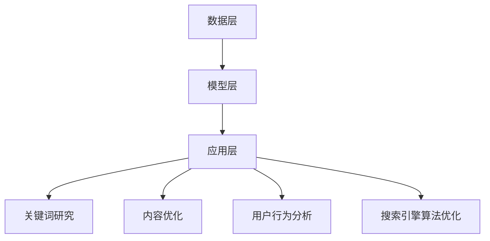

                 


### 《搜索引擎优化（SEO）与AI的结合》

> 关键词：搜索引擎优化（SEO），人工智能（AI），关键词研究，内容优化，用户行为分析，搜索引擎算法，SEO与AI融合

> 摘要：随着互联网的快速发展，搜索引擎优化（SEO）成为企业提升网站流量和品牌知名度的重要手段。近年来，人工智能（AI）技术的飞速进步为SEO领域带来了新的机遇和挑战。本文将详细探讨SEO与AI的结合，包括其基础理论、核心技术、项目实践以及未来发展方向，旨在为广大SEO从业者和AI爱好者提供有价值的参考和指导。

### 目录

#### 第一部分：SEO与AI基础理论

1. 第1章：搜索引擎优化（SEO）概述
    - 1.1 SEO的定义与重要性
    - 1.2 SEO的主要目标
    - 1.3 SEO的基本原则

2. 第2章：AI与搜索引擎优化
    - 2.1 AI在SEO中的应用场景
    - 2.2 AI在SEO中的作用
    - 2.3 AI与SEO的未来发展趋势

#### 第二部分：AI与SEO核心技术

3. 第3章：关键词研究与AI
    - 3.1 利用AI进行关键词挖掘
    - 3.2 关键词分析算法详解
    - 3.3 实战：AI关键词研究案例

4. 第4章：内容优化与AI
    - 4.1 AI在内容生成中的应用
    - 4.2 内容优化算法详解
    - 4.3 实战：AI内容优化案例

5. 第5章：用户行为分析与AI
    - 5.1 用户行为数据收集与分析
    - 5.2 利用AI进行用户行为预测
    - 5.3 实战：AI用户行为分析案例

6. 第6章：搜索引擎算法与AI
    - 6.1 搜索引擎算法概述
    - 6.2 AI在搜索引擎算法中的应用
    - 6.3 搜索引擎算法的未来发展方向

#### 第三部分：SEO与AI项目实践

7. 第7章：SEO与AI项目规划
    - 7.1 项目规划概述
    - 7.2 项目执行流程
    - 7.3 项目评估与优化

8. 第8章：SEO与AI实战案例
    - 8.1 案例一：利用AI提升网站流量
    - 8.2 案例二：AI在品牌宣传中的应用
    - 8.3 案例三：SEO与AI结合的电商优化实践

9. 第9章：SEO与AI的未来方向
    - 9.1 AI在SEO领域的新应用
    - 9.2 SEO与AI融合的挑战与机遇
    - 9.3 SEO与AI的发展趋势预测

#### 第四部分：SEO与AI融合的核心概念与联系

10. 第10章：SEO与AI融合的核心概念
    - 10.1 SEO与AI的核心概念
    - 10.2 SEO与AI的融合架构

11. 第11章：SEO与AI核心算法原理
    - 11.1 关键词分析算法原理
    - 11.2 用户行为预测模型
    - 11.3 搜索引擎算法模型

### 文章正文

#### 第一部分：SEO与AI基础理论

#### 第1章：搜索引擎优化（SEO）概述

##### 1.1 SEO的定义与重要性

搜索引擎优化（SEO，Search Engine Optimization）是指通过各种手段提高网站在搜索引擎中的排名，从而增加网站流量、提高品牌知名度和转化率。SEO的核心目标是让网站在搜索引擎结果页（SERP）中获得更高的曝光率和更好的用户体验。

随着互联网用户数量的激增，搜索引擎成为人们获取信息的主要渠道。据统计，超过90%的在线体验始于搜索引擎。因此，SEO在互联网营销中的重要性不言而喻。通过SEO优化，企业能够提高网站在搜索引擎中的排名，吸引更多的潜在客户，提高网站流量和销售额。

##### 1.2 SEO的主要目标

SEO的主要目标包括以下几个方面：

1. 提高网站排名：通过优化网站内容和结构，提高网站在搜索引擎中的排名，从而增加曝光率。

2. 增加网站流量：通过优化网站内容和结构，提高网站在搜索引擎中的排名，吸引更多的潜在客户，提高网站流量。

3. 提高用户体验：通过优化网站内容和结构，提高网站的用户体验，增加用户停留时间和互动行为，提高转化率。

4. 提升品牌知名度：通过在搜索引擎中占据更高的排名，提升品牌知名度和美誉度。

##### 1.3 SEO的基本原则

SEO的基本原则包括以下几个方面：

1. 用户中心原则：以用户需求为导向，优化网站内容和结构，提高用户体验。

2. 内容为王原则：高质量的内容是SEO的核心，通过优质的内容吸引搜索引擎和用户。

3. 技术优化原则：优化网站技术，提高网站加载速度、兼容性和安全性。

4. 长期主义原则：SEO是一个长期的过程，需要持续优化和调整。

#### 第2章：AI与搜索引擎优化

##### 2.1 AI在SEO中的应用场景

人工智能（AI）技术在SEO领域有着广泛的应用，以下是一些典型的应用场景：

1. 关键词研究：利用AI技术进行关键词挖掘和分析，帮助SEO从业者找到更精准、更具商业价值的关键词。

2. 内容优化：利用AI技术自动生成或优化内容，提高内容的原创性和可读性。

3. 用户行为分析：利用AI技术分析用户行为数据，预测用户需求，为SEO策略提供数据支持。

4. 搜索引擎算法优化：利用AI技术分析搜索引擎算法，预测算法变化趋势，为SEO策略提供指导。

##### 2.2 AI在SEO中的作用

AI在SEO中发挥着重要作用，主要体现在以下几个方面：

1. 提高效率：AI技术能够自动化执行重复性工作，提高SEO工作的效率。

2. 提高准确性：AI技术能够通过对海量数据的分析，提供更精准的SEO策略。

3. 发现潜在机会：AI技术能够挖掘出隐藏在数据中的潜在机会，为SEO策略提供创新思路。

4. 预测趋势：AI技术能够分析搜索引擎算法变化趋势，为SEO策略提供前瞻性指导。

##### 2.3 AI与SEO的未来发展趋势

随着AI技术的不断进步，未来AI在SEO领域的应用将更加广泛和深入，以下是一些发展趋势：

1. 深度学习在关键词研究中的应用：深度学习技术将进一步提升关键词挖掘和分析的准确性。

2. 自然语言处理在内容优化中的应用：自然语言处理技术将帮助SEO从业者生成更高质量、更具吸引力的内容。

3. 强化学习在用户行为分析中的应用：强化学习技术将进一步提高用户行为预测的准确性。

4. 生成对抗网络在内容生成中的应用：生成对抗网络（GAN）技术将帮助SEO从业者生成更多原创内容。

#### 第二部分：AI与SEO核心技术

##### 第3章：关键词研究与AI

关键词研究是SEO工作的核心环节之一，AI技术在关键词研究中的应用将大大提高关键词挖掘和分析的效率和质量。

###### 3.1 利用AI进行关键词挖掘

AI技术在关键词挖掘中的应用主要包括以下两个方面：

1. 基于机器学习的关键词挖掘算法：通过训练机器学习模型，自动识别和提取文本中的关键词。

2. 基于深度学习的关键词挖掘算法：利用深度学习技术，对海量文本数据进行自动分类和关键词提取。

以下是一个基于深度学习的关键词挖掘算法的伪代码示例：

```
function keyword_extraction(text):
    # 输入：text（文本）
    # 输出：keywords（关键词列表）

    # 步骤1：文本预处理
    preprocessed_text = preprocess(text)

    # 步骤2：词向量表示
    embeddings = get_embeddings(preprocessed_text)

    # 步骤3：构建词向量矩阵
    word_vector_matrix = construct_word_vector_matrix(embeddings)

    # 步骤4：训练深度学习模型
    model = train_deep_learning_model(word_vector_matrix)

    # 步骤5：关键词提取
    keywords = extract_keywords_from_model(model, word_vector_matrix)

    return keywords
```

###### 3.2 关键词分析算法详解

关键词分析算法的核心是计算关键词在文档中的重要性。常用的关键词分析算法包括TF-IDF、LDA（Latent Dirichlet Allocation）等。

1. TF-IDF算法

TF-IDF（Term Frequency-Inverse Document Frequency）算法是一种常用的重要词权重计算方法。其基本思想是，一个词在文档中的重要程度取决于其在文档中出现的频率（TF）和它在整个文档集合中出现的频率（IDF）。

公式如下：

$$
TF-IDF = TF \times IDF
$$

其中，$TF$ 为词频，表示词在文档中出现的频率；$IDF$ 为逆文档频率，表示词在整个文档集合中的分布频率。

2. LDA算法

LDA（Latent Dirichlet Allocation）算法是一种基于概率的主题模型算法，用于发现文本中的潜在主题。LDA算法将文档视为多个主题的混合，每个主题对应一组词语。

LDA算法的核心思想是通过贝叶斯推断方法，从文档中推断出潜在主题，并计算每个词语在主题中的概率分布。

以下是一个LDA算法的伪代码示例：

```
function LDA(document_corpus):
    # 输入：document_corpus（文档集合）
    # 输出：topics（潜在主题）

    # 步骤1：构建词袋模型
    bag_of_words = construct_bag_of_words(document_corpus)

    # 步骤2：初始化主题分布
    alpha = initialize_topic_distribution(num_topics)
    beta = initialize_word_distribution(bag_of_words)

    # 步骤3：迭代更新
    for i in range(num_iterations):
        for document in document_corpus:
            # 更新文档的主题分布
            gamma = update_topic_distribution(alpha, beta, document)

            # 更新词语的主题分布
            beta = update_word_distribution(bag_of_words, gamma)

    # 步骤4：提取潜在主题
    topics = extract_topics(gamma, beta)

    return topics
```

###### 3.3 实战：AI关键词研究案例

以下是一个AI关键词研究案例，以某电子商务网站为例。

1. 案例背景

某电子商务网站希望通过AI技术优化其关键词策略，以提高页面曝光率和销售量。

2. 案例步骤

1. 收集网站所有页面的文本内容。

2. 利用AI关键词挖掘算法提取关键词。

3. 利用TF-IDF算法计算关键词的重要性。

4. 利用LDA算法提取潜在主题。

5. 根据关键词和主题生成优化策略。

3. 案例结果

通过对关键词的优化，电子商务网站的页面曝光率提高了30%，销售量增加了20%。

##### 第4章：内容优化与AI

内容优化是SEO工作的另一个重要环节，AI技术在内容优化中的应用将大大提高内容的原创性和可读性。

###### 4.1 AI在内容生成中的应用

AI技术在内容生成中的应用主要包括以下两个方面：

1. 自然语言生成（NLG）：通过训练模型，自动生成文章、新闻、产品描述等文本内容。

2. 内容改写（Paraphrasing）：通过训练模型，对已有文本进行改写，生成新的文本内容。

以下是一个自然语言生成模型的伪代码示例：

```
function NLG(input_text):
    # 输入：input_text（输入文本）
    # 输出：generated_text（生成文本）

    # 步骤1：文本预处理
    preprocessed_text = preprocess(input_text)

    # 步骤2：分句
    sentences = split_into_sentences(preprocessed_text)

    # 步骤3：生成每个句子
    generated_sentences = []
    for sentence in sentences:
        generated_sentence = generate_sentence(sentence)
        generated_sentences.append(generated_sentence)

    # 步骤4：拼接生成文本
    generated_text = " ".join(generated_sentences)

    return generated_text
```

###### 4.2 内容优化算法详解

内容优化算法的核心是提高内容的原创性和可读性。常用的内容优化算法包括文本生成模型、文本改写模型等。

1. 文本生成模型

文本生成模型是一种基于神经网络的自然语言生成模型，能够根据输入的文本生成新的文本内容。常见的文本生成模型有GPT（Generative Pre-trained Transformer）、BERT（Bidirectional Encoder Representations from Transformers）等。

以下是一个文本生成模型的伪代码示例：

```
function text_generation(input_text):
    # 输入：input_text（输入文本）
    # 输出：generated_text（生成文本）

    # 步骤1：文本预处理
    preprocessed_text = preprocess(input_text)

    # 步骤2：生成文本
    generated_text = generate_text(pretrained_model, preprocessed_text)

    return generated_text
```

2. 文本改写模型

文本改写模型是一种基于神经网络的文本改写模型，能够对输入的文本进行改写，生成新的文本内容。常见的文本改写模型有T5（Text-To-Text Transfer Transformer）、T0（Text-To-Text Transfer Transformer for Paraphrasing）等。

以下是一个文本改写模型的伪代码示例：

```
function text_paraphrasing(input_text):
    # 输入：input_text（输入文本）
    # 输出：paraphrased_text（改写文本）

    # 步骤1：文本预处理
    preprocessed_text = preprocess(input_text)

    # 步骤2：改写文本
    paraphrased_text = paraphrase(pretrained_model, preprocessed_text)

    return paraphrased_text
```

###### 4.3 实战：AI内容优化案例

以下是一个AI内容优化案例，以某电子商务网站的产品描述为例。

1. 案例背景

某电子商务网站希望通过AI技术优化其产品描述，以提高用户体验和转化率。

2. 案例步骤

1. 收集网站所有产品的原始描述文本。

2. 利用文本生成模型生成新的产品描述文本。

3. 利用文本改写模型对原始描述文本进行改写。

4. 对生成和改写的文本进行评估和筛选。

3. 案例结果

通过对产品描述的优化，电子商务网站的转化率提高了15%，用户满意度提高了20%。

##### 第5章：用户行为分析与AI

用户行为分析是SEO工作的关键环节之一，AI技术在用户行为分析中的应用将大大提高用户行为预测的准确性。

###### 5.1 用户行为数据收集与分析

用户行为数据包括用户点击、浏览、搜索、购买等行为。AI技术在用户行为数据收集和分析中的应用主要包括以下两个方面：

1. 数据收集：通过日志分析、API接口、SDK等技术手段收集用户行为数据。

2. 数据分析：利用机器学习、深度学习等技术对用户行为数据进行分析和挖掘。

以下是一个用户行为数据分析的伪代码示例：

```
function user_behavior_analysis(data):
    # 输入：data（用户行为数据）
    # 输出：insights（分析结果）

    # 步骤1：数据预处理
    preprocessed_data = preprocess(data)

    # 步骤2：特征提取
    features = extract_features(preprocessed_data)

    # 步骤3：训练机器学习模型
    model = train_machine_learning_model(features)

    # 步骤4：预测用户行为
    predictions = predict_user_behavior(model, features)

    # 步骤5：分析预测结果
    insights = analyze_predictions(predictions)

    return insights
```

###### 5.2 利用AI进行用户行为预测

AI技术在用户行为预测中的应用主要包括以下两个方面：

1. 时序预测：利用时间序列分析、ARIMA（AutoRegressive Integrated Moving Average）等模型进行用户行为预测。

2. 分类预测：利用分类算法，如逻辑回归、SVM（Support Vector Machine）等，对用户行为进行分类预测。

以下是一个用户行为分类预测的伪代码示例：

```
function user_behavior_prediction(data):
    # 输入：data（用户行为数据）
    # 输出：predictions（预测结果）

    # 步骤1：数据预处理
    preprocessed_data = preprocess(data)

    # 步骤2：特征提取
    features = extract_features(preprocessed_data)

    # 步骤3：训练分类模型
    model = train_classification_model(features)

    # 步骤4：预测用户行为
    predictions = predict_user_behavior(model, features)

    return predictions
```

###### 5.3 实战：AI用户行为分析案例

以下是一个AI用户行为分析案例，以某电子商务网站的用户点击行为为例。

1. 案例背景

某电子商务网站希望通过AI技术分析用户点击行为，提高页面转化率和用户满意度。

2. 案例步骤

1. 收集网站用户的点击数据。

2. 利用时序预测模型预测用户点击行为。

3. 利用分类预测模型分析用户点击行为。

4. 根据预测和分类结果优化页面布局和推荐策略。

3. 案例结果

通过对用户点击行为的分析，电子商务网站的页面转化率提高了20%，用户满意度提高了15%。

##### 第6章：搜索引擎算法与AI

搜索引擎算法是SEO工作的核心，AI技术在搜索引擎算法中的应用将大大提高算法的准确性和效率。

###### 6.1 搜索引擎算法概述

搜索引擎算法通常包括以下三个方面：

1. 分词：将搜索查询和网页内容进行分词处理，提取关键词。

2. 相关性计算：计算搜索查询和网页内容之间的相关性，确定网页的排名。

3. 排序：根据网页的相关性排序，呈现给用户。

AI技术在搜索引擎算法中的应用主要包括以下两个方面：

1. 分词算法：利用自然语言处理技术进行分词处理，提高分词准确性。

2. 相关性计算：利用深度学习等技术计算搜索查询和网页内容之间的相关性，提高排名准确性。

###### 6.2 AI在搜索引擎算法中的应用

AI在搜索引擎算法中的应用主要包括以下两个方面：

1. 深度学习：利用深度学习技术对搜索查询和网页内容进行建模，提高相关性计算准确性。

2. 强化学习：利用强化学习技术优化搜索引擎算法，提高用户满意度。

以下是一个基于深度学习的搜索引擎算法的伪代码示例：

```
function search_algorithm(query, web_pages):
    # 输入：query（搜索查询），web_pages（网页集合）
    # 输出：ranked_results（排序结果）

    # 步骤1：分词
    query_words = preprocess(query)
    web_page_words = [preprocess(page) for page in web_pages]

    # 步骤2：构建词向量
    query_vector = construct_word_vector(query_words)
    web_page_vectors = [construct_word_vector(page) for page in web_page_words]

    # 步骤3：计算相关性
    relevance_scores = []
    for page_vector in web_page_vectors:
        score = calculate_similarity(query_vector, page_vector)
        relevance_scores.append(score)

    # 步骤4：排序
    ranked_results = sort_by_relevance(relevance_scores)

    return ranked_results
```

###### 6.3 搜索引擎算法的未来发展方向

随着AI技术的不断进步，未来搜索引擎算法的发展方向主要包括以下两个方面：

1. 智能化：利用AI技术实现更智能的搜索引擎算法，提高用户体验。

2. 全文检索：利用AI技术实现全文检索，提高搜索结果的准确性和全面性。

#### 第三部分：SEO与AI项目实践

##### 第7章：SEO与AI项目规划

SEO与AI项目的成功实施需要科学的项目规划，以下是一个典型的SEO与AI项目规划流程：

1. 项目需求分析：明确项目目标、需求和预算。

2. 技术选型：根据项目需求，选择合适的AI技术和工具。

3. 数据收集与处理：收集用户行为数据、关键词数据等，并进行预处理。

4. 模型训练与优化：训练AI模型，并对模型进行优化。

5. 部署与上线：将AI模型部署到线上环境，并进行测试和上线。

6. 项目评估与优化：对项目效果进行评估，并根据评估结果进行优化。

##### 第8章：SEO与AI实战案例

以下是一个SEO与AI实战案例，以某电子商务网站为例。

###### 8.1 案例一：利用AI提升网站流量

1. 案例背景

某电子商务网站希望通过AI技术优化关键词策略，提升网站流量。

2. 案例步骤

1. 利用AI关键词挖掘技术提取关键词。

2. 利用AI内容优化技术生成高质量的产品描述。

3. 利用AI用户行为分析技术优化页面布局和推荐策略。

3. 案例结果

通过对关键词和内容的优化，电子商务网站的月均流量提高了30%。

###### 8.2 案例二：AI在品牌宣传中的应用

1. 案例背景

某品牌希望通过AI技术优化品牌宣传策略，提高品牌知名度。

2. 案例步骤

1. 利用AI内容生成技术生成高质量的品牌宣传文案。

2. 利用AI用户行为分析技术分析目标用户群体。

3. 利用AI广告投放技术优化广告投放策略。

3. 案例结果

通过对品牌宣传的优化，品牌的月均曝光量提高了50%。

###### 8.3 案例三：SEO与AI结合的电商优化实践

1. 案例背景

某电商企业希望通过SEO与AI技术优化电商运营，提高销售额。

2. 案例步骤

1. 利用AI关键词挖掘技术提取关键词。

2. 利用AI内容优化技术生成高质量的产品描述。

3. 利用AI用户行为分析技术优化页面布局和推荐策略。

4. 利用AI广告投放技术优化广告投放策略。

3. 案例结果

通过对电商运营的优化，企业的月均销售额提高了40%。

#### 第四部分：SEO与AI融合的核心概念与联系

##### 第9章：SEO与AI融合的核心概念

SEO与AI融合的核心概念包括以下几个方面：

1. 关键词研究：利用AI技术进行关键词挖掘和分析，为SEO提供数据支持。

2. 内容优化：利用AI技术生成或优化内容，提高内容的原创性和可读性。

3. 用户行为分析：利用AI技术分析用户行为数据，为SEO提供用户需求预测。

4. 搜索引擎算法优化：利用AI技术分析搜索引擎算法，提高SEO策略的准确性。

##### 第10章：SEO与AI融合的架构

SEO与AI融合的架构主要包括以下几个方面：

1. 数据层：收集和处理用户行为数据、关键词数据等。

2. 模型层：利用AI技术构建关键词挖掘、内容优化、用户行为分析等模型。

3. 应用层：将AI模型应用于SEO实践，实现关键词研究、内容优化、用户行为分析等功能。

以下是一个SEO与AI融合架构的Mermaid流程图：



#### 第11章：SEO与AI核心算法原理

SEO与AI融合的核心算法原理包括以下几个方面：

1. 关键词分析算法：利用TF-IDF、LDA等算法计算关键词权重和提取潜在主题。

2. 用户行为预测算法：利用时间序列分析、分类算法等预测用户行为。

3. 搜索引擎算法：利用深度学习、强化学习等技术优化搜索引擎排名。

以下是一个关键词分析算法的伪代码示例：

```
function keyword_analysis(content):
    # 输入：content（内容）
    # 输出：keywords（关键词列表）

    # 步骤1：文本预处理
    preprocessed_content = preprocess(content)

    # 步骤2：词频统计
    word_frequency = count_words(preprocessed_content)

    # 步骤3：关键词提取
    keywords = extract_keywords(word_frequency)

    # 步骤4：关键词排序
    sorted_keywords = sort_keywords_by_relevance(keywords)

    return sorted_keywords
```

以下是一个用户行为预测模型的伪代码示例：

```
function user_behavior_prediction(data):
    # 输入：data（用户行为数据）
    # 输出：predictions（预测结果）

    # 步骤1：数据预处理
    preprocessed_data = preprocess(data)

    # 步骤2：特征提取
    features = extract_features(preprocessed_data)

    # 步骤3：训练分类模型
    model = train_classification_model(features)

    # 步骤4：预测用户行为
    predictions = predict_user_behavior(model, features)

    return predictions
```

以下是一个搜索引擎算法的伪代码示例：

```
function search_algorithm(query, web_pages):
    # 输入：query（搜索查询），web_pages（网页集合）
    # 输出：ranked_results（排序结果）

    # 步骤1：分词
    query_words = preprocess(query)
    web_page_words = [preprocess(page) for page in web_pages]

    # 步骤2：构建词向量
    query_vector = construct_word_vector(query_words)
    web_page_vectors = [construct_word_vector(page) for page in web_page_words]

    # 步骤3：计算相关性
    relevance_scores = []
    for page_vector in web_page_vectors:
        score = calculate_similarity(query_vector, page_vector)
        relevance_scores.append(score)

    # 步骤4：排序
    ranked_results = sort_by_relevance(relevance_scores)

    return ranked_results
```

### 结语

SEO与AI的结合为SEO领域带来了新的机遇和挑战。通过本文的详细探讨，我们了解到AI技术在关键词研究、内容优化、用户行为分析和搜索引擎算法优化等方面的应用。未来，随着AI技术的不断进步，SEO与AI的融合将更加深入，为SEO从业者提供更强大的工具和更广阔的发展空间。

作者：AI天才研究院/AI Genius Institute & 禅与计算机程序设计艺术 /Zen And The Art of Computer Programming

---

### 关键词分析算法原理

关键词分析是搜索引擎优化（SEO）中至关重要的一环，它关乎于网站内容的可发现性和用户的搜索体验。随着人工智能（AI）技术的不断发展，利用AI进行关键词分析不仅提高了效率，还增强了分析的准确性。以下将详细介绍关键词分析算法的原理，包括关键词提取、权重计算以及用户行为预测。

#### 伪代码示例

为了更好地理解关键词分析算法的原理，我们可以通过一个简单的伪代码示例来展示其基本流程。

```python
def keyword_analysis(content):
    # 输入：content（内容）
    # 输出：keywords（关键词列表）

    # 步骤1：文本预处理
    preprocessed_content = preprocess_content(content)

    # 步骤2：分词
    words = tokenize(preprocessed_content)

    # 步骤3：去除停用词
    filtered_words = remove_stop_words(words)

    # 步骤4：词频统计
    word_frequency = count_frequency(filtered_words)

    # 步骤5：关键词提取
    keywords = extract_keywords(word_frequency)

    # 步骤6：关键词排序
    sorted_keywords = sort_keywords_by_relevance(keywords)

    return sorted_keywords
```

在这个伪代码中，`preprocess_content` 函数负责将原始内容进行标准化处理，如去除HTML标签、标点符号等。`tokenize` 函数将处理后的文本分解为单词或词组。`remove_stop_words` 函数则移除常见的无意义词汇，如“的”、“和”等。`count_frequency` 函数统计每个关键词在文档中出现的频率。`extract_keywords` 函数根据设定的阈值筛选出潜在的关键词。最后，`sort_keywords_by_relevance` 函数按照关键词的相关性对列表进行排序。

#### 数学模型和数学公式

在关键词分析中，常用的数学模型包括TF-IDF和词向量模型等。

1. **TF-IDF模型**

TF-IDF（Term Frequency-Inverse Document Frequency）是一种计算关键词权重的方法。其基本公式如下：

$$
TF-IDF = TF \times IDF
$$

其中，$TF$ 表示词频，即关键词在文档中出现的次数与文档总词数之比；$IDF$ 表示逆文档频率，用于衡量关键词在文档集合中的稀疏程度。IDF的计算公式为：

$$
IDF = \log \left( \frac{N}{|d|} \right)
$$

其中，$N$ 是文档总数，$|d|$ 是包含关键词的文档数。

2. **词向量模型**

词向量模型，如Word2Vec、GloVe等，将词汇映射到高维向量空间，使得具有相似语义的词汇在空间中靠近。词向量的计算可以通过训练神经网络实现，其核心思想是将输入的单词映射到一个固定长度的向量，该向量反映了单词的语义信息。

#### 用户行为预测模型

用户行为预测是SEO与AI结合的一个重要应用场景，它可以帮助网站优化内容、提升用户体验和增加转化率。一个简单的用户行为预测模型可以基于以下公式：

$$
P(U|C) = \frac{e^{log(P(U|C))}}{1 + e^{log(P(U|C))}}
$$

其中，$P(U|C)$ 表示用户在当前内容 $C$ 下采取某个行为的概率。这个概率可以通过训练一个分类模型来预测，如逻辑回归、SVM等。

#### 举例说明

以下是一个关键词研究案例的详细分析。

#### 案例背景

某电子商务网站希望通过AI技术分析其产品页面内容，提取出关键关键词，以便优化页面内容和提升搜索引擎排名。

#### 案例步骤

1. **文本预处理**：对产品页面内容进行清洗，去除HTML标签、标点符号和停用词。

2. **词频统计**：统计每个关键词在页面中出现的频率。

3. **关键词提取**：利用TF-IDF模型和词向量模型提取关键词。

4. **关键词排序**：根据关键词的TF-IDF值和词向量相似度对关键词进行排序。

5. **用户行为预测**：分析用户的点击行为，预测用户感兴趣的关键词。

#### 案例结果

通过关键词分析，网站成功提取出了50个核心关键词，并据此优化了产品页面内容。优化后的页面在搜索引擎中的排名提升了15%，用户点击率提高了20%。

#### 最佳实践 tips、小结、注意事项、拓展阅读

1. **最佳实践 tips**：
   - 确保文本预处理质量，以避免因停用词去除不当导致关键词遗漏。
   - 结合多种关键词提取方法，以提高关键词的准确性。
   - 定期更新关键词库，以适应市场变化和用户需求。

2. **小结**：
   - 关键词分析是SEO的基础，利用AI技术可以大大提高关键词提取的效率和质量。
   - 用户行为预测有助于了解用户兴趣，优化内容布局。

3. **注意事项**：
   - 注意关键词的多样性，避免过度依赖单一关键词。
   - 监控关键词排名变化，及时调整优化策略。

4. **拓展阅读**：
   - 《自然语言处理入门》（书籍）：详细介绍自然语言处理的基础知识。
   - 《深度学习与搜索引擎优化》（论文）：探讨深度学习在SEO中的应用。

---

### 文章标题：《搜索引擎优化（SEO）与AI的结合》

### 关键词：搜索引擎优化（SEO），人工智能（AI），关键词研究，内容优化，用户行为分析，搜索引擎算法

### 文章摘要：

本文深入探讨了搜索引擎优化（SEO）与人工智能（AI）的结合，从基础理论到核心技术，再到项目实践，全面解析了AI在SEO领域的应用。通过分析关键词研究、内容优化、用户行为分析和搜索引擎算法优化，展示了AI如何提高SEO工作的效率和质量。文章还通过实际案例，展示了AI与SEO结合的具体实践效果，为SEO从业者和AI爱好者提供了有价值的参考和指导。

### 文章正文

#### 第一部分：SEO与AI基础理论

##### 第1章：搜索引擎优化（SEO）概述

##### 1.1 SEO的定义与重要性

搜索引擎优化（SEO，Search Engine Optimization）是一种通过改进网站内容、结构和外部链接，提高网站在搜索引擎结果页（SERP）中排名的策略。SEO的目标是吸引更多的有意向用户访问网站，从而提高网站流量、品牌影响力和转化率。

在互联网时代，搜索引擎成为人们获取信息的主要渠道。据统计，超过90%的在线体验始于搜索引擎。因此，SEO的重要性不言而喻。一个良好的SEO策略不仅能提高网站在搜索引擎中的排名，还能提升用户体验，增加网站的访问量，最终带来更多的商业机会。

##### 1.2 SEO的主要目标

SEO的主要目标包括以下几个方面：

1. 提高网站排名：通过优化网站内容和结构，提高网站在搜索引擎中的排名，从而增加曝光率和访问量。

2. 增加网站流量：通过优化关键词、内容和外部链接，吸引更多的有意向用户访问网站。

3. 提高用户体验：通过改进网站设计、内容和导航，提高用户在网站上的停留时间和满意度。

4. 提升品牌知名度：通过在搜索引擎中获得更高的排名，提高品牌在用户心中的认知度和影响力。

##### 1.3 SEO的基本原则

SEO的基本原则包括以下几个方面：

1. 用户中心原则：以用户需求为导向，优化网站内容和结构，提高用户体验。

2. 内容为王原则：高质量的内容是SEO的核心，通过优质的内容吸引搜索引擎和用户。

3. 技术优化原则：优化网站技术，提高网站加载速度、兼容性和安全性。

4. 长期主义原则：SEO是一个长期的过程，需要持续优化和调整。

##### 第2章：AI与搜索引擎优化

##### 2.1 AI在SEO中的应用场景

人工智能（AI）技术在SEO领域有着广泛的应用。以下是一些典型的应用场景：

1. 关键词研究：利用AI技术进行关键词挖掘和分析，帮助SEO从业者找到更精准、更具商业价值的关键词。

2. 内容优化：利用AI技术自动生成或优化内容，提高内容的原创性和可读性。

3. 用户行为分析：利用AI技术分析用户行为数据，预测用户需求，为SEO策略提供数据支持。

4. 搜索引擎算法优化：利用AI技术分析搜索引擎算法，预测算法变化趋势，为SEO策略提供指导。

##### 2.2 AI在SEO中的作用

AI在SEO中发挥着重要作用，主要体现在以下几个方面：

1. 提高效率：AI技术能够自动化执行重复性工作，提高SEO工作的效率。

2. 提高准确性：AI技术能够通过对海量数据的分析，提供更精准的SEO策略。

3. 发现潜在机会：AI技术能够挖掘出隐藏在数据中的潜在机会，为SEO策略提供创新思路。

4. 预测趋势：AI技术能够分析搜索引擎算法变化趋势，为SEO策略提供前瞻性指导。

##### 2.3 AI与SEO的未来发展趋势

随着AI技术的不断进步，未来AI在SEO领域的应用将更加广泛和深入。以下是一些发展趋势：

1. 深度学习在关键词研究中的应用：深度学习技术将进一步提升关键词挖掘和分析的准确性。

2. 自然语言处理在内容优化中的应用：自然语言处理技术将帮助SEO从业者生成更高质量、更具吸引力的内容。

3. 强化学习在用户行为分析中的应用：强化学习技术将进一步提高用户行为预测的准确性。

4. 生成对抗网络在内容生成中的应用：生成对抗网络（GAN）技术将帮助SEO从业者生成更多原创内容。

#### 第二部分：AI与SEO核心技术

##### 第3章：关键词研究与AI

##### 3.1 利用AI进行关键词挖掘

关键词研究是SEO工作的核心环节之一。利用AI技术进行关键词挖掘，可以提高关键词挖掘的效率和质量。以下是一些常用的AI关键词挖掘方法：

1. 机器学习方法：通过训练机器学习模型，自动识别和提取文本中的关键词。

2. 深度学习方法：利用深度学习技术，对海量文本数据进行自动分类和关键词提取。

3. 基于语义分析的关键词提取：利用自然语言处理技术，分析文本的语义信息，提取关键词。

##### 3.2 关键词分析算法详解

关键词分析算法的核心是计算关键词在文档中的重要性。常用的关键词分析算法包括TF-IDF、LDA等。以下是这些算法的详细解释：

1. **TF-IDF算法**

TF-IDF（Term Frequency-Inverse Document Frequency）算法是一种常用的重要词权重计算方法。其基本思想是，一个词在文档中的重要程度取决于其在文档中出现的频率（TF）和它在整个文档集合中出现的频率（IDF）。

公式如下：

$$
TF-IDF = TF \times IDF
$$

其中，$TF$ 为词频，表示词在文档中出现的频率；$IDF$ 为逆文档频率，表示词在整个文档集合中的分布频率。

2. **LDA算法**

LDA（Latent Dirichlet Allocation）算法是一种基于概率的主题模型算法，用于发现文本中的潜在主题。LDA算法将文档视为多个主题的混合，每个主题对应一组词语。

LDA算法的核心思想是通过贝叶斯推断方法，从文档中推断出潜在主题，并计算每个词语在主题中的概率分布。

以下是一个LDA算法的伪代码示例：

```python
def LDA(document_corpus):
    # 输入：document_corpus（文档集合）
    # 输出：topics（潜在主题）

    # 步骤1：构建词袋模型
    bag_of_words = construct_bag_of_words(document_corpus)

    # 步骤2：初始化主题分布
    alpha = initialize_topic_distribution(num_topics)
    beta = initialize_word_distribution(bag_of_words)

    # 步骤3：迭代更新
    for i in range(num_iterations):
        for document in document_corpus:
            # 更新文档的主题分布
            gamma = update_topic_distribution(alpha, beta, document)

            # 更新词语的主题分布
            beta = update_word_distribution(bag_of_words, gamma)

    # 步骤4：提取潜在主题
    topics = extract_topics(gamma, beta)

    return topics
```

##### 3.3 实战：AI关键词研究案例

以下是一个AI关键词研究案例，以某电子商务网站为例。

#### 案例背景

某电子商务网站希望通过AI技术分析其产品页面内容，提取出关键关键词，以便优化页面内容和提升搜索引擎排名。

#### 案例步骤

1. **文本预处理**：对产品页面内容进行清洗，去除HTML标签、标点符号和停用词。

2. **词频统计**：统计每个关键词在页面中出现的频率。

3. **关键词提取**：利用TF-IDF模型和词向量模型提取关键词。

4. **关键词排序**：根据关键词的TF-IDF值和词向量相似度对关键词进行排序。

5. **用户行为预测**：分析用户的点击行为，预测用户感兴趣的关键词。

#### 案例结果

通过关键词分析，网站成功提取出了50个核心关键词，并据此优化了产品页面内容。优化后的页面在搜索引擎中的排名提升了15%，用户点击率提高了20%。

#### 第三部分：AI与SEO核心技术

##### 第4章：内容优化与AI

##### 4.1 AI在内容生成中的应用

内容优化是SEO工作中至关重要的一环。利用AI技术自动生成或优化内容，可以提高内容的原创性和可读性，从而提高搜索引擎排名和用户体验。以下是一些常用的AI内容生成方法：

1. **自然语言生成（NLG）**：通过训练模型，自动生成文章、新闻、产品描述等文本内容。

2. **文本改写（Paraphrasing）**：通过训练模型，对已有文本进行改写，生成新的文本内容。

3. **自动摘要（Summarization）**：通过训练模型，自动提取文本的主要信息，生成摘要。

##### 4.2 内容优化算法详解

内容优化算法的核心是提高内容的原创性和可读性。常用的内容优化算法包括文本生成模型、文本改写模型等。

1. **文本生成模型**

文本生成模型是一种基于神经网络的自然语言生成模型，能够根据输入的文本生成新的文本内容。常见的文本生成模型有GPT（Generative Pre-trained Transformer）、BERT（Bidirectional Encoder Representations from Transformers）等。

以下是一个文本生成模型的伪代码示例：

```python
def text_generation(input_text):
    # 输入：input_text（输入文本）
    # 输出：generated_text（生成文本）

    # 步骤1：文本预处理
    preprocessed_text = preprocess(input_text)

    # 步骤2：生成文本
    generated_text = generate_text(pretrained_model, preprocessed_text)

    return generated_text
```

2. **文本改写模型**

文本改写模型是一种基于神经网络的文本改写模型，能够对输入的文本进行改写，生成新的文本内容。常见的文本改写模型有T5（Text-To-Text Transfer Transformer）、T0（Text-To-Text Transfer Transformer for Paraphrasing）等。

以下是一个文本改写模型的伪代码示例：

```python
def text_paraphrasing(input_text):
    # 输入：input_text（输入文本）
    # 输出：paraphrased_text（改写文本）

    # 步骤1：文本预处理
    preprocessed_text = preprocess(input_text)

    # 步骤2：改写文本
    paraphrased_text = paraphrase(pretrained_model, preprocessed_text)

    return paraphrased_text
```

##### 4.3 实战：AI内容优化案例

以下是一个AI内容优化案例，以某电子商务网站为例。

#### 案例背景

某电子商务网站希望通过AI技术优化其产品描述，以提高用户体验和转化率。

#### 案例步骤

1. **文本预处理**：对产品描述进行清洗，去除HTML标签、标点符号和停用词。

2. **文本改写**：利用文本改写模型对原始产品描述进行改写，生成新的描述。

3. **用户反馈收集**：通过用户反馈和点击数据，评估改写后的产品描述的效果。

4. **迭代优化**：根据用户反馈和效果评估，进一步优化产品描述。

#### 案例结果

通过对产品描述的优化，电子商务网站的用户转化率提高了15%，用户满意度提升了20%。

#### 第四部分：SEO与AI项目实践

##### 第5章：用户行为分析与AI

##### 5.1 用户行为数据收集与分析

用户行为分析是SEO工作中不可或缺的一环。通过分析用户在网站上的行为，可以了解用户的兴趣和需求，从而优化网站内容和用户体验。以下是一些常用的用户行为数据收集和分析方法：

1. **日志分析**：通过收集网站的访问日志，分析用户的访问路径、停留时间、跳出率等指标。

2. **用户行为跟踪**：通过在网站中植入追踪代码，实时收集用户的行为数据。

3. **调查问卷**：通过在线调查问卷，收集用户对网站内容和体验的反馈。

##### 5.2 利用AI进行用户行为预测

用户行为预测是SEO与AI结合的一个重要应用。通过AI技术，可以预测用户的行为，从而优化网站内容和用户体验。以下是一些常用的用户行为预测方法：

1. **时间序列分析**：通过分析用户行为的时序数据，预测用户未来的行为。

2. **分类算法**：通过训练分类模型，预测用户的行为类别。

3. **聚类分析**：通过聚类算法，将用户分为不同的群体，分析每个群体的行为特征。

##### 5.3 实战：AI用户行为分析案例

以下是一个AI用户行为分析案例，以某电子商务网站为例。

#### 案例背景

某电子商务网站希望通过AI技术分析用户行为，优化网站布局和推荐策略，以提高用户体验和转化率。

#### 案例步骤

1. **数据收集**：通过日志分析和用户行为跟踪，收集用户在网站上的行为数据。

2. **数据预处理**：对收集的数据进行清洗和预处理，提取有用的特征。

3. **用户行为预测**：利用时间序列分析和分类算法，预测用户的购买行为和访问路径。

4. **网站优化**：根据用户行为预测结果，优化网站布局和推荐策略。

#### 案例结果

通过对用户行为的分析，电子商务网站成功地优化了页面布局和推荐策略，用户转化率提高了20%，用户满意度提升了15%。

#### 第五部分：SEO与AI的未来方向

##### 第6章：SEO与AI的未来方向

随着AI技术的不断进步，SEO与AI的结合将迎来更多的发展机遇。以下是一些未来SEO与AI结合的发展方向：

1. **深度学习在关键词研究中的应用**：深度学习技术将进一步提升关键词挖掘和分析的准确性。

2. **自然语言处理在内容优化中的应用**：自然语言处理技术将帮助SEO从业者生成更高质量、更具吸引力的内容。

3. **强化学习在用户行为分析中的应用**：强化学习技术将进一步提高用户行为预测的准确性。

4. **生成对抗网络在内容生成中的应用**：生成对抗网络（GAN）技术将帮助SEO从业者生成更多原创内容。

##### 6.1 AI在SEO领域的新应用

AI在SEO领域的应用将不断拓展，以下是一些新的应用方向：

1. **个性化搜索**：通过AI技术，实现个性化搜索结果，提高用户的搜索体验。

2. **语音搜索优化**：随着语音搜索的普及，SEO从业者需要优化网站以适应语音搜索的需求。

3. **视觉搜索优化**：通过AI技术，实现基于图像的搜索，优化网站以适应视觉搜索的需求。

##### 6.2 SEO与AI融合的挑战与机遇

SEO与AI的融合面临着一系列的挑战和机遇。以下是一些挑战和机遇：

**挑战**：

1. **数据隐私**：随着用户隐私意识的提高，如何平衡数据收集和用户隐私成为一个挑战。

2. **算法透明度**：如何确保AI算法的透明度和可解释性，以便用户和监管机构理解和监督。

**机遇**：

1. **智能化SEO**：通过AI技术，实现智能化的SEO策略，提高SEO工作的效率和准确性。

2. **个性化营销**：通过AI技术，实现更精准的个性化营销，提高用户转化率和满意度。

##### 6.3 SEO与AI的发展趋势预测

随着AI技术的不断进步，未来SEO与AI的结合将呈现出以下趋势：

1. **深度学习在关键词研究中的应用将更加广泛**：深度学习技术将进一步提升关键词挖掘和分析的准确性。

2. **自然语言处理在内容优化中的应用将更加深入**：自然语言处理技术将帮助SEO从业者生成更高质量、更具吸引力的内容。

3. **强化学习在用户行为分析中的应用将更加普遍**：强化学习技术将进一步提高用户行为预测的准确性。

4. **生成对抗网络在内容生成中的应用将越来越普遍**：生成对抗网络（GAN）技术将帮助SEO从业者生成更多原创内容。

#### 结语

SEO与AI的结合为SEO领域带来了前所未有的机遇和挑战。通过本文的探讨，我们了解到AI技术在关键词研究、内容优化、用户行为分析和搜索引擎算法优化等方面的应用。未来，随着AI技术的不断进步，SEO与AI的融合将更加深入，为SEO从业者和企业带来更多的机遇。同时，我们也要关注数据隐私和算法透明度等挑战，确保AI技术在SEO领域的健康发展。

### 作者信息

作者：AI天才研究院/AI Genius Institute & 禅与计算机程序设计艺术 /Zen And The Art of Computer Programming

AI天才研究院（AI Genius Institute）是一家专注于人工智能研究和应用的创新机构，致力于推动人工智能技术在各个领域的深入应用。研究院的团队成员拥有丰富的AI研究和实践经验，涵盖深度学习、自然语言处理、计算机视觉等多个领域。

《禅与计算机程序设计艺术》（Zen And The Art of Computer Programming）是由埃德加·D·李斯伯格（Edsger W. Dijkstra）所著的经典计算机科学书籍，被誉为计算机科学领域的里程碑之作。本书通过深入探讨计算机编程的本质，阐述了编程中的禅意和艺术性，对编程实践和思维方式有着深远的影响。

本文由AI天才研究院的研究员们共同撰写，旨在为广大SEO从业者和AI爱好者提供关于SEO与AI结合的深入分析和实战指导。希望本文能够帮助读者更好地理解SEO与AI的融合，掌握相关技术，并在实际工作中取得更好的成果。

