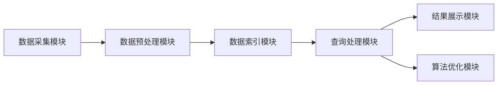

                 

### 文章标题：搜索引擎在智能制造中的应用

关键词：智能制造，搜索引擎，大数据，深度学习，算法优化

摘要：本文旨在探讨搜索引擎技术在智能制造中的应用，通过对智能制造概念、搜索引擎技术基础、智能制造数据管理、知识管理、机器学习和深度学习等方面的详细分析，阐述搜索引擎技术在智能制造领域中的关键作用和未来发展。

## 《搜索引擎在智能制造中的应用》目录大纲

### 第一部分：引言

- 第1章：智能制造与搜索引擎技术概述
  - 1.1 智能制造的概念与发展
  - 1.2 搜索引擎技术的基本原理
  - 1.3 搜索引擎技术在智能制造中的应用前景

### 第二部分：搜索引擎技术在智能制造中的应用

- 第2章：智能制造数据管理
  - 2.1 数据质量管理与处理
  - 2.2 数据索引与存储技术
  - 2.3 数据查询优化

- 第3章：智能搜索引擎系统设计与实现
  - 3.1 智能搜索引擎系统架构设计
  - 3.2 智能搜索算法实现
  - 3.3 智能搜索结果展示

- 第4章：智能制造中的知识管理与知识检索
  - 4.1 知识管理概述
  - 4.2 知识检索技术
  - 4.3 智能制造中的知识管理实践

- 第5章：智能制造中的机器学习与深度学习应用
  - 5.1 机器学习基础
  - 5.2 深度学习在智能制造中的应用
  - 5.3 智能制造中的深度学习实践

- 第6章：智能制造中的大数据分析与可视化
  - 6.1 大数据技术基础
  - 6.2 数据可视化方法
  - 6.3 大数据分析与可视化在智能制造中的应用

- 第7章：智能制造中的搜索引擎优化与性能调优
  - 7.1 搜索引擎优化
  - 7.2 性能调优
  - 7.3 智能制造中的搜索引擎优化实践

- 第8章：智能制造搜索引擎的未来发展
  - 8.1 智能制造搜索引擎的发展趋势
  - 8.2 智能制造搜索引擎的创新应用
  - 8.3 智能制造搜索引擎的可持续发展策略

- 附录
  - 附录 A：智能制造搜索引擎相关资源与工具

### 第一部分：引言

#### 第1章：智能制造与搜索引擎技术概述

##### 1.1 智能制造的概念与发展

智能制造是指通过先进的信息技术、智能技术和自动化技术，对制造过程进行智能化升级和优化，从而实现制造过程的自动化、智能化和高效化。智能制造的核心包括信息物理系统（Cyber-Physical Systems, CPS）、物联网（Internet of Things, IoT）、大数据（Big Data）、云计算（Cloud Computing）、人工智能（Artificial Intelligence, AI）等。

智能制造的发展可以分为三个阶段：

1. **自动化阶段**：通过使用自动化设备、机器人等，实现生产线的自动化。
2. **数字化阶段**：通过数字化技术，将制造过程中的各种数据进行采集、传输和分析，实现对制造过程的实时监控和优化。
3. **智能化阶段**：通过人工智能技术，实现制造过程的自主决策、自适应和自优化，达到高度智能化和自动化的水平。

##### 1.2 搜索引擎技术的基本原理

搜索引擎技术是一种用于从大量数据中快速、准确地查找信息的技术。搜索引擎的基本原理包括数据采集、索引构建、查询处理和结果展示。

1. **数据采集**：搜索引擎通过爬虫程序（如WebSpider）从互联网上抓取网页数据。
2. **索引构建**：搜索引擎将采集到的网页数据进行分析，构建索引，以便快速检索。
3. **查询处理**：当用户输入查询请求时，搜索引擎根据索引快速检索出相关的网页数据。
4. **结果展示**：搜索引擎将检索结果以列表形式展示给用户，并提供排序、筛选等功能。

##### 1.3 搜索引擎技术在智能制造中的应用前景

随着智能制造的发展，数据量呈爆炸性增长，如何在海量数据中快速、准确地找到所需信息成为一个重要问题。搜索引擎技术以其强大的数据处理能力和高效的检索性能，在智能制造领域具有广泛的应用前景。

1. **数据管理**：智能制造过程中产生的大量数据需要进行有效的管理，搜索引擎技术可以用于数据索引和存储，实现数据的快速检索和访问。
2. **知识管理**：智能制造涉及到的知识和信息非常丰富，搜索引擎技术可以帮助企业快速获取和利用这些知识。
3. **优化决策**：通过搜索引擎技术，可以对企业生产过程中的各种数据进行深度挖掘和分析，为企业提供优化决策支持。
4. **智能推荐**：基于搜索引擎技术，可以实现个性化搜索和推荐，提高用户满意度。

总之，搜索引擎技术在智能制造中的应用具有重要意义，它不仅可以帮助企业提高生产效率，降低成本，还可以推动智能制造技术的发展和创新。随着技术的不断进步，搜索引擎在智能制造中的应用将越来越广泛，发挥着越来越重要的作用。

### 第一部分：引言

#### 第1章：智能制造与搜索引擎技术概述

##### 1.1 智能制造的概念与发展

智能制造是当前工业发展的前沿领域，其核心在于利用先进的信息技术与制造技术相结合，实现对制造过程的智能化改造。智能制造不仅强调自动化和数字化，更强调通过人工智能、大数据、云计算等技术，实现制造过程的自主决策和优化。

智能制造的发展历程可以分为以下几个阶段：

1. **自动化阶段**：这一阶段主要特点是引入自动化设备和机器人，实现制造过程的自动化。
2. **数字化阶段**：通过传感器、控制系统等数字化设备，将制造过程中的各个环节进行数字化采集和监控，从而实现对生产过程的实时监控和分析。
3. **智能化阶段**：利用人工智能、大数据分析等先进技术，实现制造过程的智能化决策和优化。这一阶段是智能制造的核心，也是当前智能制造发展的重要方向。

##### 1.2 搜索引擎技术的基本原理

搜索引擎技术是一种用于从互联网上获取信息的技术，其核心原理包括数据的采集、索引构建、查询处理和结果展示。

1. **数据采集**：搜索引擎通过爬虫程序从互联网上抓取网页数据，这些数据可以是静态网页、动态网页、数据库中的数据等。
2. **索引构建**：搜索引擎将采集到的数据进行分析和整理，构建索引数据结构，以便在查询时能够快速定位和检索。
3. **查询处理**：当用户输入查询请求时，搜索引擎根据索引快速检索出相关的数据，并对其进行排序、筛选等处理。
4. **结果展示**：搜索引擎将处理后的结果以网页列表、卡片、摘要等形式展示给用户。

搜索引擎技术的核心组件包括：

- **爬虫**：负责从互联网上获取数据。
- **索引器**：负责对数据进行分析和索引构建。
- **检索引擎**：负责处理用户的查询请求，并根据索引进行检索。
- **展示引擎**：负责将检索结果以可视化形式展示给用户。

##### 1.3 搜索引擎技术在智能制造中的应用前景

随着智能制造的快速发展，数据量呈现爆炸性增长，如何在海量数据中快速、准确地找到所需信息成为一个关键问题。搜索引擎技术在智能制造中的应用前景十分广阔，主要体现在以下几个方面：

1. **数据管理**：智能制造过程中产生的数据种类繁多，包括生产数据、设备数据、物料数据等。搜索引擎技术可以帮助企业对海量数据进行有效管理，实现数据的快速检索和访问。
2. **知识管理**：智能制造涉及到的知识和信息非常丰富，搜索引擎技术可以帮助企业快速获取和利用这些知识，支持企业的决策和创新能力。
3. **优化决策**：通过搜索引擎技术，可以对智能制造过程中的各种数据进行分析和挖掘，为企业提供优化决策支持，提高生产效率和产品质量。
4. **智能推荐**：基于搜索引擎技术，可以实现个性化搜索和推荐，提高用户满意度，从而提升企业的竞争力。

总之，搜索引擎技术在智能制造中的应用具有重要意义。它不仅可以提高企业对数据的利用效率，还可以推动智能制造技术的发展和创新。随着技术的不断进步，搜索引擎在智能制造中的应用将越来越广泛，发挥越来越重要的作用。

### 第二部分：搜索引擎技术在智能制造中的应用

#### 第2章：智能制造数据管理

##### 2.1 数据质量管理与处理

在智能制造中，数据质量管理是确保数据准确性和一致性的关键。数据质量管理主要包括数据清洗、数据标准化和数据完整性检查。

**数据清洗**：数据清洗是指对采集到的数据进行处理，去除重复、错误和无效的数据。具体步骤包括：

1. **去除重复数据**：通过唯一标识符（如设备ID、产品ID）检测和删除重复的数据记录。
2. **纠正错误数据**：对异常值、缺失值和错误值进行识别和修正。
3. **填充缺失数据**：使用插补方法（如平均值插补、线性插值等）填充缺失的数据。

**数据标准化**：数据标准化是指将数据转换为统一的格式和标准，以便于数据存储和分析。具体方法包括：

1. **单位转换**：将不同单位的数据转换为统一的单位。
2. **格式转换**：将不同格式的数据转换为统一的格式，如日期格式、数字格式等。
3. **数据规范化**：通过标准化方法（如Z-score标准化、最小-最大规范化等）调整数据分布，使其符合特定的统计分布。

**数据完整性检查**：数据完整性检查是指确保数据在存储和传输过程中不受损坏或丢失。具体步骤包括：

1. **数据完整性校验**：使用校验和（如CRC校验、MD5校验等）检测数据的完整性。
2. **数据一致性校验**：检查数据在不同系统、数据库或表中的一致性。

**伪代码**：

```
// 数据清洗
function dataCleaning(data):
    removeDuplicates(data)
    correctErrors(data)
    fillMissingValues(data)

// 数据标准化
function dataStandardization(data):
    convertUnits(data)
    convertFormats(data)
    normalizeData(data)

// 数据完整性检查
function dataIntegrityCheck(data):
    checkDataIntegrity(data)
    checkDataConsistency(data)
```

##### 2.2 数据索引与存储技术

数据索引技术是提高数据检索速度的关键。在智能制造中，常用的数据索引技术包括倒排索引、B树索引和哈希索引等。

**倒排索引**：倒排索引是一种高效的数据索引技术，它通过将文档中的单词与文档的ID建立反向映射关系，从而实现快速检索。具体步骤如下：

1. **构建倒排索引**：遍历所有文档，将每个单词映射到包含该单词的所有文档。
2. **存储倒排索引**：将倒排索引存储在磁盘或内存中，以便快速访问。

**B树索引**：B树索引是一种平衡树结构，它通过层级结构组织数据，实现数据的快速检索。具体步骤如下：

1. **构建B树索引**：将数据按关键字进行排序，构建B树。
2. **查询B树索引**：通过递归搜索B树，找到满足条件的数据。

**哈希索引**：哈希索引通过哈希函数将关键字映射到索引位置，实现数据的快速检索。具体步骤如下：

1. **构建哈希索引**：将关键字和索引位置通过哈希函数建立映射关系。
2. **查询哈希索引**：通过哈希函数计算关键字的哈希值，直接访问索引位置。

**数据存储技术**：在智能制造中，常用的数据存储技术包括关系型数据库、NoSQL数据库和分布式存储系统等。

- **关系型数据库**：关系型数据库（如MySQL、PostgreSQL）通过表和关系组织数据，支持复杂查询和事务处理。
- **NoSQL数据库**：NoSQL数据库（如MongoDB、Cassandra）支持大规模数据的存储和快速访问，适用于非结构化和半结构化数据。
- **分布式存储系统**：分布式存储系统（如Hadoop、HDFS）通过分布式文件系统实现海量数据的存储和分布式处理。

##### 2.3 数据查询优化

数据查询优化是提高数据检索效率的关键。在智能制造中，数据查询优化主要包括查询优化算法和查询性能分析。

**查询优化算法**：查询优化算法通过分析查询语句和数据结构，选择最优的查询执行计划。常用的查询优化算法包括：

1. **查询重写**：通过重写查询语句，将复杂的查询转化为简单的查询，提高查询性能。
2. **索引选择**：根据查询条件选择合适的索引，提高查询速度。
3. **查询分解**：将复杂的查询分解为多个简单的查询，然后合并查询结果。

**查询性能分析**：查询性能分析通过测量和评估查询执行的时间和资源消耗，优化查询执行计划。具体方法包括：

1. **执行时间测量**：使用计时工具测量查询的执行时间，分析查询性能。
2. **资源消耗分析**：分析查询过程中CPU、内存、磁盘等资源的使用情况，优化资源分配。
3. **查询瓶颈分析**：识别查询性能瓶颈，如索引缺失、数据分布不均匀等，并针对性地优化。

**伪代码**：

```
// 数据查询优化
function queryOptimization(query):
    rewriteQuery(query)
    selectIndex(query)
    decomposeQuery(query)

// 查询性能分析
function queryPerformanceAnalysis(query):
    measureExecutionTime(query)
    analyzeResourceConsumption(query)
    identifyBottlenecks(query)
```

通过数据质量管理与处理、数据索引与存储技术、数据查询优化，智能制造中的数据管理效率显著提升，为智能制造的决策支持和优化提供了有力保障。随着技术的不断发展，数据管理技术在智能制造中的应用将越来越广泛，发挥越来越重要的作用。

### 第二部分：搜索引擎技术在智能制造中的应用

#### 第3章：智能搜索引擎系统设计与实现

##### 3.1 智能搜索引擎系统架构设计

智能搜索引擎系统架构设计是智能制造中搜索引擎技术应用的核心。一个典型的智能搜索引擎系统架构通常包括以下几个关键模块：

1. **数据采集模块**：负责从各种数据源（如传感器、数据库、文件系统等）收集数据。数据采集模块需要具备高并发处理能力和数据解析能力，以确保数据的实时性和准确性。

2. **数据预处理模块**：负责对采集到的原始数据进行清洗、去重、格式转换等预处理操作，以提高数据的质量和一致性。数据预处理模块通常包括数据清洗、数据标准化和数据完整性检查等功能。

3. **数据索引模块**：负责构建数据索引，以便快速检索。常用的数据索引技术包括倒排索引、B树索引和哈希索引等。数据索引模块需要实现高效的索引构建和更新策略，以支持大规模数据的快速检索。

4. **查询处理模块**：负责处理用户的查询请求，并根据索引进行检索。查询处理模块需要实现高效的查询算法和查询优化策略，以提高查询效率和响应速度。

5. **结果展示模块**：负责将查询结果以可视化形式展示给用户。结果展示模块需要实现友好的用户界面和灵活的展示功能，以便用户能够方便地浏览和筛选查询结果。

6. **算法优化模块**：负责对搜索引擎系统进行性能调优和算法优化，以提高系统的整体性能。算法优化模块需要根据实际运行情况，动态调整查询算法、索引策略和资源分配策略。

智能搜索引擎系统架构图示如下：



##### 3.2 智能搜索算法实现

智能搜索算法是搜索引擎系统的核心组件，其实现质量直接影响到搜索效率和准确性。在智能制造中，智能搜索算法的实现主要包括以下几个方面：

1. **关键词匹配算法**：关键词匹配算法是搜索引擎的基础，它负责将用户的查询词与索引中的关键词进行匹配。常用的关键词匹配算法包括布尔查询、词频-逆文档频率（TF-IDF）算法和基于相似度的匹配算法。

2. **排序算法**：排序算法用于对查询结果进行排序，以提高查询结果的准确性和相关性。常用的排序算法包括基于逆文档频率的排序、基于查询词长度的排序和基于相似度的排序算法。

3. **搜索结果推荐算法**：搜索结果推荐算法用于根据用户的查询历史和偏好，为用户推荐相关的搜索结果。常用的推荐算法包括基于内容的推荐算法、协同过滤推荐算法和基于机器学习的推荐算法。

4. **实时搜索算法**：实时搜索算法用于在用户输入查询词的过程中，实时返回搜索结果，以提高用户体验。常用的实时搜索算法包括前缀树搜索、贪心算法和基于机器学习的实时搜索算法。

**伪代码**：

```python
# 关键词匹配算法
def keywordMatching(query, index):
    matchingResults = []
    for term in query:
        if term in index:
            matchingResults.append(index[term])
    return matchingResults

# 排序算法
def sortingAlgorithm(results, metric):
    sortedResults = sorted(results, key=lambda x: x[metric], reverse=True)
    return sortedResults

# 搜索结果推荐算法
def resultRecommendation(userHistory, index):
    recommendedResults = []
    for result in index:
        if result not in userHistory:
            recommendedResults.append(result)
    return recommendedResults

# 实时搜索算法
def realTimeSearch(query, index, threshold):
    matchingResults = []
    for term in query:
        if term in index:
            matchingResults.append(index[term])
    return matchingResults[:threshold]
```

##### 3.3 智能搜索结果展示

智能搜索结果展示是用户与搜索引擎系统交互的重要界面。一个良好的搜索结果展示界面应具备以下特点：

1. **用户友好**：界面设计简洁明了，易于用户操作和理解。

2. **个性化**：根据用户的查询历史和偏好，为用户提供个性化的搜索结果推荐。

3. **多维度展示**：支持多种数据类型和展示方式的切换，如列表、卡片、图表等。

4. **交互式**：提供实时搜索、筛选、排序等交互功能，提高用户搜索体验。

5. **可视化**：通过图表、地图、热力图等方式，直观地展示搜索结果，帮助用户快速获取信息。

**伪代码**：

```python
# 智能搜索结果展示
def displaySearchResults(results, user):
    display = []
    for result in results:
        if result not in user.searchHistory:
            display.append(result)
    return display

# 用户界面
def userInterface():
    print("欢迎使用智能搜索引擎系统")
    query = input("请输入查询关键词：")
    results = searchEngine.search(query)
    displayResults(displaySearchResults(results, user))
```

通过智能搜索引擎系统架构设计、智能搜索算法实现和智能搜索结果展示，智能制造中的信息检索效率显著提升，为智能制造的决策支持和优化提供了有力保障。随着技术的不断发展，智能搜索引擎在智能制造中的应用将越来越广泛，发挥越来越重要的作用。

### 第二部分：搜索引擎技术在智能制造中的应用

#### 第4章：智能制造中的知识管理与知识检索

##### 4.1 知识管理概述

知识管理是指通过系统的方法和技术，对组织中的知识进行获取、共享、利用和传播，以实现知识的有效管理和最大化利用。在智能制造中，知识管理具有特别重要的意义，因为智能制造涉及到大量的专业知识和技术信息，这些信息不仅包括产品制造技术，还包括生产过程管理、设备维护、质量控制等方面。

知识管理的目标是：

1. **提高组织效率和生产力**：通过知识共享和利用，减少重复劳动，提高工作效率。
2. **增强创新能力**：通过知识积累和传承，促进新知识、新技术的创新和应用。
3. **降低风险和成本**：通过有效的知识管理，减少因信息不对称或知识流失带来的风险和成本。

知识管理的方法包括：

1. **知识识别**：识别组织内部和外部的知识资源，包括显性知识和隐性知识。
2. **知识获取**：通过各种渠道获取所需的知识，如内部培训、外部交流、技术文献等。
3. **知识共享**：建立知识共享平台和机制，促进知识的传播和共享。
4. **知识利用**：将知识应用于实际工作中，提高决策质量和执行力。
5. **知识传承**：建立知识积累和传承机制，确保知识在组织内的持续发展。

##### 4.2 知识检索技术

知识检索技术是知识管理的重要组成部分，它用于帮助用户在大量知识资源中快速找到所需信息。知识检索技术主要包括以下方面：

1. **基于关键词的检索**：通过用户输入的关键词，在知识库中查找相关的信息。这是最常用的检索方式，如搜索引擎的工作原理。
2. **基于概念的检索**：通过识别用户查询中的概念和关系，搜索与这些概念和关系相关的知识。
3. **基于语义的检索**：利用自然语言处理和语义分析技术，理解用户的查询意图，并提供更相关的检索结果。
4. **基于图谱的检索**：通过建立知识图谱，将知识点之间的关系进行可视化表示，使用户能够通过图谱导航找到所需信息。

知识检索技术的核心组件包括：

1. **索引构建**：构建知识库的索引，以便快速检索。常用的索引技术有倒排索引、B树索引等。
2. **查询处理**：处理用户的查询请求，包括查询分析、查询优化和结果排序等。
3. **结果展示**：将检索结果以用户友好的方式展示，包括列表、卡片、图表等。

##### 4.3 智能制造中的知识管理实践

智能制造中的知识管理实践主要集中在以下几个方面：

1. **生产知识管理**：包括生产技术知识、工艺知识、设备操作和维护知识等。通过建立知识库，实现生产知识的获取、共享和利用。
2. **管理知识管理**：包括生产计划、质量管理、设备管理等方面的知识。通过建立管理知识库，支持企业的战略决策和日常管理。
3. **质量控制知识管理**：包括质量控制标准、检测方法、故障排查技术等。通过知识管理，提高质量控制水平和效率。

以下是一个智能制造中的知识管理实践案例：

**案例：某制造企业生产知识管理**

- **背景**：该制造企业生产多种产品，涉及复杂的工艺流程和设备操作，员工经验丰富，但知识分散在个人头脑中，缺乏系统化管理。
- **解决方案**：
  - **建立生产知识库**：通过问卷调查和员工访谈，收集生产过程中的关键知识，建立生产知识库。
  - **知识共享平台**：开发知识共享平台，实现知识库的在线管理和共享，方便员工查阅和使用。
  - **培训与考核**：定期组织知识培训，提高员工的知识水平和操作能力，并通过考核确保知识得到有效应用。

通过上述实践，该制造企业显著提高了生产效率和质量，减少了设备故障率，降低了生产成本。

总之，智能制造中的知识管理通过有效的知识获取、共享和利用，不仅提高了企业的生产效率和创新能力，还为企业的可持续发展提供了有力支持。随着知识管理技术的不断发展，智能制造中的知识管理实践将更加成熟和多样化。

### 第二部分：搜索引擎技术在智能制造中的应用

#### 第5章：智能制造中的机器学习与深度学习应用

##### 5.1 机器学习基础

机器学习是人工智能的一个重要分支，它通过构建数学模型，使计算机系统能够根据数据自动学习和改进。在智能制造中，机器学习技术被广泛应用于数据分析和预测，为制造过程的优化和决策提供支持。

**基本概念**

- **监督学习（Supervised Learning）**：监督学习是一种通过已标记的数据训练模型，从而进行预测的学习方法。常见的监督学习算法包括线性回归、逻辑回归、支持向量机（SVM）等。
- **无监督学习（Unsupervised Learning）**：无监督学习是一种在没有标记数据的情况下，通过数据自身的结构进行学习和发现的学习方法。常见的无监督学习算法包括聚类、关联规则学习等。
- **强化学习（Reinforcement Learning）**：强化学习是一种通过试错和反馈，使智能体在特定环境中学习最优策略的方法。常见的强化学习算法包括Q学习、深度强化学习等。

**机器学习算法**

- **线性回归（Linear Regression）**：线性回归是一种用于预测连续值的监督学习算法。其基本原理是通过拟合一条直线，预测因变量与自变量之间的关系。线性回归的数学模型如下：
  
  $$
  Y = \beta_0 + \beta_1X + \epsilon
  $$
  
  其中，$Y$是因变量，$X$是自变量，$\beta_0$和$\beta_1$是模型的参数，$\epsilon$是误差项。

- **逻辑回归（Logistic Regression）**：逻辑回归是一种用于预测二分类结果的监督学习算法。其基本原理是通过拟合一个逻辑函数，将自变量的线性组合映射到概率值。逻辑回归的数学模型如下：

  $$
  P(Y=1) = \frac{1}{1 + e^{-(\beta_0 + \beta_1X)}}
  $$

- **支持向量机（SVM）**：支持向量机是一种用于分类和回归任务的监督学习算法。其基本原理是通过找到一个最佳的超平面，将不同类别的数据点分离。SVM的数学模型如下：

  $$
  \min_{\beta, \beta_0} \frac{1}{2}||\beta||^2 + C \sum_{i=1}^{n} \xi_i
  $$

  其中，$C$是惩罚参数，$\xi_i$是松弛变量。

##### 5.2 深度学习在智能制造中的应用

深度学习是机器学习的一个重要分支，它通过多层神经网络进行数据建模和特征学习。在智能制造中，深度学习技术被广泛应用于图像识别、语音识别、故障预测等任务。

**基本原理**

- **神经网络（Neural Network）**：神经网络是由大量简单的处理单元（神经元）组成的复杂网络。每个神经元接收多个输入信号，通过加权求和并应用一个非线性激活函数，产生输出信号。神经网络的基本结构包括输入层、隐藏层和输出层。

- **卷积神经网络（CNN）**：卷积神经网络是一种专门用于处理图像数据的神经网络结构。其基本原理是通过卷积操作和池化操作，提取图像中的特征。CNN在图像识别、图像分类等任务中表现出色。

- **循环神经网络（RNN）**：循环神经网络是一种专门用于处理序列数据的神经网络结构。其基本原理是通过循环连接，将上一个时间步的输出作为下一个时间步的输入。RNN在语音识别、自然语言处理等任务中具有广泛的应用。

- **生成对抗网络（GAN）**：生成对抗网络是由两个神经网络（生成器和判别器）组成的对抗性网络。生成器尝试生成与真实数据相似的数据，而判别器则尝试区分真实数据和生成数据。GAN在图像生成、数据增强等任务中表现出色。

**深度学习算法**

- **卷积神经网络（CNN）**：卷积神经网络是一种专门用于图像识别和图像处理的深度学习算法。其基本结构包括卷积层、池化层和全连接层。卷积神经网络通过卷积操作提取图像特征，并通过全连接层进行分类。

- **循环神经网络（RNN）**：循环神经网络是一种专门用于处理序列数据的深度学习算法。其基本结构包括输入层、隐藏层和输出层。循环神经网络通过循环连接，将上一个时间步的输出作为下一个时间步的输入，适用于语音识别、自然语言处理等任务。

- **生成对抗网络（GAN）**：生成对抗网络是一种对抗性学习算法，由生成器和判别器组成。生成器尝试生成与真实数据相似的数据，而判别器则尝试区分真实数据和生成数据。生成对抗网络在图像生成、数据增强等任务中表现出色。

##### 5.3 智能制造中的深度学习实践

在智能制造中，深度学习技术被广泛应用于图像识别、故障预测、生产优化等任务。以下是一些典型的应用案例：

1. **图像识别**：通过卷积神经网络，可以对制造过程中的产品进行质量检测，识别缺陷和异常。例如，在电子制造中，可以使用深度学习算法对电路板进行缺陷检测。

2. **故障预测**：通过循环神经网络，可以预测设备故障，提前进行维护。例如，在机械制造中，可以使用深度学习算法对设备的运行状态进行监测，预测可能的故障。

3. **生产优化**：通过生成对抗网络，可以优化生产参数，提高产品质量。例如，在食品加工中，可以使用深度学习算法对生产过程进行优化，提高生产效率和产品质量。

通过深度学习技术的应用，智能制造可以实现自动化、智能化和高效化，提高生产效率和产品质量，降低生产成本和风险。随着深度学习技术的不断发展，其在智能制造中的应用将越来越广泛，为智能制造的发展提供强大的技术支持。

### 第二部分：搜索引擎技术在智能制造中的应用

#### 第6章：智能制造中的大数据分析与可视化

##### 6.1 大数据技术基础

大数据技术是指用于处理海量、多样、高速数据的一系列技术方法。在智能制造中，大数据技术被广泛应用于数据采集、存储、处理和分析，以支持制造过程的智能化和优化。

**大数据的特点**

- **数据量大（Volume）**：智能制造过程中产生的数据量巨大，包括生产数据、设备数据、物料数据等。
- **数据多样（Variety）**：数据类型多样，包括结构化数据、半结构化数据和非结构化数据。
- **数据速度快（Velocity）**：智能制造过程中数据的生成和传输速度快，需要实时分析和处理。
- **数据价值高（Value）**：通过对海量数据的分析和挖掘，可以为企业提供决策支持，提高生产效率和产品质量。

**大数据的关键技术**

- **数据采集**：数据采集是大数据技术的基础，包括传感器数据采集、网络数据采集和数据库数据采集等。
- **数据存储**：数据存储技术包括关系型数据库、NoSQL数据库和分布式存储系统等，用于存储海量数据。
- **数据处理**：数据处理技术包括数据清洗、数据转换和数据集成等，用于处理和分析数据。
- **数据分析**：数据分析技术包括统计分析、机器学习和深度学习等，用于从数据中提取有价值的信息。

**大数据技术框架**

常见的大数据技术框架包括Hadoop、Spark和Flink等。这些框架提供了数据采集、存储、处理和分析的完整解决方案。

1. **Hadoop**：Hadoop是一个开源的分布式大数据处理框架，包括HDFS（分布式文件系统）和MapReduce（分布式计算模型）。
2. **Spark**：Spark是一个开源的分布式大数据处理框架，提供了更高效的数据存储和处理能力，包括Spark SQL（数据处理）、Spark MLlib（机器学习）和Spark Streaming（实时处理）。
3. **Flink**：Flink是一个开源的分布式流处理和批处理框架，提供了高性能、易扩展的实时数据处理能力。

##### 6.2 数据可视化方法

数据可视化是将数据以图形或图表的形式展示，使数据更直观、易懂。数据可视化在智能制造中具有重要作用，可以帮助企业更好地理解和利用数据。

**数据可视化工具**

常见的数据可视化工具包括Tableau、Power BI和D3.js等。这些工具提供了丰富的图表类型和自定义选项，方便用户进行数据展示。

1. **Tableau**：Tableau是一个强大的数据可视化工具，支持多种数据源和图表类型，提供直观的交互式数据可视化。
2. **Power BI**：Power BI是微软推出的数据可视化工具，提供了丰富的数据连接、报表制作和共享功能。
3. **D3.js**：D3.js是一个基于JavaScript的数据可视化库，提供了强大的图形和图表制作能力，适用于Web前端开发。

**数据可视化技术**

数据可视化技术包括以下方面：

- **图表类型**：常见的图表类型包括柱状图、折线图、饼图、散点图、地图等，每种图表类型适用于不同的数据展示需求。
- **交互式可视化**：通过交互式组件，如筛选、排序、过滤等，使用户能够动态地探索数据，提高数据可视化的互动性和可操作性。
- **可视化设计原则**：良好的数据可视化设计应遵循简洁性、易理解性、准确性和美观性等原则，使数据展示更直观、易懂。

##### 6.3 大数据分析与可视化在智能制造中的应用

大数据分析与可视化在智能制造中有着广泛的应用，可以帮助企业从海量数据中提取有价值的信息，优化生产过程，提高产品质量。

**应用案例**

1. **生产过程监控**：通过数据采集和可视化技术，实时监控生产过程中的各项参数，如温度、压力、速度等，及时发现异常，确保生产过程稳定。
2. **质量分析**：通过大数据分析，对生产过程中的质量数据进行分析和可视化，识别潜在的质量问题，优化生产工艺，提高产品质量。
3. **设备维护**：通过大数据分析，预测设备的故障风险，提前进行维护，减少设备故障率和停机时间。
4. **供应链优化**：通过大数据分析，优化供应链管理，提高供应链的效率和灵活性。

**实际案例**

以某汽车制造企业为例，该企业利用大数据分析与可视化技术，对生产过程进行监控和优化。具体应用包括：

- **生产过程监控**：通过传感器和数据采集系统，实时采集生产过程中的温度、压力、速度等参数，并利用数据可视化工具进行实时监控，及时发现并处理异常。
- **质量分析**：通过对生产过程中的质量数据进行分析和可视化，识别潜在的质量问题，并优化生产工艺，提高产品质量。
- **设备维护**：通过大数据分析，预测设备的故障风险，提前进行维护，减少设备故障率和停机时间。
- **供应链优化**：通过大数据分析，优化供应链管理，提高供应链的效率和灵活性。

通过大数据分析与可视化技术的应用，该汽车制造企业显著提高了生产效率和产品质量，降低了生产成本和风险，取得了良好的经济效益。

总之，大数据分析与可视化在智能制造中的应用，为企业提供了强大的数据支持和决策依据，推动了智能制造的进一步发展。随着大数据技术和可视化技术的不断进步，其在智能制造中的应用前景将更加广阔。

### 第二部分：搜索引擎技术在智能制造中的应用

#### 第7章：智能制造中的搜索引擎优化与性能调优

##### 7.1 搜索引擎优化

搜索引擎优化（SEO，Search Engine Optimization）是指通过一系列技术和策略，提高网站在搜索引擎结果页（SERP）中的排名，从而提高网站的可见性和流量。在智能制造中，搜索引擎优化同样具有重要意义，因为企业需要通过搜索引擎吸引潜在客户，提高市场竞争力。

**搜索引擎优化的目标**

- **提高网站排名**：通过优化网站内容和结构，提高在搜索引擎结果页中的排名，使潜在客户更容易找到企业网站。
- **增加网站流量**：提高网站在搜索引擎中的排名，吸引更多访问者，从而增加网站流量。
- **提升用户体验**：优化网站内容和界面设计，提高用户访问体验，增强用户粘性。

**搜索引擎优化的策略**

1. **关键词优化**：选择合适的关键词是搜索引擎优化的第一步。通过分析目标市场和竞争对手，确定与企业产品或服务相关的高频关键词，并在网站内容中合理布局这些关键词。

2. **内容优化**：高质量的内容是搜索引擎优化的核心。企业需要定期更新网站内容，确保内容相关性、原创性和有价值性，以满足搜索引擎和用户的期望。

3. **网站结构优化**：优化网站的结构和布局，使其易于导航和搜索引擎抓取。包括合理设置网站地图、内部链接、导航栏等。

4. **技术优化**：提高网站的加载速度、移动端兼容性、安全性等，以提升用户体验和搜索引擎友好性。

5. **外部链接建设**：通过获得高质量的外部链接，提高网站的权威性和可信度，从而提升搜索引擎排名。

##### 7.2 性能调优

性能调优是确保搜索引擎系统能够高效稳定运行的关键环节。在智能制造中，搜索引擎系统需要处理大量数据，提供快速、准确的查询结果，因此性能调优尤为重要。

**性能指标**

1. **响应时间**：搜索引擎系统从接收到查询请求到返回查询结果的时间，是衡量系统性能的重要指标。

2. **查询吞吐量**：单位时间内系统能够处理的查询请求数量，是衡量系统处理能力的重要指标。

3. **资源消耗**：系统在处理查询请求时所需的CPU、内存、磁盘等资源消耗，是衡量系统资源利用效率的重要指标。

**性能调优的方法**

1. **查询缓存**：通过缓存查询结果，减少对相同查询的重复计算，提高响应速度。

2. **分布式处理**：将查询请求分散到多个节点处理，提高查询吞吐量。

3. **索引优化**：优化索引结构，提高数据检索速度。例如，使用倒排索引、B树索引等高效索引技术。

4. **查询优化**：优化查询处理算法，提高查询效率。例如，使用前缀树、布隆过滤器等技术加速查询处理。

5. **资源管理**：合理分配系统资源，确保在高峰期系统能够高效运行。例如，动态调整CPU、内存等资源分配。

##### 7.3 智能制造中的搜索引擎优化实践

智能制造企业可以通过以下实践，优化搜索引擎性能和效果：

1. **定期进行SEO分析**：通过SEO工具分析网站的关键词排名、流量来源等数据，找出优化点，持续改进。

2. **优化网站内容和结构**：确保网站内容丰富、有价值，合理布局关键词，优化网站结构，提高搜索引擎友好性。

3. **提高网站加载速度**：通过压缩图片、减少HTTP请求、使用CDN等方式提高网站加载速度，提升用户体验。

4. **优化搜索引擎系统**：定期对搜索引擎系统进行性能调优，包括缓存策略、分布式处理、索引优化等。

5. **建立外部链接**：通过行业合作、内容营销等方式建立高质量的外部链接，提高网站的权威性和可信度。

通过搜索引擎优化与性能调优，智能制造企业可以提高搜索引擎的排名和性能，吸引更多潜在客户，提升市场竞争力。随着技术的不断进步，搜索引擎优化与性能调优的方法和工具也将不断完善，为智能制造企业带来更大的价值。

### 第二部分：搜索引擎技术在智能制造中的应用

#### 第8章：智能制造搜索引擎的未来发展

##### 8.1 智能制造搜索引擎的发展趋势

随着智能制造的不断演进，搜索引擎技术也在不断发展，未来智能制造搜索引擎将呈现出以下几大趋势：

1. **智能化**：随着人工智能技术的进步，智能制造搜索引擎将更加智能化，能够理解用户的查询意图，提供更精确的搜索结果。例如，通过自然语言处理技术，搜索引擎可以解析用户的自然语言查询，理解其背后的含义，从而提供更加符合用户需求的搜索结果。

2. **个性化**：智能制造搜索引擎将更加注重个性化，根据用户的查询历史和偏好，为用户提供个性化的搜索结果和推荐。个性化搜索不仅能够提高用户的满意度，还可以帮助企业更好地了解用户需求，提供更加精准的市场定位。

3. **实时性**：随着物联网和大数据技术的发展，智能制造搜索引擎将实现实时数据处理和查询，为用户提供更加实时的搜索结果。例如，在生产过程中，实时监测设备状态和生产数据，为操作人员提供及时的信息支持。

4. **高并发处理能力**：智能制造中的数据量巨大，搜索引擎需要具备高效的高并发处理能力，能够快速处理海量数据的查询请求。通过分布式架构和并行处理技术，智能制造搜索引擎将实现更高的处理效率和可靠性。

5. **多模态搜索**：未来智能制造搜索引擎将支持多模态搜索，不仅限于文本数据，还包括图像、视频、音频等多种数据类型。通过融合多种数据类型，用户可以获得更全面的信息，提高搜索体验。

##### 8.2 智能制造搜索引擎的创新应用

智能制造搜索引擎在未来的创新应用将更加广泛和深入，以下是几个潜在的应用领域：

1. **生产过程优化**：智能制造搜索引擎可以通过分析生产过程中的数据，提供实时优化建议。例如，通过分析生产线的能耗数据、设备运行状态和产品质量数据，为生产过程提供节能降耗和故障预警的解决方案。

2. **设备维护与预测**：智能制造搜索引擎可以与设备监控系统结合，实现设备维护和故障预测。通过分析设备运行数据，搜索引擎可以预测设备的潜在故障，提前安排维护，减少设备停机时间，提高设备利用率和生产效率。

3. **供应链管理**：智能制造搜索引擎可以优化供应链管理，提高供应链的透明度和效率。通过分析供应链中的数据，搜索引擎可以提供库存优化、物流优化和供应商评估的建议，帮助企业降低成本，提高供应链的竞争力。

4. **质量管理**：智能制造搜索引擎可以实时监控和分析产品质量数据，提供质量预警和质量改进建议。通过分析质量数据，搜索引擎可以帮助企业识别生产过程中的质量问题，提高产品质量，减少质量投诉。

5. **智能决策支持**：智能制造搜索引擎可以通过数据分析，为企业的决策提供支持。例如，通过分析市场数据、客户反馈和生产数据，搜索引擎可以为企业提供市场定位、产品开发和销售策略的建议，帮助企业做出更加科学的决策。

##### 8.3 智能制造搜索引擎的可持续发展策略

智能制造搜索引擎的可持续发展策略包括以下几个方面：

1. **技术创新**：持续投入技术研发，跟踪和引领智能制造搜索引擎技术的发展趋势，保持技术领先优势。

2. **人才培养**：加强人才队伍建设，培养具备智能制造和搜索引擎技术专业知识的复合型人才，提升企业的技术实力。

3. **合作伙伴**：建立广泛的合作伙伴关系，与高校、科研机构、行业领先企业等进行合作，共同推动智能制造搜索引擎技术的发展和应用。

4. **政策支持**：积极争取政府政策支持，通过项目申报、资金支持等方式，推动智能制造搜索引擎技术的研发和应用。

5. **市场需求导向**：紧密结合市场需求，以用户需求为导向，不断优化产品和服务，提升用户体验和满意度。

通过技术创新、人才培养、合作伙伴、政策支持和市场需求导向，智能制造搜索引擎可以实现可持续发展，为企业提供更加高效、智能的解决方案，推动智能制造的进一步发展。

总之，智能制造搜索引擎的未来发展前景广阔，随着技术的不断进步和应用的深入，它将在智能制造领域发挥越来越重要的作用。通过不断创新和优化，智能制造搜索引擎将为智能制造的发展提供强大的技术支持，助力企业实现智能化和数字化转型。

### 附录

#### 附录 A：智能制造搜索引擎相关资源与工具

在智能制造搜索引擎的开发和应用过程中，以下资源与工具可以帮助技术人员和研究人员获取所需的信息和实现相关功能：

**A.1 智能制造搜索引擎开源工具与框架**

- **Elasticsearch**：一款强大的开源搜索引擎，支持全文搜索、实时搜索和分析功能，广泛应用于大规模数据检索场景。
- **Solr**：由Apache基金会开发的另一个开源搜索引擎，与Elasticsearch类似，支持各种搜索和分析需求，具有良好的社区支持和扩展性。
- **Lucene**：一个开源的全文搜索库，是Elasticsearch和Solr的基础，提供核心的索引和搜索功能。

**A.2 智能制造搜索引擎相关书籍与论文**

- **《Elasticsearch: The Definitive Guide》**：由Elasticsearch创始人之一Shay Banon编写的权威指南，详细介绍了Elasticsearch的安装、配置和高级特性。
- **《Search Engines: Information Retrieval in Practice》**：Christopher D. Manning等人编写的经典教材，深入讲解了搜索引擎的信息检索理论和实践。
- **《深度学习与搜索引擎》**：该论文集介绍了深度学习技术在搜索引擎中的应用，包括基于深度学习的搜索算法和结果排序。

**A.3 智能制造搜索引擎技术交流与社区**

- **Elastic Community**：Elastic的官方社区，提供Elasticsearch和Solr的讨论区、博客、文档等资源，是学习和交流搜索引擎技术的平台。
- **Apache Lucene/Solr Mailing List**：Apache Lucene和Solr项目的官方邮件列表，是获取项目更新、技术支持和交流的平台。
- **Stack Overflow**：全球最大的开发者社区，包含大量关于搜索引擎技术的问答，可以帮助解决具体技术问题。

通过以上资源与工具，技术人员和研究人员可以深入了解智能制造搜索引擎的相关技术和应用，从而更好地开发和优化智能制造搜索引擎系统。随着技术的不断进步和应用场景的拓展，智能制造搜索引擎将继续发挥重要作用，为智能制造的发展提供强有力的支持。

