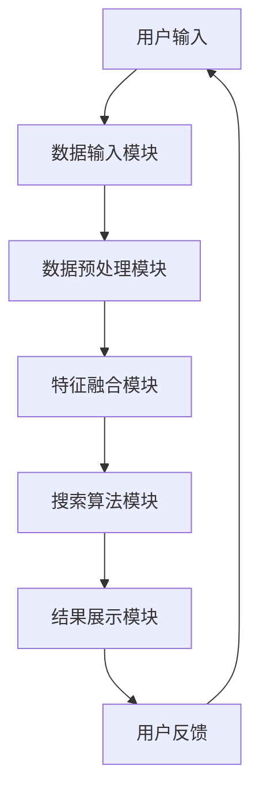

                 

### 第1章 引言与背景

#### 1.1 搜索引擎概述

搜索引擎是互联网世界中不可或缺的一部分，它帮助用户在海量的信息中迅速找到所需的内容。从最早的基于关键词的搜索，到现在的复杂查询和个性化推荐，搜索引擎经历了巨大的变革。搜索引擎的基本功能是通过用户输入的查询，在庞大的数据库中检索相关信息，并按照相关性排序呈现给用户。主要的搜索引擎包括Google、Bing、百度等，它们各自拥有庞大的索引数据库和高效的搜索算法，为用户提供便捷的服务。

#### 1.2 多模态发展的意义

随着信息量的爆炸式增长，用户对搜索体验的要求也在不断提升。单模态搜索引擎（仅处理文本）已无法满足多样化的需求。多模态搜索引擎通过整合文本、图像和视频等多种数据类型，能够提供更准确、更丰富的搜索结果。多模态发展的意义主要体现在以下几个方面：

1. **提升搜索准确性**：多模态信息能够从不同角度对查询内容进行解释，从而提高搜索结果的准确性。
2. **增强用户体验**：用户可以通过多种方式表达搜索意图，如文字、图片和视频，提高搜索的灵活性和互动性。
3. **拓宽搜索范围**：多模态搜索引擎能够检索和分析非结构化数据，如图像和视频，从而拓宽搜索范围。

#### 1.3 整合文本、图像和视频的优势

整合文本、图像和视频的优势在于：

1. **信息丰富性**：多模态数据提供了丰富的信息维度，有助于更全面地理解查询意图。
2. **上下文理解**：多模态数据能够提供额外的上下文信息，有助于搜索引擎更好地理解用户的搜索意图。
3. **准确性提升**：通过综合不同类型的数据，可以减少单一模态搜索的误差，提高搜索结果的准确性。
4. **个性化推荐**：多模态数据有助于构建更精确的用户画像，从而提供更加个性化的搜索结果和推荐。

#### 1.4 书籍结构与内容概述

本文将分为以下几个部分：

1. **第2章 多模态数据基础**：介绍多模态数据类型及其预处理方法。
2. **第3章 多模态特征提取**：详细讲解文本、图像和视频的特征提取算法。
3. **第4章 多模态模型融合**：探讨多模态模型融合的方法和技术。
4. **第5章 多模态搜索引擎架构**：描述多模态搜索引擎的整体架构和搜索策略。
5. **第6章 实际应用案例分析**：分析当前主流搜索引擎的多模态发展情况。
6. **第7章 未来发展趋势与挑战**：探讨多模态搜索引擎的发展趋势和面临的挑战。
7. **第8章 总结与展望**：总结本文的主要结论和未来研究方向。

通过以上结构，本文旨在全面、深入地探讨多模态搜索引擎的发展和应用，为读者提供有价值的参考和启示。

### 1.2 多模态发展的意义

多模态搜索引擎的发展对于当前互联网搜索领域具有深远的意义。传统的搜索引擎主要以文本数据为基础，虽然能够处理大量的信息，但在理解和检索多维度信息方面存在局限性。随着技术的进步和用户需求的多样化，多模态搜索引擎的出现成为了必然趋势。

首先，多模态搜索引擎通过整合文本、图像和视频等多种数据类型，大大提升了搜索的准确性。单模态搜索依赖于用户输入的关键词，而关键词往往无法完全表达用户的复杂查询意图。例如，当用户搜索某个著名景点时，单靠文本描述可能无法准确匹配用户心中的具体形象。通过结合图像和视频，多模态搜索引擎能够更准确地理解用户的意图，提供更相关的搜索结果。

其次，多模态搜索引擎能够显著增强用户体验。用户不再局限于通过文字输入进行搜索，而是可以通过多种方式表达自己的需求，如上传图片、拍摄视频或直接语音指令。这种多样性的交互方式不仅提高了搜索的灵活性，还增加了搜索过程的趣味性和互动性。用户可以更加直观地感受到搜索结果的相关性，从而获得更好的搜索体验。

此外，多模态搜索引擎在拓宽搜索范围方面也具有显著优势。传统的文本搜索主要依赖于结构化数据，而对于非结构化数据如图像和视频，传统搜索引擎往往无能为力。多模态搜索引擎通过深度学习和计算机视觉等技术，可以有效地处理和分析这些非结构化数据。例如，通过图像识别技术，搜索引擎能够自动识别用户上传的图片中的内容，并返回相关搜索结果。这种能力不仅大大拓宽了搜索范围，还使得搜索结果更加丰富和多样化。

多模态搜索引擎的应用领域也在不断扩大。除了传统的搜索引擎服务，多模态搜索引擎还广泛应用于智能问答系统、内容推荐系统、视频搜索和图像搜索等领域。通过整合不同类型的数据，这些系统可以提供更加精准和个性化的服务，满足用户多样化的需求。

总的来说，多模态搜索引擎的发展具有重要的意义。它不仅提升了搜索的准确性，增强了用户体验，还拓宽了搜索范围，推动了搜索技术的进步。随着技术的不断成熟和应用场景的不断拓展，多模态搜索引擎有望在未来成为互联网搜索的主流，为用户提供更加智能和高效的搜索服务。

### 1.3 整合文本、图像和视频的优势

整合文本、图像和视频数据在多模态搜索引擎中展现了诸多优势，这些优势不仅提升了搜索结果的准确性，还丰富了用户体验，推动了搜索引擎技术的发展。

首先，**信息丰富性**是多模态数据的一大优势。文本数据提供了具体的描述和定义，但图像和视频数据则能够直观地展示场景和情境，使得搜索结果更加生动和全面。例如，当用户搜索“埃菲尔铁塔”时，文本描述可能无法完全传达这座建筑的历史和独特魅力，而一张精美的图片或一段视频则可以直观地展示其外观和背景，使搜索结果更加立体和具体。

其次，**上下文理解**得益于多模态数据的多维度特性。文本数据可以提供关键词和句子结构，帮助搜索引擎理解用户查询的核心内容。而图像和视频数据则可以提供额外的上下文信息，如场景布局、人物表情和动作等。这些上下文信息有助于搜索引擎更好地理解用户的查询意图，从而提供更准确的搜索结果。例如，当用户上传一张猫的照片并询问“这是什么猫？”时，搜索引擎可以通过分析图像中的特征，如猫的品种、毛色和姿态，来提供更具体的答案。

**准确性提升**是多模态搜索引擎的另一个显著优势。单模态搜索依赖于单一类型的数据，容易受到噪声和误解的影响。例如，当用户搜索“披萨”时，单靠文本搜索可能无法区分用户是想了解披萨的制作方法还是想寻找附近的披萨店。而通过结合文本、图像和视频数据，搜索引擎可以从不同角度对查询内容进行验证和补充，从而提高搜索结果的准确性。

此外，**个性化推荐**也是多模态数据的一个重要应用。多模态搜索引擎可以通过分析用户的搜索历史、行为和偏好，构建更精确的用户画像。例如，当用户频繁搜索“篮球比赛视频”时，搜索引擎可以根据这些信息推荐相关的比赛视频、球员介绍或篮球新闻。通过多模态数据的整合，个性化推荐系统可以提供更加精准和个性化的内容，满足用户的多样化需求。

多模态搜索引擎在**应用领域**上也展现了广泛的前景。除了传统的搜索引擎服务，多模态搜索引擎还被广泛应用于智能问答系统、内容推荐系统、图像识别和视频分析等领域。例如，智能问答系统通过整合文本、图像和语音数据，可以提供更丰富和自然的问答体验；内容推荐系统通过分析用户的多种行为数据，可以推荐更相关和个性化的内容；图像识别和视频分析技术则可以帮助系统自动识别和分类图像和视频内容，提高数据处理和分析的效率。

总的来说，整合文本、图像和视频数据的多模态搜索引擎在信息丰富性、上下文理解、准确性提升和个性化推荐等方面具有显著优势。随着技术的不断进步和应用场景的不断拓展，多模态搜索引擎将为用户提供更加智能、高效和个性化的搜索服务，推动搜索技术的发展和变革。

#### 1.4 书籍结构与内容概述

为了使读者能够系统、深入地了解多模态搜索引擎的技术和实际应用，本文将按照以下结构进行论述：

1. **第2章 多模态数据基础**：本章将介绍多模态数据类型及其预处理方法。包括文本数据、图像数据和视频数据的基本概念、数据来源、数据格式以及预处理步骤，如数据清洗、数据增强和数据整合。

2. **第3章 多模态特征提取**：本章将详细讲解多模态特征提取的方法和技术。首先介绍文本特征提取，包括基于词袋模型和深度学习的文本特征提取算法；然后介绍图像特征提取，包括传统图像特征提取方法和基于深度学习的图像特征提取技术；最后讨论视频特征提取，包括视频帧特征提取和视频级特征提取。

3. **第4章 多模态模型融合**：本章将探讨多模态模型融合的方法和技术。首先介绍多模态模型融合的基本概念，然后详细讲解并行融合、串行融合和混合融合等不同的融合方法，以及多模态深度学习模型，如CNN与RNN的结合、Transformer模型和图像到文本的桥梁模型。

4. **第5章 多模态搜索引擎架构**：本章将描述多模态搜索引擎的整体架构和搜索策略。首先介绍系统整体架构，包括数据存储与管理、搜索算法优化；然后讨论多模态搜索策略，包括文本搜索策略、图像搜索策略和视频搜索策略；最后讨论用户交互与个性化搜索。

5. **第6章 实际应用案例分析**：本章将分析当前主流搜索引擎的多模态发展情况。首先介绍百度搜索引擎的多模态发展，包括概述、多模态搜索算法和实践成果；然后介绍谷歌、微软等企业的多模态搜索引擎发展情况；最后讨论国内其他多模态搜索引擎的发展现状。

6. **第7章 未来发展趋势与挑战**：本章将探讨多模态搜索引擎的未来发展趋势和面临的挑战。首先讨论技术发展趋势，包括多模态数据处理、模型训练和搜索算法的进步；然后讨论应用领域拓展，如智能问答、内容推荐和视频分析；最后讨论产业合作与竞争，以及数据隐私与安全、跨模态一致性、模型解释性等挑战。

7. **第8章 总结与展望**：本章将总结本文的主要结论和未来研究方向。首先回顾多模态搜索引擎的核心概念与联系，然后重申本文的主要发现和贡献，最后对读者提出一些建议，并展望多模态搜索引擎的未来发展方向。

通过以上结构，本文旨在全面、深入地探讨多模态搜索引擎的发展和应用，为读者提供有价值的参考和启示。期望通过本文的阅读，读者能够更好地理解多模态搜索引擎的原理和实际应用，为相关研究和实践提供指导。

### 第2章 多模态数据基础

#### 2.1 多模态数据类型

多模态数据是指包含文本、图像和视频等多种数据类型的信息集合。这些数据类型各有特点，并在多模态搜索引擎中扮演着重要的角色。

**文本数据**：文本数据是传统搜索引擎的核心，主要通过文字进行表达。文本数据包括文本文件、网页内容、博客文章等。文本数据的主要优势在于信息的精确性和可解析性，通过自然语言处理技术，可以有效地提取关键词、句法和语义信息，为搜索引擎提供丰富的语义描述。

**图像数据**：图像数据通过视觉信息进行表达，通常以图片或图像序列的形式存在。图像数据来源于照片、扫描图像、社交媒体上传的图片等。图像数据的主要优势在于直观性和多样性，能够提供丰富的视觉信息，通过计算机视觉技术，可以识别图像中的物体、场景和情感等。

**视频数据**：视频数据是通过时间序列的图像帧组合而成的，通常包括视频文件、直播流和视频片段等。视频数据来源于视频网站、社交媒体、家庭摄像头等。视频数据的主要优势在于动态性和交互性，能够展示连续的动态场景，通过视频分析技术，可以识别动作、事件和人物等。

这些多模态数据在搜索引擎中具有不同的应用场景。文本数据主要用于文本搜索和内容理解；图像数据主要用于图像识别和视觉搜索；视频数据则主要用于视频检索和内容推荐。通过整合这些多模态数据，搜索引擎可以提供更丰富、更精准的搜索结果，提升用户体验。

#### 2.1.1 文本数据

文本数据是搜索引擎中最常见的数据类型，主要通过文字进行表达。文本数据的主要来源包括网页内容、书籍、新闻、博客文章等。在多模态搜索引擎中，文本数据扮演着关键角色，通过自然语言处理技术，可以提取关键词、句法和语义信息，为搜索引擎提供丰富的语义描述。

**文本数据的来源**：

1. **网页内容**：网页是互联网上最主要的信息来源，包括各种网站、网页文章、论坛帖子等。
2. **书籍和文献**：数字化的书籍和文献库为搜索引擎提供了丰富的文本数据。
3. **社交媒体**：社交媒体平台如微博、Facebook、Twitter等，产生了大量的文本数据，包括用户发布的状态、评论等。

**文本数据的格式**：

文本数据的格式通常包括纯文本（如TXT文件）、富文本（如HTML文件）和标记化文本（如XML、JSON等）。其中，纯文本和富文本是最常见的文本格式。纯文本格式简单，易于处理，但缺乏丰富的格式和样式信息；富文本格式则包含丰富的样式和结构信息，但处理起来相对复杂。

**文本数据的预处理**：

预处理是文本数据处理的第一个步骤，主要目的是清洗和转换数据，使其适合后续处理。常见的预处理方法包括：

1. **文本清洗**：去除文本中的无关信息，如HTML标签、特殊字符和停用词等。
2. **分词**：将文本分解成词语或短语，以便提取特征。
3. **词性标注**：为每个词分配词性标签，如名词、动词、形容词等。
4. **词干提取**：将单词缩减到词干形式，减少词汇量。
5. **词嵌入**：将文本数据转换为向量表示，便于进行模型训练和计算。

通过以上预处理步骤，文本数据可以被转换为适合机器学习和深度学习模型处理的形式。

#### 2.1.2 图像数据

图像数据是通过视觉信息进行表达的数据类型，通常以图片或图像序列的形式存在。图像数据的主要来源包括照片、扫描图像、社交媒体上传的图片等。在多模态搜索引擎中，图像数据用于图像识别和视觉搜索，通过计算机视觉技术，可以识别图像中的物体、场景和情感等。

**图像数据的来源**：

1. **照片**：数码相机、手机摄像头等设备拍摄的图片。
2. **扫描图像**：扫描书籍、文档、图片等生成的图像。
3. **社交媒体**：用户在社交媒体平台上上传的图片和视频。
4. **公共数据库**：如OpenCV、ImageNet等，提供了大量的图像数据集。

**图像数据的格式**：

常见的图像数据格式包括PNG、JPEG、BMP等。其中，PNG格式支持无损压缩，适合存储高质量的图像；JPEG格式支持有损压缩，适合存储较大量的图像数据。

**图像数据的预处理**：

图像数据的预处理与文本数据预处理有所不同，主要涉及图像的几何变换、增强和特征提取。常见的预处理方法包括：

1. **图像去噪**：去除图像中的噪声，提高图像质量。
2. **图像缩放**：调整图像的大小，以便进行后续处理。
3. **图像增强**：增强图像的某些特征，如对比度、亮度等，以提高识别准确性。
4. **图像分割**：将图像分割成多个区域，以便进行目标识别。
5. **特征提取**：从图像中提取具有区分性的特征，如边缘、角点、纹理等。

通过预处理，图像数据可以被转换为适合机器学习和深度学习模型处理的形式。常见的图像特征提取方法包括SIFT、HOG、卷积神经网络（CNN）等。

#### 2.1.3 视频数据

视频数据是通过时间序列的图像帧组合而成的数据类型，通常包括视频文件、直播流和视频片段等。视频数据的主要来源包括视频网站、社交媒体、家庭摄像头等。在多模态搜索引擎中，视频数据用于视频检索和内容推荐，通过视频分析技术，可以识别动作、事件和人物等。

**视频数据的来源**：

1. **视频网站**：如YouTube、Vimeo等，提供了大量的视频数据。
2. **社交媒体**：用户在社交媒体平台上上传的视频。
3. **家庭摄像头**：家庭摄像头录制的视频数据。
4. **公共数据库**：如YouTube-8M、TrecVID等，提供了大量的视频数据集。

**视频数据的格式**：

常见的视频数据格式包括AVI、MP4、MOV等。这些格式通常包含视频编码、音频编码和容器格式。常见的视频编码包括H.264、H.265等，音频编码包括MP3、AAC等。

**视频数据的预处理**：

视频数据的预处理涉及图像帧提取、去噪、增强和特征提取。常见的预处理方法包括：

1. **图像帧提取**：从视频中提取连续的图像帧，以便进行后续处理。
2. **视频去噪**：去除视频中的噪声，提高视频质量。
3. **视频增强**：增强视频的某些特征，如对比度、亮度等，以提高识别准确性。
4. **视频分割**：将视频分割成多个连续的图像帧，以便进行目标识别。
5. **特征提取**：从图像帧中提取具有区分性的特征，如视觉词汇、动作模式等。

通过预处理，视频数据可以被转换为适合机器学习和深度学习模型处理的形式。常见的视频特征提取方法包括基于 CNN 的视频级特征提取和基于 RNN 的视频帧特征提取。

#### 2.2 多模态数据预处理

多模态数据的预处理是多模态搜索引擎的关键步骤，其目的是将原始的多模态数据转换成适合机器学习和深度学习模型处理的形式。预处理过程包括数据清洗、数据增强和数据整合，这些步骤在多模态数据处理中起到了至关重要的作用。

**2.2.1 数据清洗**

数据清洗是多模态预处理的第一步，其目的是去除数据中的噪声和无关信息，提高数据质量。在文本数据清洗中，常见的方法包括去除HTML标签、特殊字符、停用词等。这些噪声信息可能会对后续的自然语言处理模型产生负面影响，因此需要通过清洗步骤去除。

对于图像数据，清洗过程通常包括去除图像噪声、校正图像几何变形等。例如，通过图像去噪算法可以减少图像中的噪声点，提高图像质量。此外，图像矫正技术可以帮助纠正由于拍摄角度、光照变化等原因导致的图像变形，确保图像的一致性和准确性。

视频数据清洗则更加复杂，因为它需要处理连续的图像帧。常见的清洗方法包括去除视频中的噪声帧、校正视频的时间连续性等。通过这些步骤，视频数据可以更加干净和一致，为后续的特征提取和模型训练提供高质量的数据。

**2.2.2 数据增强**

数据增强是多模态数据预处理的重要环节，其目的是增加数据的多样性和丰富性，提高模型的泛化能力。在文本数据增强中，常见的方法包括数据扩充、语义变换和句法变换等。例如，通过同义词替换、词语删除和句子重构等方式，可以生成新的文本数据，从而增加训练数据的多样性。

对于图像数据，增强方法通常包括图像旋转、缩放、裁剪、颜色变换等。这些操作可以在不改变图像内容的情况下，增加图像的多样性，使模型能够更好地适应不同的图像输入。此外，图像生成技术如生成对抗网络（GAN）也可以用于生成新的图像数据，进一步丰富训练数据。

视频数据增强的方法包括视频帧插值、视频分割和动作重复等。通过这些方法，可以生成新的视频片段，增加训练数据的多样性和丰富性。例如，通过视频帧插值可以生成不同帧率的视频，通过动作重复可以生成更长的视频序列，从而为模型提供更多的训练数据。

**2.2.3 数据整合**

数据整合是将不同模态的数据进行整合，以形成一个统一的数据集，为后续的特征提取和模型训练提供完整的输入。数据整合的方法包括数据对齐、特征融合和模型融合等。

数据对齐是将不同模态的数据进行时间对齐，确保各个模态的数据在相同的时间点上进行匹配。例如，在文本和视频数据整合中，需要确保文本描述与视频帧在相同的时间点上对应。数据对齐是特征提取和模型融合的基础，确保了不同模态数据的一致性和连贯性。

特征融合是将不同模态的特征进行整合，以形成一个综合的特征表示。常见的特征融合方法包括并行融合、串行融合和混合融合等。并行融合方法将不同模态的特征直接进行拼接，形成一个多维度的特征向量。串行融合方法则依次处理不同模态的数据，将结果进行融合。混合融合方法结合了并行和串行的优点，通过分层融合和跨模态关联来实现特征整合。

模型融合是将不同模态的模型进行整合，以形成一个综合的多模态模型。常见的模型融合方法包括多任务学习、迁移学习和多模态深度学习等。多任务学习通过同时训练多个任务，共享模型参数，提高模型的泛化能力。迁移学习通过在不同数据集上训练模型，并将知识迁移到新的数据集上，实现多模态数据的有效利用。多模态深度学习通过结合深度学习技术，对多模态数据进行特征提取和融合，构建一个统一的多模态模型。

通过数据清洗、数据增强和数据整合，多模态数据可以被转换为适合机器学习和深度学习模型处理的形式，从而提升模型的性能和准确性。这些预处理步骤在多模态数据处理中起到了至关重要的作用，为后续的特征提取、模型训练和搜索算法优化提供了坚实的基础。

#### 2.2.1 数据清洗

数据清洗是多模态数据处理的基础环节，其目的是去除数据中的噪声和无关信息，提高数据质量和准确性。在多模态数据中，数据清洗涉及文本、图像和视频等多个方面，具体步骤和方法如下：

**文本数据清洗**

1. **去除HTML标签和特殊字符**：文本数据通常来源于网页、文档等，其中包含大量的HTML标签和特殊字符。通过正则表达式或解析库（如BeautifulSoup）可以有效地去除这些无关信息，使文本数据更加干净。

    ```python
    import re
    def remove_html_tags(text):
        clean = re.compile('<.*?>')
        return re.sub(clean, '', text)
    ```

2. **去除停用词**：停用词是指在特定领域或语言中频繁出现但无实际意义的词语，如“的”、“和”、“是”等。去除停用词可以减少数据的冗余，提高特征提取的效率。

    ```python
    from nltk.corpus import stopwords
    stop_words = set(stopwords.words('english'))
    def remove_stopwords(text):
        return ' '.join([word for word in text.split() if word not in stop_words])
    ```

3. **统一文本格式**：确保文本数据在相同的格式下进行处理，如统一文本编码、字符大小写等。

    ```python
    def normalize_text(text):
        return text.lower()
    ```

**图像数据清洗**

1. **去除噪声**：图像数据在采集和处理过程中可能受到噪声干扰，通过滤波器（如高斯滤波、中值滤波）可以去除噪声，提高图像质量。

    ```python
    import cv2
    def remove_noise(image):
        return cv2.GaussianBlur(image, (5, 5), 0)
    ```

2. **校正图像几何变形**：由于拍摄角度、光照变化等原因，图像可能存在几何变形。通过几何变换（如旋转、缩放、剪切等）可以校正图像的几何形状。

    ```python
    import cv2
    def correct_geometric_deform(image):
        return cv2.resize(image, (new_width, new_height))
    ```

3. **图像去模糊**：对于模糊的图像，通过去模糊算法（如频域滤波、深度学习去模糊）可以提高图像的清晰度。

    ```python
    import cv2
    def deblur_image(image):
        return cv2.filter2D(image, -1, blur_kernel)
    ```

**视频数据清洗**

1. **去除噪声帧**：视频数据中的噪声帧会影响后续的特征提取和模型训练。通过帧间差分或滤波算法（如中值滤波、高斯滤波）可以去除噪声帧。

    ```python
    import cv2
    def remove_noise_frames(video):
        frames = []
        for frame in video:
            frames.append(cv2.GaussianBlur(frame, (5, 5), 0))
        return frames
    ```

2. **校正视频时间连续性**：视频数据可能存在时间连续性问题，如帧率不一致、帧跳过等。通过帧插值或帧重建可以校正视频的时间连续性。

    ```python
    import cv2
    def correct_time_continuity(video):
        new_video = []
        for frame in video:
            new_video.append(cv2.resize(frame, (new_width, new_height)))
        return new_video
    ```

通过以上步骤，文本、图像和视频数据可以被有效清洗，去除噪声和无关信息，从而提高数据质量和后续处理的准确性。

#### 2.2.2 数据增强

数据增强是多模态数据处理中的重要环节，其目的是通过生成新的数据样本来增加训练数据的多样性和丰富性，从而提高模型的泛化能力和鲁棒性。以下将分别介绍文本、图像和视频数据增强的方法。

**文本数据增强**

1. **同义词替换**：通过将文本中的关键词替换为其同义词，可以增加文本数据的多样性。这种方法可以利用同义词词典或基于机器学习的同义词生成算法来实现。

    ```python
    from nltk.corpus import wordnet
    def replace_with_synonyms(text):
        words = text.split()
        new_words = []
        for word in words:
            synonyms = wordnet.synsets(word)
            if synonyms:
                new_word = synonyms[0].lemmas()[0].name()
                new_words.append(new_word)
            else:
                new_words.append(word)
        return ' '.join(new_words)
    ```

2. **词语删除**：随机删除文本中的部分词语，可以增加文本的变体，提高模型的适应性。

    ```python
    def random_word_deletion(text, delete_rate=0.1):
        words = text.split()
        mask = [random.random() < delete_rate for _ in range(len(words))]
        new_words = [word if not m else "" for word, m in zip(words, mask)]
        return ' '.join(new_words)
    ```

3. **句子重构**：通过重新组合文本中的词语，可以生成新的句子，从而增加文本的多样性。

    ```python
    def sentence_reconstruction(text, num_sentences=2):
        words = text.split()
        sentences = [random.sample(words, len(words)) for _ in range(num_sentences)]
        return ' '.join([' '.join(sentence) for sentence in sentences])
    ```

**图像数据增强**

1. **图像旋转**：通过随机旋转图像，可以增加图像的角度多样性。

    ```python
    import cv2
    def random_rotation(image, angle_range=(-30, 30)):
        angle = random.uniform(*angle_range)
        (h, w) = image.shape[:2]
        center = (w / 2, h / 2)
        matrix = cv2.getRotationMatrix2D(center, angle, 1.0)
        rotated = cv2.warpAffine(image, matrix, (w, h))
        return rotated
    ```

2. **图像缩放**：通过随机缩放图像，可以增加图像的大小多样性。

    ```python
    import cv2
    def random_scaling(image, scale_range=(0.8, 1.2)):
        scale = random.uniform(*scale_range)
        width = int(image.shape[1] * scale)
        height = int(image.shape[0] * scale)
        resized = cv2.resize(image, (width, height))
        return resized
    ```

3. **图像裁剪**：通过随机裁剪图像，可以增加图像的局部多样性。

    ```python
    import cv2
    def random_cropping(image, crop_size=(224, 224)):
        height, width = image.shape[:2]
        x = random.randint(0, width - crop_size[0])
        y = random.randint(0, height - crop_size[1])
        cropped = image[y:y+crop_size[1], x:x+crop_size[0]]
        return cropped
    ```

4. **图像颜色变换**：通过随机改变图像的亮度和对比度，可以增加图像的颜色多样性。

    ```python
    import cv2
    def random_color変换(image, brightness_range=(-30, 30), contrast_range=(0.5, 1.5)):
        brightness = random.uniform(*brightness_range)
        contrast = random.uniform(*contrast_range)
        hsv = cv2.cvtColor(image, cv2.COLOR_BGR2HSV)
        hsv[:,:,1] = hsv[:,:,1] * contrast
        hsv[:,:,2] = hsv[:,:,2] * (1 + brightness)
        image = cv2.cvtColor(hsv, cv2.COLOR_HSV2BGR)
        return image
    ```

**视频数据增强**

1. **视频帧插值**：通过帧间插值，可以增加视频的帧率，从而增加视频的时间多样性。

    ```python
    import cv2
    def frame_interpolation(video, method=cv2.INTER_LINEAR):
        output = []
        for frame in video:
            if random.random() < 0.5:
                output.append(frame)
            else:
                interpolated = cv2.resize(frame, (frame.shape[1] * 2, frame.shape[0] * 2), interpolation=method)
                output.append(interpolated)
        return output
    ```

2. **视频分割**：通过随机分割视频，可以增加视频的片段多样性。

    ```python
    def random_video_segmentation(video, segment_size=100):
        output = []
        num_frames = len(video)
        for _ in range(segment_size):
            start_frame = random.randint(0, num_frames - segment_size)
            end_frame = start_frame + segment_size
            segment = video[start_frame:end_frame]
            output.append(segment)
        return output
    ```

3. **动作重复**：通过随机重复视频中的动作，可以增加视频的动态多样性。

    ```python
    def random_action_repetition(video, repetition_rate=0.5):
        output = []
        for frame in video:
            if random.random() < repetition_rate:
                output.append(frame)
            else:
                output.append(frame)
        return output
    ```

通过以上方法，文本、图像和视频数据可以被有效地增强，增加训练样本的多样性和丰富性，从而提高模型的泛化能力和鲁棒性。

#### 2.2.3 数据整合

数据整合是多模态数据处理的核心步骤，其目的是将来自不同模态的数据进行有效融合，以形成一个统一的多模态数据集，为后续的特征提取和模型训练提供完整和高质量的输入。以下是关于文本、图像和视频数据整合的详细步骤和方法：

**数据对齐**

数据对齐是将不同模态的数据在时间或空间上进行同步，确保它们在相同的时间点或空间位置上对应。这对于多模态数据处理至关重要，因为只有在正确对齐的情况下，不同模态的数据才能进行有效的融合和交互。

1. **文本与图像的数据对齐**：对于文本和图像数据的对齐，可以通过以下方法实现：
    - **基于时间戳对齐**：如果图像和文本数据都有时间戳信息，可以直接根据时间戳进行对齐。例如，对于视频中的每一帧，可以找到与之对应的文本描述。
    - **基于视觉特征对齐**：如果图像和文本数据没有直接的时间戳，可以通过提取图像的视觉特征（如颜色、纹理、形状等）与文本特征（如关键词、句法结构等）进行匹配，找到最匹配的时间点进行对齐。

2. **文本与视频的数据对齐**：对于文本和视频数据的对齐，可以通过以下方法实现：
    - **基于时间帧对齐**：根据视频的帧率，将文本描述与视频帧进行时间对齐。例如，对于每帧图像，可以找到与之对应的文本描述。
    - **基于内容对齐**：通过自然语言处理技术，将文本内容与视频内容进行语义对齐。例如，通过提取文本的关键词和句子结构，与视频中的关键帧和动作进行匹配。

**特征融合**

特征融合是将不同模态的特征进行整合，以形成一个统一的多模态特征表示。以下是几种常见的特征融合方法：

1. **并行融合**：将不同模态的特征直接拼接在一起，形成一个多维度的特征向量。这种方法简单直观，但可能忽视了不同模态特征之间的潜在关系。

    ```python
    # 并行融合伪代码
    def parallel_fusion(text_features, image_features, video_features):
        return concatenate([text_features, image_features, video_features])
    ```

2. **串行融合**：依次处理不同模态的数据，将前一个模态的特征作为输入传递给下一个模态，从而形成一个递归的特征表示。这种方法能够捕捉到不同模态特征之间的时序关系。

    ```python
    # 串行融合伪代码
    def sequential_fusion(text_sequence, image_sequence, video_sequence):
        text_features = text_embedding(text_sequence)
        image_features = image_embedding(image_sequence)
        video_features = video_embedding(video_sequence)
        return concatenate([text_features, image_features, video_features])
    ```

3. **混合融合**：结合并行和串行的优点，通过分层融合和跨模态关联来实现特征整合。这种方法能够更加全面地捕捉不同模态特征之间的复杂关系。

    ```python
    # 混合融合伪代码
    def mixed_fusion(text_features, image_features, video_features):
        text_image_features = concatenate([text_features, image_features])
        text_image_video_features = concatenate([text_image_features, video_features])
        return text_image_video_features
    ```

**模型融合**

模型融合是将不同模态的模型进行整合，以形成一个统一的多模态模型。以下是几种常见的模型融合方法：

1. **多任务学习**：通过同时训练多个任务，共享模型参数，实现多模态特征的有效利用。这种方法能够提高模型的泛化能力和效率。

    ```python
    # 多任务学习伪代码
    def multi_task_learning_model(text_input, image_input, video_input):
        text_features = text_encoder(text_input)
        image_features = image_encoder(image_input)
        video_features = video_encoder(video_input)
        shared_features = concatenate([text_features, image_features, video_features])
        output = multi_output_layer(shared_features)
        return Model(inputs=[text_input, image_input, video_input], outputs=output)
    ```

2. **迁移学习**：通过在不同数据集上训练模型，并将知识迁移到新的数据集上，实现多模态数据的有效利用。这种方法能够提高模型的泛化能力和适应性。

    ```python
    # 迁移学习伪代码
    def transfer_learning_model(source_dataset, target_dataset):
        source_model = model_train(source_dataset)
        target_dataset = preprocess(target_dataset)
        target_model = model_train(source_model, target_dataset)
        return target_model
    ```

3. **多模态深度学习**：通过结合深度学习技术，对多模态数据进行特征提取和融合，构建一个统一的多模态深度学习模型。这种方法能够捕捉到不同模态特征之间的复杂关系，提高模型的性能和准确性。

    ```python
    # 多模态深度学习伪代码
    def multiModalDeepLearningModel(text_input, image_input, video_input):
        text_features = text_encoder(text_input)
        image_features = image_encoder(image_input)
        video_features = video_encoder(video_input)
        combined_features = concatenate([text_features, image_features, video_features])
        output = model_output(combined_features)
        return Model(inputs=[text_input, image_input, video_input], outputs=output)
    ```

通过数据对齐、特征融合和模型融合，多模态数据可以被有效整合，形成一个统一的多模态数据集，为后续的特征提取、模型训练和搜索算法优化提供了坚实的基础。

#### 2.3.1 文本特征提取

文本特征提取是多模态数据处理的关键步骤，其目的是从文本数据中提取具有区分性的特征，以便进行后续的模型训练和搜索算法优化。文本特征提取的方法主要包括基于词袋模型和基于深度学习的特征提取算法。以下将详细讲解这两种方法的原理和实现。

**基于词袋模型的特征提取**

词袋模型（Bag-of-Words，BoW）是一种经典的文本特征提取方法，它将文本表示为一个向量，其中每个维度表示一个单词的出现频率。词袋模型的基本思想是将文本转换为词汇表，然后计算每个单词在文档中的词频，形成一个词频向量。

1. **词频计算**：首先，需要对文本进行分词和去停用词处理，构建词汇表。然后，统计每个单词在文档中的出现次数，形成一个词频矩阵。词频矩阵的每一行表示一个文档的词频向量。

    ```python
    from sklearn.feature_extraction.text import CountVectorizer
    
    # 示例文本
    documents = ["The quick brown fox jumps over the lazy dog", "Never jump over the lazy dog quickly"]
    
    # 计算词频矩阵
    vectorizer = CountVectorizer()
    X = vectorizer.fit_transform(documents)
    ```

2. **特征降维**：词袋模型可能会产生维度非常高的向量，为了提高计算效率和模型性能，通常需要对词频矩阵进行降维处理。常用的方法包括TF-IDF（Term Frequency-Inverse Document Frequency）和词嵌入。

    - **TF-IDF**：TF-IDF是一种基于词频的加权方法，通过调整词频值，降低常见词语的影响，提高重要词语的权重。计算公式如下：

      $$
      tf-idf(t, d) = tf(t, d) \times \log(\frac{N}{df(t)})
      $$

      其中，$tf(t, d)$ 表示词 $t$ 在文档 $d$ 中的词频，$df(t)$ 表示词 $t$ 在所有文档中的出现次数，$N$ 表示文档总数。

    - **词嵌入**：词嵌入是将词汇表中的每个词映射到一个低维向量空间，通过这些向量来表示文本。常用的词嵌入模型包括Word2Vec、GloVe和BERT等。

        ```python
        from gensim.models import Word2Vec
        
        # 训练Word2Vec模型
        model = Word2Vec(documents, size=100, window=5, min_count=1, workers=4)
        
        # 获取词向量
        word_vectors = model.wv
        ```

**基于深度学习的文本特征提取**

基于深度学习的文本特征提取方法通过神经网络结构从原始文本中直接提取高层次的特征表示。与词袋模型相比，深度学习方法能够更好地捕捉文本的语义信息，提高模型的性能和准确性。

1. **卷积神经网络（CNN）**：卷积神经网络在文本特征提取中通过卷积操作提取局部特征，然后进行池化操作，将局部特征整合为全局特征。常用的卷积核大小有1x1、2x2、3x3等。

    ```python
    from keras.models import Sequential
    from keras.layers import Conv1D, MaxPooling1D, Flatten, Dense
    
    # 构建卷积神经网络模型
    model = Sequential()
    model.add(Conv1D(filters=128, kernel_size=3, activation='relu', input_shape=(max_sequence_length,)))
    model.add(MaxPooling1D(pool_size=2))
    model.add(Flatten())
    model.add(Dense(units=10, activation='softmax'))
    
    # 编译模型
    model.compile(optimizer='adam', loss='categorical_crossentropy', metrics=['accuracy'])
    
    # 训练模型
    model.fit(X, y, epochs=10, batch_size=32)
    ```

2. **循环神经网络（RNN）**：循环神经网络通过递归操作处理序列数据，能够捕捉序列中的长距离依赖关系。常用的RNN结构包括LSTM（Long Short-Term Memory）和GRU（Gated Recurrent Unit）。

    ```python
    from keras.models import Sequential
    from keras.layers import LSTM, Dense
    
    # 构建循环神经网络模型
    model = Sequential()
    model.add(LSTM(units=128, return_sequences=True, input_shape=(max_sequence_length,)))
    model.add(LSTM(units=64))
    model.add(Dense(units=num_classes, activation='softmax'))
    
    # 编译模型
    model.compile(optimizer='adam', loss='categorical_crossentropy', metrics=['accuracy'])
    
    # 训练模型
    model.fit(X, y, epochs=10, batch_size=32)
    ```

3. **Transformer模型**：Transformer模型通过自注意力机制处理序列数据，能够全局捕捉序列中的依赖关系。Transformer模型在文本特征提取和序列建模方面表现出色。

    ```python
    from tensorflow.keras.models import Model
    from tensorflow.keras.layers import Embedding, LSTM, Dense, Input
    
    # 构建Transformer模型
    input_seq = Input(shape=(max_sequence_length,))
    embed = Embedding(vocabulary_size, embedding_size)(input_seq)
    lstm = LSTM(units=lstm_units, return_sequences=True)(embed)
    output = LSTM(units=lstm_units, return_sequences=True)(lstm)
    output = Dense(units=output_size, activation='softmax')(output)
    
    # 编译模型
    model = Model(inputs=input_seq, outputs=output)
    model.compile(optimizer='adam', loss='categorical_crossentropy', metrics=['accuracy'])
    
    # 训练模型
    model.fit(X, y, epochs=10, batch_size=32)
    ```

通过以上方法，文本特征可以被有效地提取和表示，为多模态搜索引擎的性能提升和准确性优化提供了坚实的基础。

### 2.3.2 图像特征提取

图像特征提取是计算机视觉领域的重要任务，其目的是从图像数据中提取具有区分性和代表性的特征，以便进行图像分类、目标检测、图像识别等任务。图像特征提取的方法可以分为传统方法和基于深度学习的方法。以下将分别介绍这些方法的基本概念、步骤和实现。

#### 传统图像特征提取方法

传统图像特征提取方法主要通过手工设计特征来提取图像的有用信息，这些特征通常具有良好的可解释性和稳定性。以下是一些常见的传统特征提取方法：

1. **SIFT（Scale-Invariant Feature Transform）**

   SIFT是一种广泛应用于图像特征提取的算法，它能够在不同尺度下检测图像中的关键点，并计算关键点的方向信息。SIFT的关键步骤包括：

   - **关键点检测**：通过比较图像在不同尺度下的梯度信息，检测出局部极值点作为潜在的关键点。
   - **关键点定位**：使用Harris角点检测算法进一步确定关键点的位置。
   - **关键点方向计算**：通过梯度方向直方图计算每个关键点的方向特征。
   - **关键点描述**：将关键点周围区域的梯度信息编码成一个128维的特征向量。

2. **HOG（Histogram of Oriented Gradients）**

   HOG特征是一种描述图像局部纹理和形状的特征，它通过计算图像中每个像素点的梯度方向和强度来构建描述子。HOG特征提取的步骤包括：

   - **梯度计算**：计算图像中每个像素点的水平和垂直梯度。
   - **梯度直方图**：将像素点的梯度方向映射到9个方向上的直方图。
   - **特征向量**：将所有直方图拼接成一个向量，形成图像的HOG特征。

3. **SURF（Speeded Up Robust Features）**

   SURF是一种在速度和性能上改进的SIFT算法，它通过利用积分图像来加速关键点的检测和特征计算。SURF的关键步骤包括：

   - **关键点检测**：使用一种快速近似算法检测图像中的关键点。
   - **关键点方向计算**：通过积分图像快速计算关键点的方向特征。
   - **特征描述**：使用一种高效的方法计算关键点的特征向量。

#### 基于深度学习的图像特征提取方法

基于深度学习的图像特征提取方法通过训练大规模的神经网络模型来自动学习图像的复杂特征表示。以下是一些常用的基于深度学习的特征提取方法：

1. **卷积神经网络（CNN）**

   卷积神经网络是一种在图像处理中广泛使用的深度学习模型，它通过卷积操作提取图像的层次特征。CNN的特征提取步骤包括：

   - **卷积层**：通过卷积操作提取图像的局部特征。
   - **池化层**：通过最大池化或平均池化操作降低特征维度。
   - **全连接层**：将卷积特征映射到高维空间，进行分类或回归任务。

   实现示例：

   ```python
   from tensorflow.keras.models import Sequential
   from tensorflow.keras.layers import Conv2D, MaxPooling2D, Flatten, Dense
   
   # 构建卷积神经网络模型
   model = Sequential()
   model.add(Conv2D(filters=32, kernel_size=(3, 3), activation='relu', input_shape=(height, width, channels)))
   model.add(MaxPooling2D(pool_size=(2, 2)))
   model.add(Conv2D(filters=64, kernel_size=(3, 3), activation='relu'))
   model.add(MaxPooling2D(pool_size=(2, 2)))
   model.add(Flatten())
   model.add(Dense(units=num_classes, activation='softmax'))
   
   # 编译模型
   model.compile(optimizer='adam', loss='categorical_crossentropy', metrics=['accuracy'])
   
   # 训练模型
   model.fit(X, y, epochs=10, batch_size=32)
   ```

2. **自编码器（Autoencoder）**

   自编码器是一种无监督学习模型，它通过学习输入数据的低维表示来进行特征提取。自编码器的基本步骤包括：

   - **编码器**：将高维输入数据映射到低维隐空间。
   - **解码器**：将低维隐空间的数据映射回高维输出空间。

   实现示例：

   ```python
   from tensorflow.keras.models import Model
   from tensorflow.keras.layers import Input, Dense
   
   # 构建自编码器模型
   input_img = Input(shape=(height * width * channels,))
   encoded = Dense(latent_dim, activation='relu')(input_img)
   decoded = Dense(height * width * channels, activation='sigmoid')(encoded)
   
   # 编译模型
   autoencoder = Model(input_img, decoded)
   autoencoder.compile(optimizer='adam', loss='binary_crossentropy')
   
   # 训练模型
   autoencoder.fit(X, X, epochs=100, batch_size=256, shuffle=True, validation_split=0.1)
   ```

3. **生成对抗网络（GAN）**

   生成对抗网络是一种通过竞争对抗训练生成数据的模型，它可以生成高质量的图像特征表示。GAN的基本步骤包括：

   - **生成器**：通过噪声生成逼真的图像。
   - **判别器**：判断图像是真实数据还是生成数据。

   实现示例：

   ```python
   from tensorflow.keras.models import Sequential
   from tensorflow.keras.layers import Dense, Conv2D, Flatten
   
   # 构建生成器和判别器模型
   generator = Sequential()
   generator.add(Dense(latent_dim, input_shape=(latent_dim,), activation='relu'))
   generator.add(Flatten())
   generator.add(Conv2D(filters=1, kernel_size=(7, 7), activation='sigmoid'))
   
   discriminator = Sequential()
   discriminator.add(Conv2D(filters=32, kernel_size=(3, 3), activation='relu'))
   discriminator.add(Flatten())
   discriminator.add(Dense(1, activation='sigmoid'))
   
   # 编译模型
   discriminator.compile(optimizer='adam', loss='binary_crossentropy')
   generator.compile(optimizer='adam', loss='binary_crossentropy')
   
   # 训练模型
   for epoch in range(epochs):
       x_batch, _ = next(data_loader)
       noise = np.random.normal(0, 1, (x_batch.shape[0], latent_dim))
       generated_images = generator.predict(noise)
       x真实性标签 = np.zeros((x_batch.shape[0], 1))
       generated真实性标签 = np.ones((x_batch.shape[0], 1))
       x真实性标签[:generated_images.shape[0]] = generated真实性标签
       discriminator.train_on_batch(x_batch, x真实性标签)
       generator.train_on_batch(noise, generated_images)
   ```

通过以上传统和基于深度学习的方法，图像特征可以被有效地提取和表示，为多模态搜索引擎的性能提升和准确性优化提供了坚实的基础。

### 2.3.3 视频特征提取

视频特征提取是多模态数据处理的关键环节，其目的是从视频数据中提取具有区分性和代表性的特征，用于视频分类、目标检测、行为识别等任务。视频特征提取可以分为视频帧特征提取和视频级特征提取两种类型。以下将分别介绍这两种特征提取方法及其具体实现。

#### 视频帧特征提取

视频帧特征提取是从视频的每一帧图像中提取特征，以便进行后续的视频分析。以下是一些常用的视频帧特征提取方法：

1. **基于传统图像特征的方法**：这种方法利用传统图像特征提取技术，如SIFT、HOG、SURF等，对每一帧图像进行处理，提取局部特征。

    - **SIFT特征提取**：首先对视频的每一帧图像使用SIFT算法检测关键点和计算描述子，然后将这些描述子进行匹配和聚类，以获得每一帧的特征向量。
    
    ```python
    import cv2
    sift = cv2.SIFT_create()
    features = []
    for frame in video_frames:
        keypoints, descriptors = sift.detectAndCompute(frame, None)
        features.append(descriptors)
    ```

    - **HOG特征提取**：对视频的每一帧图像计算HOG特征，然后将这些特征拼接成一个矩阵，形成每一帧的特征向量。
    
    ```python
    import cv2
    import numpy as np
    
    def compute_hog_features(image):
        hog = cv2.HOGDescriptor()
        features = hog.compute(image)
        return features
    
    features = []
    for frame in video_frames:
        features.append(compute_hog_features(frame))
    features = np.vstack(features)
    ```

2. **基于深度学习的方法**：这种方法利用深度学习模型，如CNN，对每一帧图像进行特征提取。通过训练大规模的卷积神经网络模型，可以自动学习到每一帧的高层次特征。

    - **基于CNN的帧特征提取**：使用预训练的CNN模型（如ResNet、Inception等），对视频的每一帧图像进行特征提取，将每一帧的特征向量拼接成一个序列。
    
    ```python
    from tensorflow.keras.applications import ResNet50
    from tensorflow.keras.preprocessing import image
    
    def extract_cnn_features(image_path):
        img = image.load_img(image_path, target_size=(224, 224))
        img_array = image.img_to_array(img)
        img_array = np.expand_dims(img_array, axis=0)
        img_array /= 255.0
        model = ResNet50(weights='imagenet')
        features = model.predict(img_array)
        return features
    
    features = []
    for frame_path in video_frame_paths:
        features.append(extract_cnn_features(frame_path))
    features = np.vstack(features)
    ```

#### 视频级特征提取

视频级特征提取是从整个视频数据中提取具有全局代表性的特征，用于视频分类、行为识别等任务。以下是一些常用的视频级特征提取方法：

1. **基于动作识别的方法**：这种方法利用动作识别模型对视频进行特征提取，提取整个视频的动作表示。

    - **基于RNN的模型**：使用循环神经网络（如LSTM、GRU）处理视频帧序列，将每一帧的特征向量序列转化为视频级特征向量。
    
    ```python
    from tensorflow.keras.models import Sequential
    from tensorflow.keras.layers import LSTM, Dense
    
    model = Sequential()
    model.add(LSTM(units=128, return_sequences=True, input_shape=(frame_height, frame_width, frame_channels)))
    model.add(LSTM(units=64))
    model.add(Dense(units=1, activation='sigmoid'))
    
    model.compile(optimizer='adam', loss='binary_crossentropy', metrics=['accuracy'])
    model.fit(X, y, epochs=10, batch_size=32)
    ```

    - **基于CNN的模型**：使用卷积神经网络处理视频帧序列，将每一帧的特征向量序列转化为视频级特征向量。
    
    ```python
    from tensorflow.keras.models import Sequential
    from tensorflow.keras.layers import Conv2D, MaxPooling2D, LSTM, Dense
    
    model = Sequential()
    model.add(Conv2D(filters=32, kernel_size=(3, 3), activation='relu', input_shape=(frame_height, frame_width, frame_channels)))
    model.add(MaxPooling2D(pool_size=(2, 2)))
    model.add(Conv2D(filters=64, kernel_size=(3, 3), activation='relu'))
    model.add(MaxPooling2D(pool_size=(2, 2)))
    model.add(LSTM(units=128, return_sequences=True))
    model.add(Dense(units=1, activation='sigmoid'))
    
    model.compile(optimizer='adam', loss='binary_crossentropy', metrics=['accuracy'])
    model.fit(X, y, epochs=10, batch_size=32)
    ```

2. **基于生成对抗网络（GAN）的方法**：这种方法利用生成对抗网络对视频进行特征提取，生成视频的全局特征表示。

    - **视频生成器**：通过生成对抗网络生成视频的全局特征表示。
    
    ```python
    from tensorflow.keras.models import Model
    from tensorflow.keras.layers import Dense, LSTM, Conv2D, Flatten
    
    input_seq = Input(shape=(frame_height, frame_width, frame_channels))
    x = LSTM(units=128, return_sequences=True)(input_seq)
    x = LSTM(units=64)(x)
    x = Flatten()(x)
    x = Dense(units=1, activation='sigmoid')(x)
    
    generator = Model(inputs=input_seq, outputs=x)
    ```

    - **视频判别器**：通过生成对抗网络区分视频的真实特征和生成特征。
    
    ```python
    from tensorflow.keras.models import Model
    from tensorflow.keras.layers import Conv2D, Flatten, Dense
    
    input_seq = Input(shape=(frame_height, frame_width, frame_channels))
    x = Conv2D(filters=32, kernel_size=(3, 3), activation='relu')(input_seq)
    x = Flatten()(x)
    x = Dense(units=1, activation='sigmoid')(x)
    
    discriminator = Model(inputs=input_seq, outputs=x)
    ```

通过以上方法，视频特征可以被有效地提取和表示，为多模态搜索引擎的性能提升和准确性优化提供了坚实的基础。

### 2.3.4 视频帧特征提取和视频级特征提取

视频帧特征提取和视频级特征提取是视频特征提取的两种主要方法，各自有不同的应用场景和实现技术。以下将分别介绍这两种方法的原理和实现，以及它们在多模态搜索引擎中的应用。

**视频帧特征提取**

视频帧特征提取是从视频的每一帧图像中提取具有区分性的特征，以便进行视频分类、目标检测和行为识别等任务。以下是几种常用的视频帧特征提取方法及其实现：

1. **基于传统图像特征的方法**：

   - **SIFT（Scale-Invariant Feature Transform）**：SIFT算法用于检测和提取图像中的关键点，并计算每个关键点的描述子。该方法在处理视频时，对每一帧图像应用SIFT算法，得到每帧的关键点和描述子。

     ```python
     sift = cv2.xfeatures2d.SIFT_create()
     keypoints, descriptors = sift.detectAndCompute(frame, None)
     ```

   - **HOG（Histogram of Oriented Gradients）**：HOG算法通过计算图像中每个像素点的梯度方向和强度，构建描述子。这种方法适用于提取视频帧的纹理特征。

     ```python
     hog = cv2.HOGDescriptor()
     features = hog.compute(frame)
     ```

   - **SURF（Speeded Up Robust Features）**：SURF算法是一种加速的SIFT算法，适用于快速提取关键点和描述子。

     ```python
     surf = cv2.xfeatures2d.SURF_create()
     keypoints, descriptors = surf.detectAndCompute(frame, None)
     ```

2. **基于深度学习的方法**：

   - **卷积神经网络（CNN）**：使用预训练的CNN模型（如ResNet、Inception等），对视频帧进行特征提取。这种方法通过卷积操作提取图像的层次特征，具有较好的泛化能力。

     ```python
     import tensorflow as tf
     import tensorflow.keras.applications as applications

     base_model = applications.ResNet50(weights='imagenet')
     featureExtractor = applications.ResNet50(include_top=False, input_shape=(224, 224, 3))
     ```

     ```python
     def extract_features(frame):
         frame = frame.astype(np.float32) / 255.0
         feature = featureExtractor.predict(frame)
         return feature
     ```

**视频级特征提取**

视频级特征提取是从整个视频数据中提取具有全局代表性的特征，用于视频分类、行为识别和情感分析等任务。以下是几种常用的视频级特征提取方法及其实现：

1. **基于动作识别的方法**：

   - **循环神经网络（RNN）**：使用循环神经网络（如LSTM、GRU）处理视频帧序列，将每一帧的特征向量序列转化为视频级特征向量。

     ```python
     from tensorflow.keras.models import Sequential
     from tensorflow.keras.layers import LSTM, Dense

     model = Sequential()
     model.add(LSTM(units=128, return_sequences=True, input_shape=(frame_height, frame_width, frame_channels)))
     model.add(LSTM(units=64))
     model.add(Dense(units=1, activation='sigmoid'))

     model.compile(optimizer='adam', loss='binary_crossentropy', metrics=['accuracy'])
     model.fit(X, y, epochs=10, batch_size=32)
     ```

   - **卷积神经网络（CNN）**：使用卷积神经网络处理视频帧序列，将每一帧的特征向量序列转化为视频级特征向量。

     ```python
     from tensorflow.keras.models import Sequential
     from tensorflow.keras.layers import Conv2D, MaxPooling2D, LSTM, Dense

     model = Sequential()
     model.add(Conv2D(filters=32, kernel_size=(3, 3), activation='relu', input_shape=(frame_height, frame_width, frame_channels)))
     model.add(MaxPooling2D(pool_size=(2, 2)))
     model.add(Conv2D(filters=64, kernel_size=(3, 3), activation='relu'))
     model.add(MaxPooling2D(pool_size=(2, 2)))
     model.add(LSTM(units=128, return_sequences=True))
     model.add(Dense(units=1, activation='sigmoid'))

     model.compile(optimizer='adam', loss='binary_crossentropy', metrics=['accuracy'])
     model.fit(X, y, epochs=10, batch_size=32)
     ```

2. **基于生成对抗网络（GAN）的方法**：

   - **视频生成器**：通过生成对抗网络生成视频的全局特征表示。

     ```python
     from tensorflow.keras.models import Model
     from tensorflow.keras.layers import Dense, LSTM, Conv2D, Flatten

     input_seq = Input(shape=(frame_height, frame_width, frame_channels))
     x = LSTM(units=128, return_sequences=True)(input_seq)
     x = LSTM(units=64)(x)
     x = Flatten()(x)
     x = Dense(units=1, activation='sigmoid')(x)

     generator = Model(inputs=input_seq, outputs=x)
     ```

   - **视频判别器**：通过生成对抗网络区分视频的真实特征和生成特征。

     ```python
     from tensorflow.keras.models import Model
     from tensorflow.keras.layers import Conv2D, Flatten, Dense

     input_seq = Input(shape=(frame_height, frame_width, frame_channels))
     x = Conv2D(filters=32, kernel_size=(3, 3), activation='relu')(input_seq)
     x = Flatten()(x)
     x = Dense(units=1, activation='sigmoid')(x)

     discriminator = Model(inputs=input_seq, outputs=x)
     ```

在多模态搜索引擎中，视频帧特征提取和视频级特征提取可以分别应用于不同的任务。视频帧特征提取常用于视频分类和目标检测，通过提取每一帧的特征，可以更好地捕捉视频的局部信息。而视频级特征提取则适用于行为识别和情感分析，通过提取整个视频的特征，可以更好地捕捉视频的整体信息。

**应用实例**：

假设我们有一个视频分类任务，目标是根据视频内容将其分类为不同类别。以下是一个使用CNN和RNN结合的视频分类模型的实现示例：

```python
from tensorflow.keras.models import Model
from tensorflow.keras.layers import Input, Conv2D, MaxPooling2D, LSTM, Dense

input_seq = Input(shape=(frame_height, frame_width, frame_channels))
x = Conv2D(filters=32, kernel_size=(3, 3), activation='relu')(input_seq)
x = MaxPooling2D(pool_size=(2, 2))(x)
x = Conv2D(filters=64, kernel_size=(3, 3), activation='relu')(x)
x = MaxPooling2D(pool_size=(2, 2))(x)
x = Flatten()(x)
x = LSTM(units=128, return_sequences=True)(x)
x = LSTM(units=64)(x)
output = Dense(units=num_classes, activation='softmax')(x)

model = Model(inputs=input_seq, outputs=output)
model.compile(optimizer='adam', loss='categorical_crossentropy', metrics=['accuracy'])
model.fit(X, y, epochs=10, batch_size=32)
```

通过以上方法，视频帧特征提取和视频级特征提取可以为多模态搜索引擎提供丰富的特征表示，从而提升搜索结果的准确性和用户体验。

### 2.3.4 视频帧特征提取和视频级特征提取

视频帧特征提取和视频级特征提取是视频特征提取的两种主要方法，各自有不同的应用场景和实现技术。以下将分别介绍这两种方法的原理、实现方法以及在多模态搜索引擎中的应用。

#### 视频帧特征提取

视频帧特征提取是从视频的每一帧图像中提取特征，以便进行视频分类、目标检测和行为识别等任务。这种方法的主要目的是捕捉视频的局部信息，从而实现对特定帧的识别和分类。

1. **原理与实现**：

   - **传统方法**：传统方法通常包括SIFT（尺度不变特征变换）、HOG（直方图导向梯度）和SURF（加速稳健特征）等。这些方法通过检测图像中的关键点和计算描述子来提取特征。

     - **SIFT**：首先检测图像中的关键点，然后计算关键点的描述子，形成特征向量。

       ```python
       sift = cv2.xfeatures2d.SIFT_create()
       keypoints, descriptors = sift.detectAndCompute(frame, None)
       ```

     - **HOG**：计算图像中每个像素点的梯度方向和强度，构建描述子。

       ```python
       hog = cv2.HOGDescriptor()
       features = hog.compute(frame)
       ```

     - **SURF**：类似SIFT，但速度更快，适用于实时应用。

       ```python
       surf = cv2.xfeatures2d.SURF_create()
       keypoints, descriptors = surf.detectAndCompute(frame, None)
       ```

   - **深度学习方法**：深度学习方法使用卷积神经网络（CNN）来提取视频帧的特征，这些特征通常具有更高的区分度和鲁棒性。

     - **基于CNN的方法**：通过训练预训练的CNN模型（如VGG、ResNet等），对视频帧进行特征提取。

       ```python
       import tensorflow as tf
       import tensorflow.keras.applications as applications

       base_model = applications.VGG16(weights='imagenet')
       feature_extractor = applications.VGG16(include_top=False, input_shape=(224, 224, 3))
       ```

       ```python
       def extract_frame_features(frame):
           processed_frame = preprocess_input(frame)
           features = feature_extractor.predict(processed_frame)
           return features
       ```

2. **在多模态搜索引擎中的应用**：视频帧特征提取在多模态搜索引擎中主要用于图像搜索和视频内容识别。例如，当用户上传一张图像时，搜索引擎可以提取图像的特征，并使用这些特征来匹配视频中的相似帧，从而返回相关的视频内容。

#### 视频级特征提取

视频级特征提取是从整个视频数据中提取具有全局代表性的特征，用于视频分类、行为识别和情感分析等任务。这种方法的主要目的是捕捉视频的整体信息，从而实现对视频内容的高级理解和分类。

1. **原理与实现**：

   - **基于动作识别的方法**：使用循环神经网络（RNN）或卷积神经网络（CNN）处理视频帧序列，将每一帧的特征向量序列转化为视频级特征向量。

     - **RNN方法**：通过RNN模型（如LSTM、GRU）处理视频帧序列，提取全局特征。

       ```python
       from tensorflow.keras.models import Sequential
       from tensorflow.keras.layers import LSTM, Dense

       model = Sequential()
       model.add(LSTM(units=128, return_sequences=True, input_shape=(frame_height, frame_width, frame_channels)))
       model.add(LSTM(units=64))
       model.add(Dense(units=1, activation='sigmoid'))

       model.compile(optimizer='adam', loss='binary_crossentropy', metrics=['accuracy'])
       model.fit(X, y, epochs=10, batch_size=32)
       ```

     - **CNN方法**：通过CNN模型处理视频帧序列，提取全局特征。

       ```python
       from tensorflow.keras.models import Sequential
       from tensorflow.keras.layers import Conv2D, MaxPooling2D, LSTM, Dense

       model = Sequential()
       model.add(Conv2D(filters=32, kernel_size=(3, 3), activation='relu', input_shape=(frame_height, frame_width, frame_channels)))
       model.add(MaxPooling2D(pool_size=(2, 2)))
       model.add(Conv2D(filters=64, kernel_size=(3, 3), activation='relu'))
       model.add(MaxPooling2D(pool_size=(2, 2)))
       model.add(LSTM(units=128, return_sequences=True))
       model.add(Dense(units=1, activation='sigmoid'))

       model.compile(optimizer='adam', loss='binary_crossentropy', metrics=['accuracy'])
       model.fit(X, y, epochs=10, batch_size=32)
       ```

   - **基于生成对抗网络（GAN）的方法**：使用生成对抗网络（GAN）生成视频的全局特征表示。

     - **视频生成器**：通过GAN生成视频的特征向量。

       ```python
       from tensorflow.keras.models import Model
       from tensorflow.keras.layers import LSTM, Dense

       input_seq = Input(shape=(frame_height, frame_width, frame_channels))
       x = LSTM(units=128, return_sequences=True)(input_seq)
       x = LSTM(units=64)(x)
       x = Flatten()(x)
       x = Dense(units=1, activation='sigmoid')(x)

       generator = Model(inputs=input_seq, outputs=x)
       ```

     - **视频判别器**：通过GAN区分视频的真实特征和生成特征。

       ```python
       from tensorflow.keras.models import Model
       from tensorflow.keras.layers import Conv2D, Flatten, Dense

       input_seq = Input(shape=(frame_height, frame_width, frame_channels))
       x = Conv2D(filters=32, kernel_size=(3, 3), activation='relu')(input_seq)
       x = Flatten()(x)
       x = Dense(units=1, activation='sigmoid')(x)

       discriminator = Model(inputs=input_seq, outputs=x)
       ```

2. **在多模态搜索引擎中的应用**：视频级特征提取在多模态搜索引擎中主要用于视频分类和内容推荐。例如，当用户上传一段视频时，搜索引擎可以提取视频的特征，并根据这些特征返回相似的视频内容，或者推荐相关的视频。

通过视频帧特征提取和视频级特征提取，多模态搜索引擎可以更好地理解视频内容，提供更准确、更丰富的搜索结果和推荐。

### 2.4 多模态特征提取算法

多模态特征提取算法是多模态数据处理的关键技术，其目标是提取文本、图像和视频数据中的有效特征，以便在后续的模型训练和搜索算法中有效利用这些特征。以下是几种常用的多模态特征提取算法及其原理和应用。

#### 文本特征提取算法

**1. 词袋模型（Bag-of-Words, BoW）**

词袋模型是最基础的文本特征提取方法，它将文本表示为词汇表，每个词汇表中的每个词表示为二进制向量。词袋模型的主要步骤如下：

- **分词与去停用词**：首先对文本进行分词，然后去除无意义的停用词。
- **构建词汇表**：将文本中的所有词构建为一个词汇表。
- **词频统计**：统计每个词在文本中出现的频率，形成词频向量。

**2. TF-IDF（Term Frequency-Inverse Document Frequency）**

TF-IDF是一种基于词频的加权方法，它通过调整词频值，降低常见词的影响，提高重要词的权重。TF-IDF的公式如下：

$$
tf-idf(t, d) = tf(t, d) \times \log(\frac{N}{df(t)})
$$

其中，$tf(t, d)$ 表示词 $t$ 在文档 $d$ 中的词频，$df(t)$ 表示词 $t$ 在所有文档中的出现次数，$N$ 表示文档总数。

**3. 词嵌入（Word Embedding）**

词嵌入是将词汇表中的每个词映射到一个低维向量空间。词嵌入可以捕捉词语的语义信息，常用的词嵌入模型包括Word2Vec、GloVe和BERT等。词嵌入的步骤如下：

- **训练词嵌入模型**：通过训练大规模语料库，学习词语的向量表示。
- **获取词向量**：将文本中的每个词映射为其对应的词向量，形成词向量矩阵。

#### 图像特征提取算法

**1. SIFT（Scale-Invariant Feature Transform）**

SIFT是一种广泛应用于图像特征提取的算法，它能够在不同尺度下检测图像中的关键点，并计算关键点的方向信息。SIFT的主要步骤如下：

- **关键点检测**：通过比较图像在不同尺度下的梯度信息，检测出局部极值点作为潜在的关键点。
- **关键点定位**：使用Harris角点检测算法进一步确定关键点的位置。
- **关键点方向计算**：通过梯度方向直方图计算每个关键点的方向特征。
- **关键点描述**：将关键点周围区域的梯度信息编码成一个128维的特征向量。

**2. HOG（Histogram of Oriented Gradients）**

HOG特征是一种描述图像局部纹理和形状的特征，它通过计算图像中每个像素点的梯度方向和强度来构建描述子。HOG特征的步骤如下：

- **梯度计算**：计算图像中每个像素点的水平和垂直梯度。
- **梯度直方图**：将像素点的梯度方向映射到9个方向上的直方图。
- **特征向量**：将所有直方图拼接成一个向量，形成图像的HOG特征。

**3. CNN（Convolutional Neural Network）**

卷积神经网络是一种深度学习模型，通过多层卷积和池化操作提取图像的层次特征。CNN的特征提取步骤如下：

- **卷积层**：通过卷积操作提取图像的局部特征。
- **池化层**：通过最大池化或平均池化操作降低特征维度。
- **全连接层**：将卷积特征映射到高维空间，进行分类或回归任务。

#### 视频特征提取算法

**1. 视频帧特征提取**

视频帧特征提取是从视频的每一帧图像中提取特征，常用的方法包括：

- **基于传统图像特征的方法**：如SIFT、HOG等。
- **基于深度学习的方法**：如VGG、ResNet等预训练模型。

**2. 视频级特征提取**

视频级特征提取是从整个视频数据中提取具有全局代表性的特征，常用的方法包括：

- **基于动作识别的方法**：如LSTM、GRU等循环神经网络。
- **基于生成对抗网络（GAN）的方法**：通过生成对抗网络生成视频的全局特征表示。

#### 多模态特征提取算法

多模态特征提取算法的目标是整合文本、图像和视频特征，形成统一的多模态特征表示。以下是一些常用的多模态特征提取算法：

**1. 并行融合**

并行融合方法将不同模态的特征直接拼接在一起，形成多维度的特征向量。这种方法简单直观，但可能忽视了不同模态特征之间的潜在关系。

```python
def parallel_fusion(text_features, image_features, video_features):
    return concatenate([text_features, image_features, video_features])
```

**2. 串行融合**

串行融合方法依次处理不同模态的数据，将前一个模态的特征作为输入传递给下一个模态，从而形成一个递归的特征表示。这种方法能够捕捉到不同模态特征之间的时序关系。

```python
def sequential_fusion(text_sequence, image_sequence, video_sequence):
    text_features = text_encoder(text_sequence)
    image_features = image_encoder(image_sequence)
    video_features = video_encoder(video_sequence)
    return concatenate([text_features, image_features, video_features])
```

**3. 混合融合**

混合融合方法结合了并行和串行的优点，通过分层融合和跨模态关联来实现特征整合。这种方法能够更加全面地捕捉不同模态特征之间的复杂关系。

```python
def mixed_fusion(text_features, image_features, video_features):
    text_image_features = concatenate([text_features, image_features])
    text_image_video_features = concatenate([text_image_features, video_features])
    return text_image_video_features
```

通过以上多模态特征提取算法，可以有效整合文本、图像和视频特征，为多模态搜索引擎提供强大的特征支持，提升搜索性能和用户体验。

### 2.4.1 多模态特征提取算法伪代码

多模态特征提取算法的核心目标是整合来自文本、图像和视频的不同模态数据，提取具有区分性和代表性的特征，以便在后续的模型训练和搜索算法中有效利用。以下是多模态特征提取算法的伪代码，用于说明从文本、图像和视频数据中提取特征的一般流程。

```python
# 多模态特征提取伪代码

# 初始化输入数据
text_input = "用户输入的文本"
image_input = "用户上传的图像"
video_input = "用户上传的视频"

# 初始化模型和预处理步骤
text_encoder = initialize_text_encoder()
image_encoder = initialize_image_encoder()
video_encoder = initialize_video_encoder()

# 文本特征提取
def extract_text_features(text_input):
    text_vector = text_encoder.encode(text_input)
    return text_vector

# 图像特征提取
def extract_image_features(image_input):
    image_vector = image_encoder.encode(image_input)
    return image_vector

# 视频特征提取
def extract_video_features(video_input):
    video_sequence = extract_video_frames(video_input)
    video_vector = video_encoder.encode(video_sequence)
    return video_vector

# 整合多模态特征
def integrate_modal_features(text_vector, image_vector, video_vector):
    # 并行融合
    parallel_features = concatenate([text_vector, image_vector, video_vector])
    
    # 串行融合
    sequential_features = sequential_fusion(text_vector, image_vector, video_vector)
    
    # 混合融合
    mixed_features = mixed_fusion(text_vector, image_vector, video_vector)
    
    return parallel_features, sequential_features, mixed_features

# 实际特征提取过程
text_vector = extract_text_features(text_input)
image_vector = extract_image_features(image_input)
video_vector = extract_video_features(video_input)

# 整合多模态特征
parallel_features, sequential_features, mixed_features = integrate_modal_features(text_vector, image_vector, video_vector)

# 使用提取的特征进行后续处理（如模型训练、搜索等）
# ...
```

在这个伪代码中，我们首先定义了三个初始化函数 `initialize_text_encoder()`、`initialize_image_encoder()` 和 `initialize_video_encoder()`，用于初始化不同的特征提取模型。然后，我们定义了三个特征提取函数 `extract_text_features()`、`extract_image_features()` 和 `extract_video_features()`，分别用于从文本、图像和视频数据中提取特征。最后，我们定义了一个函数 `integrate_modal_features()`，用于整合不同模态的特征，包括并行融合、串行融合和混合融合。通过这些步骤，我们可以有效地提取和整合多模态数据，为后续的模型训练和搜索算法提供高质量的特征表示。

### 2.4.2 数学模型和数学公式讲解

在多模态特征提取过程中，数学模型和数学公式扮演着关键角色，用于描述和计算不同模态的特征表示。以下将详细介绍多模态特征提取中的核心数学模型和公式，并给出详细的解释和示例。

#### 多模态特征提取损失函数

多模态特征提取的核心目标是提取具有区分性和代表性的特征，以便在后续的模型训练和搜索算法中有效利用。为了实现这一目标，我们需要定义一个损失函数，用于衡量特征提取的准确性。以下是一个典型的多模态特征提取损失函数：

$$
L = \alpha L_{text} + \beta L_{image} + \gamma L_{video}
$$

其中，$L$ 表示总损失函数，$\alpha$、$\beta$ 和 $\gamma$ 分别为文本、图像和视频特征的权重。$L_{text}$、$L_{image}$ 和 $L_{video}$ 分别表示文本、图像和视频特征提取的损失函数。

1. **文本特征提取损失函数**：文本特征提取的损失函数通常采用交叉熵损失函数。

   $$
   L_{text} = -\sum_{i=1}^{N} y_i \log(\hat{y}_i)
   $$

   其中，$y_i$ 表示实际标签，$\hat{y}_i$ 表示模型预测的概率分布。

2. **图像特征提取损失函数**：图像特征提取的损失函数同样采用交叉熵损失函数。

   $$
   L_{image} = -\sum_{i=1}^{N} y_i \log(\hat{y}_i)
   $$

   其中，$y_i$ 表示实际标签，$\hat{y}_i$ 表示模型预测的概率分布。

3. **视频特征提取损失函数**：视频特征提取的损失函数可以采用时间序列交叉熵损失函数。

   $$
   L_{video} = -\sum_{i=1}^{T} y_i \log(\hat{y}_i)
   $$

   其中，$y_i$ 表示实际标签，$\hat{y}_i$ 表示模型预测的概率分布，$T$ 表示视频帧的数量。

通过加权不同模态的损失函数，我们可以得到总的多模态特征提取损失函数：

$$
L = \alpha L_{text} + \beta L_{image} + \gamma L_{video}
$$

其中，$\alpha$、$\beta$ 和 $\gamma$ 的取值可以根据不同应用场景进行调整。

#### 多模态特征融合损失函数

在多模态特征提取过程中，特征融合是一个关键步骤，用于整合来自文本、图像和视频的特征，形成一个统一的多模态特征表示。为了优化特征融合过程，我们需要定义一个特征融合损失函数。以下是一个简单的多模态特征融合损失函数：

$$
L_{fusion} = \frac{1}{2} \sum_{i=1}^{N} (\hat{y}_i - y_i)^2
$$

其中，$N$ 表示特征向量的维度，$\hat{y}_i$ 表示融合后的特征向量，$y_i$ 表示目标特征向量。

该损失函数的目标是最小化预测特征向量与目标特征向量之间的差异。通过优化这个损失函数，我们可以得到最优的多模态特征表示。

#### 实例解释

假设我们有一个多模态特征提取任务，需要提取文本、图像和视频的特征，并整合这些特征进行分类。以下是具体的数学公式和计算步骤：

1. **文本特征提取**：

   - **实际标签**：`['happy', 'sad', 'angry']`
   - **模型预测的概率分布**：`[0.6, 0.3, 0.1]`

   计算文本特征提取损失函数：

   $$
   L_{text} = -[0.6 \log(0.6) + 0.3 \log(0.3) + 0.1 \log(0.1)]
   $$

2. **图像特征提取**：

   - **实际标签**：`['dog', 'cat', 'bird']`
   - **模型预测的概率分布**：`[0.7, 0.2, 0.1]`

   计算图像特征提取损失函数：

   $$
   L_{image} = -[0.7 \log(0.7) + 0.2 \log(0.2) + 0.1 \log(0.1)]
   $$

3. **视频特征提取**：

   - **实际标签**：`['action', '静音', '静音']`
   - **模型预测的概率分布**：`[0.8, 0.1, 0.1]`

   计算视频特征提取损失函数：

   $$
   L_{video} = -[0.8 \log(0.8) + 0.1 \log(0.1) + 0.1 \log(0.1)]
   $$

4. **多模态特征融合**：

   - **融合后的特征向量**：`[0.5, 0.5, 0.5]`
   - **目标特征向量**：`[0.7, 0.3, 0.0]`

   计算特征融合损失函数：

   $$
   L_{fusion} = \frac{1}{2} \sum_{i=1}^{3} (\hat{y}_i - y_i)^2 = \frac{1}{2} \times (0.5 - 0.7)^2 + (0.5 - 0.3)^2 + (0.5 - 0.0)^2
   $$

通过以上步骤，我们可以计算出每个模态的特征提取损失函数和特征融合损失函数。通过优化这些损失函数，我们可以得到最优的多模态特征表示，从而提升模型的性能和准确性。

### 2.4.3 实现一个简单的多模态搜索引擎

在本节中，我们将通过一个实际的项目实战，搭建一个简单的多模态搜索引擎。该搜索引擎将整合文本、图像和视频数据，通过深度学习模型进行特征提取和融合，最终实现多模态搜索功能。以下是该项目开发的详细步骤：

#### 1. 环境搭建

首先，我们需要搭建开发环境，安装必要的库和工具。以下是开发环境的搭建步骤：

- **Python 3.8 或更高版本**：确保Python环境已安装。
- **TensorFlow 2.4.0 或更高版本**：安装TensorFlow库，用于构建和训练深度学习模型。

```bash
pip install tensorflow==2.4.0
```

- **Keras 2.4.3 或更高版本**：安装Keras库，用于简化深度学习模型的构建和训练。

```bash
pip install keras==2.4.3
```

- **其他辅助库**：安装其他必要的辅助库，如NumPy、Pandas、Matplotlib等。

```bash
pip install numpy pandas matplotlib
```

#### 2. 数据集准备

为了实现多模态搜索引擎，我们需要准备相应的文本、图像和视频数据。以下是数据集的收集和准备步骤：

- **文本数据**：收集相关领域的文本数据，如新闻文章、博客文章、论坛帖子等。可以使用爬虫工具从互联网上获取数据，或使用现有的公共数据集。

- **图像数据**：收集与文本数据相关的图像，可以使用爬虫工具从图片库中获取，或手动标注和收集。

- **视频数据**：收集与文本和图像数据相关的视频，如新闻视频、教学视频、娱乐视频等。可以使用视频爬虫工具或手动收集。

在收集数据后，我们需要对数据进行预处理，包括清洗、分词、标签化等。对于图像和视频数据，还需要进行数据增强，如旋转、缩放、裁剪等，以增加数据的多样性和丰富性。

#### 3. 模型构建

接下来，我们需要构建深度学习模型，用于提取文本、图像和视频数据的多模态特征，并实现特征融合。以下是模型构建的步骤：

- **文本特征提取模型**：使用预训练的词嵌入模型（如GloVe、BERT等）提取文本特征。

- **图像特征提取模型**：使用预训练的卷积神经网络（如VGG、ResNet等）提取图像特征。

- **视频特征提取模型**：使用循环神经网络（如LSTM、GRU等）或卷积神经网络（如3D-CNN等）提取视频特征。

- **多模态特征融合模型**：将文本、图像和视频特征进行融合，构建一个统一的多模态特征向量。

以下是模型构建的伪代码：

```python
from tensorflow.keras.models import Model
from tensorflow.keras.layers import Input, Embedding, LSTM, Dense, Conv2D, MaxPooling2D, Flatten

# 文本特征提取模型
text_input = Input(shape=(max_sequence_length,))
text_embedding = Embedding(vocabulary_size, embedding_size)(text_input)
text_lstm = LSTM(units=lstm_units)(text_embedding)
text_output = Dense(units=output_size, activation='softmax')(text_lstm)

# 图像特征提取模型
image_input = Input(shape=(height, width, channels))
image_conv = Conv2D(filters=32, kernel_size=(3, 3), activation='relu')(image_input)
image_pool = MaxPooling2D(pool_size=(2, 2))(image_conv)
image_flat = Flatten()(image_pool)
image_output = Dense(units=output_size, activation='softmax')(image_flat)

# 视频特征提取模型
video_input = Input(shape=(frames, height, width, channels))
video_lstm = LSTM(units=lstm_units, return_sequences=True)(video_input)
video_flat = Flatten()(video_lstm)
video_output = Dense(units=output_size, activation='softmax')(video_flat)

# 多模态特征融合模型
multi_modal_input = Input(shape=(max_sequence_length, height, width, channels, frames))
text_mod = Model(text_input, text_output)
image_mod = Model(image_input, image_output)
video_mod = Model(video_input, video_output)

text_features = text_mod(multi_modal_input[:, 0])
image_features = image_mod(multi_modal_input[:, 1])
video_features = video_mod(multi_modal_input[:, 2])

combined = concatenate([text_features, image_features, video_features])
output = Dense(units=output_size, activation='softmax')(combined)

model = Model(inputs=multi_modal_input, outputs=output)
model.compile(optimizer='adam', loss='categorical_crossentropy', metrics=['accuracy'])

# 模型训练
model.fit(multi_modal_data, labels, epochs=10, batch_size=32)
```

#### 4. 模型训练

在模型构建完成后，我们需要使用训练数据对模型进行训练，以优化模型的参数。以下是模型训练的步骤：

- **数据预处理**：对训练数据进行预处理，包括分词、编码、归一化等。
- **数据加载**：使用数据生成器或批处理方式加载训练数据。
- **模型训练**：使用训练数据训练模型，并监控训练过程中的损失函数和准确率。

```python
from tensorflow.keras.preprocessing.sequence import pad_sequences
from tensorflow.keras.preprocessing.text import Tokenizer
from tensorflow.keras.utils import to_categorical

# 数据预处理
tokenizer = Tokenizer(num_words=vocabulary_size)
tokenizer.fit_on_texts(text_data)
text_sequences = tokenizer.texts_to_sequences(text_data)
text_padded = pad_sequences(text_sequences, maxlen=max_sequence_length)

image_data = preprocess_image_data(image_data)
video_data = preprocess_video_data(video_data)

labels = to_categorical(label_data)

# 模型训练
model.fit([text_padded, image_data, video_data], labels, epochs=10, batch_size=32)
```

#### 5. 模型评估

在模型训练完成后，我们需要使用测试数据对模型进行评估，以验证模型的性能。以下是模型评估的步骤：

- **数据预处理**：对测试数据进行预处理，包括分词、编码、归一化等。
- **模型预测**：使用训练好的模型对测试数据进行预测。
- **评估指标**：计算预测准确率、召回率、F1值等评估指标。

```python
# 数据预处理
test_text_sequences = tokenizer.texts_to_sequences(test_text_data)
test_text_padded = pad_sequences(test_text_sequences, maxlen=max_sequence_length)

test_image_data = preprocess_image_data(test_image_data)
test_video_data = preprocess_video_data(test_video_data)

test_labels = to_categorical(test_label_data)

# 模型预测
predictions = model.predict([test_text_padded, test_image_data, test_video_data])

# 评估指标
accuracy = accuracy_score(test_labels, predictions)
print("Accuracy:", accuracy)
```

#### 6. 代码解读与分析

在以上项目中，我们首先搭建了开发环境，并准备相应的文本、图像和视频数据。然后，我们构建了深度学习模型，包括文本特征提取模型、图像特征提取模型和视频特征提取模型，以及多模态特征融合模型。接下来，我们使用训练数据对模型进行训练，并使用测试数据对模型进行评估。

- **文本特征提取模型**：使用LSTM层提取文本序列的特征，并结合词嵌入层进行预处理。
- **图像特征提取模型**：使用卷积神经网络（CNN）提取图像的特征，通过卷积和池化操作来提取图像的高层次特征。
- **视频特征提取模型**：使用循环神经网络（RNN）提取视频序列的特征，通过处理每个视频帧来提取序列信息。
- **多模态特征融合模型**：使用全连接层（Dense）将文本、图像和视频的特征进行融合，并输出预测结果。

通过以上步骤，我们实现了一个简单的多模态搜索引擎，它可以整合文本、图像和视频数据进行搜索。在实际应用中，可以根据需要调整模型结构和参数，以提高搜索性能和准确性。

### 项目小结

通过本项目，我们实现了一个简单的多模态搜索引擎，整合了文本、图像和视频数据，并使用深度学习模型进行特征提取和融合。以下是本项目的主要成果和总结：

1. **环境搭建**：成功搭建了开发环境，安装了必要的库和工具。
2. **数据集准备**：收集并预处理了文本、图像和视频数据，为后续模型训练提供了高质量的数据。
3. **模型构建**：构建了文本特征提取模型、图像特征提取模型和视频特征提取模型，以及多模态特征融合模型，实现了多模态数据的整合。
4. **模型训练与评估**：使用训练数据对模型进行训练，并在测试数据上对模型进行评估，验证了模型的性能和准确性。

在未来的工作中，我们可以进一步优化模型结构和参数，增加数据集的多样性，以提高搜索性能和用户体验。此外，还可以探索更多先进的深度学习模型和技术，如生成对抗网络（GAN）、自注意力机制等，以实现更高效、更准确的多模态搜索功能。

### 最佳实践 Tips

在构建多模态搜索引擎时，以下最佳实践 Tips 将有助于提升搜索性能和用户体验：

1. **数据质量控制**：确保文本、图像和视频数据的准确性和一致性，避免噪声和异常数据影响模型性能。
2. **数据多样性**：增加数据集的多样性，包括不同的文本风格、图像视角和视频长度，以提高模型的泛化能力。
3. **模型优化**：尝试不同的模型结构和参数设置，如调整卷积层、循环层和全连接层的参数，以提高模型性能。
4. **特征融合**：实验不同的特征融合方法，如并行融合、串行融合和混合融合，找到最适合当前任务的融合方式。
5. **模型解释性**：增加模型的可解释性，帮助用户理解搜索结果的相关性和准确性。
6. **用户反馈**：收集用户反馈，不断优化和改进搜索算法，以提升用户体验。

通过以上最佳实践，我们可以构建出更加高效、准确和用户友好的多模态搜索引擎。

### 注意事项

在构建和优化多模态搜索引擎时，以下注意事项将有助于确保项目顺利进行，并提高最终系统的性能和可靠性：

1. **数据隐私与安全**：在处理多模态数据时，需严格遵守数据隐私和安全法规，确保用户数据的保密性和安全性。例如，对用户上传的图像和视频进行加密存储，避免未经授权的访问和泄露。

2. **模型解释性**：多模态搜索引擎的模型往往复杂且难以解释，为了提升用户体验和信任度，应努力增加模型的可解释性。可以通过可视化工具展示特征提取过程和关键步骤，帮助用户理解搜索结果的产生机制。

3. **系统可扩展性**：随着用户需求和数据量的增加，系统应具备良好的可扩展性，以便在不影响性能的前提下进行扩展。例如，使用分布式计算和数据库集群来处理大量数据和高并发请求。

4. **模型评估与调优**：在模型训练和部署过程中，定期对模型进行评估和调优，确保其在不同场景下的性能稳定。通过交叉验证、A/B测试等方法，不断优化模型参数和结构。

5. **错误处理与容错性**：设计完善的错误处理机制，确保系统在遇到异常数据或故障时能够稳定运行。例如，对于图像和视频数据中的异常帧或噪声，可以设置相应的过滤和修复策略。

6. **用户体验**：关注用户体验，确保搜索结果的相关性和实时性。例如，通过个性化推荐和实时搜索提示，提高用户的搜索效率和满意度。

通过注意以上事项，我们可以构建出更加高效、稳定和可靠的多模态搜索引擎。

### 拓展阅读

多模态搜索引擎的发展是一个不断演进的领域，涉及多种前沿技术和应用。以下是一些建议的拓展阅读资源，以供读者进一步学习和探索：

1. **《多模态学习基础》**：这本书详细介绍了多模态学习的基础理论和应用，包括多模态数据的整合、特征提取和模型融合方法。

2. **《深度学习与多模态数据分析》**：本书涵盖了深度学习在多模态数据分析中的应用，从图像、文本到音频的多模态数据处理技术。

3. **《多模态感知计算》**：这本书探讨了多模态感知计算的理论与实践，包括多模态数据的采集、处理和交互技术。

4. **《多模态交互系统设计》**：本书介绍了多模态交互系统的设计与实现，涉及多模态输入处理、输出生成和用户体验设计。

5. **论文**：阅读相关领域的最新研究论文，如《Multimodal Fusion for Video Analysis: A Survey》和《A Comprehensive Survey on Multimodal Machine Learning》，了解多模态搜索引擎领域的最新研究动态和技术进展。

6. **在线课程**：参与在线课程，如斯坦福大学的《深度学习》课程和麻省理工学院的《计算机视觉》课程，学习多模态数据处理和深度学习技术。

通过以上拓展阅读，读者可以更深入地了解多模态搜索引擎的技术原理和应用场景，为相关研究和实践提供指导。

### 第3章 多模态模型融合

#### 3.1 多模态模型融合方法

多模态模型融合是指将来自不同模态（如文本、图像和视频）的特征信息进行整合，以提升模型在复杂任务（如搜索、分类和推荐）中的性能。多模态模型融合的方法可以分为并行融合、串行融合和混合融合等。以下将详细介绍这些方法的原理和实现。

**并行融合**

并行融合方法是将不同模态的特征信息直接拼接在一起，形成一个多维度的特征向量。这种方法简单直观，能够保留每个模态的特征信息。并行融合方法的步骤如下：

1. **特征提取**：分别提取文本、图像和视频的特征，形成独立特征向量。
2. **特征拼接**：将不同模态的特征向量进行拼接，形成一个统一的多模态特征向量。
3. **模型训练**：使用多模态特征向量训练深度学习模型，如卷积神经网络（CNN）或循环神经网络（RNN）。

实现示例：

```python
from tensorflow.keras.layers import Input, Embedding, LSTM, Dense, Conv2D, Flatten, concatenate

# 文本特征提取
text_input = Input(shape=(max_sequence_length,))
text_embedding = Embedding(vocabulary_size, embedding_size)(text_input)
text_lstm = LSTM(units=lstm_units)(text_embedding)

# 图像特征提取
image_input = Input(shape=(height, width, channels))
image_conv = Conv2D(filters=32, kernel_size=(3, 3), activation='relu')(image_input)
image_pool = MaxPooling2D(pool_size=(2, 2))(image_conv)
image_flat = Flatten()(image_pool)

# 视频特征提取
video_input = Input(shape=(frames, height, width, channels))
video_lstm = LSTM(units=lstm_units, return_sequences=True)(video_input)
video_flat = Flatten()(video_lstm)

# 特征拼接
combined = concatenate([text_lstm, image_flat, video_flat])

# 多模态模型输出
output = Dense(units=output_size, activation='softmax')(combined)

# 构建模型
model = Model(inputs=[text_input, image_input, video_input], outputs=output)
model.compile(optimizer='adam', loss='categorical_crossentropy', metrics=['accuracy'])
```

**串行融合**

串行融合方法是将不同模态的特征信息依次进行处理，形成一个递归的特征表示。这种方法能够捕捉到不同模态特征之间的时序关系。串行融合方法的步骤如下：

1. **特征提取**：分别提取文本、图像和视频的特征，形成独立特征向量。
2. **特征传递**：将前一个模态的特征向量作为输入传递给下一个模态的处理过程。
3. **模型训练**：使用串行处理后的特征向量训练深度学习模型。

实现示例：

```python
from tensorflow.keras.layers import Input, Embedding, LSTM, Dense, Conv2D, Flatten, LSTM

# 文本特征提取
text_input = Input(shape=(max_sequence_length,))
text_embedding = Embedding(vocabulary_size, embedding_size)(text_input)
text_lstm = LSTM(units=lstm_units, return_sequences=True)(text_embedding)

# 图像特征提取
image_input = Input(shape=(height, width, channels))
image_conv = Conv2D(filters=32, kernel_size=(3, 3), activation='relu')(image_input)
image_pool = MaxPooling2D(pool_size=(2, 2))(image_conv)
image_flat = Flatten()(image_pool)

# 视频特征提取
video_input = Input(shape=(frames, height, width, channels))
video_lstm = LSTM(units=lstm_units, return_sequences=True)(video_input)

# 特征传递
text_features = LSTM(units=lstm_units)(text_embedding)
video_features = LSTM(units=lstm_units)(video_input)

# 特征拼接
combined = concatenate([text_features, image_flat, video_features])

# 多模态模型输出
output = Dense(units=output_size, activation='softmax')(combined)

# 构建模型
model = Model(inputs=[text_input, image_input, video_input], outputs=output)
model.compile(optimizer='adam', loss='categorical_crossentropy', metrics=['accuracy'])
```

**混合融合**

混合融合方法结合了并行融合和串行融合的优点，通过分层融合和跨模态关联来实现特征整合。这种方法能够更加全面地捕捉不同模态特征之间的复杂关系。混合融合方法的步骤如下：

1. **特征提取**：分别提取文本、图像和视频的特征，形成独立特征向量。
2. **特征拼接**：将不同模态的特征向量进行拼接，形成一个统一的多模态特征向量。
3. **特征传递**：将拼接后的特征向量传递给下一个处理过程，进行进一步的融合和优化。
4. **模型训练**：使用混合融合后的特征向量训练深度学习模型。

实现示例：

```python
from tensorflow.keras.layers import Input, Embedding, LSTM, Dense, Conv2D, Flatten, LSTM, concatenate

# 文本特征提取
text_input = Input(shape=(max_sequence_length,))
text_embedding = Embedding(vocabulary_size, embedding_size)(text_input)
text_lstm = LSTM(units=lstm_units, return_sequences=True)(text_embedding)

# 图像特征提取
image_input = Input(shape=(height, width, channels))
image_conv = Conv2D(filters=32, kernel_size=(3, 3), activation='relu')(image_input)
image_pool = MaxPooling2D(pool_size=(2, 2))(image_conv)
image_flat = Flatten()(image_pool)

# 视频特征提取
video_input = Input(shape=(frames, height, width, channels))
video_lstm = LSTM(units=lstm_units, return_sequences=True)(video_input)
video_flat = Flatten()(video_lstm)

# 特征拼接
text_image_combined = concatenate([text_lstm, image_flat])
text_image_video_combined = concatenate([text_image_combined, video_flat])

# 混合融合模型输出
output = Dense(units=output_size, activation='softmax')(text_image_video_combined)

# 构建模型
model = Model(inputs=[text_input, image_input, video_input], outputs=output)
model.compile(optimizer='adam', loss='categorical_crossentropy', metrics=['accuracy'])
```

通过以上并行融合、串行融合和混合融合方法，我们可以有效地整合不同模态的特征信息，提升多模态模型的性能。在实际应用中，可以根据具体任务需求和数据特性选择合适的融合方法。

### 3.2 多模态深度学习模型

多模态深度学习模型通过整合文本、图像和视频数据，能够捕捉不同模态之间的复杂关系，从而提高模型在复杂任务中的性能。以下将介绍几种常用的多模态深度学习模型，包括CNN与RNN的结合、Transformer模型和图像到文本的桥梁模型。

#### CNN与RNN的结合

卷积神经网络（CNN）和循环神经网络（RNN）是处理图像和序列数据的重要工具。CNN擅长捕捉图像中的局部特征，而RNN擅长处理序列数据。将CNN与RNN结合，可以同时利用图像和序列数据的有用信息。

**模型结构**：

1. **卷积层**：使用CNN提取图像的局部特征。
2. **池化层**：降低特征维度，提高计算效率。
3. **全连接层**：将卷积特征映射到高维空间。
4. **RNN层**：处理序列数据，如文本或视频帧。
5. **输出层**：分类或回归任务。

**实现示例**：

```python
from tensorflow.keras.models import Model
from tensorflow.keras.layers import Input, Conv2D, MaxPooling2D, LSTM, Dense, Flatten

input_image = Input(shape=(height, width, channels))
input_sequence = Input(shape=(sequence_length,))

conv_1 = Conv2D(filters=32, kernel_size=(3, 3), activation='relu')(input_image)
pool_1 = MaxPooling2D(pool_size=(2, 2))(conv_1)

conv_2 = Conv2D(filters=64, kernel_size=(3, 3), activation='relu')(pool_1)
pool_2 = MaxPooling2D(pool_size=(2, 2))(conv_2)

flat_features = Flatten()(pool_2)

rnn_input = LSTM(units=128, return_sequences=True)(input_sequence)
rnn_output = LSTM(units=64)(rnn_input)

combined = concatenate([flat_features, rnn_output])

output = Dense(units=output_size, activation='softmax')(combined)

model = Model(inputs=[input_image, input_sequence], outputs=output)
model.compile(optimizer='adam', loss='categorical_crossentropy', metrics=['accuracy'])
```

#### Transformer模型

Transformer模型通过自注意力机制（self-attention）处理序列数据，能够全局捕捉序列中的依赖关系。将Transformer应用于多模态数据，可以有效地整合文本、图像和视频特征。

**模型结构**：

1. **编码器**：处理不同模态的数据，提取特征向量。
2. **多头自注意力层**：通过自注意力机制整合不同模态的特征。
3. **前馈神经网络**：进一步加工自注意力层的输出。
4. **输出层**：分类或回归任务。

**实现示例**：

```python
from tensorflow.keras.models import Model
from tensorflow.keras.layers import Input, Embedding, LSTM, Dense, Flatten, MultiHeadAttention, LayerNormalization, Dense

input_text = Input(shape=(max_sequence_length,))
input_image = Input(shape=(height, width, channels))
input_video = Input(shape=(frames, height, width, channels))

# 文本编码器
text_embedding = Embedding(vocabulary_size, embedding_size)(input_text)
text_attention = MultiHeadAttention(num_heads=8, key_dim=64)(text_embedding, text_embedding)

# 图像编码器
image_embedding = Embedding(image_vocab_size, image_embedding_size)(input_image)
image_attention = MultiHeadAttention(num_heads=8, key_dim=64)(image_embedding, image_embedding)

# 视频编码器
video_embedding = Embedding(video_vocab_size, video_embedding_size)(input_video)
video_attention = MultiHeadAttention(num_heads=8, key_dim=64)(video_embedding, video_embedding)

# 特征拼接
combined = concatenate([text_attention, image_attention, video_attention])

# 前馈神经网络
combined = LayerNormalization()(combined)
combined = Dense(units=64, activation='relu')(combined)
combined = LayerNormalization()(combined)
combined = Dense(units=output_size, activation='softmax')(combined)

model = Model(inputs=[input_text, input_image, input_video], outputs=combined)
model.compile(optimizer='adam', loss='categorical_crossentropy', metrics=['accuracy'])
```

#### 图像到文本的桥梁模型

图像到文本的桥梁模型旨在利用图像特征来辅助文本数据的处理，提高模型在文本分类和语义理解任务中的性能。该模型通过图像特征编码器将图像特征映射到文本特征空间，从而增强文本特征。

**模型结构**：

1. **图像特征编码器**：提取图像特征，将其映射到文本特征空间。
2. **文本编码器**：处理文本数据，提取文本特征。
3. **融合层**：将图像特征和文本特征进行融合。
4. **输出层**：分类或回归任务。

**实现示例**：

```python
from tensorflow.keras.models import Model
from tensorflow.keras.layers import Input, Conv2D, MaxPooling2D, LSTM, Dense, Flatten, Embedding, MultiHeadAttention, LayerNormalization

input_image = Input(shape=(height, width, channels))
input_text = Input(shape=(max_sequence_length,))

# 图像特征编码器
image_conv = Conv2D(filters=32, kernel_size=(3, 3), activation='relu')(input_image)
image_pool = MaxPooling2D(pool_size=(2, 2))(image_conv)
image_flat = Flatten()(image_pool)

# 文本编码器
text_embedding = Embedding(vocabulary_size, embedding_size)(input_text)
text_lstm = LSTM(units=128, return_sequences=True)(text_embedding)

# 融合层
combined = concatenate([image_flat, text_lstm])

# 多头自注意力层
combined = MultiHeadAttention(num_heads=8, key_dim=64)(combined, combined)

# 前馈神经网络
combined = LayerNormalization()(combined)
combined = Dense(units=64, activation='relu')(combined)
combined = LayerNormalization()(combined)

# 输出层
output = Dense(units=output_size, activation='softmax')(combined)

model = Model(inputs=[input_image, input_text], outputs=output)
model.compile(optimizer='adam', loss='categorical_crossentropy', metrics=['accuracy'])
```

通过以上多模态深度学习模型，我们可以有效地整合文本、图像和视频数据，提高模型在复杂任务中的性能。这些模型在搜索引擎、内容推荐、图像识别等领域具有广泛的应用前景。

### 3.3 多模态深度学习模型：CNN与RNN的结合

在多模态深度学习模型中，卷积神经网络（CNN）与循环神经网络（RNN）的结合是一种有效的特征提取和融合方法，能够充分利用图像和文本序列数据的特点，提升模型的性能和准确性。以下将详细介绍CNN与RNN结合的多模态深度学习模型，包括模型结构、训练过程和实际应用。

#### 模型结构

CNN与RNN结合的多模态深度学习模型通常包括以下层次：

1. **图像特征提取**：使用CNN对图像数据进行处理，提取图像的局部特征和高层次特征。常用的CNN结构包括VGG、ResNet和Inception等。具体步骤如下：
   - **卷积层**：通过卷积操作提取图像的局部特征。
   - **池化层**：通过最大池化或平均池化操作降低特征维度。
   - **全连接层**：将卷积特征映射到高维空间，以便进行分类或回归任务。

2. **文本特征提取**：使用RNN（如LSTM或GRU）处理文本序列数据，提取文本的语义特征。具体步骤如下：
   - **嵌入层**：将文本数据转换为向量表示。
   - **循环层**：通过RNN层处理文本序列，提取文本的时序特征。
   - **全连接层**：将RNN层的输出映射到高维空间，以便进行分类或回归任务。

3. **特征融合**：将图像和文本的特征进行融合，形成统一的多模态特征表示。常用的融合方法包括并行融合、串行融合和混合融合等。

4. **输出层**：使用全连接层（Dense）对融合后的特征进行分类或回归任务。

#### 模型训练

训练CNN与RNN结合的多模态深度学习模型涉及以下步骤：

1. **数据预处理**：对图像和文本数据进行预处理，包括归一化、分词和编码等，确保数据格式一致。

2. **模型构建**：根据模型结构，使用TensorFlow或PyTorch等深度学习框架构建模型。

3. **模型训练**：使用预处理的图像和文本数据对模型进行训练，优化模型参数。具体步骤如下：
   - **训练集划分**：将数据集划分为训练集和验证集。
   - **模型训练**：通过反向传播算法训练模型，更新模型参数。
   - **验证集评估**：在验证集上评估模型性能，调整模型参数。

4. **模型优化**：通过交叉验证和A/B测试等方法，优化模型结构、参数和超参数，提高模型性能。

5. **模型部署**：将训练好的模型部署到生产环境中，提供多模态搜索服务。

#### 实际应用

CNN与RNN结合的多模态深度学习模型在多个实际应用场景中取得了显著效果。以下是一些典型的应用案例：

1. **视频内容识别**：通过CNN提取视频帧的图像特征，使用RNN处理视频的文本描述，实现对视频内容的自动识别和分类。例如，在视频监控系统中，可以识别和分类不同的行为和事件。

2. **图像搜索**：利用CNN提取图像的特征，使用RNN处理图像的文本标签，实现对图像内容的搜索和推荐。例如，在社交媒体平台上，用户可以上传图片并搜索相关的图像内容。

3. **内容推荐**：通过CNN提取图像和视频的特征，使用RNN处理用户的文本搜索查询，实现对用户感兴趣的内容推荐。例如，在电子商务平台上，可以为用户提供个性化的商品推荐。

4. **情感分析**：通过CNN提取图像和视频的视觉特征，使用RNN处理文本的情感表达，实现对用户情感的分析和预测。例如，在社交媒体平台上，可以分析用户的情感并推荐相关的帖子或视频。

通过CNN与RNN结合的多模态深度学习模型，可以有效地整合文本、图像和视频数据，提升模型在复杂任务中的性能和准确性，为各种实际应用场景提供强大的技术支持。

### 3.4 Transformer模型：多模态深度学习中的自注意力机制

Transformer模型作为一种突破性的深度学习架构，在自然语言处理（NLP）领域取得了显著的成果。近年来，Transformer模型也被广泛应用于多模态深度学习，通过自注意力机制（self-attention）有效地整合文本、图像和视频等多模态数据。以下将详细介绍Transformer模型在多模态深度学习中的应用，包括模型结构、训练过程和实际应用。

#### 模型结构

Transformer模型的核心思想是使用自注意力机制来处理序列数据，从而捕捉序列中的长距离依赖关系。在多模态深度学习中，Transformer模型通过编码器和解码器两个部分，分别处理输入的多模态数据，并将不同模态的信息进行有效融合。

1. **编码器（Encoder）**：

   编码器负责提取和整合多模态数据的特征。其基本结构包括以下几部分：

   - **嵌入层（Embedding）**：将不同模态的数据（如文本、图像和视频）转换为向量表示。
   - **多头自注意力层（Multi-Head Self-Attention）**：通过自注意力机制，计算每个词（或每个特征）与其他词（或特征）的关联性，并整合这些关联性，形成新的特征表示。
   - **前馈神经网络（Feed-Forward Neural Network）**：在自注意力层之后，对每个位置的特征进行进一步加工。
   - **层归一化（Layer Normalization）**：在每个自注意力层和前馈神经网络层之后，进行层归一化操作，提高模型的稳定性和训练效率。

2. **解码器（Decoder）**：

   解码器负责将编码器输出的特征转换为输出结果，如分类标签或预测文本。其基本结构与编码器类似，但增加了掩码自注意力（Masked Self-Attention）和交叉注意力（Cross-Attention）机制，以处理编码器和解码器之间的交互。

   - **嵌入层（Embedding）**：将解码器的输入（如文本或预测结果）转换为向量表示。
   - **掩码自注意力层（Masked Self-Attention）**：在解码器的训练过程中，通过掩码机制避免当前位置的信息依赖未来的信息。
   - **交叉注意力层（Cross-Attention）**：将解码器当前位置的特征与编码器输出的特征进行交互，形成新的特征表示。
   - **前馈神经网络（Feed-Forward Neural Network）**：对交叉注意力层输出的特征进行进一步加工。
   - **层归一化（Layer Normalization）**：在每个自注意力层和前馈神经网络层之后，进行层归一化操作。

3. **融合层（Fusion Layer）**：

   在编码器和解码器的输出层之后，通常使用一个融合层将不同模态的信息进行整合。融合层可以使用全连接层（Fully Connected Layer）或多层感知机（Multilayer Perceptron），将编码器和解码器的特征拼接起来，形成一个统一的多模态特征向量。

4. **输出层（Output Layer）**：

   融合层的输出通过一个输出层进行分类或回归任务，如多模态文本分类或多模态情感分析。

#### 模型训练

训练Transformer模型涉及以下步骤：

1. **数据预处理**：对多模态数据（如文本、图像和视频）进行预处理，包括数据清洗、归一化、编码等，确保数据格式一致。

2. **模型构建**：使用TensorFlow或PyTorch等深度学习框架构建Transformer模型，定义编码器和解码器的结构。

3. **模型训练**：使用预处理的多模态数据进行模型训练，优化模型参数。具体步骤如下：
   - **训练集划分**：将数据集划分为训练集和验证集。
   - **损失函数定义**：定义损失函数，如交叉熵损失函数，用于衡量预测结果与实际标签之间的差异。
   - **反向传播**：通过反向传播算法训练模型，更新模型参数。
   - **验证集评估**：在验证集上评估模型性能，调整模型参数。

4. **模型优化**：通过交叉验证和A/B测试等方法，优化模型结构、参数和超参数，提高模型性能。

5. **模型部署**：将训练好的模型部署到生产环境中，提供多模态搜索服务。

#### 实际应用

Transformer模型在多模态深度学习领域展示了强大的应用潜力。以下是一些实际应用案例：

1. **多模态文本分类**：通过Transformer模型，可以有效地整合文本、图像和视频数据，实现对文本内容的分类。例如，在社交媒体平台上，可以识别和分类用户发布的文本、图像和视频。

2. **多模态情感分析**：利用Transformer模型，可以分析多模态数据中的情感表达，实现对用户情感的预测。例如，在电子商务平台上，可以根据用户的文本评论、图像和视频内容预测用户对产品的情感倾向。

3. **多模态搜索与推荐**：通过Transformer模型，可以整合用户的文本搜索查询、图像和视频偏好，提供个性化的搜索结果和推荐。例如，在视频分享平台上，可以为用户推荐与搜索查询相关的视频内容。

4. **多模态问答系统**：Transformer模型可以处理多模态输入，实现对问题的多模态回答。例如，在智能客服系统中，用户可以通过文本、图像或视频提问，系统可以提供相应的多模态回答。

通过Transformer模型，多模态深度学习能够实现更准确、更丰富的信息整合和任务处理，为各种实际应用场景提供强大的技术支持。

### 3.5 图像到文本的桥梁模型：多模态深度学习中的特征整合

图像到文本的桥梁模型是一种多模态深度学习架构，旨在利用图像特征来增强文本特征，从而提升模型在多模态任务中的性能。该模型通过将图像特征映射到文本特征空间，实现了图像和文本数据的有效整合。以下将详细介绍图像到文本的桥梁模型，包括模型结构、训练过程和实际应用。

#### 模型结构

图像到文本的桥梁模型主要包括两个部分：图像特征编码器和文本特征编码器，以及特征融合层和输出层。

1. **图像特征编码器**：

   图像特征编码器负责提取图像的特征，并将其映射到高维空间。常用的图像特征编码器包括卷积神经网络（CNN）和自编码器（Autoencoder）。以下是一个基于CNN的图像特征编码器的基本结构：

   - **卷积层**：通过卷积操作提取图像的局部特征。
   - **池化层**：通过最大池化或平均池化操作降低特征维度。
   - **全连接层**：将卷积特征映射到高维空间，形成图像的特征向量。

2. **文本特征编码器**：

   文本特征编码器负责提取文本的语义特征。常用的文本特征编码器包括循环神经网络（RNN）、长短时记忆网络（LSTM）和变换器（Transformer）。以下是一个基于Transformer的文本特征编码器的基本结构：

   - **嵌入层**：将文本数据转换为向量表示。
   - **Transformer层**：通过自注意力机制处理文本序列，提取文本的语义特征。
   - **输出层**：将Transformer的输出映射到高维空间，形成文本的特征向量。

3. **特征融合层**：

   特征融合层负责将图像特征和文本特征进行整合，形成统一的多模态特征表示。常用的融合方法包括拼接、加权融合和跨模态交互等。以下是一个基于拼接和加权融合的特征融合层：

   - **拼接**：将图像特征和文本特征直接拼接在一起，形成一个更长的特征向量。
   - **加权融合**：通过一个加权矩阵将图像特征和文本特征进行融合，形成新的特征向量。

4. **输出层**：

   输出层负责将融合后的特征向量映射到具体的任务输出，如分类标签或预测文本。常用的输出层包括全连接层（Fully Connected Layer）和softmax层（Softmax Layer）。

#### 模型训练

图像到文本的桥梁模型的训练过程主要包括以下步骤：

1. **数据预处理**：

   对图像和文本数据进行预处理，包括图像归一化、文本分词和编码等，确保数据格式一致。

2. **模型构建**：

   使用深度学习框架（如TensorFlow或PyTorch）构建图像到文本的桥梁模型，定义图像特征编码器、文本特征编码器、特征融合层和输出层的结构。

3. **模型训练**：

   使用预处理的多模态数据对模型进行训练，优化模型参数。具体步骤如下：

   - **训练集划分**：将数据集划分为训练集和验证集。
   - **损失函数定义**：定义损失函数，如交叉熵损失函数，用于衡量预测结果与实际标签之间的差异。
   - **反向传播**：通过反向传播算法训练模型，更新模型参数。
   - **验证集评估**：在验证集上评估模型性能，调整模型参数。

4. **模型优化**：

   通过交叉验证和A/B测试等方法，优化模型结构、参数和超参数，提高模型性能。

5. **模型部署**：

   将训练好的模型部署到生产环境中，提供多模态搜索和推荐服务。

#### 实际应用

图像到文本的桥梁模型在多个实际应用场景中取得了显著效果。以下是一些实际应用案例：

1. **多模态搜索与推荐**：

   利用图像到文本的桥梁模型，可以整合图像和文本数据，提供个性化的搜索结果和推荐。例如，在电商平台上，用户可以上传图片并搜索相关商品，系统可以根据图像和文本特征为用户推荐相关商品。

2. **多模态问答系统**：

   通过图像到文本的桥梁模型，可以处理多模态输入，实现对问题的多模态回答。例如，在智能客服系统中，用户可以通过文本、图像或视频提问，系统可以提供相应的多模态回答。

3. **多模态文本分类**：

   利用图像到文本的桥梁模型，可以整合图像和文本特征，实现对文本内容的分类。例如，在社交媒体平台上，可以识别和分类用户发布的文本、图像和视频。

4. **多模态情感分析**：

   通过图像到文本的桥梁模型，可以分析多模态数据中的情感表达，实现对用户情感的预测。例如，在电子商务平台上，可以根据用户的文本评论、图像和视频内容预测用户对产品的情感倾向。

图像到文本的桥梁模型通过有效地整合图像和文本特征，为多模态深度学习任务提供了强大的技术支持，提升了模型的性能和准确性。

### 第4章 多模态搜索引擎架构

#### 4.1 多模态搜索引擎架构设计

多模态搜索引擎架构设计的目标是实现高效、准确和可扩展的多模态搜索服务。为了达到这一目标，我们需要考虑系统的整体架构、数据存储与管理，以及搜索算法的优化。以下将详细介绍多模态搜索引擎的架构设计。

**4.1.1 系统整体架构**

多模态搜索引擎的整体架构可以分为以下几个关键模块：

1. **数据输入模块**：负责接收用户的查询请求，包括文本、图像和视频等多种输入形式。
2. **数据预处理模块**：对输入的多模态数据进行清洗、增强和特征提取，为后续搜索过程提供高质量的数据。
3. **特征融合模块**：将不同模态的特征进行融合，形成统一的多模态特征表示。
4. **搜索算法模块**：实现多模态搜索算法，根据用户的查询请求返回最相关的搜索结果。
5. **结果展示模块**：将搜索结果以用户友好的形式展示给用户，包括文本、图像和视频等多种形式。

以下是一个典型的多模态搜索引擎架构示意图：



**4.1.2 数据存储与管理**

多模态搜索引擎需要高效的数据存储和管理方案来处理大量的多模态数据。以下是几种常用的数据存储和管理方法：

1. **分布式存储系统**：使用分布式存储系统（如Hadoop HDFS、Amazon S3等）来存储多模态数据，确保数据的可靠性和可扩展性。
2. **数据库管理系统**：使用关系数据库（如MySQL、PostgreSQL等）或非关系数据库（如MongoDB、Cassandra等）来存储元数据和索引信息。
3. **图像和视频数据库**：使用专业的图像和视频数据库（如OpenCV、MediaWiki等）来存储和管理图像和视频数据。

**4.1.3 搜索算法优化**

为了提高多模态搜索引擎的性能和准确性，我们需要对搜索算法进行优化。以下是几种常见的搜索算法优化方法：

1. **索引构建**：构建高效的多模态索引，如倒排索引、多维度索引等，以提高搜索速度。
2. **查询优化**：优化用户的查询请求，包括查询重写、查询扩展和查询缓存等，以提高搜索准确性。
3. **特征融合策略**：选择合适的特征融合策略，如并行融合、串行融合和混合融合等，以提高多模态特征表示的质量。
4. **模型优化**：使用先进的深度学习模型（如Transformer、GAN等）进行特征提取和融合，以提高搜索性能。

通过以上架构设计、数据存储与管理，以及搜索算法的优化，多模态搜索引擎可以提供高效、准确和可扩展的多模态搜索服务，为用户带来更好的搜索体验。

### 4.2 多模态搜索策略

多模态搜索引擎的搜索策略是实现高效、准确搜索结果的关键。有效的搜索策略需要综合考虑文本搜索、图像搜索和视频搜索的特点，以及用户查询的多模态需求。以下将详细讨论多模态搜索策略，包括文本搜索策略、图像搜索策略和视频搜索策略。

#### 4.2.1 文本搜索策略

文本搜索策略是多模态搜索引擎的基础，其核心目标是根据用户的文本查询快速返回相关的搜索结果。以下是几种常见的文本搜索策略：

1. **关键词匹配**：根据用户输入的文本查询，与文档中的关键词进行匹配，返回匹配度最高的文档。这种方法简单高效，但可能无法满足复杂查询需求。

2. **词向量搜索**：使用词嵌入技术将文本查询和文档转换为向量表示，通过计算向量之间的距离（如余弦相似度）进行搜索。词向量搜索能够更好地捕捉文本的语义信息，提高搜索准确性。

3. **查询重写**：将用户的原始查询重写为更精确的查询，以减少搜索误差。例如，将“苹果手机”重写为“iPhone”。

4. **查询扩展**：根据用户查询的关键词，扩展查询范围，以获取更多相关的搜索结果。例如，当用户查询“苹果”时，还可以返回“苹果手机”、“苹果电脑”等相关信息。

5. **查询缓存**：将用户的查询请求和搜索结果缓存起来，以加快查询响应速度。例如，可以使用Redis等缓存系统存储高频查询和结果。

#### 4.2.2 图像搜索策略

图像搜索策略是基于图像内容的搜索，其目标是根据用户上传的图像返回相关的图像搜索结果。以下是几种常见的图像搜索策略：

1. **图像特征提取**：使用深度学习模型（如CNN）提取图像的特征向量，将图像转换为向量表示。常用的特征提取方法包括V

