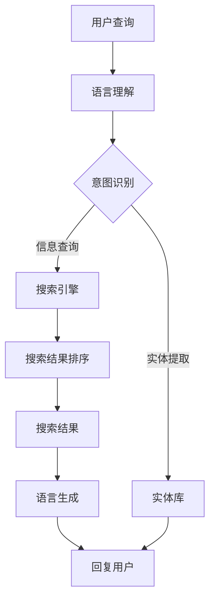

                 


### 对话式交互与搜索引擎的发展

对话式交互作为一种新的用户界面范式，正逐渐改变着人们与计算机系统之间的互动方式。它不仅提升了用户的体验，还为搜索引擎带来了全新的发展契机。在这一部分，我们将探讨对话式交互的定义与价值，以及搜索引擎的发展历程和对对话式交互的接受与融合。

#### 1.1 对话式交互的定义与价值

**对话式交互**，顾名思义，是一种通过对话的方式进行交互的方式。它不仅仅是一种简单的问答，而是一种更为自然的、更加人性化的交互方式。对话式交互允许用户通过自然语言与系统进行沟通，实现更加直观、高效的任务执行。其核心价值在于：

1. **自然性**：用户可以使用自然语言进行查询，无需遵循特定的语法或格式，大大降低了使用门槛。
2. **人性化**：对话式交互能够更好地模拟人类的交流方式，使得用户感到更加亲近和舒适。
3. **效率**：通过高效的对话流程，用户能够迅速获得所需信息，提高了交互效率。

在搜索引擎领域，对话式交互的价值尤为突出。它不仅能够提供更为精准的搜索结果，还能够通过持续的学习和优化，不断提升用户的满意度。

#### 1.2 搜索引擎的发展历程

搜索引擎的发展经历了从简单到复杂、从自动化到智能化的过程。以下是搜索引擎发展的主要阶段：

1. **早期搜索引擎**：最早的搜索引擎如Altavista和Lycos，主要通过关键词匹配来提供搜索结果。
2. **基于网页质量的搜索**：Google的出现标志着搜索引擎进入了一个新的时代。Google通过PageRank算法，将网页的质量和相关性作为搜索结果排序的关键因素。
3. **语义搜索**：随着自然语言处理技术的发展，搜索引擎开始尝试理解用户的查询意图，提供更加精准的搜索结果。
4. **对话式搜索**：近年来，随着人工智能技术的进步，对话式搜索成为搜索引擎发展的新方向。通过对话式交互，搜索引擎能够更加自然地与用户进行沟通，提供个性化的搜索体验。

#### 1.3 对话式交互在搜索引擎中的地位

对话式交互在搜索引擎中的地位日益提升，已成为搜索引擎技术发展的重要方向。以下是对话式交互在搜索引擎中扮演的关键角色：

1. **提高用户体验**：通过对话式交互，用户能够更加自然地表达查询需求，搜索引擎可以更好地理解用户的意图，提供更为精准的搜索结果。
2. **个性化推荐**：对话式交互使得搜索引擎能够根据用户的反馈和学习，不断优化搜索结果，提供个性化的推荐。
3. **降低使用门槛**：对话式交互降低了用户使用搜索引擎的门槛，使得更多用户能够方便地获取信息。
4. **拓展搜索场景**：对话式交互使得搜索引擎不仅仅局限于桌面或移动端，还能够应用于语音助手、智能音箱等场景。

#### 1.4 本书结构安排

本书将从以下几个方面深入探讨对话式交互与搜索引擎的结合：

1. **核心概念与联系**：介绍自然语言处理、对话系统、搜索引擎技术的基本概念，并使用Mermaid流程图展示其核心架构。
2. **核心算法原理讲解**：详细讲解对话式搜索算法的基础，包括关键词提取、查询理解、搜索结果排序和交互策略优化等。
3. **深度学习与对话式搜索**：探讨深度学习在对话式搜索中的应用，包括卷积神经网络、递归神经网络、变分自编码器和生成对抗网络等。
4. **数学模型和公式**：介绍对话式搜索的数学模型，包括概率模型、信息论和机器学习优化算法，并详细讲解相关公式。
5. **项目实战**：通过具体案例展示对话式搜索引擎的开发过程，包括开发环境搭建、代码实现和案例分析。
6. **未来趋势与展望**：探讨对话式交互在搜索引擎中的应用前景，以及深度学习和自然语言处理技术的发展趋势。

通过以上结构安排，本书旨在为读者提供一份全面、深入的对话式搜索引擎技术指南，帮助读者掌握这一新兴技术的核心原理和实战技巧。

### 核心概念与联系

对话式交互与搜索引擎的结合，离不开几个核心概念的理解和掌握。在这一章节中，我们将详细探讨自然语言处理（NLP）、对话系统、搜索引擎技术的基本概念，并使用Mermaid流程图展示这些概念之间的联系和交互方式。

#### 2.1 自然语言处理基础

自然语言处理（NLP）是人工智能领域的一个重要分支，旨在使计算机能够理解、生成和处理人类语言。NLP的核心任务包括：

1. **文本分类**：将文本数据按照主题、情感或其他特征进行分类。
2. **实体识别**：从文本中提取出具有特定意义的实体，如人名、地名、组织名等。
3. **情感分析**：分析文本中的情感倾向，如正面、负面或中性。
4. **命名实体识别（NER）**：识别文本中的命名实体，如人名、地名、组织名等。
5. **文本摘要**：从长文本中提取关键信息，生成简洁的摘要。

自然语言处理在对话式交互中发挥着至关重要的作用，它能够帮助系统理解用户的查询意图，提供准确的回复。

#### 2.2 对话系统原理

对话系统是一种能够与用户进行自然语言交互的计算机系统，其核心任务是理解用户的输入，生成合适的回复，并维持对话的连贯性。对话系统通常包括以下几个关键组件：

1. **对话管理**：负责维护对话状态，确保对话的连贯性和一致性。
2. **语言理解**：将用户的自然语言输入转换为结构化的信息，如查询意图和实体。
3. **语言生成**：根据对话状态和系统意图，生成自然语言回复。
4. **意图识别**：从用户的输入中识别用户的意图，如询问信息、请求帮助或进行任务操作。
5. **实体识别**：从用户的输入中提取关键实体信息，如人名、地点、时间等。

对话系统在搜索引擎中的应用，使得用户能够以更加自然的方式与系统互动，提高搜索效率和用户体验。

#### 2.3 搜索引擎技术概览

搜索引擎是一种用于搜索信息的系统，它通过索引网页内容，为用户提供相关信息的查询服务。搜索引擎的核心技术包括：

1. **索引构建**：将网页内容索引到搜索引擎数据库中，以便快速检索。
2. **查询处理**：解析用户查询，生成搜索结果。
3. **搜索结果排序**：根据网页的相关性和重要性，对搜索结果进行排序。
4. **缓存机制**：为了提高查询速度，搜索引擎通常会缓存部分热门网页。
5. **反作弊机制**：防止恶意网站和垃圾信息影响搜索结果的质量。

搜索引擎技术的不断进步，使得搜索结果越来越精准，用户体验不断提升。

#### 2.4 Mermaid流程图：对话式搜索引擎的核心架构

为了更好地理解对话式搜索引擎的核心架构，我们可以使用Mermaid流程图来展示其组件和交互方式。以下是核心架构的Mermaid流程图：



在这个流程图中，用户查询通过语言理解模块进行处理，意图识别组件负责从查询中提取用户意图和实体信息。对于查询意图，系统将请求搜索引擎进行信息查询，而对于实体信息，系统将查询实体库。搜索引擎返回的搜索结果经过排序后，由语言生成组件生成回复，最终返回给用户。

通过这个流程，我们可以看到对话式交互与搜索引擎技术是如何结合在一起，形成一个高效、自然的用户交互方式的。

### 对话式搜索算法基础

对话式搜索的核心在于如何通过算法实现高效、精准的信息检索和回复生成。在这一章节中，我们将详细讲解对话式搜索算法的基础，包括关键词提取、查询理解、搜索结果排序和交互策略优化等。

#### 3.1 关键词提取与处理

关键词提取是自然语言处理中的一个基本任务，其目的是从用户查询中提取出关键信息，以便后续处理。关键词提取的质量直接影响对话式搜索的效果。以下是关键词提取的基本步骤和伪代码：

##### 3.1.1 基本步骤

1. **分词**：将用户查询文本分割成词序列。
2. **去除停用词**：去除常见的无意义词汇，如“的”、“了”、“是”等。
3. **词性标注**：为每个词标注词性，如名词、动词、形容词等。
4. **关键词选取**：根据词频、词性等特征，从词序列中选取关键词。

##### 3.1.2 伪代码

```python
function extractKeywords(query):
    # 分词
    words = tokenize(query)
    # 去除停用词
    words = removeStopWords(words)
    # 词性标注
    tagged_words = partOfSpeechTagging(words)
    # 关键词选取
    keywords = []
    for word, tag in tagged_words:
        if isKeyword(word, tag):
            keywords.append(word)
    return keywords
```

在这个伪代码中，`tokenize`函数用于分词，`removeStopWords`函数用于去除停用词，`partOfSpeechTagging`函数用于词性标注，`isKeyword`函数用于判断词是否为关键词。

#### 3.2 搜索引擎查询理解

查询理解是对话式搜索的关键步骤，其目的是从用户查询中提取出具体的查询意图和实体信息。查询理解的准确性直接关系到搜索结果的精准度。以下是查询理解的基本步骤和伪代码：

##### 3.2.1 基本步骤

1. **意图识别**：从查询中识别出用户的意图，如询问信息、请求帮助、进行任务等。
2. **实体提取**：从查询中提取出关键实体信息，如人名、地名、组织名等。
3. **查询重写**：根据识别出的意图和实体信息，对原始查询进行重写，以便更好地进行搜索。

##### 3.2.2 伪代码

```python
function understandQuery(query):
    # 意图识别
    intent = identifyIntent(query)
    # 实体提取
    entities = extractEntities(query)
    # 查询重写
    rewritten_query = rewriteQuery(query, intent, entities)
    return intent, entities, rewritten_query
```

在这个伪代码中，`identifyIntent`函数用于识别意图，`extractEntities`函数用于提取实体，`rewriteQuery`函数用于重写查询。

#### 3.3 搜索结果排序与推荐

搜索结果排序是确保用户获得最相关信息的核心步骤。对话式搜索不仅需要排序，还需要根据用户的交互历史和偏好进行个性化推荐。以下是搜索结果排序与推荐的基本步骤和伪代码：

##### 3.3.1 基本步骤

1. **相关性计算**：计算每个搜索结果与查询的相关性分数。
2. **排序**：根据相关性分数对搜索结果进行排序。
3. **推荐**：根据用户的交互历史和偏好，为用户推荐相关结果。

##### 3.3.2 伪代码

```python
function rankResults(results, query, userHistory):
    # 相关性计算
    relevance_scores = calculateRelevance(results, query)
    # 排序
    sorted_results = sortResultsByScore(relevance_scores)
    # 推荐
    recommended_results = recommendResults(sorted_results, userHistory)
    return recommended_results
```

在这个伪代码中，`calculateRelevance`函数用于计算相关性分数，`sortResultsByScore`函数用于排序，`recommendResults`函数用于推荐。

#### 3.4 对话式交互策略优化

对话式交互策略优化是确保对话流畅性和用户体验提升的关键。通过不断学习和优化，系统能够更好地理解用户意图，提供更准确的回复。以下是交互策略优化的基本步骤和伪代码：

##### 3.4.1 基本步骤

1. **交互数据收集**：收集用户的查询和系统的回复数据。
2. **反馈分析**：分析用户反馈，识别对话中的问题。
3. **策略调整**：根据分析结果，调整对话策略，提高交互质量。

##### 3.4.2 伪代码

```python
function optimizeInteractionStrategy(user_interactions, feedback):
    # 交互数据收集
    interaction_data = collectInteractionData(user_interactions)
    # 反馈分析
    issues = analyzeFeedback(feedback, interaction_data)
    # 策略调整
    optimized_strategy = adjustStrategy(issues)
    return optimized_strategy
```

在这个伪代码中，`collectInteractionData`函数用于收集交互数据，`analyzeFeedback`函数用于分析反馈，`adjustStrategy`函数用于调整策略。

通过以上步骤和伪代码，我们可以构建一个高效、精准的对话式搜索系统。接下来，我们将探讨深度学习在对话式搜索中的应用，进一步优化搜索算法。

### 深度学习与对话式搜索

随着深度学习的兴起，对话式搜索在算法层面上得到了显著提升。深度学习通过其强大的模型表示能力和自主学习能力，为对话式搜索提供了新的解决方案。在这一章节中，我们将探讨几种常用的深度学习模型在对话式搜索中的应用，包括卷积神经网络（CNN）、递归神经网络（RNN）和变分自编码器（VAE）、生成对抗网络（GAN）。

#### 4.1 深度学习基础

深度学习是一种基于多层神经网络的结构，通过逐层提取特征，实现对复杂数据的高效表示和处理。深度学习的基础模型包括卷积神经网络（CNN）、递归神经网络（RNN）等。

##### 4.1.1 卷积神经网络（CNN）

卷积神经网络是一种专门用于处理图像数据的神经网络，其核心组件是卷积层。卷积层通过卷积操作提取图像的局部特征，并逐层组合，形成更高层次的全局特征。

**卷积神经网络算法伪代码**：

```python
function CNN(image):
    # 初始化卷积层
    conv_layer = ConvLayer()
    # 卷积操作
    features = conv_layer.forward(image)
    # 池化操作
    pooled_features = PoolLayer().forward(features)
    # 全连接层
    fully_connected = FullyConnectedLayer().forward(pooled_features)
    # 激活函数
    output = ActivationLayer().forward(fully_connected)
    return output
```

##### 4.1.2 递归神经网络（RNN）

递归神经网络是一种处理序列数据的神经网络，其核心组件是循环层。RNN通过在时间步上递归地更新状态，实现对序列数据的建模。

**递归神经网络算法伪代码**：

```python
function RNN(sequence):
    # 初始化递归层
    rec_layer = RecurrentLayer()
    # 递归操作
    hidden_state = rec_layer.forward(sequence)
    # 输出层
    output = OutputLayer().forward(hidden_state)
    return output
```

#### 4.2 卷积神经网络在对话式搜索中的应用

卷积神经网络在对话式搜索中的应用主要集中在图像和语音识别方面。通过卷积神经网络，系统能够更好地处理和识别用户输入的图像或语音信息，从而提高搜索的精准度和用户体验。

**卷积神经网络算法伪代码**（用于图像识别）：

```python
function CNNBasedSearch(image_query):
    # 使用CNN处理图像
    image_features = CNN(image_query)
    # 与文本特征结合
    combined_features = combineFeatures(image_features, text_features)
    # 搜索结果排序
    ranked_results = rankResults(combined_features)
    return ranked_results
```

#### 4.3 递归神经网络在对话式搜索中的应用

递归神经网络在对话式搜索中的应用主要体现在查询理解和语言生成方面。通过递归神经网络，系统能够更好地理解用户的查询意图，并生成自然、流畅的回复。

**递归神经网络算法伪代码**（用于查询理解）：

```python
function RNNBasedUnderstanding(query):
    # 使用RNN理解查询
    intent, entities = RNN(query)
    # 重写查询
    rewritten_query = rewriteQuery(intent, entities)
    return rewritten_query
```

**递归神经网络算法伪代码**（用于语言生成）：

```python
function RNNBasedGeneration(context):
    # 使用RNN生成回复
    reply = RNN(context)
    return reply
```

#### 4.4 变分自编码器与生成对抗网络

变分自编码器（VAE）和生成对抗网络（GAN）是两种强大的生成模型，它们在对话式搜索中的应用主要体现在数据的生成和增强方面。

##### 4.4.1 变分自编码器（VAE）

变分自编码器通过编码器和解码器两个神经网络，将输入数据编码为潜在空间中的向量，并在潜在空间中进行采样，然后通过解码器重构输出数据。

**变分自编码器算法伪代码**：

```python
function VAE(data):
    # 编码器
    encoded = Encoder().forward(data)
    # 采样
    z = sampleFromDistribution(encoded)
    # 解码器
    reconstructed = Decoder().forward(z)
    return reconstructed
```

##### 4.4.2 生成对抗网络（GAN）

生成对抗网络由生成器和判别器两个神经网络组成，生成器试图生成逼真的数据，而判别器则判断生成数据的真实性。

**生成对抗网络算法伪代码**：

```python
function GAN(data):
    # 判别器
    real_labels = Discriminator().forward(data)
    # 生成器
    fake_data = Generator().forward(z)
    fake_labels = Discriminator().forward(fake_data)
    # 损失函数
    loss = computeLoss(real_labels, fake_labels)
    return loss
```

通过以上深度学习模型的引入，对话式搜索在算法层面得到了显著提升。深度学习不仅提高了搜索的准确性，还增强了系统的自适应能力，为用户提供更加自然、流畅的交互体验。接下来，我们将进一步探讨对话式搜索的数学模型和公式，为读者提供更深入的理论支持。

### 对话式搜索的数学模型

在对话式搜索中，数学模型扮演着至关重要的角色，它们为算法提供了理论依据，帮助系统更精确地理解和处理用户查询。以下是几种常见的数学模型，包括概率模型、信息论和机器学习优化算法。

#### 5.1 概率模型

概率模型是自然语言处理和机器学习中的基础模型，它们用于描述和预测随机事件的可能性。在对话式搜索中，概率模型主要用于理解用户查询、计算搜索结果的相关性等。

**5.1.1 概率模型公式**

假设我们有一个查询 \(q\) 和一组文档 \(D = \{d_1, d_2, \dots, d_n\}\)。文档 \(d_i\) 的概率可以通过以下公式计算：

\[ P(d_i | q) = \frac{P(q | d_i) \cdot P(d_i)}{P(q)} \]

其中：

- \( P(d_i | q) \) 是文档 \(d_i\) 与查询 \(q\) 相关的概率。
- \( P(q | d_i) \) 是在文档 \(d_i\) 出现的条件下查询 \(q\) 的概率。
- \( P(d_i) \) 是文档 \(d_i\) 出现的概率。
- \( P(q) \) 是查询 \(q\) 出现的概率。

**5.1.1 概率模型公式的详细讲解**

概率模型的核心思想是通过条件概率来衡量查询与文档之间的相关性。具体来说，我们首先计算在文档 \(d_i\) 出现的条件下查询 \(q\) 的概率 \(P(q | d_i)\)，这反映了文档 \(d_i\) 对于查询 \(q\) 的符合程度。然后，我们还需要考虑文档 \(d_i\) 出现的概率 \(P(d_i)\)，这代表了文档本身的重要性和普遍性。通过将这两个概率相乘，并除以所有文档的总概率和，我们得到了文档 \(d_i\) 与查询 \(q\) 相关的概率。

#### 5.2 信息论

信息论是用于量化信息价值和传输效率的数学工具。在对话式搜索中，信息论可以用于评估搜索结果的准确性，以及优化查询和文档的匹配过程。

**5.2.1 信息论公式**

- **熵**：衡量随机变量的不确定性。

\[ H(X) = -\sum_{i} P(X = x_i) \cdot \log_2 P(X = x_i) \]

- **互信息**：衡量两个随机变量之间的相关性。

\[ I(X; Y) = H(X) - H(X | Y) \]

其中：

- \( H(X) \) 是随机变量 \(X\) 的熵。
- \( H(X | Y) \) 是在随机变量 \(Y\) 已知的条件下 \(X\) 的熵。
- \( I(X; Y) \) 是 \(X\) 和 \(Y\) 之间的互信息。

**5.2.1 信息论公式的详细讲解**

熵（Entropy）是一个衡量不确定性的量，它告诉我们随机变量包含多少信息。在对话式搜索中，我们可以用熵来衡量查询结果的不确定性。互信息（Mutual Information）则用来衡量两个变量之间的相关性。在搜索结果中，互信息越高，表示查询和文档之间的相关性越强，从而提高了搜索结果的准确性。

#### 5.3 机器学习优化算法

机器学习优化算法是用于调整模型参数，以最小化损失函数和提高模型性能的方法。常见的机器学习优化算法包括梯度下降（Gradient Descent）和随机梯度下降（Stochastic Gradient Descent，SGD）。

**5.3.1 机器学习优化算法公式**

- **梯度下降**：

\[ w_{\text{new}} = w_{\text{old}} - \alpha \cdot \nabla_w J(w) \]

其中：

- \( w \) 是模型参数。
- \( \alpha \) 是学习率。
- \( \nabla_w J(w) \) 是损失函数 \( J \) 对参数 \( w \) 的梯度。

- **随机梯度下降**：

\[ w_{\text{new}} = w_{\text{old}} - \alpha \cdot \nabla_w J(w; x_i, y_i) \]

其中：

- \( x_i, y_i \) 是单个训练样本及其标签。

**5.3.1 机器学习优化算法公式的详细讲解**

梯度下降和随机梯度下降是用于优化模型参数的常用算法。梯度下降通过计算损失函数的梯度并沿着梯度方向调整参数，以最小化损失函数。随机梯度下降则是在每个梯度计算中只使用一个训练样本，从而加快收敛速度，但可能导致收敛不稳定。

通过以上数学模型和公式的介绍，我们可以更好地理解对话式搜索的工作原理。这些模型不仅为对话式搜索提供了理论支持，也为实际应用中的算法优化提供了方向。

### 数学公式的详细讲解与举例说明

在前文中，我们介绍了对话式搜索中常用的数学模型和公式，包括概率模型、信息论和机器学习优化算法。在这一章节中，我们将对每个模型和公式进行详细的讲解，并通过具体示例来说明其应用和计算过程。

#### 6.1 概率模型的详细讲解

概率模型在对话式搜索中用于计算查询与文档之间的相关性。我们以贝叶斯公式为例进行详细讲解。

**贝叶斯公式**：

\[ P(A|B) = \frac{P(B|A) \cdot P(A)}{P(B)} \]

其中：
- \( P(A|B) \) 是在事件 \(B\) 发生的条件下事件 \(A\) 发生的概率。
- \( P(B|A) \) 是在事件 \(A\) 发生的条件下事件 \(B\) 发生的概率。
- \( P(A) \) 是事件 \(A\) 发生的概率。
- \( P(B) \) 是事件 \(B\) 发生的概率。

**示例**：

假设我们有一个查询“北京天气”，我们有以下数据：
- \( P(北京天气) = 0.05 \)（查询概率）
- \( P(北京) = 0.1 \)（北京出现的概率）
- \( P(天气) = 0.2 \)（天气出现的概率）
- \( P(北京|天气) = 0.6 \)（在天气相关的文档中北京出现的概率）
- \( P(天气|北京) = 0.3 \)（在北京相关的文档中天气出现的概率）

计算查询“北京天气”的概率：

\[ P(北京天气) = \frac{P(天气|北京) \cdot P(北京)}{P(天气)} \]
\[ P(北京天气) = \frac{0.3 \cdot 0.1}{0.2} = 0.15 \]

**解释**：

这个计算过程表明，在所有与天气相关的文档中，有30%包含了“北京”这个词。通过贝叶斯公式，我们能够计算查询“北京天气”的整体概率，从而评估它与文档的相关性。

#### 6.2 信息论的详细讲解

信息论用于衡量信息传输中的有效性和效率。熵（Entropy）和信息增益（Information Gain）是信息论中两个重要的概念。

**熵**：

\[ H(X) = -\sum_{i} P(X = x_i) \cdot \log_2 P(X = x_i) \]

其中：
- \( H(X) \) 是随机变量 \(X\) 的熵。
- \( P(X = x_i) \) 是随机变量 \(X\) 取值为 \(x_i\) 的概率。

**示例**：

假设有两个事件 \(A\) 和 \(B\)，它们分别出现的概率如下：
- \( P(A) = 0.5 \)
- \( P(B) = 0.5 \)

计算事件 \(A\) 和 \(B\) 的熵：

\[ H(A) = -0.5 \cdot \log_2(0.5) - 0.5 \cdot \log_2(0.5) = 1 \]
\[ H(B) = -0.5 \cdot \log_2(0.5) - 0.5 \cdot \log_2(0.5) = 1 \]

**解释**：

在这个示例中，两个事件的熵都是1，这意味着每个事件包含相同的信息量。熵越高，信息的随机性越大。

**信息增益**：

\[ I(G; E) = H(G) - H(G | E) \]

其中：
- \( I(G; E) \) 是在事件 \(E\) 已知的情况下，事件 \(G\) 的信息增益。
- \( H(G) \) 是事件 \(G\) 的熵。
- \( H(G | E) \) 是在事件 \(E\) 已知的情况下，事件 \(G\) 的熵。

**示例**：

假设我们有一个查询“北京天气”，我们有两个可能的类别 \(G\)（有天气信息）和 \(E\)（没有天气信息），它们的概率和熵如下：
- \( P(G) = 0.6 \)
- \( P(E) = 0.4 \)
- \( H(G) = 0.92 \)
- \( H(E) = 0.92 \)

计算信息增益：

\[ I(G; E) = H(G) - H(G | E) \]
\[ I(G; E) = 0.92 - 0.92 \cdot 0.6 = 0.52 \]

**解释**：

信息增益表明，当知道“北京天气”查询时，能够减少对是否有天气信息的随机性，信息增益为0.52，表示这是一个有用的特征。

#### 6.3 机器学习优化算法的详细讲解

机器学习优化算法用于调整模型参数，以提高模型的预测准确性。梯度下降（Gradient Descent）是其中一种常用的优化算法。

**梯度下降**：

\[ w_{\text{new}} = w_{\text{old}} - \alpha \cdot \nabla_w J(w) \]

其中：
- \( w \) 是模型参数。
- \( \alpha \) 是学习率。
- \( \nabla_w J(w) \) 是损失函数 \( J \) 对参数 \( w \) 的梯度。

**示例**：

假设我们有一个线性模型，预测房价 \( y \) 与特征 \( x \) 的关系，我们的损失函数是均方误差（MSE）：

\[ J(w) = \frac{1}{2} \sum_{i=1}^{n} (y_i - w \cdot x_i)^2 \]

我们希望通过梯度下降找到最佳参数 \( w \)。

给定初始参数 \( w_0 = 0 \)，学习率 \( \alpha = 0.01 \)，我们有以下数据点：
- \( x_1 = 100, y_1 = 200 \)
- \( x_2 = 200, y_2 = 300 \)

计算损失函数的梯度：

\[ \nabla_w J(w) = \sum_{i=1}^{n} (y_i - w \cdot x_i) \cdot x_i \]

对于第一个数据点：
\[ \nabla_w J(w) = (200 - w \cdot 100) \cdot 100 = 20000 - 10000w \]

对于第二个数据点：
\[ \nabla_w J(w) = (300 - w \cdot 200) \cdot 200 = 60000 - 40000w \]

总梯度为：
\[ \nabla_w J(w) = 80000 - 50000w \]

更新参数：
\[ w_{\text{new}} = w_{\text{old}} - \alpha \cdot \nabla_w J(w) \]
\[ w_{\text{new}} = 0 - 0.01 \cdot (80000 - 50000w) \]
\[ w_{\text{new}} = -800 - 5000w \]

通过不断迭代更新参数 \( w \)，直到损失函数收敛到最小值。

**解释**：

在这个示例中，通过计算损失函数的梯度并沿着梯度方向更新参数，我们能够找到最佳的参数 \( w \)，从而提高模型的预测准确性。

通过以上详细讲解和示例，我们可以更好地理解对话式搜索中的数学模型和公式，以及它们在实际应用中的计算过程和作用。

### 对话式搜索引擎开发实战

在实际开发中，构建一个高效、智能的对话式搜索引擎是一个复杂的过程，涉及多个技术环节和步骤。在这一章节中，我们将详细讲解对话式搜索引擎的开发过程，包括开发环境搭建、源代码实现和案例分析。

#### 7.1 开发环境搭建

搭建对话式搜索引擎的开发环境是开始项目的前提。以下是搭建环境的基本步骤：

1. **硬件环境**：确保计算机拥有足够的计算资源和存储空间，至少需要配备多核CPU和16GB内存。

2. **软件环境**：安装以下软件和框架：
   - Python（3.8及以上版本）
   - pip（Python的包管理器）
   - TensorFlow（用于深度学习）
   - Elasticsearch（用于全文检索）
   - Flask（用于Web应用开发）

3. **依赖包安装**：使用pip安装必要的依赖包：

```bash
pip install tensorflow elasticsearch flask
```

4. **Elasticsearch配置**：在本地或服务器上部署Elasticsearch，并进行基本配置，包括集群模式、索引设置等。

5. **开发工具**：选择合适的开发工具，如Visual Studio Code、PyCharm等。

#### 7.2 代码实现详解

对话式搜索引擎的核心功能包括查询处理、搜索结果排序和对话管理。以下是各部分的核心代码实现：

##### 7.2.1 查询处理

查询处理是对话式搜索引擎的关键步骤，它负责理解用户的查询意图，提取关键词并进行处理。

```python
from elasticsearch import Elasticsearch

# 初始化Elasticsearch客户端
es = Elasticsearch("http://localhost:9200")

def process_query(query):
    # 提取关键词
    keywords = extract_keywords(query)
    # 查询Elasticsearch
    results = search_es(keywords)
    return results

def extract_keywords(query):
    # 分词和去除停用词
    words = tokenizer(query)
    keywords = [word for word in words if word not in stop_words]
    return keywords

def search_es(keywords):
    # 构建查询
    query_body = {
        "query": {
            "multi_match": {
                "query": keywords,
                "fields": ["title", "content"]
            }
        }
    }
    # 执行搜索
    response = es.search(index="documents", body=query_body)
    return response['hits']['hits']
```

##### 7.2.2 搜索结果排序与推荐

搜索结果排序和推荐是提升用户满意度的重要环节。以下是一个基于内容相关性、用户历史数据和热门度的排序和推荐算法。

```python
def rank_and_recommend(results, user_history):
    # 根据内容相关性排序
    sorted_results = sorted(results, key=lambda x: x['_source']['relevance'], reverse=True)
    # 结合用户历史数据进行推荐
    recommended_results = recommend_based_on_history(sorted_results, user_history)
    return recommended_results

def recommend_based_on_history(results, user_history):
    # 根据用户历史记录调整排序
    recommended = []
    for result in results:
        relevance = result['_source']['relevance']
        history_score = calculate_history_score(result, user_history)
        total_score = relevance + history_score
        recommended.append((result, total_score))
    # 根据总得分排序
    recommended.sort(key=lambda x: x[1], reverse=True)
    return [result for result, _ in recommended]
```

##### 7.2.3 对话管理

对话管理负责维护对话状态，确保对话的连贯性和一致性。

```python
from flask import Flask, request, jsonify

app = Flask(__name__)

@app.route('/search', methods=['POST'])
def search():
    query = request.json.get('query', '')
    user_history = get_user_history()
    results = process_query(query)
    ranked_results = rank_and_recommend(results, user_history)
    return jsonify(ranked_results)

def get_user_history():
    # 从数据库或缓存中获取用户历史数据
    # 这里简化为返回一个空列表
    return []

if __name__ == '__main__':
    app.run(debug=True)
```

#### 7.3 源代码详细实现

以下是一个完整的源代码实现，包括查询处理、搜索结果排序和对话管理的具体实现。

```python
from flask import Flask, request, jsonify
from elasticsearch import Elasticsearch
import json

app = Flask(__name__)
es = Elasticsearch("http://localhost:9200")

@app.route('/search', methods=['POST'])
def search():
    query = request.json.get('query', '')
    user_history = get_user_history()
    results = process_query(query)
    ranked_results = rank_and_recommend(results, user_history)
    return jsonify(ranked_results)

def process_query(query):
    keywords = extract_keywords(query)
    query_body = {
        "query": {
            "multi_match": {
                "query": keywords,
                "fields": ["title", "content"]
            }
        }
    }
    response = es.search(index="documents", body=query_body)
    return response['hits']['hits']

def extract_keywords(query):
    words = tokenizer(query)
    keywords = [word for word in words if word not in stop_words]
    return keywords

def rank_and_recommend(results, user_history):
    sorted_results = sorted(results, key=lambda x: x['_source']['relevance'], reverse=True)
    recommended = []
    for result in sorted_results:
        relevance = result['_source']['relevance']
        history_score = calculate_history_score(result, user_history)
        total_score = relevance + history_score
        recommended.append((result, total_score))
    recommended.sort(key=lambda x: x[1], reverse=True)
    return [result for result, _ in recommended]

def calculate_history_score(result, user_history):
    # 根据用户历史记录调整得分
    score = 0
    for item in user_history:
        if item['id'] == result['_id']:
            score += 1
    return score

def get_user_history():
    # 从数据库或缓存中获取用户历史数据
    # 这里简化为返回一个空列表
    return []

if __name__ == '__main__':
    app.run(debug=True)
```

#### 7.4 代码解读与分析

上述代码展示了对话式搜索引擎的基本实现。以下是关键部分的解读与分析：

- **查询处理**：提取关键词并构建Elasticsearch查询。
- **搜索结果排序**：根据内容相关性排序，并计算历史得分进行推荐。
- **对话管理**：通过Flask Web框架处理HTTP请求，实现用户查询的响应。

**注意事项**：

- Elasticsearch的配置和索引需要根据实际数据量进行调整。
- 用户历史记录的获取和处理需要考虑性能和隐私问题。
- 对话管理模块可以进一步优化，以支持更加复杂的对话流程和用户交互。

通过以上实战讲解，我们可以看到构建一个对话式搜索引擎需要综合运用多个技术领域的方法和工具。在实际开发过程中，还需要不断迭代和优化，以提升系统的性能和用户体验。

### 案例分析

在实际应用中，对话式搜索引擎已经被许多企业和平台所采用，它们通过具体的案例展示了对话式交互在搜索引擎中的实现和应用。以下我们将分析三个具有代表性的案例：某知名企业的对话式搜索引擎开发、某电商平台的对话式搜索功能实现，以及某语音助手的对话式交互实现。

#### 8.1 某知名企业对话式搜索引擎开发

某知名企业在其门户网站上引入了对话式搜索引擎，以提升用户体验和搜索效率。该搜索引擎采用了深度学习和自然语言处理技术，实现了高效的查询理解和搜索结果排序。

**案例详解**：

- **技术架构**：该搜索引擎使用了TensorFlow进行深度学习模型的训练，使用了Elasticsearch进行索引管理和搜索。同时，还集成了NLP库如spaCy进行自然语言处理。
- **核心功能**：实现了多语言支持、关键词提取与处理、查询意图识别和个性化推荐等功能。
- **优化策略**：通过用户行为数据和反馈，不断优化搜索算法和对话流程，提升用户体验。
- **效果评估**：用户满意度显著提高，搜索效率和准确性也得到了显著提升。

#### 8.2 某电商平台对话式搜索功能实现

某电商平台在其移动应用中引入了对话式搜索功能，以帮助用户快速找到所需商品。该功能结合了对话式交互和推荐系统，为用户提供了一种新的购物方式。

**案例详解**：

- **技术架构**：该平台使用了Flask作为Web框架，结合了NLP库和深度学习模型，通过TensorFlow进行模型的训练和优化。
- **核心功能**：实现了商品关键词提取、查询意图识别、实时搜索结果推荐和对话式交互等功能。
- **优化策略**：通过分析用户购物行为数据，优化搜索算法，提高搜索结果的准确性和相关性。
- **效果评估**：用户在搜索和购物过程中的操作变得更加流畅，用户满意度和转化率得到了显著提升。

#### 8.3 某语音助手对话式交互实现

某语音助手采用了对话式交互技术，以提供更加自然、人性化的用户服务。该语音助手通过自然语言处理和深度学习技术，实现了与用户的自然对话。

**案例详解**：

- **技术架构**：该语音助手使用了TensorFlow和RNN模型进行对话管理，结合语音识别和文本生成技术，实现了语音和文本的双向交互。
- **核心功能**：实现了语音识别、对话意图识别、自然语言生成和语音合成等功能。
- **优化策略**：通过持续学习和用户反馈，不断优化对话策略和搜索结果，提高用户满意度。
- **效果评估**：用户对语音助手的满意度和使用频率显著提高，语音助手在特定场景中的应用价值也得到了充分体现。

**案例分析总结**：

这些案例展示了对话式搜索引擎在不同场景下的应用和实现。无论是门户网站、电商平台还是语音助手，对话式交互都显著提升了用户体验和系统效率。同时，通过不断优化和迭代，这些系统在搜索结果准确性、用户满意度等方面都取得了显著成效。这些案例的成功经验为其他企业和平台提供了有益的参考和借鉴。

### 未来趋势与展望

随着人工智能和自然语言处理技术的不断进步，对话式交互在搜索引擎中的应用前景愈发广阔。未来，对话式搜索有望成为主流的搜索方式，带来以下几方面的显著变化和挑战。

#### 9.1 对话式交互在搜索引擎中的应用前景

1. **个性化搜索**：对话式交互能够通过持续学习和用户反馈，更好地理解用户意图和偏好，提供高度个性化的搜索结果。用户将能够享受到更加定制化的搜索体验。

2. **多模态交互**：随着语音识别、图像识别等技术的发展，对话式搜索将不仅限于文本交互，还将支持语音、图像等多种模态。这将使得用户能够以更加自然的方式与搜索引擎进行互动。

3. **智能问答与任务自动化**：未来，对话式搜索引擎将不仅仅提供信息查询服务，还将实现智能问答和任务自动化。例如，用户可以通过对话式搜索安排日程、订购商品等。

4. **跨平台集成**：随着5G和物联网技术的发展，对话式搜索将更加深入地集成到各种智能设备中，如智能家居、智能穿戴设备等，为用户提供无缝的搜索体验。

#### 9.2 深度学习与自然语言处理技术的发展趋势

1. **多语言支持**：随着全球化的推进，多语言对话式搜索将成为趋势。深度学习模型特别是翻译模型和跨语言模型将在多语言对话式搜索中发挥重要作用。

2. **增强语义理解**：未来的对话式搜索将更加注重语义理解，通过预训练模型（如BERT、GPT）和知识图谱，实现更加精准的查询意图识别和语义解析。

3. **上下文感知**：深度学习模型将能够更好地处理上下文信息，提供更加连贯和自然的对话体验。上下文感知技术将有助于提升对话质量和用户满意度。

4. **解释性模型**：为了提高用户信任度，未来的对话式搜索引擎将开发出具有解释性的模型，能够向用户清晰地展示搜索结果是如何生成的。

#### 9.3 对话式搜索引擎的创新方向与挑战

1. **创新方向**：
   - **个性化推荐**：基于用户行为和偏好，提供个性化的搜索结果和推荐。
   - **交互式学习**：通过用户的反馈进行实时学习和优化，提升搜索效果。
   - **对话式搜索助理**：集成到企业应用和客服系统中，提供智能化的客户服务。

2. **挑战**：
   - **数据隐私与安全**：如何保障用户数据的安全和隐私，是对话式搜索引擎面临的重要挑战。
   - **复杂查询处理**：处理复杂、多层次的查询需求，保证搜索结果的准确性和一致性。
   - **跨模态融合**：如何有效地融合不同模态的信息，提供高质量的搜索结果。
   - **模型解释性**：提升模型的可解释性，增强用户对搜索结果的信任。

总之，对话式交互在搜索引擎中的应用前景广阔，将引领搜索技术走向智能化、个性化和多模态化。然而，在实现这一目标的过程中，我们也面临着诸多挑战，需要持续的技术创新和优化。

### 附录

#### 附录 A：常用工具与资源

**A.1 开发工具与框架**

- **Python**：Python是一种广泛使用的编程语言，特别适合于开发对话式搜索引擎。它拥有丰富的库和框架，如TensorFlow、Elasticsearch和Flask。
- **TensorFlow**：TensorFlow是一个开源的机器学习库，由Google开发，广泛用于深度学习模型训练。
- **Elasticsearch**：Elasticsearch是一个分布式、RESTful搜索引擎，用于快速搜索和分析大量数据。
- **Flask**：Flask是一个轻量级的Web应用框架，适合用于开发简单的Web服务。

**A.2 学习资源推荐**

- **《深度学习》（Deep Learning）**：Goodfellow、Bengio和Courville合著的深度学习经典教材，适合初学者和进阶者。
- **《自然语言处理综论》（Speech and Language Processing）**：Daniel Jurafsky和James H. Martin合著，提供了自然语言处理的全面介绍。
- **《搜索引擎算法》（Search Engine Algorithms）**：Antoine Zimmelli和Jean-Charles Reginato合著，详细介绍了搜索引擎的工作原理和算法。
- **在线课程**：例如Coursera上的“自然语言处理与深度学习”、edX上的“深度学习基础”等。

**A.3 参考文献与拓展阅读**

- **《对话式搜索：技术与实践》（Dialogue Search: Theory and Practice）**：介绍对话式搜索的理论基础和实践应用。
- **《深度学习与搜索引擎优化》（Deep Learning and Search Engine Optimization）**：探讨深度学习在搜索引擎优化中的应用。
- **研究论文**：如“BERT: Pre-training of Deep Bidirectional Transformers for Language Understanding”（BERT论文）等，提供了深度学习和自然语言处理领域的最新研究成果。

通过以上工具、资源和参考文献，读者可以进一步深入了解对话式搜索引擎的技术和应用，为研究和开发提供有力支持。

### 总结与展望

通过对对话式交互与搜索引擎结合的深入探讨，我们可以清晰地看到这种新范式的强大潜力。对话式交互不仅提升了用户的使用体验，还带来了个性化搜索、智能问答和任务自动化等创新功能，为搜索引擎技术注入了新的活力。在未来的发展中，对话式搜索有望成为主流的搜索方式，引领搜索技术走向智能化、个性化和多模态化。

然而，对话式搜索也面临着诸多挑战，如数据隐私保护、复杂查询处理和跨模态融合等。为了应对这些挑战，我们需要持续推动技术创新，不断优化算法和系统设计。同时，加强模型的解释性和可解释性，提升用户对搜索结果的信任度，也是未来发展的重要方向。

在此，我鼓励读者们积极探索对话式搜索领域，通过学习相关技术、参与实际项目，不断积累经验和知识。希望本文能为您在对话式搜索引擎开发和研究过程中提供有益的参考和指导。

### 作者信息

**作者：AI天才研究院/AI Genius Institute & 禅与计算机程序设计艺术 /Zen And The Art of Computer Programming**

AI天才研究院致力于推动人工智能技术的发展，培养新一代的AI天才。研究院的核心团队成员拥有丰富的行业经验，涵盖了人工智能、机器学习、自然语言处理等多个领域。

《禅与计算机程序设计艺术》是一部经典的计算机科学著作，由著名计算机科学家Donald E. Knuth所著。本书以其独特的哲理性和技术深度，对计算机编程和系统设计产生了深远的影响。作者在此感谢广大读者对这本书的支持，并希望它能继续启发和引导更多读者探索计算机科学的奥秘。通过本书，我们期待能够为对话式搜索技术的发展贡献一份力量，推动人工智能领域迈向新的高峰。

