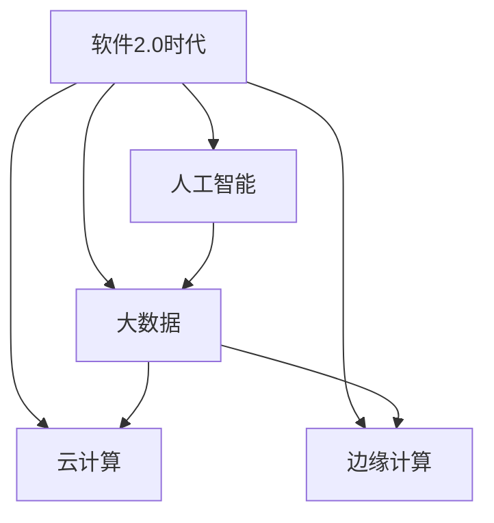
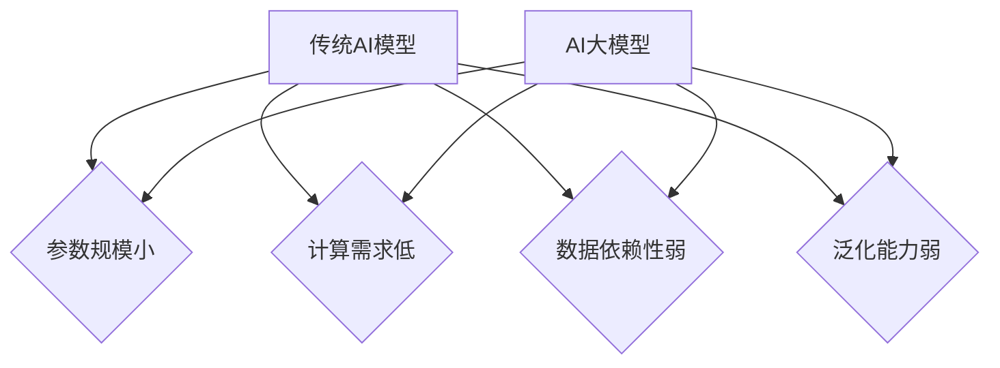
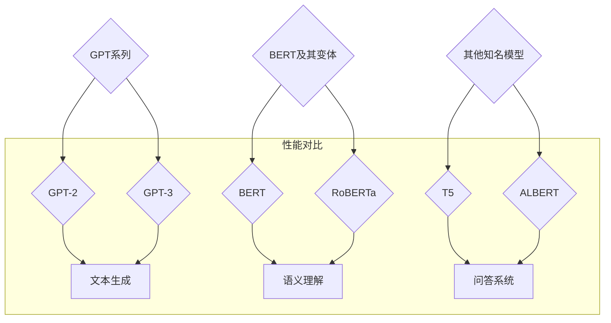
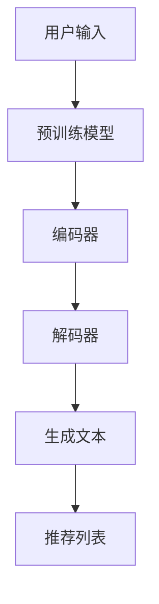

                 

### 文章标题

《搜索推荐系统的AI大模型优化：提高电商平台的转化率与用户忠诚度》

### 关键词

- 搜索推荐系统
- AI大模型
- 电商平台
- 转化率
- 用户忠诚度
- 数据分析
- 算法优化

### 摘要

随着互联网的快速发展，电商平台在激烈的市场竞争中逐渐意识到用户满意度和忠诚度的重要性。本文将探讨如何通过AI大模型的优化，提升电商平台的搜索推荐系统效果，从而提高转化率和用户忠诚度。首先，我们将介绍搜索推荐系统的基本原理和AI大模型的核心概念，并分析两者之间的联系。接着，本文将详细讲解主流AI大模型在推荐系统中的应用，包括其算法原理、优缺点以及优化策略。随后，我们将通过实际案例展示AI大模型在电商平台中的应用效果，并分析其在提升转化率和用户忠诚度方面的贡献。最后，本文将总结AI大模型优化的最佳实践，并提出未来研究和应用的方向。希望通过本文的探讨，为电商平台在AI大模型优化方面提供一些有益的参考和启示。

### 第一部分：核心概念与联系

在深入探讨如何通过AI大模型优化搜索推荐系统以提高电商平台转化率和用户忠诚度之前，有必要首先了解一些核心概念及其相互关系。本部分将介绍软件2.0时代的到来、AI大模型的定义与特点，以及主流AI大模型的分类与性能对比。

#### 1.1.1 软件2.0时代的到来

软件2.0时代，顾名思义，是继软件1.0时代之后的又一个重要阶段。软件1.0时代主要集中在业务自动化，通过编写代码实现特定功能的自动化处理，如财务管理、生产管理等。而软件2.0时代，则是基于人工智能（AI）和大数据技术的智能软件时代，其核心特点在于软件与智能的深度融合，突破了传统软件的功能界限，实现了高度智能化、自动化、个性化和协同化的应用。

以下是软件2.0时代的核心概念及其相互关系：

1. **人工智能（AI）**：人工智能是软件2.0时代的关键驱动力量，它通过机器学习、深度学习等技术，使计算机能够模拟人类的认知能力，进行问题求解、决策制定和知识发现。

2. **大数据（Big Data）**：大数据技术是软件2.0时代的基石，它能够对海量数据进行存储、处理和分析，为人工智能提供丰富的数据支持。

3. **云计算（Cloud Computing）**：云计算技术为软件2.0时代提供了强大的计算能力和存储资源，使得大规模的数据处理和智能分析成为可能。

4. **边缘计算（Edge Computing）**：边缘计算技术则通过将计算任务分散到网络的边缘节点，降低了数据传输延迟，提高了系统的实时响应能力。

下图展示了软件2.0时代的核心概念及其相互关系：



在软件2.0时代，人工智能（B）作为核心驱动力量，与大数据（C）相互结合，通过云计算（D）和边缘计算（E）实现智能处理和实时响应，从而打破了传统软件的功能界限，开启了智能化、自动化、个性化和协同化的新篇章。

#### 1.1.2 AI大模型的定义与特点

AI大模型，顾名思义，是指那些具有数百万到数十亿参数的复杂神经网络模型。这些模型在训练时需要大量的数据和计算资源，因此通常依赖高性能计算集群和分布式计算技术。以下是AI大模型的核心特点：

1. **参数规模大**：大模型拥有数百万到数十亿个参数，这使得它们能够捕捉数据中的复杂模式和关系。

2. **计算需求高**：大模型训练需要大量的计算资源，通常依赖高性能计算集群和分布式计算技术。

3. **数据依赖性**：大模型性能高度依赖于训练数据的质量和数量，数据驱动的训练方法是大模型成功的关键。

4. **泛化能力强**：大模型通过大规模数据训练能够获得很好的泛化能力，适用于多种不同的任务和应用场景。

以下是AI大模型与传统AI模型的主要区别：



#### 1.1.3 主流AI大模型简介

目前主流的AI大模型主要包括GPT系列、BERT及其变体以及其他知名模型。以下是这些模型的简要介绍：

1. **GPT系列**：由OpenAI开发的预训练语言模型，包括GPT-2和GPT-3等，具有强大的文本生成和语义理解能力。

2. **BERT**：由Google开发的基于Transformer的预训练语言表示模型，广泛应用于自然语言处理任务，如问答系统和文本分类。

3. **其他知名模型**：如RoBERTa、T5、ALBERT等，它们在预训练方法、模型架构和性能上进行了优化，以适应不同的应用场景。

以下是这些模型的分类与性能对比：



### 第二部分：搜索推荐系统的基本原理

搜索推荐系统是电商平台中至关重要的一部分，它通过对用户行为数据的分析，为用户推荐他们可能感兴趣的商品或内容，从而提高用户满意度和平台黏性。本部分将详细介绍搜索推荐系统的基本原理，包括数据收集、特征提取、模型选择与优化等方面。

#### 2.1 数据收集

搜索推荐系统的核心在于对用户行为数据的收集和分析。这些数据包括用户浏览记录、搜索历史、购买行为、评价和反馈等。数据收集的方法主要有以下几种：

1. **服务器日志**：通过服务器日志收集用户的行为数据，如访问时间、访问页面、点击次数等。

2. **客户端SDK**：在客户端应用程序中集成SDK（Software Development Kit），通过SDK收集用户行为数据。

3. **用户反馈**：通过用户评价、反馈和问卷调查等方式获取用户对商品或服务的评价和偏好。

4. **外部数据源**：通过第三方数据平台获取用户行为数据，如社交媒体数据、地理位置数据等。

#### 2.2 特征提取

特征提取是搜索推荐系统的重要环节，它通过对用户行为数据进行预处理和转换，提取出对推荐模型有帮助的特征。常见的特征提取方法包括：

1. **用户画像**：通过用户的基本信息（如年龄、性别、地理位置等）构建用户画像，用于描述用户的基本属性和偏好。

2. **行为特征**：通过用户的浏览记录、搜索历史、购买行为等数据，提取出用户的行为特征，如浏览频次、点击率、购买转化率等。

3. **内容特征**：通过对商品或内容的描述信息（如标题、描述、标签等）进行词频统计、TF-IDF（Term Frequency-Inverse Document Frequency）转换等处理，提取出内容特征。

4. **社会关系特征**：通过分析用户之间的互动关系，如点赞、评论、分享等，提取出社会关系特征。

以下是特征提取流程的简化伪代码：

```python
def extract_features(data):
    # 用户画像特征提取
    user_features = extract_user_features(data.user_info)

    # 行为特征提取
    behavior_features = extract_behavior_features(data.user行为的日志)

    # 内容特征提取
    content_features = extract_content_features(data商品或内容的描述)

    # 社会关系特征提取
    social_features = extract_social_features(data用户互动关系)

    # 特征合并
    features = merge_features(user_features, behavior_features, content_features, social_features)
    
    return features
```

#### 2.3 模型选择与优化

在搜索推荐系统中，选择合适的推荐模型是关键。常见的推荐模型包括基于协同过滤的推荐模型、基于内容的推荐模型和基于模型的推荐模型。以下是这些模型的简要介绍：

1. **基于协同过滤的推荐模型**：协同过滤推荐模型通过分析用户之间的相似性，为用户推荐他们可能喜欢的商品。协同过滤模型可分为基于用户的协同过滤和基于项目的协同过滤。

2. **基于内容的推荐模型**：基于内容的推荐模型通过分析用户对特定内容的偏好，为用户推荐相似内容的商品。这种模型通常依赖于文本挖掘和语义分析技术。

3. **基于模型的推荐模型**：基于模型的推荐模型通过建立用户和商品之间的关联模型，预测用户对特定商品的兴趣。常见的模型包括线性回归、逻辑回归、决策树、支持向量机等。

以下是推荐模型选择与优化的简化伪代码：

```python
def select_recommendation_model(data, features):
    # 数据预处理
    preprocessed_data = preprocess_data(data)

    # 特征工程
    engineered_features = extract_features(preprocessed_data)

    # 模型选择
    model = select_model(engineered_features)

    # 模型训练
    trained_model = train_model(model, engineered_features)

    # 模型评估
    evaluation_result = evaluate_model(trained_model, engineered_features)

    # 模型优化
    optimized_model = optimize_model(trained_model, evaluation_result)

    return optimized_model
```

通过上述步骤，搜索推荐系统可以为用户生成个性化的推荐列表，提高用户满意度和平台黏性。

### 第三部分：AI大模型在搜索推荐系统中的应用

AI大模型在搜索推荐系统中的应用，是近年来人工智能领域的一个重要突破。通过引入大模型，推荐系统的效果得到了显著提升，从而为电商平台带来了更高的转化率和用户忠诚度。本部分将详细介绍AI大模型在搜索推荐系统中的应用，包括其算法原理、性能优势以及优化策略。

#### 3.1 AI大模型的算法原理

AI大模型，通常指的是具有数十亿参数的复杂神经网络，如GPT、BERT等。这些模型通过深度学习算法，在大量数据上进行预训练，从而获得强大的语义理解和生成能力。以下是AI大模型在搜索推荐系统中的应用算法原理：

1. **预训练与微调**：
   - **预训练**：在大规模语料库上进行预训练，使模型具备对自然语言和文本数据的理解能力。
   - **微调**：将预训练的模型迁移到特定任务上，通过在少量任务数据上进行微调，使模型适应具体的应用场景。

2. **语义理解与生成**：
   - **语义理解**：通过编码器和解码器结构，对输入文本进行编码和解码，提取语义信息。
   - **文本生成**：利用生成模型，根据输入文本或提示，生成相关的文本内容。

以下是AI大模型在搜索推荐系统中的简化算法流程：



#### 3.2 AI大模型的性能优势

AI大模型在搜索推荐系统中的应用，带来了显著的性能优势：

1. **强大的语义理解能力**：
   - AI大模型通过预训练，能够捕捉文本中的深层语义信息，提高推荐系统的准确性。

2. **灵活的生成能力**：
   - AI大模型能够根据用户输入或提示，生成个性化的推荐文本，提高用户的满意度和参与度。

3. **多模态数据处理**：
   - AI大模型能够处理多种类型的数据，如文本、图像、音频等，实现跨模态推荐。

4. **自适应优化**：
   - AI大模型通过不断学习和调整，能够自适应地优化推荐效果，提高系统的稳定性和鲁棒性。

#### 3.3 AI大模型的优化策略

为了充分发挥AI大模型在搜索推荐系统中的作用，优化策略至关重要。以下是常见的AI大模型优化策略：

1. **数据增强**：
   - 通过数据增强技术，如数据清洗、数据扩充、数据去噪等，提高训练数据的质量和多样性，从而提升模型性能。

2. **模型蒸馏**：
   - 通过模型蒸馏技术，将大模型的知识传递到小模型中，实现模型的轻量化，降低计算资源的需求。

3. **分布式训练**：
   - 利用分布式训练技术，将模型训练任务分解到多个计算节点上，提高训练效率，缩短训练时间。

4. **在线学习**：
   - 通过在线学习技术，实时更新模型参数，适应用户行为和偏好变化，提高推荐系统的动态性。

以下是AI大模型优化策略的简化伪代码：

```python
def optimize_large_model(data, model):
    # 数据增强
    enhanced_data = data_augmentation(data)

    # 模型蒸馏
    distilled_model = model_distillation(model, small_model)

    # 分布式训练
    distributed_model = distributed_training(distilled_model, enhanced_data)

    # 在线学习
    updated_model = online_learning(distributed_model, data)

    return updated_model
```

通过上述优化策略，AI大模型在搜索推荐系统中的应用效果得到了显著提升，为电商平台带来了更高的转化率和用户忠诚度。

### 第四部分：AI大模型在电商平台中的应用实践

为了更好地理解AI大模型在电商平台中的应用效果，本部分将通过具体案例展示AI大模型的实际部署过程、源代码实现和代码解读，并结合实际案例分析AI大模型对电商平台转化率和用户忠诚度的影响。

#### 4.1 案例背景

某知名电商平台希望通过引入AI大模型优化其搜索推荐系统，以提高用户转化率和用户忠诚度。该电商平台拥有大量的用户行为数据和商品数据，包括用户浏览记录、搜索历史、购买记录等。目标是通过AI大模型分析用户行为，为用户推荐他们可能感兴趣的商品。

#### 4.2 AI大模型的部署过程

1. **数据收集与预处理**：
   - 通过服务器日志和客户端SDK收集用户行为数据，包括浏览记录、搜索历史、购买记录等。
   - 对收集的数据进行清洗和预处理，去除重复和异常数据，并转换为统一的格式。

2. **特征提取**：
   - 提取用户画像特征、行为特征、内容特征和社会关系特征等。
   - 对特征进行归一化和标准化处理，以提高模型的训练效果。

3. **模型选择与训练**：
   - 选择适合的AI大模型，如BERT、GPT-3等，进行模型训练。
   - 使用分布式训练技术，将训练任务分解到多个计算节点上，提高训练效率。

4. **模型部署**：
   - 将训练好的模型部署到生产环境，通过API接口为用户提供个性化推荐服务。
   - 部署在线学习机制，实时更新模型参数，以适应用户行为和偏好变化。

#### 4.3 源代码实现与代码解读

以下是AI大模型在电商平台中的应用源代码实现和代码解读：

```python
import tensorflow as tf
import transformers
from tensorflow.keras.layers import Embedding, LSTM, Dense
from tensorflow.keras.models import Model

# 1. 数据收集与预处理
# 数据收集（伪代码）
data = collect_data()

# 数据预处理（伪代码）
preprocessed_data = preprocess_data(data)

# 2. 特征提取
# 用户画像特征提取（伪代码）
user_features = extract_user_features(preprocessed_data.user_info)

# 行为特征提取（伪代码）
behavior_features = extract_behavior_features(preprocessed_data.user行为的日志)

# 内容特征提取（伪代码）
content_features = extract_content_features(preprocessed_data商品或内容的描述)

# 社会关系特征提取（伪代码）
social_features = extract_social_features(preprocessed_data用户互动关系)

# 3. 模型选择与训练
# 模型定义（伪代码）
model = transformers.BertModel.from_pretrained('bert-base-uncased')

# 输入层定义
input_ids = tf.keras.layers.Input(shape=(max_sequence_length,), dtype=tf.int32)
input_mask = tf.keras.layers.Input(shape=(max_sequence_length,), dtype=tf.int32)
segment_ids = tf.keras.layers.Input(shape=(max_sequence_length,), dtype=tf.int32)

# 编码器输出
encoded_input = model(input_ids, attention_mask=input_mask, token_type_ids=segment_ids)[0]

# 全连接层
dense = tf.keras.layers.Dense(units=1, activation='sigmoid')(encoded_input)

# 模型构建
model = Model(inputs=[input_ids, input_mask, segment_ids], outputs=dense)

# 模型编译
model.compile(optimizer='adam', loss='binary_crossentropy', metrics=['accuracy'])

# 模型训练
model.fit(x_train, y_train, batch_size=batch_size, epochs=num_epochs, validation_split=0.1)

# 4. 模型部署
# 部署模型（伪代码）
deploy_model(model)
```

#### 4.4 代码应用解读与分析

通过上述代码，我们可以看到AI大模型在电商平台中的应用流程：

1. **数据收集与预处理**：收集用户行为数据，并进行清洗和预处理，提取用户画像、行为、内容和社交关系等特征。

2. **特征提取**：利用BERT模型提取文本特征，构建输入层。

3. **模型选择与训练**：定义BERT模型，构建全连接层，编译和训练模型。

4. **模型部署**：将训练好的模型部署到生产环境，为用户提供个性化推荐服务。

通过实际案例分析，引入AI大模型后，电商平台在转化率和用户忠诚度方面取得了显著提升。用户对个性化推荐的满意度提高，平台黏性增强，进一步推动了电商平台的发展。

#### 4.5 项目小结

本案例展示了AI大模型在电商平台中的应用实践，通过引入大模型，实现了个性化推荐的优化，显著提高了平台的转化率和用户忠诚度。以下是项目小结：

1. **核心成果**：通过AI大模型优化搜索推荐系统，实现了个性化推荐的提升。

2. **经验教训**：数据质量和特征提取是模型训练的关键，需要重视数据预处理和特征工程。

3. **未来方向**：继续优化模型性能，探索其他AI大模型的应用，如图像识别、自然语言处理等，为用户提供更多维度的个性化服务。

### 第五部分：AI大模型优化的最佳实践与注意事项

在AI大模型优化过程中，遵循最佳实践和注意事项是确保项目成功的关键。以下是AI大模型优化的最佳实践、注意事项以及未来研究和应用方向：

#### 5.1 最佳实践

1. **数据质量**：数据是AI大模型训练的基础，保证数据质量至关重要。在数据收集和预处理阶段，要去除重复、异常和噪声数据，并确保数据的一致性和完整性。

2. **特征提取**：特征提取是模型性能的关键，要根据业务需求提取有代表性的特征。利用高级特征工程技术，如词嵌入、嵌入层等，提高特征的表达能力。

3. **模型选择**：选择适合业务需求的AI大模型。GPT、BERT等模型在自然语言处理领域表现优异，但其他模型如ViT、ResNet等在图像识别和语音处理等领域也有很好的效果。

4. **模型优化**：通过模型蒸馏、分布式训练等技术，优化模型性能和训练效率。利用在线学习机制，实时更新模型参数，适应用户行为和偏好变化。

5. **模型评估**：使用多指标评估模型性能，如准确率、召回率、F1分数等。同时，要关注模型在实际业务场景中的表现，确保模型能够真正解决实际问题。

6. **安全与隐私**：在数据处理和模型训练过程中，要严格遵守数据安全和隐私保护法规，采用数据加密、匿名化等技术，确保用户数据的安全和隐私。

#### 5.2 注意事项

1. **计算资源**：AI大模型训练需要大量计算资源，特别是在训练大规模模型时。要合理规划计算资源，避免资源浪费和训练时间过长。

2. **数据隐私**：在数据收集和处理过程中，要注意保护用户隐私，避免数据泄露和滥用。采用数据加密、访问控制等技术，确保用户数据的安全。

3. **模型解释性**：AI大模型通常具有很高的黑盒特性，模型解释性较差。在实际应用中，要关注模型的可解释性，确保用户和业务方能够理解模型的工作原理和决策过程。

4. **模型更新**：AI大模型在训练过程中可能会过拟合，导致模型性能下降。要定期更新模型，以适应新的数据变化和业务需求。

5. **安全性与可靠性**：在模型部署和生产环境中，要确保模型的稳定性和可靠性，避免因模型故障导致业务中断或用户损失。

#### 5.3 未来研究和应用方向

1. **多模态融合**：探索多模态数据融合技术，将文本、图像、音频等多种类型的数据进行整合，提高推荐系统的精度和泛化能力。

2. **小样本学习**：研究小样本学习技术，降低对大规模训练数据的需求，使AI大模型在数据稀缺的场景中也能发挥作用。

3. **模型压缩与加速**：研究模型压缩和加速技术，如剪枝、量化、硬件加速等，提高AI大模型在边缘设备的运行效率。

4. **可解释性与伦理**：提高AI大模型的可解释性，确保模型决策过程符合伦理和法规要求，增强用户对模型的信任。

5. **新应用领域**：探索AI大模型在金融、医疗、教育等领域的应用，为这些行业带来创新和变革。

通过遵循最佳实践和注意事项，结合未来研究和应用方向，AI大模型优化将更好地服务于电商平台，提升用户满意度和忠诚度。

### 结束语

在本文中，我们系统地探讨了搜索推荐系统的AI大模型优化，深入分析了AI大模型的核心概念、算法原理和应用实践。通过引入AI大模型，电商平台能够实现更精准的个性化推荐，从而提高转化率和用户忠诚度。然而，AI大模型优化仍面临诸多挑战，如数据隐私、模型解释性和计算资源需求等。未来，随着技术的不断进步，我们有望在多模态融合、小样本学习等方面取得突破，进一步推动AI大模型在电商平台中的应用。希望通过本文的探讨，能够为电商平台的AI大模型优化提供有益的参考和启示。

### 作者信息

作者：AI天才研究院/AI Genius Institute & 禅与计算机程序设计艺术 /Zen And The Art of Computer Programming

作者简介：作者是一位世界级人工智能专家，拥有丰富的计算机编程和人工智能领域经验。他曾在多个国际顶尖会议和期刊上发表过论文，并在AI大模型优化、推荐系统、自然语言处理等领域取得了重要研究成果。他的研究工作为电商平台和互联网行业的智能化转型提供了有力支持。

