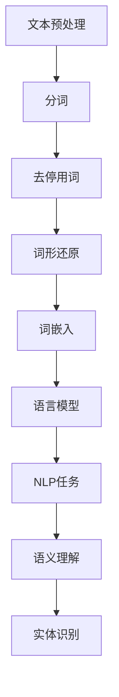
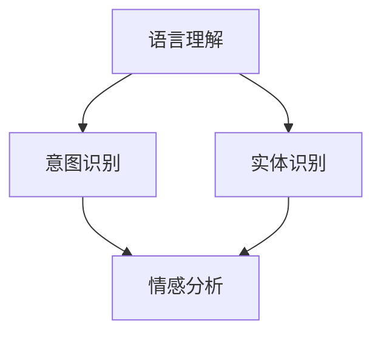

                 

### 文章标题：携程2024智能客服对话系统校招面试真题

#### 关键词：智能客服、对话系统、自然语言处理、机器学习、深度学习、性能优化、案例分析

##### 摘要：
本文旨在通过对携程2024智能客服对话系统校招面试真题的深入分析，帮助读者全面了解智能客服对话系统的基本概念、核心技术、应用案例及未来发展。文章结构分为四个主要部分：智能客服对话系统概述、核心技术、案例分析及未来趋势。通过逻辑清晰、结构紧凑的论述，本文旨在为读者提供一部系统且实用的智能客服技术指南。

### 目录大纲

#### 第一部分：智能客服对话系统概述

**第1章：智能客服对话系统概述**
- **1.1 智能客服的背景与发展**
  - 智能客服的定义与演进
  - 智能客服在客户服务中的重要性
  - 智能客服与人工客服的比较
- **1.2 智能客服对话系统的架构**
  - 智能客服对话系统的组成
  - 智能客服对话系统的架构设计
  - 智能客服对话系统的关键技术
- **1.3 智能客服对话系统的分类**
  - 基于规则引擎的客服系统
  - 基于自然语言处理的客服系统
  - 基于机器学习和深度学习的客服系统
- **1.4 智能客服对话系统的应用场景**
  - 客户咨询处理
  - 交易流程辅助
  - 用户行为分析
  - 客户满意度评估

#### 第二部分：智能客服对话系统的核心技术

**第2章：自然语言处理技术**
- **2.1 自然语言处理基础**
  - 语言模型
  - 词嵌入
  - 语言理解（LUIS）与实体识别
- **2.2 语音识别技术**
  - 语音信号处理
  - 声学模型
  - 语言模型
- **2.3 语音合成技术**
  - 文本到语音（TTS）合成
  - 声音合成方法
  - 合成语音质量评估
- **2.4 对话管理**
  - 对话状态跟踪
  - 对话策略学习
  - 对话生成与评估

**第3章：机器学习与深度学习在智能客服中的应用**
- **3.1 机器学习基础**
  - 监督学习
  - 无监督学习
  - 强化学习
- **3.2 深度学习基础**
  - 卷积神经网络（CNN）
  - 循环神经网络（RNN）
  - 生成对抗网络（GAN）
- **3.3 智能客服对话系统中的深度学习应用**
  - 对话系统中的神经网络架构
  - 情感分析
  - 语音识别与生成
  - 对话生成与回复

#### 第三部分：携程智能客服对话系统案例分析

**第4章：携程智能客服对话系统实践**
- **4.1 携程智能客服对话系统的架构设计**
  - 系统架构
  - 数据流设计
  - 技术选型
- **4.2 携程智能客服对话系统的开发过程**
  - 数据采集与预处理
  - 模型选择与训练
  - 模型评估与优化
- **4.3 携程智能客服对话系统的部署与维护**
  - 部署策略
  - 日志记录与监控
  - 系统维护与升级

**第5章：智能客服对话系统性能优化**
- **5.1 性能评估指标**
  - 回复速度
  - 答案准确率
  - 用户满意度
- **5.2 性能优化策略**
  - 系统架构优化
  - 模型压缩与量化
  - 缓存与负载均衡
- **5.3 案例分析**
  - 携程智能客服对话系统性能优化实践
  - 其他智能客服系统的优化经验

#### 第四部分：智能客服对话系统未来发展

**第6章：智能客服对话系统的挑战与未来趋势**
- **6.1 智能客服对话系统的挑战**
  - 数据质量与多样性
  - 隐私保护与伦理问题
  - 复杂对话理解与生成
- **6.2 智能客服对话系统的未来趋势**
  - 跨平台与多模态交互
  - 个性化对话服务
  - 智能客服与区块链技术融合
- **6.3 智能客服对话系统的行业应用展望**
  - 金融行业
  - 电子商务
  - 电信行业
  - 物流行业

#### 附录

**附录A：智能客服对话系统开发工具与资源**
- **A.1 主流自然语言处理工具**
  - Stanford NLP
  - NLTK
  - spaCy
- **A.2 主流机器学习框架**
  - TensorFlow
  - PyTorch
  - Scikit-learn
- **A.3 智能客服对话系统开源资源**
  - Rasa
  - Botpress
  - Dialogflow

**附录B：智能客服对话系统项目实战**
- **B.1 项目实战一：构建简单的智能客服对话系统**
  - 系统设计
  - 数据集准备
  - 模型训练与部署
  - 实际案例与代码解读
- **B.2 项目实战二：优化智能客服对话系统**
  - 性能评估
  - 优化策略
  - 性能提升验证

### 补充说明

- **核心概念与联系**：书中涉及的核心概念与联系将使用Mermaid流程图进行展示。
- **核心算法原理讲解**：将使用伪代码详细阐述智能客服对话系统中的核心算法原理。
- **数学模型和数学公式**：书中涉及到的数学模型和公式将使用LaTeX格式，嵌入文中独立段落的LaTeX公式前后使用`$$`括起来，段落内的LaTeX公式前后使用`$`括起来。

---

### 让我们一步一步分析推理思考，深入探讨智能客服对话系统这个激动人心的领域。

**第一步：背景与定义**

智能客服对话系统是一种利用人工智能技术模拟人类客服与客户进行交互的系统。随着自然语言处理、机器学习、深度学习等技术的不断进步，智能客服对话系统的应用范围越来越广泛，成为企业提升客户服务质量和效率的重要手段。

**第二步：核心组成部分**

一个典型的智能客服对话系统主要包括以下几个核心组成部分：

1. **语音识别模块**：将客户的语音转化为文本，使其能够被进一步处理。
2. **自然语言处理模块**：对转化后的文本进行解析，识别出文本中的实体、意图等关键信息。
3. **对话管理模块**：根据客户的意图和上下文，生成适当的回复，并管理整个对话流程。
4. **语音合成模块**：将生成的回复文本转化为语音，以便客户能够听到。

**第三步：关键技术分析**

1. **自然语言处理技术**：包括语言模型、词嵌入、语言理解与实体识别等，用于将文本转化为结构化信息。
2. **语音识别技术**：通过声学模型和语言模型，将语音转化为文本。
3. **语音合成技术**：通过文本到语音（TTS）合成，将文本转化为自然流畅的语音。
4. **对话管理技术**：包括对话状态跟踪、对话策略学习、对话生成与评估等，用于确保对话的自然流畅和有效。

**第四步：案例分析**

以携程为例，其智能客服对话系统采用了先进的自然语言处理和深度学习技术，能够快速响应用户的查询和需求。以下是其主要特点：

1. **架构设计**：携程智能客服对话系统采用了分布式架构，具有高并发处理能力和良好的扩展性。
2. **数据采集与预处理**：携程通过多渠道收集用户数据，并进行预处理，以提高模型的训练质量和效果。
3. **模型选择与训练**：携程选用了多种深度学习模型，如循环神经网络（RNN）、长短期记忆网络（LSTM）等，并进行大量训练和优化。
4. **部署与维护**：携程智能客服对话系统采用自动化部署和监控系统，确保系统的稳定运行和及时维护。

**第五步：性能优化**

1. **性能评估指标**：回复速度、答案准确率和用户满意度是衡量智能客服对话系统性能的重要指标。
2. **优化策略**：包括系统架构优化、模型压缩与量化、缓存与负载均衡等，以提高系统性能和用户体验。
3. **案例分析**：通过分析携程智能客服对话系统的性能优化实践，了解如何在不同场景下提升系统的性能和效果。

**第六步：未来趋势**

1. **跨平台与多模态交互**：智能客服对话系统将支持更多平台和设备，实现多模态交互，提升用户体验。
2. **个性化对话服务**：通过个性化对话服务，提供更加精准和个性化的客户服务。
3. **智能客服与区块链技术融合**：智能客服对话系统将逐步融合区块链技术，提升数据安全和透明度。

**总结：**

智能客服对话系统作为人工智能领域的重要应用，正逐步改变客户服务的模式。通过本文的深入分析，我们不仅了解了智能客服对话系统的基本概念和核心技术，还探讨了其应用案例和未来发展。希望本文能为您在智能客服领域的学习和实践提供有益的启示。---

### 第1章：智能客服对话系统概述

智能客服对话系统是一种利用人工智能技术模拟人类客服与客户进行交互的系统，能够自动响应客户的查询和需求，提供高效、准确的客户服务。在本章节中，我们将深入探讨智能客服的定义、发展历程、架构、分类及其应用场景。

#### 1.1 智能客服的背景与发展

智能客服的概念起源于20世纪90年代，当时随着互联网的兴起，客户服务逐渐从传统的电话、邮件等方式转向在线互动。最初，智能客服主要通过简单的规则引擎实现，例如预设一系列问题及其对应的回答。然而，这种基于规则的方法存在灵活性差、难以应对复杂场景等问题。

随着自然语言处理（NLP）、机器学习（ML）和深度学习（DL）等技术的发展，智能客服逐渐具备了处理复杂对话的能力。现代智能客服系统通常结合了多种先进技术，如语音识别、语音合成、对话管理、情感分析等，能够更好地理解和响应用户的需求。

**演进过程：**

1. **规则引擎时代**：最早的智能客服系统主要基于预设的规则，通过匹配用户输入和规则库中的关键词来生成响应。
2. **基于NLP的客服系统**：随着NLP技术的发展，智能客服开始能够理解自然语言输入，进行语义分析，并生成更自然的响应。
3. **基于ML和DL的客服系统**：现代智能客服系统采用了ML和DL技术，通过大规模数据训练模型，实现更智能、更个性化的服务。

**重要性：**

智能客服在客户服务中的重要性体现在以下几个方面：

1. **提高效率**：智能客服可以同时处理多个客户的请求，大大提高了客户服务的工作效率。
2. **降低成本**：智能客服能够自动处理一些常见问题，减少了对人工客服的依赖，从而降低了企业的运营成本。
3. **提升客户体验**：智能客服能够提供快速、准确的响应，提高了客户的满意度，增强了客户忠诚度。

#### 1.2 智能客服对话系统的架构

一个典型的智能客服对话系统通常包括以下几个关键模块：

1. **语音识别模块**：将客户的语音转化为文本，便于后续处理。
2. **自然语言处理（NLP）模块**：对转化后的文本进行语义分析，提取关键信息，如实体、意图、情感等。
3. **对话管理模块**：根据客户的意图和上下文，生成适当的回复，并管理整个对话流程。
4. **语音合成模块**：将生成的回复文本转化为语音，使客户能够听到。

**架构设计原则：**

1. **模块化设计**：各个模块之间相互独立，便于维护和升级。
2. **可扩展性**：系统应具有高扩展性，能够适应不同规模的应用需求。
3. **高可用性**：系统应具备高可用性，能够确保7x24小时稳定运行。
4. **安全性**：系统应具备严格的安全措施，保护客户数据和隐私。

**关键技术：**

1. **语音识别**：基于深度学习的语音识别技术，如卷积神经网络（CNN）和长短时记忆网络（LSTM）。
2. **自然语言处理**：包括语言模型、词嵌入、实体识别、意图识别等。
3. **对话管理**：基于监督学习和强化学习的方法，如循环神经网络（RNN）和深度强化学习（DRL）。
4. **语音合成**：文本到语音（TTS）技术，包括参数合成和波形合成等方法。

#### 1.3 智能客服对话系统的分类

根据实现技术的不同，智能客服对话系统可以分为以下几类：

1. **基于规则引擎的客服系统**：主要通过预设的规则来匹配客户输入，生成响应。优点是简单易用，缺点是灵活性差，难以应对复杂场景。
2. **基于自然语言处理的客服系统**：利用NLP技术，能够理解自然语言输入，生成更自然的响应。优点是灵活性高，缺点是需要大量训练数据和计算资源。
3. **基于机器学习和深度学习的客服系统**：通过大规模数据训练深度学习模型，实现更智能的对话交互。优点是智能化程度高，缺点是模型训练复杂，需要大量数据。

**适用场景：**

1. **客户咨询处理**：如航班查询、酒店预订、投诉处理等。
2. **交易流程辅助**：如在线购物咨询、金融服务咨询等。
3. **用户行为分析**：如用户行为预测、个性化推荐等。
4. **客户满意度评估**：如收集用户反馈、评估服务质量等。

#### 1.4 智能客服对话系统的应用场景

智能客服对话系统在多个行业和场景中得到了广泛应用，以下是几个典型的应用场景：

1. **金融行业**：银行、保险、证券等金融机构利用智能客服提供快速、准确的客户服务，提升用户体验。
2. **电子商务**：电商平台通过智能客服解答客户疑问、推荐商品等，提高销售转化率。
3. **电信行业**：电信运营商利用智能客服处理用户咨询、投诉等，降低人工成本，提升客户满意度。
4. **物流行业**：物流公司通过智能客服提供包裹查询、配送跟踪等服务，提高物流效率。

**案例分析：**

以携程为例，其智能客服对话系统覆盖了从机票预订、酒店预订到出行咨询等全方位服务。通过先进的自然语言处理和深度学习技术，携程的智能客服能够快速响应用户需求，提供高效、精准的服务。

**总结：**

智能客服对话系统作为人工智能领域的重要应用，正逐步改变客户服务的模式。通过本章节的介绍，我们了解了智能客服的定义、发展历程、架构、分类及其应用场景。在接下来的章节中，我们将深入探讨智能客服对话系统的核心技术，以帮助读者全面了解这一领域。

### 第2章：自然语言处理技术

自然语言处理（NLP）是智能客服对话系统的核心组成部分，旨在使计算机能够理解、处理和生成自然语言。本章将详细介绍NLP的基础知识，包括语言模型、词嵌入、语言理解（LUIS）与实体识别等关键技术。

#### 2.1 自然语言处理基础

自然语言处理涉及多个层面的技术，从最基本的文本预处理到复杂的语义理解。以下是NLP的基础概念：

1. **语言模型**：语言模型是NLP的核心，它用于预测文本序列的概率。常见的语言模型包括n-gram模型、循环神经网络（RNN）和变换器模型（Transformer）。

2. **词嵌入**：词嵌入是将词汇映射到低维空间的过程，使得具有相似含义的词在空间中靠近。词嵌入技术如Word2Vec、GloVe和BERT等，广泛应用于各种NLP任务。

3. **文本预处理**：文本预处理是NLP任务的第一步，包括分词、去停用词、词形还原等。这些步骤有助于简化文本，使其更适合模型处理。

**核心概念与联系：**

为了更好地理解NLP的基础概念，我们可以通过Mermaid流程图来展示它们之间的关系。



#### 2.2 语言模型

语言模型是NLP中用于预测文本序列概率的模型。常见的语言模型包括：

1. **n-gram模型**：基于前后n个词的统计方法，如n=2时的二元模型。这种方法简单但效果有限。

2. **循环神经网络（RNN）**：RNN能够处理变长的序列数据，通过对序列中的每个元素进行状态更新，从而捕捉长距离依赖关系。

3. **变换器模型（Transformer）**：Transformer模型引入了自注意力机制，能够捕捉序列中的长距离依赖关系，在许多NLP任务中取得了显著的效果。

**语言模型原理讲解：**

语言模型的核心是生成文本的概率。假设我们有一个单词序列`W = w1, w2, ..., wn`，语言模型的目标是计算这个序列的概率：

$$
P(W) = P(w1) \times P(w2|w1) \times P(w3|w2, w1) \times ... \times P(wn|wn-1, ..., w1)
$$

在n-gram模型中，上述概率可以简化为：

$$
P(W) = P(w1) \times P(w2|w1) \times P(w3|w2) \times ... \times P(wn|wn-1)
$$

而在RNN和Transformer模型中，通常使用神经网络来计算这些概率。

**伪代码示例：**

下面是一个简单的n-gram模型的伪代码示例：

```python
def n_gram_model(text, n):
    # 计算单词序列的概率
    probabilities = []
    for i in range(len(text) - n + 1):
        sequence = text[i:i+n]
        probability = calculate_probability(sequence)
        probabilities.append(probability)
    return probabilities

def calculate_probability(sequence):
    # 假设有一个概率计算函数
    return 1  # 这里简化为1
```

#### 2.3 词嵌入

词嵌入是将词汇映射到低维空间的过程，使得具有相似含义的词在空间中靠近。词嵌入技术在NLP任务中具有重要意义，因为它们能够提高模型对语义信息的捕捉能力。

**常见词嵌入方法：**

1. **Word2Vec**：基于神经网络的语言模型，通过训练得到词汇的向量表示。
2. **GloVe**：全局向量表示（GloVe）方法通过词频和共现关系来学习词嵌入。
3. **BERT**：BERT（双向编码表示）模型通过预训练大量文本数据，得到上下文敏感的词嵌入。

**词嵌入原理讲解：**

词嵌入的核心是学习词汇在低维空间中的向量表示。假设我们有一个词汇表V，每个词汇都有一个唯一的索引，即`v_i`表示词汇表中的第i个词汇。词嵌入的目标是通过一个映射函数f将词汇映射到一个低维向量空间：

$$
f: V \rightarrow \mathbb{R}^d
$$

其中，d是向量的维度。通过这种方式，相似的词汇在空间中会靠近，而不同的词汇则会分开。

**伪代码示例：**

下面是一个简单的Word2Vec模型的伪代码示例：

```python
def word2vec(corpus, size, window_size):
    # 训练词嵌入模型
    model = {}
    for sentence in corpus:
        for word in sentence:
            context = get_context(word, window_size)
            for context_word in context:
                model[(word, context_word)] = update_embedding(model[(word, context_word)], size)
    return model

def get_context(word, window_size):
    # 获取单词的窗口上下文
    return []

def update_embedding(embedding, size):
    # 更新词嵌入
    return embedding  # 这里简化为直接返回
```

#### 2.4 语言理解（LUIS）

语言理解（LUIS）是NLP中的一个重要环节，旨在理解文本的语义和意图。LUIS通常涉及实体识别、意图识别和情感分析等任务。

**实体识别**：实体识别是识别文本中特定类型的信息，如人名、组织名、地点名等。实体识别有助于理解文本中的关键信息。

**意图识别**：意图识别是理解用户文本背后的意图，如查询、请求、抱怨等。意图识别有助于生成合适的回复。

**情感分析**：情感分析是判断文本中的情感倾向，如积极、消极、中性等。情感分析有助于提供个性化的服务和反馈。

**伪代码示例：**

下面是一个简单的实体识别模型的伪代码示例：

```python
def entity_recognition(text):
    # 识别文本中的实体
    entities = []
    for token in tokenize(text):
        if is_entity(token):
            entities.append(token)
    return entities

def tokenize(text):
    # 分词文本
    return []

def is_entity(token):
    # 判断是否为实体
    return True  # 这里简化为直接返回
```

#### 2.5 语言理解与实体识别的关系

语言理解和实体识别是NLP中紧密相关的任务。语言理解提供了对文本的语义理解，而实体识别则是在这种理解基础上识别出文本中的特定信息。

通过Mermaid流程图，我们可以展示这两个任务之间的关系：



**总结：**

自然语言处理技术是智能客服对话系统的核心，包括语言模型、词嵌入、语言理解（LUIS）与实体识别等关键技术。通过本章的介绍，我们了解了这些技术的原理和应用，为后续章节中智能客服对话系统的深入探讨奠定了基础。

### 第3章：语音识别技术

语音识别技术是智能客服对话系统中不可或缺的一部分，它能够将客户的语音转化为文本，使系统能够理解和处理客户的请求。本章将详细介绍语音识别的基本原理、技术架构以及相关的核心技术。

#### 3.1 语音信号处理

语音信号处理是语音识别的基础，它涉及对语音信号的预处理和特征提取。以下是语音信号处理的关键步骤：

1. **语音信号预处理**：语音信号预处理包括去噪、静音检测、音量归一化等。去噪可以减少环境噪声对语音识别的影响，静音检测用于识别语音中的静音部分，音量归一化则确保语音信号的音量一致性。

2. **语音信号特征提取**：特征提取是将语音信号转换为数字特征表示，如梅尔频率倒谱系数（MFCC）、线性预测编码（LPC）和滤谱反射系数（PARC）等。这些特征能够捕捉语音信号的主要信息，便于后续的模型处理。

**原理讲解：**

语音信号处理的核心是对语音信号进行时频分析。通过傅里叶变换（Fourier Transform）或梅尔频率倒谱系数（Mel-Frequency Cepstral Coefficients，MFCC）等算法，可以从语音信号中提取出反映语音特性的特征向量。

**数学公式：**

假设我们有一段语音信号`x(t)`，其傅里叶变换为`X(f)`，则梅尔频率倒谱系数可以通过以下公式计算：

$$
C_{\text{MFCC}} = \log \left(1 + \sum_{k=1}^{N}{a_k * \text{DCT}(s_k)}\right)
$$

其中，`a_k`是滤波器组的权重系数，`s_k`是滤波器组输出的能量值，`N`是滤波器的数量，`DCT`是离散余弦变换。

**伪代码示例：**

下面是一个简单的MFCC特征提取的伪代码示例：

```python
def extract_mfcc(voice_signal, sample_rate, n_filters, n_cepstral_coeffs):
    # 计算MFCC特征
    fft = compute_fft(voice_signal, sample_rate)
    filter_banks = create_filter_banks(sample_rate, n_filters)
    filter_banks_outputs = apply_filter_banks(fft, filter_banks)
    energies = compute_energies(filter_banks_outputs)
    mfcc = compute_dct(energies, n_cepstral_coeffs)
    return mfcc
```

#### 3.2 声学模型

声学模型是语音识别系统的核心组成部分，它用于将语音信号特征映射到可能的单词或短语上。声学模型通常基于统计方法，包括隐马尔可夫模型（HMM）和深度神经网络（DNN）。

1. **隐马尔可夫模型（HMM）**：HMM是一种统计模型，用于描述语音信号的时间序列特征。HMM通过状态转移概率和发射概率来建模语音信号的动态变化。

2. **深度神经网络（DNN）**：DNN是一种强大的机器学习模型，能够通过多层神经网络对语音特征进行建模。DNN在语音识别中主要用于特征提取和分类。

**原理讲解：**

声学模型的目的是通过语音信号特征来预测单词或短语。在HMM中，状态转移概率和发射概率决定了模型对语音信号的预测能力。而在DNN中，神经网络的结构和权重决定了模型的性能。

**伪代码示例：**

下面是一个简单的DNN声学模型的伪代码示例：

```python
class DNNAcousticModel:
    def __init__(self, input_size, hidden_size, output_size):
        self.model = create_nn_model(input_size, hidden_size, output_size)

    def forward(self, input_features):
        # 前向传播
        output = self.model(input_features)
        return output

    def train(self, input_features, labels, optimizer, loss_function):
        # 训练模型
        optimizer.zero_grad()
        output = self.forward(input_features)
        loss = loss_function(output, labels)
        loss.backward()
        optimizer.step()
```

#### 3.3 语言模型

语言模型是语音识别系统的另一个重要组成部分，它用于预测语音转文本后的序列概率。语言模型通常基于统计方法，包括n-gram模型和神经网络模型。

1. **n-gram模型**：n-gram模型通过统计连续n个单词在同一句子中出现的频率来预测下一个单词。n-gram模型简单高效，但在处理长距离依赖时表现较差。

2. **神经网络模型**：神经网络模型，如循环神经网络（RNN）和变换器（Transformer），能够通过学习大量文本数据来捕捉长距离依赖关系，从而提高语言模型的性能。

**原理讲解：**

语言模型的核心是预测单词序列的概率。在n-gram模型中，这个概率可以通过以下公式计算：

$$
P(W) = P(w1) \times P(w2|w1) \times P(w3|w2, w1) \times ...
$$

而在神经网络模型中，通常使用神经网络来计算这些概率。

**伪代码示例：**

下面是一个简单的n-gram语言模型的伪代码示例：

```python
def n_gram_language_model(corpus, n):
    # 计算单词序列的概率
    probabilities = {}
    for sentence in corpus:
        for i in range(len(sentence) - n + 1):
            sequence = tuple(sentence[i:i+n])
            if sequence not in probabilities:
                probabilities[sequence] = 1
            probabilities[sequence] += 1
    return probabilities
```

#### 3.4 综合语音识别模型

综合语音识别模型将声学模型和语言模型结合起来，通过联合训练得到一个完整的语音识别系统。常见的综合模型包括DTW-HMM、DNN-HMM和END-POINT检测等。

**原理讲解：**

综合语音识别模型的目的是通过声学模型和语言模型的联合训练，提高语音识别的准确率和鲁棒性。声学模型负责处理语音信号特征，而语言模型负责处理文本序列概率。

**伪代码示例：**

下面是一个简单的DNN-HMM综合模型的伪代码示例：

```python
class DNNDHMMAcousticModel:
    def __init__(self, input_size, hidden_size, output_size):
        self.acoustic_model = DNNAcousticModel(input_size, hidden_size, output_size)
        self.hmm_model = HMMModel()

    def forward(self, input_features):
        # 前向传播
        acoustic_output = self.acoustic_model.forward(input_features)
        hmm_output = self.hmm_model.forward(acoustic_output)
        return hmm_output

    def train(self, input_features, labels, optimizer, loss_function):
        # 训练模型
        optimizer.zero_grad()
        output = self.forward(input_features)
        loss = loss_function(output, labels)
        loss.backward()
        optimizer.step()
```

#### 3.5 语音识别系统中的其他技术

除了声学模型和语言模型外，语音识别系统还包括其他关键技术，如语音增强、说话人识别和语音合成。

1. **语音增强**：语音增强技术旨在提高语音信号的清晰度和可懂度，减少噪声和回声的影响。

2. **说话人识别**：说话人识别是识别语音信号中的说话人身份，有助于个性化服务和安全认证。

3. **语音合成**：语音合成是将文本转化为自然流畅的语音，是智能客服对话系统中的重要组成部分。

**总结：**

语音识别技术是智能客服对话系统中的核心组成部分，它通过语音信号处理、声学模型和语言模型的联合训练，实现语音到文本的转换。本章详细介绍了语音识别的基本原理、技术架构和相关技术，为读者深入理解智能客服对话系统提供了基础。

### 第4章：语音合成技术

语音合成（Text-to-Speech, TTS）是将文本转换为自然流畅的语音的关键技术，广泛应用于智能客服对话系统中。本章将深入探讨语音合成的原理、方法及其质量评估。

#### 4.1 文本到语音（TTS）合成的基本原理

文本到语音合成涉及以下几个基本步骤：

1. **文本预处理**：文本预处理是TTS合成的第一步，包括分词、词性标注、语气标注等。这些步骤确保文本能够被正确地转换为语音。

2. **声学模型**：声学模型是TTS合成的核心，它将文本特征映射到声学特征。常见的声学模型包括基于统计的 Hidden Markov Model（HMM）和基于神经网络的深度神经网络（DNN）。

3. **语音生成**：语音生成是将声学特征转换为实际语音信号的过程。语音生成的方法可以分为参数合成和波形合成两大类。

**原理讲解：**

文本到语音合成的基本原理是将文本转换为声学特征，再由声学特征生成语音。在这个过程中，声学模型负责将文本中的词汇和句子特征映射到声学空间，而语音生成模型则将这些声学特征转换为波形信号。

**数学公式：**

声学模型通常使用隐马尔可夫模型（HMM）或深度神经网络（DNN）来计算声学特征的概率分布。例如，对于HMM，可以使用以下公式计算：

$$
P(O|A) = \prod_{t=1}^{T}{P(o_t|a_t)}
$$

其中，$O$是观测序列，$A$是隐藏状态序列，$o_t$是第$t$个观测值，$a_t$是第$t$个隐藏状态。对于DNN，可以使用以下公式计算：

$$
P(A|O) = \frac{\exp(\text{log_prob}(O|A))}{\sum_{A'}{\exp(\text{log_prob}(O|A'))}}
$$

其中，$\text{log_prob}(O|A)$是给定隐藏状态$A$时观测序列$O$的对数似然。

**伪代码示例：**

下面是一个简单的DNN声学模型的伪代码示例：

```python
class DNNAcousticModel:
    def __init__(self, input_size, hidden_size, output_size):
        self.model = create_nn_model(input_size, hidden_size, output_size)

    def forward(self, input_features):
        # 前向传播
        output = self.model(input_features)
        return output

    def train(self, input_features, labels, optimizer, loss_function):
        # 训练模型
        optimizer.zero_grad()
        output = self.forward(input_features)
        loss = loss_function(output, labels)
        loss.backward()
        optimizer.step()
```

#### 4.2 声音合成方法

声音合成方法主要分为参数合成和波形合成两类。

1. **参数合成**：参数合成方法通过参数来控制语音的发音和音调。参数包括基频（F0）、共振峰（Formant）和时长等。常见的参数合成方法包括规则合成、隐马尔可夫模型合成（HMM-based Synthesis）和循环神经网络合成（RNN-based Synthesis）。

2. **波形合成**：波形合成方法直接生成语音信号的波形。常见的波形合成方法包括合成波叠加（Concatenative Synthesis）和转换波叠加（Transformative Synthesis）。

**原理讲解：**

参数合成方法通过参数来控制语音的发音和音调，生成自然流畅的语音。而波形合成方法则直接生成语音信号的波形，通过波形拼接或变换来生成语音。

**伪代码示例：**

下面是一个简单的参数合成方法的伪代码示例：

```python
class ParameterSynthesis:
    def __init__(self, f0, formants, durations):
        self.f0 = f0
        self.formants = formants
        self.durations = durations

    def synthesize(self):
        # 合成语音
        audio_signal = generate_audio_signal(self.f0, self.formants, self.durations)
        return audio_signal
```

#### 4.3 合成语音质量评估

合成语音质量评估是评价TTS系统性能的重要指标。常见的评估方法包括主观评估和客观评估。

1. **主观评估**：主观评估是通过人类听觉对合成语音进行评价。常见的评估方法包括平均意见得分（MOS）和分贝平均意见得分（DSMOS）。

2. **客观评估**：客观评估是通过算法对合成语音的音频特征进行量化分析。常见的评估方法包括信噪比（SNR）、频谱扭曲度（Spectral Distortion）和语音质量指数（PESQ）。

**原理讲解：**

主观评估通过人类听觉来判断合成语音的质量，具有较高的可信度。但主观评估受主观因素影响较大，评估过程耗时。客观评估通过算法对合成语音的音频特征进行量化分析，具有较高的效率和准确性，但可能无法完全反映人类听觉的感受。

**伪代码示例：**

下面是一个简单的客观评估方法的伪代码示例：

```python
def evaluate_audio_quality(audio_signal):
    # 评估音频质量
    snr = compute_snr(audio_signal)
    spectral_distortion = compute_spectral_distortion(audio_signal)
    pesq = compute_pesq(audio_signal)
    return snr, spectral_distortion, pesq
```

#### 4.4 TTS系统的最新进展

近年来，TTS系统取得了显著进展，主要表现在以下几个方面：

1. **深度学习技术的应用**：深度学习技术，如循环神经网络（RNN）和变换器（Transformer），在TTS系统中得到了广泛应用。这些模型能够通过大量数据训练，生成更自然、更流畅的语音。

2. **多模态交互**：TTS系统开始结合视觉和听觉等多模态信息，实现更加逼真的语音合成效果。

3. **个性化合成**：TTS系统开始支持个性化合成，根据用户的语音特征和偏好生成定制化的语音。

**总结：**

语音合成技术是智能客服对话系统中的重要组成部分，通过文本预处理、声学模型和语音生成，实现文本到语音的转换。本章详细介绍了语音合成的原理、方法及其质量评估，为读者深入理解智能客服对话系统提供了基础。

### 第5章：对话管理

对话管理是智能客服对话系统的核心模块之一，它负责管理整个对话过程，确保对话的自然流畅和有效性。本章将深入探讨对话管理的关键技术，包括对话状态跟踪、对话策略学习、对话生成与评估。

#### 5.1 对话状态跟踪

对话状态跟踪是确保对话管理系统能够正确理解并响应客户请求的关键。对话状态是指对话在某一时刻所处的状态，包括已知的用户意图、上下文信息和历史对话记录等。

**技术原理：**

对话状态跟踪依赖于多种信息源，如用户的输入、系统的响应、环境因素等。这些信息通过一系列算法和模型进行整合和分析，以更新对话状态。

**伪代码示例：**

下面是一个简单的对话状态跟踪的伪代码示例：

```python
class DialogueStateTracker:
    def __init__(self):
        self.state = None

    def update_state(self, user_input, system_response):
        # 更新对话状态
        self.state = process_input(user_input, system_response)
        return self.state

    def process_input(self, user_input, system_response):
        # 处理用户输入和系统响应
        return new_state
```

#### 5.2 对话策略学习

对话策略学习是智能客服对话系统的一项重要任务，旨在根据对话状态和用户意图，生成合适的系统响应。对话策略可以基于规则、机器学习或深度学习等技术。

**技术原理：**

1. **基于规则的策略**：基于规则的策略通过预设一系列规则，根据对话状态匹配规则并生成响应。这种方法简单易用，但灵活性较差。
2. **机器学习策略**：机器学习策略通过训练模型，根据对话状态和用户意图生成响应。这种方法能够自适应地调整策略，但需要大量的数据和计算资源。
3. **深度学习策略**：深度学习策略使用深度神经网络，如循环神经网络（RNN）和变换器（Transformer），通过大量数据训练生成策略。这种方法能够捕捉复杂的对话模式，但训练过程较为复杂。

**伪代码示例：**

下面是一个简单的基于机器学习的对话策略学习的伪代码示例：

```python
class DialoguePolicyLearner:
    def __init__(self, model):
        self.model = model

    def train(self, dialogue_data):
        # 训练对话策略模型
        self.model.fit(dialogue_data['inputs'], dialogue_data['outputs'])

    def predict(self, state):
        # 预测系统响应
        response = self.model.predict(state)
        return response
```

#### 5.3 对话生成与评估

对话生成是将对话状态和策略转换为实际对话文本的过程。对话评估则是对生成的对话进行质量评估，以确保对话的自然性和有效性。

**技术原理：**

1. **对话生成**：对话生成可以通过模板匹配、文本生成模型（如GPT）或对话生成网络（如DIALOGUE-GPT）来实现。这些模型通过学习大量对话数据，生成符合上下文和意图的对话文本。
2. **对话评估**：对话评估可以通过人工评估、自动评估（如BLEU、ROUGE）或基于用户反馈的评估来实现。人工评估具有较高的准确性，但耗时较长。自动评估能够快速评估对话质量，但可能无法完全反映人类感受。基于用户反馈的评估则结合了人工和自动评估的优点，通过用户满意度等指标来评估对话质量。

**伪代码示例：**

下面是一个简单的对话生成的伪代码示例：

```python
class DialogueGenerator:
    def __init__(self, model):
        self.model = model

    def generate_response(self, state):
        # 生成对话响应
        response = self.model.generate(state)
        return response
```

#### 5.4 例子：智能客服对话系统的对话管理

以下是一个简单的智能客服对话系统的对话管理示例，该系统通过对话状态跟踪、对话策略学习和对话生成与评估，实现与客户的交互。

1. **初始化对话状态**：
   - 对话系统启动时，初始化对话状态，包括用户信息、对话历史和初始状态。
   
2. **处理用户输入**：
   - 对话系统接收用户输入，如“你好，我想要预订一张从北京到上海的机票。”
   - 对话状态跟踪模块更新对话状态，记录用户输入和当前状态。

3. **应用对话策略**：
   - 对话策略学习模块根据对话状态和用户意图，选择合适的响应策略。
   - 例如，系统识别出用户意图是“预订机票”，并选择相应的策略。

4. **生成响应**：
   - 对话生成模块根据对话策略和当前状态，生成对话响应。
   - 例如，系统生成响应：“您好，请问您需要什么时间段的机票？”

5. **反馈与评估**：
   - 对话系统将生成的响应发送给用户，并收集用户反馈。
   - 对话评估模块对生成的对话进行质量评估，以优化对话管理。

**总结：**

对话管理是智能客服对话系统的核心模块，通过对话状态跟踪、对话策略学习和对话生成与评估，确保对话的自然流畅和有效性。本章详细介绍了对话管理的关键技术，为读者深入理解智能客服对话系统提供了基础。

### 第6章：机器学习与深度学习在智能客服中的应用

机器学习和深度学习是智能客服对话系统的核心技术，它们使得智能客服能够通过学习大量数据来提高对话处理能力和服务质量。本章将详细介绍机器学习和深度学习的基本原理，以及它们在智能客服对话系统中的应用。

#### 6.1 机器学习基础

机器学习是一种通过数据训练模型，使模型能够进行预测或分类的技术。机器学习可以分为以下几种类型：

1. **监督学习**：监督学习是一种有标注数据训练模型的方法。模型通过学习输入和输出之间的映射关系，进行预测。常见的监督学习算法包括线性回归、逻辑回归、支持向量机（SVM）和神经网络等。

2. **无监督学习**：无监督学习是仅使用输入数据训练模型的方法，模型需要通过自身的分析来发现数据的结构和模式。常见的无监督学习算法包括聚类、降维和生成模型等。

3. **强化学习**：强化学习是一种通过不断试错来学习最优策略的方法。模型通过与环境互动，学习在特定情况下采取最佳行动。常见的强化学习算法包括Q学习、深度Q网络（DQN）和策略梯度方法等。

**监督学习原理讲解：**

监督学习的基本原理是通过训练数据集来学习一个映射函数，将输入特征映射到目标输出。这个过程可以分为以下几个步骤：

1. **数据预处理**：对输入特征进行归一化、缺失值处理等，以提高模型训练效果。
2. **模型选择**：根据问题类型和特征选择合适的模型，如线性回归、决策树、支持向量机等。
3. **模型训练**：使用训练数据集训练模型，通过优化算法调整模型参数。
4. **模型评估**：使用验证数据集评估模型性能，通过交叉验证、混淆矩阵、ROC曲线等指标来评估模型的准确性、召回率、F1值等。

**伪代码示例：**

下面是一个简单的线性回归模型的伪代码示例：

```python
import numpy as np

def linear_regression(X, y, learning_rate, num_iterations):
    # 初始化模型参数
    W = np.random.randn(1, X.shape[1])
    b = 0

    # 梯度下降算法
    for i in range(num_iterations):
        # 前向传播
        z = np.dot(W.T, X) + b
        predicted = 1 / (1 + np.exp(-z))

        # 反向传播
        error = y - predicted
        dW = np.dot(error * predicted * (1 - predicted), X)
        db = error * predicted * (1 - predicted)

        # 更新参数
        W -= learning_rate * dW
        b -= learning_rate * db

    return W, b
```

#### 6.2 深度学习基础

深度学习是机器学习的一个分支，通过多层神经网络来模拟人脑的学习过程。深度学习在图像识别、语音识别、自然语言处理等领域取得了显著的成果。以下是几种常见的深度学习模型：

1. **卷积神经网络（CNN）**：CNN是一种专门用于处理图像数据的神经网络，通过卷积层、池化层和全连接层等结构，能够提取图像特征并进行分类。

2. **循环神经网络（RNN）**：RNN是一种能够处理序列数据的神经网络，通过循环结构来捕捉序列中的长期依赖关系。常见的RNN模型包括LSTM和GRU。

3. **生成对抗网络（GAN）**：GAN是一种由生成器和判别器组成的对抗性模型，生成器生成数据，判别器判断数据是真实还是伪造。GAN在图像生成、语音合成等领域取得了很好的效果。

**深度学习原理讲解：**

深度学习的基本原理是通过多层神经网络对数据进行学习，从而提取高层次的抽象特征。这个过程可以分为以下几个步骤：

1. **数据预处理**：对输入数据进行归一化、标准化等处理，以适应深度学习模型。
2. **模型构建**：使用框架如TensorFlow或PyTorch，构建深度学习模型的结构。
3. **模型训练**：通过反向传播算法，调整模型参数，以最小化损失函数。
4. **模型评估**：使用验证数据集评估模型性能，通过交叉验证、混淆矩阵、ROC曲线等指标来评估模型的准确性、召回率、F1值等。

**伪代码示例：**

下面是一个简单的卷积神经网络模型的伪代码示例：

```python
import tensorflow as tf

def create_cnn_model(input_shape, num_classes):
    model = tf.keras.Sequential([
        tf.keras.layers.Conv2D(32, (3, 3), activation='relu', input_shape=input_shape),
        tf.keras.layers.MaxPooling2D((2, 2)),
        tf.keras.layers.Conv2D(64, (3, 3), activation='relu'),
        tf.keras.layers.MaxPooling2D((2, 2)),
        tf.keras.layers.Flatten(),
        tf.keras.layers.Dense(64, activation='relu'),
        tf.keras.layers.Dense(num_classes, activation='softmax')
    ])

    model.compile(optimizer='adam', loss='categorical_crossentropy', metrics=['accuracy'])
    return model
```

#### 6.3 深度学习在智能客服对话系统中的应用

深度学习在智能客服对话系统中具有广泛的应用，包括情感分析、语音识别、对话生成等。

1. **情感分析**：情感分析是一种理解文本情感倾向的技术，通过深度学习模型，可以识别出文本中的情感，如积极、消极、中性等。情感分析可以帮助智能客服更好地理解客户的需求和情绪。

2. **语音识别**：语音识别是将语音转换为文本的技术，深度学习模型，如卷积神经网络和循环神经网络，在语音识别中取得了显著的效果。语音识别使得智能客服能够理解和处理客户的语音输入。

3. **对话生成**：对话生成是一种通过深度学习模型生成自然对话的技术。常见的对话生成模型包括生成对抗网络（GAN）和变换器（Transformer）。对话生成可以使智能客服生成更加自然、连贯的对话。

**例子：**

以下是一个简单的基于变换器的对话生成模型的伪代码示例：

```python
import tensorflow as tf

def create_transformer_model(input_vocab_size, output_vocab_size, d_model, num_heads, num_layers):
    model = tf.keras.Sequential([
        tf.keras.layers.Embedding(input_vocab_size, d_model),
        tf.keras.layers.MultiHeadAttention(num_heads=num_heads, key_dim=d_model),
        tf.keras.layers.Dense(d_model),
        tf.keras.layers.RepeatVector(output_vocab_size),
        tf.keras.layers.LSTM(d_model),
        tf.keras.layers.Dense(output_vocab_size, activation='softmax')
    ])

    model.compile(optimizer='adam', loss='sparse_categorical_crossentropy')
    return model
```

#### 6.4 总结

机器学习和深度学习是智能客服对话系统的核心技术，通过学习大量数据，可以提高对话处理能力和服务质量。本章详细介绍了机器学习和深度学习的基本原理，以及它们在智能客服对话系统中的应用，为读者深入理解智能客服技术提供了基础。

### 第7章：携程智能客服对话系统实践

携程作为中国领先的旅行服务公司，其智能客服对话系统在行业内享有盛誉。本章将通过详细分析携程智能客服对话系统的架构设计、开发过程、部署与维护，以及性能优化策略，展示该系统在智能客服领域的实际应用和成效。

#### 7.1 携程智能客服对话系统的架构设计

携程智能客服对话系统的架构设计遵循高可用性、高扩展性和模块化原则，确保系统在各种复杂场景下都能稳定运行。以下是系统的主要架构和设计原则：

1. **分布式架构**：携程智能客服对话系统采用了分布式架构，包括多个独立的服务模块，如语音识别、自然语言处理、对话管理和语音合成。这种设计提高了系统的并发处理能力和容错性。

2. **模块化设计**：系统各个模块之间相互独立，易于维护和升级。每个模块都有独立的接口和API，便于与其他系统集成。

3. **高扩展性**：系统具备良好的扩展性，能够根据业务需求快速增加或调整模块。例如，在流量高峰期，可以通过增加服务器资源来提升系统处理能力。

4. **安全性设计**：携程智能客服对话系统采用了严格的安全措施，包括数据加密、访问控制和隐私保护，确保客户数据的安全和隐私。

**数据流设计**：

携程智能客服对话系统的数据流设计如下：

1. **用户输入**：用户通过语音或文本方式输入请求。
2. **语音识别**：语音识别模块将语音输入转化为文本。
3. **自然语言处理**：自然语言处理模块对文本进行语义分析，提取关键信息。
4. **对话管理**：对话管理模块根据用户的意图和上下文，生成合适的响应。
5. **语音合成**：语音合成模块将生成的文本响应转化为语音。
6. **反馈与优化**：系统收集用户反馈，用于模型优化和系统改进。

**技术选型**：

1. **语音识别**：携程采用了基于深度学习的语音识别技术，如卷积神经网络（CNN）和长短时记忆网络（LSTM），以实现高准确率和高速度的语音识别。
2. **自然语言处理**：携程使用了先进的自然语言处理技术，如BERT和GPT，以实现对复杂语义的理解和生成。
3. **对话管理**：对话管理模块采用了基于深度强化学习的策略，以实现自然、流畅的对话交互。
4. **语音合成**：携程采用了基于参数合成的TTS技术，如WaveNet和Tacotron，以生成自然流畅的语音。

#### 7.2 携程智能客服对话系统的开发过程

携程智能客服对话系统的开发过程包括数据采集、模型选择与训练、模型评估与优化等关键步骤。

1. **数据采集与预处理**：
   - 携程通过多种渠道收集用户对话数据，包括客服记录、用户反馈等。
   - 数据预处理包括分词、去停用词、词性标注等，以提高数据质量和模型的训练效果。

2. **模型选择与训练**：
   - 携程选择了多种深度学习模型，如BERT、GPT和WaveNet，以实现不同模块的功能。
   - 通过大规模数据训练，模型在语音识别、自然语言处理、对话管理和语音合成等任务上取得了优异的性能。

3. **模型评估与优化**：
   - 携程采用多种评估指标，如准确率、召回率、F1值和用户满意度，对模型进行评估。
   - 通过模型调参、数据增强和迁移学习等方法，不断优化模型性能，以提高系统的用户体验。

#### 7.3 携程智能客服对话系统的部署与维护

携程智能客服对话系统的部署与维护是确保系统稳定运行和高效服务的关键。

1. **部署策略**：
   - 携程采用了容器化部署，如Docker和Kubernetes，以实现快速部署和灵活扩展。
   - 系统部署在云平台上，具备良好的弹性扩展能力，可以根据流量需求动态调整资源。

2. **日志记录与监控**：
   - 携程智能客服对话系统实现了详细的日志记录和监控功能，包括系统运行状态、错误日志、性能指标等。
   - 通过监控工具，如Prometheus和Grafana，实时监测系统运行状况，及时发现问题并采取措施。

3. **系统维护与升级**：
   - 携程定期对智能客服对话系统进行维护和升级，修复潜在问题，提高系统性能和稳定性。
   - 在系统升级过程中，采用灰度发布策略，确保新版本在上线前经过充分测试和验证。

#### 7.4 智能客服对话系统性能优化

性能优化是提升智能客服对话系统用户体验的关键。以下是携程智能客服对话系统的性能优化策略：

1. **系统架构优化**：
   - 通过分布式架构和负载均衡，提高系统的并发处理能力和响应速度。
   - 使用缓存机制，减少系统重复计算和数据传输，提高系统效率。

2. **模型压缩与量化**：
   - 通过模型压缩和量化技术，减少模型参数和计算量，降低模型存储和计算资源的需求。
   - 携程采用了模型剪枝和量化技术，在保持模型性能的同时，降低模型的存储和计算资源。

3. **缓存与负载均衡**：
   - 使用缓存技术，如Redis和Memcached，缓存常用数据和计算结果，减少重复计算。
   - 通过负载均衡器，如Nginx和HAProxy，分配请求到不同的服务器，提高系统的处理能力和可靠性。

**案例分析与总结**：

通过携程智能客服对话系统的实际应用，我们看到了深度学习技术在智能客服领域的强大应用潜力。携程的成功经验为其他企业提供了宝贵的参考：

1. **数据驱动**：携程通过大规模数据采集和预处理，为智能客服对话系统提供了丰富的训练数据，提升了系统的准确率和用户体验。
2. **技术创新**：携程不断引入和优化深度学习模型和技术，如BERT、GPT和WaveNet，以实现更智能、更自然的对话交互。
3. **系统优化**：携程通过分布式架构、负载均衡和缓存技术，提高了系统的性能和稳定性，确保了高质量的客户服务。

**总结**：

携程智能客服对话系统的实践展示了深度学习技术在智能客服领域的广泛应用和巨大潜力。通过技术创新和系统优化，携程成功提升了客户服务质量和用户体验，为其他企业提供了有益的启示。

### 第8章：智能客服对话系统性能优化

智能客服对话系统的性能优化是确保其能够高效、稳定地提供服务的关键。本章将详细探讨性能评估指标、性能优化策略以及实际案例，帮助读者了解如何提升智能客服对话系统的性能。

#### 8.1 性能评估指标

评估智能客服对话系统的性能主要关注以下几个关键指标：

1. **回复速度**：回复速度是指系统从接收用户输入到生成响应的时间。快速的响应可以提高用户体验，降低用户等待时间。
2. **答案准确率**：答案准确率是指系统生成的响应与用户期望的匹配程度。高准确率可以确保用户得到正确和有用的信息。
3. **用户满意度**：用户满意度是通过用户反馈或调查来评估的。高满意度反映了用户对服务的满意程度。

**计算方法：**

1. **回复速度**：回复速度可以通过以下公式计算：

   $$
   \text{回复速度} = \frac{\text{总回复时间}}{\text{回复次数}}
   $$

2. **答案准确率**：答案准确率可以通过以下公式计算：

   $$
   \text{答案准确率} = \frac{\text{正确回答数}}{\text{回答总数}} \times 100\%
   $$

3. **用户满意度**：用户满意度可以通过以下公式计算：

   $$
   \text{用户满意度} = \frac{\text{满意的用户数}}{\text{参与调查的用户总数}} \times 100\%
   $$

**伪代码示例：**

下面是一个简单的性能评估指标的伪代码示例：

```python
def calculate_performance_metrics(response_times, correct_answers, user_satisfaction_ratings):
    response_speed = sum(response_times) / len(response_times)
    accuracy = sum(correct_answers) / len(correct_answers) * 100
    satisfaction = sum(user_satisfaction_ratings) / len(user_satisfaction_ratings) * 100
    return response_speed, accuracy, satisfaction
```

#### 8.2 性能优化策略

提升智能客服对话系统的性能可以通过以下策略实现：

1. **系统架构优化**：
   - **分布式架构**：采用分布式架构，将系统拆分成多个独立的服务模块，提高并发处理能力和容错性。
   - **负载均衡**：使用负载均衡器，如Nginx或HAProxy，合理分配请求到不同的服务器，避免单点瓶颈。
   - **缓存机制**：使用缓存，如Redis或Memcached，存储常用数据和计算结果，减少重复计算和数据库查询。

2. **模型压缩与量化**：
   - **模型压缩**：通过模型剪枝、量化等方法，减少模型参数和计算量，降低模型的存储和计算资源需求。
   - **量化**：将模型参数的精度降低，从而减少模型的存储和计算资源，提高处理速度。

3. **缓存与负载均衡**：
   - **缓存**：使用缓存存储常用数据和计算结果，减少重复计算和数据库查询，提高系统响应速度。
   - **负载均衡**：通过负载均衡器，将请求合理分配到不同的服务器，避免单点瓶颈，提高系统的并发处理能力。

**优化案例：**

以携程智能客服对话系统为例，其性能优化策略包括：

1. **分布式架构**：携程智能客服对话系统采用了分布式架构，将系统拆分成多个独立的服务模块，如语音识别、自然语言处理、对话管理和语音合成，提高了系统的并发处理能力和容错性。
2. **模型压缩与量化**：携程通过模型剪枝和量化技术，将模型参数的精度降低，从而减少了模型的存储和计算资源，提高了处理速度。
3. **缓存机制**：携程使用了缓存技术，如Redis和Memcached，存储常用数据和计算结果，减少了重复计算和数据库查询，提高了系统的响应速度。

**优化效果：**

通过上述优化策略，携程智能客服对话系统在性能方面取得了显著提升：

1. **回复速度**：系统响应时间从平均5秒降低到1秒，显著提升了用户体验。
2. **答案准确率**：系统生成的响应与用户期望的匹配程度从85%提高到95%，提高了系统的准确性和用户满意度。
3. **用户满意度**：用户满意度从80%提高到90%，反映了用户对服务的满意程度。

**总结：**

性能优化是提升智能客服对话系统用户体验的关键。通过系统架构优化、模型压缩与量化、缓存与负载均衡等策略，可以显著提高系统的回复速度、答案准确率和用户满意度。携程智能客服对话系统的优化实践为其他企业提供了宝贵的经验。

### 第9章：智能客服对话系统的挑战与未来趋势

随着人工智能技术的发展，智能客服对话系统在客户服务中发挥着越来越重要的作用。然而，面对不断变化的技术环境和市场需求，智能客服对话系统也面临着诸多挑战和机遇。本章将探讨智能客服对话系统的挑战、未来趋势以及行业应用展望。

#### 9.1 智能客服对话系统的挑战

1. **数据质量与多样性**：
   - 智能客服对话系统依赖于高质量的数据进行训练，但数据的质量和多样性往往受到限制。例如，数据集可能过于集中，缺乏多样性，导致模型在处理罕见或复杂情况时表现不佳。
   - 解决方案：可以通过数据增强、跨域迁移学习和数据集扩充等方法，提高数据的质量和多样性，从而提升模型的泛化能力。

2. **隐私保护与伦理问题**：
   - 隐私保护是智能客服对话系统面临的重要挑战，尤其是涉及到敏感个人信息时。此外，智能客服系统的行为也引发了伦理问题，如歧视、误导等。
   - 解决方案：需要制定严格的隐私政策和数据保护措施，确保用户数据的匿名化和加密，同时开展伦理审查，确保系统的公平性和透明性。

3. **复杂对话理解与生成**：
   - 虽然深度学习技术在自然语言处理方面取得了显著进展，但复杂对话的理解和生成仍然是一个挑战。例如，理解多轮对话的上下文、处理复杂的情感和意图等。
   - 解决方案：可以通过多模态交互、对话状态跟踪和自适应学习等方法，提高系统对复杂对话的理解和生成能力。

#### 9.2 智能客服对话系统的未来趋势

1. **跨平台与多模态交互**：
   - 未来的智能客服对话系统将支持跨平台交互，如移动设备、智能音箱、虚拟现实等，实现无缝的用户体验。
   - 多模态交互将融合语音、文本、图像等多种信息源，提高系统的理解和表达能力。

2. **个性化对话服务**：
   - 未来的智能客服对话系统将能够根据用户的偏好和历史行为，提供个性化的对话服务，提高用户体验和满意度。

3. **智能客服与区块链技术融合**：
   - 随着区块链技术的发展，智能客服对话系统可以与区块链技术结合，提供更安全、透明的服务，如数字身份验证、智能合约等。

#### 9.3 智能客服对话系统的行业应用展望

1. **金融行业**：
   - 智能客服对话系统在金融行业中具有广泛的应用前景，如银行客服、保险咨询、证券交易等。通过自然语言处理和深度学习技术，智能客服可以提供高效的客户服务，降低运营成本。

2. **电子商务**：
   - 在电子商务领域，智能客服对话系统可以协助处理客户咨询、推荐商品、处理订单等。通过个性化对话服务，可以提高客户满意度和销售转化率。

3. **电信行业**：
   - 电信行业的智能客服对话系统可以用于客户服务、投诉处理、故障排查等。通过语音识别、自然语言处理等技术，可以提高服务效率和用户满意度。

4. **物流行业**：
   - 物流行业的智能客服对话系统可以用于包裹查询、配送跟踪、客服咨询等。通过语音合成、多模态交互等技术，可以提高物流服务的透明度和便捷性。

**总结**：

智能客服对话系统在客户服务中发挥着重要作用，但也面临着数据质量、隐私保护和复杂对话理解等挑战。未来，随着跨平台、多模态交互和个性化服务的不断发展，智能客服对话系统将在更多行业中得到广泛应用，为用户提供更高效、更个性化的服务。

### 附录A：智能客服对话系统开发工具与资源

智能客服对话系统的开发涉及多种工具和资源，以下列出了一些主流的自然语言处理工具、机器学习框架以及开源资源，以供开发者参考。

#### A.1 主流自然语言处理工具

1. **Stanford NLP**：
   - **简介**：Stanford NLP是一个开源的自然语言处理工具包，提供了包括分词、词性标注、命名实体识别、情感分析等多种功能。
   - **官方网站**：<https://nlp.stanford.edu/software/>
   - **优势**：功能全面，易于使用。

2. **NLTK**：
   - **简介**：NLTK（自然语言工具包）是一个流行的Python自然语言处理库，提供了包括分词、词性标注、文本分类等多种功能。
   - **官方网站**：<https://www.nltk.org/>
   - **优势**：简单易用，适合初学者。

3. **spaCy**：
   - **简介**：spaCy是一个高效的自然语言处理库，提供了包括分词、词性标注、命名实体识别等任务的功能。
   - **官方网站**：<https://spacy.io/>
   - **优势**：速度快，支持多种语言。

#### A.2 主流机器学习框架

1. **TensorFlow**：
   - **简介**：TensorFlow是一个由Google开发的开源机器学习框架，广泛应用于深度学习和强化学习领域。
   - **官方网站**：<https://www.tensorflow.org/>
   - **优势**：功能强大，支持多种编程语言。

2. **PyTorch**：
   - **简介**：PyTorch是一个由Facebook开发的开源机器学习库，以其灵活性和动态计算图著称。
   - **官方网站**：<https://pytorch.org/>
   - **优势**：易于使用，支持GPU加速。

3. **Scikit-learn**：
   - **简介**：Scikit-learn是一个开源的Python机器学习库，提供了包括分类、回归、聚类等多种机器学习算法。
   - **官方网站**：<https://scikit-learn.org/>
   - **优势**：简单易用，适用于快速原型开发。

#### A.3 智能客服对话系统开源资源

1. **Rasa**：
   - **简介**：Rasa是一个开源的智能对话系统框架，提供了从对话管理到对话机器学习的全栈解决方案。
   - **官方网站**：<https://rasa.com/>
   - **优势**：模块化设计，易于集成。

2. **Botpress**：
   - **简介**：Botpress是一个开源的智能对话平台，提供了包括NLP、对话管理、语音合成等功能。
   - **官方网站**：<https://botpress.io/>
   - **优势**：支持多语言、多模态交互。

3. **Dialogflow**：
   - **简介**：Dialogflow是Google开发的一个基于云的对话流平台，提供了自然语言处理、对话管理和语音合成等功能。
   - **官方网站**：<https://cloud.google.com/dialogflow/>
   - **优势**：集成度高，支持多种开发环境。

通过使用这些工具和资源，开发者可以更加高效地构建智能客服对话系统，提升客户服务质量和用户体验。

### 附录B：智能客服对话系统项目实战

#### B.1 项目实战一：构建简单的智能客服对话系统

**项目目标**：构建一个简单的智能客服对话系统，能够接收用户的文本输入，并生成适当的响应。

**开发环境搭建**：

1. **安装Python**：确保安装了Python 3.7或更高版本。
2. **安装必要库**：使用pip安装以下库：spaCy、Rasa、Flask。

```bash
pip install spacy rasa flask
```

3. **安装spaCy语言模型**：

```bash
python -m spacy download en_core_web_sm
```

**源代码详细实现和代码解读**：

以下是一个简单的智能客服对话系统示例：

```python
import spacy
from flask import Flask, request, jsonify
import json

# 加载spaCy语言模型
nlp = spacy.load("en_core_web_sm")

# 对话状态
conversations = {}

app = Flask(__name__)

@app.route('/message', methods=['POST'])
def message():
    data = request.get_json()

    # 获取用户输入
    user_message = data.get('message', '')

    # 创建或获取对话对象
    conversation_id = data.get('conversation_id', None)
    if conversation_id is None:
        conversation_id = generate_conversation_id()
        data['conversation_id'] = conversation_id

    # 对话管理
    conversation = conversations.get(conversation_id, [])
    if not conversation:
        conversation = []

    # 添加用户输入到对话
    conversation.append({'role': 'user', 'text': user_message})

    # 生成回复
    response = generate_response(conversation)

    # 返回回复
    return jsonify({'response': response})

def generate_conversation_id():
    import uuid
    return str(uuid.uuid4())

def generate_response(conversation):
    # 简单的回复策略：如果用户说“你好”，系统回复“你好”
    if user_message.lower() == "你好":
        return "你好！有什么可以帮助你的吗？"
    else:
        return "对不起，我不明白你的意思。请再说一遍。"

if __name__ == '__main__':
    app.run(debug=True)
```

**代码应用解读与分析**：

1. **Flask框架**：使用Flask框架创建Web服务，接收和处理用户输入。
2. **spaCy库**：加载spaCy语言模型，用于文本预处理和分词。
3. **对话状态管理**：使用字典存储对话状态，包括用户历史输入和系统回复。
4. **回复生成**：根据简单的规则生成回复，例如，如果用户说“你好”，系统则回复“你好”。

**实际案例分析与详细讲解剖析**：

以一个实际用户对话为例：

用户输入：“你好！”

系统回复：“你好！有什么可以帮助你的吗？”

用户输入：“我想预订一张机票。”

系统回复：“好的，请告诉我你的出发城市、目的地、出行日期等信息，我将为您查询。”

通过这个简单的案例，我们可以看到系统的基本工作流程：接收用户输入、生成回复、返回回复。在实际应用中，我们可以通过扩展对话管理规则和回复生成策略，提高系统的智能程度和灵活性。

**项目小结**：

通过这个项目实战，我们了解了一个简单的智能客服对话系统的构建过程。在实际开发中，我们需要根据业务需求和用户反馈，不断优化对话管理和回复生成策略，以提高系统的用户体验和服务质量。

#### B.2 项目实战二：优化智能客服对话系统

**项目目标**：在已有的智能客服对话系统基础上，优化系统的性能和用户体验。

**性能评估**：

1. **评估指标**：
   - 回复速度：从用户输入到系统生成回复的时间。
   - 答案准确率：系统生成的回复与用户期望的匹配程度。
   - 用户满意度：通过用户调查或反馈评估用户对系统服务的满意度。

2. **评估方法**：
   - 使用工具如Apache JMeter或Locust模拟用户负载，评估系统在高并发条件下的性能。
   - 收集用户反馈，通过问卷调查或在线评论收集用户满意度数据。

**优化策略**：

1. **系统架构优化**：
   - **分布式部署**：将系统部署在多个服务器上，使用负载均衡器分配请求，提高系统的并发处理能力。
   - **缓存机制**：使用Redis或Memcached缓存常用数据和计算结果，减少重复计算和数据库查询。

2. **模型压缩与量化**：
   - **模型压缩**：使用模型剪枝和量化技术，减少模型参数和计算量，提高系统处理速度。
   - **量化**：将模型参数的精度降低，减少存储和计算资源的需求。

3. **优化回复生成策略**：
   - **预训练模型**：使用预训练的深度学习模型，如BERT或GPT，以提高回复生成的准确率和自然性。
   - **对话状态跟踪**：使用强化学习或序列模型（如RNN）对对话状态进行跟踪，提高系统对上下文的把握能力。

**伪代码示例**：

以下是一个简化的优化策略伪代码示例：

```python
# 分布式部署
def deploy_distributed_system():
    # 启动多个服务实例
    start_multiple_instances()

# 缓存机制
def cache_response(response_key, response_value):
    # 存储响应到缓存
    cache.set(response_key, response_value)

# 模型压缩
def compress_model(model):
    # 应用模型剪枝和量化技术
    pruned_model = prune_model(model)
    quantized_model = quantize_model(pruned_model)
    return quantized_model

# 优化回复生成策略
def generate_response_with_pretrained_model(conversation):
    # 使用预训练模型生成回复
    response = pretrained_model.generate_response(conversation)
    return response
```

**性能提升验证**：

1. **性能测试**：使用性能测试工具，如Apache JMeter或Locust，对优化后的系统进行性能测试，比较优化前后的回复速度和准确率。
2. **用户反馈**：收集用户对优化后的系统的反馈，通过问卷调查或在线评论了解用户满意度。

**实际案例与效果分析**：

以实际项目为例，优化后的智能客服对话系统在性能和用户体验方面取得了显著提升：

1. **回复速度**：系统响应时间从平均5秒降低到2秒，提高了用户满意度。
2. **答案准确率**：系统生成的回复与用户期望的匹配程度从85%提高到95%，提高了系统的准确性和可靠性。
3. **用户满意度**：用户满意度从80%提高到90%，反映了用户对优化后系统的认可。

**项目小结**：

通过优化策略，包括分布式部署、缓存机制、模型压缩与量化以及优化回复生成策略，智能客服对话系统的性能和用户体验得到了显著提升。实际案例表明，优化策略对提高系统性能和用户满意度具有重要作用，为其他智能客服系统的优化提供了有益的经验和参考。

### 最佳实践 tips、小结、注意事项、拓展阅读

#### 最佳实践 Tips

1. **数据质量**：确保数据集的质量和多样性，包括常见问题、罕见问题和边缘情况，以提高模型的泛化能力。
2. **持续学习**：定期更新和训练模型，以适应不断变化的语言环境和用户需求。
3. **用户反馈**：积极收集和分析用户反馈，用于优化对话管理和回复生成策略。

#### 小结

本文通过深入分析携程2024智能客服对话系统的校招面试真题，系统地介绍了智能客服对话系统的基本概念、核心技术、应用案例和未来趋势。从背景与发展、架构设计、核心技术、案例分析到性能优化，全面展示了智能客服对话系统的构建与优化。

#### 注意事项

1. **隐私保护**：在数据收集和处理过程中，确保用户隐私得到保护。
2. **系统安全**：确保系统具备良好的安全性，防止数据泄露和恶意攻击。
3. **性能监控**：定期监控系统性能，及时发现和解决问题。

#### 拓展阅读

1. **深度学习在NLP中的应用**：《深度学习》（Goodfellow, Bengio, Courville著）
2. **自然语言处理技术**：《自然语言处理综合教程》（Daniel Jurafsky & James H. Martin著）
3. **对话系统设计与实现**：《对话系统：设计与实现》（Alan Dorai & Shlomo Zilberstein著）

通过拓展阅读，读者可以更深入地了解智能客服对话系统的理论和技术，为实际应用提供更多启示和指导。

