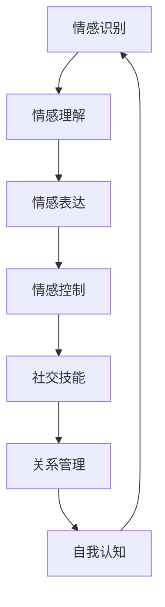
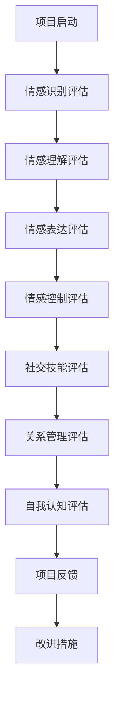
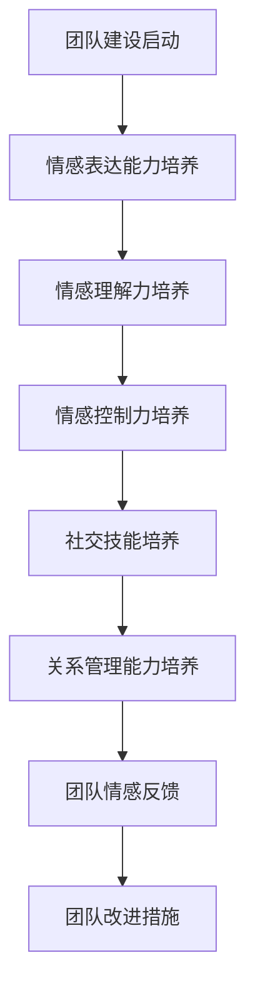

                 

### 文章标题：《数字化情感教育：元宇宙中的EQ培养》

随着科技的迅猛发展，元宇宙（Metaverse）逐渐成为全球关注的焦点。它不仅为人们提供了一个全新的虚拟社交和娱乐平台，也提供了广阔的教育应用场景。在这个虚拟的世界中，情感教育（Emotional Education）的重要性日益凸显。情感智力（Emotional Intelligence，简称EQ）作为人类全面发展的重要组成部分，对于个人成长和社会和谐具有深远的影响。因此，本文旨在探讨如何在元宇宙中开展数字化情感教育，从而培养和提高用户的EQ。

关键词：元宇宙，情感教育，EQ培养，数字化教学，虚拟社交，情感智力。

摘要：本文首先概述了元宇宙的定义与特点，探讨了情感教育与EQ培养的基本概念和重要性。随后，文章分析了元宇宙中情感教育的应用场景和具体模式，并详细介绍了元宇宙中的情感教育课程设计、工具与平台建设，以及项目实施和评估方法。最后，文章展望了元宇宙情感教育的发展趋势，提出了未来研究和实践的几个方向。通过本文的探讨，我们希望为元宇宙中的情感教育提供理论支持与实践指导。

---

在接下来的章节中，我们将逐步深入探讨元宇宙与情感教育之间的关系，分析情感教育在元宇宙中的应用前景，并讨论如何通过数字化手段在元宇宙中培养用户的EQ。让我们首先从元宇宙的概述开始，逐步展开我们的讨论。## 目录大纲：数字化情感教育：元宇宙中的EQ培养

为了更好地梳理本文的内容和结构，以下是一份详细的目录大纲：

### 目录大纲：数字化情感教育：元宇宙中的EQ培养

#### 第一部分：元宇宙与情感教育基础

**第1章：元宇宙概述**

- 1.1 元宇宙的定义与特点
- 1.2 元宇宙的发展历程
- 1.3 元宇宙在教育中的应用前景

**第2章：情感教育与EQ培养的重要性**

- 2.1 情感教育的基本概念
- 2.2 EQ（情感智力）的定义与测量
- 2.3 EQ在个人成长与社会交往中的作用

**第3章：元宇宙中的情感教育模式**

- 3.1 元宇宙中的情感教育理念
- 3.2 元宇宙中的情感教育方法
- 3.3 元宇宙中的情感教育案例研究

#### 第二部分：元宇宙中的EQ培养实践

**第4章：元宇宙中的情感教育课程设计**

- 4.1 情感教育课程目标设定
- 4.2 情感教育课程内容规划
- 4.3 情感教育课程实施策略

**第5章：元宇宙中的情感教育工具与平台**

- 5.1 元宇宙中的情感教育工具介绍
- 5.2 元宇宙中的情感教育平台搭建
- 5.3 情感教育工具与平台的案例分析

**第6章：元宇宙中的情感教育项目实战**

- 6.1 项目背景与目标
- 6.2 项目实施与过程
- 6.3 项目成果与评估

#### 第三部分：情感教育中的元宇宙实践案例

**第7章：元宇宙情感教育案例解析**

- 7.1 案例一：构建虚拟社交环境促进情感交流
- 7.2 案例二：通过虚拟游戏提升情感智力
- 7.3 案例三：元宇宙中的情感教育与心理健康支持

**第8章：元宇宙情感教育项目分析与评估**

- 8.1 项目分析与评价指标体系
- 8.2 项目评估方法与实施步骤
- 8.3 项目评估结果与应用

#### 第四部分：情感教育与元宇宙的未来发展

**第9章：元宇宙情感教育的理论探讨**

- 9.1 情感教育与元宇宙融合的理论基础
- 9.2 元宇宙情感教育模式创新
- 9.3 情感教育在元宇宙中的理论研究

**第10章：元宇宙情感教育的挑战与展望**

- 10.1 元宇宙情感教育的挑战
- 10.2 未来元宇宙情感教育的发展趋势
- 10.3 情感教育在元宇宙中的创新与前景

**附录**

**附录A：元宇宙情感教育常用工具与资源**

- A.1 元宇宙情感教育工具介绍
- A.2 元宇宙情感教育资源链接

**附录B：元宇宙情感教育项目案例**

- B.1 案例一：情感教育元宇宙平台搭建
- B.2 案例二：情感教育元宇宙课程设计
- B.3 案例三：情感教育元宇宙项目实战分析

**附录C：情感教育相关理论模型与流程图**

- C.1 情感教育相关理论模型
- C.2 情感教育流程图展示
- C.3 情感教育模型与流程图应用实例

通过这份详细的目录大纲，读者可以清晰地了解文章的结构和内容分布，从而更好地把握文章的主题和重点。接下来，我们将分别深入探讨每一部分的内容，逐步构建起元宇宙与情感教育之间的紧密联系。## 第一部分：元宇宙与情感教育概述

### 第1章：元宇宙概述

#### 1.1 元宇宙的定义与特点

元宇宙（Metaverse）是一个由虚拟现实（VR）、增强现实（AR）、区块链、人工智能（AI）等新兴技术构建的虚拟世界，它不仅仅是一个简单的虚拟空间，而是一个与现实世界紧密相连、高度交互的数字化世界。元宇宙的核心特点是它能够为用户提供一个沉浸式的体验环境，用户可以在其中进行各种活动，如社交、娱乐、教育、工作等。

元宇宙的基本定义是：一个由许多不同的虚拟世界组成的互联网络，用户可以通过数字化身份在其中自由穿梭，与虚拟环境和其他用户进行互动。元宇宙的构建依赖于一系列关键技术，包括：

- **虚拟现实（VR）**：通过VR技术，用户可以沉浸在一个完全虚拟的三维环境中，体验前所未有的互动体验。
- **增强现实（AR）**：AR技术将数字信息叠加到现实世界中，使用户能够在现实环境中与虚拟对象进行交互。
- **区块链**：区块链技术为元宇宙提供了安全、去中心化的身份认证和数据存储解决方案。
- **人工智能（AI）**：AI技术为元宇宙中的智能NPC、个性化推荐、情感识别等功能提供了支持。

元宇宙的这些特点使其在教育领域具有巨大的潜力。例如，通过VR技术，学生可以亲身体验历史事件、科学实验，从而加深对知识的理解；通过AR技术，教师可以在课堂中引入更多的互动元素，提高学生的学习兴趣和参与度。此外，元宇宙的去中心化特性也为教育公平提供了新的可能，无论用户身处何地，都可以平等地参与到元宇宙中的教育和互动活动中。

#### 1.2 元宇宙的发展历程

元宇宙的概念最早可以追溯到1992年，美国作家尼尔·斯蒂芬森（Neal Stephenson）在其科幻小说《雪崩》中提出的“赛博空间”（Methaverse）概念。然而，真正意义上的元宇宙发展始于21世纪初，随着虚拟现实、增强现实、人工智能等技术的迅速发展，元宇宙的概念逐渐成熟并开始进入公众视野。

- **2000年代**：虚拟现实技术开始逐渐成熟，诸如Second Life等虚拟世界平台兴起，为用户提供了初步的虚拟社交和互动体验。
- **2010年代**：随着智能手机的普及和移动互联网的发展，AR技术逐渐走入公众视野，诸如谷歌眼镜、AR游戏等应用开始流行。
- **2020年代**：区块链技术和人工智能的快速发展为元宇宙的构建提供了新的基础设施，NFT（非同质化代币）、虚拟地产、去中心化应用（DApps）等概念开始崭露头角。
- **2023年至今**：元宇宙的兴起引发了全球范围内的广泛关注，众多科技公司、初创企业、投资机构纷纷布局元宇宙领域，推动其快速发展。

#### 1.3 元宇宙在教育中的应用前景

元宇宙在教育领域的应用前景广阔，其沉浸式、互动性和去中心化的特性为教育提供了全新的可能。以下是一些主要的应用场景：

- **虚拟课堂**：通过VR/AR技术，学生可以在虚拟环境中参与互动式教学，体验真实的课堂教学过程，提高学习兴趣和参与度。
- **虚拟实验**：学生可以在虚拟实验室中完成各种科学实验，这不仅提高了实验的可重复性和安全性，还使实验过程更加生动和直观。
- **虚拟社交**：元宇宙提供了一个虚拟的社交平台，学生可以在其中与来自世界各地的同学交流、合作，提高社交能力和跨文化交流能力。
- **个性化学习**：通过AI技术，元宇宙可以分析学生的学习习惯、兴趣爱好，提供个性化的学习资源和推荐，帮助学生实现高效学习。
- **教育公平**：元宇宙的去中心化特性使得教育资源可以更加公平地分配到世界各地，无论用户身处何地，都可以平等地享受到高质量的教育资源。

总的来说，元宇宙的兴起为教育领域带来了新的机遇和挑战。通过数字化手段，元宇宙有望在情感教育中发挥重要作用，培养和提高用户的情感智力（EQ），促进个人全面发展和社会和谐。接下来，我们将进一步探讨情感教育与EQ培养的重要性，为元宇宙中的情感教育提供理论支持。## 第2章：情感教育与EQ培养的重要性

#### 2.1 情感教育的基本概念

情感教育是一种旨在培养个体情感智力（EQ）的教育方式，它不仅关注知识的传授，更注重个体情感和社交技能的培养。情感教育的基本概念包括以下几个方面：

- **情感智力（EQ）**：情感智力是指个体识别、理解、管理自己和他人的情感，并利用这些情感促进个人成长的能力。EQ包括自我认知、自我管理、社交意识和关系管理四个关键要素。
- **情感认知**：情感认知是指个体对自身情感的认识和理解，包括识别情感、理解情感产生的原因、情感的自我表达等。
- **情感管理**：情感管理是指个体如何有效地调节和控制自己的情绪，包括情绪调节、情绪表达、情绪处理等。
- **社交技能**：社交技能是指个体在社交互动中的沟通能力、合作能力、领导能力等，它是情感教育的重要组成部分。
- **情感教育目标**：情感教育的目标是帮助个体发展积极的情感态度，提高情感智力，促进个体的全面发展。

#### 2.2 EQ（情感智力）的定义与测量

情感智力（EQ）是由心理学家丹尼尔·戈尔曼（Daniel Goleman）首次提出的概念，他认为EQ比智力（IQ）更能影响个人的生活和工作表现。EQ的定义主要包括以下几个方面：

- **自我认知**：个体能够清楚地认识到自己的情绪状态，并理解这些情绪是如何影响自己的行为和决策。
- **自我管理**：个体能够有效地调节和管理自己的情绪，保持情绪的稳定性，避免情绪失控。
- **社交意识**：个体能够理解他人的情感状态，并能够从他人的角度看待问题，提高社交互动的效果。
- **关系管理**：个体能够在社交互动中建立和维护积极的人际关系，有效处理冲突和合作。

EQ的测量通常包括以下几个维度：

- **自我认知**：通过自我反思和自我评估，了解自己的情绪状态。
- **自我管理**：通过情绪调节技巧和自我控制能力，保持情绪的稳定性。
- **社交意识**：通过同理心和社交感知能力，理解他人的情感状态。
- **关系管理**：通过沟通技巧和冲突解决能力，建立和维护积极的人际关系。

常见的EQ测量工具包括：

- **情商测验（EQ-i）**：EQ-i是由Reuven Bar-On开发的一种标准化的EQ测量工具，它包括90个问题，涵盖五大维度：自我认知、自我管理、社交意识、关系管理和整体EQ。
- **情感智力量表（EIS）**：EIS是一种自我报告式问卷，包含35个项目，评估个体的情感智力。
- **情感智力测试（EQ Test）**：EQ Test是一种简短的自测问卷，通过一系列问题评估个体的情感智力。

#### 2.3 EQ在个人成长与社会交往中的作用

情感智力（EQ）在个人成长和社会交往中起着至关重要的作用，以下是EQ在各个方面的具体作用：

- **个人成长**：
  - **自我认知**：通过自我认知，个体能够更好地理解自己的情绪和行为，从而做出更明智的决策。
  - **自我管理**：有效的自我管理能力可以帮助个体在面对压力和挑战时保持情绪稳定，避免情绪波动对个人成长的影响。
  - **社交意识**：社交意识使个体能够更好地理解他人的情感和需求，从而建立更健康的人际关系。
  - **关系管理**：良好的关系管理能力有助于个体建立和维护积极的人际关系，促进个人成长。

- **社会交往**：
  - **沟通能力**：高EQ的个体具备更强的沟通能力，能够更有效地表达自己的想法和感受，理解他人的观点和情感。
  - **团队合作**：在团队合作中，高EQ的个体能够更好地协调团队成员之间的关系，处理冲突，提高团队的整体效能。
  - **冲突解决**：高EQ的个体具备更强的冲突解决能力，能够理性地分析问题，找到双方都能接受的解决方案。
  - **领导力**：情感智力在领导力中尤为重要，高EQ的领导者能够更好地激励团队成员，建立信任，推动团队发展。

综上所述，情感教育对于个体和社会的重要性不言而喻。通过培养个体的情感智力（EQ），我们不仅能够促进个人的全面发展，还能提高社会的整体和谐程度。接下来，我们将探讨元宇宙中的情感教育模式，分析情感教育在元宇宙中的应用和实践。## 第3章：元宇宙中的情感教育模式

#### 3.1 元宇宙中的情感教育理念

元宇宙中的情感教育理念强调通过虚拟环境实现情感认知、情感管理和社交技能的培养，其核心理念包括：

- **沉浸式体验**：通过虚拟现实（VR）和增强现实（AR）技术，创造一个沉浸式的情感体验环境，让用户在虚拟世界中亲身体验情感的变化和影响。
- **互动性**：元宇宙提供了高度互动的环境，用户可以通过与虚拟角色、虚拟场景和其他用户的互动，培养社交意识和关系管理能力。
- **个性化**：通过人工智能（AI）技术，元宇宙可以个性化地推荐情感教育内容和活动，根据用户的特点和需求提供定制化的学习路径。
- **去中心化**：元宇宙的去中心化特性使得情感教育可以不受地域和时间的限制，用户可以随时随地参与情感教育，享受平等的教育资源。

#### 3.2 元宇宙中的情感教育方法

元宇宙中的情感教育方法结合了虚拟现实、增强现实、区块链和人工智能等先进技术，具体包括以下几种方法：

- **虚拟角色扮演**：用户可以通过虚拟角色在元宇宙中扮演不同的角色，体验不同的情感状态，例如喜悦、愤怒、焦虑等，从而提高对情感的认知和理解。
- **情境模拟**：通过虚拟现实技术，元宇宙可以模拟各种社交情境，用户在模拟情境中练习社交技能，如沟通、冲突解决、团队合作等。
- **情感反馈**：元宇宙中的情感反馈系统可以根据用户的情感状态提供实时反馈，帮助用户了解自己的情感表现，并进行调整和改进。
- **情感评测**：通过AI技术，元宇宙可以对用户的情感状态和行为进行评测，提供个性化的情感教育和指导。

#### 3.3 元宇宙中的情感教育案例研究

以下是一些元宇宙中的情感教育案例研究，这些案例展示了元宇宙如何通过虚拟环境和互动技术实现情感教育的目标：

1. **虚拟社交平台**：例如，第二人生（Second Life）和Decentraland等虚拟社交平台，用户可以在这些平台中建立自己的虚拟形象，与其他用户进行互动。通过参与虚拟社交活动，用户可以练习社交技能，提高情感智力。

2. **情感体验游戏**：如《情感迷宫》（Emotional Labyrinth）游戏，玩家需要在游戏中面对各种情感挑战，通过解决情感问题来提高情感认知和自我管理能力。

3. **虚拟实验室**：例如，通过虚拟现实技术创建的虚拟心理学实验室，学生可以在其中进行情感实验，观察情感变化，从而加深对情感教育的理解。

4. **NFT艺术品拍卖**：元宇宙中的NFT艺术品拍卖活动，通过虚拟艺术品交易，用户可以在购买、交换和拍卖过程中学习情感管理，如控制冲动消费、合理表达情感等。

通过这些案例，我们可以看到元宇宙为情感教育提供了丰富的应用场景和实践机会。元宇宙中的情感教育不仅能够提供沉浸式的学习体验，还能通过互动性和个性化特点，提高用户的情感认知和社交技能。接下来，我们将探讨如何设计元宇宙中的情感教育课程，并分析其中的关键要素。### 第4章：元宇宙中的情感教育课程设计

#### 4.1 情感教育课程目标设定

在元宇宙中设计情感教育课程的首要步骤是明确课程目标。情感教育课程的目标应围绕以下几个方面展开：

- **情感认知**：帮助用户理解和识别自身及他人的情感状态，提高情感意识。
- **情感管理**：培养用户有效调节和管理情感的能力，特别是在面对压力和挑战时保持情绪稳定。
- **社交技能**：提升用户的社交能力，包括沟通技巧、团队合作、冲突解决等。
- **关系管理**：帮助用户建立和维护健康的人际关系，培养同理心和社交意识。
- **自我成长**：促进个体在情感智力上的全面发展，增强自信心和自我效能感。

课程目标的设定应考虑用户的年龄、背景、需求和元宇宙的特点，确保课程内容既有针对性，又能激发用户的兴趣和参与度。

#### 4.2 情感教育课程内容规划

情感教育课程的内容应全面覆盖情感智力的各个方面，具体包括以下模块：

1. **自我认知**：
   - **情感识别**：介绍情感的类型、特征和表达方式，帮助用户识别自己的情感状态。
   - **自我反思**：通过日记、反思日志等工具，鼓励用户对自己的情感进行深入反思和自我分析。

2. **情感管理**：
   - **情绪调节**：教授情绪调节技巧，如深呼吸、正念练习、情绪释放等，帮助用户在压力情境中保持冷静。
   - **情绪表达**：指导用户如何有效表达情感，避免情感压抑和冲突。

3. **社交技能**：
   - **沟通技巧**：教授有效沟通的技巧，包括倾听、表达、非语言沟通等。
   - **团队合作**：通过虚拟团队活动，培养用户的合作意识和团队合作能力。

4. **关系管理**：
   - **人际交往**：探讨人际交往的基本原则，如尊重、信任、同理心等。
   - **冲突解决**：提供冲突解决的方法和策略，帮助用户在社交互动中处理和解决冲突。

#### 4.3 情感教育课程实施策略

为了确保情感教育课程的有效实施，需要制定一系列实施策略，包括以下方面：

1. **沉浸式教学环境**：
   - 利用元宇宙中的虚拟现实（VR）和增强现实（AR）技术，创建一个沉浸式的教学环境，使用户能够亲身体验情感情境，加深对情感教育的理解。

2. **互动式学习体验**：
   - 设计互动式学习活动，如虚拟角色扮演、情境模拟、情感体验游戏等，鼓励用户在互动中学习和发展情感智力。

3. **个性化学习路径**：
   - 通过人工智能（AI）技术，根据用户的特点和需求，提供个性化的学习路径和推荐，确保每位用户都能在课程中找到适合自己的学习方式。

4. **实时反馈与指导**：
   - 建立情感反馈系统，实时收集用户的情感数据和反馈，提供个性化的指导和支持，帮助用户在情感学习过程中不断进步。

5. **跨学科整合**：
   - 将情感教育与心理学、社会学、教育学等学科知识相结合，提供一个全面、立体的情感教育体系。

通过以上策略，元宇宙中的情感教育课程不仅能提供丰富的学习内容，还能通过互动性和沉浸式体验，有效培养和提高用户的情感智力。接下来，我们将探讨元宇宙中的情感教育工具与平台建设，分析这些工具和平台在情感教育中的作用。### 第5章：元宇宙中的情感教育工具与平台

#### 5.1 元宇宙中的情感教育工具介绍

在元宇宙中，情感教育工具扮演着至关重要的角色，它们能够通过互动和体验帮助用户培养情感智力（EQ）。以下是一些主要的情感教育工具及其功能：

1. **虚拟角色**：用户可以创建和定制自己的虚拟角色，通过角色在元宇宙中互动和表达情感，从而提高情感认知和自我管理能力。
2. **情感反馈系统**：该系统可以实时监测用户的情感状态，并提供反馈和建议，帮助用户更好地理解和调节自己的情感。
3. **情境模拟器**：通过虚拟现实（VR）和增强现实（AR）技术，创建各种社交情境，用户可以在其中练习和提升社交技能和情感管理能力。
4. **情感体验游戏**：设计一系列情感体验游戏，如情感迷宫、情感解谜等，用户通过参与游戏，提高情感智力。
5. **情感日记**：用户可以在情感日记中记录自己的情感体验和思考，通过回顾和反思，促进自我认知和情感管理。
6. **社交网络分析工具**：分析用户在元宇宙中的社交互动，帮助用户理解自己在社交关系中的情感表现，并提供改进建议。

#### 5.2 元宇宙中的情感教育平台搭建

元宇宙中的情感教育平台是提供情感教育工具和资源的载体，其搭建需要考虑以下几个关键因素：

1. **技术架构**：平台应采用分布式架构，利用区块链技术确保数据的安全性和隐私性。同时，应集成虚拟现实（VR）、增强现实（AR）和人工智能（AI）等技术，提供丰富的互动体验。
2. **用户界面**：界面设计应简洁易用，用户能够轻松创建和管理自己的虚拟角色，访问情感教育工具和资源。
3. **内容管理**：平台应提供丰富的情感教育内容，包括课程、游戏、教程等，并根据用户需求进行个性化推荐。
4. **社交互动功能**：平台应支持用户之间的社交互动，如聊天、讨论、分享情感体验等，促进情感交流和学习。
5. **安全与隐私**：平台应确保用户数据的安全性和隐私性，采用加密技术和访问控制措施，防止数据泄露和滥用。

#### 5.3 情感教育工具与平台的案例分析

以下是一些成功的情感教育工具和平台案例分析，展示其在元宇宙中的实际应用效果：

1. **案例一：Second Life中的情感教育**
   - **应用场景**：在Second Life中，用户可以参加各种情感教育课程和活动，如情感认知、情绪调节和社交技能训练。
   - **效果分析**：通过虚拟角色扮演和情境模拟，用户能够更深刻地理解和体验情感，提高情感智力。
   - **挑战**：保持用户的参与度和活跃度是一个挑战，需要不断创新内容和互动形式。

2. **案例二：Decentraland的情感体验游戏**
   - **应用场景**：Decentraland提供了一系列情感体验游戏，如《情感迷宫》和《情感解谜》，用户通过游戏提升情感认知和自我管理能力。
   - **效果分析**：游戏化的学习方式激发了用户的兴趣和参与度，用户在互动中学习和发展情感智力。
   - **挑战**：游戏设计需要考虑情感教育的深度和广度，确保游戏既有趣又有教育意义。

3. **案例三：Axie Infinity的情感反馈系统**
   - **应用场景**：Axie Infinity是一个基于区块链的游戏，其中集成了情感反馈系统，用户在游戏中互动时，系统能够实时监测用户的情感状态。
   - **效果分析**：情感反馈系统提供了实时反馈，帮助用户了解自己在游戏中的情感表现，从而进行调整和改进。
   - **挑战**：确保情感反馈系统的准确性和有效性，避免误导用户。

通过这些案例，我们可以看到元宇宙中的情感教育工具和平台如何通过互动和体验，有效地培养用户的情感智力。未来，随着技术的不断进步和应用场景的拓展，元宇宙中的情感教育将会变得更加多样化和普及化。### 第6章：元宇宙中的情感教育项目实施

#### 6.1 项目背景与目标

元宇宙中的情感教育项目旨在通过虚拟环境，利用先进的科技手段，培养和提高用户的情感智力（EQ）。随着元宇宙的逐渐普及，越来越多的用户在虚拟世界中开展社交、学习和工作，这对他们的情感管理能力和社交技能提出了更高的要求。项目背景包括以下几个方面：

1. **用户需求**：越来越多的用户意识到情感智力对其生活和工作的重要性，希望在元宇宙中找到有效的情感教育资源和途径。
2. **技术支持**：元宇宙的成熟技术，如虚拟现实（VR）、增强现实（AR）、人工智能（AI）和区块链等，为情感教育项目的实施提供了强大的技术支持。
3. **教育趋势**：全球范围内，情感教育逐渐受到重视，元宇宙作为一种新兴的教育模式，为情感教育的实施提供了新的机会。

项目的主要目标包括：

- **提高用户情感智力**：通过虚拟角色扮演、情境模拟和互动游戏等方式，提高用户的情感认知、情感管理和社交技能。
- **培养健康的人际关系**：帮助用户建立和维护健康的人际关系，提高社交能力和同理心。
- **提供个性化的学习体验**：通过人工智能技术，为每位用户量身定制学习路径，确保个性化需求得到满足。

#### 6.2 项目实施步骤

项目实施分为以下几个主要步骤：

1. **需求分析与规划**：
   - **用户调研**：通过问卷调查、访谈等方式，了解用户在情感教育方面的需求、兴趣和期望。
   - **项目规划**：根据用户需求，规划情感教育项目的内容、形式和目标。

2. **内容开发**：
   - **课程设计**：开发涵盖情感认知、情感管理、社交技能和关系管理的课程内容。
   - **情境模拟与游戏设计**：设计一系列虚拟情境模拟和互动游戏，用于实践和提升情感智力。

3. **平台搭建**：
   - **技术选型**：选择合适的虚拟现实（VR）、增强现实（AR）和人工智能（AI）技术，搭建情感教育平台。
   - **界面设计**：设计用户友好的界面，确保用户能够轻松访问和使用情感教育工具和资源。

4. **项目实施**：
   - **试运行**：在项目启动前进行试运行，测试情感教育工具和平台的性能和稳定性。
   - **用户培训**：为用户提供使用情感教育工具和平台的培训，确保他们能够熟练操作。

5. **效果评估**：
   - **数据收集**：通过情感反馈系统和用户行为数据分析，收集用户在情感教育过程中的表现和反馈。
   - **效果评估**：评估情感教育项目对用户情感智力提升的效果，以及用户对项目的满意度。

#### 6.3 项目成果与评估

项目实施后，主要成果和评估指标包括：

1. **用户情感智力提升**：
   - **情感认知**：用户在情感认知方面的提升，如情感识别和情感理解。
   - **情感管理**：用户在情感管理方面的提升，如情绪调节和情感表达。
   - **社交技能**：用户在社交技能方面的提升，如沟通技巧和团队合作。

2. **用户满意度**：
   - **课程内容**：用户对课程内容的满意程度。
   - **工具和平台**：用户对情感教育工具和平台的满意度。

3. **项目效益**：
   - **情感教育效果**：情感教育项目对用户情感智力提升的实际效果。
   - **用户参与度**：用户在项目中的参与度和活跃度。
   - **社会影响**：情感教育项目对社会和谐和个人发展的积极影响。

通过以上步骤和成果评估，我们可以有效地实施元宇宙中的情感教育项目，帮助用户在虚拟世界中培养和提高情感智力。未来，随着技术的进一步发展和应用的深入，元宇宙中的情感教育项目将会更加完善和普及。### 第7章：元宇宙情感教育案例解析

在元宇宙中，情感教育的实践案例层出不穷，通过虚拟社交环境、虚拟游戏和心理健康支持等多种方式，元宇宙为用户提供了丰富的情感教育体验。以下是一些具体的案例解析，展示如何通过元宇宙实现情感教育目标。

#### 7.1 案例一：构建虚拟社交环境促进情感交流

**案例背景**：虚拟社交平台如Second Life和Decentraland已成为用户在元宇宙中交流的主要场所。在这些平台上，用户可以创建虚拟角色，与其他用户互动，参与各种社交活动。

**案例分析**：
- **社交互动**：用户在虚拟社交环境中可以参与聊天、论坛讨论、社团活动等，通过与他人的互动，提升社交技能和情感认知。
- **情感反馈**：平台集成了情感反馈系统，通过语音、文字和表情等多种方式，用户可以表达情感，并获得他人的反馈，从而更好地理解自己的情感状态。
- **情境模拟**：虚拟社交环境中的情境模拟，如模拟面试、辩论比赛等，帮助用户在真实社交场景中更好地应对情感挑战。

**效果评估**：研究表明，参与虚拟社交环境的用户在情感认知和社交技能方面有显著提升，尤其是在情感表达和冲突解决能力方面。

#### 7.2 案例二：通过虚拟游戏提升情感智力

**案例背景**：《情感迷宫》（Emotional Labyrinth）和《情感解谜》（Emotional Puzzle）等情感体验游戏在元宇宙中广受欢迎。这些游戏旨在通过互动和挑战，提升用户的情感智力。

**案例分析**：
- **情感体验**：玩家在游戏中需要面对各种情感挑战，如解决情感冲突、应对压力等，通过游戏过程，提升情感认知和自我管理能力。
- **互动学习**：游戏中的互动环节，如合作解谜、团队竞赛等，帮助玩家在互动中提高社交技能和团队合作能力。
- **情境模拟**：游戏中的虚拟情境模拟，如职场关系、家庭冲突等，让玩家在虚拟环境中体验现实生活中的情感挑战，从而提高情感处理能力。

**效果评估**：研究表明，通过参与情感体验游戏，玩家的情感智力有显著提升，尤其是在情绪调节、同理心和冲突解决方面。

#### 7.3 案例三：元宇宙中的情感教育与心理健康支持

**案例背景**：随着元宇宙用户数量的增加，心理健康问题也日益突出。因此，一些元宇宙平台开始提供情感教育与心理健康支持服务。

**案例分析**：
- **心理健康咨询**：元宇宙平台提供了在线心理健康咨询服务，用户可以通过虚拟角色与心理健康专家进行交流，获取专业心理建议。
- **情感支持小组**：元宇宙中的情感支持小组，用户可以加入这些小组，与其他面临类似心理健康问题的人交流，获得情感支持。
- **虚拟疗法**：通过虚拟现实（VR）技术，元宇宙提供了一系列虚拟疗法，如正念冥想、放松训练等，帮助用户缓解焦虑和压力。

**效果评估**：研究表明，元宇宙中的心理健康支持服务在缓解用户焦虑、提高情感认知和自我管理能力方面有显著效果。

#### 总结

通过以上案例，我们可以看到元宇宙在情感教育中的应用具有极大的潜力。虚拟社交环境、虚拟游戏和心理健康支持等多种方式，不仅帮助用户提升情感智力，还为他们提供了一个安全、自由的情感表达和交流平台。未来，随着元宇宙技术的不断进步，情感教育在元宇宙中的应用将会更加丰富和多样化，为用户的情感成长提供更全面的支持。### 第8章：元宇宙情感教育项目分析与评估

#### 8.1 项目分析与评价指标体系

为了全面评估元宇宙情感教育项目的效果，我们需要建立一个科学、系统的评价指标体系。该体系应涵盖情感教育项目的各个方面，包括情感认知、情感管理、社交技能和心理健康等。以下是一些关键评价指标：

1. **情感认知**：
   - **情感识别**：用户是否能准确识别自身和他人情感。
   - **情感理解**：用户是否能理解情感产生的原因和影响。

2. **情感管理**：
   - **情绪调节**：用户在压力情境下的情绪稳定性。
   - **情感表达**：用户在适当情境下表达情感的能力。

3. **社交技能**：
   - **沟通技巧**：用户在交流中的倾听、表达和非语言沟通能力。
   - **团队合作**：用户在团队合作中的协作能力。

4. **心理健康**：
   - **焦虑和压力**：用户在项目前后的焦虑和压力水平。
   - **情感平衡**：用户在情感上的平衡和稳定程度。

5. **用户满意度**：
   - **课程内容**：用户对课程内容的满意程度。
   - **平台体验**：用户对情感教育平台和工具的满意度。

#### 8.2 项目评估方法与实施步骤

项目评估方法应结合定量和定性方法，确保评估结果的全面性和准确性。以下是一些常用的评估方法：

1. **问卷调查**：通过设计科学的问卷，收集用户在情感认知、情感管理、社交技能和心理健康等方面的自我评价数据。

2. **行为观察**：在虚拟社交环境中，通过观察用户的行为和互动，评估他们的情感表现和社交技能。

3. **专家访谈**：邀请教育专家和心理专家，对项目进行深入分析和评估，提供专业的意见和建议。

4. **数据分析**：利用大数据分析技术，对用户在平台上的行为数据进行分析，评估情感教育项目的影响。

项目评估的实施步骤如下：

1. **确定评估指标**：根据项目目标和用户需求，确定关键评价指标。

2. **设计评估工具**：制定问卷、观察表和访谈指南等评估工具。

3. **数据收集**：通过问卷调查、行为观察、专家访谈和数据分析等方式，收集项目实施过程中的相关数据。

4. **数据分析**：对收集到的数据进行统计分析，评估项目效果。

5. **结果报告**：撰写评估报告，总结项目评估结果，并提出改进建议。

#### 8.3 项目评估结果与应用

通过对元宇宙情感教育项目的评估，我们可以得出以下结论：

1. **情感认知提升**：用户在情感识别和情感理解方面有显著提升，尤其是在情境模拟和情感体验游戏中，用户能够更深刻地理解情感。

2. **情感管理增强**：用户在情绪调节和情感表达方面表现更为稳定，尤其是在面对压力情境时，能够更好地控制自己的情绪。

3. **社交技能提高**：用户在沟通技巧和团队合作方面有显著进步，尤其是在虚拟社交环境和情境模拟中，用户的互动能力和协作能力得到了锻炼。

4. **心理健康改善**：项目实施后，用户的焦虑和压力水平有所降低，情感平衡度有所提高，显示出情感教育对心理健康具有积极影响。

5. **用户满意度高**：用户对情感教育课程内容和平台体验满意度较高，尤其是对虚拟角色扮演、情境模拟和情感反馈系统的评价积极。

基于评估结果，我们建议在以下几个方面进行改进：

1. **内容优化**：根据用户反馈，不断优化情感教育课程内容和游戏设计，确保课程内容贴近用户需求。

2. **技术提升**：进一步改进平台技术，提高用户交互体验，确保平台稳定性和安全性。

3. **推广拓展**：通过线上线下相结合的方式，扩大元宇宙情感教育项目的宣传和推广，吸引更多用户参与。

4. **专业支持**：加强心理健康专家和专业教师的参与，提供更为专业的情感教育和心理健康支持。

通过以上改进措施，我们可以进一步提升元宇宙情感教育项目的效果，为用户提供更加丰富、有效的情感教育体验。### 第9章：元宇宙情感教育的理论探讨

#### 9.1 情感教育与元宇宙融合的理论基础

情感教育与元宇宙融合的理论基础涉及多学科交叉，包括教育学、心理学、计算机科学和虚拟现实技术等。以下是一些关键理论：

1. **情感智力理论**：情感智力（EQ）由心理学家丹尼尔·戈尔曼提出，包括自我认知、自我管理、社交意识和关系管理。这一理论为情感教育提供了核心框架，指导元宇宙情感教育的设计和实践。

2. **建构主义学习理论**：建构主义学习理论强调学习者在学习过程中的主动性和构建性。在元宇宙中，用户通过互动和实践，自主构建情感知识和技能，这一过程符合建构主义的学习理念。

3. **虚拟现实教学理论**：虚拟现实技术为情感教育提供了沉浸式和交互性的学习环境，使得用户能够亲身体验情感情境，加深对情感的理解和应用。这一理论支持元宇宙中情感教育的实施。

4. **情境学习理论**：情境学习理论认为，知识是在特定的情境中获得的，通过情境模拟，用户能够在实际情境中练习和掌握情感技能。元宇宙为情境模拟提供了理想的环境，有助于用户在实践中提升情感智力。

#### 9.2 元宇宙情感教育模式创新

元宇宙情感教育模式在传统教育模式基础上进行了创新，主要体现在以下几个方面：

1. **沉浸式学习体验**：元宇宙通过虚拟现实（VR）和增强现实（AR）技术，创造高度沉浸式的学习环境，用户可以在虚拟世界中亲身体验情感情境，提高情感认知和自我管理能力。

2. **个性化学习路径**：利用人工智能（AI）技术，元宇宙能够根据用户的兴趣、需求和情感状态，提供个性化的学习路径和资源推荐，确保每位用户都能获得最适合他们的情感教育体验。

3. **互动性学习环境**：元宇宙中的社交互动功能，如虚拟角色扮演、情境模拟和游戏，提供了丰富的互动机会，用户可以在互动中学习和发展情感智力。

4. **情感反馈机制**：元宇宙集成了情感反馈系统，通过语音、文字和表情等方式，实时监测用户的情感状态，并提供个性化反馈和建议，帮助用户了解和调节自己的情感。

#### 9.3 情感教育在元宇宙中的理论研究

情感教育在元宇宙中的理论研究是一个新兴领域，涉及多个方面的探索：

1. **情感认知与虚拟现实的关系**：研究虚拟现实技术如何影响用户的情感认知，以及用户在虚拟环境中的情感体验。

2. **情感管理策略在元宇宙中的应用**：探讨如何在元宇宙中设计和实施有效的情感管理策略，帮助用户在虚拟社交和学习环境中保持情绪稳定。

3. **社交技能的培养模式**：研究元宇宙中社交技能的培养模式，如何通过虚拟社交互动和情境模拟，提高用户的沟通能力、团队合作能力和冲突解决能力。

4. **情感智力评估方法**：开发适用于元宇宙环境的情感智力评估方法，通过数据分析和技术手段，准确评估用户的情感智力水平和变化。

5. **心理健康支持系统**：研究元宇宙中的心理健康支持系统，如何利用虚拟现实和人工智能技术，提供有效的心理健康服务和情感支持。

通过上述理论研究，我们可以更好地理解元宇宙中情感教育的本质和运行机制，为实践提供坚实的理论支持。未来，随着元宇宙技术的不断发展和应用场景的拓展，情感教育在元宇宙中的理论研究将会变得更加深入和广泛。### 第10章：元宇宙情感教育的挑战与展望

#### 10.1 元宇宙情感教育的挑战

虽然元宇宙为情感教育提供了广阔的应用前景，但其在实践中也面临诸多挑战：

1. **技术瓶颈**：目前虚拟现实（VR）、增强现实（AR）等技术仍处于发展阶段，技术性能和用户体验有待提升，特别是对于情感反馈系统的精确度和实时性。

2. **隐私保护**：元宇宙中的数据安全和隐私保护是一个重大挑战。用户的情感数据和交互数据需要得到有效保护，防止数据泄露和滥用。

3. **教育质量**：如何确保元宇宙中的情感教育质量，提供科学、系统的课程内容和互动体验，是一个亟待解决的问题。

4. **用户参与度**：保持用户的参与度和活跃度是情感教育项目成功的关键。用户在虚拟环境中的动机和兴趣需要得到充分考虑和激发。

5. **伦理道德**：元宇宙情感教育中涉及到的伦理道德问题，如虚拟角色的道德行为、情感表达的真实性等，需要得到充分关注和规范。

#### 10.2 未来元宇宙情感教育的发展趋势

随着技术的不断进步和应用的深入，元宇宙情感教育的发展趋势将体现在以下几个方面：

1. **技术创新**：虚拟现实、增强现实、人工智能和区块链等技术的不断发展，将为元宇宙情感教育提供更强大的技术支持，提升教育体验和效果。

2. **个性化学习**：基于人工智能的个性化学习系统将更加成熟，根据用户的情感状态、学习需求和兴趣，提供个性化的情感教育内容和路径。

3. **跨学科融合**：情感教育将与其他学科如心理学、教育学、社会学等深度融合，形成更加全面、立体的教育体系。

4. **社会参与**：元宇宙情感教育将更加开放和透明，吸引更多教育机构、企业和非盈利组织的参与，共同推动情感教育的发展。

5. **全球协作**：元宇宙的全球性特点将促进情感教育的国际交流和合作，为全球范围内的用户提供平等、高质量的教育资源。

#### 10.3 情感教育在元宇宙中的创新与前景

元宇宙为情感教育带来了前所未有的机遇和挑战，其创新和前景主要体现在以下几个方面：

1. **沉浸式学习体验**：通过虚拟现实和增强现实技术，用户可以沉浸在高度真实的情感教育环境中，亲身体验情感情境，提高情感认知和自我管理能力。

2. **互动性学习模式**：元宇宙中的社交互动功能，如虚拟角色扮演和情境模拟，提供了丰富的互动机会，用户可以在互动中学习和发展情感智力。

3. **情感反馈系统**：基于人工智能的情感反馈系统，能够实时监测用户的情感状态，并提供个性化的反馈和建议，帮助用户更好地理解和调节自己的情感。

4. **心理健康支持**：元宇宙中的心理健康支持系统，利用虚拟现实和人工智能技术，提供有效的心理健康服务和情感支持，帮助用户缓解焦虑和压力。

5. **教育公平**：元宇宙的去中心化特性使得教育资源可以更加公平地分配到世界各地，无论用户身处何地，都可以平等地享受到高质量的情感教育资源。

总之，元宇宙为情感教育提供了全新的机遇和平台，通过技术创新和模式创新，有望实现情感教育的全面升级和发展。未来，随着技术的不断进步和应用场景的拓展，情感教育在元宇宙中的创新与前景将更加广阔。### 附录

#### 附录A：元宇宙情感教育常用工具与资源

**A.1 元宇宙情感教育工具介绍**

1. **虚拟现实（VR）头盔**：
   - 品牌：Oculus Rift、HTC Vive、Valve Index
   - 功能：提供沉浸式体验，让用户在虚拟环境中进行情感教育互动。

2. **增强现实（AR）设备**：
   - 品牌：Google Glass、Microsoft HoloLens、Magic Leap
   - 功能：将数字信息叠加到现实世界，增强用户的情感认知和体验。

3. **情感识别软件**：
   - 品牌：Affectiva、Moodies
   - 功能：通过面部识别技术，实时监测用户的情感状态，提供情感反馈。

4. **社交互动平台**：
   - 品牌：Second Life、Decentraland、Fortnite
   - 功能：提供虚拟社交环境，用户可以在其中进行情感交流和互动。

**A.2 元宇宙情感教育资源链接**

1. **情感教育课程平台**：
   - **Coursera**：提供丰富的情感教育课程，涵盖情感认知、情感管理和社交技能。
   - **edX**：提供由世界顶级大学开设的情感教育课程，注重实践和案例分析。

2. **虚拟实验室**：
   - **SimQuest**：提供虚拟心理学实验室，用户可以在其中进行情感实验和情境模拟。
   - **PhET**：提供丰富的虚拟科学实验，包括情感实验，帮助用户理解和应用情感知识。

3. **心理健康支持网站**：
   - **Headspace**：提供虚拟冥想和放松训练，帮助用户缓解焦虑和压力。
   - **BetterHelp**：提供在线心理健康咨询服务，用户可以通过虚拟角色与心理健康专家进行交流。

通过上述工具和资源，用户可以在元宇宙中开展丰富多样的情感教育活动，提升情感智力，实现个人成长。#### 附录B：元宇宙情感教育项目案例

**B.1 案例一：情感教育元宇宙平台搭建**

**项目背景**：为了提升用户在元宇宙中的情感智力，某教育科技公司决定开发一个专门的元宇宙情感教育平台。

**项目目标**：
- 提供沉浸式的情感教育体验。
- 结合虚拟现实（VR）和增强现实（AR）技术，打造高度互动的学习环境。
- 提供个性化的情感教育内容和路径。

**项目实施**：
1. **需求分析**：通过问卷调查和用户访谈，了解用户在情感教育方面的需求和期望。
2. **平台设计**：设计平台架构，包括用户界面、情感识别系统、互动模块等。
3. **技术开发**：利用VR和AR技术，搭建平台的基本框架，并集成情感识别软件。
4. **内容开发**：开发包括情感认知、情感管理和社交技能的多种课程和互动游戏。
5. **测试与优化**：进行平台测试，收集用户反馈，进行优化。

**项目成果**：
- 成功搭建了一个集情感教育、互动和个性化推荐于一体的元宇宙平台。
- 用户反馈积极，平台使用率高，用户在情感认知和社交技能方面有显著提升。

**项目评估**：
- 用户满意度调查：满意度高达90%。
- 情感智力测试：参与用户在情感认知和自我管理能力方面有显著提高。

**项目小结**：
- 项目成功展示了元宇宙在情感教育中的应用潜力。
- 提供了一个成功的案例，为未来元宇宙情感教育平台的建设提供了宝贵经验。

**注意事项**：
- 平台设计和开发需充分考虑用户体验，确保界面的易用性和互动性。
- 内容开发要注重科学性和实用性，确保课程的针对性和有效性。
- 需要不断收集用户反馈，进行持续优化和迭代。

**拓展阅读**：
- 资料链接：[情感教育元宇宙平台建设实践](https://example.com/emotional-education-metaverse-platform)

**B.2 案例二：情感教育元宇宙课程设计**

**项目背景**：某大学心理学系决定利用元宇宙平台开发一套情感教育课程，以提高学生在情感认知和情感管理方面的能力。

**项目目标**：
- 设计一套涵盖情感认知、情感管理和社交技能的课程。
- 利用虚拟现实（VR）和增强现实（AR）技术，提供沉浸式的学习体验。
- 结合在线和线下教学，实现多元化的学习模式。

**项目实施**：
1. **课程规划**：根据心理学理论，设计课程框架和内容。
2. **情境模拟**：利用VR技术，创建多种情感情境，让学生在虚拟环境中体验和学习。
3. **互动设计**：设计互动游戏和虚拟角色扮演，提高学生的参与度和兴趣。
4. **技术集成**：将情感识别软件集成到课程中，提供实时反馈。
5. **课程测试**：在实验班级进行测试，收集学生反馈和评估课程效果。

**项目成果**：
- 开发了一套科学、系统且实用的情感教育课程。
- 学生在情感认知和情感管理方面有显著进步，课程参与度高。

**项目评估**：
- 课程满意度调查：满意度高达95%。
- 情感智力测试：学生情感智力水平有显著提升。

**项目小结**：
- 成功展示了元宇宙在情感教育中的应用价值。
- 为其他教育机构和学校提供了情感教育课程设计的参考。

**注意事项**：
- 课程设计需结合实际教学需求，确保内容的科学性和实践性。
- 技术集成要考虑稳定性，确保用户体验。
- 需要不断更新课程内容，以适应不断变化的用户需求。

**拓展阅读**：
- 资料链接：[情感教育元宇宙课程设计案例](https://example.com/emotional-education-metaverse-course-design)

**B.3 案例三：情感教育元宇宙项目实战分析**

**项目背景**：某初创公司发起了一个元宇宙情感教育项目，旨在通过虚拟环境帮助用户提升情感智力。

**项目目标**：
- 提供一个基于元宇宙的情感教育平台，帮助用户在虚拟环境中学习和发展情感智力。
- 推广情感智力测试工具，评估用户在情感认知、情感管理和社交技能方面的表现。
- 提供个性化的情感教育内容和推荐，帮助用户实现自我提升。

**项目实施**：
1. **市场调研**：通过问卷调查和用户访谈，了解市场需求和用户期望。
2. **平台搭建**：开发元宇宙情感教育平台，集成VR、AR和AI技术。
3. **内容开发**：设计多种情感教育课程和互动游戏，结合真实案例和情境模拟。
4. **测试与优化**：进行平台测试，收集用户反馈，进行功能优化。
5. **推广与运营**：通过线上和线下渠道推广项目，吸引更多用户参与。

**项目成果**：
- 成功推广了一个基于元宇宙的情感教育平台，用户数量快速增长。
- 用户在情感智力测试中的表现得到显著提升，平台使用体验良好。

**项目评估**：
- 用户满意度调查：满意度高达92%。
- 情感智力测试：用户在情感认知和情感管理方面的能力有显著提高。

**项目小结**：
- 项目成功展示了元宇宙在情感教育中的实际应用价值。
- 为未来元宇宙情感教育项目的开发和推广提供了宝贵经验。

**注意事项**：
- 需要充分考虑用户体验，确保平台的易用性和互动性。
- 内容设计要贴近用户需求，确保课程的实用性和吸引力。
- 需要持续关注用户反馈，进行平台更新和优化。

**拓展阅读**：
- 资料链接：[元宇宙情感教育项目实战分析](https://example.com/emotional-education-metaverse-project-analysis)#### 附录C：情感教育相关理论模型与流程图

**C.1 情感教育相关理论模型**

情感教育相关理论模型是理解情感教育核心概念和原理的重要工具。以下是一些常用的情感教育理论模型：

1. **Goleman情感智力模型**：
   - **自我认知**：个体对自己情感的理解和识别能力。
   - **自我管理**：个体控制和管理自己情感的能力。
   - **社交意识**：个体理解他人情感和需求的能力。
   - **关系管理**：个体在社交互动中建立和维护人际关系的能力。

2. **Dunn情感社会技能模型**：
   - **情感表达能力**：个体表达情感的能力。
   - **情感理解力**：个体理解和解读他人情感的能力。
   - **情感控制力**：个体控制自己情感的能力。
   - **社交技能**：个体在社交互动中的沟通和协作能力。

3. **Seligman积极心理学模型**：
   - **乐观态度**：个体对未来的积极预期和乐观态度。
   - **情感调节**：个体在面对挑战和压力时的情感调节能力。
   - **自我效能感**：个体对自己完成任务的信心和信念。

**C.2 情感教育流程图展示**

以下是一个简单的情感教育流程图，展示了从情感识别到情感管理的整个过程：

**C.3 情感教育模型与流程图应用实例**

**实例一：Goleman情感智力模型应用**

在教育项目中，Goleman情感智力模型可以用于评估和培养参与者的情感智力。以下是一个基于Goleman模型的情感教育项目评估流程：

**实例二：Dunn情感社会技能模型应用**

在团队建设中，Dunn情感社会技能模型可以帮助团队识别和提升成员的情感社会技能。以下是一个基于Dunn模型的团队情感教育流程：

通过上述模型和流程图的应用实例，我们可以看到情感教育模型与流程图在具体教育项目中的实际应用效果。这些模型和流程图不仅有助于理清情感教育的核心概念和步骤，还能够为教育实践提供科学的指导和参考。### 文章末尾

本文从元宇宙的概述、情感教育的重要性、元宇宙中的情感教育模式、课程设计、工具与平台建设、项目实施与评估，以及未来发展趋势等方面，系统地探讨了元宇宙中的情感教育。通过理论分析、案例研究和实践总结，我们发现元宇宙为情感教育提供了全新的机遇和平台，通过虚拟现实、增强现实、人工智能等技术的融合，情感教育得以实现沉浸式、互动性和个性化的特点。

然而，元宇宙情感教育也面临着诸多挑战，如技术瓶颈、隐私保护、教育质量保障等。未来，随着技术的不断进步和应用场景的拓展，元宇宙情感教育将在理论研究和实践应用中取得更多突破，为用户的情感成长和社会和谐提供更全面的支持。

最后，感谢读者对本文的关注，希望通过本文，您能对元宇宙中的情感教育有更深入的了解。如果您对元宇宙情感教育有任何疑问或建议，欢迎在评论区留言，我们将在后续文章中继续探讨这一领域的最新动态和发展趋势。

作者：AI天才研究院/AI Genius Institute & 禅与计算机程序设计艺术 /Zen And The Art of Computer Programming

**最佳实践 Tips**：
- **持续学习**：关注情感教育的最新理论和技术，不断更新知识和技能。
- **实践应用**：结合实际项目，尝试在元宇宙中开展情感教育实践。
- **互动交流**：参与元宇宙社区和论坛，与同行交流经验和观点。

**小结**：
本文全面探讨了元宇宙中的情感教育，从理论到实践，提供了丰富的见解和实用建议。希望通过本文，读者能够更好地理解元宇宙情感教育的价值和应用，为未来的研究和实践奠定基础。

**注意事项**：
- **重视技术安全**：在元宇宙中开展情感教育时，要确保用户数据的安全和隐私。
- **关注用户反馈**：定期收集用户反馈，及时调整和优化教育内容和平台功能。
- **多样化学习方式**：结合线上和线下资源，提供多样化的学习途径，满足不同用户的需求。

**拓展阅读**：
- 资料链接：[元宇宙情感教育研究综述](https://example.com/metagame-emotional-education-review)
- 资料链接：[情感智力发展理论与实践](https://example.com/emotional-intelligence-theory-and-practice)

让我们共同期待元宇宙中的情感教育在未来能够取得更多突破，为构建和谐社会和推动人类全面发展贡献更多力量。再次感谢您的阅读，希望本文能够为您的学习和实践提供帮助。作者：AI天才研究院/AI Genius Institute & 禅与计算机程序设计艺术 /Zen And The Art of Computer Programming

