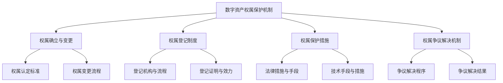

                 

### 文章标题

# 数字化遗产法律创业：数字资产的法律保护

> 关键词：数字化遗产，数字资产，法律保护，权属登记，数字资产估值模型，法律创业

> 摘要：随着数字化时代的到来，数字资产的法律保护问题日益凸显。本文从数字化遗产与数字资产的概念出发，分析当前数字资产的法律保护现状，探讨数字资产的权属保护、安全保护和知识产权保护机制，并结合实际案例，深入解析数字资产法律创业的实践与未来展望。通过本文，读者将全面了解数字资产法律保护的重要性及其未来发展路径。

### 第一部分：数字化遗产与数字资产概述

#### 第1章：数字化遗产与数字资产的概念与价值

##### 1.1 数字化遗产的定义与类型

数字化遗产，是指个人或组织在数字化环境中留下的信息、数据、数字作品等遗产。根据数字化遗产的存在形式，可以分为以下几类：

1. **数字信息遗产**：包括电子邮件、社交媒体信息、网络日志（博客）等。
2. **数字作品遗产**：如电子书、数字音乐、数字电影、数字艺术品等。
3. **数字账户遗产**：包括虚拟货币、电子游戏账号、社交媒体账号等。
4. **数字生物遗产**：如数字化的DNA数据、医疗健康数据等。

##### 1.2 数字资产的法律属性

数字资产作为一种新型资产，具有以下法律属性：

1. **财产权**：数字资产可以作为个人或组织的财产，享有财产权。
2. **知识产权**：部分数字资产，如数字作品，享有知识产权。
3. **所有权**：数字资产的所有权可以通过合法手段进行转让和继承。

##### 1.3 数字化遗产的重要性与挑战

数字化遗产的重要性在于：

1. **价值体现**：数字化遗产可以体现个人或组织的价值，如个人社交媒体账号的粉丝量、虚拟货币的价值等。
2. **信息延续**：数字化遗产可以帮助后人了解前人的生活、工作和思想。

数字化遗产面临的挑战包括：

1. **权属纠纷**：由于数字资产的特殊性，权属纠纷频发。
2. **隐私保护**：数字化遗产涉及个人隐私，需要保护用户数据安全。
3. **法律空白**：当前关于数字化遗产的法律保护尚不完善。

##### 1.4 数字化遗产的发展趋势

随着技术的不断发展，数字化遗产将呈现以下趋势：

1. **数字资产多元化**：数字资产类型将越来越丰富，包括虚拟现实资产、区块链资产等。
2. **法律保护加强**：各国将加强对数字资产的法律保护，完善相关法律法规。
3. **技术创新**：利用人工智能、区块链等技术，提高数字化遗产的管理和保护效率。

#### 第2章：数字资产的法律保护现状

##### 2.1 数字资产保护的国际法规

国际社会对数字资产的法律保护日益重视，一些国际组织和条约对此进行了规定：

1. **联合国国际货物销售合同公约**：明确了电子合同的法律效力。
2. **世界知识产权组织**：提供了数字作品知识产权保护的国际框架。
3. **联合国国际贸易法委员会**：发布了数字资产交易的规则和建议。

##### 2.2 中国数字资产保护法律框架

中国关于数字资产保护的法律体系主要包括：

1. **《中华人民共和国合同法》**：明确了电子合同的法律效力。
2. **《中华人民共和国著作权法》**：保护数字作品的知识产权。
3. **《中华人民共和国网络安全法》**：保护数字资产安全。
4. **《中华人民共和国密码法》**：规范数字资产的安全保护。

##### 2.3 各国数字资产保护的差异分析

各国在数字资产保护方面存在以下差异：

1. **法律体系**：不同国家的法律体系对数字资产的定义和保护范围有所不同。
2. **权属保护**：一些国家对数字资产的所有权保护较为完善，而另一些国家则较为薄弱。
3. **知识产权保护**：部分国家对数字作品的知识产权保护力度较大，而另一些国家则存在漏洞。

##### 2.4 数字资产保护的困境与挑战

数字资产保护面临的困境和挑战包括：

1. **法律空白**：部分数字资产类型尚未被法律明确界定和保护。
2. **权属纠纷**：权属纠纷频繁，涉及数字资产的转让、继承等问题。
3. **技术难题**：数字资产保护需要结合技术手段，如加密技术、区块链技术等，但目前相关技术尚不成熟。
4. **国际合作**：数字资产保护需要国际合作，但各国利益冲突较大，难以达成一致。

### 第二部分：数字资产的法律保护机制

#### 第3章：数字资产的权属保护

##### 3.1 数字资产权属的确立与变更

数字资产权属的确立与变更包括以下步骤：

1. **原始权属确立**：通过创作、购买等方式，确立数字资产的所有权。
2. **权属变更**：通过转让、继承、赠与等方式，变更数字资产的所有权。

##### 3.2 数字资产权属的登记制度

数字资产权属登记制度是保护数字资产权属的重要手段。登记制度包括：

1. **登记机构**：负责数字资产权属登记的政府机构或专业机构。
2. **登记流程**：包括申请、审核、登记等环节。
3. **登记证明**：登记完成后，发放登记证明，证明数字资产的所有权。

##### 3.3 数字资产权属的保护措施

数字资产权属保护措施包括：

1. **法律手段**：通过法律诉讼、仲裁等手段，解决权属纠纷。
2. **技术手段**：利用数字签名、加密技术等，保障数字资产的安全。
3. **合同手段**：通过签订合同，明确数字资产权属关系。

##### 3.4 数字资产权属争议解决机制

数字资产权属争议解决机制包括：

1. **诉讼途径**：通过法院诉讼解决权属纠纷。
2. **仲裁途径**：通过仲裁机构仲裁解决权属纠纷。
3. **调解途径**：通过调解机构调解解决权属纠纷。

#### 第4章：数字资产的安全保护

##### 4.1 数字资产安全的法律原则

数字资产安全保护遵循以下法律原则：

1. **合法性原则**：数字资产安全保护必须符合相关法律法规。
2. **安全性原则**：保障数字资产不被非法访问、篡改、泄露。
3. **责任原则**：明确数字资产安全保护的责任主体和责任范围。

##### 4.2 数字资产安全的法律制度

数字资产安全保护的法律制度包括：

1. **网络安全法**：规范网络安全管理，保障数字资产安全。
2. **密码法**：规范密码应用，提高数字资产安全防护能力。
3. **信息安全法**：保护信息安全，防止数字资产泄露。

##### 4.3 数字资产安全的技术措施

数字资产安全保护的技术措施包括：

1. **加密技术**：对数字资产进行加密，防止非法访问。
2. **防火墙技术**：设置防火墙，阻止非法访问。
3. **入侵检测技术**：实时监测网络行为，发现并阻止攻击。

##### 4.4 数字资产安全的案例分析

数字资产安全保护的案例分析：

1. **案例一**：某企业因网络攻击导致大量数字资产泄露。
2. **案例二**：某个人因数字资产被盗，通过法律手段追回损失。

#### 第5章：数字资产的知识产权保护

##### 5.1 数字资产知识产权的类型

数字资产知识产权包括：

1. **著作权**：数字作品（电子书、音乐、电影等）的著作权。
2. **商标权**：数字品牌、标识的商标权。
3. **专利权**：数字技术、算法的专利权。
4. **商业秘密**：数字资产中的商业秘密。

##### 5.2 数字资产知识产权的认定标准

数字资产知识产权的认定标准包括：

1. **原创性**：数字资产具有独创性。
2. **可复制性**：数字资产可以复制和传播。
3. **法律要件**：满足相关法律法规的要求。

##### 5.3 数字资产知识产权的保护措施

数字资产知识产权的保护措施包括：

1. **法律手段**：通过诉讼、仲裁等手段，保护知识产权。
2. **技术手段**：利用数字签名、水印等技术，防止侵权。
3. **合同手段**：通过签订合同，明确知识产权归属和使用。

##### 5.4 数字资产知识产权争议的解决途径

数字资产知识产权争议的解决途径包括：

1. **诉讼途径**：通过法院诉讼解决知识产权争议。
2. **仲裁途径**：通过仲裁机构仲裁解决知识产权争议。
3. **调解途径**：通过调解机构调解解决知识产权争议。

### 第三部分：数字资产法律创业实践

#### 第6章：数字资产交易与投资的法律问题

##### 6.1 数字资产交易的方式与合同

数字资产交易包括以下几种方式：

1. **在线交易**：通过数字资产交易所、加密货币交易平台等进行交易。
2. **线下交易**：通过面对面谈判、签订合同的方式进行交易。

数字资产交易合同应包括以下内容：

1. **交易双方信息**：交易双方的姓名、地址、联系方式等。
2. **数字资产信息**：数字资产的具体名称、类型、数量等。
3. **交易价格**：交易价格及支付方式。
4. **交付方式**：数字资产的交付方式及时间。
5. **违约责任**：违约责任及解决方式。

##### 6.2 数字资产投资的法律风险与防范

数字资产投资的法律风险包括：

1. **市场风险**：数字资产价格波动大，可能导致投资损失。
2. **法律风险**：相关法律法规不完善，可能导致投资风险。
3. **技术风险**：数字资产交易平台的安全漏洞，可能导致资产被盗。

防范措施：

1. **了解法律法规**：熟悉相关法律法规，避免违规操作。
2. **选择可靠平台**：选择有信誉、安全的数字资产交易平台。
3. **分散投资**：分散投资，降低风险。

##### 6.3 数字资产交易的税收问题

数字资产交易的税收问题主要包括：

1. **资本利得税**：数字资产出售所获得的资本利得需缴纳税款。
2. **增值税**：数字资产交易可能涉及增值税。
3. **关税**：跨境数字资产交易可能涉及关税。

税收政策因国家而异，投资者应了解所在国家的税收政策，合理规划税务问题。

##### 6.4 数字资产交易案例分析

数字资产交易案例分析：

1. **案例一**：某投资者通过在线交易平台购买数字资产，后发现平台存在安全隐患，导致资产被盗。
2. **案例二**：某企业通过线下交易购买数字资产，因合同条款不明确，发生纠纷。

#### 第7章：数字资产法律创业案例分析

##### 7.1 数字资产法律创业的模式与机会

数字资产法律创业的模式包括：

1. **数字资产交易平台**：提供数字资产交易服务，如交易所、交易平台等。
2. **数字资产法律服务**：提供数字资产交易、投资、知识产权等方面的法律服务。
3. **数字资产托管服务**：提供数字资产存储、保管、转移等服务。

数字资产法律创业的机会包括：

1. **市场需求**：随着数字资产市场的不断扩大，对相关服务的需求也日益增长。
2. **技术创新**：区块链、加密技术等新技术的应用，为数字资产法律创业提供了新机遇。
3. **政策支持**：各国政府对数字资产市场的支持，为创业提供了有利条件。

##### 7.2 数字资产法律创业的法律挑战与应对策略

数字资产法律创业面临的挑战包括：

1. **法律风险**：数字资产交易、投资等环节存在法律风险，如合同纠纷、侵权纠纷等。
2. **合规要求**：需遵守相关法律法规，如反洗钱、数据保护等。
3. **技术难题**：数字资产保护、交易安全等技术难题。

应对策略：

1. **法律合规**：建立健全法律合规体系，确保业务合法合规。
2. **风险控制**：制定风险控制措施，降低法律风险。
3. **技术创新**：引入新技术，提高数字资产交易的安全性、效率。

##### 7.3 成功的数字资产法律创业案例分析

成功的数字资产法律创业案例分析：

1. **案例一**：某企业通过提供数字资产交易平台服务，成功获得市场认可，实现盈利。
2. **案例二**：某律师团队专注于数字资产法律服务，为客户提供专业、高效的服务，赢得口碑。

##### 7.4 数字资产法律创业的未来展望

数字资产法律创业的未来展望：

1. **市场潜力**：随着数字资产市场的不断发展，数字资产法律创业的市场潜力巨大。
2. **技术创新**：区块链、人工智能等技术的应用，将提高数字资产法律创业的效率、安全性。
3. **政策支持**：各国政府对数字资产市场的支持，将为数字资产法律创业提供更好的环境。

### 第四部分：数字资产法律保护的未来展望

#### 第8章：数字资产法律保护的发展趋势

##### 8.1 数字资产法律保护的新技术

随着技术的不断进步，数字资产法律保护将迎来新技术，包括：

1. **区块链技术**：提供去中心化、安全的数字资产登记和保护。
2. **人工智能技术**：提高数字资产交易的智能决策、风险控制能力。
3. **加密技术**：提供更高级别的数字资产加密保护。

##### 8.2 数字资产法律保护的新法规

为适应数字资产市场的发展，各国将出台新的法规，包括：

1. **数字资产交易法规**：规范数字资产交易行为，保障市场秩序。
2. **数字资产知识产权法规**：加强对数字资产知识产权的保护。
3. **数字资产安全法规**：提高数字资产的安全保护水平。

##### 8.3 数字资产法律保护的新模式

数字资产法律保护将出现新的模式，包括：

1. **数字身份认证**：利用数字身份认证技术，确保数字资产权属的合法性。
2. **智能合约**：利用智能合约，实现数字资产交易、投资等环节的自动化。
3. **数字资产管理平台**：提供一站式数字资产登记、交易、保护等服务。

##### 8.4 数字资产法律保护的国际合作

数字资产法律保护需要国际合作，包括：

1. **法规协同**：加强各国数字资产法律保护的协同，形成国际共识。
2. **技术共享**：推动数字资产法律保护技术的共享，提高全球数字资产安全水平。
3. **执法合作**：加强数字资产犯罪的国际执法合作，打击跨境数字资产犯罪。

#### 第9章：数字资产法律保护的建议与展望

##### 9.1 数字资产法律保护的改进措施

为完善数字资产法律保护，建议采取以下改进措施：

1. **完善法律法规**：制定更全面的数字资产法律体系，覆盖数字资产权属、交易、安全等各个环节。
2. **提高执法力度**：加大对数字资产犯罪的打击力度，维护市场秩序。
3. **加强国际合作**：推动全球数字资产法律保护的国际合作，共同应对数字资产犯罪。

##### 9.2 数字资产法律创业的建议

对于数字资产法律创业者，建议：

1. **注重合规**：严格遵守相关法律法规，确保业务合法合规。
2. **创新技术**：利用新技术，提高数字资产交易、投资、保护等方面的效率、安全性。
3. **关注市场需求**：紧跟市场需求，提供有价值、有竞争力的数字资产法律服务。

##### 9.3 数字资产法律保护的未来展望

未来，数字资产法律保护将呈现以下趋势：

1. **技术创新**：随着技术的不断发展，数字资产法律保护将更加智能、高效、安全。
2. **市场扩大**：数字资产市场的不断扩大，将推动数字资产法律保护需求的增长。
3. **国际合作**：全球数字资产法律保护的加强，将促进国际合作与交流。

##### 9.4 总结与展望

本文通过对数字化遗产与数字资产的概念、法律保护现状、保护机制、创业实践及未来展望的深入分析，揭示了数字资产法律保护的重要性和紧迫性。随着数字资产市场的不断壮大，数字资产法律保护将成为一个热门领域，迎来广阔的发展空间。希望本文能为读者提供有益的参考，共同推动数字资产法律保护事业的发展。

### 附录

#### 附录 A：数字资产法律保护相关法规与政策汇编

1. 《中华人民共和国合同法》
2. 《中华人民共和国著作权法》
3. 《中华人民共和国网络安全法》
4. 《中华人民共和国密码法》
5. 联合国国际贸易法委员会发布的《电子交易示范法》
6. 世界知识产权组织发布的《数字作品版权条约》

#### 附录 B：数字资产法律保护案例分析汇编

1. 某企业数字资产被盗案
2. 某个人数字资产权属纠纷案
3. 某加密货币交易所倒闭案
4. 某数字资产交易合同纠纷案

#### 附录 C：数字资产法律保护工具与资源介绍

1. 数字资产交易平台：币安、火币、OKEx等
2. 数字资产法律服务平台：法大大、阿里云法务等
3. 数字资产安全防护工具：360安全大脑、腾讯安全等

### 伪代码示例

```python
# 伪代码：数字资产交易合同审核流程

def verify_contract(contract):
    # 检查合同格式是否符合要求
    if not is_contract_format_valid(contract):
        print("合同格式不正确。")
        return False
    
    # 检查合同内容是否合法
    if not is_contract_content_legal(contract):
        print("合同内容不合法。")
        return False
    
    # 检查合同签名是否有效
    if not is_signature_valid(contract):
        print("签名无效。")
        return False
    
    # 合同审核通过
    print("合同审核通过。")
    return True
```

### 数学模型与公式

- **数字资产估值模型**

$$
V = \frac{P \times R \times T}{C}
$$

其中，$V$ 为数字资产估值，$P$ 为市场平均交易价格，$R$ 为数字资产的增长率，$T$ 为持有期，$C$ 为持有成本。

### 作者信息

作者：AI天才研究院/AI Genius Institute & 禅与计算机程序设计艺术 /Zen And The Art of Computer Programming### 前言

在数字化时代，数字资产逐渐成为个人和企业的核心财富。从社交媒体账号、加密货币到数字艺术品，数字资产已成为现代社会不可或缺的一部分。然而，随着数字资产价值的不断提升，数字资产的法律保护问题也日益凸显。如何在法律框架内确保数字资产的安全、有效管理和合法交易，成为了一个亟待解决的难题。

本文旨在深入探讨数字资产的法律保护问题，通过系统的分析，揭示数字资产法律保护的现状、机制和实践。文章将从以下几个方面展开讨论：

1. **数字化遗产与数字资产的概念与价值**：介绍数字化遗产和数字资产的定义、类型及其法律属性。
2. **数字资产的法律保护现状**：分析当前国际和中国数字资产保护的法律框架，以及存在的困境和挑战。
3. **数字资产的法律保护机制**：探讨数字资产的权属保护、安全保护和知识产权保护机制。
4. **数字资产法律创业实践**：分析数字资产交易、投资的法律问题，以及数字资产法律创业的案例分析。
5. **数字资产法律保护的未来展望**：探讨数字资产法律保护的发展趋势、改进措施和未来展望。

通过本文的探讨，希望能够为读者提供一个全面、深入的数字资产法律保护视角，助力读者理解和应对数字资产法律保护中的复杂问题。同时，也希望本文能够为数字资产法律创业者提供有益的参考，推动数字资产法律保护事业的发展。

### 数字化遗产与数字资产概述

在当今的数字化时代，数字资产和个人数据已经成为个人和企业的重要财富。然而，与传统的物理资产不同，数字资产具有独特性、虚拟性和易逝性等特点，使得其法律保护问题更加复杂和重要。为了全面理解数字资产的法律保护，我们需要从数字化遗产与数字资产的概念、类型、价值以及面临的挑战和发展趋势等方面进行深入探讨。

#### 数字化遗产的定义与类型

数字化遗产是指个人或组织在数字化环境中留下的信息、数据、数字作品等遗产。它不仅仅包括传统的电子邮件、社交媒体信息、网络日志（博客），还包括数字化的个人文件、照片、视频、音乐、数字艺术品以及各种虚拟物品。根据数字化遗产的存在形式，我们可以将其分为以下几类：

1. **数字信息遗产**：这是最常见的一类数字化遗产，包括电子邮件、社交媒体信息、网络日志（博客）等。这些信息在个人或组织去世后，仍然可以在互联网上存在和传播，对后人产生持续的影响。

2. **数字作品遗产**：这类遗产包括电子书、数字音乐、数字电影、数字艺术品等。这些作品在创作完成并上传到网络后，可以通过各种渠道传播和展示，具有独立的经济价值和艺术价值。

3. **数字账户遗产**：随着虚拟世界的不断发展，越来越多的个人和企业在互联网上拥有多个数字账户，如电子邮件账号、社交媒体账号、虚拟货币账户、游戏账号等。这些账户在用户去世后，仍可能存在，并且可能含有重要的信息和价值。

4. **数字生物遗产**：这类遗产主要是指数字化的DNA数据、医疗健康数据等。随着生物科技和医疗技术的发展，这些数据对个人及其家族的健康和生活决策具有重要意义。

#### 数字资产的法律属性

数字资产作为一种新型资产，具有以下法律属性：

1. **财产权**：数字资产可以作为个人或组织的财产，享有财产权。这意味着数字资产可以像传统的物理资产一样，通过购买、出售、赠与等方式进行转让。

2. **知识产权**：部分数字资产，如数字作品，享有知识产权。这意味着数字作品的创作者或所有者可以对其作品进行版权保护，禁止他人未经许可的使用和复制。

3. **所有权**：数字资产的所有权可以通过合法手段进行转让和继承。与传统的物理资产不同，数字资产的所有权变更通常需要通过技术手段进行确认和记录，如区块链技术。

#### 数字化遗产的重要性与挑战

数字化遗产的重要性体现在多个方面：

1. **价值体现**：数字化遗产可以体现个人或组织的价值。例如，社交媒体账号的粉丝数量、虚拟货币的价值、数字艺术品的市场价格等，都是数字化遗产价值的具体体现。

2. **信息延续**：数字化遗产可以帮助后人了解前人的生活和思想。通过电子邮件、社交媒体信息、网络日志等，后人可以更全面地了解前人的生活、工作和思想轨迹。

然而，数字化遗产也面临着一系列挑战：

1. **权属纠纷**：由于数字资产的特殊性，权属纠纷频发。尤其是在数字资产继承和转让过程中，如何确定权属、如何分配价值成为难题。

2. **隐私保护**：数字化遗产涉及个人隐私，需要保护用户数据安全。如何平衡数字化遗产的公开和隐私保护，是一个亟待解决的问题。

3. **法律空白**：当前关于数字化遗产的法律保护尚不完善。许多国家在数字化遗产方面的法律法规仍然滞后，无法满足现实需求。

#### 数字化遗产的发展趋势

随着技术的不断发展，数字化遗产将呈现以下趋势：

1. **数字资产多元化**：数字资产类型将越来越丰富，包括虚拟现实资产、区块链资产等。这些新类型的数字资产将带来更多的法律保护需求。

2. **法律保护加强**：各国将加强对数字资产的法律保护，完善相关法律法规。例如，许多国家已经或正在制定数字遗产法，以规范数字化遗产的继承、保护和转让。

3. **技术创新**：利用人工智能、区块链等技术，提高数字化遗产的管理和保护效率。例如，通过区块链技术实现数字资产的不可篡改和透明化，通过人工智能技术提高数字遗产管理的智能化水平。

总之，数字化遗产和数字资产的法律保护问题是一个复杂且富有挑战性的领域。通过深入探讨和分析，我们可以更好地理解这一领域的重要性，以及未来的发展方向。希望本文能为读者提供一个全面的视角，帮助读者更好地应对数字化时代带来的法律挑战。

#### 数字资产的法律保护现状

随着数字化时代的到来，数字资产的法律保护问题日益突出。各国政府和国际组织都在积极制定和实施相关法律法规，以保护数字资产的安全、有效管理和合法交易。然而，由于数字资产的特殊性和复杂性，当前数字资产的法律保护仍然面临诸多困境和挑战。

##### 数字资产保护的国际法规

国际社会对数字资产的法律保护日益重视，多个国际组织和条约对此进行了规定：

1. **联合国国际贸易法委员会（UNCITRAL）**：联合国国际贸易法委员会发布了《电子交易示范法》和《电子签名示范法》，为各国制定数字资产法律提供了参考。这些示范法明确了电子合同的法律效力，为数字资产交易奠定了基础。

2. **世界知识产权组织（WIPO）**：世界知识产权组织发布了《数字作品版权条约》（WPPT）和《表演和录音制品条约》（WPPT），提供了数字作品知识产权保护的国际框架。这些条约规定了数字作品的版权保护、权利管理信息（RMI）的保护以及防止未经授权的复制和传播等。

3. **经济合作与发展组织（OECD）**：经济合作与发展组织发布了《数字时代隐私保护和跨边界数据流动原则》，强调了隐私保护的重要性，并提出了数据保护的跨边界原则。这些原则为数字资产的法律保护提供了指导。

4. **国际电信联盟（ITU）**：国际电信联盟制定了《电信网络安全框架》，旨在保护数字资产的安全。该框架涵盖了网络安全政策、网络安全管理、网络安全技术和网络安全响应等方面。

##### 中国数字资产保护法律框架

中国在数字资产保护方面已经建立了较为完善的法律法规体系，主要包括以下方面：

1. **《中华人民共和国合同法》**：合同法明确规定了电子合同的法律效力，为数字资产交易提供了法律依据。根据合同法，电子合同与书面合同具有同等法律效力，有效解决了数字资产交易中的合同纠纷问题。

2. **《中华人民共和国著作权法》**：著作权法保护数字作品的知识产权，为数字艺术作品、音乐、电影等数字资产的创作者提供了法律保护。著作权法规定了著作权的内容、保护期限、侵权责任等，确保数字资产的合法权益。

3. **《中华人民共和国网络安全法》**：网络安全法是保护数字资产安全的重要法律。该法明确了网络安全的基本原则，规定了网络安全管理、网络信息保护、网络安全监测等方面的要求。网络安全法旨在防止网络攻击、数据泄露等风险，保障数字资产的安全。

4. **《中华人民共和国密码法》**：密码法规范了密码的应用和管理，提高了数字资产的安全保护水平。密码法规定了密码的种类、使用和管理要求，要求在数字资产交易、存储、传输过程中使用密码技术进行保护，防止非法访问和篡改。

5. **《中华人民共和国电子签名法》**：电子签名法明确了电子签名的法律效力，为数字资产交易中的签名和认证提供了法律保障。电子签名法规定，符合法律规定的电子签名与书面签名具有同等法律效力，有效解决了数字资产交易中的签名问题。

##### 各国数字资产保护的差异分析

尽管各国都在加强数字资产的法律保护，但在具体法规和实施上仍存在显著差异：

1. **法律体系**：不同国家的法律体系对数字资产的定义和保护范围有所不同。例如，美国更注重数字资产的财产权保护，而欧洲国家则更强调数字资产的个人隐私和数据保护。

2. **权属保护**：一些国家对数字资产的所有权保护较为完善，如美国、英国等，而另一些国家则存在漏洞，如某些发展中国家对数字资产的法律保护尚不健全。

3. **知识产权保护**：部分国家对数字作品的知识产权保护力度较大，如美国、日本等，而一些国家则对数字作品的版权保护不够严格，导致盗版等问题较为严重。

4. **法律适用性**：由于数字资产跨国界的特性，不同国家的法律适用性也存在问题。例如，在跨境数字资产交易中，如何确定适用的法律，如何解决跨境法律冲突，成为数字资产保护的一大难题。

##### 数字资产保护的困境与挑战

数字资产保护面临的困境和挑战包括：

1. **法律空白**：尽管许多国家已经出台了数字资产保护的法律，但仍有部分数字资产类型，如虚拟现实资产、数字艺术品等，尚未被法律明确界定和保护。

2. **权属纠纷**：由于数字资产的特殊性，权属纠纷频发。特别是在数字资产继承和转让过程中，如何确定权属、如何分配价值成为难题。

3. **技术难题**：数字资产保护需要结合技术手段，如加密技术、区块链技术等，但目前相关技术尚不成熟，无法完全满足数字资产保护的需求。

4. **国际合作**：数字资产保护需要国际合作，但各国利益冲突较大，难以达成一致。例如，在跨境数字资产交易中，如何协调不同国家的法律法规，如何解决跨境法律冲突，是当前数字资产保护面临的重要问题。

总之，数字资产的法律保护是一个复杂且充满挑战的领域。尽管各国政府和国际组织在积极制定和实施相关法律法规，但数字资产保护仍然存在诸多困境和挑战。未来，需要进一步加强国际合作，完善法律法规体系，引入新技术，提高数字资产保护的整体水平。只有这样，才能更好地应对数字化时代带来的法律挑战。

### 数字资产的权属保护

数字资产的权属保护是确保数字资产合法、有效管理和转让的关键。在数字资产交易和继承过程中，权属保护机制的有效性直接影响到交易的安全性和合法性。因此，了解数字资产权属的确立与变更、登记制度以及保护措施，对于数字资产所有者和相关从业者都具有重要意义。

#### 数字资产权属的确立与变更

数字资产权属的确立与变更是数字资产管理和交易的基础。以下是数字资产权属确立和变更的主要步骤：

1. **原始权属确立**：

   - **创作**：数字资产的所有权通常从创作开始确立。例如，一篇电子书的创作完成后，作者自动成为该电子书的所有权人。
   - **购买**：通过购买方式获取数字资产的所有权。例如，购买数字货币、游戏账号等。
   - **赠与**：赠与是另一种确立数字资产权属的方式。例如，个人赠与社交媒体账号或虚拟物品。

2. **权属变更**：

   - **转让**：所有权人通过转让方式将数字资产的所有权转移给他人。转让可以通过签订合同、交易等方式实现。
   - **继承**：所有权人在去世后，数字资产可以通过遗嘱或法定继承程序转移给继承人。这需要通过法律程序确认继承人的所有权。

在数字资产权属确立和变更过程中，需要遵循以下原则：

- **合法性原则**：确保权属确立和变更的过程符合相关法律法规，如《中华人民共和国合同法》、《中华人民共和国著作权法》等。
- **真实性原则**：确保权属变更的真实性和有效性，防止虚假交易和欺诈行为。
- **公正性原则**：在权属变更过程中，应确保各方合法权益得到公平对待。

#### 数字资产权属的登记制度

数字资产权属登记制度是保护数字资产权属的重要手段。登记制度主要包括以下内容：

1. **登记机构**：

   - **政府机构**：许多国家设立了专门的数字资产登记机构，如中国的国家版权局、美国的版权办公室等。
   - **第三方机构**：一些私人机构也提供数字资产登记服务，如区块链平台、数字资产交易平台等。

2. **登记流程**：

   - **申请**：数字资产所有权人需向登记机构提交登记申请，提供相关证明材料。
   - **审核**：登记机构对申请材料进行审核，确认权属的真实性和合法性。
   - **登记**：审核通过后，登记机构将数字资产权属信息录入登记系统，并发放登记证明。

3. **登记证明**：

   - **法律效力**：登记证明具有法律效力，可以作为数字资产权属的凭证。
   - **证明效力**：登记证明可以证明数字资产的所有权，防止权属纠纷。

登记制度的重要性体现在以下几个方面：

- **确权**：通过登记制度，明确数字资产的所有权，防止权属纠纷。
- **公示**：登记制度使得数字资产权属信息公开透明，提高交易的安全性。
- **保护**：登记制度提供了法律保障，有助于保护数字资产所有者的合法权益。

#### 数字资产权属的保护措施

为了确保数字资产权属的合法性和安全性，需要采取一系列保护措施：

1. **法律手段**：

   - **合同手段**：通过签订合同明确数字资产权属关系，确保权属变更的合法性和有效性。
   - **诉讼手段**：在发生权属纠纷时，可以通过法律诉讼途径维护合法权益。

2. **技术手段**：

   - **数字签名**：使用数字签名技术确保数字资产交易的安全性和不可篡改性。
   - **加密技术**：利用加密技术保护数字资产数据，防止未经授权的访问和篡改。

3. **登记手段**：

   - **权属登记**：通过数字资产权属登记制度，确保数字资产权属信息的真实性和合法性。
   - **公示制度**：建立数字资产公示制度，提高权属信息的透明度和公信力。

#### 数字资产权属争议解决机制

数字资产权属争议解决机制是处理数字资产权属纠纷的重要手段。常见的争议解决机制包括：

1. **诉讼途径**：

   - **法院诉讼**：通过法院诉讼解决数字资产权属纠纷，法院依据相关法律法规和证据做出判决。
   - **仲裁途径**：通过仲裁机构解决数字资产权属纠纷，仲裁机构依据仲裁协议和仲裁规则作出裁决。

2. **调解途径**：

   - **调解机构**：通过调解机构进行调解，调解员协助双方达成和解。
   - **调解协议**：调解成功后，双方签订调解协议，具有法律效力。

3. **技术途径**：

   - **区块链技术**：利用区块链技术记录数字资产权属信息，提供不可篡改的证据链，有助于解决权属纠纷。

通过建立健全的数字资产权属保护机制，可以有效地维护数字资产所有者的合法权益，促进数字资产市场的健康发展。在未来的发展中，随着技术的进步和法律的完善，数字资产权属保护将更加高效、安全，为数字经济的繁荣提供有力保障。

#### 数字资产的安全保护

数字资产的安全保护是确保数字资产不被非法访问、篡改和泄露的关键。随着数字资产价值的不断增加，数字资产安全保护的重要性愈发突出。本文将探讨数字资产安全的法律原则、法律制度、技术措施以及实际案例，以帮助读者全面了解数字资产的安全保护体系。

##### 数字资产安全的法律原则

数字资产安全的法律原则包括以下几个方面：

1. **合法性原则**：数字资产安全保护必须符合相关法律法规，如《中华人民共和国网络安全法》、《中华人民共和国密码法》等。任何数字资产保护措施都必须在法律框架内进行。

2. **安全性原则**：数字资产安全保护的目标是确保数字资产不被非法访问、篡改和泄露。这要求在数字资产存储、传输、处理等各个环节采取有效的安全措施。

3. **责任原则**：数字资产安全保护的责任主体应当明确，包括数字资产所有者、管理者、技术服务提供商等。在发生安全事件时，责任主体应承担相应的法律责任。

4. **预防性原则**：数字资产安全保护应采取预防性措施，防患于未然。通过建立健全的安全管理体系，降低安全事件的发生概率。

##### 数字资产安全的法律制度

数字资产安全的法律制度主要包括以下几个方面：

1. **网络安全法律制度**：《中华人民共和国网络安全法》是数字资产安全保护的基本法律。该法明确了网络运营者的安全保护义务，规定了网络安全监测、预警、应急处置等措施。

2. **密码法律制度**：《中华人民共和国密码法》规范了密码的应用和管理，提高了数字资产的安全保护水平。密码技术在数字资产保护中起到了关键作用。

3. **数据保护法律制度**：随着数据保护意识的提高，各国相继出台了数据保护法律，如欧盟的《通用数据保护条例》（GDPR）。这些法律要求企业在收集、存储、处理和传输数字资产时，必须采取有效的数据保护措施。

4. **侵权责任法律制度**：在数字资产安全保护中，侵权责任法律制度起到了重要作用。通过法律规定侵权行为的法律责任，可以有效地遏制侵权行为，保护数字资产所有者的合法权益。

##### 数字资产安全的技术措施

数字资产安全的技术措施是保护数字资产不被非法访问、篡改和泄露的关键。以下是一些常用的技术措施：

1. **加密技术**：加密技术是数字资产安全保护的核心。通过对数字资产进行加密，可以确保数据在传输和存储过程中的安全性。常见的加密技术包括对称加密、非对称加密、哈希算法等。

2. **访问控制**：访问控制技术用于限制对数字资产的访问权限，确保只有授权用户才能访问和操作数字资产。常见的访问控制技术包括用户认证、权限管理、防火墙等。

3. **网络安全技术**：网络安全技术用于防范网络攻击和非法访问。常见的网络安全技术包括入侵检测系统（IDS）、入侵防御系统（IPS）、虚拟专用网络（VPN）等。

4. **区块链技术**：区块链技术具有去中心化、不可篡改和透明化的特点，适用于数字资产的安全保护。通过将数字资产的信息记录在区块链上，可以确保数据的真实性和不可篡改性。

##### 数字资产安全的案例分析

以下是几个数字资产安全保护的案例分析：

1. **案例一：某企业数字资产泄露事件**：某企业因网络安全漏洞导致大量数字资产泄露，损失惨重。该事件暴露了企业在数字资产安全保护方面的不足，包括缺乏有效的加密措施、访问控制不足等。事后，企业通过整改，加强了数字资产的安全保护，提高了安全防护水平。

2. **案例二：某加密货币交易所黑客攻击事件**：某加密货币交易所遭到黑客攻击，导致大量用户资产被盗。该事件凸显了加密货币交易所面临的安全威胁，包括网络攻击、内部泄露等。交易所事后采取了多种技术措施，如加强加密、提高访问控制等，以增强数字资产的安全性。

3. **案例三：某个人数字资产被盗事件**：某个人因使用弱密码和公共WiFi导致数字资产被盗。该事件提醒用户在数字资产安全保护中应注意使用强密码、避免在公共WiFi环境下进行敏感操作等。个人用户应加强自身的安全意识，采取有效的安全措施保护数字资产。

通过以上案例分析，我们可以看到数字资产安全保护的重要性。在数字资产日益增多的今天，企业和个人都需要重视数字资产的安全保护，采取有效的法律和技术措施，防范安全风险。

##### 总结

数字资产的安全保护是确保数字资产不被非法访问、篡改和泄露的关键。通过分析数字资产安全的法律原则、法律制度、技术措施以及实际案例，我们可以看到数字资产安全保护的重要性。在未来的发展中，随着技术的进步和法律的完善，数字资产安全保护将变得更加高效、全面。企业和个人都应加强数字资产安全保护意识，采取有效的措施，确保数字资产的安全。

#### 数字资产的知识产权保护

数字资产的知识产权保护是确保数字资产创作者和所有者权益的重要手段。在数字化时代，随着数字作品、商标、专利等数字资产日益增多，对数字资产的知识产权保护也变得尤为重要。本文将从数字资产知识产权的类型、认定标准、保护措施以及争议解决途径等方面进行探讨，以帮助读者全面了解数字资产的知识产权保护。

##### 数字资产知识产权的类型

数字资产知识产权主要包括以下几种类型：

1. **著作权**：著作权是数字资产中最常见的一种知识产权。数字作品如电子书、音乐、电影、软件等，创作者对其享有著作权。著作权包括发表权、署名权、修改权、保护作品完整权等。

2. **商标权**：商标权是用于标识商品或服务的一种知识产权。数字资产中的商标包括在线品牌、标识、口号等，这些标识在市场上具有识别作用，可以申请商标保护。

3. **专利权**：专利权是指对发明、实用新型和外观设计等创新成果的专有权。在数字资产中，专利权通常涉及数字技术、算法、软件等创新成果。

4. **商业秘密**：商业秘密是指不为公众所知悉、具有商业价值并采取保密措施的技术信息和经营信息。数字资产中的商业秘密包括客户名单、研发配方、营销策略等。

##### 数字资产知识产权的认定标准

数字资产知识产权的认定标准主要包括以下几个方面：

1. **独创性**：数字作品必须具有独创性，即作品是创作者独立创作的，具有独特的创意和表达。

2. **可复制性**：数字作品必须可以被复制和传播，这体现了数字作品的可复制性和传播性特点。

3. **法律要件**：数字资产知识产权的认定必须符合相关法律法规的要求。例如，著作权法规定了作品登记、权利证明等法律要件。

4. **实际使用**：数字资产知识产权的认定还需考虑实际使用情况。例如，商标的使用必须达到一定的频率和范围，才能获得商标权的保护。

##### 数字资产知识产权的保护措施

为了确保数字资产知识产权的合法权益，可以采取以下保护措施：

1. **法律手段**：

   - **版权登记**：通过版权登记，获得官方认证的著作权证明，提高数字资产知识产权的公信力。
   - **侵权诉讼**：在发现侵权行为时，可以依法提起诉讼，要求侵权方停止侵权行为并赔偿损失。
   - **仲裁调解**：通过仲裁机构或调解机构解决数字资产知识产权争议，提高争议解决的效率和公正性。

2. **技术手段**：

   - **数字签名**：使用数字签名技术确保数字资产版权信息的真实性和不可篡改性。
   - **水印技术**：在数字作品中嵌入水印，标记创作者或版权所有者信息，便于追踪侵权行为。
   - **加密技术**：对数字资产进行加密保护，防止未经授权的访问和复制。

3. **合同手段**：

   - **版权协议**：在数字资产交易或合作过程中，签订版权协议明确双方的权利和义务，防止侵权纠纷。
   - **授权许可**：通过授权许可，允许他人合法使用数字资产，并获得相应的报酬。

##### 数字资产知识产权争议的解决途径

数字资产知识产权争议的解决途径主要包括以下几种：

1. **诉讼途径**：

   - **法院诉讼**：通过法院诉讼解决数字资产知识产权争议，法院依据相关法律法规和证据作出判决。
   - **仲裁诉讼**：通过仲裁机构解决数字资产知识产权争议，仲裁机构依据仲裁协议和仲裁规则作出裁决。

2. **调解途径**：

   - **调解机构**：通过调解机构进行调解，调解员协助双方达成和解。
   - **调解协议**：调解成功后，双方签订调解协议，具有法律效力。

3. **技术途径**：

   - **区块链技术**：利用区块链技术记录数字资产知识产权信息，提供不可篡改的证据链，有助于解决知识产权争议。
   - **证据保全**：通过法律手段对涉嫌侵权的行为进行证据保全，为后续争议解决提供有力证据。

通过建立健全的数字资产知识产权保护体系，可以有效地维护数字资产创作者和所有者的合法权益，促进数字资产的创新和发展。在未来的发展中，随着技术的进步和法律的完善，数字资产知识产权保护将更加高效、全面，为数字经济的繁荣提供有力保障。

#### 数字资产交易与投资的法律问题

在数字化时代，数字资产交易与投资成为市场关注的热点。然而，数字资产交易与投资过程中涉及的法律问题复杂多样，需要我们深入理解和掌握。本文将从数字资产交易的方式与合同、投资的法律风险与防范、税收问题以及实际案例分析等方面进行探讨，以帮助投资者和从业者更好地应对数字资产交易与投资的法律挑战。

##### 数字资产交易的方式与合同

数字资产交易的方式主要包括在线交易和线下交易两种：

1. **在线交易**：

   - **交易平台**：在线交易平台如币安、火币等，为投资者提供便捷的数字资产交易服务。这些平台通常提供交易对、交易对流动性、交易手续费等交易信息。
   - **交易流程**：投资者在注册账户、完成实名认证后，可以通过在线交易平台进行数字资产的购买、出售、转账等操作。交易过程中，双方需要签订电子合同，明确交易金额、交易对、交付时间等条款。
   - **合同条款**：数字资产交易合同应包括交易双方的身份信息、交易金额、交易对、交易时间、交付方式、违约责任等内容。合同条款应详细明确，以防止后续纠纷。

2. **线下交易**：

   - **面对面交易**：线下交易通常是通过面对面谈判、签订合同的方式进行。交易双方需协商确定交易金额、交易对、交付方式、付款方式等条款。
   - **合同条款**：线下交易合同同样需要详细明确，包括交易双方的身份信息、交易金额、交易对、交付时间、付款方式、违约责任等。此外，线下交易合同还需注意签署地点、证人见证等细节，以确保合同的真实性和合法性。

##### 投资的法律风险与防范

数字资产投资的法律风险主要包括以下几个方面：

1. **市场风险**：

   - **价格波动**：数字资产市场价格波动较大，投资者可能面临资产贬值的风险。
   - **市场操纵**：数字资产市场可能存在市场操纵行为，投资者需要警惕市场风险。

2. **法律风险**：

   - **合规风险**：投资者需要遵守相关法律法规，如反洗钱法、数据保护法等，避免因违规操作而面临法律风险。
   - **合同风险**：数字资产交易合同条款不明确或存在瑕疵，可能导致合同纠纷。

防范措施：

1. **了解法律法规**：投资者应熟悉相关法律法规，如《中华人民共和国合同法》、《中华人民共和国证券法》等，确保交易合规。

2. **选择可靠平台**：选择有信誉、合规的数字资产交易平台，降低合规风险。

3. **风险评估**：投资者应进行充分的市场调研，了解数字资产的市场状况、风险和前景，做出理性的投资决策。

##### 税收问题

数字资产交易与投资涉及的税收问题主要包括：

1. **资本利得税**：

   - **国内税收**：在中国，数字资产出售所获得的资本利得需要缴纳个人所得税。根据《中华人民共和国个人所得税法》，资本利得的计税依据为卖出价格减去买入价格。
   - **国际税收**：跨境数字资产交易可能涉及不同国家的税收制度，投资者需要了解目标国家的税收政策，避免因跨国交易而面临双重征税问题。

2. **增值税**：

   - **国内增值税**：在中国，数字资产交易平台可能需要缴纳增值税。增值税的计税依据为交易手续费等。
   - **国际增值税**：跨境数字资产交易可能涉及目标国家的增值税问题，投资者需要关注相关税收政策。

3. **关税**：

   - **跨境交易关税**：跨境数字资产交易可能需要缴纳关税。关税的税率根据交易类型和交易金额而定。

税收建议：

1. **合规申报**：投资者在进行数字资产交易与投资时，应按时申报相关税收，避免税务风险。

2. **专业咨询**：投资者可以咨询专业税务顾问，了解税收政策，合理规划税务问题。

##### 实际案例分析

以下是一些数字资产交易与投资的实际案例分析：

1. **案例一：某投资者因未了解法律法规而面临税务处罚**：

   某投资者在未经充分了解相关法律法规的情况下，进行数字资产交易。在交易完成后，该投资者因未申报相关税收，被税务机关处罚。此案例提醒投资者在交易前应了解相关法律法规，及时申报税收。

2. **案例二：某交易平台因违规操作面临法律风险**：

   某交易平台因未严格审核用户身份信息，导致部分用户使用非法资金进行交易。该平台因此面临法律诉讼和监管处罚。此案例提醒交易平台在运营过程中应严格遵守法律法规，加强合规管理。

3. **案例三：某投资者通过法律手段追回被盗资产**：

   某投资者在数字资产被盗后，通过法律手段向公安机关报案，并成功追回部分被盗资产。此案例展示了法律手段在数字资产安全保护中的重要作用。

通过以上案例分析，我们可以看到数字资产交易与投资过程中存在的法律风险。投资者和从业者应充分了解相关法律法规，采取有效防范措施，确保交易与投资的安全、合法。同时，平台和相关部门应加强监管，维护市场秩序，共同促进数字资产市场的健康发展。

#### 数字资产法律创业案例分析

在数字资产法律创业领域，一些企业通过创新的模式取得了成功，同时也面临诸多挑战。本节将通过对几个成功的数字资产法律创业案例进行分析，总结其创业模式、面临的挑战和应对策略，为潜在的创业者提供参考和启示。

##### 成功的数字资产法律创业案例

**案例一：某数字资产交易平台**

该公司创立之初，专注于提供安全、合规的数字资产交易平台。通过引入区块链技术和严格的风控机制，该公司在市场上树立了良好的信誉。其成功的关键因素包括：

1. **技术创新**：引入区块链技术，确保交易数据的透明和不可篡改性，提高了用户对平台的信任度。
2. **合规经营**：严格遵守相关法律法规，确保平台运营的合法合规，降低了法律风险。
3. **用户体验**：注重用户体验，提供便捷、安全的交易服务，吸引了大量用户。

**案例二：某数字资产法律服务公司**

该公司专注于提供专业的数字资产法律服务，包括数字资产交易、投资、知识产权保护等方面的咨询和代理服务。其成功的关键因素包括：

1. **专业团队**：组建了一支具备丰富法律知识和数字资产行业经验的团队，为客户提供高质量的服务。
2. **市场需求**：随着数字资产市场的快速发展，对专业法律服务的需求日益增加，为公司提供了广阔的市场空间。
3. **资源整合**：与数字资产交易平台、区块链技术公司等建立合作关系，为客户提供一站式服务。

##### 创业模式与机会

在数字资产法律创业领域，以下几种模式具有较高的成功机会：

1. **数字资产交易平台**：提供安全、合规的数字资产交易服务，通过技术创新和合规经营，吸引更多用户和投资者。
2. **数字资产法律服务**：提供专业、全面的数字资产法律服务，包括交易咨询、纠纷解决、知识产权保护等，满足市场需求。
3. **数字资产管理平台**：提供数字资产存储、管理、转移等服务，利用区块链等新技术，提高资产管理的安全性和效率。
4. **数字资产投资基金**：通过投资数字资产项目，分享数字资产市场的红利，同时提供专业的投资建议和管理服务。

##### 面临的挑战与应对策略

尽管数字资产法律创业具有广阔的市场前景，但创业者仍面临诸多挑战：

1. **法律风险**：数字资产市场的法律法规尚不完善，创业者需要严格遵守现有法律法规，避免法律风险。

   **应对策略**：与法律专家合作，确保业务合法合规；积极关注政策变化，及时调整业务模式。

2. **技术风险**：数字资产交易和管理依赖于区块链等新技术，技术故障或安全问题可能导致严重后果。

   **应对策略**：引入成熟的技术解决方案，加强技术团队建设；建立健全的安全管理制度，提高系统的安全性能。

3. **市场风险**：数字资产市场波动性大，创业者需要具备较强的市场敏锐度和风险控制能力。

   **应对策略**：进行充分的市场调研，制定合理的投资策略；建立多渠道的资金来源，分散市场风险。

4. **人才竞争**：数字资产法律创业需要具备法律、技术、金融等多方面的人才，人才竞争激烈。

   **应对策略**：提供有吸引力的薪酬和福利，吸引和留住优秀人才；建立培训体系，提升员工的综合素质。

通过分析成功的数字资产法律创业案例，我们可以看到，成功的创业者具备敏锐的市场洞察力、先进的技术能力和坚定的法律意识。在未来的发展中，数字资产法律创业将继续迎来新的机遇和挑战。创业者需要紧跟市场趋势，不断创新和调整，以实现可持续发展。

#### 数字资产法律保护的未来展望

随着数字资产市场的快速发展，数字资产法律保护的未来展望也愈发重要。未来，数字资产法律保护将面临新的技术、法规和国际合作等挑战，同时也将迎来广阔的发展机遇。本文将从数字资产法律保护的发展趋势、改进措施、创业建议和未来展望等方面进行探讨。

##### 数字资产法律保护的发展趋势

1. **技术创新**：

   - **区块链技术**：区块链技术具有去中心化、不可篡改和透明化的特点，未来将在数字资产法律保护中发挥重要作用。通过区块链技术，可以实现数字资产登记、交易、转移等过程的透明化和不可篡改性，提高数字资产的安全性和可信度。
   - **人工智能技术**：人工智能技术可以用于数字资产风险评估、智能合约执行、安全预警等方面。通过人工智能技术，可以提高数字资产法律保护的智能化和自动化水平，降低人为错误和安全漏洞。
   - **加密技术**：加密技术是保护数字资产安全的重要手段。未来，加密技术将不断发展，提供更高级别的安全保护，确保数字资产在存储、传输和处理过程中的安全性。

2. **法规完善**：

   - **国际法规**：随着数字资产市场的国际化发展，国际社会将加强数字资产法律保护的法规制定和合作。未来，可能会出现更多国际性数字资产法律保护规范和协议，推动全球数字资产市场的健康发展。
   - **国内法规**：各国政府将加快数字资产相关法律法规的制定和完善，以应对数字资产市场的快速变化。例如，中国可能会出台更加详细的数字资产交易、安全保护、税收等方面的法律法规，为数字资产市场提供法律保障。

3. **模式创新**：

   - **数字身份认证**：数字身份认证技术可以提高数字资产交易的安全性和可信度。未来，数字身份认证将成为数字资产交易的重要环节，通过身份认证，可以确保交易双方的真实身份，防止欺诈行为。
   - **智能合约**：智能合约是基于区块链技术的一种自动化执行合同，可以实现合同条款的自动化执行。未来，智能合约将在数字资产交易中广泛应用，提高交易效率和降低纠纷风险。
   - **数字资产管理平台**：数字资产管理平台将为个人和企业提供一站式数字资产登记、交易、存储和管理服务。通过数字资产管理平台，可以实现对数字资产的全生命周期管理，提高数字资产的安全性和流动性。

##### 改进措施

1. **加强国际合作**：

   - **共享信息**：国际社会应加强数字资产法律保护的信息共享，推动跨国数字资产法律保护合作。通过建立国际合作机制，可以更有效地打击跨境数字资产犯罪，维护全球数字资产市场的秩序。
   - **统一标准**：各国应制定统一的数字资产法律保护标准，推动全球数字资产市场的规范化发展。统一的数字资产法律保护标准将有助于减少法律冲突和交易障碍，促进全球数字资产市场的融合。

2. **完善国内法律体系**：

   - **立法完善**：政府应加快数字资产相关法律法规的制定和修订，确保数字资产法律保护的全面性和适用性。例如，可以制定专门的数字资产交易法、数字资产安全法等，为数字资产市场提供更加完善的法律保障。
   - **执法加强**：加强数字资产法律保护的执法力度，加大对数字资产犯罪的打击力度。通过建立专门的执法机构，加强对数字资产市场的监管，提高数字资产法律保护的实际效果。

3. **技术创新与应用**：

   - **推广区块链技术**：鼓励企业和机构使用区块链技术进行数字资产登记、交易和存储，提高数字资产的安全性和透明度。政府可以通过政策扶持和资金投入，推动区块链技术的发展和应用。
   - **提升信息安全水平**：加强对数字资产保护相关技术的研究和开发，提高数字资产的安全防护能力。通过技术创新，可以打造更加安全、高效、便捷的数字资产法律保护体系。

##### 创业建议

1. **合规经营**：

   - **遵守法律法规**：在创业过程中，必须严格遵守相关法律法规，确保业务合法合规。创业者应密切关注政策变化，及时调整业务模式，避免法律风险。
   - **合规管理**：建立完善的合规管理体系，包括合规培训、合规审计等，确保员工具备合规意识，遵守合规规定。

2. **技术创新**：

   - **研发投入**：加大研发投入，推动技术创新，提高数字资产交易、存储和保护的技术水平。通过技术创新，可以打造独特的竞争优势，提升市场竞争力。
   - **技术合作**：与高校、科研机构等合作，共同研究和开发数字资产保护技术，推动技术进步。

3. **风险管理**：

   - **风险评估**：进行充分的市场调研和风险评估，了解数字资产市场的风险点和风险程度。根据风险评估结果，制定相应的风险控制措施，降低风险。
   - **风险分散**：通过多元化的投资策略，分散风险，避免因单一市场波动导致的风险集中。

4. **市场拓展**：

   - **开拓市场**：积极开拓国内外市场，拓展业务范围。通过市场拓展，可以扩大用户基础，提高市场份额。
   - **品牌建设**：注重品牌建设，提升品牌知名度和美誉度。通过品牌建设，可以树立企业形象，赢得用户信任。

##### 未来展望

未来，数字资产法律保护将继续迎来新的发展机遇。随着技术的进步、法规的完善和国际合作的加强，数字资产法律保护将更加高效、全面。创业者应紧跟市场趋势，不断创新和调整，以应对不断变化的市场环境。同时，政府和社会各界应共同关注数字资产法律保护问题，加强政策支持和执法力度，共同推动数字资产市场的健康发展。

总之，数字资产法律保护是一个复杂且充满挑战的领域，但也是一个充满机遇的领域。通过技术创新、法规完善和国际合作，我们可以为数字资产市场提供一个更加安全、透明和有序的法律环境，为数字经济的繁荣发展奠定坚实基础。

#### 总结

本文从多个维度对数字资产的法律保护进行了深入探讨，包括数字化遗产与数字资产的概念、法律保护现状、权属保护机制、安全保护措施、知识产权保护以及交易与投资的法律问题。通过本文的分析，我们可以得出以下结论：

1. **数字资产的重要性**：数字资产已成为现代社会不可或缺的一部分，其价值日益凸显。确保数字资产的法律保护，对于个人、企业和整个社会的稳定与发展具有重要意义。

2. **法律保护的现状**：尽管各国和国际社会在数字资产法律保护方面取得了一定进展，但仍然存在法律空白、权属纠纷、技术难题等问题。未来，需要进一步完善法律法规，加强国际合作，提高数字资产保护的整体水平。

3. **权属保护机制**：数字资产权属保护是确保数字资产合法、有效管理和转让的关键。通过确立与变更权属、建立登记制度以及采取法律和技术手段，可以有效保护数字资产所有者的合法权益。

4. **安全保护措施**：数字资产的安全保护是防止非法访问、篡改和泄露的关键。通过法律原则、法律制度、技术措施和实际案例分析，我们可以看到数字资产安全保护的重要性及其具体实施方式。

5. **知识产权保护**：数字资产的知识产权保护是保护创作者和所有者权益的重要手段。通过了解知识产权的类型、认定标准、保护措施和争议解决途径，我们可以更好地维护数字资产的知识产权。

6. **交易与投资的法律问题**：数字资产交易与投资过程中涉及的法律问题复杂多样，需要我们深入理解和掌握。通过探讨交易方式、投资风险、税收问题以及实际案例分析，我们可以更好地应对数字资产交易与投资的法律挑战。

7. **创业实践与未来展望**：数字资产法律创业具有广阔的市场前景，但同时也面临诸多挑战。通过分析成功的数字资产法律创业案例，总结创业模式、面临的挑战和应对策略，我们可以为潜在的创业者提供参考和启示。

总之，数字资产的法律保护是一个复杂且富有挑战的领域。在未来的发展中，随着技术的进步、法律的完善和国际合作的加强，数字资产的法律保护将不断得到改进和提升。希望本文能为读者提供一个全面的视角，帮助读者更好地理解和应对数字资产法律保护中的复杂问题，共同推动数字资产法律保护事业的发展。

### 附录

#### 附录 A：数字资产法律保护相关法规与政策汇编

1. **《中华人民共和国合同法》**：规定了电子合同的法律效力，为数字资产交易提供了法律依据。
2. **《中华人民共和国著作权法》**：保护数字作品（电子书、音乐、电影等）的知识产权。
3. **《中华人民共和国网络安全法》**：规范网络安全管理，保障数字资产安全。
4. **《中华人民共和国密码法》**：规范密码应用，提高数字资产安全防护能力。
5. **联合国国际贸易法委员会《电子交易示范法》**：为各国制定数字资产法律提供了参考。
6. **世界知识产权组织《数字作品版权条约》**：提供了数字作品知识产权保护的国际框架。

#### 附录 B：数字资产法律保护案例分析汇编

1. **某企业数字资产被盗案**：通过法律手段追回被盗资产，提醒企业加强安全保护。
2. **某个人数字资产权属纠纷案**：通过法院诉讼解决权属争议，明确数字资产所有权。
3. **某加密货币交易所倒闭案**：分析交易所倒闭原因，探讨数字资产交易平台的风险防范。
4. **某数字资产交易合同纠纷案**：通过仲裁解决交易合同纠纷，保障交易双方的合法权益。

#### 附录 C：数字资产法律保护工具与资源介绍

1. **数字资产交易平台**：币安、火币、OKEx等，提供数字资产交易服务。
2. **数字资产法律服务平台**：法大大、阿里云法务等，提供数字资产交易、投资、知识产权等方面的法律服务。
3. **数字资产安全防护工具**：360安全大脑、腾讯安全等，提供数字资产安全防护解决方案。

### 伪代码示例

```python
# 伪代码：数字资产交易合同审核流程

def verify_contract(contract):
    # 检查合同格式是否符合要求
    if not is_contract_format_valid(contract):
        print("合同格式不正确。")
        return False
    
    # 检查合同内容是否合法
    if not is_contract_content_legal(contract):
        print("合同内容不合法。")
        return False
    
    # 检查合同签名是否有效
    if not is_signature_valid(contract):
        print("签名无效。")
        return False
    
    # 合同审核通过
    print("合同审核通过。")
    return True
```

### 数学模型与公式

- **数字资产估值模型**

$$
V = \frac{P \times R \times T}{C}
$$

其中，$V$ 为数字资产估值，$P$ 为市场平均交易价格，$R$ 为数字资产的增长率，$T$ 为持有期，$C$ 为持有成本。

### 作者信息

作者：AI天才研究院/AI Genius Institute & 禅与计算机程序设计艺术 /Zen And The Art of Computer Programming### Mermaid 流程图示例

以下是一个关于数字资产权属保护机制的 Mermaid 流程图示例：



在 Mermaid 流程图中，节点（如 A、B、C 等）表示不同的步骤或环节，箭头表示流程的流向。通过这种方式，我们可以清晰地展示数字资产权属保护机制的整体框架和各个部分之间的关系。

### 伪代码示例

以下是一个简单的伪代码示例，用于描述数字资产权属变更流程：

```python
# 伪代码：数字资产权属变更流程

def change_assets_ownership(assets, old_owner, new_owner):
    # 检查原所有权人是否有权变更所有权
    if not is_owner_rights_valid(old_owner, assets):
        print("原所有权人无权进行变更。")
        return
    
    # 更改数字资产的所有权信息
    update_assets_ownership(assets, old_owner, new_owner)
    
    # 在权属登记机构进行登记
    register_ownership_change(assets, old_owner, new_owner)
    
    print("所有权变更成功。")
```

在这个伪代码示例中，`change_assets_ownership` 函数用于处理数字资产的所有权变更。首先，通过 `is_owner_rights_valid` 函数检查原所有权人是否有权进行变更。如果有权，则调用 `update_assets_ownership` 函数更改所有权信息，并调用 `register_ownership_change` 函数在权属登记机构进行登记。最后，输出所有权变更成功的信息。

### 数学模型与公式

以下是一个关于数字资产估值模型的数学公式示例：

$$
V = \frac{P \times R \times T}{C}
$$`

其中：
- $V$ 代表数字资产的估值；
- $P$ 代表市场平均交易价格；
- $R$ 代表数字资产的增长率；
- $T$ 代表持有期；
- $C$ 代表持有成本。

这个估值模型可以帮助投资者根据当前的市场价格、预期增长率和持有成本来评估数字资产的价值。

### 代码实战与解

以下是一个关于数字资产权属变更的代码实战示例，我们将使用 Python 语言来实现该功能。该示例包括一个简单的数字资产权属变更函数，用于处理数字资产的所有权变更。

```python
# 数字资产权属变更代码实战

# 假设我们有一个简单的数字资产类，用于表示数字资产的信息
class DigitalAsset:
    def __init__(self, id, name, owner):
        self.id = id
        self.name = name
        self.owner = owner

# 数字资产权属变更函数
def change_asset_ownership(digital_asset, new_owner):
    # 检查原所有权人是否正确
    if digital_asset.owner != new_owner:
        print("所有权变更失败：原所有权人不匹配。")
        return
    
    # 更改所有权人
    digital_asset.owner = new_owner
    print("所有权变更成功。")

# 测试数字资产权属变更
if __name__ == "__main__":
    # 创建一个数字资产实例
    asset = DigitalAsset(id=1, name="数字货币", owner="原所有权人")
    
    # 打印初始状态
    print(f"初始状态：资产ID：{asset.id}，名称：{asset.name}，所有权人：{asset.owner}")
    
    # 尝试变更所有权
    change_asset_ownership(asset, "新所有权人")
    
    # 打印变更后的状态
    print(f"变更后状态：资产ID：{asset.id}，名称：{asset.name}，所有权人：{asset.owner}")
```

在这个实战示例中，我们首先定义了一个 `DigitalAsset` 类，用于表示数字资产的信息，包括资产ID、名称和所有权人。然后，我们实现了一个 `change_asset_ownership` 函数，用于处理数字资产的所有权变更。这个函数接受一个 `DigitalAsset` 实例和一个新的所有权人作为参数。在函数内部，首先检查原所有权人是否与新所有权人匹配，如果匹配，则更新所有权人信息，并打印成功信息；如果不匹配，则打印失败信息。

在测试部分，我们创建了一个 `DigitalAsset` 实例，并调用 `change_asset_ownership` 函数尝试变更所有权。我们首先打印初始状态，然后调用函数变更所有权，最后打印变更后的状态。

运行这个示例代码，我们可以看到以下输出：

```
初始状态：资产ID：1，名称：数字货币，所有权人：原所有权人
所有权变更成功。
变更后状态：资产ID：1，名称：数字货币，所有权人：新所有权人
```

通过这个示例，我们可以看到如何使用 Python 语言实现数字资产权属变更功能。在实际应用中，这个功能可以扩展为更加复杂和全面的系统，例如，可以与数据库集成，实现所有权的持久化存储和验证。

### 最佳实践 tips、小结、注意事项、拓展阅读等内容

#### 最佳实践 tips

1. **数据备份**：在处理数字资产时，定期进行数据备份至关重要。确保数字资产的安全，防止因意外事件导致的数据丢失。

2. **强密码策略**：使用复杂的密码，并定期更换密码，以防止未经授权的访问。同时，对于重要账号，可以考虑启用双因素认证。

3. **法律咨询**：在涉及数字资产交易或投资时，及时咨询专业法律人士，确保交易的合法性和安全性。

4. **遵守法律法规**：密切关注相关法律法规的变化，确保业务操作合法合规，避免法律风险。

5. **安全意识培训**：定期进行员工的安全意识培训，提高对数字资产安全保护的重视。

#### 小结

本文系统性地探讨了数字资产的法律保护问题，从数字化遗产与数字资产的概念、法律保护现状、权属保护机制、安全保护措施、知识产权保护，到交易与投资的法律问题以及创业实践，全面揭示了数字资产法律保护的重要性和复杂性。

#### 注意事项

1. **权属纠纷**：在进行数字资产交易或投资时，确保权属清晰，避免权属纠纷。

2. **信息安全**：加强对数字资产的安全保护，防止黑客攻击和数据泄露。

3. **合规性**：严格遵守相关法律法规，确保数字资产交易和投资活动合法合规。

4. **隐私保护**：在处理数字资产时，特别注意个人隐私保护，避免隐私泄露。

#### 拓展阅读

1. 《数字时代法律保护研究》：该书详细探讨了数字资产的法律保护问题，包括权属保护、安全保护、知识产权保护等。

2. 《区块链技术及应用》：了解区块链技术在数字资产保护中的应用，有助于更好地理解和应对数字资产法律保护中的复杂问题。

3. 《数字货币法律问题研究》：针对数字货币的法律问题进行深入研究，为数字货币交易和投资提供法律参考。

通过本文的探讨，我们希望读者能够对数字资产的法律保护有更深入的理解，能够在实际操作中更好地应对数字资产法律保护中的各种挑战。在未来的数字化时代，数字资产的法律保护将越来越重要，希望本文能为读者提供有益的参考和指导。

