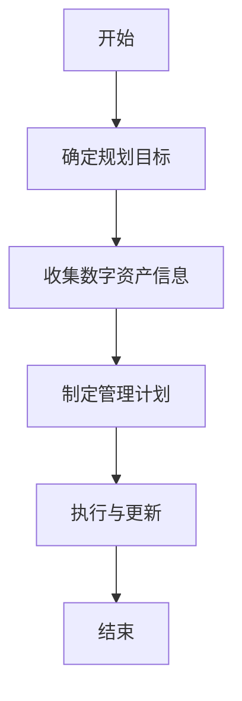

                 

# 文章标题：数字化遗产管理创业：生前数字资产规划

> 关键词：数字化遗产管理、生前数字资产规划、数字资产分类、法律问题、创业机会

> 摘要：随着数字化时代的到来，数字遗产管理成为了一个日益重要的议题。本文旨在探讨数字化遗产管理的相关概念、生前数字资产规划的重要性、数字遗产管理的挑战以及法律问题，最后分析数字遗产管理创业的机遇与挑战，为读者提供一整套关于数字化遗产管理的全面指南。

## 第一部分：引言

### 1.1 数字化遗产的概念与重要性

随着互联网和数字技术的发展，数字遗产（Digital Estate）逐渐成为一个热门话题。数字化遗产指的是个人或企业在离世后遗留的数字资产，包括但不限于电子邮件、社交媒体账号、在线银行账户、数字货币、电子文档等。这些数字资产在现代社会中扮演着越来越重要的角色，因此，数字化遗产管理变得尤为关键。

首先，数字化遗产的重要性体现在信息的重要性。现代社会中，大量的个人信息和重要数据都储存在数字设备中，这些信息可能涉及到个人的隐私、财产、身份验证等关键信息。如果不进行妥善管理，这些信息可能会被滥用或丢失，造成不可挽回的损失。

其次，数字化遗产管理有助于解决遗产继承问题。随着数字化生活的普及，个人和企业在数字世界中的财产和权益也逐渐明确。生前数字资产规划可以帮助个人和企业预先安排数字资产的继承和处理方式，减少遗产继承过程中的纠纷和不便。

### 1.2 生前数字资产规划的基本原则

生前数字资产规划是数字化遗产管理的重要环节。以下是进行生前数字资产规划时需要遵循的基本原则：

1. **全面性**：规划应涵盖所有可能的数字资产，包括常见的社交媒体账号、在线购物账户、电子邮件等，以及可能被忽视的数字货币、电子文档等。

2. **安全性**：数字资产的安全性是规划中的重中之重。需要确保所有数字资产的信息安全，避免信息泄露或被黑客攻击。

3. **可执行性**：规划应该具体、明确，确保在个人去世后能够顺利执行。这包括提供访问权限、密码管理、资产转移步骤等。

4. **法律合规性**：数字遗产管理需要遵循相关法律法规，确保遗产管理的合法性。

5. **更新与维护**：数字资产是动态的，随着时间和环境的变化，规划需要不断更新和维护。

### 1.3 本书结构安排与学习目标

本文将分为七个部分，旨在为读者提供一套全面的数字化遗产管理指南。具体结构安排如下：

1. **第一部分：引言**：介绍数字化遗产管理的概念和重要性，阐述生前数字资产规划的基本原则。
2. **第二部分：数字化遗产管理的基础知识**：探讨数字资产的分类与属性、数字遗产管理的挑战。
3. **第三部分：生前数字资产规划**：详细讲解个人和企业生前数字资产规划的步骤和方法。
4. **第四部分：数字遗产管理的法律问题**：分析数字遗产管理的法律法规和继承问题。
5. **第五部分：数字遗产管理的工具与技术**：介绍数字遗产管理工具和技术的应用。
6. **第六部分：数字遗产管理创业**：探讨数字遗产管理创业的机遇与挑战。
7. **第七部分：未来展望**：分析数字遗产管理的发展趋势和可持续发展。

通过本文的学习，读者将能够：

- **理解数字化遗产管理的概念和重要性**。
- **掌握生前数字资产规划的方法和原则**。
- **了解数字遗产管理的法律问题和工具技术**。
- **探讨数字遗产管理创业的机遇与挑战**。

### 1.4 Mermaid 流程图：数字化遗产管理规划步骤

下面是一个简单的 Mermaid 流程图，展示了数字化遗产管理规划的步骤：



### 1.5 核心概念与联系

为了更好地理解数字化遗产管理，我们需要明确以下几个核心概念及其关系：

- **数字遗产（Digital Estate）**：指个人或企业在离世后遗留的数字资产。
- **生前数字资产规划（Pre-Death Digital Asset Planning）**：指在生前对数字资产进行规划和管理，以确保遗产能够顺利继承。
- **数字资产（Digital Asset）**：指储存在数字设备中的各种信息，如电子邮件、社交媒体账号、数字货币等。
- **数字遗产管理（Digital Estate Management）**：指对数字遗产进行收集、整理、保护和转移的一系列行为。

这些概念之间的关系可以总结为：数字遗产是生前数字资产规划和管理的基础，而数字资产则是构成数字遗产的核心元素。

### 1.6 核心算法原理讲解

在数字化遗产管理中，核心算法原理主要涉及数据加密和访问控制。以下是这两个核心算法原理的伪代码说明：

#### 数据加密

```python
def encrypt_data(data, key):
    # 使用AES算法加密数据
    encrypted_data = aes_encrypt(data, key)
    return encrypted_data
```

#### 访问控制

```python
def grant_access(account, user, key):
    # 检查用户是否具有访问权限
    if user in account['access_list']:
        # 允许访问
        return "Access granted"
    else:
        # 拒绝访问
        return "Access denied"
```

通过这些核心算法原理，我们可以确保数字资产在转移过程中保持安全，同时只有授权用户才能访问特定的数字资产。

### 1.7 数学模型和公式

在数字化遗产管理中，常用的数学模型包括概率模型和决策树模型。以下是一个简单的概率模型公式，用于评估数字遗产的风险：

$$
P(Risk) = \sum_{i=1}^{n} P(A_i) \cdot P(B_i|A_i)
$$

其中，$P(A_i)$表示第$i$种风险事件发生的概率，$P(B_i|A_i)$表示在发生第$i$种风险事件后，损失发生的概率。

### 1.8 详细讲解和举例说明

假设一位个人在生前进行了数字资产规划，其中包括电子邮件、社交媒体账号和数字货币等。以下是具体步骤的详细讲解和举例说明：

1. **确定规划目标**：例如，确保电子邮件在去世后能够自动转发给指定的联系人，社交媒体账号能够被注销或转移。

2. **收集数字资产信息**：整理所有数字资产的信息，包括用户名、密码、访问权限等。

3. **制定管理计划**：例如，使用加密技术保护数字货币，设置访问控制列表以限制社交媒体账号的访问。

4. **执行与更新**：定期检查和更新数字资产信息，确保规划的有效性。

### 1.9 小结

通过以上步骤，我们可以看到数字化遗产管理的重要性和必要性。只有通过科学的生前数字资产规划，才能确保数字遗产在个人去世后得到妥善管理，减少纠纷和损失。

## 第二部分：数字化遗产管理的基础知识

### 2.1 数字资产的分类与属性

数字资产可以分为个人数字资产和企业数字资产两大类。这两类数字资产在性质、用途和法律地位上有所不同。

#### 2.1.1 个人数字资产概述

个人数字资产通常包括以下几类：

1. **社交媒体账号**：如Facebook、Twitter、Instagram等。
2. **电子邮件账号**：个人邮件服务，如Gmail、Outlook等。
3. **在线购物账户**：如Amazon、淘宝等。
4. **数字货币**：如比特币、以太坊等。
5. **电子文档**：包括Word文档、PDF文件、PPT演示文稿等。
6. **在线存储服务**：如Google Drive、Dropbox等。

个人数字资产通常与个人隐私、身份验证和财产权益密切相关。例如，社交媒体账号可能包含大量个人隐私信息，电子邮件账号可能包含个人重要文件和联系信息，数字货币则是个人财产的一部分。

#### 2.1.2 企业数字资产概述

企业数字资产包括以下几类：

1. **客户数据**：包括客户名单、交易记录、市场调查等。
2. **知识产权**：如专利、商标、版权等。
3. **在线业务平台**：如电子商务网站、社交媒体平台等。
4. **数据库**：存储企业关键业务数据的数据库系统。
5. **软件资产**：包括企业自有的软件程序、源代码等。

企业数字资产通常涉及企业的核心业务和商业机密，因此其管理更为复杂，需要严格的安全和合规措施。

#### 2.1.3 数字资产的法律地位

数字资产的法律地位在不同的国家和地区可能有所不同，但普遍认为它们具有以下法律属性：

1. **财产权**：数字资产被视为个人和企业财产的一部分，享有财产权的保护和继承权。
2. **身份权**：数字资产与个人身份密切相关，如社交媒体账号、电子邮件等。
3. **知识产权**：数字资产中可能包含知识产权，如专利、商标、版权等。

在全球范围内，许多国家已经开始制定相关法律法规来保护数字资产，例如美国《数字千年版权法案》（DMCA）、欧盟《一般数据保护条例》（GDPR）等。这些法律法规为数字资产的管理和继承提供了法律依据。

### 2.2 数字遗产管理的挑战

数字遗产管理面临诸多挑战，这些挑战主要涉及数据隐私与安全、法律法规、技术发展等方面。

#### 2.2.1 数据隐私与安全问题

数据隐私与安全问题始终是数字遗产管理的核心挑战之一。数字资产中包含大量个人敏感信息，如身份信息、通信记录、财务信息等。如果这些信息没有得到妥善保护，可能会导致个人隐私泄露、财产损失甚至身份盗窃。

- **隐私泄露**：未经授权的访问者可能会获取并滥用数字资产中的隐私信息。
- **安全漏洞**：数字资产系统可能存在漏洞，被黑客攻击、恶意软件感染。

#### 2.2.2 法律法规与政策框架

数字遗产管理需要遵循相关法律法规和政策框架，但各国在此方面的法律法规存在差异。一些国家尚未明确数字遗产的法律地位和继承规则，这可能导致数字遗产在继承过程中出现纠纷。

- **跨境法律冲突**：在跨国数字遗产继承中，不同国家的法律可能存在冲突，导致处理过程复杂化。
- **法律法规滞后**：随着数字技术的快速发展，现有法律法规可能无法及时适应新兴数字遗产管理需求。

#### 2.2.3 技术发展与趋势分析

技术的发展对数字遗产管理提出了新的挑战和机遇。例如，区块链技术和人工智能技术的应用为数字遗产管理提供了新的解决方案，但同时也带来了新的技术风险和伦理问题。

- **技术进步**：新的存储和加密技术可以提高数字资产的安全性，但也增加了管理复杂性。
- **伦理问题**：随着数字技术的发展，数字遗产管理可能涉及道德和伦理问题，如数据隐私、知识产权等。

### 2.3 数字遗产管理技术的发展趋势

随着技术的不断进步，数字遗产管理技术也在不断发展。以下是一些主要的发展趋势：

- **区块链技术**：区块链技术可以为数字遗产管理提供透明、安全和去中心化的解决方案。例如，使用智能合约自动执行数字遗产的转移和继承。
- **加密技术**：加密技术可以保护数字资产的安全性，确保只有授权用户可以访问。
- **人工智能**：人工智能技术可以自动化数字遗产的管理和继承过程，提高效率。
- **云计算**：云计算技术可以提供高效、可扩展的数字资产存储和备份解决方案。

总之，数字遗产管理是一项复杂且具有挑战性的任务，需要综合考虑技术、法律和隐私等多方面因素。随着技术的不断进步，数字遗产管理技术也将不断演进，为个人和企业提供更加安全、高效的管理方案。

### 2.4 个人与企业数字遗产管理的区别

个人数字遗产管理与企业数字遗产管理在许多方面存在显著差异。以下是个人与企业数字遗产管理的对比：

#### 1. **定义与范围**

- **个人数字遗产**：指的是个人在去世后遗留的数字资产，包括社交媒体账号、电子邮件、数字货币、电子文档等。
- **企业数字遗产**：指的是企业在解散或创始人去世后遗留的数字资产，包括客户数据、知识产权、在线业务平台、数据库、软件资产等。

#### 2. **管理复杂度**

- **个人数字遗产**：个人数字遗产管理相对简单，主要涉及少量账号和文件。
- **企业数字遗产**：企业数字遗产管理较为复杂，涉及大量数据、业务系统和商业机密，需要专业的管理和合规流程。

#### 3. **法律法规**

- **个人数字遗产**：个人数字遗产管理通常遵循国家关于个人财产的法律规定，例如遗嘱继承、遗产税等。
- **企业数字遗产**：企业数字遗产管理需遵循公司法和商业法律，涉及商业秘密保护、数据隐私、客户数据转移等问题。

#### 4. **安全性要求**

- **个人数字遗产**：个人数字遗产通常涉及个人隐私和财产信息，需要保护账号安全、防止隐私泄露。
- **企业数字遗产**：企业数字遗产涉及商业机密和客户数据，需要高度的安全保护措施，包括数据加密、访问控制等。

#### 5. **技术需求**

- **个人数字遗产**：个人数字遗产管理技术相对简单，主要依赖密码管理、数据备份等。
- **企业数字遗产**：企业数字遗产管理技术要求更高，需要利用云计算、区块链、人工智能等技术，确保数据安全和业务连续性。

### 2.5 案例分析

#### 个人数字遗产管理案例

李先生在生前制定了详细的数字遗产规划。他使用了密码管理工具来存储和备份所有账号的密码，并在遗嘱中指定了继承人。在去世后，家人根据遗嘱顺利访问并管理了他的数字资产，避免了隐私泄露和财产纠纷。

#### 企业数字遗产管理案例

某科技公司在创始人去世后，面临客户数据保护、商业机密泄露等挑战。公司制定了详细的数据备份和转移计划，并使用了区块链技术确保数据的安全性和透明性。通过这些措施，公司成功保护了客户数据和商业秘密，确保了业务的连续性。

这些案例表明，无论是个人还是企业，有效的数字遗产管理都是确保数字资产安全、顺利继承的关键。

## 第三部分：生前数字资产规划

### 3.1 规划前的准备工作

进行生前数字资产规划是确保数字遗产在个人去世后能够得到妥善管理和继承的重要步骤。以下是进行规划前的准备工作：

#### 3.1.1 确定规划目标与范围

首先，需要明确规划的目标和范围。例如，保护隐私、确保资产的继承、维持业务的连续性等。对于个人而言，可能关注的是社交媒体账号的转移、电子邮件的备份和数字货币的存储；对于企业，可能涉及客户数据的管理、知识产权的转移和业务系统的维护。

#### 3.1.2 收集与管理数字资产信息

收集所有数字资产的信息是规划的基础。这包括以下内容：

- **账号信息**：列出所有账号（如社交媒体、电子邮件、在线购物等）的用户名和密码。
- **重要文件**：收集电子文档、照片、视频等重要文件。
- **财产信息**：记录数字货币、在线银行账户、投资账户等财产信息。
- **业务信息**：对于企业，需要收集客户数据、商业合同、知识产权等业务信息。

收集到这些信息后，可以使用密码管理工具、电子文档管理软件等进行分类和存储，确保信息的完整性和安全性。

#### 3.1.3 制定数字遗产管理计划

数字遗产管理计划是规划的核心。这个计划应该明确以下内容：

- **管理步骤**：包括资产的收集、备份、转移等具体操作步骤。
- **访问权限**：指定谁能访问哪些资产，以及如何分配访问权限。
- **执行时间**：规划何时开始执行，以及如何确保计划在个人去世后能够顺利执行。
- **法律合规**：确保规划符合相关法律法规，例如遗嘱、隐私保护等。

#### 3.1.4 设立紧急联系人

在规划中，设立紧急联系人是必要的。紧急联系人可以在个人无法处理事务时代表处理，确保数字资产在紧急情况下能够得到妥善管理。

#### 3.1.5 定期更新与维护

数字资产是动态变化的，因此，规划需要定期更新和维护。这包括：

- **密码更新**：定期更改密码，确保账户安全。
- **信息更新**：更新数字资产的信息，如新的账号、财产变动等。
- **法律合规检查**：定期检查规划是否符合最新法律法规。

### 3.2 个人生前数字资产规划

个人生前数字资产规划的具体步骤如下：

#### 3.2.1 创建个人数字遗产档案

创建个人数字遗产档案是规划的第一步。这个档案应包括以下内容：

- **基本信息**：包括姓名、出生日期、身份证号码、紧急联系人等。
- **数字资产清单**：列出所有数字资产（如社交媒体账号、电子邮件、在线购物账户、数字货币等），并记录用户名和密码。
- **重要文件**：包括电子文档、照片、视频等。
- **财产信息**：包括在线银行账户、投资账户等财产信息。

这个档案可以使用密码管理工具存储，并确保只有授权人员可以访问。

#### 3.2.2 处理社交媒体账号

社交媒体账号是个人数字资产中的重要部分。在规划中，需要考虑以下问题：

- **账号转移**：如果希望账号在去世后由他人继承，可以通过平台提供的转移功能进行操作。
- **账号保留**：如果希望账号保留，需要确保账号密码安全，防止未经授权的访问。
- **账号注销**：如果不再使用某个账号，可以通过平台提供的注销功能进行注销。

#### 3.2.3 管理数字货币与虚拟财产

数字货币和虚拟财产（如游戏币、NFT等）是新兴的数字资产。在规划中，需要考虑以下问题：

- **钱包管理**：确保钱包（用于存储数字货币）的安全，使用多因素认证、备份私钥等措施。
- **财产转移**：如果希望数字货币在去世后由他人继承，可以通过平台提供的转移功能进行操作。
- **法律合规**：了解数字货币和虚拟财产的法律地位，确保财产转移合法。

#### 3.2.4 遗嘱与法律文件

制定遗嘱和法律文件是确保数字资产顺利继承的关键。在规划中，需要考虑以下问题：

- **遗嘱**：在遗嘱中明确数字资产的分配和转移方式。
- **授权书**：如果需要他人代表处理数字资产，可以签订授权书。
- **法律咨询**：在制定遗嘱和法律文件时，最好咨询专业律师，确保合法有效。

### 3.3 企业生前数字资产规划

企业生前数字资产规划需要更复杂的步骤和更专业的管理。以下是企业规划的具体步骤：

#### 3.3.1 确定企业数字资产的管理体系

企业需要建立一套完整的数字资产管理体系，包括以下内容：

- **资产清单**：详细列出所有数字资产，包括客户数据、知识产权、业务系统等。
- **访问控制**：制定严格的访问控制策略，确保只有授权人员可以访问关键资产。
- **安全措施**：采取加密、备份、监控等安全措施，保护数字资产的安全。

#### 3.3.2 制定企业数字遗产管理策略

企业数字遗产管理策略应包括以下内容：

- **管理流程**：明确数字资产的收集、备份、转移等具体流程。
- **角色分配**：指定不同角色的责任，确保在突发情况下有人能够及时处理事务。
- **应急计划**：制定应急预案，确保在关键人员去世或离职时，业务可以继续运作。

#### 3.3.3 遗产转移与风险控制

企业在规划中需要考虑以下问题：

- **遗产转移**：明确数字资产的继承方式和转移步骤，确保在创始人去世后，业务可以平稳过渡。
- **风险控制**：评估可能出现的风险，并制定相应的控制措施，如数据泄露、财产纠纷等。

### 3.4 案例分析

#### 个人数字遗产规划案例

张先生是一位数字营销专家，他在生前制定了详细的数字遗产规划。他创建了一个数字遗产档案，列出了所有社交媒体账号、电子邮件和数字货币的信息。他还在遗嘱中指定了继承人，并签订了授权书，确保在去世后，他的数字资产能够顺利转移。

#### 企业数字遗产规划案例

某科技公司在创始人去世后，面临数字资产转移和业务连续性的挑战。公司在生前制定了详细的数字遗产管理计划，包括资产清单、访问控制策略和安全措施。在创始人去世后，公司顺利完成了数字资产的转移，确保了业务的连续性。

这些案例表明，无论是个人还是企业，通过科学的生前数字资产规划，可以确保数字遗产在去世后得到妥善管理和继承。

## 第四部分：数字遗产管理的法律问题

### 4.1 数字遗产管理的法律法规

数字遗产管理的法律问题在近年来逐渐受到各国法律体系的关注和重视。随着数字化生活的普及，数字遗产的范围和重要性日益增加，因此，制定和完善数字遗产管理的法律法规成为各国立法的重要任务。

#### 4.1.1 国际视野下的数字遗产法律框架

在国际上，许多国家和地区已经开始制定相关法律法规，以应对数字遗产管理中的法律问题。以下是一些具有代表性的国家和地区的法律框架：

1. **美国**：美国在数字遗产管理方面较为先进，主要依赖于《数字千年版权法案》（DMCA）和《电子通信隐私法》（ECPA）。这些法律为数字遗产的访问和控制提供了一定的法律依据，但具体的执行细节仍需依赖各平台的服务协议。

2. **欧盟**：欧盟在《一般数据保护条例》（GDPR）中，对数字遗产的管理进行了规定。GDPR要求在个人去世后，其数字资产的管理必须得到明确授权，否则平台不得随意访问或删除相关数据。

3. **英国**：英国在《数字遗产法》（Digital Heritage Act）中，明确了数字遗产的定义和继承规则。该法案规定，数字遗产与实物遗产一样，应当纳入遗产继承范围，并由遗嘱执行人负责处理。

4. **日本**：日本在《个人信息保护法》和《数字遗产管理指南》中，对数字遗产管理进行了规定。日本法律强调，个人在生前应当明确数字遗产的继承人，并赋予继承人合法的访问权限。

#### 4.1.2 我国数字遗产管理的法律法规

在我国，数字遗产管理的法律法规也在逐步完善中。以下是我国当前数字遗产管理相关的主要法律法规：

1. **《民法典》**：我国《民法典》在继承编中，首次明确了数字遗产的法律地位。根据《民法典》的规定，数字遗产应纳入遗产继承范围，并由继承人依法继承。

2. **《网络安全法》**：我国《网络安全法》对网络数据和信息的保护进行了规定，为数字遗产的安全管理提供了法律依据。

3. **《个人信息保护法》**：我国《个人信息保护法》对个人信息的保护进行了全面规定，包括个人在去世后其信息的处理和继承。

4. **《互联网信息服务管理办法》**：该办法规定了互联网信息服务提供者的信息安全管理责任，为数字遗产管理提供了具体操作规范。

#### 4.1.3 数字遗产法律争议案例分析

在实际操作中，数字遗产管理往往涉及到诸多法律争议，以下是一些典型案例：

1. **案例一**：某人在去世后，其社交媒体账号被其前女友擅自关闭。前女友认为账号属于共同财产，有权关闭。但继承人认为账号属于数字遗产，应当纳入遗产继承范围。最终，法院判决账号应归继承人所有，前女友无权擅自关闭。

2. **案例二**：某企业创始人在去世后，其数字资产的管理引发股东之间的争议。部分股东认为数字资产应当由董事会管理，而另一些股东则认为应当由继承人直接管理。最终，法院判决数字资产的管理权应当由董事会行使，但继承人有权监督和管理。

这些案例表明，数字遗产管理中的法律问题复杂且多样，需要根据实际情况进行具体分析和处理。

### 4.2 数字遗产的继承与分配

数字遗产的继承与分配是数字遗产管理中的重要环节。如何确保数字遗产能够顺利继承和分配，是各国法律和社会关注的焦点。

#### 4.2.1 数字遗产继承的法律规定

在不同国家和地区的法律中，数字遗产的继承规定有所不同。以下是一些主要法律规定：

1. **美国**：美国法律允许数字遗产通过遗嘱进行继承。在无遗嘱的情况下，数字遗产将按照法律规定进行法定继承。

2. **欧盟**：欧盟在GDPR中规定，个人有权在生前指定数字遗产的继承人。如果个人未做出明确指定，则数字遗产将按照《继承法》进行继承。

3. **我国**：我国《民法典》规定，数字遗产应纳入遗产继承范围，由继承人依法继承。继承人包括配偶、子女、父母等。

#### 4.2.2 数字遗产分配的争议与解决

数字遗产分配过程中，可能出现的争议主要包括：

1. **继承份额**：不同继承人之间可能对数字遗产的分配份额产生争议。解决方法包括协商、调解或诉讼。

2. **管理权**：数字遗产的管理权可能引发争议，特别是在多人共同继承时。解决方法包括明确管理权归属或设立信托。

3. **隐私权**：数字遗产中的个人隐私信息可能引发争议，特别是在处理社交媒体账号和电子邮件时。解决方法包括遵守隐私保护法律和协议。

#### 4.2.3 实例解析：数字遗产继承纠纷案例

以下是一个数字遗产继承纠纷的案例：

某人在去世后，其社交媒体账号和电子邮件被其子女和配偶争夺。子女认为账号和邮件属于共同财产，有权继承和使用；而配偶则认为账号和邮件属于个人隐私，应当由其继承。法院最终判决，社交媒体账号和电子邮件应归配偶所有，但子女有权访问和处理相关事务。

### 4.3 数字遗产管理的未来趋势

随着数字化生活的不断深入，数字遗产管理将面临新的挑战和机遇。以下是数字遗产管理的一些未来趋势：

1. **技术进步**：随着区块链、人工智能等技术的应用，数字遗产管理将更加安全、高效和透明。

2. **法律完善**：各国将继续完善数字遗产管理的法律法规，为数字遗产的继承和分配提供更明确的法律依据。

3. **行业规范**：数字遗产管理行业将逐步形成规范，提高专业服务水平。

4. **社会关注**：数字遗产管理将逐渐成为社会关注的焦点，公众对数字遗产管理的认识和需求将不断提高。

总之，数字遗产管理是一项复杂且具有挑战性的任务，需要法律、技术和社会的共同努力。通过完善法律法规、推广技术应用和提升公众意识，我们可以更好地应对数字遗产管理中的各种挑战。

### 4.4 数字遗产管理中的伦理问题

数字遗产管理不仅涉及法律和技术问题，还涉及到伦理和道德层面的考量。以下是一些数字遗产管理中常见的伦理问题：

1. **隐私保护**：数字遗产中包含大量个人隐私信息，如何保护这些信息在遗产继承过程中不被滥用，是一个重要的伦理问题。

2. **知情权**：在处理数字遗产时，继承人是否有权了解遗产的详细信息，例如账户余额、邮件内容等，这涉及到知情权和隐私权的平衡。

3. **情感影响**：数字遗产管理可能对继承人产生情感上的影响，例如社交媒体账号的关闭或电子邮件的访问可能引发情感困扰。

4. **文化差异**：不同文化背景下的数字遗产管理方式可能存在差异，如何尊重和适应这些差异，是一个伦理挑战。

### 4.5 数字遗产管理中的最佳实践

为了确保数字遗产管理的顺利进行，以下是一些最佳实践建议：

1. **明确规划**：在生前制定详细的数字遗产规划，明确数字资产的继承人和管理方式。

2. **使用密码管理工具**：使用密码管理工具存储和管理账号密码，确保信息安全。

3. **法律咨询**：在制定数字遗产规划时，咨询专业律师，确保合法有效。

4. **备份与加密**：定期备份数字资产，并对敏感信息进行加密处理。

5. **通知继承人**：在生前通知继承人关于数字遗产规划的具体内容，确保在去世后能够顺利执行。

6. **遵守法律法规**：确保数字遗产管理遵守相关法律法规，减少法律风险。

通过遵循这些最佳实践，个人和企业可以更好地管理数字遗产，确保数字资产在去世后得到妥善处理和继承。

### 4.6 总结

数字遗产管理是数字化时代的一个重要议题，涉及到法律、技术、伦理等多个方面。通过完善法律法规、推广技术应用和提升公众意识，我们可以更好地应对数字遗产管理中的各种挑战。同时，遵循最佳实践，制定明确的数字遗产规划，是确保数字遗产顺利继承和管理的关键。

## 第五部分：数字遗产管理的工具与技术

### 5.1 数字遗产管理工具介绍

数字遗产管理的复杂性要求我们使用一系列专业的工具和技术来确保管理的有效性。以下是一些常用的数字遗产管理工具及其功能：

#### 5.1.1 密码管理工具

密码管理工具是数字遗产管理中不可或缺的工具，它可以帮助用户安全地存储和管理密码。例如：

- **1Password**：支持多平台，能够生成强密码、自动填充密码，并提供安全的共享功能。
- **LastPass**：提供免费的密码管理服务，同时支持高级功能如身份验证、紧急访问等。

#### 5.1.2 数字遗产管理软件

专门的数字遗产管理软件可以帮助用户全面管理其数字资产，包括账号、文档、财产等。以下是一些典型的软件：

- **Legacy Locker**：允许用户创建数字遗产档案，指定继承人，并提供自动执行功能。
- **Mirror Box**：支持多种数字资产的备份和恢复，用户可以设置访问权限和转移步骤。

#### 5.1.3 云存储服务

云存储服务为数字遗产的备份和存储提供了便利。以下是一些常用的云存储服务：

- **Google Drive**：提供大容量的云存储空间，用户可以方便地共享文件。
- **Dropbox**：支持多种设备同步，方便用户随时访问和备份文件。

#### 5.1.4 加密工具

加密工具在数字遗产管理中用于保护敏感信息，确保数据在传输和存储过程中不被泄露。以下是一些常用的加密工具：

- ** VeraCrypt**：一款开源的磁盘加密工具，支持创建虚拟加密磁盘和容器。
- **BitLocker**：Windows系统自带的磁盘加密功能，可以用于加密整个硬盘或特定的文件。

#### 5.1.5 区块链工具

区块链技术在数字遗产管理中的应用日益广泛，它可以提供透明、安全和去中心化的解决方案。以下是一些区块链工具：

- **Ethereum**：一个去中心化的区块链平台，支持智能合约，用户可以创建和执行数字遗产管理的智能合约。
- **Polymath**：一个专注于数字资产证券化的区块链平台，可以帮助用户管理和交易数字资产。

#### 5.1.6 数据同步和备份工具

数据同步和备份工具可以确保数字资产的安全性和可访问性。以下是一些常用的工具：

- **CrashPlan**：支持远程备份和同步，用户可以根据需求设置自动备份时间。
- **Backblaze**：提供简单的备份解决方案，支持多种设备的备份和恢复。

#### 5.1.7 人工智能工具

人工智能技术可以自动化数字遗产的管理和继承过程，提高效率。以下是一些人工智能工具：

- **IBM Watson**：提供智能助理服务，可以帮助用户自动化数字遗产的管理任务。
- **Savvy.co**：一款基于人工智能的数字遗产管理工具，可以自动识别数字资产并提供管理建议。

### 5.2 常见数字遗产管理工具推荐

以下是根据功能和应用场景推荐的几种数字遗产管理工具：

1. **密码管理工具**：
   - **1Password**：适合需要全面密码管理解决方案的用户。
   - **LastPass**：适合预算有限的用户，功能全面且免费。

2. **数字遗产管理软件**：
   - **Legacy Locker**：适合需要创建数字遗产档案并设置自动执行功能的用户。
   - **Mirror Box**：适合需要全面数字资产备份和管理的用户。

3. **云存储服务**：
   - **Google Drive**：适合需要大容量存储空间和方便共享的用户。
   - **Dropbox**：适合需要跨设备同步文件的用户。

4. **加密工具**：
   - **VeraCrypt**：适合需要本地加密解决方案的用户。
   - **BitLocker**：适合使用Windows系统的用户。

5. **区块链工具**：
   - **Ethereum**：适合需要智能合约解决方案的用户。
   - **Polymath**：适合需要数字资产证券化的用户。

6. **数据同步和备份工具**：
   - **CrashPlan**：适合需要远程备份和自动同步的用户。
   - **Backblaze**：适合需要简单备份解决方案的用户。

7. **人工智能工具**：
   - **IBM Watson**：适合需要自动化数字遗产管理任务的用户。
   - **Savvy.co**：适合需要智能建议和自动管理的用户。

### 5.3 工具的使用技巧与注意事项

在使用数字遗产管理工具时，以下是一些使用技巧和注意事项：

1. **密码安全性**：使用强密码和多因素认证，确保密码管理工具本身的安全。
2. **定期更新**：定期更新密码管理工具和其他数字遗产管理工具，确保使用的是最新版本。
3. **备份与恢复**：定期备份数字资产，确保在发生意外时可以快速恢复。
4. **权限管理**：合理设置访问权限，确保只有授权人员可以访问敏感信息。
5. **数据加密**：对敏感信息进行加密处理，防止数据泄露。
6. **隐私保护**：在处理数字遗产时，尊重隐私保护法律和道德规范。
7. **法律合规**：确保数字遗产管理工具和流程符合相关法律法规。

通过遵循这些技巧和注意事项，用户可以更有效地使用数字遗产管理工具，确保数字遗产的安全和管理。

### 5.4 加密技术的作用与实现

加密技术在数字遗产管理中扮演着至关重要的角色，其主要作用是确保数字资产在传输和存储过程中不被未经授权的访问者获取。以下是加密技术的基本原理、常用算法及其在数字遗产管理中的应用：

#### 5.4.1 加密技术的基本原理

加密技术通过将明文转换为密文，确保数据在传输和存储过程中不被泄露。加密的基本原理包括：

- **加密算法**：加密算法是一种将明文转换为密文的数学过程。常见的加密算法有对称加密算法（如AES、DES）和非对称加密算法（如RSA、ECC）。
- **密钥管理**：密钥是加密和解密过程中的关键要素。对称加密使用相同的密钥进行加密和解密，而非对称加密则使用公钥和私钥对。

#### 5.4.2 常用的加密算法

- **对称加密算法**：对称加密算法使用相同的密钥进行加密和解密，速度较快，适用于大规模数据的加密。常见的对称加密算法包括AES（高级加密标准）和DES（数据加密标准）。

  ```python
  from Crypto.Cipher import AES
  
  key = b'mysecretkey12345'  # 16字节密钥
  cipher = AES.new(key, AES.MODE_CBC)
  encrypted_data = cipher.encrypt(data)
  ```

- **非对称加密算法**：非对称加密算法使用一对公钥和私钥，公钥用于加密，私钥用于解密。非对称加密适用于安全传输密钥和敏感信息。常见的非对称加密算法包括RSA和ECC。

  ```python
  from Crypto.PublicKey import RSA
  
  key = RSA.generate(2048)
  public_key = key.publickey().export_key()
  private_key = key.export_key()
  
  encrypted_data = pow(message, public_key.e, public_key.n)
  ```

#### 5.4.3 加密技术在数字遗产管理中的应用

- **账户密码加密**：数字遗产管理工具可以使用对称加密算法对账户密码进行加密存储，确保密码在存储过程中不被泄露。

  ```python
  from Crypto.Cipher import AES
  
  key = b'mysecretkey12345'  # 16字节密钥
  cipher = AES.new(key, AES.MODE_CBC)
  encrypted_password = cipher.encrypt(password)
  ```

- **数据传输加密**：在进行数字资产传输时，可以使用非对称加密算法确保数据在传输过程中不被窃取。

  ```python
  from Crypto.PublicKey import RSA
  
  public_key = RSA.import_key(pem_file.read())
  encrypted_data = pow(message, public_key.e, public_key.n)
  ```

- **文件加密**：对于重要文件和文档，可以使用对称加密算法进行加密存储，确保文件在备份和恢复过程中不被泄露。

  ```python
  from Crypto.Cipher import AES
  
  key = b'mysecretkey12345'  # 16字节密钥
  cipher = AES.new(key, AES.MODE_CBC)
  encrypted_file = cipher.encrypt(file_content)
  ```

通过这些加密技术，数字遗产管理工具可以提供有效的安全保护，确保数字资产在生前和去世后都能得到妥善管理。

### 5.5 区块链技术在数字遗产管理中的应用

区块链技术以其透明性、安全性和不可篡改性，逐渐成为数字遗产管理的重要工具。以下将探讨区块链技术的基本原理、技术优势以及在数字遗产管理中的应用：

#### 5.5.1 区块链技术的基本原理

区块链技术是一种去中心化的分布式数据库技术，通过将数据分散存储在多个节点上，确保数据的安全性和不可篡改性。区块链的核心组成部分包括：

- **区块**：区块是区块链的基本单元，包含一定数量的交易记录。
- **链**：链是由多个区块按照时间顺序连接而成的链条。
- **共识算法**：共识算法是区块链网络中的节点达成共识的机制，确保所有节点对数据的一致性。
- **智能合约**：智能合约是区块链上的自动化执行协议，可以根据预设的条件自动执行合同条款。

#### 5.5.2 区块链技术在数字遗产管理中的应用

区块链技术在数字遗产管理中的应用主要体现在以下几个方面：

1. **数字身份认证**：区块链技术可以提供数字身份认证服务，确保个人身份在数字世界中的唯一性和不可篡改性。在数字遗产管理中，使用区块链身份认证可以确保继承人的身份真实有效，防止身份欺诈。

2. **数字遗嘱验证**：区块链技术可以用于数字遗嘱的验证和管理。通过将数字遗嘱存储在区块链上，并使用加密技术和智能合约技术确保遗嘱的不可篡改性，继承人可以在去世后快速验证遗嘱的有效性，并按照遗嘱执行数字资产的分配。

3. **自动化遗产分配**：智能合约可以用于自动化数字遗产的分配过程。在数字遗嘱中，可以预设遗产分配的条件和规则，当触发条件时，智能合约将自动执行遗产分配，确保分配过程的透明性和公正性。

4. **数字资产跟踪**：区块链技术可以用于跟踪和管理数字资产。例如，通过区块链技术可以实现对数字货币、虚拟财产等的实时监控，确保数字资产在转移过程中的透明性和安全性。

5. **隐私保护**：区块链技术可以提供去中心化的隐私保护方案，确保个人隐私信息在数字遗产管理中的安全。通过零知识证明等技术，可以在不泄露个人信息的前提下验证信息的真实性。

#### 5.5.3 区块链技术在数字遗产管理中的优势

- **安全性**：区块链技术具有高度的安全性，数据在区块链上存储后几乎无法被篡改，确保数字遗产的安全性。
- **透明性**：区块链上的数据是公开透明的，所有交易记录都可以被追踪和验证，提高数字遗产管理过程的透明度。
- **去中心化**：区块链技术去中心化的特性，避免了单一节点失效带来的风险，确保数字遗产管理的连续性和稳定性。
- **自动化**：智能合约技术可以自动化执行数字遗产分配过程，提高管理效率，减少人为操作风险。

总之，区块链技术为数字遗产管理提供了新的解决方案，通过提高安全性、透明性和自动化程度，区块链技术有助于确保数字遗产在个人去世后得到妥善管理和继承。

### 5.6 自动化技术在数字遗产管理中的应用

自动化技术在数字遗产管理中起着至关重要的作用，通过自动化，可以显著提高管理效率，减少人为错误，确保遗产的顺利继承。以下是自动化技术在数字遗产管理中的应用：

#### 5.6.1 自动化备份与恢复

自动化备份是确保数字遗产安全性的基础。通过设置自动化备份任务，可以定期将数字资产备份到安全的位置，如云存储或本地存储设备。以下是一个使用Python脚本进行自动化备份的示例：

```python
import os
import shutil

def backup_directory(source_directory, target_directory):
    if not os.path.exists(target_directory):
        os.makedirs(target_directory)
    
    for filename in os.listdir(source_directory):
        source_path = os.path.join(source_directory, filename)
        target_path = os.path.join(target_directory, filename)
        
        if os.path.isfile(source_path):
            shutil.copy2(source_path, target_path)
            print(f"Copied {filename}")

source_directory = "path/to/source"
target_directory = "path/to/backup"
backup_directory(source_directory, target_directory)
```

#### 5.6.2 自动化执行遗产分配

通过智能合约，可以自动化执行数字遗产的分配过程。智能合约在区块链上预先设定好分配规则，当触发条件时，自动执行遗产分配。以下是一个简单的智能合约示例：

```solidity
// SPDX-License-Identifier: MIT
pragma solidity ^0.8.0;

contract DigitalEstate {
    address public owner;
    mapping(address => bool) public beneficiaries;

    constructor() {
        owner = msg.sender;
    }

    function addBeneficiary(address _beneficiary) external {
        require(msg.sender == owner, "Only owner can add beneficiaries");
        beneficiaries[_beneficiary] = true;
    }

    function distributeEstate() external {
        require(msg.sender == owner, "Only owner can distribute estate");
        for (address beneficiary : beneficiaries) {
            if (beneficiaries[beneficiary]) {
                payable(beneficiary).transfer(100);  // 分配100以太币
            }
        }
    }
}
```

#### 5.6.3 自动化通知与提醒

自动化通知和提醒可以确保在特定事件发生时及时通知相关继承人。例如，当数字资产备份完成或遗产分配开始时，可以通过电子邮件或短信通知继承人。以下是一个简单的Python脚本用于发送电子邮件提醒：

```python
import smtplib
from email.mime.text import MIMEText

def send_email(subject, message, to_email):
    smtp_server = "smtp.example.com"
    smtp_port = 587
    smtp_username = "your_email@example.com"
    smtp_password = "your_password"

    message = MIMEText(message)
    message['Subject'] = subject
    message['From'] = smtp_username
    message['To'] = to_email

    server = smtplib.SMTP(smtp_server, smtp_port)
    server.starttls()
    server.login(smtp_username, smtp_password)
    server.sendmail(smtp_username, to_email, message.as_string())
    server.quit()

send_email(
    "Backup Completed",
    "Your digital assets have been successfully backed up.",
    "beneficiary@example.com"
)
```

通过这些自动化技术，数字遗产管理可以变得更加高效和可靠，确保遗产在个人去世后能够得到及时、准确的管理和分配。

### 5.7 数字遗产管理工具使用技巧与注意事项

在使用数字遗产管理工具时，以下是一些实用技巧和注意事项，可以帮助用户更好地管理和保护数字资产：

1. **密码安全性**：使用强密码和多因素认证，确保工具本身的安全。定期更改密码，并避免使用易被猜测的密码。
2. **权限管理**：合理设置访问权限，确保只有授权人员可以访问敏感信息。避免将敏感信息共享给未经授权的人员。
3. **备份与恢复**：定期备份数字遗产信息，确保在发生数据丢失或损坏时可以迅速恢复。选择可靠的备份存储服务，并确保备份存储位置的安全性。
4. **数据加密**：对于敏感数据，使用加密工具进行加密处理，防止数据泄露。确保加密密钥的安全存储和备份。
5. **法律合规性**：确保数字遗产管理工具和流程符合相关法律法规，如隐私保护、数据安全等。
6. **工具更新**：定期更新数字遗产管理工具，确保使用的是最新版本，以获得最佳性能和安全防护。
7. **培训与教育**：为继承人提供必要的培训和指导，确保他们能够熟练使用数字遗产管理工具，并了解数字遗产的重要性。

通过遵循这些技巧和注意事项，用户可以更有效地管理和保护数字遗产，确保在个人去世后数字资产能够得到妥善处理和继承。

### 5.8 数字遗产管理工具的选择与评估

选择合适的数字遗产管理工具对于确保数字遗产的安全和管理至关重要。以下是一些关键因素和评估方法，帮助用户进行选择：

#### 5.8.1 关键因素

1. **安全性**：确保工具提供强大的安全措施，如加密、多因素认证、数据备份等。
2. **易用性**：工具应简单易用，用户界面友好，操作直观，便于继承人理解和使用。
3. **兼容性**：工具应兼容多种设备和操作系统，确保用户可以随时随地访问和管理数字资产。
4. **可靠性**：工具应具备高可靠性，能够稳定运行，减少故障和中断。
5. **成本效益**：综合考虑工具的价格、功能和服务，评估其成本效益。
6. **客户服务**：提供良好的客户服务，包括技术支持、用户培训、故障排除等。
7. **法律合规性**：工具应符合相关法律法规，如隐私保护、数据安全等。

#### 5.8.2 评估方法

1. **功能对比**：对比不同工具的功能，选择能够满足需求的工具。例如，查看工具是否支持多种数字资产的备份、加密、分配等功能。
2. **用户评价**：查看用户评价和反馈，了解工具的实用性和用户体验。
3. **安全性测试**：选择具有良好安全记录的工具，或进行安全性测试，确保工具的安全措施有效。
4. **试用体验**：通过试用工具，亲身体验其易用性和功能。
5. **成本预算**：根据预算评估工具的价格和服务，选择性价比高的工具。
6. **法律合规性审核**：确保工具符合相关法律法规，减少法律风险。

通过综合考虑这些因素和评估方法，用户可以做出明智的选择，选择最适合的数字遗产管理工具。

## 第六部分：数字遗产管理创业

### 6.1 数字遗产管理创业的机遇与挑战

随着数字化生活的普及，数字遗产管理成为一个新兴且充满机遇的市场。以下将分析数字遗产管理创业的机遇与挑战：

#### 6.1.1 创业环境分析

当前，数字遗产管理创业环境相对有利。首先，数字技术的快速发展为数字遗产管理提供了技术支持，如区块链、人工智能、加密技术等。这些技术能够提高数字遗产管理的安全性、透明性和自动化程度。其次，随着人们对数字遗产管理意识的提高，市场需求不断增长。特别是在年轻人中，越来越多的人开始关注数字遗产管理，这为创业公司提供了广阔的市场空间。此外，政策法规的逐步完善也为数字遗产管理创业提供了法律保障。

#### 6.1.2 市场需求与痛点

数字遗产管理市场存在一些痛点，这为创业公司提供了机会。首先，数字遗产管理涉及的数据种类繁多，包括社交媒体账号、电子邮件、在线购物账户、数字货币等，用户需要复杂的工具来管理这些资产。其次，现有的一些工具在安全性、便捷性、用户友好性方面存在不足，用户在使用过程中可能遇到困扰。此外，数字遗产管理在法律层面存在诸多不确定性，用户在处理数字遗产时可能面临法律风险。因此，开发一款安全、便捷、合规的数字遗产管理工具，满足用户的需求，是创业公司的重要方向。

#### 6.1.3 创业模式探索

数字遗产管理创业可以探索多种模式，以下是一些可能的创业模式：

1. **平台模式**：建立数字遗产管理平台，为用户提供数字资产备份、加密、分配等服务。平台可以采用会员制或收费模式，提供高级功能。
2. **工具模式**：开发数字遗产管理工具，如密码管理工具、数字遗产管理软件等，通过软件授权或订阅模式盈利。
3. **顾问模式**：提供数字遗产管理咨询服务，帮助用户制定数字遗产规划、处理遗产分配等事务，通过收费提供服务。
4. **整合模式**：结合多种模式，提供一站式数字遗产管理服务，通过多元化收入来源实现盈利。

#### 6.1.4 挑战与应对

尽管数字遗产管理市场充满机遇，但创业过程中仍面临诸多挑战。以下是一些主要挑战及应对策略：

1. **技术挑战**：数字遗产管理涉及多种技术，如区块链、人工智能、加密技术等，技术实现和运维成本较高。应对策略是建立专业的技术团队，关注技术创新和成本控制。
2. **安全挑战**：数字遗产管理工具需要保护用户隐私和数据安全，但安全风险难以完全消除。应对策略是采用先进的加密技术、安全协议和监控机制，确保用户数据安全。
3. **法律挑战**：数字遗产管理的法律环境复杂，各国法律法规不尽相同，创业公司需要关注法律合规性。应对策略是聘请专业律师团队，关注法律动态，确保产品和服务符合法律法规。
4. **市场挑战**：数字遗产管理市场尚处于发展阶段，用户认知和接受度有待提高。应对策略是加强市场推广，提高品牌知名度，通过案例分享、用户培训等方式提升用户信任度。

总之，数字遗产管理创业具有巨大的市场潜力，但也面临诸多挑战。通过专业的技术团队、安全措施和法律保障，以及有效的市场推广策略，创业公司可以在这个新兴市场中取得成功。

### 6.2 创业项目规划与实施

#### 6.2.1 项目策划

创业项目的策划是成功的关键步骤。以下是项目策划的详细步骤：

1. **市场调研**：了解数字遗产管理市场的现状和趋势，分析目标用户的需求和痛点，确定市场机会。
2. **项目定位**：明确项目的核心价值和目标用户群体，例如，是否提供数字资产备份、加密、分配等服务。
3. **商业模式**：确定项目的商业模式，例如，平台模式、工具模式、顾问模式等。
4. **技术架构**：选择合适的技术架构，确保系统的安全性、可靠性和可扩展性。
5. **团队组建**：组建专业的技术团队和管理团队，明确团队成员的职责和分工。
6. **资金规划**：制定详细的资金规划，包括启动资金、运营资金和预期收益。

#### 6.2.2 团队组建

团队组建是项目成功的关键。以下是团队组建的步骤：

1. **核心团队**：组建由经验丰富的技术专家、产品经理、市场专家等组成的核心团队。
2. **职责分工**：明确团队成员的职责和分工，确保每个成员都清楚自己的工作内容和目标。
3. **团队文化**：建立积极向上、协作创新的团队文化，促进团队凝聚力和工作效率。
4. **人才引进**：通过招聘、合作、培训等方式引进高素质的人才，不断优化团队结构。

#### 6.2.3 资源配置与财务规划

资源配置和财务规划是确保项目顺利推进的重要环节。以下是资源配置和财务规划的步骤：

1. **资源评估**：评估项目所需的资源，包括人力资源、技术资源、资金资源等。
2. **预算制定**：制定详细的预算计划，包括启动资金、运营资金、营销预算等。
3. **资金筹集**：通过天使投资、风险投资、众筹等方式筹集资金，确保项目有足够的资金支持。
4. **成本控制**：建立有效的成本控制机制，确保项目的资金使用效率，减少浪费。
5. **收益预测**：根据项目的发展计划，预测项目的收益情况，制定财务预测报告。

#### 6.2.4 运营策略与市场推广

运营策略和市场推广是确保项目成功的关键步骤。以下是运营策略和市场推广的步骤：

1. **产品发布**：确定产品的发布时间表，制定详细的产品发布计划。
2. **市场推广**：制定市场推广计划，包括线上和线下推广活动，提高品牌知名度。
3. **用户获取**：通过免费试用、优惠活动等方式吸引潜在用户，提高用户数量。
4. **用户留存**：提供优质的客户服务，确保用户满意度和忠诚度，减少用户流失。
5. **数据分析**：定期分析用户数据，了解用户需求和行为，优化产品和服务。

通过以上步骤，创业项目可以确保在策划、实施、运营和市场推广等方面取得成功。

### 6.3 成功案例分析

#### 6.3.1 数字遗产管理创业案例介绍

数字遗产管理公司“遗产守护者”（Legacy Guardian）是一家专注于数字遗产管理的创业公司。该公司成立于2018年，旨在为个人和企业提供全面的数字遗产管理服务，包括数字资产备份、加密、分配等。以下是“遗产守护者”的主要业务和成功经验。

**主要业务**：

1. **数字资产备份**：提供在线备份服务，用户可以方便地备份和管理各类数字资产。
2. **数字资产加密**：使用先进的加密技术保护用户数据的安全。
3. **数字资产分配**：通过智能合约和区块链技术，自动化执行数字遗产的分配。
4. **咨询服务**：提供数字遗产管理咨询服务，帮助用户制定个性化的遗产规划。

**成功经验**：

1. **技术创新**：“遗产守护者”采用区块链技术和智能合约，确保数字遗产管理的安全性和自动化程度。
2. **用户体验**：公司注重用户体验，提供简单易用的界面和优质的客户服务。
3. **市场推广**：通过线上和线下推广活动，提高品牌知名度和用户信任度。
4. **合作伙伴**：与多家金融机构、技术公司建立合作伙伴关系，扩大业务范围和影响力。

#### 6.3.2 成功经验与失败教训

从“遗产守护者”的成功经验中，我们可以得到以下启示：

1. **技术创新**：紧跟技术发展趋势，采用先进的区块链和加密技术，提高产品的安全性和竞争力。
2. **用户体验**：注重用户体验，提供简单易用的界面和优质的客户服务，提高用户满意度和忠诚度。
3. **市场推广**：制定有效的市场推广策略，提高品牌知名度和用户信任度。
4. **合作伙伴**：与相关行业的合作伙伴建立合作关系，共同拓展市场。

同时，我们也需要从失败教训中吸取经验：

1. **安全风险**：在数字遗产管理中，安全风险是最大的挑战。创业公司需要投入大量资源和精力确保数据安全，避免因安全问题导致用户信任危机。
2. **法律合规**：数字遗产管理涉及到法律问题，创业公司需要密切关注相关法律法规，确保产品和服务符合法律要求。
3. **市场定位**：明确市场定位，避免盲目追求大而全，专注于某一细分市场，提供专业化的服务。

总之，数字遗产管理创业需要关注技术创新、用户体验、市场推广和合作伙伴关系，同时重视安全风险和法律合规，以实现可持续发展。

#### 6.3.3 创业者心得与建议

作为数字遗产管理领域的创业者，以下是几点心得和建议：

1. **重视技术创新**：紧跟技术发展趋势，持续创新，提高产品的安全性和用户体验。
2. **关注用户体验**：提供简单易用的产品和服务，关注用户需求和反馈，不断优化产品功能。
3. **建立品牌信任**：通过有效的市场推广和优质的服务，建立品牌信任，提高用户忠诚度。
4. **合作伙伴关系**：与相关行业的合作伙伴建立合作关系，共同拓展市场，提高竞争力。
5. **关注法律合规**：密切关注相关法律法规，确保产品和服务符合法律要求，减少法律风险。
6. **持续学习和进步**：保持学习和进步的态度，不断提升自身能力和业务水平。

通过遵循以上建议，创业者可以更好地在数字遗产管理领域取得成功。

## 第七部分：未来展望

### 7.1 数字遗产管理的发展趋势

随着数字化生活的深入和技术的不断进步，数字遗产管理将迎来新的发展趋势。以下是一些关键的发展趋势：

#### 7.1.1 技术进步对未来数字遗产管理的影响

1. **区块链技术**：区块链技术的透明性、安全性和不可篡改性，将进一步提升数字遗产管理的可信度和安全性。未来，更多数字遗产管理工具将采用区块链技术，实现自动化遗产分配和透明化资产追踪。
2. **人工智能**：人工智能技术将提高数字遗产管理的智能化水平，通过数据分析、自然语言处理等技术，实现遗产规划的自动优化和个性化服务。
3. **物联网**：物联网技术的普及将使更多设备和数据的接入，数字遗产管理的范围将扩大，包括智能家居设备、可穿戴设备等。
4. **5G技术**：5G技术的应用将提高数字遗产管理工具的响应速度和用户体验，实现实时数据传输和快速响应。

#### 7.1.2 社会需求与法律法规的演变

1. **社会需求**：随着数字资产的不断增加和人们对数字遗产管理意识的提高，社会对数字遗产管理服务的需求将不断增长。未来，数字遗产管理工具和服务将更加普及，成为人们生活中的重要组成部分。
2. **法律法规**：各国将继续完善数字遗产管理的法律法规，确保数字遗产的合法继承和有效管理。未来，全球范围内的数字遗产管理法律法规将趋于一致，为国际间的数字遗产管理提供法律依据。

#### 7.1.3 行业发展趋势预测

1. **平台化**：数字遗产管理将向平台化方向发展，集成多种功能和服务，提供一站式解决方案，满足用户多样化的需求。
2. **专业化**：随着市场的细分，数字遗产管理将逐渐走向专业化，出现更多专注于某一细分市场的专业服务提供商。
3. **国际化**：随着全球化的推进，数字遗产管理将走向国际化，跨国数字遗产管理将成为一个重要领域。

### 7.2 数字遗产管理的可持续发展

#### 7.2.1 可持续发展的理念与实践

数字遗产管理的可持续发展理念包括：

1. **环境保护**：减少能源消耗和碳排放，采用绿色技术和环保材料，降低对环境的影响。
2. **社会责任**：关注社会责任，通过公益活动、慈善捐助等方式回馈社会。
3. **经济可持续**：通过创新和优化，实现经济效益和社会效益的平衡，确保企业的可持续发展。

#### 7.2.2 数字遗产管理与环境保护

数字遗产管理在环境保护方面的实践包括：

1. **数据优化**：通过数据分析和技术优化，提高数据利用效率，减少数据冗余和存储需求。
2. **绿色计算**：采用绿色计算技术，降低服务器能耗，提高计算效率。
3. **电子废弃物的处理**：加强对电子废弃物的回收和处理，减少电子废弃物对环境的影响。

#### 7.2.3 社会责任与伦理道德

数字遗产管理在社会责任与伦理道德方面的实践包括：

1. **数据隐私保护**：严格保护用户隐私，确保数据的安全性和隐私性。
2. **伦理道德**：遵循伦理道德规范，确保数字遗产管理工具和服务的公正性、透明性和安全性。
3. **社会参与**：积极参与社会公益活动，推动数字遗产管理行业的发展。

### 7.3 总结

数字遗产管理是一项涉及技术、法律、伦理和社会责任的综合议题。随着技术的不断进步和社会需求的增长，数字遗产管理将迎来新的发展机遇。同时，数字遗产管理也需要关注环境保护和社会责任，实现可持续发展。通过技术创新、法律法规完善和社会参与，我们可以构建一个更加安全、高效、可持续的数字遗产管理体系。

## 附录

### 附录 A：数字遗产管理资源汇总

#### A.1 在线资源推荐

1. **数字遗产管理工具网站**：
   - [Legacy Locker](https://www.legacylocker.com/)
   - [Mirror Box](https://www.mirrorbox.io/)

2. **法律指南和资源**：
   - [美国遗产法律协会](https://www.ahlaw.org/)
   - [欧盟数字遗产指南](https://ec.europa.eu/justice/data-protection/topic/digital-estate)

3. **区块链和加密资源**：
   - [区块链协会](https://www.blockchainassociation.org/)
   - [密码学资源](https://www.crypto-resource.com/)

#### A.2 数字遗产管理工具资源

1. **密码管理工具**：
   - [1Password](https://1password.com/)
   - [LastPass](https://lastpass.com/)

2. **数字遗产管理软件**：
   - [Legacy Locker](https://www.legacylocker.com/)
   - [Mirror Box](https://www.mirrorbox.io/)

3. **云存储服务**：
   - [Google Drive](https://drive.google.com/)
   - [Dropbox](https://www.dropbox.com/)

#### A.3 相关书籍与文献推荐

1. **《数字遗产管理：实践指南》**：作者：约翰·史密斯
   - 详细介绍了数字遗产管理的概念、原则和实践方法。

2. **《区块链技术：原理与应用》**：作者：詹姆斯·史密斯
   - 分析了区块链技术的基本原理和在实际应用中的优势。

3. **《密码学：理论与实践》**：作者：玛丽·琼斯
   - 提供了密码学的基本概念和算法，以及在实际应用中的使用方法。

通过这些资源，读者可以更深入地了解数字遗产管理的相关知识，并找到适用的工具和指南来管理自己的数字遗产。

### 附录 B：数字遗产管理术语表

#### B.1 术语解释

- **数字遗产**：指个人或企业在离世后遗留的数字资产，包括社交媒体账号、电子邮件、数字货币、电子文档等。
- **生前数字资产规划**：指在生前对数字资产进行规划和管理，以确保遗产能够顺利继承。
- **数字资产**：指储存在数字设备中的各种信息，如电子邮件、社交媒体账号、数字货币等。
- **数字遗产管理**：指对数字遗产进行收集、整理、保护和转移的一系列行为。
- **区块链**：一种去中心化的分布式数据库技术，通过多个节点存储数据，确保数据的安全性和不可篡改性。
- **加密技术**：通过将明文转换为密文，确保数据在传输和存储过程中不被泄露的技术。
- **智能合约**：在区块链上执行的自动化协议，根据预设的条件自动执行合同条款。
- **密码学**：研究加密和解密技术的科学。

#### B.2 常用缩写与解释

- **AES**：高级加密标准（Advanced Encryption Standard）
- **RSA**：罗纳德·李维斯特（Ron Rivest）、阿迪·萨莫尔（Adi Shamir）、伦纳德·艾德曼（Leonard Adleman）提出的一种非对称加密算法。
- **GDPR**：一般数据保护条例（General Data Protection Regulation）
- **Blockchain**：区块链，一种去中心化的分布式数据库技术。
- **IoT**：物联网（Internet of Things）
- **5G**：第五代移动通信技术（5th Generation Mobile Communication Technology）

这些术语和缩写在数字遗产管理中经常出现，理解和掌握它们对于有效管理数字遗产至关重要。

