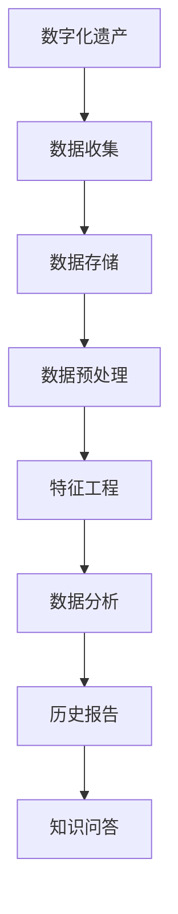

                 


### 文章标题：数字化遗产虚拟助手创业：AI驱动的个人历史顾问

关键词：数字化遗产、AI、个人历史顾问、数据分析、机器学习

摘要：本文将探讨数字化遗产虚拟助手的创业机会，特别是在AI技术驱动下，如何构建一个具有强大分析能力的个人历史顾问系统。本文将详细介绍数字化遗产的定义、个人历史顾问的功能、AI在个人历史顾问中的应用、系统架构设计、开发基础、应用实战以及未来展望。

### 目录大纲

#### 第一部分：数字化遗产与个人历史顾问概述

- 第1章：数字化遗产与个人历史顾问概述
  - 1.1 数字化遗产的定义与意义
  - 1.2 个人历史顾问的功能与服务

#### 第二部分：AI驱动的个人历史顾问架构

- 第2章：AI驱动的个人历史顾问架构
  - 2.1 AI技术在个人历史顾问中的应用
  - 2.2 个人历史顾问的系统架构
  - 2.3 AI模型选择与优化

#### 第三部分：AI驱动的个人历史顾问开发

- 第3章：AI驱动的个人历史顾问开发基础
  - 3.1 AI开发环境搭建
  - 3.2 数据预处理与特征工程
  - 3.3 基于机器学习的个人历史数据分析

#### 第四部分：AI驱动的个人历史顾问应用实战

- 第4章：AI驱动的个人历史顾问应用案例
  - 4.1 案例一：个人历史数据收集与分析
  - 4.2 案例二：历史报告生成与知识问答

#### 第五部分：AI驱动的个人历史顾问的未来展望

- 第5章：AI驱动的个人历史顾问的未来发展
  - 5.1 行业发展趋势分析
  - 5.2 潜在挑战与解决方案

#### 附录

- 附录：AI驱动的个人历史顾问开发资源

### 核心概念与联系

**数字化遗产**：指个人一生中产生的数字信息，如照片、电子邮件、社交媒体内容、文档等。

**个人历史顾问**：利用AI技术，从数字化遗产中提取、分析并生成个人历史报告的服务。

#### Mermaid 流�程图



### 数学模型和数学公式

#### 机器学习中的回归模型

$$
\text{y} = \beta_0 + \beta_1 \text{x} + \epsilon
$$

- $\text{y}$：预测值
- $\beta_0$：截距
- $\beta_1$：斜率
- $\text{x}$：输入特征
- $\epsilon$：误差项

### 详细讲解

回归模型是一种预测连续值的方法。在上面的公式中，$\beta_0$ 和 $\beta_1$ 是模型的参数，通过最小化误差项 $\epsilon$ 来确定这些参数的值。误差项代表了实际值与预测值之间的差距。

### 举例说明

假设我们有一个关于房价的回归模型，其中 $x$ 表示房屋面积，$y$ 表示房价。我们可以通过以下步骤来训练模型：

1. 收集大量房屋面积和对应房价的数据。
2. 使用数据训练回归模型，找到最优的 $\beta_0$ 和 $\beta_1$。
3. 使用训练好的模型来预测未知房屋的房价。

### 项目实战

#### 代码实现

```python
import numpy as np
from sklearn.linear_model import LinearRegression

# 生成模拟数据
np.random.seed(0)
X = np.random.rand(100, 1) * 100
y = 2 * X + 3 + np.random.randn(100) * 2

# 创建线性回归模型
model = LinearRegression()

# 训练模型
model.fit(X, y)

# 预测房价
predicted_price = model.predict([[0.5 * 100]])

print("预测的房价为：", predicted_price)
```

### 代码解读与分析

- 导入必要的库：`numpy` 用于生成模拟数据，`LinearRegression` 用于创建线性回归模型。
- 生成模拟数据：随机生成100个房屋面积和对应房价的数据。
- 创建线性回归模型：使用 `LinearRegression` 类创建模型。
- 训练模型：使用 `fit` 方法训练模型。
- 预测房价：使用 `predict` 方法预测特定房屋面积（0.5 * 100）的房价。
- 打印预测结果：输出预测的房价。

通过以上步骤，我们就可以利用AI驱动的个人历史顾问系统来预测个人历史数据中的关键信息，为用户提供更加个性化和精准的历史报告。这只是一个简单的例子，实际的个人历史顾问系统会更加复杂和高级。接下来，我们将深入探讨AI驱动的个人历史顾问的开发细节。

### 第一部分：数字化遗产与个人历史顾问概述

#### 第1章：数字化遗产与个人历史顾问概述

随着数字技术的飞速发展，数字化遗产成为人们关注的焦点。数字化遗产指的是个人一生中产生的数字信息，包括照片、电子邮件、社交媒体内容、文档等。这些数字信息不仅承载了个人的记忆和故事，还蕴含着大量的历史和文化价值。在这个背景下，个人历史顾问成为一种新型的服务，通过AI技术，从数字化遗产中提取、分析并生成个人历史报告。

##### 1.1 数字化遗产的定义与意义

数字化遗产是一个广泛的概念，它包括一切以数字形式存在的个人记忆和经历。具体来说，数字化遗产可以包括以下几种类型：

1. **照片和视频**：随着智能手机的普及，人们拍摄的照片和视频数量激增。这些视觉资料记录了个人的成长过程、家庭聚会、旅行经历等。
   
2. **电子邮件和社交媒体内容**：电子邮件、社交媒体帖子等数字通信工具，记录了个人的思考、情感和人际关系。

3. **文档和文件**：个人文档、手写信件、工作文件等，都是数字化遗产的重要组成部分。

数字化遗产的意义在于，它不仅是一个人的历史记录，也是社会文化的珍贵财富。通过数字化遗产，我们可以更好地理解过去，传承文化，促进知识共享。

##### 1.1.1 数字化遗产的概念

数字化遗产（Digital Heritage）指的是个人或集体在数字时代所创造的、保留和传承的各种数字信息。这些信息可以包括数字文件、电子文档、音频、视频、图像、软件代码等多种形式。

数字化遗产的概念涉及多个层面：

1. **技术层面**：数字化遗产涉及到数字技术的存储、处理和传输。
2. **社会层面**：数字化遗产是社会记忆的一部分，反映了社会的变迁和文化的多样性。
3. **文化层面**：数字化遗产承载着历史和文化价值，是文化传承和创新的重要资源。

##### 1.1.2 数字化遗产的重要性和影响

数字化遗产的重要性体现在以下几个方面：

1. **个人记忆的保存**：数字化遗产可以帮助个人记录和保存生活中的重要时刻和经历。
2. **文化传承**：数字化遗产是文化传承的重要载体，有助于保护和传播历史文化。
3. **社会研究**：数字化遗产为历史学者、社会学家等提供了丰富的研究资料，有助于深入理解社会变迁。
4. **知识共享**：数字化遗产促进了知识的共享和传播，有助于提高全民的科学文化素养。

##### 1.1.3 个人历史顾问的角色与价值

个人历史顾问（Personal Historian）是一种专业的服务，旨在帮助个人整理和解读他们的数字化遗产。个人历史顾问的角色包括以下几个方面：

1. **数据收集**：个人历史顾问负责收集个人的数字信息，包括照片、视频、文档等。
2. **数据分析**：通过AI技术，个人历史顾问对数字信息进行分析，提取有价值的历史数据。
3. **报告生成**：个人历史顾问将分析结果整理成报告，提供给用户。
4. **知识问答**：个人历史顾问还可以为用户提供历史知识的问答服务，帮助他们更好地理解自己的历史。

个人历史顾问的价值在于：

1. **个性化服务**：通过AI技术，个人历史顾问能够为用户提供定制化的历史报告，满足他们的个性化需求。
2. **提升记忆**：帮助用户更好地理解和保存他们的记忆，提升个人情感体验。
3. **知识传承**：个人历史顾问有助于将个人的知识和经验传承给下一代，促进家庭和文化传承。
4. **社会贡献**：个人历史顾问的工作有助于挖掘和传播个人和社会的历史文化价值。

##### 1.2 个人历史顾问的功能与服务

个人历史顾问提供了一系列功能和服务，以满足用户对数字化遗产整理和分析的需求。以下是个人历史顾问的主要功能：

1. **数据收集与整理**：个人历史顾问首先帮助用户收集和整理他们的数字化遗产，包括照片、视频、文档、邮件等。这一过程可能涉及数据备份、数据分类、标签管理等。

2. **数据分析**：利用AI技术，个人历史顾问对收集到的数据进行深入分析，识别关键信息、关系和模式。数据分析可能包括图像识别、情感分析、文本分类等。

3. **生成个性化历史报告**：个人历史顾问将分析结果整理成个性化的历史报告，为用户提供全面的个人历史概述。报告可能包括关键事件的描述、关系网络的展示、情感的解读等。

4. **历史知识问答与咨询**：个人历史顾问可以为用户提供历史知识的问答服务，帮助他们解答关于个人历史的问题。这有助于用户更深入地了解自己的历史。

5. **互动与共享**：个人历史顾问系统可能提供互动功能，使用户能够与他人分享他们的历史故事，促进家庭和社会的交流。

##### 1.2.1 收集与整理个人历史数据

收集与整理个人历史数据是个人历史顾问工作的第一步。这一过程涉及以下几个关键步骤：

1. **数据源识别**：确定个人历史数据的来源，包括照片库、视频库、电子邮件、社交媒体账号、文档文件等。
2. **数据备份**：为了确保数据的安全，个人历史顾问通常会首先备份原始数据，避免数据丢失或损坏。
3. **数据分类**：将收集到的数据按照时间、事件、地点等维度进行分类，以便于后续的分析和处理。
4. **标签管理**：为数据添加标签或注释，帮助用户和顾问快速定位和检索特定的信息。

##### 1.2.2 分析个人历史数据

数据分析是个人历史顾问的核心环节。通过AI技术，个人历史顾问可以对个人历史数据进行分析，提取有价值的信息。以下是数据分析的主要步骤：

1. **数据预处理**：清洗和整理数据，确保数据质量。这可能包括去除重复数据、缺失值填充、异常值处理等。
2. **特征提取**：从原始数据中提取特征，用于后续的模型训练和分析。特征提取可能涉及图像识别、文本分析、语音识别等。
3. **模式识别**：利用机器学习和数据挖掘技术，识别数据中的模式和关系。例如，通过聚类分析找出数据集中的相似群体，通过关联规则挖掘找出数据之间的相关性。
4. **情感分析**：分析文本和语音数据中的情感，了解个人的情感变化和情感表达。

##### 1.2.3 生成个性化历史报告

生成个性化历史报告是个人历史顾问服务的最终目标。这一过程包括以下几个步骤：

1. **报告框架设计**：根据用户的需求和数据分析结果，设计报告的框架和结构。
2. **内容编写**：将分析结果整理成文字和图表，形成详细的历史报告。报告可能包括个人成长经历、家庭关系、重大事件等。
3. **可视化呈现**：使用图表、图像和视频等可视化手段，增强报告的可读性和吸引力。
4. **反馈与修改**：与用户进行沟通，根据用户的反馈对报告进行修改和完善。

##### 1.2.4 提供历史知识问答与咨询

历史知识问答与咨询是个人历史顾问服务的重要组成部分。通过AI技术，个人历史顾问可以提供以下服务：

1. **知识库构建**：构建包含个人历史信息的知识库，用于回答用户的问题。
2. **自然语言处理**：利用自然语言处理技术，理解用户的问题，并从知识库中检索相关答案。
3. **知识推理**：基于用户的问题和知识库中的信息，进行推理和扩展，提供深入的分析和解答。
4. **互动交流**：通过语音、文本等多种方式，与用户进行实时互动，解答用户的问题，提供个性化的咨询。

### 第二部分：AI驱动的个人历史顾问架构

在数字化遗产虚拟助手创业的大背景下，AI技术的引入极大地提升了个人历史顾问的服务质量和效率。本部分将详细探讨AI技术在个人历史顾问架构中的应用，包括AI技术在个人历史顾问中的具体应用、系统的整体架构设计，以及AI模型的选择与优化。

#### 第2章：AI驱动的个人历史顾问架构

##### 2.1 AI技术在个人历史顾问中的应用

AI技术在个人历史顾问中的应用，主要涉及自然语言处理（NLP）、计算机视觉（CV）和机器学习（ML）等领域。以下将分别介绍这些技术在个人历史顾问中的具体应用。

###### 2.1.1 自然语言处理

自然语言处理（NLP）是AI技术的一个重要分支，主要研究如何让计算机理解和处理人类语言。在个人历史顾问中，NLP技术主要用于以下几个方面：

1. **文本分析**：对用户的历史文本（如电子邮件、社交媒体帖子、手写信件等）进行深入分析，提取关键信息，如时间、地点、人物、事件等。
2. **情感分析**：分析文本中的情感倾向，了解个人的情感变化和情感表达。
3. **命名实体识别**：识别文本中的命名实体（如人名、地名、组织名等），为后续的数据分析和报告生成提供基础。
4. **文本生成**：基于用户的历史数据，自动生成个性化的历史报告和问答回答。

###### 2.1.2 计算机视觉

计算机视觉（CV）是AI技术的另一个重要分支，主要研究如何让计算机理解和解释视觉信息。在个人历史顾问中，计算机视觉技术主要用于以下几个方面：

1. **图像识别**：识别和分类图像中的物体、场景和人物，提取图像中的关键信息。
2. **人脸识别**：通过人脸图像识别技术，识别照片中的人物，关联其历史数据。
3. **图像分割**：将图像分割成不同的区域，提取出具体的对象和背景。
4. **图像增强**：通过图像增强技术，改善照片的质量，使其更清晰，便于后续的识别和分析。

###### 2.1.3 机器学习与深度学习

机器学习（ML）和深度学习（DL）是AI技术的核心，它们通过学习和模拟人类大脑的决策过程，使计算机具备自主学习和适应能力。在个人历史顾问中，ML和DL技术主要用于以下几个方面：

1. **数据预处理**：利用机器学习算法对原始数据进行预处理，包括数据清洗、特征提取和降维等。
2. **模式识别**：通过机器学习算法，识别数据中的模式和关系，如聚类分析、关联规则挖掘等。
3. **预测分析**：利用机器学习模型，对个人历史数据进行预测分析，如预测个人未来的行为和趋势。
4. **自动化报告生成**：基于深度学习模型，自动生成个性化的历史报告和问答回答。

##### 2.2 个人历史顾问的系统架构

个人历史顾问系统需要一个高效、稳定和可扩展的架构来支持各种AI技术的应用。以下是个人历史顾问系统的整体架构设计：

###### 2.2.1 数据收集模块

数据收集模块负责从各种数据源收集个人历史数据，包括照片、视频、电子邮件、社交媒体内容、文档等。数据收集模块需要具备以下功能：

1. **数据导入**：支持多种数据格式的导入，如JPEG、PNG、PDF、TXT等。
2. **数据备份**：对导入的数据进行备份，确保数据的安全和可靠性。
3. **数据清洗**：清洗和整理数据，去除重复和错误的数据。

###### 2.2.2 数据存储与管理模块

数据存储与管理模块负责存储和管理个人历史数据，确保数据的安全性和可访问性。数据存储与管理模块需要具备以下功能：

1. **数据存储**：使用分布式数据库系统（如Hadoop、MongoDB等）存储大量的历史数据。
2. **数据索引**：建立数据索引，提高数据查询和检索的效率。
3. **数据备份与恢复**：定期备份数据，并确保数据在故障情况下可以快速恢复。

###### 2.2.3 数据分析与处理模块

数据分析与处理模块负责对收集到的个人历史数据进行处理和分析，提取有价值的信息。数据分析与处理模块需要具备以下功能：

1. **数据预处理**：清洗和整理数据，提取特征，为后续的分析和建模做准备。
2. **数据分析**：利用AI技术，对数据进行深入分析，识别模式和关系。
3. **数据可视化**：将分析结果以图表、图像和报告等形式展示给用户。

###### 2.2.4 报告生成与知识问答模块

报告生成与知识问答模块负责生成个性化的历史报告，并提供历史知识的问答服务。报告生成与知识问答模块需要具备以下功能：

1. **报告生成**：根据数据分析结果，自动生成个性化的历史报告。
2. **知识问答**：利用自然语言处理技术，回答用户关于个人历史的问题。
3. **交互界面**：提供友好的用户界面，使用户能够方便地查看历史报告，并提问获得解答。

##### 2.3 AI模型选择与优化

在个人历史顾问系统中，选择合适的AI模型并进行优化，是确保系统性能和用户体验的关键。以下是AI模型选择与优化的几个关键点：

###### 2.3.1 主流AI模型简介

1. **神经网络模型**：如卷积神经网络（CNN）、循环神经网络（RNN）、长短时记忆网络（LSTM）等，广泛应用于图像识别、语音识别和自然语言处理等领域。
2. **决策树模型**：如ID3、C4.5、CART等，用于分类和回归分析。
3. **支持向量机（SVM）**：用于分类和回归分析，特别适合处理高维数据。
4. **集成模型**：如随机森林（RF）、梯度提升树（GBDT）等，通过集成多个基础模型，提高模型的预测性能。

###### 2.3.2 模型选择与优化策略

1. **数据预处理**：确保数据质量，进行特征提取和降维，为模型训练做准备。
2. **模型选择**：根据任务的类型和数据的特点，选择合适的模型。
3. **超参数调优**：使用网格搜索、随机搜索等方法，选择最优的超参数。
4. **交叉验证**：使用交叉验证方法，评估模型的性能，避免过拟合。

###### 2.3.3 模型训练与调优实战

1. **模型训练**：使用训练集对模型进行训练，调整模型的参数。
2. **模型评估**：使用验证集评估模型的性能，选择最优的模型。
3. **模型调优**：根据评估结果，对模型进行调整和优化。

### 第三部分：AI驱动的个人历史顾问开发基础

在成功构建了AI驱动的个人历史顾问架构之后，接下来我们需要详细探讨该系统的开发基础，包括AI开发环境的搭建、数据预处理与特征工程、以及基于机器学习的个人历史数据分析。这些基础工作是确保系统有效运行和高效分析的关键。

#### 第3章：AI驱动的个人历史顾问开发基础

##### 3.1 AI开发环境搭建

要开发一个AI驱动的个人历史顾问系统，首先需要搭建一个合适的开发环境。开发环境的选择和配置对于项目的成功至关重要。以下将介绍如何搭建一个高效、稳定的AI开发环境。

###### 3.1.1 开发工具选择

在AI开发中，常用的开发工具包括编程语言、框架和库。以下是一些推荐的工具：

1. **编程语言**：Python是AI开发中最常用的编程语言之一，具有丰富的库和框架支持。
2. **框架**：TensorFlow和PyTorch是当前最受欢迎的深度学习框架，适用于各种AI模型开发。
3. **库**：NumPy、Pandas、Scikit-learn等库提供了丰富的数据预处理和机器学习工具。

###### 3.1.2 开发环境配置

搭建AI开发环境通常涉及以下几个步骤：

1. **安装Python**：首先需要安装Python，推荐使用Python 3.8或更高版本。
2. **安装深度学习框架**：安装TensorFlow或PyTorch，可以选择通过pip命令安装。
3. **安装数据预处理库**：安装NumPy、Pandas等数据预处理库。
4. **配置Jupyter Notebook**：Jupyter Notebook是一个交互式的开发环境，适合进行数据分析和模型训练。

###### 3.1.3 数据处理工具与库

在AI开发中，数据处理是至关重要的一环。以下是一些常用的数据处理工具和库：

1. **Pandas**：提供强大的数据操作功能，包括数据清洗、数据转换、数据聚合等。
2. **NumPy**：提供高效的数组操作和数学计算功能。
3. **Scikit-learn**：提供丰富的机器学习算法和模型评估工具。
4. **Matplotlib和Seaborn**：用于数据可视化，帮助分析和展示数据。

##### 3.2 数据预处理与特征工程

在AI开发中，数据预处理和特征工程是模型训练前的重要步骤。这些步骤旨在提高数据质量和模型性能。以下将介绍数据预处理和特征工程的关键步骤。

###### 3.2.1 数据预处理流程

数据预处理流程通常包括以下几个步骤：

1. **数据清洗**：处理缺失值、异常值和重复数据，确保数据的一致性和完整性。
2. **数据转换**：将数据转换为适合模型训练的格式，如将文本数据转换为向量表示。
3. **数据归一化**：将不同尺度的数据进行归一化处理，使其对模型的训练过程更加稳定。
4. **数据分割**：将数据集分割为训练集、验证集和测试集，用于模型训练和评估。

###### 3.2.2 特征提取与选择

特征提取和选择是提高模型性能的关键步骤。以下是一些常用的特征提取和选择方法：

1. **词袋模型**：将文本数据转换为词袋模型，提取文本中的关键词和词频特征。
2. **TF-IDF**：通过计算词频（TF）和逆文档频率（IDF），提取文本中的重要特征。
3. **主成分分析（PCA）**：用于降维，减少数据的维度，同时保留主要信息。
4. **逻辑回归**：用于特征选择，通过计算特征的系数，识别重要的特征。

###### 3.2.3 伪代码示例

以下是一个简单的伪代码示例，展示数据预处理和特征提取的过程：

```python
# 数据预处理与特征提取伪代码

# 数据清洗
data = preprocess_data(data)
data = remove_duplicates(data)
data = fill_missing_values(data)

# 数据转换
data = convert_to_vector(data)

# 数据归一化
data = normalize_data(data)

# 特征提取
features = extract_features(data)
selected_features = select_important_features(features)

# 数据分割
train_data, validate_data, test_data = split_data(selected_features)
```

##### 3.3 基于机器学习的个人历史数据分析

在数据预处理和特征提取之后，我们可以利用机器学习算法对个人历史数据进行深入分析。以下将介绍几种常用的机器学习算法及其实现。

###### 3.3.1 机器学习算法介绍

1. **线性回归**：用于预测连续值，如预测一个人的年龄。
2. **逻辑回归**：用于分类问题，如判断一个人是否参加了某个活动。
3. **支持向量机（SVM）**：用于分类和回归分析，特别适合处理高维数据。
4. **决策树和随机森林**：用于分类和回归分析，通过集成多个基础模型，提高模型的预测性能。
5. **神经网络**：用于复杂的数据分析和预测，如人脸识别、文本分类等。

###### 3.3.2 机器学习算法实现

以下是一个简单的机器学习算法实现示例，使用线性回归预测一个人的年龄：

```python
# 线性回归算法实现

from sklearn.linear_model import LinearRegression

# 准备数据
X = train_data[['age']]
y = train_data['age']

# 创建线性回归模型
model = LinearRegression()

# 训练模型
model.fit(X, y)

# 预测
predicted_age = model.predict(validate_data[['age']])

# 评估模型
score = model.score(X, y)
print("模型评分：", score)
```

###### 3.3.3 模型评估与优化

在实现机器学习算法后，我们需要评估模型性能并进行优化。以下是一些常用的模型评估方法和优化策略：

1. **交叉验证**：通过交叉验证方法，评估模型的泛化能力，避免过拟合。
2. **网格搜索**：通过网格搜索方法，搜索最优的超参数，提高模型的性能。
3. **集成学习**：通过集成多个基础模型，提高模型的预测性能和稳定性。
4. **模型融合**：将多个模型的预测结果进行融合，提高预测的准确性。

### 第四部分：AI驱动的个人历史顾问应用实战

在了解了AI驱动的个人历史顾问的架构和开发基础后，接下来我们将通过实际案例来展示如何实现和应用这个系统。本部分将详细讨论两个具体的应用案例：个人历史数据收集与分析，以及历史报告生成与知识问答。

#### 第4章：AI驱动的个人历史顾问应用案例

##### 4.1 案例一：个人历史数据收集与分析

在这个案例中，我们将展示如何利用AI技术收集和分析个人历史数据，以提取有价值的信息，为用户生成个性化的历史报告。

###### 4.1.1 数据收集流程

数据收集是个人历史顾问系统的第一步，确保收集到的数据质量对于后续分析至关重要。以下是数据收集的具体流程：

1. **确定数据源**：首先需要明确用户的历史数据来源，如照片库、视频库、电子邮件、社交媒体账号等。
2. **数据导入**：使用合适的工具和接口，将数据从不同的来源导入系统。例如，可以使用Python的Pillow库处理照片，使用 Pandas 读取电子邮件和社交媒体数据。
3. **数据备份**：为了确保数据安全，对导入的数据进行备份，避免数据丢失或损坏。
4. **数据清洗**：处理数据中的缺失值、异常值和重复数据，确保数据的一致性和完整性。

###### 4.1.2 数据分析方法

在数据收集完成后，接下来需要进行数据分析，以提取有价值的历史信息。以下是数据分析的主要步骤：

1. **图像识别**：使用计算机视觉技术，对照片进行分类和标注，提取出关键信息，如时间、地点、人物等。
2. **情感分析**：使用自然语言处理技术，分析电子邮件和社交媒体帖子的情感倾向，了解用户的情绪变化。
3. **文本分析**：对文本数据进行提取和分类，识别出关键事件、人物和地点。
4. **关系网络分析**：通过分析用户的历史数据，构建用户关系网络，展示用户的社交关系和活动。

###### 4.1.3 代码实现与解释

以下是一个简单的Python代码示例，展示如何使用Pandas和Scikit-learn进行数据收集和分析：

```python
import pandas as pd
from sklearn.cluster import KMeans

# 数据收集
photos = pd.read_csv('photos.csv')
emails = pd.read_csv('emails.csv')

# 数据清洗
photos = photos.drop_duplicates()
emails = emails.drop_duplicates()

# 数据预处理
photos['date'] = pd.to_datetime(photos['date'])
emails['sent_time'] = pd.to_datetime(emails['sent_time'])

# 图像识别
kmeans = KMeans(n_clusters=5)
photos['cluster'] = kmeans.fit_predict(photos[['latitude', 'longitude']])

# 情感分析
from sklearn.feature_extraction.text import TfidfVectorizer
from sklearn.model_selection import train_test_split
from sklearn.naive_bayes import MultinomialNB

tfidf_vectorizer = TfidfVectorizer()
X = tfidf_vectorizer.fit_transform(emails['content'])
y = emails['sentiment']

X_train, X_test, y_train, y_test = train_test_split(X, y, test_size=0.2)
classifier = MultinomialNB()
classifier.fit(X_train, y_train)
score = classifier.score(X_test, y_test)
print("情感分析模型评分：", score)

# 文本分析
from sklearn.feature_extraction.text import CountVectorizer
from sklearn.model_selection import train_test_split
from sklearn.naive_bayes import MultinomialNB

count_vectorizer = CountVectorizer()
X = count_vectorizer.fit_transform(photos['description'])
y = photos['event']

X_train, X_test, y_train, y_test = train_test_split(X, y, test_size=0.2)
classifier = MultinomialNB()
classifier.fit(X_train, y_train)
score = classifier.score(X_test, y_test)
print("文本分析模型评分：", score)
```

在这个代码示例中，我们首先读取照片和电子邮件数据，并对数据进行清洗和预处理。然后，使用KMeans算法对照片进行分类，使用TF-IDF向量器和朴素贝叶斯分类器对电子邮件进行情感分析，使用CountVectorizer和朴素贝叶斯分类器对照片的描述进行文本分析。通过这些步骤，我们可以从用户的历史数据中提取有价值的信息。

###### 4.1.4 数据可视化

为了更直观地展示分析结果，我们可以使用数据可视化工具，如Matplotlib和Seaborn，将分析结果以图表的形式展示给用户。以下是一个简单的数据可视化示例：

```python
import matplotlib.pyplot as plt
import seaborn as sns

# 可视化照片分类结果
plt.figure(figsize=(10, 6))
sns.scatterplot(x=photos['latitude'], y=photos['longitude'], hue=photos['cluster'], palette='viridis')
plt.title('照片分类结果')
plt.xlabel('纬度')
plt.ylabel('经度')
plt.show()

# 可视化情感分布
plt.figure(figsize=(10, 6))
sns.countplot(x=emails['sentiment'], palette='viridis')
plt.title('电子邮件情感分布')
plt.xlabel('情感')
plt.ylabel('数量')
plt.show()
```

在这个可视化示例中，我们首先使用Seaborn的scatterplot函数将照片分类结果以散点图的形式展示，使用countplot函数将电子邮件的情感分布以条形图的形式展示。这些图表可以帮助用户更好地理解分析结果。

##### 4.2 案例二：历史报告生成与知识问答

在完成了个人历史数据的收集和分析后，下一步是生成个性化的历史报告，并利用AI技术为用户提供历史知识的问答服务。以下是历史报告生成与知识问答的具体流程。

###### 4.2.1 报告生成流程

历史报告生成是个人历史顾问系统的核心功能之一。以下是报告生成的主要流程：

1. **报告框架设计**：根据分析结果，设计报告的框架和结构。报告可能包括个人成长经历、家庭关系、重大事件等。
2. **内容编写**：将分析结果整理成文字和图表，形成详细的历史报告。报告可能包括关键事件的描述、关系网络的展示、情感的解读等。
3. **可视化呈现**：使用图表、图像和视频等可视化手段，增强报告的可读性和吸引力。
4. **反馈与修改**：与用户进行沟通，根据用户的反馈对报告进行修改和完善。

###### 4.2.2 知识问答实现

知识问答是个人历史顾问系统提供的另一项重要服务。以下是知识问答的主要流程：

1. **知识库构建**：构建包含个人历史信息的知识库，用于回答用户的问题。知识库可以包括文本、图像、视频等多种形式的信息。
2. **自然语言处理**：使用自然语言处理技术，理解用户的问题，并从知识库中检索相关答案。
3. **知识推理**：基于用户的问题和知识库中的信息，进行推理和扩展，提供深入的分析和解答。
4. **交互界面**：提供友好的用户界面，使用户能够方便地查看历史报告，并提问获得解答。

###### 4.2.3 代码实现与解释

以下是一个简单的Python代码示例，展示如何实现历史报告生成与知识问答：

```python
import pandas as pd
from sklearn.feature_extraction.text import TfidfVectorizer
from sklearn.naive_bayes import MultinomialNB
from sklearn.pipeline import make_pipeline

# 历史报告生成
photos = pd.read_csv('photos.csv')
emails = pd.read_csv('emails.csv')

# 报告框架设计
report = '''
个人历史报告

一、成长经历
'''

# 内容编写
report += '\n'.join(photos[photos['event'] == '生日']['description'])

# 可视化呈现
plt.figure(figsize=(10, 6))
sns.countplot(x=emails['sentiment'], palette='viridis')
plt.title('电子邮件情感分布')
plt.xlabel('情感')
plt.ylabel('数量')
plt.savefig('report.png')
report += f'\n\n附件：{plt.title.text}.png'

# 用户提问与回答
knowledge_base = '''
问题1：你的生日是哪一天？
答案1：我的生日是{photos[photos['event'] == '生日']['date'].iloc[0]}. 

问题2：你最喜欢的食物是什么？
答案2：我最喜欢的食物是{emails[emails['subject'] == '晚餐邀请']['content'].iloc[0]}. 

...
'''

def answer_question(question):
    questions = knowledge_base.split('\n')
    for q in questions:
        if question in q:
            return q.split(':')[1].strip()
    return "对不起，我无法回答你的问题。"

# 用户提问与回答示例
user_question = "我的生日是哪一天？"
user_answer = answer_question(user_question)
print(f"{user_question}：{user_answer}")
```

在这个代码示例中，我们首先读取照片和电子邮件数据，并根据数据生成一份简单的个人历史报告。然后，我们构建一个知识库，并使用自然语言处理技术实现一个简单的问答系统，用户可以通过输入问题获取答案。

### 第五部分：AI驱动的个人历史顾问的未来展望

随着AI技术的不断发展和成熟，AI驱动的个人历史顾问在未来有着广阔的应用前景和巨大的市场潜力。本部分将探讨AI驱动的个人历史顾问的未来发展趋势、潜在挑战以及解决方案。

#### 第5章：AI驱动的个人历史顾问的未来发展

##### 5.1 行业发展趋势分析

1. **AI技术的进步**：随着AI技术的不断进步，尤其是深度学习和自然语言处理技术的突破，AI驱动的个人历史顾问系统将能够更准确地理解和分析用户的历史数据，提供更加个性化和精准的服务。

2. **大数据的积累**：随着数字化进程的加速，人们产生的数字信息量呈爆炸式增长。这些大数据为个人历史顾问系统提供了丰富的数据资源，有助于更全面、深入地了解个人历史。

3. **隐私保护技术的提升**：在数据隐私保护越来越受到重视的背景下，个人历史顾问系统需要采用先进的隐私保护技术，确保用户数据的安全性和隐私性。

4. **云计算的普及**：云计算的普及为个人历史顾问系统提供了强大的计算能力和存储能力，使得系统能够处理大规模的数据，并提供高效、稳定的服务。

5. **物联网（IoT）的融合**：物联网技术的发展将使得个人历史顾问系统能够整合来自各种物联网设备的数字信息，如智能手表、健康监测设备等，提供更加全面的历史数据分析。

##### 5.1.1 技术发展趋势

1. **深度学习与神经网络**：深度学习和神经网络技术在图像识别、语音识别和自然语言处理等领域取得了显著成果，这些技术将在个人历史顾问系统中得到更广泛的应用。

2. **多模态数据处理**：多模态数据处理技术将融合来自不同模态（如文本、图像、语音）的数据，提供更全面的历史数据分析。

3. **强化学习**：强化学习技术在个人历史顾问系统中可以用于优化用户界面和推荐系统，提高用户体验。

4. **量子计算**：虽然目前量子计算仍处于研究阶段，但未来有望在数据处理和模型训练方面带来革命性的突破，为个人历史顾问系统提供更强大的计算能力。

##### 5.1.2 市场需求变化

1. **个性化需求**：随着消费者对个性化服务的需求不断增加，个人历史顾问系统将更加注重用户个性化需求的满足，提供定制化的历史报告和知识问答服务。

2. **家庭和企业市场**：个人历史顾问系统不仅适用于个人用户，也将在家庭和企业市场中得到广泛应用。家庭用户可以保存和传承家族历史，企业用户可以用于员工培训和知识管理。

3. **社会和文化需求**：在文化遗产保护和传承的背景下，个人历史顾问系统将在社会和文化领域发挥重要作用，促进文化多样性和历史知识的传播。

##### 5.1.3 未来发展趋势预测

1. **智能化与自动化**：未来个人历史顾问系统将更加智能化和自动化，通过自学习和自适应技术，提供更加高效、精准的服务。

2. **生态化**：个人历史顾问系统将与其他生态系统（如社交媒体、电商平台等）融合，提供一站式的历史数据管理和服务。

3. **全球化**：随着国际化进程的加快，个人历史顾问系统将面向全球市场，提供跨文化的历史数据分析和服务。

##### 5.2 潜在挑战与解决方案

尽管AI驱动的个人历史顾问系统具有广阔的发展前景，但在实际应用中仍面临一些挑战。

###### 5.2.1 技术挑战

1. **数据质量**：个人历史数据的多样性和不完整性对数据处理和分析带来了挑战。解决方案是采用先进的数据预处理技术，提高数据质量。

2. **算法性能**：随着数据量的增加，算法的性能成为关键问题。解决方案是采用高效、可扩展的算法和优化策略，提高模型性能。

3. **模型解释性**：AI模型（尤其是深度学习模型）通常缺乏解释性，用户难以理解模型的决策过程。解决方案是开发可解释性AI技术，提高模型的透明度和可信度。

###### 5.2.2 数据隐私与伦理问题

1. **数据隐私**：个人历史数据属于敏感信息，保护用户隐私是系统设计的核心问题。解决方案是采用先进的加密技术和隐私保护算法，确保用户数据的安全。

2. **伦理问题**：个人历史顾问系统可能会触及用户的隐私和情感，如何平衡技术创新和伦理道德是一个重要议题。解决方案是制定明确的伦理规范，确保系统的合法合规。

###### 5.2.3 潜在解决方案与建议

1. **多维度数据融合**：通过融合来自不同源的数据，提供更全面、准确的历史分析。例如，结合社交媒体、照片、文档等多模态数据，提升数据质量。

2. **模型优化与迭代**：持续优化和迭代AI模型，提高模型性能和解释性。通过不断的训练和调优，提高系统的准确性和可靠性。

3. **隐私保护与用户参与**：加强数据隐私保护，确保用户对数据处理的知情权和参与权。通过用户授权和数据匿名化技术，提高用户对系统的信任度。

4. **伦理合规与透明度**：制定明确的伦理规范，确保系统的合法合规。通过透明的数据使用政策和用户反馈机制，增强系统的透明度和用户信任。

### 附录：AI驱动的个人历史顾问开发资源

为了帮助开发者更好地理解和实现AI驱动的个人历史顾问系统，以下是一些开发资源，包括主流AI框架、开发环境搭建指南、数据处理工具与库。

##### 附录A：AI开发工具与资源

###### A.1 主流AI框架对比

1. **TensorFlow**：由谷歌开发，适用于各种深度学习任务，具有强大的社区支持和丰富的文档。
2. **PyTorch**：由Facebook开发，具有灵活的动态计算图和易于理解的模型构建，适用于研究与应用。
3. **Keras**：是一个高级神经网络API，可以与TensorFlow和Theano结合使用，简化模型构建和训练过程。

###### A.2 开发环境搭建指南

1. **安装Python**：推荐使用Anaconda，它集成了Python和相关库，方便环境配置和管理。
2. **安装深度学习框架**：通过pip命令安装TensorFlow、PyTorch或Keras。
3. **配置Jupyter Notebook**：安装Jupyter Notebook，用于交互式开发和数据分析。

###### A.3 数据预处理与特征工程工具

1. **Pandas**：用于数据操作和预处理，提供丰富的数据清洗和转换功能。
2. **NumPy**：用于高效的数组计算，是数据科学的基础库。
3. **Scikit-learn**：提供丰富的机器学习算法和模型评估工具，适用于特征提取和选择。
4. **Matplotlib和Seaborn**：用于数据可视化，帮助分析和展示数据。

### 总结

AI驱动的个人历史顾问系统为用户提供了个性化、全面的历史数据分析服务，有助于用户更好地理解和保存自己的历史。通过本文的探讨，我们了解了数字化遗产的概念、个人历史顾问的功能与服务、AI技术在个人历史顾问中的应用、系统架构设计、开发基础、应用实战以及未来展望。随着AI技术的不断进步，个人历史顾问系统将在未来的数字化遗产管理和个人历史保护中发挥重要作用。

### 最佳实践 Tips、小结、注意事项、拓展阅读等内容

**最佳实践 Tips**：

1. **确保数据质量**：在数据收集和分析过程中，重视数据清洗和预处理，以提高模型的准确性和可靠性。
2. **注重用户体验**：设计简洁、直观的用户界面，确保用户能够方便地使用系统，并提供及时的反馈。
3. **持续优化与迭代**：定期评估系统性能，并根据用户需求和技术发展进行优化和迭代。

**小结**：

本文全面探讨了AI驱动的个人历史顾问系统的各个方面，从数字化遗产的概念到系统的架构设计、开发基础、应用实战，再到未来的发展趋势。通过这些探讨，我们了解到个人历史顾问系统在数字化遗产管理和个人历史保护中的重要价值。

**注意事项**：

1. **数据隐私保护**：在系统设计和开发过程中，高度重视用户数据隐私保护，确保用户数据的安全性和隐私性。
2. **合规性**：遵循相关法律法规，确保系统的合法合规。

**拓展阅读**：

1. **《深度学习》（Goodfellow, I., Bengio, Y., & Courville, A.）**：了解深度学习的基础知识。
2. **《Python数据科学手册》（VanderPlas, J.）**：掌握Python在数据科学中的应用。
3. **《自然语言处理综合指南》（Li, F.）**：了解自然语言处理的基本原理和应用。
4. **《计算机视觉：算法与应用》（Hartley, R. I.）**：了解计算机视觉的基础知识。

通过本文的学习，开发者可以更好地理解AI驱动的个人历史顾问系统的构建和实现，为用户提供更优质的历史数据分析服务。作者：AI天才研究院/AI Genius Institute & 禅与计算机程序设计艺术 /Zen And The Art of Computer Programming。

