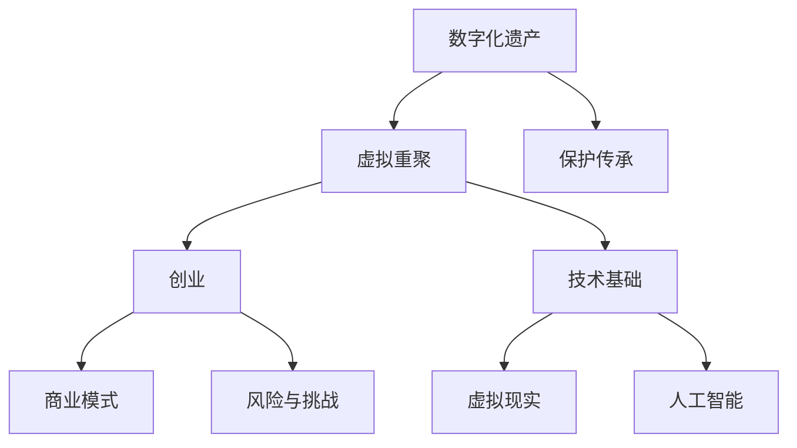

                 

### 文章标题

《数字化遗产虚拟重聚创业：跨越时空的家庭团聚体验》

### 关键词

数字化遗产、虚拟重聚、创业、家庭团聚、虚拟现实、人工智能、商业模式、技术实现、风险挑战、成功案例、财务管理

### 摘要

本文旨在探讨数字化遗产虚拟重聚创业这一新兴领域，分析其背景、意义、技术基础、商业模式、风险与挑战，以及成功案例，为有意涉足此领域的创业者提供全方位的指导和启示。数字化遗产虚拟重聚创业通过虚拟现实和人工智能技术，实现跨越时空的家庭团聚体验，具有重要的社会和文化价值。文章将详细解析这一领域的核心概念、技术原理、实现路径，并分享实际操作经验，帮助读者深入了解并掌握数字化遗产虚拟重聚创业的精髓。

---

### 第一部分：数字化遗产虚拟重聚创业概述

#### 第1章：数字化遗产与虚拟重聚的背景

##### 1.1.1 数字化遗产的概念与重要性

数字化遗产是指以数字形式保存的文化遗产，包括文字、图片、音频、视频等，是传统文化遗产的现代表现形式。随着信息技术的飞速发展，数字化遗产日益丰富，成为传承和弘扬文化的重要载体。

数字化遗产的重要性体现在以下几个方面：

1. **文化传承**：数字化遗产使得文化遗产得以永久保存和传承，不受时间和空间的限制，为后人提供宝贵的精神财富。
2. **教育普及**：数字化遗产的普及和教育价值显著，有助于提高全民文化素养，推动文化教育事业的发展。
3. **旅游资源**：数字化遗产可以转化为旅游资源，为文化遗产地带来新的经济增长点，促进旅游业发展。

##### 1.1.2 虚拟重聚的兴起与发展

虚拟重聚是指利用虚拟现实（VR）和增强现实（AR）技术，将分散在不同地点的人或事物虚拟地聚集在一起，实现跨越时空的交流与互动。虚拟重聚的兴起得益于以下因素：

1. **技术进步**：VR和AR技术的不断成熟，使得虚拟重聚成为可能。高性能计算、高速网络、高分辨率显示等技术的发展为虚拟重聚提供了坚实基础。
2. **市场需求**：随着全球化和远程工作趋势的加剧，人们对于虚拟互动和远程团聚的需求日益增长，虚拟重聚应运而生。
3. **疫情影响**：新冠疫情的爆发使得全球范围内的人们对虚拟互动和团聚的需求更加迫切，推动了虚拟重聚的快速发展。

##### 1.1.3 数字化遗产虚拟重聚创业的意义与前景

数字化遗产虚拟重聚创业具有重要的意义和广阔的前景：

1. **创新驱动**：虚拟重聚创业是数字技术与传统文化相结合的产物，具有显著的创新性，有助于推动文化产业转型升级。
2. **市场潜力**：虚拟重聚市场潜力巨大，涵盖了文化旅游、教育培训、社交娱乐等多个领域，具有良好的盈利前景。
3. **社会影响**：虚拟重聚创业有助于解决远程沟通和家庭团聚的难题，提高人们的生活质量，具有重要的社会价值。

总之，数字化遗产虚拟重聚创业是一个充满机遇和挑战的新兴领域，具有广阔的发展前景和巨大的市场潜力。

---

#### 第2章：数字化遗产的类型与特点

##### 2.1.1 传统数字化遗产的类型

传统数字化遗产主要包括以下几种类型：

1. **文字资料**：包括书籍、报纸、杂志、文献等，这些文字资料通过数字化手段保存下来，如电子书、PDF文档等。
2. **图像资料**：包括照片、绘画、手稿等，这些图像资料通过扫描、拍摄等方式转化为数字格式。
3. **音频资料**：包括音乐、讲座、采访等，这些音频资料通过录音、转录等方式转化为数字格式。
4. **视频资料**：包括影视作品、纪录片、教学视频等，这些视频资料通过拍摄、编辑等方式转化为数字格式。

##### 2.1.2 现代数字化遗产的特点

现代数字化遗产相较于传统数字化遗产具有以下特点：

1. **多样性**：现代数字化遗产形式更加多样，包括虚拟现实（VR）、增强现实（AR）、3D建模等。
2. **互动性**：现代数字化遗产具有较强的互动性，用户可以参与到遗产内容的体验和创作中。
3. **动态性**：现代数字化遗产可以随时更新和修改，具有高度的灵活性和适应性。

##### 2.1.3 数字化遗产的保护与传承

数字化遗产的保护与传承是一个复杂而重要的任务，需要采取以下措施：

1. **数据备份**：定期对数字化遗产进行备份，确保数据安全。
2. **标准化**：制定统一的数字化遗产保存和传输标准，提高数据兼容性和互操作性。
3. **数字化修复**：利用数字化技术对受损或模糊的数字化遗产进行修复和增强。
4. **数字化推广**：通过互联网和新媒体平台，广泛传播数字化遗产，提高社会认知度。

总之，数字化遗产的类型多样，特点鲜明，其保护与传承对于传承文化、促进教育、推动旅游等方面具有重要意义。

---

#### 第3章：虚拟重聚的技术基础

##### 3.1.1 虚拟现实技术概述

虚拟现实（VR）是一种通过计算机生成三维虚拟环境，利用头盔显示器、传感手套等设备模拟人的视觉、听觉、触觉等感知，实现与虚拟环境的交互体验。VR技术的基本原理包括：

1. **三维建模**：使用计算机图形学技术生成虚拟环境的三维模型。
2. **实时渲染**：通过图形处理单元（GPU）实时渲染虚拟环境，生成逼真的视觉效果。
3. **传感器跟踪**：使用传感器（如摄像头、运动跟踪器等）实时捕捉用户的位置和动作，实现与虚拟环境的交互。
4. **人机交互**：通过输入设备（如键盘、鼠标、手柄等）和输出设备（如显示器、音响等）实现人与虚拟环境的互动。

##### 3.1.2 虚拟现实硬件与软件环境

虚拟现实硬件主要包括：

1. **头盔显示器**：如Oculus Rift、HTC Vive等，用于提供沉浸式的视觉体验。
2. **传感器**：如运动跟踪器、手柄、传感手套等，用于捕捉用户的位置和动作。
3. **计算设备**：如高性能计算机、游戏主机等，用于渲染虚拟环境和处理交互数据。

虚拟现实软件环境主要包括：

1. **开发工具**：如Unity、Unreal Engine等，用于创建和编辑虚拟环境。
2. **开发框架**：如OpenVR、SteamVR等，用于管理虚拟现实设备的输入输出。
3. **虚拟现实内容**：如游戏、教育应用、旅游体验等，为用户提供丰富的虚拟体验。

##### 3.1.3 虚拟现实技术应用场景

虚拟现实技术在多个领域具有广泛的应用，包括：

1. **游戏娱乐**：VR游戏为用户提供沉浸式的游戏体验，成为游戏产业的新宠。
2. **教育培训**：VR教育应用可以模拟真实场景，提高教学效果，适用于虚拟实验室、历史场景还原等。
3. **文化旅游**：虚拟现实技术可以模拟古迹、博物馆等场景，为用户提供身临其境的旅游体验。
4. **医疗健康**：VR技术应用于心理健康治疗、手术模拟等，提高医疗服务的质量和效率。
5. **房地产销售**：虚拟现实技术可以模拟房地产项目，帮助用户更好地了解和选择房源。

总之，虚拟现实技术作为数字化遗产虚拟重聚的核心技术，具有强大的应用潜力，将为人们的生活和工作带来深远影响。

---

### 第二部分：虚拟重聚创业实践

#### 第4章：虚拟重聚创业的商业模式

##### 4.1.1 虚拟重聚创业的基本模式

虚拟重聚创业的基本模式主要包括以下几个环节：

1. **需求调研**：通过市场调研，了解用户对虚拟重聚的需求，确定创业方向。
2. **技术研发**：投入资金和人力进行虚拟现实技术的研发，包括硬件设备的开发、软件平台的搭建等。
3. **内容创作**：根据用户需求，创作虚拟重聚的应用内容，如旅游体验、教育培训、家庭团聚等。
4. **平台运营**：建立线上平台，提供虚拟重聚服务，包括用户注册、内容推送、交互体验等。
5. **市场推广**：通过各种渠道进行市场推广，提高品牌知名度和用户黏性。

##### 4.1.2 创业项目的盈利模式分析

虚拟重聚创业项目的盈利模式主要包括以下几个方面：

1. **订阅制**：用户通过订阅模式，定期支付费用，获得虚拟重聚服务的使用权。
2. **内容付费**：用户购买虚拟重聚的应用内容，如旅游体验、教育培训等，进行一次性消费。
3. **广告收入**：在虚拟重聚平台上投放广告，通过广告收入获得盈利。
4. **平台抽成**：虚拟重聚平台对第三方应用开发商的收益进行抽成，作为平台运营的收益来源。
5. **虚拟商品**：开发虚拟商品，如虚拟货币、虚拟道具等，通过虚拟商品销售获得盈利。

##### 4.1.3 虚拟重聚创业的市场潜力

虚拟重聚创业具有巨大的市场潜力，主要体现在以下几个方面：

1. **用户需求增长**：随着全球化和远程工作的普及，人们对于虚拟互动和家庭团聚的需求不断增加，为虚拟重聚创业提供了广阔的市场空间。
2. **技术创新**：虚拟现实和人工智能技术的不断进步，为虚拟重聚创业提供了强大的技术支持，促进了市场的快速发展。
3. **政策支持**：各国政府纷纷出台政策，鼓励数字文化产业发展，为虚拟重聚创业提供了良好的政策环境。
4. **跨界融合**：虚拟重聚创业可以与其他行业（如旅游、教育、医疗等）进行跨界融合，拓展市场空间。

总之，虚拟重聚创业具有基本模式清晰、盈利模式多样、市场潜力巨大的特点，是一个充满机遇和挑战的领域。

---

#### 第5章：虚拟重聚创业的核心技术与实现

##### 5.1.1 虚拟现实核心技术解析

虚拟现实（VR）核心技术包括以下几个方面：

1. **三维建模与渲染**：三维建模是虚拟现实的基础，通过计算机图形学技术生成虚拟环境的三维模型。渲染技术则用于生成逼真的视觉效果，实现虚拟环境的可视化。
2. **传感器技术**：传感器技术用于捕捉用户的位置、动作等数据，实现用户与虚拟环境的实时交互。常见的传感器包括摄像头、运动跟踪器、传感手套等。
3. **人机交互技术**：人机交互技术是虚拟现实的核心，通过输入设备（如键盘、鼠标、手柄等）和输出设备（如显示器、音响等）实现人与虚拟环境的互动。虚拟现实中的交互方式包括手势识别、语音识别、触摸等。
4. **网络技术**：虚拟现实应用通常需要通过网络进行数据传输和交互，网络技术保障了虚拟现实应用的实时性和稳定性。常见的网络技术包括TCP/IP、WebRTC等。

##### 5.1.2 人工智能在虚拟重聚中的应用

人工智能（AI）在虚拟重聚中具有广泛的应用，主要体现在以下几个方面：

1. **场景优化**：AI技术可以对虚拟重聚场景进行实时优化，提高用户体验。例如，根据用户的行为和偏好，自动调整场景布局、光线、音效等。
2. **内容生成**：AI技术可以自动生成虚拟重聚的应用内容，如旅游路线、教育培训课程等，提高内容创作的效率和质量。
3. **交互优化**：AI技术可以分析用户的交互行为，优化交互流程，提高用户满意度。例如，通过语音识别、自然语言处理等技术，实现更加自然、流畅的交互体验。
4. **个性化推荐**：AI技术可以根据用户的兴趣和需求，进行个性化推荐，提高虚拟重聚服务的针对性和用户体验。

##### 5.1.3 虚拟重聚创业的技术实现路径

虚拟重聚创业的技术实现路径主要包括以下几个步骤：

1. **需求分析**：明确虚拟重聚创业的目标和需求，确定技术实现的重点和难点。
2. **技术研发**：根据需求分析，投入资金和人力进行虚拟现实和人工智能技术的研发，包括硬件设备的开发、软件平台的搭建等。
3. **内容创作**：根据用户需求，创作虚拟重聚的应用内容，如旅游体验、教育培训、家庭团聚等。
4. **平台搭建**：建立线上平台，提供虚拟重聚服务，包括用户注册、内容推送、交互体验等。
5. **测试与优化**：对虚拟重聚应用进行测试和优化，确保技术实现的效果和用户体验。
6. **市场推广**：通过各种渠道进行市场推广，提高品牌知名度和用户黏性。

总之，虚拟重聚创业需要综合运用虚拟现实和人工智能技术，通过明确的技术实现路径，实现跨越时空的家庭团聚体验。

---

#### 第6章：虚拟重聚创业的风险与挑战

##### 6.1.1 虚拟重聚创业的主要风险

虚拟重聚创业面临的主要风险包括：

1. **技术风险**：虚拟现实和人工智能技术尚未完全成熟，技术实现过程中可能遇到诸多挑战，如硬件设备的稳定性、软件平台的兼容性等。
2. **市场风险**：虚拟重聚市场尚未完全成熟，用户接受度和市场占有率有待提高。此外，市场竞争激烈，创业项目需要具备较强的竞争力和创新能力。
3. **法律风险**：虚拟重聚涉及数据隐私、知识产权等问题，需要遵守相关法律法规，避免法律风险。
4. **资金风险**：虚拟重聚创业需要大量资金投入，如技术研发、内容创作、平台搭建等，资金链断裂可能导致项目失败。
5. **运营风险**：虚拟重聚创业项目需要建立完善的运营体系，包括用户管理、内容更新、市场推广等，运营风险可能导致项目运营不顺畅。

##### 6.1.2 挑战与应对策略

虚拟重聚创业面临的挑战包括：

1. **技术创新**：虚拟现实和人工智能技术不断更新，创业项目需要不断进行技术创新，以保持竞争力。
2. **用户体验**：用户对虚拟重聚服务的体验要求越来越高，创业项目需要不断优化用户体验，提高用户满意度。
3. **内容创作**：虚拟重聚应用内容丰富多样，创业项目需要具备强大的内容创作能力，以吸引和留住用户。
4. **市场竞争**：虚拟重聚市场竞争激烈，创业项目需要具备独特的创新点和核心竞争力，以在市场中脱颖而出。

应对策略包括：

1. **技术创新**：加大技术研发投入，与高校、科研机构合作，引进高水平技术人才，提升技术实力。
2. **用户体验**：通过用户调研、数据分析，深入了解用户需求，优化产品功能和用户体验。
3. **内容创作**：建立专业的内容创作团队，引入多元化的创作资源，提高内容创作质量。
4. **市场竞争**：制定差异化战略，打造独特的品牌形象，提高品牌知名度和美誉度。

##### 6.1.3 政策与法规对虚拟重聚创业的影响

政策与法规对虚拟重聚创业具有重要影响，主要体现在以下几个方面：

1. **政策支持**：各国政府纷纷出台支持数字文化产业发展的政策，如税收优惠、资金扶持等，为虚拟重聚创业提供良好的政策环境。
2. **法律法规**：虚拟重聚涉及数据隐私、知识产权等问题，需要遵守相关法律法规，如《网络安全法》、《著作权法》等，以降低法律风险。
3. **行业标准**：虚拟重聚创业需要遵守相关行业标准，如虚拟现实设备的技术标准、数据传输的安全标准等，确保产品质量和用户体验。

总之，虚拟重聚创业在面临诸多风险和挑战的同时，也受到政策与法规的支持和制约。创业项目需要密切关注政策与法规动态，合理规避风险，合规经营。

---

#### 第7章：成功案例分析与启示

##### 7.1.1 虚拟重聚创业的成功案例

虚拟重聚创业领域已有多个成功案例，以下列举其中几个具有代表性的案例：

1. **案例一：旅游VR体验平台**  
   项目名称：VR旅游体验平台  
   项目概述：该项目利用虚拟现实技术，为用户提供虚拟旅游体验。用户可以通过平台选择目的地，浏览景点，体验虚拟导游讲解等服务。该项目在市场上取得了良好的反响，用户满意度高，收入稳定增长。

2. **案例二：教育VR应用**  
   项目名称：VR教育应用  
   项目概述：该项目利用虚拟现实技术，为学生提供沉浸式的教育体验。学生可以通过虚拟实验室进行实验操作，观看历史场景还原，参与互动教学等。该项目在国内外教育领域受到了广泛关注，用户群体迅速扩大。

3. **案例三：家庭团聚VR应用**  
   项目名称：家庭团聚VR应用  
   项目概述：该项目利用虚拟现实技术，为用户提供跨越时空的家庭团聚体验。用户可以通过平台邀请亲友参与虚拟聚会，共同观看视频、玩游戏等。该项目在疫情期间发挥了重要作用，受到了用户的一致好评。

##### 7.1.2 案例分析：商业模式、技术实现、市场策略

以下是上述成功案例的商业模式、技术实现和市场策略分析：

1. **商业模式**  
   - **旅游VR体验平台**：该项目采用订阅制和内容付费模式。用户可以免费注册使用平台，选择订阅服务，获取更多虚拟旅游体验。同时，平台也通过内容付费，如购买特定旅游线路，为用户带来额外收入。
   - **教育VR应用**：该项目采用内容付费模式，用户购买课程或实验包，参与虚拟教学活动。此外，平台还与教育机构合作，提供定制化的教育解决方案，获得合作收益。
   - **家庭团聚VR应用**：该项目采用免费注册、广告收入和虚拟商品销售模式。用户可以免费使用基本功能，通过广告和虚拟商品销售，平台获得收益。

2. **技术实现**  
   - **旅游VR体验平台**：该项目利用三维建模和实时渲染技术，生成逼真的虚拟旅游场景。同时，采用传感器技术和人机交互技术，实现用户在虚拟环境中的自由探索和交互。
   - **教育VR应用**：该项目利用虚拟现实技术，模拟真实的教学场景。通过人工智能技术，实现场景优化和个性化推荐，提高教学效果。
   - **家庭团聚VR应用**：该项目利用虚拟现实技术和网络通信技术，实现用户之间的实时互动和视频传输。同时，采用虚拟商品技术，丰富用户在虚拟环境中的互动体验。

3. **市场策略**  
   - **旅游VR体验平台**：通过线上宣传和线下合作，提高品牌知名度。同时，针对不同用户群体，提供定制化的旅游体验，满足用户多样化需求。
   - **教育VR应用**：与国内外教育机构合作，拓展用户群体。通过用户调研和数据分析，优化产品功能，提高用户满意度。
   - **家庭团聚VR应用**：通过社交媒体宣传和口碑传播，提高用户认可度。同时，举办线上活动，增加用户互动，提高用户黏性。

##### 7.1.3 启示与未来趋势预测

成功案例为虚拟重聚创业提供了宝贵的经验和启示：

1. **技术创新**：虚拟现实和人工智能技术是虚拟重聚创业的核心竞争力，创业项目需要不断进行技术创新，以保持市场竞争力。
2. **用户体验**：优质的用户体验是吸引和留住用户的关键，创业项目需要关注用户体验，不断优化产品功能和交互设计。
3. **商业模式**：多样化的商业模式有助于提高创业项目的盈利能力，创业项目可以根据市场需求和用户特点，选择合适的商业模式。
4. **合作共赢**：与相关行业（如旅游、教育、医疗等）进行跨界合作，可以拓展市场空间，实现资源整合和共赢。

未来趋势预测：

1. **技术进步**：随着虚拟现实和人工智能技术的不断发展，虚拟重聚创业将迎来更多创新应用，用户体验将更加丰富和多样化。
2. **市场扩展**：虚拟重聚创业市场将不断扩展，涵盖更多领域，如远程办公、线上娱乐、虚拟展览等。
3. **政策支持**：各国政府将继续加大对数字文化产业的支持力度，为虚拟重聚创业提供更加有利的政策环境。

总之，虚拟重聚创业具有广阔的发展前景和巨大的市场潜力，成功案例为创业项目提供了宝贵的经验和启示。

---

### 第三部分：虚拟重聚创业的实际操作

#### 第8章：虚拟重聚创业项目的策划与执行

##### 8.1.1 创业项目策划的步骤

虚拟重聚创业项目的策划分为以下几个步骤：

1. **市场调研**：通过市场调研，了解用户需求、竞争对手、市场规模等信息，为创业项目提供市场依据。
2. **项目定位**：明确创业项目的定位，如针对旅游、教育、家庭团聚等特定领域，确定项目的发展方向。
3. **技术规划**：根据项目定位，制定技术规划，包括所需技术、开发平台、开发周期等，确保项目技术实现的可行性。
4. **内容创作**：确定项目的内容创作方案，包括虚拟场景设计、互动体验设计等，确保项目内容丰富且具有吸引力。
5. **商业模式**：根据市场需求和技术规划，设计适合的商业模式，包括盈利模式、运营模式等，确保项目的可持续发展。
6. **团队组建**：组建专业的创业团队，明确团队成员的职责和分工，为项目的顺利执行提供组织保障。

##### 8.1.2 创业项目执行的关键环节

虚拟重聚创业项目的执行涉及多个关键环节，包括：

1. **技术研发**：根据技术规划，投入研发资源，进行虚拟现实和人工智能技术的研发，包括硬件设备的开发、软件平台的搭建等。
2. **内容创作**：根据内容创作方案，组织创作团队，进行虚拟场景设计、互动体验设计等，确保项目内容的丰富性和吸引力。
3. **平台搭建**：建立线上平台，进行用户注册、内容推送、交互体验等功能的开发，确保平台的稳定运行和用户体验。
4. **测试与优化**：对项目进行测试和优化，包括功能测试、性能测试、用户体验测试等，确保项目质量达到预期。
5. **市场推广**：通过线上和线下渠道，进行市场推广，提高品牌知名度和用户黏性，为项目的商业化运营奠定基础。

##### 8.1.3 团队建设与管理

虚拟重聚创业项目的成功离不开优秀的团队建设和管理。团队建设和管理的关键包括：

1. **明确目标**：团队需要明确共同的目标，统一思想，齐心协力，为项目的成功执行提供动力。
2. **合理分工**：根据团队成员的特长和能力，合理分工，确保每个成员都能发挥最大的作用。
3. **有效沟通**：建立高效的沟通机制，确保团队成员之间的信息畅通，提高工作效率。
4. **激励机制**：建立激励机制，激发团队成员的积极性和创造力，提高团队整体绩效。
5. **持续学习**：鼓励团队成员持续学习，提升自身技能和知识水平，为项目的发展提供持续的动力。

总之，虚拟重聚创业项目的策划与执行需要科学合理、系统有序，团队建设和管理是项目成功的关键。通过合理的策划和高效的执行，虚拟重聚创业项目有望在竞争激烈的市场中脱颖而出，实现可持续发展。

---

#### 第9章：虚拟重聚创业项目的市场推广与运营

##### 9.1.1 市场推广策略

虚拟重聚创业项目的市场推广是项目成功的关键环节，有效的市场推广策略包括：

1. **社交媒体推广**：利用微信、微博、抖音等社交媒体平台，发布项目相关信息，吸引潜在用户的关注。通过短视频、直播等形式，展示虚拟重聚的精彩场景和独特体验，提高用户互动和参与度。

2. **内容营销**：通过撰写高质量的博客文章、发布教程和案例研究，介绍虚拟重聚技术的原理、应用场景和优势。通过内容营销，树立项目的专业形象，吸引目标用户。

3. **线上广告**：在搜索引擎、社交媒体、新闻网站等平台上投放广告，提升项目的在线曝光率和知名度。通过精准定位，将广告投放给具有潜在需求的用户群体。

4. **线下活动**：组织线下体验活动，如虚拟现实展览、研讨会等，让潜在用户亲身体验虚拟重聚的魅力。通过线下活动，增强用户对项目的认知和信任。

5. **合作伙伴**：与相关行业（如旅游、教育、医疗等）的企业和机构建立合作关系，共同推广虚拟重聚项目。通过合作，共享资源，扩大市场影响力。

##### 9.1.2 品牌建设与推广

品牌建设是虚拟重聚创业项目长期发展的基础，品牌推广策略包括：

1. **品牌定位**：明确虚拟重聚项目的品牌定位，如技术领先、用户体验、创新等，为品牌形象奠定基础。

2. **品牌视觉**：设计独特的品牌视觉元素，如LOGO、色彩方案等，提高品牌的识别度和记忆点。

3. **品牌传播**：通过线上和线下渠道，持续传播品牌信息，树立品牌形象。通过故事化、情感化的传播方式，增强品牌与用户之间的情感连接。

4. **品牌活动**：举办品牌活动，如发布会、体验会等，提高品牌知名度和用户参与度。通过品牌活动，展示项目的实力和优势。

5. **口碑营销**：鼓励用户分享虚拟重聚的使用体验和感受，通过口碑传播，提高品牌美誉度。通过用户评价和推荐，增强品牌的市场竞争力。

##### 9.1.3 虚拟重聚创业项目的运营管理

虚拟重聚创业项目的运营管理是确保项目长期稳定发展的重要环节，运营管理策略包括：

1. **用户管理**：建立完善的用户管理体系，包括用户注册、用户画像、用户反馈等。通过用户管理，了解用户需求和偏好，优化产品和服务。

2. **内容管理**：定期更新和优化虚拟重聚的内容，保持内容的丰富性和吸引力。通过内容管理，提高用户的活跃度和留存率。

3. **技术支持**：提供专业的技术支持，解决用户在使用过程中遇到的问题。通过技术支持，提高用户满意度，增强用户忠诚度。

4. **数据分析**：利用大数据技术，对用户行为、市场趋势等进行数据分析，为运营决策提供依据。通过数据分析，优化运营策略，提高运营效率。

5. **风险管理**：建立风险管理机制，识别和应对潜在的风险。通过风险管理，降低运营风险，确保项目的稳定发展。

总之，虚拟重聚创业项目的市场推广与运营管理需要综合考虑市场、品牌、用户等多方面因素，通过科学合理的策略和有效的执行，实现项目的长期稳定发展。

---

#### 第10章：虚拟重聚创业项目的财务管理与融资

##### 10.1.1 创业项目的财务规划

虚拟重聚创业项目的财务规划是确保项目可持续发展和实现盈利目标的重要环节。财务规划主要包括以下几个方面：

1. **预算编制**：根据项目的规模、技术需求、内容创作和运营成本等，编制详细的预算，确保项目在预算范围内顺利推进。

2. **成本控制**：在项目实施过程中，严格控制各项成本，优化资源配置，提高资金使用效率。通过定期财务审计，发现和解决财务问题，确保项目的财务健康。

3. **收入预测**：根据市场需求、商业模式和用户规模，预测项目的收入来源和收入水平，为项目的资金回收和盈利提供依据。

4. **资金筹集**：制定资金筹集计划，包括自有资金、银行贷款、风险投资、政府补贴等，确保项目在资金需求高峰期有充足的资金支持。

##### 10.1.2 融资渠道与方式

虚拟重聚创业项目的融资渠道和方式主要包括以下几个方面：

1. **风险投资**：通过引入风险投资，获得资金支持，同时引入投资者资源和市场渠道。风险投资通常在项目的初创和扩张阶段发挥作用。

2. **银行贷款**：向银行申请贷款，获得项目所需的资金。银行贷款通常具有较低的融资成本，适合长期稳定的资金需求。

3. **政府补贴**：申请政府补贴，如科技创新补贴、文化产业发展补贴等，获得资金支持。政府补贴有助于降低项目的资金压力，提高项目的盈利能力。

4. **股权融资**：通过出让股权，吸引投资者投资，获得资金支持。股权融资有助于引入战略投资者，增强项目的市场竞争力。

5. **众筹融资**：通过众筹平台，向公众筹集资金，获得项目所需资金。众筹融资具有低成本、高效率的特点，适合项目早期阶段的资金需求。

##### 10.1.3 财务管理与风险控制

虚拟重聚创业项目的财务管理和风险控制主要包括以下几个方面：

1. **预算执行**：严格执行预算，确保项目在预算范围内进行。通过定期财务报告，监控项目支出和收入，发现和解决财务问题。

2. **资金管理**：建立严格的资金管理制度，确保资金安全、合规使用。通过资金结算和账户管理，确保资金流转的透明和高效。

3. **成本控制**：通过优化供应链管理、降低运营成本等手段，提高项目的盈利能力。通过定期成本分析，发现和解决成本控制问题。

4. **风险预警**：建立风险预警机制，识别和应对潜在的风险。通过风险分析和风险评估，制定风险应对策略，降低项目风险。

5. **合规管理**：遵守相关法律法规，确保项目的财务合规。通过合规审计和合规培训，提高员工的合规意识和能力。

总之，虚拟重聚创业项目的财务管理与融资是项目成功的关键环节。通过科学的财务规划、多样的融资渠道和严格的财务管理，确保项目的可持续发展和盈利目标实现。

---

### 附录

#### 附录 A：虚拟重聚创业资源与工具

##### A.1.1 虚拟现实开发工具与平台

虚拟现实开发工具和平台是虚拟重聚创业的重要资源，以下列举几个常用的虚拟现实开发工具和平台：

1. **Unity**：Unity是一款功能强大的游戏开发引擎，支持虚拟现实应用的开发。Unity提供了丰富的开发工具和资源，适合各类虚拟现实项目的开发。

2. **Unreal Engine**：Unreal Engine是一款专业的游戏和虚拟现实开发引擎，具有出色的图形渲染能力和强大的开发工具。Unreal Engine广泛应用于大型虚拟现实项目。

3. **Unity Asset Store**：Unity Asset Store是一个资源商店，提供了大量适用于Unity开发的虚拟现实插件和资源，包括三维模型、声音效果、脚本等。

4. **Blender**：Blender是一款开源的三维建模和动画软件，适用于虚拟现实内容的创作。Blender提供了丰富的建模、渲染、动画工具，适合小型虚拟现实项目。

5. **Vuforia**：Vuforia是一款增强现实开发平台，支持虚拟现实和增强现实应用的开发。Vuforia提供了强大的SDK和开发工具，适用于各种增强现实项目。

##### A.1.2 人工智能开发框架与库

人工智能开发框架和库是虚拟重聚创业的重要工具，以下列举几个常用的人工智能开发框架和库：

1. **TensorFlow**：TensorFlow是一款开源的深度学习框架，适用于各种人工智能应用的开发。TensorFlow提供了丰富的API和工具，支持多种深度学习模型和算法。

2. **PyTorch**：PyTorch是一款开源的深度学习框架，具有灵活的动态计算图和强大的GPU支持。PyTorch广泛应用于计算机视觉、自然语言处理等领域。

3. **Keras**：Keras是一款基于TensorFlow和Theano的深度学习库，提供了简洁的API和丰富的预训练模型。Keras适用于快速开发和原型设计。

4. **Scikit-learn**：Scikit-learn是一款开源的机器学习库，提供了多种经典的机器学习算法和工具。Scikit-learn适用于数据挖掘、统计分析等领域。

5. **OpenCV**：OpenCV是一款开源的计算机视觉库，提供了丰富的图像处理和计算机视觉算法。OpenCV广泛应用于图像识别、人脸检测、物体追踪等领域。

##### A.1.3 虚拟重聚创业相关资源链接

以下是虚拟重聚创业相关的资源链接，供创业者参考：

1. **虚拟现实技术教程**：https://www.vr-tutorial.com/
2. **人工智能教程**：https://www.artificial-intelligence-tutorial.com/
3. **Unity官方文档**：https://docs.unity3d.com/
4. **Unreal Engine官方文档**：https://docs.unrealengine.com/
5. **TensorFlow官方文档**：https://www.tensorflow.org/
6. **PyTorch官方文档**：https://pytorch.org/
7. **Keras官方文档**：https://keras.io/
8. **Scikit-learn官方文档**：https://scikit-learn.org/
9. **OpenCV官方文档**：https://opencv.org/

通过这些资源，创业者可以获取到丰富的虚拟重聚创业知识和工具，助力创业项目的成功。

---

### 结束语

虚拟重聚创业作为数字化遗产传承与现代技术结合的产物，具有广阔的发展前景和巨大的市场潜力。本文通过对数字化遗产虚拟重聚创业的概述、类型分析、技术基础、商业模式、风险与挑战、成功案例以及实际操作等方面的深入探讨，为有意涉足此领域的创业者提供了全面的指导和启示。

在未来，虚拟重聚创业将继续受益于虚拟现实、人工智能等技术的快速发展，市场需求将进一步扩大。创业者应密切关注市场动态，把握技术趋势，不断创新，以在激烈的市场竞争中脱颖而出。

此外，虚拟重聚创业项目在运营过程中需要注重用户体验、品牌建设和财务管理等方面，确保项目的可持续发展。通过科学的策划和高效的执行，虚拟重聚创业有望为人们带来更加丰富和多样的跨越时空的团聚体验。

作者：AI天才研究院/AI Genius Institute & 禅与计算机程序设计艺术 /Zen And The Art of Computer Programming

---

## 核心概念与联系流程图（Mermaid）



## 核心算法原理讲解伪代码

```plaintext
// 1. 数据预处理
// 输入：数字化遗产数据集
// 输出：处理后的数据集

function preprocessData(dataset):
    for data in dataset:
        data = normalize(data)
        data = removeNoise(data)
    return dataset

// 2. 虚拟现实模型训练
// 输入：预处理后的数据集
// 输出：训练好的虚拟现实模型

function trainVRModel(dataset):
    model = initializeModel()
    for data in dataset:
        model = trainModel(model, data)
    return model

// 3. 人工智能应用
// 输入：训练好的虚拟现实模型
// 输出：虚拟重聚应用场景优化方案

function applyAItoVRModel(model):
    scenes = getVRScenes()
    for scene in scenes:
        optimizeScene(scene, model)
    return scenes
```

## 数学模型和数学公式详细讲解与举例说明

### 数字化遗产保存概率模型

```latex
P(\text{保存}) = \frac{1}{1 + e^{-(\beta_0 + \beta_1 X)}}
```

其中，\(P(\text{保存})\) 表示数字化遗产被保存的概率，\(\beta_0\) 和 \(\beta_1\) 为模型参数，\(X\) 为数字化遗产的属性特征。

### 举例说明

假设一个数字化遗产的属性特征 \(X\) 为 5，模型参数 \(\beta_0\) 为 2，\(\beta_1\) 为 1，则数字化遗产被保存的概率计算如下：

```latex
P(\text{保存}) = \frac{1}{1 + e^{-(2 + 1 \cdot 5)}} \approx 0.864
```

这意味着该数字化遗产有约 86.4% 的概率被保存。

---

本文通过详细的论述，探讨了数字化遗产虚拟重聚创业这一新兴领域的背景、技术基础、商业模式、风险与挑战，以及成功案例。文章旨在为有意从事虚拟重聚创业的读者提供有价值的参考和指导。在未来的发展中，虚拟重聚创业将继续发挥重要作用，为人们带来更加丰富和多样化的团聚体验。

---

**最佳实践 Tips**：

1. **关注用户需求**：深入了解用户需求，以用户为中心进行产品设计和优化。
2. **技术持续创新**：紧跟技术发展趋势，不断进行技术创新，保持市场竞争力。
3. **内容多样化**：创作丰富多样的虚拟重聚内容，满足不同用户群体的需求。
4. **注重用户体验**：优化交互设计，提高用户体验，增强用户黏性。

**注意事项**：

1. **遵守法律法规**：在虚拟重聚创业过程中，严格遵守相关法律法规，确保合规经营。
2. **资金管理**：合理规划资金，确保项目在预算范围内顺利推进。
3. **风险管理**：建立完善的风险管理机制，及时识别和应对潜在风险。

**拓展阅读**：

1. 《虚拟现实技术与应用》
2. 《人工智能：一种现代的方法》
3. 《数字文化产业发展报告》
4. 《商业模式创新》

通过拓展阅读，读者可以深入了解虚拟重聚创业领域的相关知识和实践，为创业项目提供更多启示和灵感。希望本文对读者有所启发，助力虚拟重聚创业的成功。

