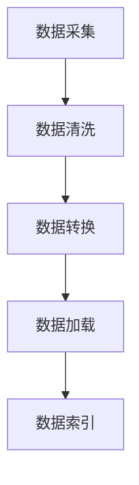
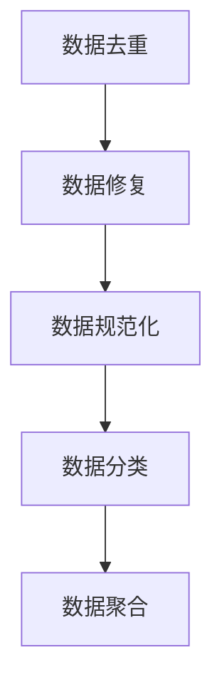
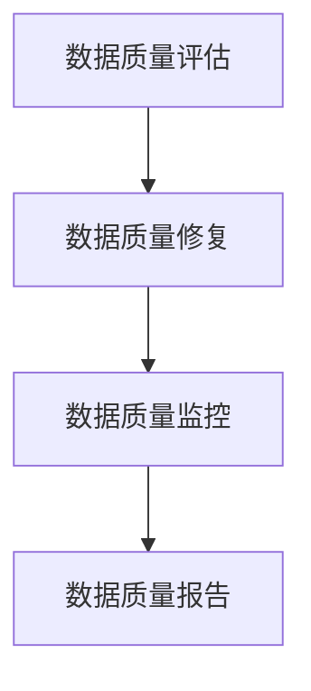

                 

### 文章标题：数据湖架构：大数据存储与分析的新范式

关键词：数据湖、大数据存储、数据分析、分布式计算、数据架构

摘要：本文深入探讨了数据湖架构的基本概念、设计原则、核心组件、应用实践以及技术选型与实施步骤。通过一步一步的分析和推理，本文旨在揭示数据湖作为大数据存储与分析新范式的优势与挑战，并提供全面的指导，帮助读者更好地理解与实施数据湖架构。

### 第1章：数据湖的基本概念

#### 1.1 数据湖的定义与特征

数据湖是一种新型的数据架构，用于存储大量的结构化和非结构化数据，以支持复杂的分析处理。数据湖与传统数据仓库的主要区别在于其数据存储和处理方式的灵活性。传统数据仓库侧重于结构化数据的高效查询和分析，而数据湖能够存储和整合各类数据，包括文本、图像、音频、视频等，并进行大规模的数据处理和分析。

数据湖的特征包括：

1. **数据多样性**：支持多种数据类型，如文本、图像、音频、视频等。
2. **数据完整性**：数据湖中的数据经过清洗和预处理，确保数据质量。
3. **数据灵活性**：支持灵活的数据结构和查询模式，适应不同类型的数据分析需求。
4. **数据规模**：能够存储和处理海量数据，满足大数据场景的需求。
5. **数据可扩展性**：支持横向和纵向的扩展，以适应数据增长和业务需求。

#### 1.2 数据湖与传统数据仓库的区别

传统数据仓库主要关注结构化数据的存储、查询和分析，其数据存储结构通常是固定的，以支持快速的OLAP（联机分析处理）查询。而数据湖则更加灵活，可以存储不同类型的数据，并支持大规模的数据处理和分析。

1. **数据类型**：数据仓库主要处理结构化数据，而数据湖处理结构化和非结构化数据。
2. **数据存储结构**：数据仓库的数据存储结构是固定的，而数据湖的数据存储结构是动态的，可以根据数据类型和需求进行调整。
3. **数据处理**：数据仓库的数据处理通常在数据库内部完成，而数据湖采用分布式计算框架，如Hadoop、Spark等进行大规模数据处理。
4. **查询性能**：数据仓库的查询性能较高，适合快速响应的查询需求，而数据湖的处理能力更强，适合大规模数据分析和机器学习。

#### 1.3 数据湖的应用场景

数据湖在多种场景下具有显著优势，以下是其主要应用场景：

1. **数据集成**：数据湖能够整合来自不同源的数据，包括内部数据和外部数据，实现数据的统一管理和分析。
2. **数据分析和机器学习**：数据湖提供了丰富的数据资源，支持复杂的数据分析和机器学习模型训练，为企业提供深入的洞察和决策支持。
3. **实时数据流处理**：数据湖支持实时数据流处理，可以快速响应实时数据变化，为企业提供实时决策支持。
4. **大数据应用**：数据湖能够存储和处理海量数据，适用于大数据应用，如社交媒体分析、金融市场分析、物联网数据分析等。

#### 1.4 数据湖的组成部分

数据湖由多个核心组件构成，包括数据源、数据采集与加载、数据存储与管理、数据处理与计算以及数据分析与应用。以下是各组件的简要介绍：

1. **数据源**：包括各种结构化和非结构化数据源，如数据库、文件系统、数据流、外部数据源等。
2. **数据采集与加载**：负责从数据源采集数据，并进行数据清洗、转换和加载，确保数据质量。
3. **数据存储与管理**：负责数据的存储和管理，包括分布式文件系统、云存储、分布式数据库等。
4. **数据处理与计算**：包括分布式计算框架和数据处理工具，如Hadoop、Spark等，支持大规模数据处理和分析。
5. **数据分析与应用**：提供数据分析工具和平台，支持数据挖掘、机器学习、可视化等，为企业提供决策支持和业务洞察。

#### 1.5 数据湖的发展历程

数据湖的兴起与大数据技术的发展密切相关。随着互联网、物联网、社交媒体等新兴技术的发展，数据量呈现爆炸式增长，传统的数据仓库架构已经无法满足海量数据的存储和处理需求。数据湖应运而生，通过提供更灵活、可扩展的数据存储和处理架构，解决了大数据场景下的数据管理和分析难题。

1. **数据仓库阶段**：传统的数据仓库主要用于存储和查询结构化数据，以支持企业决策支持系统。
2. **数据湖阶段**：数据湖的概念提出，用于存储和整合结构化和非结构化数据，支持大规模数据处理和分析。
3. **数据湖演进**：随着技术的不断发展，数据湖逐渐演进为支持实时数据流处理、人工智能应用等更高级的数据分析场景。

### 第2章：数据湖架构的设计原则

数据湖架构的设计原则是构建高效、可靠、可扩展的数据湖系统的关键。以下将详细介绍数据湖架构的设计原则，包括核心要素、分层设计、弹性扩展和容错与高可用设计。

#### 2.1 数据湖架构的核心要素

数据湖架构的核心要素包括数据存储架构、数据处理架构、数据分析架构以及数据安全与合规性架构。以下是各核心要素的简要介绍：

1. **数据存储架构**：数据存储架构是数据湖的基础，负责数据的存储和管理。常用的存储技术包括分布式文件系统（如HDFS）、云存储（如AWS S3）和分布式数据库（如HBase、Cassandra）。

2. **数据处理架构**：数据处理架构负责对数据进行采集、清洗、转换和加载。常用的数据处理技术包括分布式计算框架（如Hadoop、Spark）和流处理系统（如Apache Kafka、Apache Flink）。

3. **数据分析架构**：数据分析架构提供数据分析和数据挖掘工具，支持企业进行数据探索和预测分析。常用的数据分析工具包括SQL查询引擎（如Apache Hive、Apache Impala）、机器学习框架（如TensorFlow、PyTorch）和数据可视化工具（如Tableau、Power BI）。

4. **数据安全与合规性架构**：数据安全与合规性架构负责确保数据的安全性和合规性。包括数据加密、访问控制、审计和日志记录等安全措施。

#### 2.2 数据湖的分层设计

数据湖采用分层设计，将数据湖架构划分为多个层次，每个层次负责不同的功能。以下是数据湖的分层设计：

1. **数据采集层**：数据采集层负责从各种数据源（如数据库、文件系统、数据流、外部API等）采集数据。常用的数据采集工具包括Apache Flume、Apache Kafka等。

2. **数据存储层**：数据存储层负责存储采集到的数据。数据存储层可以选择分布式文件系统（如HDFS）、云存储（如AWS S3）或分布式数据库（如HBase、Cassandra）。

3. **数据处理层**：数据处理层负责对数据进行清洗、转换和加载。数据处理层通常采用分布式计算框架（如Hadoop、Spark）进行大规模数据处理。

4. **数据分析层**：数据分析层提供数据分析和数据挖掘工具，支持企业进行数据探索和预测分析。数据分析层可以使用SQL查询引擎（如Apache Hive、Apache Impala）、机器学习框架（如TensorFlow、PyTorch）和数据可视化工具（如Tableau、Power BI）。

#### 2.3 数据湖的弹性扩展

数据湖的弹性扩展是保证数据湖系统在高并发、大数据量场景下稳定运行的关键。数据湖的弹性扩展包括横向扩展和纵向扩展：

1. **横向扩展**：横向扩展是指通过增加计算节点或存储节点来提高系统性能和处理能力。常用的横向扩展策略包括分布式计算框架（如Hadoop、Spark）的节点扩展和分布式数据库（如HBase、Cassandra）的集群扩展。

2. **纵向扩展**：纵向扩展是指通过升级计算节点或存储节点的硬件配置来提高系统性能和处理能力。常用的纵向扩展策略包括增加CPU、内存、硬盘等硬件资源。

#### 2.4 数据湖的容错与高可用设计

数据湖的容错与高可用设计是确保数据湖系统稳定运行的关键。以下是数据湖的容错与高可用设计原则：

1. **数据冗余与备份**：数据冗余与备份是确保数据安全性的关键。常用的数据冗余与备份策略包括数据复制、数据镜像和数据备份。

2. **数据同步与一致性**：数据同步与一致性是确保数据一致性的关键。常用的数据同步与一致性策略包括分布式计算框架（如Hadoop、Spark）的数据一致性机制和分布式数据库（如HBase、Cassandra）的一致性协议。

3. **高可用架构设计**：高可用架构设计是确保数据湖系统在故障情况下能够快速恢复和数据不丢失的关键。常用的高可用架构设计包括主从架构、分布式集群架构和故障转移机制。

### 第3章：数据采集与加载

数据采集与加载是数据湖架构中的关键环节，它决定了数据的质量和可用性。在这一章中，我们将详细探讨数据采集的挑战与解决方案、数据加载流程设计以及数据清洗与预处理。

#### 3.1 数据采集的挑战与解决方案

数据采集过程中面临的主要挑战包括：

1. **数据源异构性**：不同数据源的数据格式、协议和接口各不相同，增加了数据采集的复杂性。
2. **数据质量与完整性**：数据源中可能存在缺失、错误或不一致的数据，影响了数据的准确性和可用性。
3. **数据采集的成本与效率**：大规模数据采集需要消耗大量的计算资源和网络带宽，同时要求高效的数据采集过程以减少延迟。

针对上述挑战，可以采取以下解决方案：

1. **统一数据接口**：通过构建统一的数据接口层，实现不同数据源的统一接入和管理，简化数据采集流程。
2. **数据质量监控**：引入数据质量监控工具，实时检测数据源中的数据质量问题，并自动进行数据修复和清洗。
3. **分布式数据采集**：采用分布式数据采集技术，将数据采集任务分解到多个节点并行执行，提高数据采集的效率。

#### 3.2 数据加载流程设计

数据加载流程包括以下几个步骤：

1. **数据采集**：从数据源采集原始数据，包括结构化数据和非结构化数据。
2. **数据清洗**：对采集到的数据进行清洗，去除重复、缺失和错误的数据，确保数据质量。
3. **数据转换**：将清洗后的数据转换为统一的格式，如JSON、CSV等，以便后续处理和分析。
4. **数据加载**：将转换后的数据加载到数据湖中，包括分布式文件系统、云存储和分布式数据库等。
5. **数据索引**：为加载到数据湖的数据建立索引，提高查询性能。

以下是一个典型的数据加载流程图：

#### 3.3 数据清洗与预处理

数据清洗与预处理是数据湖架构中的重要环节，其目的是确保数据的质量和一致性。以下是数据清洗与预处理的主要步骤：

1. **数据去重**：识别并删除重复的数据记录，避免数据冗余。
2. **数据修复**：修复数据源中的缺失值和错误值，确保数据的准确性。
3. **数据规范化**：统一数据格式和编码，确保数据的一致性。
4. **数据分类**：根据数据类型和用途对数据进行分类，便于后续处理和分析。
5. **数据聚合**：对数据进行聚合操作，如求和、平均、最大值等，为数据分析提供基础。

以下是一个数据清洗与预处理流程图：

#### 3.4 数据采集与加载工具选型

在选择数据采集与加载工具时，需要考虑以下几个因素：

1. **数据源类型**：根据数据源的类型选择合适的采集工具，如关系数据库选择JDBC驱动，NoSQL数据库选择相应的连接器。
2. **数据量大小**：对于大规模数据采集和加载，选择能够处理高并发的分布式采集工具，如Apache Kafka、Apache Flume。
3. **数据处理能力**：根据数据处理的需求，选择合适的处理工具，如分布式计算框架Hadoop、Spark等。
4. **系统集成性**：选择能够与现有系统集成度高的工具，降低系统开发和维护成本。

以下是几种常见的数据采集与加载工具：

1. **Apache Kafka**：适用于实时数据流处理，支持高吞吐量的分布式数据采集和加载。
2. **Apache Flume**：适用于离线数据采集和加载，支持多种数据源和目标系统的集成。
3. **Apache NiFi**：适用于数据流管理和数据集成，提供图形化界面进行数据流的配置和管理。
4. **Apache Sqoop**：适用于关系数据库和Hadoop之间的数据迁移和同步。

### 第4章：数据存储与管理

数据存储与管理是数据湖架构的核心，它决定了数据的持久性、可用性和性能。在这一章中，我们将详细探讨数据存储的选择策略、数据管理的基本原则以及数据质量管理与监控。

#### 4.1 数据存储的选择策略

数据存储的选择策略需要考虑以下因素：

1. **数据类型**：根据数据类型选择合适的存储技术，如结构化数据选择关系数据库或分布式数据库，非结构化数据选择分布式文件系统或云存储。
2. **数据规模**：根据数据规模选择合适的存储方案，如小型数据规模选择本地存储，大规模数据规模选择分布式存储或云存储。
3. **数据访问频率**：根据数据访问频率选择合适的存储介质，如热数据选择高速存储介质（如SSD），冷数据选择低速存储介质（如HDD）。
4. **数据一致性**：根据数据一致性要求选择合适的存储方案，如强一致性选择分布式数据库，最终一致性选择分布式文件系统。

以下是常见的数据存储选择策略：

1. **分布式文件系统**：适用于大规模数据存储和分布式计算，如Hadoop的HDFS、HDFS Federation等。
2. **云存储**：适用于大规模数据存储和弹性扩展，如AWS S3、Azure Blob Storage等。
3. **分布式数据库**：适用于结构化数据存储和实时查询，如Apache Cassandra、Apache HBase等。
4. **关系数据库**：适用于小型数据规模和复杂查询，如MySQL、PostgreSQL等。

#### 4.2 数据管理的基本原则

数据管理的基本原则包括：

1. **数据标准化**：统一数据格式和命名规范，确保数据的一致性和可扩展性。
2. **数据生命周期管理**：定义数据生命周期，包括创建、存储、使用、归档和销毁等阶段，确保数据的有效利用和合规性。
3. **数据质量控制**：建立数据质量控制机制，包括数据清洗、数据校验和数据监控等，确保数据的准确性和可靠性。

以下是数据管理的基本原则：

1. **数据一致性**：确保数据在系统中的一致性和准确性，避免数据冗余和冲突。
2. **数据安全性**：确保数据的安全性和隐私性，包括数据加密、访问控制和审计等安全措施。
3. **数据可用性**：确保数据的高可用性和可访问性，包括数据备份、故障转移和数据恢复等机制。
4. **数据可扩展性**：确保数据架构的可扩展性，以适应数据增长和业务需求的变化。

#### 4.3 数据质量管理与监控

数据质量管理与监控是确保数据质量的关键环节。以下是数据质量管理与监控的主要步骤：

1. **数据质量评估**：定期对数据质量进行评估，识别数据质量问题，如缺失、错误、不一致等。
2. **数据质量修复**：针对识别出的数据质量问题，进行数据修复和清洗，确保数据的准确性和完整性。
3. **数据质量监控**：建立数据质量监控机制，实时监测数据质量，确保数据质量的持续提升。
4. **数据质量报告**：定期生成数据质量报告，向管理层和相关部门提供数据质量的评估和改进建议。

以下是数据质量管理与监控的流程：

#### 4.4 数据湖中的数据存储技术

数据湖中的数据存储技术主要包括分布式文件系统、云存储和分布式数据库：

1. **分布式文件系统**：适用于大规模数据存储和分布式计算，如Hadoop的HDFS、Alluxio等。
   - **优势**：高可靠性、高吞吐量、支持大数据量存储。
   - **挑战**：不支持实时查询、数据访问速度较慢。

2. **云存储**：适用于大规模数据存储和弹性扩展，如AWS S3、Azure Blob Storage等。
   - **优势**：高可用性、弹性扩展、低成本。
   - **挑战**：数据访问速度较慢、数据传输成本较高。

3. **分布式数据库**：适用于结构化数据存储和实时查询，如Apache Cassandra、Apache HBase等。
   - **优势**：高可用性、高性能、支持实时查询。
   - **挑战**：数据一致性保证较难、数据迁移成本较高。

#### 4.5 数据存储与管理的挑战与解决方案

数据存储与管理面临的主要挑战包括：

1. **数据存储容量管理**：随着数据量的不断增长，如何合理分配和管理存储资源，避免存储容量不足或浪费。
2. **数据存储性能优化**：如何提高数据存储和访问速度，满足大规模数据查询和实时数据处理的需求。
3. **数据存储安全性**：如何确保数据的安全性，防止数据泄露、篡改和丢失。

以下是数据存储与管理的挑战及解决方案：

1. **数据存储容量管理**：采用自动化存储资源管理工具，如Hadoop的HDFS Federation、AWS自动扩展存储等，实现存储资源的自动分配和调整。
2. **数据存储性能优化**：采用数据分片、数据压缩、缓存等技术，提高数据存储和访问速度。如Hadoop的HDFS压缩、Cassandra的数据分片等。
3. **数据存储安全性**：采用数据加密、访问控制和审计等安全措施，确保数据的安全性和合规性。如Hadoop的HDFS加密、Cassandra的访问控制等。

### 第5章：数据湖计算框架

数据湖计算框架是数据湖架构中关键的一环，它决定了数据湖的处理能力、性能和可扩展性。在这一章中，我们将探讨数据湖计算的需求与挑战、分布式计算技术概述以及数据湖计算框架实践。

#### 5.1 数据湖计算的需求与挑战

数据湖计算的需求主要来自于大数据场景下的数据分析和处理需求。以下是数据湖计算的需求和挑战：

1. **海量数据处理**：数据湖需要处理海量数据，包括结构化和非结构化数据，对计算性能和扩展性有较高要求。
2. **多样性数据类型**：数据湖包含多种数据类型，如文本、图像、音频、视频等，需要支持不同类型数据的处理和分析。
3. **实时数据处理**：数据湖需要支持实时数据处理，以满足实时数据分析、机器学习等应用的需求。
4. **数据一致性**：在分布式计算环境中，如何保证数据的一致性，避免数据冲突和丢失。
5. **计算性能优化**：如何优化计算性能，提高数据处理速度和资源利用率。

数据湖计算面临的挑战包括：

1. **计算资源管理**：如何高效地管理和调度计算资源，以满足大规模数据处理需求。
2. **数据分布和负载均衡**：如何合理分布数据和处理任务，避免单点瓶颈和资源浪费。
3. **数据安全和隐私**：如何确保数据安全和隐私，防止数据泄露和滥用。
4. **计算框架兼容性**：如何支持多种编程语言和计算框架，实现统一的计算接口。

#### 5.2 分布式计算技术概述

分布式计算技术是数据湖计算框架的核心，它能够实现海量数据的分布式处理和计算。以下是分布式计算技术的基本概念和架构：

1. **分布式计算基本概念**
   - **分布式系统**：由多个计算节点组成的系统，通过网络进行通信和协作。
   - **并行计算**：多个计算任务同时执行，提高计算速度和性能。
   - **负载均衡**：将计算任务均匀分布到多个节点，避免单点瓶颈和资源浪费。

2. **分布式计算架构**
   - **计算节点**：分布式计算系统的基本单位，包括计算资源（CPU、内存）和网络连接。
   - **数据节点**：存储和管理数据的节点，通常与计算节点分离。
   - **任务调度器**：负责调度计算任务，分配计算资源和监控节点状态。

3. **分布式计算的优势与局限**
   - **优势**：
     - **高扩展性**：支持大规模数据处理，可以动态增加计算节点。
     - **高性能**：通过并行计算，提高数据处理速度和性能。
     - **高可用性**：通过冗余和备份机制，提高系统的可靠性和容错性。
   - **局限**：
     - **复杂性**：分布式系统的开发和维护相对复杂，需要解决网络通信、数据一致性和故障恢复等问题。
     - **性能瓶颈**：分布式系统中的网络通信和数据传输可能成为性能瓶颈。

#### 5.3 数据湖计算框架实践

数据湖计算框架实践包括选择合适的计算框架、构建计算环境、进行数据处理和优化等步骤。以下是数据湖计算框架实践的关键步骤：

1. **计算框架选择**
   - **Hadoop**：适用于大数据存储和分布式计算，包括HDFS（分布式文件系统）和MapReduce（分布式计算框架）。
   - **Spark**：适用于大规模数据处理和实时计算，具有高性能和易用性。
   - **Flink**：适用于实时数据处理和流计算，具有低延迟和高吞吐量。
   - **其他计算框架**：如Apache Storm、Apache Samza等，适用于特定场景的数据处理需求。

2. **计算环境构建**
   - **硬件配置**：根据数据处理需求，选择合适的硬件配置，如CPU、内存、硬盘等。
   - **软件安装**：安装和配置计算框架和相关依赖，如Hadoop、Spark、Flink等。
   - **集群管理**：配置集群管理工具，如Hadoop的YARN、Spark的Spark Mesos等，实现计算资源的调度和管理。

3. **数据处理**
   - **数据采集**：从数据源采集数据，并进行数据清洗和预处理。
   - **数据存储**：将预处理后的数据存储到数据湖中，如HDFS、AWS S3等。
   - **数据处理**：使用计算框架进行数据处理和分析，如MapReduce、Spark SQL、Flink SQL等。

4. **性能优化**
   - **数据分布**：合理分布数据和处理任务，避免单点瓶颈和资源浪费。
   - **任务调度**：优化任务调度策略，提高资源利用率和处理速度。
   - **数据压缩**：使用数据压缩技术，减少数据传输和存储空间。
   - **缓存和索引**：使用缓存和索引技术，提高数据访问速度和查询性能。

### 第6章：数据湖在企业中的应用

数据湖在企业数据架构中扮演着越来越重要的角色，它为企业提供了丰富的数据资源，支持复杂的数据分析和业务洞察。在这一章中，我们将探讨数据湖在企业中的应用、数据湖在不同行业的应用案例以及数据湖带来的业务价值。

#### 6.1 数据湖在企业数据架构中的作用

数据湖在企业数据架构中的作用包括：

1. **数据整合**：数据湖能够整合来自不同源的数据，包括内部数据和外部数据，实现数据的统一管理和分析。
2. **数据开放**：数据湖提供了一个开放的数据平台，支持跨部门、跨系统的数据共享和协作。
3. **数据分析**：数据湖提供了丰富的数据资源，支持复杂的数据分析和机器学习模型训练，为企业提供深入的洞察和决策支持。
4. **数据治理**：数据湖支持数据质量管理、数据安全性和合规性，确保数据的准确性和可靠性。

#### 6.2 数据湖在不同行业的应用案例

数据湖在不同行业中具有广泛的应用，以下是几个典型应用案例：

1. **金融行业**：
   - **风险管理**：通过数据湖整合金融数据，支持实时风险评估和欺诈检测。
   - **客户分析**：通过数据湖分析客户行为和偏好，优化产品和服务策略。
   - **市场研究**：通过数据湖分析市场数据，支持投资决策和市场预测。

2. **零售行业**：
   - **客户关系管理**：通过数据湖整合客户数据，支持个性化推荐和客户体验优化。
   - **供应链管理**：通过数据湖整合供应链数据，实现供应链优化和成本控制。
   - **库存管理**：通过数据湖分析库存数据，优化库存水平和供应链效率。

3. **医疗行业**：
   - **患者数据分析**：通过数据湖整合患者数据，支持个性化医疗和疾病预测。
   - **药品研发**：通过数据湖整合医学数据，支持新药研发和临床试验。
   - **医疗影像分析**：通过数据湖分析医疗影像数据，支持疾病诊断和辅助决策。

4. **物联网行业**：
   - **设备监控**：通过数据湖整合设备数据，实现实时监控和故障预测。
   - **智能交通**：通过数据湖整合交通数据，优化交通流量和道路规划。
   - **智慧城市**：通过数据湖整合城市数据，支持智慧城市建设和管理。

#### 6.3 数据湖带来的业务价值

数据湖带来的业务价值包括：

1. **数据洞察**：通过数据湖进行数据分析，企业能够发现潜在的业务机会和风险，做出更明智的决策。
2. **成本节约**：数据湖通过整合和优化数据存储和处理资源，降低数据存储和处理成本。
3. **运营效率**：数据湖支持实时数据处理和自动化分析，提高运营效率和响应速度。
4. **创新能力**：数据湖为企业提供了丰富的数据资源，支持创新业务模式和产品开发。

### 第7章：数据湖的运维与管理

数据湖的运维与管理是确保数据湖系统稳定运行和高效性能的关键。在这一章中，我们将探讨数据湖运维的挑战与策略、数据湖监控与性能优化以及数据湖安全与合规性。

#### 7.1 数据湖运维的挑战与策略

数据湖运维面临的主要挑战包括：

1. **系统复杂性**：数据湖涉及多种技术和组件，包括分布式存储、分布式计算、数据治理等，系统复杂性高，运维难度大。
2. **数据量巨大**：数据湖存储和处理海量数据，对运维系统性能和资源管理提出了高要求。
3. **高可用性要求**：数据湖需要提供高可用性，确保数据不丢失和不中断服务。
4. **安全性保障**：数据湖存储敏感数据，需要提供严格的安全措施，防止数据泄露和滥用。

以下是数据湖运维的策略：

1. **自动化运维**：采用自动化运维工具和脚本，实现数据湖的自动化部署、监控和运维，提高运维效率和降低人力成本。
2. **监控与告警**：建立全面的监控体系，实时监控数据湖系统的运行状态和性能指标，及时发现问题并进行告警。
3. **容量规划**：根据数据增长和业务需求，进行容量规划，合理分配存储和计算资源，避免资源浪费和性能瓶颈。
4. **备份与恢复**：定期进行数据备份，建立数据恢复机制，确保数据的安全性和可靠性。

#### 7.2 数据湖监控与性能优化

数据湖监控与性能优化是确保数据湖系统高效稳定运行的关键。以下是数据湖监控与性能优化的重要方面：

1. **监控指标**：建立全面的监控指标体系，包括系统性能指标（如CPU利用率、内存使用率、磁盘空间使用率）、数据质量指标（如数据完整性、数据一致性）和业务指标（如数据查询响应时间、数据吞吐量）。
2. **监控工具**：选择合适的监控工具，如Prometheus、Grafana、Zabbix等，实现实时监控和数据可视化。
3. **性能优化**：通过分析监控数据，识别性能瓶颈和优化点，进行性能优化，如数据压缩、索引优化、查询优化等。
4. **自动化运维**：采用自动化运维工具和脚本，实现监控数据的自动收集、分析和告警，自动化执行性能优化任务。

#### 7.3 数据湖安全与合规性

数据湖安全与合规性是保护数据资产和确保数据合法合规的关键。以下是数据湖安全与合规性的重要方面：

1. **数据加密**：对存储和传输的数据进行加密，保护数据的安全性，防止数据泄露和未授权访问。
2. **访问控制**：采用严格的访问控制机制，确保只有授权用户可以访问数据，包括身份验证、权限控制和审计。
3. **安全策略**：制定数据湖的安全策略，包括数据备份策略、数据恢复策略、数据访问策略等，确保数据的安全性和可靠性。
4. **合规性要求**：遵守相关法律法规和行业标准，确保数据湖系统的合法合规运行，如GDPR、HIPAA等。

### 第8章：数据湖技术选型与实施

数据湖技术选型与实施是构建高效、可靠、可扩展数据湖系统的关键。在这一章中，我们将探讨数据湖关键技术介绍、数据湖平台选型策略以及数据湖硬件选型建议。

#### 8.1 数据湖关键技术介绍

数据湖的关键技术包括数据存储技术、数据处理技术和数据分析技术。以下是各关键技术的简要介绍：

1. **数据存储技术**：
   - **分布式文件系统**：如Hadoop的HDFS，适用于大规模数据存储和分布式计算。
   - **云存储**：如AWS S3、Azure Blob Storage，适用于大规模数据存储和弹性扩展。
   - **分布式数据库**：如Apache Cassandra、Apache HBase，适用于结构化数据存储和实时查询。

2. **数据处理技术**：
   - **分布式计算框架**：如Hadoop、Spark、Flink，适用于大规模数据处理和分析。
   - **流处理系统**：如Apache Kafka、Apache Flink，适用于实时数据处理和流计算。
   - **数据处理工具**：如Apache NiFi、Apache Sqoop，适用于数据采集、清洗、转换和加载。

3. **数据分析技术**：
   - **SQL查询引擎**：如Apache Hive、Apache Impala，适用于结构化数据查询和分析。
   - **机器学习框架**：如TensorFlow、PyTorch，适用于数据挖掘和机器学习模型训练。
   - **数据可视化工具**：如Tableau、Power BI，适用于数据分析和业务洞察。

#### 8.2 数据湖平台选型策略

在数据湖平台选型过程中，需要考虑以下几个因素：

1. **业务需求**：根据业务需求选择合适的平台，如企业级业务需求选择商业平台，研发测试需求选择开源平台。
2. **数据规模**：根据数据规模选择合适的平台，如小型数据规模选择本地部署，大规模数据规模选择云部署。
3. **数据处理能力**：根据数据处理能力选择合适的平台，如需要高性能数据处理选择Spark，需要实时数据处理选择Flink。
4. **扩展性**：根据扩展性需求选择合适的平台，如需要横向扩展选择分布式框架，需要纵向扩展选择云平台。

以下是常见的数据湖平台选型策略：

1. **开源平台**：如Hadoop、Spark、Flink等，适用于研发测试和小规模应用，具有高度灵活性和可定制性。
2. **商业平台**：如AWS Data Lake、Azure Data Lake、Google Cloud Data Lake等，适用于企业级应用，具有完善的生态体系和专业的技术支持。
3. **混合平台**：结合开源平台和商业平台的优势，实现数据湖的灵活部署和扩展。

#### 8.3 数据湖硬件选型建议

在数据湖硬件选型过程中，需要考虑以下几个因素：

1. **CPU性能**：根据数据处理需求选择合适的CPU性能，如需要高性能计算选择多核CPU，需要实时计算选择低延迟CPU。
2. **内存容量**：根据数据处理需求选择合适的内存容量，如需要处理大规模数据选择大内存服务器，需要实时处理选择高内存带宽。
3. **存储容量**：根据数据存储需求选择合适的存储容量，如需要大规模数据存储选择分布式存储系统，需要高速数据访问选择SSD存储。
4. **网络带宽**：根据数据传输需求选择合适的网络带宽，如需要高并发数据传输选择高带宽网络，需要远程数据传输选择高稳定性网络。

以下是常见的数据湖硬件选型建议：

1. **计算节点**：选择多核高性能CPU、大内存容量和高速网络接口的计算节点，如服务器、云服务器等。
2. **存储节点**：选择分布式存储系统，如HDFS、Cassandra等，实现大规模数据存储和分布式计算。
3. **网络设备**：选择高带宽、低延迟的网络设备，如交换机、路由器等，确保数据传输的高效和稳定。

### 第9章：数据湖实施步骤

数据湖实施是构建高效、可靠、可扩展数据湖系统的重要步骤。在这一章中，我们将详细探讨数据湖规划与设计、数据湖搭建与配置以及数据湖测试与优化。

#### 9.1 数据湖规划与设计

数据湖规划与设计是数据湖实施的第一步，它决定了数据湖系统的性能、可扩展性和可靠性。以下是数据湖规划与设计的关键步骤：

1. **需求分析**：明确业务需求和数据使用场景，确定数据湖的目标和范围。
2. **数据源识别**：识别和收集数据源，包括内部数据和外部数据，明确数据类型和数据量。
3. **数据架构设计**：设计数据湖的架构，包括数据存储架构、数据处理架构、数据分析架构等。
4. **技术选型**：根据需求和分析结果，选择合适的数据存储技术、数据处理技术和分析工具。
5. **硬件配置**：根据数据处理需求，选择合适的硬件配置，包括计算节点、存储节点和网络设备。
6. **安全与合规性设计**：设计数据湖的安全和合规性措施，包括数据加密、访问控制、审计等。

#### 9.2 数据湖搭建与配置

数据湖搭建与配置是数据湖实施的第二步，它涉及到数据源的接入、数据采集与加载、数据存储与管理以及数据处理与计算的配置。以下是数据湖搭建与配置的关键步骤：

1. **搭建计算环境**：安装和配置计算框架，如Hadoop、Spark、Flink等，搭建计算环境。
2. **搭建存储环境**：安装和配置数据存储系统，如HDFS、AWS S3、Cassandra等，搭建存储环境。
3. **数据源接入**：接入数据源，配置数据采集工具，如Apache Flume、Apache Kafka等，实现数据的实时采集和加载。
4. **数据加载**：进行数据清洗、转换和加载，将数据加载到数据湖中，确保数据质量。
5. **数据处理**：配置数据处理流程，包括数据预处理、数据清洗、数据转换等，支持大规模数据处理和分析。
6. **数据分析**：配置数据分析工具，如SQL查询引擎、机器学习框架等，支持数据分析和业务洞察。

#### 9.3 数据湖测试与优化

数据湖测试与优化是确保数据湖系统稳定运行和高效性能的关键步骤。以下是数据湖测试与优化的关键步骤：

1. **功能测试**：测试数据湖系统的功能是否完整，包括数据采集、数据存储、数据处理、数据分析等。
2. **性能测试**：测试数据湖系统的性能指标，包括数据查询响应时间、数据处理速度、资源利用率等。
3. **压力测试**：测试数据湖系统在高并发、大数据量场景下的稳定性和性能，识别性能瓶颈和优化点。
4. **优化措施**：根据测试结果，进行性能优化，如数据压缩、索引优化、查询优化等，提高数据湖系统的性能和效率。
5. **持续优化**：定期进行性能测试和优化，持续提升数据湖系统的性能和稳定性。

### 附录：数据湖技术资源与工具

#### 附录 A：数据湖相关技术文档

以下是数据湖相关的技术文档和资料，供读者参考：

1. **Hadoop官方文档**：[Hadoop官方文档](https://hadoop.apache.org/docs/)
2. **Spark官方文档**：[Spark官方文档](https://spark.apache.org/docs/)
3. **Flink官方文档**：[Flink官方文档](https://flink.apache.org/docs/)
4. **Cassandra官方文档**：[Cassandra官方文档](http://cassandra.apache.org/doc/cassandra/)
5. **HBase官方文档**：[HBase官方文档](https://hbase.apache.org/manual.html)

#### 附录 B：数据湖常用工具与软件

以下是数据湖中常用的工具和软件，供读者参考：

1. **Apache Kafka**：[Apache Kafka](https://kafka.apache.org/)
2. **Apache Flume**：[Apache Flume](https://flume.apache.org/)
3. **Apache NiFi**：[Apache NiFi](https://niFi.apache.org/)
4. **Apache Sqoop**：[Apache Sqoop](https://sqoop.apache.org/)
5. **Apache Hive**：[Apache Hive](https://hive.apache.org/)
6. **Apache Impala**：[Apache Impala](https://impala.apache.org/)
7. **TensorFlow**：[TensorFlow](https://tensorflow.org/)
8. **PyTorch**：[PyTorch](https://pytorch.org/)
9. **Tableau**：[Tableau](https://tableau.com/)
10. **Power BI**：[Power BI](https://powerbi.com/)

### 总结与展望

本文通过一步一步的分析和推理，深入探讨了数据湖架构的基本概念、设计原则、核心组件、应用实践以及技术选型与实施步骤。数据湖作为大数据存储与分析的新范式，具有数据多样性、数据完整性、数据灵活性和数据可扩展性等优势，适用于各种大数据场景。

然而，数据湖架构也面临系统复杂性、数据量巨大、高可用性要求、安全性保障等挑战。为了构建高效、可靠、可扩展的数据湖系统，需要遵循数据湖架构的设计原则，选择合适的技术和工具，进行系统规划与设计、搭建与配置、测试与优化。

展望未来，数据湖技术将继续演进，支持实时数据处理、人工智能应用、边缘计算等新兴场景。同时，数据湖技术将更加智能化、自动化，降低运维成本，提高系统性能和可靠性。我们期待数据湖技术为企业和行业带来更多的创新和价值。

