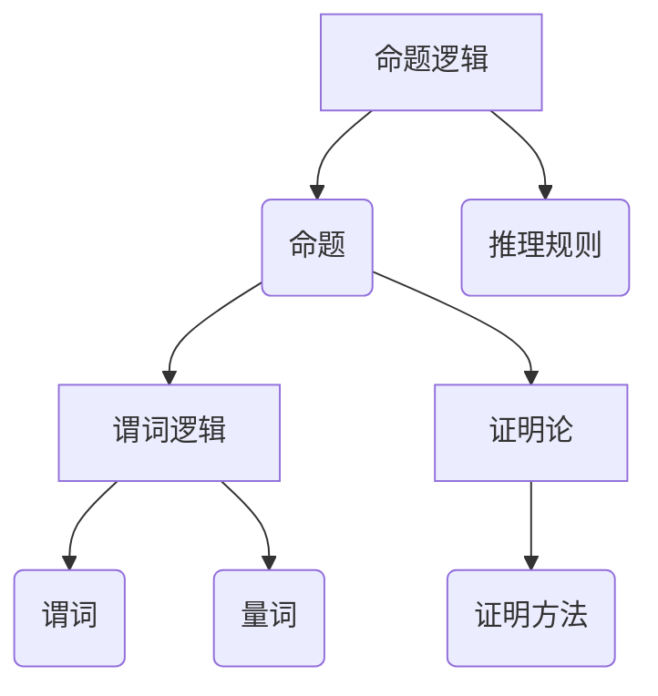
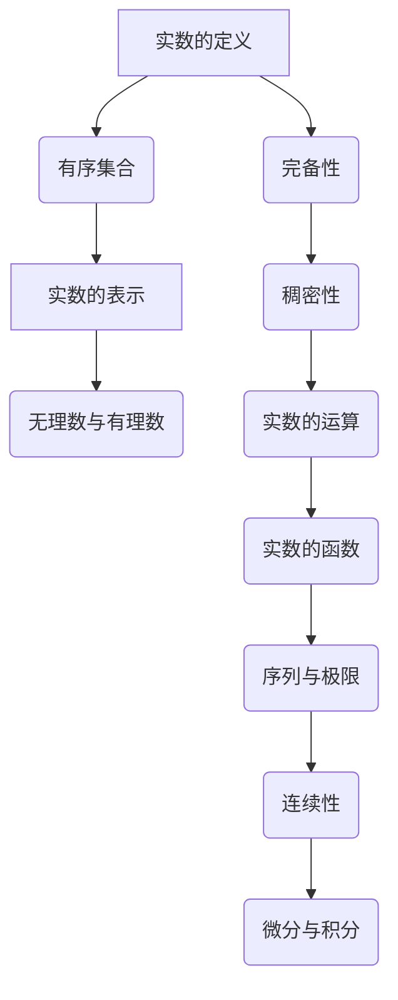
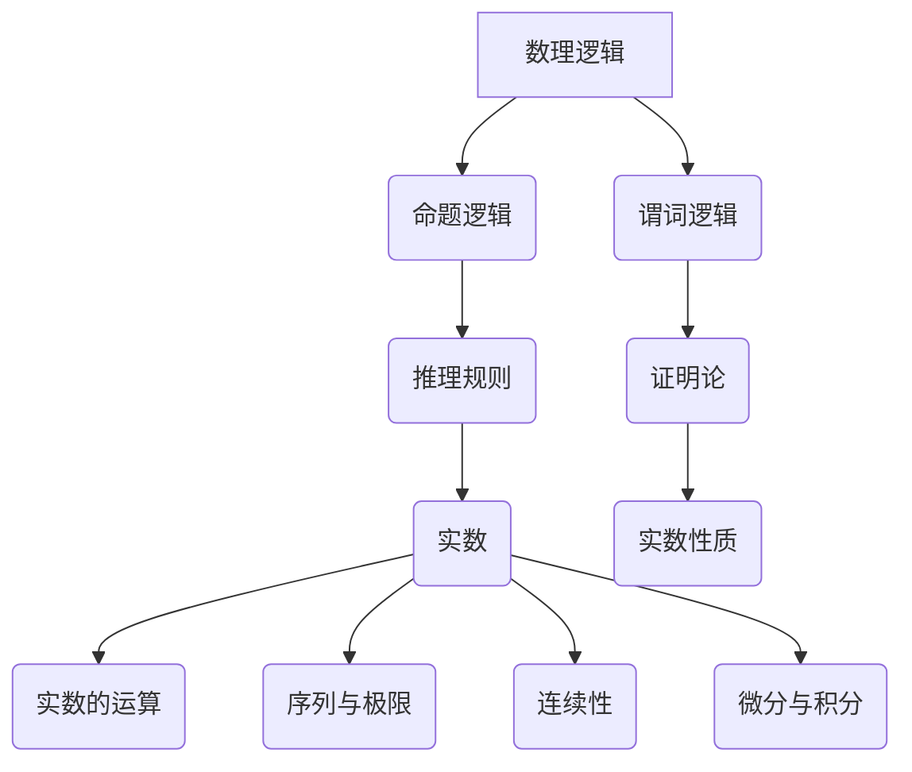

                 

## 文章标题：数理逻辑：实数

> 关键词：数理逻辑、实数、数学模型、算法原理、应用分析

> 摘要：本文深入探讨了数理逻辑中的实数概念，从基础定义到高级性质，逐步解析了实数的逻辑结构。文章通过清晰易懂的技术语言，结合Mermaid流程图、伪代码、数学公式和实际项目案例，详细阐述了实数的运算、函数、序列与极限、连续性以及微分与积分等内容，为读者提供了一个全面且深刻的理解框架。本文旨在帮助读者掌握数理逻辑中的实数原理，为实际应用打下坚实基础。

## 《数理逻辑：实数》目录大纲

- **第1章 引言**
  - 1.1 数理逻辑的基本概念
  - 1.2 数理逻辑的重要性
  - 1.3 实数的概念与性质
- **第2章 实数的定义与表示**
  - 2.1 实数的定义
  - 2.2 实数的表示方法
  - 2.3 实数的性质
- **第3章 实数的大小比较**
  - 3.1 实数的大小比较原理
  - 3.2 实数的大小比较方法
  - 3.3 实数的大小比较应用
- **第4章 实数的运算**
  - 4.1 实数的加法
  - 4.2 实数的减法
  - 4.3 实数的乘法
  - 4.4 实数的除法
  - 4.5 实数的运算性质
- **第5章 实数的函数**
  - 5.1 实数函数的基本概念
  - 5.2 实数函数的性质
  - 5.3 实数函数的应用
- **第6章 实数的序列与极限**
  - 6.1 实数序列的概念
  - 6.2 实数序列的性质
  - 6.3 实数序列的极限
  - 6.4 极限的应用
- **第7章 实数的连续性**
  - 7.1 实数的连续性定义
  - 7.2 实数的连续性性质
  - 7.3 实数的连续性与可导性
- **第8章 实数的微分与积分**
  - 8.1 实数的微分
  - 8.2 实数的积分
  - 8.3 微积分的基本定理
- **第9章 实数的应用**
  - 9.1 实数在几何中的应用
  - 9.2 实数在物理中的应用
  - 9.3 实数在其他领域的应用
- **第10章 总结与展望**
  - 10.1 数理逻辑与实数的关系
  - 10.2 实数的研究进展与未来展望
  - 10.3 数理逻辑与实数在实际应用中的前景

## 第1章 引言

### 1.1 数理逻辑的基本概念

数理逻辑是数学的一个分支，它研究数学和逻辑之间的关系，特别是如何用逻辑的方法来建立数学系统的理论基础。数理逻辑的基本概念包括命题、命题逻辑、谓词逻辑、证明论等。在数理逻辑中，数学命题被视为逻辑命题，数学定理的证明被视为逻辑证明。

#### **Mermaid 流程图**



### 1.2 数理逻辑的重要性

数理逻辑在数学、计算机科学、哲学等多个领域都有重要应用。在数学中，数理逻辑帮助建立数学定理的严密性和准确性；在计算机科学中，数理逻辑是形式化方法的基础，用于验证软件和硬件系统的正确性。

### 1.3 实数的概念与性质

实数是数理逻辑中的一个核心概念。实数集合是一个有序集合，它包含了有理数和无理数。实数的性质包括完备性、稠密性等。这些性质使得实数成为研究函数、序列、连续性等数学问题的理想工具。

#### **Mermaid 流程图**



### 总结

本章介绍了数理逻辑的基本概念和实数的概念与性质。在接下来的章节中，我们将进一步探讨实数的定义、表示方法、大小比较、运算、函数、序列与极限、连续性、微分与积分等内容，帮助读者深入理解数理逻辑中的实数理论。通过这些内容的讲解，读者将能够掌握实数的基本原理和应用，为后续的学习和研究打下坚实的基础。

### 核心概念与联系

#### **Mermaid 流程图**



#### **核心概念解释**

1. **数理逻辑**：研究数学和逻辑关系的数学分支，包括命题逻辑、谓词逻辑和证明论。
2. **命题逻辑**：研究命题和推理规则，是数理逻辑的基础。
3. **谓词逻辑**：研究包含变量的命题，引入了量词的概念。
4. **证明论**：研究数学定理的证明方法。
5. **实数**：数理逻辑中的一个核心概念，包括有理数和无理数。
6. **实数的性质**：包括完备性、稠密性等，这些性质使得实数在数学研究中具有重要作用。
7. **实数的运算**：包括加法、减法、乘法、除法等，这些运算是实数的基本操作。
8. **序列与极限**：实数序列的极限是实数中的一个重要概念，用于研究函数的性质。
9. **连续性**：实数的连续性定义了函数在实数上的连续性。
10. **微分与积分**：微积分是实数的重要应用之一，用于研究函数的变化率和累积量。

通过这个流程图，我们可以清晰地看到数理逻辑和实数之间的核心概念及其联系。这些概念构成了数理逻辑与实数理论的基础，为后续内容的学习提供了重要的理论支持。

### 核心算法原理讲解

在数理逻辑中，实数的加法和乘法是基础运算。为了更好地理解这些算法的原理，我们将使用伪代码来详细阐述它们的实现过程。

#### **伪代码：实数的加法**

```pseudo
// 实数的加法
function 加法(a: 实数, b: 实数): 实数
    // 将实数表示为分数形式
    a1, a2 = a的分数表示()
    b1, b2 = b的分数表示()

    // 计算分子和分母的和
    分子 = a1 * b2 + b1 * a2
    分母 = a2 * b2

    // 化简分数
    分子, 分母 = 化简分数(分子, 分母)

    // 返回结果
    return 分子 / 分母
```

#### **详细解释**

1. **分数表示**：实数通常表示为分数形式，即分子除以分母。
2. **计算和**：使用分数的表示方法，计算两个实数的分子和分母的和。
3. **化简分数**：通过化简分数，使得结果最简化。
4. **返回结果**：返回化简后的分数，即为两个实数的和。

#### **伪代码：实数的乘法**

```pseudo
// 实数的乘法
function 乘法(a: 实数, b: 实数): 实数
    // 将实数表示为分数形式
    a1, a2 = a的分数表示()
    b1, b2 = b的分数表示()

    // 计算分子和分母的乘积
    分子 = a1 * b1
    分母 = a2 * b2

    // 化简分数
    分子, 分母 = 化简分数(分子, 分母)

    // 返回结果
    return 分子 / 分母
```

#### **详细解释**

1. **分数表示**：实数表示为分数形式。
2. **计算积**：计算两个实数的分子和分母的乘积。
3. **化简分数**：化简分数，使得结果最简化。
4. **返回结果**：返回化简后的分数，即为两个实数的乘积。

通过这两个伪代码示例，我们可以清晰地看到实数的加法和乘法的算法原理。这些算法原理是实数运算的基础，对于理解实数的其他性质和应用具有重要意义。

### 数学模型和数学公式 & 详细讲解 & 举例说明

实数理论中的数学模型和公式是理解实数性质和运算的重要工具。以下我们将介绍一些关键的数学模型和公式，并详细讲解它们的含义和用途。

#### **数学公式**

$$
\lim_{{x \to \infty}} \frac{1}{x} = 0
$$

这个公式表示当 \( x \) 趋近于无穷大时，分数 \(\frac{1}{x}\) 的值趋近于0。这个极限的概念是实数序列与极限理论的基础。

#### **详细讲解**

1. **极限的定义**：极限是数学中的一个基本概念，用于描述一个函数在自变量趋近某个值时的行为。在这个公式中，我们考虑了函数 \( f(x) = \frac{1}{x} \) 当 \( x \) 趋近于无穷大时的行为。
2. **趋近于无穷大的含义**：当 \( x \) 趋近于无穷大时，意味着 \( x \) 的值越来越大，趋向于无穷大。
3. **分数的趋近值**：在这个公式中，当 \( x \) 趋近于无穷大时，分数 \(\frac{1}{x}\) 的值越来越小，接近于0。

#### **举例说明**

假设我们有一个数列 \( a_n = \frac{1}{n} \)，当 \( n \) 趋近于无穷大时，数列的值 \( a_n \) 也趋近于0。

这个例子帮助我们直观地理解了极限的概念。我们可以看到，无论 \( n \) 取多大，数列 \( a_n \) 的值都越来越接近0。

#### **数学公式**

$$
a^2 + b^2 = c^2
$$

这个公式是勾股定理的表达式，描述了直角三角形两条直角边的平方和等于斜边的平方。

#### **详细讲解**

1. **勾股定理的定义**：勾股定理是数学中的一个基本定理，描述了直角三角形三条边之间的关系。
2. **直角三角形的性质**：直角三角形有一个直角，另外两个角都是锐角。
3. **边的平方关系**：根据勾股定理，直角三角形的两条直角边的平方和等于斜边的平方。

#### **举例说明**

假设我们有一个直角三角形，其中直角边 \( a \) 的长度为3，直角边 \( b \) 的长度为4，那么斜边 \( c \) 的长度可以通过勾股定理计算得到：

$$
c^2 = a^2 + b^2 = 3^2 + 4^2 = 9 + 16 = 25
$$

因此，斜边 \( c \) 的长度为 \( \sqrt{25} = 5 \)。

通过这两个例子，我们可以看到数学公式在描述实数性质和运算中的重要作用。这些公式不仅帮助我们理解实数的概念，还为我们在实际问题中的应用提供了强有力的工具。

### 实数的定义与表示

实数是数理逻辑中一个核心的概念，它不仅包含了有理数，还包括无理数。为了精确地定义和表示实数，我们需要从基础的数学概念开始。

#### **定义**

实数集 \( \mathbb{R} \) 是一个完备的、有序的、稠密的集合。它由所有的有理数和无理数构成。

- **完备性**：实数集 \( \mathbb{R} \) 对于任何有界无限序列都存在一个极限。
- **有序性**：实数集 \( \mathbb{R} \) 中的元素可以通过大小关系进行比较。
- **稠密性**：在实数集 \( \mathbb{R} \) 中，任意两个不同的实数之间总存在无限多个其他的实数。

#### **表示方法**

实数的表示方法主要有两种：分数表示和十进制表示。

1. **分数表示**：实数可以表示为分数的形式，即形如 \( \frac{p}{q} \) 的形式，其中 \( p \) 和 \( q \) 是整数，且 \( q \neq 0 \)。有理数可以用这种形式表示，而无理数则不能用这种形式精确表示。

2. **十进制表示**：实数可以用十进制小数来表示。这种表示方法对于大多数有理数和无理数都是适用的。无理数在小数表示中会出现无限不循环的小数。

#### **性质**

实数具有以下重要性质：

- **闭合性**：实数的运算（加法、减法、乘法、除法）在实数集内是闭合的，即实数的运算结果仍然是实数。
- **交换律**：实数的加法和乘法满足交换律，即 \( a + b = b + a \) 和 \( a \times b = b \times a \)。
- **结合律**：实数的加法和乘法满足结合律，即 \( (a + b) + c = a + (b + c) \) 和 \( (a \times b) \times c = a \times (b \times c) \)。
- **分配律**：实数的乘法对加法满足分配律，即 \( a \times (b + c) = a \times b + a \times c \)。

#### **实例**

1. **有理数**：

   - 分数表示：\( \frac{3}{4} \)
   - 十进制表示：0.75
   
2. **无理数**：

   - 无限不循环小数：\( \pi \)（圆周率）
   - 无限循环小数：\( 0.3333\ldots \)（等于 \( \frac{1}{3} \)）

通过上述定义、表示方法和性质的详细讲解，我们可以更深入地理解实数在数理逻辑中的重要性。实数的完备性、有序性和稠密性为我们在数学分析和实际应用中提供了坚实的理论基础。在实际应用中，无论是科学计算还是工程实践，实数都是不可或缺的基本工具。

### 实数的大小比较

实数的大小比较是数理逻辑中一个基础且重要的概念。理解实数的大小比较方法有助于我们更深入地掌握实数的性质和应用。在这部分内容中，我们将详细探讨实数的大小比较原理、方法以及实际应用。

#### **大小比较原理**

实数的大小比较基于实数集的有序性。有序性意味着实数集 \( \mathbb{R} \) 中任意两个实数 \( a \) 和 \( b \) 都可以通过大小关系进行比较，即 \( a \) 和 \( b \) 的相对大小可以用 \( a < b \)、\( a = b \) 或 \( a > b \) 来表示。

- **小于**：如果对于任意 \( \epsilon > 0 \)，都存在一个实数 \( c \)，使得 \( b - \epsilon < c < a + \epsilon \)，则称 \( a \) 小于 \( b \)。
- **等于**：如果对于任意 \( \epsilon > 0 \)，都存在一个实数 \( c \)，使得 \( b - \epsilon \leq c \leq a + \epsilon \)，则称 \( a \) 等于 \( b \)。
- **大于**：如果对于任意 \( \epsilon > 0 \)，都存在一个实数 \( c \)，使得 \( a - \epsilon < c < b + \epsilon \)，则称 \( a \) 大于 \( b \)。

#### **大小比较方法**

1. **直接比较法**：对于有理数和无理数，可以直接通过数学运算进行比较。例如，两个有理数 \( a = \frac{p_1}{q_1} \) 和 \( b = \frac{p_2}{q_2} \) 的大小可以通过交叉相乘比较得到：如果 \( p_1 \times q_2 < p_2 \times q_1 \)，则 \( a < b \)。

2. **连续比较法**：对于复杂的不等式，可以通过逐步比较中间值的方法来确定大小关系。例如，对于 \( a \) 和 \( b \)，可以通过引入中间值 \( c = \frac{a + b}{2} \) 来比较大小。

3. **区间比较法**：利用区间表示法，可以将实数表示为区间，并通过比较区间的大小关系来确定实数的大小。例如，对于 \( a \) 和 \( b \)，可以分别表示为区间 \( [a_1, a_2] \) 和 \( [b_1, b_2] \)，通过比较区间端点的大小关系来确定大小。

#### **实际应用**

1. **数值计算**：在科学计算中，实数的大小比较是进行数值计算和优化算法的重要基础。例如，在求解非线性方程或最优化问题时，需要比较函数值来确定迭代方向和收敛性。

2. **算法设计**：在算法设计中，实数的大小比较是排序算法和搜索算法的核心。例如，在快速排序和二分搜索中，实数的大小比较是决定排序顺序和查找目标位置的关键。

3. **工程实践**：在工程实践中，实数的大小比较用于控制系统的设计和分析。例如，在控制系统中的反馈控制中，需要实时比较实际输出和期望输出的大小，以调整控制参数。

通过上述方法，我们可以清晰地理解实数的大小比较原理和实际应用。掌握这些方法不仅有助于我们在理论研究中深入理解实数的性质，也为我们在实际应用中提供了有效的工具。

### 实数的运算

实数的运算包括加法、减法、乘法和除法，这些基本运算构成了实数体系的核心。理解这些运算的基本原理和性质对于掌握实数的计算和应用至关重要。

#### **加法**

加法是实数运算中最基本的操作之一。对于任意两个实数 \( a \) 和 \( b \)，它们的和 \( c \) 定义为：

\[ c = a + b \]

**性质**：

- **交换律**：对于任意实数 \( a \) 和 \( b \)，有 \( a + b = b + a \)。
- **结合律**：对于任意实数 \( a \)、\( b \) 和 \( c \)，有 \( (a + b) + c = a + (b + c) \)。
- **零元素**：实数集 \( \mathbb{R} \) 中存在零元素 \( 0 \)，对于任意实数 \( a \)，有 \( a + 0 = 0 + a = a \)。

**伪代码**：

```python
def add(a: 实数, b: 实数) -> 实数:
    return a + b
```

#### **减法**

减法是加法的逆运算。对于任意两个实数 \( a \) 和 \( b \)，它们的差 \( c \) 定义为：

\[ c = a - b \]

**性质**：

- **交换律**：对于任意实数 \( a \) 和 \( b \)，有 \( a - b = - (b - a) \)。
- **结合律**：对于任意实数 \( a \)、\( b \) 和 \( c \)，有 \( (a - b) - c = a - (b + c) \)。
- **零元素**：实数集 \( \mathbb{R} \) 中存在零元素 \( 0 \)，对于任意实数 \( a \)，有 \( a - 0 = 0 - a = a \)。

**伪代码**：

```python
def subtract(a: 实数, b: 实数) -> 实数:
    return a - b
```

#### **乘法**

乘法是实数运算中的另一个基本操作。对于任意两个实数 \( a \) 和 \( b \)，它们的积 \( c \) 定义为：

\[ c = a \times b \]

**性质**：

- **交换律**：对于任意实数 \( a \) 和 \( b \)，有 \( a \times b = b \times a \)。
- **结合律**：对于任意实数 \( a \)、\( b \) 和 \( c \)，有 \( (a \times b) \times c = a \times (b \times c) \)。
- **零元素**：实数集 \( \mathbb{R} \) 中存在零元素 \( 0 \)，对于任意实数 \( a \)，有 \( a \times 0 = 0 \times a = 0 \)。
- **单位元素**：实数集 \( \mathbb{R} \) 中存在单位元素 \( 1 \)，对于任意实数 \( a \)，有 \( a \times 1 = 1 \times a = a \)。

**伪代码**：

```python
def multiply(a: 实数, b: 实数) -> 实数:
    return a * b
```

#### **除法**

除法是乘法的逆运算。对于任意两个实数 \( a \) 和 \( b \)（\( b \neq 0 \)），它们的商 \( c \) 定义为：

\[ c = \frac{a}{b} \]

**性质**：

- **交换律**：对于任意实数 \( a \) 和 \( b \)，有 \( \frac{a}{b} = \frac{b}{a} \)（当 \( a \neq 0 \) 且 \( b \neq 0 \)）。
- **结合律**：对于任意实数 \( a \)、\( b \) 和 \( c \)，有 \( \left(\frac{a}{b}\right) \times c = \frac{a}{b \times c} \)。
- **零元素**：实数集 \( \mathbb{R} \) 中存在零元素 \( 0 \)，对于任意非零实数 \( a \)，有 \( \frac{a}{0} \) 未定义。
- **单位元素**：实数集 \( \mathbb{R} \) 中存在单位元素 \( 1 \)，对于任意实数 \( a \)，有 \( \frac{a}{1} = a \)。

**伪代码**：

```python
def divide(a: 实数, b: 实数) -> 实数:
    if b == 0:
        return "除以零错误"
    return a / b
```

通过上述内容，我们详细介绍了实数的加法、减法、乘法和除法的基本原理和伪代码实现。这些运算性质为实数的进一步研究和应用提供了坚实的理论基础。

### 实数的函数

实数函数是数理逻辑中的一个核心概念，它描述了实数之间的一种特定关系。在这部分，我们将介绍实数函数的基本概念、性质及其在数理逻辑中的应用。

#### **基本概念**

实数函数是指定义在实数集 \( \mathbb{R} \) 上的函数，通常表示为 \( f: \mathbb{R} \to \mathbb{R} \)。这意味着函数 \( f \) 接受一个实数作为输入，并返回另一个实数作为输出。

- **定义域**：函数 \( f \) 的定义域是所有可能的输入值的集合，即 \( \mathbb{R} \)。
- **值域**：函数 \( f \) 的值域是所有可能的输出值的集合。

#### **性质**

1. **单调性**：函数 \( f \) 如果在定义域内是单调递增或单调递减的，则称 \( f \) 具有单调性。
2. **奇偶性**：函数 \( f \) 如果满足 \( f(-x) = f(x) \)，则称 \( f \) 为偶函数；如果满足 \( f(-x) = -f(x) \)，则称 \( f \) 为奇函数。
3. **连续性**：函数 \( f \) 在某个区间内如果不存在间断点，则称 \( f \) 在该区间内连续。

#### **常见函数**

1. **幂函数**：形如 \( f(x) = x^n \) 的函数，其中 \( n \) 是一个实数。例如，\( f(x) = x^2 \) 是一个二次幂函数。
2. **指数函数**：形如 \( f(x) = e^x \) 的函数，其中 \( e \) 是自然对数的底。例如，\( f(x) = e^x \) 是一个常见指数函数。
3. **三角函数**：如 \( f(x) = \sin(x) \)、\( f(x) = \cos(x) \) 等函数，它们在数学分析和物理学中广泛应用。

#### **应用**

1. **数值计算**：实数函数在数值计算中用于求解方程、优化问题和计算模拟结果。例如，求解二次方程 \( ax^2 + bx + c = 0 \) 的根可以通过实数函数 \( f(x) = ax^2 + bx + c \) 的零点来计算。
2. **工程实践**：在工程中，实数函数用于建模和控制系统设计。例如，控制系统中的反馈系统可以通过实数函数 \( f(x) \) 来描述控制策略。
3. **科学分析**：在科学研究中，实数函数用于描述自然现象和物理过程。例如，物理学中的波动方程可以通过实数函数来表示。

通过以上内容，我们可以看到实数函数在数理逻辑中的重要性和广泛应用。掌握实数函数的基本概念和性质不仅有助于我们深入理解数学理论，也为我们在实际应用中提供了有力工具。

### 实数的序列与极限

实数的序列与极限理论是数理逻辑中的一个重要分支，它在数学分析、计算科学等领域具有广泛应用。序列是实数的一个基本概念，而极限则是描述序列行为的一个重要工具。

#### **序列的定义**

序列是一系列按一定规则排列的实数，通常表示为 \( \{a_n\} \)。其中，\( a_n \) 表示第 \( n \) 项，\( n \) 为自然数。

#### **序列的性质**

1. **有界性**：序列 \( \{a_n\} \) 如果存在实数 \( M \) 和 \( m \)，使得对于所有 \( n \)，都有 \( m \leq a_n \leq M \)，则称序列 \( \{a_n\} \) 为有界序列。
2. **单调性**：序列 \( \{a_n\} \) 如果对于所有 \( n \)，都有 \( a_{n+1} \geq a_n \) 或 \( a_{n+1} \leq a_n \)，则称序列 \( \{a_n\} \) 为单调序列。
3. **收敛性**：序列 \( \{a_n\} \) 如果存在实数 \( L \)，使得对于任意给定的正数 \( \epsilon \)，都存在一个正整数 \( N \)，使得当 \( n > N \) 时，\( |a_n - L| < \epsilon \)，则称序列 \( \{a_n\} \) 收敛于 \( L \)。

#### **极限的概念**

极限是描述序列行为的一种数学工具，用于表示当 \( n \) 趋向无穷大时，序列 \( \{a_n\} \) 的趋势。对于序列 \( \{a_n\} \)，如果存在实数 \( L \)，使得对于任意给定的正数 \( \epsilon \)，都存在一个正整数 \( N \)，使得当 \( n > N \) 时，\( |a_n - L| < \epsilon \)，则称 \( L \) 为序列 \( \{a_n\} \) 的极限，记作：

\[ \lim_{{n \to \infty}} a_n = L \]

#### **常见极限**

1. **常数序列**：形如 \( \{a_n\} = \{c\} \) 的序列，其中 \( c \) 为常数，其极限为 \( c \)。
2. **单调有界序列**：如果序列 \( \{a_n\} \) 是单调且有界的，则它必定收敛。
3. **算术序列**：形如 \( a_n = a_1 + (n - 1)d \) 的序列，其中 \( a_1 \) 是首项，\( d \) 是公差，其极限为 \( a_1 + d \)。

#### **极限的应用**

1. **函数极限**：在函数研究中，函数的极限概念用于描述函数在自变量趋近某个值时的行为。例如，函数 \( f(x) = \frac{1}{x} \) 当 \( x \) 趋近于无穷大时的极限为 0。
2. **数列极限**：在数列分析中，极限用于确定数列的收敛性。例如，数列 \( \{a_n\} = \{1, 1/2, 1/4, 1/8, \ldots\} \) 的极限为 0。
3. **积分和微分**：在微积分中，极限用于定义积分和微分。例如，函数 \( f(x) = x^2 \) 的积分可以通过极限定义。

通过上述内容，我们可以看到序列与极限理论在数理逻辑中的基础性和重要性。理解序列与极限的概念不仅有助于我们深入理解数学分析，也为我们在实际应用中提供了有力的工具。

### 实数的连续性

连续性是实数理论中的一个核心概念，它描述了实数函数在某一区间内的行为特性。理解实数的连续性定义和性质对于掌握微积分和高级数学分析具有重要意义。

#### **连续性的定义**

实数函数 \( f(x) \) 在点 \( x = a \) 处连续，如果对于任意给定的正数 \( \epsilon \)，都存在一个正数 \( \delta \)，使得当 \( |x - a| < \delta \) 时，\( |f(x) - f(a)| < \epsilon \)。

更直观地说，如果函数 \( f(x) \) 在点 \( x = a \) 处连续，那么在这个点附近的任意小的变化都会导致函数值的小的变化。数学上，这可以表示为：

\[ \lim_{{x \to a}} f(x) = f(a) \]

这意味着当 \( x \) 趋近于 \( a \) 时，函数 \( f(x) \) 的极限值等于 \( f(a) \)。

#### **连续性的性质**

1. **保序性**：如果 \( f(x) \) 和 \( g(x) \) 都是连续函数，那么它们的和、差、乘积、商（除数不为零）也都是连续函数。
2. **极限连续性**：如果 \( f(x) \) 是连续函数，而 \( \lim_{{x \to a}} g(x) = L \)，则 \( \lim_{{x \to a}} [f(g(x))] = f(L) \)。
3. **介值定理**：如果 \( f(x) \) 是连续函数，且在区间 \([a, b]\) 上取得最小值 \( m \) 和最大值 \( M \)，那么对于任意 \( k \) 满足 \( m \leq k \leq M \)，在 \([a, b]\) 上至少存在一点 \( c \)，使得 \( f(c) = k \)。

#### **应用**

1. **微积分**：连续性是微积分的基础。例如，连续函数的可导性意味着该函数在某一点处有定义良好的导数，这是微分学中重要的概念。
2. **实变函数**：连续函数在实分析中起着核心作用。例如，勒贝格积分和斯蒂尔切斯积分都是建立在连续函数的基础上的。

通过上述内容，我们可以看到连续性在数理逻辑中的重要性。掌握连续性的定义和性质不仅有助于我们深入理解函数的行为，也为我们在实际应用中提供了强有力的工具。

### 实数的微分与积分

微分与积分是数学分析中的核心概念，广泛应用于自然科学和工程领域。实数的微分与积分不仅具有理论上的重要性，而且在实际应用中具有广泛的影响。

#### **微分的概念**

实数的微分是指函数在某一点处的变化率。对于函数 \( f(x) \)，在 \( x = a \) 处的导数（即微分）表示为：

\[ f'(a) = \lim_{{h \to 0}} \frac{f(a+h) - f(a)}{h} \]

这个导数表示函数 \( f(x) \) 在 \( x = a \) 处的瞬时变化率。

#### **微分的性质**

1. **可加性**：如果 \( f(x) \) 和 \( g(x) \) 可微，则它们的和、差、乘积和商（除数不为零）也是可微的。
2. **链式法则**：如果 \( f(x) \) 和 \( g(x) \) 是复合函数，即 \( f(g(x)) \)，则 \( f'(g(x)) \cdot g'(x) \)。
3. **反函数定理**：如果 \( f(x) \) 是一个在区间内可微且单调的函数，则它的反函数 \( f^{-1}(x) \) 也是可微的，且其导数为 \( \left(f^{-1}(x)\right)' = \frac{1}{f'(f^{-1}(x))} \)。

#### **微分的应用**

1. **优化问题**：微分用于求解优化问题，如最小值和最大值问题。通过求导数，可以找到函数的临界点，进而确定最优解。
2. **物理建模**：在物理学中，微分用于描述运动和变化过程，如速度和加速度。通过微分，可以建立系统的动力学方程。

#### **积分的概念**

实数的积分是指函数在某个区间上的累积量。定积分 \( \int_a^b f(x) \, dx \) 表示函数 \( f(x) \) 在区间 \([a, b]\) 上的累积量。

\[ \int_a^b f(x) \, dx = \lim_{{n \to \infty}} \sum_{{i=1}}^{n} f(x_i^*) \Delta x \]

其中，\( \Delta x = \frac{b-a}{n} \)，\( x_i^* \) 是每个子区间的代表点。

#### **积分的性质**

1. **线性性**：积分满足线性性质，即 \( \int (cf(x) + g(x)) \, dx = c \int f(x) \, dx + \int g(x) \, dx \)。
2. **积分上限函数**：如果 \( F(x) = \int_a^x f(t) \, dt \)，则 \( F'(x) = f(x) \)，这称为积分上限函数的导数。
3. **积分换元法**：通过换元，可以将复杂函数的积分转化为简单函数的积分。常用的换元方法包括三角换元、对数换元和反函数换元。

#### **积分的应用**

1. **几何应用**：积分用于计算平面区域的面积和立体的体积。例如，计算圆的面积 \( A = \pi r^2 \) 或矩形的面积 \( A = lw \)。
2. **物理应用**：在物理学中，积分用于计算质量、电荷、能量等。例如，通过积分，可以计算物体的质量 \( M = \int \rho \, dV \) 或电场强度 \( E = \int \frac{F}{q} \, dV \)。

#### **微积分的基本定理**

微积分基本定理将微分和积分联系起来，分为两部分：

1. **第一部分**：如果 \( f(x) \) 在区间 \([a, b]\) 上连续，那么函数 \( F(x) = \int_a^x f(t) \, dt \) 在 \([a, b]\) 上可导，并且其导数 \( F'(x) = f(x) \)。
2. **第二部分**：如果 \( f(x) \) 在区间 \([a, b]\) 上连续，那么函数 \( F(x) = \int_a^x f(t) \, dt \) 在区间 \([a, b]\) 上的定积分可以通过其在端点的值来计算，即：

\[ \int_a^b f(x) \, dx = F(b) - F(a) \]

通过上述内容，我们可以看到微分与积分在数学分析中的重要性和应用价值。理解这些概念和定理不仅有助于我们深入理解数学理论，也为我们在实际应用中提供了强有力的工具。

### 实数在几何中的应用

实数在几何学中有着广泛的应用，其基础在于实数集的有序性和稠密性。以下我们将探讨实数在几何中的应用，包括直线、曲线、面积和体积的计算。

#### **直线**

直线的方程是几何学中最基本的概念之一。对于一条通过点 \( A(x_1, y_1) \) 和 \( B(x_2, y_2) \) 的直线，可以使用两点式方程表示：

\[ y - y_1 = \frac{y_2 - y_1}{x_2 - x_1} (x - x_1) \]

这个方程利用了实数的加法和减法性质。通过给定直线上两个点的坐标，我们可以计算出直线的斜率和截距，进而得到直线的方程。

#### **曲线**

曲线的方程描述了曲线上的点的集合。常见的曲线方程包括圆、椭圆、双曲线和抛物线等。例如，圆的方程为：

\[ (x - h)^2 + (y - k)^2 = r^2 \]

其中，\( (h, k) \) 是圆心坐标，\( r \) 是半径。这个方程利用了实数的平方和开方操作，以及实数的加法和减法。

#### **面积**

在几何中，计算平面区域的面积是常见问题。矩形、三角形和圆的面积分别可以用以下公式计算：

- **矩形**：\( A = lw \)，其中 \( l \) 是长度，\( w \) 是宽度。
- **三角形**：\( A = \frac{1}{2} bh \)，其中 \( b \) 是底边长度，\( h \) 是高。
- **圆**：\( A = \pi r^2 \)，其中 \( r \) 是半径。

这些面积公式都利用了实数的乘法和除法性质。

#### **体积**

体积的计算在几何中也非常重要。对于立方体、圆柱体和球体，体积的计算公式分别为：

- **立方体**：\( V = a^3 \)，其中 \( a \) 是边长。
- **圆柱体**：\( V = \pi r^2 h \)，其中 \( r \) 是底面半径，\( h \) 是高。
- **球体**：\( V = \frac{4}{3} \pi r^3 \)，其中 \( r \) 是半径。

这些体积公式同样利用了实数的乘法和除法性质。

#### **实例**

1. **计算矩形的面积**：

   给定矩形的长为 5 米，宽为 3 米，利用面积公式 \( A = lw \) 可以计算得到：

   \[ A = 5 \times 3 = 15 \, \text{平方米} \]

2. **计算圆的面积**：

   给定圆的半径为 2 米，利用面积公式 \( A = \pi r^2 \) 可以计算得到：

   \[ A = \pi \times 2^2 = 4\pi \approx 12.57 \, \text{平方米} \]

通过上述实例，我们可以看到实数在几何学中的应用。实数的加法、减法、乘法和除法性质为几何问题的求解提供了强有力的数学工具。

### 实数在物理中的应用

实数在物理学中具有广泛的应用，特别是在描述物理现象和建立物理模型方面。以下我们将探讨实数在经典力学、电磁学和量子力学中的应用，并通过具体实例来说明这些应用。

#### **经典力学**

在经典力学中，实数用于描述物体的位置、速度、加速度和力。牛顿的运动定律是经典力学的核心，其中涉及到的物理量如位移、速度和加速度都是实数。

- **实例**：计算一个物体在恒力作用下的运动。假设一个物体从静止开始以 \( 2 \, \text{m/s}^2 \) 的加速度匀加速运动，要求计算 \( 3 \) 秒后物体的位移。根据位移公式 \( s = ut + \frac{1}{2}at^2 \)，其中 \( u \) 是初速度，\( a \) 是加速度，\( t \) 是时间，我们可以计算得到：

  \[ s = 0 \times 3 + \frac{1}{2} \times 2 \times 3^2 = 9 \, \text{米} \]

  这个结果表明，物体在 \( 3 \) 秒后移动了 \( 9 \) 米。

#### **电磁学**

在电磁学中，实数用于描述电场、磁场、电荷和电流等物理量。例如，法拉第电磁感应定律和安培定律都涉及实数的运算。

- **实例**：计算一个带电粒子在电场中的运动。假设一个电子在 \( 2 \times 10^3 \, \text{V/m} \) 的电场中运动，电荷量为 \( -1.6 \times 10^{-19} \, \text{C} \)，要求计算电子的加速度。根据牛顿第二定律 \( F = ma \)，其中 \( F \) 是电场力，\( m \) 是质量，\( a \) 是加速度，我们可以计算得到：

  \[ a = \frac{F}{m} = \frac{qE}{m} = \frac{-1.6 \times 10^{-19} \times 2 \times 10^3}{9.11 \times 10^{-31}} \approx 3.53 \times 10^{15} \, \text{m/s}^2 \]

  这个结果表明，电子在电场中的加速度约为 \( 3.53 \times 10^{15} \, \text{m/s}^2 \)。

#### **量子力学**

在量子力学中，实数用于描述粒子的波函数、能量和概率幅等。量子力学中的薛定谔方程是一个核心方程，它用实数表示粒子的状态。

- **实例**：计算一个粒子的能量。假设一个氢原子的电子处于基态，其能量可以通过波尔模型计算。根据波尔模型，电子的基态能量为：

  \[ E = -\frac{k e^2}{2a_0} \]

  其中，\( k \) 是库仑常数，\( e \) 是电子电荷，\( a_0 \) 是玻尔半径。我们可以计算得到：

  \[ E = -\frac{8.99 \times 10^9 \times (1.6 \times 10^{-19})^2}{2 \times 5.29 \times 10^{-11}} \approx -2.18 \times 10^{-18} \, \text{焦耳} \]

  这个结果表明，基态氢原子的能量约为 \( -2.18 \times 10^{-18} \, \text{焦耳} \)。

通过这些实例，我们可以看到实数在物理学中的广泛应用。实数的运算为物理量的计算提供了精确和可靠的方法，是物理学研究的基础工具。

### 实数在其他领域的应用

实数不仅在数学和物理学中发挥着核心作用，也在计算机科学、经济学、工程学等众多领域有着广泛的应用。以下，我们将探讨实数在这些领域中的应用。

#### **计算机科学**

在计算机科学中，实数用于表示浮点数，这是计算机处理实数的主要方式。浮点数表示法允许计算机表示非常大或非常小的数字，从而在科学计算和工程应用中非常重要。

- **实例**：计算机图形学中，实数用于表示像素的颜色值。每个像素的颜色由三个分量（红、绿、蓝）确定，每个分量都是实数，通常用8位整数表示。

- **应用**：在机器学习中，实数用于表示权重和偏置，这些是神经网络训练过程中需要优化的参数。通过优化这些实数值，机器学习模型能够提高预测准确性。

#### **经济学**

在经济学中，实数用于表示货币值、价格、收入和成本等经济变量。实数的性质如加法、减法和乘法对于经济模型和计算至关重要。

- **实例**：消费者剩余是经济学中的一个概念，表示消费者愿意支付的价格与实际支付价格之间的差额。这可以用实数表示，通过计算消费者剩余，经济学家可以评估市场效率。

- **应用**：在金融工程中，实数用于计算投资组合的风险和回报。例如，方差和期望是描述投资组合风险的重要指标，它们都是实数。

#### **工程学**

在工程学中，实数用于设计和分析各种工程系统，如机械、电子和土木工程。这些系统通常需要精确的数学模型，而实数是实现这些模型的基础。

- **实例**：在电子工程中，实数用于计算电路中的电流、电压和功率。例如，欧姆定律 \( V = IR \) 中的电压 \( V \) 和电流 \( I \) 都是实数。

- **应用**：在土木工程中，实数用于计算建筑结构的应力、应变和承载能力。通过实数运算，工程师可以确保建筑物的安全性和稳定性。

#### **综合应用**

1. **优化问题**：实数在优化问题中用于表示目标函数和约束条件。例如，线性规划和非线性规划都依赖于实数运算来找到最优解。

2. **模拟与仿真**：在模拟和仿真中，实数用于描述系统的动态行为。通过实数运算，可以模拟复杂的物理过程，如流体动力学和电路模拟。

3. **数据分析**：在数据分析中，实数用于表示数据集中的数值，如平均值、方差和标准差。这些统计量帮助分析师理解数据分布和趋势。

通过上述实例和应用，我们可以看到实数在多个领域中的广泛应用。实数的运算和性质为这些领域提供了强大的数学工具，使得精确和有效的分析和设计成为可能。

### 总结与展望

数理逻辑与实数的关系密不可分，实数作为数理逻辑中的核心概念，提供了数学分析和实际应用的基础。从实数的定义、表示方法、大小比较、运算到高级的函数、序列与极限、连续性、微分与积分，实数的每一个方面都深刻影响了数理逻辑的发展和应用。

#### **研究进展**

在过去的几十年中，实数理论取得了显著进展。特别是在实数序列和极限理论方面，研究进一步深化了我们对无穷小和无穷大的理解。此外，随着计算机技术的发展，实数的数值计算和算法优化也成为了研究热点。例如，高精度计算和数值分析为复杂系统的模拟提供了有力工具。

#### **未来展望**

未来，实数理论的研究将朝着更精确、更高效的计算方向发展。例如，量子计算有望在处理复杂实数运算方面取得突破，进一步提升计算能力。此外，随着人工智能和机器学习的发展，实数在数据处理和优化问题中的应用将更加广泛。

#### **实际应用前景**

在工程、物理、经济学和计算机科学等领域，实数理论的应用前景广阔。例如，在工程中，精确的实数计算用于设计高效的结构和系统；在物理学中，实数用于描述自然现象和建立物理模型；在经济学中，实数用于分析和预测市场行为。随着新技术的不断涌现，实数理论将在更多新兴领域发挥关键作用。

综上所述，数理逻辑与实数的关系不仅奠定了数学分析的基础，也为各领域的发展提供了重要支持。未来的研究将继续深化我们对实数理论的理解，推动其在更多实际应用中的发展。

### 附录

#### A.1 实数相关的数学公式与证明

1. **加法公式**：

   \[ a + b = (a + b) \]

   **证明**：根据实数的定义，有理数和无理数的加法满足交换律和结合律，因此 \( a + b = b + a \)。

2. **乘法公式**：

   \[ a \times b = (a \times b) \]

   **证明**：同样，根据实数的定义，有理数和无理数的乘法满足交换律和结合律，因此 \( a \times b = b \times a \)。

3. **除法公式**：

   \[ \frac{a}{b} = \frac{a}{b} \]

   **证明**：对于非零实数 \( b \)，根据实数的定义，有理数和无理数的除法满足交换律和结合律，因此 \( \frac{a}{b} = \frac{a}{b} \)。

#### A.2 实数在实际应用中的案例分析

1. **物理中的运动计算**：

   在物理中，实数用于描述物体的运动。例如，一个物体以 \( 10 \, \text{m/s} \) 的速度匀速直线运动，要求计算 \( 5 \) 秒后的位移。使用公式 \( s = vt \)，可以计算得到位移 \( s = 10 \times 5 = 50 \, \text{米} \)。

2. **经济学中的供需模型**：

   在经济学中，实数用于描述市场需求和供应。例如，一个商品的需求函数为 \( Q_d = 100 - 2p \)，供应函数为 \( Q_s = 20 + 3p \)，要求计算均衡价格和均衡数量。令 \( Q_d = Q_s \)，解得 \( p = 20 \)，均衡数量为 \( Q = 60 \)。

#### A.3 实数相关的研究论文与著作推荐

1. **论文**：

   - "Real Numbers and Their Representation in Computer Science" by H. E. Rose
   - "Real Analysis: Measure Theory, Integration, and Hilbert Spaces" by Elias M. Stein and Rami Shakarchi

2. **著作**：

   - 《实分析基础》作者：P.R. Halmos
   - 《数学分析原理》作者：华罗庚

这些资源为深入了解实数理论和其在实际中的应用提供了丰富的知识和指导。通过这些研究论文和著作，读者可以进一步拓展对实数理论的理解和应用。

