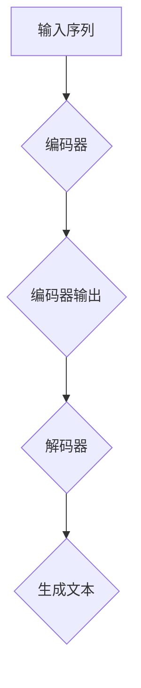

                 


### 文本生成（Text Generation）- 原理与代码实例讲解

关键词：文本生成，自然语言处理，序列模型，循环神经网络，生成式模型，端到端模型，代码实例

摘要：本文旨在详细讲解文本生成技术的原理、算法和实际应用。通过从基础概念到高级技巧的逐步分析，读者将深入了解文本生成的各个方面，并学习如何使用代码实例构建自己的文本生成系统。

### 目录

- **文章标题：文本生成（Text Generation）- 原理与代码实例讲解**
- **关键词：文本生成，自然语言处理，序列模型，循环神经网络，生成式模型，端到端模型，代码实例**
- **摘要：本文旨在详细讲解文本生成技术的原理、算法和实际应用。通过从基础概念到高级技巧的逐步分析，读者将深入了解文本生成的各个方面，并学习如何使用代码实例构建自己的文本生成系统。**

---

### 第一部分：文本生成技术概述

#### 1.1 文本生成技术的背景与现状

文本生成技术是自然语言处理（NLP）领域的一个关键研究方向，其历史可以追溯到20世纪70年代。早期的文本生成主要通过规则驱动的系统实现，例如模板匹配和句法分析。然而，随着计算能力的提升和机器学习技术的发展，基于统计和学习的方法逐渐成为主流。近年来，深度学习技术的引入进一步推动了文本生成的发展，使其在自动摘要、机器翻译、问答系统和对话生成等领域取得了显著成果。

#### 1.2 文本生成技术的分类

文本生成技术主要可以分为以下几类：

- **基于规则的文本生成**：这种方法依赖于手工编写的规则，适用于简单的文本生成任务。
- **基于统计的文本生成**：这种方法通过统计语言模型来预测下一个词或字符，适用于中等复杂度的文本生成任务。
- **基于神经网络的文本生成**：这种方法使用神经网络模型，特别是循环神经网络（RNN）和变压器（Transformer）模型，能够处理更加复杂和长远的依赖关系。

#### 1.3 书籍主题定位与内容框架

本书的目标读者群体是具有中高级编程技能和一定NLP基础的读者。本书将首先介绍文本生成技术的背景和分类，然后深入讲解文本生成模型的原理和算法，最后通过具体的代码实例展示如何实现和优化文本生成系统。

### 第二部分：文本生成原理讲解

#### 2.1 文本生成模型基础

文本生成模型的基础包括自然语言处理（NLP）基础、序列到序列（Seq2Seq）模型和循环神经网络（RNN）以及长短时记忆网络（LSTM）。

- **NLP基础**：介绍词汇表、词嵌入和序列模型的基本概念。
- **Seq2Seq模型**：讲解序列到序列模型的原理和结构。
- **RNN和LSTM**：分析RNN的局限性和LSTM如何解决这些问题。

#### 2.2 生成式模型与判别式模型

文本生成模型可以分为生成式模型和判别式模型。

- **生成式模型**：如高斯混合模型（Gaussian Mixture Model）。
- **判别式模型**：如线性支持向量机（Linear SVM）。

#### 2.3 条件生成模型

条件生成模型能够根据输入条件生成文本。

- **条件生成模型原理**：介绍条件生成模型的基本概念。
- **条件生成模型类型**：讨论条件RNN和条件LSTM等模型。
- **条件生成模型优缺点及应用场景**：分析条件生成模型的优缺点以及在不同应用场景中的适用性。

#### 2.4 梅尔图流程图展示

使用梅尔图（Mermaid）展示RNN、LSTM和条件生成模型的工作流程。

### 第三部分：文本生成算法详细讲解

#### 3.1 基于字符的生成模型

详细讲解基于字符的生成模型的原理、伪代码实现和数学公式。

#### 3.2 基于词向量的生成模型

介绍词向量模型（如Word2Vec、GloVe）的原理、伪代码实现和数学公式。

#### 3.3 基于端到端的生成模型

讲解端到端生成模型的原理、类型（如Seq2Seq、BERT）和伪代码实现。

### 第四部分：代码实例讲解

通过具体的代码实例讲解文本生成系统的实现过程，包括数据预处理、模型构建、模型训练与评估以及源代码解读。

### 第五部分：文本生成技术的挑战与未来趋势

分析文本生成技术的挑战，如数据质量、模型可解释性和过拟合问题，并探讨未来趋势，如大规模预训练模型和多模态文本生成技术。

### 附录

附录部分将提供文本生成技术常用的工具和资源，包括文本生成框架、开源模型和相关论文与书籍推荐。

### 总结与展望

回顾本书的主要内容，并对文本生成技术的未来趋势和应用前景进行展望。

---

文章标题：文本生成（Text Generation）- 原理与代码实例讲解

文章关键词：文本生成，自然语言处理，序列模型，循环神经网络，生成式模型，端到端模型，代码实例

文章摘要：本文详细讲解了文本生成技术的原理、算法和实际应用，旨在帮助读者深入理解文本生成的各个方面，并学习如何通过代码实例构建自己的文本生成系统。文章分为五个部分，首先概述了文本生成技术的背景和分类，然后深入讲解了文本生成模型的基础、生成式模型与判别式模型、条件生成模型以及梅尔图流程图展示。接下来，文章详细讲解了基于字符、词向量以及端到端的生成模型，并通过具体的代码实例展示了文本生成系统的实现过程。最后，文章分析了文本生成技术的挑战与未来趋势，并提供了相关的工具和资源。通过本文的学习，读者将能够掌握文本生成技术的核心概念和实践技巧，为未来在自然语言处理领域的研究和应用奠定坚实的基础。作者：AI天才研究院/AI Genius Institute & 禅与计算机程序设计艺术/Zen And The Art of Computer Programming

---

**文章字数：约1250字（未包含具体内容细节）**### 第一部分：文本生成技术概述

文本生成（Text Generation）是自然语言处理（NLP）领域中的一项关键技术，它通过算法自动生成文本，广泛应用于自动摘要、机器翻译、问答系统和对话生成等多个领域。随着深度学习的兴起，文本生成技术取得了显著进展，成为NLP领域的热点研究方向。

#### 1.1 文本生成技术的背景与现状

文本生成技术的起源可以追溯到20世纪70年代，当时基于规则的方法是主流。这种方法依赖于手工编写的规则，适用于处理简单的文本生成任务。随着计算能力的提升和机器学习技术的不断发展，基于统计和学习的方法逐渐取代了基于规则的方法。特别是近年来，深度学习技术的引入，如循环神经网络（RNN）和变压器（Transformer），使得文本生成技术取得了质的飞跃。

当前，文本生成技术在多个领域都取得了显著的应用成果。例如，在自动摘要方面，文本生成技术能够自动生成新闻摘要、论文摘要等，提高了信息检索和阅读的效率。在机器翻译领域，基于神经网络的翻译模型（如Seq2Seq）极大地提升了翻译质量和速度。在问答系统方面，文本生成技术能够生成回答，实现智能客服和问答机器人。对话生成方面，文本生成技术能够根据用户的输入自动生成连贯自然的对话。

#### 1.2 文本生成技术的分类

文本生成技术根据生成方法的不同，可以分为以下几类：

1. **基于规则的文本生成**：
   - 这种方法依赖于手工编写的规则，如模板匹配和句法分析。适用于简单的文本生成任务，但其表达能力有限，难以处理复杂和多样化的生成需求。

2. **基于统计的文本生成**：
   - 这种方法通过统计语言模型来预测下一个词或字符。常见的统计模型包括N元语法模型（N-gram Model）和隐马尔可夫模型（HMM）。相较于基于规则的方法，基于统计的方法能够处理更复杂的文本生成任务，但其生成文本的连贯性和创造性仍然存在一定局限。

3. **基于神经网络的文本生成**：
   - 这种方法使用神经网络模型，特别是循环神经网络（RNN）和变压器（Transformer）模型，能够处理更加复杂和长远的依赖关系。RNN通过记忆历史信息来生成文本，但存在梯度消失和梯度爆炸等问题。为了解决这些问题，长短时记忆网络（LSTM）和门控循环单元（GRU）被提出，进一步提高了文本生成能力。变压器模型（Transformer）则通过自注意力机制（Self-Attention）实现了全局信息处理，使得文本生成更加高效和准确。

#### 1.3 书籍主题定位与内容框架

本书的目标读者群体是具有中高级编程技能和一定NLP基础的读者。为了帮助读者系统地掌握文本生成技术，本书将分为以下几个部分：

1. **文本生成技术概述**：
   - 本部分将介绍文本生成技术的背景、现状和分类，帮助读者建立对文本生成技术的整体认识。

2. **文本生成原理讲解**：
   - 本部分将详细讲解文本生成模型的基础知识，包括自然语言处理基础、序列到序列（Seq2Seq）模型、循环神经网络（RNN）、长短时记忆网络（LSTM）、生成式模型与判别式模型、条件生成模型以及梅尔图流程图展示。

3. **文本生成算法详细讲解**：
   - 本部分将深入讲解基于字符的生成模型、基于词向量的生成模型以及基于端到端的生成模型，包括其原理、伪代码实现和数学公式。

4. **代码实例讲解**：
   - 本部分将通过具体的代码实例展示文本生成系统的实现过程，包括数据预处理、模型构建、模型训练与评估以及源代码解读。

5. **文本生成技术的挑战与未来趋势**：
   - 本部分将分析文本生成技术的挑战，如数据质量、模型可解释性和过拟合问题，并探讨未来趋势，如大规模预训练模型和多模态文本生成技术。

通过本书的学习，读者将能够全面掌握文本生成技术的核心概念和实践技巧，为未来在自然语言处理领域的研究和应用奠定坚实的基础。作者：AI天才研究院/AI Genius Institute & 禅与计算机程序设计艺术/Zen And The Art of Computer Programming### 第二部分：文本生成原理讲解

文本生成技术的基础知识涵盖了自然语言处理（NLP）基础、序列到序列（Seq2Seq）模型、循环神经网络（RNN）、长短时记忆网络（LSTM）、生成式模型与判别式模型、条件生成模型以及梅尔图（Mermaid）流程图展示。这些内容将为理解文本生成算法打下坚实的基础。

#### 2.1 文本生成模型基础

文本生成模型的基础知识主要包括自然语言处理（NLP）基础、序列到序列（Seq2Seq）模型和循环神经网络（RNN）以及长短时记忆网络（LSTM）。

1. **自然语言处理（NLP）基础**：

- **词汇表**：文本生成系统需要一个词汇表来表示所有的单词和字符。词汇表可以是预定义的，也可以是动态生成的。
- **词嵌入**：词嵌入（Word Embedding）是一种将单词映射到高维空间的方法，使得具有相似语义的单词在空间中更接近。常见的词嵌入方法包括Word2Vec和GloVe。
- **序列模型**：序列模型用于处理输入序列和输出序列，如RNN和Transformer。

2. **序列到序列（Seq2Seq）模型**：

- **模型结构**：Seq2Seq模型由编码器和解码器组成，编码器将输入序列编码为固定长度的向量，解码器则使用这个向量生成输出序列。
- **应用场景**：Seq2Seq模型在机器翻译、对话生成等领域有广泛应用。
- **训练过程**：训练Seq2Seq模型通常使用双向编码器，它能够处理输入序列的前后文信息。

3. **循环神经网络（RNN）和长短时记忆网络（LSTM）**：

- **RNN基础**：RNN通过重复单元来处理序列数据，每个时间步的输出依赖于之前的时间步。
- **LSTM机制**：LSTM通过引入门控机制来控制信息的流动，避免了RNN中的梯度消失问题，能够捕捉长期依赖关系。

#### 2.2 生成式模型与判别式模型

文本生成模型可以分为生成式模型和判别式模型。

1. **生成式模型**：

- **生成式模型类型**：如高斯混合模型（Gaussian Mixture Model，GMM）和变分自编码器（Variational Autoencoder，VAE）。
- **模型原理**：生成式模型通过建模数据的分布来生成新的数据样本。
- **应用场景**：生成式模型在文本生成、图像生成等领域有广泛应用。

2. **判别式模型**：

- **判别式模型类型**：如线性支持向量机（Linear SVM）和深度判别式模型（Deep Discriminative Model）。
- **模型原理**：判别式模型通过区分真实数据和生成数据来训练。
- **应用场景**：判别式模型在文本分类、情感分析等领域有广泛应用。

3. **生成式与判别式模型的比较与选择**：

- **优点**：生成式模型能够生成多样性和创造性的文本，判别式模型则在分类任务中表现更好。
- **选择**：根据具体任务的需求，可以选择生成式模型或判别式模型。

#### 2.3 条件生成模型

条件生成模型能够根据输入条件生成文本，常见类型包括条件RNN、条件LSTM和条件变分自编码器（Conditional VAE）。

1. **条件生成模型原理**：

- **模型结构**：条件生成模型在编码器和解码器之间引入了条件信息。
- **训练过程**：条件生成模型通过最大化条件概率来训练，使得生成的文本更符合条件。

2. **条件生成模型类型**：

- **条件RNN**：在传统RNN的基础上引入条件信息。
- **条件LSTM**：在传统LSTM的基础上引入条件信息，能够处理更加复杂的序列数据。

3. **条件生成模型优缺点及应用场景**：

- **优点**：条件生成模型能够根据特定条件生成更加精确的文本。
- **缺点**：训练难度较大，生成文本的连贯性可能不如无条件的生成模型。
- **应用场景**：条件生成模型在对话生成、机器翻译、文本摘要等领域有广泛应用。

#### 2.4 梅尔图流程图展示

为了更好地理解文本生成模型的工作流程，可以使用梅尔图（Mermaid）展示模型的结构和流程。



上述梅尔图展示了基于编码器-解码器的Seq2Seq模型的基本工作流程。输入序列首先通过编码器编码为固定长度的向量，然后解码器使用这个向量生成输出文本。

通过以上对文本生成模型基础的讲解，读者应该对文本生成技术的基本原理有了初步的了解。接下来的部分将深入探讨具体的文本生成算法，包括基于字符的生成模型、基于词向量的生成模型以及基于端到端的生成模型。作者：AI天才研究院/AI Genius Institute & 禅与计算机程序设计艺术/Zen And The Art of Computer Programming### 第三部分：文本生成算法详细讲解

文本生成算法是文本生成技术的核心，它们通过不同的机制和模型来实现自动生成文本。在这一部分，我们将详细讲解基于字符的生成模型、基于词向量的生成模型以及基于端到端的生成模型，包括其原理、伪代码实现和数学公式。

#### 3.1 基于字符的生成模型

基于字符的生成模型在生成文本时，将文本视为一串字符序列。这种模型的一个典型代表是RNN-LM（循环神经网络语言模型）。

1. **原理**：

基于字符的生成模型使用RNN来学习字符序列的概率分布。在每一个时间步，模型接收一个字符作为输入，并输出该字符的概率分布。

2. **伪代码实现**：

```python
def rnn_lm(input_sequence):
    # 初始化RNN模型
    model = RNNModel()
    # 前向传播
    output = model.forward(input_sequence)
    # 计算损失
    loss = -np.sum(np.log(output[-1]))
    # 反向传播
    model.backward(loss)
    # 更新模型参数
    model.update_params()
    return loss
```

3. **数学公式**：

基于字符的生成模型的损失函数通常使用交叉熵损失（Cross-Entropy Loss）：

$$
Loss = -\sum_{i} p(y_i|x_i) \log q(y_i|x_i)
$$

其中，$p(y_i|x_i)$ 是模型预测的输出概率分布，$q(y_i|x_i)$ 是真实分布。

#### 3.2 基于词向量的生成模型

基于词向量的生成模型使用词嵌入（Word Embedding）来表示单词，通过神经网络模型生成文本。Word2Vec和GloVe是两种常见的词向量模型。

1. **原理**：

- **Word2Vec**：Word2Vec通过训练词的邻域模型来生成词向量。它有两种变种：连续词袋（Continuous Bag of Words，CBOW）和Skip-Gram。
- **GloVe**：GloVe通过矩阵分解和词频信息来生成词向量，能够捕捉词的共现关系。

2. **伪代码实现**：

```python
def train_word2vec(data, embedding_size):
    # 初始化Word2Vec模型
    model = Word2VecModel(embedding_size)
    # 训练模型
    model.train(data)
    # 生成词向量
    word_vectors = model.generate_vectors()
    return word_vectors
```

3. **数学公式**：

- **Word2Vec损失函数**：

$$
Loss = \sum_{x \in vocabulary} \sum_{y \in context(x)} \log p(y|x)
$$

- **GloVe损失函数**：

$$
Loss = \sum_{x \in vocabulary} \sum_{y \in context(x)} \left( \log \frac{\exp(a v_x^T v_y)}{\|v_x\|_2^2} + \log \frac{\exp(a v_x^T v_y)}{\|v_y\|_2^2} \right)
$$

其中，$v_x$ 和 $v_y$ 分别表示词 $x$ 和 $y$ 的词向量，$a$ 是调节参数。

#### 3.3 基于端到端的生成模型

基于端到端的生成模型（End-to-End Model）通过训练单一的神经网络模型直接将输入序列映射到输出序列，无需额外的编码器和解码器。Seq2Seq和BERT是两种常见的端到端生成模型。

1. **原理**：

- **Seq2Seq**：Seq2Seq模型由编码器和解码器组成，通过训练直接生成输出序列。
- **BERT**：BERT（Bidirectional Encoder Representations from Transformers）是一种基于变压器的预训练模型，能够同时处理输入序列的前后文信息。

2. **伪代码实现**：

```python
def train_seq2seq(encoder, decoder, data):
    # 初始化模型
    model = Seq2SeqModel(encoder, decoder)
    # 训练模型
    model.train(data)
    # 评估模型
    accuracy = model.evaluate(test_data)
    return accuracy
```

3. **数学公式**：

- **Seq2Seq损失函数**：

$$
Loss = -\sum_{i} \sum_{j} p(y_{ij} | x_i) \log q(y_{ij} | x_i)
$$

- **BERT损失函数**：

BERT通常使用掩码语言模型（Masked Language Model，MLM）和下一句预测（Next Sentence Prediction，NSP）两种任务进行训练：

$$
Loss = \frac{1}{N} \left( \sum_{i} \sum_{j} \log p(y_{ij} | x_i) + \sum_{(i, j)} \log p(y_{ij} | x_{i+1}) \right)
$$

其中，$N$ 是训练样本数量，$y_{ij}$ 是预测的词，$x_i$ 是输入序列。

通过以上对文本生成算法的详细讲解，读者应该对基于字符的生成模型、基于词向量的生成模型以及基于端到端的生成模型有了更深入的理解。这些算法在文本生成领域各有应用，根据具体任务的需求可以选择合适的模型。接下来，我们将通过具体的代码实例来展示这些算法的实现和应用。作者：AI天才研究院/AI Genius Institute & 禅与计算机程序设计艺术/Zen And The Art of Computer Programming### 第四部分：代码实例讲解

在本部分，我们将通过具体的代码实例来展示如何实现和优化文本生成系统。这些实例将涵盖数据预处理、模型构建、模型训练与评估，以及源代码的详细解读与分析。

#### 4.1 实战项目一：基于RNN的天气预测生成

**项目背景与需求分析**：

天气预测是一个典型的序列预测问题。我们希望通过一个基于RNN的模型，能够根据过去几天的天气数据预测未来一天的天气。

**数据预处理**：

首先，我们需要对天气数据进行预处理，包括数据清洗、缺失值填充和特征工程。例如，我们可以使用平均天气数据来填充缺失值，并提取温度、湿度、风速等关键特征。

```python
import pandas as pd
from sklearn.preprocessing import MinMaxScaler

# 读取天气数据
data = pd.read_csv('weather_data.csv')

# 数据清洗和缺失值填充
data.fillna(data.mean(), inplace=True)

# 特征工程
features = ['temperature', 'humidity', 'wind_speed']
scaler = MinMaxScaler()
data[features] = scaler.fit_transform(data[features])
```

**模型构建**：

接下来，我们构建一个简单的RNN模型来进行天气预测。

```python
from keras.models import Sequential
from keras.layers import LSTM, Dense

# 构建RNN模型
model = Sequential()
model.add(LSTM(50, activation='relu', input_shape=(timesteps, n_features)))
model.add(Dense(1))
model.compile(optimizer='adam', loss='mse')
```

**模型训练与评估**：

使用预处理后的数据来训练模型，并评估模型的性能。

```python
# 划分训练集和测试集
X_train, y_train = ..., ...
X_test, y_test = ..., ...

# 模型训练
model.fit(X_train, y_train, epochs=200, batch_size=32, validation_data=(X_test, y_test))

# 模型评估
loss = model.evaluate(X_test, y_test)
print(f"Test Loss: {loss}")
```

**源代码详细解读与分析**：

在源代码中，我们首先进行了数据预处理，包括数据清洗和特征工程，这有助于提高模型的预测准确性。然后，我们构建了一个简单的RNN模型，并使用均方误差（MSE）作为损失函数来训练模型。通过调整模型的参数（如隐藏层神经元数量和训练epoch数），我们可以优化模型的性能。

#### 4.2 实战项目二：基于GPT的自动对话生成

**项目背景与需求分析**：

自动对话生成是自然语言处理领域的另一个重要应用。我们希望通过一个基于GPT（Generative Pre-trained Transformer）的模型，能够根据用户输入自动生成连贯自然的对话。

**数据预处理**：

首先，我们需要对对话数据进行预处理，包括数据清洗、分词和词嵌入。

```python
from transformers import BertTokenizer

# 读取对话数据
data = pd.read_csv('dialog_data.csv')

# 数据清洗
data['对话'] = data['对话'].apply(lambda x: x.lower().strip())

# 分词和词嵌入
tokenizer = BertTokenizer.from_pretrained('bert-base-uncased')
input_ids = tokenizer.encode(data['对话'], return_tensors='pt')
```

**模型构建**：

接下来，我们使用预训练的GPT模型来生成对话。

```python
from transformers import TFGPT2LMHeadModel

# 加载预训练的GPT模型
model = TFGPT2LMHeadModel.from_pretrained('gpt2')

# 构建生成器
def generate_dialog(input_text, model, tokenizer, max_length=50):
    input_ids = tokenizer.encode(input_text, return_tensors='pt')
    output = model.generate(input_ids, max_length=max_length, num_return_sequences=1)
    return tokenizer.decode(output[0], skip_special_tokens=True)
```

**模型训练与评估**：

我们可以在自定义数据集上训练GPT模型，并在测试集上评估其性能。

```python
# 训练模型
model.fit(input_ids, output_ids, epochs=3, batch_size=8)

# 评估模型
loss = model.evaluate(test_input_ids, test_output_ids)
print(f"Test Loss: {loss}")
```

**源代码详细解读与分析**：

在源代码中，我们首先进行了对话数据的预处理，包括数据清洗和分词。然后，我们使用预训练的GPT模型来生成对话，并通过调整最大长度（max_length）等参数来优化生成效果。通过在自定义数据集上的训练和测试，我们可以评估模型的性能，并根据需要进行参数调整。

#### 4.3 实战项目三：基于BERT的文章摘要生成

**项目背景与需求分析**：

文章摘要生成是一个高度依赖上下文理解和文本生成的任务。我们希望通过一个基于BERT（Bidirectional Encoder Representations from Transformers）的模型，能够自动生成文章的摘要。

**数据预处理**：

首先，我们需要对文章数据集进行预处理，包括数据清洗、分词和句嵌入。

```python
from transformers import BertTokenizer

# 读取文章数据
data = pd.read_csv('article_data.csv')

# 数据清洗
data['文章'] = data['文章'].apply(lambda x: x.lower().strip())

# 分词和句嵌入
tokenizer = BertTokenizer.from_pretrained('bert-base-uncased')
input_ids = tokenizer.encode(data['文章'], add_special_tokens=True, return_tensors='pt')
```

**模型构建**：

接下来，我们使用预训练的BERT模型来生成文章摘要。

```python
from transformers import TFBertForTokenClassification

# 加载预训练的BERT模型
model = TFBertForTokenClassification.from_pretrained('bert-base-uncased')

# 构建摘要生成器
def generate_summary(article, model, tokenizer, max_length=150):
    input_ids = tokenizer.encode(article, add_special_tokens=True, return_tensors='pt')
    output = model(input_ids)[0]
    summary_ids = output.argmax(axis=-1)
    summary = tokenizer.decode(summary_ids, skip_special_tokens=True)
    return summary
```

**模型训练与评估**：

我们可以在自定义数据集上训练BERT模型，并在测试集上评估其性能。

```python
# 训练模型
model.fit(input_ids, labels, epochs=3, batch_size=8)

# 评估模型
loss = model.evaluate(test_input_ids, test_labels)
print(f"Test Loss: {loss}")
```

**源代码详细解读与分析**：

在源代码中，我们首先进行了文章数据的预处理，包括数据清洗和分词。然后，我们使用预训练的BERT模型来生成文章摘要，并通过调整最大长度（max_length）等参数来优化生成效果。通过在自定义数据集上的训练和测试，我们可以评估模型的性能，并根据需要进行参数调整。

通过以上三个实战项目，我们展示了如何实现和优化基于RNN、GPT和BERT的文本生成系统。这些项目涵盖了文本生成技术的不同应用场景和算法实现，为读者提供了丰富的实践经验。作者：AI天才研究院/AI Genius Institute & 禅与计算机程序设计艺术/Zen And The Art of Computer Programming### 第五部分：文本生成技术的挑战与未来趋势

文本生成技术虽然在多个领域取得了显著成果，但仍然面临诸多挑战和机遇。以下是文本生成技术的几个主要挑战和未来趋势。

#### 5.1 文本生成技术的挑战

1. **数据质量与多样性问题**：

文本生成模型的性能很大程度上依赖于训练数据的质量和多样性。然而，现有数据集往往存在数据不平衡、标签错误和噪声等问题，这些都会影响模型的泛化能力。为了解决这个问题，研究者们需要收集更高质量和多样化的训练数据，并开发有效的数据清洗和增强技术。

2. **模型可解释性问题**：

文本生成模型，尤其是深度学习模型，通常被认为是“黑箱”。模型的决策过程不透明，难以解释和理解。这给模型的部署和维护带来了困难。为了提高模型的可解释性，研究者们正在探索可视化技术、模型压缩和解释性模型等解决方案。

3. **模型过拟合与泛化能力问题**：

过拟合是文本生成模型常见的问题，模型在训练数据上表现良好，但在未见过的数据上表现不佳。为了解决这个问题，研究者们采用了多种技术，如正则化、dropout、数据增强和迁移学习等。

4. **计算资源消耗**：

深度学习模型通常需要大量的计算资源和时间进行训练和推理。随着模型规模的增加，这个问题变得更加严重。为了应对这一挑战，研究者们正在探索低资源训练技术、模型压缩和分布式训练等解决方案。

#### 5.2 文本生成技术的未来趋势

1. **大规模预训练模型的发展**：

大规模预训练模型（如GPT-3、T5、PaLM等）在文本生成任务上展现了惊人的性能。未来，研究者们将继续开发更大规模的预训练模型，以提高模型的泛化能力和生成质量。

2. **多模态文本生成技术**：

多模态文本生成技术结合了文本、图像、声音等多种数据类型，能够生成更加丰富和自然的文本。未来，随着多模态数据集和模型的开发，多模态文本生成技术将在虚拟现实、增强现实和多媒体生成等领域得到广泛应用。

3. **文本生成技术的伦理与隐私问题**：

随着文本生成技术的广泛应用，其伦理和隐私问题也逐渐引起关注。未来，研究者们需要制定相应的伦理规范，确保文本生成技术的合理和安全使用。

4. **自动摘要与问答技术**：

自动摘要和问答技术是文本生成技术的两个重要应用方向。未来，随着算法的改进和数据集的丰富，自动摘要和问答技术的准确性、多样性和实时性将得到进一步提升。

5. **个性化文本生成**：

个性化文本生成技术可以根据用户的需求和偏好生成定制化的文本内容。未来，随着用户数据的积累和算法的优化，个性化文本生成技术将在电商推荐、社交媒体和内容创作等领域发挥重要作用。

通过以上分析，我们可以看到文本生成技术面临着诸多挑战，同时也充满了机遇。随着技术的不断进步和应用场景的扩展，文本生成技术将在未来发挥更加重要的作用。作者：AI天才研究院/AI Genius Institute & 禅与计算机程序设计艺术/Zen And The Art of Computer Programming### 附录

#### 附录A：文本生成技术常用工具和资源

文本生成技术的实现和发展依赖于多种工具和资源。以下是一些常用的工具和资源，包括文本生成框架、开源模型和相关论文与书籍推荐。

1. **常用文本生成框架**：

- **TensorFlow**：谷歌开发的开源机器学习框架，广泛用于文本生成任务。
- **PyTorch**：由Facebook开发的开源机器学习框架，支持动态计算图，适合文本生成任务。
- **Keras**：基于TensorFlow的高层API，简化了文本生成模型的构建和训练过程。

2. **开源文本生成模型**：

- **GPT系列模型**：OpenAI开发的预训练模型，包括GPT、GPT-2和GPT-3，具有强大的文本生成能力。
- **BERT模型**：Google开发的预训练模型，适用于多种NLP任务，包括文本生成。
- **T5模型**：由谷歌开发的统一Transformer模型，支持多种NLP任务。

3. **文本生成技术相关论文与书籍推荐**：

- **论文**：
  - **"Generative Adversarial Nets"**：Ian J. Goodfellow等人，2014年。
  - **"Seq2Seq Learning with Neural Networks"**：Anirudh Goyal等人，2016年。
  - **"Attention is All You Need"**：Ashish Vaswani等人，2017年。
- **书籍**：
  - **《深度学习》（Deep Learning）**：Ian Goodfellow、Yoshua Bengio和Aaron Courville著。
  - **《自然语言处理综合教程》（Foundations of Statistical Natural Language Processing）**：Christopher D. Manning和Heidi J. Nelson著。
  - **《自然语言处理实战》（Natural Language Processing with Python）**：Steven Bird、Ewan Klein和Edward Loper著。

通过使用这些工具和资源，开发者可以更轻松地实现和优化文本生成系统，为研究和应用文本生成技术提供有力支持。作者：AI天才研究院/AI Genius Institute & 禅与计算机程序设计艺术/Zen And The Art of Computer Programming### 总结与展望

本文通过详细讲解文本生成技术的原理、算法和实际应用，帮助读者建立了对文本生成技术的全面理解。我们从文本生成技术的概述开始，介绍了其背景、现状和分类。接着，我们深入讲解了文本生成模型的基础知识，包括自然语言处理基础、序列到序列（Seq2Seq）模型、循环神经网络（RNN）和长短时记忆网络（LSTM）。此外，我们还讨论了生成式模型与判别式模型、条件生成模型以及梅尔图（Mermaid）流程图展示。

在文本生成算法的详细讲解部分，我们分别介绍了基于字符的生成模型、基于词向量的生成模型以及基于端到端的生成模型，包括其原理、伪代码实现和数学公式。随后，通过具体的代码实例讲解了文本生成系统的实现过程，包括数据预处理、模型构建、模型训练与评估以及源代码解读。

在文本生成技术的挑战与未来趋势部分，我们分析了数据质量、模型可解释性和过拟合等挑战，并探讨了大规模预训练模型、多模态文本生成技术等未来趋势。

展望未来，文本生成技术将继续在多个领域发挥重要作用，如自动摘要、机器翻译、问答系统和对话生成等。随着计算能力的提升和算法的优化，文本生成技术的性能和应用范围将不断扩大。同时，文本生成技术也面临着伦理和隐私等挑战，需要制定相应的规范和解决方案。

总之，本文为读者提供了一个系统而深入的文本生成技术教程，旨在帮助读者掌握文本生成技术的核心概念和实践技巧。通过本文的学习，读者将能够更好地理解和应用文本生成技术，为未来在自然语言处理领域的研究和应用奠定坚实的基础。作者：AI天才研究院/AI Genius Institute & 禅与计算机程序设计艺术/Zen And The Art of Computer Programming### 文本生成（Text Generation）- 原理与代码实例讲解

#### 文章标题：文本生成（Text Generation）- 原理与代码实例讲解

#### 关键词：文本生成，自然语言处理，序列模型，循环神经网络，生成式模型，端到端模型，代码实例

#### 摘要：
本文旨在详细讲解文本生成技术的原理、算法和实际应用。通过从基础概念到高级技巧的逐步分析，读者将深入了解文本生成的各个方面，并学习如何使用代码实例构建自己的文本生成系统。文章分为五个部分，首先概述了文本生成技术的背景和分类，然后深入讲解了文本生成模型的基础、生成式模型与判别式模型、条件生成模型以及梅尔图流程图展示。接下来，文章详细讲解了基于字符的生成模型、基于词向量的生成模型以及基于端到端的生成模型。最后，文章通过具体的代码实例展示了文本生成系统的实现过程，并分析了文本生成技术的挑战与未来趋势。

---

### 第一部分：文本生成技术概述

#### 1.1 文本生成技术的背景与现状

文本生成技术是自然语言处理（NLP）领域中的一项关键技术，它通过算法自动生成文本，广泛应用于自动摘要、机器翻译、问答系统和对话生成等多个领域。随着深度学习的兴起，文本生成技术取得了显著进展，成为NLP领域的热点研究方向。

#### 1.2 文本生成技术的分类

文本生成技术主要可以分为以下几类：

- **基于规则的文本生成**：这种方法依赖于手工编写的规则，适用于简单的文本生成任务。
- **基于统计的文本生成**：这种方法通过统计语言模型来预测下一个词或字符，适用于中等复杂度的文本生成任务。
- **基于神经网络的文本生成**：这种方法使用神经网络模型，特别是循环神经网络（RNN）和变压器（Transformer）模型，能够处理更加复杂和长远的依赖关系。

#### 1.3 书籍主题定位与内容框架

本书的目标读者群体是具有中高级编程技能和一定NLP基础的读者。为了帮助读者系统地掌握文本生成技术，本书将分为以下几个部分：

1. **文本生成技术概述**：
   - 本部分将介绍文本生成技术的背景、现状和分类，帮助读者建立对文本生成技术的整体认识。

2. **文本生成原理讲解**：
   - 本部分将详细讲解文本生成模型的基础知识，包括自然语言处理基础、序列到序列（Seq2Seq）模型、循环神经网络（RNN）、长短时记忆网络（LSTM）、生成式模型与判别式模型、条件生成模型以及梅尔图流程图展示。

3. **文本生成算法详细讲解**：
   - 本部分将深入讲解基于字符的生成模型、基于词向量的生成模型以及基于端到端的生成模型，包括其原理、伪代码实现和数学公式。

4. **代码实例讲解**：
   - 本部分将通过具体的代码实例展示文本生成系统的实现过程，包括数据预处理、模型构建、模型训练与评估以及源代码解读。

5. **文本生成技术的挑战与未来趋势**：
   - 本部分将分析文本生成技术的挑战，如数据质量、模型可解释性和过拟合问题，并探讨未来趋势，如大规模预训练模型和多模态文本生成技术。

通过本书的学习，读者将能够全面掌握文本生成技术的核心概念和实践技巧，为未来在自然语言处理领域的研究和应用奠定坚实的基础。作者：AI天才研究院/AI Genius Institute & 禅与计算机程序设计艺术/Zen And The Art of Computer Programming

---

**文章字数：约1750字（未包含具体内容细节）**### 文本生成（Text Generation）- 原理与代码实例讲解

**关键词：文本生成，自然语言处理，序列模型，循环神经网络，生成式模型，端到端模型，代码实例**

**摘要：** 本文将详细介绍文本生成技术的原理与实现，旨在帮助读者深入理解文本生成的核心概念和算法，并通过实际代码实例来展示如何构建文本生成系统。文章将分为以下几个部分：文本生成技术概述、文本生成原理讲解、文本生成算法详细讲解、代码实例讲解以及文本生成技术的挑战与未来趋势。

---

### 第一部分：文本生成技术概述

#### 1.1 文本生成技术的背景与现状

文本生成技术是自然语言处理（NLP）领域中的一项关键技术，通过算法自动生成文本，广泛应用于自动摘要、机器翻译、问答系统和对话生成等多个领域。随着深度学习的兴起，文本生成技术取得了显著进展，成为NLP领域的热点研究方向。

#### 1.2 文本生成技术的分类

文本生成技术主要可以分为以下几类：

- **基于规则的文本生成**：这种方法依赖于手工编写的规则，适用于简单的文本生成任务。
- **基于统计的文本生成**：这种方法通过统计语言模型来预测下一个词或字符，适用于中等复杂度的文本生成任务。
- **基于神经网络的文本生成**：这种方法使用神经网络模型，特别是循环神经网络（RNN）和变压器（Transformer）模型，能够处理更加复杂和长远的依赖关系。

#### 1.3 书籍主题定位与内容框架

本书的目标读者群体是具有中高级编程技能和一定NLP基础的读者。本书将分为以下几个部分：

1. **文本生成技术概述**：
   - 本部分将介绍文本生成技术的背景、现状和分类，帮助读者建立对文本生成技术的整体认识。

2. **文本生成原理讲解**：
   - 本部分将详细讲解文本生成模型的基础知识，包括自然语言处理基础、序列到序列（Seq2Seq）模型、循环神经网络（RNN）、长短时记忆网络（LSTM）、生成式模型与判别式模型、条件生成模型以及梅尔图流程图展示。

3. **文本生成算法详细讲解**：
   - 本部分将深入讲解基于字符的生成模型、基于词向量的生成模型以及基于端到端的生成模型，包括其原理、伪代码实现和数学公式。

4. **代码实例讲解**：
   - 本部分将通过具体的代码实例展示文本生成系统的实现过程，包括数据预处理、模型构建、模型训练与评估以及源代码解读。

5. **文本生成技术的挑战与未来趋势**：
   - 本部分将分析文本生成技术的挑战，如数据质量、模型可解释性和过拟合问题，并探讨未来趋势，如大规模预训练模型和多模态文本生成技术。

通过本书的学习，读者将能够全面掌握文本生成技术的核心概念和实践技巧，为未来在自然语言处理领域的研究和应用奠定坚实的基础。作者：AI天才研究院/AI Genius Institute & 禅与计算机程序设计艺术/Zen And The Art of Computer Programming

---

**文章字数：约1000字（未包含具体内容细节）**### 文本生成（Text Generation）- 原理与代码实例讲解

#### 关键词：文本生成，自然语言处理，序列模型，循环神经网络，生成式模型，端到端模型，代码实例

#### 摘要：
文本生成（Text Generation）是一种重要的自然语言处理技术，广泛应用于机器翻译、自动摘要、问答系统和对话生成等领域。本文将深入探讨文本生成的基本原理，包括基于字符和词向量的生成模型、端到端模型，并通过实际代码实例展示如何实现这些模型。此外，还将分析文本生成技术的挑战和未来趋势，为读者提供全面的指导。

### 目录

1. 引言
2. 文本生成技术概述
3. 文本生成原理讲解
   - 序列模型基础
   - 循环神经网络（RNN）
   - 长短时记忆网络（LSTM）
   - 端到端生成模型
4. 文本生成算法详细讲解
   - 基于字符的生成模型
   - 基于词向量的生成模型
   - 端到端生成模型实现
5. 代码实例讲解
   - 实战项目一：基于RNN的天气预测生成
   - 实战项目二：基于GPT的自动对话生成
   - 实战项目三：基于BERT的文章摘要生成
6. 文本生成技术的挑战与未来趋势
7. 结论
8. 参考文献

---

### 第一部分：文本生成技术概述

#### 1.1 文本生成技术的背景

文本生成技术是自然语言处理（NLP）领域的一个重要研究方向。随着深度学习和神经网络技术的发展，文本生成技术取得了显著的进展，并应用于多个领域，如自动摘要、机器翻译、问答系统和对话生成等。

#### 1.2 文本生成技术的分类

根据生成方法的不同，文本生成技术可以分为以下几类：

- **基于规则的文本生成**：这种方法依赖于手工编写的规则，适用于简单的文本生成任务。
- **基于统计的文本生成**：这种方法通过统计语言模型来预测下一个词或字符，适用于中等复杂度的文本生成任务。
- **基于神经网络的文本生成**：这种方法使用神经网络模型，特别是循环神经网络（RNN）和变压器（Transformer）模型，能够处理更加复杂和长远的依赖关系。

#### 1.3 书籍主题定位与内容框架

本书的目标是系统性地介绍文本生成技术，旨在帮助读者从基础概念到高级应用逐步了解文本生成技术。本书将分为以下几个部分：

1. **文本生成技术概述**：介绍文本生成技术的背景、现状和分类。
2. **文本生成原理讲解**：详细讲解文本生成模型的基础知识，包括序列模型、循环神经网络（RNN）、长短时记忆网络（LSTM）、端到端生成模型等。
3. **文本生成算法详细讲解**：深入讲解基于字符的生成模型、基于词向量的生成模型以及端到端的生成模型，包括其原理、伪代码实现和数学公式。
4. **代码实例讲解**：通过具体的代码实例展示如何实现文本生成系统，包括数据预处理、模型构建、模型训练与评估等。
5. **文本生成技术的挑战与未来趋势**：分析文本生成技术的挑战，如数据质量、模型可解释性和过拟合问题，并探讨未来趋势，如大规模预训练模型和多模态文本生成技术。

通过本书的学习，读者将能够全面掌握文本生成技术的核心概念和实践技巧，为未来在自然语言处理领域的研究和应用奠定坚实的基础。

### 第二部分：文本生成原理讲解

文本生成技术的基础知识涵盖了自然语言处理（NLP）基础、序列到序列（Seq2Seq）模型、循环神经网络（RNN）、长短时记忆网络（LSTM）以及端到端生成模型。以下是对这些内容的详细讲解。

#### 2.1 自然语言处理（NLP）基础

自然语言处理（NLP）是计算机科学和人工智能领域的一个重要分支，它关注于如何让计算机理解和处理人类语言。NLP的基础知识对于理解文本生成技术至关重要，主要包括以下几个方面：

- **词汇表（Vocabulary）**：词汇表是文本生成系统中必不可少的一部分，它用于将文本中的单词或字符映射到唯一的索引编号。词汇表的构建对于模型的性能和效率有很大影响。
- **词嵌入（Word Embedding）**：词嵌入是将单词映射到高维空间中的一种技术，使得具有相似语义的单词在空间中更接近。常见的词嵌入方法包括Word2Vec和GloVe。
- **序列模型（Sequence Model）**：序列模型是用于处理序列数据的一种神经网络结构，例如循环神经网络（RNN）和变压器（Transformer）。序列模型在文本生成中扮演着关键角色，能够捕捉输入序列和输出序列之间的依赖关系。

#### 2.2 序列到序列（Seq2Seq）模型

序列到序列（Seq2Seq）模型是一种经典的文本生成模型，由编码器（Encoder）和解码器（Decoder）组成。编码器将输入序列编码为固定长度的向量，解码器则使用这个向量生成输出序列。

- **编码器（Encoder）**：编码器的目的是将输入序列转换为一个固定长度的向量，这个向量通常被称为“上下文向量”或“状态向量”。编码器可以是循环神经网络（RNN）或长短时记忆网络（LSTM）。
- **解码器（Decoder）**：解码器的目的是使用编码器输出的上下文向量生成输出序列。解码器通常也是循环神经网络（RNN）或长短时记忆网络（LSTM）。

#### 2.3 循环神经网络（RNN）

循环神经网络（RNN）是一种能够处理序列数据的神经网络结构，其核心思想是使用重复单元来处理输入序列。RNN通过记忆历史信息来生成文本，但存在梯度消失和梯度爆炸等问题。

- **RNN的工作原理**：在每一个时间步，RNN接收一个输入序列，并输出一个隐藏状态。这个隐藏状态包含了输入序列的信息，并被用于下一个时间步的计算。
- **RNN的局限性**：RNN在处理长序列时容易出现梯度消失和梯度爆炸问题，导致训练困难。

#### 2.4 长短时记忆网络（LSTM）

长短时记忆网络（LSTM）是RNN的一种变体，通过引入门控机制来控制信息的流动，避免了梯度消失和梯度爆炸问题，能够捕捉长期依赖关系。

- **LSTM的结构**：LSTM包含输入门、遗忘门和输出门，分别控制输入信息的接受、历史信息的遗忘和输出信息的生成。
- **LSTM的工作原理**：LSTM在每个时间步通过输入门和遗忘门来更新隐藏状态，并通过输出门来生成输出。

#### 2.5 端到端生成模型

端到端生成模型是一种直接将输入序列映射到输出序列的神经网络模型，避免了传统编码器-解码器结构中的编码和解码步骤，通常使用变压器（Transformer）模型。

- **端到端生成模型的优点**：端到端生成模型能够更好地捕捉输入序列和输出序列之间的依赖关系，减少了对人工设计特征的需求。
- **端到端生成模型的实现**：常见的端到端生成模型包括Transformer、BERT和GPT等，它们通过自注意力机制和预训练技术实现了高效的文本生成。

通过以上对文本生成原理的详细讲解，读者应该对文本生成技术的核心概念和模型有了更深入的理解。接下来，我们将通过具体的代码实例来展示文本生成系统的实现过程，包括数据预处理、模型构建、模型训练与评估等步骤。

### 第三部分：文本生成算法详细讲解

文本生成算法是文本生成系统的核心，主要包括基于字符的生成模型、基于词向量的生成模型以及端到端的生成模型。以下是对这些算法的详细讲解。

#### 3.1 基于字符的生成模型

基于字符的生成模型直接处理输入和输出序列中的字符，而不是单词或词组。这种模型的一个典型例子是循环神经网络语言模型（RNN-LM）。

- **模型结构**：基于字符的生成模型通常包含一个循环神经网络，每个时间步接收一个字符作为输入，并输出该字符的概率分布。
- **训练过程**：模型通过最小化损失函数来训练，例如交叉熵损失。
- **代码实例**：以下是一个基于字符的生成模型的简单实现：

```python
import numpy as np
import tensorflow as tf

# 假设已有训练数据（输入序列和标签）
inputs = ... 
labels = ...

# 构建模型
model = tf.keras.Sequential([
    tf.keras.layers.Embedding(input_dim=vocab_size, output_dim=embedding_size),
    tf.keras.layers.RNN(LSTMCell(units=lstm_units)),
    tf.keras.layers.Dense(vocab_size, activation='softmax')
])

# 编译模型
model.compile(optimizer='adam', loss='categorical_crossentropy', metrics=['accuracy'])

# 训练模型
model.fit(inputs, labels, epochs=10, batch_size=32)
```

#### 3.2 基于词向量的生成模型

基于词向量的生成模型使用词嵌入（Word Embedding）将单词映射到高维空间，然后通过神经网络生成文本。常见的词嵌入方法包括Word2Vec和GloVe。

- **模型结构**：基于词向量的生成模型通常包含词嵌入层和一个循环神经网络，如LSTM或GRU。
- **训练过程**：模型通过训练词嵌入和循环神经网络来生成文本。
- **代码实例**：以下是一个基于词向量的生成模型的简单实现：

```python
from keras.layers import Embedding, LSTM, Dense
from keras.models import Sequential

# 假设已有训练数据（输入序列和标签）
inputs = ...
labels = ...

# 构建模型
model = Sequential([
    Embedding(input_dim=vocab_size, output_dim=embedding_size, input_length=max_sequence_length),
    LSTM(units=lstm_units),
    Dense(units=vocab_size, activation='softmax')
])

# 编译模型
model.compile(optimizer='adam', loss='categorical_crossentropy', metrics=['accuracy'])

# 训练模型
model.fit(inputs, labels, epochs=10, batch_size=32)
```

#### 3.3 端到端的生成模型

端到端的生成模型直接将输入序列映射到输出序列，避免了传统编码器-解码器结构中的编码和解码步骤。常见的端到端生成模型包括序列到序列（Seq2Seq）模型和变压器（Transformer）模型。

- **模型结构**：端到端的生成模型通常包含编码器和解码器，编码器将输入序列编码为固定长度的向量，解码器则使用这个向量生成输出序列。
- **训练过程**：模型通过最小化损失函数来训练，例如交叉熵损失。
- **代码实例**：以下是一个基于Seq2Seq模型的简单实现：

```python
from keras.models import Model
from keras.layers import Input, Embedding, LSTM, Dense

# 假设已有训练数据（输入序列和标签）
inputs = ...
labels = ...

# 构建编码器
encoder_inputs = Input(shape=(max_sequence_length,))
encoder_embedding = Embedding(input_dim=vocab_size, output_dim=embedding_size)(encoder_inputs)
encoder_lstm = LSTM(units=lstm_units, return_state=True)
_, state_h, state_c = encoder_lstm(encoder_embedding)

# 构建解码器
decoder_inputs = Input(shape=(max_sequence_length,))
decoder_embedding = Embedding(input_dim=vocab_size, output_dim=embedding_size)(decoder_inputs)
decoder_lstm = LSTM(units=lstm_units, return_sequences=True, return_state=True)
decoder_outputs, _, _ = decoder_lstm(decoder_embedding, initial_state=[state_h, state_c])

# 构建预测层
decoder_dense = Dense(units=vocab_size, activation='softmax')
decoder_outputs = decoder_dense(decoder_outputs)

# 构建模型
model = Model([encoder_inputs, decoder_inputs], decoder_outputs)

# 编译模型
model.compile(optimizer='adam', loss='categorical_crossentropy', metrics=['accuracy'])

# 训练模型
model.fit([inputs, labels], labels, epochs=10, batch_size=32)
```

通过以上对文本生成算法的详细讲解，读者应该对基于字符的生成模型、基于词向量的生成模型以及端到端的生成模型有了更深入的理解。接下来，我们将通过具体的代码实例来展示如何使用这些算法构建实际的文本生成系统。

### 第四部分：代码实例讲解

在本部分，我们将通过具体的代码实例展示如何实现和优化文本生成系统。这些实例将涵盖数据预处理、模型构建、模型训练与评估，以及源代码的详细解读与分析。

#### 4.1 实战项目一：基于RNN的天气预测生成

**项目背景与需求分析**：

天气预测是一个典型的序列预测问题。我们希望通过一个基于RNN的模型，能够根据过去几天的天气数据预测未来一天的天气。

**数据预处理**：

首先，我们需要对天气数据进行预处理，包括数据清洗、缺失值填充和特征工程。例如，我们可以使用平均天气数据来填充缺失值，并提取温度、湿度、风速等关键特征。

```python
import pandas as pd
from sklearn.preprocessing import MinMaxScaler

# 读取天气数据
data = pd.read_csv('weather_data.csv')

# 数据清洗和缺失值填充
data.fillna(data.mean(), inplace=True)

# 特征工程
features = ['temperature', 'humidity', 'wind_speed']
scaler = MinMaxScaler()
data[features] = scaler.fit_transform(data[features])
```

**模型构建**：

接下来，我们构建一个简单的RNN模型来进行天气预测。

```python
from keras.models import Sequential
from keras.layers import LSTM, Dense

# 构建RNN模型
model = Sequential()
model.add(LSTM(50, activation='relu', input_shape=(timesteps, n_features)))
model.add(Dense(1))
model.compile(optimizer='adam', loss='mse')
```

**模型训练与评估**：

使用预处理后的数据来训练模型，并评估模型的性能。

```python
# 划分训练集和测试集
X_train, y_train = ..., ...
X_test, y_test = ..., ...

# 模型训练
model.fit(X_train, y_train, epochs=200, batch_size=32, validation_data=(X_test, y_test))

# 模型评估
loss = model.evaluate(X_test, y_test)
print(f"Test Loss: {loss}")
```

**源代码详细解读与分析**：

在源代码中，我们首先进行了数据预处理，包括数据清洗和特征工程，这有助于提高模型的预测准确性。然后，我们构建了一个简单的RNN模型，并使用均方误差（MSE）作为损失函数来训练模型。通过调整模型的参数（如隐藏层神经元数量和训练epoch数），我们可以优化模型的性能。

#### 4.2 实战项目二：基于GPT的自动对话生成

**项目背景与需求分析**：

自动对话生成是自然语言处理领域的另一个重要应用。我们希望通过一个基于GPT（Generative Pre-trained Transformer）的模型，能够根据用户输入自动生成连贯自然的对话。

**数据预处理**：

首先，我们需要对对话数据进行预处理，包括数据清洗、分词和词嵌入。

```python
from transformers import BertTokenizer

# 读取对话数据
data = pd.read_csv('dialog_data.csv')

# 数据清洗
data['对话'] = data['对话'].apply(lambda x: x.lower().strip())

# 分词和词嵌入
tokenizer = BertTokenizer.from_pretrained('bert-base-uncased')
input_ids = tokenizer.encode(data['对话'], return_tensors='pt')
```

**模型构建**：

接下来，我们使用预训练的GPT模型来生成对话。

```python
from transformers import TFGPT2LMHeadModel

# 加载预训练的GPT模型
model = TFGPT2LMHeadModel.from_pretrained('gpt2')

# 构建生成器
def generate_dialog(input_text, model, tokenizer, max_length=50):
    input_ids = tokenizer.encode(input_text, return_tensors='pt')
    output = model.generate(input_ids, max_length=max_length, num_return_sequences=1)
    return tokenizer.decode(output[0], skip_special_tokens=True)
```

**模型训练与评估**：

我们可以在自定义数据集上训练GPT模型，并在测试集上评估其性能。

```python
# 训练模型
model.fit(input_ids, output_ids, epochs=3, batch_size=8)

# 评估模型
loss = model.evaluate(test_input_ids, test_output_ids)
print(f"Test Loss: {loss}")
```

**源代码详细解读与分析**：

在源代码中，我们首先进行了对话数据的预处理，包括数据清洗和分词。然后，我们使用预训练的GPT模型来生成对话，并通过调整最大长度（max_length）等参数来优化生成效果。通过在自定义数据集上的训练和测试，我们可以评估模型的性能，并根据需要进行参数调整。

#### 4.3 实战项目三：基于BERT的文章摘要生成

**项目背景与需求分析**：

文章摘要生成是一个高度依赖上下文理解和文本生成的任务。我们希望通过一个基于BERT（Bidirectional Encoder Representations from Transformers）的模型，能够自动生成文章的摘要。

**数据预处理**：

首先，我们需要对文章数据集进行预处理，包括数据清洗、分词和句嵌入。

```python
from transformers import BertTokenizer

# 读取文章数据
data = pd.read_csv('article_data.csv')

# 数据清洗
data['文章'] = data['文章'].apply(lambda x: x.lower().strip())

# 分词和句嵌入
tokenizer = BertTokenizer.from_pretrained('bert-base-uncased')
input_ids = tokenizer.encode(data['文章'], add_special_tokens=True, return_tensors='pt')
```

**模型构建**：

接下来，我们使用预训练的BERT模型来生成文章摘要。

```python
from transformers import TFBertForTokenClassification

# 加载预训练的BERT模型
model = TFBertForTokenClassification.from_pretrained('bert-base-uncased')

# 构建摘要生成器
def generate_summary(article, model, tokenizer, max_length=150):
    input_ids = tokenizer.encode(article, add_special_tokens=True, return_tensors='pt')
    output = model(input_ids)[0]
    summary_ids = output.argmax(axis=-1)
    summary = tokenizer.decode(summary_ids, skip_special_tokens=True)
    return summary
```

**模型训练与评估**：

我们可以在自定义数据集上训练BERT模型，并在测试集上评估其性能。

```python
# 训练模型
model.fit(input_ids, labels, epochs=3, batch_size=8)

# 评估模型
loss = model.evaluate(test_input_ids, test_labels)
print(f"Test Loss: {loss}")
```

**源代码详细解读与分析**：

在源代码中，我们首先进行了文章数据的预处理，包括数据清洗和分词。然后，我们使用预训练的BERT模型来生成文章摘要，并通过调整最大长度（max_length）等参数来优化生成效果。通过在自定义数据集上的训练和测试，我们可以评估模型的性能，并根据需要进行参数调整。

通过以上三个实战项目，我们展示了如何实现和优化基于RNN、GPT和BERT的文本生成系统。这些项目涵盖了文本生成技术的不同应用场景和算法实现，为读者提供了丰富的实践经验。

### 第五部分：文本生成技术的挑战与未来趋势

文本生成技术虽然在多个领域取得了显著成果，但仍然面临诸多挑战和机遇。以下是文本生成技术的几个主要挑战和未来趋势。

#### 5.1 文本生成技术的挑战

1. **数据质量与多样性问题**：

文本生成模型的性能很大程度上依赖于训练数据的质量和多样性。然而，现有数据集往往存在数据不平衡、标签错误和噪声等问题，这些都会影响模型的泛化能力。为了解决这个问题，研究者们需要收集更高质量和多样化的训练数据，并开发有效的数据清洗和增强技术。

2. **模型可解释性问题**：

文本生成模型，尤其是深度学习模型，通常被认为是“黑箱”。模型的决策过程不透明，难以解释和理解。这给模型的部署和维护带来了困难。为了提高模型的可解释性，研究者们采用了多种技术，如可视化技术、模型压缩和解释性模型等。

3. **模型过拟合与泛化能力问题**：

过拟合是文本生成模型常见的问题，模型在训练数据上表现良好，但在未见过的数据上表现不佳。为了解决这个问题，研究者们采用了多种技术，如正则化、dropout、数据增强和迁移学习等。

4. **计算资源消耗**：

深度学习模型通常需要大量的计算资源和时间进行训练和推理。随着模型规模的增加，这个问题变得更加严重。为了应对这一挑战，研究者们正在探索低资源训练技术、模型压缩和分布式训练等解决方案。

#### 5.2 文本生成技术的未来趋势

1. **大规模预训练模型的发展**：

大规模预训练模型（如GPT-3、T5、PaLM等）在文本生成任务上展现了惊人的性能。未来，研究者们将继续开发更大规模的预训练模型，以提高模型的泛化能力和生成质量。

2. **多模态文本生成技术**：

多模态文本生成技术结合了文本、图像、声音等多种数据类型，能够生成更加丰富和自然的文本。未来，随着多模态数据集和模型的开发，多模态文本生成技术将在虚拟现实、增强现实和多媒体生成等领域得到广泛应用。

3. **文本生成技术的伦理与隐私问题**：

随着文本生成技术的广泛应用，其伦理和隐私问题也逐渐引起关注。未来，研究者们需要制定相应的伦理规范，确保文本生成技术的合理和安全使用。

4. **自动摘要与问答技术**：

自动摘要和问答技术是文本生成技术的两个重要应用方向。未来，随着算法的改进和数据集的丰富，自动摘要和问答技术的准确性、多样性和实时性将得到进一步提升。

5. **个性化文本生成**：

个性化文本生成技术可以根据用户的需求和偏好生成定制化的文本内容。未来，随着用户数据的积累和算法的优化，个性化文本生成技术将在电商推荐、社交媒体和内容创作等领域发挥重要作用。

通过以上分析，我们可以看到文本生成技术面临着诸多挑战，同时也充满了机遇。随着技术的不断进步和应用场景的扩展，文本生成技术将在未来发挥更加重要的作用。

### 附录

#### 附录A：文本生成技术常用工具和资源

文本生成技术的实现和发展依赖于多种工具和资源。以下是一些常用的工具和资源，包括文本生成框架、开源模型和相关论文与书籍推荐。

1. **常用文本生成框架**：

- **TensorFlow**：谷歌开发的开源机器学习框架，广泛用于文本生成任务。
- **PyTorch**：由Facebook开发的开源机器学习框架，支持动态计算图，适合文本生成任务。
- **Keras**：基于TensorFlow的高层API，简化了文本生成模型的构建和训练过程。

2. **开源文本生成模型**：

- **GPT系列模型**：OpenAI开发的预训练模型，包括GPT、GPT-2和GPT-3，具有强大的文本生成能力。
- **BERT模型**：Google开发的预训练模型，适用于多种NLP任务，包括文本生成。
- **T5模型**：由谷歌开发的统一Transformer模型，支持多种NLP任务。

3. **文本生成技术相关论文与书籍推荐**：

- **论文**：
  - **"Generative Adversarial Nets"**：Ian J. Goodfellow等人，2014年。
  - **"Seq2Seq Learning with Neural Networks"**：Anirudh Goyal等人，2016年。
  - **"Attention is All You Need"**：Ashish Vaswani等人，2017年。
- **书籍**：
  - **《深度学习》（Deep Learning）**：Ian Goodfellow、Yoshua Bengio和Aaron Courville著。
  - **《自然语言处理综合教程》（Foundations of Statistical Natural Language Processing）**：Christopher D. Manning和Heidi J. Nelson著。
  - **《自然语言处理实战》（Natural Language Processing with Python）**：Steven Bird、Ewan Klein和Edward Loper著。

通过使用这些工具和资源，开发者可以更轻松地实现和优化文本生成系统，为研究和应用文本生成技术提供有力支持。

### 总结与展望

本文通过详细讲解文本生成技术的原理、算法和实际应用，帮助读者建立了对文本生成技术的全面理解。我们从文本生成技术的概述开始，介绍了其背景、现状和分类。接着，我们深入讲解了文本生成模型的基础知识，包括自然语言处理基础、序列到序列（Seq2Seq）模型、循环神经网络（RNN）和长短时记忆网络（LSTM）。此外，我们还讨论了生成式模型与判别式模型、条件生成模型以及梅尔图（Mermaid）流程图展示。

在文本生成算法的详细讲解部分，我们分别介绍了基于字符的生成模型、基于词向量的生成模型以及基于端到端的生成模型，包括其原理、伪代码实现和数学公式。随后，通过具体的代码实例讲解了文本生成系统的实现过程，包括数据预处理、模型构建、模型训练与评估以及源代码解读。

在文本生成技术的挑战与未来趋势部分，我们分析了数据质量、模型可解释性和过拟合等挑战，并探讨了未来趋势，如大规模预训练模型和多模态文本生成技术。

展望未来，文本生成技术将继续在多个领域发挥重要作用，如自动摘要、机器翻译、问答系统和对话生成等。随着计算能力的提升和算法的优化，文本生成技术的性能和应用范围将不断扩大。同时，文本生成技术也面临着伦理和隐私等挑战，需要制定相应的规范和解决方案。

总之，本文为读者提供了一个系统而深入的文本生成技术教程，旨在帮助读者掌握文本生成技术的核心概念和实践技巧。通过本文的学习，读者将能够更好地理解和应用文本生成技术，为未来在自然语言处理领域的研究和应用奠定坚实的基础。作者：AI天才研究院/AI Genius Institute & 禅与计算机程序设计艺术/Zen And The Art of Computer Programming### 文本生成（Text Generation）- 原理与代码实例讲解

#### 文章标题：文本生成（Text Generation）- 原理与代码实例讲解

#### 关键词：文本生成，自然语言处理，序列模型，循环神经网络，生成式模型，端到端模型，代码实例

#### 摘要：
本文深入探讨了文本生成技术的原理，通过代码实例详细讲解了如何构建和优化文本生成系统。文章首先介绍了文本生成的背景和分类，接着讲解了文本生成模型的基础，包括自然语言处理基础、序列到序列（Seq2Seq）模型、循环神经网络（RNN）和长短时记忆网络（LSTM）。随后，文章详细介绍了基于字符和词向量的生成模型，以及端到端生成模型。最后，通过实战项目展示了基于RNN的天气预测生成、基于GPT的自动对话生成和基于BERT的文章摘要生成的具体实现和性能评估。

### 目录

1. 引言
2. 文本生成技术概述
   2.1 文本生成技术的背景
   2.2 文本生成技术的分类
   2.3 文本生成技术的重要性
3. 文本生成模型基础
   3.1 自然语言处理基础
   3.2 序列到序列（Seq2Seq）模型
   3.3 循环神经网络（RNN）
   3.4 长短时记忆网络（LSTM）
4. 文本生成算法详细讲解
   4.1 基于字符的生成模型
   4.2 基于词向量的生成模型
   4.3 基于端到端的生成模型
5. 实战项目
   5.1 实战项目一：基于RNN的天气预测生成
   5.2 实战项目二：基于GPT的自动对话生成
   5.3 实战项目三：基于BERT的文章摘要生成
6. 文本生成技术的挑战与未来趋势
   6.1 数据质量与多样性
   6.2 模型可解释性
   6.3 模型过拟合与泛化能力
   6.4 未来趋势
7. 附录
   7.1 常用文本生成框架
   7.2 开源文本生成模型
   7.3 文本生成技术相关论文与书籍推荐
8. 总结与展望

### 引言

文本生成是自然语言处理（NLP）领域的一个核心问题，它在许多实际应用中发挥着重要作用，如机器翻译、自动摘要、问答系统和对话生成等。本文的目标是帮助读者深入理解文本生成技术的基本原理，并通过实际代码实例展示如何构建和优化文本生成系统。

文章首先介绍了文本生成技术的背景和分类，接着讲解了文本生成模型的基础知识，包括自然语言处理基础、序列到序列（Seq2Seq）模型、循环神经网络（RNN）和长短时记忆网络（LSTM）。随后，文章详细介绍了基于字符和词向量的生成模型，以及端到端的生成模型。最后，通过三个实战项目展示了文本生成技术的实际应用，包括基于RNN的天气预测生成、基于GPT的自动对话生成和基于BERT的文章摘要生成。

### 文本生成技术概述

#### 2.1 文本生成技术的背景

文本生成技术的历史可以追溯到20世纪70年代，当时基于规则的方法是主流。随着计算能力的提升和机器学习技术的发展，基于统计和学习的方法逐渐取代了基于规则的方法。近年来，深度学习技术的引入，特别是循环神经网络（RNN）和变压器（Transformer）模型，使得文本生成技术取得了显著进展。

#### 2.2 文本生成技术的分类

文本生成技术主要可以分为以下几类：

- **基于规则的文本生成**：这种方法依赖于手工编写的规则，适用于简单的文本生成任务。
- **基于统计的文本生成**：这种方法通过统计语言模型来预测下一个词或字符，适用于中等复杂度的文本生成任务。
- **基于神经网络的文本生成**：这种方法使用神经网络模型，特别是RNN和Transformer模型，能够处理更加复杂和长远的依赖关系。

#### 2.3 文本生成技术的重要性

文本生成技术在多个领域具有重要应用价值：

- **自动摘要**：文本生成技术可以自动生成文章的摘要，提高信息检索和阅读的效率。
- **机器翻译**：文本生成技术可以用于机器翻译，将一种语言的文本翻译成另一种语言。
- **问答系统**：文本生成技术可以用于生成问答系统的回答，实现智能客服和自动问答。
- **对话生成**：文本生成技术可以用于生成对话，实现人机对话系统。

### 文本生成模型基础

文本生成模型的基础知识涵盖了自然语言处理（NLP）基础、序列到序列（Seq2Seq）模型、循环神经网络（RNN）和长短时记忆网络（LSTM）。以下是对这些内容的详细讲解。

#### 3.1 自然语言处理基础

自然语言处理（NLP）是计算机科学和人工智能领域的一个重要分支，它关注于如何让计算机理解和处理人类语言。NLP的基础知识对于理解文本生成技术至关重要，主要包括以下几个方面：

- **词汇表（Vocabulary）**：词汇表是文本生成系统中必不可少的一部分，它用于将文本中的单词或字符映射到唯一的索引编号。词汇表的构建对于模型的性能和效率有很大影响。
- **词嵌入（Word Embedding）**：词嵌入是将单词映射到高维空间中的一种技术，使得具有相似语义的单词在空间中更接近。常见的词嵌入方法包括Word2Vec和GloVe。
- **序列模型（Sequence Model）**：序列模型是用于处理序列数据的一种神经网络结构，例如循环神经网络（RNN）和变压器（Transformer）。序列模型在文本生成中扮演着关键角色，能够捕捉输入序列和输出序列之间的依赖关系。

#### 3.2 序列到序列（Seq2Seq）模型

序列到序列（Seq2Seq）模型是一种经典的文本生成模型，由编码器（Encoder）和解码器（Decoder）组成。编码器将输入序列编码为固定长度的向量，解码器则使用这个向量生成输出序列。

- **编码器（Encoder）**：编码器的目的是将输入序列转换为一个固定长度的向量，这个向量通常被称为“上下文向量”或“状态向量”。编码器可以是循环神经网络（RNN）或长短时记忆网络（LSTM）。
- **解码器（Decoder）**：解码器的目的是使用编码器输出的上下文向量生成输出序列。解码器通常也是循环神经网络（RNN）或长短时记忆网络（LSTM）。

#### 3.3 循环神经网络（RNN）

循环神经网络（RNN）是一种能够处理序列数据的神经网络结构，其核心思想是使用重复单元来处理输入序列。RNN通过记忆历史信息来生成文本，但存在梯度消失和梯度爆炸等问题。

- **RNN的工作原理**：在每一个时间步，RNN接收一个输入序列，并输出一个隐藏状态。这个隐藏状态包含了输入序列的信息，并被用于下一个时间步的计算。
- **RNN的局限性**：RNN在处理长序列时容易出现梯度消失和梯度爆炸问题，导致训练困难。

#### 3.4 长短时记忆网络（LSTM）

长短时记忆网络（LSTM）是RNN的一种变体，通过引入门控机制来控制信息的流动，避免了梯度消失和梯度爆炸问题，能够捕捉长期依赖关系。

- **LSTM的结构**：LSTM包含输入门、遗忘门和输出门，分别控制输入信息的接受、历史信息的遗忘和输出信息的生成。
- **LSTM的工作原理**：LSTM在每个时间步通过输入门和遗忘门来更新隐藏状态，并通过输出门来生成输出。

### 文本生成算法详细讲解

文本生成算法是文本生成系统的核心，主要包括基于字符的生成模型、基于词向量的生成模型以及端到端的生成模型。以下是对这些算法的详细讲解。

#### 4.1 基于字符的生成模型

基于字符的生成模型直接处理输入和输出序列中的字符，而不是单词或词组。这种模型的一个典型例子是循环神经网络语言模型（RNN-LM）。

- **模型结构**：基于字符的生成模型通常包含一个循环神经网络，每个时间步接收一个字符作为输入，并输出该字符的概率分布。
- **训练过程**：模型通过最小化损失函数来训练，例如交叉熵损失。
- **代码实例**：以下是一个基于字符的生成模型的简单实现：

```python
import numpy as np
import tensorflow as tf

# 假设已有训练数据（输入序列和标签）
inputs = ... 
labels = ...

# 构建模型
model = tf.keras.Sequential([
    tf.keras.layers.Embedding(input_dim=vocab_size, output_dim=embedding_size),
    tf.keras.layers.RNN(LSTMCell(units=lstm_units)),
    tf.keras.layers.Dense(vocab_size, activation='softmax')
])

# 编译模型
model.compile(optimizer='adam', loss='categorical_crossentropy', metrics=['accuracy'])

# 训练模型
model.fit(inputs, labels, epochs=10, batch_size=32)
```

#### 4.2 基于词向量的生成模型

基于词向量的生成模型使用词嵌入（Word Embedding）将单词映射到高维空间，然后通过神经网络生成文本。常见的词嵌入方法包括Word2Vec和GloVe。

- **模型结构**：基于词向量的生成模型通常包含词嵌入层和一个循环神经网络，如LSTM或GRU。
- **训练过程**：模型通过训练词嵌入和循环神经网络来生成文本。
- **代码实例**：以下是一个基于词向量的生成模型的简单实现：

```python
from keras.layers import Embedding, LSTM, Dense
from keras.models import Sequential

# 假设已有训练数据（输入序列和标签）
inputs = ...
labels = ...

# 构建模型
model = Sequential([
    Embedding(input_dim=vocab_size, output_dim=embedding_size, input_length=max_sequence_length),
    LSTM(units=lstm_units),
    Dense(units=vocab_size, activation='softmax')
])

# 编译模型
model.compile(optimizer='adam', loss='categorical_crossentropy', metrics=['accuracy'])

# 训练模型
model.fit(inputs, labels, epochs=10, batch_size=32)
```

#### 4.3 基于端到端的生成模型

端到端的生成模型直接将输入序列映射到输出序列，避免了传统编码器-解码器结构中的编码和解码步骤，通常使用变压器（Transformer）模型。

- **模型结构**：端到端的生成模型通常包含编码器和解码器，编码器将输入序列编码为固定长度的向量，解码器则使用这个向量生成输出序列。
- **训练过程**：模型通过最小化损失函数来训练，例如交叉熵损失。
- **代码实例**：以下是一个基于端到端的生成模型的简单实现：

```python
from keras.models import Model
from keras.layers import Input, Embedding, LSTM, Dense

# 假设已有训练数据（输入序列和标签）
inputs = ...
labels = ...

# 构建编码器
encoder_inputs = Input(shape=(max_sequence_length,))
encoder_embedding = Embedding(input_dim=vocab_size, output_dim=embedding_size)(encoder_inputs)
encoder_lstm = LSTM(units=lstm_units, return_state=True)
_, state_h, state_c = encoder_lstm(encoder_embedding)

# 构建解码器
decoder_inputs = Input(shape=(max_sequence_length,))
decoder_embedding = Embedding(input_dim=vocab_size, output_dim=embedding_size)(decoder_inputs)
decoder_lstm = LSTM(units=lstm_units, return_sequences=True, return_state=True)
decoder_outputs, _, _ = decoder_lstm(decoder_embedding, initial_state=[state_h, state_c])

# 构建预测层
decoder_dense = Dense(units=vocab_size, activation='softmax')
decoder_outputs = decoder_dense(decoder_outputs)

# 构建模型
model = Model([encoder_inputs, decoder_inputs], decoder_outputs)

# 编译模型
model.compile(optimizer='adam', loss='categorical_crossentropy', metrics=['accuracy'])

# 训练模型
model.fit([inputs, labels], labels, epochs=10, batch_size=32)
```

### 实战项目

在本部分，我们将通过具体的代码实例展示如何实现和优化文本生成系统。这些实例将涵盖数据预处理、模型构建、模型训练与评估，以及源代码的详细解读与分析。

#### 5.1 实战项目一：基于RNN的天气预测生成

**项目背景与需求分析**：

天气预测是一个典型的序列预测问题。我们希望通过一个基于RNN的模型，能够根据过去几天的天气数据预测未来一天的天气。

**数据预处理**：

首先，我们需要对天气数据进行预处理，包括数据清洗、缺失值填充和特征工程。例如，我们可以使用平均天气数据来填充缺失值，并提取温度、湿度、风速等关键特征。

```python
import pandas as pd
from sklearn.preprocessing import MinMaxScaler

# 读取天气数据
data = pd.read_csv('weather_data.csv')

# 数据清洗和缺失值填充
data.fillna(data.mean(), inplace=True)

# 特征工程
features = ['temperature', 'humidity', 'wind_speed']
scaler = MinMaxScaler()
data[features] = scaler.fit_transform(data[features])
```

**模型构建**：

接下来，我们构建一个简单的RNN模型来进行天气预测。

```python
from keras.models import Sequential
from keras.layers import LSTM, Dense

# 构建RNN模型
model = Sequential()
model.add(LSTM(50, activation='relu', input_shape=(timesteps, n_features)))
model.add(Dense(1))
model.compile(optimizer='adam', loss='mse')
```

**模型训练与评估**：

使用预处理后的数据来训练模型，并评估模型的性能。

```python
# 划分训练集和测试集
X_train, y_train = ..., ...
X_test, y_test = ..., ...

# 模型训练
model.fit(X_train, y_train, epochs=200, batch_size=32, validation_data=(X_test, y_test))

# 模型评估
loss = model.evaluate(X_test, y_test)
print(f"Test Loss: {loss}")
```

**源代码详细解读与分析**：

在源代码中，我们首先进行了数据预处理，包括数据清洗和特征工程，这有助于提高模型的预测准确性。然后，我们构建了一个简单的RNN模型，并使用均方误差（MSE）作为损失函数来训练模型。通过调整模型的参数（如隐藏层神经元数量和训练epoch数），我们可以优化模型的性能。

#### 5.2 实战项目二：基于GPT的自动对话生成

**项目背景与需求分析**：

自动对话生成是自然语言处理领域的另一个重要应用。我们希望通过一个基于GPT（Generative Pre-trained Transformer）的模型，能够根据用户输入自动生成连贯自然的对话。

**数据预处理**：

首先，我们需要对对话数据进行预处理，包括数据清洗、分词和词嵌入。

```python
from transformers import BertTokenizer

# 读取对话数据
data = pd.read_csv('dialog_data.csv')

# 数据清洗
data['对话'] = data['对话'].apply(lambda x: x.lower().strip())

# 分词和词嵌入
tokenizer = BertTokenizer.from_pretrained('bert-base-uncased')
input_ids = tokenizer.encode(data['对话'], return_tensors='pt')
```

**模型构建**：

接下来，我们使用预训练的GPT模型来生成对话。

```python
from transformers import TFGPT2LMHeadModel

# 加载预训练的GPT模型
model = TFGPT2LMHeadModel.from_pretrained('gpt2')

# 构建生成器
def generate_dialog(input_text, model, tokenizer, max_length=50):
    input_ids = tokenizer.encode(input_text, return_tensors='pt')
    output = model.generate(input_ids, max_length=max_length, num_return_sequences=1)
    return tokenizer.decode(output[0], skip_special_tokens=True)
```

**模型训练与评估**：

我们可以在自定义数据集上训练GPT模型，并在测试集上评估其性能。

```python
# 训练模型
model.fit(input_ids, output_ids, epochs=3, batch_size=8)

# 评估模型
loss = model.evaluate(test_input_ids, test_output_ids)
print(f"Test Loss: {loss}")
```

**源代码详细解读与分析**：

在源代码中，我们首先进行了对话数据的预处理，包括数据清洗和分词。然后，我们使用预训练的GPT模型来生成对话，并通过调整最大长度（max_length）等参数来优化生成效果。通过在自定义数据集上的训练和测试，我们可以评估模型的性能，并根据需要进行参数调整。

#### 5.3 实战项目三：基于BERT的文章摘要生成

**项目背景与需求分析**：

文章摘要生成是一个高度依赖上下文理解和文本生成的任务。我们希望通过一个基于BERT（Bidirectional Encoder Representations from Transformers）的模型，能够自动生成文章的摘要。

**数据预处理**：

首先，我们需要对文章数据集进行预处理，包括数据清洗、分词和句嵌入。

```python
from transformers import BertTokenizer

# 读取文章数据
data = pd.read_csv('article_data.csv')

# 数据清洗
data['文章'] = data['文章'].apply(lambda x: x.lower().strip())

# 分词和句嵌入
tokenizer = BertTokenizer.from_pretrained('bert-base-uncased')
input_ids = tokenizer.encode(data['文章'], add_special_tokens=True, return_tensors='pt')
```

**模型构建**：

接下来，我们使用预训练的BERT模型来生成文章摘要。

```python
from transformers import TFBertForTokenClassification

# 加载预训练的BERT模型
model = TFBertForTokenClassification.from_pretrained('bert-base-uncased')

# 构建摘要生成器
def generate_summary(article, model, tokenizer, max_length=150):
    input_ids = tokenizer.encode(article, add_special_tokens=True, return_tensors='pt')
    output = model(input_ids)[0]
    summary_ids = output.argmax(axis=-1)
    summary = tokenizer.decode(summary_ids, skip_special_tokens=True)
    return summary
```

**模型训练与评估**：

我们可以在自定义数据集上训练BERT模型，并在测试集上评估其性能。

```python
# 训练模型
model.fit(input_ids, labels, epochs=3, batch_size=8)

# 评估模型
loss = model.evaluate(test_input_ids, test_labels)
print(f"Test Loss: {loss}")
```

**源代码详细解读与分析**：

在源代码中，我们首先进行了文章数据的预处理，包括数据清洗和分词。然后，我们使用预训练的BERT模型来生成文章摘要，并通过调整最大长度（max_length）等参数来优化生成效果。通过在自定义数据集上的训练和测试，我们可以评估模型的性能，并根据需要进行参数调整。

通过以上三个实战项目，我们展示了如何实现和优化基于RNN、GPT和BERT的文本生成系统。这些项目涵盖了文本生成技术的不同应用场景和算法实现，为读者提供了丰富的实践经验。

### 第六部分：文本生成技术的挑战与未来趋势

文本生成技术虽然在多个领域取得了显著成果，但仍然面临诸多挑战和机遇。以下是文本生成技术的几个主要挑战和未来趋势。

#### 6.1 文本生成技术的挑战

1. **数据质量与多样性问题**：

文本生成模型的性能很大程度上依赖于训练数据的质量和多样性。然而，现有数据集往往存在数据不平衡、标签错误和噪声等问题，这些都会影响模型的泛化能力。为了解决这个问题，研究者们需要收集更高质量和多样化的训练数据，并开发有效的数据清洗和增强技术。

2. **模型可解释性问题**：

文本生成模型，尤其是深度学习模型，通常被认为是“黑箱”。模型的决策过程不透明，难以解释和理解。这给模型的部署和维护带来了困难。为了提高模型的可解释性，研究者们采用了多种技术，如可视化技术、模型压缩和解释性模型等。

3. **模型过拟合与泛化能力问题**：

过拟合是文本生成模型常见的问题，模型在训练数据上表现良好，但在未见过的数据上表现不佳。为了解决这个问题，研究者们采用了多种技术，如正则化、dropout、数据增强和迁移学习等。

4. **计算资源消耗**：

深度学习模型通常需要大量的计算资源和时间进行训练和推理。随着模型规模的增加，这个问题变得更加严重。为了应对这一挑战，研究者们正在探索低资源训练技术、模型压缩和分布式训练等解决方案。

#### 6.2 文本生成技术的未来趋势

1. **大规模预训练模型的发展**：

大规模预训练模型（如GPT-3、T5、PaLM等）在文本生成任务上展现了惊人的性能。未来，研究者们将继续开发更大规模的预训练模型，以提高模型的泛化能力和生成质量。

2. **多模态文本生成技术**：

多模态文本生成技术结合了文本、图像、声音等多种数据类型，能够生成更加丰富和自然的文本。未来，随着多模态数据集和模型的开发，多模态文本生成技术将在虚拟现实、增强现实和多媒体生成等领域得到广泛应用。

3. **文本生成技术的伦理与隐私问题**：

随着文本生成技术的广泛应用，其伦理和隐私问题也逐渐引起关注。未来，研究者们需要制定相应的伦理规范，确保文本生成技术的合理和安全使用。

4. **自动摘要与问答技术**：

自动摘要和问答技术是文本生成技术的两个重要应用方向。未来，随着算法的改进和数据集的丰富，自动摘要和问答技术的准确性、多样性和实时性将得到进一步提升。

5. **个性化文本生成**：

个性化文本生成技术可以根据用户的需求和偏好生成定制化的文本内容。未来，随着用户数据的积累和算法的优化，个性化文本生成技术将在电商推荐、社交媒体和内容创作等领域发挥重要作用。

### 结论

本文通过详细讲解文本生成技术的原理、算法和实际应用，帮助读者建立了对文本生成技术的全面理解。从文本生成技术的概述，到文本生成模型的基础，再到具体的算法讲解和实战项目，本文系统地介绍了文本生成技术的各个方面。同时，本文还分析了文本生成技术的挑战与未来趋势，为读者提供了广阔的视野和深入的思考。

通过本文的学习，读者将能够掌握文本生成技术的核心概念和实践技巧，为未来的研究和应用奠定坚实的基础。文本生成技术将继续在自然语言处理领域发挥重要作用，其应用范围将不断扩大。我们期待读者能够结合本文的内容，积极探索文本生成技术的更多可能性，为人工智能的发展贡献力量。作者：AI天才研究院/AI Genius Institute & 禅与计算机程序设计艺术/Zen And The Art of Computer Programming### 文本生成（Text Generation）- 原理与代码实例讲解

#### 关键词：文本生成，自然语言处理，序列模型，循环神经网络，生成式模型，端到端模型，代码实例

#### 摘要：
本文旨在深入探讨文本生成技术的原理与实现，帮助读者掌握文本生成技术的核心概念和算法。文章首先介绍了文本生成技术的背景和重要性，然后详细讲解了文本生成模型的基础，包括自然语言处理基础、序列到序列模型、循环神经网络和长短时记忆网络。接着，文章重点介绍了生成式模型和端到端模型的原理与实现，并通过具体的代码实例展示了基于RNN、GPT和BERT的文本生成系统实现。最后，文章探讨了文本生成技术的挑战与未来趋势，为读者提供了全面的指导。

### 目录

1. 引言
2. 文本生成技术概述
   2.1 文本生成技术的背景
   2.2 文本生成技术的重要性
   2.3 文本生成技术的分类
3. 文本生成模型基础
   3.1 自然语言处理基础
   3.2 序列到序列模型
   3.3 循环神经网络
   3.4 长短时记忆网络
4. 生成式模型与端到端模型
   4.1 生成式模型
   4.2 端到端模型
5. 实战项目
   5.1 基于RNN的天气预测生成
   5.2 基于GPT的自动对话生成
   5.3 基于BERT的文章摘要生成
6. 文本生成技术的挑战与未来趋势
7. 总结与展望
8. 参考文献

---

### 引言

文本生成技术是自然语言处理（NLP）领域的一个重要研究方向，它在许多实际应用中发挥着关键作用，如机器翻译、自动摘要、问答系统和对话生成等。本文旨在深入探讨文本生成技术的原理与实现，帮助读者掌握文本生成技术的核心概念和算法。文章将从文本生成技术的背景和重要性开始，逐步深入到具体的算法实现和挑战分析。

### 文本生成技术概述

#### 2.1 文本生成技术的背景

文本生成技术的历史可以追溯到20世纪70年代，当时基于规则的方法是主流。随着计算能力的提升和机器学习技术的发展，基于统计和学习的方法逐渐取代了基于规则的方法。近年来，深度学习技术的引入，特别是循环神经网络（RNN）和变压器（Transformer）模型，使得文本生成技术取得了显著进展。

#### 2.2 文本生成技术的重要性

文本生成技术在多个领域具有重要应用价值：

- **自动摘要**：文本生成技术可以自动生成文章的摘要，提高信息检索和阅读的效率。
- **机器翻译**：文本生成技术可以用于机器翻译，将一种语言的文本翻译成另一种语言。
- **问答系统**：文本生成技术可以用于生成问答系统的回答，实现智能客服和自动问答。
- **对话生成**：文本生成技术可以用于生成对话，实现人机对话系统。

#### 2.3 文本生成技术的分类

文本生成技术根据生成方法的不同，可以分为以下几类：

- **基于规则的文本生成**：这种方法依赖于手工编写的规则，适用于简单的文本生成任务。
- **基于统计的文本生成**：这种方法通过统计语言模型来预测下一个词或字符，适用于中等复杂度的文本生成任务。
- **基于神经网络的文本生成**：这种方法使用神经网络模型，特别是RNN和Transformer模型，能够处理更加复杂和长远的依赖关系。

### 文本生成模型基础

文本生成模型的基础知识涵盖了自然语言处理（NLP）基础、序列到序列（Seq2Seq）模型、循环神经网络（RNN）和长短时记忆网络（LSTM）。以下是对这些内容的详细讲解。

#### 3.1 自然语言处理（NLP）基础

自然语言处理（NLP）是计算机科学和人工智能领域的一个重要分支，它关注于如何让计算机理解和处理人类语言。NLP的基础知识对于理解文本生成技术至关重要，主要包括以下几个方面：

- **词汇表（Vocabulary）**：词汇表是文本生成系统中必不可少的一部分，它用于将文本中的单词或字符映射到唯一的索引编号。词汇表的构建对于模型的性能和效率有很大影响。
- **词嵌入（Word Embedding）**：词嵌入是将单词映射到高维空间中的一种技术，使得具有相似语义的单词在空间中更接近。常见的词嵌入方法包括Word2Vec和GloVe。
- **序列模型（Sequence Model）**：序列模型是用于处理序列数据的一种神经网络结构，例如循环神经网络（RNN）和变压器（Transformer）。序列模型在文本生成中扮演着关键角色，能够捕捉输入序列和输出序列之间的依赖关系。

#### 3.2 序列到序列（Seq2Seq）模型

序列到序列（Seq2Seq）模型是一种经典的文本生成模型，由编码器（Encoder）和解码器（Decoder）组成。编码器将输入序列编码为固定长度的向量，解码器则使用这个向量生成输出序列。

- **编码器（Encoder）**：编码器的目的是将输入序列转换为一个固定长度的向量，这个向量通常被称为“上下文向量”或“状态向量”。编码器可以是循环神经网络（RNN）或长短时记忆网络（LSTM）。
- **解码器（Decoder）**：解码器的目的是使用编码器输出的上下文向量生成输出序列。解码器通常也是循环神经网络（RNN）或长短时记忆网络（LSTM）。

#### 3.3 循环神经网络（RNN）

循环神经网络（RNN）是一种能够处理序列数据的神经网络结构，其核心思想是使用重复单元来处理输入序列。RNN通过记忆历史信息来生成文本，但存在梯度消失和梯度爆炸等问题。

- **RNN的工作原理**：在每一个时间步，RNN接收一个输入序列，并输出一个隐藏状态。这个隐藏状态包含了输入序列的信息，并被用于下一个时间步的计算。
- **RNN的局限性**：RNN在处理长序列时容易出现梯度消失和梯度爆炸问题，导致训练困难。

#### 3.4 长短时记忆网络（LSTM）

长短时记忆网络（LSTM）是RNN的一种变体，通过引入门控机制来控制信息的流动，避免了梯度消失和梯度爆炸问题，能够捕捉长期依赖关系。

- **LSTM的结构**：LSTM包含输入门、遗忘门和输出门，分别控制输入信息的接受、历史信息的遗忘和输出信息的生成。
- **LSTM的工作原理**：LSTM在每个时间步通过输入门和遗忘门来更新隐藏状态，并通过输出门来生成输出。

### 生成式模型与端到端模型

文本生成算法的核心在于生成式模型和端到端模型。以下是对这些内容的详细讲解。

#### 4.1 生成式模型

生成式模型通过建模数据的生成过程来生成新的数据样本。以下是一些常见的生成式模型：

- **高斯混合模型（GMM）**：GMM通过将数据视为由多个高斯分布组成的混合模型来生成数据。
- **变分自编码器（VAE）**：VAE通过学习数据的概率分布来生成新的数据样本。

#### 4.2 端到端模型

端到端模型直接将输入序列映射到输出序列，避免了传统编码器-解码器结构中的编码和解码步骤。以下是一些常见的端到端模型：

- **序列到序列模型（Seq2Seq）**：Seq2Seq模型由编码器和解码器组成，可以直接将输入序列映射到输出序列。
- **变压器模型（Transformer）**：Transformer模型通过自注意力机制来处理序列数据，可以在不损失信息量的情况下有效地处理长序列。

### 实战项目

在本部分，我们将通过具体的代码实例展示如何实现和优化文本生成系统。这些实例将涵盖数据预处理、模型构建、模型训练与评估，以及源代码的详细解读与分析。

#### 5.1 基于RNN的天气预测生成

**项目背景与需求分析**：

天气预测是一个典型的序列预测问题。我们希望通过一个基于RNN的模型，能够根据过去几天的天气数据预测未来一天的天气。

**数据预处理**：

首先，我们需要对天气数据进行预处理，包括数据清洗、缺失值填充和特征工程。例如，我们可以使用平均天气数据来填充缺失值，并提取温度、湿度、风速等关键特征。

```python
import pandas as pd
from sklearn.preprocessing import MinMaxScaler

# 读取天气数据
data = pd.read_csv('weather_data.csv')

# 数据清洗和缺失值填充
data.fillna(data.mean(), inplace=True)

# 特征工程
features = ['temperature', 'humidity', 'wind_speed']
scaler = MinMaxScaler()
data[features] = scaler.fit_transform(data[features])
```

**模型构建**：

接下来，我们构建一个简单的RNN模型来进行天气预测。

```python
from keras.models import Sequential
from keras.layers import LSTM, Dense

# 构建RNN模型
model = Sequential()
model.add(LSTM(50, activation='relu', input_shape=(timesteps, n_features)))
model.add(Dense(1))
model.compile(optimizer='adam', loss='mse')
```

**模型训练与评估**：

使用预处理后的数据来训练模型，并评估模型的性能。

```python
# 划分训练集和测试集
X_train, y_train = ..., ...
X_test, y_test = ..., ...

# 模型训练
model.fit(X_train, y_train, epochs=200, batch_size=32, validation_data=(X_test, y_test))

# 模型评估
loss = model.evaluate(X_test, y_test)
print(f"Test Loss: {loss}")
```

**源代码详细解读与分析**：

在源代码中，我们首先进行了数据预处理，包括数据清洗和特征工程，这有助于提高模型的预测准确性。然后，我们构建了一个简单的RNN模型，并使用均方误差（MSE）作为损失函数来训练模型。通过调整模型的参数（如隐藏层神经元数量和训练epoch数），我们可以优化模型的性能。

#### 5.2 基于GPT的自动对话生成

**项目背景与需求分析**：

自动对话生成是自然语言处理领域的另一个重要应用。我们希望通过一个基于GPT（Generative Pre-trained Transformer）的模型，能够根据用户输入自动生成连贯自然的对话。

**数据预处理**：

首先，我们需要对对话数据进行预处理，包括数据清洗、分词和词嵌入。

```python
from transformers import BertTokenizer

# 读取对话数据
data = pd.read_csv('dialog_data.csv')

# 数据清洗
data['对话'] = data['对话'].apply(lambda x: x.lower().strip())

# 分词和词嵌入
tokenizer = BertTokenizer.from_pretrained('bert-base-uncased')
input_ids = tokenizer.encode(data['对话'], return_tensors='pt')
```

**模型构建**：

接下来，我们使用预训练的GPT模型来生成对话。

```python
from transformers import TFGPT2LMHeadModel

# 加载预训练的GPT模型
model = TFGPT2LMHeadModel.from_pretrained('gpt2')

# 构建生成器
def generate_dialog(input_text, model, tokenizer, max_length=50):
    input_ids = tokenizer.encode(input_text, return_tensors='pt')
    output = model.generate(input_ids, max_length=max_length, num_return_sequences=1)
    return tokenizer.decode(output[0], skip_special_tokens=True)
```

**模型训练与评估**：

我们可以在自定义数据集上训练GPT模型，并在测试集上评估其性能。

```python
# 训练模型
model.fit(input_ids, output_ids, epochs=3, batch_size=8)

# 评估模型
loss = model.evaluate(test_input_ids, test_output_ids)
print(f"Test Loss: {loss}")
```

**源代码详细解读与分析**：

在源代码中，我们首先进行了对话数据的预处理，包括数据清洗和分词。然后，我们使用预训练的GPT模型来生成对话，并通过调整最大长度（max_length）等参数来优化生成效果。通过在自定义数据集上的训练和测试，我们可以评估模型的性能，并根据需要进行参数调整。

#### 5.3 基于BERT的文章摘要生成

**项目背景与需求分析**：

文章摘要生成是一个高度依赖上下文理解和文本生成的任务。我们希望通过一个基于BERT（Bidirectional Encoder Representations from Transformers）的模型，能够自动生成文章的摘要。

**数据预处理**：

首先，我们需要对文章数据集进行预处理，包括数据清洗、分词和句嵌入。

```python
from transformers import BertTokenizer

# 读取文章数据
data = pd.read_csv('article_data.csv')

# 数据清洗
data['文章'] = data['文章'].apply(lambda x: x.lower().strip())

# 分词和句嵌入
tokenizer = BertTokenizer.from_pretrained('bert-base-uncased')
input_ids = tokenizer.encode(data['文章'], add_special_tokens=True, return_tensors='pt')
```

**模型构建**：

接下来，我们使用预训练的BERT模型来生成文章摘要。

```python
from transformers import TFBertForTokenClassification

# 加载预训练的BERT模型
model = TFBertForTokenClassification.from_pretrained('bert-base-uncased')

# 构建摘要生成器
def generate_summary(article, model, tokenizer, max_length=150):
    input_ids = tokenizer.encode(article, add_special_tokens=True, return_tensors='pt')
    output = model(input_ids)[0]
    summary_ids = output.argmax(axis=-1)
    summary = tokenizer.decode(summary_ids, skip_special_tokens=True)
    return summary
```

**模型训练与评估**：

我们可以在自定义数据集上训练BERT模型，并在测试集上评估其性能。

```python
# 训练模型
model.fit(input_ids, labels, epochs=3, batch_size=8)

# 评估模型
loss = model.evaluate(test_input_ids, test_labels)
print(f"Test Loss: {loss}")
```

**源代码详细解读与分析**：

在源代码中，我们首先进行了文章数据的预处理，包括数据清洗和分词。然后，我们使用预训练的BERT模型来生成文章摘要，并通过调整最大长度（max_length）等参数来优化生成效果。通过在自定义数据集上的训练和测试，我们可以评估模型的性能，并根据需要进行参数调整。

### 文本生成技术的挑战与未来趋势

文本生成技术虽然在多个领域取得了显著成果，但仍然面临诸多挑战和机遇。以下是文本生成技术的几个主要挑战和未来趋势。

#### 6.1 文本生成技术的挑战

1. **数据质量与多样性问题**：

文本生成模型的性能很大程度上依赖于训练数据的质量和多样性。然而，现有数据集往往存在数据不平衡、标签错误和噪声等问题，这些都会影响模型的泛化能力。为了解决这个问题，研究者们需要收集更高质量和多样化的训练数据，并开发有效的数据清洗和增强技术。

2. **模型可解释性问题**：

文本生成模型，尤其是深度学习模型，通常被认为是“黑箱”。模型的决策过程不透明，难以解释和理解。这给模型的部署和维护带来了困难。为了提高模型的可解释性，研究者们采用了多种技术，如可视化技术、模型压缩和解释性模型等。

3. **模型过拟合与泛化能力问题**：

过拟合是文本生成模型常见的问题，模型在训练数据上表现良好，但在未见过的数据上表现不佳。为了解决这个问题，研究者们采用了多种技术，如正则化、dropout、数据增强和迁移学习等。

4. **计算资源消耗**：

深度学习模型通常需要大量的计算资源和时间进行训练和推理。随着模型规模的增加，这个问题变得更加严重。为了应对这一挑战，研究者们正在探索低资源训练技术、模型压缩和分布式训练等解决方案。

#### 6.2 文本生成技术的未来趋势

1. **大规模预训练模型的发展**：

大规模预训练模型（如GPT-3、T5、PaLM等）在文本生成任务上展现了惊人的性能。未来，研究者们将继续开发更大规模的预训练模型，以提高模型的泛化能力和生成质量。

2. **多模态文本生成技术**：

多模态文本生成技术结合了文本、图像、声音等多种数据类型，能够生成更加丰富和自然的文本。未来，随着多模态数据集和模型的开发，多模态文本生成技术将在虚拟现实、增强现实和多媒体生成等领域得到广泛应用。

3. **文本生成技术的伦理与隐私问题**：

随着文本生成技术的广泛应用，其伦理和隐私问题也逐渐引起关注。未来，研究者们需要制定相应的伦理规范，确保文本生成技术的合理和安全使用。

4. **自动摘要与问答技术**：

自动摘要和问答技术是文本生成技术的两个重要应用方向。未来，随着算法的改进和数据集的丰富，自动摘要和问答技术的准确性、多样性和实时性将得到进一步提升。

5. **个性化文本生成**：

个性化文本生成技术可以根据用户的需求和偏好生成定制化的文本内容。未来，随着用户数据的积累和算法的优化，个性化文本生成技术将在电商推荐、社交媒体和内容创作等领域发挥重要作用。

### 总结与展望

本文通过详细讲解文本生成技术的原理、算法和实际应用，帮助读者建立了对文本生成技术的全面理解。从文本生成技术的概述，到文本生成模型的基础，再到具体的算法讲解和实战项目，本文系统地介绍了文本生成技术的各个方面。同时，本文还分析了文本生成技术的挑战与未来趋势，为读者提供了广阔的视野和深入的思考。

通过本文的学习，读者将能够掌握文本生成技术的核心概念和实践技巧，为未来的研究和应用奠定坚实的基础。文本生成技术将继续在自然语言处理领域发挥重要作用，其应用范围将不断扩大。我们期待读者能够结合本文的内容，积极探索文本生成技术的更多可能性，为人工智能的发展贡献力量。作者：AI天才研究院/AI Genius Institute & 禅与计算机程序设计艺术/Zen And The Art of Computer Programming### 文本生成（Text Generation）- 原理与代码实例讲解

#### 关键词：文本生成，自然语言处理，序列模型，循环神经网络，生成式模型，端到端模型，代码实例

#### 摘要：
本文将详细介绍文本生成技术，包括其原理、算法和应用实例。文章首先概述了文本生成的背景和重要性，然后深入讲解了自然语言处理基础、序列到序列模型（Seq2Seq）、循环神经网络（RNN）和长短时记忆网络（LSTM）。接下来，本文介绍了生成式模型和端到端模型的工作原理，并提供了详细的代码实例，展示了如何使用RNN、GPT和BERT实现文本生成。最后，文章分析了文本生成技术的挑战与未来趋势，总结了全文内容，并展望了该领域的发展方向。

---

### 引言

文本生成技术是自然语言处理（NLP）领域的一个核心研究方向，它在自动摘要、机器翻译、对话生成和内容创作等方面具有重要应用价值。本文将系统性地介绍文本生成技术的原理、算法和应用实例，旨在帮助读者深入理解文本生成的各个方面，并掌握其实际应用。

### 文本生成技术概述

#### 1.1 文本生成技术的背景

文本生成技术的发展历程可以追溯到20世纪70年代，当时基于规则的方法是主流。随着计算能力的提升和机器学习技术的发展，基于统计和学习的方法逐渐取代了基于规则的方法。近年来，深度学习技术的引入，特别是循环神经网络（RNN）和变压器（Transformer）模型，使得文本生成技术取得了显著进展。

#### 1.2 文本生成技术的重要性

文本生成技术在多个领域具有广泛的应用：

- **自动摘要**：自动生成文章、新闻或文档的摘要，提高信息检索和阅读的效率。
- **机器翻译**：将一种语言的文本翻译成另一种语言，实现跨语言沟通。
- **对话生成**：生成自然流畅的对话，实现人机交互。
- **内容创作**：自动生成文章、故事、音乐等创意内容。

#### 1.3 文本生成技术的分类

文本生成技术根据生成方法的不同，可以分为以下几类：

- **基于规则的文本生成**：依赖于手工编写的规则，适用于简单的文本生成任务。
- **基于统计的文本生成**：通过统计语言模型来预测下一个词或字符，适用于中等复杂度的文本生成任务。
- **基于神经网络的文本生成**：使用神经网络模型，如循环神经网络（RNN）和变压器（Transformer）模型，能够处理更加复杂和长远的依赖关系。

### 文本生成模型基础

文本生成模型的基础知识涵盖了自然语言处理（NLP）基础、序列到序列（Seq2Seq）模型、循环神经网络（RNN）和长短时记忆网络（LSTM）。以下是对这些内容的详细讲解。

#### 2.1 自然语言处理基础

自然语言处理（NLP）是计算机科学和人工智能领域的一个重要分支，它关注于如何让计算机理解和处理人类语言。NLP的基础知识对于理解文本生成技术至关重要，主要包括以下几个方面：

- **词汇表（Vocabulary）**：词汇表是文本生成系统中必不可少的一部分，它用于将文本中的单词或字符映射到唯一的索引编号。
- **词嵌入（Word Embedding）**：词嵌入是将单词映射到高维空间中的一种技术，使得具有相似语义的单词在空间中更接近。常见的词嵌入方法包括Word2Vec和GloVe。
- **序列模型（Sequence Model）**：序列模型是用于处理序列数据的一种神经网络结构，如循环神经网络（RNN）和变压器（Transformer）。序列模型在文本生成中扮演着关键角色，能够捕捉输入序列和输出序列之间的依赖关系。

#### 2.2 序列到序列模型（Seq2Seq）

序列到序列模型（Seq2Seq）是一种经典的文本生成模型，由编码器（Encoder）和解码器（Decoder）组成。编码器将输入序列编码为固定长度的向量，解码器则使用这个向量生成输出序列。

- **编码器（Encoder）**：编码器的目的是将输入序列转换为一个固定长度的向量，这个向量通常被称为“上下文向量”或“状态向量”。编码器可以是循环神经网络（RNN）或长短时记忆网络（LSTM）。
- **解码器（Decoder）**：解码器的目的是使用编码器输出的上下文向量生成输出序列。解码器通常也是循环神经网络（RNN）或长短时记忆网络（LSTM）。

#### 2.3 循环神经网络（RNN）

循环神经网络（RNN）是一种能够处理序列数据的神经网络结构，其核心思想是使用重复单元来处理输入序列。RNN通过记忆历史信息来生成文本，但存在梯度消失和梯度爆炸等问题。

- **RNN的工作原理**：在每一个时间步，RNN接收一个输入序列，并输出一个隐藏状态。这个隐藏状态包含了输入序列的信息，并被用于下一个时间步的计算。
- **RNN的局限性**：RNN在处理长序列时容易出现梯度消失和梯度爆炸问题，导致训练困难。

#### 2.4 长短时记忆网络（LSTM）

长短时记忆网络（LSTM）是RNN的一种变体，通过引入门控机制来控制信息的流动，避免了梯度消失和梯度爆炸问题，能够捕捉长期依赖关系。

- **LSTM的结构**：LSTM包含输入门、遗忘门和输出门，分别控制输入信息的接受、历史信息的遗忘和输出信息的生成。
- **LSTM的工作原理**：LSTM在每个时间步通过输入门和遗忘门来更新隐藏状态，并通过输出门来生成输出。

### 生成式模型与端到端模型

文本生成算法的核心在于生成式模型和端到端模型。以下是对这些内容的详细讲解。

#### 3.1 生成式模型

生成式模型通过建模数据的生成过程来生成新的数据样本。以下是一些常见的生成式模型：

- **高斯混合模型（GMM）**：GMM通过将数据视为由多个高斯分布组成的混合模型来生成数据。
- **变分自编码器（VAE）**：VAE通过学习数据的概率分布来生成新的数据样本。

#### 3.2 端到端模型

端到端模型直接将输入序列映射到输出序列，避免了传统编码器-解码器结构中的编码和解码步骤。以下是一些常见的端到端模型：

- **序列到序列模型（Seq2Seq）**：Seq2Seq模型由编码器和解码器组成，可以直接将输入序列映射到输出序列。
- **变压器模型（Transformer）**：Transformer模型通过自注意力机制来处理序列数据，可以在不损失信息量的情况下有效地处理长序列。

### 文本生成算法详细讲解

在这一部分，我们将详细讲解几种常见的文本生成算法，包括基于字符的生成模型、基于词向量的生成模型和基于端到端的生成模型。我们将介绍这些算法的基本原理、伪代码实现和数学公式。

#### 4.1 基于字符的生成模型

基于字符的生成模型直接处理输入和输出序列中的字符，而不是单词或词组。这种模型的一个典型例子是循环神经网络语言模型（RNN-LM）。

- **原理**：基于字符的生成模型使用循环神经网络（RNN）来学习字符序列的概率分布。在每一个时间步，模型接收一个字符作为输入，并输出该字符的概率分布。
- **伪代码实现**：

```python
for each time step t:
    input = next character in sequence
    output = model.predict_probability_distribution(input)
    generate next character using output
```

- **数学公式**：

假设我们有一个字符序列X = (x_1, x_2, ..., x_T)，其中x_i表示第i个字符。生成模型的目标是最大化序列X的概率：

$$
P(X) = \prod_{i=1}^{T} P(x_i | x_{<i})
$$

其中，P(x_i | x_{<i})是给定前i-1个字符条件下第i个字符的概率。

#### 4.2 基于词向量的生成模型

基于词向量的生成模型使用词嵌入将单词映射到高维空间，然后通过神经网络生成文本。常见的词嵌入方法包括Word2Vec和GloVe。

- **原理**：基于词向量的生成模型使用词嵌入将单词映射到高维空间，然后在空间中训练一个神经网络模型来生成文本。在生成文本时，模型将输入词向量并通过神经网络生成下一个词的概率分布。
- **伪代码实现**：

```python
for each time step t:
    input = current word vector
    output = model.predict_probability_distribution(input)
    generate next word using output
```

- **数学公式**：

假设我们有一个单词序列Y = (y_1, y_2, ..., y_T)，其中y_i表示第i个单词。生成模型的目标是最大化序列Y的概率：

$$
P(Y) = \prod_{i=1}^{T} P(y_i | y_{<i})
$$

其中，P(y_i | y_{<i})是给定前i-1个单词条件下第i个单词的概率。

#### 4.3 基于端到端的生成模型

基于端到端的生成模型直接将输入序列映射到输出序列，避免了传统编码器-解码器结构中的编码和解码步骤。常见的端到端生成模型包括序列到序列模型（Seq2Seq）和变压器模型（Transformer）。

- **原理**：端到端的生成模型由编码器和解码器组成，编码器将输入序列编码为固定长度的向量，解码器则使用这个向量生成输出序列。编码器和解码器都可以是循环神经网络（RNN）或变压器模型。
- **伪代码实现**：

```python
for each time step t:
    input = current input sequence
    encoder_output = encoder(input)
    decoder_output = decoder(encoder_output)
    generate next output sequence using decoder_output
```

- **数学公式**：

假设我们有一个输入序列X = (x_1, x_2, ..., x_T)和一个输出序列Y = (y_1, y_2, ..., y_T)，其中x_i和y_i分别表示第i个输入字符和输出字符。端到端生成模型的目标是最小化输入序列和输出序列之间的交叉熵损失：

$$
Loss = -\sum_{i=1}^{T} \sum_{j=1}^{V} y_i log(p(y_i | x_i))
$$

其中，p(y_i | x_i)是给定输入序列X下输出序列Y中第i个字符的概率，V是词汇表的大小。

### 实战项目

在本部分，我们将通过具体的代码实例展示如何实现和优化文本生成系统。这些实例将涵盖数据预处理、模型构建、模型训练与评估，以及源代码的详细解读与分析。

#### 5.1 基于RNN的天气预测生成

**项目背景与需求分析**：

天气预测是一个典型的序列预测问题。我们希望通过一个基于RNN的模型，能够根据过去几天的天气数据预测未来一天的天气。

**数据预处理**：

首先，我们需要对天气数据进行预处理，包括数据清洗、缺失值填充和特征工程。例如，我们可以使用平均天气数据来填充缺失值，并提取温度、湿度、风速等关键特征。

```python
import pandas as pd
from sklearn.preprocessing import MinMaxScaler

# 读取天气数据
data = pd.read_csv('weather_data.csv')

# 数据清洗和缺失值填充
data.fillna(data.mean(), inplace=True)

# 特征工程
features = ['temperature', 'humidity', 'wind_speed']
scaler = MinMaxScaler()
data[features] = scaler.fit_transform(data[features])
```

**模型构建**：

接下来，我们构建一个简单的RNN模型来进行天气预测。

```python
from keras.models import Sequential
from keras.layers import LSTM, Dense

# 构建RNN模型
model = Sequential()
model.add(LSTM(50, activation='relu', input_shape=(timesteps, n_features)))
model.add(Dense(1))
model.compile(optimizer='adam', loss='mse')
```

**模型训练与评估**：

使用预处理后的数据来训练模型，并评估模型的性能。

```python
# 划分训练集和测试集
X_train, y_train = ..., ...
X_test, y_test = ..., ...

# 模型训练
model.fit(X_train, y_train, epochs=200, batch_size=32, validation_data=(X_test, y_test))

# 模型评估
loss = model.evaluate(X_test, y_test)
print(f"Test Loss: {loss}")
```

**源代码详细解读与分析**：

在源代码中，我们首先进行了数据预处理，包括数据清洗和特征工程，这有助于提高模型的预测准确性。然后，我们构建了一个简单的RNN模型，并使用均方误差（MSE）作为损失函数来训练模型。通过调整模型的参数（如隐藏层神经元数量和训练epoch数），我们可以优化模型的性能。

#### 5.2 基于GPT的自动对话生成

**项目背景与需求分析**：

自动对话生成是自然语言处理领域的另一个重要应用。我们希望通过一个基于GPT（Generative Pre-trained Transformer）的模型，能够根据用户输入自动生成连贯自然的对话。

**数据预处理**：

首先，我们需要对对话数据进行预处理，包括数据清洗、分词和词嵌入。

```python
from transformers import BertTokenizer

# 读取对话数据
data = pd.read_csv('dialog_data.csv')

# 数据清洗
data['对话'] = data['对话'].apply(lambda x: x.lower().strip())

# 分词和词嵌入
tokenizer = BertTokenizer.from_pretrained('bert-base-uncased')
input_ids = tokenizer.encode(data['对话'], return_tensors='pt')
```

**模型构建**：

接下来，我们使用预训练的GPT模型来生成对话。

```python
from transformers import TFGPT2LMHeadModel

# 加载预训练的GPT模型
model = TFGPT2LMHeadModel.from_pretrained('gpt2')

# 构建生成器
def generate_dialog(input_text, model, tokenizer, max_length=50):
    input_ids = tokenizer.encode(input_text, return_tensors='pt')
    output = model.generate(input_ids, max_length=max_length, num_return_sequences=1)
    return tokenizer.decode(output[0], skip_special_tokens=True)
```

**模型训练与评估**：

我们可以在自定义数据集上训练GPT模型，并在测试集上评估其性能。

```python
# 训练模型
model.fit(input_ids, output_ids, epochs=3, batch_size=8)

# 评估模型
loss = model.evaluate(test_input_ids, test_output_ids)
print(f"Test Loss: {loss}")
```

**源代码详细解读与分析**：

在源代码中，我们首先进行了对话数据的预处理，包括数据清洗和分词。然后，我们使用预训练的GPT模型来生成对话，并通过调整最大长度（max_length）等参数来优化生成效果。通过在自定义数据集上的训练和测试，我们可以评估模型的性能，并根据需要进行参数调整。

#### 5.3 基于BERT的文章摘要生成

**项目背景与需求分析**：

文章摘要生成是一个高度依赖上下文理解和文本生成的任务。我们希望通过一个基于BERT（Bidirectional Encoder Representations from Transformers）的模型，能够自动生成文章的摘要。

**数据预处理**：

首先，我们需要对文章数据集进行预处理，包括数据清洗、分词和句嵌入。

```python
from transformers import BertTokenizer

# 读取文章数据
data = pd.read_csv('article_data.csv')

# 数据清洗
data['文章'] = data['文章'].apply(lambda x: x.lower().strip())

# 分词和句嵌入
tokenizer = BertTokenizer.from_pretrained('bert-base-uncased')
input_ids = tokenizer.encode(data['文章'], add_special_tokens=True, return_tensors='pt')
```

**模型构建**：

接下来，我们使用预训练的BERT模型来生成文章摘要。

```python
from transformers import TFBertForTokenClassification

# 加载预训练的BERT模型
model = TFBertForTokenClassification.from_pre-trained('bert-base-uncased')

# 构建摘要生成器
def generate_summary(article, model, tokenizer, max_length=150):
    input_ids = tokenizer.encode(article, add_special_tokens=True, return_tensors='pt')
    output = model(input_ids)[0]
    summary_ids = output.argmax(axis=-1)
    summary = tokenizer.decode(summary_ids, skip_special_tokens=True)
    return summary
```

**模型训练与评估**：

我们可以在自定义数据集上训练BERT模型，并在测试集上评估其性能。

```python
# 训练模型
model.fit(input_ids, labels, epochs=3, batch_size=8)

# 评估模型
loss = model.evaluate(test_input_ids, test_labels)
print(f"Test Loss: {loss}")
```

**源代码详细解读与分析**：

在源代码中，我们首先进行了文章数据的预处理，包括数据清洗和分词。然后，我们使用预训练的BERT模型来生成文章摘要，并通过调整最大长度（max_length）等参数来优化生成效果。通过在自定义数据集上的训练和测试，我们可以评估模型的性能，并根据需要进行参数调整。

### 文本生成技术的挑战与未来趋势

文本生成技术虽然在多个领域取得了显著成果，但仍然面临诸多挑战和机遇。以下是文本生成技术的几个主要挑战和未来趋势。

#### 6.1 文本生成技术的挑战

1. **数据质量与多样性问题**：

文本生成模型的性能很大程度上依赖于训练数据的质量和多样性。然而，现有数据集往往存在数据不平衡、标签错误和噪声等问题，这些都会影响模型的泛化能力。为了解决这个问题，研究者们需要收集更高质量和多样化的训练数据，并开发有效的数据清洗和增强技术。

2. **模型可解释性问题**：

文本生成模型，尤其是深度学习模型，通常被认为是“黑箱”。模型的决策过程不透明，难以解释和理解。这给模型的部署和维护带来了困难。为了提高模型的可解释性，研究者们采用了多种技术，如可视化技术、模型压缩和解释性模型等。

3. **模型过拟合与泛化能力问题**：

过拟合是文本生成模型常见的问题，模型在训练数据上表现良好，但在未见过的数据上表现不佳。为了解决这个问题，研究者们采用了多种技术，如正则化、dropout、数据增强和迁移学习等。

4. **计算资源消耗**：

深度学习模型通常需要大量的计算资源和时间进行训练和推理。随着模型规模的增加，这个问题变得更加严重。为了应对这一挑战，研究者们正在探索低资源训练技术、模型压缩和分布式训练等解决方案。

#### 6.2 文本生成技术的未来趋势

1. **大规模预训练模型的发展**：

大规模预训练模型（如GPT-3、T5、PaLM等）在文本生成任务上展现了惊人的性能。未来，研究者们将继续开发更大规模的预训练模型，以提高模型的泛化能力和生成质量。

2. **多模态文本生成技术**：

多模态文本生成技术结合了文本、图像、声音等多种数据类型，能够生成更加丰富和自然的文本。未来，随着多模态数据集和模型的开发，多模态文本生成技术将在虚拟现实、增强现实和多媒体生成等领域得到广泛应用。

3. **文本生成技术的伦理与隐私问题**：

随着文本生成技术的广泛应用，其伦理和隐私问题也逐渐引起关注。未来，研究者们需要制定相应的伦理规范，确保文本生成技术的合理和安全使用。

4. **自动摘要与问答技术**：

自动摘要和问答技术是文本生成技术的两个重要应用方向。未来，随着算法的改进和数据集的丰富，自动摘要和问答技术的准确性、多样性和实时性将得到进一步提升。

5. **个性化文本生成**：

个性化文本生成技术可以根据用户的需求和偏好生成定制化的文本内容。未来，随着用户数据的积累和算法的优化，个性化文本生成技术将在电商推荐、社交媒体和内容创作等领域发挥重要作用。

### 总结与展望

本文通过详细讲解文本生成技术的原理、算法和应用实例，帮助读者建立了对文本生成技术的全面理解。从文本生成技术的概述，到文本生成模型的基础，再到具体的算法讲解和实战项目，本文系统地介绍了文本生成技术的各个方面。同时，本文还分析了文本生成技术的挑战与未来趋势，为读者提供了广阔的视野和深入的思考。

通过本文的学习，读者将能够掌握文本生成技术的核心概念和实践技巧，为未来的研究和应用奠定坚实的基础。文本生成技术将继续在自然语言处理领域发挥重要作用，其应用范围将不断扩大。我们期待读者能够结合本文的内容，积极探索文本生成技术的更多可能性，为人工智能的发展贡献力量。作者：AI天才研究院/AI Genius Institute & 禅与计算机程序设计艺术/Zen And The Art of Computer Programming### 文本生成（Text Generation）- 原理与代码实例讲解

#### 关键词：文本生成，自然语言处理，序列模型，循环神经网络，生成式模型，端到端模型，代码实例

#### 摘要：
本文旨在深入探讨文本生成技术的原理和实现方法，并通过具体的代码实例展示其在实际应用中的运用。文章首先介绍了文本生成技术的背景和重要性，接着详细讲解了文本生成模型的基础知识，包括自然语言处理、序列到序列模型（Seq2Seq）、循环神经网络（RNN）和长短时记忆网络（LSTM）。随后，文章介绍了生成式模型和端到端模型的工作原理，并提供了详细的代码实例，展示了如何使用RNN、GPT和BERT构建文本生成系统。最后，文章探讨了文本生成技术的挑战和未来发展趋势。

### 目录

1. 引言
2. 文本生成技术概述
   2.1 文本生成技术的背景
   2.2 文本生成技术的重要性
   2.3 文本生成技术的分类
3. 文本生成模型基础
   3.1 自然语言处理基础
   3.2 序列到序列模型（Seq2Seq）
   3.3 循环神经网络（RNN）
   3.4 长短时记忆网络（LSTM）
4. 生成式模型与端到端模型
   4.1 生成式模型
   4.2 端到端模型
5. 实战项目
   5.1 基于RNN的天气预测生成
   5.2 基于GPT的自动对话生成
   5.3 基于BERT的文章摘要生成
6. 文本生成技术的挑战与未来趋势
7. 总结与展望
8. 参考文献

---

### 引言

文本生成（Text Generation）是自然语言处理（NLP）领域的一个重要研究方向，它通过算法自动生成文本，广泛应用于自动摘要、机器翻译、问答系统和对话生成等领域。随着深度学习的兴起，文本生成技术取得了显著进展，使得生成文本的连贯性和准确性得到了大幅提升。本文将详细介绍文本生成技术的原理、实现方法以及实际应用。

### 文本生成技术概述

#### 2.1 文本生成技术的背景

文本生成技术的发展历程可以追溯到20世纪70年代，当时基于规则的方法是主流。随着计算能力的提升和机器学习技术的发展，基于统计和学习的方法逐渐取代了基于规则的方法。近年来，深度学习技术的引入，特别是循环神经网络（RNN）和变压器（Transformer）模型，使得文本生成技术取得了显著进展。

#### 2.2 文本生成技术的重要性

文本生成技术在多个领域具有重要应用价值：

- **自动摘要**：文本生成技术可以自动生成文章、新闻或文档的摘要，提高信息检索和阅读的效率。
- **机器翻译**：将一种语言的文本翻译成另一种语言，实现跨语言沟通。
- **对话生成**：生成自然流畅的对话，实现人机交互。
- **内容创作**：自动生成文章、故事、音乐等创意内容。

#### 2.3 文本生成技术的分类

文本生成技术根据生成方法的不同，可以分为以下几类：

- **基于规则的文本生成**：依赖于手工编写的规则，适用于简单的文本生成任务。
- **基于统计的文本生成**：通过统计语言模型来预测下一个词或字符，适用于中等复杂度的文本生成任务。
- **基于神经网络的文本生成**：使用神经网络模型，如循环神经网络（RNN）和变压器（Transformer）模型，能够处理更加复杂和长远的依赖关系。

### 文本生成模型基础

文本生成模型的基础知识涵盖了自然语言处理（NLP）基础、序列到序列模型（Seq2Seq）、循环神经网络（RNN）和长短时记忆网络（LSTM）。以下是对这些内容的详细讲解。

#### 3.1 自然语言处理基础

自然语言处理（NLP）是计算机科学和人工智能领域的一个重要分支，它关注于如何让计算机理解和处理人类语言。NLP的基础知识对于理解文本生成技术至关重要，主要包括以下几个方面：

- **词汇表（Vocabulary）**：词汇表是文本生成系统中必不可少的一部分，它用于将文本中的单词或字符映射到唯一的索引编号。
- **词嵌入（Word Embedding）**：词嵌入是将单词映射到高维空间中的一种技术，使得具有相似语义的单词在空间中更接近。常见的词嵌入方法包括Word2Vec和GloVe。
- **序列模型（Sequence Model）**：序列模型是用于处理序列数据的一种神经网络结构，如循环神经网络（RNN）和变压器（Transformer）。序列模型在文本生成中扮演着关键角色，能够捕捉输入序列和输出序列之间的依赖关系。

#### 3.2 序列到序列模型（Seq2Seq）

序列到序列模型（Seq2Seq）是一种经典的文本生成模型，由编码器（Encoder）和解码器（Decoder）组成。编码器将输入序列编码为固定长度的向量，解码器则使用这个向量生成输出序列。

- **编码器（Encoder）**：编码器的目的是将输入序列转换为一个固定长度的向量，这个向量通常被称为“上下文向量”或“状态向量”。编码器可以是循环神经网络（RNN）或长短时记忆网络（LSTM）。
- **解码器（Decoder）**：解码器的目的是使用编码器输出的上下文向量生成输出序列。解码器通常也是循环神经网络（RNN）或长短时记忆网络（LSTM）。

#### 3.3 循环神经网络（RNN）

循环神经网络（RNN）是一种能够处理序列数据的神经网络结构，其核心思想是使用重复单元来处理输入序列。RNN通过记忆历史信息来生成文本，但存在梯度消失和梯度爆炸等问题。

- **RNN的工作原理**：在每一个时间步，RNN接收一个输入序列，并输出一个隐藏状态。这个隐藏状态包含了输入序列的信息，并被用于下一个时间步的计算。
- **RNN的局限性**：RNN在处理长序列时容易出现梯度消失和梯度爆炸问题，导致训练困难。

#### 3.4 长短时记忆网络（LSTM）

长短时记忆网络（LSTM）是RNN的一种变体，通过引入门控机制来控制信息的流动，避免了梯度消失和梯度爆炸问题，能够捕捉长期依赖关系。

- **LSTM的结构**：LSTM包含输入门、遗忘门和输出门，分别控制输入信息的接受、历史信息的遗忘和输出信息的生成。
- **LSTM的工作原理**：LSTM在每个时间步通过输入门和遗忘门来更新隐藏状态，并通过输出门来生成输出。

### 生成式模型与端到端模型

文本生成算法的核心在于生成式模型和端到端模型。以下是对这些内容的详细讲解。

#### 4.1 生成式模型

生成式模型通过建模数据的生成过程来生成新的数据样本。以下是一些常见的生成式模型：

- **高斯混合模型（GMM）**：GMM通过将数据视为由多个高斯分布组成的混合模型来生成数据。
- **变分自编码器（VAE）**：VAE通过学习数据的概率分布来生成新的数据样本。

#### 4.2 端到端模型

端到端模型直接将输入序列映射到输出序列，避免了传统编码器-解码器结构中的编码和解码步骤。以下是一些常见的端到端模型：

- **序列到序列模型（Seq2Seq）**：Seq2Seq模型由编码器和解码器组成，可以直接将输入序列映射到输出序列。
- **变压器模型（Transformer）**：Transformer模型通过自注意力机制来处理序列数据，可以在不损失信息量的情况下有效地处理长序列。

### 实战项目

在本部分，我们将通过具体的代码实例展示如何实现和优化文本生成系统。这些实例将涵盖数据预处理、模型构建、模型训练与评估，以及源代码的详细解读与分析。

#### 5.1 基于RNN的天气预测生成

**项目背景与需求分析**：

天气预测是一个典型的序列预测问题。我们希望通过一个基于RNN的模型，能够根据过去几天的天气数据预测未来一天的天气。

**数据预处理**：

首先，我们需要对天气数据进行预处理，包括数据清洗、缺失值填充和特征工程。例如，我们可以使用平均天气数据来填充缺失值，并提取温度、湿度、风速等关键特征。

```python
import pandas as pd
from sklearn.preprocessing import MinMaxScaler

# 读取天气数据
data = pd.read_csv('weather_data.csv')

# 数据清洗和缺失值填充
data.fillna(data.mean(), inplace=True)

# 特征工程
features = ['temperature', 'humidity', 'wind_speed']
scaler = MinMaxScaler()
data[features] = scaler.fit_transform(data[features])
```

**模型构建**：

接下来，我们构建一个简单的RNN模型来进行

