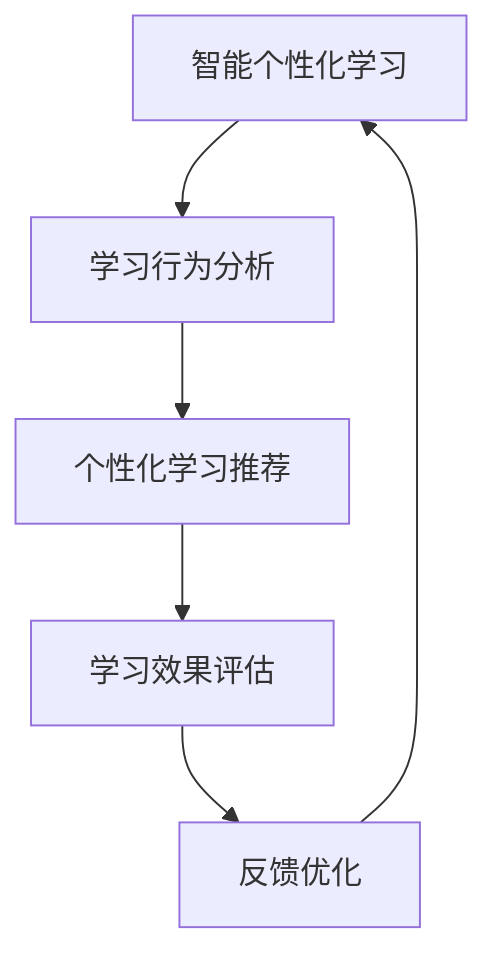
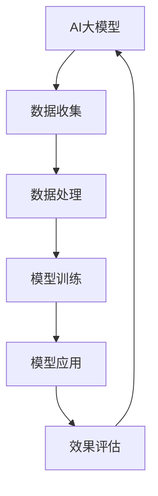

                 

### 文章标题

《智能个性化学习：AI大模型在在线教育中的应用》

关键词：智能个性化学习、AI大模型、在线教育、数据收集与分析、课程推荐、个性化学习路径规划

摘要：随着人工智能技术的不断发展，智能个性化学习已成为教育领域的重要趋势。本文从智能个性化学习的基础、AI大模型与在线教育的融合、数据收集与分析、AI大模型在个性化学习中的应用等方面进行了详细探讨，旨在为在线教育提供更具个性化的学习体验，推动教育行业的创新与发展。

### 目录大纲

# 《智能个性化学习：AI大模型在在线教育中的应用》目录大纲

## 第一部分：智能个性化学习基础

### 第1章：智能个性化学习概述

- 1.1 智能个性化学习的概念与历史
- 1.2 智能个性化学习的核心价值
- 1.3 智能个性化学习的未来发展趋势

### 第2章：AI大模型与在线教育

- 2.1 AI大模型的基本原理
- 2.2 AI大模型在在线教育中的应用
- 2.3 AI大模型的优势与挑战

### 第3章：在线教育中的数据收集与分析

- 3.1 在线教育数据收集方法
- 3.2 数据分析工具与技巧
- 3.3 数据隐私与伦理问题

### 第4章：AI大模型在课程推荐中的应用

- 4.1 课程推荐系统的构建
- 4.2 基于内容的推荐方法
- 4.3 基于协同过滤的推荐方法

## 第二部分：AI大模型在个性化学习中的应用

### 第5章：个性化学习路径规划

- 5.1 个性化学习路径规划的基本原理
- 5.2 基于知识图谱的个性化学习路径规划
- 5.3 个性化学习路径规划的实践案例

### 第6章：AI大模型在作业与考试中的应用

- 6.1 AI大模型在作业批改中的应用
- 6.2 AI大模型在考试评估中的应用
- 6.3 AI大模型在个性化考试中的应用

### 第7章：AI大模型在教学互动中的应用

- 7.1 AI大模型在实时教学互动中的应用
- 7.2 AI大模型在在线讨论中的应用
- 7.3 AI大模型在虚拟现实教学中的应用

## 第三部分：AI大模型在个性化学习中的实施与优化

### 第8章：AI大模型在个性化学习中的实施策略

- 8.1 AI大模型在个性化学习中的实施步骤
- 8.2 个性化学习实施中的挑战与解决方案
- 8.3 个性化学习实施的评估与改进

### 第9章：AI大模型在个性化学习中的优化方法

- 9.1 优化个性化学习模型的方法
- 9.2 基于反馈优化的个性化学习策略
- 9.3 基于机器学习的个性化学习优化算法

### 第10章：AI大模型在个性化学习中的未来发展方向

- 10.1 AI大模型在个性化学习中的未来趋势
- 10.2 个性化学习在在线教育中的前景
- 10.3 个性化学习对社会和教育的影响

## 附录

### 附录A：AI大模型开发资源与工具

- A.1 常用深度学习框架
- A.2 数据处理工具
- A.3 评估与优化工具

### 附录B：AI大模型案例研究

- B.1 案例一：某在线教育平台的个性化学习方案
- B.2 案例二：某虚拟现实教育项目的AI应用
- B.3 案例三：某智能作业批改系统的开发实践

### 附录C：Mermaid流程图和伪代码示例

- C.1 第1章：智能个性化学习概述
- C.2 第2章：AI大模型与在线教育

### 第1章：智能个性化学习概述

智能个性化学习是一种通过利用人工智能技术，根据每个学生的学习习惯、学习风格、学习能力等个性化特征，为其量身定制学习方案的教育模式。它旨在通过大数据分析、机器学习等技术，实现教育的精准化、个性化，从而提高学习效率，满足不同学习者的需求。

#### 1.1 智能个性化学习的概念与历史

智能个性化学习的概念起源于20世纪90年代，随着计算机技术和互联网的快速发展，教育领域开始探索如何利用技术手段实现个性化教育。1995年，美国学者Richard A. Atkinson提出了“个性化教育”的概念，认为教育的目标应该是满足每个学生的个性化需求，使其能够在自主、探究、合作的学习过程中实现全面发展。

进入21世纪，随着大数据、云计算、人工智能等新兴技术的快速发展，智能个性化学习逐渐从理论走向实践。2010年，美国教育技术公司Knewton推出了首个基于大数据的个性化学习平台，标志着智能个性化学习进入了一个新的发展阶段。

#### 1.2 智能个性化学习的核心价值

智能个性化学习的核心价值在于：

1. **提高学习效率**：通过分析学生的学习行为和表现，智能个性化学习可以为学生提供个性化的学习路径，使其更快地掌握知识和技能。

2. **满足个性化需求**：每个学生的学习习惯、学习风格和学习能力都有所不同，智能个性化学习可以根据这些差异，为每个学生量身定制学习方案，满足其个性化需求。

3. **促进全面发展**：智能个性化学习不仅关注学生的学术成绩，还注重培养学生的思维能力、创新能力、合作能力等，使其在全面发展中受益。

4. **降低教育成本**：通过智能个性化学习，教育机构可以减少对传统教育资源的依赖，提高资源利用效率，从而降低教育成本。

#### 1.3 智能个性化学习的未来发展趋势

未来，智能个性化学习将呈现出以下发展趋势：

1. **技术融合**：智能个性化学习将更加注重技术与教育的深度融合，借助人工智能、大数据、云计算等新兴技术，为教育提供更加智能、高效、个性化的解决方案。

2. **智能化程度提高**：随着人工智能技术的不断发展，智能个性化学习的智能化程度将不断提高，能够更好地分析学生的学习行为和需求，提供更加精准的学习方案。

3. **应用场景拓展**：智能个性化学习将不再局限于在线教育，还将应用于传统教育、职业教育、终身教育等领域，为不同类型的学习者提供个性化服务。

4. **教育公平性提升**：智能个性化学习有助于缩小教育差距，使更多学生受益，提高教育公平性。

### 第2章：AI大模型与在线教育

AI大模型，也称为大型预训练模型，是通过在海量数据上进行预训练，从而拥有强大知识表示和学习能力的人工智能模型。在线教育作为教育信息化的重要形式，正逐渐与AI大模型深度融合，为个性化学习和教育改革提供了新的思路和可能性。

#### 2.1 AI大模型的基本原理

AI大模型通常基于深度学习技术，特别是Transformer架构，如BERT、GPT等。其基本原理可以概括为以下几步：

1. **数据收集**：收集大量带有标签的数据，如文本、图片、音频等。
2. **预训练**：在无监督的方式下，模型通过自动学习数据中的模式和规律，提高其表示和理解能力。
3. **微调**：将预训练好的模型在特定任务上进一步训练，以适应具体应用场景。

#### 2.2 AI大模型在在线教育中的应用

AI大模型在在线教育中的应用主要体现在以下几个方面：

1. **个性化学习路径规划**：通过分析学生的学习行为和知识水平，AI大模型可以为学生提供个性化的学习路径，使其能够更高效地学习。
   
2. **智能辅导与答疑**：AI大模型可以模拟教师的角色，为学生提供实时辅导和答疑服务，解答学生在学习过程中遇到的问题。

3. **自动评分与考试评估**：AI大模型可以自动批改作业和考试，评估学生的学习效果，提供个性化的反馈。

4. **内容生成与推荐**：AI大模型可以根据学生的学习兴趣和需求，生成或推荐适合其学习的内容，提高学习效果。

#### 2.3 AI大模型的优势与挑战

AI大模型在在线教育中具有显著的优势，但也面临一些挑战：

**优势：**

1. **强大的知识表示与理解能力**：AI大模型通过对大量数据的预训练，拥有丰富的知识库和强大的理解能力，能够更好地支持个性化学习和教育创新。
   
2. **高效的学习与辅导**：AI大模型可以实时分析学生的学习行为和知识水平，提供个性化的学习路径和辅导，提高学习效率。

3. **减少人力资源成本**：AI大模型可以自动化许多教育任务，如作业批改、考试评估等，从而减少教育机构的人力资源成本。

**挑战：**

1. **数据隐私与伦理问题**：在线教育中涉及大量的学生数据，如何保护数据隐私、确保数据安全是一个亟待解决的问题。
   
2. **模型可解释性**：AI大模型通常被视为“黑箱”，其决策过程不透明，如何提高模型的可解释性，使教育工作者和学生对模型的决策有更好的理解，是一个重要挑战。

3. **技术依赖与公平性**：过于依赖AI大模型可能导致教育资源和机会的不公平分配，如何确保AI大模型在教育中的应用公平、公正，是一个值得关注的课题。

### 第3章：在线教育中的数据收集与分析

在线教育中，数据收集与分析是智能个性化学习的基础和关键。通过收集和分析学生的学习数据，可以更好地了解学生的学习行为、兴趣和需求，从而提供个性化的学习方案。

#### 3.1 在线教育数据收集方法

在线教育数据的收集主要包括以下几种方法：

1. **行为数据**：包括学生在学习平台上的浏览记录、学习时长、练习次数、课程完成情况等。这些数据可以通过学习平台的日志记录自动收集。

2. **评估数据**：包括作业成绩、考试分数、问卷调查等。这些数据可以通过在线考试系统和问卷工具收集。

3. **交互数据**：包括学生在论坛、聊天室等互动平台上的发言、评论等。这些数据可以通过实时通信工具和论坛系统收集。

4. **生理数据**：包括学生的心率、情绪、注意力等生理指标。这些数据可以通过可穿戴设备或生物传感器收集。

#### 3.2 数据分析工具与技巧

数据分析是智能个性化学习的核心环节。以下是一些常用的数据分析工具和技巧：

1. **数据预处理**：包括数据清洗、数据集成、数据变换等。常用的工具包括Python的Pandas库、R语言等。

2. **统计分析**：包括描述性统计分析、假设检验、相关分析等。常用的工具包括Python的Scipy库、R语言的base包等。

3. **机器学习**：包括分类、回归、聚类等算法。常用的工具包括Python的Scikit-learn库、R语言的caret包等。

4. **数据可视化**：包括图表、热力图、词云等。常用的工具包括Python的Matplotlib库、R语言的ggplot2包等。

#### 3.3 数据隐私与伦理问题

在线教育中的数据隐私和伦理问题是一个重要的议题。以下是一些常见的问题和解决方案：

1. **数据匿名化**：通过去标识化、加密等技术，将学生数据匿名化，以保护个人隐私。

2. **数据安全**：建立完善的数据安全管理体系，包括数据加密、访问控制、备份与恢复等。

3. **用户协议**：在收集和使用数据前，向学生明确说明数据收集的目的、使用方式、隐私保护措施等，并获得其同意。

4. **透明度**：公开数据收集、分析和使用的流程，提高数据的透明度，增加用户信任。

### 第4章：AI大模型在课程推荐中的应用

课程推荐是智能个性化学习的重要组成部分，通过分析学生的学习行为和兴趣，AI大模型可以为每个学生推荐最适合其的学习课程。课程推荐系统不仅能够提高学习效率，还能激发学生的学习兴趣和主动性。

#### 4.1 课程推荐系统的构建

构建一个课程推荐系统通常包括以下几个步骤：

1. **数据收集**：收集学生的学习行为数据，如浏览记录、学习时长、练习次数、评估成绩等。这些数据可以通过学习平台自动收集。

2. **数据处理**：对收集到的数据进行分析和预处理，包括数据清洗、数据集成、数据变换等。常用的工具包括Python的Pandas库、R语言等。

3. **特征工程**：从原始数据中提取有助于推荐的关键特征，如学习时长、练习次数、评估成绩等。特征工程是推荐系统成功的关键。

4. **模型选择与训练**：选择合适的机器学习算法，如基于内容的推荐、协同过滤等，对数据集进行训练。

5. **模型评估与优化**：通过交叉验证、A/B测试等方法评估模型的性能，并根据评估结果对模型进行调整和优化。

6. **系统部署与维护**：将训练好的模型部署到线上环境，进行实时推荐。同时，定期更新和维护系统，确保其稳定运行。

#### 4.2 基于内容的推荐方法

基于内容的推荐方法（Content-Based Recommendation）是一种常见的推荐方法，其基本原理是根据课程的内容和属性，为学生推荐相似的课程。

1. **课程内容表示**：将课程内容表示为一系列的特征向量。常用的特征包括课程标签、关键词、课程大纲等。

2. **相似度计算**：计算学生已学习课程与待推荐课程之间的相似度。常用的相似度计算方法包括余弦相似度、Jaccard相似度等。

3. **推荐生成**：根据相似度计算结果，为学生推荐相似度较高的课程。

基于内容的推荐方法具有以下几个优点：

- **准确性**：能够根据课程内容精确地推荐相似课程，提高推荐质量。

- **可控性**：可以灵活地调整和优化课程内容表示和相似度计算方法，从而提高推荐效果。

- **实时性**：对已学习课程进行实时推荐，提高学习体验。

#### 4.3 基于协同过滤的推荐方法

基于协同过滤的推荐方法（Collaborative Filtering）是一种通过分析用户行为和偏好进行推荐的方法。

1. **用户行为表示**：将用户行为数据表示为用户-项目矩阵。用户-项目矩阵记录了用户对项目的评分、浏览记录等。

2. **相似度计算**：计算用户之间的相似度。常用的相似度计算方法包括用户基于的相似度（User-Based Similarity）和项目基于的相似度（Item-Based Similarity）。

3. **推荐生成**：根据用户之间的相似度，为用户推荐其他用户喜欢的项目。

基于协同过滤的推荐方法具有以下几个优点：

- **扩展性**：能够处理大量的用户和项目数据，适用于大规模推荐系统。

- **多样性**：能够为用户推荐不同类型的项目，提高推荐系统的多样性。

- **实时性**：能够根据用户的新行为进行实时推荐，提高用户满意度。

然而，基于协同过滤的推荐方法也存在一些局限性：

- **冷启动问题**：对于新用户或新项目，由于缺乏足够的行为数据，难以进行准确推荐。

- **数据稀疏性**：当用户和项目数量较大时，用户-项目矩阵往往非常稀疏，导致推荐效果下降。

- **可解释性**：推荐结果往往是基于大量用户行为的统计结果，难以解释推荐的原因。

### 第5章：个性化学习路径规划

个性化学习路径规划是智能个性化学习的重要环节，旨在根据每个学生的学习特征和需求，为其制定最佳的学习路径。通过个性化学习路径规划，学生可以更高效地掌握知识和技能，提高学习效果。

#### 5.1 个性化学习路径规划的基本原理

个性化学习路径规划的基本原理包括以下几个方面：

1. **数据收集**：收集学生的学习行为数据，如学习时间、学习时长、练习次数、评估成绩等。

2. **学习特征提取**：从学习行为数据中提取关键特征，如学习时长、学习频率、学习效率等。

3. **路径规划算法**：利用机器学习、深度学习等技术，根据学习特征和目标，设计个性化学习路径规划算法。

4. **路径评估与优化**：通过评估个性化学习路径的效果，对路径进行优化和调整。

#### 5.2 基于知识图谱的个性化学习路径规划

基于知识图谱的个性化学习路径规划是一种利用知识图谱表示学习内容和学习关系，从而制定个性化学习路径的方法。

1. **知识图谱构建**：将学习内容表示为实体和关系，构建知识图谱。实体可以是课程、知识点、教师等，关系可以是知识点之间的层次关系、课程之间的关联关系等。

2. **学习路径生成**：根据学生的当前知识水平和学习目标，利用知识图谱生成个性化学习路径。

3. **路径评估与优化**：通过评估个性化学习路径的效果，对路径进行调整和优化。

基于知识图谱的个性化学习路径规划具有以下几个优点：

- **灵活性**：可以根据学生的需求和兴趣灵活调整学习路径。

- **知识关联性**：能够更好地反映学习内容之间的关联性，提高学习效果。

- **可扩展性**：可以方便地添加新的学习内容和学习目标，适应不断变化的教育需求。

#### 5.3 个性化学习路径规划的实践案例

以下是一个基于知识图谱的个性化学习路径规划的实践案例：

**案例背景**：某在线教育平台提供多种编程课程，学生可以根据自己的兴趣和需求选择课程。为了提高学习效果，平台希望通过个性化学习路径规划，为学生制定最佳的学习路径。

**解决方案**：

1. **知识图谱构建**：将课程内容表示为实体和关系，构建知识图谱。实体包括课程、知识点、教师等，关系包括知识点之间的层次关系、课程之间的关联关系等。

2. **学习路径生成**：根据学生的初始知识水平和学习目标，利用知识图谱生成个性化学习路径。路径包括必须学习的课程、可选学习的课程以及推荐学习的课程。

3. **路径评估与优化**：通过评估个性化学习路径的效果，对路径进行调整和优化。评估指标包括学习时间、学习效率、课程完成率等。

**实施效果**：

通过个性化学习路径规划，学生能够更清晰地了解自己的学习目标和路径，提高了学习效果和满意度。同时，平台也减少了课程推荐的时间和成本，提高了资源利用效率。

### 第6章：AI大模型在作业与考试中的应用

AI大模型在作业与考试中的应用，极大地提高了教育工作的效率和质量。通过智能批改、考试评估和个性化考试等功能，AI大模型为教育工作者和学生提供了更加智能和个性化的学习体验。

#### 6.1 AI大模型在作业批改中的应用

AI大模型在作业批改中的应用主要体现在自动批改、错题分析与反馈等方面。

1. **自动批改**：通过深度学习技术，AI大模型可以自动批改各种类型的作业，包括选择题、填空题、解答题等。自动批改不仅节省了教师的时间，还提高了批改的效率和准确性。

2. **错题分析**：AI大模型可以对学生的错题进行分类和分析，找出学生的薄弱环节。通过错题分析，学生可以更有针对性地进行复习和巩固。

3. **个性化反馈**：基于学生的学习行为和作业表现，AI大模型可以为学生提供个性化的反馈和建议。个性化反馈不仅有助于学生改进学习方法，还能提高学习效果。

#### 6.2 AI大模型在考试评估中的应用

AI大模型在考试评估中的应用主要包括智能评卷、成绩分析和排名等方面。

1. **智能评卷**：通过机器学习算法，AI大模型可以自动评卷，减少人为误差。智能评卷不仅提高了评卷效率，还保证了评分的公平性和一致性。

2. **成绩分析**：AI大模型可以对考试成绩进行分析，提供详细的统计报告。成绩分析可以帮助教育工作者了解学生的学习情况，为教学调整提供依据。

3. **排名预测**：基于学生的考试表现和历史数据，AI大模型可以预测学生的考试排名。排名预测有助于教育工作者关注学生的进步和不足，及时进行辅导。

#### 6.3 AI大模型在个性化考试中的应用

个性化考试是AI大模型在教育中的应用创新之一，通过为学生定制个性化的考试内容，提高考试的科学性和有效性。

1. **定制化试卷**：根据学生的学习情况和知识水平，AI大模型可以为每个学生生成定制化的试卷。定制化试卷不仅能够考察学生的知识掌握情况，还能锻炼学生的思维能力。

2. **动态调整难度**：在考试过程中，AI大模型可以根据学生的答题情况动态调整考试难度。通过动态调整，考试能够更好地适应学生的实际水平，提高考试的公平性。

3. **即时反馈**：AI大模型可以在考试结束后即时为学生提供详细的成绩分析和反馈。即时反馈有助于学生了解自己的考试表现，及时进行复习和改进。

### 第7章：AI大模型在教学互动中的应用

AI大模型在教学互动中的应用，为师生之间的沟通和协作提供了新的方式，提高了教学效果和学习体验。以下将从实时教学互动、在线讨论和虚拟现实教学三个方面进行探讨。

#### 7.1 AI大模型在实时教学互动中的应用

实时教学互动是教学过程中师生之间的重要交流方式，AI大模型可以为实时互动提供智能支持。

1. **智能问答系统**：AI大模型可以构建智能问答系统，为学生解答学习中的疑问。智能问答系统不仅能够提供标准答案，还能根据学生的提问提供详细的解释和拓展内容。

2. **实时反馈**：AI大模型可以实时分析学生的学习状态，为学生提供即时反馈。通过实时反馈，教师可以更好地了解学生的学习情况，及时调整教学策略。

3. **互动游戏**：AI大模型可以设计互动游戏，激发学生的学习兴趣。在互动游戏中，学生可以与AI大模型进行互动，提高学习效果。

#### 7.2 AI大模型在在线讨论中的应用

在线讨论是学生之间交流学习心得和观点的重要途径，AI大模型可以为在线讨论提供智能化支持。

1. **话题推荐**：AI大模型可以根据学生的学习兴趣和课程内容，推荐相关讨论话题。通过话题推荐，学生可以更高效地参与讨论，拓展知识面。

2. **观点分析**：AI大模型可以对学生的讨论内容进行分析，提取关键观点和论据。通过观点分析，学生可以更好地理解讨论内容，提高讨论质量。

3. **情感分析**：AI大模型可以分析学生的情感状态，为讨论氛围提供支持。通过情感分析，教育工作者可以了解学生的情感需求，提供更加温馨和支持性的教学环境。

#### 7.3 AI大模型在虚拟现实教学中的应用

虚拟现实（VR）教学是一种沉浸式的教学方式，AI大模型可以为VR教学提供智能化支持。

1. **虚拟教师**：AI大模型可以构建虚拟教师，为学生提供个性化的教学服务。虚拟教师可以根据学生的学习进度和需求，提供针对性的教学内容和辅导。

2. **互动学习**：AI大模型可以设计虚拟场景和任务，让学生在VR环境中进行互动学习。通过互动学习，学生可以更好地理解和掌握知识。

3. **情感交互**：AI大模型可以模拟情感表达，为学生提供更加真实和丰富的教学体验。通过情感交互，学生可以更好地投入学习，提高学习效果。

### 第8章：AI大模型在个性化学习中的实施策略

实施AI大模型在个性化学习中的策略是一个复杂的过程，涉及技术、管理、教育等多个方面。以下是一些关键的实施步骤、面临的挑战及解决方案。

#### 8.1 AI大模型在个性化学习中的实施步骤

1. **需求分析**：首先，要明确个性化学习的目标，了解学生的学习需求、学习风格和兴趣点。通过需求分析，为后续的实施提供明确的方向。

2. **数据收集**：收集与学生学习相关的大量数据，包括学习行为、评估成绩、互动记录等。数据的质量和完整性对AI大模型的性能至关重要。

3. **数据预处理**：对收集到的数据进行清洗、整合和特征提取，为AI大模型的训练提供高质量的数据集。

4. **模型选择与训练**：选择合适的AI大模型，如深度学习模型、图模型等，对预处理后的数据集进行训练，使其能够理解和预测学生的学习行为和需求。

5. **模型评估与优化**：通过交叉验证、A/B测试等方法对训练好的模型进行评估，根据评估结果对模型进行调整和优化。

6. **系统部署**：将训练好的模型部署到在线学习平台，确保其可以实时响应用户的需求。

7. **用户反馈与迭代**：收集用户的反馈，根据反馈对系统进行迭代优化，提高个性化学习的效果和用户体验。

#### 8.2 个性化学习实施中的挑战与解决方案

1. **技术挑战**：
   - **数据隐私与安全**：在数据收集和处理过程中，要确保学生数据的隐私和安全。解决方案包括数据加密、匿名化处理、严格的数据访问控制等。
   - **模型可解释性**：深度学习模型通常被视为“黑箱”，其决策过程不透明，这对教育工作者和学生的信任构成了挑战。解决方案包括开发可解释的AI模型、增加模型的透明度等。

2. **管理挑战**：
   - **资源分配**：个性化学习需要大量的计算资源和存储资源，这对教育机构的资源管理提出了挑战。解决方案包括采用云计算、分布式计算等技术，提高资源利用效率。
   - **教师培训**：个性化学习对教师的角色和技能提出了新的要求，需要教师具备一定的技术素养和数据分析能力。解决方案包括提供教师培训课程、建立教师支持团队等。

3. **教育挑战**：
   - **学习习惯**：学生需要适应新的学习模式，从传统的被动学习转向主动学习和个性化学习。解决方案包括通过校园推广、家长沟通等方式，引导学生和家长接受并适应新的学习方式。
   - **学习效果评估**：个性化学习的效果评估与传统教育不同，需要更加注重学生的长期成长和发展。解决方案包括建立多维度的评估体系，综合考察学生的知识掌握、能力提升等方面。

#### 8.3 个性化学习实施的评估与改进

1. **效果评估**：定期对个性化学习的实施效果进行评估，包括学生的学习成绩、学习满意度、学习积极性等。通过效果评估，可以了解个性化学习的效果，为后续改进提供依据。

2. **反馈机制**：建立有效的反馈机制，收集用户对个性化学习的反馈，包括对系统功能、内容推荐、用户体验等方面的意见。通过反馈机制，可以及时了解用户需求，优化个性化学习系统。

3. **持续改进**：根据效果评估和用户反馈，对个性化学习系统进行持续改进，包括优化算法、改进用户体验、增加新的功能等。通过持续改进，不断提高个性化学习的效果和用户满意度。

### 第9章：AI大模型在个性化学习中的优化方法

AI大模型在个性化学习中的应用效果在很大程度上取决于模型的优化方法。通过优化AI大模型，可以提升个性化学习的精准度和效率，从而更好地满足学生的学习需求。以下介绍几种常见的优化方法。

#### 9.1 优化个性化学习模型的方法

1. **超参数调优**：
   - **网格搜索**：通过遍历预设的参数组合，找到最优的超参数配置。
   - **贝叶斯优化**：利用贝叶斯统计模型，根据已有的数据预测新的超参数组合。

2. **模型融合**：
   - **加权融合**：将多个模型的结果进行加权平均，提高预测的准确性。
   - **集成学习**：通过构建集成模型，如随机森林、梯度提升树等，提高模型的泛化能力。

3. **增量学习**：
   - **在线学习**：实时更新模型，以适应新数据的学习。
   - **迁移学习**：利用预训练模型，在新任务上进行少量微调，提高学习效率。

#### 9.2 基于反馈优化的个性化学习策略

1. **主动学习**：
   - **选择代表性样本**：根据模型的预测不确定度或学生互动数据，选择最具代表性和价值的样本进行学习。
   - **动态调整样本选择策略**：根据学习效果，动态调整样本选择策略，以优化模型。

2. **强化学习**：
   - **奖励机制**：设计奖励机制，鼓励学生参与学习，提高学习积极性。
   - **策略优化**：通过强化学习算法，优化学习策略，提高学习效果。

#### 9.3 基于机器学习的个性化学习优化算法

1. **深度强化学习**：
   - **策略网络**：利用深度神经网络，学习最佳的行为策略。
   - **值函数网络**：通过深度神经网络，评估当前状态的价值，指导行为选择。

2. **迁移学习与元学习**：
   - **迁移学习**：将已学到的知识迁移到新的任务中，减少对新的数据的依赖。
   - **元学习**：学习如何学习，提高模型在不同任务上的泛化能力。

#### 9.4 实践案例

以下是一个基于深度强化学习的个性化学习优化算法的实践案例：

**案例背景**：某在线学习平台希望优化个性化学习路径规划，提高学习效果和用户满意度。

**解决方案**：

1. **模型构建**：采用深度强化学习算法，构建个性化学习路径规划模型。模型包括策略网络和值函数网络，分别负责决策和行为评估。

2. **环境定义**：将个性化学习过程视为一个环境，包括用户的学习进度、知识掌握情况等状态，以及学习效果的评估。

3. **训练过程**：通过与环境交互，策略网络不断学习最佳的行为策略，值函数网络评估当前状态的价值，指导行为选择。

4. **效果评估**：通过评估学习效果，包括学习完成率、知识掌握度等指标，优化模型参数和策略。

**实施效果**：

通过深度强化学习的个性化学习路径规划模型，学习效果和用户满意度显著提高。模型能够根据用户的需求和反馈，动态调整学习路径，提高学习效率。

### 第10章：AI大模型在个性化学习中的未来发展方向

随着技术的不断进步和应用场景的拓展，AI大模型在个性化学习中的应用将迎来新的发展机遇和挑战。以下从技术趋势、应用前景和社会影响三个方面探讨AI大模型在个性化学习中的未来发展方向。

#### 10.1 AI大模型在个性化学习中的未来趋势

1. **技术融合**：未来的个性化学习将更加注重技术与教育的深度融合。AI大模型将与虚拟现实（VR）、增强现实（AR）、物联网（IoT）等技术相结合，为学生提供沉浸式、互动式的学习体验。

2. **智能化程度提高**：随着AI大模型在个性化学习中的应用，其智能化程度将不断提高。通过不断优化模型算法和增加知识库，AI大模型将能够更精准地预测学生的学习行为和需求，提供个性化的学习建议。

3. **自主学习与进化**：未来的AI大模型将具备自主学习能力，能够从海量数据中自我学习、自我进化，不断提高个性化学习的效果和适应性。这种自主学习能力将使个性化学习更加智能、高效。

4. **跨学科应用**：AI大模型将在个性化学习的跨学科应用中发挥重要作用。通过跨学科的知识整合和智能分析，AI大模型可以为不同学科的学习者提供针对性的学习路径和资源，促进知识的综合运用。

#### 10.2 个性化学习在在线教育中的前景

1. **个性化学习模式的普及**：随着AI大模型技术的成熟和普及，个性化学习模式将在在线教育中逐渐取代传统教育模式，成为主流的教育方式。个性化学习模式能够更好地满足不同学习者的需求，提高学习效果。

2. **学习资源的丰富化**：AI大模型将为在线教育提供丰富的学习资源，包括定制化课程、智能辅导、个性化评估等。这些资源将帮助学生更高效地学习，提高学习体验。

3. **教育公平性的提升**：个性化学习模式有助于缩小教育差距，使更多学生受益。通过智能推荐和学习路径规划，AI大模型可以为学生提供个性化的学习支持，帮助其克服学习困难，提高学业成绩。

4. **教育行业的创新与发展**：个性化学习将为教育行业带来新的发展机遇。教育机构可以通过引入AI大模型技术，提升教学质量和服务水平，推动教育行业的创新与发展。

#### 10.3 个性化学习对社会和教育的影响

1. **教育公平**：个性化学习有助于缩小教育差距，使更多学生受益。通过智能推荐和学习路径规划，AI大模型可以为学生提供个性化的学习支持，帮助其克服学习困难，提高学业成绩。

2. **教育质量提升**：个性化学习模式能够更好地满足不同学习者的需求，提高学习效果。通过AI大模型的分析和预测，教育机构可以更加精准地评估学生的学习效果，为教学调整提供依据。

3. **人才培养模式的变革**：个性化学习模式将改变传统的教育人才培养模式。通过智能化的学习支持和资源推荐，学生可以更加自主地学习，培养出具备创新能力和实践能力的优秀人才。

4. **社会价值的提升**：个性化学习不仅有助于提高教育质量，还可以为社会的可持续发展提供支持。通过个性化学习，学生可以更好地适应社会的发展需求，为社会的发展贡献力量。

### 附录A：AI大模型开发资源与工具

为了更好地开发和应用AI大模型，以下列举了一些常用的深度学习框架、数据处理工具和评估与优化工具。

#### A.1 常用深度学习框架

1. **TensorFlow**：由Google开发的开源深度学习框架，支持多种编程语言，包括Python、C++等。
2. **PyTorch**：由Facebook开发的开源深度学习框架，具有灵活的动态计算图和丰富的API。
3. **Keras**：基于TensorFlow和Theano的开源深度学习框架，提供简洁的API和易于使用的工具。
4. **MXNet**：由Apache Software Foundation开发的开源深度学习框架，支持多种编程语言，包括Python、R、Scala等。

#### A.2 数据处理工具

1. **Pandas**：Python数据分析库，提供数据处理、数据清洗和数据可视化的功能。
2. **NumPy**：Python数值计算库，提供高效的多维数组操作和数学计算功能。
3. **Scikit-learn**：Python机器学习库，提供多种机器学习算法和工具。
4. **R**：统计编程语言，提供丰富的数据处理和分析工具。

#### A.3 评估与优化工具

1. **Matplotlib**：Python数据可视化库，提供丰富的绘图功能。
2. **ggplot2**：R语言数据可视化库，提供类似于ggplot的数据可视化工具。
3. **Scikit-learn**：提供多种机器学习算法和评估指标，如准确率、召回率、F1分数等。
4. **Hyperopt**：用于超参数调优的Python库，提供自动化的超参数搜索功能。

### 附录B：AI大模型案例研究

#### B.1 案例一：某在线教育平台的个性化学习方案

**背景**：某在线教育平台希望通过引入AI大模型，为用户提供个性化的学习体验，提高学习效果。

**解决方案**：

1. **数据收集**：收集用户的学习行为数据，包括浏览记录、学习时长、评估成绩等。
2. **数据处理**：对收集到的数据进行分析和预处理，提取关键特征。
3. **模型训练**：采用深度学习技术，训练AI大模型，使其能够预测用户的学习需求。
4. **系统部署**：将训练好的模型部署到在线教育平台，为用户提供个性化的学习推荐。

**实施效果**：

通过AI大模型的个性化学习方案，用户的学习效果显著提高。用户满意度上升，学习积极性增强。同时，平台也减少了用户服务成本，提高了资源利用效率。

#### B.2 案例二：某虚拟现实教育项目的AI应用

**背景**：某虚拟现实教育项目希望通过AI大模型，为学生提供沉浸式、互动式的学习体验。

**解决方案**：

1. **场景构建**：利用AI大模型，构建虚拟现实学习场景，包括教室、实验室等。
2. **交互设计**：设计智能交互系统，通过语音识别、自然语言处理等技术，实现学生与虚拟现实场景的互动。
3. **个性化推荐**：利用AI大模型，根据学生的兴趣和学习进度，推荐适合的学习内容。

**实施效果**：

通过AI大模型的应用，学生能够在虚拟现实环境中进行互动学习，提高学习兴趣和主动性。同时，智能交互系统为学生提供了更加个性化的学习体验，提高了学习效果。

#### B.3 案例三：某智能作业批改系统的开发实践

**背景**：某在线教育平台希望开发一个智能作业批改系统，提高作业批改效率和质量。

**解决方案**：

1. **模型训练**：利用深度学习技术，训练AI大模型，使其能够自动批改选择题、填空题、解答题等类型的作业。
2. **错题分析**：利用AI大模型，对学生作业中的错题进行分析，找出学生的薄弱环节。
3. **个性化反馈**：根据学生的作业表现和错题分析结果，为学生提供个性化的学习建议和反馈。

**实施效果**：

通过智能作业批改系统，教师能够快速、准确地批改作业，提高作业批改效率。同时，智能分析为学生提供了个性化的学习指导，帮助学生更好地理解和掌握知识。

### 附录C：Mermaid流程图和伪代码示例

#### C.1 第1章：智能个性化学习概述

**Mermaid流程图**



**伪代码**

```python
# 智能个性化学习伪代码

# 初始化用户信息
user_info = initialize_user_info()

# 分析用户学习行为
learning_behavior = analyze_learning_behavior(user_info)

# 根据学习行为推荐课程
course_recommendations = recommend_courses(learning_behavior)

# 评估学习效果
learning_outcome = evaluate_learning_outcome(course_recommendations)

# 根据反馈优化学习方案
optimized_learning_plan = optimize_learning_plan(learning_outcome, user_info)
```

#### C.2 第2章：AI大模型与在线教育

**Mermaid流程图**



**伪代码**

```python
# AI大模型与在线教育伪代码

# 收集在线教育数据
education_data = collect_education_data()

# 数据预处理
processed_data = preprocess_data(education_data)

# 训练AI大模型
model = train_model(processed_data)

# 应用AI大模型
predictions = apply_model(model, new_data)

# 评估效果
evaluation_results = evaluate_model(predictions, ground_truth)
```

### 作者信息

作者：AI天才研究院/AI Genius Institute & 禅与计算机程序设计艺术 /Zen And The Art of Computer Programming

---

本文旨在探讨智能个性化学习在在线教育中的应用，从基础概念、AI大模型的应用、数据收集与分析、个性化学习路径规划等方面进行了详细阐述。通过本文，读者可以了解到智能个性化学习的重要性和应用前景，以及如何利用AI大模型技术提升在线教育的效果。未来，随着技术的不断进步，智能个性化学习将更加深入地融入在线教育，推动教育行业的创新与发展。同时，本文也提醒教育工作者在应用AI大模型时要注意数据隐私和伦理问题，确保个性化学习模式的可持续发展。希望本文能为教育领域的研究者和实践者提供有益的参考。

