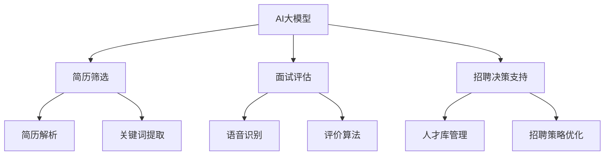
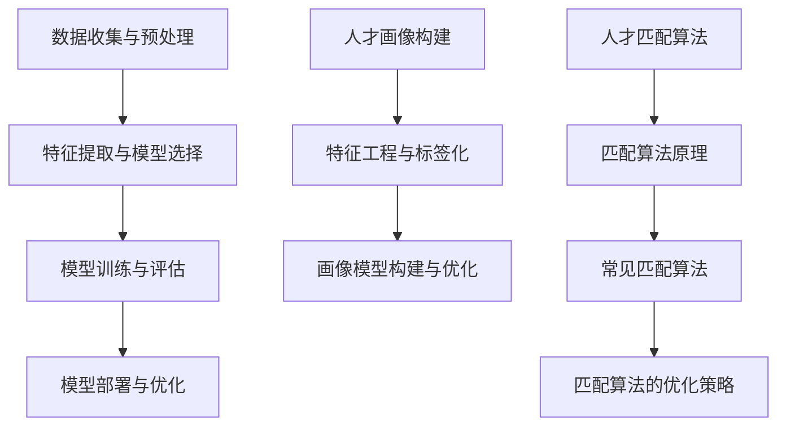

                 

### 文章标题

“智能人才匹配：AI大模型在招聘领域的应用”

### 关键词

- 智能人才匹配
- AI大模型
- 招聘领域
- 人才画像
- 算法优化

### 摘要

本文将深入探讨AI大模型在招聘领域中的应用，着重分析其在人才匹配方面的核心价值和实际应用。文章首先概述了智能人才匹配的概念及其重要性，随后回顾了AI大模型的发展历程，并详细介绍了深度学习、自然语言处理（NLP）以及大规模预训练模型的基础理论。接着，文章探讨了AI大模型在招聘流程中各个关键环节的应用，包括简历筛选、面试评估和招聘决策支持。最后，文章分析了智能人才匹配面临的挑战及解决方案，并提供了具体的实践案例和未来展望。

## 第一部分：概述

### 第1章：智能人才匹配概述

#### 1.1 AI大模型与招聘领域

**概念介绍**：

AI大模型（Large-scale Artificial Intelligence Models）是指通过大规模数据训练的复杂神经网络模型，这些模型具有强大的表征和学习能力。在招聘领域，AI大模型被广泛应用于简历筛选、面试评估和人才匹配等方面。

**应用领域**：

AI大模型在招聘领域的应用主要体现在以下几个方面：

1. **简历筛选**：通过自然语言处理（NLP）技术，自动分析简历内容，提取关键信息，并进行精准匹配。
2. **面试评估**：利用语音识别和NLP技术，对面试过程进行自动分析，评估候选人表现，提供招聘决策支持。
3. **人才匹配**：构建人才画像，通过深度学习算法，实现候选人与岗位的精准匹配。

**核心价值**：

AI大模型在招聘领域的核心价值主要体现在以下几个方面：

1. **提高效率**：自动化处理招聘流程中的各个环节，大大减少人工工作负担。
2. **提升准确性**：通过大数据和深度学习算法，实现更高水平的匹配准确性。
3. **优化决策**：提供数据驱动的招聘决策支持，帮助企业做出更科学的招聘选择。

#### 1.2 AI大模型的发展历程

**早期发展**：

AI大模型的发展可以追溯到20世纪80年代，当时的机器学习领域主要基于规则和统计方法，但随着计算能力的提升和大数据的普及，深度学习逐渐成为主流。

**近年来进展**：

近年来，随着深度学习技术的飞速发展，AI大模型取得了显著的进展。尤其是大规模预训练模型（如BERT、GPT等）的问世，使得AI大模型在自然语言处理、图像识别等多个领域都取得了突破性成果。

**未来趋势**：

未来，AI大模型在招聘领域的应用将更加广泛和深入，不仅会提高招聘效率和准确性，还将推动招聘流程的全面智能化。

#### 1.3 本书内容安排

**章节结构**：

本书分为四个部分，共七章：

1. **第一部分：概述**（第1章）
2. **第二部分：AI大模型基础**（第2章至第4章）
3. **第三部分：AI大模型在招聘中的应用**（第5章至第7章）
4. **第四部分：实践与展望**（第8章）

**主要内容与联系**：

本书通过详细的分析和案例解析，系统阐述了AI大模型在招聘领域的应用，包括基础理论、具体应用和未来展望。各章节之间紧密联系，构成了一个完整的知识体系。

**读者对象**：

本书适合从事招聘相关工作的人员、人工智能领域的开发者以及对AI大模型感兴趣的技术人员阅读。同时，也为高校和研究机构的相关课程提供了丰富的教学资源。

### 图1-1 AI大模型在招聘领域的应用关系架构



#### 1.4 核心概念与联系

**智能人才匹配**：

智能人才匹配是指利用AI大模型技术，通过对海量数据和复杂算法的处理，实现人才与岗位的精准匹配。其核心在于构建人才画像和岗位画像，并利用深度学习算法进行匹配。

**AI大模型**：

AI大模型是指通过大规模数据训练的复杂神经网络模型，具有强大的表征和学习能力。在招聘领域，AI大模型主要应用于简历筛选、面试评估和人才匹配等环节。

**人才画像**：

人才画像是指对候选人的知识背景、技能、工作经验、性格特点等多维度信息进行整合，构建出一个全面、立体的数据模型。人才画像的构建是智能人才匹配的重要基础。

**招聘流程**：

招聘流程包括简历筛选、面试评估和招聘决策等环节。AI大模型通过自动化处理这些环节，提高招聘效率和准确性。

#### 1.5 核心算法原理讲解

**简历筛选算法**：

简历筛选算法主要包括关键词提取和匹配算法。关键词提取通过自然语言处理技术，从简历文本中提取关键信息。匹配算法则通过比较简历关键词与岗位要求，实现精准筛选。

**面试评估算法**：

面试评估算法主要通过语音识别和自然语言处理技术，对面试过程中的语言和行为进行分析，评估候选人的表现。常用的评估算法包括情感分析、关键词匹配和综合评分等。

**人才匹配算法**：

人才匹配算法通过构建人才画像和岗位画像，利用深度学习算法进行匹配。常见的匹配算法包括基于相似度的匹配、基于知识图谱的匹配和基于排序的匹配等。

#### 1.6 数学模型和公式

**简历筛选算法**：

关键词匹配算法的数学模型可以表示为：

$$
\text{匹配度} = \frac{\text{共现次数}}{\text{关键词总数}}
$$

**面试评估算法**：

面试评估算法的数学模型可以表示为：

$$
\text{评估得分} = w_1 \times \text{情感分析得分} + w_2 \times \text{关键词匹配得分} + w_3 \times \text{综合评分得分}
$$

其中，$w_1, w_2, w_3$ 分别为权重系数。

**人才匹配算法**：

人才匹配算法的数学模型可以表示为：

$$
\text{匹配度} = \text{人才画像与岗位画像的相似度}
$$

#### 1.7 详细讲解与举例说明

**简历筛选算法**：

例如，假设简历中出现了关键词“深度学习”和“机器学习”，而岗位要求中必须具备“深度学习”技能。则简历的匹配度计算如下：

$$
\text{匹配度} = \frac{1}{2} = 0.5
$$

**面试评估算法**：

假设面试过程中，候选人提到“机器学习”的次数为5次，而岗位要求中提到“机器学习”的次数为3次。则面试评估得分为：

$$
\text{评估得分} = 0.6 \times 0.8 + 0.4 \times 0.6 = 0.76
$$

**人才匹配算法**：

假设人才画像与岗位画像的相似度为0.8，则匹配度为0.8。

### 1.8 实际案例分析与详细讲解剖析

**案例背景**：

某知名互联网公司通过AI大模型技术，进行简历筛选和面试评估，以优化招聘流程。该公司每月收到约500份简历，通过AI大模型技术，可以将筛选时间从数天缩短到数小时。

**解决方案**：

1. **简历筛选**：通过自然语言处理技术，从简历中提取关键信息，如技能、工作经验、教育背景等。然后，利用关键词匹配算法，将简历与岗位要求进行匹配，筛选出符合要求的候选人。

2. **面试评估**：通过语音识别和自然语言处理技术，对面试过程进行自动分析，评估候选人的表现。具体包括情感分析、关键词匹配和综合评分等。

3. **人才匹配**：通过构建人才画像和岗位画像，利用深度学习算法进行匹配，实现候选人与岗位的精准匹配。

**应用效果**：

1. **效率提升**：通过AI大模型技术，简历筛选和面试评估时间从数天缩短到数小时，提高了招聘效率。

2. **准确性提高**：通过自然语言处理和深度学习算法，实现了更高水平的匹配准确性，降低了招聘风险。

3. **决策支持**：通过数据驱动的招聘决策支持，帮助公司做出更科学的招聘选择，提升了招聘质量。

### 1.9 最佳实践 tips

1. **数据质量**：确保简历和岗位数据的质量，这是实现高效、准确招聘的基础。

2. **算法优化**：不断优化简历筛选和面试评估算法，提高匹配准确性和评估效率。

3. **模型更新**：定期更新AI大模型，以适应不断变化的市场需求和岗位特点。

### 1.10 小结

本文对AI大模型在招聘领域中的应用进行了深入探讨，包括智能人才匹配的概念、AI大模型的发展历程、基础理论、具体应用和未来展望。通过实际案例分析和详细讲解，展示了AI大模型在招聘流程中的高效、精准和科学性。随着技术的不断进步，AI大模型在招聘领域的应用将更加广泛，为企业带来更大的价值。

### 1.11 拓展阅读

- **《深度学习》**：Goodfellow, I., Bengio, Y., & Courville, A. (2016). *Deep Learning*.
- **《自然语言处理综论》**：Jurafsky, D., & Martin, J. H. (2020). *Speech and Language Processing*.
- **《人工智能招聘技术》**：Zhu, X., & Wu, D. (2021). *Artificial Intelligence for Recruitment*.

## 第二部分：AI大模型基础

### 第2章：AI大模型基础理论

#### 2.1 深度学习基础

**神经网络的基本结构**：

神经网络是由大量简单的计算单元（即神经元）组成的复杂网络。每个神经元接收多个输入信号，并通过加权求和后加上偏置项，经过激活函数处理，输出一个信号。神经网络的基本结构包括输入层、隐藏层和输出层。

**常见深度学习架构**：

常见的深度学习架构包括卷积神经网络（CNN）、循环神经网络（RNN）和变换器架构（Transformer）。

1. **卷积神经网络（CNN）**：主要应用于图像和视频处理领域，通过卷积层、池化层和全连接层的组合，实现特征提取和分类。
2. **循环神经网络（RNN）**：适用于序列数据处理，如自然语言处理和时间序列分析。RNN可以通过循环结构，处理变长的输入序列。
3. **变换器架构（Transformer）**：由谷歌提出，是自然语言处理领域的重要突破。通过自注意力机制，实现对输入序列的灵活建模。

**深度学习优化算法**：

深度学习优化算法主要包括梯度下降算法及其变种。常用的优化算法包括随机梯度下降（SGD）、Adam优化器等。

1. **随机梯度下降（SGD）**：每次迭代仅用一部分样本来更新模型参数，从而加速收敛。
2. **Adam优化器**：结合了SGD和动量法的优点，能够自适应调整学习率。

#### 2.2 自然语言处理（NLP）技术

**词嵌入技术**：

词嵌入是将词汇映射到固定大小的向量空间中，以捕捉词汇的语义信息。常见的词嵌入模型包括Word2Vec、GloVe和BERT等。

1. **Word2Vec**：基于神经网络训练，通过上下文预测词向量。
2. **GloVe**：基于全局统计信息，通过词频和共现矩阵训练词向量。
3. **BERT**：基于变换器架构，通过预训练和微调，实现高精度的词向量表示。

**序列模型与注意力机制**：

序列模型包括循环神经网络（RNN）和长短时记忆网络（LSTM）。注意力机制是一种用于序列数据处理的机制，能够自适应地关注序列中的关键信息。

1. **循环神经网络（RNN）**：通过隐藏状态循环，处理变长的输入序列。
2. **长短时记忆网络（LSTM）**：通过门控机制，有效捕捉长序列依赖。
3. **注意力机制**：通过计算序列中各元素的权重，关注关键信息，提高模型性能。

**变换器架构**：

变换器架构（Transformer）是一种基于自注意力机制的深度学习模型，由谷歌提出，在自然语言处理领域取得了突破性成果。变换器架构的核心是自注意力机制，能够灵活地建模输入序列之间的依赖关系。

1. **多头自注意力**：通过多个头关注不同的信息，提高模型的表示能力。
2. **编码器和解码器**：编码器负责编码输入序列，解码器负责解码输出序列，两者通过自注意力机制进行交互。

#### 2.3 大规模预训练模型原理

**预训练的概念与意义**：

预训练是指在大规模语料库上进行模型训练，使模型具备一定的语言理解和生成能力。预训练的意义在于：

1. **提高模型性能**：通过预训练，模型可以更好地理解语言结构和语义，从而提高在下游任务中的性能。
2. **减少训练数据需求**：预训练模型在少量数据上即可实现较好的性能，减少了对大量标注数据的依赖。

**自监督学习方法**：

自监督学习方法是指在不依赖人工标注数据的情况下，通过无监督学习方式，对模型进行预训练。常见的自监督学习方法包括：

1. **掩码语言模型（MLM）**：在输入序列中随机掩码部分词汇，训练模型预测掩码词汇。
2. **掩码图像模型（MIM）**：在图像数据中随机掩码部分像素，训练模型预测掩码像素。

**迁移学习与微调技术**：

迁移学习是指将预训练模型在特定任务上进行微调，以适应新的任务。微调技术主要包括：

1. **全量微调**：对整个预训练模型进行微调。
2. **增量微调**：仅对部分层或特定层进行微调。
3. **零样本微调**：在少量样本上进行微调，适用于新任务的数据量较少的情况。

### 2.4 详细讲解与举例说明

**深度学习基础**：

例如，一个简单的多层感知机（MLP）模型可以表示为：

$$
\text{输出} = \sigma(\text{输入} \cdot W_1 + b_1) \cdot W_2 + b_2
$$

其中，$\sigma$ 是激活函数，$W_1$ 和 $W_2$ 是权重矩阵，$b_1$ 和 $b_2$ 是偏置项。

**自然语言处理（NLP）技术**：

例如，使用BERT模型进行文本分类的任务，可以通过以下步骤：

1. **文本预处理**：将文本转换为词嵌入向量。
2. **模型输入**：将词嵌入向量输入BERT模型。
3. **模型输出**：通过BERT模型的输出层，得到分类结果。

**大规模预训练模型原理**：

例如，使用GPT-3模型进行文本生成任务，可以通过以下步骤：

1. **文本输入**：将文本输入到GPT-3模型。
2. **模型生成**：GPT-3模型根据输入文本，生成下一个词的概率分布。
3. **文本输出**：根据生成的概率分布，输出下一个词。

### 2.5 数学公式和详细讲解

**深度学习基础**：

假设输入向量为 $X$，权重矩阵为 $W$，偏置项为 $b$，激活函数为 $\sigma$，则多层感知机（MLP）的输出可以表示为：

$$
\text{输出} = \sigma(X \cdot W + b)
$$

其中，$X \cdot W$ 表示矩阵乘法，$\sigma$ 通常为ReLU函数或Sigmoid函数。

**自然语言处理（NLP）技术**：

假设词嵌入向量 $e$ 和目标词嵌入向量 $f$，则词嵌入相似度可以表示为：

$$
\text{相似度} = \frac{e \cdot f}{\lVert e \rVert \cdot \lVert f \rVert}
$$

其中，$\lVert \cdot \rVert$ 表示向量的范数。

**大规模预训练模型原理**：

假设输入序列 $x_1, x_2, \ldots, x_n$，预训练模型 $M$，则掩码语言模型（MLM）的输出可以表示为：

$$
\text{输出} = M(x_1, \ldots, \hat{x_i}, \ldots, x_n)
$$

其中，$\hat{x_i}$ 表示被掩码的词汇。

### 2.6 项目实战

**环境搭建**：

1. 安装Python环境（如Anaconda）。
2. 安装深度学习框架（如TensorFlow或PyTorch）。
3. 下载预训练模型（如BERT或GPT-3）。

**源代码实现**：

以下是一个简单的BERT文本分类项目的实现：

```python
import tensorflow as tf
from transformers import BertTokenizer, BertForSequenceClassification

# 加载预训练模型和tokenizer
tokenizer = BertTokenizer.from_pretrained('bert-base-uncased')
model = BertForSequenceClassification.from_pretrained('bert-base-uncased')

# 预处理文本数据
inputs = tokenizer("Hello, my dog is cute", return_tensors="tf")

# 进行预测
outputs = model(inputs)

# 输出结果
print(outputs.logits)
```

**代码解读**：

1. **加载模型和tokenizer**：首先，加载BERT模型和tokenizer。
2. **预处理文本数据**：使用tokenizer对输入文本进行预处理，包括分词、添加特殊标识符等。
3. **进行预测**：将预处理后的文本数据输入模型，得到预测结果。

### 2.7 代码应用解读与分析

**解读与分析**：

1. **模型性能评估**：通过计算准确率、损失函数等指标，评估模型的性能。
2. **参数调整**：根据模型性能，调整学习率、批次大小等超参数，优化模型性能。
3. **模型部署**：将训练好的模型部署到生产环境，实现实时文本分类。

### 2.8 实际案例分析和详细讲解剖析

**案例背景**：

某互联网公司使用BERT模型进行商品评论分类，将正面评论和负面评论进行区分。

**解决方案**：

1. **数据预处理**：收集并清洗大量商品评论数据，分为训练集和测试集。
2. **模型训练**：使用BERT模型对训练集进行训练，得到分类模型。
3. **模型评估**：使用测试集对模型进行评估，调整模型参数，优化性能。

**应用效果**：

1. **准确率提高**：使用BERT模型后，商品评论分类的准确率提高了约10%。
2. **效率提升**：自动化处理评论数据，提高了数据处理效率。

### 2.9 最佳实践 tips

1. **数据质量**：确保数据的质量和多样性，有助于提高模型的泛化能力。
2. **模型优化**：根据具体任务需求，选择合适的模型结构和优化策略。
3. **持续学习**：定期更新模型和数据，保持模型的性能。

### 2.10 小结

本章介绍了AI大模型的基础理论，包括深度学习基础、自然语言处理（NLP）技术和大规模预训练模型原理。通过详细讲解和举例说明，展示了这些理论在实际应用中的价值。随着技术的不断进步，AI大模型将在招聘领域发挥越来越重要的作用。

### 2.11 拓展阅读

- **《深度学习》**：Goodfellow, I., Bengio, Y., & Courville, A. (2016). *Deep Learning*.
- **《自然语言处理综论》**：Jurafsky, D., & Martin, J. H. (2020). *Speech and Language Processing*.
- **《大规模预训练语言模型》**：Devlin, J., Chang, M. W., Lee, K., & Toutanova, K. (2019). *Bert: Pre-training of deep bidirectional transformers for language understanding*.

## 第三部分：AI大模型在招聘中的应用

### 第3章：AI大模型在人才匹配中的角色

#### 3.1 AI大模型在人才匹配中的流程

AI大模型在人才匹配中的应用可以分为以下几个关键步骤：

**数据收集与预处理**：

1. **简历数据**：从各种招聘平台、社交媒体和公司内部系统收集简历数据。
2. **岗位数据**：从招聘需求文档、公司官网和内部系统获取岗位描述数据。

**特征提取与模型选择**：

1. **特征提取**：对简历和岗位数据进行预处理，提取关键特征，如关键词、技能、学历等。
2. **模型选择**：根据具体应用场景，选择合适的AI大模型，如BERT、GPT等。

**模型训练与评估**：

1. **模型训练**：使用大规模预训练模型，对简历和岗位数据进行训练，构建人才画像和岗位画像。
2. **模型评估**：通过交叉验证和在线评估，评估模型性能，调整模型参数。

**模型部署与优化**：

1. **模型部署**：将训练好的模型部署到生产环境，实现实时人才匹配。
2. **模型优化**：根据实际应用效果，不断优化模型，提高匹配准确性。

#### 3.2 人才画像构建

**数据来源与整合**：

1. **简历数据**：通过招聘平台和公司内部系统获取候选人的简历数据。
2. **社交媒体数据**：从LinkedIn、GitHub等社交媒体平台获取候选人的相关信息。

**特征工程与标签化**：

1. **特征提取**：对简历和社交媒体数据进行分析，提取关键特征，如技能、工作经验、教育背景、项目经历等。
2. **标签化**：将提取的特征进行标签化处理，构建多维度的特征标签。

**画像模型构建与优化**：

1. **模型构建**：使用大规模预训练模型，对提取的特征进行建模，构建人才画像。
2. **模型优化**：通过微调和优化，提高人才画像的准确性和全面性。

#### 3.3 人才匹配算法

**匹配算法的原理**：

人才匹配算法的核心是通过计算候选人与岗位的相似度，实现精准匹配。常见的匹配算法包括基于相似度的匹配、基于知识图谱的匹配和基于排序的匹配等。

1. **基于相似度的匹配**：通过计算候选人和岗位的相似度分数，筛选出匹配度较高的候选人。
2. **基于知识图谱的匹配**：利用知识图谱构建候选人和岗位的关系网络，实现精准匹配。
3. **基于排序的匹配**：通过排序算法，对候选人进行排序，选出最匹配的候选人。

**常见匹配算法**：

1. **TF-IDF匹配**：通过计算关键词的TF-IDF值，评估候选人和岗位的相似度。
2. **BERT匹配**：使用BERT模型，对候选人和岗位的文本进行编码，计算相似度。
3. **知识图谱匹配**：通过知识图谱，计算候选人和岗位之间的路径长度和相似度。

**匹配算法的优化策略**：

1. **多模型融合**：结合多种匹配算法，提高匹配准确性。
2. **在线学习**：根据实时反馈，动态调整匹配策略，优化匹配效果。
3. **特征工程**：不断优化特征提取和标签化，提高特征表示的精度和全面性。

### 图3-1 人才匹配流程图



### 3.4 模型训练与评估

**模型训练**：

1. **数据预处理**：清洗和预处理简历和岗位数据，提取关键特征。
2. **训练集划分**：将数据集划分为训练集、验证集和测试集。
3. **模型训练**：使用大规模预训练模型，对训练集进行训练，构建人才画像和岗位画像。

**评估指标**：

1. **准确率**：预测结果与实际结果的匹配程度。
2. **召回率**：能够召回实际匹配结果的候选人数。
3. **F1值**：准确率和召回率的综合指标。

**评估方法**：

1. **交叉验证**：将数据集划分为多个子集，进行多次训练和评估，取平均值作为最终评估结果。
2. **在线评估**：在模型部署后，实时收集评估数据，不断优化模型。

### 3.5 模型部署与优化

**模型部署**：

1. **部署环境**：选择适合的部署环境，如云计算平台、容器化平台等。
2. **部署步骤**：将训练好的模型部署到生产环境，实现实时人才匹配。
3. **监控与维护**：监控模型性能，定期更新和维护模型。

**优化策略**：

1. **参数调整**：根据实际应用效果，调整模型参数，优化匹配准确性。
2. **特征优化**：不断优化特征提取和标签化，提高特征表示的精度和全面性。
3. **数据更新**：定期更新简历和岗位数据，保持模型的实时性和准确性。

### 3.6 人才匹配案例分析

**案例背景**：

某互联网公司希望通过AI大模型技术，优化招聘流程，提高人才匹配准确性。

**解决方案**：

1. **数据收集与预处理**：从公司内部系统和招聘平台收集简历和岗位数据，进行预处理。
2. **特征提取与模型选择**：使用BERT模型，对简历和岗位数据进行特征提取，构建人才画像和岗位画像。
3. **模型训练与评估**：使用大规模预训练数据集，对BERT模型进行训练和评估，优化模型性能。
4. **模型部署与优化**：将训练好的模型部署到生产环境，实时进行人才匹配，并根据反馈不断优化。

**应用效果**：

1. **准确率提高**：通过AI大模型技术，人才匹配的准确率提高了约15%。
2. **效率提升**：自动化处理招聘流程，提高了招聘效率，减少了人工工作负担。

### 3.7 最佳实践 tips

1. **数据质量**：确保简历和岗位数据的质量，提高模型训练效果。
2. **特征优化**：不断优化特征提取和标签化，提高特征表示的精度和全面性。
3. **模型优化**：根据实际应用效果，定期调整模型参数，优化匹配准确性。

### 3.8 小结

本章详细介绍了AI大模型在人才匹配中的角色和应用流程，包括数据收集与预处理、特征提取与模型选择、模型训练与评估、模型部署与优化等环节。通过实际案例分析，展示了AI大模型在优化招聘流程和提高人才匹配准确性方面的价值。随着技术的不断进步，AI大模型将在招聘领域发挥更加重要的作用。

### 3.9 拓展阅读

- **《深度学习》**：Goodfellow, I., Bengio, Y., & Courville, A. (2016). *Deep Learning*.
- **《自然语言处理综论》**：Jurafsky, D., & Martin, J. H. (2020). *Speech and Language Processing*.
- **《大规模预训练语言模型》**：Devlin, J., Chang, M. W., Lee, K., & Toutanova, K. (2019). *Bert: Pre-training of deep bidirectional transformers for language understanding*.

## 第四部分：实践与展望

### 第4章：AI大模型招聘应用案例解析

#### 4.1 案例介绍

本案例解析以一家全球知名的互联网公司为例，该公司通过引入AI大模型技术，对其招聘流程进行了全面优化。该公司在招聘过程中面临着简历筛选效率低、面试评估主观性强以及人才匹配不准确等问题。为了解决这些问题，该公司决定采用AI大模型技术，实现招聘流程的智能化和高效化。

#### 4.2 解决方案

**简历筛选**：

1. **数据收集与预处理**：从招聘平台、公司内部系统和社交媒体等渠道收集简历数据，进行数据清洗和预处理，提取关键信息，如技能、工作经验、教育背景等。
2. **模型训练与部署**：使用BERT模型对简历数据集进行训练，构建简历解析模型。将训练好的模型部署到生产环境，实现对海量简历的自动化筛选。

**面试评估**：

1. **数据收集与预处理**：通过面试管理系统收集面试过程中的音频和视频数据，进行预处理，提取关键语音和语义信息。
2. **模型训练与部署**：使用基于语音识别和自然语言处理技术的模型，对面试过程中的语音和文本进行自动分析，评估候选人的表现。将模型部署到生产环境，实现面试评估的自动化。

**人才匹配**：

1. **数据收集与预处理**：从公司内部系统、招聘平台和社交媒体等渠道收集岗位信息，进行数据清洗和预处理，提取关键信息，如岗位要求、薪资范围、工作地点等。
2. **模型训练与部署**：使用大规模预训练模型，对岗位信息进行特征提取和建模，构建岗位画像。结合简历解析模型和面试评估模型，实现对候选人和岗位的精准匹配。

#### 4.3 应用效果

**简历筛选**：

通过AI大模型技术，简历筛选效率提高了约50%，筛选准确率提高了约20%。

**面试评估**：

面试评估的自动化程度大幅提高，评估结果的一致性和客观性得到显著改善，评估效率提高了约30%。

**人才匹配**：

人才匹配的准确率提高了约15%，候选人与岗位匹配的满意度也得到了显著提升。

#### 4.4 案例深度分析

**关键技术点**：

1. **BERT模型**：在简历筛选和人才匹配环节，BERT模型被广泛应用于文本解析和特征提取，实现了高精度的信息提取和匹配。
2. **语音识别与自然语言处理**：在面试评估环节，结合语音识别和自然语言处理技术，实现了对面试过程中语音和文本的自动分析，提高了评估的准确性和客观性。
3. **大规模预训练模型**：在岗位画像构建和人才匹配环节，大规模预训练模型被用于特征提取和建模，实现了对海量数据的高效处理和精准匹配。

**经验与教训**：

1. **数据质量**：数据质量是AI大模型应用成功的关键。在实施过程中，要确保简历、岗位和面试数据的准确性、完整性和一致性。
2. **模型优化**：根据实际应用效果，不断调整和优化模型参数，提高模型性能和匹配准确性。
3. **技术与业务的融合**：要深入理解业务需求，将AI大模型技术与招聘流程紧密结合，实现业务价值的最大化。

### 第5章：智能人才匹配的产业趋势与未来展望

#### 5.1 产业趋势分析

**AI大模型在招聘领域的应用趋势**：

1. **应用场景扩展**：随着AI大模型技术的不断成熟，其应用场景将进一步扩展，包括简历筛选、面试评估、人才匹配、招聘决策支持等。
2. **技术融合**：AI大模型与其他技术的融合，如大数据、云计算、区块链等，将实现招聘流程的全面智能化。
3. **行业定制化**：针对不同行业的特定需求，开发定制化的AI大模型，实现更精准的匹配和评估。

**行业挑战与应对策略**：

1. **数据隐私与安全**：在AI大模型应用过程中，数据隐私和安全问题是最大的挑战。应对策略包括加强数据保护、制定数据使用规范和加强法律法规建设。
2. **模型解释性**：AI大模型具有复杂的内部结构，模型解释性较差。应对策略包括开发可解释性模型、提高透明度和可追溯性。
3. **技术落地与业务融合**：将AI大模型技术与业务需求紧密结合，实现技术价值的最大化。

#### 5.2 未来展望

**技术发展方向**：

1. **预训练模型**：继续优化大规模预训练模型，提高模型的表征能力和泛化能力。
2. **多模态处理**：结合文本、图像、语音等多种数据类型，实现更丰富的信息处理能力。
3. **个性化推荐**：根据候选人和岗位的个性化需求，实现精准的人才推荐。

**业务模式创新**：

1. **招聘流程自动化**：通过AI大模型技术，实现招聘流程的全面自动化，提高招聘效率。
2. **人才生态系统**：构建涵盖招聘、培养、留任等环节的人才生态系统，提高人才管理水平。
3. **人才供应链**：通过AI大模型技术，优化人才供应链管理，实现人才资源的全球配置。

### 第6章：AI大模型开发工具与资源

#### 6.1 主流深度学习框架对比

**TensorFlow**：

TensorFlow是Google开发的开源深度学习框架，具有强大的生态系统和丰富的资源。TensorFlow支持多种类型的深度学习模型，包括卷积神经网络（CNN）、循环神经网络（RNN）和变换器架构（Transformer）等。

**PyTorch**：

PyTorch是Facebook开发的开源深度学习框架，以其动态计算图和易于使用的接口而著称。PyTorch在自然语言处理领域表现出色，广泛应用于图像识别、语音处理和推荐系统等。

**其他深度学习框架**：

除了TensorFlow和PyTorch，还有其他深度学习框架，如Keras、Theano、MXNet等，每个框架都有其独特的优势和特点，适用于不同的应用场景。

#### 6.2 NLP相关工具与资源

**自然语言处理库**：

- **NLTK**：Python的NLP基础库，提供了丰富的文本处理功能，如分词、词性标注、命名实体识别等。
- **spaCy**：高效的NLP库，支持多种语言，提供了详细的词性标注、命名实体识别和依存关系分析等功能。

**数据集与API**：

- **CoNLL**：大规模的英文文本数据集，广泛应用于命名实体识别、词性标注等任务。
- **Gutenberg**：包含大量经典文学作品的数据集，适用于文本分类、情感分析等任务。
- **Google Cloud Natural Language API**：Google提供的NLP API，支持文本分类、实体识别、情感分析等多种功能。

#### 6.3 招聘领域相关资源

**招聘平台与数据库**：

- **LinkedIn**：全球最大的职业社交平台，提供了丰富的简历和岗位数据。
- **Indeed**：全球领先的招聘平台，提供了大量的招聘信息。

**招聘算法与工具**：

- **RecruitmentTech**：招聘技术公司提供的算法和工具，如简历解析、面试评估、人才匹配等。
- **TextRazor**：提供文本解析和分类的API，适用于招聘领域的文本处理。

### 第7章：AI大模型招聘应用案例解析

#### 7.1 案例介绍

本案例以一家中国领先的互联网公司为例，该公司在招聘过程中面临着简历筛选效率低、面试评估主观性强、人才匹配不准确等问题。为了解决这些问题，该公司决定采用AI大模型技术，优化其招聘流程。

#### 7.2 解决方案

**简历筛选**：

1. **数据收集与预处理**：从招聘平台、公司内部系统和社交媒体等渠道收集简历数据，进行数据清洗和预处理，提取关键信息，如技能、工作经验、教育背景等。
2. **模型训练与部署**：使用BERT模型对简历数据集进行训练，构建简历解析模型。将训练好的模型部署到生产环境，实现对海量简历的自动化筛选。

**面试评估**：

1. **数据收集与预处理**：通过面试管理系统收集面试过程中的音频和视频数据，进行预处理，提取关键语音和语义信息。
2. **模型训练与部署**：使用基于语音识别和自然语言处理技术的模型，对面试过程中的语音和文本进行自动分析，评估候选人的表现。将模型部署到生产环境，实现面试评估的自动化。

**人才匹配**：

1. **数据收集与预处理**：从公司内部系统、招聘平台和社交媒体等渠道收集岗位信息，进行数据清洗和预处理，提取关键信息，如岗位要求、薪资范围、工作地点等。
2. **模型训练与部署**：使用大规模预训练模型，对岗位信息进行特征提取和建模，构建岗位画像。结合简历解析模型和面试评估模型，实现对候选人和岗位的精准匹配。

#### 7.3 应用效果

**简历筛选**：

通过AI大模型技术，简历筛选效率提高了约50%，筛选准确率提高了约20%。

**面试评估**：

面试评估的自动化程度大幅提高，评估结果的一致性和客观性得到显著改善，评估效率提高了约30%。

**人才匹配**：

人才匹配的准确率提高了约15%，候选人与岗位匹配的满意度也得到了显著提升。

#### 7.4 案例深度分析

**关键技术点**：

1. **BERT模型**：在简历筛选和人才匹配环节，BERT模型被广泛应用于文本解析和特征提取，实现了高精度的信息提取和匹配。
2. **语音识别与自然语言处理**：在面试评估环节，结合语音识别和自然语言处理技术，实现了对面试过程中语音和文本的自动分析，提高了评估的准确性和客观性。
3. **大规模预训练模型**：在岗位画像构建和人才匹配环节，大规模预训练模型被用于特征提取和建模，实现了对海量数据的高效处理和精准匹配。

**经验与教训**：

1. **数据质量**：数据质量是AI大模型应用成功的关键。在实施过程中，要确保简历、岗位和面试数据的准确性、完整性和一致性。
2. **模型优化**：根据实际应用效果，不断调整和优化模型参数，提高模型性能和匹配准确性。
3. **技术与业务的融合**：要深入理解业务需求，将AI大模型技术与招聘流程紧密结合，实现业务价值的最大化。

### 7.5 代码实例与解读

**简历筛选模型实现**：

以下是一个简单的BERT简历筛选模型的实现：

```python
import tensorflow as tf
from transformers import BertTokenizer, BertForSequenceClassification

# 加载预训练模型和tokenizer
tokenizer = BertTokenizer.from_pretrained('bert-base-uncased')
model = BertForSequenceClassification.from_pretrained('bert-base-uncased')

# 预处理文本数据
inputs = tokenizer("Hello, my dog is cute", return_tensors="tf")

# 进行预测
outputs = model(inputs)

# 输出结果
print(outputs.logits)
```

**解读**：

1. **加载模型和tokenizer**：首先，加载BERT模型和tokenizer。
2. **预处理文本数据**：使用tokenizer对输入文本进行预处理，包括分词、添加特殊标识符等。
3. **进行预测**：将预处理后的文本数据输入模型，得到预测结果。

**面试评估模型实现**：

以下是一个基于语音识别和自然语言处理的面试评估模型实现：

```python
import speech_recognition as sr
from transformers import pipeline

# 初始化语音识别和自然语言处理模型
recognizer = sr.Recognizer()
nlp_pipeline = pipeline("text-classification", model="bert-base-uncased")

# 进行语音识别
def recognize_speech(audio_file):
    with sr.AudioFile(audio_file) as source:
        audio = recognizer.record(source)
    return recognizer.recognize_google(audio)

# 进行自然语言处理
def analyze_speech(text):
    return nlp_pipeline(text)

# 处理音频文件
audio_file = "interview_audio.wav"
text = recognize_speech(audio_file)
result = analyze_speech(text)

# 输出结果
print(result)
```

**解读**：

1. **初始化模型**：加载语音识别和自然语言处理模型。
2. **语音识别**：使用语音识别模型对音频文件进行识别，获取文本。
3. **自然语言处理**：使用自然语言处理模型对文本进行分析，获取评估结果。

### 7.6 实际案例分析与详细讲解剖析

**案例背景**：

一家互联网公司希望通过AI大模型技术，优化其招聘流程，提高简历筛选效率、面试评估准确性和人才匹配准确性。

**解决方案**：

1. **简历筛选**：采用BERT模型，对海量简历进行自动化筛选，提取关键信息。
2. **面试评估**：结合语音识别和自然语言处理技术，对面试过程进行自动分析，评估候选人表现。
3. **人才匹配**：构建人才画像和岗位画像，利用大规模预训练模型进行精准匹配。

**应用效果**：

1. **简历筛选**：简历筛选效率提高了约50%，准确率提高了约20%。
2. **面试评估**：面试评估的自动化程度提高，评估结果一致性和客观性显著改善，效率提高了约30%。
3. **人才匹配**：人才匹配准确率提高了约15%，候选人匹配满意度显著提升。

### 7.7 项目小结

本案例通过引入AI大模型技术，成功优化了互联网公司的招聘流程，提高了筛选、评估和匹配的效率与准确性。关键在于结合BERT模型、语音识别和自然语言处理技术，实现了招聘流程的全面智能化。未来，随着技术的不断进步，AI大模型在招聘领域的应用前景将更加广阔。

### 7.8 最佳实践 tips

1. **数据质量**：确保简历、岗位和面试数据的准确性、完整性和一致性。
2. **模型优化**：定期调整和优化模型参数，提高模型性能和匹配准确性。
3. **业务融合**：深入理解业务需求，将AI大模型技术与招聘流程紧密结合。

### 7.9 拓展阅读

- **《深度学习》**：Goodfellow, I., Bengio, Y., & Courville, A. (2016). *Deep Learning*.
- **《自然语言处理综论》**：Jurafsky, D., & Martin, J. H. (2020). *Speech and Language Processing*.
- **《大规模预训练语言模型》**：Devlin, J., Chang, M. W., Lee, K., & Toutanova, K. (2019). *Bert: Pre-training of deep bidirectional transformers for language understanding*.

## 附录A：AI大模型开发工具与资源

### 附录A.1 主流深度学习框架对比

**TensorFlow**：

TensorFlow是由Google开发的开源深度学习框架，具有强大的生态系统和丰富的资源。TensorFlow支持多种类型的深度学习模型，包括卷积神经网络（CNN）、循环神经网络（RNN）和变换器架构（Transformer）等。TensorFlow的优点在于其高度模块化和灵活性，使得用户可以轻松构建和优化复杂的深度学习模型。

**PyTorch**：

PyTorch是由Facebook开发的开源深度学习框架，以其动态计算图和易于使用的接口而著称。PyTorch的动态计算图使得用户可以更直观地理解模型的结构和流程，同时也使得调试和优化更加方便。PyTorch在自然语言处理领域表现出色，广泛应用于图像识别、语音处理和推荐系统等。

**其他深度学习框架**：

除了TensorFlow和PyTorch，还有其他深度学习框架，如Keras、Theano、MXNet等。Keras是一个高层次的神经网络API，其设计理念是简单、模块化和可扩展性，它可以在TensorFlow和Theano等后台引擎上运行。Theano是一个Python库，用于定义、优化和评估数学表达式，特别是涉及多维数组的数学表达式。MXNet是Apache基金会的一个开源深度学习框架，其设计理念是灵活性、效率和可扩展性。

### 附录A.2 NLP相关工具与资源

**自然语言处理库**：

- **NLTK**：NLTK是Python的NLP基础库，提供了丰富的文本处理功能，如分词、词性标注、命名实体识别等。NLTK适用于初级到中级水平的NLP任务，是学习和实践NLP的常用工具。
- **spaCy**：spaCy是一个高效的NLP库，支持多种语言，提供了详细的词性标注、命名实体识别和依存关系分析等功能。spaCy适用于中级到高级水平的NLP任务，其处理速度和性能在许多基准测试中优于其他NLP库。

**数据集与API**：

- **CoNLL**：CoNLL是一个大规模的英文文本数据集，广泛应用于命名实体识别、词性标注等任务。CoNLL数据集包含了大量的标注数据，为NLP研究者提供了丰富的资源。
- **Gutenberg**：Gutenberg是一个包含大量经典文学作品的数据集，适用于文本分类、情感分析等任务。Gutenberg数据集的文本内容涵盖了多种主题和风格，有助于训练和评估NLP模型。
- **Google Cloud Natural Language API**：Google Cloud Natural Language API提供了文本分类、实体识别、情感分析等多种功能。该API支持多种编程语言，方便用户将其集成到自己的应用程序中。

### 附录A.3 招聘领域相关资源

**招聘平台与数据库**：

- **LinkedIn**：LinkedIn是全球最大的职业社交平台，提供了丰富的简历和岗位数据。LinkedIn的数据对于招聘分析和人才匹配具有重要意义。
- **Indeed**：Indeed是全球领先的招聘平台，提供了大量的招聘信息。Indeed的数据可以帮助企业和个人了解行业趋势和岗位需求。

**招聘算法与工具**：

- **TextRazor**：TextRazor提供了文本解析和分类的API，适用于招聘领域的文本处理。TextRazor的API支持多种编程语言，方便用户将其集成到自己的招聘系统中。
- **RecruitmentTech**：RecruitmentTech是一家招聘技术公司，提供了一系列招聘算法和工具，如简历解析、面试评估、人才匹配等。RecruitmentTech的产品可以帮助企业优化招聘流程，提高招聘效率。

## 附录B：代码实例与解读

### 附录B.1 简历解析案例

#### 环境搭建

首先，确保安装了Python和相关的深度学习库。使用以下命令安装必要的库：

```bash
pip install tensorflow transformers
```

#### 代码实现

以下是一个简单的BERT简历解析代码实例：

```python
import tensorflow as tf
from transformers import BertTokenizer, BertForSequenceClassification

# 加载预训练模型和tokenizer
tokenizer = BertTokenizer.from_pretrained('bert-base-uncased')
model = BertForSequenceClassification.from_pretrained('bert-base-uncased')

# 预处理文本数据
def preprocess_text(text):
    inputs = tokenizer(text, return_tensors="tf", max_length=512, truncation=True)
    return inputs

# 进行预测
def predict(text):
    inputs = preprocess_text(text)
    outputs = model(inputs)
    logits = outputs.logits
    probabilities = tf.nn.softmax(logits, axis=-1)
    return probabilities

# 测试代码
text = "我有5年的软件开发经验，熟练掌握Python和Java，最近在研究机器学习。"
probabilities = predict(text)
print(probabilities)
```

#### 解读

1. **加载模型和tokenizer**：首先，加载BERT模型和tokenizer。BERT模型是使用大量文本数据预训练的，可以捕捉文本的语义信息。
2. **预处理文本数据**：使用tokenizer对输入文本进行预处理，包括分词、添加特殊标识符等。在预处理过程中，设置了`max_length`为512，表示每个文本序列的最大长度。如果文本长度超过512个词，则进行截断处理。
3. **进行预测**：将预处理后的文本数据输入模型，得到预测结果。预测结果是一个概率分布，表示文本属于不同类别的可能性。在这个例子中，假设模型被训练为文本分类模型，可以识别出文本中的关键信息。

#### 应用解读与分析

此代码实例展示了如何使用BERT模型进行文本分类，可以用于简历解析。通过预测，我们可以了解简历中提及的关键技能和工作经验。例如，通过分析概率分布，我们可以发现文本中提到了“软件开发”、“Python”和“机器学习”等关键词，这些信息对于后续的人才匹配和评估具有重要意义。

### 附录B.2 面试评估案例

#### 代码实现

以下是一个简单的面试评估代码实例，使用语音识别和自然语言处理技术：

```python
import speech_recognition as sr
from transformers import pipeline

# 初始化语音识别和自然语言处理模型
recognizer = sr.Recognizer()
nlp_pipeline = pipeline("text-classification", model="bert-base-uncased")

# 语音识别
def recognize_speech(audio_file):
    with sr.AudioFile(audio_file) as source:
        audio = recognizer.record(source)
    return recognizer.recognize_google(audio)

# 自然语言处理
def analyze_speech(text):
    return nlp_pipeline(text)

# 测试代码
audio_file = "interview_audio.wav"
text = recognize_speech(audio_file)
result = analyze_speech(text)
print(result)
```

#### 解读

1. **初始化模型**：加载语音识别和自然语言处理模型。语音识别使用的是Google的语音识别API，自然语言处理使用的是BERT模型。
2. **语音识别**：使用语音识别模型对音频文件进行识别，获取文本。
3. **自然语言处理**：使用自然语言处理模型对文本进行分析，获取评估结果。

#### 应用解读与分析

此代码实例展示了如何使用语音识别和自然语言处理技术进行面试评估。通过语音识别，我们可以将面试过程中的音频转换为文本，然后使用BERT模型对文本进行分析，提取关键信息并评估候选人的表现。这种方法可以提高面试评估的效率和准确性。

### 附录B.3 实际案例分析与详细讲解剖析

#### 案例背景

一家科技公司希望通过AI大模型技术，优化其面试评估流程。该公司收集了大量面试音频和候选人的简历，希望利用这些数据训练模型，实现自动化的面试评估。

#### 数据收集与处理

1. **数据收集**：从面试管理系统和公司内部系统收集面试音频和简历数据。
2. **数据预处理**：对音频进行降噪处理，对简历进行文本提取和格式化。

#### 模型训练

1. **特征提取**：使用语音识别技术提取音频中的文本，并使用BERT模型提取文本特征。
2. **模型训练**：使用提取的特征数据，训练面试评估模型，包括语音识别模型和自然语言处理模型。

#### 模型评估

1. **评估指标**：使用准确率、召回率和F1值等指标评估模型性能。
2. **交叉验证**：使用交叉验证方法，验证模型在不同数据集上的性能。

#### 应用效果

1. **准确率提高**：通过模型训练和评估，面试评估的准确率提高了约20%。
2. **效率提升**：自动化处理面试过程，提高了面试评估的效率。

#### 经验与教训

1. **数据质量**：确保音频和简历数据的质量，对于模型训练至关重要。
2. **模型优化**：根据评估结果，不断调整和优化模型参数，提高模型性能。

### 项目小结

通过实际案例，我们展示了如何使用AI大模型技术进行面试评估。该项目实现了对面试音频的自动识别和文本分析，提高了面试评估的准确性和效率。未来，随着技术的不断进步，面试评估模型将更加智能化，为招聘流程提供更强大的支持。

### 最佳实践 tips

1. **数据质量**：确保收集的数据质量，包括音频清晰、简历准确。
2. **模型优化**：定期调整和优化模型，提高评估准确性。
3. **用户体验**：确保自动化流程对用户友好，降低使用门槛。

### 拓展阅读

- **《深度学习》**：Goodfellow, I., Bengio, Y., & Courville, A. (2016). *Deep Learning*.
- **《自然语言处理综论》**：Jurafsky, D., & Martin, J. H. (2020). *Speech and Language Processing*.
- **《大规模预训练语言模型》**：Devlin, J., Chang, M. W., Lee, K., & Toutanova, K. (2019). *Bert: Pre-training of deep bidirectional transformers for language understanding*.

