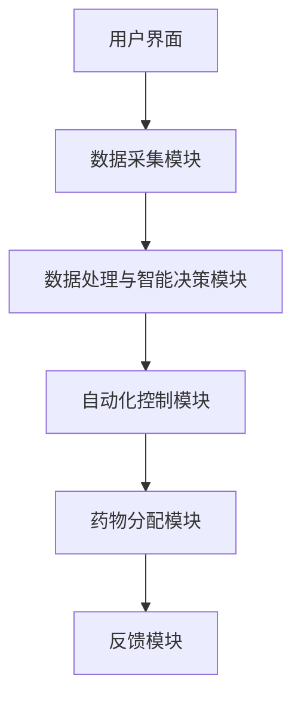

                 

### 文章标题：智能宠物喂药创业：简化宠物医疗护理

智能宠物喂药创业：简化宠物医疗护理

随着人们生活水平的提高，宠物已经成为了许多家庭不可或缺的一部分。然而，宠物的医疗护理问题也随之而来，尤其是给宠物按时喂药。传统的喂药方式不仅繁琐，而且容易导致药物剂量不准确，甚至可能危及宠物的健康。因此，开发一款智能宠物喂药系统，以简化宠物医疗护理，具有重要的现实意义。

本文将围绕智能宠物喂药创业这一主题，首先介绍其背景和意义，然后详细讨论智能宠物喂药系统的设计与实现、运营与管理、技术支持以及市场预测等关键环节。通过这些探讨，我们希望能够为有意在这一领域创业的团队提供一些有价值的指导和建议。

关键词：智能宠物喂药、医疗护理、创业、设计实现、运营管理、技术支持、市场预测

摘要：本文系统性地探讨了智能宠物喂药创业的各个关键环节，包括背景和意义、系统设计与实现、运营与管理、技术支持以及市场预测。通过分析智能宠物喂药技术的应用场景、系统架构、数据处理与智能决策算法，以及实际案例，本文为创业团队提供了实用的技术指南和运营策略。此外，文章还探讨了智能宠物喂药创业的法律与合规、市场需求、竞争对手以及未来发展趋势，为创业者在这一新兴领域的发展提供了全面的支持和参考。

---

### 第一部分：智能宠物喂药创业概述

#### 第1章：智能宠物喂药创业的背景和意义

随着人们对宠物健康的日益关注，宠物医疗护理市场呈现出快速增长的趋势。然而，传统的宠物医疗护理方式存在诸多痛点，尤其是在给宠物按时喂药方面。宠物主人常常面临药物剂量不准确、喂药不及时、药物浪费等问题。这些问题不仅增加了宠物主人的负担，还可能对宠物的健康造成潜在风险。

#### 1.1 宠物医疗护理的现状与挑战

目前，宠物医疗护理市场主要依赖于传统的线下医疗服务和线上电商模式。线下医疗服务主要包括兽医诊所、宠物医院等，它们为宠物主人提供了专业的医疗服务，但由于医疗资源分布不均，许多宠物主人难以获得及时、便捷的医疗护理服务。线上电商模式则通过电商平台提供药品和医疗用品的销售，虽然方便了宠物主人的购买，但仍然无法解决喂药不准确的难题。

#### 1.2 智能宠物喂药技术的应用场景

智能宠物喂药技术的出现为解决宠物医疗护理的痛点提供了新的可能性。智能宠物喂药系统通过自动化、智能化的手段，确保宠物能够按时、按量地服用药物，从而提高了药物的治疗效果，减少了药物浪费，降低了宠物主人的负担。

智能宠物喂药技术的应用场景主要包括以下几个方面：

1. **家庭宠物医疗护理**：智能宠物喂药系统可以安装在家庭中，为宠物主人提供便捷的喂药服务，使宠物主人能够更加轻松地管理宠物的健康状况。

2. **宠物医院和诊所**：智能宠物喂药系统可以集成到宠物医院和诊所中，为宠物提供精准、高效的药物分配和喂药服务，提高医疗机构的运营效率和服务质量。

3. **宠物电商**：智能宠物喂药系统可以与宠物电商平台结合，提供智能化的药品配送和喂药服务，进一步提升电商平台的服务体验和用户粘性。

#### 1.3 创业者在宠物医疗护理行业的机遇与挑战

随着宠物医疗护理市场的不断扩大，创业者在这一领域看到了巨大的商机。智能宠物喂药技术的崛起为创业者提供了新的发展方向和机会。然而，创业者也面临着诸多挑战，如技术难题、市场竞争、法规合规等。

#### 1.3.1 技术难题

智能宠物喂药系统的设计与实现需要涉及多个技术领域，包括传感器技术、自动化控制技术、数据处理与智能决策算法等。创业者需要具备一定的技术背景和研发能力，才能克服这些技术难题。

#### 1.3.2 市场竞争

宠物医疗护理市场已经存在一些知名企业和品牌，创业者需要面对激烈的竞争。如何在众多竞争对手中脱颖而出，成为创业团队需要认真思考的问题。

#### 1.3.3 法规合规

智能宠物喂药系统作为一种新型的医疗器械，需要遵守相关的法规和标准。创业者需要了解并遵循相关法规，确保产品的合规性，以避免法律风险。

#### 1.3.4 运营与管理

智能宠物喂药创业不仅需要技术上的突破，还需要在运营和管理方面具备一定的能力。创业者需要制定有效的商业模式，建立稳定的供应链体系，提供优质的客户服务，以确保企业的可持续发展。

综上所述，智能宠物喂药创业具有巨大的市场潜力和发展前景，但同时也面临着一系列挑战。创业者需要充分了解市场动态，把握行业机遇，通过技术创新和运营管理，实现智能宠物喂药创业的成功。

---

### 第2章：智能宠物喂药系统的设计与实现

智能宠物喂药系统是一个集成了传感器、自动化控制、数据处理与智能决策等多种技术手段的综合系统，其设计实现涉及到多个关键环节。本章将详细讨论智能宠物喂药系统的整体架构、传感器与药物自动分配机制，以及数据处理与智能决策算法。

#### 2.1 智能宠物喂药系统的整体架构

智能宠物喂药系统的整体架构可以分为以下几个主要部分：

1. **用户界面**：用户界面是系统与用户交互的窗口，通过图形用户界面（GUI）或移动应用，用户可以设置宠物信息、药物信息、喂药时间等。

2. **数据采集模块**：数据采集模块负责实时采集宠物的健康数据，如体温、心率、体重等，通过传感器将数据传输到系统中心。

3. **自动化控制模块**：自动化控制模块是实现药物自动分配的核心部分，通过接收数据采集模块传来的数据，根据智能决策算法的指令，控制药物分配器进行药物分配。

4. **数据处理与智能决策模块**：数据处理与智能决策模块负责对采集到的数据进行处理和分析，通过机器学习算法和智能决策算法，预测宠物的健康状况，并给出药物分配的决策。

5. **药物分配模块**：药物分配模块根据智能决策算法的指令，将药物分配到宠物的饲料或水中，确保宠物能够按时、按量地服用药物。

6. **反馈模块**：反馈模块负责将药物分配的结果反馈给用户，如药物是否分配成功、宠物是否服用药物等。

整个智能宠物喂药系统的架构如图1所示：



#### 2.2 传感器与药物自动分配机制

智能宠物喂药系统的核心在于传感器的应用和药物自动分配机制的设计。以下是传感器与药物自动分配机制的详细说明：

1. **传感器**：

   - **体温传感器**：用于实时监测宠物的体温，判断宠物的健康状况。
   - **心率传感器**：用于实时监测宠物的心率，判断宠物的生理状态。
   - **体重传感器**：用于实时监测宠物的体重，评估宠物的健康状况。

2. **药物自动分配机制**：

   - **药物分配器**：药物分配器是智能宠物喂药系统的核心部件，它可以根据宠物的体重、药物剂量和喂药时间，自动将药物分配到宠物的饲料或水中。
   - **智能分配算法**：智能分配算法根据宠物的健康数据，智能决策药物的分配时间、剂量和方式。例如，如果宠物体温升高，智能分配算法可能会增加药物的剂量，或调整药物的分配时间。

   药物自动分配机制的架构如图2所示：

   ```mermaid
   graph TD
       A[传感器数据] --> B[数据处理与智能决策模块]
       B --> C[智能分配算法]
       C --> D[药物分配器]
       D --> E[药物分配结果]
   ```

#### 2.3 数据处理与智能决策算法

数据处理与智能决策算法是智能宠物喂药系统的核心部分，它负责对采集到的宠物健康数据进行处理和分析，并给出药物分配的智能决策。以下是数据处理与智能决策算法的详细说明：

1. **数据采集**：

   智能宠物喂药系统通过传感器实时采集宠物的健康数据，包括体温、心率、体重等。这些数据被传输到数据处理与智能决策模块。

2. **数据处理**：

   数据处理模块对采集到的数据进行清洗、去噪、标准化等处理，确保数据的准确性和一致性。处理后的数据被用于训练机器学习模型。

3. **智能决策算法**：

   - **机器学习算法**：智能决策算法基于机器学习技术，通过分析宠物的健康数据，预测宠物的健康状况，并给出药物分配的建议。常见的机器学习算法包括决策树、随机森林、支持向量机、神经网络等。
   - **智能决策模型**：智能决策模型是智能决策算法的核心，它根据宠物的健康数据，预测宠物的健康状况，并给出药物分配的决策。智能决策模型可以通过训练和优化得到，以提高预测的准确性和可靠性。

   智能决策算法的架构如图3所示：

   ```mermaid
   graph TD
       A[数据采集] --> B[数据处理]
       B --> C[机器学习算法]
       C --> D[智能决策模型]
       D --> E[药物分配决策]
   ```

通过以上设计，智能宠物喂药系统实现了对宠物健康数据的实时监测和智能决策，确保宠物能够按时、按量地服用药物，从而提高了宠物的生活质量，简化了宠物医疗护理的过程。

---

### 第3章：智能宠物喂药创业的实际案例

智能宠物喂药技术作为一项新兴技术，已经在市场上出现了一些成功的案例。通过分析这些成功和失败案例，我们可以从中汲取宝贵的经验与教训，为创业团队提供有价值的参考。

#### 3.1 成功案例分析

**案例一：智能宠物喂药机器人**

某创业公司开发了一款智能宠物喂药机器人，通过传感器实时监测宠物的健康数据，自动化地执行药物分配。这款机器人受到了宠物主人的热烈欢迎，主要原因如下：

1. **用户体验**：智能宠物喂药机器人界面友好，操作简便，宠物主人可以轻松设置喂药时间和药物剂量。

2. **技术先进**：公司采用了先进的机器学习和数据分析技术，确保药物分配的准确性和智能化。

3. **市场定位**：公司准确抓住了宠物医疗护理市场的需求，将产品定位于中高端市场，提供高品质、高附加值的智能喂药服务。

**案例二：宠物医院与智能喂药系统的集成**

某宠物医院引入了智能宠物喂药系统，将其集成到医院的管理系统中。通过这一系统，宠物医院能够更高效地管理宠物的药物分配，提高医疗服务质量。该案例的成功原因主要包括：

1. **效率提升**：智能宠物喂药系统自动化了药物的分配和监控，减少了人工操作的错误率，提高了工作效率。

2. **服务质量**：智能宠物喂药系统确保了宠物能够按时、按量地服用药物，提高了治疗的成功率。

3. **用户反馈**：宠物主人对智能宠物喂药系统的反馈积极，认为这种技术能够更好地管理宠物的健康，减少了他们的负担。

#### 3.2 失败案例分析

**案例一：产品功能过于复杂**

某创业团队开发了一款功能丰富的智能宠物喂药系统，但由于产品功能过于复杂，导致用户使用门槛高，用户体验不佳。以下是该案例的失败原因：

1. **功能过剩**：产品试图提供过多的功能，导致界面复杂，用户难以理解和使用。

2. **用户体验不佳**：由于功能复杂，用户在使用过程中容易出现错误，导致用户体验不佳。

3. **市场定位不准**：创业团队没有准确把握市场需求，将产品定位在中低端市场，而中低端市场的用户对产品的功能需求不高，导致产品市场接受度低。

**案例二：缺乏市场需求分析**

某创业公司开发了一款智能宠物喂药系统，但由于缺乏对市场需求的分析，导致产品未能满足用户的核心需求。该案例的失败原因主要包括：

1. **市场研究不足**：创业团队没有进行充分的市场研究，不了解用户对智能宠物喂药系统的真实需求。

2. **产品定位不准确**：产品未能针对特定的用户群体进行定位，导致产品无法满足用户的特定需求。

3. **市场推广不足**：创业团队在产品上市后，未能进行有效的市场推广，导致产品知名度低，市场接受度不高。

#### 3.3 从案例中汲取的经验与教训

通过对以上成功和失败案例的分析，我们可以得出以下经验和教训：

1. **准确把握市场需求**：创业团队在开发智能宠物喂药系统时，应充分进行市场研究，了解用户对产品的核心需求，确保产品功能与市场需求相匹配。

2. **注重用户体验**：产品界面应简洁易用，降低用户使用门槛，提高用户体验。

3. **技术先进性**：采用先进的机器学习和数据分析技术，提高产品的智能化水平，满足用户的多样化需求。

4. **市场定位准确**：根据市场需求，将产品定位在适当的细分市场，提供有针对性的解决方案。

5. **市场推广与反馈**：在产品上市后，进行有效的市场推广，收集用户反馈，不断优化产品，提升用户满意度。

通过汲取这些经验和教训，创业团队可以更好地应对智能宠物喂药创业中的挑战，提高产品的市场竞争力，实现创业成功。

---

### 第二部分：智能宠物喂药创业的运营与管理

#### 第4章：智能宠物喂药创业的商业模式

在智能宠物喂药创业过程中，商业模式的设计至关重要。一个成功的商业模式不仅能够为创业团队带来稳定的收入来源，还能帮助企业在激烈的市场竞争中立于不败之地。本章将详细探讨智能宠物喂药创业的商业模式，包括收入来源与盈利模式、客户关系管理以及市场推广策略。

#### 4.1 收入来源与盈利模式

智能宠物喂药创业的收入来源和盈利模式可以从以下几个方面进行设计：

1. **设备销售**：创业团队可以销售智能宠物喂药设备，包括智能宠物喂药机、传感器等硬件产品。通过设备销售，企业可以获得初始收入。

2. **订阅服务**：企业可以提供订阅服务，用户按月或按年支付订阅费用，享受智能宠物喂药系统提供的实时监测、智能决策和远程控制等服务。这种模式可以为企业提供持续的收入流。

3. **增值服务**：创业团队可以提供增值服务，如宠物健康咨询、疾病预防指导、定期体检预约等。这些服务可以为用户提供额外的价值，同时为企业带来额外的收入。

4. **广告与推广**：通过与宠物相关的内容平台、宠物用品品牌合作，企业可以在智能宠物喂药系统中植入广告，为用户提供定制化的广告内容。此外，企业还可以通过举办宠物健康讲座、宠物展览等活动，扩大品牌影响力，吸引潜在客户。

5. **联合营销**：企业可以与宠物医院、宠物用品店等合作伙伴开展联合营销活动，通过互相推广，提高双方的客户转化率和销售额。

#### 4.2 客户关系管理

客户关系管理（CRM）是智能宠物喂药创业成功的关键之一。以下是一些有效的客户关系管理策略：

1. **建立客户数据库**：企业应建立全面的客户数据库，包括客户的基本信息、购买记录、使用反馈等。通过分析客户数据，企业可以更好地了解客户需求，提供个性化的服务和产品推荐。

2. **客户细分**：根据客户的需求、购买行为和使用反馈，对客户进行细分，为不同类型的客户提供定制化的解决方案和优惠活动。例如，可以将客户分为新用户、老用户、高价值用户等，针对不同类型的客户制定差异化的营销策略。

3. **定期沟通**：企业应定期与客户进行沟通，了解客户的使用体验和反馈。通过邮件、短信、社交媒体等渠道，企业可以及时回应客户的问题和需求，提高客户满意度。

4. **客户关怀**：企业可以通过节日问候、生日祝福、优惠券等方式，对客户进行关怀和激励。这种人性化的客户关怀可以增强客户对品牌的忠诚度，促进客户复购。

5. **客户反馈机制**：建立有效的客户反馈机制，鼓励客户提出意见和建议。企业应认真对待客户的反馈，及时进行改进，以提升产品和服务质量。

#### 4.3 市场推广策略

在智能宠物喂药市场中，企业需要采取有效的市场推广策略，以提高品牌知名度，吸引潜在客户。以下是一些市场推广策略：

1. **线上推广**：利用社交媒体平台、内容营销、搜索引擎优化（SEO）等线上渠道，提高品牌的在线曝光度。通过发布有趣、实用的宠物健康知识、使用技巧等，吸引宠物主人的关注。

2. **线下推广**：参加宠物展会、宠物沙龙、宠物医院巡展等活动，直接与宠物主人面对面交流，展示智能宠物喂药系统的优势和应用场景。

3. **合作推广**：与宠物医院、宠物用品店、宠物社交平台等合作伙伴开展联合推广活动，通过互相宣传，扩大品牌影响力。

4. **口碑营销**：鼓励用户在社交媒体上分享使用智能宠物喂药系统的体验，通过用户的口碑传播，提高品牌知名度和信誉度。

5. **促销活动**：定期举办促销活动，如限时折扣、买赠活动、积分兑换等，吸引宠物主人购买智能宠物喂药设备和服务。

通过以上商业模式、客户关系管理和市场推广策略的设计和实施，智能宠物喂药创业团队可以更好地把握市场机遇，提高企业的竞争力，实现可持续发展。

---

### 第5章：智能宠物喂药创业的法律与合规

在智能宠物喂药创业过程中，遵守相关法律法规是确保企业合规运营和产品安全的重要保障。本章将探讨智能宠物喂药创业中涉及的主要法律和合规问题，包括产品安全与质量控制、隐私保护与数据安全，以及行业法规与合规要求。

#### 5.1 产品安全与质量控制

智能宠物喂药系统作为一种医疗器械，其产品安全与质量控制至关重要。以下是一些关键点：

1. **产品注册**：在产品上市前，企业需要向相关监管机构申请产品注册。注册过程中，需要提交详细的产品技术资料、安全性测试报告和临床试验结果等。

2. **质量控制体系**：企业应建立完善的质量控制体系，包括原材料采购、生产过程、成品检测等各个环节。确保产品质量符合相关标准和要求。

3. **安全性测试**：智能宠物喂药系统需要进行多项安全性测试，如电气安全测试、生物相容性测试、药物释放测试等。确保产品在使用过程中不会对宠物造成危害。

4. **售后服务**：企业应提供优质的售后服务，包括产品安装、使用培训、维修和保养等。确保用户能够正确、安全地使用产品。

#### 5.2 隐私保护与数据安全

智能宠物喂药系统涉及大量宠物健康数据和用户个人信息，隐私保护和数据安全是企业的核心任务。以下是一些关键措施：

1. **数据加密**：对存储和传输的宠物健康数据和个人信息进行加密，确保数据在未经授权的情况下无法被访问和篡改。

2. **访问控制**：建立严格的访问控制机制，确保只有授权人员才能访问敏感数据。对数据访问进行审计，记录并监控所有访问操作。

3. **数据备份与恢复**：定期备份数据，确保在数据丢失或损坏的情况下能够迅速恢复。

4. **安全培训**：对员工进行数据安全和隐私保护的培训，提高员工的安全意识和操作规范。

5. **安全评估**：定期进行安全评估和渗透测试，发现并修复潜在的安全漏洞。

#### 5.3 行业法规与合规要求

智能宠物喂药创业需要遵守一系列行业法规和合规要求，以下是一些关键法规：

1. **医疗器械监督管理条例**：企业应遵守《医疗器械监督管理条例》，确保产品符合法规要求。

2. **个人信息保护法**：企业应遵守《个人信息保护法》，保护用户个人信息的安全和隐私。

3. **数据安全法**：企业应遵守《数据安全法》，确保数据的安全性和完整性。

4. **网络安全法**：企业应遵守《网络安全法》，确保网络系统的安全性，防范网络攻击和数据泄露。

5. **药品管理法**：智能宠物喂药系统中的药物分配功能需要遵守《药品管理法》，确保药物的安全性和合规性。

通过遵守以上法律法规和合规要求，智能宠物喂药创业企业可以确保产品安全、数据安全和合规运营，为用户提供优质、安全的服务。

---

### 第6章：智能宠物喂药创业的市场分析与预测

智能宠物喂药创业市场的快速崛起，不仅吸引了众多创业者的关注，也引发了市场分析专家的深入探讨。本章将通过对市场需求与市场规模、竞争对手分析以及未来发展趋势的详细讨论，为创业者提供全面的市场分析。

#### 6.1 市场需求与市场规模

随着宠物经济的蓬勃发展，宠物医疗护理市场需求逐年攀升。智能宠物喂药系统作为创新解决方案，得到了宠物主人的广泛认可和接受。以下是市场需求与市场规模的分析：

1. **宠物数量的增长**：全球宠物数量持续增长，特别是城市化进程加速，宠物已经成为许多家庭的重要成员。宠物数量的增加直接推动了宠物医疗护理市场的需求。

2. **宠物主人对健康管理的重视**：越来越多的宠物主人开始重视宠物的健康，愿意投入更多的时间和金钱来确保宠物的健康和幸福。智能宠物喂药系统可以帮助宠物主人更方便地管理宠物的健康状况，提高了用户的满意度。

3. **市场规模**：据市场研究机构的统计，全球宠物医疗护理市场规模持续扩大。智能宠物喂药系统作为其中的重要细分市场，预计将在未来几年内保持高速增长。预计到2025年，全球智能宠物喂药市场规模将达到数十亿美元。

4. **区域市场差异**：不同地区的市场需求和市场规模存在一定差异。发达国家如美国、欧洲等地，宠物医疗护理市场相对成熟，智能宠物喂药系统的接受度和市场规模较高。而在新兴市场如中国、印度等地，随着宠物数量的增加和人们生活水平的提高，智能宠物喂药市场具有巨大的增长潜力。

#### 6.2 竞争对手分析

智能宠物喂药市场虽然处于快速发展阶段，但也面临着激烈的竞争。以下是对主要竞争对手的分析：

1. **传统宠物医院和诊所**：传统的宠物医院和诊所是宠物医疗护理市场的主力军，它们拥有丰富的医疗资源和专业的医疗服务。智能宠物喂药系统的出现，对传统宠物医疗机构构成了一定的挑战。

2. **线上宠物药店**：随着电子商务的兴起，线上宠物药店快速发展，提供了便捷的药品购买渠道。智能宠物喂药系统与线上宠物药店的合作，可以进一步拓宽市场渠道，提高用户满意度。

3. **国内外初创企业**：国内外许多初创企业纷纷进入智能宠物喂药市场，通过技术创新和商业模式创新，推出具有竞争力的产品。这些初创企业在产品设计、用户体验、智能化程度等方面，具有一定的竞争优势。

4. **大型科技公司**：一些大型科技公司如谷歌、亚马逊等，也进入宠物医疗护理市场，通过自主研发或并购方式，推出智能宠物喂药产品。这些企业具有强大的技术实力和市场资源，对市场格局产生了深远影响。

#### 6.3 未来发展趋势与预测

智能宠物喂药市场未来发展趋势如下：

1. **技术创新**：随着人工智能、物联网、大数据等技术的不断进步，智能宠物喂药系统将越来越智能化、个性化。未来，智能宠物喂药系统可能会集成更多的健康监测功能，如智能监测宠物的心率、血压、血糖等。

2. **市场细分**：智能宠物喂药市场将出现更多的细分市场，如针对老年宠物、宠物疾病管理的专用智能喂药系统。同时，宠物医院和诊所与智能宠物喂药系统的深度融合，也将进一步拓宽市场空间。

3. **国际化发展**：随着全球化进程的加快，智能宠物喂药市场将呈现国际化发展趋势。国内企业将积极拓展国际市场，国外企业也将进入国内市场，形成竞争与合作并存的市场格局。

4. **政策支持**：随着宠物医疗护理行业的发展，各国政府将加大对宠物医疗护理行业的支持力度，出台相关政策，鼓励技术创新和产业发展。

综上所述，智能宠物喂药创业市场前景广阔，但同时也面临诸多挑战。创业者应准确把握市场机遇，通过技术创新、市场细分和国际化发展，实现智能宠物喂药创业的成功。

---

### 第三部分：智能宠物喂药创业的技术支持

#### 第7章：人工智能与宠物医疗护理的结合

人工智能（AI）技术的发展为宠物医疗护理领域带来了全新的变革。通过将人工智能技术与宠物医疗护理相结合，可以为宠物主人提供更加精准、高效和便捷的医疗服务。本章将探讨人工智能在宠物医疗护理中的应用，包括机器学习算法与宠物健康数据分析，以及智能宠物喂药的算法原理与实现。

#### 7.1 人工智能在宠物医疗护理中的应用

人工智能在宠物医疗护理中的应用主要表现在以下几个方面：

1. **疾病预测与诊断**：通过机器学习算法，可以对宠物的健康数据进行实时分析和预测，识别潜在的疾病风险。例如，利用深度学习模型分析宠物的心电图数据，预测宠物是否患有心脏病。

2. **个性化治疗建议**：根据宠物的健康状况和病史，人工智能系统可以生成个性化的治疗建议，优化治疗方案。例如，针对宠物的体重、年龄和健康状况，推荐最适合的饮食和运动计划。

3. **药物分配与监控**：人工智能系统可以根据宠物的健康状况和药物反应，智能调整药物剂量和分配时间，确保宠物能够按时、按量地服用药物。同时，系统还可以实时监控药物的分配过程，确保药物安全有效地到达宠物体内。

4. **健康数据分析**：通过对大量宠物的健康数据进行收集和分析，人工智能系统可以识别出健康问题的趋势和规律，为疾病预防和控制提供数据支持。

5. **远程医疗服务**：通过人工智能和物联网技术，宠物主人可以远程监控宠物的健康状况，与兽医进行在线咨询和诊断，提高医疗服务的便捷性和效率。

#### 7.2 机器学习算法与宠物健康数据分析

机器学习算法在宠物健康数据分析中发挥了重要作用。以下是几种常见的机器学习算法及其在宠物医疗护理中的应用：

1. **监督学习算法**：监督学习算法通过已标记的数据集进行训练，从而学会对新的数据进行分类或回归。在宠物医疗护理中，监督学习算法可以用于疾病预测和诊断。例如，利用已标记的宠物健康数据训练分类模型，预测宠物是否患有特定疾病。

2. **无监督学习算法**：无监督学习算法在没有标记数据的情况下，通过分析数据之间的模式，发现数据中的隐藏结构。在宠物医疗护理中，无监督学习算法可以用于聚类分析，识别出具有相似特征的宠物群体，为疾病预防和控制提供数据支持。

3. **深度学习算法**：深度学习算法通过构建多层神经网络，对大量数据进行分析和学习，从而实现复杂的模式识别和预测。在宠物医疗护理中，深度学习算法可以用于图像识别、语音识别和自然语言处理等应用。例如，利用深度学习模型分析宠物的心电图数据，预测宠物是否患有心脏病。

#### 7.3 智能宠物喂药的算法原理与实现

智能宠物喂药算法的核心在于如何根据宠物的健康状况和药物反应，智能调整药物剂量和分配时间。以下是智能宠物喂药算法的原理与实现：

1. **药物分配策略**：智能宠物喂药系统可以根据宠物的体重、年龄、健康状况和药物类型，制定合理的药物分配策略。例如，针对体重较轻的宠物，可以降低药物剂量，避免药物过量。

2. **剂量调整算法**：智能宠物喂药系统可以通过机器学习算法，分析宠物的药物反应，智能调整药物剂量。例如，如果宠物在服用某种药物后出现不良反应，系统可以减少该药物的剂量，或者调整药物的使用频率。

3. **分配时间优化**：智能宠物喂药系统可以根据宠物的作息习惯和药物特性，优化药物分配时间。例如，如果宠物在夜间较为活跃，系统可以将药物分配时间调整至夜间，确保宠物能够更好地吸收药物。

4. **实时监控与反馈**：智能宠物喂药系统可以实时监控药物的分配过程，包括药物是否成功分配、宠物是否服药等。如果出现异常情况，系统可以及时发出警报，提醒宠物主人进行处理。

5. **数据驱动的智能决策**：智能宠物喂药系统通过收集和分析宠物的健康数据，结合机器学习算法，实现数据驱动的智能决策。例如，通过分析宠物的体温、心率等数据，系统可以判断宠物是否需要调整药物剂量或分配时间。

通过以上算法原理与实现，智能宠物喂药系统可以为宠物主人提供更加精准、高效的宠物医疗护理服务，提高宠物的生活质量。

---

### 第8章：开源技术与智能宠物喂药创业

开源技术作为现代软件开发的核心驱动力，在智能宠物喂药创业中同样发挥着重要作用。开源技术不仅降低了开发成本，提高了开发效率，还为创业者提供了丰富的技术资源和社区支持。本章将探讨开源技术在智能宠物喂药创业中的应用，包括开源软件与智能宠物喂药系统的集成，以及开源项目的管理与维护。

#### 8.1 开源技术在智能宠物喂药创业中的应用

智能宠物喂药创业涉及多个技术领域，包括传感器数据处理、自动化控制、机器学习算法等。以下是一些在智能宠物喂药创业中常用的开源技术：

1. **操作系统**：Linux操作系统因其稳定性、安全性和开源特性，成为智能宠物喂药系统开发的首选。常见的Linux发行版如Ubuntu、Fedora等，为开发者提供了丰富的软件包和社区支持。

2. **编程语言**：Python、Java、C++等编程语言在智能宠物喂药创业中广泛应用。Python因其简洁、易学易用，成为数据处理、机器学习等领域的首选语言。Java和C++则因其性能优越，适用于实时控制和硬件集成等场景。

3. **数据库**：MySQL、PostgreSQL等开源数据库在智能宠物喂药系统中用于存储和管理宠物健康数据。NoSQL数据库如MongoDB、Cassandra等，适用于大规模数据存储和快速查询。

4. **机器学习框架**：TensorFlow、PyTorch、Scikit-learn等开源机器学习框架为智能宠物喂药系统提供了强大的算法支持。这些框架包含了丰富的算法库和工具，可以快速实现复杂的机器学习任务。

5. **物联网平台**：物联网平台如MQTT、CoAP等，用于智能宠物喂药系统中的设备通信和数据传输。这些平台支持设备间的低延迟、高可靠性的通信，确保系统正常运行。

6. **开源硬件**：Arduino、Raspberry Pi等开源硬件在智能宠物喂药系统中广泛应用。这些硬件具有良好的兼容性、可扩展性和低成本特性，适合开发者和创业者进行原型设计和实验。

#### 8.2 开源软件与智能宠物喂药系统的集成

开源软件与智能宠物喂药系统的集成是智能宠物喂药创业的核心任务之一。以下是一些关键步骤：

1. **需求分析**：首先，明确智能宠物喂药系统的功能需求，包括数据采集、处理、存储、分析、决策和反馈等环节。根据需求分析，选择合适的开源软件进行集成。

2. **软件选择**：根据需求分析，选择适合的开源软件。例如，可以选择Python作为主要编程语言，TensorFlow或PyTorch作为机器学习框架，MySQL或MongoDB作为数据库。

3. **软件安装与配置**：安装并配置所选开源软件。在Linux操作系统上，可以使用包管理器（如apt、yum）进行软件安装。安装完成后，进行软件配置，确保各个组件可以正常运行。

4. **系统集成**：将所选开源软件集成到智能宠物喂药系统中。例如，将TensorFlow集成到数据处理和智能决策模块，将MySQL集成到数据存储和查询模块。在集成过程中，需要确保各个组件之间的通信和数据交换。

5. **测试与优化**：在系统集成完成后，进行全面的测试，确保系统功能正常运行。测试过程中，可以优化软件配置和系统性能，提高系统的稳定性和效率。

#### 8.3 开源项目的管理与维护

开源项目的管理与维护是智能宠物喂药创业成功的关键。以下是一些关键点：

1. **版本控制**：使用版本控制系统（如Git）进行项目管理和代码管理。版本控制可以帮助团队协作，追踪代码变更，确保代码的稳定性和可靠性。

2. **文档编写**：编写详细的文档，包括项目概述、功能描述、安装配置指南、使用手册等。良好的文档可以为开发者和用户提供清晰的指导，提高项目的影响力。

3. **社区互动**：积极参与开源社区，与其他开发者交流经验，分享项目成果。社区互动可以吸引更多开发者参与项目，提高项目的知名度和影响力。

4. **代码审查**：定期进行代码审查，确保代码质量。代码审查可以帮助发现潜在的错误和漏洞，提高代码的可维护性和可读性。

5. **持续集成与部署**：使用持续集成和部署工具（如Jenkins、Travis CI），实现自动化构建、测试和部署。持续集成和部署可以提高开发效率，确保项目的稳定性和可靠性。

6. **安全维护**：定期更新开源软件和依赖库，修复已知的安全漏洞。安全维护可以确保项目的安全性，保护用户的隐私和数据安全。

通过以上开源项目的管理与维护，智能宠物喂药创业团队可以确保项目的可持续发展，为用户提供优质的智能宠物喂药服务。

---

### 第9章：智能宠物喂药创业的持续创新

智能宠物喂药创业领域的持续创新是推动行业发展、提升产品竞争力的关键。本章将探讨持续创新的重要性、创新策略与实践，以及如何营造持续创新的企业文化。

#### 9.1 技术创新的重要性

在智能宠物喂药创业中，技术创新是核心竞争力之一。通过持续的技术创新，创业团队能够不断提高产品的智能化水平，满足用户不断变化的需求。以下是一些技术创新的重要性：

1. **提高产品竞争力**：技术创新可以帮助创业团队开发出更具优势的产品，提高市场竞争力。例如，通过引入先进的传感器技术和机器学习算法，智能宠物喂药系统可以实现更精确的药物分配和健康监测。

2. **增强用户体验**：技术创新可以提升产品的用户体验，提高用户满意度。例如，通过优化用户界面和操作流程，使宠物主人能够更方便地使用智能宠物喂药系统，提高用户的依赖性和忠诚度。

3. **开拓新市场**：技术创新可以帮助创业团队开拓新的市场机会。例如，通过开发适用于不同宠物类型和不同健康状况的智能喂药产品，可以吸引更多潜在用户，扩大市场份额。

4. **降低运营成本**：技术创新可以提高生产效率，降低运营成本。例如，通过引入自动化生产线和智能化管理工具，可以减少人力成本，提高生产效率，提升企业的盈利能力。

#### 9.2 创新策略与实践

为了实现持续创新，创业团队需要制定有效的创新策略和实践。以下是一些具体的创新策略与实践：

1. **市场调研与需求分析**：定期进行市场调研，了解用户需求和行业趋势。通过需求分析，发现潜在的创新机会，为技术创新提供方向。

2. **技术研发与试验**：投入充足的研发资源，鼓励团队成员进行技术研发和试验。通过实验验证技术的可行性和有效性，为创新产品提供技术支持。

3. **合作与交流**：积极与其他企业和研究机构合作，共享技术和资源。通过合作与交流，获取新的技术和市场信息，促进创新成果的转化和应用。

4. **用户参与**：鼓励用户参与产品设计和开发过程，收集用户的反馈和建议。通过用户参与，可以更好地满足用户需求，提升产品价值。

5. **持续迭代与优化**：对现有产品进行持续迭代和优化，不断改进产品的性能和用户体验。通过持续优化，提高产品的市场竞争力。

6. **创新激励机制**：建立创新激励机制，鼓励团队成员提出创新想法和解决方案。通过奖励和创新收益分配，激发团队成员的积极性和创造力。

#### 9.3 持续创新的企业文化

营造持续创新的企业文化是智能宠物喂药创业成功的关键。以下是一些关键措施：

1. **创新氛围**：营造宽松、开放的创新氛围，鼓励团队成员自由探讨、分享创新想法。通过定期举办创新论坛、研讨会等活动，激发员工的创新潜力。

2. **人才培养**：注重人才培养，鼓励员工学习和掌握新技术。通过内部培训、外部培训、学术交流等方式，提升员工的技术能力和创新意识。

3. **激励机制**：建立完善的激励机制，对在技术创新和项目推进中表现突出的员工进行奖励。通过奖励和创新收益分配，激发员工的积极性和创造力。

4. **风险容忍**：鼓励员工勇于承担创新风险，允许失败和失误。通过建立容错机制，降低创新过程中的风险，激发员工的创新勇气。

5. **团队协作**：倡导团队协作，鼓励员工跨部门、跨领域合作。通过团队合作，实现资源的共享和优势互补，提高创新效率。

通过以上措施，智能宠物喂药创业团队可以营造良好的创新氛围，激发员工的创新潜力，推动企业的持续创新发展。

---

### 附录A：智能宠物喂药创业相关的开源资源和工具

在智能宠物喂药创业过程中，开源资源和工具为开发者提供了丰富的技术支持，降低了开发成本，提高了开发效率。以下是一些常用的开源机器学习框架、开源数据集和开源社区，以及它们在智能宠物喂药创业中的应用。

#### A.1 开源机器学习框架

1. **TensorFlow**

   TensorFlow是一个由Google开源的机器学习框架，广泛应用于各种机器学习任务，包括图像识别、自然语言处理和强化学习等。在智能宠物喂药创业中，TensorFlow可以用于宠物健康数据分析、疾病预测和药物分配决策等任务。

2. **PyTorch**

   PyTorch是由Facebook开源的机器学习框架，以其灵活性和动态计算图著称。在智能宠物喂药创业中，PyTorch可以用于实时监测宠物健康数据、训练预测模型和优化药物分配策略。

3. **Scikit-learn**

   Scikit-learn是一个简单易用的Python机器学习库，提供了丰富的分类、回归、聚类和降维算法。在智能宠物喂药创业中，Scikit-learn可以用于数据处理、特征提取和模型评估等任务。

#### A.2 宠物医疗护理相关的开源数据集

1. **Kaggle宠物医疗数据集**

   Kaggle是一个大型数据集共享平台，提供了许多与宠物医疗护理相关的数据集。这些数据集包含了宠物的健康数据、病历记录和药物信息等，可以用于机器学习模型的训练和验证。

2. **PetHealthData**

   PetHealthData是一个开源的宠物健康数据集，包含了宠物的体温、心率、体重等生理指标，以及疾病的诊断结果和药物使用记录。这些数据集可以用于开发智能宠物喂药系统的数据预处理和模型训练。

#### A.3 开源社区与资源

1. **GitHub**

   GitHub是一个全球最大的开源代码托管平台，许多与智能宠物喂药创业相关的项目都托管在GitHub上。通过GitHub，开发者可以获取开源代码、报告问题、参与贡献，加速项目的开发和改进。

2. **AI社区论坛**

   AI社区论坛是一个聚集了众多人工智能开发者的在线社区，提供了丰富的技术讨论、项目分享和资源推荐。开发者可以在AI社区论坛上交流经验、解决问题，获取最新的技术动态。

3. **知乎**

   知乎是一个知识分享平台，许多与智能宠物喂药创业相关的讨论和分享都出现在知乎上。开发者可以通过知乎了解行业趋势、学习最佳实践，以及获取创业指导和建议。

通过利用这些开源资源和工具，智能宠物喂药创业团队可以更高效地开发产品，加速项目的推进，提高市场竞争力。

---

### 总结

智能宠物喂药创业领域正处于快速发展阶段，随着人工智能、物联网等技术的不断进步，市场前景广阔。创业团队在开展智能宠物喂药创业时，应关注以下几个关键方面：

1. **技术创新**：持续推动技术创新，提高产品的智能化水平和用户体验。

2. **市场需求**：深入了解市场需求，准确把握用户需求，提供个性化、定制化的解决方案。

3. **数据安全**：确保数据安全与隐私保护，遵守相关法律法规，为用户提供安全的喂药服务。

4. **商业模式**：设计合理的商业模式，实现可持续发展，为创业团队带来稳定的收入来源。

5. **市场推广**：采取有效的市场推广策略，提高品牌知名度，吸引更多潜在用户。

6. **合作与交流**：积极与其他企业、研究机构和开发者合作，共享资源，共同推动行业的发展。

通过在以上方面下功夫，创业团队可以在智能宠物喂药领域取得成功，为宠物主人和宠物提供优质的医疗服务。同时，我们也期待看到更多创新者和创业者在智能宠物喂药领域脱颖而出，共同推动行业的发展。

